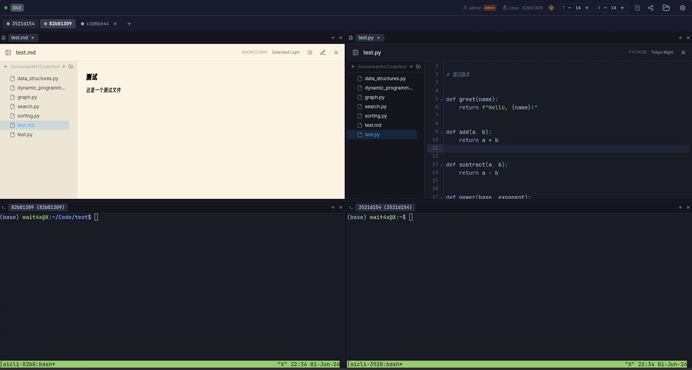
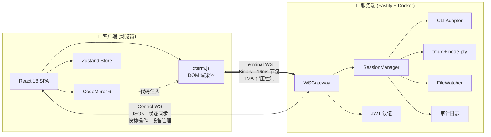
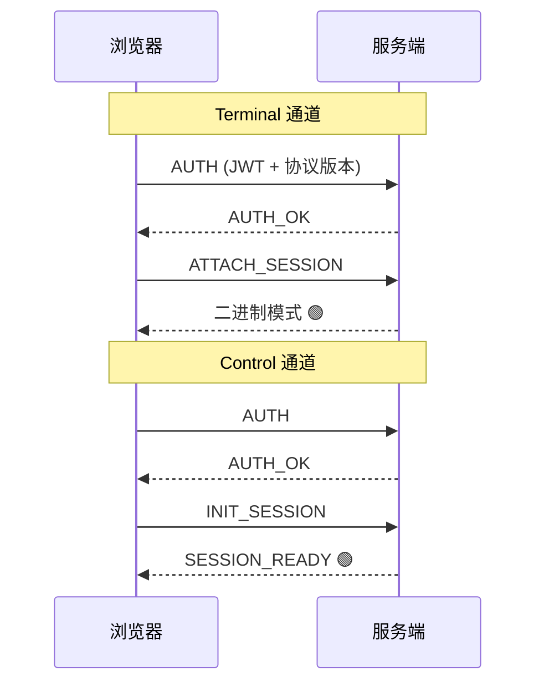

<p align="center">
  
</p>

<h1 align="center">AI CLI</h1>

<p align="center">
  <b><i>你的终端何必要用电脑？</i></b>
</p>

---

<p align="center">
  在手机或平板上运行 AI 编程助手 — Claude Code、Aider 或任何终端工具，<br>封装为一个响应式 Web IDE，支持分屏编辑、文件浏览和实时协作。
</p>

<p align="center">
  <a href="https://github.com/wait4xx/AI-CLI/blob/main/LICENSE"></a>
  <a href="https://www.typescriptlang.org/"></a>
  <a href="https://react.dev/"></a>
  <a href="https://fastify.dev/"></a>
</p>

<p align="center">
  <a href="https://github.com/wait4xx/AI-CLI/stargazers"></a>
  <a href="https://github.com/wait4xx/AI-CLI/network/members"></a>
</p>

<p align="center">
  <a href="README_en.md">English</a> | <b>简体中文</b>
</p>

---

## 功能特性

- **Web 终端 IDE** — 通过 xterm.js 在移动端/桌面浏览器中使用完整终端，支持自定义 tmux 同步滚动条
- **混合对话视图** — 同一条 Claude Code 对话可在「终端视图」与「对话视图」之间切换；对话视图以 headless `claude -p` stream-json 渲染 markdown 气泡 + 结构化工具卡片，支持探索(只读)/编辑(提权)两档权限
- **多会话标签页** — 并排运行多个 CLI 会话，即时切换，支持 tmux 连接和 pane 管理
- **分屏编辑器** — 拖拽调整分屏面板；CodeMirror 6 代码编辑器支持按主题切换语法高亮
- **多用户** — 管理员/普通用户角色，用户管理界面，按会话设备追踪，观察者模式实现只读共享，会话共享
- **文件浏览器** — 浏览、阅读和编辑文件，支持 CWD 追踪、路径自动补全、Diff 查看器和原子写入
- **CLI 适配器** — 可插拔的 Claude Code、Aider 及任何终端工具适配系统
- **移动端优化** — 自定义 IME/CJK 键盘适配器，捏合缩放字体，长按粘贴
- **安全** — JWT 认证，路径遍历防护，输入校验，原子写入，审计日志，seccomp 沙箱
- **离线可用** — 终端屏幕缓存，PWA 自动更新支持
- **Docker 部署** — 多阶段构建 + seccomp 配置文件，一条命令部署

<p align="center">
  
</p>

## 快速开始

### 开发环境

```bash
git clone https://github.com/wait4xx/AI-CLI.git
cd AI-CLI

# 一键配置（检测依赖、生成 .env、安装依赖）
bash scripts/dev.sh

# 或手动分步执行
bash scripts/check-deps.sh    # 检测前置依赖
pnpm install                  # 安装依赖
cp .env.example .env          # 配置环境变量
pnpm dev                      # 启动开发服务器
```

打开 `http://localhost:5173`，使用 `.env` 中的管理员账号密码登录。

> 本地开发模式下，终端和文件浏览器直接操作物理机的文件系统。建议将 `.env` 中的 `PROJECT_ROOT` 设置为你常用的项目目录（默认为 `/workspace`），设为 `/` 可访问整个文件系统（受限于运行用户的系统权限）：
>
> ```bash
> PROJECT_ROOT=/home/youruser/projects
> # 或访问所有文件
> PROJECT_ROOT=/
> ```
>
> **开发环境 vs 生产环境：**
>
> | 环境                       | 前端                      | 后端 API / WebSocket | 防火墙需开放                 | 热更新     |
> | -------------------------- | ------------------------- | -------------------- | ---------------------------- | ---------- |
> | 开发 (`pnpm dev`)          | Vite `:5173`              | Fastify `:18333`     | 两个端口（`5173` + `18333`） | 支持 (HMR) |
> | 生产 (`pnpm build` 后运行) | Fastify 统一提供 `:18333` | 同左                 | 一个端口（`18333`）          | 不支持     |
>
> 开发环境下，Vite 在 `:5173` 提供前端服务，并将 API/WS 请求代理到 `:18333` 的后端。生产环境下，后端同时提供构建后的前端文件和 API 服务，只需开放 `:18333` 一个端口即可让外部设备访问。

### 生产环境（物理机）

```bash
git clone https://github.com/wait4xx/AI-CLI.git
cd AI-CLI

# 一键部署（复制到 /opt/ai-cli、构建、创建 systemd 服务）
sudo bash scripts/prod.sh

# 或指定安装目录
sudo bash scripts/prod.sh /opt/ai-cli
```

### Docker 部署

```bash
cd docker
cp ../.env.example .env
# 编辑 .env
docker compose up -d app
```

容器默认在宿主机 **18333** 端口提供服务（可在 `.env` 中通过 `PORT` 变量覆盖）。

> **注意：** 默认配置使用 Docker named volume（`workspace-data`），终端和文件浏览器操作的是容器内的独立环境。如需操作物理机上的项目目录，请在 `docker-compose.yml` 中将 volume 挂载改为绑定物理机路径，例如：
>
> ```yaml
> volumes:
>   - /home/youruser/projects:/workspace # 替代 workspace-data:/workspace
> ```

生产环境建议配置反向代理和 TLS 终止 — 参见下方 [HTTPS / TLS](#https--tls) 章节。

## 架构



**双通道 WebSocket** 将终端 I/O 与控制消息分离：

| 通道     | 传输方式 | 用途                                         |
| -------- | -------- | -------------------------------------------- |
| Terminal | Binary   | PTY I/O，16ms 节流 + 1MB 背压控制            |
| Control  | JSON     | 认证、状态同步、窗口缩放、快捷操作、设备管理 |

**连接流程：**



关闭码：`4001` = 认证失败（触发 token 刷新），`4002` = 协议不匹配（触发页面重载）

## 技术栈

| 层级     | 技术                                                                                 |
| -------- | ------------------------------------------------------------------------------------ |
| 后端     | Node.js 22、Fastify 5、node-pty、tmux、zod                                           |
| 前端     | React 18、Vite 8、xterm.js（DOM 渲染器 + 自定义 tmux 滚动条）、CodeMirror 6、Zustand |
| 认证     | JWT 双 token（access 15 分钟 + refresh 7 天）、bcrypt                                |
| 移动端   | 自定义键盘适配器（IME/CJK）、手势处理（捏合缩放、长按粘贴）                          |
| 基础设施 | Docker 多阶段构建、seccomp、GitHub Actions CI/CD                                     |
| 测试     | Vitest（单元/集成测试）、Playwright（E2E 测试）、React Testing Library               |

## 项目结构

```
AI-CLI/
├── apps/
│   ├── server/                # Fastify 后端
│   │   └── src/
│   │       ├── core/          # SessionManager, WSGateway, FileWatcher, 审计日志
│   │       ├── routes/        # auth, terminal, control, fs（JSON Schema 校验）
│   │       ├── adapters/      # CLI 适配器（claude, aider, shell）
│   │       ├── plugins/       # JWT 认证插件
│   │       └── lib/           # config（zod）、logger、wsAuth
│   └── web/                   # React 前端
│       └── src/
│           ├── components/     # TerminalContainer, CodeEditor, FileExplorer, SplitPane, ChatView, MessageBubble, ToolCallCard, ...
│           ├── hooks/         # useAuth, useDualChannelWS, useChatWS, useUiTheme
│           ├── lib/           # splitLayout, themes, GestureHandler, offlineCache
│           └── store/         # Zustand 会话状态管理（持久化）
├── packages/
│   └── shared/                # 协议类型、WS 消息常量、JWT payload
├── e2e/                       # Playwright E2E 测试
├── docker/                    # Dockerfile, docker-compose, seccomp 配置
└── .github/workflows/         # CI：lint → build → test → audit
```

## 配置项

| 环境变量             | 必填 | 默认值               | 说明                                   |
| -------------------- | ---- | -------------------- | -------------------------------------- |
| `PORT`               | 否   | `18333`              | 服务端口                               |
| `JWT_SECRET`         | 是   | —                    | Access token 签名密钥（至少 32 字符）  |
| `JWT_REFRESH_SECRET` | 是   | —                    | Refresh token 签名密钥（至少 32 字符） |
| `PROJECT_ROOT`       | 否   | `/workspace`         | 文件浏览器根目录                       |
| `ADMIN_USERNAME`     | 否   | `admin`              | 初始管理员用户名                       |
| `ADMIN_PASSWORD`     | 是   | —                    | 初始管理员密码（至少 8 字符）          |
| `LOG_LEVEL`          | 否   | `info`               | 日志级别                               |
| `SHELL_CMD`          | 否   | `bash`               | 通用 Shell 适配器启动命令              |
| `CORS_ORIGINS`       | 否   | 允许所有（开发环境） | 逗号分隔的允许来源                     |
| `DATA_DIR`           | 否   | `./data`             | 运行时数据目录（会话、用户、审计日志） |

## 会话管理

- **多会话标签页** — 底部标签栏，快速切换，长按关闭（最多 10 个）
- **外部 tmux 连接** — 新建标签时选择已有的 tmux 会话
- **tmux pane 管理** — 查看和切换会话中的 tmux pane
- **路径自动补全** — 创建会话时自动补全目录路径
- **会话持久化** — 存活的 tmux 会话在服务重启后自动恢复
- **观察者模式** — 多设备以只读方式查看同一终端
- **会话共享** — 通过生成的链接与其他设备共享终端会话

## 文件浏览器

- **实时 CWD 追踪** — 打开时通过 `tmux display-message` 获取终端工作目录
- **绝对路径浏览** — 浏览文件系统中的任意目录
- **代码编辑器** — CodeMirror 6 支持按主题切换语法高亮，支持代码注入到终端
- **Diff 查看器** — 并排对比文件变更
- **原子写入** — 写入后重命名，防止崩溃时文件损坏

## 添加 CLI 适配器

实现 [`apps/server/src/adapters/base.ts`](apps/server/src/adapters/base.ts) 中的 `CLIAdapter` 接口：

```typescript
import { CLIAdapter } from './base.js'

export class MyToolAdapter implements CLIAdapter {
  startCommand = 'my-tool --interactive'
  parseStreamData(text: string): StateCandidate | null {
    /* ... */
  }
  parseScreenSnapshot(screen: string): AgentStatus | null {
    /* ... */
  }
  getQuickActions(): QuickAction[] {
    /* ... */
  }
  supportsStructuredOutput = false
}
```

在 [`apps/server/src/index.ts`](apps/server/src/index.ts) 中注册：

```typescript
adapters.set('mytool', new MyToolAdapter())
```

## 测试

```bash
# 所有单元/集成测试
pnpm test

# E2E 测试（需要运行中的服务器）
pnpm e2e

# 单个包
cd apps/server && pnpm test
```

## API 文档

启动服务后访问 `http://localhost:18333/docs` 查看 Swagger UI，包含完整的请求/响应 Schema。

<details>
<summary>📋 完整 API 端点列表</summary>

| 端点                                 | 方法   | 说明                                     |
| ------------------------------------ | ------ | ---------------------------------------- |
| `/api/auth/login`                    | POST   | 用户登录，返回 JWT token                 |
| `/api/auth/refresh`                  | POST   | 刷新 access token                        |
| `/api/auth/users`                    | GET    | 获取用户列表（仅管理员）                 |
| `/api/auth/users`                    | POST   | 创建用户（仅管理员）                     |
| `/api/auth/users/:username`          | DELETE | 删除用户（仅管理员）                     |
| `/api/auth/users/:username/password` | PUT    | 修改用户密码                             |
| `/api/auth/users/:username/role`     | PUT    | 修改用户角色（仅管理员）                 |
| `/api/sessions`                      | GET    | 获取活跃会话列表                         |
| `/api/sessions/tmux`                 | GET    | 获取可连接的 tmux 会话列表               |
| `/api/sessions/shared`               | GET    | 获取共享会话列表                         |
| `/api/sessions/:sessionId`           | GET    | 获取会话详情                             |
| `/api/sessions/:sessionId/share`     | POST   | 共享会话                                 |
| `/api/sessions/:sessionId/unshare`   | POST   | 取消共享会话                             |
| `/api/tmux`                          | GET    | 获取所有 tmux 会话                       |
| `/api/tmux/:name`                    | DELETE | 终止 tmux 会话                           |
| `/api/fs/tree`                       | GET    | 目录列表                                 |
| `/api/fs/file`                       | GET    | 读取文件                                 |
| `/api/fs/file`                       | PUT    | 写入文件（原子写入，禁止写入可执行文件） |
| `/api/fs/file`                       | DELETE | 删除文件                                 |
| `/api/fs/cwd`                        | GET    | 获取终端当前工作目录                     |
| `/api/fs/complete`                   | GET    | 路径自动补全                             |
| `/api/fs/mkdir`                      | POST   | 创建目录                                 |
| `/api/fs/rename`                     | POST   | 重命名文件或目录                         |
| `/api/fs/new-file`                   | POST   | 创建新文件                               |
| `/api/fs/download`                   | GET    | 下载文件                                 |
| `/api/fs/upload`                     | POST   | 上传文件（multipart）                    |
| `/api/fs/compress`                   | POST   | 压缩文件/目录                            |

</details>

<details>
<summary>⚙️ systemd 服务管理</summary>

生产环境可以使用 systemd 将 AI CLI 作为系统服务管理：

```bash
# 构建项目
pnpm build

# 创建 systemd 服务文件
sudo tee /etc/systemd/system/ai-cli.service << 'EOF'
[Unit]
Description=AI CLI
After=network.target

[Service]
Type=simple
WorkingDirectory=/opt/ai-cli
ExecStart=/usr/bin/node apps/server/dist/index.js
EnvironmentFile=/opt/ai-cli/.env
Restart=on-failure
RestartSec=5

[Install]
WantedBy=multi-user.target
EOF

# 启用并启动服务
sudo systemctl daemon-reload
sudo systemctl enable ai-cli
sudo systemctl start ai-cli

# 查看状态
sudo systemctl status ai-cli
```

</details>

<details>
<summary>🔒 HTTPS / TLS（Nginx 反向代理）</summary>

服务默认运行在 HTTP 协议上。生产环境建议使用反向代理：

```nginx
server {
    listen 443 ssl;
    server_name your-domain.com;

    ssl_certificate /etc/ssl/cert.pem;
    ssl_certificate_key /etc/ssl/key.pem;

    location / {
        proxy_pass http://localhost:18333;
        proxy_http_version 1.1;
        proxy_set_header Upgrade $http_upgrade;
        proxy_set_header Connection "upgrade";
        proxy_set_header Host $host;
        proxy_set_header X-Real-IP $remote_addr;
        proxy_set_header X-Forwarded-For $proxy_add_x_forwarded_for;
        proxy_set_header X-Forwarded-Proto $scheme;
    }
}
```

</details>

## 路线图

- [x] 多用户支持（管理员/普通用户角色）
- [x] 多会话标签管理 + tmux 连接
- [x] 文件浏览器 + CWD 追踪 + 代码编辑器
- [x] 观察者模式（多设备协作）
- [x] 分屏拖拽布局
- [x] Docker 部署 + seccomp 沙箱
- [x] 完善的测试覆盖
- [x] 自定义 tmux 同步滚动条（SGR 鼠标协议）
- [x] 代码编辑器按主题语法高亮
- [x] tmux pane 管理和会话共享
- [x] 用户管理界面和 Diff 查看器
- [x] 混合对话视图（终端/对话视图切换 + Explore/Edit 提权 + 空闲进程回收 + 多对话支持）
- [ ] PWA 图标和启动画面
- [ ] Claude 审批弹窗（交互式权限流程）
- [ ] 更多 CLI 适配器（Cursor 等）

## 贡献

欢迎贡献！参见 [CONTRIBUTING.md](CONTRIBUTING.md) 了解开发环境搭建、代码规范和 PR 流程。

## Star History

<a href="https://star-history.com/#wait4xx/AI-CLI&Date">
 <picture>
   <source media="(prefers-color-scheme: dark)" srcset="https://api.star-history.com/svg?repos=wait4xx/AI-CLI&type=Date&theme=dark" />
   <source media="(prefers-color-scheme: light)" srcset="https://api.star-history.com/svg?repos=wait4xx/AI-CLI&type=Date" />
   
 </picture>
</a>

## 许可证

本项目基于 [MIT 许可证](LICENSE) 开源。
