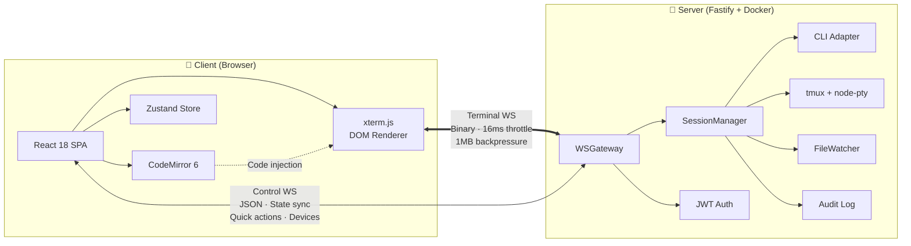
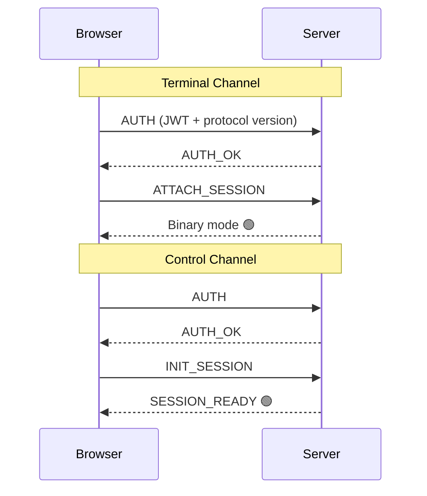

<p align="center">
  
</p>

<h1 align="center">AI CLI</h1>

<p align="center">
  <b><i>Your Terminal, Unchained?</i></b>
</p>

---

<p align="center">
  Run AI coding assistants on your phone or tablet — Claude Code, Aider, or any terminal tool, <br> wrapped in a responsive web IDE with split-pane editing, file browsing, and real-time collaboration.
</p>

<p align="center">
  <a href="https://github.com/wait4xx/AI-CLI/blob/main/LICENSE"></a>
  <a href="https://www.typescriptlang.org/"></a>
  <a href="https://react.dev/"></a>
  <a href="https://fastify.dev/"></a>
</p>

<p align="center">
  <a href="https://github.com/wait4xx/AI-CLI/stargazers"></a>
  <a href="https://github.com/wait4xx/AI-CLI/network/members"></a>
</p>

<p align="center">
  <b>English</b> | <a href="README.md">简体中文</a>
</p>

---

## Features

- **Web-based terminal IDE** — Full terminal in mobile/desktop browsers via xterm.js with custom tmux-synced scrollbar
- **Multi-session tabs** — Run multiple CLI sessions side by side, switch instantly, attach to tmux, manage tmux panes
- **Split-pane editor** — Drag-and-drop resizable panels; CodeMirror 6 code editor with per-theme syntax highlighting alongside terminals
- **Multi-user** — Admin/regular roles, user management UI, per-session device tracking, observer mode for read-only sharing, session sharing
- **File explorer** — Browse, read, and edit files with CWD tracking, path autocomplete, diff viewer, and atomic writes
- **CLI adapters** — Pluggable system for Claude Code, Aider, and any terminal tool
- **Mobile-optimized** — Custom IME/CJK keyboard adapter, pinch-to-zoom font sizing, long-press paste
- **Secure** — JWT auth, path traversal protection, input validation, atomic writes, audit logging, seccomp sandbox
- **Offline-capable** — Terminal screen caching, PWA with auto-update support
- **Docker-ready** — Multi-stage build with seccomp profile, one-command deployment

## Quick Start

### Development

```bash
git clone https://github.com/wait4xx/AI-CLI.git
cd AI-CLI

# One-command setup (check deps, generate .env, install)
bash scripts/dev.sh

# Or step by step
bash scripts/check-deps.sh    # Check prerequisites
pnpm install                  # Install dependencies
cp .env.example .env          # Configure environment
pnpm dev                      # Start dev server
```

Open **http://localhost:5173** and log in with the admin credentials from your `.env`.

> In local dev mode, the terminal and file explorer operate directly on your physical machine's filesystem. It's recommended to set `PROJECT_ROOT` in `.env` to your common project directory (default is `/workspace`), set to `/` to access the entire filesystem (subject to the user's system permissions):
>
> ```bash
> PROJECT_ROOT=/home/youruser/projects
> # or access all files
> PROJECT_ROOT=/
> ```
>
> **Development vs Production:**
>
> | Mode                         | Frontend                 | Backend API / WebSocket | Firewall ports needed        | Hot Reload |
> | ---------------------------- | ------------------------ | ----------------------- | ---------------------------- | ---------- |
> | Dev (`pnpm dev`)             | Vite `:5173`             | Fastify `:18333`        | Two ports (`5173` + `18333`) | Yes (HMR)  |
> | Prod (`pnpm build` then run) | Fastify unified `:18333` | Same                    | One port (`18333`)           | No         |
>
> In development, Vite serves the frontend on `:5173` and proxies API/WS requests to the backend on `:18333`. In production, the backend serves both the built frontend and API on a single port — only `:18333` needs to be opened for external devices.

### Production (Physical Host)

```bash
git clone https://github.com/wait4xx/AI-CLI.git
cd AI-CLI

# One-command deploy (copy to /opt/ai-cli, build, create systemd service)
sudo bash scripts/prod.sh

# Or specify install directory
sudo bash scripts/prod.sh /opt/ai-cli
```

### Docker

```bash
cd docker
cp ../.env.example .env
# Edit .env
docker compose up -d app
```

The container serves on host port **18333** by default (override via `PORT` in `.env`).

> **Note:** The default config uses a Docker named volume (`workspace-data`), so the terminal and file explorer operate inside the container's isolated environment. To work on physical host projects, bind-mount a host directory instead:
>
> ```yaml
> volumes:
>   - /home/youruser/projects:/workspace # replaces workspace-data:/workspace
> ```

For production, place it behind a reverse proxy with TLS termination — see [HTTPS / TLS](#https--tls) below.

## Architecture



**Dual-channel WebSocket** separates terminal I/O from control messages:

| Channel  | Transport | Purpose                                          |
| -------- | --------- | ------------------------------------------------ |
| Terminal | Binary    | PTY I/O with 16ms throttle + 1MB backpressure    |
| Control  | JSON      | Auth, state sync, resize, quick actions, devices |

**Connection flow:**



Close codes: `4001` = auth failed (triggers token refresh), `4002` = protocol mismatch (triggers reload)

## Tech Stack

| Layer    | Technology                                                                               |
| -------- | ---------------------------------------------------------------------------------------- |
| Backend  | Node.js 22, Fastify 5, node-pty, tmux, zod                                               |
| Frontend | React 18, Vite 5, xterm.js (DOM renderer + custom tmux scrollbar), CodeMirror 6, Zustand |
| Auth     | JWT dual-token (access 15m + refresh 7d), bcrypt                                         |
| Mobile   | Custom keyboard adapter (IME/CJK), gesture handler (pinch zoom, long-press paste)        |
| Infra    | Docker multi-stage build, seccomp, GitHub Actions CI/CD                                  |
| Testing  | Vitest (unit/integration), Playwright (E2E), React Testing Library                       |

## Project Structure

```
AI-CLI/
├── apps/
│   ├── server/                # Fastify backend
│   │   └── src/
│   │       ├── core/          # SessionManager, WSGateway, FileWatcher, audit
│   │       ├── routes/        # auth, terminal, control, fs (JSON Schema validated)
│   │       ├── adapters/      # CLI adapters (claude, aider, shell)
│   │       ├── plugins/       # JWT auth plugin
│   │       └── lib/           # config (zod), logger, wsAuth
│   └── web/                   # React frontend
│       └── src/
│           ├── components/     # TerminalContainer, CodeEditor, FileExplorer, SplitPane, DragOverlay, DiffViewer, ...
│           ├── hooks/         # useAuth, useDualChannelWS, useUiTheme
│           ├── lib/           # splitLayout, themes, GestureHandler, offlineCache
│           └── store/         # Zustand session store (persisted)
├── packages/
│   └── shared/                # Protocol types, WS message constants, JWT payload
├── e2e/                       # Playwright E2E tests
├── docker/                    # Dockerfile, docker-compose, seccomp profile
└── .github/workflows/         # CI: lint → build → test → audit
```

## Configuration

| Variable             | Required | Default         | Description                                     |
| -------------------- | -------- | --------------- | ----------------------------------------------- |
| `PORT`               | No       | `18333`         | Server port                                     |
| `JWT_SECRET`         | Yes      | —               | Access token signing key (min 32 chars)         |
| `JWT_REFRESH_SECRET` | Yes      | —               | Refresh token signing key (min 32 chars)        |
| `PROJECT_ROOT`       | No       | `/workspace`    | Root directory for file explorer                |
| `ADMIN_USERNAME`     | No       | `admin`         | Initial admin username                          |
| `ADMIN_PASSWORD`     | Yes      | —               | Initial admin password (min 8 chars)            |
| `LOG_LEVEL`          | No       | `info`          | Log level                                       |
| `SHELL_CMD`          | No       | `bash`          | Shell command for generic shell adapter         |
| `CORS_ORIGINS`       | No       | Allow all (dev) | Comma-separated allowed origins                 |
| `DATA_DIR`           | No       | `./data`        | Runtime data directory (sessions, users, audit) |

## Session Management

- **Multi-session tabs** — Bottom tab bar with quick switching, long-press to close (max 10)
- **External tmux attach** — Select from existing tmux sessions when creating a new tab
- **tmux pane management** — View and switch between tmux panes within a session
- **Path autocomplete** — Directory auto-complete when creating sessions
- **Session persistence** — Surviving tmux sessions auto-restore after server restart
- **Observer mode** — Multiple devices can view the same terminal in read-only mode
- **Session sharing** — Share terminal sessions with other devices via generated links

## File Explorer

- **Live CWD tracking** — Fetches terminal working directory on open via `tmux display-message`
- **Absolute path browsing** — Navigate any directory on the filesystem
- **Code editor** — CodeMirror 6 with per-theme syntax highlighting and code injection into terminal
- **Diff viewer** — Side-by-side diff view for file changes
- **Atomic writes** — write-then-rename prevents file truncation on crash

## Adding a CLI Adapter

Implement the `CLIAdapter` interface from [`apps/server/src/adapters/base.ts`](apps/server/src/adapters/base.ts):

```typescript
import { CLIAdapter } from './base.js'

export class MyToolAdapter implements CLIAdapter {
  startCommand = 'my-tool --interactive'
  parseStreamData(text: string): StateCandidate | null {
    /* ... */
  }
  parseScreenSnapshot(screen: string): AgentStatus | null {
    /* ... */
  }
  getQuickActions(): QuickAction[] {
    /* ... */
  }
  supportsStructuredOutput = false
}
```

Register in [`apps/server/src/index.ts`](apps/server/src/index.ts):

```typescript
adapters.set('mytool', new MyToolAdapter())
```

## Testing

```bash
# All unit/integration tests
pnpm test

# E2E tests (requires running server)
pnpm e2e

# Single package
cd apps/server && pnpm test
```

## API Documentation

Start the server and visit **http://localhost:18333/docs** for Swagger UI with full request/response schemas.

<details>
<summary>📋 Full API Endpoint List</summary>

| Endpoint                             | Method | Description                             |
| ------------------------------------ | ------ | --------------------------------------- |
| `/api/auth/login`                    | POST   | Login with JWT tokens                   |
| `/api/auth/refresh`                  | POST   | Refresh access token                    |
| `/api/auth/users`                    | GET    | List all users (admin only)             |
| `/api/auth/users`                    | POST   | Create user (admin only)                |
| `/api/auth/users/:username`          | DELETE | Delete user (admin only)                |
| `/api/auth/users/:username/password` | PUT    | Update user password                    |
| `/api/auth/users/:username/role`     | PUT    | Update user role (admin only)           |
| `/api/sessions`                      | GET    | List active sessions                    |
| `/api/sessions/tmux`                 | GET    | List attachable tmux sessions           |
| `/api/sessions/shared`               | GET    | List shared sessions                    |
| `/api/sessions/:sessionId`           | GET    | Get session details                     |
| `/api/sessions/:sessionId/share`     | POST   | Share a session                         |
| `/api/sessions/:sessionId/unshare`   | POST   | Unshare a session                       |
| `/api/tmux`                          | GET    | List all tmux sessions                  |
| `/api/tmux/:name`                    | DELETE | Kill tmux session                       |
| `/api/fs/tree`                       | GET    | Directory listing                       |
| `/api/fs/file`                       | GET    | Read file                               |
| `/api/fs/file`                       | PUT    | Write file (atomic, blocks executables) |
| `/api/fs/file`                       | DELETE | Delete file                             |
| `/api/fs/cwd`                        | GET    | Terminal current working directory      |
| `/api/fs/complete`                   | GET    | Path autocomplete                       |
| `/api/fs/mkdir`                      | POST   | Create directory                        |
| `/api/fs/rename`                     | POST   | Rename file or directory                |
| `/api/fs/new-file`                   | POST   | Create new file                         |
| `/api/fs/download`                   | GET    | Download file                           |
| `/api/fs/upload`                     | POST   | Upload file (multipart)                 |
| `/api/fs/compress`                   | POST   | Compress files/directories              |

</details>

<details>
<summary>⚙️ systemd Service</summary>

For production on a physical host, use systemd to manage AI CLI as a system service:

```bash
# Build the project
pnpm build

# Create systemd service file
sudo tee /etc/systemd/system/ai-cli.service << 'EOF'
[Unit]
Description=AI CLI
After=network.target

[Service]
Type=simple
WorkingDirectory=/opt/ai-cli
ExecStart=/usr/bin/node apps/server/dist/index.js
EnvironmentFile=/opt/ai-cli/.env
Restart=on-failure
RestartSec=5

[Install]
WantedBy=multi-user.target
EOF

# Enable and start the service
sudo systemctl daemon-reload
sudo systemctl enable ai-cli
sudo systemctl start ai-cli

# Check status
sudo systemctl status ai-cli
```

</details>

<details>
<summary>🔒 HTTPS / TLS (Nginx Reverse Proxy)</summary>

The server runs on plain HTTP by default. For production, use a reverse proxy:

```nginx
server {
    listen 443 ssl;
    server_name your-domain.com;

    ssl_certificate /etc/ssl/cert.pem;
    ssl_certificate_key /etc/ssl/key.pem;

    location / {
        proxy_pass http://localhost:18333;
        proxy_http_version 1.1;
        proxy_set_header Upgrade $http_upgrade;
        proxy_set_header Connection "upgrade";
        proxy_set_header Host $host;
        proxy_set_header X-Real-IP $remote_addr;
        proxy_set_header X-Forwarded-For $proxy_add_x_forwarded_for;
        proxy_set_header X-Forwarded-Proto $scheme;
    }
}
```

</details>

## Roadmap

- [x] Multi-user support with admin/regular roles
- [x] Multi-session tab management with tmux attach
- [x] File explorer with CWD tracking and code editor
- [x] Observer mode for multi-device collaboration
- [x] Split-pane drag-and-drop layout
- [x] Docker deployment with seccomp sandbox
- [x] Comprehensive test coverage
- [x] Custom tmux-synced scrollbar with SGR mouse protocol
- [x] Per-theme syntax highlighting in code editor
- [x] tmux pane management and session sharing
- [x] User management UI and diff viewer
- [ ] PWA icons and splash screens
- [ ] Claude approval popup (interactive permission flow)
- [ ] Additional CLI adapters (Cursor, etc.)

## Contributing

Contributions are welcome! See [CONTRIBUTING.md](CONTRIBUTING.md) for development setup, code style, and PR guidelines.

## Star History

<a href="https://star-history.com/#wait4xx/AI-CLI&Date">
 <picture>
   <source media="(prefers-color-scheme: dark)" srcset="https://api.star-history.com/svg?repos=wait4xx/AI-CLI&type=Date&theme=dark" />
   <source media="(prefers-color-scheme: light)" srcset="https://api.star-history.com/svg?repos=wait4xx/AI-CLI&type=Date" />
   
 </picture>
</a>

## License

This project is licensed under the [MIT License](LICENSE).
