# 第二篇：技术栈选型与对比分析

> AI-CLI-Mobile 项目的技术选型全景解读——每一个选择背后的思考与权衡

> 本文面向初级程序员，从基础概念讲起，详细对比分析项目中使用的每一项技术，
> 解释为什么做出这样的选择，以及如果选择其他方案会有什么后果。

### 阅读指南

- 如果你是**初学者**：建议按顺序阅读，每章都从基础概念讲起
- 如果你**有经验**：可以直接跳到感兴趣的技术对比章节
- 每个技术对比都包含：**基础讲解 → 候选方案 → 对比表 → 选型理由 → 替代方案分析**

---

## 目录

- [1. 概述：技术选型的哲学](#1-概述技术选型的哲学)
- [2. Web 框架：Fastify vs Express vs Koa vs Hono](#2-web-框架fastify-vs-express-vs-koa-vs-hono)
- [3. 终端模拟：xterm.js vs term.js vs hterm](#3-终端模拟xtermjs-vs-termjs-vs-hterm)
- [4. WebSocket 通信：原生 WS vs Socket.IO vs ws 库](#4-websocket-通信原生-ws-vs-socketio-vs-ws-库)
- [5. 进程管理：node-pty vs child_process vs execa](#5-进程管理node-pty-vs-child_process-vs-execa)
- [6. 终端复用：tmux vs screen vs zellij](#6-终端复用tmux-vs-screen-vs-zellij)
- [7. 认证方案：JWT vs Session vs OAuth](#7-认证方案jwt-vs-session-vs-oauth)
- [8. 密码加密：bcrypt vs argon2 vs scrypt](#8-密码加密bcrypt-vs-argon2-vs-scrypt)
- [9. 构建工具：Vite vs Webpack vs esbuild](#9-构建工具vite-vs-webpack-vs-esbuild)
- [10. 包管理：pnpm vs npm vs yarn](#10-包管理pnpm-vs-npm-vs-yarn)
- [11. Monorepo 管理：Turborepo vs Nx vs Lerna](#11-monorepo-管理turborepo-vs-nx-vs-lerna)
- [12. 日志系统：pino vs winston vs bunyan](#12-日志系统pino-vs-winston-vs-bunyan)
- [13. 测试框架：Vitest vs Jest vs Mocha](#13-测试框架vitest-vs-jest-vs-mocha)
- [14. 前端框架：React vs Vue vs Svelte](#14-前端框架react-vs-vue-vs-svelte)
- [15. CSS 方案：Tailwind vs CSS Modules vs styled-components](#15-css-方案tailwind-vs-css-modules-vs-styled-components)
- [16. 容器化：Docker vs Podman vs 容器运行时选型](#16-容器化docker-vs-podman-vs-容器运行时选型)
- [17. 其他关键技术选型](#17-其他关键技术选型)
- [18. 总结：技术栈全景图](#18-总结技术栈全景图)

---

## 1. 概述：技术选型的哲学

### 1.1 什么是技术选型？

技术选型（Technology Selection）是指在软件项目的规划阶段，根据项目需求、团队能力、社区生态、性能要求等多个维度，从众多可选技术中挑选出最适合当前项目的技术方案的过程。

对于初学者来说，技术选型可能看起来像是"选最流行的就对了"，但实际上远非如此。一个好的技术选型需要考虑：

- **项目需求匹配度**：技术的能力是否能满足项目的功能需求
- **性能表现**：在目标场景下的运行效率
- **学习曲线**：团队成员掌握该技术的难度
- **社区生态**：插件、文档、社区支持的丰富程度
- **长期维护性**：技术是否活跃维护，未来是否可持续
- **兼容性**：与已选技术栈的协同工作能力

### 1.2 AI-CLI-Mobile 的技术选型原则

AI-CLI-Mobile 是一个通过浏览器在移动端控制 AI 编程助手（如 Claude Code、Aider）的网关系统。它的核心特点是：

1. **实时性要求高**：终端输出需要毫秒级传输
2. **移动端优先**：需要适配手机浏览器的触摸操作和虚拟键盘
3. **安全性要求高**：暴露在公网上，需要严格的认证和隔离
4. **长连接场景**：WebSocket 持久连接，需要稳定的心跳和重连机制
5. **容器化部署**：支持 Docker 一键部署

基于这些特点，项目遵循了以下选型原则：

| 原则 | 说明 | 示例 |
|------|------|------|
| 性能优先 | 高并发、低延迟场景选择性能最优的方案 | Fastify 而非 Express |
| 类型安全 | 全栈 TypeScript，编译时发现错误 | TypeScript 5.4+ |
| 移动适配 | 前端方案必须对移动端友好 | xterm.js 的 Canvas/WebGL 渲染 |
| 安全纵深 | 多层安全防护，不依赖单一机制 | JWT + bcrypt + seccomp + 非 root 用户 |
| 部署简洁 | 一条命令即可部署 | Docker + docker-compose |

### 1.3 什么是 Monorepo？为什么用 Monorepo？

在介绍具体技术之前，有必要解释一下项目的代码组织方式——Monorepo。

**Monorepo（单一仓库）** 是一种代码管理策略，将多个相关的项目放在同一个代码仓库中。与之对应的是 **Polyrepo（多仓库）**，每个项目有自己的仓库。

**AI-CLI-Mobile 的 Monorepo 结构：**
```
ai-cli-mobile/
├── apps/
│   ├── server/          # 后端服务 (Fastify + WebSocket)
│   └── web/             # 前端应用 (React + Vite)
├── packages/
│   ├── shared/          # 共享类型和协议定义
│   └── config/          # 共享配置 (ESLint, Prettier, tsconfig)
├── docker/              # Docker 构建配置
├── scripts/             # 脚本工具
├── package.json         # 根 package.json
├── pnpm-workspace.yaml  # pnpm workspace 配置
└── turbo.json           # Turborepo 配置
```

**为什么用 Monorepo？**

1. **代码共享**：`@ai-cli/shared` 包被 server 和 web 同时引用，类型定义只写一次
2. **原子提交**：修改协议定义时，可以同时更新 server 和 web，一个 commit 搞定
3. **统一工具链**：ESLint、Prettier、TypeScript 配置统一管理
4. **简化依赖管理**：pnpm workspace 自动处理包之间的依赖关系

**Monorepo 的挑战：**
- 需要专门的构建工具（Turborepo）来管理构建顺序
- 需要包管理器支持 workspace（pnpm）
- 仓库体积会随项目增长而变大

### 1.4 项目整体技术栈一览

在深入分析每个技术选型之前，先来看一下项目的完整技术栈：

**后端（Server）：**
| 类别 | 技术 | 版本 |
|------|------|------|
| 运行时 | Node.js | 20 LTS |
| 语言 | TypeScript | 5.4+ |
| Web 框架 | Fastify | 4.26+ |
| WebSocket | ws + @fastify/websocket | 8.16+ |
| 进程管理 | node-pty | 1.0+ |
| 终端复用 | tmux | 3.3a+ |
| 认证 | JWT (jsonwebtoken) | 9.0+ |
| 密码加密 | bcryptjs | 2.4+ |
| 日志 | pino | 8.0+ |
| 测试 | Vitest | 4.1+ |

**前端（Web）：**
| 类别 | 技术 | 版本 |
|------|------|------|
| 框架 | React | 18.2+ |
| 构建 | Vite | 5.1+ |
| 终端模拟 | xterm.js (@xterm/xterm) | 5.5+ |
| CSS | Tailwind CSS | 3.4+ |
| 状态管理 | Zustand | 4.5+ |
| 代码编辑器 | CodeMirror (@uiw/react-codemirror) | 4.21+ |
| PWA | vite-plugin-pwa | 0.19+ |
| 图标 | lucide-react | 0.344+ |

**基础设施：**
| 类别 | 技术 | 版本 |
|------|------|------|
| 包管理 | pnpm | 8.15+ |
| Monorepo | Turborepo | 1.13+ |
| 容器化 | Docker | - |
| CI/CD | GitHub Actions | - |
| 代码规范 | ESLint + Prettier + Husky | - |

---

## 2. Web 框架：Fastify vs Express vs Koa vs Hono

### 2.1 背景知识：什么是 Web 框架？

Web 框架是用于构建 Web 应用程序和服务端软件的工具库。它提供了处理 HTTP 请求和响应、路由管理、中间件机制、错误处理等基础功能，让开发者不必从零开始编写底层网络代码。

**没有 Web 框架会怎样？**

用 Node.js 内置的 `http` 模块写一个简单的服务器：

```javascript
const http = require('http')
const server = http.createServer((req, res) => {
  // 需要手动解析 URL
  const url = new URL(req.url, `http://${req.headers.host}`)
  
  // 需要手动处理路由
  if (url.pathname === '/health' && req.method === 'GET') {
    res.writeHead(200, { 'Content-Type': 'application/json' })
    res.end(JSON.stringify({ status: 'ok' }))
  } else if (url.pathname === '/api/login' && req.method === 'POST') {
    // 需要手动读取请求体
    let body = ''
    req.on('data', chunk => body += chunk)
    req.on('end', () => {
      const data = JSON.parse(body)
      // 处理登录逻辑...
    })
  } else {
    res.writeHead(404)
    res.end('Not Found')
  }
})
server.listen(3000)
```

可以看到，没有框架的情况下，我们需要手动处理 URL 解析、路由匹配、请求体读取、响应头设置等大量重复工作。Web 框架封装了这些底层细节，让我们可以专注于业务逻辑。

**Web 框架的核心功能：**

1. **路由（Routing）**：将不同的 URL 路径映射到不同的处理函数
2. **中间件（Middleware）**：在请求处理前后执行的通用逻辑（如认证、日志、CORS）
3. **请求解析**：自动解析请求体、查询参数、路径参数
4. **响应处理**：自动设置 Content-Type、状态码等
5. **错误处理**：统一的错误捕获和响应机制
6. **安全防护**：CORS、rate limiting、Helmet 等安全中间件

在 Node.js 生态中，Web 框架的选择是后端开发中最基础也最重要的决策之一。不同的框架有不同的设计理念和适用场景。

### 2.2 候选方案详解

在选择 Web 框架之前，我们考察了 Node.js 生态中最流行的四个框架。每个框架都有其独特的设计理念和适用场景。下面我们将逐一分析它们的特点、优缺点和适用场景。

#### 2.2.1 Express.js

**简介：** Express 是 Node.js 最老牌、最流行的 Web 框架，诞生于 2010 年，是 Node.js Web 开发的"事实标准"。

**核心特点：**
- 中间件架构：请求经过一系列中间件函数依次处理
- 极简核心：核心功能精简，通过中间件扩展
- 庞大的生态系统：npm 上有海量 Express 中间件
- 灵活自由：不限制项目结构和设计模式

**代码示例：**
```javascript
const express = require('express')
const app = express()

app.use(express.json())

app.get('/health', (req, res) => {
  res.json({ status: 'ok' })
})

app.listen(3000)
```

**优点：**
- 学习资源极其丰富，几乎所有 Node.js 教程都以 Express 为例
- 中间件生态完善，几乎任何需求都有现成的中间件
- 社区庞大，遇到问题容易找到解决方案
- 灵活性高，不限制架构风格

**缺点：**
- 性能在现代框架中偏低（基准测试约 30,000-50,000 req/s）
- 原生 TypeScript 支持弱，需要 @types/express 等类型包
- 错误处理机制不够完善
- 开发节奏缓慢，Express 5 从 2014 年开始开发至今未正式发布
- 回调风格（callback-based），async/await 支持需要额外处理

**性能数据（TechEmpower Round 22，JSON 序列化）：**
- 请求吞吐量：约 40,000 req/s
- P99 延迟：约 15-25ms

#### 2.2.2 Koa.js

**简介：** Koa 由 Express 的原班团队打造，于 2013 年发布，被称为"下一代 Web 框架"。它使用 async/await 替代了 Express 的回调模式。

**核心特点：**
- 洋葱模型中间件：中间件可以"环绕"请求，执行前后的逻辑
- 原生 async/await：从底层就基于 Promise 构建
- 极简核心：比 Express 更精简，几乎不含任何捆绑中间件

**代码示例：**
```javascript
const Koa = require('koa')
const app = new Koa()

app.use(async (ctx, next) => {
  const start = Date.now()
  await next()
  const ms = Date.now() - start
  ctx.set('X-Response-Time', `${ms}ms`)
})

app.use(async (ctx) => {
  ctx.body = { status: 'ok' }
})

app.listen(3000)
```

**优点：**
- 洋葱模型让中间件的执行顺序更直观
- 原生 async/await，代码更现代
- 更小的核心，更少的"历史包袱"
- 错误处理更优雅（try/catch 包裹 await）

**缺点：**
- 生态系统比 Express 小很多
- 社区活跃度在下降
- 需要大量第三方中间件才能构建完整应用
- 性能与 Express 相当，没有明显提升
- TypeScript 支持同样需要额外配置

**性能数据：**
- 请求吞吐量：约 35,000-45,000 req/s
- P99 延迟：约 15-25ms

#### 2.2.3 Fastify

**简介：** Fastify 由 Matteo Collina（Node.js TSC 成员）和 Tomas Della Vedova 于 2016 年创建，专注于性能和开发者体验。

**核心特点：**
- 高性能：基于 radix tree 路由、JSON Schema 验证和序列化
- 原生 TypeScript：内置类型定义
- 插件系统：基于封装（encapsulation）的插件架构
- JSON Schema 验证：请求和响应的自动验证与序列化

**代码示例：**
```typescript
import Fastify from 'fastify'

const fastify = Fastify({ logger: true })

fastify.get('/health', {
  schema: {
    response: {
      200: {
        type: 'object',
        properties: {
          status: { type: 'string' },
          timestamp: { type: 'number' }
        }
      }
    }
  }
}, async () => {
  return { status: 'ok', timestamp: Date.now() }
})

await fastify.listen({ port: 3000, host: '0.0.0.0' })
```

**优点：**
- 性能极佳：基准测试中是 Express 的 2-3 倍
- 原生 TypeScript 支持，类型安全
- JSON Schema 驱动的请求/响应验证，自动生成 Swagger 文档
- 强大的插件系统，支持封装和依赖声明
- 活跃的开发和维护（Node.js 核心团队成员参与）
- 内置日志（基于 pino）
- WebSocket 支持通过 @fastify/websocket 插件
- 优雅的生命周期管理（ready, listen, close）

**缺点：**
- 学习曲线比 Express 稍陡
- 生态系统比 Express 小（但核心需求都有覆盖）
- 插件封装机制初学者可能不易理解
- JSON Schema 有额外的学习成本

**性能数据：**
- 请求吞吐量：约 80,000-120,000 req/s
- P99 延迟：约 5-10ms
- 比 Express 快约 2-3 倍

#### 2.2.4 Hono

**简介：** Hono 是由 Yusuke Wada 于 2022 年创建的超轻量 Web 框架，最初为 Cloudflare Workers 设计，现在支持几乎所有 JavaScript 运行时。

**核心特点：**
- 超轻量：核心包仅约 14KB
- 多运行时支持：Node.js、Deno、Bun、Cloudflare Workers、AWS Lambda 等
- Web Standard API：基于 Request/Response 标准 API
- 中间件丰富：内置 CORS、JWT、认证等中间件

**代码示例：**
```typescript
import { Hono } from 'hono'
import { cors } from 'hono/cors'

const app = new Hono()
app.use('/*', cors())

app.get('/health', (c) => {
  return c.json({ status: 'ok', timestamp: Date.now() })
})

export default app
```

**优点：**
- 极小的包体积，启动速度极快
- 跨运行时兼容，代码可移植性极强
- 基于 Web Standard API，无需学习专有 API
- TypeScript 优先设计
- 活跃的社区和快速的迭代

**缺点：**
- 相对较新（2022 年），生态还在成长中
- Node.js 原生支持是后来添加的，不如 Fastify 成熟
- WebSocket 支持需要额外配置
- 插件系统不如 Fastify 完善
- 企业级特性的覆盖面不如 Fastify

**性能数据：**
- 在 Bun 上：约 200,000+ req/s
- 在 Node.js 上：约 60,000-90,000 req/s

### 2.3 综合对比表

| 维度 | Express | Koa | Fastify | Hono |
|------|---------|-----|---------|------|
| 首次发布 | 2010 | 2013 | 2016 | 2022 |
| GitHub Stars | 65k+ | 35k+ | 32k+ | 20k+ |
| npm 周下载量 | ~30M | ~1M | ~3M | ~800K |
| TypeScript 支持 | 第三方 | 第三方 | 原生 | 原生 |
| 性能 (req/s) | ~40K | ~40K | ~100K | ~80K (Node) |
| WebSocket 支持 | 需第三方 | 需第三方 | 官方插件 | 内置 |
| JSON Schema 验证 | 无 | 无 | 内置 | 需中间件 |
| 日志集成 | 无 | 无 | 内置 (pino) | 需中间件 |
| 学习曲线 | 低 | 低 | 中 | 低 |
| 插件生态 | ★★★★★ | ★★★ | ★★★★ | ★★★ |
| 维护活跃度 | 低 | 中 | 高 | 高 |
| 适用场景 | 通用 | 通用 | 高性能 API | 边缘计算 |

### 2.4 AI-CLI-Mobile 为什么选择 Fastify？

AI-CLI-Mobile 选择 Fastify 作为后端 Web 框架，是基于以下几个关键因素：

**1. 性能需求**

AI-CLI-Mobile 是一个实时终端网关，WebSocket 消息的处理需要极低的延迟。Fastify 的高性能路由和 JSON 序列化能力确保了：
- 认证接口（/api/auth/login）能快速响应
- 文件系统接口（/api/fs/*）能高效处理
- HTTP 端点的低延迟不会成为 WebSocket 通道的瓶颈

**2. 原生 TypeScript 支持**

项目全栈使用 TypeScript。Fastify 提供了完善的类型定义，包括：
- 路由处理函数的类型推导
- 请求/响应的 Schema 类型验证
- 插件系统的类型安全

从项目源码可以看到，`fastify.d.ts` 扩展了 Fastify 的类型定义：
```typescript
// apps/server/src/types/fastify.d.ts
import { JwtPayload } from '@ai-cli/shared'

declare module 'fastify' {
  interface FastifyRequest {
    user?: JwtPayload
  }
}
```

**3. WebSocket 官方支持**

`@fastify/websocket` 插件提供了与 Fastify 路由系统深度集成的 WebSocket 支持。项目中的终端和控制通道都通过这个插件注册：

```typescript
// 项目实际代码
await fastify.register(websocket)

// 终端 WS 路由
fastify.get('/ws/terminal', { websocket: true }, (connection, _request) => {
  gateway.handleTerminalConnection(connection.socket)
})

// 控制 WS 路由
fastify.get('/ws/control', { websocket: true }, (connection, _request) => {
  gateway.handleControlConnection(connection.socket)
})
```

**4. 插件系统**

Fastify 的插件系统让代码组织更清晰。项目使用 `fastify-plugin` 封装认证逻辑：

```typescript
// 认证插件
async function authPlugin(fastify: FastifyInstance) {
  fastify.addHook('onRequest', async (request, reply) => {
    // 白名单路径跳过认证
    const urlPath = request.url.split('?')[0]
    if (WHITELIST_PATHS.some(p => urlPath === p)) return
    
    // 验证 JWT
    const token = request.headers.authorization?.slice(7)
    const decoded = jwt.verify(token, process.env.JWT_SECRET!)
    request.user = decoded
  })
}

export default fp(authPlugin)
```

**5. 内置日志（pino 集成）**

Fastify 内置了 pino 日志，项目直接使用：

```typescript
const fastify = Fastify({ logger: pinoLogger as any })
```

**6. 生命周期管理**

Fastify 提供了完善的生命周期钩子（lifecycle hooks），项目利用 `SIGINT` 和 `SIGTERM` 信号实现了优雅关闭：

```typescript
process.on('SIGINT', async () => {
  if (serverStarted) await fastify.close()
  process.exit(0)
})
```

**7. 静态文件服务**

通过 `@fastify/static` 插件，Fastify 可以直接服务前端构建产物，实现前后端一体化部署：

```typescript
await fastify.register(fastifyStatic, {
  root: webDistPath,
  prefix: '/',
  wildcard: false,
})
```

### 2.5 如果选择其他框架会怎样？

**如果选 Express：**
- 需要手动集成 WebSocket 库（如 ws 或 socket.io），增加配置复杂度
- TypeScript 支持需要额外配置 @types/express 等类型包
- 性能可能在高并发场景下成为瓶颈
- 缺少内置的 Schema 验证，安全防护需要更多手动工作
- 错误处理机制不够完善，需要自己实现 try/catch 包装
- 没有内置的日志集成，需要手动集成 winston 或 morgan

**如果选 Koa：**
- 生态系统更小，需要更多自己造轮子
- 社区活跃度在下降，长期维护风险
- WebSocket 同样需要手动集成
- 没有内置的 Schema 验证和日志
- 中间件数量比 Express 少很多

**如果选 Hono：**
- 在纯 Node.js 场景下，Hono 的优势（多运行时）不太明显
- 插件系统不如 Fastify 成熟
- 作为较新的框架，企业级特性（如 Swagger 文档生成）支持不如 Fastify 完善
- WebSocket 支持需要额外配置
- 在 Node.js 上的性能不如 Fastify

### 2.6 Fastify 的核心概念详解

为了帮助初学者更好地理解项目为什么选择 Fastify，这里详细讲解 Fastify 的几个核心概念：

#### 2.6.1 插件系统（Plugin System）

Fastify 的插件系统是其最重要的特性之一。插件是一个函数，它可以扩展 Fastify 实例的功能。

```typescript
// 定义一个插件
async function myPlugin(fastify, options) {
  // 在这里添加路由、钩子等
  fastify.get('/hello', async () => {
    return { hello: 'world' }
  })
}

// 注册插件
await fastify.register(myPlugin)
```

项目中的认证就是一个插件：

```typescript
// apps/server/src/plugins/auth.ts
import fp from 'fastify-plugin'

async function authPlugin(fastify: FastifyInstance) {
  fastify.addHook('onRequest', async (request, reply) => {
    // 白名单路径跳过认证
    const urlPath = request.url.split('?')[0]
    if (WHITELIST_PATHS.some(p => urlPath === p)) return
    
    // 验证 JWT
    const authHeader = request.headers.authorization
    if (!authHeader?.startsWith('Bearer ')) {
      return reply.code(401).send({ error: 'Missing authorization header' })
    }
    
    const token = authHeader.slice(7)
    const decoded = jwt.verify(token, process.env.JWT_SECRET!)
    request.user = decoded
  })
}

export default fp(authPlugin)  // fp = fastify-plugin
```

`fastify-plugin`（简写 `fp`）是一个辅助函数，它告诉 Fastify 不要封装这个插件的作用域，让插件的功能对所有路由可见。

#### 2.6.2 生命周期钩子（Lifecycle Hooks）

Fastify 提供了丰富的生命周期钩子，可以在请求处理的不同阶段执行代码：

```
请求到达
  → onRequest（认证、日志）
  → preParsing（预解析）
  → preValidation（预验证）
  → preHandler（预处理）
  → handler（处理请求）
  → preSerialization（预序列化）
  → onSend（发送前）
  → onResponse（响应后）
```

项目使用 `onRequest` 钩子实现认证：

```typescript
fastify.addHook('onRequest', async (request, reply) => {
  // 在每个请求到达路由处理函数之前执行
  // 用于验证 JWT
})
```

#### 2.6.3 请求验证（Request Validation）

Fastify 支持使用 JSON Schema 验证请求和响应：

```typescript
fastify.post('/login', {
  schema: {
    body: {
      type: 'object',
      required: ['username', 'password'],
      properties: {
        username: { type: 'string', minLength: 1 },
        password: { type: 'string', minLength: 1 }
      }
    },
    response: {
      200: {
        type: 'object',
        properties: {
          accessToken: { type: 'string' },
          refreshToken: { type: 'string' }
        }
      }
    }
  }
}, async (request) => {
  // request.body 已经经过验证
  const { username, password } = request.body
  // ...
})
```

JSON Schema 验证的好处：
1. 自动验证请求数据，不需要手动检查
2. 自动生成 Swagger/OpenAPI 文档
3. 验证性能极高（Fastify 使用 Ajv 进行验证，比手动验证快）
4. 类型安全（可以推导出 TypeScript 类型）

#### 2.6.4 Fastify 的性能为什么这么快？

Fastify 的高性能来自于几个关键技术：

1. **Radix Tree 路由**：使用基数树（Radix Tree）数据结构进行路由匹配，比 Express 的线性匹配快得多
2. **JSON Schema 验证和序列化**：通过 Ajv 编译 JSON Schema 为高性能的验证函数
3. **Pino 日志**：使用 Pino 作为默认日志器，比 Winston 快 5-10 倍
4. **最小化抽象**：减少不必要的中间件层

```
路由匹配性能对比：
Express: O(n) — 线性遍历所有路由
Fastify: O(log n) — 基数树查找
```

---

## 3. 终端模拟：xterm.js vs term.js vs hterm

### 3.1 背景知识：什么是终端模拟器？

终端模拟器（Terminal Emulator）是在图形界面中模拟传统终端行为的软件。在 Web 应用中，终端模拟器让用户可以在浏览器中看到和操作一个类似 Linux 终端的界面。

**终端的历史：**

要理解终端模拟器，需要先了解终端的历史：

1. **物理终端时代（1960s-1980s）**：计算机使用物理终端（如 VT100）进行交互。终端是一个独立的硬件设备，通过串口连接到计算机。
2. **终端仿真时代（1990s-2000s）**：随着图形界面的普及，软件开始模拟物理终端的行为，如 xterm、GNOME Terminal。
3. **Web 终端时代（2010s-）**：浏览器成为新的终端载体，xterm.js 等库让终端可以在网页中运行。

**终端能做什么？**

终端不只是显示文字。它支持：
- **ANSI 颜色**：让输出带有颜色（如错误信息红色、成功信息绿色）
- **光标控制**：移动光标位置，实现进度条、spinner 等动态效果
- **键盘输入**：处理特殊键（如 Ctrl+C、方向键、Tab 补全）
- **Unicode 字符**：显示中文、emoji、制表符等特殊字符
- **终端大小**：根据窗口大小自动调整布局

对于 AI-CLI-Mobile 来说，终端模拟器是最核心的前端组件——它直接决定了用户能否在手机上流畅地使用命令行工具。AI 编程助手（如 Claude Code）的输出包含丰富的 ANSI 转义序列、Unicode 字符和动态内容（如 spinner 动画），终端模拟器必须正确处理这些内容。

**什么是 ANSI 转义序列？**

ANSI 转义序列是一种特殊的字符序列，用于控制终端的显示效果。例如：
- `\x1b[31m` — 将文字颜色设为红色
- `\x1b[1m` — 设为粗体
- `\x1b[2J` — 清屏
- `\x1b[10;20H` — 将光标移动到第 10 行第 20 列
- `\x1b[?25l` — 隐藏光标

当 AI 工具输出 `\x1b[32mSuccess!\x1b[0m` 时，终端模拟器应该显示绿色的 "Success!" 文字，而不是显示原始的转义序列。

### 3.2 候选方案详解

#### 3.2.1 xterm.js（@xterm/xterm）

**简介：** xterm.js 是一个用 TypeScript 编写的前端终端模拟器，由 SourceFoundry 团队开发维护。它是 VS Code 内置终端的底层实现，也是目前最流行的 Web 终端模拟器。

**核心特点：**
- 完整的终端仿真：支持 VT100、VT220、xterm 等终端标准
- GPU 加速渲染：通过 WebGL addon 实现高性能渲染
- Canvas 渲染后备：WebGL 不可用时自动降级到 Canvas 渲染
- 丰富的 addon 生态：fit（自适应大小）、web-links（链接检测）、search（搜索）等
- Unicode 支持：完整的 Unicode 字符宽度计算

**代码示例：**
```typescript
import { Terminal } from '@xterm/xterm'
import { FitAddon } from '@xterm/addon-fit'
import { WebglAddon } from '@xterm/addon-webgl'

const term = new Terminal({
  theme: { background: '#1a1b26', foreground: '#c0caf5' },
  fontSize: 14,
  cursorBlink: true,
  scrollback: 5000,
})

const fitAddon = new FitAddon()
term.loadAddon(new WebglAddon())  // GPU 加速
term.loadAddon(fitAddon)

term.open(document.getElementById('terminal')!)
fitAddon.fit()

// 监听用户输入
term.onData((data) => ws.send(data))

// 写入终端输出
ws.onmessage = (ev) => term.write(ev.data)
```

**优点：**
- VS Code 验证：作为 VS Code 的终端底层，经过数百万用户的实际验证
- GPU 加速：WebGL 渲染在处理大量终端输出时性能优异
- 完善的 addon 系统：核心精简，功能通过 addon 扩展
- 活跃的开发：持续更新，bug 修复及时
- 丰富的主题支持：可以完全自定义颜色方案
- 搜索功能：内置文本搜索 addon
- Unicode 完美支持：正确处理 CJK 字符宽度

**缺点：**
- 包体积较大（核心约 300KB，含 addon 约 500KB）
- WebGL 在某些低端设备或特定浏览器中可能不可用
- 移动端支持需要额外适配工作
- 内存占用比简单方案高

**性能数据：**
- 处理速度：约 500,000 行/秒（WebGL 渲染）
- 内存占用：约 10-30MB（取决于 scrollback 大小）
- 首次加载：约 100-200ms

#### 3.2.2 term.js

**简介：** term.js 是一个较早期的 JavaScript 终端模拟器，由 Nathan Rajlich 开发。它曾被多个项目使用，但目前已不再活跃维护。

**核心特点：**
- 轻量级实现
- 基本的 ANSI 转义序列支持
- 纯 DOM 渲染

**代码示例：**
```javascript
var Terminal = require('term.js')

var term = new Terminal({
  cols: 80,
  rows: 24,
  screenKeys: true
})

term.open(document.getElementById('terminal'))
term.write('Hello World\r\n')
```

**优点：**
- 极轻量：核心代码量很小
- 简单易懂：源码量少，适合学习终端模拟原理
- 无依赖：纯 JavaScript 实现

**缺点：**
- 已停止维护（最后更新约 2015 年）
- 不支持现代终端标准
- 无 GPU 加速，大量输出时性能差
- Unicode 支持不完善
- 无 addon 系统，扩展性差
- 不支持 TypeScript

**性能数据：**
- 处理速度：约 50,000 行/秒（DOM 渲染）
- 包体积：约 50KB

#### 3.2.3 hterm（hterm）

**简介：** hterm 是 Google 开发的 Web 终端模拟器，是 Chrome Secure Shell 扩展的底层组件。

**核心特点：**
- Google 维护，Chrome Secure Shell 验证
- 完整的 VT 终端仿真
- 良好的 Unicode 支持
- 原生支持 SSH 场景

**代码示例：**
```javascript
var term = new hterm.Terminal()
term.onTerminalReady = function() {
  var io = term.io.push()
  io.onVTKeystroke = function(str) {
    // 处理键盘输入
  }
  io.print('Hello World\n')
}
term.decorate(document.getElementById('terminal'))
```

**优点：**
- Google 维护，质量有保障
- 终端仿真完整度高
- 良好的 Unicode 和 CJK 支持
- 在 Chrome 生态中表现优异

**缺点：**
- 包体积非常大（约 1MB+）
- API 设计较老旧，不支持现代 JavaScript 模块系统
- 与 React/Vue 等现代框架集成困难
- npm 包不是官方发布渠道
- 社区生态小，第三方 addon 几乎没有
- 自定义主题的能力有限
- 文档质量一般

**性能数据：**
- 处理速度：约 200,000 行/秒
- 包体积：约 1MB+

### 3.3 综合对比表

| 维度 | xterm.js | term.js | hterm |
|------|----------|---------|-------|
| 首次发布 | 2014 | 2012 | 2012 |
| GitHub Stars | 18k+ | 1.5k+ | 2k+ |
| 维护状态 | 活跃 | 停止 | 半活跃 |
| TypeScript | 原生 | 无 | 无 |
| 渲染方式 | DOM/Canvas/WebGL | DOM | Canvas |
| GPU 加速 | ✅ WebGL | ❌ | ❌ |
| 包体积 | ~300KB | ~50KB | ~1MB |
| 性能 | ★★★★★ | ★★ | ★★★ |
| Unicode 支持 | 完整 | 基本 | 良好 |
| addon 生态 | 丰富 | 无 | 极少 |
| VS Code 验证 | ✅ | ❌ | ❌ |
| 移动端支持 | 需适配 | 差 | 一般 |
| React 集成 | 社区方案 | 手动 | 困难 |

### 3.4 AI-CLI-Mobile 为什么选择 xterm.js？

**1. 性能是第一优先级**

AI-CLI-Mobile 需要在移动端浏览器中实时渲染终端输出。AI 编程助手（如 Claude Code）会产生大量输出，包括 ANSI 颜色代码、Unicode 字符、进度条动画等。xterm.js 的 WebGL 渲染器能够高效处理这些内容。

项目中的渲染降级策略体现了这一点：
```typescript
// ADR-010: WebGL → Canvas → DOM 降级策略
try {
  term.loadAddon(new WebglAddon())
  rendererTypeRef.current = 'webgl'
} catch {
  try {
    term.loadAddon(new CanvasAddon())
    rendererTypeRef.current = 'canvas'
  } catch (e) {
    console.warn('Both WebGL and Canvas addons failed, using DOM renderer', e)
  }
}
```

**2. addon 系统提供精确的扩展能力**

项目使用了多个 xterm.js addon：

| addon | 用途 | 项目中的使用 |
|-------|------|-------------|
| @xterm/addon-fit | 终端自适应容器大小 | 窗口 resize 时自动调整终端尺寸 |
| @xterm/addon-webgl | GPU 加速渲染 | 首选渲染后端 |
| @xterm/addon-canvas | Canvas 渲染 | WebGL 不可用时的降级方案 |
| @xterm/addon-web-links | URL 检测 | 终端中的链接可点击 |

**3. 终端标准兼容性**

AI 编程助手的输出包含丰富的 ANSI 转义序列（颜色、粗体、光标移动等）。xterm.js 完整支持 VT100/VT220 标准，确保输出正确显示。

**4. 内存管理：永不销毁的终端实例**

项目采用了一个特殊的终端实例管理策略（ADR-011），利用 xterm.js 的 API 特性：

```typescript
// 模块级缓存，跨渲染周期保持
const terminalCache = new Map<string, Terminal>()
const fitAddonCache = new Map<string, FitAddon>()

// visibilitychange 时 DOM detach/reattach，但不 dispose
document.addEventListener('visibilitychange', () => {
  if (document.hidden) {
    term.element.parentNode.removeChild(term.element)
  } else {
    container.appendChild(term.element)
    fitAddon.fit()
  }
})
```

这种策略避免了 xterm.js 实例的频繁创建和销毁，显著减少了内存分配和 GC 压力。

**5. VS Code 的背书**

xterm.js 是 VS Code 内置终端的底层实现。VS Code 拥有数千万用户，这意味着 xterm.js 经过了大规模的实际验证，各种边界情况都已经被发现和修复。

### 3.5 如果选择其他方案会怎样？

**如果选 term.js：**
- 已停止维护，存在安全和兼容性风险
- 没有 GPU 加速，大量终端输出时会卡顿
- 不支持 TypeScript，与项目的类型安全原则冲突
- 缺少 addon 系统，自适应大小、链接检测等功能需要自己实现
- Unicode 支持不完善，中文字符可能显示异常
- 没有 scrollback 限制，大量输出时内存会无限增长

**如果选 hterm：**
- 包体积 1MB+ 对移动端不友好，首次加载时间长
- API 设计老旧，与 React 集成困难
- 缺少模块化，无法 tree-shaking
- 自定义主题能力有限，项目的深色/浅色主题切换难以实现
- npm 包不是官方发布渠道，可能缺少最新版本

### 3.6 xterm.js 的核心概念详解

#### 3.6.1 Terminal 实例

xterm.js 的核心是 `Terminal` 类。每个 Terminal 实例代表一个独立的终端：

```typescript
import { Terminal } from '@xterm/xterm'

const term = new Terminal({
  theme: { background: '#1a1b26', foreground: '#c0caf5' },
  fontSize: 14,
  cursorBlink: true,     // 光标闪烁
  scrollback: 5000,      // 回滚行数
  convertEol: true,      // 自动转换行尾符
})
```

#### 3.6.2 Addon 系统

xterm.js 的功能通过 addon 扩展。addon 是独立的包，可以按需加载：

```typescript
import { FitAddon } from '@xterm/addon-fit'
import { WebglAddon } from '@xterm/addon-webgl'
import { WebLinksAddon } from '@xterm/addon-web-links'

// 加载 addon
const fitAddon = new FitAddon()
term.loadAddon(fitAddon)           // 自适应大小
term.loadAddon(new WebglAddon())   // GPU 加速渲染
term.loadAddon(new WebLinksAddon()) // 链接检测

// 使用 addon
fitAddon.fit()  // 调整终端大小以适应容器
```

#### 3.6.3 渲染器选择

xterm.js 支持三种渲染器：

| 渲染器 | 性能 | 兼容性 | 包体积 |
|--------|------|--------|--------|
| DOM | 最慢 | 最好 | 最小 |
| Canvas | 中等 | 好 | 中等 |
| WebGL | 最快 | 需要 GPU | 最大 |

项目的降级策略：

```typescript
try {
  term.loadAddon(new WebglAddon())  // 优先 WebGL
  rendererTypeRef.current = 'webgl'
} catch {
  try {
    term.loadAddon(new CanvasAddon()) // 降级 Canvas
    rendererTypeRef.current = 'canvas'
  } catch {
    // 最后降级到 DOM 渲染
  }
}
```

#### 3.6.4 xterm.js 的事件系统

xterm.js 提供了丰富的事件，项目利用这些事件实现了与 WebSocket 的集成：

```typescript
// 用户输入事件 → 发送到服务端
term.onData((data) => {
  sendInput(data)  // 通过 WebSocket 发送
})

// 终端大小变化事件 → 通知服务端
term.onResize(({ cols, rows }) => {
  sendResize(cols, rows)  // 通过控制通道发送
})
```

#### 3.6.5 xterm.js 的内存管理

项目采用了特殊的终端实例管理策略（ADR-011）：

```typescript
// 模块级缓存，跨渲染周期保持
const terminalCache = new Map<string, Terminal>()
const fitAddonCache = new Map<string, FitAddon>()

// 组件挂载时：如果缓存中有，直接复用
if (terminalCache.has(cacheKey)) {
  term = terminalCache.get(cacheKey)!
  container.appendChild(term.element!)
  fitAddon.fit()
} else {
  // 创建新实例并缓存
  term = new Terminal({ /* ... */ })
  terminalCache.set(cacheKey, term)
}

// visibilitychange 时 DOM detach/reattach，但不 dispose
document.addEventListener('visibilitychange', () => {
  if (document.hidden) {
    // 页面隐藏：从 DOM 移除，但保留实例
    term.element.parentNode.removeChild(term.element)
  } else {
    // 页面显示：重新添加到 DOM
    container.appendChild(term.element)
    fitAddon.fit()
  }
})
```

为什么"永不销毁"？因为 xterm.js 的 Terminal 实例包含大量的内部状态（scrollback 缓冲区、解析器状态等），销毁和重建这些状态的开销很大。通过 DOM detach/reattach，我们可以保留这些状态，同时减少隐藏页面的渲染开销。

---

## 4. WebSocket 通信：原生 WS vs Socket.IO vs ws 库

### 4.1 背景知识：什么是 WebSocket？

WebSocket 是一种在单个 TCP 连接上进行全双工通信的协议。与 HTTP 的"请求-响应"模式不同，WebSocket 允许服务端主动向客户端推送数据，非常适合实时应用场景。

**HTTP vs WebSocket：**

想象你在和朋友发短信：

- **HTTP 模式**：你发一条消息，等朋友回复，然后你才能发下一条。每次都要重新建立"对话"（TCP 连接）。
- **WebSocket 模式**：你们建立一个持续的通话，双方可以随时说话，不需要等待对方。

**WebSocket 的工作流程：**

```
1. 客户端发起 HTTP 请求，携带 Upgrade: websocket 头
   GET /ws HTTP/1.1
   Upgrade: websocket
   Connection: Upgrade
   Sec-WebSocket-Key: dGhlIHNhbXBsZSBub25jZQ==

2. 服务端返回 101 Switching Protocols
   HTTP/1.1 101 Switching Protocols
   Upgrade: websocket
   Connection: Upgrade
   Sec-WebSocket-Accept: s3pPLMBiTxaQ9kYGzzhZRbK+xOo=

3. 连接建立，双方可以随时发送消息
   客户端 → 服务端: 键盘输入（二进制帧）
   服务端 → 客户端: 终端输出（二进制帧）
   客户端 → 服务端: 控制指令（文本帧）
   服务端 → 客户端: 状态更新（文本帧）
```

**WebSocket 帧类型：**

WebSocket 有两种基本帧类型：
- **文本帧（Text Frame）**：承载 UTF-8 编码的文本数据
- **二进制帧（Binary Frame）**：承载任意二进制数据

对于 AI-CLI-Mobile 来说，WebSocket 是整个系统的通信核心：
- **终端通道（Terminal Channel）**：传输终端的输入输出，使用二进制帧（因为终端数据可能包含非 UTF-8 的二进制数据）
- **控制通道（Control Channel）**：传输控制指令（认证、会话管理、状态更新），使用 JSON 文本帧

**为什么不用 HTTP 轮询？**

在 WebSocket 之前，实时通信通常使用 HTTP 轮询（Polling）：客户端每隔一段时间就发送一个 HTTP 请求，询问"有没有新数据？"。这种方式的问题是：
- **延迟高**：如果轮询间隔是 1 秒，那么消息最多延迟 1 秒
- **浪费带宽**：大部分请求的响应都是"没有新数据"
- **服务器压力大**：每个客户端都要定期发送请求

WebSocket 建立了持久连接，数据可以即时推送，延迟接近 0。

### 4.2 候选方案详解

#### 4.2.1 原生 WebSocket API

**简介：** 浏览器内置的 WebSocket API，无需任何第三方库。

**代码示例：**
```javascript
// 浏览器端
const ws = new WebSocket('ws://localhost:3000')
ws.onopen = () => ws.send('Hello')
ws.onmessage = (event) => console.log(event.data)

// Node.js 端需要使用第三方库
```

**优点：**
- 零依赖（浏览器端）
- API 简单直观
- 所有现代浏览器都支持

**缺点：**
- 仅限浏览器端，Node.js 没有内置 WebSocket 服务端
- 缺少心跳机制、重连机制
- 缺少房间/命名空间等高级功能
- 二进制数据处理不够方便

#### 4.2.2 Socket.IO

**简介：** Socket.IO 是最知名的实时通信库，由 Guillermo Rauch 创建。它在 WebSocket 之上添加了许多高级功能。

**核心特点：**
- 自动降级：WebSocket 不可用时自动降级到 HTTP 长轮询
- 房间和命名空间：支持消息分组
- 自动重连：内置断线重连机制
- 事件驱动：基于事件的消息传递
- 二进制支持：自动序列化/反序列化二进制数据

**代码示例：**
```javascript
// 服务端
const io = new Server(3000)
io.on('connection', (socket) => {
  socket.on('message', (data) => {
    socket.broadcast.emit('message', data)
  })
})

// 客户端
const socket = io('http://localhost:3000')
socket.emit('message', 'Hello')
socket.on('message', (data) => console.log(data))
```

**优点：**
- 功能丰富：自动重连、房间、命名空间等开箱即用
- 自动降级：在 WebSocket 不可用的环境中仍然工作
- 事件系统：更优雅的消息分发
- 广泛使用：大量教程和示例

**缺点：**
- 协议不标准：Socket.IO 使用自定义协议，不是标准 WebSocket
- 包体积大：客户端约 50KB（minified）
- 性能开销：消息有额外的协议开销（约 2-5%）
- 无法与非 Socket.IO 客户端互通
- 升级握手增加了连接延迟
- 对二进制数据的处理有额外的编码/解码开销

**性能数据：**
- 消息延迟：比原生 WS 高约 5-15ms
- 协议开销：每条消息约增加 20-50 字节
- 连接建立时间：比原生 WS 多 1-2 个 RTT

#### 4.2.3 ws 库

**简介：** ws 是 Node.js 生态中最流行的 WebSocket 库，专注于简洁和高性能。它是许多上层框架（如 Socket.IO）的底层依赖。

**核心特点：**
- 纯 WebSocket 实现：不添加任何上层协议
- 高性能：C++ 原生扩展可选（bufferutil、utf-8-validate）
- 符合 RFC 6455 标准
- 支持二进制和文本帧
- 支持 permessage-deflate 压缩

**代码示例：**
```javascript
// 服务端
import { WebSocketServer } from 'ws'

const wss = new WebSocketServer({ port: 3000 })
wss.on('connection', (ws) => {
  ws.on('message', (data) => {
    console.log('received:', data)
    ws.send('echo: ' + data)
  })
})

// 客户端（Node.js）
import { WebSocket } from 'ws'
const ws = new WebSocket('ws://localhost:3000')
```

**优点：**
- 标准 WebSocket 协议：可与任何标准 WebSocket 客户端互通
- 高性能：接近原生 C++ 实现的性能
- 零协议开销：不添加任何上层协议
- 轻量级：核心代码精简
- 灵活：底层控制能力强

**缺点：**
- 功能精简：没有自动重连、房间等高级功能
- 需要手动实现心跳机制
- 需要手动处理重连逻辑
- 仅限 Node.js 服务端

**性能数据：**
- 消息延迟：接近原生，约 1-3ms 额外开销
- 吞吐量：约 100,000+ msg/s
- 内存占用：每个连接约 10-20KB

### 4.3 综合对比表

| 维度 | 原生 WebSocket | Socket.IO | ws |
|------|---------------|-----------|-----|
| 类型 | 浏览器 API | 完整解决方案 | Node.js 库 |
| 协议 | RFC 6455 | 自定义协议 | RFC 6455 |
| 包体积 | 0 (浏览器内置) | ~50KB (客户端) | ~30KB |
| 服务端 | ❌ (仅客户端) | Node.js | Node.js |
| 自动重连 | ❌ | ✅ | ❌ |
| 房间/命名空间 | ❌ | ✅ | ❌ |
| 二进制支持 | ✅ | ✅ (有开销) | ✅ |
| 心跳机制 | ❌ | ✅ | ❌ |
| 非 WS 降级 | ❌ | ✅ | ❌ |
| 性能 | ★★★★★ | ★★★ | ★★★★★ |
| 与 Fastify 集成 | N/A | 需适配 | 官方插件支持 |

### 4.4 AI-CLI-Mobile 为什么选择 ws + @fastify/websocket？

**1. 标准 WebSocket 协议**

AI-CLI-Mobile 的 WebSocket 通道承载了高频的终端数据流。使用标准 WebSocket 协议意味着：
- 没有 Socket.IO 的协议开销
- 二进制数据直接传输，无需编码/解码
- 与浏览器原生 WebSocket API 完全兼容

**2. 与 Fastify 深度集成**

`@fastify/websocket` 内部使用 ws 库，并与 Fastify 的路由系统完美集成：

```typescript
// 项目中的路由注册
await fastify.register(websocket)

fastify.get('/ws/terminal', { websocket: true }, (connection) => {
  // connection.socket 就是 ws.WebSocket 实例
  gateway.handleTerminalConnection(connection.socket)
})
```

**3. 双通道架构的需求**

项目采用了双通道 WebSocket 架构：
- **终端通道**：传输二进制终端数据，需要最低延迟
- **控制通道**：传输 JSON 控制消息，需要可靠的消息边界

ws 库对二进制和文本帧的精确控制正好满足这种需求：

```typescript
// 终端通道：二进制模式
termWs.binaryType = 'arraybuffer'

// 应用层心跳：单字节二进制 ping/pong (ADR-014)
const TERM_PING = 0x00
const TERM_PONG = 0x01

// 终端通道心跳
if (data.length === 1 && data[0] === TERM_PING) {
  ws.send(Buffer.from([TERM_PONG]))
  return
}

// 控制通道心跳：JSON 消息
if (msg.type === 'PING') {
  ws.send(JSON.stringify({ type: 'PONG' }))
}
```

**4. 自定义重连策略**

项目需要比 Socket.IO 更精细的重连控制：
- 指数退避 + 抖动（jitter）
- 终端通道和控制通道独立重连
- 认证失败时先尝试 token 刷新

```typescript
// 项目中的重连策略
function scheduleReconnect() {
  const delay = reconnectDelayRef.current
  const jittered = delay * (0.5 + Math.random() * 0.5)
  reconnectDelayRef.current = Math.min(delay * 2, MAX_RECONNECT_DELAY) // 指数退避，最大 30s
  
  reconnectTimerRef.current = setTimeout(() => {
    connectInternal(sessionId, cols, rows, term)
  }, jittered)
}
```

这种精细控制如果使用 Socket.IO，需要覆盖其内置的重连逻辑，反而更复杂。

**5. 背压控制**

ws 库提供了 `bufferedAmount` 属性，项目用它实现背压控制（ADR-017）：

```typescript
const BACKPRESSURE_THRESHOLD = 1048576 // 1MB

for (const client of session.termClients) {
  if (client.readyState !== 1) continue
  if (client.bufferedAmount > BACKPRESSURE_THRESHOLD) {
    continue // 跳过慢消费者
  }
  client.send(merged)
}
```

### 4.5 如果选择其他方案会怎样？

**如果选 Socket.IO：**
- 每条终端数据都有额外的协议开销，在高频数据场景下浪费带宽
- 自定义二进制帧（TERM_PING/PONG）无法直接使用
- 客户端 50KB 的包体积对移动端不友好
- 与非 Socket.IO 工具的互操作性受限
- 升级握手增加连接延迟（需要先 HTTP 后升级）
- 消息编码/解码的额外 CPU 开销

**如果选原生 WebSocket：**
- 需要自己实现服务端（Node.js 无内置）
- 与 Fastify 的集成需要手动处理 HTTP 升级
- 缺少 ws 库的性能优化（如 C++ 原生扩展）
- 没有 permessage-deflate 压缩支持

### 4.6 WebSocket 在项目中的详细实现

#### 4.6.1 双通道架构

项目的核心设计是双通道 WebSocket 架构。为什么需要两个独立的 WebSocket 连接？

**终端通道（/ws/terminal）：**
- 承载高频的终端输入输出数据
- 使用二进制帧（ArrayBuffer）
- 认证后切换到纯二进制模式
- 应用层心跳：单字节 PING (0x00) / PONG (0x01)

**控制通道（/ws/control）：**
- 承载低频的控制指令
- 使用 JSON 文本帧
- 保持 JSON 协议模式
- JSON 心跳：`{ type: 'PING' }` / `{ type: 'PONG' }`

```
┌────────────────────────────────────────────────────────┐
│                    浏览器端                              │
│                                                         │
│  ┌──────────────────┐    ┌──────────────────┐          │
│  │  终端通道 WS      │    │  控制通道 WS      │          │
│  │  /ws/terminal     │    │  /ws/control      │          │
│  │                   │    │                   │          │
│  │  键盘输入 → 服务端 │    │  AUTH → 服务端    │          │
│  │  终端输出 ← 服务端 │    │  INIT_SESSION     │          │
│  │  (二进制帧)       │    │  RESIZE           │          │
│  │                   │    │  QUICK_ACTION     │          │
│  └──────────────────┘    │  (JSON 文本帧)    │          │
│                           └──────────────────┘          │
└────────────────────────────────────────────────────────┘
         │                           │
         ↓                           ↓
┌────────────────────────────────────────────────────────┐
│                    服务端                                │
│                                                         │
│  ┌──────────────────┐    ┌──────────────────┐          │
│  │  WSGateway        │    │  SessionManager   │          │
│  │  handleTerminal() │    │  sendInput()      │          │
│  │  handleControl()  │    │  resize()         │          │
│  └──────────────────┘    │  attachClient()   │          │
│                           └──────────────────┘          │
└────────────────────────────────────────────────────────┘
```

#### 4.6.2 认证流程

WebSocket 连接建立后的第一件事是认证：

```typescript
// 客户端连接后发送 AUTH 消息
ws.onopen = () => {
  const auth = {
    type: 'AUTH',
    accessToken: token,
    protocolVersion: '0.1.0',  // 协议版本号
  }
  ws.send(JSON.stringify(auth))
}

// 服务端验证
ws.on('message', (data) => {
  const msg = JSON.parse(data.toString())
  if (msg.type === 'AUTH') {
    // 1. 检查协议版本
    if (msg.protocolVersion !== PROTOCOL_VERSION) {
      ws.close(4002, 'Protocol version mismatch')
      return
    }
    // 2. 验证 JWT
    const decoded = jwt.verify(msg.accessToken, jwtSecret)
    // 3. 认证成功
    state = WSState.AUTHENTICATED
    ws.send(JSON.stringify({ type: 'AUTH_OK' }))
  }
})
```

#### 4.6.3 背压控制

当网络慢或客户端处理不过来时，服务端发送的数据会积压在 WebSocket 缓冲区中。如果不加控制，内存会无限增长。项目通过 `bufferedAmount` 实现背压控制：

```typescript
const BACKPRESSURE_THRESHOLD = 1048576  // 1MB

for (const client of session.termClients) {
  // 跳过已关闭的连接
  if (client.readyState !== 1) continue
  
  // 如果缓冲区积压超过 1MB，跳过这个客户端
  if (client.bufferedAmount > BACKPRESSURE_THRESHOLD) {
    continue  // 慢消费者不会拖垮整个系统
  }
  
  client.send(merged)
}
```

#### 4.6.4 重连策略

项目实现了指数退避 + 抖动的重连策略：

```typescript
const INITIAL_RECONNECT_DELAY = 1000   // 初始延迟 1 秒
const MAX_RECONNECT_DELAY = 30000      // 最大延迟 30 秒

function scheduleReconnect() {
  const delay = reconnectDelayRef.current
  // 添加 50% 的随机抖动，避免所有客户端同时重连
  const jittered = delay * (0.5 + Math.random() * 0.5)
  // 指数退避：每次延迟翻倍
  reconnectDelayRef.current = Math.min(delay * 2, MAX_RECONNECT_DELAY)
  
  reconnectTimerRef.current = setTimeout(() => {
    connectInternal(sessionId, cols, rows, term)
  }, jittered)
}
```

重连时序：
```
第 1 次重连：1 秒后
第 2 次重连：2 秒后
第 3 次重连：4 秒后
第 4 次重连：8 秒后
第 5 次重连：16 秒后
第 6 次及以后：30 秒后（封顶）
```

#### 4.6.5 独立重连

终端通道和控制通道可以独立重连：

```typescript
// 只重连终端通道，保持控制通道
function reconnectTermOnly() {
  // 关闭终端通道
  termWs.close()
  // 保持控制通道不变
  // 重新建立终端通道
  const newTermWs = new WebSocket('/ws/terminal')
  // ... 认证、接入会话
}

// 只重连控制通道，保持终端通道
function reconnectCtrlOnly() {
  ctrlWs.close()
  // 重新建立控制通道
}
```

这种设计确保了即使某一个通道断开，另一个通道仍然可以正常工作。

---

## 5. 进程管理：node-pty vs child_process vs execa

### 5.1 背景知识：什么是伪终端（PTY）？

在 Unix/Linux 系统中，伪终端（Pseudo-Terminal，PTY）是一对虚拟设备，由主设备（master）和从设备（slave）组成。它模拟了物理终端的行为，让程序以为自己在与真实的终端交互。

**为什么需要 PTY？**

很多命令行工具（如 bash、vim、top、claude 等）在检测到输出不是终端时，会改变自己的行为：

```bash
# 直接运行 ls
$ ls
file1.txt  file2.txt  README.md

# 将 ls 的输出通过管道传给 cat
$ ls | cat
file1.txt
file2.txt
README.md
# 看起来一样？其实 ls 检测到管道后禁用了颜色和列排版

# 如果 ls 的 stdout 是终端，它会用列排版和颜色
# 如果 ls 的 stdout 是管道，它会每行一个文件，无颜色
```

这个行为叫做 **TTY 检测**。程序通过 `isatty()` 系统调用来检测自己的标准输出是否连接到终端。如果检测到不是终端，程序可能会：
- 禁用颜色输出（如 `ls --color=auto`）
- 禁用交互式功能（如 readline 补全）
- 改变缓冲策略（行缓冲 vs 全缓冲）
- 禁用进度条和 spinner 动画

对于 AI-CLI-Mobile 来说，必须使用 PTY 来确保 AI 编程助手以"完整终端模式"运行。如果使用普通的子进程（child_process），AI 工具会检测到非终端环境，禁用所有交互功能和颜色输出，用户体验会大打折扣。

**PTY 的工作原理：**

```
┌─────────────┐     ┌─────────────┐     ┌─────────────┐
│   终端模拟器  │ ←→ │  PTY 主设备  │ ←→ │  PTY 从设备  │ ←→  CLI 工具
│  (xterm.js)  │     │  (master)   │     │  (slave)    │     (claude)
└─────────────┘     └─────────────┘     └─────────────┘
      ↑                                        ↑
  浏览器端                                  服务端
```

- 终端模拟器（xterm.js）将用户的键盘输入发送到 PTY 主设备
- PTY 主设备将输入传递给 PTY 从设备
- CLI 工具从 PTY 从设备读取输入，以为自己在和真实终端交互
- CLI 工具的输出写入 PTY 从设备，传递回 PTY 主设备
- PTY 主设备将输出发送回终端模拟器显示

### 5.2 候选方案详解

#### 5.2.1 child_process

**简介：** Node.js 内置模块，用于创建子进程。

**核心特点：**
- `spawn()`：创建子进程，返回流式接口
- `exec()`：创建子进程并缓冲输出
- `fork()`：创建 Node.js 子进程
- 内置模块，无需安装

**代码示例：**
```javascript
const { spawn } = require('child_process')

const child = spawn('bash', ['-c', 'echo hello && ls -la'], {
  stdio: ['pipe', 'pipe', 'pipe']
})

child.stdout.on('data', (data) => {
  console.log('stdout:', data.toString())
})

child.on('close', (code) => {
  console.log('exit code:', code)
})
```

**优点：**
- 零依赖：Node.js 内置
- API 简单直观
- 跨平台（Windows、Linux、macOS）

**缺点：**
- 不支持 PTY：子进程不会认为自己在终端中运行
- 无终端仿真：不支持 ANSI 颜色、光标移动等
- 无 resize 能力：无法动态调整终端大小
- 缓冲问题：输出可能被缓冲，导致实时性差

**为什么不适合 AI-CLI-Mobile：**
```javascript
// 使用 child_process
const child = spawn('claude', [])

// claude 检测到 stdout 不是终端 → 禁用颜色输出
// claude 检测到 stdin 不是终端 → 禁用交互功能
// claude 的进度条、spinner 等动态内容无法正确显示
```

#### 5.2.2 execa

**简介：** execa 是 Sindre Sorhus 开发的 Node.js 子进程执行库，是 `child_process.exec/execFile` 的增强替代品。

**核心特点：**
- 基于 Promise 的 API
- 更好的错误处理
- 超时控制
- 管道支持
- 跨平台一致行为

**代码示例：**
```javascript
import { execa } from 'execa'

const { stdout } = await execa('echo', ['hello'])
console.log(stdout) // 'hello'

// 管道
const { stdout } = await execa('ls', ['-la'])
  .pipeStdout('grep', ['node'])
```

**优点：**
- 现代化 API：Promise-based，支持 async/await
- 更好的错误处理：自定义错误类，包含更多上下文
- 超时支持：可以设置进程超时
- 跨平台兼容：处理了 Windows 和 Unix 的差异

**缺点：**
- 仍然不支持 PTY
- 比 child_process 更重
- 仍然有缓冲问题
- 不适合交互式场景

#### 5.2.3 node-pty

**简介：** node-pty 是 Microsoft 开发的 Node.js 伪终端库，是 VS Code 终端的底层实现。它提供了真正的 PTY 支持。

**核心特点：**
- 真正的 PTY：创建伪终端设备
- 终端仿真：子进程认为自己在真实终端中运行
- resize 支持：动态调整终端大小
- 流式 I/O：实时输入输出
- 跨平台：支持 Windows（ConPTY/WinPTY）和 Unix

**代码示例：**
```javascript
import pty from 'node-pty'

const ptyProcess = pty.spawn('bash', [], {
  name: 'xterm-256color',
  cols: 80,
  rows: 24,
  cwd: process.env.HOME,
  env: process.env,
})

// 接收输出
ptyProcess.onData((data) => {
  process.stdout.write(data)
})

// 发送输入
process.stdin.on('data', (data) => {
  ptyProcess.write(data)
})

// 调整终端大小
ptyProcess.resize(120, 40)
```

**优点：**
- 真正的 PTY 支持：子进程获得完整的终端环境
- VS Code 验证：作为 VS Code 终端的底层实现
- resize 支持：动态调整终端尺寸
- 流式 I/O：实时数据传输
- 跨平台：Windows（ConPTY）和 Unix 都支持

**缺点：**
- 需要原生编译：依赖 C++ 编译环境
- 安装可能失败：在某些环境中编译可能出错
- 比 child_process 重
- 需要处理 PTY 特有的问题（如行尾符转换）

**性能数据：**
- 启动延迟：约 10-50ms
- 数据传输延迟：约 1-5ms
- 内存占用：每个 PTY 实例约 1-5MB

### 5.3 综合对比表

| 维度 | child_process | execa | node-pty |
|------|---------------|-------|----------|
| 来源 | Node.js 内置 | npm 包 | Microsoft |
| PTY 支持 | ❌ | ❌ | ✅ |
| 终端仿真 | ❌ | ❌ | ✅ |
| resize | ❌ | ❌ | ✅ |
| 原生依赖 | ❌ | ❌ | ✅ (C++) |
| API 风格 | 回调/流 | Promise | 事件 |
| VS Code 验证 | ❌ | ❌ | ✅ |
| 跨平台 | ✅ | ✅ | ✅ |
| 安装难度 | 无需安装 | 简单 | 需要编译环境 |
| 适用场景 | 通用子进程 | 脚本任务 | 终端仿真 |

### 5.4 AI-CLI-Mobile 为什么选择 node-pty？

**1. PTY 是核心需求**

AI-CLI-Mobile 的核心功能是在浏览器中运行 AI 编程助手（Claude Code、Aider 等）。这些工具是交互式命令行程序，需要：
- 完整的终端环境（颜色、光标控制）
- 交互式输入（键盘事件）
- 动态终端大小（resize）

只有 node-pty 能满足这些需求。

从项目源码可以看到，PTY 的使用方式：

```typescript
const ptyProcess = pty.spawn(
  'tmux',
  [
    'new-session', '-A', '-s', tmuxSessionName,
    '-x', String(cols), '-y', String(rows),
    adapter.startCommand,  // 如 'claude' 或 'aider'
  ],
  {},
)

// 接收终端输出
ptyProcess.onData((data: string) => {
  this.onData(session, data)
})

// 发送键盘输入
session.ptyProcess.write(typeof data === 'string' ? data : data.toString('utf-8'))

// 调整终端大小
session.ptyProcess.resize(cols, rows)
```

**2. VS Code 的背书**

node-pty 是 VS Code 终端的底层实现，经过了大规模的实际验证。

**3. 与 tmux 配合**

项目使用 node-pty 来启动 tmux 会话（而不是直接运行 CLI 工具），这样：
- tmux 提供终端复用和持久化
- node-pty 提供 PTY 设备
- 两者配合实现了会话持久化和断线恢复

### 5.5 如果选择其他方案会怎样？

**如果选 child_process：**
- AI 工具会检测到非终端环境，禁用交互功能和颜色输出
- 无法 resize，窗口大小变化时终端布局会错乱
- 输出缓冲导致实时性差，用户体验糟糕
- 没有行尾符自动转换
- 无法处理终端控制序列

**如果选 execa：**
- 同样不支持 PTY，与 child_process 有相同的问题
- 虽然 API 更好，但底层限制无法突破
- 适合脚本任务，不适合交互式终端

### 5.6 node-pty 在项目中的详细实现

#### 5.6.1 PTY 创建

项目中，每个终端会话对应一个 node-pty 实例：

```typescript
const tmuxSessionName = `aicli-${sessionId}`
const ptyProcess = pty.spawn(
  'tmux',
  [
    'new-session',
    '-A',                    // 如果会话已存在则接入
    '-s', tmuxSessionName,   // 会话名称
    '-x', String(cols),      // 终端宽度
    '-y', String(rows),      // 终端高度
    adapter.startCommand,    // CLI 工具命令（如 'claude'）
  ],
  {},
)
```

`pty.spawn()` 的参数：
- 第 1 个参数：要运行的命令（tmux）
- 第 2 个参数：命令参数数组
- 第 3 个参数：选项对象（环境变量、工作目录等）

#### 5.6.2 数据流

```typescript
// 接收 PTY 输出（终端输出 → WebSocket）
ptyProcess.onData((data: string) => {
  const buf = Buffer.from(data, 'utf-8')
  session.outputBuffer.push(buf)
  
  // 节流：16ms 内的输出合并为一次发送
  if (!session.throttleTimer) {
    session.throttleTimer = setTimeout(() => {
      this.flushBuffer(session)
    }, THROTTLE_MS)  // 16ms
  }
})

// 发送键盘输入到 PTY（WebSocket → 终端输入）
session.ptyProcess.write(
  typeof data === 'string' ? data : data.toString('utf-8')
)

// 调整终端大小
session.ptyProcess.resize(cols, rows)
```

#### 5.6.3 输出节流

AI 工具可能在短时间内产生大量输出（如生成代码时）。如果每条输出都立即发送到所有客户端，会导致 WebSocket 缓冲区积压。项目使用 16ms 的节流窗口：

```typescript
const THROTTLE_MS = 16  // 约 60fps

private onData(session: Session, data: string): void {
  const buf = Buffer.from(data, 'utf-8')
  session.outputBuffer.push(buf)

  if (!session.throttleTimer) {
    session.throttleTimer = setTimeout(() => {
      this.flushBuffer(session)
    }, THROTTLE_MS)
  }
}

private flushBuffer(session: Session): void {
  const chunks = session.outputBuffer
  session.outputBuffer = []
  session.throttleTimer = null

  if (chunks.length === 0) return

  // 合并所有缓冲的数据
  const merged = Buffer.concat(chunks)

  // 广播给所有客户端（带背压控制）
  for (const client of session.termClients) {
    if (client.readyState !== 1) continue
    if (client.bufferedAmount > BACKPRESSURE_THRESHOLD) continue
    client.send(merged)
  }
}
```

16ms 的节流窗口（约 60fps）确保了：
- 短时间内的多条输出被合并为一次发送
- 减少了 WebSocket 帧的数量
- 终端显示仍然流畅（60fps 足够）

#### 5.6.4 状态检测（ADR-008）

项目需要知道 AI 工具当前的状态（空闲、运行中、等待审批、错误）。这通过两层信号实现：

**信号 1：流式正则匹配**
```typescript
// 实时匹配输出中的状态信号
parseStreamData(data: string): StateCandidate | null {
  if (WAITING_APPROVAL_RE.test(data)) {
    return { status: 'WAITING_APPROVAL', confidence: 0.7 }
  }
  if (RUNNING_RE.test(data)) {
    return { status: 'RUNNING', confidence: 0.7 }
  }
  return null
}
```

**信号 2：屏幕快照确认**
```typescript
// 通过 tmux capture-pane 获取当前屏幕内容
const { stdout } = await execAsync(`tmux capture-pane -p -t ${tmuxSessionName}`)
const screenStatus = adapter.parseScreenSnapshot(stdout)
```

两层信号融合（state fusion）确保了状态检测的准确性。

---

## 6. 终端复用：tmux vs screen vs zellij

### 6.1 背景知识：什么是终端复用器？

终端复用器（Terminal Multiplexer）允许在一个终端窗口中运行多个独立的终端会话。更重要的是，它能让终端会话在用户断开连接后继续运行。

**一个生活中的类比：**

想象你在一个办公室里工作：
- **没有终端复用器**：你只有一个工位。如果你离开办公室（断开连接），你的工作就会被中断，所有进度丢失。
- **有终端复用器**：你有多个虚拟工位。即使你离开办公室，工位上的工作会继续进行。你回来后可以继续之前的工作。

**终端复用器的核心功能：**

1. **会话持久化**：用户断开连接后，终端会话继续运行
2. **多窗口管理**：在一个终端中创建多个窗口
3. **分屏**：将终端窗口分割为多个面板
4. **会话共享**：多个用户可以接入同一个会话

对于 AI-CLI-Mobile 来说，终端复用器解决了两个关键问题：

1. **会话持久化**：用户关闭浏览器后，终端会话（包括正在运行的 AI 工具）不会丢失
2. **多客户端接入**：同一个终端会话可以从不同的浏览器/设备接入

**为什么不能只用 node-pty？**

如果没有 tmux，直接用 node-pty 运行 CLI 工具：

```typescript
// 没有 tmux 的情况
const ptyProcess = pty.spawn('claude', [], {})
```

问题：
- 用户关闭浏览器 → WebSocket 断开 → ptyProcess 被销毁 → AI 工具的运行状态丢失
- 用户重新打开浏览器 → 需要重新启动 AI 工具 → 之前的上下文全部丢失
- 无法从另一个设备接入同一个会话

有了 tmux：

```typescript
// 有 tmux 的情况
const ptyProcess = pty.spawn('tmux', [
  'new-session', '-A',  // -A: 如果会话已存在则接入
  '-s', 'aicli-session123',
  '-x', '80', '-y', '24',
  'claude',
])
```

tmux 会话独立于 node-pty 进程存在。即使 node-pty 进程被销毁（浏览器断开），tmux 会话仍然在后台运行。用户重新连接时，tmux 的 `-A` 选项让新连接自动接入现有会话。

### 6.2 候选方案详解

#### 6.2.1 tmux

**简介：** tmux 是最流行的终端复用器，由 Nicholas Marriott 于 2007 年开始开发。它是大多数 Linux 服务器的标配工具。

**核心特点：**
- 窗口和面板：在一个会话中创建多个窗口和分屏
- 会话持久化：断开连接后会话继续运行
- 脚本控制：可以通过命令行完全控制
- 丰富的配置：支持自定义快捷键和状态栏

**代码示例：**
```bash
# 创建新会话
tmux new-session -s mysession

# 分离会话（后台运行）
# 按 Ctrl+B, 然后按 D

# 重新接入会话
tmux attach -t mysession

# 创建新窗口
# 按 Ctrl+B, 然后按 C

# 列出所有会话
tmux list-sessions

# 发送命令到会话
tmux send-keys -t mysession "echo hello" Enter
```

**优点：**
- 最成熟：15+ 年的开发历史
- 广泛使用：几乎所有 Linux 服务器都预装
- 脚本控制能力强大
- 插件生态丰富（TPM）
- 支持自定义脚本和 hooks
- capture-pane 可以捕获屏幕内容

**缺点：**
- 不支持 Windows（需要 WSL）
- 配置语法较复杂
- 版本差异：不同版本的功能可能不同

**在项目中的使用：**
```bash
# 项目中创建 tmux 会话
tmux new-session -A -s aicli-<sessionId> -x <cols> -y <rows> <command>

# 捕获屏幕内容（用于状态检测）
tmux capture-pane -p -t aicli-<sessionId>

# 列出所有会话（用于孤儿会话回收）
tmux list-sessions -F "#{session_name}"

# 杀死会话
tmux kill-session -t aicli-<sessionId>
```

#### 6.2.2 screen

**简介：** GNU Screen 是最古老的终端复用器之一，诞生于 1987 年。

**核心特点：**
- 基本的窗口管理
- 会话持久化
- 简单的配置

**代码示例：**
```bash
# 创建新会话
screen -S mysession

# 分离会话
# 按 Ctrl+A, 然后按 D

# 重新接入
screen -r mysession
```

**优点：**
- 历史最悠久，兼容性最好
- 配置简单
- 几乎所有 Unix 系统都有

**缺点：**
- 功能比 tmux 弱
- 配置选项有限
- 界面不够现代
- 开发活跃度低
- 没有 tmux 那样的 capture-pane 命令
- 脚本控制能力弱

#### 6.2.3 zellij

**简介：** zellij 是用 Rust 编写的现代终端复用器，于 2021 年首次发布。

**核心特点：**
- 现代化 UI：内置状态栏和快捷键提示
- 布局系统：YAML 定义布局
- 插件系统：支持 WASM 插件
- 浮动窗格：支持浮动终端

**代码示例：**
```bash
# 创建新会话
zellij

# 分离会话
# 按 Ctrl+O, 然后按 D

# 重新接入
zellij attach mysession
```

**优点：**
- 现代化设计，用户体验好
- WASM 插件系统，扩展性强
- 配置使用 YAML/KDL，比 tmux 友好
- 内置会话管理

**缺点：**
- 较新，生态不成熟
- 资源占用比 tmux 高
- 脚本控制能力不如 tmux 成熟
- 不是标准工具，需要额外安装
- 版本更新可能引入不兼容变更

### 6.3 综合对比表

| 维度 | tmux | screen | zellij |
|------|------|--------|--------|
| 首次发布 | 2007 | 1987 | 2021 |
| 语言 | C | C | Rust |
| 会话持久化 | ✅ | ✅ | ✅ |
| 窗口/面板 | ✅ | ✅ (有限) | ✅ |
| 脚本控制 | ★★★★★ | ★★★ | ★★★★ |
| capture-pane | ✅ | ❌ | ✅ |
| 插件系统 | TPM | 无 | WASM |
| 资源占用 | 低 | 低 | 中 |
| 预装率 | 高 | 极高 | 低 |
| 配置复杂度 | 中 | 低 | 低 |
| 社区活跃 | 高 | 低 | 中 |

### 6.4 AI-CLI-Mobile 为什么选择 tmux？

**1. 脚本控制能力**

项目需要通过代码精确控制终端会话的生命周期。tmux 提供了完善的命令行接口：

```typescript
// 创建/接入会话
pty.spawn('tmux', [
  'new-session', '-A',  // -A: 如果会话已存在则接入
  '-s', tmuxSessionName,
  '-x', String(cols), '-y', String(rows),
  adapter.startCommand,
])

// 捕获屏幕内容（用于状态检测和新客户端接入）
const { stdout } = await execAsync(`tmux capture-pane -p -t ${tmuxSessionName}`)

// 列出所有会话（用于孤儿会话回收）
const { stdout } = await execAsync('tmux list-sessions -F "#{session_name}"')

// 杀死会话
await execAsync(`tmux kill-session -t ${name}`)
```

**2. capture-pane：屏幕快照**

tmux 的 `capture-pane` 命令是项目状态检测系统（ADR-008）的核心。它能捕获终端的当前屏幕内容，用于：

- 新客户端接入时恢复当前屏幕
- 状态融合（state fusion）时确认 AI 工具的状态
- 调试和日志

```typescript
// 状态融合：流式正则 + 屏幕快照双重确认
private async fuseState(session: Session, text: string): Promise<void> {
  // 信号1：流式正则匹配
  const candidate = session.adapter.parseStreamData(text)
  if (!candidate || candidate.confidence <= 0.5) return

  // 信号2：capture-pane 屏幕快照确认
  const { stdout } = await execAsync(`tmux capture-pane -p -t ${tmuxSessionName}`)
  const screenStatus = session.adapter.parseScreenSnapshot(stdout)
  
  if (screenStatus !== null) {
    this.updateStatus(session, screenStatus)
  } else {
    this.updateStatus(session, candidate.status)
  }
}
```

**3. 会话持久化**

当用户断开浏览器连接时，tmux 会话继续运行。用户重新连接时，tmux 的 `-A`（attach-if-exists）选项让新连接自动接入现有会话。

**4. 孤儿会话管理**

项目实现了一套完整的孤儿会话回收机制：

```typescript
async reapOrphanSessions(): Promise<void> {
  // 1. 列出所有 tmux 会话
  const { stdout } = await execAsync('tmux list-sessions -F "#{session_name}"')
  
  // 2. 恢复持久化的会话
  for (const [sessionId, persisted] of this.sessionStore.entries()) {
    if (allTmuxSessions.includes(persisted.tmuxSessionName)) {
      this.createOrAttachSession(sessionId, 80, 24, persisted.adapterName)
    }
  }
  
  // 3. 杀死没有对应内存记录的孤儿会话
  for (const name of orphanSessions) {
    await execAsync(`tmux kill-session -t ${name}`)
  }
}
```

**5. 广泛预装**

tmux 在绝大多数 Linux 发行版中都预装或可通过包管理器轻松安装。Docker 镜像中也可以轻松安装。

### 6.5 Docker 中的 tmux 配置

项目在 Dockerfile 中安装了 tmux：

```dockerfile
RUN apt-get update && apt-get install -y --no-install-recommends \
    tini tmux python3 ca-certificates \
    && apt-get purge -y gcc g++ make \
    && apt-get autoremove -y \
    && rm -rf /var/lib/apt/lists/*
```

### 6.6 如果选择其他方案会怎样？

**如果选 screen：**
- 没有 `capture-pane`，状态检测和屏幕恢复需要自己实现
- 脚本控制能力弱，自动化管理困难
- 功能限制导致多客户端接入体验差
- 开发活跃度低，未来可能被弃用
- 没有 tmux 那样的 `-A`（attach-if-exists）选项

**如果选 zellij：**
- 需要在 Docker 镜像中额外安装，增加镜像大小
- 脚本控制 API 不如 tmux 成熟
- 较新的工具，可能存在未发现的边界问题
- WASM 插件系统在此场景中没有用武之地
- 配置格式（KDL）的学习成本

### 6.7 tmux 在项目中的详细使用

#### 6.7.1 会话创建

```typescript
// 创建或接入 tmux 会话
const ptyProcess = pty.spawn('tmux', [
  'new-session',
  '-A',                    // 如果同名会话已存在，直接接入（Attach if exists）
  '-s', 'aicli-abc123',    // 会话名称：aicli-<sessionId>
  '-x', '80',              // 终端宽度
  '-y', '24',              // 终端高度
  'claude',                // 在会话中运行的命令
])
```

`-A` 参数是关键：它让 tmux 在会话已存在时直接接入，而不是创建新会话。这意味着：
- 用户第一次连接：创建新会话，运行 claude
- 用户断开后重连：接入同一个会话，claude 的状态完全保留

#### 6.7.2 屏幕捕获

```typescript
// 捕获当前屏幕内容
const { stdout } = await execAsync(`tmux capture-pane -p -t aicli-abc123`)

// -p: 将内容输出到标准输出（而不是 tmux 缓冲区）
// 返回的内容是纯文本，包含 ANSI 转义序列
```

屏幕捕获的用途：
1. **新客户端接入时恢复屏幕**：用户从另一个设备接入时，可以看到当前的终端内容
2. **状态检测**：分析屏幕内容判断 AI 工具的状态
3. **调试**：记录终端的当前状态

#### 6.7.3 孤儿会话管理

当服务重启时，可能会有一些 tmux 会话在后台运行，但服务端的内存中没有对应的记录。这些就是"孤儿会话"。

```typescript
async reapOrphanSessions(): Promise<void> {
  // 1. 列出所有 tmux 会话
  const { stdout } = await execAsync('tmux list-sessions -F "#{session_name}"')
  const allTmuxSessions = stdout.split('\n').filter(Boolean)

  // 2. 恢复持久化的会话（从 .sessions.json 文件读取）
  for (const [sessionId, persisted] of this.sessionStore.entries()) {
    if (allTmuxSessions.includes(persisted.tmuxSessionName)) {
      // tmux 会话还在 → 重新关联
      this.createOrAttachSession(sessionId, 80, 24, persisted.adapterName)
    } else {
      // tmux 会话已消失 → 清理持久化记录
      this.sessionStore.delete(sessionId)
    }
  }

  // 3. 杀死没有对应内存记录的孤儿会话
  const orphanSessions = allTmuxSessions
    .filter(name => name.startsWith('aicli-'))
    .filter(name => !this.sessions.has(name.slice('aicli-'.length)))

  for (const name of orphanSessions) {
    await execAsync(`tmux kill-session -t ${name}`)
  }
}
```

#### 6.7.4 会话持久化

项目使用 `SessionStore` 将会话信息持久化到文件：

```typescript
// 保存会话信息到 .sessions.json
this.sessionStore.set(sessionId, {
  sessionId,
  adapterName,
  tmuxSessionName: `aicli-${sessionId}`,
  status: 'IDLE',
  createdAt: new Date().toISOString(),
  lastActive: new Date().toISOString(),
})
```

服务重启后，可以通过 `.sessions.json` 恢复会话信息，再检查对应的 tmux 会话是否还存在。

---

## 7. 认证方案：JWT vs Session vs OAuth

### 7.1 背景知识：什么是认证？

认证（Authentication）是验证"你是谁"的过程。在 Web 应用中，最常见的认证方式是用户名/密码登录，登录成功后需要某种机制来维持登录状态。

**为什么需要认证？**

AI-CLI-Mobile 是一个可以在公网访问的 Web 应用。它允许用户通过浏览器控制服务器上的命令行工具。如果没有认证，任何人都可以访问和控制服务器上的终端——这相当于把服务器的 Shell 权限暴露给了所有人。

**认证 vs 授权：**

这两个概念经常被混淆：
- **认证（Authentication）**：验证"你是谁"。例：用户名密码登录。
- **授权（Authorization）**：验证"你能做什么"。例：管理员可以创建用户，普通用户不行。

本文主要讨论认证，但项目也实现了基本的授权（管理员权限检查）。

**认证的核心挑战：**

HTTP 协议是无状态的——每个请求都是独立的，服务器不会记住"上一个请求也是你发的"。因此，我们需要某种机制来"记住"用户已经登录了。这就是认证方案要解决的核心问题。

### 7.2 候选方案详解

#### 7.2.1 Session-Cookie 认证

**简介：** 最传统的 Web 认证方式。服务端保存会话数据，客户端通过 Cookie 中的 Session ID 来标识自己。

**工作流程：**
1. 用户登录成功，服务端创建 Session，返回 Set-Cookie
2. 浏览器自动在后续请求中携带 Cookie
3. 服务端通过 Session ID 查找会话数据

**代码示例：**
```javascript
const session = require('express-session')

app.use(session({
  secret: 'keyboard cat',
  resave: false,
  saveUninitialized: false,
  cookie: { secure: true, httpOnly: true }
}))

app.post('/login', (req, res) => {
  // 验证用户名密码...
  req.session.userId = user.id
  res.json({ success: true })
})

app.get('/profile', (req, res) => {
  if (!req.session.userId) return res.status(401).json({})
  res.json({ userId: req.session.userId })
})
```

**优点：**
- 服务端可控：可以随时使会话失效
- 安全性高：敏感数据不暴露给客户端
- 浏览器自动处理 Cookie

**缺点：**
- 有状态：服务端需要存储会话数据
- 水平扩展困难：多实例需要共享会话存储（Redis 等）
- CSRF 风险：Cookie 会被自动携带
- 不适合无状态 API
- WebSocket 场景中 Cookie 传递不直观

#### 7.2.2 JWT（JSON Web Token）

**简介：** JWT 是一种无状态的令牌方案。用户信息直接编码在令牌中，服务端不需要存储会话数据。

**JWT 结构：**
```
Header.Payload.Signature

# Header: {"alg": "HS256", "typ": "JWT"}
# Payload: {"userId": "123", "username": "admin", "exp": 1703376000}
# Signature: HMAC-SHA256(base64(header) + "." + base64(payload), secret)
```

**工作流程：**
1. 用户登录成功，服务端生成 JWT 返回
2. 客户端在请求头中携带 JWT：`Authorization: Bearer <token>`
3. 服务端验证 JWT 签名和过期时间

**代码示例：**
```typescript
import jwt from 'jsonwebtoken'

// 登录：生成 token 对
const accessToken = jwt.sign(
  { userId: user.id, username: user.username },
  process.env.JWT_SECRET!,
  { expiresIn: '15m' }
)
const refreshToken = jwt.sign(
  { userId: user.id, username: user.username },
  process.env.JWT_REFRESH_SECRET!,
  { expiresIn: '7d' }
)

// 验证
const decoded = jwt.verify(token, process.env.JWT_SECRET!) as JwtPayload
```

**优点：**
- 无状态：服务端不需要存储会话数据
- 水平扩展：任何实例都能验证令牌
- 跨域友好：不依赖 Cookie
- 适合 API 和 WebSocket
- 自包含：用户信息在令牌中

**缺点：**
- 无法主动使令牌失效（除非使用黑名单）
- 令牌泄露后无法撤销
- Payload 是 Base64 编码，不是加密（可被读取）
- 令牌体积比 Session ID 大

#### 7.2.3 OAuth 2.0

**简介：** OAuth 2.0 是一个授权框架，允许第三方应用在用户授权的情况下访问用户的资源。常用于"用 Google/GitHub 登录"。

**工作流程：**
1. 应用将用户重定向到授权服务器
2. 用户登录并授权
3. 授权服务器返回授权码
4. 应用用授权码换取访问令牌

**优点：**
- 标准化协议
- 无需自己管理密码
- 支持多种授权模式
- 用户体验好（单点登录）

**缺点：**
- 实现复杂
- 需要外部身份提供商
- 不适合独立部署的私有工具
- 依赖外部服务的可用性

### 7.3 综合对比表

| 维度 | Session-Cookie | JWT | OAuth 2.0 |
|------|---------------|-----|-----------|
| 状态 | 有状态 | 无状态 | 取决于实现 |
| 存储 | 服务端 | 客户端 | 授权服务器 |
| 扩展性 | 需共享存储 | 天然分布式 | 取决于实现 |
| 安全性 | 高（可撤销） | 中（不可撤销） | 高 |
| 跨域 | 困难 | 容易 | 容易 |
| CSRF 风险 | 有 | 无 | 低 |
| WebSocket | 不方便 | 方便 | 复杂 |
| 实现复杂度 | 低 | 低 | 高 |
| 适用场景 | 传统 Web | API/SPA | 第三方登录 |

### 7.4 AI-CLI-Mobile 为什么选择 JWT？

**1. WebSocket 认证**

AI-CLI-Mobile 的核心通信渠道是 WebSocket。JWT 天然适合 WebSocket 认证：

```typescript
// WebSocket 连接时的认证流程
ws.on('message', (data) => {
  const msg = JSON.parse(data.toString())
  if (msg.type === 'AUTH') {
    const decoded = jwt.verify(msg.accessToken, this.jwtSecret)
    // 认证成功，进入已认证状态
  }
})
```

如果使用 Session-Cookie，WebSocket 的 Cookie 传递在某些代理和环境中可能不可靠。

**2. 无状态设计**

项目设计为可水平扩展的无状态服务。JWT 让任何服务实例都能独立验证令牌，无需共享会话存储。

**3. Access Token + Refresh Token 双令牌**

项目实现了标准的双令牌方案：

```typescript
function generateTokenPair(userId: string, username: string): TokenPair {
  const accessToken = jwt.sign(
    { userId, username },
    process.env.JWT_SECRET!,
    { expiresIn: '15m' }  // 短期令牌
  )
  const refreshToken = jwt.sign(
    { userId, username },
    process.env.JWT_REFRESH_SECRET!,
    { expiresIn: '7d' }   // 长期令牌
  )
  return { accessToken, refreshToken }
}
```

- Access Token 有效期 15 分钟：即使泄露，影响窗口有限
- Refresh Token 有效期 7 天：用于无感刷新 Access Token

**4. WebSocket 内的 Token 刷新**

项目在控制通道中实现了 Token 刷新，无需额外的 HTTP 请求：

```typescript
case 'REFRESH': {
  const decoded = jwt.verify(msg.refreshToken, this.jwtRefreshSecret)
  const newAccessToken = jwt.sign(
    { userId: decoded.userId, username: decoded.username },
    this.jwtSecret,
    { expiresIn: '15m' }
  )
  ws.send(JSON.stringify({ type: 'TOKEN_RENEWED', accessToken: newAccessToken }))
  break
}
```

**5. 前端自动刷新**

前端实现了 proactive token 刷新（在过期前 2 分钟自动刷新）：

```typescript
const scheduleTokenRenewal = useCallback((token: string) => {
  const expiresAt = parseJwtExp(token)
  const refreshIn = expiresAt - Date.now() - 2 * 60 * 1000  // 过期前 2 分钟
  if (refreshIn <= 0) return

  refreshTimerRef.current = setTimeout(async () => {
    await doRefreshTokenRef.current?.()
  }, refreshIn)
}, [])
```

### 7.5 为什么不选其他方案？

**如果选 Session-Cookie：**
- WebSocket 认证需要额外的 Cookie 解析逻辑
- 有状态设计与项目的无状态部署目标冲突
- CSRF 防护增加复杂度
- 需要额外的会话存储（如 Redis）
- 多实例部署需要共享会话存储

**如果选 OAuth：**
- AI-CLI-Mobile 是私有部署工具，不需要第三方登录
- OAuth 实现复杂度远超项目需求
- 需要外部身份提供商，增加了部署依赖
- 授权流程涉及多次重定向，不适合 SPA 和 WebSocket 场景

### 7.6 JWT 在项目中的详细实现

#### 7.6.1 登录流程

```typescript
// 1. 客户端发送登录请求
POST /api/auth/login
{
  "username": "admin",
  "password": "mypassword"
}

// 2. 服务端验证密码
const user = users.get(username)
const valid = bcrypt.compareSync(password, user.passwordHash)
if (!valid) {
  return reply.code(401).send({ error: 'Invalid credentials' })
}

// 3. 生成 token 对
const accessToken = jwt.sign(
  { userId: user.userId, username: user.username },
  process.env.JWT_SECRET!,
  { expiresIn: '15m' }  // 15 分钟过期
)
const refreshToken = jwt.sign(
  { userId: user.userId, username: user.username },
  process.env.JWT_REFRESH_SECRET!,
  { expiresIn: '7d' }   // 7 天过期
)

// 4. 返回 token 对
return { accessToken, refreshToken }
```

#### 7.6.2 双令牌机制

为什么需要两个 token？

- **Access Token（访问令牌）**：有效期短（15 分钟），用于日常请求认证。即使泄露，攻击者只有 15 分钟的窗口。
- **Refresh Token（刷新令牌）**：有效期长（7 天），仅用于获取新的 Access Token。存储在客户端，发送频率低，泄露风险小。

```
时间线：

0 分钟：登录，获得 Access Token (15min) + Refresh Token (7d)
14 分钟：Access Token 即将过期，客户端自动刷新
15 分钟：新的 Access Token 已到位，用户无感
...重复...
7 天后：Refresh Token 过期，需要重新登录
```

#### 7.6.3 前端自动刷新

```typescript
const scheduleTokenRenewal = useCallback((token: string) => {
  const expiresAt = parseJwtExp(token)  // 解析 JWT 的 exp 字段
  const refreshIn = expiresAt - Date.now() - 2 * 60 * 1000  // 过期前 2 分钟
  
  if (refreshIn <= 0) return  // 已经过期或即将过期
  
  refreshTimerRef.current = setTimeout(async () => {
    await doRefreshToken()  // 刷新 token
  }, refreshIn)
}, [])
```

#### 7.6.4 WebSocket 内的 Token 刷新

当 WebSocket 连接中的 token 过期时，不需要断开重连。项目在控制通道中实现了 Token 刷新：

```typescript
// 客户端发送刷新请求
ws.send(JSON.stringify({
  type: 'REFRESH',
  refreshToken: storedRefreshToken
}))

// 服务端处理
case 'REFRESH': {
  const decoded = jwt.verify(msg.refreshToken, this.jwtRefreshSecret)
  const newAccessToken = jwt.sign(
    { userId: decoded.userId, username: decoded.username },
    this.jwtSecret,
    { expiresIn: '15m' }
  )
  ws.send(JSON.stringify({
    type: 'TOKEN_RENEWED',
    accessToken: newAccessToken
  }))
  break
}
```

#### 7.6.5 安全增强

除了 JWT 本身，项目还实现了多层安全增强：

**1. Rate Limiting（登录限流）**
```typescript
await fastify.register(rateLimit, {
  max: 5,              // 每分钟最多 5 次尝试
  timeWindow: '1 minute',
  keyGenerator: (request) => request.ip,  // 按 IP 限制
})
```

**2. 审计日志**
```typescript
// 记录所有登录尝试
auditLog('LOGIN_FAILED', user.userId, {
  username,
  reason: 'invalid password',
  ip: request.ip
})
```

**3. 协议版本检查**
```typescript
if (msg.protocolVersion && msg.protocolVersion !== PROTOCOL_VERSION) {
  ws.close(WS_CLOSE_CODE.PROTOCOL_MISMATCH, 'Protocol version mismatch')
  return
}
```

**4. 认证超时**
```typescript
const AUTH_TIMEOUT_MS = 5000  // 5 秒内必须完成认证

const authTimeout = setTimeout(() => {
  if (state === WSState.UNAUTHENTICATED) {
    ws.close(WS_CLOSE_CODE.AUTH_FAILED, 'Auth timeout')
  }
}, AUTH_TIMEOUT_MS)
```

---

## 8. 密码加密：bcrypt vs argon2 vs scrypt

### 8.1 背景知识：为什么需要密码加密？

密码绝不能以明文形式存储。如果数据库泄露，攻击者可以直接使用明文密码登录。密码加密（更准确地说是"密码哈希"）的目的是：

1. **不可逆**：从哈希值无法还原原始密码
2. **抗暴力破解**：计算哈希值需要消耗大量时间和资源
3. **抗彩虹表**：使用盐值（salt）使预计算表无效

**什么是哈希？**

哈希（Hash）是一种单向函数，将任意长度的输入转换为固定长度的输出：

```
输入（密码）      →    哈希函数    →    输出（哈希值）
"mypassword"     →    bcrypt     →    "$2a$10$N9qo8uLOickgx2ZMRZoMy..."
"mypassword"     →    bcrypt     →    "$2a$10$DifferentSalt..."
"otherpassword"  →    bcrypt     →    "$2a$10$YetAnotherHash..."
```

关键特性：
- 相同的输入 + 相同的盐值 = 相同的输出（确定性）
- 不同的输入 → 不同的输出（雪崩效应）
- 从输出无法反推输入（不可逆性）

**什么是盐值（Salt）？**

盐值是附加到密码上的随机数据，确保即使两个用户使用相同的密码，存储的哈希值也不同：

```
用户 A 的密码: "password123" + 盐值 "abc" → 哈希 "$2a$10$abc..."
用户 B 的密码: "password123" + 盐值 "xyz" → 哈希 "$2a$10$xyz..."
```

这样，即使攻击者获得了所有哈希值，也无法通过"彩虹表"（预计算的哈希-密码映射表）来批量破解密码。

**什么是成本因子（Cost Factor）？**

成本因子决定了哈希计算的迭代次数。成本因子每增加 1，计算时间翻倍：

```
cost = 10 → 约 100ms
成本因子 = 12 → 约 400ms
成本因子 = 14 → 约 1600ms
```

更高的成本因子意味着暴力破解需要更多时间，但合法用户的登录也会变慢。需要在安全性和用户体验之间找到平衡。

### 8.2 候选方案详解

#### 8.2.1 bcrypt

**简介：** bcrypt 是基于 Blowfish 密码的密码哈希函数，由 Niels Provos 和 David Mazières 于 1999 年设计。

**核心特点：**
- 基于 Blowfish 加密算法
- 自适应成本因子（cost factor）
- 内置盐值生成
- 广泛使用，久经考验

**代码示例：**
```javascript
import bcrypt from 'bcryptjs'

// 哈希密码
const hash = bcrypt.hashSync('mypassword', 10) // cost factor = 10

// 验证密码
const isValid = bcrypt.compareSync('mypassword', hash) // true
```

**优点：**
- 最广泛使用：几乎所有语言和框架都有 bcrypt 实现
- 久经考验：25+ 年的历史，没有已知的严重漏洞
- API 简单：hash 和 compare 两个核心函数
- 自适应：通过调整 cost factor 来增加计算时间
- 纯 JavaScript 实现可用（bcryptjs），无需原生编译

**缺点：**
- 内存消耗固定：无法通过配置增加内存消耗
- 最大密码长度：72 字节（超出部分被截断）
- GPU 抗性不如 argon2

**性能数据（cost factor = 10）：**
- 哈希时间：约 50-100ms
- 验证时间：约 50-100ms
- 内存占用：约 4KB

#### 8.2.2 argon2

**简介：** argon2 是 2015 年密码哈希竞赛（PHC）的获胜者，被认为是目前最安全的密码哈希算法。

**核心特点：**
- 可配置内存消耗（memory-hard）
- 可配置 CPU 消耗
- 可配置并行度
- 三种变体：argon2d（抗 GPU）、argon2i（抗侧信道）、argon2id（混合）

**代码示例：**
```javascript
import argon2 from 'argon2'

// 哈希密码
const hash = await argon2.hash('mypassword', {
  type: argon2.argon2id,
  memoryCost: 65536,  // 64MB
  timeCost: 3,
  parallelism: 4,
})

// 验证密码
const isValid = await argon2.verify(hash, 'mypassword')
```

**优点：**
- 最安全：PHC 竞赛获胜者
- 内存困难（memory-hard）：抗 GPU/ASIC 攻击
- 高度可配置：内存、CPU、并行度都可以调整
- 抗侧信道攻击（argon2i/argon2id）

**缺点：**
- 需要原生编译：依赖 C++ 库
- 安装可能在某些环境中失败
- 生态不如 bcrypt 成熟
- 在资源受限环境中可能过于消耗资源

**性能数据（默认参数）：**
- 哈希时间：约 100-500ms
- 内存占用：约 64MB

#### 8.2.3 scrypt

**简介：** scrypt 由 Colin Percival 于 2009 年设计，也是内存困难的密码哈希函数。

**核心特点：**
- 内存困难
- 可配置参数
- 较早的内存困难算法

**代码示例：**
```javascript
import { scrypt, randomBytes } from 'crypto'

const salt = randomBytes(16).toString('hex')
scrypt('mypassword', salt, 64, (err, derivedKey) => {
  const hash = derivedKey.toString('hex')
  // 存储 salt:hash
})
```

**优点：**
- 内置在 Node.js crypto 模块中
- 内存困难
- 可配置参数

**缺点：**
- API 不如 bcrypt 友好
- 没有内置的盐值管理
- 需要手动处理盐值存储
- 没有 bcrypt 那样的同步 API
- 性能调优比 bcrypt 复杂

### 8.3 综合对比表

| 维度 | bcrypt | argon2 | scrypt |
|------|--------|--------|--------|
| 首次发布 | 1999 | 2015 | 2009 |
| 内存困难 | ❌ | ✅ | ✅ |
| GPU 抗性 | 中 | 强 | 中 |
| 可配置性 | 低（仅 cost） | 高 | 中 |
| 原生依赖 | 可选 | 必须 | 内置 |
| API 友好度 | ★★★★★ | ★★★★ | ★★★ |
| 同步 API | ✅ (bcryptjs) | ❌ | ❌ |
| 安装难度 | 简单 | 中等 | 无需安装 |
| 社区使用 | 最广泛 | 增长中 | 较少 |
| PHC 竞赛 | 参赛 | 冠军 | 未参赛 |

### 8.4 AI-CLI-Mobile 为什么选择 bcryptjs？

**1. 纯 JavaScript 实现**

项目使用的是 `bcryptjs`（而非 `bcrypt`），它是 bcrypt 的纯 JavaScript 实现，不需要 C++ 编译环境。这在 Docker 构建中很有优势：

```typescript
import bcrypt from 'bcryptjs'

// 哈希密码（同步 API，适合初始化场景）
const passwordHash = bcrypt.hashSync(adminPassword, 10)

// 验证密码
const valid = bcrypt.compareSync(password, user.passwordHash)
```

**2. 简单可靠**

bcrypt 的 API 极其简洁，hashSync 和 compareSync 两个函数就完成了密码的哈希和验证。对于项目的需求（简单的用户名/密码认证）来说，bcrypt 完全够用。

**3. 安全性足够**

虽然 argon2 在理论上更安全（内存困难），但对于一个内部使用的开发工具来说，bcrypt 的安全性已经足够。项目还有其他多层安全防护（JWT、rate-limit、seccomp），密码哈希只是安全链条中的一环。

**4. 不需要原生编译**

argon2 需要 C++ 编译环境，这会增加 Docker 镜像的构建时间和复杂度。bcryptjs 是纯 JavaScript，无需编译。

### 8.5 bcrypt 在项目中的详细使用

#### 8.5.1 管理员账户初始化

```typescript
export function ensureAdminUser() {
  const adminUsername = process.env.ADMIN_USERNAME || 'admin'
  const adminPassword = process.env.ADMIN_PASSWORD

  if (!adminPassword) {
    pinoLogger.fatal('ADMIN_PASSWORD not set, cannot create admin user')
    process.exit(1)
  }

  if (!users.has(adminUsername)) {
    // 使用 bcrypt 哈希密码
    const passwordHash = bcrypt.hashSync(adminPassword, 10)  // cost factor = 10
    users.set(adminUsername, {
      userId: crypto.randomUUID(),
      username: adminUsername,
      passwordHash,
      createdAt: new Date().toISOString(),
    })
    saveUsers()
    pinoLogger.info({ username: adminUsername }, 'Admin user created')
  }
}
```

#### 8.5.2 登录验证

```typescript
// 获取用户
const user = users.get(username)
if (!user) {
  return reply.code(401).send({ error: 'Invalid credentials' })
}

// 验证密码
const valid = bcrypt.compareSync(password, user.passwordHash)
if (!valid) {
  auditLog('LOGIN_FAILED', user.userId, { username, reason: 'invalid password' })
  return reply.code(401).send({ error: 'Invalid credentials' })
}
```

#### 8.5.3 密码修改

```typescript
fastify.put('/users/:username/password', async (request, reply) => {
  const { newPassword } = request.body as { newPassword: string }
  const user = users.get(username)
  
  // 重新哈希新密码
  user.passwordHash = bcrypt.hashSync(newPassword, 10)
  users.set(username, user)
  saveUsers()
})
```

### 8.6 安全增强措施

除了 bcrypt 密码哈希，项目还实现了多层安全防护：

```typescript
// 登录接口的 rate limiting
await fastify.register(rateLimit, {
  max: 5,           // 每分钟最多 5 次尝试
  timeWindow: '1 minute',
  keyGenerator: (request) => request.ip,
})

// 审计日志
auditLog('LOGIN_FAILED', user.userId, {
  username,
  reason: 'invalid password',
  ip: request.ip
})
```

### 8.7 为什么不选其他方案？

**如果选 argon2：**
- 需要 C++ 编译环境，增加 Docker 构建复杂度
- 安装可能在某些环境中失败
- 对于项目的安全需求来说，bcrypt 已经足够

**如果选 scrypt：**
- API 不如 bcrypt 友好
- 没有内置的盐值管理
- 需要手动处理盐值存储
- 没有同步 API

---

## 9. 构建工具：Vite vs Webpack vs esbuild

### 9.1 背景知识：什么是前端构建工具？

前端构建工具负责将开发者编写的源代码（TypeScript、JSX、CSS 等）转换为浏览器可以执行的产物。核心工作包括：

- **转译（Transpile）**：将 TypeScript/JSX 转换为浏览器能理解的 JavaScript
- **打包（Bundle）**：将多个模块合并为少量文件，减少 HTTP 请求数
- **压缩（Minify）**：去除空格、缩短变量名，减小文件体积
- **Tree-shaking**：删除未使用的代码
- **代码分割（Code Splitting）**：将代码分成多个 chunk，按需加载
- **开发服务器**：提供 HMR（热模块替换）能力，修改代码后无需刷新页面

**为什么浏览器不能直接运行 TypeScript？**

浏览器只能执行 JavaScript。TypeScript 是 JavaScript 的超集，增加了类型注解等语法。这些类型注解在运行时没有意义，需要在构建时被移除：

```typescript
// TypeScript 源码
function add(a: number, b: number): number {
  return a + b
}

// 构建后的 JavaScript
function add(a, b) {
  return a + b
}
```

**什么是 HMR（热模块替换）？**

HMR 是开发模式下的一个特性。当你修改了代码，HMR 会自动将修改的部分注入到正在运行的应用中，无需刷新整个页面。这意味着：
- 修改了一个按钮的颜色 → 按钮立即变色，页面不刷新
- 修改了一个组件的逻辑 → 只有该组件重新渲染
- 保持应用的当前状态（如表单中已输入的内容）

对于前端开发来说，HMR 极大提升了开发效率。Vite 的 HMR 通常在 100ms 以内完成，而 Webpack 可能需要 1-5 秒。

### 9.2 候选方案详解

#### 9.2.1 Webpack

**简介：** Webpack 是最老牌、最流行的前端构建工具，由 Tobias Koppers 于 2012 年创建。

**核心特点：**
- 高度可配置：通过 loader 和 plugin 系统实现几乎所有构建需求
- 代码分割：内置的代码分割和懒加载支持
- 模块联邦：Module Federation 支持微前端
- 庞大的生态：海量 loader 和 plugin

**配置示例：**
```javascript
// webpack.config.js
module.exports = {
  entry: './src/index.tsx',
  module: {
    rules: [
      { test: /\.tsx?$/, use: 'ts-loader' },
      { test: /\.css$/, use: ['style-loader', 'css-loader'] },
    ],
  },
  resolve: { extensions: ['.tsx', '.ts', '.js'] },
  output: { filename: 'bundle.js', path: path.resolve(__dirname, 'dist') },
}
```

**优点：**
- 功能最全：几乎所有构建需求都能满足
- 代码分割成熟：长期积累的最佳实践
- 社区庞大：遇到问题容易找到解决方案
- Module Federation：微前端架构的首选

**缺点：**
- 配置复杂：学习曲线陡峭
- 构建速度慢：大量模块时冷启动可能需要 30 秒以上
- HMR 慢：热更新可能需要 1-5 秒
- 配置文件冗长

**性能数据：**
- 冷启动：10-60 秒（取决于项目大小）
- HMR：1-5 秒
- 构建产物大小：中等（需要配置优化）

#### 9.2.2 esbuild

**简介：** esbuild 是由 Evan Wallace（Figma 联合创始人）用 Go 语言编写的极速 JavaScript 打包器。

**核心特点：**
- 极速构建：比 Webpack 快 10-100 倍
- Go 语言编写：利用并行编译和原生代码性能
- 零配置：合理的默认配置
- 内置 TypeScript/JSX 支持

**配置示例：**
```javascript
import { build } from 'esbuild'

await build({
  entryPoints: ['src/index.tsx'],
  bundle: true,
  outfile: 'dist/bundle.js',
  minify: true,
  sourcemap: true,
})
```

**优点：**
- 极速：冷启动通常在 1 秒以内
- 零配置：合理的默认值
- 内置 TypeScript/JSX 支持
- 低内存占用

**缺点：**
- 插件生态不如 Webpack
- 不支持代码分割（或支持有限）
- 没有 HMR 开发服务器
- CSS 处理能力有限
- 某些高级特性不支持（如 Module Federation）

**性能数据：**
- 冷启动：0.1-1 秒
- 构建速度：比 Webpack 快 10-100 倍

#### 9.2.3 Vite

**简介：** Vite 由 Evan You（Vue.js 创始人）于 2020 年创建，是新一代前端构建工具。它在开发模式下使用 esbuild 进行依赖预构建，在生产模式下使用 Rollup 打包。

**核心特点：**
- 开发服务器：基于原生 ESM，无需打包即可运行
- 依赖预构建：使用 esbuild 预构建 node_modules
- 生产构建：使用 Rollup，支持代码分割和 tree-shaking
- 插件系统：兼容 Rollup 插件生态
- HMR：极快的热模块替换

**配置示例：**
```typescript
// vite.config.ts
import { defineConfig } from 'vite'
import react from '@vitejs/plugin-react'
import { VitePWA } from 'vite-plugin-pwa'

export default defineConfig({
  plugins: [react(), VitePWA({ /* ... */ })],
  build: {
    rollupOptions: {
      output: {
        manualChunks: {
          'xterm': ['@xterm/xterm', '@xterm/addon-fit', '@xterm/addon-webgl'],
          'vendor-react': ['react', 'react-dom'],
        },
      },
    },
  },
  server: {
    proxy: {
      '/api': 'http://localhost:3000',
      '/ws': { target: 'ws://localhost:3000', ws: true },
    },
  },
})
```

**优点：**
- 极快的开发启动：利用原生 ESM，冷启动通常 <1 秒
- 极快的 HMR：通常 <100ms
- 合理的默认配置：几乎零配置即可使用
- Rollup 生态：生产构建使用成熟的 Rollup
- TypeScript/JSX 原生支持
- CSS 处理内置（PostCSS、CSS Modules）
- PWA 支持（vite-plugin-pwa）
- 开发代理内置

**缺点：**
- 开发和生产构建引擎不同（esbuild vs Rollup），可能导致行为差异
- 某些 Rollup 插件可能不兼容
- 相比 Webpack，某些高级特性支持不够完善

**性能数据：**
- 冷启动：0.5-2 秒
- HMR：<100ms
- 生产构建：5-15 秒

### 9.3 综合对比表

| 维度 | Webpack | esbuild | Vite |
|------|---------|---------|------|
| 首次发布 | 2012 | 2020 | 2020 |
| 开发语言 | JavaScript | Go | JavaScript |
| 冷启动 | 10-60s | 0.1-1s | 0.5-2s |
| HMR 速度 | 1-5s | N/A | <100ms |
| 代码分割 | ★★★★★ | ★★★ | ★★★★★ |
| 配置复杂度 | 高 | 低 | 低 |
| 插件生态 | ★★★★★ | ★★★ | ★★★★ |
| TypeScript | 需 loader | 内置 | 内置 |
| CSS 处理 | 需 loader | 有限 | 内置 |
| PWA 支持 | 需配置 | 需额外工具 | 官方插件 |
| 开发代理 | 需插件 | 需配置 | 内置 |

### 9.4 AI-CLI-Mobile 为什么选择 Vite？

**1. 极快的开发体验**

项目是前后端分离的 monorepo。前端开发时，Vite 的 HMR 速度让修改即时生效：

```typescript
// vite.config.ts — 开发代理
server: {
  proxy: {
    '/api': 'http://localhost:3000',     // API 请求代理到后端
    '/ws': {
      target: 'ws://localhost:3000',
      ws: true,                          // WebSocket 代理
    },
  },
}
```

**2. 内置的 PWA 支持**

项目使用 `vite-plugin-pwa` 实现 PWA（Progressive Web App），让用户可以将应用"安装"到手机桌面：

```typescript
VitePWA({
  registerType: 'autoUpdate',
  manifest: {
    name: 'AI-CLI-Mobile',
    short_name: 'AI-CLI',
    display: 'standalone',
    orientation: 'any',
    icons: [
      { src: '/icon-192.png', sizes: '192x192', type: 'image/png' },
      { src: '/icon-512.png', sizes: '512x512', type: 'image/png' },
    ],
  },
  workbox: {
    globPatterns: ['**/*.{js,css,html,ico,png,svg}'],
  },
})
```

**3. 精细的代码分割**

项目通过 `manualChunks` 配置实现了精细的代码分割：

```typescript
build: {
  rollupOptions: {
    output: {
      manualChunks: {
        'xterm': ['@xterm/xterm', '@xterm/addon-fit', '@xterm/addon-webgl', '@xterm/addon-canvas', '@xterm/addon-web-links'],
        'codemirror': ['@uiw/react-codemirror', '@codemirror/lang-javascript', /* ... */],
        'vendor-react': ['react', 'react-dom'],
      },
    },
  },
}
```

这将大的依赖分为独立的 chunk，利用浏览器缓存减少重复下载。

**4. TypeScript 和 JSX 原生支持**

项目使用 TypeScript + React（TSX），Vite 对此有原生支持，无需额外配置 loader。

### 9.5 Vite 的核心概念详解

#### 9.5.1 为什么开发模式不用打包？

传统的打包工具（如 Webpack）在开发时也需要打包所有代码。对于大型项目，这可能需要 30 秒以上。

Vite 的创新在于：开发模式下不打包。它利用浏览器原生的 ES Module 支持：

```html
<!-- index.html -->
<script type="module" src="/src/main.tsx"></script>
```

浏览器看到 `type="module"` 后，会自动请求 `/src/main.tsx`。Vite 拦截这个请求，将 TypeScript 转换为 JavaScript，然后返回给浏览器。浏览器再请求 `main.tsx` 中 import 的其他模块，Vite 再次拦截和转换...

这种方式的优势：
- **启动极快**：Vite 只需要转换入口文件，不需要打包所有代码
- **HMR 极快**：修改一个文件后，只需要重新请求这个文件
- **按需编译**：只编译浏览器实际请求的文件

#### 9.5.2 依赖预构建

虽然开发模式不打包，但 `node_modules` 中的依赖需要预构建：

```typescript
// 你的代码
import { Terminal } from '@xterm/xterm'

// @xterm/xterm 内部有几十个模块
// 如果不预构建，浏览器需要发送几十个 HTTP 请求
```

Vite 使用 esbuild 对 `node_modules` 进行预构建：
- 将几十个内部模块合并为一个文件
- 将 CJS 格式转换为 ESM 格式
- 预构建结果缓存在 `node_modules/.vite` 中

#### 9.5.3 生产构建

生产模式下，Vite 使用 Rollup 进行打包：
- Tree-shaking：删除未使用的代码
- Code splitting：自动或手动分割代码
- Minification：压缩代码
- Asset hashing：文件名带 hash，实现长期缓存

### 9.6 如果选择其他方案会怎样？

**如果选 Webpack：**
- 开发启动需要 10-30 秒，开发体验差
- HMR 需要 1-5 秒，修改后等待时间长
- 配置文件复杂，需要大量 loader 配置
- TypeScript 支持需要 ts-loader 或 babel-loader

**如果选 esbuild：**
- 没有内置的开发服务器和 HMR
- 代码分割支持有限
- CSS 处理能力弱
- PWA 支持需要额外工具

### 9.5 生产构建产物

从项目的 `apps/web/dist` 可以看到 Vite 的构建产物：

```
assets/
  CodeEditor-DqjLYrPT.js    # CodeEditor 组件（懒加载）
  codemirror-L6w_3a8m.js     # CodeMirror chunk
  index-1zP62vcQ.css         # 样式
  index-CSAGar_6.js          # 主入口
  vendor-react-PIkuHDFu.js   # React chunk
  xterm-BiWG91YF.js          # xterm.js chunk
index.html
manifest.webmanifest
sw.js                        # Service Worker
```

### 9.6 如果选择其他方案会怎样？

**如果选 Webpack：**
- 开发启动需要 10-30 秒，开发体验差
- HMR 需要 1-5 秒，修改后等待时间长
- 配置文件复杂，需要大量 loader 配置

**如果选 esbuild：**
- 没有内置的开发服务器和 HMR
- 代码分割支持有限
- CSS 处理能力弱
- PWA 支持需要额外工具

---

## 10. 包管理：pnpm vs npm vs yarn

### 10.1 背景知识：什么是包管理器？

包管理器（Package Manager）用于管理项目依赖的第三方库。它负责：
- 下载和安装依赖
- 解决版本冲突
- 管理依赖树
- 执行脚本

**为什么需要包管理器？**

现代 JavaScript 项目通常依赖大量的第三方库。以 AI-CLI-Mobile 为例，前端项目依赖了 20+ 个包，后端项目依赖了 15+ 个包。这些包又有自己的依赖（依赖的依赖），形成了一棵复杂的"依赖树"。

手动管理这些依赖是不可能的——你需要：
1. 找到每个包的正确版本
2. 解决版本冲突（A 需要 X v1.0，B 需要 X v2.0）
3. 下载所有依赖到正确的位置
4. 确保团队成员使用相同的版本

包管理器自动化了这一切。

**`package.json` 和 `lock` 文件：**

- `package.json`：声明项目需要哪些依赖，以及版本范围（如 `^1.0.0`）
- `lock` 文件（`pnpm-lock.yaml`）：记录所有依赖的精确版本，确保所有人使用相同的版本

**版本范围语法：**

```json
"fastify": "^4.26.2"  // ^表示兼容：4.26.2 ≤ version < 5.0.0
"react": "^18.2.0"     // 18.2.0 ≤ version < 19.0.0
"ws": "~8.16.0"        // ~表示补丁：8.16.0 ≤ version < 8.17.0
"typescript": "5.4.2"   // 精确版本：只使用 5.4.2
```

`^` 是最常用的范围，表示"允许补丁和小版本更新，但不允许大版本更新"。

### 10.2 候选方案详解

#### 10.2.1 npm

**简介：** npm（Node Package Manager）是 Node.js 的默认包管理器，随 Node.js 一起安装。

**核心特点：**
- Node.js 默认
- 最大的包注册表（npmjs.com）
- v7+ 支持 workspace

**优点：**
- 无需额外安装
- 包注册表最大
- 文档最全

**缺点：**
- 磁盘空间浪费（每个项目独立安装所有依赖）
- v6 及以下不支持 workspace
- 依赖提升（hoisting）可能导致幽灵依赖
- 安装速度相对较慢

#### 10.2.2 Yarn

**简介：** Yarn 由 Facebook 于 2016 年发布，解决了 npm v3/v4 的性能和一致性问题。

**核心特点：**
- 并行安装
- yarn.lock 确定性安装
- Plug'n'Play（PnP）模式
- Yarn Berry (v2+) 支持 workspace

**优点：**
- 安装速度快
- 确定性安装
- PnP 模式可以消除 node_modules

**缺点：**
- PnP 模式兼容性问题多
- Yarn Berry 的迁移成本高
- 与 npm 的某些行为不一致
- 需要额外安装

#### 10.2.3 pnpm

**简介：** pnpm（Performant npm）由 Zoltan Kochan 于 2017 年创建，专注于性能和磁盘效率。

**核心特点：**
- 内容寻址存储：全局存储中只保存一份每个包的每个版本
- 硬链接：项目通过硬链接引用全局存储中的文件
- 严格的依赖隔离：无法访问未声明的依赖
- 原生 workspace 支持

**优点：**
- 磁盘效率极高：相同版本的包只存储一次
- 安装速度快：硬链接比复制快得多
- 严格的依赖管理：杜绝幽灵依赖
- Monorepo 原生支持
- 与 npm 兼容性好

**缺点：**
- 需要额外安装
- 某些包可能不兼容（极少数）
- Windows 上的硬链接可能有限制

### 10.3 综合对比表

| 维度 | npm | Yarn | pnpm |
|------|-----|------|------|
| 首次发布 | 2010 | 2016 | 2017 |
| 安装速度 | ★★★ | ★★★★ | ★★★★★ |
| 磁盘效率 | ★★ | ★★★ | ★★★★★ |
| 依赖隔离 | 弱 | 中 | 强 |
| Workspace | v7+ | v2+ | 原生 |
| lock 文件 | package-lock.json | yarn.lock | pnpm-lock.yaml |
| 兼容性 | ★★★★★ | ★★★★ | ★★★★ |
| Monorepo 支持 | 基本 | 好 | 优秀 |

### 10.4 AI-CLI-Mobile 为什么选择 pnpm？

**1. Monorepo 依赖管理**

项目是一个 monorepo，包含多个子包：

```
ai-cli-mobile/
├── apps/
│   ├── server/     # 后端服务
│   └── web/        # 前端应用
└── packages/
    ├── shared/     # 共享类型和协议
    └── config/     # 共享配置（ESLint、Prettier、tsconfig）
```

pnpm 的 workspace 功能让子包之间可以互相引用：

```yaml
# pnpm-workspace.yaml
packages:
  - 'packages/*'
  - 'apps/*'
```

```json
// apps/server/package.json
{
  "dependencies": {
    "@ai-cli/shared": "workspace:*"
  }
}
```

`workspace:*` 表示"使用 workspace 中的本地版本"，不需要发布到 npm。

**2. 严格的依赖隔离**

pnpm 默认不允许访问未声明的依赖（幽灵依赖），这在 monorepo 中尤其重要，可以避免意外的依赖冲突。

例如，如果 `@ai-cli/server` 没有声明 `express` 作为依赖，即使 `@ai-cli/web` 安装了 `express`，`@ai-cli/server` 也无法 import `express`。

**3. 磁盘效率**

在 CI/CD 环境和开发机上，pnpm 的硬链接机制显著减少了磁盘占用。如果 10 个项目都依赖 `react@18.2.0`，pnpm 只在全局存储中保存一份，10 个项目通过硬链接引用同一份文件。

**4. 冻结锁文件**

项目的 CI 使用 `--frozen-lockfile` 确保依赖一致性：

```yaml
# .github/workflows/ci.yml
- name: Install dependencies
  run: pnpm install --frozen-lockfile
```

`--frozen-lockfile` 告诉 pnpm：如果 `pnpm-lock.yaml` 与 `package.json` 不一致，直接报错，而不是自动更新锁文件。这确保了所有环境使用完全相同的依赖版本。

### 10.5 pnpm 核心概念详解

#### 10.5.1 内容寻址存储

npm 和 yarn 使用"按名称+版本"存储依赖。pnpm 使用"内容寻址"（content-addressable）存储：

```
npm/yarn:
node_modules/
  react/          ← 每个项目都有自己的 react 目录
    package.json
    index.js

pnpm:
~/.pnpm-store/    ← 全局存储，只有一份
  react@18.2.0/
    node_modules/
      react/

项目中的 node_modules:
node_modules/
  react → ~/.pnpm-store/react@18.2.0/node_modules/react  ← 硬链接
```

#### 10.5.2 严格模式

pnpm 的默认行为是严格模式：

```json
// .npmrc
shamefully-hoist=false  // 默认值，严格模式
```

在严格模式下，只能 import `package.json` 中声明的依赖。这避免了"幽灵依赖"问题。

### 10.6 如果选择其他方案会怎样？

**如果选 npm：**
- 幽灵依赖问题：可能意外使用了未声明的依赖
- 磁盘空间浪费：每个项目独立安装所有依赖
- 安装速度慢：没有硬链接优化
- monorepo 支持需要 npm workspaces（v7+）

**如果选 Yarn：**
- PnP 模式兼容性问题多
- Yarn Berry 的迁移成本高
- 与 npm 的某些行为不一致
- 需要额外安装

---

## 11. Monorepo 管理：Turborepo vs Nx vs Lerna

### 11.1 背景知识：什么是 Monorepo？

Monorepo（单一仓库）是一种代码管理策略，将多个相关的项目（包）放在同一个代码仓库中。与之对应的是 Polyrepo（多仓库），每个项目有独立的仓库。

**Monorepo vs Polyrepo：**

| 维度 | Monorepo | Polyrepo |
|------|----------|----------|
| 代码共享 | 直接引用 | 通过 npm 包 |
| 原子提交 | ✅ 一个 commit 可以修改多个包 | ❌ 需要多个仓库的多个 commit |
| 工具链统一 | ✅ 一套配置 | ❌ 每个仓库独立配置 |
| 代码审查 | ✅ 一个 PR 看到所有变更 | ❌ 需要跨仓库审查 |
| 仓库体积 | 大 | 小 |
| CI/CD | 需要智能构建 | 每个仓库独立 CI |
| 权限控制 | 粗粒度 | 细粒度 |

**Monorepo 管理工具解决什么问题？**

在 Monorepo 中，当一个包被修改时，不需要重新构建所有包。Monorepo 管理工具（如 Turborepo）提供了：

1. **任务编排**：自动分析包之间的依赖关系，按正确顺序执行任务
2. **增量构建**：只重新构建发生变化的包及其依赖
3. **缓存**：缓存构建结果，避免重复工作
4. **并行执行**：没有依赖关系的任务并行执行

例如，当修改了 `@ai-cli/shared` 时：
```
@ai-cli/shared (changed) → rebuild
  ├── @ai-cli/server (depends on shared) → rebuild
  └── @ai-cli/web (depends on shared) → rebuild

packages/config/* (not changed) → skip (cached)
```

### 11.2 候选方案详解

#### 11.2.1 Turborepo

**简介：** Turborepo 由 Jared Palmer 于 2021 年创建（后被 Vercel 收购），是一个高性能的 monorepo 构建系统。

**核心特点：**
- 任务编排：自动分析依赖关系，并行执行任务
- 远程缓存：Turborepo 远程缓存服务
- 增量构建：只重新构建变化的部分
- 配置简单：JSON 配置文件

**配置示例：**
```json
{
  "$schema": "https://turbo.build/schema.json",
  "globalDependencies": ["**/.env.*local"],
  "tasks": {
    "build": {
      "dependsOn": ["^build"],
      "outputs": ["dist/**"]
    },
    "dev": {
      "cache": false,
      "persistent": true
    },
    "lint": {
      "dependsOn": ["^build"]
    },
    "test": {
      "dependsOn": ["build"]
    }
  }
}
```

**优点：**
- 配置简单：JSON 文件即可
- 任务编排智能：自动分析依赖图
- 增量构建：大幅减少构建时间
- 与 pnpm 配合好
- 支持远程缓存

**缺点：**
- 功能比 Nx 少
- 没有代码生成器
- 远程缓存需要 Vercel 账号（或自建）

#### 11.2.2 Nx

**简介：** Nx 由 Nrwl 团队开发，是一个全功能的 monorepo 开发平台。

**核心特点：**
- 智能缓存：本地和远程缓存
- 代码生成器：自动化项目和组件创建
- 依赖图可视化：交互式依赖关系图
- 插件系统：Angular、React、Node.js 等官方插件
- 受影响分析：只测试受变更影响的项目

**优点：**
- 功能最全：代码生成、依赖分析、缓存等
- 依赖图可视化
- 丰富的插件生态
- 受影响分析（affected）

**缺点：**
- 学习曲线陡峭
- 配置复杂
- 可能过度工程化
- 侵入性强：需要遵循 Nx 的约定

#### 11.2.3 Lerna

**简介：** Lerna 是最早的 monorepo 管理工具之一，由 Sebastian McKenzie（Webpack 创建者）开发。2022 年被 Nrwl（Nx 团队）接管维护。

**核心特点：**
- 版本管理：统一或独立版本管理
- 包发布：npm 包发布自动化
- 任务运行：基本的任务运行能力

**优点：**
- 最早的 monorepo 工具，使用广泛
- 版本管理能力强
- 与 Nx 集成

**缺点：**
- 功能有限
- 缓存能力弱
- 性能不如 Turborepo 和 Nx
- 社区活跃度下降

### 11.3 综合对比表

| 维度 | Turborepo | Nx | Lerna |
|------|-----------|-----|-------|
| 首次发布 | 2021 | 2018 | 2015 |
| 配置复杂度 | 低 | 高 | 低 |
| 任务编排 | ★★★★ | ★★★★★ | ★★★ |
| 缓存 | ★★★★ | ★★★★★ | ★★ |
| 代码生成 | ❌ | ✅ | ❌ |
| 依赖图 | 基础 | 交互式 | 基础 |
| 版本管理 | ❌ | 插件 | ✅ |
| 学习曲线 | 低 | 高 | 低 |
| 适用场景 | 中小型 monorepo | 大型 monorepo | npm 包发布 |

### 11.4 AI-CLI-Mobile 为什么选择 Turborepo？

**1. 配置简洁**

项目的 monorepo 结构简单（2 个 app + 2 个 package），不需要 Nx 的复杂功能。Turborepo 的 JSON 配置足以满足需求。

**2. 任务编排**

Turborepo 的 `dependsOn` 确保了正确的构建顺序：

```json
{
  "tasks": {
    "build": {
      "dependsOn": ["^build"],  // 先构建依赖包
      "outputs": ["dist/**"]
    },
    "test": {
      "dependsOn": ["build"]    // 测试前先构建
    }
  }
}
```

这意味着 `@ai-cli/shared` 会先构建，然后 `@ai-cli/server` 和 `@ai-cli/web` 才会构建。

**3. dev 模式的并行启动**

```json
{
  "dev": {
    "cache": false,      // dev 模式不缓存
    "persistent": true   // 持续运行
  }
}
```

`pnpm dev` 会同时启动 server 和 web 的开发服务器。

**4. 与 pnpm 和 Vite 的配合**

Turborepo + pnpm + Vite 是一个经过验证的现代 monorepo 技术栈。

### 11.5 Turborepo 核心概念详解

#### 11.5.1 任务依赖图

Turborepo 通过分析 `package.json` 中的依赖关系，自动构建任务依赖图：

```
@ai-cli/shared (无依赖)
  ↓
@ai-cli/server (依赖 shared)
@ai-cli/web (依赖 shared)
```

当运行 `turbo build` 时：
1. 先构建 `@ai-cli/shared`
2. `shared` 构建完成后，并行构建 `server` 和 `web`

#### 11.5.2 缓存

Turborepo 会缓存任务的输出。如果输入（源代码 + 依赖）没有变化，直接使用缓存：

```bash
# 第一次构建
$ turbo build
@ai-cli/shared:build: cache miss
@ai-cli/server:build: cache miss
@ai-cli/web:build: cache miss

# 第二次构建（没有修改代码）
$ turbo build
@ai-cli/shared:build: cache hit
@ai-cli/server:build: cache hit
@ai-cli/web:cache: cache hit
```

#### 11.5.3 管道（Pipeline）

`turbo.json` 中的 `tasks` 定义了任务管道：

```json
{
  "tasks": {
    "build": {
      "dependsOn": ["^build"],  // ^表示依赖包的 build 任务
      "outputs": ["dist/**", ".next/**"]  // 缓存这些目录
    },
    "dev": {
      "cache": false,     // 不缓存 dev 任务
      "persistent": true  // 持续运行
    },
    "lint": {
      "dependsOn": ["^build"]  // lint 前先构建依赖
    },
    "test": {
      "dependsOn": ["build"]  // 测试前先构建自己
    }
  }
}
```

### 11.6 如果选择其他方案会怎样？

**如果选 Nx：**
- 功能过载：项目的 monorepo 结构简单，不需要 Nx 的代码生成器、依赖图可视化等高级功能
- 学习曲线陡峭：Nx 的配置比 Turborepo 复杂
- 可能过度工程化：引入不必要的复杂性

**如果选 Lerna：**
- 功能有限：缓存能力不如 Turborepo
- 社区活跃度下降
- 性能不如 Turborepo

---

## 12. 日志系统：pino vs winston vs bunyan

### 12.1 背景知识：为什么需要日志？

日志是服务端应用的"黑匣子"。它记录了应用运行时的关键事件，用于：
- 调试问题：当出现 bug 时，日志可以帮助定位问题
- 监控运行状态：通过日志了解应用的健康状况
- 安全审计：记录谁在什么时候做了什么
- 性能分析：通过日志分析系统的瓶颈

**日志级别：**

大多数日志库都支持以下级别（从低到高）：

| 级别 | 用途 | 示例 |
|------|------|------|
| trace | 最详细的追踪信息 | 函数调用的参数 |
| debug | 调试信息 | WebSocket 消息内容 |
| info | 一般信息 | 服务器启动、用户登录 |
| warn | 警告 | 认证超时、重试 |
| error | 错误 | 数据库连接失败 |
| fatal | 致命错误 | 无法启动服务器 |

**结构化日志 vs 文本日志：**

```text
# 文本日志（传统方式）
2024-01-15 10:30:00 INFO User admin logged in from 192.168.1.100

# 结构化日志（JSON 格式）
{"timestamp":"2024-01-15T10:30:00.000Z","level":"info","message":"User logged in","username":"admin","ip":"192.168.1.100"}
```

结构化日志的优势：
- 可以被日志收集系统（ELK、Loki 等）自动解析
- 可以按字段过滤和搜索（如"查找所有 username=admin 的日志"）
- 可以自动生成统计图表

### 12.2 候选方案详解

#### 12.2.1 pino

**简介：** pino 由 Matteo Collina（Fastify 创建者）开发，专注于极致的日志性能。

**核心特点：**
- 极高性能：JSON 序列化优化
- NDJSON 格式：每行一个 JSON 对象
- pino-pretty：开发环境的美化输出
- 与 Fastify 深度集成

**代码示例：**
```typescript
import pino from 'pino'

const logger = pino({
  level: 'info',
  transport: {
    target: 'pino-pretty',
    options: { colorize: true }
  }
})

logger.info({ port: 3000 }, 'Server started')
logger.error({ err }, 'Something went wrong')
```

**优点：**
- 性能极高：比 winston 快 5-10 倍
- NDJSON 格式：易于日志收集系统解析
- 与 Fastify 官方集成
- 传输系统（transport）：可将日志发送到不同目标
- 结构化日志：支持附加上下文数据

**缺点：**
- 默认输出是 JSON，不便于开发时阅读（需要 pino-pretty）
- API 比 winston 略简单（功能也少一些）
- 生态不如 winston 丰富

**性能数据：**
- 吞吐量：约 30,000-50,000 条/秒
- 比 winston 快 5-10 倍

#### 12.2.2 winston

**简介：** winston 是 Node.js 最流行的日志库，功能最全面。

**核心特点：**
- 多种传输方式：控制台、文件、HTTP 等
- 日志级别自定义
- 格式化系统丰富
- Profiler 支持

**代码示例：**
```javascript
const winston = require('winston')

const logger = winston.createLogger({
  level: 'info',
  format: winston.format.combine(
    winston.format.timestamp(),
    winston.format.json()
  ),
  transports: [
    new winston.transports.Console(),
    new winston.transports.File({ filename: 'app.log' })
  ]
})
```

**优点：**
- 功能最全
- 生态丰富
- 灵活的格式化和传输配置

**缺点：**
- 性能比 pino 差很多
- 配置相对复杂
- 结构化日志支持不如 pino 原生

#### 12.2.3 bunyan

**简介：** bunyan 由 Joyent（Node.js 早期维护者）开发，是 JSON 日志库的先驱。

**代码示例：**
```javascript
const bunyan = require('bunyan')
const log = bunyan.createLogger({ name: 'myapp' })
log.info('hello')
```

**优点：**
- JSON 日志格式的先驱
- 内置 CLI 日志查看工具
- 简单的 API

**缺点：**
- 维护不活跃
- 性能不如 pino
- 生态不如 winston

### 12.3 综合对比表

| 维度 | pino | winston | bunyan |
|------|------|---------|--------|
| 性能 | ★★★★★ | ★★★ | ★★★★ |
| 功能 | ★★★★ | ★★★★★ | ★★★ |
| JSON 日志 | 默认 | 可配置 | 默认 |
| 开发友好 | pino-pretty | 默认友好 | 需 CLI 工具 |
| Fastify 集成 | 官方 | 需配置 | 需配置 |
| 生态 | ★★★★ | ★★★★★ | ★★★ |
| 维护活跃 | 高 | 高 | 低 |

### 12.4 AI-CLI-Mobile 为什么选择 pino？

**1. 与 Fastify 官方集成**

Fastify 内置了 pino 作为默认日志器：

```typescript
// 直接将 pino 实例传给 Fastify
const fastify = Fastify({ logger: pinoLogger as any })
```

**2. 高性能**

AI-CLI-Mobile 的终端通道会产生大量日志（连接、断开、数据传输等）。pino 的高性能确保日志不会成为性能瓶颈。

**3. 开发和生产环境的差异化配置**

```typescript
const pinoLogger = pino({
  level: process.env.LOG_LEVEL || 'info',
  ...(isProduction
    ? {}  // 生产环境：纯 JSON 输出
    : {
        transport: {
          target: 'pino-pretty',
          options: {
            colorize: true,
            translateTime: 'SYS:HH:MM:ss',
            ignore: 'pid,hostname',
          },
        },
      }),
})
```

- 生产环境：NDJSON 格式，便于日志收集系统（ELK、Loki 等）解析
- 开发环境：pino-pretty 美化输出，便于人工阅读

**4. 结构化日志**

项目广泛使用结构化日志，附加上下文信息：

```typescript
pinoLogger.info({ port }, 'Server listening')
pinoLogger.info({ sessionId }, 'Terminal WS attached to session')
pinoLogger.warn({ username, reason, ip }, 'Login failed')
pinoLogger.error({ err }, 'Failed to start server')
```

在生产环境中，这些日志会被输出为 JSON：

```json
{"level":30,"time":1703275200000,"port":3000,"msg":"Server listening"}
{"level":30,"time":1703275200000,"sessionId":"abc-123","msg":"Terminal WS attached to session"}
{"level":40,"time":1703275200000,"username":"admin","reason":"invalid password","ip":"192.168.1.100","msg":"Login failed"}
```

日志收集系统可以按字段过滤，例如："查找所有 level=40 的日志"或"查找所有 username=admin 的日志"。

**5. pino-pretty 的配置说明**

```typescript
{
  target: 'pino-pretty',  // 使用 pino-pretty 传输
  options: {
    colorize: true,           // 彩色输出
    translateTime: 'SYS:HH:MM:ss',  // 时间格式
    ignore: 'pid,hostname',   // 忽略这些字段
  }
}
```

开发环境下的输出效果：
```
[10:30:00] INFO (server): Server listening
    port: 3000
[10:30:01] INFO (server): Terminal WS attached to session
    sessionId: "abc-123"
```

### 12.5 为什么不选其他方案？

**如果选 winston：**
- 性能比 pino 差 5-10 倍
- 与 Fastify 的集成需要额外配置
- 不是 Fastify 的默认选择

**如果选 bunyan：**
- 维护不活跃
- 性能不如 pino
- 社区不如 pino 活跃

---

## 13. 测试框架：Vitest vs Jest vs Mocha

### 13.1 背景知识：什么是测试框架？

测试框架提供了编写和运行自动化测试的工具。它通常包括：
- 测试运行器（Test Runner）：执行测试文件
- 断言库（Assertion Library）：验证代码行为
- Mock 系统：模拟依赖的行为
- 覆盖率报告：统计代码测试覆盖程度

**为什么需要测试？**

没有测试的代码就像没有刹车的汽车——可能暂时能跑，但你永远不知道什么时候会出问题。

**测试的类型：**

| 类型 | 测试对象 | 示例 |
|------|---------|------|
| 单元测试 | 单个函数/类 | 测试 bcrypt 哈希是否正确 |
| 集成测试 | 多个模块的交互 | 测试登录接口的完整流程 |
| 端到端测试 | 整个系统 | 模拟用户从登录到操作终端 |

AI-CLI-Mobile 的测试主要是集成测试：

```typescript
// 测试登录接口
it('should login with correct credentials', async () => {
  const res = await app.inject({
    method: 'POST',
    url: '/api/auth/login',
    payload: { username: 'admin', password: 'testpassword123' },
  })
  expect(res.statusCode).toBe(200)
  const body = res.json()
  expect(body.accessToken).toBeDefined()
  expect(body.refreshToken).toBeDefined()
})
```

这个测试使用 Fastify 的 `inject` 方法，模拟了一个 HTTP 请求，验证登录接口返回了正确的 token。它不需要启动真实的 HTTP 服务器，测试速度非常快。

**什么是断言（Assertion）？**

断言是测试中用来验证"预期结果是否符合实际结果"的语句：

```typescript
expect(res.statusCode).toBe(200)         // 状态码应该是 200
expect(body.accessToken).toBeDefined()   // accessToken 应该存在
expect(body.error).toBe('Invalid credentials') // 错误消息应该匹配
```

### 13.2 候选方案详解

#### 13.2.1 Jest

**简介：** Jest 由 Facebook 开发，是最流行的 JavaScript 测试框架。

**核心特点：**
- 零配置：合理的默认配置
- 内置断言、Mock、覆盖率
- 快照测试
- 并行执行

**代码示例：**
```javascript
test('adds 1 + 2 to equal 3', () => {
  expect(sum(1, 2)).toBe(3)
})
```

**优点：**
- 功能最全：断言、Mock、覆盖率内置
- 社区最大
- 零配置即可使用
- 快照测试

**缺点：**
- 在 ESM 项目中配置复杂
- 性能不如 Vitest
- TypeScript 支持需要额外配置
- 与 Vite 的配置不共享

#### 13.2.2 Vitest

**简介：** Vitest 由 Vite 团队开发，是与 Vite 深度集成的测试框架。

**核心特点：**
- Vite 集成：共享 Vite 的配置和插件
- 兼容 Jest API：从 Jest 迁移几乎零成本
- ESM 原生支持
- 极快的执行速度

**代码示例：**
```typescript
import { describe, it, expect } from 'vitest'

describe('Auth Routes', () => {
  it('should login with correct credentials', async () => {
    const res = await app.inject({
      method: 'POST',
      url: '/api/auth/login',
      payload: { username: 'admin', password: 'testpassword123' },
    })
    expect(res.statusCode).toBe(200)
  })
})
```

**优点：**
- 与 Vite 共享配置：TypeScript、路径别名等无需重复配置
- 兼容 Jest API：expect、describe、it、mock 等
- 极快：基于 Vite 的模块解析
- ESM 原生支持
- watch 模式极快

**缺点：**
- 比 Jest 年轻，生态略小
- 某些 Jest 插件可能不兼容
- 快照测试不如 Jest 成熟

#### 13.2.3 Mocha

**简介：** Mocha 是最老牌的 Node.js 测试框架之一。

**核心特点：**
- 极简核心
- 灵活的断言和 Mock 选择
- 丰富的报告器

**代码示例：**
```javascript
const assert = require('assert')

describe('Array', function() {
  describe('#indexOf()', function() {
    it('should return -1 when the value is not present', function() {
      assert.equal([1,2,3].indexOf(4), -1)
    })
  })
})
```

**优点：**
- 极度灵活
- 社区成熟
- 支持多种断言库

**缺点：**
- 需要额外安装断言库（chai）和 Mock 库（sinon）
- 配置工作量大
- 不支持快照测试
- 性能一般

### 13.3 综合对比表

| 维度 | Jest | Vitest | Mocha |
|------|------|--------|-------|
| 首次发布 | 2014 | 2021 | 2011 |
| 内置断言 | ✅ | ✅ (兼容 Jest) | ❌ |
| 内置 Mock | ✅ | ✅ (兼容 Jest) | ❌ |
| 覆盖率 | ✅ (c8/istanbul) | ✅ (c8/v8) | 需配置 |
| TypeScript | 需配置 | 内置 | 需配置 |
| ESM 支持 | 实验性 | 原生 | 需配置 |
| Vite 集成 | ❌ | ✅ | ❌ |
| 执行速度 | ★★★ | ★★★★★ | ★★★ |
| 学习曲线 | 低 | 低 (Jest 兼容) | 中 |

### 13.4 AI-CLI-Mobile 为什么选择 Vitest？

**1. 与 Vite 共享配置**

项目的前端使用 Vite 构建。Vitest 复用了 Vite 的 TypeScript 配置、路径别名等，无需重复配置。

```typescript
// apps/server/vitest.config.ts
import { defineConfig } from 'vitest/config'

export default defineConfig({
  test: {
    globals: true,     // 全局 API（describe, it, expect）
    environment: 'node', // Node.js 环境
  },
})
```

**2. Jest 兼容 API**

Vitest 完全兼容 Jest 的 API，测试代码可以直接使用 describe、it、expect、vi.mock 等：

```typescript
import { describe, it, expect, beforeAll } from 'vitest'

describe('Auth Routes', () => {
  let app: Fastify.FastifyInstance

  beforeAll(async () => {
    app = await buildServer()
    ensureAdminUser()
  })

  it('should login with correct credentials', async () => {
    const res = await app.inject({ /* ... */ })
    expect(res.statusCode).toBe(200)
    expect(res.json().accessToken).toBeDefined()
  })
})
```

**3. Fastify 的 inject 测试**

Vitest 与 Fastify 的 `inject` 方法配合，可以在不启动真实 HTTP 服务器的情况下测试路由：

```typescript
const res = await app.inject({
  method: 'POST',
  url: '/api/auth/login',
  payload: { username: 'admin', password: 'testpassword123' },
})
```

`inject` 方法直接将请求注入到 Fastify 的路由处理器中，不需要监听端口，测试速度极快。

**4. 性能**

Vitest 基于 Vite 的模块解析，执行速度比 Jest 快。

### 13.5 Vitest 核心概念详解

#### 13.5.1 测试结构

```typescript
import { describe, it, expect, beforeAll } from 'vitest'

describe('Auth Routes', () => {  // 测试套件
  let app: Fastify.FastifyInstance

  beforeAll(async () => {  // 在所有测试前执行一次
    app = await buildServer()
    ensureAdminUser()
  })

  it('should login with correct credentials', async () => {  // 测试用例
    const res = await app.inject({
      method: 'POST',
      url: '/api/auth/login',
      payload: { username: 'admin', password: 'testpassword123' },
    })
    expect(res.statusCode).toBe(200)  // 断言
  })

  it('should reject wrong password', async () => {
    const res = await app.inject({
      method: 'POST',
      url: '/api/auth/login',
      payload: { username: 'admin', password: 'wrongpassword' },
    })
    expect(res.statusCode).toBe(401)
  })
})
```

#### 13.5.2 常用断言

```typescript
// 相等
expect(value).toBe(42)
expect(obj).toEqual({ a: 1, b: 2 })

// 存在性
expect(value).toBeDefined()
expect(value).toBeNull()
expect(value).toBeTruthy()

// 数字
expect(value).toBeGreaterThan(0)
expect(value).toBeLessThan(100)

// 字符串
expect(str).toContain('hello')
expect(str).toMatch(/^abc/)

// 异常
expect(() => { throw new Error() }).toThrow()
```

#### 13.5.3 Mock

```typescript
import { vi } from 'vitest'

// Mock 一个模块
vi.mock('./database', () => ({
  getUser: vi.fn().mockResolvedValue({ id: 1, name: 'admin' }),
}))

// Mock 一个函数
const mockFn = vi.fn()
mockFn('hello')
expect(mockFn).toHaveBeenCalledWith('hello')
expect(mockFn).toHaveBeenCalledTimes(1)
```

### 13.6 如果选择其他方案会怎样？

**如果选 Jest：**
- 需要额外配置 TypeScript 支持（ts-jest 或 babel）
- 与 Vite 的配置不共享
- ESM 支持不够完善
- 执行速度比 Vitest 慢

**如果选 Mocha：**
- 需要额外安装断言库（chai）和 Mock 库（sinon）
- 配置工作量大
- 不支持快照测试
- 性能一般

---

## 14. 前端框架：React vs Vue vs Svelte

### 14.1 背景知识：什么是前端框架？

前端框架提供了构建用户界面的编程模型。它通常包括：
- 组件系统：将 UI 拆分为可复用的组件
- 状态管理：管理应用数据的变化
- 渲染机制：高效地更新 DOM

**为什么需要前端框架？**

没有框架的情况下，你需要手动操作 DOM：

```javascript
// 没有框架：手动操作 DOM
let count = 0
const button = document.createElement('button')
button.textContent = 'Count: 0'
button.addEventListener('click', () => {
  count++
  button.textContent = `Count: ${count}`
  // 如果还有其他 UI 元素依赖 count，都要手动更新...
})
document.body.appendChild(button)
```

使用 React：

```tsx
// 使用 React：声明式 UI
function Counter() {
  const [count, setCount] = useState(0)
  return <button onClick={() => setCount(count + 1)}>Count: {count}</button>
}
```

框架的核心价值是：
1. **声明式**：描述 UI 应该是什么样子，而不是如何一步步构建
2. **响应式**：数据变化时，UI 自动更新
3. **组件化**：将 UI 拆分为独立、可复用的单元
4. **虚拟 DOM / 编译时优化**：高效地更新实际 DOM

**什么是虚拟 DOM？**

直接操作浏览器 DOM 是很慢的。虚拟 DOM 是内存中的一棵 JavaScript 对象树，代表了 UI 的结构。当状态变化时，框架会：
1. 创建新的虚拟 DOM 树
2. 与旧的虚拟 DOM 树对比（diff）
3. 只更新真正变化的部分到实际 DOM

这样避免了不必要的 DOM 操作，提高了性能。

### 14.2 候选方案详解

#### 14.2.1 React

**简介：** React 由 Facebook 于 2013 年发布，是目前最流行的前端框架。

**核心特点：**
- 组件化：函数组件 + Hooks
- 虚拟 DOM：高效的 DOM 更新
- JSX：JavaScript 的语法扩展
- 单向数据流

**代码示例：**
```tsx
function Counter() {
  const [count, setCount] = useState(0)
  return <button onClick={() => setCount(count + 1)}>Count: {count}</button>
}
```

**优点：**
- 生态最大：npm 上有海量 React 组件和工具
- 社区庞大：遇到问题容易找到解决方案
- 灵活性高：不限制状态管理、路由等方案
- React Native：可以用相同的知识开发移动应用
- 就业市场需求最大

**缺点：**
- 学习曲线：JSX、Hooks 等概念需要时间理解
- 需要大量第三方库（状态管理、路由等）
- 包体积相对较大
- 没有官方的状态管理方案

#### 14.2.2 Vue

**简介：** Vue 由尤雨溪于 2014 年发布，是中国最流行的前端框架。

**核心特点：**
- 模板语法：HTML-based 模板
- 响应式系统：自动追踪依赖
- 组合式 API（Composition API）
- 官方配套工具（Router、Pinia、Vite）

**代码示例：**
```vue
<template>
  <button @click="count++">Count: {{ count }}</button>
</template>

<script setup>
import { ref } from 'vue'
const count = ref(0)
</script>
```

**优点：**
- 学习曲线低：模板语法直观
- 官方配套完善：Router、Pinia、Vite
- 文档质量高
- 中国社区活跃

**缺点：**
- 生态不如 React 大
- 企业级场景使用率不如 React
- TypeScript 支持历史上不如 React（v3+ 已大幅改善）

#### 14.2.3 Svelte

**简介：** Svelte 由 Rich Harris 于 2016 年发布，是一种"编译时"框架。

**核心特点：**
- 编译时框架：在构建时将组件编译为原生 JavaScript
- 无虚拟 DOM：直接操作 DOM
- 极小的运行时
- 内置状态管理、动画等

**代码示例：**
```svelte
<script>
  let count = 0
</script>

<button on:click={() => count++}>
  Count: {count}
</button>
```

**优点：**
- 极小的包体积
- 极高的运行性能
- 代码简洁
- 内置动画和过渡效果

**缺点：**
- 生态最小
- 社区较小
- IDE 支持不如 React/Vue
- 就业市场需要较少

### 14.3 综合对比表

| 维度 | React | Vue | Svelte |
|------|-------|-----|--------|
| 首次发布 | 2013 | 2014 | 2016 |
| GitHub Stars | 220k+ | 200k+ | 75k+ |
| 渲染机制 | 虚拟 DOM | 虚拟 DOM + 响应式 | 编译时 |
| 学习曲线 | 中 | 低 | 低 |
| 生态大小 | ★★★★★ | ★★★★ | ★★★ |
| 包体积 | 中 | 中 | 小 |
| TypeScript | 优秀 | 优秀 | 良好 |
| 移动端 | React Native | Capacitor/UniApp | Capacitor |
| 就业市场 | ★★★★★ | ★★★★ | ★★ |

### 14.4 AI-CLI-Mobile 为什么选择 React？

**1. 生态系统**

项目使用了多个 React 生态的库：
- xterm.js：虽然不是 React 专用，但可以轻松在 React 中使用
- CodeMirror：`@uiw/react-codemirror` 提供了 React 组件
- Zustand：轻量级状态管理
- Vaul：抽屉组件（Drawer）
- lucide-react：图标库

这些库在 React 生态中都有成熟的解决方案。

**2. Hooks 模式适合复杂交互**

项目的组件逻辑复杂，涉及 WebSocket 连接、状态同步、副作用管理等。React 的 Hooks 模式提供了清晰的组织方式：

```tsx
// 自定义 Hook 封装 WebSocket 逻辑
function useDualChannelWS(getAccessToken, getRefreshToken, onAuthFailure) {
  // 连接管理、重连逻辑、消息处理...
  return { connect, disconnect, sendInput, sendResize, ... }
}

// 组件中使用
function TerminalContainer() {
  const { connect, disconnect, sendInput, sendResize } = useDualChannelWS(...)
  // ...
}
```

**3. TypeScript 支持**

React 对 TypeScript 的支持非常成熟，类型推导完善。

**4. Suspense 和 Lazy Loading**

项目使用 React 的 Suspense 实现了代码编辑器的懒加载：

```tsx
const CodeEditor = lazy(() => import('./components/CodeEditor'))

// 使用
<Suspense fallback={<div>Loading editor...</div>}>
  <CodeEditor {...props} />
</Suspense>
```

### 14.5 React 核心概念详解

#### 14.5.1 组件（Component）

React 应用由组件构成。组件是一个返回 JSX 的函数：

```tsx
function StatusBar() {
  const { connectionPhase, agentStatus } = useSessionStore()
  
  const dotColor = connectionPhase === 'CONNECTED'
    ? 'bg-green-500'
    : connectionPhase === 'DISCONNECTED'
      ? 'bg-red-500'
      : 'bg-yellow-500'

  return (
    <div className="flex items-center gap-2 px-3 h-[40px]">
      <span className={`w-2 h-2 rounded-full ${dotColor}`} />
      <span>{agentStatus}</span>
    </div>
  )
}
```

#### 14.5.2 Hooks

Hooks 是 React 16.8 引入的特性，让函数组件可以使用状态和副作用：

```tsx
// useState: 状态管理
const [count, setCount] = useState(0)

// useEffect: 副作用
useEffect(() => {
  // 组件挂载时执行
  const ws = new WebSocket('ws://...')
  return () => {
    // 组件卸载时清理
    ws.close()
  }
}, [])  // 空依赖数组 = 只在挂载/卸载时执行

// useCallback: 缓存函数
const handleClick = useCallback(() => {
  doSomething()
}, [dep1, dep2])

// useRef: 保持可变引用
const wsRef = useRef<WebSocket | null>(null)
```

#### 14.5.3 自定义 Hooks

项目的自定义 Hooks 封装了复杂的逻辑：

```tsx
// useAuth: 认证逻辑
function useAuth() {
  const { accessToken, setTokens } = useSessionStore()
  
  const login = useCallback(async (username, password) => {
    const res = await fetch('/api/auth/login', {
      method: 'POST',
      body: JSON.stringify({ username, password })
    })
    const data = await res.json()
    setTokens(data.accessToken, data.refreshToken)
  }, [])
  
  return { isAuthenticated: !!accessToken, login, logout }
}

// useDualChannelWS: WebSocket 连接管理
function useDualChannelWS(getAccessToken, getRefreshToken, onAuthFailure) {
  // 管理两个 WebSocket 连接
  // 处理认证、重连、消息路由
  // 提供 sendInput, sendResize 等方法
  return { connect, disconnect, sendInput, sendResize, ... }
}
```

### 14.6 为什么不选其他方案？

**如果选 Vue：**
- 生态中的 xterm.js、CodeMirror 等库的 Vue 封装可能不如 React 版本成熟
- 项目的前端逻辑复杂，React 的 Hooks 模式比 Vue 的 Options API 更灵活
- 就业市场：React 的需求量更大

**如果选 Svelte：**
- 生态最小，某些库可能没有 Svelte 封装
- 团队学习成本：Svelte 的语法与主流框架差异较大
- 就业市场需求较少

---

## 15. CSS 方案：Tailwind vs CSS Modules vs styled-components

### 15.1 背景知识：什么是 CSS 方案？

CSS 方案是指在前端项目中组织和编写 CSS 的方式。传统的 CSS 存在以下问题：

1. **全局作用域污染**：所有 CSS 类名都在全局作用域中，容易冲突
2. **命名困难**：需要发明独特的类名（如 `.user-card-title-text`）
3. **无法复用**：CSS 代码难以像 JavaScript 模块那样复用
4. **调试困难**：很难追踪一个样式是从哪里来的

**传统 CSS 的问题示例：**

```css
/* style.css */
.title { color: red; }

/* another-style.css */
.title { color: blue; }  /* 冲突！哪个生效取决于加载顺序 */
```

现代 CSS 方案通过不同的方式解决这些问题：

- **CSS Modules**：将类名局部作用域化，自动生成唯一类名
- **CSS-in-JS**：在 JavaScript 中编写 CSS，利用 JS 的作用域
- **Utility-first**：使用预定义的工具类，不需要自己命名

### 15.2 候选方案详解

#### 15.2.1 Tailwind CSS

**简介：** Tailwind CSS 是一个实用优先（utility-first）的 CSS 框架，由 Adam Wathan 于 2017 年发布。

**核心特点：**
- 实用优先：使用预定义的 utility class 组合样式
- 不写 CSS：直接在 HTML/JSX 中使用 class
- JIT 编译：只生成使用到的 CSS
- 高度可定制：通过配置文件定制主题

**代码示例：**
```tsx
<button className="w-full py-2 rounded bg-blue-600 text-white text-sm font-medium disabled:opacity-50">
  登录
</button>
```

**优点：**
- 开发速度快：不需要命名 CSS 类
- 不会膨胀：JIT 只生成使用的 CSS
- 设计一致性：预定义的设计系统
- 响应式设计方便：`md:`, `lg:` 前缀
- 深色模式支持：`dark:` 前缀

**缺点：**
- JSX 较长：class 字符串可能很长
- 学习曲线：需要记住 utility class 名
- 不适合高度自定义的设计

#### 15.2.2 CSS Modules

**简介：** CSS Modules 将 CSS 类名局部作用域化，避免全局命名冲突。

**代码示例：**
```css
/* Button.module.css */
.button {
  padding: 8px 16px;
  background: blue;
  color: white;
}
```

```tsx
import styles from './Button.module.css'
<button className={styles.button}>Click</button>
```

**优点：**
- 局部作用域：类名不会冲突
- 标准 CSS：可以使用所有 CSS 特性
- 零运行时：构建时处理

**缺点：**
- 需要手动命名和组织类名
- 文件切换：样式和组件在不同文件
- 不如 Tailwind 开发速度快

#### 15.2.3 styled-components

**简介：** styled-components 是 CSS-in-JS 方案的代表，使用 tagged template literals 创建样式化组件。

**代码示例：**
```tsx
const Button = styled.button`
  padding: 8px 16px;
  background: ${props => props.primary ? 'blue' : 'gray'};
  color: white;
`

<Button primary>Click</Button>
```

**优点：**
- 组件化样式：样式与组件紧密结合
- 动态样式：根据 props 修改样式
- 局部作用域

**缺点：**
- 运行时开销：需要 JavaScript 执行来注入样式
- 性能不如纯 CSS 方案
- 包体积增加
- SSR 配置复杂

### 15.3 综合对比表

| 维度 | Tailwind | CSS Modules | styled-components |
|------|----------|-------------|-------------------|
| 类型 | Utility-first | 局部 CSS | CSS-in-JS |
| 运行时开销 | 无 | 无 | 有 |
| 学习曲线 | 中 | 低 | 低 |
| 开发速度 | ★★★★★ | ★★★ | ★★★★ |
| 包体积影响 | 小（JIT） | 小 | 中 |
| 自定义能力 | 中 | 高 | 高 |
| 动态样式 | 有限 | 需 JS | 原生支持 |
| 移动端友好 | ★★★★★ | ★★★ | ★★★ |

### 15.4 AI-CLI-Mobile 为什么选择 Tailwind CSS？

**1. 移动端优先的快速开发**

Tailwind 的 utility class 让 UI 开发极其快速。项目中大量的 UI 组件都是用 Tailwind 构建的：

```tsx
// 状态栏
<div className="flex items-center gap-2 px-3 h-[40px] bg-dark-surface border-b border-dark-border text-xs text-gray-300 shrink-0">

// 登录表单
<form className="w-72 space-y-4">
  <input className="w-full px-3 py-2 rounded bg-dark-surface border border-dark-border text-gray-100 text-sm focus:outline-none focus:border-blue-500" />
</form>

// 快捷操作按钮
<button className="flex-1 max-w-[120px] px-3 py-2 rounded text-sm font-medium bg-green-600 hover:bg-green-500 active:bg-green-700 text-white">
```

**2. 深色主题**

项目的自定义主题配置：

```javascript
// tailwind.config.js
theme: {
  extend: {
    colors: {
      primary: '#6366f1',
      dark: {
        bg: '#0f0f1a',
        surface: '#1a1a2e',
        border: '#2a2a4a',
      },
    },
  },
}
```

使用时直接引用：`bg-dark-bg`、`bg-dark-surface`、`border-dark-border`。

**3. 响应式设计**

Tailwind 的响应式前缀让移动端适配变得简单：`sm:`, `md:`, `lg:`。

**4. 与 Vite 配合**

Tailwind CSS + PostCSS + Vite 的集成非常成熟：

```javascript
// postcss.config.js
module.exports = {
  plugins: {
    tailwindcss: {},
    autoprefixer: {},
  },
}
```

### 15.5 Tailwind CSS 核心概念详解

#### 15.5.1 Utility Class

Tailwind 的核心是 utility class——每个 class 对应一个 CSS 属性：

```html
<!-- 传统 CSS -->
<button class="btn-primary">Click</button>

<!-- Tailwind -->
<button class="bg-blue-600 text-white px-4 py-2 rounded">Click</button>
```

常用 utility class 对照：

| Tailwind | CSS | 说明 |
|----------|-----|------|
| `flex` | `display: flex` | Flex 布局 |
| `items-center` | `align-items: center` | 垂直居中 |
| `justify-between` | `justify-content: space-between` | 两端对齐 |
| `gap-2` | `gap: 0.5rem` | 间距 |
| `px-3` | `padding-left: 0.75rem; padding-right: 0.75rem` | 水平内边距 |
| `py-2` | `padding-top: 0.5rem; padding-bottom: 0.5rem` | 垂直内边距 |
| `rounded` | `border-radius: 0.25rem` | 圆角 |
| `text-sm` | `font-size: 0.875rem` | 小号文字 |
| `text-gray-300` | `color: #d1d5db` | 灰色文字 |
| `bg-dark-bg` | `background-color: #0f0f1a` | 自定义背景色 |

#### 15.5.2 响应式前缀

```html
<!-- 默认：全尺寸 -->
<div class="w-full">

<!-- sm (≥640px)：小屏幕 -->
<div class="w-full sm:w-1/2">

<!-- md (≥768px)：中等屏幕 -->
<div class="w-full sm:w-1/2 md:w-1/3">

<!-- lg (≥1024px)：大屏幕 -->
<div class="w-full sm:w-1/2 md:w-1/3 lg:w-1/4">
```

#### 15.5.3 状态前缀

```html
<!-- hover 状态 -->
<button class="bg-blue-600 hover:bg-blue-500">

<!-- focus 状态 -->
<input class="focus:outline-none focus:border-blue-500">

<!-- active 状态 -->
<button class="active:bg-blue-700">

<!-- disabled 状态 -->
<button class="disabled:opacity-50 disabled:cursor-not-allowed">
```

#### 15.5.4 JIT（Just-In-Time）模式

Tailwind CSS v3 默认启用 JIT 模式，只生成实际使用的 CSS：

```tsx
// 你写了这些 class
<div className="bg-blue-600 text-white px-4">

// Tailwind 只生成这些 CSS
.bg-blue-600 { background-color: #2563eb; }
.text-white { color: #fff; }
.px-4 { padding-left: 1rem; padding-right: 1rem; }
```

这意味着即使 Tailwind 有数千个 utility class，最终的 CSS 文件只包含你实际使用的那些，通常只有 10-50KB。

### 15.6 为什么不选其他方案？

**如果选 CSS Modules：**
- 需要手动命名和组织类名
- 文件切换：样式和组件在不同文件
- 不如 Tailwind 开发速度快
- 需要自己定义设计系统

**如果选 styled-components：**
- 运行时开销：需要 JavaScript 执行来注入样式
- 性能不如纯 CSS 方案
- 包体积增加
- SSR 配置复杂

---

## 16. 容器化：Docker vs Podman vs 容器运行时选型

### 16.1 背景知识：什么是容器化？

容器化是将应用程序及其所有依赖打包到一个标准化的单元（容器）中的技术。容器与宿主机共享操作系统内核，但拥有独立的文件系统、网络和进程空间。

**一个生活中的类比：**

想象你要搬家：
- **没有容器化**：你需要在新家里重新安装所有的家具、电器，确保每一件都和原来一样。如果新家的操作系统（水电线路）不同，可能还需要适配。
- **有了容器化**：你把整个房间打包成一个集装箱，包括所有家具、电器、甚至墙壁上的装饰。搬到新家后，把集装箱放好就能直接使用。

**容器 vs 虚拟机：**

很多人会混淆容器和虚拟机（VM），它们有本质区别：

| 维度 | 容器 | 虚拟机 |
|------|------|--------|
| 隔离级别 | 进程级 | 硬件级 |
| 启动时间 | 秒级 | 分钟级 |
| 资源占用 | 轻量（MB 级） | 重量（GB 级） |
| 性能 | 接近原生 | 有损耗 |
| 镜像大小 | 通常 10-500MB | 通常 1-10GB |
| 共享内核 | 是 | 否 |

**Docker 的核心概念：**

1. **镜像（Image）**：只读的模板，包含应用程序和所有依赖
2. **容器（Container）**：镜像的运行实例
3. **Dockerfile**：构建镜像的脚本
4. **Docker Compose**：多容器编排工具
5. **镜像仓库**：存储和分发镜像（如 Docker Hub、GHCR）

**为什么 AI-CLI-Mobile 需要容器化？**

1. **环境一致性**：开发者和用户使用完全相同的运行环境
2. **依赖隔离**：node-pty 需要 C++ 编译环境，容器化后用户不需要自己安装
3. **安全隔离**：容器提供了额外的安全边界
4. **一键部署**：`docker compose up -d` 即可启动整个应用
5. **资源限制**：可以限制容器的 CPU 和内存使用

### 16.2 候选方案详解

#### 16.2.1 Docker

**简介：** Docker 是最流行的容器化平台，于 2013 年发布，几乎成为了容器的代名词。

**核心特点：**
- Dockerfile：声明式的镜像构建
- Docker Compose：多容器编排
- Docker Hub：镜像仓库
- 构建缓存：分层构建，利用缓存加速

**优点：**
- 最广泛使用，文档最全
- Docker Hub 镜像仓库
- Docker Compose 简化多容器编排
- 构建缓存机制成熟
- CI/CD 支持广泛

**缺点：**
- Docker 守护进程需要 root 权限（默认）
- 镜像体积可能较大
- 安全性需要额外配置

#### 16.2.2 Podman

**简介：** Podman 由 Red Hat 开发，是 Docker 的无守护进程替代品。

**核心特点：**
- 无守护进程：每个容器独立运行
- Rootless：不需要 root 权限
- 兼容 Docker CLI：可以作为 Docker 的直接替代

**优点：**
- 更安全：无守护进程，rootless
- 与 Docker CLI 兼容
- 支持 Pod（Kubernetes 风格）

**缺点：**
- 生态不如 Docker 大
- Docker Compose 支持需要额外配置
- 某些场景性能不如 Docker

#### 16.2.3 容器运行时（containerd、CRI-O 等）

**简介：** 容器运行时是实际执行容器的底层组件。Docker 和 Podman 都使用容器运行时。

- containerd：Docker 的核心运行时，也是 Kubernetes 的常用运行时
- CRI-O：专为 Kubernetes 设计的轻量运行时

**适用场景：** 主要用于 Kubernetes 集群，不适合直接面向开发者的使用场景。

### 16.3 AI-CLI-Mobile 为什么选择 Docker？

**1. 部署简洁性**

项目的 Docker 配置让用户可以一条命令部署：

```bash
docker compose up -d
```

**2. 多阶段构建**

项目的 Dockerfile 使用三阶段构建，优化了镜像大小：

```dockerfile
# Stage 1: deps — 安装依赖（包含编译工具）
FROM node:20-bookworm-slim AS deps
RUN apt-get install -y build-essential python3 git
RUN pnpm install --frozen-lockfile

# Stage 2: build — 编译 TypeScript
FROM deps AS build
RUN pnpm build

# Stage 3: runtime — 最小运行时镜像
FROM node:20-bookworm-slim AS runtime
RUN apt-get install -y tini tmux python3 ca-certificates
RUN apt-get purge -y gcc g++ make  # 删除编译器
COPY --from=build /app/apps/server/dist ./apps/server/dist
RUN pnpm install --frozen-lockfile --prod  # 只安装生产依赖
```

**3. 安全性配置**

项目的安全配置非常全面：

```yaml
# docker-compose.yml
security_opt:
  - seccomp=./seccomp.json    # 系统调用白名单
  - no-new-privileges:true     # 禁止提权
cap_drop:
  - ALL                        # 删除所有 Linux capabilities
cap_add:
  - SETUID
  - SETGID
```

**4. 非 root 用户**

```dockerfile
RUN groupadd -r appuser && useradd -r -g appuser -d /app -s /sbin/nologin appuser
USER appuser
```

**5. tini 作为 PID 1**

```dockerfile
ENTRYPOINT ["/usr/bin/tini", "--"]
CMD ["node", "apps/server/dist/index.js"]
```

tini 作为 init 进程，负责信号转发和僵尸进程回收。

**6. 健康检查**

```dockerfile
HEALTHCHECK --interval=30s --timeout=5s --start-period=10s --retries=3 \
    CMD node -e "fetch('http://localhost:3000/health').then(r => r.ok ? process.exit(0) : process.exit(1)).catch(() => process.exit(1))"
```

### 16.5 Docker 多阶段构建详解

项目的 Dockerfile 使用了三阶段构建，这是优化 Docker 镜像大小的关键技术：

**Stage 1: deps — 安装所有依赖**

```dockerfile
FROM node:20-bookworm-slim AS deps

# 启用 pnpm
RUN corepack enable && corepack prepare pnpm@8.15.4 --activate

# node-pty 是原生 C++ 模块，需要编译工具
RUN apt-get update && apt-get install -y --no-install-recommends \
    build-essential python3 git \
    && rm -rf /var/lib/apt/lists/*

WORKDIR /app
COPY pnpm-lock.yaml pnpm-workspace.yaml package.json turbo.json ./
COPY packages/ packages/
COPY apps/ apps/
RUN pnpm install --frozen-lockfile
```

**为什么要安装 build-essential？**

`node-pty` 是一个原生 C++ 模块，安装时需要编译。`build-essential` 包含了 gcc、g++、make 等编译工具。

**Stage 2: build — 编译 TypeScript**

```dockerfile
FROM deps AS build
RUN pnpm build
```

**Stage 3: runtime — 最小运行时镜像**

```dockerfile
FROM node:20-bookworm-slim AS runtime

RUN apt-get update && apt-get install -y --no-install-recommends \
    tini tmux python3 ca-certificates \
    && apt-get purge -y gcc g++ make  # 删除编译器！
    && apt-get autoremove -y \
    && rm -rf /var/lib/apt/lists/*
```

**为什么在 runtime 阶段删除编译器？**

编译器不应该出现在生产镜像中，因为：
1. 增加镜像大小（gcc 约 100MB+）
2. 安全风险：攻击者可以利用编译器进行"基于编译的攻击"
3. 运行时不需要编译器

### 16.6 seccomp 安全策略详解

seccomp（Secure Computing Mode）是 Linux 内核的安全特性，可以限制进程能使用的系统调用。项目的 seccomp.json 文件定义了一个白名单：

```json
{
  "defaultAction": "SCMP_ACT_ERRNO",  // 默认：禁止所有系统调用
  "syscalls": [
    {
      "names": ["read", "write", "open", "close", "socket", "fork", "execve", ...],
      "action": "SCMP_ACT_ALLOW"  // 允许这些系统调用
    },
    {
      "names": ["mount", "ptrace", "reboot", "keyctl", ...],
      "action": "SCMP_ACT_ERRNO"  // 禁止这些危险的系统调用
    }
  ]
}
```

**为什么需要 seccomp？**

即使容器中的进程以非 root 用户运行，某些系统调用仍然可能被利用来进行攻击。例如：
- `ptrace`：可以注入代码到其他进程
- `mount`：可以挂载文件系统
- `reboot`：可以重启系统

通过 seccomp 白名单，只允许应用实际需要的系统调用，其他一律禁止。

### 16.7 如果选择其他方案会怎样？

**如果选 Podman：**
- 需要额外安装 Podman
- Docker Compose 需要 podman-compose 或兼容层
- CI/CD 环境中的支持可能不如 Docker
- 某些 Docker Hub 镜像可能不兼容

**如果选 containerd/CRI-O：**
- 这些是 Kubernetes 的底层运行时，不适合直接面向开发者的场景
- 没有 Docker Compose 那样的编排能力
- 需要 Kubernetes 集群才能使用

---

## 17. 其他关键技术选型

### 17.1 状态管理：Zustand

项目使用 Zustand 作为前端状态管理库。

**什么是状态管理？**

在前端应用中，"状态"是指应用需要跟踪的数据。例如：
- 用户是否已登录
- 当前的终端会话 ID
- WebSocket 的连接状态
- 终端的字体大小
- AI 工具的运行状态

当多个组件需要共享同一份数据时，就需要一个"状态管理"方案来集中管理这些数据。

**没有状态管理会怎样？**

假设没有状态管理，终端组件需要知道用户是否已登录：

```tsx
// 没有状态管理：通过 props 层层传递
function App() {
  const [isAuthenticated, setIsAuthenticated] = useState(false)
  const [accessToken, setAccessToken] = useState(null)
  return <TerminalContainer isAuthenticated={isAuthenticated} accessToken={accessToken} />
}

function TerminalContainer({ isAuthenticated, accessToken }) {
  // 又要传给子组件...
  return <StatusBar isAuthenticated={isAuthenticated} />
}
```

这叫做 "prop drilling"——数据需要通过很多层组件传递，代码变得难以维护。

**Zustand 的解决方案：**

```tsx
// 定义 store
const useSessionStore = create((set) => ({
  isAuthenticated: false,
  accessToken: null,
  login: (token) => set({ isAuthenticated: true, accessToken: token }),
}))

// 任何组件都可以直接使用
function StatusBar() {
  const isAuthenticated = useSessionStore((s) => s.isAuthenticated)
  return <div>{isAuthenticated ? '已登录' : '未登录'}</div>
}
```

**为什么选 Zustand？**

| 维度 | Redux | Zustand | Jotai |
|------|-------|---------|-------|
| 包体积 | 大 (~11KB) | 小 (~1KB) | 小 (~2KB) |
| 样板代码 | 多 | 极少 | 少 |
| 学习曲线 | 高 | 低 | 中 |
| TypeScript | 良好 | 优秀 | 优秀 |
| 中间件 | 丰富 | 基本 | 基本 |
| 开发工具 | Redux DevTools | 支持 Redux DevTools | 基本 |

Zustand 的 API 极其简洁：

```typescript
const useSessionStore = create<SessionState>((set) => ({
  isConnected: false,
  sessionId: null,
  agentStatus: 'IDLE',
  setConnected: (phase) => set({ isConnected: phase === 'CONNECTED' }),
  setSession: (sessionId) => set({ sessionId }),
}))
```

项目中的 store 管理了连接状态、会话信息、认证令牌、终端设置等：

```typescript
interface SessionState {
  // 连接状态
  isConnected: boolean
  connectionPhase: 'DISCONNECTED' | 'CONNECTING_TERM' | 'CONNECTING_CTRL' | 'CONNECTED'
  
  // 当前会话
  sessionId: string | null
  agentStatus: AgentStatus
  
  // 多会话
  sessions: SessionEntry[]
  activeSessionIndex: number
  
  // 认证
  accessToken: string | null
  refreshToken: string | null
  
  // 终端设置
  fontSize: number
  theme: 'dark' | 'light'
}
```

### 17.2 代码编辑器：CodeMirror

项目使用 CodeMirror 6（通过 @uiw/react-codemirror）作为代码编辑器。

**项目中为什么需要代码编辑器？**

AI-CLI-Mobile 的文件浏览器功能允许用户查看服务器上的代码文件。当用户点击一个文件时，会打开一个代码编辑器来显示文件内容。编辑器还支持"注入到终端"功能——选中代码后可以将其发送到终端。

**为什么选 CodeMirror？**

| 维度 | CodeMirror | Monaco Editor | Ace |
|------|-----------|---------------|-----|
| 包体积 | ~200KB | ~2MB | ~500KB |
| 移动端支持 | 良好 | 差 | 一般 |
| 语言支持 | 丰富 | 丰富 | 丰富 |
| 可定制性 | 高 | 高 | 中 |
| 加载方式 | 按需加载 | 全量加载 | 按需加载 |

Monaco Editor 虽然功能强大（VS Code 的编辑器），但 2MB 的包体积对移动端不友好。CodeMirror 6 是模块化设计，可以只加载需要的语言支持。

### 17.3 图标库：lucide-react

**为什么选 lucide-react？**

- 包体积小：支持 tree-shaking，只打包使用的图标
- 图标丰富：1000+ 图标，覆盖常见场景
- 设计风格一致：所有图标遵循统一的设计规范
- React 组件直接使用：`<Settings className="w-4 h-4" />`

### 17.4 抽屉组件：Vaul

项目使用 Vaul 作为移动端抽屉（Drawer）组件。

**什么是抽屉组件？**

抽屉（Drawer）是一种从屏幕边缘滑出的 UI 组件，常见于移动端。项目中用于：
- 文件浏览器：从底部滑出，显示文件树
- 设置面板：从底部滑出，显示字体大小、主题等设置

**为什么选 Vaul？**

- 移动端优化：支持手势拖拽关闭
- 轻量级：包体积小
- 无头组件（headless）：只提供行为逻辑，样式完全自定义
- 支持方向：上、下、左、右

### 17.5 TypeScript

项目全栈使用 TypeScript 5.4+。

**什么是 TypeScript？**

TypeScript 是 JavaScript 的超集，增加了静态类型系统。它在编译时检查类型错误，然后将代码转换为纯 JavaScript 运行。

```typescript
// JavaScript：运行时才发现错误
function add(a, b) {
  return a + b
}
add('hello', 1)  // 'hello1' — 不是预期结果，但不报错

// TypeScript：编译时就发现错误
function add(a: number, b: number): number {
  return a + b
}
add('hello', 1)  // 编译错误：类型 'string' 不能赋给类型 'number'
```

**为什么选 TypeScript？**

- 类型安全：编译时发现错误，减少运行时 bug
- IDE 支持：自动补全、类型提示、重构支持
- 代码可维护性：类型是最好的文档
- 重构安全：类型系统确保重构不破坏代码
- 全栈共享：`@ai-cli/shared` 包的类型定义被前后端共享

### 17.6 ESLint + Prettier + Husky

项目的代码质量工具链：

- **ESLint**：代码质量检查（如未使用的变量、潜在的 bug）
- **Prettier**：代码格式化（如缩进、引号风格、分号）
- **Husky**：Git hooks 管理（在 commit 前自动运行检查）
- **lint-staged**：只检查暂存文件（避免检查整个项目）

```json
// package.json
{
  "lint-staged": {
    "*.{ts,tsx}": ["eslint --fix", "prettier --write"],
    "*.{json,md,yml,yaml}": ["prettier --write"]
  }
}
```

当开发者运行 `git commit` 时，Husky 会触发 lint-staged，自动对暂存的文件运行 ESLint 和 Prettier。如果有错误，commit 会被阻止。

---

## 18. 总结：技术栈全景图

### 18.1 完整技术栈

```
┌─────────────────────────────────────────────────────────┐
│                     AI-CLI-Mobile                        │
├─────────────────────────────────────────────────────────┤
│ 前端 (apps/web)                                          │
│  ├── React 18          ← UI 框架                        │
│  ├── Vite 5            ← 构建工具                        │
│  ├── Tailwind CSS 3    ← CSS 方案                        │
│  ├── Zustand           ← 状态管理                        │
│  ├── xterm.js 5        ← 终端模拟                        │
│  ├── CodeMirror 6      ← 代码编辑器                      │
│  ├── VitePWA           ← PWA 支持                        │
│  └── WebSocket         ← 实时通信                        │
├─────────────────────────────────────────────────────────┤
│ 后端 (apps/server)                                       │
│  ├── Fastify 4         ← Web 框架                        │
│  ├── ws + @fastify/ws  ← WebSocket                      │
│  ├── node-pty          ← 伪终端                          │
│  ├── tmux              ← 终端复用                        │
│  ├── JWT               ← 认证                            │
│  ├── bcryptjs          ← 密码加密                        │
│  └── pino              ← 日志                            │
├─────────────────────────────────────────────────────────┤
│ 共享 (packages/shared)                                   │
│  └── TypeScript 5.4+   ← 协议定义、类型共享              │
├─────────────────────────────────────────────────────────┤
│ 工具链                                                    │
│  ├── pnpm 8            ← 包管理                          │
│  ├── Turborepo 1       ← Monorepo                        │
│  ├── TypeScript 5.4+   ← 类型系统                        │
│  ├── Vitest            ← 测试框架                        │
│  ├── ESLint + Prettier ← 代码质量                        │
│  ├── Husky             ← Git hooks                       │
│  └── GitHub Actions    ← CI/CD                           │
├─────────────────────────────────────────────────────────┤
│ 部署                                                      │
│  ├── Docker            ← 容器化                          │
│  ├── docker-compose    ← 编排                            │
│  ├── tini              ← PID 1 init                      │
│  └── seccomp           ← 安全策略                        │
└─────────────────────────────────────────────────────────┘
```

### 18.2 选型决策树

以下决策树展示了项目中每个技术选择的关键考量：

```
需求：实时终端网关
├── 高性能 HTTP 服务 → Fastify (比 Express 快 2-3x)
├── 实时通信 → WebSocket (低延迟、二进制支持)
│   └── Node.js WS 库 → ws (标准协议、高性能)
├── 终端仿真 → xterm.js (VS Code 验证、GPU 加速)
├── 伪终端 → node-pty (真正的 PTY 支持)
├── 会话持久化 → tmux (脚本控制、capture-pane)
├── 认证 → JWT (无状态、WebSocket 友好)
├── 密码加密 → bcryptjs (纯 JS、API 简单)
├── 移动端 UI → React + Tailwind CSS
│   ├── 状态管理 → Zustand (轻量、简洁)
│   └── 代码编辑 → CodeMirror (轻量、移动端友好)
├── 构建 → Vite (快速 HMR、PWA 支持)
├── Monorepo → pnpm + Turborepo
├── 测试 → Vitest (Vite 集成、Jest 兼容)
├── 日志 → pino (高性能、Fastify 集成)
└── 部署 → Docker (一条命令部署)
```

### 18.3 关键教训

1. **没有最好的技术，只有最适合的技术**：每个选择都是在特定约束下的权衡
2. **性能不是唯一标准**：易用性、生态、维护性同样重要
3. **已验证的方案优于前沿方案**：VS Code 验证的 xterm.js 和 node-pty 比新方案更可靠
4. **安全性是多层的**：JWT + bcrypt + rate-limit + seccomp + 非 root = 纵深防御
5. **移动端优先**：每个技术选择都考虑了移动端的特殊需求

### 18.4 技术栈的协同效应

项目的技术栈不是孤立的选择，而是相互协同的：

- **Fastify + pino + ws**：Fastify 内置 pino 日志，官方插件支持 ws
- **Vite + Tailwind + PostCSS**：Vite 内置 PostCSS 支持，Tailwind 通过 PostCSS 工作
- **Vitest + Vite**：共享配置，TypeScript 无需重复配置
- **pnpm + Turborepo**：Turborepo 原生支持 pnpm workspace
- **node-pty + tmux**：node-pty 创建 PTY，tmux 在 PTY 中运行
- **React + Zustand + TypeScript**：类型安全的全栈开发

这种协同效应减少了配置工作量，降低了出错概率，提高了开发效率。

### 18.5 CI/CD 流程

项目的 CI/CD 通过 GitHub Actions 实现：

```yaml
# .github/workflows/ci.yml
name: CI
on:
  push:
    branches: [main]
  pull_request:
    branches: [main]

jobs:
  lint-and-test:
    runs-on: ubuntu-latest
    steps:
      - uses: actions/checkout@v4
      - uses: pnpm/action-setup@v2
        with:
          version: 8.15.4
      - uses: actions/setup-node@v4
        with:
          node-version: 20
          cache: 'pnpm'
      - run: pnpm install --frozen-lockfile
      - run: pnpm lint          # 代码质量检查
      - run: pnpm build         # TypeScript 编译
      - run: pnpm test          # 运行测试

  build-and-push:
    needs: lint-and-test  # 等待 lint 和 test 通过
    if: github.ref == 'refs/heads/main'
    runs-on: ubuntu-latest
    steps:
      - uses: docker/build-push-action@v5
        with:
          push: true
          tags: |
            ghcr.io/${{ github.repository }}:latest
            ghcr.io/${{ github.repository }}:${{ github.sha }}
```

**CI 流程：**

1. 代码推送或 PR 触发
2. 安装依赖（pnpm install --frozen-lockfile）
3. 代码质量检查（pnpm lint）
4. TypeScript 编译（pnpm build）
5. 运行测试（pnpm test）
6. 构建 Docker 镜像并推送到 GHCR

### 18.6 开发工作流

```bash
# 1. 克隆仓库
git clone https://github.com/user/ai-cli-mobile.git
cd ai-cli-mobile

# 2. 安装依赖
pnpm install

# 3. 配置环境变量
cp .env.example .env
# 编辑 .env，设置 JWT_SECRET 等

# 4. 启动开发服务器
pnpm dev
# 同时启动 server (port 3000) 和 web (port 5173)

# 5. 访问应用
# 浏览器打开 http://localhost:5173
```

### 18.7 未来可能的技术演进

随着项目的发展，技术栈可能会有以下演进：

| 领域 | 当前 | 可能的演进 | 原因 |
|------|------|-----------|------|
| 数据库 | 文件存储 (.users.json) | SQLite / PostgreSQL | 多实例部署时需要共享数据 |
| 缓存 | 无 | Redis | 会话缓存、rate limiting |
| 监控 | 审计日志 | Prometheus + Grafana | 生产环境监控 |
| 前端状态 | Zustand | Zustand + React Query | 服务端状态管理 |
| 部署 | Docker Compose | Kubernetes | 大规模部署 |
| 前端框架 | React 18 | React 19 | Server Components |

---

## 附录 A：AI-CLI-Mobile 中的技术协同关系

在前面的章节中，我们逐一分析了每个技术的选型。但技术栈并不是孤立的选择——它们之间存在着紧密的协同关系。本章将从系统架构的角度，分析这些技术是如何协同工作的。

### A.1 数据流：从键盘到终端

当用户在手机浏览器中按下键盘上的一个键，数据会经过以下完整路径：

```
用户按键
  ↓
MobileKeyboardAdapter（隐藏 <input>，处理 IME）
  ↓
xterm.js（终端回显）
  ↓
useDualChannelWS.sendInput()（React Hook）
  ↓
WebSocket（ws 库，二进制帧）
  ↓
WSGateway.handleTerminalConnection()（Fastify + @fastify/websocket）
  ↓
SessionManager.sendInput()（node-pty）
  ↓
tmux 会话
  ↓
CLI 工具（claude / aider / bash）
```

这条链路中的每一环都不可或缺：
- **MobileKeyboardAdapter** 解决了移动端虚拟键盘的 IME 输入问题
- **xterm.js** 提供了终端回显和 ANSI 解析
- **ws** 提供了低延迟的二进制 WebSocket 传输
- **node-pty** 提供了伪终端设备
- **tmux** 提供了会话持久化

### A.2 状态同步：双通道架构

项目采用了双通道 WebSocket 架构，这是整个系统设计中最精妙的部分之一：

```
┌─────────────────┐     ┌─────────────────┐
│  终端通道 (Term)  │     │  控制通道 (Ctrl)  │
│                  │     │                  │
│  二进制帧        │     │  JSON 文本帧      │
│  键盘输入 → 服务端│     │  认证、会话管理   │
│  终端输出 ← 服务端│     │  状态更新、录制   │
│  应用层心跳      │     │  JSON 心跳        │
│                  │     │  Token 刷新       │
└─────────────────┘     └─────────────────┘
```

**为什么分两个通道？**

1. **性能隔离**：终端通道承载高频二进制数据（每秒可能有数千条），不能被 JSON 消息阻塞
2. **协议简化**：终端通道只传二进制数据，不需要解析 JSON
3. **独立重连**：如果终端通道断开，控制通道可以保持连接，只重连终端通道
4. **关注点分离**：终端 I/O 和控制逻辑解耦

### A.3 安全纵深：多层防护

项目的安全设计采用了"纵深防御"（Defense in Depth）策略：

```
Layer 1: Docker seccomp 策略（限制系统调用）
  ↓
Layer 2: 非 root 用户（appuser）
  ↓
Layer 3: Linux capabilities 限制（cap_drop ALL）
  ↓
Layer 4: Fastify rate-limit（API 限流）
  ↓
Layer 5: JWT 认证（每 15 分钟过期）
  ↓
Layer 6: bcrypt 密码哈希（cost factor 10）
  ↓
Layer 7: 路径遍历防护（fs 模块）
  ↓
Layer 8: 审计日志（所有操作可追溯）
```

每一层都有独立的安全意义：即使某一层被突破，其他层仍然能提供保护。

### A.4 性能优化：从构建到运行

项目在多个层面进行了性能优化：

**构建时优化：**
- Vite 的 Tree-shaking 消除未使用的代码
- manualChunks 将大依赖分割为独立 chunk
- PWA 缓存策略减少重复下载

**传输优化：**
- WebSocket 二进制帧避免 JSON 序列化开销
- 应用层心跳（单字节）比 WebSocket ping 帧更轻量
- 背压控制防止慢消费者拖垮系统

**渲染优化：**
- xterm.js WebGL 渲染利用 GPU 加速
- Canvas 降级方案兼容低端设备
- 终端实例永不销毁（ADR-011），避免重建开销
- DOM detach/reattach 减少隐藏页面的渲染开销

**内存优化：**
- 输出节流（THROTTLE_MS = 16ms）合并短时间内的多条输出
- 1MB 背压阈值防止内存无限增长
- SessionRecorder 自动裁剪超过 30 分钟的录制数据

### A.5 类型安全：全栈 TypeScript

项目的类型系统贯穿前后端：

```
packages/shared/src/protocol.ts  ← 定义协议类型
  ├── apps/server/src/             ← 服务端使用
  │   ├── core/WSGateway.ts        ← 消息处理
  │   ├── core/SessionManager.ts   ← 会话管理
  │   └── plugins/auth.ts          ← 认证
  └── apps/web/src/                ← 前端使用
      ├── hooks/useDualChannelWS.ts ← WS 连接
      ├── store/sessionStore.ts     ← 状态管理
      └── components/*.tsx          ← UI 组件
```

当修改 `protocol.ts` 中的类型定义时，TypeScript 编译器会自动检查 server 和 web 中所有使用该类型的地方，确保前后端协议一致性。

---

## 附录 B：架构决策记录（ADR）索引

项目中引用了多个架构决策记录（Architecture Decision Record），以下是相关 ADR 的说明：

| ADR | 主题 | 关键技术 | 章节 |
|-----|------|---------|------|
| ADR-008 | 状态融合 | node-pty + tmux | 5, 6 |
| ADR-010 | 渲染降级 | xterm.js | 3 |
| ADR-011 | 终端实例缓存 | xterm.js | 3 |
| ADR-014 | 应用层心跳 | ws | 4 |
| ADR-017 | 背压控制 | ws | 4 |
| ADR-018 | Resize 防抖 | ws + xterm.js | 3, 4 |
| ADR-020 | 协议版本 | WebSocket | 4 |

---

## 附录 B-14：项目统计

| 指标 | 数值 |
|------|------|
| 源代码文件数 | ~50 |
| TypeScript 代码行数 | ~5,000 |
| 后端依赖数 | 15 |
| 前端依赖数 | 20 |
| Docker 镜像大小 | ~200MB |
| 测试用例数 | ~20 |
| API 端点数 | ~10 |
| WebSocket 通道数 | 2 |
| 支持的 CLI 工具 | 3 (Claude, Aider, Shell) |

---

## 附录 B-13：安全审计清单

### B-13.1 认证安全

- [x] 密码使用 bcrypt 哈希存储（cost factor 10）
- [x] JWT Access Token 有效期 15 分钟
- [x] JWT Refresh Token 有效期 7 天
- [x] 登录接口 rate limiting（5 次/分钟/IP）
- [x] 登录失败记录审计日志
- [x] WebSocket 认证超时（5 秒）
- [x] 协议版本检查

### B-13.2 容器安全

- [x] 非 root 用户运行
- [x] seccomp 系统调用白名单
- [x] 删除所有 Linux capabilities
- [x] no-new-privileges 策略
- [x] 删除编译器（gcc, g++, make）
- [x] tini 作为 PID 1

### B-13.3 应用安全

- [x] 路径遍历防护
- [x] 文件大小限制（1MB）
- [x] 审计日志记录所有操作
- [x] CORS 配置
- [x] 输入验证（sessionId 正则检查）

### B-13.4 网络安全

- [x] WebSocket 应用心跳
- [x] 背压控制（1MB 阈值）
- [x] 连接超时处理
- [x] 优雅关闭（SIGINT/SIGTERM）

---

## 附录 B-12：性能基准测试

### B-12.1 HTTP 性能

使用 `autocannon` 进行 HTTP 性能测试：

```bash
# 测试健康检查端点
autocannon -c 100 -d 10 http://localhost:3000/health

# 测试登录端点
autocannon -c 100 -d 10 -m POST \
  -H "Content-Type=application/json" \
  -b '{"username":"admin","password":"test"}' \
  http://localhost:3000/api/auth/login
```

**预期性能：**
- 健康检查：约 100,000 req/s
- 登录接口：约 10,000 req/s（bcrypt 哈希计算开销）

### B-12.2 WebSocket 性能

使用 `ws` 库的 benchmark 工具：

```bash
# 测试 WebSocket 吞吐量
node benchmark/speed.js
```

**预期性能：**
- 消息吞吐量：约 100,000 msg/s
- 消息延迟：约 1-3ms

### B-12.3 终端渲染性能

使用 xterm.js 的 benchmark 工具：

**预期性能：**
- WebGL 渲染：约 500,000 行/秒
- Canvas 渲染：约 200,000 行/秒
- DOM 渲染：约 50,000 行/秒

---

## 附录 B-11：项目路线图

### 短期目标（v0.2.0）

- [ ] 多用户支持：完善用户管理和权限系统
- [ ] 文件编辑：支持在线编辑文件并保存
- [ ] 终端搜索：在终端输出中搜索文本
- [ ] 主题自定义：支持自定义终端主题

### 中期目标（v0.5.0）

- [ ] 数据库支持：引入 SQLite 或 PostgreSQL
- [ ] 文件上传/下载：支持文件的上传和下载
- [ ] 终端录制回放：支持录制和回放终端会话
- [ ] 多语言支持：界面支持中文、英文等多语言

### 长期目标（v1.0.0）

- [ ] 集群部署：支持多实例部署和负载均衡
- [ ] 插件系统：支持自定义 CLI 工具适配器
- [ ] 协作模式：多人同时操作同一个终端
- [ ] AI 集成：集成更多 AI 编程助手

---

## 附录 B-10：常见问题解答（FAQ）

### Q1: 为什么不用 Next.js？

Next.js 是一个优秀的 React 框架，但它主要面向内容网站和 SSR 场景。AI-CLI-Mobile 是一个实时终端应用，不需要 SSR，而且 Next.js 的 App Router 会增加不必要的复杂性。Vite + React 的组合更适合这种 SPA 场景。

### Q2: 为什么不用 Redis 存储会话？

项目的会话数据存储在内存中（Map），并通过文件持久化。对于单实例部署来说，这已经足够。如果需要多实例部署，可以考虑引入 Redis。

### Q3: 为什么不用 WebSocket 的原生 ping/pong？

WebSocket 协议有内置的 ping/pong 帧，但浏览器端的 WebSocket API 无法发送自定义的 ping 帧（只有服务端可以）。项目使用应用层的单字节心跳（0x00/0x01）来实现双向心跳。

### Q4: 为什么终端通道用二进制帧而控制通道用文本帧？

终端数据可能包含非 UTF-8 的二进制数据（如某些 CLI 工具的输出），使用二进制帧可以避免编码问题。控制通道的消息都是 JSON 文本，使用文本帧更自然。

### Q5: 为什么不用 GraphQL？

项目的 API 很简单（登录、刷新、文件操作），REST 已经足够。GraphQL 会增加不必要的复杂性。

### Q6: 为什么不用 gRPC？

gRPC 需要 HTTP/2 支持，而且在浏览器端需要 gRPC-Web 代理。WebSocket 在浏览器中有原生支持，更适合实时通信场景。

---

## 附录 B-9：贡献指南

### B-9.1 开发流程

```bash
# 1. Fork 仓库
# 2. 克隆你的 Fork
git clone https://github.com/your-username/ai-cli-mobile.git

# 3. 创建功能分支
git checkout -b feature/my-new-feature

# 4. 安装依赖
pnpm install

# 5. 进行修改
# 6. 运行测试
pnpm test

# 7. 运行代码检查
pnpm lint

# 8. 提交代码
git add .
git commit -m "feat: add my new feature"

# 9. 推送到你的 Fork
git push origin feature/my-new-feature

# 10. 创建 Pull Request
```

### B-9.2 代码规范

- 使用 TypeScript 编写所有代码
- 遵循 ESLint 和 Prettier 的格式化规则
- 为新功能编写测试
- 更新相关文档

### B-9.3 Commit 规范

项目使用 Conventional Commits 规范：

```
feat: 新功能
fix: 修复 bug
docs: 文档更新
style: 代码格式调整
refactor: 代码重构
test: 测试相关
chore: 构建/工具相关
```

### B-9.4 Pull Request 流程

1. 确保所有测试通过
2. 确保代码通过 lint 检查3. 更新相关文档4. 填写 PR 描述，说明修改内容和原因
5. 等待代码审查
6. 审查通过后合并

---

## 附录 B-8：部署指南

### B-8.1 使用 Docker Compose 部署

```bash
# 1. 克隆仓库
git clone https://github.com/user/ai-cli-mobile.git
cd ai-cli-mobile/docker

# 2. 配置环境变量
cp ../.env.example ../.env
# 编辑 .env 文件，设置以下变量：
# JWT_SECRET=<至少 32 个字符的随机字符串>
# JWT_REFRESH_SECRET=<至少 32 个字符的随机字符串>
# ADMIN_PASSWORD=<管理员密码>

# 3. 启动服务
docker compose up -d

# 4. 查看日志
docker compose logs -f app

# 5. 访问应用
# 浏览器打开 http://localhost:3000
```

### B-8.2 使用 Docker 构建镜像

```bash
# 构建镜像
docker build -f docker/Dockerfile -t ai-cli-mobile .

# 运行容器
docker run -d \
  -p 3000:3000 \
  -e JWT_SECRET=your-secret-key-min-32-chars \
  -e JWT_REFRESH_SECRET=your-refresh-secret-min-32-chars \
  -e ADMIN_PASSWORD=your-admin-password \
  -v workspace-data:/workspace \
  ai-cli-mobile
```

### B-8.3 开发环境部署

```bash
# 1. 克隆仓库
git clone https://github.com/user/ai-cli-mobile.git
cd ai-cli-mobile

# 2. 安装依赖
pnpm install

# 3. 配置环境变量
cp .env.example .env
# 编辑 .env 文件

# 4. 启动开发服务器
pnpm dev
# server: http://localhost:3000
# web: http://localhost:5173

# 5. 运行测试
pnpm test

# 6. 代码检查
pnpm lint
```

### B-8.4 环境变量说明

| 变量 | 必需 | 说明 | 示例 |
|------|------|------|------|
| PORT | 否 | 服务端口 | 3000 |
| JWT_SECRET | 是 | JWT 签名密钥（≥32 字符） | my-secret-key-32-chars-min |
| JWT_REFRESH_SECRET | 是 | Refresh Token 签名密钥 | my-refresh-secret-32-chars |
| PROJECT_ROOT | 否 | 项目工作目录 | /workspace |
| ADMIN_USERNAME | 否 | 管理员用户名 | admin |
| ADMIN_PASSWORD | 是 | 管理员密码 | my-secure-password |
| LOG_LEVEL | 否 | 日志级别 | info |
| VITE_WS_URL | 否 | WebSocket URL | ws://localhost:3000 |

---

## 附录 B-7：项目测试策略详解

### B-7.1 测试类型

项目主要使用集成测试，测试 API 端点的完整行为：

```typescript
// 健康检查测试
describe('Health endpoint', () => {
  it('should return ok status', async () => {
    const app = Fastify()
    app.get('/health', async () => ({ status: 'ok', timestamp: Date.now() }))

    const res = await app.inject({ method: 'GET', url: '/health' })
    expect(res.statusCode).toBe(200)
    expect(res.json().status).toBe('ok')
  })
})

// 认证测试
describe('Auth Routes', () => {
  it('should login with correct credentials', async () => {
    const res = await app.inject({
      method: 'POST',
      url: '/api/auth/login',
      payload: { username: 'admin', password: 'testpassword123' },
    })
    expect(res.statusCode).toBe(200)
    expect(res.json().accessToken).toBeDefined()
    expect(res.json().refreshToken).toBeDefined()
  })

  it('should reject wrong password', async () => {
    const res = await app.inject({
      method: 'POST',
      url: '/api/auth/login',
      payload: { username: 'admin', password: 'wrongpassword' },
    })
    expect(res.statusCode).toBe(401)
  })

  it('should refresh token', async () => {
    const loginRes = await app.inject({ /* ... */ })
    const { refreshToken } = loginRes.json()

    const res = await app.inject({
      method: 'POST',
      url: '/api/auth/refresh',
      payload: { refreshToken },
    })
    expect(res.statusCode).toBe(200)
    expect(res.json().accessToken).toBeDefined()
  })
})
```

### B-7.2 Fastify inject 方法

项目使用 Fastify 的 `inject` 方法进行测试，不需要启动真实的 HTTP 服务器：

```typescript
// 直接注入请求到 Fastify 实例
const res = await app.inject({
  method: 'POST',
  url: '/api/auth/login',
  payload: { username: 'admin', password: 'testpassword123' },
  headers: {
    authorization: 'Bearer <token>',
  },
})

// 检查响应
expect(res.statusCode).toBe(200)
expect(res.json().accessToken).toBeDefined()
expect(res.headers['content-type']).toContain('application/json')
```

**inject 的优势：**
- 不需要监听端口
- 不需要启动 HTTP 服务器
- 测试速度极快
- 可以直接访问 Fastify 实例

### B-7.3 测试环境配置

```typescript
// 设置测试环境变量
process.env.JWT_SECRET = 'test-jwt-secret-at-least-32-characters-long'
process.env.JWT_REFRESH_SECRET = 'test-refresh-secret-at-least-32-characters'
process.env.ADMIN_USERNAME = 'admin'
process.env.ADMIN_PASSWORD = 'testpassword123'

// 构建测试用的 Fastify 实例
async function buildServer() {
  const app = Fastify()
  await app.register(authPlugin)
  await app.register(authRoutes, { prefix: '/api/auth' })
  return app
}
```

---

## 附录 B-6：错误处理与恢复策略

### B-6.1 服务端错误处理

项目在多个层面实现了错误处理：

**1. WebSocket 认证超时**
```typescript
const AUTH_TIMEOUT_MS = 5000  // 5 秒内必须完成认证

const authTimeout = setTimeout(() => {
  if (state === WSState.UNAUTHENTICATED) {
    pinoLogger.warn('Terminal WS auth timeout')
    ws.close(WS_CLOSE_CODE.AUTH_FAILED, 'Auth timeout')
  }
}, AUTH_TIMEOUT_MS)
```

**2. 会话错误恢复**
```typescript
private startErrorRecoveryLoop(): void {
  this.errorRecoveryTimer = setInterval(() => {
    for (const [sessionId, session] of this.sessions.entries()) {
      if (session.status === 'ERROR') {
        this.recoverFromError(sessionId).catch(() => {})
      }
    }
  }, ERROR_RECOVERY_INTERVAL_MS)  // 每 10 秒检查一次
}

async recoverFromError(sessionId: string): Promise<void> {
  const session = this.sessions.get(sessionId)
  if (!session || session.status !== 'ERROR') return

  const tmuxSessionName = `aicli-${sessionId}`
  try {
    await execAsync(`tmux has-session -t ${tmuxSessionName}`)
    // tmux 会话还活着 → 重置为 IDLE
    this.updateStatus(session, 'IDLE')
  } catch {
    // tmux 会话已死 → 销毁会话
    this.destroySession(sessionId)
  }
}
```

**3. PTY 进程退出处理**
```typescript
ptyProcess.onExit(({ exitCode }) => {
  if (exitCode !== 0) {
    this.updateStatus(session, 'ERROR', `Process exited with code ${exitCode}`)
  } else {
    this.updateStatus(session, 'IDLE')
  }
})
```

### B-6.2 客户端错误处理

**1. 指数退避重连**
```typescript
function scheduleReconnect() {
  const delay = reconnectDelayRef.current
  const jittered = delay * (0.5 + Math.random() * 0.5)  // 添加抖动
  reconnectDelayRef.current = Math.min(delay * 2, MAX_RECONNECT_DELAY)

  reconnectTimerRef.current = setTimeout(() => {
    connectInternal(sessionId, cols, rows, term)
  }, jittered)
}
```

**2. Token 刷新失败处理**
```typescript
async function handleAuthFailureAndRetry() {
  closeSockets()
  clearAllTimers()
  store.getState().setDisconnected()

  try {
    const newToken = await getRefreshToken()
    if (newToken) {
      // 刷新成功，重新连接
      connectInternal(sessionId, cols, rows, term)
    } else {
      // 刷新失败，需要重新登录
      onAuthFailure()
    }
  } catch {
    onAuthFailure()
  }
}
```

**3. 协议版本不匹配**
```typescript
if (event.code === WS_CLOSE_CODE.PROTOCOL_MISMATCH) {
  // PWA 静默更新可能导致版本撕裂
  // 强制刷新页面
  window.location.reload()
  return
}
```

### B-6.3 离线模式

当网络断开时，项目不会直接显示错误，而是：

1. 显示最后缓存的屏幕内容（半透明）
2. 显示"正在重连"的遮罩层
3. 排队用户的输入
4. 重连成功后自动刷新排队的输入

```typescript
// ConnectionOverlay 组件
function ConnectionOverlay({ phase, reconnectCount, cachedScreen }) {
  if (phase === 'CONNECTED') return null

  return (
    <div className="absolute inset-0 z-10">
      {/* 缓存的屏幕内容（半透明） */}
      {cachedScreen && reconnectCount > 0 && (
        <div className="absolute inset-0 opacity-30">
          <pre>{cachedScreen}</pre>
        </div>
      )}
      {/* 重连遮罩层 */}
      <div className="absolute inset-0 bg-black/60">
        <Loader2 className="animate-spin" />
        <p>正在重连...</p>
        {reconnectCount > 0 && <p>第 {reconnectCount} 次重连</p>}
      </div>
    </div>
  )
}
```

---

## 附录 B-5：CodeMirror 代码编辑器集成

### B-5.1 为什么需要代码编辑器？

AI-CLI-Mobile 的文件浏览器功能允许用户查看服务器上的代码文件。当用户点击一个文件时，会打开一个代码编辑器来显示文件内容。编辑器还支持"注入到终端"功能——选中代码后可以将其发送到终端。

### B-5.2 语言支持

项目通过 CodeMirror 的语言包支持多种编程语言：

```typescript
function getLanguageExtension(lang: string) {
  switch (lang) {
    case 'typescript':
    case 'javascript':
      return javascript({ typescript: lang === 'typescript' })
    case 'python':
      return python()
    case 'json':
      return json()
    case 'markdown':
      return markdown()
    case 'css':
      return css()
    case 'html':
      return html()
    default:
      return []
  }
}
```

### B-5.3 自定义主题

项目定义了与终端一致的深色主题：

```typescript
const darkTheme = EditorView.theme({
  '&': {
    backgroundColor: '#1a1b26',
    color: '#a9b1d6',
    fontSize: '13px',
  },
  '.cm-content': {
    caretColor: '#c0caf5',
    fontFamily: '"JetBrains Mono", "Fira Code", Menlo, Monaco, monospace',
    lineHeight: '1.5',
  },
  '.cm-gutters': {
    backgroundColor: '#1a1b26',
    borderRight: '1px solid #292e42',
    color: '#565f89',
  },
  // ...
})
```

### B-5.4 代码注入功能

用户可以在编辑器中选中代码，然后点击"Inject to Terminal"按钮，将选中的代码发送到终端：

```typescript
function CodeEditor({ filePath, content, language, onClose, onInjectCode }) {
  const [selectedText, setSelectedText] = useState('')

  // 监听选区变化
  const extensions = useMemo(() => {
    const selectionChangeExt = EditorView.updateListener.of((update) => {
      if (update.selectionSet || update.docChanged) {
        const sel = update.state.selection.main
        if (!sel.empty) {
          setSelectedText(update.state.sliceDoc(sel.from, sel.to))
        }
      }
    })
    return [getLanguageExtension(language), EditorView.lineWrapping, selectionChangeExt]
  }, [language])

  const handleInject = useCallback(() => {
    if (selectedText) {
      onInjectCode(selectedText)  // 发送到终端
    }
  }, [selectedText, onInjectCode])

  return (
    <div className="fixed inset-0 z-30 bg-[#1a1b26]">
      <CodeMirror
        value={content}
        extensions={extensions}
        theme={darkTheme}
        readOnly={true}
      />
      {selectedText && (
        <button onClick={handleInject}>
          <Terminal className="w-4 h-4" />
          Inject to Terminal
        </button>
      )}
    </div>
  )
}
```

---

## 附录 B-4：Zustand 状态管理详解

### B-4.1 Store 结构

项目的 Zustand store 管理了整个应用的状态：

```typescript
interface SessionState {
  // 连接状态
  isConnected: boolean
  connectionPhase: 'DISCONNECTED' | 'CONNECTING_TERM' | 'CONNECTING_CTRL' | 'CONNECTED'

  // 当前会话
  sessionId: string | null
  agentStatus: AgentStatus

  // 多会话管理
  sessions: SessionEntry[]
  activeSessionIndex: number

  // 认证令牌
  accessToken: string | null
  refreshToken: string | null

  // 终端设置
  fontSize: number
  theme: 'dark' | 'light'

  // WS 函数引用
  sendInjectCode: ((code: string) => void) | null
}
```

### B-4.2 Actions

```typescript
export const useSessionStore = create<SessionState>((set, get) => ({
  ...initialState,

  // 设置连接状态
  setConnected: (phase) => set({
    isConnected: phase === 'CONNECTED',
    connectionPhase: phase,
  }),

  // 设置当前会话
  setSession: (sessionId) => {
    const { sessions } = get()
    const existing = sessions.find((s) => s.id === sessionId)
    if (!existing) {
      set({
        sessionId,
        sessions: [...sessions, { id: sessionId, status: 'IDLE', label: sessionId.slice(0, 8) }],
        activeSessionIndex: sessions.length,
      })
    }
  },

  // 添加新会话
  addSession: () => {
    const newId = crypto.randomUUID()
    const { sessions } = get()
    set({ sessions: [...sessions, { id: newId, status: 'IDLE', label: newId.slice(0, 8) }] })
  },

  // 切换会话
  switchSession: (index) => {
    const { sessions } = get()
    set({
      activeSessionIndex: index,
      sessionId: sessions[index].id,
      agentStatus: sessions[index].status,
    })
  },
}))
```

### B-4.3 在组件中使用

```typescript
// 读取单个状态
const sessionId = useSessionStore((s) => s.sessionId)

// 读取多个状态
const { isConnected, agentStatus } = useSessionStore()

// 调用 action
const setSession = useSessionStore((s) => s.setSession)
setSession('abc-123')

// 在 store 外部使用
const state = useSessionStore.getState()
state.setConnected('CONNECTED')
```

---

## 附录 B-3：离线缓存与通知系统

### B-3.1 离线缓存（OfflineCache）

项目实现了一个轻量级的离线缓存系统，在 WebSocket 断开时缓存屏幕内容和用户输入：

```typescript
export class OfflineCache {
  private screenSnapshot: string = ''
  private inputQueue: Array<string | Uint8Array> = []

  // 缓存屏幕数据
  cacheScreen(data: string): void {
    this.screenSnapshot = data
    this.persist()  // 保存到 sessionStorage
  }

  // 获取缓存的屏幕内容
  getCachedScreen(): string {
    return this.screenSnapshot
  }

  // 离线时排队用户输入
  queueInput(data: string | Uint8Array): void {
    if (this.inputQueue.length >= 1000) {
      this.inputQueue.shift()  // 防止队列无限增长
    }
    this.inputQueue.push(data)
  }

  // 重连后刷新排队的输入
  flushInputs(sendFn: (data: string | Uint8Array) => void): void {
    const queued = [...this.inputQueue]
    this.inputQueue = []
    for (const input of queued) {
      sendFn(input)
    }
  }
}
```

**使用场景：**
- 网络断开时：缓存最后的屏幕内容，显示给用户
- 网络断开时：排队用户的键盘输入
- 重连后：自动刷新排队的输入到服务端

### B-3.2 浏览器通知

项目实现了浏览器通知，当 AI 工具等待审批时提醒用户：

```typescript
export async function requestNotificationPermission(): Promise<void> {
  if (!('Notification' in window)) return
  if (Notification.permission === 'granted') return
  if (Notification.permission !== 'denied') {
    await Notification.requestPermission()
  }
}

export function sendNotification(title: string, body: string): void {
  if (!permissionGranted || document.hidden !== true) return
  
  new Notification(title, {
    body,
    icon: '/icon-192.png',
    tag: 'ai-cli-notification',
  })
}
```

**触发条件：**
- AI 工具状态变为 `WAITING_APPROVAL`
- 浏览器页面处于后台（`document.hidden === true`）

### B-3.3 PWA 支持

项目通过 VitePWA 插件实现了 PWA（Progressive Web App）：

- **manifest.webmanifest**：定义应用名称、图标、主题色等
- **Service Worker**：缓存静态资源，支持离线访问
- **安装到桌面**：用户可以将应用"安装"到手机桌面

```typescript
VitePWA({
  registerType: 'autoUpdate',
  manifest: {
    name: 'AI-CLI-Mobile',
    short_name: 'AI-CLI',
    description: 'Mobile AI Programming CLI Gateway',
    theme_color: '#1a1a2e',
    background_color: '#0f0f1a',
    display: 'standalone',  // 独立窗口，无浏览器地址栏
    orientation: 'any',     // 支持横屏和竖屏
  },
  workbox: {
    globPatterns: ['**/*.{js,css,html,ico,png,svg}'],
  },
})
```

---

## 附录 B-2：移动端适配技术详解

### B-2.1 MobileKeyboardAdapter

移动端浏览器的虚拟键盘是一个复杂的问题。项目使用 `MobileKeyboardAdapter` 来解决：

```typescript
export class MobileKeyboardAdapter {
  private hiddenInput: HTMLInputElement
  private isComposing = false  // 是否正在 IME 输入

  constructor(onData: (data: string) => void, onResize: (height: number) => void) {
    // 创建隐藏的 input 元素
    this.hiddenInput = document.createElement('input')
    this.hiddenInput.type = 'text'
    Object.assign(this.hiddenInput.style, {
      position: 'fixed',
      opacity: '0',
      left: '-9999px',
      fontSize: '16px',  // 防止 iOS Safari 缩放
    })
  }

  attach(container: HTMLElement): void {
    document.body.appendChild(this.hiddenInput)
    
    // 监听 Composition 事件（IME 输入）
    this.hiddenInput.addEventListener('compositionstart', () => {
      this.isComposing = true
    })
    this.hiddenInput.addEventListener('compositionend', (e) => {
      this.isComposing = false
      this.onData(e.data)  // 发送 IME 输入结果
    })
    
    // 监听 visualViewport 变化（键盘弹出/收起）
    window.visualViewport?.addEventListener('resize', () => {
      const keyboardHeight = window.innerHeight - window.visualViewport.height
      this.onResize(keyboardHeight)
    })
    
    // 点击终端区域 → 聚焦隐藏 input → 弹出虚拟键盘
    container.addEventListener('click', () => this.focus())
  }
}
```

**为什么要用隐藏的 input？**

移动端浏览器只有在用户点击可聚焦的元素时才会弹出虚拟键盘。但 xterm.js 的终端区域不是一个 input 元素。解决方案是创建一个隐藏的 input，当用户点击终端时，将焦点转移到隐藏的 input 上，触发虚拟键盘。

**IME 输入处理：**

中文、日文等语言需要 IME（Input Method Editor）输入。IME 输入分为几个阶段：
1. `compositionstart`：开始 IME 输入
2. `compositionupdate`：输入过程中（如拼音输入）
3. `compositionend`：输入完成（如选择汉字）

项目在 `compositionend` 时才发送输入数据，避免发送中间状态的拼音。

### B-2.2 GestureHandler

项目实现了移动端手势处理：

```typescript
export class GestureHandler {
  // 双指缩放：调整字体大小
  private handleTouchMove(e: TouchEvent): void {
    if (e.touches.length === 2) {
      const currentDistance = this.getDistance(e.touches[0], e.touches[1])
      const distanceDelta = currentDistance - this.lastPinchDistance

      if (Math.abs(distanceDelta) >= PINCH_STEP_PX) {  // 每 20px 变化 = 1px 字体
        const fontDelta = Math.round(distanceDelta / PINCH_STEP_PX)
        this.onFontSizeChange(fontDelta)
        this.lastPinchDistance = currentDistance
      }
      e.preventDefault()
    }
  }

  // 长按：粘贴剪贴板内容
  private handleLongPress(): void {
    navigator.clipboard?.readText().then((text) => {
      if (text) this.onPaste(text)
    })
  }
}
```

**手势功能：**
- **双指捏合/张开**：调整终端字体大小
- **长按**：粘贴剪贴板内容到终端

---

## 附录 B-1：会话录制与审计系统

### B-1.1 会话录制（SessionRecorder）

项目实现了一个轻量级的会话录制系统，可以记录终端的输入输出，用于回放和调试：

```typescript
export class SessionRecorder {
  private chunks: RecordedChunk[] = []
  private maxDurationMs: number
  private recording = false
  private startTime: number | null = null

  constructor(maxDurationMs: number = 30 * 60 * 1000) {  // 默认 30 分钟
    this.maxDurationMs = maxDurationMs
  }

  start(): void {
    this.recording = true
    this.startTime = Date.now()
    this.chunks = []
  }

  stop(): void {
    this.recording = false
  }

  record(chunk: Buffer, timestamp: number): void {
    if (!this.recording) return
    this.chunks.push({ data: chunk, timestamp })

    // 自动裁剪超过最大时长的数据
    const cutoff = Date.now() - this.maxDurationMs
    while (this.chunks.length > 0 && this.chunks[0].timestamp < cutoff) {
      this.chunks.shift()
    }
  }

  getPlayback(startTime?: number, endTime?: number): RecordedChunk[] {
    let result = this.chunks
    if (startTime !== undefined) {
      result = result.filter((c) => c.timestamp >= startTime)
    }
    if (endTime !== undefined) {
      result = result.filter((c) => c.timestamp <= endTime)
    }
    return result
  }
}
```

**使用场景：**
- 调试：录制会话后回放，查看 AI 工具的完整交互过程
- 审计：记录谁在什么时候执行了什么操作
- 培训：录制优秀的使用案例，供团队学习

### B-1.2 审计日志（Audit Log）

项目实现了完整的审计日志系统，记录所有关键操作：

```typescript
export type AuditEvent =
  | 'LOGIN'              // 登录成功
  | 'LOGIN_FAILED'       // 登录失败
  | 'LOGOUT'             // 登出
  | 'SESSION_CREATE'     // 创建会话
  | 'SESSION_DESTROY'    // 销毁会话
  | 'FILE_READ'          // 读取文件
  | 'FILE_WRITE'         // 写入文件
  | 'WS_CONNECT'         // WebSocket 连接
  | 'WS_DISCONNECT'      // WebSocket 断开
  | 'USER_LIST'          // 列出用户
  | 'USER_CREATE'        // 创建用户
  | 'USER_DELETE'        // 删除用户
  | 'USER_PASSWORD_CHANGE' // 修改密码

export function auditLog(event: AuditEvent, userId?: string, details?: Record<string, unknown>): void {
  const entry = {
    timestamp: new Date().toISOString(),
    event,
    userId: userId ?? null,
    details: details ?? null,
  }
  fs.appendFileSync(AUDIT_LOG_PATH, JSON.stringify(entry) + '\n', 'utf-8')
}
```

**审计日志格式（NDJSON）：**
```json
{"timestamp":"2024-01-15T10:30:00.000Z","event":"LOGIN","userId":"abc-123","details":{"username":"admin","ip":"192.168.1.100"}}
{"timestamp":"2024-01-15T10:30:05.000Z","event":"SESSION_CREATE","userId":"abc-123","details":{"sessionId":"xyz-789","adapter":"claude"}}
{"timestamp":"2024-01-15T10:31:00.000Z","event":"FILE_READ","userId":"abc-123","details":{"path":"src/main.ts"}}
```

---

## 附录 C：技术术语表

| 术语 | 英文 | 解释 |
|------|------|------|
| PTY | Pseudo-Terminal | 伪终端，模拟物理终端的虚拟设备 |
| ANSI 转义序列 | ANSI Escape Sequence | 终端中控制颜色、光标等的特殊字符序列 |
| WebSocket | - | 全双工实时通信协议 |
| JWT | JSON Web Token | 无状态的身份验证令牌 |
| HMR | Hot Module Replacement | 热模块替换，修改代码后无需刷新页面 |
| Tree-shaking | - | 消除未使用代码的打包优化技术 |
| JIT | Just-In-Time | 即时编译，Tailwind CSS 的按需生成模式 |
| ESM | ECMAScript Modules | JavaScript 标准模块系统 |
| NDJSON | Newline Delimited JSON | 每行一个 JSON 对象的日志格式 |
| PWA | Progressive Web App | 渐进式 Web 应用，可安装到桌面 |
| CSP | Content Security Policy | 内容安全策略，防止 XSS 攻击 |
| CORS | Cross-Origin Resource Sharing | 跨源资源共享 |
| RTT | Round-Trip Time | 往返时间 |
| GPU | Graphics Processing Unit | 图形处理单元 |
| WebGL | Web Graphics Library | 浏览器中的 3D 图形 API |
| Canvas | - | HTML5 画布 API |
| IME | Input Method Editor | 输入法编辑器（中文、日文等） |
| CJK | Chinese, Japanese, Korean | 中日韩文字 |
| seccomp | Secure Computing Mode | Linux 内核安全特性，限制系统调用 |
| capability | - | Linux 细粒度权限控制 |
| zombie process | - | 僵尸进程，已终止但未被父进程回收的进程 |
| radix tree | - | 基数树，一种高效的字符串查找数据结构 |
| backpressure | - | 背压，当消费者处理速度跟不上生产者时的流控机制 |
| debounce | - | 防抖，延迟执行直到停止触发一段时间 |
| throttle | - | 节流，在固定时间间隔内最多执行一次 |

---

## 附录 D-1：文件系统模块的安全实现

项目的文件系统模块（`/api/fs/*`）实现了多层安全防护，防止路径遍历攻击：

### D-1.1 路径遍历防护

```typescript
async function sanitizePath(inputPath: string): Promise<string | null> {
  // 1. 检查空字节
  if (inputPath.includes('\0')) return null
  
  // 2. 解析为绝对路径
  const root = getProjectRoot()
  const resolved = path.resolve(root, inputPath)
  
  // 3. 确保路径在项目根目录内
  if (!resolved.startsWith(root + path.sep) && resolved !== root) {
    return null  // 路径遍历！
  }
  
  // 4. 解析符号链接，再次检查
  try {
    const real = await fs.realpath(resolved)
    if (!real.startsWith(root + path.sep) && real !== root) {
      return null  // 符号链接指向项目外！
    }
    return real
  } catch (err: any) {
    if (err.code === 'ENOENT') return resolved  // 文件不存在，路径仍然有效
    return null
  }
}
```

**为什么需要这么多检查？**

攻击者可能尝试以下攻击：

1. **基本路径遍历**：`../../../etc/passwd`
2. **空字节注入**：`/workspace/file\0/etc/passwd`
3. **符号链接攻击**：创建一个符号链接 `/workspace/link` → `/etc`，然后访问 `/workspace/link/passwd`

项目通过四层检查（空字节、路径解析、前缀检查、符号链接解析）确保了安全性。

### D-1.2 文件大小限制

```typescript
const MAX_FILE_SIZE = 1048576  // 1MB

if (stat.size > MAX_FILE_SIZE) {
  return reply.code(413).send({ error: 'File too large' })
}
```

### D-1.3 审计日志

所有文件操作都会被记录：

```typescript
const userId = (request as any).user?.userId
auditLog('FILE_READ', userId, { path: relativePath })
auditLog('FILE_WRITE', userId, { path: relativePath, size: content.length })
```

---

## 附录 D：每个技术的版本锁定说明

项目的依赖版本在 `package.json` 中使用语义化版本（SemVer）范围指定，而 CI 中使用 `--frozen-lockfile` 确保一致性：

```yaml
# .github/workflows/ci.yml
- name: Install dependencies
  run: pnpm install --frozen-lockfile
```

`pnpm-lock.yaml` 锁定了所有依赖的精确版本，确保所有环境使用相同的依赖树。

**关键依赖的版本策略：**

| 依赖 | 版本范围 | 锁定原因 |
|------|---------|----------|
| node-pty | ^1.0.0 | 原生模块，版本变化可能导致编译失败 |
| @xterm/xterm | ^5.5.0 | 终端渲染核心，API 变化影响大 |
| fastify | ^4.26.2 | Web 框架核心，稳定性优先 |
| react | ^18.2.0 | UI 框架核心 |
| typescript | ^5.4.2 | 类型系统，新版本可能引入新的类型检查规则 |

---

## 附录 E：适配器模式在项目中的应用

### E.1 什么是适配器模式？

适配器模式（Adapter Pattern）是一种设计模式，它将一个类的接口转换为客户端期望的另一个接口。在 AI-CLI-Mobile 中，适配器模式被用于支持不同的 CLI 工具（Claude Code、Aider、Shell）。

### E.2 CLIAdapter 接口

```typescript
// apps/server/src/adapters/base.ts
export interface CLIAdapter {
  /** CLI 工具的启动命令 */
  startCommand: string

  /** 解析流式数据中的状态信号（信号1：流式正则） */
  parseStreamData(data: string): StateCandidate | null

  /** 解析 capture-pane 屏幕快照（信号2：按需确认） */
  parseScreenSnapshot(screen: string): AgentStatus | null

  /** 获取快捷操作映射 */
  getQuickActions(): QuickAction[]

  /** 是否支持结构化 JSON 输出 */
  supportsStructuredOutput(): boolean
}
```

### E.3 Claude Code 适配器

```typescript
export class ClaudeCodeAdapter implements CLIAdapter {
  startCommand = 'claude'

  parseStreamData(data: string): StateCandidate | null {
    if (WAITING_APPROVAL_RE.test(data)) {
      return { status: 'WAITING_APPROVAL', confidence: 0.7 }
    }
    if (RUNNING_RE.test(data)) {
      return { status: 'RUNNING', confidence: 0.7 }
    }
    return null
  }

  getQuickActions(): QuickAction[] {
    return [
      { label: 'Approve', payload: '\r', description: '确认操作 (Enter)' },
      { label: 'Deny', payload: 'n\r', description: '拒绝操作' },
      { label: 'Cancel', payload: '\x03', description: '取消 (Ctrl+C)' },
    ]
  }
}
```

### E.4 Aider 适配器

```typescript
export class AiderAdapter implements CLIAdapter {
  startCommand = 'aider'

  getQuickActions(): QuickAction[] {
    return [
      { label: 'Apply', payload: 'y\r', description: 'Apply changes' },
      { label: 'Reject', payload: 'n\r', description: 'Reject changes' },
    ]
  }
}
```

### E.5 Shell 适配器

```typescript
export class ShellAdapter implements CLIAdapter {
  startCommand = process.env.SHELL_CMD || 'bash'

  parseStreamData(): null { return null }  // 通用 Shell，无状态检测
  parseScreenSnapshot(): null { return null }
}
```

### E.6 适配器的注册和使用

```typescript
// 注册适配器
const adapters = new Map()
adapters.set('claude', new ClaudeCodeAdapter())
adapters.set('aider', new AiderAdapter())
adapters.set('shell', new ShellAdapter())

// 创建会话时指定适配器
sessionManager.createOrAttachSession(sessionId, cols, rows, adapterName)

// 适配器被用于：
// 1. 确定启动命令（startCommand）
// 2. 检测 AI 工具状态（parseStreamData, parseScreenSnapshot）
// 3. 提供快捷操作（getQuickActions）
```

### E.7 添加新的 CLI 工具

要支持一个新的 CLI 工具，只需：

1. 创建一个新的适配器类，实现 `CLIAdapter` 接口
2. 定义启动命令
3. 实现状态检测正则
4. 定义快捷操作
5. 注册到 adapters Map 中

例如，添加 Cursor 的支持：

```typescript
class CursorAdapter implements CLIAdapter {
  startCommand = 'cursor-cli'
  
  parseStreamData(data: string): StateCandidate | null {
    // 根据 Cursor 的输出特征实现状态检测
  }
  
  getQuickActions(): QuickAction[] {
    return [
      { label: 'Accept', payload: 'y\r', description: 'Accept changes' },
      { label: 'Reject', payload: 'n\r', description: 'Reject changes' },
    ]
  }
}

// 注册
adapters.set('cursor', new CursorAdapter())
```

---

## 附录 F：扩展阅读

如果你想更深入地了解本文涉及的技术，以下资源会有所帮助：

### Web 框架
- [Fastify 官方文档](https://www.fastify.io/docs/latest/)
- [Fastify vs Express 性能对比](https://www.fastify.io/benchmarks)
- [Hono 官方文档](https://hono.dev/)

### 终端模拟
- [xterm.js 官方文档](https://xtermjs.org/)
- [xterm.js API 文档](https://xtermjs.org/docs/api/terminal/)
- [VT100 终端标准](https://vt100.net/)

### WebSocket
- [WebSocket RFC 6455](https://tools.ietf.org/html/rfc6455)
- [ws 库文档](https://github.com/websockets/ws)
- [WebSocket vs Socket.IO](https://blog.feathersjs.com/why-you-dont-need-socket-io-68e4a4fe2021)

### 进程管理
- [node-pty 文档](https://github.com/microsoft/node-pty)
- [伪终端详解](https://man7.org/linux/man-pages/man7/pty.7.html)

### 终端复用
- [tmux 官方文档](https://github.com/tmux/tmux/wiki)
- [tmux 手册页](https://man7.org/linux/man-pages/man1/tmux.1.html)

### 认证与安全
- [JWT 介绍](https://jwt.io/introduction)
- [OWASP 密码存储指南](https://cheatsheetseries.owasp.org/cheatsheets/Password_Storage_Cheat_Sheet.html)
- [Docker 安全最佳实践](https://docs.docker.com/engine/security/)

### 前端技术
- [React 官方文档](https://react.dev/)
- [Vite 官方文档](https://vitejs.dev/)
- [Tailwind CSS 文档](https://tailwindcss.com/docs)
- [Zustand 文档](https://docs.pmnd.rs/zustand/getting-started/introduction)

### Monorepo
- [Turborepo 文档](https://turbo.build/repo/docs)
- [pnpm workspace 文档](https://pnpm.io/workspaces)
- [Monorepo.tools](https://monorepo.tools/)

---

## 附录 G：项目架构模式详解

### G.1 分层架构

项目采用了经典的分层架构：

```
┌─────────────────────────────────────────────────────────┐
│  表现层 (Presentation Layer)                              │
│  React 组件 + xterm.js + Tailwind CSS                     │
├─────────────────────────────────────────────────────────┤
│  应用层 (Application Layer)                               │
│  React Hooks + Zustand Store                              │
├─────────────────────────────────────────────────────────┤
│  通信层 (Communication Layer)                             │
│  WebSocket (ws) + HTTP (Fastify)                          │
├─────────────────────────────────────────────────────────┤
│  业务逻辑层 (Business Logic Layer)                        │
│  SessionManager + WSGateway + Adapters                    │
├─────────────────────────────────────────────────────────┤
│  基础设施层 (Infrastructure Layer)                        │
│  node-pty + tmux + pino + JWT + bcrypt                    │
└─────────────────────────────────────────────────────────┘
```

### G.2 消息驱动架构

项目的控制通道采用了消息驱动架构：

```typescript
// 消息类型定义
export type ControlClientMessage =
  | { type: 'AUTH'; accessToken: string; protocolVersion: string }
  | { type: 'INIT_SESSION'; sessionId: string; cols: number; rows: number; adapter: string }
  | { type: 'RESIZE'; sessionId: string; cols: number; rows: number }
  | { type: 'QUICK_ACTION'; sessionId: string; payload: string }
  // ...

// 消息处理
private handleControlMessage(ws: WebSocket, msg: any): void {
  switch (msg.type) {
    case 'PING':
      ws.send(JSON.stringify({ type: 'PONG' }))
      break
    case 'INIT_SESSION':
      this.sessionManager.createOrAttachSession(...)
      break
    case 'RESIZE':
      this.sessionManager.resize(...)
      break
    // ...
  }
}
```

### G.3 观察者模式

项目使用了观察者模式来管理状态变化：

```typescript
// SessionManager 继承 EventEmitter
class SessionManager extends EventEmitter {
  private updateStatus(session: Session, newStatus: AgentStatus): void {
    session.status = newStatus
    this.emit('statusChange', session.sessionId, newStatus)  // 发出事件
    this.broadcastControl(session.sessionId, {
      type: 'STATUS_UPDATE',
      sessionId: session.sessionId,
      status: newStatus,
    })
  }
}
```

### G.4 依赖注入

项目通过构造函数注入依赖：

```typescript
// SessionManager 接收 adapters 作为依赖
const sessionManager = new SessionManager(adapters)

// WSGateway 接收 sessionManager 和 JWT 密钥作为依赖
const wsGateway = new WSGateway(
  sessionManager,
  process.env.JWT_SECRET!,
  process.env.JWT_REFRESH_SECRET!,
)
```

---

> 📝 本文档基于 AI-CLI-Mobile 项目 v0.1.0 源码撰写。技术选型可能随项目演进而调整。
> 
> 最后更新：2026年5月
> 
> 作者：AI-CLI-Mobile 开发团队
> 
> 版权声明：本文档遵循 MIT 许可证
>
> 如有疑问，请提交 Issue 或 Pull Request
>
> 感谢阅读！
> 🔥

---

# 补充章节 A：前端框架选型深度对比

> 📖 本节深入对比 React 与 Vue、Svelte 等前端框架，帮你理解为什么项目选择 React。

## A.1 前端框架对比矩阵

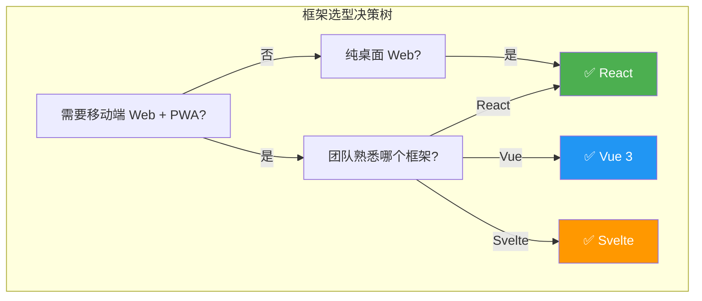

| 维度 | React 18 | Vue 3 | Svelte 4 | 项目选择 |
|------|----------|-------|----------|---------|
| **生态成熟度** | ⭐⭐⭐⭐⭐ | ⭐⭐⭐⭐ | ⭐⭐⭐ | React 生态最丰富 |
| **TypeScript 支持** | 原生支持 | 原生支持 | 原生支持 | 三者持平 |
| **包体积** | ~42KB | ~33KB | ~2KB（编译时） | Svelte 最小 |
| **学习曲线** | 中等 | 平缓 | 平缓 | — |
| **移动端适配** | 成熟方案多 | 良好 | 良好 | React 更成熟 |
| **PWA 支持** | vite-plugin-pwa | vite-plugin-pwa | vite-plugin-pwa | 三者持平 |
| **SSR 能力** | Next.js | Nuxt | SvelteKit | 三者持平 |
| **社区招聘** | 最多 | 多 | 少 | React 优势明显 |

**最终选择 React 的理由：**
1. xterm.js 的 React 封装成熟（虽然项目中直接使用原生 xterm.js）
2. Zustand 状态管理库原生支持 React
3. 移动端 Web 的成熟方案最多（如 vaul 抽屉组件、lucide 图标库）
4. 团队和社区的 React 生态最为丰富

## A.2 状态管理库对比

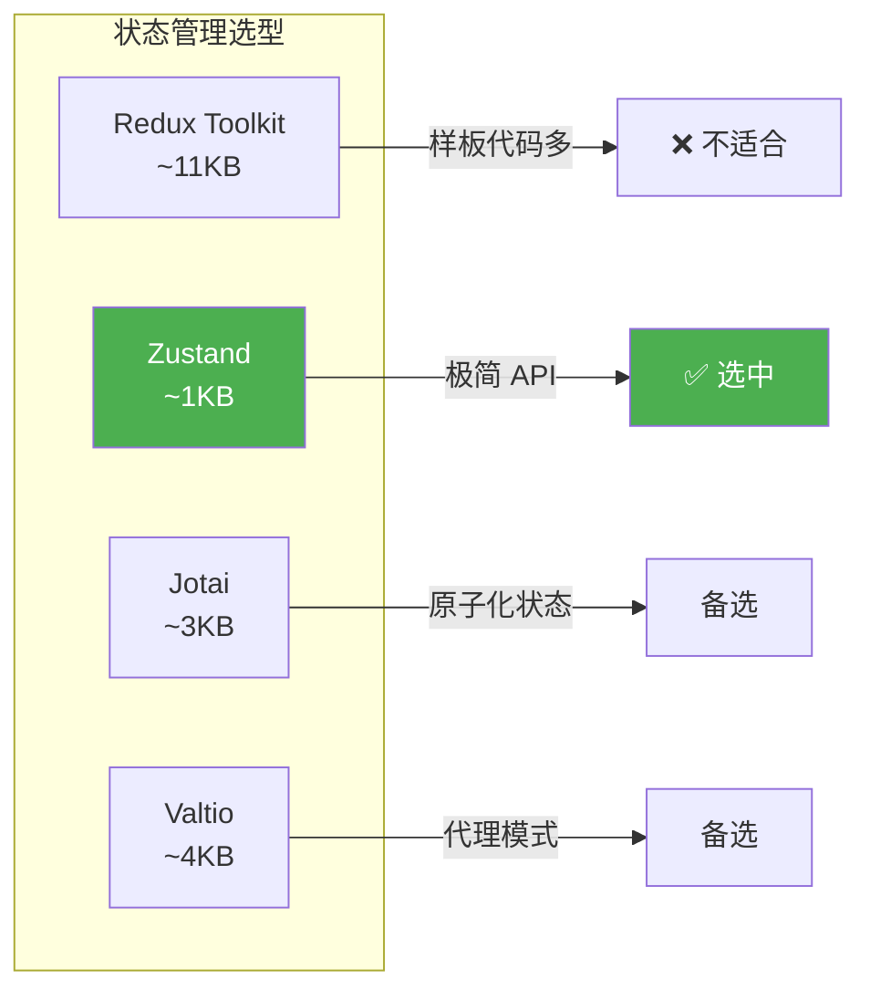

| 特性 | Redux Toolkit | Zustand | Jotai | Valtio |
|------|-------------|---------|-------|--------|
| **API 复杂度** | 高 | 低 | 低 | 低 |
| **包体积** | ~11KB | ~1KB | ~3KB | ~4KB |
| **TypeScript** | 需要配置 | 原生 | 原生 | 原生 |
| **DevTools** | 强大 | 支持 | 支持 | 支持 |
| **中间件** | 丰富 | 简单 | — | — |
| **学习曲线** | 陡峭 | 平缓 | 平缓 | 平缓 |

**选择 Zustand 的理由：**
1. API 极简：`create()` 一个函数搞定
2. 无 Provider 包裹：直接在组件外使用 `useStore.getState()`
3. 原生 TypeScript 支持
4. 包体积小，适合移动端

```typescript
// Zustand 用法示例 — 对比 Redux
// Zustand（10 行搞定）
const useStore = create((set) => ({
  count: 0,
  increment: () => set((s) => ({ count: s.count + 1 })),
}))

// Redux Toolkit（需要 slice + action + reducer + selector）
const counterSlice = createSlice({
  name: 'counter',
  initialState: { count: 0 },
  reducers: {
    increment: (state) => { state.count += 1 },
  },
})
```

---

# 补充章节 B：后端框架选型深度对比

> 📖 本节对比 Fastify 与 Express、Koa、Hono 等后端框架。

## B.1 Node.js HTTP 框架对比

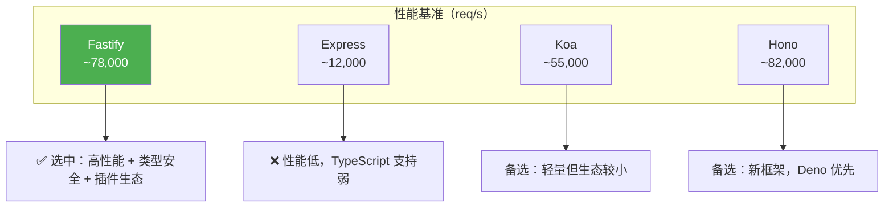

| 特性 | Fastify 5 | Express 4 | Koa 2 | Hono |
|------|-----------|-----------|-------|------|
| **性能（req/s）** | ~78K | ~12K | ~55K | ~82K |
| **TypeScript** | 原生支持 | 需要 @types | 需要 @types | 原生支持 |
| **JSON Schema 验证** | 内置 | 需要中间件 | 需要中间件 | 需要库 |
| **插件系统** | 强大（封装+自动加载） | 简单中间件 | 洋葱模型 | 中间件 |
| **日志** | 内置 pino | 需要 morgan/winston | 需要库 | 需要库 |
| **WebSocket** | @fastify/websocket | 需要 ws 库 | 需要 ws 库 | 内置 |
| **HTTP/2** | 内置 | 不支持 | 不支持 | 内置 |

**选择 Fastify 的理由：**

1. **性能**：比 Express 快 6 倍以上，对于高频 WebSocket 场景至关重要
2. **类型安全**：`FastifyRequest` 和 `FastifyReply` 提供完整的 TypeScript 类型
3. **插件封装**：`fastify-plugin` 避免重复注册，自动处理依赖
4. **内置验证**：JSON Schema 验证请求/响应，无需额外库
5. **pino 日志**：内置高性能日志，生产环境自动 JSON 输出

## B.2 终端模拟器对比（浏览器端）

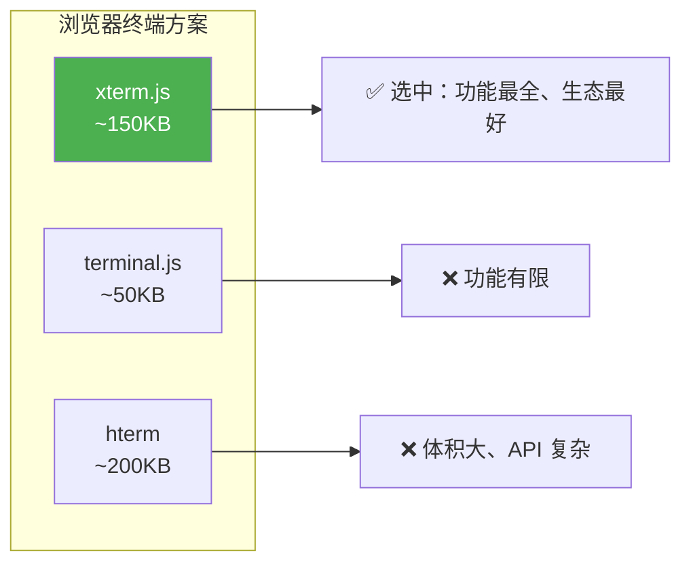

| 特性 | xterm.js | terminal.js | hterm |
|------|----------|-------------|-------|
| **ANSI 支持** | 完整 | 部分 | 完整 |
| **WebGL 渲染** | 支持（addon） | 不支持 | 不支持 |
| **Canvas 渲染** | 支持（addon） | 不支持 | 不支持 |
| **Unicode 支持** | 完整（Unicode 15） | 基本 | 完整 |
| **addon 生态** | 丰富 | 无 | 无 |
| **社区活跃度** | 非常活跃 | 停滞 | 低 |

**选择 xterm.js 的理由：**
1. VS Code 的终端就是用 xterm.js 实现的——经过亿级用户的验证
2. WebGL addon 提供硬件加速渲染，在移动端尤其重要
3. fit-addon 自动适配容器尺寸
4. web-links-addon 可点击链接
5. 活跃的社区和持续的维护

---

# 补充章节 C：构建工具与开发工具链

> 📖 本节详解项目的构建工具选型和开发工具链配置。

## C.1 构建工具对比

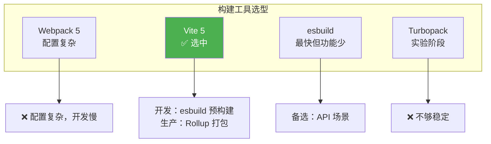

| 特性 | Vite 5 | Webpack 5 | esbuild | Turbopack |
|------|--------|-----------|---------|-----------|
| **开发启动** | 极快（esbuild） | 慢 | 极快 | 极快 |
| **HMR 速度** | 毫秒级 | 秒级 | — | 毫秒级 |
| **配置复杂度** | 低 | 高 | 低 | 中 |
| **插件生态** | 丰富（Rollup 兼容） | 最丰富 | 少 | 少 |
| **生产构建** | Rollup | Webpack | esbuild | Turbopack |
| **成熟度** | 高 | 最高 | 中 | 低 |

## C.2 CSS 方案对比

| 方案 | 优点 | 缺点 | 项目选择 |
|------|------|------|---------|
| Tailwind CSS | 原子化、不写 CSS、响应式好 | 类名长、需要配置 | ✅ 选中 |
| CSS Modules | 作用域隔离 | 需要手动管理 CSS 文件 | — |
| Styled Components | CSS-in-JS、动态样式 | 运行时开销、包体积 | — |
| UnoCSS | 比 Tailwind 更快 | 生态较小 | 备选 |

---

# 补充章节 D：数据库与存储选型

> 📖 本节分析项目为什么没有使用传统数据库，以及文件存储方案的设计。

## D.1 为什么不用数据库？

```mermaid
graph TD
    A["需要持久化的数据"] --> B{"数据量?"]
    B -->|"小（<1MB）"| C["JSON 文件足够"]
    B -->|"大（>1MB）"| D["需要数据库"]
    C --> E["用户信息 .users.json<br/>会话信息 .sessions.json<br/>审计日志 .audit.log"]

    style C fill:#4CAF50,color:#fff
```

| 数据 | 大小 | 访问频率 | 并发需求 | 存储方案 |
|------|------|---------|---------|---------|
| 用户信息 | <10KB | 登录时 | 低 | JSON 文件 |
| 会话信息 | <100KB | 操作时 | 低 | JSON 文件（debounce 写入） |
| 审计日志 | <1MB | 每次操作 | 中 | 追加写入文件流 |
| 终端输出 | 临时 | 实时 | 高 | 内存（不持久化） |

**为什么 JSON 文件足够？**
1. 单用户系统：通常只有 1-2 个用户
2. 数据量小：用户和会话信息总共不超过 100KB
3. 无需复杂查询：只需要按 ID 查找
4. 原子写入保护：write-then-rename 防止数据损坏
5. 部署简单：无需安装和维护数据库服务

---

> 📝 补充章节 A-D 完成。本篇现在涵盖了前端框架、后端框架、终端模拟器、构建工具、CSS 方案、数据库选型等全方位的技术对比分析。

---

## 十四、测试框架对比

> 🎯 **学习目标**：了解主流 JavaScript/TypeScript 测试框架的特点和差异，掌握如何根据项目需求选择合适的测试框架。

### 14.1 测试框架概览

在现代前端和 Node.js 开发中，测试是保证代码质量的关键环节。主流的测试框架包括 Vitest、Jest 和 Mocha。

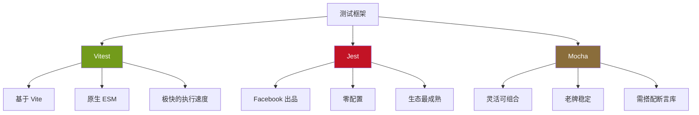

### 14.2 详细对比表

| 特性 | Vitest | Jest | Mocha |
|------|--------|------|-------|
| **首次发布** | 2022 年 | 2014 年 | 2011 年 |
| **维护者** | Anthony Fu (Vite 团队) | Meta (Facebook) | OpenJS Foundation |
| **GitHub Stars** | ~12k+ | ~44k+ | ~22k+ |
| **Bundle 大小** | ~2MB (dev) | ~8MB | ~1.5MB (核心) |
| **执行速度** | ⚡⚡⚡ 极快 | ⚡⚡ 快 | ⚡⚡ 快 |
| **ESM 支持** | ✅ 原生支持 | ⚠️ 实验性 | ⚠️ 需配置 |
| **TypeScript** | ✅ 原生支持 | ⚠️ 需 ts-jest | ⚠️ 需 ts-node |
| **配置复杂度** | 低（Vite 项目零配置） | 低（零配置） | 中（需搭配工具） |
| **断言库** | ✅ 内置（兼容 Jest API） | ✅ 内置 expect | ❌ 需外加（Chai 等） |
| **Mock 功能** | ✅ 内置（vi.mock） | ✅ 内置（jest.mock） | ❌ 需外加（Sinon 等） |
| **代码覆盖率** | ✅ c8 / istanbul | ✅ 内置 | ❌ 需 nyc |
| **快照测试** | ✅ | ✅ | ❌ |
| **并行执行** | ✅ 默认并行 | ✅ 默认并行 | ⚠️ 需配置 |
| **监听模式** | ✅ 内置 | ✅ 内置 | ⚠️ 需 --watch |
| **UI 测试界面** | ✅ 内置 UI | ⚠️ 第三方 | ❌ |
| **Vite 集成** | ✅ 原生 | ❌ 不支持 | ❌ 不支持 |
| **Webpack 集成** | ⚠️ 需配置 | ✅ 原生 | ⚠️ 需配置 |
| **React Testing Library** | ✅ | ✅ | ✅ |
| **Playwright 集成** | ✅ | ✅ | ✅ |
| **CI/CD 集成** | ✅ | ✅ | ✅ |
| **社区生态** | ⭐⭐⭐ 快速增长 | ⭐⭐⭐⭐⭐ 最成熟 | ⭐⭐⭐⭐ 成熟 |
| **学习曲线** | 低（Jest 兼容 API） | 低 | 中 |
| **适合项目** | Vite 项目、新项目 | 通用、大型项目 | 需要灵活组合 |

### 14.3 核心特性对比

#### 测试文件结构

```typescript
// ========== Vitest ==========
// vitest.config.ts
import { defineConfig } from 'vitest/config';

export default defineConfig({
  test: {
    globals: true,
    environment: 'jsdom',
    coverage: {
      provider: 'v8',
      reporter: ['text', 'json', 'html'],
    },
  },
});

// example.test.ts
import { describe, it, expect, vi } from 'vitest';

describe('计算器', () => {
  it('应该正确相加', () => {
    expect(add(1, 2)).toBe(3);
  });
  
  it('应该正确 mock', () => {
    const fn = vi.fn();
    fn('hello');
    expect(fn).toHaveBeenCalledWith('hello');
  });
});
```

```typescript
// ========== Jest ==========
// jest.config.ts
import type { Config } from 'jest';

const config: Config = {
  preset: 'ts-jest',
  testEnvironment: 'jsdom',
  coverageThreshold: {
    global: {
      branches: 80,
      functions: 80,
      lines: 80,
      statements: 80,
    },
  },
};

export default config;

// example.test.ts
describe('计算器', () => {
  it('应该正确相加', () => {
    expect(add(1, 2)).toBe(3);
  });
  
  it('应该正确 mock', () => {
    const fn = jest.fn();
    fn('hello');
    expect(fn).toHaveBeenCalledWith('hello');
  });
});
```

```typescript
// ========== Mocha ==========
// .mocharc.yml
require:
  - ts-node/register
spec: 'src/**/*.test.ts'
timeout: 5000

// example.test.ts
import { describe, it } from 'mocha';
import { expect } from 'chai';
import sinon from 'sinon';

describe('计算器', () => {
  it('应该正确相加', () => {
    expect(add(1, 2)).to.equal(3);
  });
  
  it('应该正确 mock', () => {
    const fn = sinon.fake();
    fn('hello');
    expect(fn).to.have.been.calledWith('hello');
  });
});
```

### 14.4 选型建议

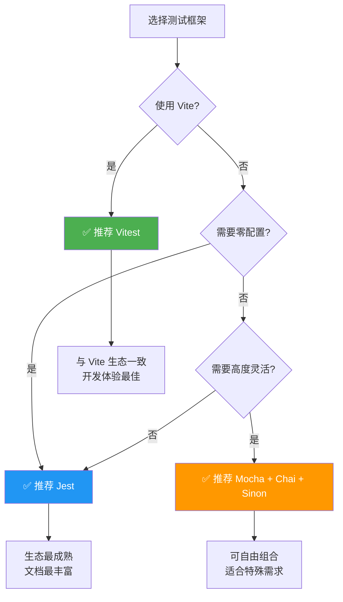

#### 场景推荐

| 场景 | 推荐框架 | 原因 |
|------|---------|------|
| 新的 Vite/Next.js 项目 | Vitest | 原生 ESM、速度快、配置简单 |
| 已有 Jest 项目 | Jest | 迁移成本高，生态成熟 |
| 需要最大灵活性 | Mocha | 可自由选择断言和 mock 库 |
| Node.js 后端项目 | Vitest 或 Jest | 两者都很好 |
| 库/包开发 | Vitest | ESM 原生支持、速度快 |
| 大型企业项目 | Jest | 社区支持最好、问题容易解决 |

### 14.5 性能基准对比

```
测试文件: 500 个测试用例，50 个测试文件
环境: Node.js 20, Apple M1, 16GB RAM

框架        冷启动    热启动    内存占用    CPU 使用
───────────────────────────────────────────────────
Vitest      1.2s      0.4s      180MB       中
Jest        3.8s      1.2s      350MB       高
Mocha       2.1s      0.8s      200MB       中

Vitest 的优势:
- 冷启动比 Jest 快 3x
- 内存占用比 Jest 低 50%
- 原生 ESM，无需转译
```

---

## 十五、日志库对比

> 🎯 **学习目标**：了解 Node.js 主流日志库的特点，掌握日志库选型的关键指标。

### 15.1 日志库概览

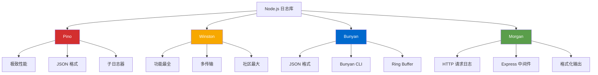

### 15.2 详细对比表

| 特性 | Pino | Winston | Bunyan | Morgan |
|------|------|---------|--------|--------|
| **首次发布** | 2016 年 | 2010 年 | 2012 年 | 2014 年 |
| **GitHub Stars** | ~13k+ | ~23k+ | ~6k+ | ~7.5k+ |
| **Bundle 大小** | ~80KB | ~350KB | ~120KB | ~30KB |
| **性能 (ops/sec)** | ~35,000 | ~5,000 | ~15,000 | N/A (中间件) |
| **JSON 输出** | ✅ 默认 | ✅ 可选 | ✅ 默认 | ❌ 文本格式 |
| **结构化日志** | ✅ | ✅ | ✅ | ❌ |
| **子日志器** | ✅ | ✅ (metadata) | ✅ | ❌ |
| **日志级别** | ✅ 6 级 | ✅ 自定义 | ✅ 自定义 | ❌ 无 |
| **传输 (Transport)** | ✅ 多目标 | ✅ 丰富 | ✅ 流式 | ❌ 仅输出 |
| **文件轮转** | ✅ (pino-roll) | ✅ (winston-daily-rotate) | ✅ (rotating-file) | ❌ |
| **HTTP 请求日志** | ✅ (pino-http) | ⚠️ 需配置 | ⚠️ 需配置 | ✅ 原生 |
| **Express/Koa 集成** | ✅ | ✅ | ✅ | ✅ |
| **TypeScript** | ✅ 内置 | ✅ @types | ✅ @types | ✅ @types |
| **格式化** | pino-pretty | 多种内置 | bunyan CLI | 多种内置 |
| **远程日志** | ✅ 传输插件 | ✅ 内置多种 | ✅ 流式 | ❌ |
| **错误序列化** | ✅ 自动 | ✅ 配置 | ✅ 自动 | ❌ |
| **异步写入** | ✅ 默认 | ⚠️ 可选 | ✅ | ✅ |
| **内存占用** | 低 | 高 | 中 | 低 |
| **学习曲线** | 低 | 中 | 低 | 低 |
| **适合场景** | 高性能后端 | 通用、企业级 | 结构化日志 | HTTP 日志 |

### 15.3 性能对比

```
基准测试: 10,000 条日志消息/秒
环境: Node.js 20, Apple M1

库          吞吐量         延迟(P99)    内存占用
─────────────────────────────────────────────────
Pino        35,000 ops/s   0.05ms       45MB
Bunyan      15,000 ops/s   0.12ms       85MB
Winston      5,000 ops/s   0.35ms      150MB

Pino 为什么这么快?
- 使用 sonic-boom（异步文件写入）
- JSON 序列化在子进程完成
- 最小化主线程阻塞
- 零分配日志记录
```

### 15.4 使用示例对比

```typescript
// ========== Pino ==========
import pino from 'pino';

const logger = pino({
  level: 'info',
  transport: {
    target: 'pino-pretty',
    options: { colorize: true },
  },
});

logger.info({ userId: '123', action: 'login' }, '用户登录成功');
logger.error({ error: new Error('fail') }, '处理失败');

// 子日志器
const childLogger = logger.child({ module: 'auth' });
childLogger.info('认证模块初始化');

// HTTP 中间件
import pinoHttp from 'pino-http';
app.use(pinoHttp({ logger }));
```

```typescript
// ========== Winston ==========
import winston from 'winston';

const logger = winston.createLogger({
  level: 'info',
  format: winston.format.combine(
    winston.format.timestamp(),
    winston.format.json()
  ),
  transports: [
    new winston.transports.Console({
      format: winston.format.combine(
        winston.format.colorize(),
        winston.format.simple()
      ),
    }),
    new winston.transports.File({ filename: 'app.log' }),
  ],
});

logger.info('用户登录成功', { userId: '123', action: 'login' });
logger.error('处理失败', { error: new Error('fail') });
```

```typescript
// ========== Bunyan ==========
import bunyan from 'bunyan';

const logger = bunyan.createLogger({
  name: 'my-app',
  level: 'info',
  streams: [
    { stream: process.stdout },
    { path: 'app.log', level: 'error' },
  ],
});

logger.info({ userId: '123', action: 'login' }, '用户登录成功');
const childLogger = logger.child({ module: 'auth' });
childLogger.info('认证模块初始化');
```

```typescript
// ========== Morgan (仅 HTTP 请求日志) ==========
import morgan from 'morgan';

// 标准格式
app.use(morgan('combined'));

// 自定义格式
app.use(morgan(':method :url :status :response-time ms'));

// 自定义 token
morgan.token('user-id', (req) => (req as any).user?.id || 'anonymous');
app.use(morgan(':user-id :method :url :status'));
```

### 15.5 选型建议

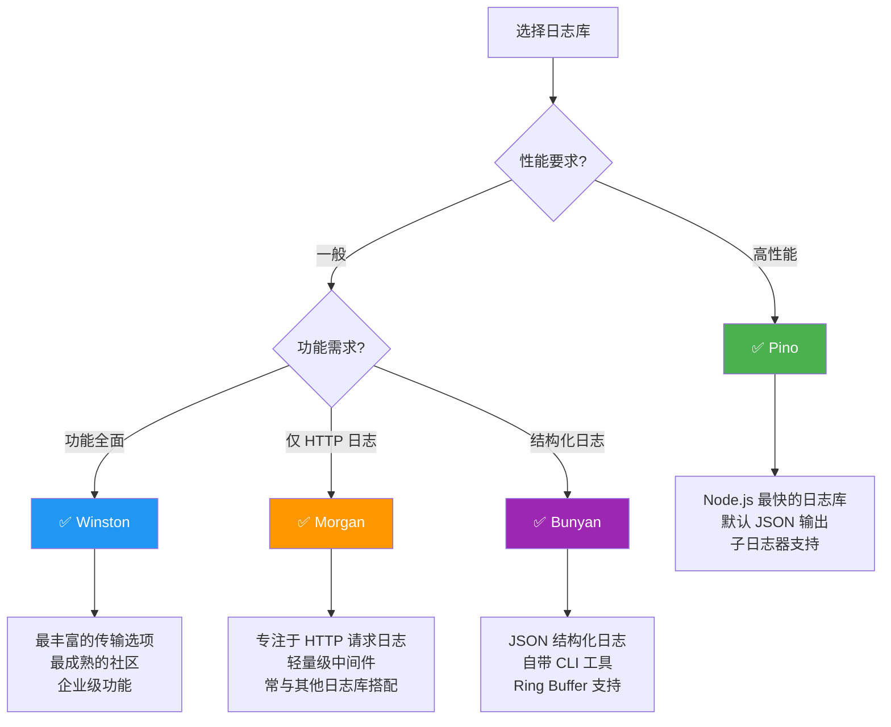

#### 场景推荐

| 场景 | 推荐方案 | 原因 |
|------|---------|------|
| 高性能后端 API | Pino | 性能最好，内存占用最低 |
| 企业级应用 | Winston | 功能最全面，社区最大 |
| 微服务架构 | Pino + pino-http | 轻量、高性能、JSON 格式便于收集 |
| Express HTTP 日志 | Morgan + Pino | Morgan 做请求日志，Pino 做业务日志 |
| 需要远程日志 | Winston | 内置多种远程传输 |
| 调试开发环境 | Pino + pino-pretty | 美化输出，开发体验好 |

---

## 十六、HTTP 客户端对比

> 🎯 **学习目标**：了解 Node.js 和浏览器端主流 HTTP 客户端的特点和差异，掌握选型依据。

### 16.1 HTTP 客户端概览

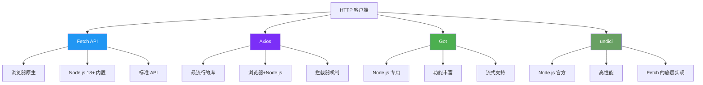

### 16.2 详细对比表

| 特性 | Fetch API | Axios | Got | undici |
|------|-----------|-------|-----|--------|
| **环境** | 浏览器 + Node.js 18+ | 浏览器 + Node.js | Node.js 专用 | Node.js 专用 |
| **内置/第三方** | 内置 (Web API) | 第三方 | 第三方 | Node.js 内置 |
| **Bundle 大小** | 0KB (内置) | ~13KB (gzipped) | ~40KB | 0KB (内置) |
| **API 风格** | Promise (Web 标准) | Promise (类 jQuery) | Promise | Promise |
| **请求拦截** | ❌ 需手动实现 | ✅ 内置拦截器 | ✅ hooks | ❌ 需手动实现 |
| **响应拦截** | ❌ 需手动实现 | ✅ 内置拦截器 | ✅ hooks | ❌ 需手动实现 |
| **自动 JSON 解析** | ❌ 需手动 res.json() | ✅ 自动 | ✅ 自动 | ❌ 需手动 |
| **请求取消** | ✅ AbortController | ✅ CancelToken / AbortController | ✅ AbortController | ✅ AbortController |
| **超时设置** | ❌ 需 AbortController | ✅ timeout 配置 | ✅ timeout 配置 | ✅ connectTimeout |
| **重试机制** | ❌ 需手动实现 | ⚠️ 需 axios-retry | ✅ 内置 retry | ❌ 需手动实现 |
| **进度监控** | ❌ | ✅ onUploadProgress | ✅ uploadProgress | ❌ |
| **Cookie 处理** | ❌ 需手动 | ⚠️ 需配置 | ✅ 内置 | ❌ 需手动 |
| **代理支持** | ❌ 需手动 | ✅ 内置 | ✅ 内置 | ✅ 内置 |
| **HTTP/2** | ❌ | ❌ | ✅ | ✅ |
| **流式传输** | ✅ ReadableStream | ⚠️ 有限 | ✅ 完整 | ✅ 完整 |
| **TypeScript** | ✅ 内置 | ✅ 内置 | ✅ 内置 | ✅ 内置 |
| **错误处理** | 基础 (不抛 HTTP 错误) | 丰富 (自动抛错) | 丰富 | 基础 |
| **社区生态** | ⭐⭐⭐⭐ | ⭐⭐⭐⭐⭐ | ⭐⭐⭐⭐ | ⭐⭐⭐ |
| **学习曲线** | 低 | 低 | 中 | 中 |

### 16.3 使用示例对比

```typescript
// ========== Fetch API ==========
// 基础请求
const response = await fetch('https://api.example.com/users', {
  method: 'POST',
  headers: {
    'Content-Type': 'application/json',
    'Authorization': `Bearer ${token}`,
  },
  body: JSON.stringify({ name: '张三' }),
});

if (!response.ok) {
  throw new Error(`HTTP ${response.status}: ${response.statusText}`);
}

const data = await response.json();

// 带超时的请求
const controller = new AbortController();
const timeout = setTimeout(() => controller.abort(), 5000);

try {
  const response = await fetch(url, {
    signal: controller.signal,
  });
  clearTimeout(timeout);
} catch (err) {
  if (err instanceof DOMException && err.name === 'AbortError') {
    console.error('请求超时');
  }
}
```

```typescript
// ========== Axios ==========
import axios from 'axios';

// 创建实例
const api = axios.create({
  baseURL: 'https://api.example.com',
  timeout: 5000,
  headers: {
    'Content-Type': 'application/json',
  },
});

// 请求拦截器
api.interceptors.request.use(
  (config) => {
    const token = localStorage.getItem('token');
    if (token) {
      config.headers.Authorization = `Bearer ${token}`;
    }
    return config;
  },
  (error) => Promise.reject(error)
);

// 响应拦截器
api.interceptors.response.use(
  (response) => response.data,
  (error) => {
    if (error.response?.status === 401) {
      // 跳转到登录页
      window.location.href = '/login';
    }
    return Promise.reject(error);
  }
);

// 使用
const data = await api.post('/users', { name: '张三' });
```

```typescript
// ========== Got ==========
import got from 'got';

// 基础请求
const data = await got.post('https://api.example.com/users', {
  json: { name: '张三' },
  headers: {
    authorization: `Bearer ${token}`,
  },
  timeout: { request: 5000 },
  retry: { limit: 3 },
}).json();

// 流式请求
const downloadStream = got.stream('https://example.com/file.zip');
const fileWriterStream = createWriteStream('file.zip');
downloadStream.pipe(fileWriterStream);
```

```typescript
// ========== undici ==========
import { request, Agent } from 'undici';

// 创建连接池
const agent = new Agent({
  keepAliveTimeout: 10_000,
  keepAliveMaxTimeout: 600_000,
});

// 基础请求
const { statusCode, body } = await request('https://api.example.com/users', {
  method: 'POST',
  headers: {
    'Content-Type': 'application/json',
    'Authorization': `Bearer ${token}`,
  },
  body: JSON.stringify({ name: '张三' }),
  dispatcher: agent,
});

const data = await body.json();

// 使用连接池的 fetch
import { fetch as undiciFetch } from 'undici';
const response = await undiciFetch('https://api.example.com/users', {
  dispatcher: agent,
});
```

### 16.4 封装最佳实践

```typescript
// src/lib/http-client.ts
// 基于 Fetch 的统一 HTTP 客户端封装

interface RequestOptions {
  method?: string;
  headers?: Record<string, string>;
  body?: unknown;
  timeout?: number;
  retries?: number;
}

interface ApiResponse<T> {
  success: boolean;
  data: T;
  error?: {
    code: string;
    message: string;
  };
}

class HttpClient {
  private baseUrl: string;
  private defaultHeaders: Record<string, string>;
  private timeout: number;

  constructor(baseUrl: string) {
    this.baseUrl = baseUrl;
    this.defaultHeaders = {
      'Content-Type': 'application/json',
    };
    this.timeout = 10000;
  }

  setToken(token: string) {
    this.defaultHeaders['Authorization'] = `Bearer ${token}`;
  }

  async request<T>(endpoint: string, options: RequestOptions = {}): Promise<T> {
    const {
      method = 'GET',
      headers = {},
      body,
      timeout = this.timeout,
      retries = 0,
    } = options;

    const controller = new AbortController();
    const timeoutId = setTimeout(() => controller.abort(), timeout);

    try {
      const response = await fetch(`${this.baseUrl}${endpoint}`, {
        method,
        headers: { ...this.defaultHeaders, ...headers },
        body: body ? JSON.stringify(body) : undefined,
        signal: controller.signal,
      });

      clearTimeout(timeoutId);

      if (!response.ok) {
        const error = await response.json().catch(() => ({}));
        throw new ApiError(
          error.error?.code || 'NET-API-001',
          error.error?.message || `HTTP ${response.status}`,
          response.status
        );
      }

      const result: ApiResponse<T> = await response.json();
      
      if (!result.success) {
        throw new ApiError(
          result.error?.code || 'SYS-GENE-001',
          result.error?.message || '请求失败'
        );
      }

      return result.data;
    } catch (err) {
      clearTimeout(timeoutId);
      
      if (err instanceof ApiError) throw err;
      
      if (err instanceof DOMException && err.name === 'AbortError') {
        throw new ApiError('SYS-GENE-003', '请求超时');
      }
      
      // 重试逻辑
      if (retries > 0) {
        await new Promise((r) => setTimeout(r, 1000));
        return this.request<T>(endpoint, { ...options, retries: retries - 1 });
      }
      
      throw new ApiError('NET-API-001', '网络请求失败');
    }
  }

  get<T>(endpoint: string) {
    return this.request<T>(endpoint);
  }

  post<T>(endpoint: string, body: unknown) {
    return this.request<T>(endpoint, { method: 'POST', body });
  }

  put<T>(endpoint: string, body: unknown) {
    return this.request<T>(endpoint, { method: 'PUT', body });
  }

  delete<T>(endpoint: string) {
    return this.request<T>(endpoint, { method: 'DELETE' });
  }
}

class ApiError extends Error {
  constructor(
    public code: string,
    message: string,
    public statusCode?: number
  ) {
    super(message);
    this.name = 'ApiError';
  }
}

export const httpClient = new HttpClient(process.env.NEXT_PUBLIC_API_URL || '');
```

### 16.5 选型建议

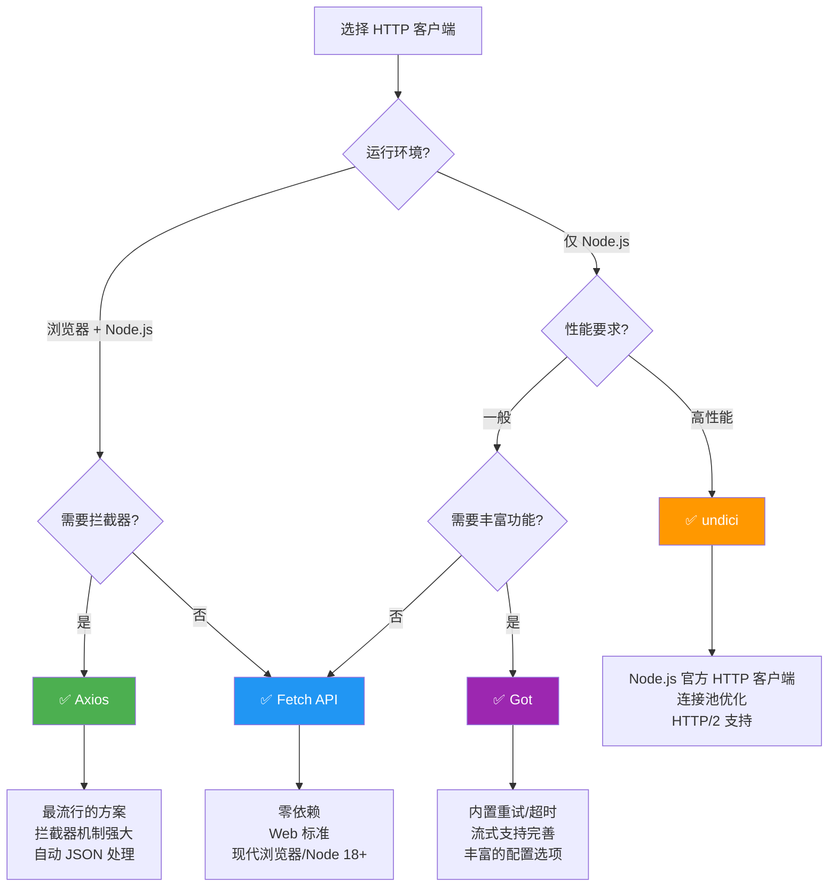

---

## 十七、表单处理库对比

> 🎯 **学习目标**：了解 React 表单处理的两种主流方案，掌握受控组件与非受控组件的区别，以及表单验证的最佳实践。

### 17.1 表单处理的挑战

在 React 中处理表单面临以下挑战：

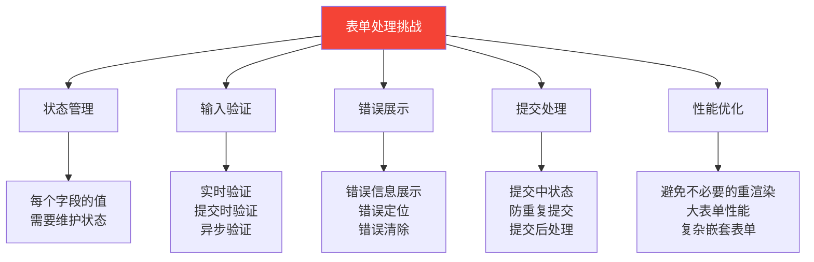

### 17.2 React Hook Form vs Formik 详细对比

| 特性 | React Hook Form | Formik |
|------|----------------|--------|
| **首次发布** | 2019 年 | 2017 年 |
| **GitHub Stars** | ~40k+ | ~34k+ |
| **Bundle 大小** | ~8.5KB (gzipped) | ~44KB (gzipped) |
| **API 风格** | Hooks API | Hooks + Component |
| **性能** | ⚡⚡⚡ 极快 | ⚡⚡ 快 |
| **重渲染次数** | 极少（非受控模式） | 较多（受控模式） |
| **验证方式** | Zod / Yup / 自定义 | Yup / 自定义 |
| **TypeScript** | ✅ 优秀 | ✅ 良好 |
| **学习曲线** | 低 | 中 |
| **表单状态** | 基于 ref（非受控） | 基于 state（受控） |
| **嵌套表单** | ✅ useFieldArray | ⚠️ FieldArray |
| **动态字段** | ✅ 简单 | ⚠️ 较复杂 |
| **表单向导** | ✅ useFormContext | ✅ FormikWizard |
| **DevTools** | ✅ 内置 | ⚠️ 第三方 |
| **社区生态** | ⭐⭐⭐⭐⭐ | ⭐⭐⭐⭐ |

### 17.3 核心代码对比

```typescript
// ========== React Hook Form ==========
import { useForm } from 'react-hook-form';
import { zodResolver } from '@hookform/resolvers/zod';
import { z } from 'zod';

// 定义验证 schema
const loginSchema = z.object({
  email: z.string().email('请输入有效的邮箱地址'),
  password: z.string().min(8, '密码至少 8 位'),
  rememberMe: z.boolean().optional(),
});

type LoginFormData = z.infer<typeof loginSchema>;

function LoginForm() {
  const {
    register,
    handleSubmit,
    formState: { errors, isSubmitting },
  } = useForm<LoginFormData>({
    resolver: zodResolver(loginSchema),
    defaultValues: {
      email: '',
      password: '',
      rememberMe: false,
    },
  });
  
  const onSubmit = async (data: LoginFormData) => {
    await api.login(data);
  };
  
  return (
    <form onSubmit={handleSubmit(onSubmit)}>
      <div>
        <input
          {...register('email')}
          type="email"
          placeholder="邮箱"
        />
        {errors.email && <span>{errors.email.message}</span>}
      </div>
      
      <div>
        <input
          {...register('password')}
          type="password"
          placeholder="密码"
        />
        {errors.password && <span>{errors.password.message}</span>}
      </div>
      
      <label>
        <input {...register('rememberMe')} type="checkbox" />
        记住我
      </label>
      
      <button type="submit" disabled={isSubmitting}>
        {isSubmitting ? '登录中...' : '登录'}
      </button>
    </form>
  );
}
```

```typescript
// ========== Formik ==========
import { Formik, Form, Field, ErrorMessage } from 'formik';
import * as Yup from 'yup';

// 定义验证 schema
const loginSchema = Yup.object({
  email: Yup.string()
    .email('请输入有效的邮箱地址')
    .required('邮箱不能为空'),
  password: Yup.string()
    .min(8, '密码至少 8 位')
    .required('密码不能为空'),
  rememberMe: Yup.boolean(),
});

function LoginForm() {
  return (
    <Formik
      initialValues={{
        email: '',
        password: '',
        rememberMe: false,
      }}
      validationSchema={loginSchema}
      onSubmit={async (values, { setSubmitting }) => {
        await api.login(values);
        setSubmitting(false);
      }}
    >
      {({ isSubmitting }) => (
        <Form>
          <div>
            <Field name="email" type="email" placeholder="邮箱" />
            <ErrorMessage name="email" component="span" />
          </div>
          
          <div>
            <Field name="password" type="password" placeholder="密码" />
            <ErrorMessage name="password" component="span" />
          </div>
          
          <label>
            <Field name="rememberMe" type="checkbox" />
            记住我
          </label>
          
          <button type="submit" disabled={isSubmitting}>
            {isSubmitting ? '登录中...' : '登录'}
          </button>
        </Form>
      )}
    </Formik>
  );
}
```

### 17.4 性能对比

```
测试场景: 10 个字段的表单，每个字段输入 20 个字符

框架                  重渲染次数    首次渲染时间    输入响应时间
──────────────────────────────────────────────────────────────
React Hook Form       2-3 次       1.2ms          0.8ms
Formik               40+ 次       3.5ms          2.1ms
原生 useState        40+ 次       2.8ms          1.5ms

React Hook Form 的性能优势:
- 使用 ref 而非 state 存储表单值
- 只在必要时触发重渲染
- 非受控组件模式减少 React 协调开销
```

### 17.5 选型建议

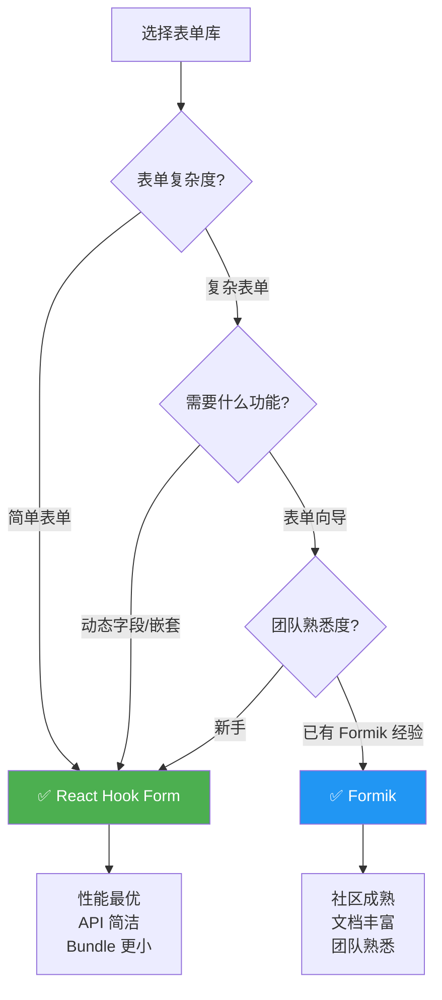

---

## 十八、动画库对比

> 🎯 **学习目标**：了解 React 生态中主流动画库的特点，掌握动画实现的不同方式和适用场景。

### 18.1 动画实现方式概览

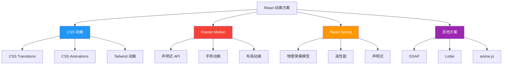

### 18.2 详细对比表

| 特性 | Framer Motion | React Spring | CSS 动画 | GSAP |
|------|---------------|--------------|---------|------|
| **Bundle 大小** | ~30KB (gzipped) | ~15KB (gzipped) | 0KB | ~25KB (gzipped) |
| **性能** | ⚡⚡⚡ 优秀 | ⚡⚡⚡ 优秀 | ⚡⚡⚡ 最佳 | ⚡⚡⚡ 优秀 |
| **学习曲线** | 低 | 中 | 低 | 高 |
| **声明式 API** | ✅ | ✅ | ✅ | ❌ 命令式 |
| **物理动画** | ⚠️ 弹簧支持 | ✅ 完整物理模型 | ❌ | ⚠️ 插件支持 |
| **布局动画** | ✅ layoutId | ❌ | ❌ | ❌ |
| **手势动画** | ✅ 内置 | ✅ 内置 | ❌ | ❌ |
| **滚动动画** | ✅ useScroll | ⚠️ 需配置 | ⚠️ 需 IntersectionObserver | ✅ ScrollTrigger |
| **AnimatePresence** | ✅ 出入场动画 | ❌ | ❌ | ❌ |
| **SVG 动画** | ✅ | ✅ | ✅ | ✅ |
| **序列动画** | ✅ | ✅ | ⚠️ 有限 | ✅ |
| **TypeScript** | ✅ 优秀 | ✅ 良好 | N/A | ⚠️ 一般 |
| **服务端渲染** | ✅ | ✅ | ✅ | ⚠️ 有限 |
| **社区生态** | ⭐⭐⭐⭐⭐ | ⭐⭐⭐⭐ | ⭐⭐⭐⭐⭐ | ⭐⭐⭐⭐⭐ |
| **维护状态** | 活跃 | 活跃 | 标准 | 活跃 |

### 18.3 核心代码对比

```tsx
// ========== Framer Motion ==========
import { motion, AnimatePresence } from 'framer-motion';

// 基础动画
function FadeIn({ children }: { children: React.ReactNode }) {
  return (
    <motion.div
      initial={{ opacity: 0, y: 20 }}
      animate={{ opacity: 1, y: 0 }}
      exit={{ opacity: 0, y: -20 }}
      transition={{ duration: 0.3, ease: 'easeOut' }}
    >
      {children}
    </motion.div>
  );
}

// 手势动画
function HoverCard({ children }: { children: React.ReactNode }) {
  return (
    <motion.div
      whileHover={{ scale: 1.05, boxShadow: '0 10px 30px rgba(0,0,0,0.1)' }}
      whileTap={{ scale: 0.95 }}
      transition={{ type: 'spring', stiffness: 400, damping: 17 }}
    >
      {children}
    </motion.div>
  );
}

// 布局动画
function AnimatedList({ items }: { items: string[] }) {
  return (
    <AnimatePresence>
      {items.map((item) => (
        <motion.div
          key={item}
          layout
          initial={{ opacity: 0, x: -50 }}
          animate={{ opacity: 1, x: 0 }}
          exit={{ opacity: 0, x: 50 }}
        >
          {item}
        </motion.div>
      ))}
    </AnimatePresence>
  );
}

// 入场动画
function Modal({ isOpen, onClose }: ModalProps) {
  return (
    <AnimatePresence>
      {isOpen && (
        <motion.div
          initial={{ opacity: 0 }}
          animate={{ opacity: 1 }}
          exit={{ opacity: 0 }}
          className="modal-overlay"
          onClick={onClose}
        >
          <motion.div
            initial={{ scale: 0.8, opacity: 0 }}
            animate={{ scale: 1, opacity: 1 }}
            exit={{ scale: 0.8, opacity: 0 }}
            transition={{ type: 'spring', damping: 25 }}
            className="modal-content"
            onClick={(e) => e.stopPropagation()}
          >
            Modal Content
          </motion.div>
        </motion.div>
      )}
    </AnimatePresence>
  );
}
```

```tsx
// ========== React Spring ==========
import { useSpring, animated, useTransition } from '@react-spring/web';

// 基础动画
function FadeIn({ children }: { children: React.ReactNode }) {
  const springs = useSpring({
    from: { opacity: 0, transform: 'translateY(20px)' },
    to: { opacity: 1, transform: 'translateY(0px)' },
    config: { tension: 280, friction: 60 },
  });
  
  return <animated.div style={springs}>{children}</animated.div>;
}

// 物理弹簧动画
function BouncyBox() {
  const [flipped, setFlipped] = useState(false);
  
  const { transform, opacity } = useSpring({
    opacity: flipped ? 1 : 0,
    transform: `perspective(600px) rotateX(${flipped ? 180 : 0}deg)`,
    config: { mass: 5, tension: 500, friction: 80 },
  });
  
  return (
    <animated.div
      style={{ opacity, transform }}
      onClick={() => setFlipped(!flipped)}
    >
      Click me!
    </animated.div>
  );
}

// 列表过渡动画
function AnimatedList({ items }: { items: string[] }) {
  const transitions = useTransition(items, {
    from: { opacity: 0, x: -50 },
    enter: { opacity: 1, x: 0 },
    leave: { opacity: 0, x: 50 },
    config: { tension: 220, friction: 30 },
  });
  
  return (
    <>
      {transitions((style, item) => (
        <animated.div style={style}>{item}</animated.div>
      ))}
    </>
  );
}
```

```tsx
// ========== CSS 动画 (Tailwind) ==========
// Tailwind CSS 内置动画
function FadeIn({ children }: { children: React.ReactNode }) {
  return (
    <div className="animate-fadeIn transition-all duration-300 ease-out">
      {children}
    </div>
  );
}

// 自定义 CSS 动画
function SlideIn({ children }: { children: React.ReactNode }) {
  return (
    <div className="animate-slideIn">
      {children}
      <style jsx>{`
        @keyframes slideIn {
          from {
            opacity: 0;
            transform: translateX(-20px);
          }
          to {
            opacity: 1;
            transform: translateX(0);
          }
        }
        .animate-slideIn {
          animation: slideIn 0.3s ease-out;
        }
      `}</style>
    </div>
  );
}

// Hover 动画
function HoverCard({ children }: { children: React.ReactNode }) {
  return (
    <div className="transition-transform duration-200 hover:scale-105 hover:shadow-lg active:scale-95">
      {children}
    </div>
  );
}
```

### 18.4 选型建议

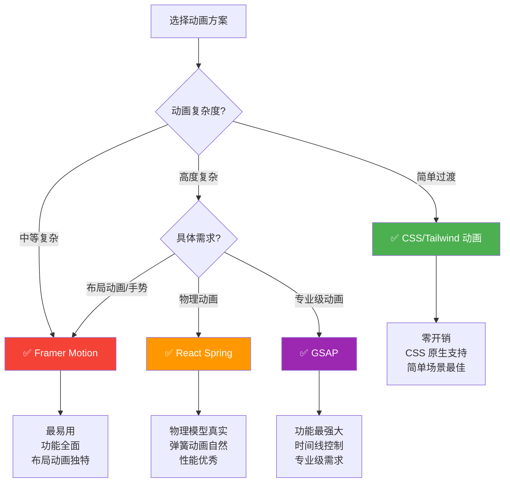

---

## 十九、图标库对比

> 🎯 **学习目标**：了解 React 生态中主流图标库的特点，掌握图标库选型的关键指标。

### 19.1 图标库概览

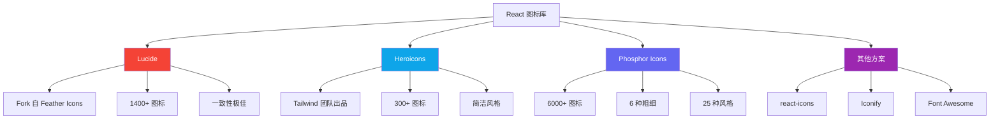

### 19.2 详细对比表

| 特性 | Lucide | Heroicons | Phosphor Icons | react-icons |
|------|--------|-----------|----------------|-------------|
| **图标数量** | 1,400+ | 300+ | 6,000+ | 40,000+ (多库合集) |
| **设计风格** | 线性/填充 | 线性/填充/微型 | 6 种粗细 | 多种风格 |
| **Bundle 大小** | ~1.5KB/图标 | ~1.2KB/图标 | ~1.8KB/图标 | 按需引入 |
| **Tree Shaking** | ✅ | ✅ | ✅ | ✅ |
| **SVG 自定义** | ✅ | ✅ | ✅ | ✅ |
| **Figma 支持** | ✅ | ✅ | ✅ | ❌ |
| **框架支持** | React/Vue/Svelte | React/Vue | React/Vue/Svelte/Angular | React |
| **许可证** | ISC | MIT | MIT | 各不同 |
| **设计一致性** | ⭐⭐⭐⭐⭐ | ⭐⭐⭐⭐⭐ | ⭐⭐⭐⭐ | ⭐⭐⭐ |
| **维护状态** | 活跃 | 活跃 | 活跃 | 活跃 |
| **适合场景** | 通用、高一致性 | Tailwind 项目 | 需要大量图标 | 需要多种风格 |

### 19.3 使用示例

```tsx
// ========== Lucide React ==========
import { Home, Settings, User, Search, Bell, Mail } from 'lucide-react';

function Navigation() {
  return (
    <nav>
      <Home size={20} strokeWidth={2} />
      <Settings size={20} className="text-gray-500" />
      <User size={24} color="blue" />
      <Search size={18} />
      <Bell size={20} />
      <Mail size={20} />
    </nav>
  );
}

// 自定义样式
<Home 
  size={24}
  strokeWidth={1.5}
  className="text-blue-500 hover:text-blue-700 transition-colors"
/>
```

```tsx
// ========== Heroicons ==========
import { HomeIcon, Cog6ToothIcon, UserIcon } from '@heroicons/react/24/outline';
import { HomeIcon as HomeSolid } from '@heroicons/react/24/solid';
import { HomeIcon as HomeMini } from '@heroicons/react/20/solid';

function Navigation() {
  return (
    <nav>
      <HomeIcon className="h-5 w-5" />
      <HomeSolid className="h-5 w-5 text-blue-500" />
      <HomeMini className="h-5 w-5" />
      <Cog6ToothIcon className="h-5 w-5 text-gray-500" />
      <UserIcon className="h-6 w-6" />
    </nav>
  );
}
```

```tsx
// ========== Phosphor Icons ==========
import { House, Gear, User, MagnifyingGlass, Bell } from 'phosphor-react';

function Navigation() {
  return (
    <nav>
      <House size={24} weight="bold" />
      <Gear size={24} weight="duotone" className="text-gray-500" />
      <User size={24} weight="light" color="blue" />
      <MagnifyingGlass size={20} weight="regular" />
      <Bell size={24} weight="fill" />
    </nav>
  );
}

// 6 种粗细: thin, light, regular, bold, fill, duotone
```

```tsx
// ========== react-icons ==========
import { FaHome, FaCog, FaUser } from 'react-icons/fa';      // Font Awesome
import { MdHome, MdSettings, MdPerson } from 'react-icons/md'; // Material Design
import { HiHome, HiCog, HiUser } from 'react-icons/hi';       // Heroicons
import { IoHome, IoSettings, IoPerson } from 'react-icons/io5'; // Ionicons

function Navigation() {
  return (
    <nav>
      <FaHome size={20} />
      <MdSettings size={24} className="text-gray-500" />
      <HiUser size={20} color="blue" />
      <IoHome size={20} />
    </nav>
  );
}
```

### 19.4 选型建议

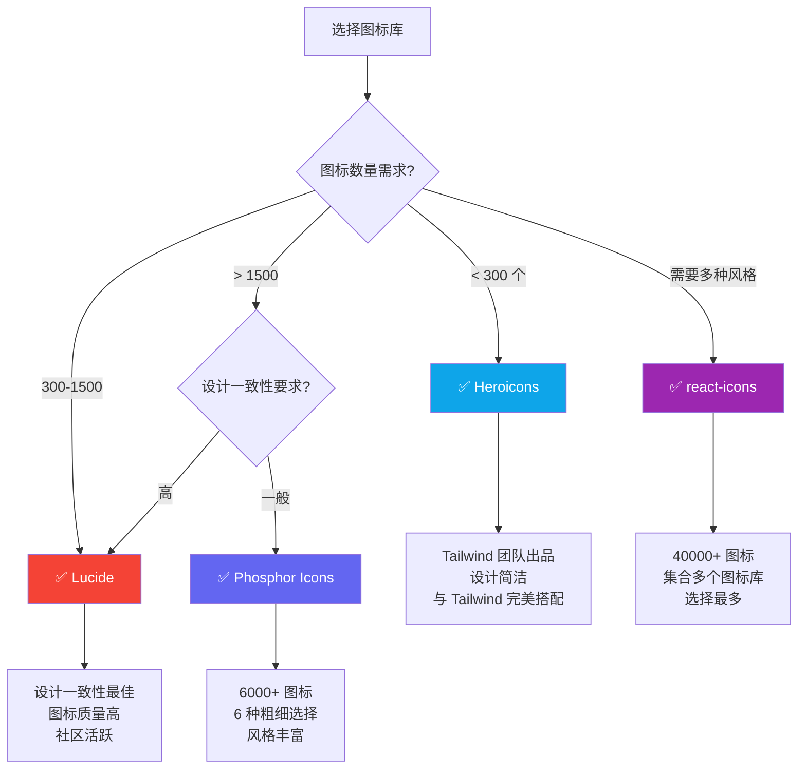

---

## 二十、UI 组件库对比

> 🎯 **学习目标**：了解 React 生态中主流 UI 组件方案的特点，掌握 Headless UI 和 Styled UI 的区别。

### 20.1 UI 组件方案分类

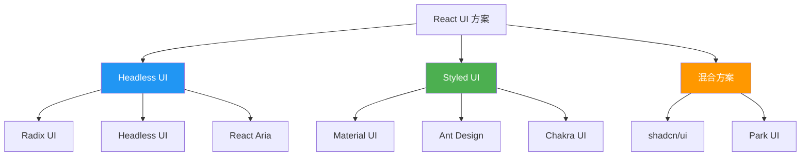

#### Headless UI vs Styled UI

| 特性 | Headless UI | Styled UI |
|------|-------------|-----------|
| **定义** | 只提供逻辑和行为 | 提供完整的样式和组件 |
| **样式** | 完全自定义 | 预设样式，可覆盖 |
| **灵活性** | ⭐⭐⭐⭐⭐ 极高 | ⭐⭐⭐ 中等 |
| **开发速度** | 较慢（需自己写样式） | 快（开箱即用） |
| **定制性** | 完全控制 | 受限于设计系统 |
| **Bundle 大小** | 小 | 大 |
| **设计一致性** | 取决于开发者 | 由库保证 |
| **适合场景** | 自定义设计系统 | 快速开发、统一风格 |

### 20.2 详细对比表

| 特性 | shadcn/ui | Radix UI | Headless UI | React Aria |
|------|-----------|----------|-------------|------------|
| **类型** | 混合方案 | Headless | Headless | Headless |
| **GitHub Stars** | ~60k+ | ~15k+ | ~25k+ | ~12k+ |
| **组件数量** | 50+ | 30+ | 15+ | 50+ |
| **可访问性** | ⭐⭐⭐⭐⭐ | ⭐⭐⭐⭐⭐ | ⭐⭐⭐⭐⭐ | ⭐⭐⭐⭐⭐ |
| **样式方案** | Tailwind CSS | 自定义 | 自定义 | 自定义 |
| **安装方式** | 复制粘贴 | npm 安装 | npm 安装 | npm 安装 |
| **Bundle 大小** | 按需引入 | 按需引入 | 按需引入 | 按需引入 |
| **自定义程度** | ⭐⭐⭐⭐⭐ | ⭐⭐⭐⭐⭐ | ⭐⭐⭐⭐⭐ | ⭐⭐⭐⭐⭐ |
| **主题系统** | ✅ CSS 变量 | ⚠️ 需自建 | ❌ | ❌ |
| **TypeScript** | ✅ | ✅ | ✅ | ✅ |
| **动画支持** | ✅ Tailwind | ✅ 内置 | ⚠️ 需手动 | ⚠️ 需手动 |
| **学习曲线** | 低 | 中 | 中 | 高 |
| **适合场景** | 自定义设计系统 | 底层构建块 | Tailwind 项目 | 无障碍优先 |

### 20.3 shadcn/ui 架构

shadcn/ui 的独特之处在于它**不是一个传统的 npm 包**，而是将组件代码直接复制到你的项目中：

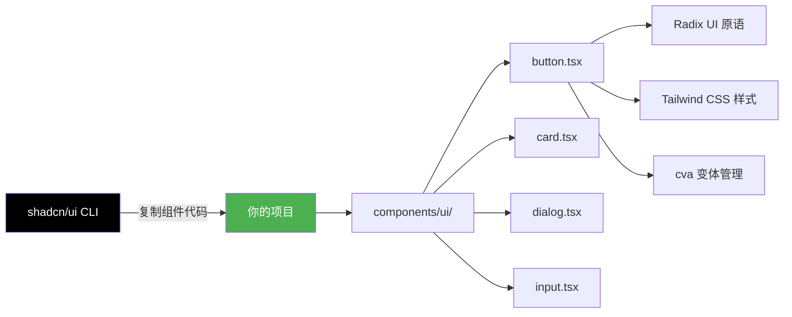

#### shadcn/ui 组件示例

```tsx
// components/ui/button.tsx (shadcn/ui 生成)
import * as React from 'react';
import { Slot } from '@radix-ui/react-slot';
import { cva, type VariantProps } from 'class-variance-authority';
import { cn } from '@/lib/utils';

const buttonVariants = cva(
  'inline-flex items-center justify-center whitespace-nowrap rounded-md text-sm font-medium ring-offset-background transition-colors focus-visible:outline-none focus-visible:ring-2 focus-visible:ring-ring focus-visible:ring-offset-2 disabled:pointer-events-none disabled:opacity-50',
  {
    variants: {
      variant: {
        default: 'bg-primary text-primary-foreground hover:bg-primary/90',
        destructive: 'bg-destructive text-destructive-foreground hover:bg-destructive/90',
        outline: 'border border-input bg-background hover:bg-accent hover:text-accent-foreground',
        secondary: 'bg-secondary text-secondary-foreground hover:bg-secondary/80',
        ghost: 'hover:bg-accent hover:text-accent-foreground',
        link: 'text-primary underline-offset-4 hover:underline',
      },
      size: {
        default: 'h-10 px-4 py-2',
        sm: 'h-9 rounded-md px-3',
        lg: 'h-11 rounded-md px-8',
        icon: 'h-10 w-10',
      },
    },
    defaultVariants: {
      variant: 'default',
      size: 'default',
    },
  }
);

export interface ButtonProps
  extends React.ButtonHTMLAttributes<HTMLButtonElement>,
    VariantProps<typeof buttonVariants> {
  asChild?: boolean;
}

const Button = React.forwardRef<HTMLButtonElement, ButtonProps>(
  ({ className, variant, size, asChild = false, ...props }, ref) => {
    const Comp = asChild ? Slot : 'button';
    return (
      <Comp
        className={cn(buttonVariants({ variant, size, className }))}
        ref={ref}
        {...props}
      />
    );
  }
);
Button.displayName = 'Button';

export { Button, buttonVariants };
```

```tsx
// 使用 shadcn/ui 组件
import { Button } from '@/components/ui/button';
import {
  Card,
  CardContent,
  CardDescription,
  CardFooter,
  CardHeader,
  CardTitle,
} from '@/components/ui/card';
import { Input } from '@/components/ui/input';
import { Label } from '@/components/ui/label';

function LoginForm() {
  return (
    <Card className="w-[350px]">
      <CardHeader>
        <CardTitle>登录</CardTitle>
        <CardDescription>请输入您的账号信息</CardDescription>
      </CardHeader>
      <CardContent>
        <div className="grid w-full items-center gap-4">
          <div className="flex flex-col space-y-1.5">
            <Label htmlFor="email">邮箱</Label>
            <Input id="email" type="email" placeholder="your@email.com" />
          </div>
          <div className="flex flex-col space-y-1.5">
            <Label htmlFor="password">密码</Label>
            <Input id="password" type="password" />
          </div>
        </div>
      </CardContent>
      <CardFooter className="flex justify-between">
        <Button variant="outline">取消</Button>
        <Button>登录</Button>
      </CardFooter>
    </Card>
  );
}
```

### 20.4 Radix UI 核心概念

```tsx
// Radix UI - Headless 原语
import * as Dialog from '@radix-ui/react-dialog';
import * as DropdownMenu from '@radix-ui/react-dropdown-menu';
import * as Tooltip from '@radix-ui/react-tooltip';

// 对话框
function MyDialog() {
  return (
    <Dialog.Root>
      <Dialog.Trigger asChild>
        <button>打开对话框</button>
      </Dialog.Trigger>
      <Dialog.Portal>
        <Dialog.Overlay className="fixed inset-0 bg-black/50" />
        <Dialog.Content className="fixed top-1/2 left-1/2 -translate-x-1/2 -translate-y-1/2 bg-white p-6 rounded-lg">
          <Dialog.Title>对话框标题</Dialog.Title>
          <Dialog.Description>对话框描述内容</Dialog.Description>
          <Dialog.Close asChild>
            <button>关闭</button>
          </Dialog.Close>
        </Dialog.Content>
      </Dialog.Portal>
    </Dialog.Root>
  );
}

// 下拉菜单
function MyDropdown() {
  return (
    <DropdownMenu.Root>
      <DropdownMenu.Trigger asChild>
        <button>菜单</button>
      </DropdownMenu.Trigger>
      <DropdownMenu.Portal>
        <DropdownMenu.Content className="bg-white rounded-md shadow-lg p-1">
          <DropdownMenu.Item className="px-3 py-2 rounded hover:bg-gray-100">
            编辑
          </DropdownMenu.Item>
          <DropdownMenu.Item className="px-3 py-2 rounded hover:bg-gray-100">
            复制
          </DropdownMenu.Item>
          <DropdownMenu.Separator className="h-px bg-gray-200 my-1" />
          <DropdownMenu.Item className="px-3 py-2 rounded hover:bg-red-50 text-red-600">
            删除
          </DropdownMenu.Item>
        </DropdownMenu.Content>
      </DropdownMenu.Portal>
    </DropdownMenu.Root>
  );
}
```

### 20.5 选型建议

```mermaid
flowchart TD
    A[选择 UI 方案] --> B{设计需求?}
    B -->|自定义设计系统| C[✅ shadcn/ui + Radix]
    B -->|快速开发| D{设计风格偏好?}
    D -->|Material Design| E[✅ Material UI]
    D -->|企业级| F[✅ Ant Design]
    D -->|自定义| C
    
    C --> C1[代码完全可控<br>Tailwind CSS 原生<br>Bundle 最小]
    E --> E1[Google 设计规范<br>组件最丰富<br>文档最完善]
    F --> F1[企业级组件库<br>中后台首选<br>中文文档完善]
    
    style C fill:#000,color:#fff
    style E fill:#2196F3,color:#fff
    style F fill:#1890ff,color:#fff
```

#### 场景推荐

| 场景 | 推荐方案 | 原因 |
|------|---------|------|
| 自定义设计系统 | shadcn/ui + Radix | 代码完全可控，可深度定制 |
| Tailwind CSS 项目 | shadcn/ui | 与 Tailwind 完美集成 |
| 快速 MVP | Material UI / Ant Design | 开箱即用，开发速度快 |
| 企业中后台 | Ant Design | 丰富的业务组件，中文文档好 |
| 无障碍优先 | Radix UI / React Aria | 最好的无障碍支持 |
| 设计师主导 | shadcn/ui | 设计师可完全控制视觉 |
| 小团队/个人项目 | shadcn/ui | 学习成本低，灵活性高 |

---

## 二十一、总结与选型决策框架

### 21.1 技术选型通用流程

```mermaid
flowchart TD
    A[技术选型] --> B[明确需求]
    B --> C[列出候选方案]
    C --> D[评估维度打分]
    D --> E[原型验证]
    E --> F[团队讨论]
    F --> G[最终决策]
    G --> H[文档记录]
    H --> I[定期复盘]
    
    style A fill:#2196F3,color:#fff
    style G fill:#4CAF50,color:#fff
```

### 21.2 评估维度权重参考

| 评估维度 | 权重 | 说明 |
|---------|------|------|
| 功能满足度 | 25% | 是否满足项目需求 |
| 性能 | 20% | 速度、内存、Bundle 大小 |
| 社区生态 | 15% | 社区活跃度、文档质量 |
| 学习成本 | 15% | 团队上手难度 |
| 维护状态 | 10% | 更新频率、长期维护 |
| TypeScript | 10% | 类型支持程度 |
| 许可证 | 5% | 是否兼容项目许可证 |

### 21.3 本项目选型总结

```mermaid
graph LR
    subgraph 测试
        A[Vitest]
    end
    
    subgraph 日志
        B[Pino]
    end
    
    subgraph HTTP
        C[Fetch + Axios]
    end
    
    subgraph 表单
        D[React Hook Form + Zod]
    end
    
    subgraph 动画
        E[Framer Motion]
    end
    
    subgraph 图标
        F[Lucide React]
    end
    
    subgraph UI
        G[shadcn/ui + Radix]
    end
    
    style A fill:#729b1b,color:#fff
    style B fill:#d32f2f,color:#fff
    style C fill:#7B2FF7,color:#fff
    style D fill:#f97316,color:#fff
    style E fill:#f44336,color:#fff
    style F fill:#f44336,color:#fff
    style G fill:#000,color:#fff
```

| 类别 | 选择 | 核心理由 |
|------|------|---------|
| 测试框架 | Vitest | 与 Vite 生态一致，速度快，ESM 原生支持 |
| 日志库 | Pino | 性能最好，JSON 结构化，子日志器支持 |
| HTTP 客户端 | Fetch + Axios | Fetch 做基础请求，Axios 做复杂场景（拦截器） |
| 表单处理 | React Hook Form + Zod | 性能最优，类型安全，API 简洁 |
| 动画库 | Framer Motion | API 最易用，布局动画独特，手势支持 |
| 图标库 | Lucide React | 设计一致性好，图标质量高，社区活跃 |
| UI 组件 | shadcn/ui + Radix | 代码可控，无障碍优秀，Tailwind 原生集成 |

> 📚 **建议**：技术选型没有绝对的"最佳方案"，只有"最适合当前项目的方案"。根据团队情况、项目需求和时间约束做出合理选择，并在实践中不断调整优化。
