# 第七篇：JavaScript 与 TypeScript 基础

> **AI-CLI-Mobile 学习指南** | 面向初级程序员的完整教程

---

## 目录

- [第一部分：JavaScript 语言基础](#第一部分javascript-语言基础)
  - [1.1 变量声明：var / let / const](#11-变量声明var--let--const)
  - [1.2 数据类型](#12-数据类型)
  - [1.3 函数](#13-函数)
  - [1.4 异步编程的演变](#14-异步编程的演变)
  - [1.5 事件循环（Event Loop）](#15-事件循环event-loop)
  - [1.6 模块化：ESM vs CommonJS](#16-模块化esm-vs-commonjs)
  - [1.7 现代语法特性](#17-现代语法特性)
  - [1.8 Map/Set/WeakMap/WeakSet](#18-mapsetweakmapweakset)
- [第二部分：TypeScript 类型系统](#第二部分typescript-类型系统)
  - [2.1 为什么用 TypeScript](#21-为什么用-typescript)
  - [2.2 基础类型](#22-基础类型)
  - [2.3 接口 vs 类型别名](#23-接口-vs-类型别名)
  - [2.4 泛型](#24-泛型)
  - [2.5 类型收窄](#25-类型收窄)
  - [2.6 高级类型](#26-高级类型)
  - [2.7 项目代码逐行分析](#27-项目代码逐行分析)
- [第三部分：TypeScript 工程配置](#第三部分typescript-工程配置)
  - [3.1 tsconfig.json 配置详解](#31-tsconfigjson-配置详解)
  - [3.2 项目 tsconfig 分析](#32-项目-tsconfig-分析)
  - [3.3 ESM + TypeScript 兼容性](#33-esm--typescript-兼容性)
  - [3.4 项目引用（Project References）](#34-项目引用project-references)
- [第四部分：项目中的 JS/TS 实践](#第四部分项目中的-jsts-实践)
  - [4.1 类型定义文件（.d.ts）](#41-类型定义文件dts)
  - [4.2 Zod 运行时类型校验](#42-zod-运行时类型校验)
  - [4.3 错误处理模式](#43-错误处理模式)
  - [4.4 异步操作的错误处理](#44-异步操作的错误处理)
- [第五部分：JavaScript 高级话题](#第五部分javascript-高级话题)
  - [5.1 原型链与继承](#51-原型链与继承)
  - [5.2 this 指向规则](#52-this-指向规则)
  - [5.3 闭包深入](#53-闭包深入)
  - [5.4 Symbol 与迭代器协议](#54-symbol-与迭代器协议)
  - [5.5 Proxy 与 Reflect](#55-proxy-与-reflect)
  - [5.6 WeakRef 与 FinalizationRegistry](#56-weakref-与-finalizationregistry)
- [第六部分：TypeScript 高级类型](#第六部分typescript-高级类型)
  - [6.1 条件类型](#61-条件类型)
  - [6.2 映射类型](#62-映射类型)
  - [6.3 模板字面量类型](#63-模板字面量类型)
  - [6.4 类型体操 10 例](#64-类型体操-10-例)
  - [6.5 声明文件（.d.ts）编写指南](#65-声明文件dts编写指南)
- [第七部分：异步编程完全指南](#第七部分异步编程完全指南)
  - [7.1 回调地狱与解决方案演变](#71-回调地狱与解决方案演变)
  - [7.2 Promise 深入](#72-promise-深入)
  - [7.3 async/await 编译后分析](#73-asyncawait-编译后分析)
  - [7.4 错误处理最佳实践](#74-错误处理最佳实践)
  - [7.5 并发控制](#75-并发控制)
- [第八部分：模块化完全指南](#第八部分模块化完全指南)
  - [8.1 模块化演变史](#81-模块化演变史)
  - [8.2 ESM 静态分析与 Tree Shaking](#82-esm-静态分析与-tree-shaking)
  - [8.3 循环依赖](#83-循环依赖)
  - [8.4 动态 import() 与代码分割](#84-动态-import-与代码分割)
  - [8.5 package.json exports 字段](#85-packagejson-exports-字段)
- [第九部分：代码质量与规范](#第九部分代码质量与规范)
  - [9.1 ESLint 规则编写](#91-eslint-规则编写)
  - [9.2 Prettier 原理](#92-prettier-原理)
  - [9.3 代码复杂度](#93-代码复杂度)
  - [9.4 重构模式](#94-重构模式)
  - [9.5 命名规范与代码风格](#95-命名规范与代码风格)
- [第十部分：深入理解 JavaScript 执行机制](#第十部分深入理解-javascript-执行机制)
  - [10.1 执行上下文与作用域链](#101-执行上下文与作用域链)
  - [10.2 垃圾回收机制](#102-垃圾回收机制)
  - [10.3 尾调用优化](#103-尾调用优化)
  - [10.4 类型转换与相等比较](#104-类型转换与相等比较)
  - [10.5 位运算与性能优化](#105-位运算与性能优化)
- [第十一部分：设计模式在 JavaScript 中的应用](#第十一部分设计模式在-javascript-中的应用)
  - [11.1 创建型模式](#111-创建型模式)
  - [11.2 结构型模式](#112-结构型模式)
  - [11.3 行为型模式](#113-行为型模式)
- [第十二部分：正则表达式完全指南](#第十二部分正则表达式完全指南)
  - [12.1 正则基础语法](#121-正则基础语法)
  - [12.2 常用正则模式](#122-常用正则模式)
  - [12.3 正则性能优化](#123-正则性能优化)
- [第十三部分：JavaScript 测试基础](#第十三部分javascript-测试基础)
  - [13.1 单元测试基础](#131-单元测试基础)
  - [13.2 Mock 与测试替身](#132-mock-与测试替身)
  - [13.3 测试覆盖率](#133-测试覆盖率)
  - [13.4 测试最佳实践](#134-测试最佳实践)

---

# 第一部分：JavaScript 语言基础

## 1.1 变量声明：var / let / const

### 1.1.1 三种声明方式

JavaScript 有三种声明变量的方式，它们在作用域、可变性和提升行为上有本质区别。

```javascript
// var —— ES5 时代的变量声明（函数作用域，可重复声明）
var name = 'Alice'
var name = 'Bob'     // ✅ 不报错，直接覆盖

// let —— ES6 引入（块级作用域，可重新赋值）
let age = 25
age = 26             // ✅ 可以重新赋值
// let age = 30      // ❌ SyntaxError: 不能重复声明

// const —— ES6 引入（块级作用域，不可重新赋值）
const PI = 3.14159
// PI = 3.14         // ❌ TypeError: 不能重新赋值
```

### 1.1.2 作用域对比

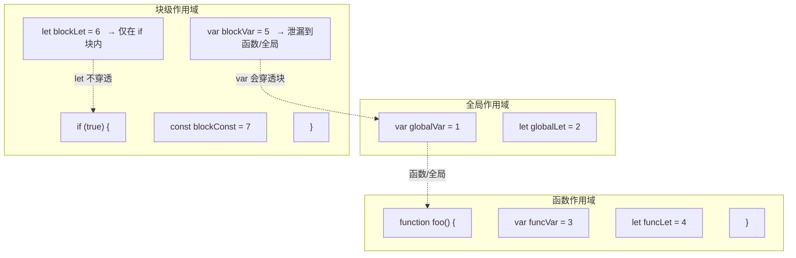

### 1.1.3 暂时性死区（Temporal Dead Zone）

这是理解 `let` 和 `const` 最关键的概念之一。

```javascript
// var 的提升行为
console.log(a) // undefined（变量提升了，但值没提升）
var a = 10

// let 的暂时性死区
console.log(b) // ❌ ReferenceError: Cannot access 'b' before initialization
let b = 20
```

**为什么叫"暂时性死区"？** 因为从进入块作用域到变量声明这一段"区域"，变量存在但不可访问——就像一片"死区"。

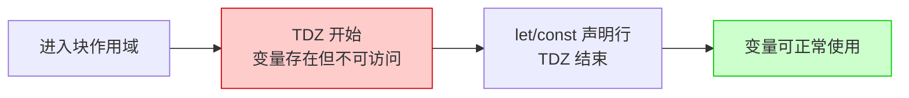

### 1.1.4 对比总结表

| 特性 | `var` | `let` | `const` |
|------|-------|-------|---------|
| 作用域 | 函数/全局 | 块级 | 块级 |
| 重复声明 | ✅ 允许 | ❌ 不允许 | ❌ 不允许 |
| 重新赋值 | ✅ 允许 | ✅ 允许 | ❌ 不允许 |
| 提升行为 | 提升为 undefined | 暂时性死区 | 暂时性死区 |
| 全局对象属性 | ✅ 挂载到 window | ❌ 不挂载 | ❌ 不挂载 |
| 推荐使用 | ❌ 已过时 | ✅ 需要重新赋值时 | ✅ 默认首选 |

> **项目实践**：在 AI-CLI-Mobile 中，所有变量默认使用 `const`，只有需要重新赋值时才用 `let`，完全不使用 `var`。这是现代 JavaScript/TypeScript 项目的标准做法。

---

## 1.2 数据类型

### 1.2.1 原始类型 vs 引用类型

JavaScript 的数据类型分为两大类：

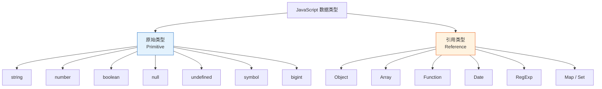

### 1.2.2 原始类型：不可变的值

```javascript
// 原始类型存储的是值本身
let a = 'hello'
let b = a         // b 得到的是 'hello' 的副本
b = 'world'
console.log(a)    // 'hello' ← a 不受影响

// 原始类型是不可变的
let str = 'hello'
str.toUpperCase() // 返回 'HELLO'，但 str 本身不变
console.log(str)  // 'hello'
```

### 1.2.3 引用类型：共享的地址

```javascript
// 引用类型存储的是内存地址（引用）
let obj1 = { name: 'Alice' }
let obj2 = obj1   // obj2 得到的是同一个对象的引用
obj2.name = 'Bob'
console.log(obj1.name) // 'Bob' ← obj1 也被修改了！

// 这就像两个人拿着同一把钥匙
// 任何一个人开门进去改了东西，另一个人看到的也是改后的
```

**引用类型的比较规则：**

```javascript
// 原始类型：比较值
console.log(1 === 1)               // true
console.log('hello' === 'hello')   // true

// 引用类型：比较引用（地址）
console.log({} === {})             // false ← 两个不同的空对象
console.log([] === [])             // false ← 两个不同的空数组

const obj = { a: 1 }
const ref = obj
console.log(obj === ref)           // true ← 同一个对象
```

### 1.2.4 typeof 与 instanceof

```javascript
// typeof 用于判断原始类型
typeof 'hello'      // 'string'
typeof 42           // 'number'
typeof true         // 'boolean'
typeof undefined    // 'undefined'
typeof Symbol()     // 'symbol'
typeof 10n          // 'bigint'
typeof null         // 'object' ← 历史遗留 bug！

// typeof 对引用类型不够精确
typeof {}           // 'object'
typeof []           // 'object' ← 数组也是 'object'！
typeof function(){} // 'function'

// instanceof 用于判断引用类型的具体类型
[] instanceof Array         // true
new Date() instanceof Date  // true
/regex/ instanceof RegExp   // true
```

**判断类型的最佳实践：**

```javascript
// 精确判断类型的各种方法
function getType(value) {
  if (value === null) return 'null'
  if (Array.isArray(value)) return 'array'
  return typeof value
}

// 或者使用 Object.prototype.toString
Object.prototype.toString.call([])      // '[object Array]'
Object.prototype.toString.call(null)    // '[object Null]'
Object.prototype.toString.call({})      // '[object Object]'
Object.prototype.toString.call(new Date()) // '[object Date]'
```

### 1.2.5 类型转换

JavaScript 是弱类型语言，类型转换是常见的"坑"：

```javascript
// 隐式类型转换（容易出错）
'5' + 3       // '53'    ← 数字转字符串，拼接
'5' - 3       // 2       ← 字符串转数字，减法
true + 1      // 2       ← true 转为 1
false + 1     // 1       ← false 转为 0
null + 1      // 1       ← null 转为 0
undefined + 1 // NaN     ← undefined 无法转数字

// 经典面试题
console.log([] + [])        // ''
console.log([] + {})        // '[object Object]'
console.log({} + [])        // '[object Object]'
console.log(true + true)    // 2

// 显式类型转换（推荐）
Number('42')      // 42
String(42)        // '42'
Boolean(0)        // false
Boolean('')       // false
Boolean('hello')  // true

// parseInt / parseFloat
parseInt('42px')  // 42
parseFloat('3.14abc') // 3.14
parseInt('0x10')  // 16（十六进制）
parseInt('010')   // 10（不再当八进制）
```

### 1.2.6 对比表

| 特性 | 原始类型 | 引用类型 |
|------|---------|---------|
| 存储方式 | 栈内存（值） | 堆内存（引用地址） |
| 赋值行为 | 复制值 | 复制引用 |
| 比较方式 | 比较值 | 比较引用地址 |
| 可变性 | 不可变 | 可变 |
| typeof 精确度 | ✅ 精确 | ❌ 大多返回 'object' |
| 传参方式 | 按值传递 | 按引用传递 |

---

## 1.3 函数

### 1.3.1 三种函数声明方式

```javascript
// 1. 函数声明（Function Declaration）
function greet(name) {
  return `Hello, ${name}!`
}
// ✅ 会被提升（hoisting），可以在声明前调用
greet('Alice')

// 2. 函数表达式（Function Expression）
const greet2 = function(name) {
  return `Hello, ${name}!`
}
// ❌ 不会提升，必须先声明再调用

// 3. 箭头函数（Arrow Function）—— ES6
const greet3 = (name) => {
  return `Hello, ${name}!`
}
// 简写：单行返回可省略 {} 和 return
const greet4 = name => `Hello, ${name}!`
// 多个参数需要括号
const add = (a, b) => a + b
```

### 1.3.2 箭头函数 vs 普通函数

这是 JavaScript 中最容易混淆的概念之一：

| 特性 | 普通函数 | 箭头函数 |
|------|---------|---------|
| `this` 绑定 | 动态绑定（调用时决定） | 词法绑定（定义时继承外层） |
| `arguments` 对象 | ✅ 有 | ❌ 没有 |
| `new` 调用 | ✅ 可以作为构造函数 | ❌ 不能 |
| `prototype` 属性 | ✅ 有 | ❌ 没有 |
| `super` 关键字 | 自动绑定 | 继承外层 |

```javascript
// this 绑定的区别
const team = {
  name: 'Alpha',
  members: ['Alice', 'Bob'],

  // ❌ 普通函数：this 指向调用者
  showMembers() {
    this.members.forEach(function(member) {
      // 这里的 this 是 undefined（严格模式）或 window
      console.log(`${member} belongs to ${this.name}`)
    })
  },

  // ✅ 箭头函数：this 继承外层
  showMembersFixed() {
    this.members.forEach(member => {
      // 箭头函数没有自己的 this，继承 showMembersFixed 的 this
      console.log(`${member} belongs to ${this.name}`)
    })
  },
}

// 箭头函数不能用作构造函数
const Person = (name) => {
  this.name = name  // ❌ 箭头函数没有 this
}
// new Person('Alice') // TypeError: Person is not a constructor
```

### 1.3.3 闭包（Closure）

闭包是 JavaScript 最强大也最难理解的特性之一。简单来说：**函数能够"记住"它创建时所在的词法环境**。

```javascript
// 最简单的闭包
function createCounter() {
  let count = 0  // 这个变量在外部函数的作用域中

  return function() {
    count++  // 内部函数"捕获"了外部的 count
    return count
  }
}

const counter = createCounter()
console.log(counter()) // 1
console.log(counter()) // 2
console.log(counter()) // 3
// count 变量在 createCounter 执行完后依然存活！
```

**闭包的作用域链图：**

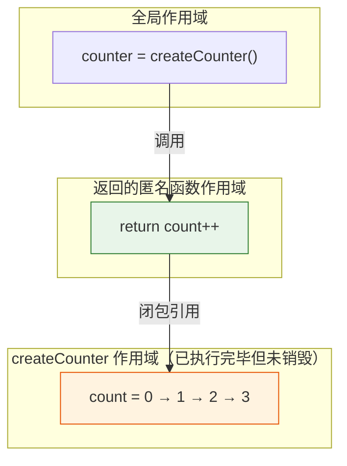

**闭包的常见用途：**

```javascript
// 1. 数据封装（私有变量）
function createBankAccount(initialBalance) {
  let balance = initialBalance  // 外部无法直接访问

  return {
    deposit(amount) { balance += amount },
    withdraw(amount) {
      if (amount > balance) throw new Error('Insufficient funds')
      balance -= amount
    },
    getBalance() { return balance },
  }
}

const account = createBankAccount(100)
account.deposit(50)
console.log(account.getBalance()) // 150
// balance 变量对外部完全不可见，实现了"私有"

// 2. 函数工厂
function createMultiplier(factor) {
  return (number) => number * factor
}

const double = createMultiplier(2)
const triple = createMultiplier(3)
console.log(double(5))  // 10
console.log(triple(5))  // 15

// 3. 防抖（Debounce）—— 项目中实际使用
function debounce(fn, delay) {
  let timer = null
  return function(...args) {
    clearTimeout(timer)
    timer = setTimeout(() => fn.apply(this, args), delay)
  }
}

const debouncedSearch = debounce((query) => {
  console.log('Searching:', query)
}, 300)
```

**闭包的陷阱——循环中的闭包：**

```javascript
// ❌ 经典 bug
for (var i = 0; i < 5; i++) {
  setTimeout(() => {
    console.log(i) // 输出 5 个 5，而不是 0,1,2,3,4
  }, 100)
}
// 因为 var 没有块级作用域，所有回调共享同一个 i

// ✅ 修复方案 1：使用 let
for (let i = 0; i < 5; i++) {
  setTimeout(() => {
    console.log(i) // 0, 1, 2, 3, 4
  }, 100)
}

// ✅ 修复方案 2：使用 IIFE 创建闭包
for (var i = 0; i < 5; i++) {
  ;(function(j) {
    setTimeout(() => {
      console.log(j) // 0, 1, 2, 3, 4
    }, 100)
  })(i)
}
```

### 1.3.4 默认参数与剩余参数

```javascript
// 默认参数（ES6）
function createUser(name, role = 'viewer', active = true) {
  return { name, role, active }
}
createUser('Alice')                // { name: 'Alice', role: 'viewer', active: true }
createUser('Bob', 'admin')         // { name: 'Bob', role: 'admin', active: true }

// 剩余参数（Rest Parameters）
function sum(...numbers) {
  return numbers.reduce((acc, n) => acc + n, 0)
}
sum(1, 2, 3, 4) // 10

// 实际项目中的使用模式
function log(level, ...args) {
  console.log(`[${level}]`, ...args)
}
log('INFO', 'Server started on port', 3000)
```

---

## 1.4 异步编程的演变

JavaScript 的异步编程经历了三个阶段的演变，从"回调地狱"到优雅的 `async/await`。

### 1.4.1 回调函数（Callback）

```javascript
// 最早的异步方式
function fetchUser(id, callback) {
  setTimeout(() => {
    callback(null, { id, name: 'Alice' })
  }, 1000)
}

// 回调地狱（Callback Hell）
fetchUser(1, (err, user) => {
  if (err) return console.error(err)
  fetchPosts(user.id, (err, posts) => {
    if (err) return console.error(err)
    fetchComments(posts[0].id, (err, comments) => {
      if (err) return console.error(err)
      // 越来越深，难以维护...
      console.log(comments)
    })
  })
})
```

### 1.4.2 Promise

```javascript
// Promise 是异步操作的容器
function fetchUser(id) {
  return new Promise((resolve, reject) => {
    setTimeout(() => {
      if (id > 0) {
        resolve({ id, name: 'Alice' })
      } else {
        reject(new Error('Invalid ID'))
      }
    }, 1000)
  })
}

// 链式调用，告别回调地狱
fetchUser(1)
  .then(user => fetchPosts(user.id))
  .then(posts => fetchComments(posts[0].id))
  .then(comments => console.log(comments))
  .catch(err => console.error(err))  // 统一错误处理
```

**Promise 的三种状态：**

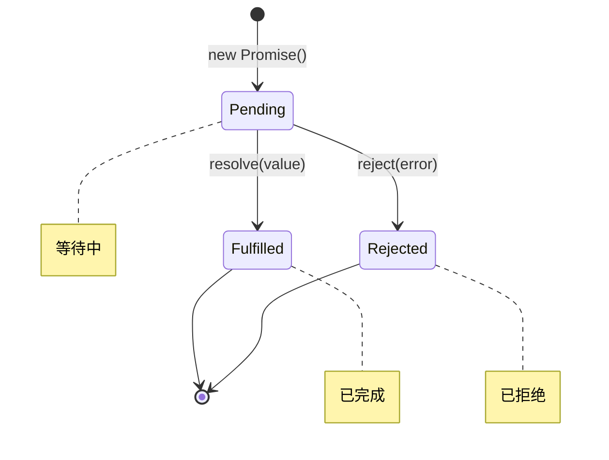

**Promise 的常用方法：**

```javascript
// Promise.all —— 全部完成才返回
const results = await Promise.all([
  fetch('/api/users'),
  fetch('/api/posts'),
  fetch('/api/comments'),
])
// 如果任何一个失败，整体就失败

// Promise.allSettled —— 等待全部完成（不管成功失败）
const results2 = await Promise.allSettled([
  fetch('/api/users'),
  fetch('/api/posts'),
  fetch('/api/might-fail'),
])
// 返回 [{status: 'fulfilled', value: ...}, {status: 'rejected', reason: ...}]

// Promise.race —— 返回最先完成的
const fastest = await Promise.race([
  fetch('/api/server1'),
  fetch('/api/server2'),
])

// Promise.any —— 返回最先成功的
const firstSuccess = await Promise.any([
  fetch('/api/server1'),
  fetch('/api/server2'),
])
```

### 1.4.3 async / await

```javascript
// async/await 是 Promise 的语法糖，让异步代码看起来像同步
async function loadDashboard(userId) {
  try {
    const user = await fetchUser(userId)       // 等待用户数据
    const posts = await fetchPosts(user.id)    // 等待帖子数据
    const comments = await fetchComments(posts[0].id) // 等待评论
    return { user, posts, comments }
  } catch (error) {
    console.error('加载失败:', error)
    throw error  // 重新抛出，让调用者处理
  }
}

// 使用
loadDashboard(1).then(data => console.log(data))
```

### 1.4.4 异步演变流程图

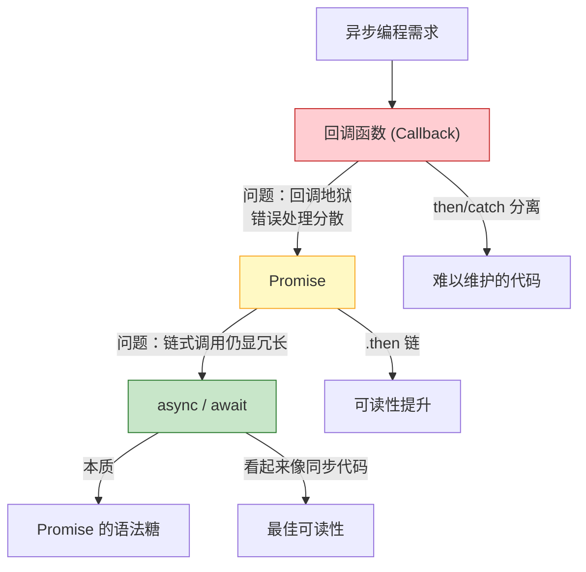

### 1.4.5 实际项目中的异步模式

```typescript
// 项目中的 WebSocket 连接建立（简化示意）
async function connectWebSocket(url: string): Promise<WebSocket> {
  return new Promise((resolve, reject) => {
    const ws = new WebSocket(url)

    ws.addEventListener('open', () => {
      console.log('WebSocket 连接成功')
      resolve(ws)
    })

    ws.addEventListener('error', (error) => {
      reject(new Error(`WebSocket 连接失败: ${error}`))
    })

    // 超时处理
    setTimeout(() => {
      reject(new Error('WebSocket 连接超时'))
    }, 10000)
  })
}

// 使用 async/await 进行认证流程
async function authenticate(url: string, token: string) {
  try {
    const ws = await connectWebSocket(url)

    // 发送认证消息
    ws.send(JSON.stringify({
      type: 'AUTH',
      accessToken: token,
      protocolVersion: '0.1.0',
    }))

    // 等待认证结果
    const result = await waitForMessage(ws, 'AUTH_OK')
    return result
  } catch (error) {
    console.error('认证失败:', error)
    throw error
  }
}
```

---

## 1.5 事件循环（Event Loop）

### 1.5.1 什么是事件循环

JavaScript 是**单线程**语言——同一时间只能执行一段代码。但它能处理异步操作，靠的就是事件循环机制。

**类比理解**：想象你去餐厅吃饭。
1. 你点了菜（发起异步请求）
2. 服务员把单子送到厨房（放入任务队列）
3. 你继续聊天（执行其他代码）
4. 菜好了服务员端过来（回调被执行）

### 1.5.2 事件循环的执行模型

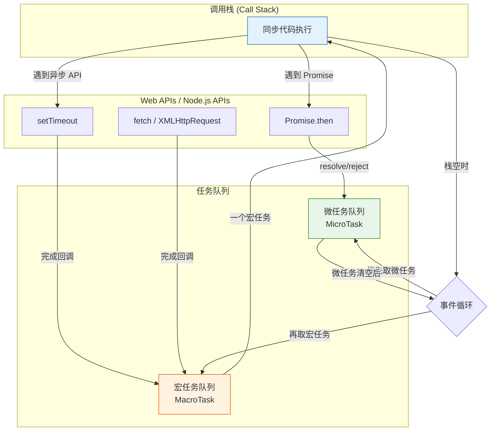

### 1.5.3 宏任务 vs 微任务

| 类型 | 包含 | 优先级 |
|------|------|--------|
| **宏任务 (MacroTask)** | `setTimeout`, `setInterval`, `setImmediate`(Node), `I/O`, `UI 渲染` | 低 |
| **微任务 (MicroTask)** | `Promise.then/catch/finally`, `MutationObserver`, `queueMicrotask` | 高 |

**核心规则**：每执行完一个宏任务，就把所有微任务清空，然后再执行下一个宏任务。

```javascript
// 经典面试题：输出顺序是什么？
console.log('1')              // 同步

setTimeout(() => {
  console.log('2')            // 宏任务
}, 0)

Promise.resolve().then(() => {
  console.log('3')            // 微任务
})

console.log('4')              // 同步

// 输出顺序：1 → 4 → 3 → 2
// 解析：
// 1. 执行同步代码 → 输出 '1', '4'
// 2. 清空微任务队列 → 输出 '3'
// 3. 取一个宏任务执行 → 输出 '2'
```

### 1.5.4 更复杂的例子

```javascript
async function async1() {
  console.log('async1 start')
  await async2()
  console.log('async1 end')    // 相当于 Promise.then
}

async function async2() {
  console.log('async2')
}

console.log('script start')

setTimeout(() => {
  console.log('setTimeout')    // 宏任务
}, 0)

async1()

new Promise((resolve) => {
  console.log('promise1')
  resolve()
}).then(() => {
  console.log('promise2')      // 微任务
})

console.log('script end')

// 输出顺序：
// 'script start'
// 'async1 start'
// 'async2'
// 'promise1'
// 'script end'
// 'async1 end'    ← 微任务
// 'promise2'      ← 微任务
// 'setTimeout'    ← 宏任务
```

### 1.5.5 项目中的事件循环应用

```typescript
// 在 AI-CLI-Mobile 项目中，事件循环的理解至关重要
// 比如 WebSocket 消息处理：

// 消息队列：确保消息按顺序处理
class MessageQueue {
  private queue: Array<() => Promise<void>> = []
  private processing = false

  async enqueue(task: () => Promise<void>) {
    this.queue.push(task)
    if (!this.processing) {
      this.process()
    }
  }

  private async process() {
    this.processing = true
    while (this.queue.length > 0) {
      const task = this.queue.shift()!
      await task()  // 逐个处理，保证顺序
    }
    this.processing = false
  }
}

// 使用：WebSocket 消息不会乱序
const mq = new MessageQueue()
ws.onmessage = (event) => {
  mq.enqueue(async () => {
    await handleMessage(JSON.parse(event.data))
  })
}
```

---

## 1.6 模块化：ESM vs CommonJS

### 1.6.1 模块化的演变

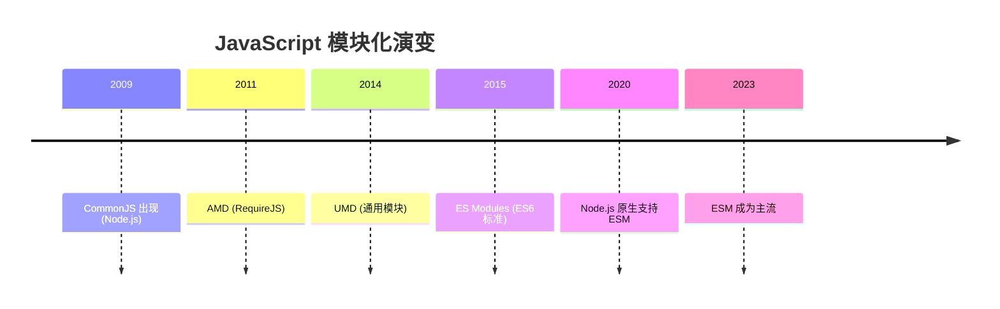

### 1.6.2 CommonJS vs ESM 对比

```javascript
// ========== CommonJS (CJS) ==========
// 导入
const fs = require('fs')
const { readFile } = require('fs')

// 导出
module.exports = { foo: 'bar' }
exports.foo = 'bar'

// 动态导入
const module = require('./' + userInput + '.js')

// ========== ES Modules (ESM) ==========
// 导入
import fs from 'fs'
import { readFile } from 'fs'
import * as fs from 'fs'

// 导出
export const foo = 'bar'
export default function main() {}
export { readFile, writeFile }

// 动态导入（返回 Promise）
const module = await import(`./${userInput}.js`)
```

| 特性 | CommonJS | ES Modules |
|------|----------|------------|
| 加载方式 | 运行时同步加载 | 编译时静态分析 |
| 值的绑定 | 值的拷贝 | 值的引用 |
| this 指向 | `module.exports` | `undefined` |
| 循环依赖 | 返回部分完成的对象 | 实时绑定 |
| 动态导入 | 天然支持 | 需要 `import()` |
| 浏览器支持 | ❌ 需要打包工具 | ✅ 原生支持 |
| Tree Shaking | ❌ 不支持 | ✅ 支持 |
| 适用场景 | Node.js（传统） | 现代项目（推荐） |

### 1.6.3 项目中的 ESM 配置

```jsonc
// 项目的 package.json 中声明使用 ESM
{
  "type": "module",
  "scripts": {
    "dev": "tsx watch src/index.ts",
    "build": "tsc"
  }
}
```

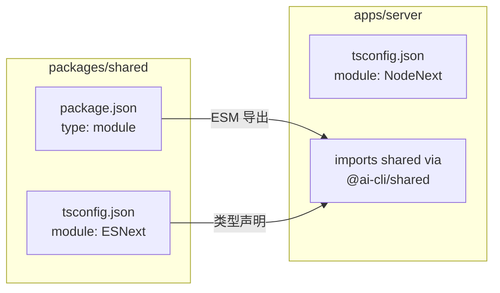

---

## 1.7 现代语法特性

### 1.7.1 解构赋值

```javascript
// 对象解构
const { name, age, city = 'Unknown' } = user
// 等价于：
// const name = user.name
// const age = user.age
// const city = user.city || 'Unknown'

// 嵌套解构
const { address: { street, zip } } = user

// 重命名
const { name: userName, age: userAge } = user

// 数组解构
const [first, second, ...rest] = [1, 2, 3, 4, 5]
// first = 1, second = 2, rest = [3, 4, 5]

// 交换变量
let a = 1, b = 2
;[a, b] = [b, a] // a=2, b=1

// 函数参数解构
function createUser({ name, role = 'viewer', active = true }) {
  return { name, role, active }
}
createUser({ name: 'Alice' }) // { name: 'Alice', role: 'viewer', active: true }
```

### 1.7.2 展开运算符（Spread）与剩余参数（Rest）

```javascript
// 展开运算符 —— "拆开"
const arr1 = [1, 2, 3]
const arr2 = [4, 5, 6]
const merged = [...arr1, ...arr2] // [1, 2, 3, 4, 5, 6]

const obj1 = { a: 1, b: 2 }
const obj2 = { b: 3, c: 4 }
const mergedObj = { ...obj1, ...obj2 } // { a: 1, b: 3, c: 4 }
// 后面的覆盖前面的

// 浅拷贝
const copy = { ...original }
const arrCopy = [...original]

// 剩余参数 —— "收集"
function sum(first, ...rest) {
  return rest.reduce((acc, n) => acc + n, first)
}

// 对象剩余属性
const { id, ...rest } = user // 提取 id，其余放入 rest
```

### 1.7.3 模板字符串

```javascript
// 基本用法
const name = 'World'
console.log(`Hello, ${name}!`)

// 多行字符串
const html = `
  <div>
    <h1>${title}</h1>
    <p>${content}</p>
  </div>
`

// 标签模板字符串（Tagged Templates）
function highlight(strings, ...values) {
  return strings.reduce((result, str, i) => {
    return result + str + (values[i] ? `<mark>${values[i]}</mark>` : '')
  }, '')
}
const name2 = 'Alice'
const age2 = 30
highlight`My name is ${name2} and I'm ${age2} years old.`
// 'My name is <mark>Alice</mark> and I\'m <mark>30</mark> years old.'
```

### 1.7.4 可选链与空值合并

```javascript
// 可选链（Optional Chaining）—— ES2020
const street = user?.address?.street
// 如果 user 或 address 为 null/undefined，返回 undefined，不报错

const result = arr?.[0]?.name
const value = obj?.method?.()

// 空值合并（Nullish Coalescing）—— ES2020
const port = config.port ?? 3000
// 只在 null/undefined 时使用默认值
// 0 和 '' 不会触发默认值（|| 会）

// 对比
const a = 0 || 'default'   // 'default'（0 是 falsy）
const b = 0 ?? 'default'   // 0（只看 null/undefined）

const c = '' || 'default'  // 'default'（'' 是 falsy）
const d = '' ?? 'default'  // ''（只看 null/undefined）
```

### 1.7.5 逻辑赋值运算符

```javascript
// ES2021 引入
let a = null
a ??= 5       // a = 5（a 为 null 时赋值）

let b = 0
b ||= 10      // b = 10（b 为 falsy 时赋值）

let c = 1
c &&= 10      // c = 10（c 为 truthy 时赋值）

// 等价于：
// a ??= 5   →  a = a ?? 5
// b ||= 10  →  b = b || 10
// c &&= 10  →  c = c && 10
```

---

## 1.8 Map/Set/WeakMap/WeakSet

### 1.8.1 Map

```javascript
// Map —— 键值对集合，键可以是任意类型
const userMap = new Map()

// 设置和获取
userMap.set('alice', { name: 'Alice', age: 30 })
userMap.set(42, 'answer')
userMap.set(true, 'yes')

userMap.get('alice')   // { name: 'Alice', age: 30 }
userMap.get(42)         // 'answer'

// Map 的键可以是对象！（普通对象不行）
const objKey = { id: 1 }
userMap.set(objKey, 'value')
userMap.get(objKey)     // 'value'

// 常用方法
userMap.has('alice')    // true
userMap.delete(42)      // true
userMap.size            // 2

// 遍历
for (const [key, value] of userMap) {
  console.log(key, value)
}

// 从对象创建 Map
const obj = { a: 1, b: 2, c: 3 }
const mapFromObj = new Map(Object.entries(obj))
```

### 1.8.2 Set

```javascript
// Set —— 唯一值集合
const uniqueIds = new Set([1, 2, 3, 2, 1])
console.log([...uniqueIds]) // [1, 2, 3] ← 自动去重

uniqueIds.add(4)       // Set {1, 2, 3, 4}
uniqueIds.add(3)       // 不变，3 已存在
uniqueIds.has(2)       // true
uniqueIds.delete(1)    // Set {2, 3, 4}
uniqueIds.size         // 3

// 实际用途：数组去重
const arr = [1, 2, 2, 3, 3, 3]
const unique = [...new Set(arr)] // [1, 2, 3]

// 集合运算
const setA = new Set([1, 2, 3, 4])
const setB = new Set([3, 4, 5, 6])

// 交集
const intersection = new Set([...setA].filter(x => setB.has(x)))
// Set {3, 4}

// 并集
const union = new Set([...setA, ...setB])
// Set {1, 2, 3, 4, 5, 6}

// 差集
const difference = new Set([...setA].filter(x => !setB.has(x)))
// Set {1, 2}
```

### 1.8.3 WeakMap 与 WeakSet

```javascript
// WeakMap —— 键必须是对象，且是弱引用
const cache = new WeakMap()

function processObject(obj) {
  if (cache.has(obj)) {
    return cache.get(obj)
  }
  const result = expensiveComputation(obj)
  cache.set(obj, result)
  return result
}
// 当 obj 被垃圾回收时，对应的缓存条目也会被自动清除

// WeakSet —— 值必须是对象，且是弱引用
const visited = new WeakSet()

function processNode(node) {
  if (visited.has(node)) return // 已处理过
  visited.add(node)
  // 处理节点...
}
// 当 node 不再被引用时，WeakSet 中的条目自动清除
```

| 特性 | Map | WeakMap | Set | WeakSet |
|------|-----|---------|-----|---------|
| 键/值类型 | 任意 | 仅对象 | 任意 | 仅对象 |
| 可遍历 | ✅ | ❌ | ✅ | ❌ |
| size 属性 | ✅ | ❌ | ✅ | ❌ |
| 弱引用 | ❌ | ✅ | ❌ | ✅ |
| 垃圾回收 | 手动删除 | 自动清除 | 手动删除 | 自动清除 |
| 主要用途 | 键值映射 | 缓存/私有数据 | 唯一值/集合运算 | 追踪对象 |

---

# 第二部分：TypeScript 类型系统

## 2.1 为什么用 TypeScript

### 2.1.1 JavaScript 的痛点

```javascript
// JavaScript：运行时才发现错误
function greet(name) {
  return 'Hello, ' + name.toUpperCase()
}

greet(42)  // 💥 TypeError: name.toUpperCase is not a function
// 只有代码运行到这里才会报错
```

```typescript
// TypeScript：编译时就发现错误
function greet(name: string): string {
  return 'Hello, ' + name.toUpperCase()
}

greet(42)  // ❌ 编译错误：类型"number"不能赋给类型"string"
// 代码还没运行，IDE 就已经标红了
```

### 2.1.2 TypeScript 的核心优势

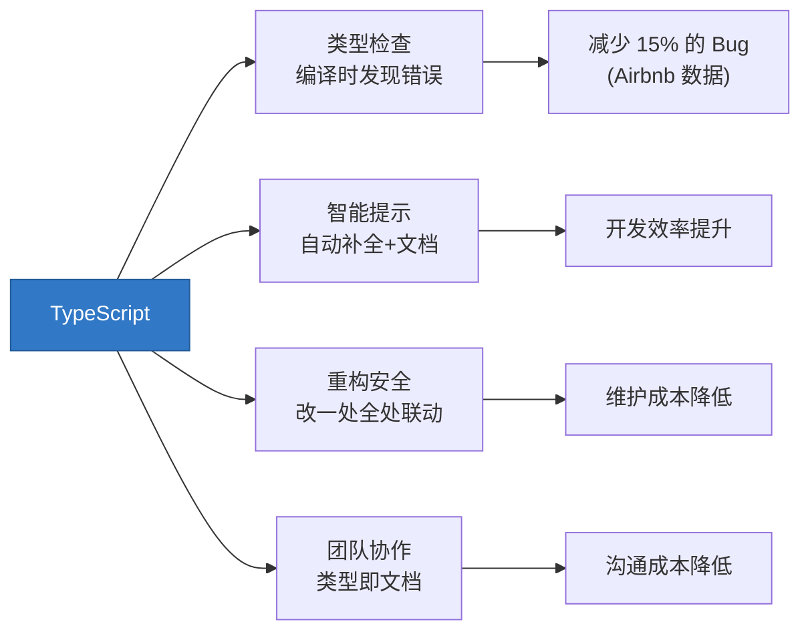

### 2.1.3 TypeScript 与 JavaScript 的关系

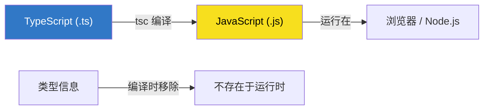

**关键理解**：TypeScript 的类型只在编译时存在，运行时完全不存在。编译后的 JavaScript 代码没有任何类型信息。

---

## 2.2 基础类型

### 2.2.1 原始类型

```typescript
// 基础类型注解
let name: string = 'Alice'
let age: number = 30
let active: boolean = true
let nothing: null = null
let notDefined: undefined = undefined
let id: symbol = Symbol('id')
let big: bigint = 100n

// 类型推断——大部分时候不需要手动注解
let city = 'Beijing'        // 自动推断为 string
let count = 42              // 自动推断为 number
let items = [1, 2, 3]       // 自动推断为 number[]
```

### 2.2.2 特殊类型

```typescript
// any —— 放弃类型检查（尽量避免）
let anything: any = 'hello'
anything = 42        // ✅ 不报错
anything.foo()       // ✅ 不报错（但运行时可能爆炸）

// unknown —— 安全的 any
let value: unknown = 'hello'
// value.toUpperCase() // ❌ 编译错误！必须先检查类型
if (typeof value === 'string') {
  value.toUpperCase()  // ✅ 类型收窄后可以使用
}

// never —— 永远不会有值
function throwError(msg: string): never {
  throw new Error(msg)
}

function infiniteLoop(): never {
  while (true) {}
}

// void —— 函数没有返回值
function log(msg: string): void {
  console.log(msg)
}

// 类型断言
const input = document.getElementById('name') as HTMLInputElement
input.value  // TypeScript 现在知道这是 HTMLInputElement
```

### 2.2.3 对比表

| 类型 | 用途 | 何时使用 |
|------|------|---------|
| `any` | 放弃类型检查 | 迁移旧代码、第三方库无类型 |
| `unknown` | 安全的 top 类型 | 接收不确定类型的值 |
| `never` | 不可能有值 | 抛异常、无限循环、穷尽检查 |
| `void` | 无返回值 | 函数声明 |
| `object` | 非原始类型 | 泛型约束 |

---

## 2.3 接口 vs 类型别名

### 2.3.1 接口（interface）

```typescript
// 接口定义对象的形状
interface User {
  id: string
  name: string
  email?: string         // 可选属性
  readonly createdAt: Date // 只读属性
}

// 接口可以继承
interface Admin extends User {
  permissions: string[]
  level: number
}

// 接口可以合并（Declaration Merging）
interface Config {
  port: number
}
interface Config {
  host: string
}
// 最终 Config = { port: number; host: string }
```

### 2.3.2 类型别名（type）

```typescript
// 类型别名可以定义任何类型
type ID = string | number

type Point = {
  x: number
  y: number
}

// 联合类型
type Status = 'active' | 'inactive' | 'pending'

// 交叉类型
type Timestamped = {
  createdAt: Date
  updatedAt: Date
}

type UserWithTimestamps = User & Timestamped

// 函数类型
type Callback = (data: string) => void

// 元组类型
type Pair = [string, number]
```

### 2.3.3 对比表

| 特性 | interface | type |
|------|-----------|------|
| 对象类型 | ✅ | ✅ |
| 继承（extends） | ✅ | ✅（使用 &） |
| 声明合并 | ✅ 自动合并 | ❌ 重复报错 |
| 联合类型 | ❌ | ✅ |
| 元组 | ❌ | ✅ |
| 原始类型别名 | ❌ | ✅ |
| 计算属性 | ❌ | ✅ |
| 性能 | 缓存，稍快 | 每次计算 |
| 推荐场景 | 定义对象形状/类实现 | 联合类型/复杂类型组合 |

```typescript
// AI-CLI-Mobile 项目中的实际使用

// 用 interface 定义对象结构（可被 implements）
interface CLIAdapter {
  startCommand: string
  parseStreamData(data: string): StateCandidate | null
  parseScreenSnapshot(screen: string): AgentStatus | null
  getQuickActions(): QuickAction[]
  supportsStructuredOutput(): boolean
}

// 用 type 定义联合类型（interface 做不到）
type AgentStatus = 'IDLE' | 'RUNNING' | 'WAITING_APPROVAL' | 'ERROR'

type ControlClientMessage =
  | { type: 'AUTH'; accessToken: string; protocolVersion: string }
  | { type: 'REFRESH'; refreshToken: string }
  | { type: 'PING' }
  | { type: 'INIT_SESSION'; sessionId: string; cols: number; rows: number; adapter: string }
```

---

## 2.4 泛型

### 2.4.1 泛型入门

泛型（Generics）让你写出"类型参数化"的代码——就像函数的参数一样，类型也可以参数化。

```typescript
// 没有泛型：每种类型都要写一个函数
function getFirstNumber(arr: number[]): number { return arr[0] }
function getFirstString(arr: string[]): string { return arr[0] }

// 有泛型：一个函数适用所有类型
function getFirst<T>(arr: T[]): T {
  return arr[0]
}

getFirst<number>([1, 2, 3])       // number
getFirst<string>(['a', 'b'])      // string
getFirst([true, false])            // boolean（自动推断）
```

**泛型的直观理解：**

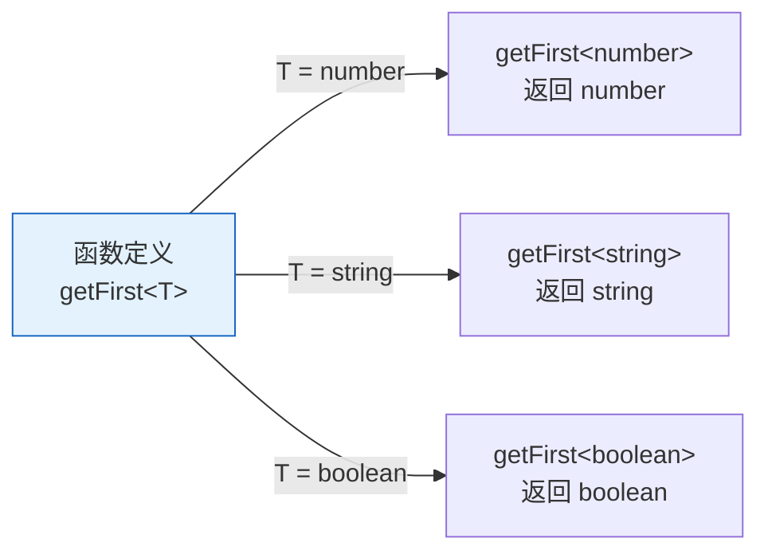

### 2.4.2 泛型接口和类型

```typescript
// 泛型接口
interface ApiResponse<T> {
  code: number
  message: string
  data: T
}

// 使用
type UserResponse = ApiResponse<User>
type PostListResponse = ApiResponse<Post[]>

// 泛型工具类型（TypeScript 内置）
type Pair<A, B> = {
  first: A
  second: B
}

const pair: Pair<string, number> = { first: 'age', second: 30 }
```

### 2.4.3 泛型约束

```typescript
// 约束泛型必须具有某些属性
interface HasLength {
  length: number
}

function logLength<T extends HasLength>(value: T): void {
  console.log(`Length: ${value.length}`)
}

logLength('hello')     // ✅ string 有 length
logLength([1, 2, 3])   // ✅ array 有 length
logLength({ length: 5 }) // ✅ 有 length 属性
// logLength(42)        // ❌ number 没有 length

// keyof 约束
function getProperty<T, K extends keyof T>(obj: T, key: K): T[K] {
  return obj[key]
}

const user = { name: 'Alice', age: 30 }
getProperty(user, 'name')  // ✅ string
getProperty(user, 'age')   // ✅ number
// getProperty(user, 'email') // ❌ 'email' 不是 user 的键
```

### 2.4.4 泛型实战

```typescript
// 实际项目中的泛型使用模式

// 1. 类型安全的事件发射器
interface EventEmitter<Events extends Record<string, any[]>> {
  on<K extends keyof Events>(event: K, handler: (...args: Events[K]) => void): void
  emit<K extends keyof Events>(event: K, ...args: Events[K]): void
}

// 定义事件类型
type WSChannelEvents = {
  message: [data: string]
  error: [error: Error]
  close: [code: number, reason: string]
}

// 使用时有完整的类型提示
const channel: EventEmitter<WSChannelEvents> = createChannel()
channel.on('message', (data) => {
  console.log(data.toUpperCase())  // data 自动推断为 string
})
channel.emit('error', new Error('test'))

// 2. 类型安全的状态管理
interface Store<State> {
  getState(): State
  setState(update: Partial<State>): void
  subscribe(listener: (state: State) => void): () => void
}
```

### 2.4.5 条件类型中的泛型

```typescript
// 条件类型
type IsString<T> = T extends string ? 'yes' : 'no'

type A = IsString<string>   // 'yes'
type B = IsString<number>   // 'no'

// infer 关键字——在条件类型中提取类型
type ReturnType<T> = T extends (...args: any[]) => infer R ? R : never

type Fn = () => string
type Result = ReturnType<Fn>  // string

// 提取 Promise 内部类型
type Awaited<T> = T extends Promise<infer U> ? Awaited<U> : T

type InnerType = Awaited<Promise<Promise<string>>>  // string
```

---

## 2.5 类型收窄

### 2.5.1 什么是类型收窄

类型收窄（Type Narrowing）是 TypeScript 最强大的特性之一：通过条件判断，让类型变得更精确。

```typescript
function process(value: string | number) {
  // 这里 value 是 string | number

  if (typeof value === 'string') {
    // ✅ TypeScript 知道这里 value 一定是 string
    console.log(value.toUpperCase())
  } else {
    // ✅ TypeScript 知道这里 value 一定是 number
    console.log(value.toFixed(2))
  }
}
```

### 2.5.2 各种收窄方式

```typescript
// 1. typeof 收窄
function format(value: string | number | boolean) {
  if (typeof value === 'string') return value.trim()
  if (typeof value === 'number') return value.toFixed(2)
  return value ? 'Yes' : 'No'
}

// 2. instanceof 收窄
function formatDate(value: string | Date) {
  if (value instanceof Date) {
    return value.toISOString()  // Date 类型
  }
  return new Date(value).toISOString()  // string 类型
}

// 3. in 操作符收窄
interface Bird { fly(): void }
interface Fish { swim(): void }

function move(animal: Bird | Fish) {
  if ('fly' in animal) {
    animal.fly()   // Bird 类型
  } else {
    animal.swim()  // Fish 类型
  }
}

// 4. 相等性收窄
function example(x: string | number, y: string | boolean) {
  if (x === y) {
    // x 和 y 都是 string（唯一的公共类型）
    x.toUpperCase()
    y.toUpperCase()
  }
}

// 5. 真值收窄
function printLength(value: string | null | undefined) {
  if (value) {
    // 排除了 null 和 undefined
    console.log(value.length)  // string
  }
}
```

### 2.5.3 自定义类型守卫

```typescript
// 类型谓词（Type Predicate）
function isString(value: unknown): value is string {
  return typeof value === 'string'
}

function processValue(value: unknown) {
  if (isString(value)) {
    console.log(value.toUpperCase())  // ✅ TypeScript 确信是 string
  }
}

// 实际项目中的使用
interface TokenPair {
  accessToken: string
  refreshToken: string
}

function isValidTokenPair(obj: unknown): obj is TokenPair {
  return (
    typeof obj === 'object' &&
    obj !== null &&
    'accessToken' in obj &&
    'refreshToken' in obj &&
    typeof (obj as any).accessToken === 'string' &&
    typeof (obj as any).refreshToken === 'string'
  )
}

// 使用
function handleAuth(data: unknown) {
  if (isValidTokenPair(data)) {
    // data 被收窄为 TokenPair
    console.log(data.accessToken)
  }
}
```

### 2.5.4 可辨识联合（Discriminated Union）

这是 TypeScript 最实用的模式之一，在项目中大量使用：

```typescript
// 项目中的实际代码——消息类型就是可辨识联合
type ControlClientMessage =
  | { type: 'AUTH'; accessToken: string; protocolVersion: string }
  | { type: 'REFRESH'; refreshToken: string }
  | { type: 'PING' }
  | { type: 'INIT_SESSION'; sessionId: string; cols: number; rows: number; adapter: string }
  | { type: 'ATTACH_SESSION'; sessionId: string }
  | { type: 'RESIZE'; sessionId: string; cols: number; rows: number }
  | { type: 'QUICK_ACTION'; sessionId: string; payload: string }
  | { type: 'INJECT_CODE'; sessionId: string; code: string }

// 通过 type 字段收窄
function handleMessage(msg: ControlClientMessage) {
  switch (msg.type) {
    case 'AUTH':
      // msg 自动收窄为 { type: 'AUTH'; accessToken: string; protocolVersion: string }
      console.log(msg.accessToken)
      break
    case 'INIT_SESSION':
      // msg 自动收窄为 { type: 'INIT_SESSION'; sessionId: string; ... }
      console.log(msg.sessionId, msg.cols, msg.rows)
      break
    case 'PING':
      // msg 自动收窄为 { type: 'PING' }
      break
    // 如果漏掉某个 case，never 类型会报错
  }
}
```

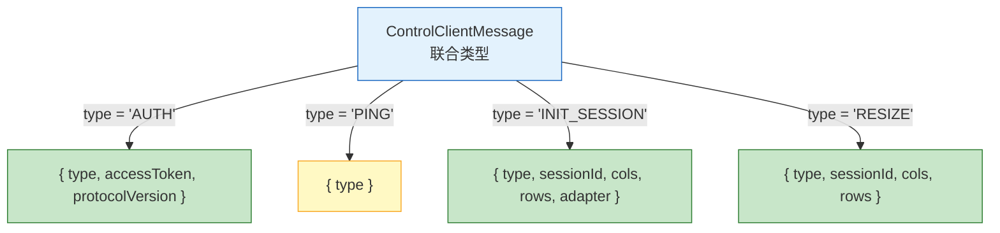

---

## 2.6 高级类型

### 2.6.1 条件类型

```typescript
// 基本条件类型
type IsNumber<T> = T extends number ? true : false

type A = IsNumber<42>     // true
type B = IsNumber<'42'>   // false

// 分发条件类型（Distributive Conditional Types）
type ToArray<T> = T extends any ? T[] : never

type C = ToArray<string | number>
// = ToArray<string> | ToArray<number>
// = string[] | number[]

// 不分发（用方括号包裹）
type ToArrayNonDist<T> = [T] extends [any] ? T[] : never

type D = ToArrayNonDist<string | number>
// = (string | number)[]

// 实际用途：过滤类型
type Exclude<T, U> = T extends U ? never : T

type E = Exclude<'a' | 'b' | 'c', 'a'>  // 'b' | 'c'

type Extract<T, U> = T extends U ? T : never

type F = Extract<'a' | 'b' | 'c', 'a' | 'd'>  // 'a'
```

### 2.6.2 映射类型

```typescript
// 映射类型：基于已有类型创建新类型
type Readonly<T> = {
  readonly [K in keyof T]: T[K]
}

type Partial<T> = {
  [K in keyof T]?: T[K]
}

// 使用
interface User {
  id: string
  name: string
  email: string
}

type ReadonlyUser = Readonly<User>
// { readonly id: string; readonly name: string; readonly email: string }

type PartialUser = Partial<User>
// { id?: string; name?: string; email?: string }

// 实际项目中的用法
type Pick<T, K extends keyof T> = {
  [P in K]: T[P]
}

type UserName = Pick<User, 'name' | 'email'>
// { name: string; email: string }

type Omit<T, K extends keyof T> = Pick<T, Exclude<keyof T, K>>

type UserWithoutEmail = Omit<User, 'email'>
// { id: string; name: string }

// Record 工具类型
type Record<K extends keyof any, T> = {
  [P in K]: T
}

type UserRoles = Record<string, string[]>
// { [key: string]: string[] }
```

### 2.6.3 模板字面量类型

```typescript
// 模板字面量类型——字符串级别的类型运算
type Greeting = `Hello, ${string}!`

const valid: Greeting = 'Hello, World!'   // ✅
// const invalid: Greeting = 'Hi, World!'  // ❌

// 实际用途：CSS 属性类型
type CSSUnit = 'px' | 'em' | 'rem' | '%' | 'vh' | 'vw'
type CSSValue = `${number}${CSSUnit}`

const width: CSSValue = '100px'   // ✅
const height: CSSValue = '50vh'   // ✅
// const bad: CSSValue = 'auto'    // ❌

// 事件名称类型
type EventName<T extends string> = `on${Capitalize<T>}`
type ButtonEvents = EventName<'click' | 'hover' | 'focus'>
// 'onClick' | 'onHover' | 'onFocus'

// 联合类型分发
type PropEventSource<T> = {
  on<K extends string & keyof T>(
    eventName: `${K}Changed`,
    callback: (newValue: T[K]) => void
  ): void
}

// 路径类型（项目中可能用到）
type NestedKeyOf<T> = T extends object
  ? { [K in keyof T & string]: K | `${K}.${NestedKeyOf<T[K]>}` }[keyof T & string]
  : never

interface Config {
  server: {
    host: string
    port: number
  }
  auth: {
    secret: string
  }
}

type ConfigPath = NestedKeyOf<Config>
// 'server' | 'server.host' | 'server.port' | 'auth' | 'auth.secret'
```

### 2.6.4 工具类型速查表

| 工具类型 | 作用 | 示例 |
|---------|------|------|
| `Partial<T>` | 所有属性变可选 | `Partial<User>` |
| `Required<T>` | 所有属性变必选 | `Required<PartialUser>` |
| `Readonly<T>` | 所有属性变只读 | `Readonly<User>` |
| `Pick<T, K>` | 选取部分属性 | `Pick<User, 'name'>` |
| `Omit<T, K>` | 排除部分属性 | `Omit<User, 'id'>` |
| `Record<K, T>` | 键值映射类型 | `Record<string, number>` |
| `Exclude<T, U>` | 从联合中排除 | `Exclude<'a'\|'b', 'a'>` |
| `Extract<T, U>` | 从联合中提取 | `Extract<'a'\|'b', 'a'>` |
| `NonNullable<T>` | 排除 null/undefined | `NonNullable<string\|null>` |
| `ReturnType<T>` | 获取函数返回类型 | `ReturnType<typeof fn>` |
| `Parameters<T>` | 获取函数参数类型 | `Parameters<typeof fn>` |
| `Awaited<T>` | 获取 Promise 内部类型 | `Awaited<Promise<string>>` |

---

## 2.7 项目代码逐行分析

让我们逐行分析 AI-CLI-Mobile 项目中 `packages/shared/src/protocol.ts` 的代码：

```typescript
// ============================================================
// AI-CLI-Mobile WS 协议类型定义
// ============================================================

// ① 常量声明
// 使用 const 声明 + as const 断言，让 TypeScript 将字面量保留为精确类型
export const TERM_PING = 0x00      // 十六进制常量：心跳请求
export const TERM_PONG = 0x01      // 十六进制常量：心跳响应

// ② 协议版本号
// ADR-020 决策：防止 PWA 静默更新导致前后端版本不一致
export const PROTOCOL_VERSION = '0.1.0'

// ③ 对象常量 + as const
// as const 让对象的所有属性都变成 readonly 且值为字面量类型
export const WS_CLOSE_CODE = {
  AUTH_FAILED: 4001,        // 类型是 4001（不是 number）
  PROTOCOL_MISMATCH: 4002,  // 类型是 4002（不是 number）
} as const
// 没有 as const 的话，类型是 { AUTH_FAILED: number; PROTOCOL_MISMATCH: number }
// 有了 as const，类型是 { readonly AUTH_FAILED: 4001; readonly PROTOCOL_MISMATCH: 4002 }

// ④ 字面量联合类型
// 用 type 定义字符串字面量的联合，比 enum 更轻量
export type AgentStatus = 'IDLE' | 'RUNNING' | 'WAITING_APPROVAL' | 'ERROR'
// 编译后完全消失，运行时就是普通字符串

// ⑤ 可辨识联合类型（Discriminated Union）
// 这是 TypeScript 最强大的模式之一
// 每个成员都有一个共同的 type 字段作为"辨识标签"
export type ControlClientMessage =
  | { type: 'AUTH'; accessToken: string; protocolVersion: string }
  | { type: 'REFRESH'; refreshToken: string }
  | { type: 'PING' }
  | { type: 'INIT_SESSION'; sessionId: string; cols: number; rows: number; adapter: string }
  | { type: 'ATTACH_SESSION'; sessionId: string }
  | { type: 'RESIZE'; sessionId: string; cols: number; rows: number }
  | { type: 'QUICK_ACTION'; sessionId: string; payload: string }
  | { type: 'INJECT_CODE'; sessionId: string; code: string }
  | { type: 'START_RECORDING'; sessionId: string }
  | { type: 'STOP_RECORDING'; sessionId: string }
  | { type: 'GET_RECORDING'; sessionId: string; startTime?: number; endTime?: number }
  | { type: 'OBSERVE_SESSION'; sessionId: string }

// ⑥ 服务端消息的可辨识联合
export type ControlServerMessage =
  | { type: 'AUTH_OK' }
  | { type: 'TOKEN_RENEWED'; accessToken: string }
  | { type: 'PONG' }
  | { type: 'STATUS_UPDATE'; sessionId: string; status: AgentStatus; message?: string }
  | { type: 'SESSION_READY'; sessionId: string }
  | { type: 'ERROR'; message: string }
  | { type: 'RECORDING_DATA'; sessionId: string; data: Array<{ data: string; timestamp: number }> }
  | { type: 'RECORDING_STATUS'; sessionId: string; recording: boolean; duration: number }

// ⑦ 数值常量
export const TERM_COLS_MIN = 1
export const TERM_COLS_MAX = 500
export const TERM_ROWS_MIN = 1
export const TERM_ROWS_MAX = 200

// ⑧ 接口定义
// interface 用于定义对象的"形状"
export interface TokenPair {
  accessToken: string
  refreshToken: string
}

export interface JwtPayload {
  userId: string
  username: string
  iat: number    // issued at —— 签发时间（Unix 时间戳）
  exp: number    // expiration —— 过期时间（Unix 时间戳）
}
```

**逐行分析的关键知识点：**

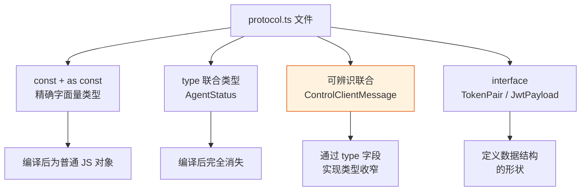

---

# 第三部分：TypeScript 工程配置

## 3.1 tsconfig.json 配置详解

### 3.1.1 配置结构概览

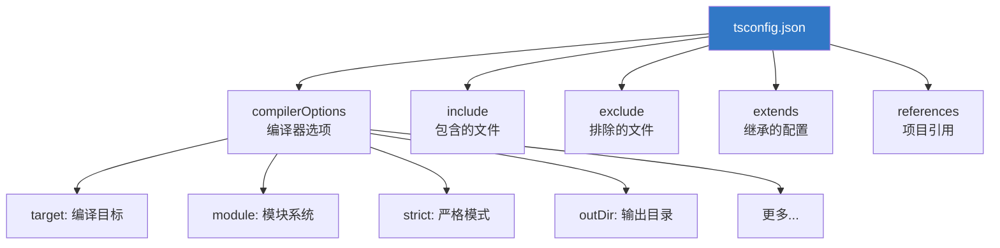

### 3.1.2 核心配置项详解

```jsonc
{
  "compilerOptions": {
    // ===== 编译目标 =====
    "target": "ES2022",
    // 编译到哪个 ES 版本
    // ES5: 最兼容（IE11）
    // ES2020: 支持 BigInt、Optional Chaining
    // ES2022: 支持 Top-level await、Array.at()
    // 推荐：ES2022（现代项目）

    // ===== 模块系统 =====
    "module": "NodeNext",
    // 生成的 JS 使用什么模块系统
    // CommonJS: Node.js 传统模块
    // ESNext: ES Modules
    // NodeNext: 根据 package.json 的 type 字段自动选择

    "moduleResolution": "NodeNext",
    // 如何查找模块
    // Node: 传统 Node.js 查找方式
    // NodeNext: Node.js 新版查找方式
    // bundler: 打包工具的查找方式（Vite/Webpack）

    // ===== 严格模式 =====
    "strict": true,
    // 开启所有严格检查（推荐始终开启）
    // 等价于同时开启：
    // - strictNullChecks: null/undefined 不能赋给其他类型
    // - strictFunctionTypes: 函数参数类型严格检查
    // - strictBindCallApply: bind/call/apply 类型检查
    // - noImplicitAny: 禁止隐式 any
    // - noImplicitThis: 禁止隐式 this
    // - alwaysStrict: 输出文件添加 'use strict'

    // ===== 输出配置 =====
    "outDir": "./dist",
    // 编译输出目录

    "rootDir": "./src",
    // 源码根目录

    "declaration": true,
    // 生成 .d.ts 类型声明文件

    "declarationMap": true,
    // 生成 .d.ts.map，支持跳转到源码

    "sourceMap": true,
    // 生成 .js.map，支持调试时映射到 TS 源码

    // ===== 互操作性 =====
    "esModuleInterop": true,
    // 让 CommonJS 模块可以使用 default import
    // import fs from 'fs' 代替 import * as fs from 'fs'

    "resolveJsonModule": true,
    // 允许 import data from './data.json'

    "skipLibCheck": true,
    // 跳过 .d.ts 文件的类型检查（提升编译速度）

    "forceConsistentCasingInFileNames": true,
    // 强制文件名大小写一致（避免跨平台问题）

    // ===== 路径相关 =====
    "composite": true,
    // 启用项目引用（Project References）

    "lib": ["ES2022", "DOM"],
    // 包含的内置类型库
    // ES2022: ES2022 的内置类型
    // DOM: 浏览器 DOM API 类型
    // Node: Node.js API 类型（需要 @types/node）
  }
}
```

### 3.1.3 target 与 module 的搭配

| target | module | 适用场景 |
|--------|--------|---------|
| ES5 | CommonJS | 需要兼容 IE11 的老项目 |
| ES2020 | ESNext | 现代浏览器/Node 14+ |
| ES2022 | NodeNext | 现代 Node.js 项目（推荐） |
| ES2022 | ESNext + bundler | Vite/Webpack 打包项目 |

---

## 3.2 项目 tsconfig 分析

### 3.2.1 基础配置

```jsonc
// packages/config/tsconfig/base.json —— 所有包共享的基础配置
{
  "compilerOptions": {
    "target": "ES2022",                    // 编译到 ES2022
    "module": "NodeNext",                  // Node.js 模块系统
    "moduleResolution": "NodeNext",        // Node.js 风格的模块查找
    "strict": true,                        // 全部严格检查
    "esModuleInterop": true,               // 兼容 CommonJS 的 default import
    "skipLibCheck": true,                  // 跳过 .d.ts 检查（加速编译）
    "forceConsistentCasingInFileNames": true, // 文件名大小写一致
    "resolveJsonModule": true,             // 允许 import JSON
    "declaration": true,                   // 生成 .d.ts
    "declarationMap": true,                // 生成 .d.ts.map
    "sourceMap": true,                     // 生成 .js.map
    "outDir": "dist",                      // 输出到 dist/
    "rootDir": "src"                       // 源码在 src/
  },
  "exclude": ["node_modules", "dist"]      // 排除依赖和输出
}
```

### 3.2.2 各包配置

```jsonc
// packages/shared/tsconfig.json —— 共享包
{
  "extends": "../config/tsconfig/base.json",  // 继承基础配置
  "compilerOptions": {
    "composite": true,          // ✅ 启用项目引用（被其他包引用）
    "outDir": "./dist",
    "rootDir": "./src",
    "module": "ESNext",         // 覆盖为 ESNext 模块
    "moduleResolution": "bundler" // 使用 bundler 模式解析
  },
  "include": ["src"],
  "exclude": ["src/__tests__"]   // 测试文件不参与编译
}

// apps/server/tsconfig.json —— 服务端
{
  "extends": "../../packages/config/tsconfig/base.json",  // 继承基础配置
  "compilerOptions": {
    "outDir": "./dist",
    "rootDir": "./src",
    "lib": ["ES2022"]           // 只包含 ES2022 库（服务端不需要 DOM）
  },
  "include": ["src"],
  "references": [
    { "path": "../../packages/shared" }  // 引用 shared 包
  ]
}
```

**配置继承关系图：**

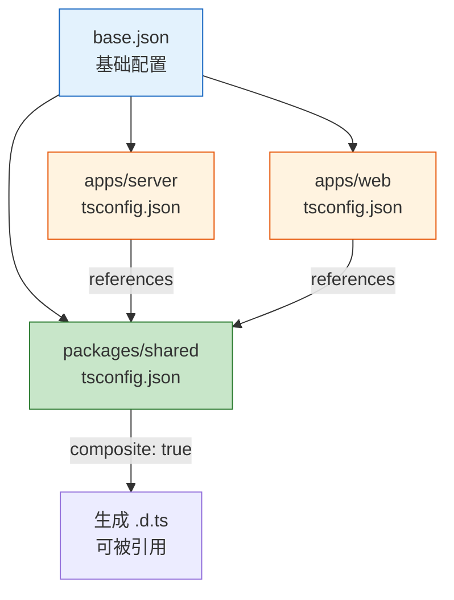

---

## 3.3 ESM + TypeScript 兼容性

### 3.3.1 核心问题

ES Modules 和 TypeScript 的组合会带来一些兼容性问题：

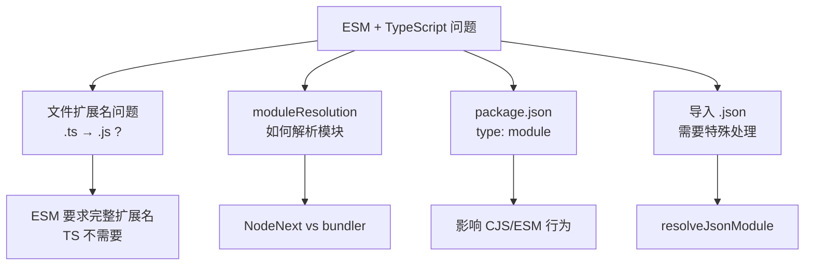

### 3.3.2 文件扩展名问题

```typescript
// ESM 规范要求导入时写完整文件名
// 但 TypeScript 源码用 .ts，编译后是 .js

// ❌ 在 NodeNext 模式下，这样写会报错
import { foo } from './utils'       // 缺少扩展名

// ✅ 必须写 .js 扩展名（即使源文件是 .ts）
import { foo } from './utils.js'    // TypeScript 会自动映射到 utils.ts

// ✅ 使用 bundler 模式可以省略扩展名
// （适用于 Vite、Webpack 等打包工具处理的项目）
import { foo } from './utils'
```

### 3.3.3 module 和 moduleResolution 的选择

| module | moduleResolution | 适用场景 | 扩展名要求 |
|--------|-----------------|---------|-----------|
| CommonJS | Node | 传统 Node.js | 可省略 |
| ESNext | bundler | Vite/Webpack 项目 | 可省略 |
| NodeNext | NodeNext | 原生 ESM Node.js | 必须写 .js |
| Node16 | Node16 | Node.js 16 | 必须写 .js |

```jsonc
// 项目中 shared 包使用 bundler 模式
{
  "compilerOptions": {
    "module": "ESNext",
    "moduleResolution": "bundler"
    // 适用于被打包工具处理的代码
    // 导入时不需要 .js 扩展名
  }
}

// 项目中 server 使用 NodeNext 模式
{
  "compilerOptions": {
    "module": "NodeNext",
    "moduleResolution": "NodeNext"
    // 适用于直接在 Node.js 运行的代码
    // 导入时需要 .js 扩展名
  }
}
```

---

## 3.4 项目引用（Project References）

### 3.4.1 什么是项目引用

项目引用允许将大型 TypeScript 项目拆分为多个较小的项目，每个项目有自己的 `tsconfig.json`。

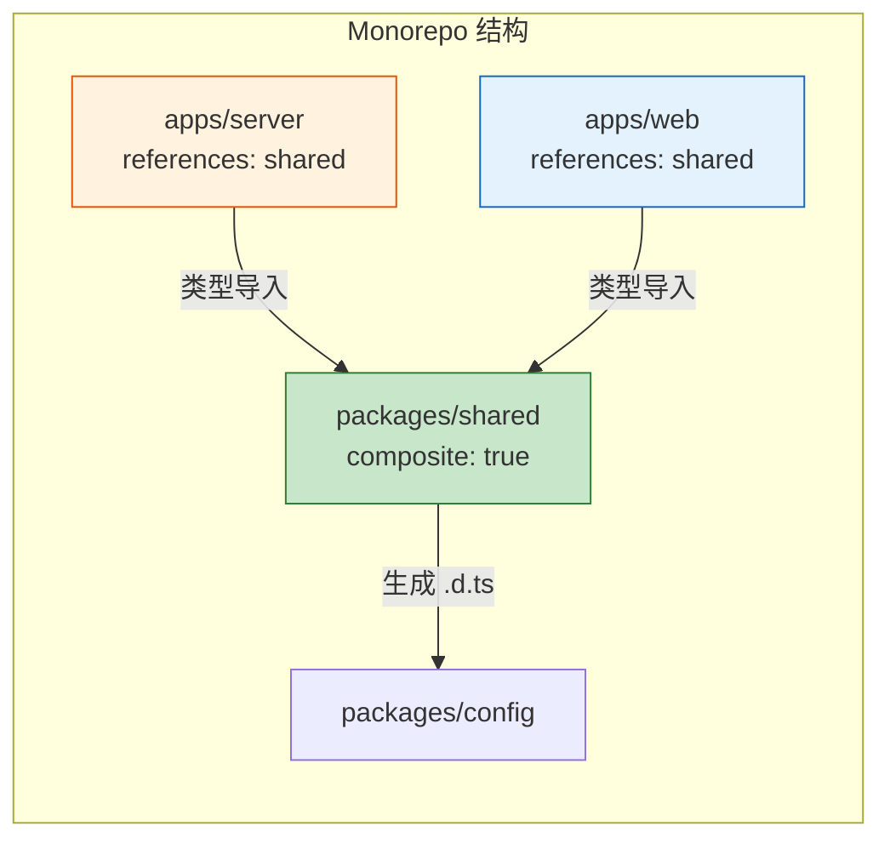

### 3.4.2 配置步骤

```jsonc
// 步骤 1：被引用的包（shared）需要开启 composite
// packages/shared/tsconfig.json
{
  "compilerOptions": {
    "composite": true  // ✅ 必须开启
  }
}

// 步骤 2：引用方声明 references
// apps/server/tsconfig.json
{
  "references": [
    { "path": "../../packages/shared" }
  ]
}

// 步骤 3：使用 tsc --build 进行增量编译
// tsc --build apps/server
```

### 3.4.3 项目引用的优势

| 优势 | 说明 |
|------|------|
| 增量编译 | 只重新编译修改过的项目 |
| 类型隔离 | 每个项目的类型错误不会污染其他项目 |
| 依赖明确 | 通过 references 显式声明依赖关系 |
| 并行编译 | 无依赖关系的项目可以并行编译 |
| 源码导航 | IDE 可以直接跳转到源码（而非 .d.ts） |

---

# 第四部分：项目中的 JS/TS 实践

## 4.1 类型定义文件（.d.ts）

### 4.1.1 什么是 .d.ts 文件

`.d.ts` 文件是 TypeScript 的**类型声明文件**，只包含类型信息，不包含实现代码。编译器用它来理解 JavaScript 代码的类型。

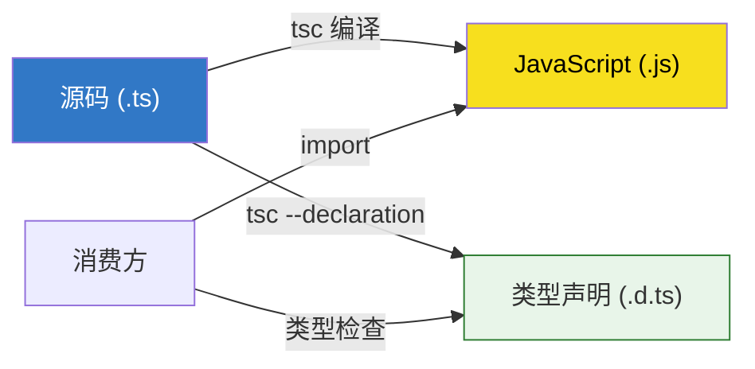

### 4.1.2 项目中的 .d.ts 文件

```typescript
// apps/server/src/types/fastify.d.ts
// 为 Fastify 框架扩展类型声明

// 声明合并（Declaration Merging）
// Fastify 原有的 Request 类型不包含 user 属性
// 通过声明合并，我们可以安全地添加它
declare module 'fastify' {
  interface FastifyRequest {
    user?: {
      userId: string
      username: string
    }
  }
}

// 使用时：
// request.user?.userId  // ✅ 类型安全，不报错
```

### 4.1.3 编写 .d.ts 的常见模式

```typescript
// 1. 为无类型的 JS 库添加类型
// types/my-lib.d.ts
declare module 'my-lib' {
  export function doSomething(input: string): number
  export interface Options {
    timeout?: number
    retries?: number
  }
}

// 2. 全局类型声明（不需要 import）
// types/global.d.ts
declare const API_URL: string
declare const __DEV__: boolean

// 3. 环境变量类型
// types/env.d.ts
declare namespace NodeJS {
  interface ProcessEnv {
    NODE_ENV: 'development' | 'production' | 'test'
    PORT: string
    DATABASE_URL: string
    JWT_SECRET: string
  }
}

// 4. CSS Modules 类型
// types/css.d.ts
declare module '*.module.css' {
  const classes: { readonly [key: string]: string }
  export default classes
}

declare module '*.module.scss' {
  const classes: { readonly [key: string]: string }
  export default classes
}

// 5. 图片资源类型
// types/assets.d.ts
declare module '*.png' {
  const src: string
  export default src
}
declare module '*.svg' {
  const src: string
  export default src
}
```

---

## 4.2 Zod 运行时类型校验

### 4.2.1 编译时 vs 运行时

TypeScript 的类型只在编译时存在，运行时完全消失。但外部数据（API 响应、用户输入、配置文件）在运行时才到来——编译器无法帮你检查。

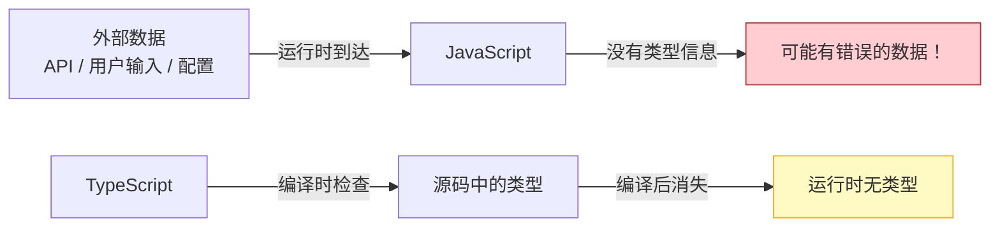

**Zod 的作用：在运行时验证数据，同时自动推导 TypeScript 类型。**

### 4.2.2 Zod 基础用法

```typescript
import { z } from 'zod'

// 定义 schema（运行时校验规则）
const UserSchema = z.object({
  id: z.string().uuid(),
  name: z.string().min(1).max(100),
  email: z.string().email(),
  age: z.number().int().positive().optional(),
  role: z.enum(['admin', 'user', 'viewer']),
})

// 从 schema 推导 TypeScript 类型（编译时）
type User = z.infer<typeof UserSchema>
// 等价于：
// type User = {
//   id: string
//   name: string
//   email: string
//   age?: number
//   role: 'admin' | 'user' | 'viewer'
// }

// 运行时校验
function handleUserData(data: unknown) {
  const result = UserSchema.safeParse(data)

  if (result.success) {
    // result.data 已经被验证和类型化
    console.log(result.data.name)  // ✅ 类型安全
  } else {
    // result.error 包含详细的错误信息
    console.error(result.error.issues)
  }
}

// 校验外部 API 响应
async function fetchUser(id: string): Promise<User> {
  const response = await fetch(`/api/users/${id}`)
  const data = await response.json()

  // 如果 API 返回的数据不符合 schema，这里会抛出错误
  return UserSchema.parse(data)
}
```

### 4.2.3 Zod 的常用类型

```typescript
import { z } from 'zod'

// 原始类型
z.string()              // 字符串
z.number()              // 数字
z.boolean()             // 布尔
z.null()                // null
z.undefined()           // undefined
z.date()                // Date 对象

// 字符串校验
z.string().min(3)       // 最少 3 个字符
z.string().max(100)     // 最多 100 个字符
z.string().email()      // 邮箱格式
z.string().url()        // URL 格式
z.string().uuid()       // UUID 格式
z.string().regex(/^#/)  // 正则匹配

// 数字校验
z.number().int()        // 整数
z.number().positive()   // 正数
z.number().min(0)       // 最小值
z.number().max(100)     // 最大值

// 对象
z.object({
  name: z.string(),
  age: z.number(),
})

// 数组
z.array(z.string())     // string[]
z.array(z.number()).min(1) // 至少一个元素

// 可选和可空
z.string().optional()   // string | undefined
z.string().nullable()   // string | null
z.string().nullish()    // string | null | undefined

// 联合类型
z.union([z.string(), z.number()]) // string | number
z.enum(['a', 'b', 'c'])           // 'a' | 'b' | 'c'

// 元组
z.tuple([z.string(), z.number()]) // [string, number]

// 记录
z.record(z.string(), z.number())  // Record<string, number>
```

### 4.2.4 Zod 与 TypeScript 类型的对比

| 特性 | TypeScript 类型 | Zod Schema |
|------|----------------|------------|
| 检查时机 | 编译时 | 运行时 |
| 运行时存在 | ❌ | ✅ |
| 校验外部数据 | ❌ | ✅ |
| 类型推导 | 直接定义 | `z.infer<typeof schema>` |
| 错误信息 | IDE 标红 | 详细的错误报告 |
| 性能开销 | 无 | 有（校验需要时间） |

---

## 4.3 错误处理模式

### 4.3.1 try / catch 基础

```typescript
// 基本的错误处理
try {
  const data = JSON.parse(input)
  console.log(data)
} catch (error) {
  // error 的类型是 unknown（TypeScript 4.4+）
  if (error instanceof SyntaxError) {
    console.error('JSON 解析失败:', error.message)
  } else {
    console.error('未知错误:', error)
  }
}
```

### 4.3.2 自定义错误类

```typescript
// 自定义错误层次结构
class AppError extends Error {
  constructor(
    message: string,
    public code: string,
    public statusCode: number = 500,
  ) {
    super(message)
    this.name = 'AppError'
  }
}

class AuthError extends AppError {
  constructor(message: string) {
    super(message, 'AUTH_ERROR', 401)
    this.name = 'AuthError'
  }
}

class ValidationError extends AppError {
  constructor(
    message: string,
    public fields: Record<string, string>,
  ) {
    super(message, 'VALIDATION_ERROR', 400)
    this.name = 'ValidationError'
  }
}

class NotFoundError extends AppError {
  constructor(resource: string, id: string) {
    super(`${resource} not found: ${id}`, 'NOT_FOUND', 404)
    this.name = 'NotFoundError'
  }
}

// 使用 instanceof 进行精确的错误处理
async function handleRequest(req: Request) {
  try {
    const result = await processRequest(req)
    return { status: 200, data: result }
  } catch (error) {
    if (error instanceof AuthError) {
      return { status: 401, error: error.message }
    }
    if (error instanceof ValidationError) {
      return { status: 400, error: error.message, fields: error.fields }
    }
    if (error instanceof NotFoundError) {
      return { status: 404, error: error.message }
    }
    // 未知错误
    console.error('Unexpected error:', error)
    return { status: 500, error: 'Internal server error' }
  }
}
```

### 4.3.3 错误层次图

```mermaid
graph TB
    A["Error<br/>内置基类"] --> B["AppError<br/>应用错误基类"]
    B --> C["AuthError<br/>认证错误 (401)"]
    B --> D["ValidationError<br/>校验错误 (400)"]
    B --> E["NotFoundError<br/>资源不存在 (404)"]
    B --> F["TimeoutError<br/>超时错误 (408)"]

    style A fill:#ffcdd2,stroke:#c62828
    style B fill:#fff3e0,stroke:#e65100
    style C fill:#ffebee,stroke:#c62828
    style D fill:#ffebee,stroke:#c62828
    style E fill:#ffebee,stroke:#c62828
    style F fill:#ffebee,stroke:#c62828
```

### 4.3.4 Result 模式（函数式错误处理）

```typescript
// Result 模式：不抛出异常，而是返回结果对象
type Result<T, E = Error> =
  | { ok: true; value: T }
  | { ok: false; error: E }

// 使用 Result 的函数
function parseJSON<T>(input: string): Result<T, SyntaxError> {
  try {
    return { ok: true, value: JSON.parse(input) }
  } catch (error) {
    return { ok: false, error: error as SyntaxError }
  }
}

// 使用
const result = parseJSON<{ name: string }>('{"name": "Alice"}')
if (result.ok) {
  console.log(result.value.name)  // ✅ 类型安全
} else {
  console.error(result.error.message)
}

// 链式操作
function mapResult<T, U, E>(
  result: Result<T, E>,
  fn: (value: T) => U,
): Result<U, E> {
  if (result.ok) {
    return { ok: true, value: fn(result.value) }
  }
  return result
}
```

---

## 4.4 异步操作的错误处理

### 4.4.1 async/await 的错误处理

```typescript
// 基础模式
async function fetchData(url: string) {
  try {
    const response = await fetch(url)

    if (!response.ok) {
      throw new Error(`HTTP ${response.status}: ${response.statusText}`)
    }

    return await response.json()
  } catch (error) {
    if (error instanceof TypeError) {
      // 网络错误（fetch 抛出 TypeError）
      console.error('网络错误:', error.message)
    } else if (error instanceof Error) {
      // HTTP 错误或其他错误
      console.error('请求失败:', error.message)
    }
    throw error  // 重新抛出，让调用者决定如何处理
  }
}
```

### 4.4.2 优雅的异步错误处理封装

```typescript
// 封装异步操作为 Result
async function tryCatch<T>(
  promise: Promise<T>,
): Promise<Result<T>> {
  try {
    const value = await promise
    return { ok: true, value }
  } catch (error) {
    return { ok: false, error: error instanceof Error ? error : new Error(String(error)) }
  }
}

// 使用
async function loadUser(id: string) {
  const result = await tryCatch(fetchUser(id))

  if (!result.ok) {
    showErrorToast(result.error.message)
    return
  }

  // result.value 有完整的类型信息
  displayUser(result.value)
}
```

### 4.4.3 并发异步的错误处理

```typescript
// Promise.allSettled：处理多个并发请求的错误
async function loadDashboard(userId: string) {
  const results = await Promise.allSettled([
    fetchUser(userId),
    fetchPosts(userId),
    fetchNotifications(userId),
  ])

  const [userResult, postsResult, notificationsResult] = results

  // 逐个检查结果
  const user = userResult.status === 'fulfilled' ? userResult.value : null
  const posts = postsResult.status === 'fulfilled' ? postsResult.value : []
  const notifications = notificationsResult.status === 'fulfilled'
    ? notificationsResult.value
    : []

  // 记录失败的请求
  results.forEach((result, index) => {
    if (result.status === 'rejected') {
      console.error(`Request ${index} failed:`, result.reason)
    }
  })

  return { user, posts, notifications }
}
```

### 4.4.4 超时处理

```typescript
// 超时包装器
function withTimeout<T>(promise: Promise<T>, ms: number): Promise<T> {
  return Promise.race([
    promise,
    new Promise<never>((_, reject) => {
      setTimeout(() => reject(new Error(`操作超时（${ms}ms）`)), ms)
    }),
  ])
}

// 使用
async function fetchWithTimeout(url: string, timeoutMs = 5000) {
  return withTimeout(fetch(url), timeoutMs)
}

// 重试机制
async function withRetry<T>(
  fn: () => Promise<T>,
  options: { maxRetries: number; delay: number; backoff?: number },
): Promise<T> {
  let lastError: Error | undefined
  const { maxRetries, delay, backoff = 2 } = options

  for (let attempt = 0; attempt <= maxRetries; attempt++) {
    try {
      return await fn()
    } catch (error) {
      lastError = error instanceof Error ? error : new Error(String(error))
      if (attempt < maxRetries) {
        const waitTime = delay * Math.pow(backoff, attempt)
        console.log(`重试 ${attempt + 1}/${maxRetries}，等待 ${waitTime}ms...`)
        await new Promise(resolve => setTimeout(resolve, waitTime))
      }
    }
  }

  throw lastError
}

// 使用：失败最多重试 3 次，每次间隔加倍
const data = await withRetry(
  () => fetchUser('123'),
  { maxRetries: 3, delay: 1000, backoff: 2 },
)
```

### 4.4.5 完整的异步错误处理流程图

```mermaid
graph TD
    A["发起异步操作"] --> B{"操作类型"}

    B -->|"单个请求"| C["try/catch"]
    C -->|"成功"| D["返回数据"]
    C -->|"失败"| E{"错误类型"}
    E -->|"网络错误"| F["提示检查网络"]
    E -->|"超时"| G["提示超时+重试"]
    E -->|"HTTP 4xx"| H["显示业务错误"]
    E -->|"HTTP 5xx"| I["提示服务端错误"]

    B -->|"多个并发请求"| J["Promise.allSettled"]
    J --> K["逐个检查结果"]
    K -->|"全部成功"| D
    K -->|"部分失败"| L["显示成功的数据<br/>+ 失败提示"]

    B -->|"需要重试"| M["withRetry"]
    M -->|"最终成功"| D
    M -->|"全部重试失败"| N["抛出最后的错误"]

    style A fill:#e3f2fd,stroke:#1565c0
    style D fill:#c8e6c9,stroke:#2e7d32
    style F fill:#fff3e0,stroke:#e65100
    style H fill:#fff3e0,stroke:#e65100
    style N fill:#ffcdd2,stroke:#c62828
```

---

## 附录：常用速查表

### A. JavaScript 类型判断速查

```javascript
// 推荐的类型判断方式
typeof value              // 原始类型
Array.isArray(value)      // 数组
value instanceof Date     // Date
value instanceof RegExp   // RegExp
value === null            // null
value === undefined       // undefined
Object.prototype.toString.call(value) // 精确类型
```

### B. TypeScript 类型操作速查

```typescript
// 创建类型
type Partial<T>     // 所有属性可选
type Required<T>    // 所有属性必选
type Readonly<T>    // 所有属性只读
type Pick<T, K>     // 选取属性
type Omit<T, K>     // 排除属性
type Record<K, T>   // 键值映射

// 联合类型操作
type Exclude<T, U>  // 从联合中排除
type Extract<T, U>  // 从联合中提取

// 函数类型操作
type ReturnType<T>  // 获取返回类型
type Parameters<T>  // 获取参数类型

// 条件类型
type NonNullable<T> // 排除 null/undefined
type Awaited<T>     // 获取 Promise 内部类型
```

### C. 异步模式速查

```typescript
// 基础
await promise                         // 等待单个 Promise
await Promise.all([p1, p2])           // 并行等待，一个失败全部失败
await Promise.allSettled([p1, p2])    // 并行等待，全部完成
await Promise.race([p1, p2])          // 返回最快的
await Promise.any([p1, p2])           // 返回最先成功的

// 错误处理
try { await op() } catch (e) { }     // try/catch
const [err, data] = await tryCatch(op()) // Result 模式
```

---

> 以下为进阶补充章节。

---

# 第五部分：JavaScript 高级话题

> 在掌握了 JavaScript 基础之后，理解高级概念是成为专业开发者的必经之路。本部分深入探讨原型链、this 指向、闭包、Symbol、Proxy 等核心机制。

## 5.1 原型链与继承

### 5.1.1 什么是原型链

JavaScript 中每个对象都有一个内部属性 `[[Prototype]]`（通过 `__proto__` 访问），它指向另一个对象。这个被指向的对象也有自己的原型，如此层层向上，直到 `null` 为止。这就是**原型链**。

```javascript
// 每个对象都有 __proto__
const obj = { name: 'Alice' }
console.log(obj.__proto__)           // Object.prototype
console.log(obj.__proto__.__proto__) // null（原型链终点）

// 函数有 prototype 属性（用于构造函数）
function Person(name) {
  this.name = name
}
Person.prototype.sayHi = function() {
  return `Hi, I'm ${this.name}`
}

const p = new Person('Bob')
console.log(p.sayHi())           // "Hi, I'm Bob"
console.log(p.__proto__ === Person.prototype) // true
console.log(Person.prototype.__proto__ === Object.prototype) // true
```

### 5.1.2 原型链完整图

```mermaid
graph TB
    subgraph 实例层
        P1["p1 = new Person('Alice')\n{ name: 'Alice' }"]
        P2["p2 = new Person('Bob')\n{ name: 'Bob' }"]
    end

    subgraph 构造函数原型
        PP["Person.prototype\n{ constructor: Person, sayHi: fn }"]
    end

    subgraph Object 原型
        OP["Object.prototype\n{ toString: fn, hasOwnProperty: fn }"]
    end

    subgraph 终点
        N["null"]
    end

    subgraph 构造函数本身
        PF["Person (函数)\n{ prototype: Person.prototype }"]
    end

    P1 -->|"__proto__"| PP
    P2 -->|"__proto__"| PP
    PP -->|"__proto__"| OP
    OP -->|"__proto__"| N
    PF -->|"prototype"| PP
    PP -->|"constructor"| PF

    style P1 fill:#e3f2fd,stroke:#1565c0
    style P2 fill:#e3f2fd,stroke:#1565c0
    style PP fill:#fff3e0,stroke:#e65100
    style OP fill:#e8f5e9,stroke:#2e7d32
    style N fill:#fafafa,stroke:#616161
    style PF fill:#f3e5f5,stroke:#7b1fa2
```

### 5.1.3 属性查找机制

```javascript
function Animal(type) {
  this.type = type
}
Animal.prototype.breathe = function() {
  return `${this.type} is breathing`
}

function Dog(name) {
  Animal.call(this, 'Dog')
  this.name = name
}
Dog.prototype = Object.create(Animal.prototype)
Dog.prototype.constructor = Dog
Dog.prototype.bark = function() {
  return `${this.name} says: Woof!`
}

const buddy = new Dog('Buddy')

// 属性查找顺序：
// 1. buddy 自身 → 找到 name, type
// 2. Dog.prototype → 找到 bark
// 3. Animal.prototype → 找到 breathe
// 4. Object.prototype → 找到 toString 等
// 5. null → 未找到则报错

console.log(buddy.name)       // "Buddy"（自身）
console.log(buddy.bark())     // "Woof!"（Dog.prototype）
console.log(buddy.breathe())  // "Dog is breathing"（Animal.prototype）
console.log(buddy.toString()) // "[object Object]"（Object.prototype）
console.log(buddy.fly)        // undefined（null 处返回 undefined）
```

### 5.1.4 ES6 class 与原型链的关系

```javascript
// ES6 class 只是语法糖，本质还是原型链
class Animal {
  constructor(type) {
    this.type = type
  }
  breathe() {
    return `${this.type} is breathing`
  }
}

class Dog extends Animal {
  constructor(name) {
    super('Dog')
    this.name = name
  }
  bark() {
    return `${this.name} says: Woof!`
  }
}

// 验证：class 本质上还是基于原型
const d = new Dog('Rex')
console.log(typeof Dog)                    // "function"
console.log(Dog.prototype.bark)            // [Function: bark]
console.log(d.__proto__ === Dog.prototype) // true
console.log(d.__proto__.__proto__ === Animal.prototype) // true
```

### 5.1.5 继承方式对比

| 方式 | 优点 | 缺点 | 推荐度 |
|------|------|------|--------|
| 原型链继承 | 简单 | 引用类型共享、不能传参 | ⭐ |
| 构造函数继承 | 可传参、引用独立 | 方法不能复用 | ⭐⭐ |
| 组合继承 | 兼具两者优点 | 调用两次构造函数 | ⭐⭐⭐ |
| 寄生组合继承 | 最优 ES5 方案 | 写法复杂 | ⭐⭐⭐⭐ |
| ES6 class | 语法清晰、官方推荐 | 本质仍是原型 | ⭐⭐⭐⭐⭐ |

### 5.1.6 instanceof 原理

```javascript
// instanceof 沿着原型链查找
function myInstanceof(obj, Constructor) {
  let proto = Object.getPrototypeOf(obj)
  while (proto !== null) {
    if (proto === Constructor.prototype) {
      return true
    }
    proto = Object.getPrototypeOf(proto)
  }
  return false
}

// 验证
console.log(myInstanceof(d, Dog))    // true
console.log(myInstanceof(d, Animal)) // true
console.log(myInstanceof(d, Object)) // true
```

## 5.2 this 指向规则

### 5.2.1 四种绑定规则

`this` 的值取决于函数的**调用方式**，而不是定义位置。这是 JavaScript 中最容易混淆的概念之一。

```mermaid
graph TD
    A["函数调用时确定 this"] --> B{调用方式?}
    B -->|"new Foo()"| C["new 绑定\nthis = 新创建的对象"]
    B -->|"foo.call(obj)\nfoo.apply(obj)\nfoo.bind(obj)"| D["显式绑定\nthis = 指定的 obj"]
    B -->|"obj.foo()"| E["隐式绑定\nthis = 调用者 obj"]
    B -->|"foo()"| F["默认绑定\nthis = undefined（严格模式）\nthis = window（非严格模式）"]

    style C fill:#e8f5e9,stroke:#2e7d32
    style D fill:#e3f2fd,stroke:#1565c0
    style E fill:#fff3e0,stroke:#e65100
    style F fill:#ffcdd2,stroke:#c62828
```

### 5.2.2 四种规则详解

```javascript
'use strict'

// ========== 1. 默认绑定 ==========
function standalone() {
  console.log(this) // undefined（严格模式）
}
standalone()

// ========== 2. 隐式绑定 ==========
const obj = {
  name: 'Alice',
  greet() {
    console.log(this.name) // "Alice"（this = obj）
  }
}
obj.greet()

// 隐式丢失！
const fn = obj.greet
fn() // undefined（this 变成 undefined，严格模式下）

// ========== 3. 显式绑定 ==========
function sayHi() {
  console.log(`Hi, ${this.name}`)
}
const alice = { name: 'Alice' }
const bob = { name: 'Bob' }

sayHi.call(alice)   // "Hi, Alice"
sayHi.apply(bob)    // "Hi, Bob"

const boundFn = sayHi.bind(alice)
boundFn()           // "Hi, Alice"（永久绑定）

// ========== 4. new 绑定 ==========
function Person(name) {
  this.name = name // this = 新创建的对象
}
const p = new Person('Charlie')
console.log(p.name) // "Charlie"
```

### 5.2.3 this 指向对比表

| 场景 | this 的值 | 示例 | 备注 |
|------|----------|------|------|
| 普通函数调用 | `undefined`（严格）/ `window`（非严格） | `foo()` | 默认绑定 |
| 对象方法调用 | 调用对象 | `obj.foo()` | 隐式绑定 |
| `call/apply` | 第一个参数 | `foo.call(ctx)` | 显式绑定 |
| `bind` | 绑定的值 | `foo.bind(ctx)()` | 硬绑定 |
| `new` | 新创建的对象 | `new Foo()` | new 绑定 |
| 箭头函数 | 外层作用域的 this | `() => {}` | 词法绑定，不可修改 |
| 事件处理器 | 触发事件的元素 | `el.onclick = fn` | DOM 特有 |
| 类方法 | 实例对象 | `this.method()` | 同隐式绑定 |
| 类方法（解构丢失） | `undefined` | `const { method } = obj` | 隐式丢失 |

### 5.2.4 箭头函数的 this

```javascript
// 箭头函数没有自己的 this，继承外层作用域
const team = {
  name: 'A-Team',
  members: ['Alice', 'Bob', 'Charlie'],

  // ❌ 问题：普通函数的 this 是 members 数组（调用者）
  showMembersBad() {
    this.members.forEach(function(member) {
      console.log(`${member} belongs to ${this.name}`) // this.name = undefined
    })
  },

  // ✅ 解决方案 1：箭头函数（推荐）
  showMembersGood() {
    this.members.forEach((member) => {
      console.log(`${member} belongs to ${this.name}`) // "A-Team"
    })
  },

  // ✅ 解决方案 2：保存 this 到变量
  showMembersAlt() {
    const self = this
    this.members.forEach(function(member) {
      console.log(`${member} belongs to ${self.name}`)
    })
  },

  // ✅ 解决方案 3：forEach 的 thisArg 参数
  showMembersArg() {
    this.members.forEach(function(member) {
      console.log(`${member} belongs to ${this.name}`)
    }, this) // 第二个参数作为回调的 this
  }
}
```

### 5.2.5 箭头函数不能作为构造函数

```javascript
const Foo = () => {}
// new Foo() // ❌ TypeError: Foo is not a constructor

// 箭头函数的 this 无法通过 call/apply/bind 修改
const arrow = () => console.log(this)
arrow.call({ name: 'test' }) // this 仍然是外层的 this，不是 { name: 'test' }
```

## 5.3 闭包深入

### 5.3.1 闭包的本质

闭包 = 函数 + 它能访问的外部变量。当一个函数在其词法作用域之外执行时，它仍然能访问原来的变量，这就是闭包。

```javascript
function createCounter() {
  let count = 0 // 这个变量被闭包"记住"了

  return {
    increment() { return ++count },
    decrement() { return --count },
    getCount() { return count }
  }
}

const counter = createCounter()
console.log(counter.increment()) // 1
console.log(counter.increment()) // 2
console.log(counter.decrement()) // 1
console.log(counter.getCount())  // 1
// count 变量无法从外部直接访问，实现了私有化
```

### 5.3.2 闭包的内存模型

```mermaid
graph LR
    subgraph 调用栈
        A["createCounter() 执行完毕"]
    end

    subgraph 堆内存 - 闭包对象
        B["Closure { count: 0 }"]
    end

    subgraph 返回的对象
        C["{ increment: fn, decrement: fn, getCount: fn }"]
    end

    A -.->|"函数执行完毕\n但 count 未被回收"| B
    C -->|"每个方法引用"| B

    style B fill:#fff3e0,stroke:#e65100
    style C fill:#e3f2fd,stroke:#1565c0
```

### 5.3.3 闭包导致的内存泄漏

```javascript
// ❌ 危险：闭包持有大数组的引用
function processData() {
  const hugeArray = new Array(1000000).fill('data')

  return function getLength() {
    return hugeArray.length
    // hugeArray 永远不会被回收！
  }
}

const getLength = processData() // hugeArray 一直在内存中

// ✅ 修复：用完即释放
function processDataFixed() {
  const hugeArray = new Array(1000000).fill('data')
  const length = hugeArray.length

  return function getLength() {
    return length // 只捕获需要的值，不捕获整个数组
  }
}
```

### 5.3.4 经典面试题：循环中的闭包

```javascript
// ❌ 问题代码
for (var i = 0; i < 5; i++) {
  setTimeout(function() {
    console.log(i) // 输出 5 个 5，不是 0,1,2,3,4
  }, 100)
}
// 原因：var 是函数作用域，5 个回调共享同一个 i

// ✅ 修复 1：let（块级作用域）
for (let i = 0; i < 5; i++) {
  setTimeout(function() {
    console.log(i) // 0, 1, 2, 3, 4
  }, 100)
}

// ✅ 修复 2：IIFE 创建独立作用域
for (var i = 0; i < 5; i++) {
  ;(function(j) {
    setTimeout(function() {
      console.log(j) // 0, 1, 2, 3, 4
    }, 100)
  })(i)
}

// ✅ 修复 3：bind
for (var i = 0; i < 5; i++) {
  setTimeout(console.log.bind(console, i), 100)
}
```

### 5.3.5 闭包与模块模式

```javascript
// 经典模块模式（ES6 模块出现前的主流方案）
const UserModule = (function() {
  // 私有变量
  let users = []
  let nextId = 1

  // 私有函数
  function validate(name) {
    return typeof name === 'string' && name.length > 0
  }

  // 公共 API
  return {
    add(name) {
      if (!validate(name)) throw new Error('Invalid name')
      const user = { id: nextId++, name }
      users.push(user)
      return user
    },
    getAll() {
      return [...users] // 返回副本，防止外部修改
    },
    findById(id) {
      return users.find(u => u.id === id) || null
    },
    count() {
      return users.length
    }
  }
})()

UserModule.add('Alice')
UserModule.add('Bob')
console.log(UserModule.getAll())   // [{ id: 1, name: 'Alice' }, { id: 2, name: 'Bob' }]
console.log(UserModule.count())   // 2
// console.log(UserModule.users)  // undefined（私有，不可访问）
```

### 5.3.6 闭包实际应用场景

```javascript
// 1. 防抖（Debounce）
function debounce(fn, delay) {
  let timer = null
  return function(...args) {
    clearTimeout(timer)
    timer = setTimeout(() => fn.apply(this, args), delay)
  }
}

// 2. 节流（Throttle）
function throttle(fn, interval) {
  let lastTime = 0
  return function(...args) {
    const now = Date.now()
    if (now - lastTime >= interval) {
      lastTime = now
      fn.apply(this, args)
    }
  }
}

// 3. 柯里化（Curry）
function curry(fn) {
  return function curried(...args) {
    if (args.length >= fn.length) {
      return fn.apply(this, args)
    }
    return function(...moreArgs) {
      return curried.apply(this, args.concat(moreArgs))
    }
  }
}

const add = curry((a, b, c) => a + b + c)
console.log(add(1)(2)(3))     // 6
console.log(add(1, 2)(3))     // 6
console.log(add(1)(2, 3))     // 6

// 4. 缓存/记忆化（Memoize）
function memoize(fn) {
  const cache = new Map()
  return function(...args) {
    const key = JSON.stringify(args)
    if (cache.has(key)) return cache.get(key)
    const result = fn.apply(this, args)
    cache.set(key, result)
    return result
  }
}

const expensiveCalc = memoize((n) => {
  console.log('Computing...')
  return n * n * n
})
console.log(expensiveCalc(5)) // Computing... 125
console.log(expensiveCalc(5)) // 125（缓存命中，不再 Computing）
```

## 5.4 Symbol 与迭代器协议

### 5.4.1 Symbol 基础

Symbol 是 ES6 引入的第七种原始类型，每个 Symbol 值都是唯一的。

```javascript
// 创建 Symbol
const s1 = Symbol()
const s2 = Symbol('description') // 描述仅用于调试
const s3 = Symbol('description')

console.log(s2 === s3) // false（每个 Symbol 唯一）

// Symbol.for —— 全局注册表
const s4 = Symbol.for('key')
const s5 = Symbol.for('key')
console.log(s4 === s5) // true（全局共享）

// 作为对象属性（唯一可枚举的"私有"属性）
const id = Symbol('id')
const user = {
  name: 'Alice',
  [id]: 12345
}
console.log(user[id])     // 12345
console.log(Object.keys(user)) // ['name']（Symbol 属性不会出现在常规遍历中）
```

### 5.4.2 内置 Symbol（Well-Known Symbols）

```javascript
// Symbol.iterator —— 定义对象的迭代行为
// Symbol.toPrimitive —— 定义类型转换行为
// Symbol.hasInstance —— 自定义 instanceof 行为
// Symbol.toStringTag —— 自定义 Object.prototype.toString

// 示例：自定义 instanceof
class EvenNumber {
  static [Symbol.hasInstance](num) {
    return typeof num === 'number' && num % 2 === 0
  }
}
console.log(2 instanceof EvenNumber)  // true
console.log(3 instanceof EvenNumber)  // false

// 示例：自定义类型转换
const money = {
  amount: 100,
  currency: 'CNY',
  [Symbol.toPrimitive](hint) {
    if (hint === 'number') return this.amount
    if (hint === 'string') return `${this.amount} ${this.currency}`
    return this.amount
  }
}
console.log(+money)        // 100
console.log(`${money}`)    // "100 CNY"
console.log(money + 50)    // 150
```

### 5.4.3 迭代器协议（Iterator Protocol）

```javascript
// 迭代器是一个对象，具有 next() 方法
// next() 返回 { value, done }

// 手动实现迭代器
function createRangeIterator(start, end) {
  let current = start
  return {
    next() {
      if (current <= end) {
        return { value: current++, done: false }
      }
      return { value: undefined, done: true }
    },
    // 实现可迭代协议
    [Symbol.iterator]() {
      return this
    }
  }
}

const iter = createRangeIterator(1, 3)
console.log(iter.next()) // { value: 1, done: false }
console.log(iter.next()) // { value: 2, done: false }
console.log(iter.next()) // { value: 3, done: false }
console.log(iter.next()) // { value: undefined, done: true }

// 可迭代对象可以使用 for...of
for (const num of createRangeIterator(1, 5)) {
  console.log(num) // 1, 2, 3, 4, 5
}

// 展开运算符也依赖迭代器
const arr = [...createRangeIterator(1, 5)]
console.log(arr) // [1, 2, 3, 4, 5]
```

### 5.4.4 Generator 函数

```javascript
// Generator 是创建迭代器的便捷方式
function* fibonacci() {
  let a = 0, b = 1
  while (true) {
    yield a
    ;[a, b] = [b, a + b]
  }
}

const fib = fibonacci()
console.log(fib.next().value) // 0
console.log(fib.next().value) // 1
console.log(fib.next().value) // 1
console.log(fib.next().value) // 2
console.log(fib.next().value) // 3
console.log(fib.next().value) // 5

// Generator 可以接收值
function* accumulator() {
  let sum = 0
  while (true) {
    const value = yield sum
    sum += value
  }
}

const acc = accumulator()
console.log(acc.next())      // { value: 0, done: false }
console.log(acc.next(10))    // { value: 10, done: false }
console.log(acc.next(20))    // { value: 30, done: false }
console.log(acc.next(30))    // { value: 60, done: false }

// 用 Generator 实现异步流程控制
function* fetchUserFlow() {
  const user = yield fetch('/api/user/1').then(r => r.json())
  const posts = yield fetch(`/api/posts/${user.id}`).then(r => r.json())
  return { user, posts }
}

// 简易的 Generator 执行器
function runGenerator(genFn) {
  const gen = genFn()
  function step(value) {
    const result = gen.next(value)
    if (result.done) return Promise.resolve(result.value)
    return Promise.resolve(result.value).then(step)
  }
  return step()
}
```

### 5.4.5 可迭代对象实战

```javascript
// 自定义可迭代的数据结构
class LinkedList {
  constructor() {
    this.head = null
    this.size = 0
  }

  append(value) {
    const node = { value, next: null }
    if (!this.head) {
      this.head = node
    } else {
      let current = this.head
      while (current.next) current = current.next
      current.next = node
    }
    this.size++
  }

  // 实现迭代器协议
  *[Symbol.iterator]() {
    let current = this.head
    while (current) {
      yield current.value
      current = current.next
    }
  }

  // 自定义迭代方法
  *filter(predicate) {
    for (const value of this) {
      if (predicate(value)) yield value
    }
  }

  *map(transform) {
    for (const value of this) {
      yield transform(value)
    }
  }
}

const list = new LinkedList()
list.append(1)
list.append(2)
list.append(3)
list.append(4)
list.append(5)

// for...of 自动使用迭代器
for (const val of list) {
  console.log(val) // 1, 2, 3, 4, 5
}

// 使用扩展运算符
const doubled = [...list.map(x => x * 2)]
console.log(doubled) // [2, 4, 6, 8, 10]

// 使用解构
const [first, second] = list
console.log(first, second) // 1, 2
```

## 5.5 Proxy 与 Reflect

### 5.5.1 Proxy 基础

Proxy 可以拦截对象的基本操作（如属性读取、赋值、函数调用等）。

```javascript
const handler = {
  // 拦截属性读取
  get(target, prop, receiver) {
    console.log(`读取属性: ${String(prop)}`)
    return Reflect.get(target, prop, receiver)
  },
  // 拦截属性设置
  set(target, prop, value, receiver) {
    console.log(`设置属性: ${String(prop)} = ${value}`)
    return Reflect.set(target, prop, value, receiver)
  },
  // 拦截 in 操作符
  has(target, prop) {
    console.log(`检查属性: ${String(prop)}`)
    return Reflect.has(target, prop)
  },
  // 拦截 delete
  deleteProperty(target, prop) {
    console.log(`删除属性: ${String(prop)}`)
    return Reflect.deleteProperty(target, prop)
  }
}

const raw = { name: 'Alice', age: 25 }
const proxy = new Proxy(raw, handler)

proxy.name       // 读取属性: name → "Alice"
proxy.age = 26   // 设置属性: age = 26
'name' in proxy  // 检查属性: name → true
delete proxy.age // 删除属性: age
```

### 5.5.2 常见 Proxy 拦截操作

| 操作 | handler 方法 | 触发场景 |
|------|-------------|----------|
| 属性读取 | `get` | `proxy.foo`、`proxy['foo']` |
| 属性设置 | `set` | `proxy.foo = 1` |
| `in` 操作符 | `has` | `'foo' in proxy` |
| `delete` | `deleteProperty` | `delete proxy.foo` |
| 函数调用 | `apply` | `proxy()` |
| `new` 操作 | `construct` | `new proxy()` |
| `Object.keys` | `ownKeys` | `Object.keys(proxy)` |
| `Object.getOwnPropertyDescriptor` | `getOwnPropertyDescriptor` | — |
| `Object.defineProperty` | `defineProperty` | — |
| `Object.getPrototypeOf` | `getPrototypeOf` | — |
| `Object.setPrototypeOf` | `setPrototypeOf` | — |

### 5.5.3 Vue 3 响应式原理（Proxy 实现）

```javascript
// 简化版 Vue 3 reactive 实现
let activeEffect = null
const targetMap = new WeakMap()

function track(target, key) {
  if (!activeEffect) return
  let depsMap = targetMap.get(target)
  if (!depsMap) {
    depsMap = new Map()
    targetMap.set(target, depsMap)
  }
  let deps = depsMap.get(key)
  if (!deps) {
    deps = new Set()
    depsMap.set(key, deps)
  }
  deps.add(activeEffect)
}

function trigger(target, key) {
  const depsMap = targetMap.get(target)
  if (!depsMap) return
  const deps = depsMap.get(key)
  if (deps) {
    deps.forEach(effect => effect())
  }
}

function reactive(obj) {
  return new Proxy(obj, {
    get(target, key, receiver) {
      track(target, key)
      const result = Reflect.get(target, key, receiver)
      // 深层代理
      if (typeof result === 'object' && result !== null) {
        return reactive(result)
      }
      return result
    },
    set(target, key, value, receiver) {
      const oldValue = target[key]
      const result = Reflect.set(target, key, value, receiver)
      if (oldValue !== value) {
        trigger(target, key)
      }
      return result
    }
  })
}

function effect(fn) {
  activeEffect = fn
  fn()
  activeEffect = null
}

// 使用示例
const state = reactive({ count: 0, user: { name: 'Alice' } })

effect(() => {
  console.log(`Count: ${state.count}`)
}) // 立即输出 "Count: 0"

state.count = 1 // 自动触发输出 "Count: 1"
state.count = 1 // 不触发（值没变）

state.user.name = 'Bob' // 深层响应式也能触发
```

### 5.5.4 Proxy 实用工具

```javascript
// 1. 负索引数组
function negativeArray(arr) {
  return new Proxy(arr, {
    get(target, prop, receiver) {
      const index = Number(prop)
      if (Number.isInteger(index) && index < 0) {
        return target[target.length + index]
      }
      return Reflect.get(target, prop, receiver)
    }
  })
}

const items = negativeArray([1, 2, 3, 4, 5])
console.log(items[-1]) // 5
console.log(items[-2]) // 4

// 2. 类型校验
function typedObject(schema) {
  return new Proxy({}, {
    set(target, prop, value) {
      if (prop in schema && typeof value !== schema[prop]) {
        throw new TypeError(
          `Expected ${schema[prop]} for ${prop}, got ${typeof value}`
        )
      }
      return Reflect.set(target, prop, value)
    }
  })
}

const user = typedObject({ name: 'string', age: 'number' })
user.name = 'Alice' // ✅
user.age = 25       // ✅
// user.age = '25'  // ❌ TypeError

// 3. 默认值对象
function defaults(target, defaultValues) {
  return new Proxy(target, {
    get(obj, prop) {
      return prop in obj ? obj[prop] : defaultValues[prop]
    }
  })
}

const settings = defaults({ theme: 'dark' }, {
  theme: 'light',
  fontSize: 14,
  language: 'zh-CN'
})
console.log(settings.theme)   // "dark"（自定义）
console.log(settings.fontSize) // 14（默认值）
```

## 5.6 WeakRef 与 FinalizationRegistry

### 5.6.1 WeakRef 基础

WeakRef 提供对对象的"弱引用"——不会阻止垃圾回收器回收该对象。

```javascript
let obj = { data: 'large data' }
const weakRef = new WeakRef(obj)

console.log(weakRef.deref()) // { data: 'large data' }

obj = null // 移除强引用

// 之后某个时刻，GC 可能回收该对象
const cached = weakRef.deref()
if (cached) {
  console.log('对象仍存在:', cached)
} else {
  console.log('对象已被回收')
}
```

### 5.6.2 FinalizationRegistry

```javascript
// 当对象被 GC 回收时执行清理逻辑
const registry = new FinalizationRegistry((heldValue) => {
  console.log(`对象被回收，清理资源: ${heldValue}`)
})

function createResource(name) {
  const resource = {
    name,
    data: new Array(1000000).fill(0),
    cleanup() {
      console.log(`Cleaning up ${name}`)
    }
  }
  // 注册清理回调
  registry.register(resource, name)
  return resource
}

let res = createResource('database-connection')
res = null // 当 GC 回收时，会触发上面的回调
```

### 5.6.3 缓存实现

```javascript
// 使用 WeakRef 构建不会内存泄漏的缓存
class WeakCache {
  constructor() {
    this.cache = new Map()
    this.registry = new FinalizationRegistry((key) => {
      // 当缓存的对象被 GC 回收时，清理 Map 中的条目
      this.cache.delete(key)
    })
  }

  set(key, value) {
    const ref = new WeakRef(value)
    this.cache.set(key, ref)
    this.registry.register(value, key)
  }

  get(key) {
    const ref = this.cache.get(key)
    if (!ref) return undefined
    const value = ref.deref()
    if (!value) {
      this.cache.delete(key)
      return undefined
    }
    return value
  }
}

const cache = new WeakCache()
let heavyObject = { data: new Array(1000000) }
cache.set('result', heavyObject)

console.log(cache.get('result')) // { data: [...] }

heavyObject = null // 移除强引用后，GC 会自动清理缓存
// 之后 cache.get('result') 返回 undefined
```

---

# 第六部分：TypeScript 高级类型

> TypeScript 的类型系统是图灵完备的，可以进行复杂的类型计算。本部分深入探讨条件类型、映射类型、模板字面量类型等高级特性。

## 6.1 条件类型

### 6.1.1 条件类型基础

```typescript
// 基本语法：T extends U ? X : Y
type IsString<T> = T extends string ? true : false

type A = IsString<string>  // true
type B = IsString<number>  // false
type C = IsString<'hello'> // true（字面量类型是 string 的子类型）

// 实际应用：根据输入类型返回不同结果
type TypeName<T> =
  T extends string ? 'string' :
  T extends number ? 'number' :
  T extends boolean ? 'boolean' :
  T extends Function ? 'function' :
  T extends symbol ? 'symbol' :
  T extends bigint ? 'bigint' :
  T extends undefined ? 'undefined' :
  T extends null ? 'null' :
  'object'

type D = TypeName<string>   // "string"
type E = TypeName<() => void> // "function"
```

### 6.1.2 分布式条件类型

```typescript
// 当 T 是联合类型时，条件类型会"分布"到每个成员
type ToArray<T> = T extends any ? T[] : never

// 联合类型会被分布
type Result = ToArray<string | number>
// 等价于：
// ToArray<string> | ToArray<number>
// = string[] | number[]

// 不分布的写法（用 [] 包裹）
type ToArrayNonDist<T> = [T] extends [any] ? T[] : never
type Result2 = ToArrayNonDist<string | number>
// = (string | number)[]
```

### 6.1.3 内置工具类型实现原理

```typescript
// ========== Exclude：从联合类型中排除某些成员 ==========
type MyExclude<T, U> = T extends U ? never : T

type T0 = MyExclude<'a' | 'b' | 'c', 'a'>
// 分布式计算：
// 'a' extends 'a' ? never : 'a' → never
// 'b' extends 'a' ? never : 'b' → 'b'
// 'c' extends 'a' ? never : 'c' → 'c'
// 结果：'b' | 'c'（never 会被自动过滤）

// ========== Extract：从联合类型中提取某些成员 ==========
type MyExtract<T, U> = T extends U ? T : never

type T1 = MyExtract<'a' | 'b' | 'c', 'a' | 'f'>
// 'a' extends 'a' | 'f' → 'a'
// 'b' extends 'a' | 'f' → never
// 'c' extends 'a' | 'f' → never
// 结果：'a'

// ========== NonNullable：排除 null 和 undefined ==========
type MyNonNullable<T> = T extends null | undefined ? never : T

type T2 = MyNonNullable<string | null | undefined>
// string → string
// null → never
// undefined → never
// 结果：string

// ========== ReturnType：获取函数返回类型 ==========
type MyReturnType<T> = T extends (...args: any[]) => infer R ? R : never

type T3 = MyReturnType<() => string>           // string
type T4 = MyReturnType<(x: number) => boolean> // boolean

// ========== Parameters：获取函数参数类型 ==========
type MyParameters<T> = T extends (...args: infer P) => any ? P : never

type T5 = MyParameters<(a: string, b: number) => void>
// [a: string, b: number]

// ========== ConstructorParameters ==========
type MyConstructorParameters<T> =
  T extends new (...args: infer P) => any ? P : never

type T6 = MyConstructorParameters<typeof Date>
// [value: string | number | Date]
```

### 6.1.4 条件类型推断（infer）

```typescript
// infer 在条件类型的 extends 子句中声明待推断的类型变量

// 1. 推断数组元素类型
type ElementType<T> = T extends (infer E)[] ? E : never
type A = ElementType<string[]>     // string
type B = ElementType<(number | boolean)[]> // number | boolean

// 2. 推断 Promise 内部类型（递归）
type DeepAwaited<T> =
  T extends Promise<infer U> ? DeepAwaited<U> : T

type C = DeepAwaited<Promise<Promise<Promise<string>>>> // string

// 3. 推断函数第一个参数
type FirstArg<T> = T extends (first: infer F, ...rest: any[]) => any ? F : never
type D = FirstArg<(a: string, b: number) => void> // string

// 4. 推断构造函数的实例类型
type InstanceOf<T> = T extends new (...args: any[]) => infer I ? I : never

// 5. 推断元组的最后一个元素
type Last<T extends any[]> =
  T extends [...any[], infer L] ? L : never

type E = Last<[1, 2, 3]>       // 3
type F = Last<[string, number]> // number

// 6. 推断元组的第一个元素
type Head<T extends any[]> =
  T extends [infer H, ...any[]] ? H : never

type G = Head<[1, 2, 3]> // 1
```

### 6.1.5 infer 高级用法

```typescript
// 1. 推断模板字面量类型中的部分
type ExtractRouteParams<T extends string> =
  T extends `${string}:${infer Param}/${infer Rest}`
    ? Param | ExtractRouteParams<Rest>
    : T extends `${string}:${infer Param}`
      ? Param
      : never

type Params = ExtractRouteParams<'/users/:id/posts/:postId'>
// "id" | "postId"

// 2. 推断对象值的类型
type ValueOf<T> = T[keyof T]
type Obj = { a: string; b: number; c: boolean }
type V = ValueOf<Obj> // string | number | boolean

// 3. 反转元组
type Reverse<T extends any[]> =
  T extends [infer H, ...infer Rest]
    ? [...Reverse<Rest>, H]
    : []

type R = Reverse<[1, 2, 3]> // [3, 2, 1]

// 4. 元组转联合
type TupleToUnion<T extends any[]> = T[number]
type U = TupleToUnion<[1, 2, 3]> // 1 | 2 | 3

// 5. 联合转交叉（通过 contravariance）
type UnionToIntersection<U> =
  (U extends any ? (k: U) => void : never) extends (k: infer I) => void
    ? I
    : never

type I = UnionToIntersection<{ a: 1 } | { b: 2 }>
// { a: 1 } & { b: 2 }
```

## 6.2 映射类型

### 6.2.1 映射类型基础

```typescript
// 映射类型遍历联合类型的每个成员，生成新的对象类型
type Keys = 'name' | 'age' | 'email'

type Obj = {
  [K in Keys]: string
}
// 等价于：
// { name: string; age: string; email: string }

// 使用 keyof 遍历
type ReadonlyObj<T> = {
  readonly [K in keyof T]: T[K]
}

type PartialObj<T> = {
  [K in keyof T]?: T[K]
}
```

### 6.2.2 内置映射类型实现

```typescript
interface User {
  id: number
  name: string
  email: string
  age: number
}

// ========== Partial：所有属性可选 ==========
type MyPartial<T> = {
  [K in keyof T]?: T[K]
}
type PartialUser = MyPartial<User>
// { id?: number; name?: string; email?: string; age?: number }

// ========== Required：所有属性必选 ==========
type MyRequired<T> = {
  [K in keyof T]-?: T[K]  // -? 移除可选标记
}
type RequiredUser = MyRequired<PartialUser>
// { id: number; name: string; email: string; age: number }

// ========== Readonly：所有属性只读 ==========
type MyReadonly<T> = {
  readonly [K in keyof T]: T[K]
}
type ReadonlyUser = MyReadonly<User>

// ========== Pick：选取部分属性 ==========
type MyPick<T, K extends keyof T> = {
  [P in K]: T[P]
}
type UserBasic = MyPick<User, 'id' | 'name'>
// { id: number; name: string }

// ========== Omit：排除部分属性 ==========
type MyOmit<T, K extends keyof any> = Pick<T, Exclude<keyof T, K>>
type UserWithoutEmail = MyOmit<User, 'email'>
// { id: number; name: string; age: number }

// ========== Record：键值映射 ==========
type MyRecord<K extends keyof any, T> = {
  [P in K]: T
}
type UserRoles = MyRecord<'admin' | 'user' | 'guest', boolean>
// { admin: boolean; user: boolean; guest: boolean }
```

### 6.2.3 映射类型修饰符

```typescript
// 添加修饰符
type Mutable<T> = {
  -readonly [K in keyof T]: T[K]  // -readonly 移除只读
}

type Required2<T> = {
  [K in keyof T]-?: T[K]  // -? 移除可选
}

interface Config {
  readonly host: string
  readonly port?: number
  debug?: boolean
}

type MutableConfig = Mutable<Config>
// { host: string; port?: number; debug?: boolean }
// 只移除了 readonly，可选性不变

type FullConfig = Required<Config>
// { readonly host: string; readonly port: number; debug: boolean }
// 只移除了 ?，readonly 不变

// 同时移除所有修饰符
type Plain<T> = {
  -readonly [K in keyof T]-?: T[K]
}
type PlainConfig = Plain<Config>
// { host: string; port: number; debug: boolean }
```

### 6.2.4 键名重映射（as）

```typescript
// TypeScript 4.1+ 支持在映射类型中使用 as 重映射键名

// 给所有属性加前缀
type Prefixed<T, P extends string> = {
  [K in keyof T as `${P}${Capitalize<string & K>}`]: T[K]
}

type UserDTO = Prefixed<User, 'user'>
// { userId: number; userName: string; userEmail: string; userAge: number }

// 过滤属性
type StringKeysOnly<T> = {
  [K in keyof T as T[K] extends string ? K : never]: T[K]
}

type StringUser = StringKeysOnly<User>
// { name: string; email: string }

// 将属性名转为 getter 方法
type Getters<T> = {
  [K in keyof T as `get${Capitalize<string & K>}`]: () => T[K]
}

type UserGetters = Getters<User>
// { getId: () => number; getName: () => string; getEmail: () => string; getAge: () => number }
```

## 6.3 模板字面量类型

### 6.3.1 基础用法

```typescript
// 模板字面量类型可以组合字符串字面量类型
type Greeting = `Hello, ${string}!`
// 匹配所有 "Hello, xxx!" 格式的字符串

const g1: Greeting = 'Hello, World!' // ✅
const g2: Greeting = 'Hello, Alice!' // ✅
// const g3: Greeting = 'Hi, World!' // ❌

// 联合类型的笛卡尔积
type Size = 'sm' | 'md' | 'lg'
type Color = 'red' | 'blue' | 'green'
type Variant = `${Size}-${Color}`
// "sm-red" | "sm-blue" | "sm-green" | "md-red" | "md-blue" | "md-green" | "lg-red" | "lg-blue" | "lg-green"
```

### 6.3.2 内置字符串工具类型

```typescript
// Uppercase / Lowercase / Capitalize / Uncapitalize
type Upper = Uppercase<'hello'>     // "HELLO"
type Lower = Lowercase<'HELLO'>     // "hello"
type Cap = Capitalize<'hello'>      // "Hello"
type Uncap = Uncapitalize<'Hello'>  // "hello"

// 实际应用：事件处理器命名
type PropEventName<T extends string> = `on${Capitalize<T>}`
type ClickHandler = PropEventName<'click'>  // "onClick"
type ChangeHandler = PropEventName<'change'> // "onChange"

// 路由参数提取
type ExtractParams<T extends string> =
  T extends `${string}/:${infer Param}/${infer Rest}`
    ? { [K in Param]: string } & ExtractParams<`/${Rest}`>
    : T extends `${string}/:${infer Param}`
      ? { [K in Param]: string }
      : {}

type UserParams = ExtractParams<'/users/:id/posts/:postId'>
// { id: string } & { postId: string }
```

### 6.3.3 模板字面量实战

```typescript
// 1. CSS 类名生成
type CSSProperty = 'margin' | 'padding'
type CSSDirection = 'top' | 'right' | 'bottom' | 'left'
type CSSClass = `${CSSProperty}-${CSSDirection}`
// "margin-top" | "margin-right" | ... | "padding-left"

// 2. 点号路径访问
type PathKeys<T, Prefix extends string = ''> =
  T extends object
    ? {
        [K in keyof T & string]:
          | `${Prefix}${K}`
          | PathKeys<T[K], `${Prefix}${K}.`>
      }[keyof T & string]
    : never

interface Config2 {
  db: {
    host: string
    port: number
  }
  cache: {
    ttl: number
  }
}

type ConfigPaths = PathKeys<Config2>
// "db" | "db.host" | "db.port" | "cache" | "cache.ttl"

// 3. HTTP 方法类型
type HTTPMethod = 'GET' | 'POST' | 'PUT' | 'DELETE' | 'PATCH'
type APIEndpoint = `/${string}`
type APIRoute = `${HTTPMethod} ${APIEndpoint}`

// 4. 事件名解析
type ParseEventName<T extends string> =
  T extends `on${infer Name}` ? Lowercase<Name> : never

type E1 = ParseEventName<'onClick'>   // "click"
type E2 = ParseEventName<'onMouseEnter'> // "mouseenter"
```

## 6.4 类型体操 10 例

### 6.4.1 从易到难的类型体操

```typescript
// ===== 第 1 题：实现 Length（获取元组长度）=====
type Length<T extends readonly any[]> = T['length']

type L1 = Length<[1, 2, 3]>           // 3
type L2 = Length<[]>                   // 0
type L3 = Length<readonly [1, 2, 3]>  // 3

// ===== 第 2 题：实现 Push（向元组末尾添加元素）=====
type Push<T extends any[], E> = [...T, E]

type P1 = Push<[1, 2], 3>   // [1, 2, 3]
type P2 = Push<[], string>  // [string]

// ===== 第 3 题：实现 Unshift（向元组头部添加元素）=====
type Unshift<T extends any[], E> = [E, ...T]

type U1 = Unshift<[1, 2], 0>  // [0, 1, 2]

// ===== 第 4 题：实现 Includes（元组是否包含某类型）=====
type Includes<T extends any[], E> =
  T extends [infer F, ...infer Rest]
    ? F extends E
      ? true
      : Includes<Rest, E>
    : false

type I1 = Includes<[1, 2, 3], 2>    // true
type I2 = Includes<[1, 2, 3], 4>    // false
type I3 = Includes<[string, number], string> // true

// ===== 第 5 题：实现 Flat（数组扁平化一层）=====
type Flat<T extends any[]> =
  T extends [infer F, ...infer Rest]
    ? F extends any[]
      ? [...F, ...Flat<Rest>]
      : [F, ...Flat<Rest>]
    : []

type F1 = Flat<[1, [2, 3], [4, [5]]]> // [1, 2, 3, 4, [5]]

// ===== 第 6 题：实现 Trim（去除字符串首尾空格）=====
type Whitespace = ' ' | '\n' | '\t'

type TrimLeft<S extends string> =
  S extends `${Whitespace}${infer Rest}` ? TrimLeft<Rest> : S

type TrimRight<S extends string> =
  S extends `${infer Rest}${Whitespace}` ? TrimRight<Rest> : S

type Trim<S extends string> = TrimRight<TrimLeft<S>>

type T1 = Trim<'  hello  '> // "hello"
type T2 = Trim<'\thello\n'> // "hello"

// ===== 第 7 题：实现 Replace（字符串替换）=====
type Replace<
  S extends string,
  From extends string,
  To extends string
> = S extends `${infer Before}${From}${infer After}`
  ? `${Before}${To}${After}`
  : S

type R1 = Replace<'hello world', 'world', 'TS'> // "hello TS"
type R2 = Replace<'foobar', 'baz', 'qux'>       // "foobar"（未匹配）

// ===== 第 8 题：实现 DeepReadonly（深层只读）=====
type DeepReadonly<T> =
  T extends object
    ? { readonly [K in keyof T]: DeepReadonly<T[K]> }
    : T

interface Nested {
  a: {
    b: {
      c: number
    }
  }
  d: string[]
}

type DR = DeepReadonly<Nested>
// { readonly a: { readonly b: { readonly c: number } }; readonly d: readonly string[] }

// ===== 第 9 题：实现 TypeEqual（精确类型相等判断）=====
type IsEqual<A, B> =
  (<T>() => T extends A ? 1 : 2) extends (<T>() => T extends B ? 1 : 2)
    ? true
    : false

type E1 = IsEqual<{ a: string }, { a: string }>  // true
type E2 = IsEqual<{ a: string }, { a: number }>  // false
type E3 = IsEqual<string, string>                  // true
type E4 = IsEqual<any, unknown>                    // false

// ===== 第 10 题：实现柯里化类型 =====
type Curry<Args extends any[], Return> =
  Args extends [infer First, ...infer Rest]
    ? Rest extends []
      ? (arg: First) => Return
      : (arg: First) => Curry<Rest, Return>
    : Return

declare function curry<Args extends any[], Return>(
  fn: (...args: Args) => Return
): Curry<Args, Return>

const add3 = curry((a: number, b: number, c: number) => a + b + c)
// 类型：(arg: number) => (arg: number) => (arg: number) => number
add3(1)(2)(3) // 6
```

## 6.5 声明文件（.d.ts）编写指南

### 6.5.1 声明文件基础

```typescript
// types/global.d.ts — 全局类型声明

// 声明全局变量
declare const API_URL: string
declare const __DEV__: boolean

// 声明全局函数
declare function fetch(url: string, init?: RequestInit): Promise<Response>

// 声明全局类
declare class EventBus {
  on(event: string, callback: (...args: any[]) => void): void
  off(event: string, callback: (...args: any[]) => void): void
  emit(event: string, ...args: any[]): void
}

// 声明全局枚举
declare const enum LogLevel {
  DEBUG = 0,
  INFO = 1,
  WARN = 2,
  ERROR = 3
}
```

### 6.5.2 模块声明

```typescript
// 为没有类型的第三方库编写声明

// declare module 'some-lib' — 模块声明
declare module 'some-lib' {
  export function doSomething(x: number): string
  export interface Config {
    debug: boolean
    timeout: number
  }
  export default class SomeLib {
    constructor(config: Config)
    run(): Promise<void>
  }
}

// 通配符模块声明
declare module '*.css' {
  const classes: { readonly [key: string]: string }
  export default classes
}

declare module '*.svg' {
  const content: string
  export default content
}

declare module '*.png' {
  const src: string
  export default src
}
```

### 6.5.3 类型增强（声明合并）

```typescript
// 扩展已有模块的类型

// 扩展 Express 的 Request 对象
declare module 'express' {
  interface Request {
    user?: {
      id: string
      email: string
      roles: string[]
    }
    requestId?: string
  }
}

// 扩展 Vue 的组件实例
declare module 'vue' {
  interface ComponentCustomProperties {
    $api: {
      get: <T>(url: string) => Promise<T>
      post: <T>(url: string, data: any) => Promise<T>
    }
  }
}

// 扩展 Window 对象
declare global {
  interface Window {
    __APP_VERSION__: string
    analytics: {
      track(event: string, props?: Record<string, any>): void
    }
  }

  // 扩展 Node.js 的 process.env
  namespace NodeJS {
    interface ProcessEnv {
      NODE_ENV: 'development' | 'production' | 'test'
      DATABASE_URL: string
      API_SECRET: string
    }
  }
}
```

### 6.5.4 .d.ts 文件组织最佳实践

```typescript
// project-root/types/
//   ├── index.d.ts          // 入口，引用其他声明
//   ├── global.d.ts         // 全局类型
//   ├── api.d.ts            // API 相关类型
//   ├── models.d.ts         // 数据模型
//   └── env.d.ts            // 环境变量

// types/index.d.ts
/// <reference path="./global.d.ts" />
/// <reference path="./api.d.ts" />
/// <reference path="./env.d.ts" />

// types/api.d.ts
export interface ApiResponse<T> {
  code: number
  message: string
  data: T
  timestamp: number
}

export interface PaginatedResponse<T> extends ApiResponse<T[]> {
  pagination: {
    page: number
    pageSize: number
    total: number
    totalPages: number
  }
}

// types/env.d.ts
/// <reference types="vite/client" />

interface ImportMetaEnv {
  readonly VITE_API_BASE_URL: string
  readonly VITE_WS_URL: string
  readonly VITE_APP_TITLE: string
}

interface ImportMeta {
  readonly env: ImportMetaEnv
}
```

---

# 第七部分：异步编程完全指南

> 异步编程是 JavaScript 的核心特性之一。本部分从回调地狱到 async/await，系统讲解异步编程的演进和最佳实践。

## 7.1 回调地狱与解决方案演变

### 7.1.1 回调地狱

```javascript
// 典型的回调地狱（Callback Hell）
function getUser(userId, callback) {
  setTimeout(() => callback(null, { id: userId, name: 'Alice' }), 100)
}

function getOrders(userId, callback) {
  setTimeout(() => callback(null, [{ id: 1, item: 'Book' }]), 100)
}

function getOrderDetail(orderId, callback) {
  setTimeout(() => callback(null, { id: orderId, price: 99 }), 100)
}

// 金字塔形的回调嵌套
getUser(1, (err, user) => {
  if (err) return console.error(err)
  getOrders(user.id, (err, orders) => {
    if (err) return console.error(err)
    getOrderDetail(orders[0].id, (err, detail) => {
      if (err) return console.error(err)
      console.log(user, orders, detail)
      // 更多嵌套...
    })
  })
})
```

### 7.1.2 异步方案演变

```mermaid
graph LR
    A["回调函数\nCallback"] -->|"解决嵌套"| B["Promise\n链式调用"]
    B -->|"语法糖"| C["async/await\n同步写法"]
    C -->|"更灵活"| D["Generator\n+ 执行器"]
    D -->|"下一代"| E["Top-level Await\nES2022"]

    style A fill:#ffcdd2,stroke:#c62828
    style B fill:#fff3e0,stroke:#e65100
    style C fill:#e8f5e9,stroke:#2e7d32
    style D fill:#e3f2fd,stroke:#1565c0
    style E fill:#f3e5f5,stroke:#7b1fa2
```

### 7.1.3 各方案对比

| 方案 | 代码风格 | 错误处理 | 取消支持 | 浏览器支持 |
|------|---------|---------|---------|-----------|
| 回调 | 嵌套金字塔 | error-first | 手动 | 全部 |
| Promise | 链式 `.then()` | `.catch()` | AbortController | ES6+ |
| async/await | 同步风格 | `try/catch` | AbortController | ES2017+ |
| Generator | `yield` 暂停 | 执行器处理 | `.return()` | ES6+ |

## 7.2 Promise 深入

### 7.2.1 Promise 基础与状态

```javascript
// Promise 有三种状态，一旦确定不可改变
// pending → fulfilled（成功）
// pending → rejected（失败）

const p = new Promise((resolve, reject) => {
  // 异步操作
  setTimeout(() => {
    const success = true
    if (success) {
      resolve('data') // pending → fulfilled
    } else {
      reject(new Error('failed')) // pending → rejected
    }
  }, 100)
})
```

```mermaid
stateDiagram-v2
    [*] --> Pending
    Pending --> Fulfilled: resolve(value)
    Pending --> Rejected: reject(reason)
    Fulfilled --> [*]
    Rejected --> [*]

    note right of Fulfilled
        value 不可变
        onFulfilled 回调被调用
    end note

    note right of Rejected
        reason 不可变
        onRejected 回调被调用
    end note
```

### 7.2.2 then / catch / finally 链式调用

```javascript
// then 总是返回一个新的 Promise
// 这是链式调用的基础

Promise.resolve(1)
  .then(value => {
    console.log(value)  // 1
    return value + 1    // 返回值成为下一个 then 的参数
  })
  .then(value => {
    console.log(value)  // 2
    return Promise.resolve(value * 3) // 返回 Promise 会被"展平"
  })
  .then(value => {
    console.log(value)  // 6
    throw new Error('oops') // 抛出异常
  })
  .catch(err => {
    console.log(err.message) // "oops"
    return 'recovered'       // catch 也可以返回值，恢复链路
  })
  .then(value => {
    console.log(value)  // "recovered"
  })
  .finally(() => {
    console.log('done') // 无论成功失败都会执行
  })
```

### 7.2.3 then 的关键规则

```javascript
// 规则 1：then 的回调返回普通值 → 新 Promise 以该值 resolve
Promise.resolve(1).then(x => x + 1) // Promise<2>

// 规则 2：then 的回调返回 Promise → 等待该 Promise 完成
Promise.resolve(1).then(x => Promise.resolve(x + 1)) // Promise<2>

// 规则 3：then 的回调抛出异常 → 新 Promise 以该异常 reject
Promise.resolve(1).then(x => { throw new Error('bad') }) // Promise<rejection>

// 规则 4：then 的回调返回 thenable → 被"展平"处理
Promise.resolve(1).then(x => ({
  then(resolve) { resolve(x + 1) }
})) // Promise<2>

// 规则 5：catch 处理前面链路中所有的 rejection
Promise.reject(new Error('1'))
  .then(() => console.log('不会执行'))
  .catch(err => console.log(err.message)) // "1"

// 规则 6：catch 后面的 then 是 fulfilled 状态
Promise.reject(new Error('1'))
  .catch(() => 'recovered')
  .then(v => console.log(v)) // "recovered"
```

### 7.2.4 Promise 静态方法对比

```mermaid
graph TB
    subgraph "Promise.all"
        A1["Promise 1 ✅"] --> ALL["全部成功 → 返回结果数组"]
        A2["Promise 2 ✅"] --> ALL
        A3["Promise 3 ✅"] --> ALL
    end

    subgraph "Promise.allSettled"
        B1["Promise 1 ✅"] --> AS["全部完成 → 返回状态数组"]
        B2["Promise 2 ❌"] --> AS
        B3["Promise 3 ✅"] --> AS
    end

    subgraph "Promise.race"
        C1["Promise 1 (最快)"] --> RACE["返回最先完成的结果"]
        C2["Promise 2"] -.-> RACE
        C3["Promise 3"] -.-> RACE
    end

    subgraph "Promise.any"
        D1["Promise 1 ❌"] -.-> ANY["返回最先成功的结果"]
        D2["Promise 2 ✅"] --> ANY
        D3["Promise 3 ❌"] -.-> ANY
    end

    style ALL fill:#e8f5e9,stroke:#2e7d32
    style AS fill:#e3f2fd,stroke:#1565c0
    style RACE fill:#fff3e0,stroke:#e65100
    style ANY fill:#f3e5f5,stroke:#7b1fa2
```

| 方法 | 成功条件 | 失败条件 | 典型用途 |
|------|---------|---------|---------|
| `Promise.all` | 全部成功 | 任一失败立即失败 | 并发请求，全部需要 |
| `Promise.allSettled` | 全部完成 | 永不失败 | 并发请求，不关心成败 |
| `Promise.race` | 最先完成 | 最先完成（可能是失败） | 超时控制 |
| `Promise.any` | 最先成功 | 全部失败（AggregateError） | 多源容错 |

### 7.2.5 超时控制

```javascript
// Promise.race 实现超时
function withTimeout(promise, ms) {
  const timeout = new Promise((_, reject) => {
    setTimeout(() => reject(new Error(`Timeout after ${ms}ms`)), ms)
  })
  return Promise.race([promise, timeout])
}

// 使用 AbortController（现代方案）
function fetchWithTimeout(url, ms) {
  const controller = new AbortController()
  const timeout = setTimeout(() => controller.abort(), ms)

  return fetch(url, { signal: controller.signal })
    .finally(() => clearTimeout(timeout))
}

// Promise.any 实现多源请求
function fetchFromMirrors(urls) {
  const promises = urls.map(url =>
    fetch(url).then(r => r.json())
  )
  return Promise.any(promises) // 返回最先成功的结果
}
```

## 7.3 async/await 编译后分析

### 7.3.1 async/await 基础

```javascript
// async 函数总是返回 Promise
async function greet() {
  return 'Hello' // 等价于 return Promise.resolve('Hello')
}

// await 暂停执行直到 Promise 完成
async function main() {
  const result = await greet()
  console.log(result) // "Hello"
}
```

### 7.3.2 编译后的代码分析

```javascript
// 原始 async/await 代码
async function fetchData() {
  const user = await fetchUser()
  const posts = await fetchPosts(user.id)
  return { user, posts }
}

// 编译为 Generator + 自动执行器（Babel 转换后）
function fetchData() {
  return _asyncToGenerator(function* () {
    const user = yield fetchUser()
    const posts = yield fetchPosts(user.id)
    return { user, posts }
  })()
}

function _asyncToGenerator(fn) {
  return function() {
    const self = this
    const args = arguments
    return new Promise(function(resolve, reject) {
      const gen = fn.apply(self, args)
      function step(key, arg) {
        let info, value
        try {
          info = gen[key](arg)
          value = info.value
        } catch (error) {
          reject(error)
          return
        }
        if (info.done) {
          resolve(value)
        } else {
          Promise.resolve(value).then(
            value => step('next', value),
            err => step('throw', err)
          )
        }
      }
      step('next')
    })
  }
}

// 更底层：编译为状态机（TypeScript tsc 输出）
function fetchData() {
  return __awaiter(this, void 0, void 0, function* () {
    const user = yield fetchUser()
    const posts = yield fetchPosts(user.id)
    return { user, posts }
  })
}
```

### 7.3.3 await 的执行顺序

```javascript
// 关键理解：await 后面的代码相当于放在 .then() 回调中

async function example() {
  console.log('1')         // 同步
  await Promise.resolve()  // 让出执行权
  console.log('2')         // 微任务
  await Promise.resolve()
  console.log('3')         // 微任务
}

console.log('start')
example()
console.log('end')

// 输出顺序：start → 1 → end → 2 → 3
// 原因：
// 1. "start" 同步执行
// 2. example() 开始执行，打印 "1"
// 3. 遇到第一个 await，暂停，回到调用者
// 4. "end" 同步执行
// 5. 微任务阶段：第一个 await 完成，打印 "2"
// 6. 第二个 await 完成，打印 "3"
```

### 7.3.4 并发 vs 串行

```javascript
// ❌ 串行执行（总耗时 = 两个请求之和）
async function serial() {
  const user = await fetchUser()      // 等 1s
  const posts = await fetchPosts()    // 再等 1s
  return { user, posts }              // 总共 2s
}

// ✅ 并发执行（总耗时 = 较慢的那个）
async function concurrent() {
  const [user, posts] = await Promise.all([
    fetchUser(),    // 同时开始
    fetchPosts()    // 同时开始
  ])
  return { user, posts } // 总共 1s
}

// ✅ 先启动，后等待（最灵活）
async function preFetch() {
  const userPromise = fetchUser()     // 立即启动
  const postsPromise = fetchPosts()   // 立即启动

  // 中间可以做其他事情
  doSomethingElse()

  const user = await userPromise
  const posts = await postsPromise
  return { user, posts }
}
```

## 7.4 错误处理最佳实践

### 7.4.1 try/catch vs .catch

```javascript
// 方式 1：try/catch（async/await 风格）
async function fetchUser() {
  try {
    const response = await fetch('/api/user')
    if (!response.ok) {
      throw new Error(`HTTP ${response.status}`)
    }
    return await response.json()
  } catch (error) {
    console.error('Failed to fetch user:', error)
    throw error // 重新抛出，让调用者知道
  }
}

// 方式 2：.catch（Promise 链风格）
function fetchUser2() {
  return fetch('/api/user')
    .then(response => {
      if (!response.ok) throw new Error(`HTTP ${response.status}`)
      return response.json()
    })
    .catch(error => {
      console.error('Failed to fetch user:', error)
      throw error
    })
}
```

### 7.4.2 Result 模式（Go 风格）

```javascript
// 不用 try/catch，用返回值表示成功/失败
async function tryCatch(promise) {
  try {
    const data = await promise
    return [null, data]
  } catch (error) {
    return [error, null]
  }
}

// 使用
async function main() {
  const [err, user] = await tryCatch(fetchUser())
  if (err) {
    console.error(err)
    return
  }
  console.log(user)
}

// 更完善的 Result 类型
class Result {
  constructor(error, value) {
    this.error = error
    this.value = value
  }

  static ok(value) {
    return new Result(null, value)
  }

  static fail(error) {
    return new Result(error, null)
  }

  isOk() { return this.error === null }
  isFail() { return this.error !== null }

  map(fn) {
    return this.isOk() ? Result.ok(fn(this.value)) : this
  }

  flatMap(fn) {
    return this.isOk() ? fn(this.value) : this
  }
}

async function safeFetch(url) {
  try {
    const response = await fetch(url)
    const data = await response.json()
    return Result.ok(data)
  } catch (error) {
    return Result.fail(error)
  }
}
```

### 7.4.3 全局未处理的 Promise 拒绝

```javascript
// 浏览器
window.addEventListener('unhandledrejection', (event) => {
  console.error('Unhandled rejection:', event.reason)
  event.preventDefault() // 阻止默认行为（控制台报错）
})

// Node.js
process.on('unhandledRejection', (reason, promise) => {
  console.error('Unhandled rejection at:', promise, 'reason:', reason)
  // 生产环境中应该退出进程
  process.exit(1)
})
```

## 7.5 并发控制

### 7.5.1 限制并发数的实现

```javascript
// 并发控制器：限制同时执行的 Promise 数量
class ConcurrencyController {
  constructor(maxConcurrency = 3) {
    this.maxConcurrency = maxConcurrency
    this.running = 0
    this.queue = []
  }

  async add(asyncFn) {
    if (this.running >= this.maxConcurrency) {
      // 等待，直到有空位
      await new Promise(resolve => this.queue.push(resolve))
    }

    this.running++
    try {
      return await asyncFn()
    } finally {
      this.running--
      if (this.queue.length > 0) {
        const next = this.queue.shift()
        next()
      }
    }
  }
}

// 使用示例
async function downloadFile(url) {
  console.log(`开始下载: ${url}`)
  await new Promise(r => setTimeout(r, 1000))
  console.log(`下载完成: ${url}`)
  return url
}

async function batchDownload() {
  const controller = new ConcurrencyController(2) // 最多 2 个并发
  const urls = ['url1', 'url2', 'url3', 'url4', 'url5']

  const promises = urls.map(url =>
    controller.add(() => downloadFile(url))
  )

  const results = await Promise.all(promises)
  console.log('全部完成:', results)
}
```

### 7.5.2 Promise 池模式

```javascript
// 更简洁的并发池实现
async function asyncPool(limit, items, iteratorFn) {
  const results = []
  const executing = new Set()

  for (const [index, item] of items.entries()) {
    const p = Promise.resolve().then(() => iteratorFn(item, index))
    results.push(p)
    executing.add(p)

    const clean = () => executing.delete(p)
    p.then(clean, clean)

    if (executing.size >= limit) {
      await Promise.race(executing)
    }
  }

  return Promise.all(results)
}

// 使用
const urls = Array.from({ length: 20 }, (_, i) => `https://api.example.com/${i}`)

const results = await asyncPool(3, urls, async (url) => {
  const response = await fetch(url)
  return response.json()
})
```

### 7.5.3 重试机制

```javascript
// 带指数退避的重试
async function retry(fn, options = {}) {
  const { maxRetries = 3, baseDelay = 1000, maxDelay = 10000 } = options

  for (let attempt = 0; attempt <= maxRetries; attempt++) {
    try {
      return await fn()
    } catch (error) {
      if (attempt === maxRetries) throw error

      const delay = Math.min(
        baseDelay * Math.pow(2, attempt) + Math.random() * 1000,
        maxDelay
      )
      console.log(`重试 ${attempt + 1}/${maxRetries}，等待 ${Math.round(delay)}ms`)
      await new Promise(r => setTimeout(r, delay))
    }
  }
}

// 使用
const data = await retry(
  () => fetch('/api/data').then(r => r.json()),
  { maxRetries: 3, baseDelay: 1000 }
)
```

---

# 第八部分：模块化完全指南

> 模块化是现代 JavaScript 开发的基石。本部分梳理模块化方案的演变历史，深入理解 ESM 的工作原理。

## 8.1 模块化演变史

### 8.1.1 演变时间线

```mermaid
graph LR
    A["IIFE\n立即执行函数\n(2000s)"] --> B["AMD\nRequireJS\n(2010)"]
    B --> C["CommonJS\nNode.js\n(2009)"]
    C --> D["UMD\n通用模块\n(2011)"]
    D --> E["ESM\nES6 标准\n(2015)"]

    style A fill:#ffcdd2,stroke:#c62828
    style B fill:#fff3e0,stroke:#e65100
    style C fill:#e3f2fd,stroke:#1565c0
    style D fill:#f3e5f5,stroke:#7b1fa2
    style E fill:#e8f5e9,stroke:#2e7d32
```

### 8.1.2 各方案详解

```javascript
// ========== 1. IIFE（Immediately Invoked Function Expression）==========
const module = (function() {
  let private = 0

  function increment() { return ++private }
  function getValue() { return private }

  // 手动暴露公共 API
  return { increment, getValue }
})()

module.increment()
console.log(module.getValue()) // 1
// module.private 不可访问

// ========== 2. AMD（Asynchronous Module Definition）==========
// 用于浏览器环境，RequireJS 实现
define('math', [], function() {
  return {
    add(a, b) { return a + b },
    multiply(a, b) { return a * b }
  }
})

require(['math'], function(math) {
  console.log(math.add(1, 2))
})

// ========== 3. CommonJS（Node.js 模块系统）==========
// math.js
const PI = 3.14159
function circleArea(r) { return PI * r * r }
module.exports = { PI, circleArea }

// app.js（同步 require）
const math = require('./math')
console.log(math.circleArea(5))

// ========== 4. UMD（Universal Module Definition）==========
;(function(root, factory) {
  if (typeof define === 'function' && define.amd) {
    define([], factory) // AMD
  } else if (typeof module === 'object' && module.exports) {
    module.exports = factory() // CommonJS
  } else {
    root.MyModule = factory() // 全局变量
  }
})(typeof globalThis !== 'undefined' ? globalThis : this, function() {
  return {
    greet(name) { return `Hello, ${name}!` }
  }
})

// ========== 5. ESM（ECMAScript Modules）==========
// math.js
export const PI = 3.14159
export function circleArea(r) { return PI * r * r }
export default class Calculator { /* ... */ }

// app.js（静态 import）
import Calculator, { PI, circleArea } from './math.js'
```

### 8.1.3 CommonJS vs ESM 对比

| 特性 | CommonJS | ESM |
|------|----------|-----|
| 语法 | `require()` / `module.exports` | `import` / `export` |
| 加载方式 | 运行时同步加载 | 编译时静态分析 |
| 值的绑定 | 值的拷贝 | 值的引用（活绑定） |
| 循环依赖 | 返回部分完成的对象 | 根据执行顺序确定 |
| Tree Shaking | ❌ 不支持 | ✅ 支持 |
| 动态导入 | `require()` 天然支持 | `import()` 按需加载 |
| this 指向 | `module.exports` | `undefined` |
| 文件扩展名 | 可省略 | 必须指定（Node.js） |
| 顶层 await | ❌ | ✅ |
| 浏览器原生 | ❌ 需要打包 | ✅ `<script type="module">` |

## 8.2 ESM 静态分析与 Tree Shaking

### 8.2.1 ESM 的静态结构

```javascript
// ESM 在编译阶段就能确定依赖关系
import { add } from './math.js'    // 静态，编译时确定
export const result = add(1, 2)    // 静态，编译时确定

// 这使得打包工具可以进行静态分析
// 知道哪些导出被使用了，哪些没有
```

### 8.2.2 Tree Shaking 原理

```mermaid
graph TB
    subgraph 源码
        A["math.js\nexport function add() {...}\nexport function subtract() {...}\nexport function multiply() {...}"]
        B["app.js\nimport { add } from './math'"]
    end

    subgraph 静态分析
        C["打包工具分析\n只有 add 被使用"]
    end

    subgraph 输出
        D["bundle.js\n只有 add 函数\nsubtract 和 multiply 被移除"]
    end

    A --> C
    B --> C
    C --> D

    style D fill:#e8f5e9,stroke:#2e7d32
```

```javascript
// ========== Tree Shaking 失败的情况 ==========

// ❌ 情况 1：使用 CommonJS
const math = require('./math') // 打包工具无法静态分析
math.add(1, 2)

// ❌ 情况 2：模块有副作用
// utils.js
export function pure(x) { return x * 2 }
console.log('模块加载了！') // 副作用！打包工具不确定能不能删

// ❌ 情况 3：导出整个对象
import * as math from './math'
math.add(1, 2) // 打包工具不确定 math 的哪些属性会被动态访问

// ✅ 最佳实践
// 1. 使用具名导入
import { add } from './math'

// 2. package.json 声明无副作用
{ "sideEffects": false }

// 3. 或者标记哪些文件有副作用
{ "sideEffects": ["*.css", "./polyfill.js"] }
```

## 8.3 循环依赖

### 8.3.1 循环依赖问题

```javascript
// a.js
import { b } from './b.js'
export const a = 'a'
console.log('b in a:', b) // 可能是 undefined！

// b.js
import { a } from './a.js'
export const b = 'b'
console.log('a in b:', a) // undefined（a 还没执行完）
```

### 8.3.2 循环依赖的执行顺序

```mermaid
sequenceDiagram
    participant Loader as 模块加载器
    participant A as a.js
    participant B as b.js

    Loader->>A: 开始执行 a.js
    A->>B: import { b }（暂停 a.js，先执行 b.js）
    Loader->>B: 开始执行 b.js
    B->>A: import { a }（发现 a.js 正在执行，返回当前已绑定的值）
    Note over B: a = undefined（尚未赋值）
    B->>B: console.log('a in b:', undefined)
    B->>B: export const b = 'b'
    B-->>A: 返回 b = 'b'
    A->>A: console.log('b in a:', 'b')
    A->>A: export const a = 'a'
```

### 8.3.3 解决循环依赖

```javascript
// 方案 1：重构，提取共享逻辑到第三个模块
// shared.js
export const sharedConfig = { /* ... */ }

// a.js
import { sharedConfig } from './shared.js'

// b.js
import { sharedConfig } from './shared.js'

// 方案 2：延迟导入（在函数内部 import）
// a.js
export function a() {
  // 延迟导入，执行时 b 已经完全初始化
  const { b } = require('./b.js')
  return b()
}

// 方案 3：注入依赖
// a.js
export function createA(deps) {
  return {
    doSomething() {
      return deps.b()
    }
  }
}
```

## 8.4 动态 import() 与代码分割

### 8.4.1 动态导入基础

```javascript
// 静态导入 — 编译时确定，打包时包含
import { heavy } from './heavy-module.js'

// 动态导入 — 运行时按需加载
async function loadFeature() {
  const { heavy } = await import('./heavy-module.js')
  return heavy()
}

// 条件加载
async function loadModule(env) {
  if (env === 'production') {
    return import('./analytics.prod.js')
  }
  return import('./analytics.dev.js')
}
```

### 8.4.2 路由级代码分割

```javascript
// React 路由级代码分割
import { lazy, Suspense } from 'react'

// 每个路由组件按需加载
const Home = lazy(() => import('./pages/Home'))
const About = lazy(() => import('./pages/About'))
const Dashboard = lazy(() => import('./pages/Dashboard'))

function App() {
  return (
    <Suspense fallback={<div>Loading...</div>}>
      <Routes>
        <Route path="/" element={<Home />} />
        <Route path="/about" element={<About />} />
        <Route path="/dashboard" element={<Dashboard />} />
      </Routes>
    </Suspense>
  )
}

// Vue 路由级代码分割
const routes = [
  { path: '/', component: () => import('./views/Home.vue') },
  { path: '/about', component: () => import('./views/About.vue') },
]
```

### 8.4.3 预加载与预获取

```javascript
// 使用 webpack magic comments
const Dashboard = lazy(() => import(
  /* webpackChunkName: "dashboard" */
  /* webpackPrefetch: true */
  './pages/Dashboard'
))

// 手动预加载
function preloadRoute(path) {
  switch (path) {
    case '/dashboard':
      return import('./pages/Dashboard')
    case '/settings':
      return import('./pages/Settings')
    default:
      return null
  }
}

// 在用户 hover 时预加载
<a href="/dashboard"
   onMouseEnter={() => preloadRoute('/dashboard')}>
  Dashboard
</a>
```

## 8.5 package.json exports 字段

### 8.5.1 exports 基础

```json
{
  "name": "my-library",
  "exports": {
    ".": {
      "import": "./dist/index.mjs",
      "require": "./dist/index.cjs",
      "types": "./dist/index.d.ts"
    },
    "./utils": {
      "import": "./dist/utils.mjs",
      "require": "./dist/utils.cjs",
      "types": "./dist/utils.d.ts"
    },
    "./styles": "./dist/styles.css"
  }
}
```

### 8.5.2 exports 的优先级

```json
{
  "exports": {
    ".": {
      "types": "./dist/index.d.ts",    // TypeScript 类型（最高优先）
      "import": "./dist/index.mjs",     // ESM（import/export）
      "require": "./dist/index.cjs",    // CJS（require）
      "default": "./dist/index.js"      // 回退
    }
  }
}
```

### 8.5.3 子路径通配符

```json
{
  "exports": {
    "./*": "./dist/*.js",
    "./features/*": {
      "import": "./dist/features/*.mjs",
      "require": "./dist/features/*.cjs"
    }
  }
}

// 使用
import something from 'my-library/foo'       // → ./dist/foo.js
import feature from 'my-library/features/x'  // → ./dist/features/x.mjs
```

---

# 第九部分：代码质量与规范

> 好的代码不仅要能运行，还要易于理解、维护和扩展。本部分介绍代码质量工具和重构模式。

## 9.1 ESLint 规则编写

### 9.1.1 ESLint 配置基础

```javascript
// eslint.config.js（ESLint Flat Config，ESLint 9+）
import js from '@eslint/js'
import tsPlugin from '@typescript-eslint/eslint-plugin'
import tsParser from '@typescript-eslint/parser'

export default [
  js.configs.recommended,
  {
    files: ['**/*.ts', '**/*.tsx'],
    languageOptions: {
      parser: tsParser,
      parserOptions: {
        ecmaVersion: 'latest',
        sourceType: 'module'
      }
    },
    plugins: {
      '@typescript-eslint': tsPlugin
    },
    rules: {
      // 基础规则
      'no-unused-vars': 'off', // 由 TS 规则接管
      '@typescript-eslint/no-unused-vars': ['error', {
        argsIgnorePattern: '^_',
        varsIgnorePattern: '^_'
      }],

      // 代码风格
      'prefer-const': 'error',
      'no-var': 'error',
      'no-console': ['warn', { allow: ['warn', 'error'] }],

      // TypeScript 规则
      '@typescript-eslint/explicit-function-return-type': 'off',
      '@typescript-eslint/no-explicit-any': 'warn',
      '@typescript-eslint/consistent-type-imports': ['error', {
        prefer: 'type-imports'
      }]
    }
  }
]
```

### 9.1.2 自定义规则示例

```javascript
// 自定义 ESLint 规则：禁止使用 console.log（更智能的版本）
// rules/no-console-log.js
export default {
  meta: {
    type: 'suggestion',
    docs: {
      description: '禁止使用 console.log，建议使用 logger',
      category: 'Best Practices'
    },
    fixable: 'code',
    schema: [{
      type: 'object',
      properties: {
        allowedMethods: {
          type: 'array',
          items: { type: 'string' }
        }
      },
      additionalProperties: false
    }]
  },
  create(context) {
    const options = context.options[0] || {}
    const allowed = options.allowedMethods || ['warn', 'error']

    return {
      CallExpression(node) {
        if (
          node.callee.type === 'MemberExpression' &&
          node.callee.object.name === 'console' &&
          node.callee.property.type === 'Identifier' &&
          !allowed.includes(node.callee.property.name)
        ) {
          context.report({
            node,
            message: `避免使用 console.${node.callee.property.name}，请使用 logger`,
            fix(fixer) {
              return fixer.replaceText(
                node.callee,
                `logger.${node.callee.property.name}`
              )
            }
          })
        }
      }
    }
  }
}
```

### 9.1.3 ESLint 与 Prettier 配合

```javascript
// eslint.config.js
import prettier from 'eslint-plugin-prettier'
import prettierConfig from 'eslint-config-prettier'

export default [
  // ... 其他配置
  prettierConfig, // 关闭所有与 Prettier 冲突的 ESLint 规则
  {
    plugins: { prettier },
    rules: {
      'prettier/prettier': ['error', {
        semi: false,
        singleQuote: true,
        trailingComma: 'es5',
        printWidth: 80,
        tabWidth: 2
      }]
    }
  }
]
```

## 9.2 Prettier 原理

### 9.2.1 Prettier 工作流程

```mermaid
graph LR
    A["源代码"] --> B["解析器\n(Babylon/TypeScript)"]
    B --> C["AST\n抽象语法树"]
    C --> D["格式化引擎\n(Prettier Core)"]
    D --> E["格式化后的代码"]

    style B fill:#e3f2fd,stroke:#1565c0
    style D fill:#e8f5e9,stroke:#2e7d32
```

### 9.2.2 Prettier 核心算法

```javascript
// Prettier 的核心是"打印"算法
// 1. 将源代码解析为 AST
// 2. 遍历 AST，将每个节点转换为 "Doc"（文档表示）
// 3. 使用 "最优换行" 算法将 Doc 渲染为字符串

// Doc 的基本类型：
// - string: 原始文本
// - group: 一组可以换行的内容
// - indent: 缩进
// - line: 换行（可以是空格或换行符）
// - if_break: 条件换行

// 示例：格式化函数调用
// 输入：foo(bar, baz, qux)
// 如果一行能放下：foo(bar, baz, qux)
// 如果放不下：
// foo(
//   bar,
//   baz,
//   qux,
// )
```

### 9.2.3 Prettier 配置

```json
// .prettierrc
{
  "semi": false,
  "singleQuote": true,
  "trailingComma": "es5",
  "printWidth": 80,
  "tabWidth": 2,
  "useTabs": false,
  "bracketSpacing": true,
  "arrowParens": "avoid",
  "endOfLine": "lf",
  "htmlWhitespaceSensitivity": "css",
  "proseWrap": "preserve",
  "vueIndentScriptAndStyle": false,
  "overrides": [
    {
      "files": "*.md",
      "options": { "proseWrap": "always" }
    },
    {
      "files": "*.json",
      "options": { "printWidth": 200 }
    }
  ]
}
```

## 9.3 代码复杂度

### 9.3.1 圈复杂度（Cyclomatic Complexity）

```javascript
// 圈复杂度 = 决策点数量 + 1
// 每个 if, else if, case, &&, ||, ?, for, while 都增加复杂度

// 复杂度 1（最简单）
function add(a, b) {
  return a + b
}

// 复杂度 2（一个 if）
function absolute(n) {
  if (n < 0) return -n  // +1
  return n
}

// 复杂度 4（三个决策点）
function classify(age) {
  if (age < 0) return 'invalid'       // +1
  if (age < 13) return 'child'        // +1
  if (age < 18) return 'teenager'     // +1
  return 'adult'
}

// 复杂度 6（高复杂度，应该重构）
function processUser(user) {
  if (!user) return null                        // +1
  if (!user.name) return null                   // +1
  if (user.age < 18) {                          // +1
    if (user.hasParentConsent) {                // +1
      return { ...user, status: 'minor-ok' }
    }
    return null
  }
  if (user.isBanned) return null                // +1
  return { ...user, status: 'active' }
}
```

### 9.3.2 复杂度等级

| 圈复杂度 | 风险等级 | 建议 |
|---------|---------|------|
| 1-10 | ✅ 低 | 代码清晰，无需修改 |
| 11-20 | ⚠️ 中 | 考虑重构 |
| 21-50 | 🔶 高 | 应该重构 |
| 50+ | 🔴 极高 | 必须重构 |

### 9.3.3 认知复杂度（Cognitive Complexity）

```javascript
// 认知复杂度更符合人类思维：
// - 嵌套会增加复杂度（比圈复杂度更合理）
// - 线性结构（多个 if）不增加嵌套复杂度
// - break/continue 也算复杂度

// 圈复杂度 = 4，认知复杂度 = 4（平级）
function flat(n) {
  if (n < 0) return -1   // +1
  if (n === 0) return 0  // +1
  if (n > 100) return -1 // +1
  return n * 2
}

// 圈复杂度 = 4，认知复杂度 = 6（嵌套增加认知复杂度）
function nested(n) {
  if (n > 0) {          // +1
    if (n < 100) {      // +2（1 基础 + 1 嵌套）
      if (n % 2 === 0) { // +3（1 基础 + 2 嵌套）
        return n * 2
      }
    }
  }
  return -1
}
```

## 9.4 重构模式

### 9.4.1 提取函数（Extract Function）

```javascript
// ❌ 重构前：一个函数做太多事
function processOrder(order) {
  // 验证
  if (!order.items || order.items.length === 0) {
    throw new Error('Order must have items')
  }
  if (!order.customer) {
    throw new Error('Order must have customer')
  }

  // 计算总价
  let total = 0
  for (const item of order.items) {
    total += item.price * item.quantity
    if (item.discount) {
      total -= item.discount
    }
  }
  const tax = total * 0.1
  const grandTotal = total + tax

  // 创建记录
  const record = {
    orderId: generateId(),
    items: order.items,
    customer: order.customer,
    subtotal: total,
    tax,
    total: grandTotal,
    createdAt: new Date()
  }

  // 保存
  db.orders.insert(record)
  email.send(order.customer.email, 'Order confirmed', record)

  return record
}

// ✅ 重构后：每个函数职责单一
function validateOrder(order) {
  if (!order.items?.length) throw new Error('Order must have items')
  if (!order.customer) throw new Error('Order must have customer')
}

function calculateTotal(items) {
  const subtotal = items.reduce((sum, item) => {
    const itemTotal = item.price * item.quantity
    return sum + (item.discount ? itemTotal - item.discount : itemTotal)
  }, 0)
  const tax = subtotal * 0.1
  return { subtotal, tax, grandTotal: subtotal + tax }
}

function createOrderRecord(order, totals) {
  return {
    orderId: generateId(),
    items: order.items,
    customer: order.customer,
    ...totals,
    createdAt: new Date()
  }
}

function processOrder(order) {
  validateOrder(order)
  const totals = calculateTotal(order.items)
  const record = createOrderRecord(order, totals)

  db.orders.insert(record)
  email.send(order.customer.email, 'Order confirmed', record)
  return record
}
```

### 9.4.2 内联变量（Inline Variable）

```javascript
// ❌ 重构前：不必要的临时变量
function getFullName(user) {
  const firstName = user.firstName
  const lastName = user.lastName
  const middleName = user.middleName || ''

  if (middleName) {
    return `${firstName} ${middleName} ${lastName}`
  }
  return `${firstName} ${lastName}`
}

// ✅ 重构后：直接使用表达式
function getFullName(user) {
  const { firstName, lastName, middleName = '' } = user
  return middleName
    ? `${firstName} ${middleName} ${lastName}`
    : `${firstName} ${lastName}`
}
```

### 9.4.3 引入参数对象（Introduce Parameter Object）

```javascript
// ❌ 重构前：参数太多
function createUser(
  name,
  email,
  age,
  street,
  city,
  state,
  zip,
  country
) {
  // ...
}

createUser('Alice', 'alice@example.com', 25, '123 Main St', 'NYC', 'NY', '10001', 'US')

// ✅ 重构后：使用对象参数
function createUser({ name, email, age, address }) {
  // ...
}

createUser({
  name: 'Alice',
  email: 'alice@example.com',
  age: 25,
  address: {
    street: '123 Main St',
    city: 'NYC',
    state: 'NY',
    zip: '10001',
    country: 'US'
  }
})
```

### 9.4.4 用策略模式替代条件语句

```javascript
// ❌ 重构前：大量 if-else
function calculateDiscount(customerType, amount) {
  if (customerType === 'regular') {
    return amount * 0.05
  } else if (customerType === 'premium') {
    return amount * 0.1
  } else if (customerType === 'vip') {
    return amount * 0.2
  } else if (customerType === 'employee') {
    return amount * 0.3
  }
  return 0
}

// ✅ 重构后：策略模式
const discountStrategies = {
  regular: (amount) => amount * 0.05,
  premium: (amount) => amount * 0.1,
  vip: (amount) => amount * 0.2,
  employee: (amount) => amount * 0.3,
}

function calculateDiscount(customerType, amount) {
  const strategy = discountStrategies[customerType]
  return strategy ? strategy(amount) : 0
}

// 更进一步：类策略模式
class DiscountCalculator {
  #strategies = new Map()

  register(type, fn) {
    this.#strategies.set(type, fn)
  }

  calculate(type, amount) {
    const strategy = this.#strategies.get(type)
    if (!strategy) throw new Error(`Unknown customer type: ${type}`)
    return strategy(amount)
  }
}
```

### 9.4.5 用卫语句替代嵌套条件

```javascript
// ❌ 重构前：深层嵌套
function processPayment(user, amount) {
  if (user) {
    if (user.isActive) {
      if (amount > 0) {
        if (user.balance >= amount) {
          user.balance -= amount
          return { success: true, balance: user.balance }
        } else {
          return { success: false, error: 'Insufficient balance' }
        }
      } else {
        return { success: false, error: 'Invalid amount' }
      }
    } else {
      return { success: false, error: 'Account inactive' }
    }
  } else {
    return { success: false, error: 'User not found' }
  }
}

// ✅ 重构后：卫语句（Early Return）
function processPayment(user, amount) {
  if (!user) return { success: false, error: 'User not found' }
  if (!user.isActive) return { success: false, error: 'Account inactive' }
  if (amount <= 0) return { success: false, error: 'Invalid amount' }
  if (user.balance < amount) return { success: false, error: 'Insufficient balance' }

  user.balance -= amount
  return { success: true, balance: user.balance }
}
```

## 9.5 命名规范与代码风格

### 9.5.1 命名约定

| 类型 | 规范 | 示例 |
|------|------|------|
| 变量/函数 | camelCase | `userName`, `getUserById()` |
| 类/接口/类型 | PascalCase | `UserService`, `UserProfile` |
| 常量 | UPPER_SNAKE_CASE | `MAX_RETRY_COUNT`, `API_BASE_URL` |
| 布尔变量 | is/has/should 前缀 | `isActive`, `hasPermission`, `shouldUpdate` |
| 私有成员 | `#` 前缀或 `_` 前缀 | `#count`, `_internal` |
| 文件名 | kebab-case 或 PascalCase | `user-service.ts`, `UserCard.tsx` |
| CSS 类名 | BEM 或 kebab-case | `card__title--active` |
| 数据库字段 | snake_case | `created_at`, `user_id` |
| API 路径 | kebab-case | `/api/user-profiles/:id` |
| 事件名称 | 过去分词 | `userCreated`, `orderCompleted` |

### 9.5.2 函数命名模式

```javascript
// 动词开头，清晰表达意图
// 获取数据
getUser()           // 获取单个
getUsers()          // 获取列表
getUserById()       // 按 ID 获取
findUsersByRole()   // 按条件查找

// 判断/检查
isActive()          // 返回 boolean
hasPermission()     // 返回 boolean
isValid()           // 返回 boolean
canEdit()           // 返回 boolean

// 转换
toJSON()            // 转为 JSON
toArray()           // 转为数组
formatDate()        // 格式化
parseCSV()          // 解析

// 操作
createUser()        // 创建
updateUser()        // 更新
deleteUser()        // 删除
sendEmail()         // 发送

// 事件处理
handleClick()       // 处理点击
onSubmit()          // 提交回调
handleChange()      // 变更回调
```

---

## 附录更新：高级速查表

### D. 原型链与继承速查

```javascript
// 原型链查询
Object.getPrototypeOf(obj)        // 获取原型
Object.setPrototypeOf(obj, proto) // 设置原型（不推荐）
obj.hasOwnProperty(key)           // 自身属性检查
Object.keys(obj)                  // 可枚举自身属性
Reflect.ownKeys(obj)              // 所有自身属性（含 Symbol）

// 继承相关
Object.create(proto)              // 创建对象，指定原型
Object.create(null)               // 创建纯净对象（无原型）
instanceof                        // 检查原型链
Object.getPrototypeOf(Foo) === Bar.prototype // 检查类继承关系
```

### E. Proxy/Reflect 速查

```javascript
// 创建代理
const proxy = new Proxy(target, handler)

// 常用 handler 方法
handler.get(target, prop, receiver)
handler.set(target, prop, value, receiver)
handler.has(target, prop)
handler.deleteProperty(target, prop)
handler.ownKeys(target)
handler.apply(target, thisArg, args)
handler.construct(target, args)

// Reflect（与 Proxy 一一对应）
Reflect.get(target, prop, receiver)
Reflect.set(target, prop, value, receiver)
Reflect.has(target, prop)
Reflect.deleteProperty(target, prop)
Reflect.ownKeys(target)
Reflect.apply(target, thisArg, args)
Reflect.construct(target, args)
```

### F. 异步编程速查

```javascript
// 创建 Promise
new Promise((resolve, reject) => { ... })
Promise.resolve(value)
Promise.reject(reason)

// 组合
Promise.all(promises)        // 全部成功
Promise.allSettled(promises) // 全部完成
Promise.race(promises)       // 最快的
Promise.any(promises)        // 最先成功

// 工具
Promise.allSettled(promises).then(results => {
  const successes = results.filter(r => r.status === 'fulfilled')
  const failures = results.filter(r => r.status === 'rejected')
})

// async/await
async function fn() {
  try {
    const result = await asyncOp()
    return result
  } catch (err) {
    handleError(err)
  } finally {
    cleanup()
  }
}

// 并发控制
async function pool(tasks, limit) {
  const results = []
  const executing = new Set()
  for (const [i, task] of tasks.entries()) {
    const p = task().then(r => { results[i] = r })
    executing.add(p)
    p.then(() => executing.delete(p))
    if (executing.size >= limit) await Promise.race(executing)
  }
  await Promise.all(executing)
  return results
}
```

### G. 模块化速查

```javascript
// ESM
import defaultExport from 'module'
import { named } from 'module'
import { named as alias } from 'module'
import * as ns from 'module'
import 'module'  // 仅执行副作用

export default value
export { name1, name2 }
export { name as alias }
export { name } from 'module'  // 重新导出

// 动态导入
const module = await import('./module.js')

// CommonJS
const mod = require('module')
module.exports = value
exports.name = value
```
# 第十部分：深入理解 JavaScript 执行机制

> 理解 JavaScript 的执行机制是写出高性能、无 Bug 代码的基础。本部分深入讲解作用域、闭包的内存模型、事件循环的细节等。

## 10.1 执行上下文与作用域链

### 10.1.1 执行上下文的组成

每次 JavaScript 代码执行时，都会创建一个执行上下文（Execution Context）。执行上下文包含三个核心组件：

```mermaid
graph TB
    subgraph 执行上下文
        A["变量环境（Variable Environment）\nvar 声明的变量\n函数声明\narguments 对象"]
        B["词法环境（Lexical Environment）\nlet/const 声明的变量\nouter 引用（指向外层词法环境）"]
        C["this 绑定\n确定 this 的值"]
    end

    subgraph 调用栈
        EC1["全局执行上下文"]
        EC2["函数执行上下文"]
        EC3["eval 执行上下文"]
    end

    EC1 --> EC2 --> EC3

    style A fill:#e3f2fd,stroke:#1565c0
    style B fill:#e8f5e9,stroke:#2e7d32
    style C fill:#fff3e0,stroke:#e65100
```

### 10.1.2 执行上下文的生命周期

```javascript
// 1. 创建阶段（Creation Phase）
//    - 确定 this 绑定
//    - 创建变量环境和词法环境
//    - 变量提升（hoisting）

// 2. 执行阶段（Execution Phase）
//    - 逐行执行代码
//    - 变量赋值
//    - 函数调用

// 示例分析
function example() {
  console.log(a) // undefined（var 提升，值未初始化）
  console.log(b) // ReferenceError（let 提升但处于 TDZ）
  console.log(c) // ReferenceError（const 提升但处于 TDZ）
  console.log(foo) // [Function: foo]（函数声明完全提升）

  var a = 1
  let b = 2
  const c = 3

  function foo() { return 'hello' }
}
```

### 10.1.3 作用域链查找

```javascript
// 作用域链 = 当前词法环境 → 外层词法环境 → ... → 全局词法环境

const global = 'global'

function outer() {
  const outerVar = 'outer'

  function middle() {
    const middleVar = 'middle'

    function inner() {
      const innerVar = 'inner'

      // 查找顺序：
      // 1. inner 作用域 → 找到 innerVar
      // 2. middle 作用域 → 找到 middleVar
      // 3. outer 作用域 → 找到 outerVar
      // 4. 全局作用域 → 找到 global
      console.log(innerVar, middleVar, outerVar, global)
    }

    inner()
  }

  middle()
}

outer()
```

```mermaid
graph TB
    subgraph "inner 词法环境"
        I1["innerVar: 'inner'"]
        I2["outer → middle 词法环境"]
    end

    subgraph "middle 词法环境"
        M1["middleVar: 'middle'"]
        M2["outer → outer 词法环境"]
    end

    subgraph "outer 词法环境"
        O1["outerVar: 'outer'"]
        O2["outer → 全局词法环境"]
    end

    subgraph "全局词法环境"
        G1["global: 'global'"]
        G2["outer → null"]
    end

    I2 --> M1
    M2 --> O1
    O2 --> G1

    style I1 fill:#ffcdd2,stroke:#c62828
    style M1 fill:#fff3e0,stroke:#e65100
    style O1 fill:#e3f2fd,stroke:#1565c0
    style G1 fill:#e8f5e9,stroke:#2e7d32
```

## 10.2 垃圾回收机制

### 10.2.1 引用计数（旧方案）

```javascript
// 引用计数：每个对象有一个引用计数器
// 引用计数为 0 时，对象被回收

let obj = { name: 'Alice' } // 引用计数 = 1
let ref = obj               // 引用计数 = 2
obj = null                  // 引用计数 = 1
ref = null                  // 引用计数 = 0 → 回收

// ❌ 循环引用问题
function createCycle() {
  const a = {}
  const b = {}
  a.ref = b // a 引用 b
  b.ref = a // b 引用 a
  // 函数返回后，a 和 b 互相引用
  // 引用计数永远不为 0，内存泄漏！
}
```

### 10.2.2 标记清除（现代方案）

```mermaid
graph TB
    subgraph "标记阶段"
        A["从根对象（window/global）开始"]
        B["递归遍历所有可达对象"]
        C["标记所有可达对象"]
    end

    subgraph "清除阶段"
        D["遍历堆内存"]
        E["清除所有未标记的对象"]
        F["重置标记，准备下一轮"]
    end

    A --> B --> C --> D --> E --> F

    style A fill:#e3f2fd,stroke:#1565c0
    style E fill:#ffcdd2,stroke:#c62828
```

```javascript
// 标记清除可以处理循环引用
function createCycle() {
  const a = {}
  const b = {}
  a.ref = b
  b.ref = a
  return 'done'
}
// 函数执行完后，a 和 b 从根不可达
// 无论是否循环引用，都会被清除
```

### 10.2.3 V8 引擎的垃圾回收策略

```javascript
// V8 使用分代垃圾回收

// ===== 新生代（Young Generation）=====
// - 空间小（1-8 MB）
// - 存活时间短的对象
// - 使用 Scavenge 算法（Cheney 算法）
// - 将空间分为 From 和 To 两个半区
// - 从 From 复制存活对象到 To，然后交换

// ===== 老生代（Old Generation）=====
// - 空间大
// - 存活时间长的对象
// - 使用标记清除（Mark-Sweep）+ 标记整理（Mark-Compact）
// - 增量标记（Incremental Marking）减少卡顿
// - 并发标记（Concurrent Marking）利用多线程

// 对象晋升条件：
// 1. 经过一次 Scavenge 仍存活
// 2. To 空间已使用超过 25%

// 如何避免内存泄漏
// 1. 及时解除事件监听
element.removeEventListener('click', handler)

// 2. 清除定时器
clearInterval(timer)
clearTimeout(timeout)

// 3. 解除 DOM 引用
const el = document.getElementById('app')
// 使用完后
el = null

// 4. 使用 WeakMap/WeakSet
const weakMap = new WeakMap()
```

### 10.2.4 内存泄漏常见场景

```javascript
// ❌ 场景 1：未清除的定时器
function startPolling() {
  const data = new Array(10000).fill('x')
  setInterval(() => {
    console.log(data.length) // data 被闭包引用，永不释放
  }, 1000)
}

// ✅ 修复
function startPollingFixed() {
  const data = new Array(10000).fill('x')
  const length = data.length
  const timer = setInterval(() => {
    console.log(length)
  }, 1000)
  return () => clearInterval(timer) // 返回清理函数
}

// ❌ 场景 2：未解绑的事件监听
function setup() {
  const hugeData = new Array(100000).fill('x')
  window.addEventListener('resize', () => {
    console.log(hugeData.length) // hugeData 被闭包引用
  })
}

// ✅ 修复
function setupFixed() {
  const hugeData = new Array(100000).fill('x')
  const length = hugeData.length
  const handler = () => console.log(length)
  window.addEventListener('resize', handler)
  return () => window.removeEventListener('resize', handler)
}

// ❌ 场景 3：全局变量积累
const cache = {}
function addToCache(key, value) {
  cache[key] = value // 永远不会被清除
}

// ✅ 修复：使用 LRU 缓存或 WeakMap
class LRUCache {
  constructor(maxSize = 100) {
    this.maxSize = maxSize
    this.cache = new Map()
  }

  get(key) {
    if (!this.cache.has(key)) return undefined
    const value = this.cache.get(key)
    this.cache.delete(key)
    this.cache.set(key, value) // 移到最新
    return value
  }

  set(key, value) {
    if (this.cache.has(key)) {
      this.cache.delete(key)
    } else if (this.cache.size >= this.maxSize) {
      const oldest = this.cache.keys().next().value
      this.cache.delete(oldest) // 淘汰最旧的
    }
    this.cache.set(key, value)
  }
}
```

## 10.3 尾调用优化

### 10.3.1 什么是尾调用

```javascript
// 尾调用：函数的最后一步是调用另一个函数

// ✅ 尾调用
function factorial(n, acc = 1) {
  if (n <= 1) return acc
  return factorial(n - 1, n * acc) // 最后一步是调用，没有其他操作
}

// ❌ 非尾调用
function factorialBad(n) {
  if (n <= 1) return 1
  return n * factorialBad(n - 1) // 最后一步是乘法，不是调用
}

// 尾调用优化（TCO）的意义：
// - 普通递归：O(n) 栈空间
// - 尾调用优化后：O(1) 栈空间
// - 相当于变成循环
```

### 10.3.2 尾递归转循环

```javascript
// 因为 TCO 在大多数引擎中未完全实现
// 手动将尾递归转为循环更可靠

// 尾递归版本
function fibonacciTCO(n, a = 0, b = 1) {
  if (n === 0) return a
  return fibonacciTCO(n - 1, b, a + b)
}

// 循环版本（等价）
function fibonacciLoop(n) {
  let a = 0, b = 1
  for (let i = 0; i < n; i++) {
    [a, b] = [b, a + b]
  }
  return a
}

// 蹦床函数（Trampoline）—— 通用的尾调用模拟
function trampoline(fn) {
  return function(...args) {
    let result = fn.apply(this, args)
    while (typeof result === 'function') {
      result = result()
    }
    return result
  }
}

const factorialTrampolined = trampoline(function f(n, acc = 1) {
  if (n <= 1) return acc
  return () => f(n - 1, n * acc) // 返回函数而不是直接递归
})

console.log(factorialTrampolined(100000)) // 不会栈溢出
```

## 10.4 类型转换与相等比较

### 10.4.1 隐式类型转换规则

```javascript
// JavaScript 的隐式类型转换是最让人困惑的特性之一

// ========== ToPrimitive 转换 ==========
// 当对象需要转为原始值时：
// 1. 调用 [Symbol.toPrimitive](hint)
// 2. 调用 valueOf()
// 3. 调用 toString()

// ========== 数学运算中的转换 ==========
console.log(1 + '2')       // "12"（数字 + 字符串 → 字符串拼接）
console.log(1 - '2')       // -1（字符串转数字）
console.log('5' * 2)       // 10（字符串转数字）
console.log(true + 1)      // 2（布尔转数字）
console.log(null + 1)      // 1（null 转 0）
console.log(undefined + 1) // NaN（undefined 转 NaN）

// ========== 逻辑运算中的转换 ==========
console.log('' || 'default')  // "default"（falsy → 选择右侧）
console.log('hello' && 42)    // 42（truthy → 继续评估）

// ========== 特殊情况 ==========
console.log([] + {})          // "[object Object]"
console.log({} + [])          // 0（在某些环境下被解析为代码块 + []）
console.log([] + [])          // ""
console.log([] == ![])        // true（！[] 先转 false，再 [] == false → "" == false → 0 == 0）
```

### 10.4.2 相等比较完整表

```javascript
// ==（宽松相等）的转换规则
// 1. 类型相同 → 直接比较值
// 2. null == undefined → true
// 3. string vs number → string 转 number
// 4. boolean vs any → boolean 转 number 再比较
// 5. object vs primitive → 对象调用 ToPrimitive 再比较

// 常见陷阱
console.log(null == undefined)  // true
console.log(null == 0)          // false
console.log(null == '')         // false
console.log(undefined == 0)     // false
console.log(undefined == '')    // false
console.log(NaN == NaN)         // false（NaN 不等于任何值，包括自己）
console.log(0 == '')            // true
console.log(0 == false)         // true
console.log('' == false)        // true
console.log([] == false)        // true
console.log([0] == 0)           // true
console.log([''] == '')         // true
```

### 10.4.3 Object.is 与 SameValue 算法

```javascript
// Object.is 比 == 和 === 更严格
// 解决了 === 的两个特殊情况

console.log(Object.is(NaN, NaN))    // true（=== 返回 false）
console.log(Object.is(+0, -0))      // false（=== 返回 true）

// 其他情况与 === 相同
console.log(Object.is(1, 1))        // true
console.log(Object.is('a', 'a'))    // true
console.log(Object.is({}, {}))      // false（不同引用）
console.log(Object.is(null, null))  // true

// 实现 Object.is
function is(x, y) {
  if (x === y) {
    // +0 和 -0 的处理
    return x !== 0 || 1 / x === 1 / y
  }
  // NaN 的处理
  return x !== x && y !== y
}
```

## 10.5 位运算与性能优化

### 10.5.1 常用位运算

```javascript
// 位运算在某些场景下可以提升性能

// 按位与（AND）
console.log(5 & 3)    // 1 (0101 & 0011 = 0001)
// 用途：判断奇偶
function isEven(n) {
  return (n & 1) === 0
}

// 按位或（OR）
console.log(5 | 3)    // 7 (0101 | 0011 = 0111)

// 按位异或（XOR）
console.log(5 ^ 3)    // 6 (0101 ^ 0011 = 0110)
// 用途：交换变量（无临时变量）
let a = 5, b = 3
a ^= b; b ^= a; a ^= b
console.log(a, b)     // 3, 5

// 左移（Left Shift）
console.log(1 << 3)   // 8 (相当于 2^3)
// 用途：快速乘以 2 的幂
function multiplyBy8(n) {
  return n << 3
}

// 右移（Right Shift）
console.log(8 >> 1)   // 4 (相当于 Math.floor(8 / 2))

// 无符号右移（Unsigned Right Shift）
console.log(-1 >>> 0) // 4294967295（转为 32 位无符号整数）

// 双重取反（快速取整）
console.log(~~3.7)    // 3
console.log(~~(-3.7)) // -3
// 等价于 Math.trunc()（截断小数部分）

// 快速判断 2 的幂
function isPowerOf2(n) {
  return n > 0 && (n & (n - 1)) === 0
}
console.log(isPowerOf2(8))  // true
console.log(isPowerOf2(10)) // false
```

### 10.5.2 位运算在权限系统中的应用

```javascript
// 使用位运算实现权限系统
const PERMISSIONS = {
  READ:    1,    // 001
  WRITE:   2,    // 010
  DELETE:  4,    // 100
  ADMIN:   7,    // 111（拥有所有权限）
}

// 授予权限（按位或）
let userPerm = PERMISSIONS.READ
userPerm |= PERMISSIONS.WRITE  // 添加写权限
console.log(userPerm)          // 3 (011)

// 检查权限（按位与）
function hasPermission(perm, check) {
  return (perm & check) === check
}
console.log(hasPermission(userPerm, PERMISSIONS.READ))   // true
console.log(hasPermission(userPerm, PERMISSIONS.DELETE)) // false

// 移除权限（按位与 + 按位取反）
userPerm &= ~PERMISSIONS.WRITE
console.log(userPerm)  // 1 (001)

// 切换权限（按位异或）
userPerm ^= PERMISSIONS.DELETE
console.log(userPerm)  // 5 (101)
```

---

# 第十一部分：设计模式在 JavaScript 中的应用

> 设计模式是解决常见问题的成熟方案。本部分介绍在 JavaScript/TypeScript 开发中最常用的设计模式。

## 11.1 创建型模式

### 11.1.1 单例模式（Singleton）

```javascript
// 全局只有一个实例
class DatabaseConnection {
  static #instance = null

  static getInstance() {
    if (!DatabaseConnection.#instance) {
      DatabaseConnection.#instance = new DatabaseConnection()
    }
    return DatabaseConnection.#instance
  }

  constructor() {
    if (DatabaseConnection.#instance) {
      throw new Error('Use DatabaseConnection.getInstance()')
    }
    this.connected = false
  }

  connect() {
    if (!this.connected) {
      console.log('Connecting to database...')
      this.connected = true
    }
    return this
  }

  query(sql) {
    if (!this.connected) throw new Error('Not connected')
    console.log(`Executing: ${sql}`)
    return this
  }
}

// 使用
const db1 = DatabaseConnection.getInstance()
const db2 = DatabaseConnection.getInstance()
console.log(db1 === db2) // true（同一个实例）

// 模块模式实现的单例（更简洁）
const config = (() => {
  let instance = null

  return {
    get() {
      if (!instance) {
        instance = {
          apiUrl: process.env.API_URL || 'http://localhost:3000',
          debug: process.env.NODE_ENV !== 'production',
          timeout: 5000,
        }
      }
      return instance
    }
  }
})()
```

### 11.1.2 工厂模式（Factory）

```javascript
// 简单工厂
class NotificationFactory {
  static create(type, message) {
    switch (type) {
      case 'email':
        return new EmailNotification(message)
      case 'sms':
        return new SMSNotification(message)
      case 'push':
        return new PushNotification(message)
      default:
        throw new Error(`Unknown notification type: ${type}`)
    }
  }
}

class EmailNotification {
  constructor(message) {
    this.type = 'email'
    this.message = message
  }
  send() {
    console.log(`📧 Email: ${this.message}`)
  }
}

class SMSNotification {
  constructor(message) {
    this.type = 'sms'
    this.message = message
  }
  send() {
    console.log(`📱 SMS: ${this.message}`)
  }
}

class PushNotification {
  constructor(message) {
    this.type = 'push'
    this.message = message
  }
  send() {
    console.log(`🔔 Push: ${this.message}`)
  }
}

// 使用
const notification = NotificationFactory.create('email', 'Hello!')
notification.send() // 📧 Email: Hello!

// 工厂方法（更灵活，使用 Map 注册）
class PaymentProcessor {
  static #processors = new Map()

  static register(name, ProcessorClass) {
    PaymentProcessor.#processors.set(name, ProcessorClass)
  }

  static create(name, config) {
    const ProcessorClass = PaymentProcessor.#processors.get(name)
    if (!ProcessorClass) {
      throw new Error(`Unknown payment processor: ${name}`)
    }
    return new ProcessorClass(config)
  }
}

PaymentProcessor.register('stripe', StripeProcessor)
PaymentProcessor.register('paypal', PayPalProcessor)
PaymentProcessor.register('alipay', AlipayProcessor)

const processor = PaymentProcessor.create('stripe', { apiKey: 'xxx' })
```

### 11.1.3 建造者模式（Builder）

```javascript
// 构建复杂对象的链式 API
class QueryBuilder {
  constructor(table) {
    this.table = table
    this._select = ['*']
    this._where = []
    this._orderBy = null
    this._limit = null
    this._offset = null
  }

  select(...columns) {
    this._select = columns
    return this
  }

  where(condition, value) {
    this._where.push({ condition, value })
    return this
  }

  orderBy(column, direction = 'ASC') {
    this._orderBy = { column, direction }
    return this
  }

  limit(n) {
    this._limit = n
    return this
  }

  offset(n) {
    this._offset = n
    return this
  }

  build() {
    let sql = `SELECT ${this._select.join(', ')} FROM ${this.table}`

    if (this._where.length) {
      const conditions = this._where.map(w => `${w.condition} = ?`)
      sql += ` WHERE ${conditions.join(' AND ')}`
    }

    if (this._orderBy) {
      sql += ` ORDER BY ${this._orderBy.column} ${this._orderBy.direction}`
    }

    if (this._limit) {
      sql += ` LIMIT ${this._limit}`
    }

    if (this._offset) {
      sql += ` OFFSET ${this._offset}`
    }

    return {
      sql,
      params: this._where.map(w => w.value)
    }
  }
}

// 使用
const query = new QueryBuilder('users')
  .select('id', 'name', 'email')
  .where('status', 'active')
  .where('role', 'admin')
  .orderBy('created_at', 'DESC')
  .limit(10)
  .offset(20)
  .build()

console.log(query)
// {
//   sql: 'SELECT id, name, email FROM users WHERE status = ? AND role = ? ORDER BY created_at DESC LIMIT 10 OFFSET 20',
//   params: ['active', 'admin']
// }
```

## 11.2 结构型模式

### 11.2.1 代理模式（Proxy）

```javascript
// 使用 Proxy 实现日志代理
function withLogging(target) {
  return new Proxy(target, {
    get(obj, prop) {
      const value = obj[prop]
      if (typeof value === 'function') {
        return function(...args) {
          console.log(`📞 Calling ${prop}(${args.map(JSON.stringify).join(', ')})`)
          const result = value.apply(obj, args)
          console.log(`✅ ${prop} returned: ${JSON.stringify(result)}`)
          return result
        }
      }
      return value
    }
  })
}

// 使用
const calculator = withLogging({
  add(a, b) { return a + b },
  multiply(a, b) { return a * b },
})

calculator.add(1, 2)
// 📞 Calling add(1, 2)
// ✅ add returned: 3

// 缓存代理
function withCache(target, ttl = 60000) {
  const cache = new Map()

  return new Proxy(target, {
    apply(fn, thisArg, args) {
      const key = JSON.stringify(args)

      if (cache.has(key)) {
        const { value, expiry } = cache.get(key)
        if (Date.now() < expiry) {
          console.log('📦 Cache hit')
          return value
        }
        cache.delete(key)
      }

      const result = fn.apply(thisArg, args)
      cache.set(key, { value: result, expiry: Date.now() + ttl })
      return result
    }
  })
}

const expensiveFn = withCache((n) => {
  console.log('🔄 Computing...')
  return n * n
})

expensiveFn(5) // 🔄 Computing... → 25
expensiveFn(5) // 📦 Cache hit → 25
```

### 11.2.2 装饰器模式（Decorator）

```javascript
// TypeScript 装饰器（类方法装饰器）
function Log(target, propertyKey, descriptor) {
  const original = descriptor.value

  descriptor.value = function(...args) {
    console.log(`[${propertyKey}] 调用参数:`, args)
    const result = original.apply(this, args)
    console.log(`[${propertyKey}] 返回值:`, result)
    return result
  }

  return descriptor
}

function Cache(ttl = 5000) {
  return function(target, propertyKey, descriptor) {
    const original = descriptor.value
    const cache = new Map()

    descriptor.value = function(...args) {
      const key = JSON.stringify(args)
      if (cache.has(key)) {
        const { value, expiry } = cache.get(key)
        if (Date.now() < expiry) return value
        cache.delete(key)
      }
      const result = original.apply(this, args)
      cache.set(key, { value: result, expiry: Date.now() + ttl })
      return result
    }

    return descriptor
  }
}

function RateLimit(maxCalls, windowMs) {
  return function(target, propertyKey, descriptor) {
    const original = descriptor.value
    const calls = []

    descriptor.value = function(...args) {
      const now = Date.now()
      const windowStart = now - windowMs

      // 清除窗口外的调用记录
      while (calls.length > 0 && calls[0] < windowStart) {
        calls.shift()
      }

      if (calls.length >= maxCalls) {
        throw new Error(`Rate limit exceeded for ${propertyKey}`)
      }

      calls.push(now)
      return original.apply(this, args)
    }

    return descriptor
  }
}

// 使用
class UserService {
  @Log
  @Cache(10000)
  async getUser(id: number) {
    // 模拟数据库查询
    await new Promise(r => setTimeout(r, 100))
    return { id, name: `User ${id}` }
  }

  @RateLimit(5, 60000) // 每分钟最多 5 次
  sendNotification(userId: number, message: string) {
    console.log(`Sending to ${userId}: ${message}`)
  }
}
```

### 11.2.3 适配器模式（Adapter）

```javascript
// 将不兼容的接口转换为期望的接口

// 第三方 API 返回的格式
const thirdPartyAPI = {
  get_user_info(userId) {
    return {
      usr_id: userId,
      usr_name: 'Alice',
      usr_email: 'alice@example.com',
      created_at_ts: 1703275200
    }
  }
}

// 我们期望的格式
class UserAdapter {
  constructor(api) {
    this.api = api
  }

  async getUser(userId) {
    const raw = this.api.get_user_info(userId)
    return this.transform(raw)
  }

  transform(raw) {
    return {
      id: raw.usr_id,
      name: raw.usr_name,
      email: raw.usr_email,
      createdAt: new Date(raw.created_at_ts * 1000).toISOString()
    }
  }
}

// 使用
const userAdapter = new UserAdapter(thirdPartyAPI)
const user = userAdapter.getUser(123)
// { id: 123, name: 'Alice', email: 'alice@example.com', createdAt: '...' }
```

## 11.3 行为型模式

### 11.3.1 观察者模式（Observer）

```javascript
// 发布-订阅模式
class EventEmitter {
  #listeners = new Map()

  on(event, callback) {
    if (!this.#listeners.has(event)) {
      this.#listeners.set(event, new Set())
    }
    this.#listeners.get(event).add(callback)
    return () => this.off(event, callback) // 返回取消订阅函数
  }

  off(event, callback) {
    this.#listeners.get(event)?.delete(callback)
  }

  emit(event, ...args) {
    this.#listeners.get(event)?.forEach(cb => {
      try {
        cb(...args)
      } catch (err) {
        console.error(`Error in ${event} handler:`, err)
      }
    })
  }

  once(event, callback) {
    const wrapper = (...args) => {
      callback(...args)
      this.off(event, wrapper)
    }
    this.on(event, wrapper)
  }
}

// 使用
class Store extends EventEmitter {
  #state = {}

  get state() {
    return { ...this.#state }
  }

  setState(partial) {
    const oldState = this.#state
    this.#state = { ...this.#state, ...partial }
    this.emit('change', this.#state, oldState)
  }
}

const store = new Store({ count: 0 })

const unsubscribe = store.on('change', (newState, oldState) => {
  console.log(`count: ${oldState.count} → ${newState.count}`)
})

store.setState({ count: 1 }) // count: 0 → 1
store.setState({ count: 2 }) // count: 1 → 2

unsubscribe() // 取消订阅
store.setState({ count: 3 }) // 不再打印
```

### 11.3.2 策略模式（Strategy）

```javascript
// 将算法封装为独立的策略对象
class Validator {
  #strategies = new Map()

  addRule(field, strategy) {
    if (!this.#strategies.has(field)) {
      this.#strategies.set(field, [])
    }
    this.#strategies.get(field).push(strategy)
    return this
  }

  validate(data) {
    const errors = {}

    for (const [field, strategies] of this.#strategies) {
      for (const strategy of strategies) {
        const error = strategy(data[field], data)
        if (error) {
          if (!errors[field]) errors[field] = []
          errors[field].push(error)
        }
      }
    }

    return {
      isValid: Object.keys(errors).length === 0,
      errors
    }
  }
}

// 验证策略
const required = (msg = '必填') => (value) => {
  if (!value && value !== 0) return msg
}

const minLength = (min, msg) => (value) => {
  if (typeof value === 'string' && value.length < min) return msg
}

const maxLength = (max, msg) => (value) => {
  if (typeof value === 'string' && value.length > max) return msg
}

const pattern = (regex, msg) => (value) => {
  if (typeof value === 'string' && !regex.test(value)) return msg
}

const email = (msg = '邮箱格式不正确') => pattern(
  /^[^\s@]+@[^\s@]+\.[^\s@]+$/, msg
)

// 使用
const validator = new Validator()
  .addRule('name', required('请输入姓名'))
  .addRule('name', minLength(2, '姓名至少 2 个字符'))
  .addRule('name', maxLength(50, '姓名最多 50 个字符'))
  .addRule('email', required('请输入邮箱'))
  .addRule('email', email())
  .addRule('password', required('请输入密码'))
  .addRule('password', minLength(8, '密码至少 8 位'))

const result = validator.validate({
  name: 'A',
  email: 'invalid',
  password: '123'
})
console.log(result)
// {
//   isValid: false,
//   errors: {
//     name: ['姓名至少 2 个字符'],
//     email: ['邮箱格式不正确'],
//     password: ['密码至少 8 位']
//   }
// }
```

### 11.3.3 命令模式（Command）

```javascript
// 将操作封装为命令对象，支持撤销/重做
class CommandManager {
  #history = []
  #undone = []

  execute(command) {
    command.execute()
    this.#history.push(command)
    this.#undone = [] // 执行新命令后清空重做栈
  }

  undo() {
    const command = this.#history.pop()
    if (command) {
      command.undo()
      this.#undone.push(command)
    }
  }

  redo() {
    const command = this.#undone.pop()
    if (command) {
      command.execute()
      this.#history.push(command)
    }
  }
}

// 文本编辑器命令
class InsertTextCommand {
  constructor(editor, position, text) {
    this.editor = editor
    this.position = position
    this.text = text
  }
  execute() {
    this.editor.insert(this.position, this.text)
  }
  undo() {
    this.editor.delete(this.position, this.text.length)
  }
}

class DeleteTextCommand {
  constructor(editor, position, length) {
    this.editor = editor
    this.position = position
    this.length = length
    this.deleted = ''
  }
  execute() {
    this.deleted = this.editor.getText(this.position, this.length)
    this.editor.delete(this.position, this.length)
  }
  undo() {
    this.editor.insert(this.position, this.deleted)
  }
}

// 使用
const manager = new CommandManager()
// manager.execute(new InsertTextCommand(editor, 0, 'Hello'))
// manager.execute(new InsertTextCommand(editor, 5, ' World'))
// manager.undo() // 撤销 " World"
// manager.redo() // 重做 " World"
```

### 11.3.4 状态模式（State）

```javascript
// 将状态相关的逻辑封装到独立的状态类中
class Order {
  #state

  constructor() {
    this.#state = new PendingState(this)
  }

  setState(state) {
    this.#state = state
  }

  get stateName() {
    return this.#state.name
  }

  pay() { this.#state.pay() }
  ship() { this.#state.ship() }
  deliver() { this.#state.deliver() }
  cancel() { this.#state.cancel() }
}

class PendingState {
  constructor(order) {
    this.order = order
    this.name = 'pending'
  }
  pay() {
    console.log('✅ 支付成功')
    this.order.setState(new PaidState(this.order))
  }
  ship() { console.log('❌ 待支付订单不能发货') }
  deliver() { console.log('❌ 待支付订单不能确认收货') }
  cancel() {
    console.log('✅ 订单已取消')
    this.order.setState(new CancelledState(this.order))
  }
}

class PaidState {
  constructor(order) {
    this.order = order
    this.name = 'paid'
  }
  pay() { console.log('❌ 订单已支付，请勿重复支付') }
  ship() {
    console.log('✅ 订单已发货')
    this.order.setState(new ShippedState(this.order))
  }
  deliver() { console.log('❌ 订单尚未发货') }
  cancel() {
    console.log('✅ 订单已取消，退款中...')
    this.order.setState(new CancelledState(this.order))
  }
}

class ShippedState {
  constructor(order) {
    this.order = order
    this.name = 'shipped'
  }
  pay() { console.log('❌ 订单已支付') }
  ship() { console.log('❌ 订单已发货，请勿重复操作') }
  deliver() {
    console.log('✅ 已确认收货')
    this.order.setState(new DeliveredState(this.order))
  }
  cancel() { console.log('❌ 已发货订单不能取消') }
}

class DeliveredState {
  constructor(order) {
    this.order = order
    this.name = 'delivered'
  }
  pay() { console.log('❌ 订单已完成') }
  ship() { console.log('❌ 订单已完成') }
  deliver() { console.log('❌ 订单已确认收货') }
  cancel() { console.log('❌ 已完成订单不能取消') }
}

class CancelledState {
  constructor(order) {
    this.order = order
    this.name = 'cancelled'
  }
  pay() { console.log('❌ 订单已取消') }
  ship() { console.log('❌ 订单已取消') }
  deliver() { console.log('❌ 订单已取消') }
  cancel() { console.log('❌ 订单已取消') }
}

// 使用
const order = new Order()
order.pay()     // ✅ 支付成功
order.ship()    // ✅ 订单已发货
order.deliver() // ✅ 已确认收货
order.cancel()  // ❌ 已完成订单不能取消
console.log(order.stateName) // "delivered"
```

---

# 第十二部分：正则表达式完全指南

> 正则表达式是处理文本的强大工具。本部分系统讲解正则表达式的语法和实战应用。

## 12.1 正则基础语法

### 12.1.1 字符匹配

```javascript
// 基础字符
/a/          // 匹配字符 'a'
/abc/        // 匹配字符串 'abc'
/123/        // 匹配字符串 '123'

// 特殊字符（需要转义）
/\./         // 匹配点号（. 本身匹配任意字符）
/\*/         // 匹配星号
/\//         // 匹配斜杠
/\(/         // 匹配左括号

// 字符类
/[abc]/      // 匹配 a、b 或 c
/[a-z]/      // 匹配 a 到 z 的任意小写字母
/[A-Z]/      // 匹配 A 到 Z 的任意大写字母
/[0-9]/      // 匹配 0 到 9 的任意数字
/[a-zA-Z0-9]/ // 匹配任意字母或数字
/[^abc]/     // 匹配除 a、b、c 之外的任意字符

// 预定义字符类
/\d/         // [0-9] 数字
/\D/         // [^0-9] 非数字
/\w/         // [a-zA-Z0-9_] 单词字符
/\W/         // [^a-zA-Z0-9_] 非单词字符
/\s/         // 空白字符（空格、制表符、换行等）
/\S/         // 非空白字符
/./          // 除换行外的任意字符
```

### 12.1.2 量词

```javascript
// 量词控制匹配次数
/a*/         // 0 次或多次
/a+/         // 1 次或多次
/a?/         // 0 次或 1 次
/a{3}/       // 恰好 3 次
/a{2,4}/     // 2 到 4 次
/a{2,}/      // 2 次或更多

// 贪婪 vs 非贪婪
/a+/         // 贪婪：尽可能多匹配
/a+?/        // 非贪婪：尽可能少匹配

// 示例
'aaa'.match(/a+/)   // ['aaa']（贪婪）
'aaa'.match(/a+?/)  // ['a']（非贪婪）

// HTML 标签匹配
const html = '<div>hello</div><div>world</div>'
html.match(/<div>.*<\/div>/)    // ['<div>hello</div><div>world</div>']（贪婪）
html.match(/<div>.*?<\/div>/)   // ['<div>hello</div>']（非贪婪）
```

### 12.1.3 位置锚点

```javascript
/^/          // 字符串开头
/$/          // 字符串结尾
/\b/         // 单词边界
/\B/         // 非单词边界

// 常见模式
/^hello/     // 以 'hello' 开头
/world$/     // 以 'world' 结尾
/^hello$/    // 完全匹配 'hello'
/\bword\b/   // 匹配完整的单词 'word'

// 示例
/^Hello/.test('Hello World') // true
/^Hello/.test('Say Hello')   // false
/world$/.test('Hello World') // true
/\bcat\b/.test('cat')        // true
/\bcat\b/.test('category')   // false
```

### 12.1.4 分组与捕获

```javascript
// 捕获组
/(\d{4})-(\d{2})-(\d{2})/.exec('2024-01-15')
// ['2024-01-15', '2024', '01', '15']

// 命名捕获组
/(?<year>\d{4})-(?<month>\d{2})-(?<day>\d{2})/.exec('2024-01-15')
// groups: { year: '2024', month: '01', day: '15' }

// 非捕获组 (?:...)
/(?:hello)\s(world)/.exec('hello world')
// ['hello world', 'world']（hello 不被捕获）

// 反向引用
/(\w+)\s\1/.test('hello hello') // true（\1 引用第一个捕获组）
/(\w+)\s\1/.test('hello world') // false
```

## 12.2 常用正则模式

### 12.2.1 实用正则表达式集合

```javascript
// 邮箱验证
const emailRegex = /^[a-zA-Z0-9._%+-]+@[a-zA-Z0-9.-]+\.[a-zA-Z]{2,}$/

// 手机号验证（中国大陆）
const phoneRegex = /^1[3-9]\d{9}$/

// 身份证号验证
const idCardRegex = /^\d{17}[\dXx]$/

// URL 验证
const urlRegex = /^https?:\/\/([\w-]+\.)+[\w-]+(\/[\w-./?%&=]*)?$/

// IP 地址验证
const ipRegex = /^(\d{1,3}\.){3}\d{1,2,3}$/
// 更严格的版本
const strictIpRegex = /^((25[0-5]|2[0-4]\d|[01]?\d\d?)\.){3}(25[0-5]|2[0-4]\d|[01]?\d\d?)$/

// 密码强度（至少 8 位，包含大小写字母和数字）
const strongPassword = /^(?=.*[a-z])(?=.*[A-Z])(?=.*\d).{8,}$/

// 中文字符
const chineseRegex = /[\u4e00-\u9fa5]/

// HTML 标签
const htmlTag = /<\/?[a-z][\s\S]*?>/i

// 千分位格式化
function formatNumber(n) {
  return n.toString().replace(/\B(?=(\d{3})+(?!\d))/g, ',')
}
formatNumber(1234567) // "1,234,567"

// 去除首尾空白
const trimRegex = /^\s+|\s+$/g

// 驼峰转换
function toCamelCase(str) {
  return str.replace(/[-_](\w)/g, (_, c) => c.toUpperCase())
}
toCamelCase('hello-world')  // "helloWorld"
toCamelCase('foo_bar_baz')  // "fooBarBaz"

// 短横线转换
function toKebabCase(str) {
  return str.replace(/([A-Z])/g, '-$1').toLowerCase()
}
toKebabCase('helloWorld') // "hello-world"
```

### 12.2.2 命名捕获组实战

```javascript
// 解析 URL
function parseURL(url) {
  const regex = /^(?<protocol>https?):\/\/(?<host>[^:/]+)(?::(?<port>\d+))?(?<pathname>\/[^?]*)?(?:\?(?<search>[^#]*))?(?:#(?<hash>.*))?$/
  return url.match(regex)?.groups || null
}

parseURL('https://example.com:3000/path?query=1#hash')
// {
//   protocol: 'https',
//   host: 'example.com',
//   port: '3000',
//   pathname: '/path',
//   search: 'query=1',
//   hash: 'hash'
// }

// 解析路由参数
function parseRoute(pattern, path) {
  const paramNames = []
  const regexStr = pattern.replace(/:(\w+)/g, (_, name) => {
    paramNames.push(name)
    return '([^/]+)'
  })

  const match = path.match(new RegExp(`^${regexStr}$`))
  if (!match) return null

  return Object.fromEntries(
    paramNames.map((name, i) => [name, match[i + 1]])
  )
}

parseRoute('/users/:id/posts/:postId', '/users/123/posts/456')
// { id: '123', postId: '456' }
```

## 12.3 正则性能优化

### 12.3.1 避免灾难性回溯

```javascript
// ❌ 灾难性正则（指数级回溯）
const badRegex = /^(a+)+$/
// 输入 'aaaaaaaaaaaaaaaaaaaaaaab' 会导致极长时间匹配
// 因为 (a+)+ 的嵌套量词导致指数级回溯

// ✅ 修复：使用原子组（ES2024）或简化正则
const goodRegex = /^a+$/

// ❌ 另一个灾难性正则
const badEmail = /^([a-zA-Z0-9]+\.)+[a-zA-Z]{2,}$/
// 输入 'aaaaaaaaaaaaaaaaaaaaaaaaa!' 会很慢

// ✅ 优化：限制重复次数
const goodEmail = /^([a-zA-Z0-9]{1,63}\.)+[a-zA-Z]{2,63}$/
```

### 12.3.2 正则优化技巧

```javascript
// 1. 使用具体字符类代替通配符
/\d{4}-\d{2}-\d{2}/ 比 /....-..-../ 更快

// 2. 使用非捕获组 (?:...) 当不需要捕获时
/(?:abc)+/ 比 /(abc)+/ 更快

// 3. 锚定正则以减少搜索范围
/^https?:\/\// 比 /https?:\/\// 更快（只检查开头）

// 4. 避免过度使用 .*，使用更具体的模式
/[^<]*/ 比 /.*?/ 更快（匹配非 < 字符）

// 5. 使用 RegExp.prototype.test() 而非 match() 当只检查是否匹配
regex.test(str) 比 str.match(regex) 更快（不需要返回匹配结果）

// 6. 预编译正则
// ❌ 在循环中创建正则
for (const str of strings) {
  if (/pattern/.test(str)) { ... }
}

// ✅ 预编译正则
const regex = /pattern/
for (const str of strings) {
  if (regex.test(str)) { ... }
}

// 7. 使用标志 i 代替手动处理大小写
/pattern/i 比 /[Pp][Aa][Tt][Tt][Ee][Rr][Nn]/ 更清晰且更快
```
# 第十三部分：JavaScript 测试基础

> 测试是保证代码质量的关键手段。本部分介绍 JavaScript/TypeScript 项目中的测试方法和最佳实践。

## 13.1 单元测试基础

### 13.1.1 测试框架对比

| 特性 | Jest | Vitest | Mocha + Chai |
|------|------|--------|-------------|
| 开箱即用 | ✅ 配置少 | ✅ 配置少 | ❌ 需要组合 |
| 速度 | 快（多进程） | 极快（Vite） | 快 |
| ESM 支持 | ⚠️ 需配置 | ✅ 原生 | ✅ |
| 快照测试 | ✅ | ✅ | ❌ |
| 覆盖率 | ✅ 内置 | ✅ 内置 | 需 nyc/c8 |
| TypeScript | ✅ 需配置 | ✅ 原生 | 需 ts-node |
| Mock 功能 | ✅ 强大 | ✅ 兼容 Jest | 需 sinon |
| 生态 | 最大 | 快速增长 | 成熟 |

### 13.1.2 测试编写模式

```javascript
// AAA 模式：Arrange（准备）→ Act（执行）→ Assert（断言）

// Jest/Vitest 示例
describe('Calculator', () => {
  let calculator

  beforeEach(() => {
    calculator = new Calculator()
  })

  describe('add', () => {
    test('should add two positive numbers', () => {
      // Arrange
      const a = 2, b = 3

      // Act
      const result = calculator.add(a, b)

      // Assert
      expect(result).toBe(5)
    })

    test('should handle negative numbers', () => {
      expect(calculator.add(-1, -2)).toBe(-3)
    })

    test('should handle zero', () => {
      expect(calculator.add(0, 0)).toBe(0)
    })
  })

  describe('divide', () => {
    test('should divide correctly', () => {
      expect(calculator.divide(10, 2)).toBe(5)
    })

    test('should throw on division by zero', () => {
      expect(() => calculator.divide(10, 0)).toThrow('Division by zero')
    })
  })
})
```

### 13.1.3 常用断言方法

```javascript
// 相等性
expect(value).toBe(exact)           // 严格相等 ===
expect(value).toEqual(deep)         // 深度相等
expect(value).toStrictEqual(deep)   // 严格深度相等（检查 undefined）

// 真假性
expect(value).toBeTruthy()
expect(value).toBeFalsy()
expect(value).toBeNull()
expect(value).toBeUndefined()
expect(value).toBeDefined()
expect(value).toBeNaN()

// 数字
expect(value).toBeGreaterThan(n)
expect(value).toBeGreaterThanOrEqual(n)
expect(value).toBeLessThan(n)
expect(value).toBeCloseTo(0.1 + 0.2, 5) // 浮点数比较

// 字符串
expect(string).toMatch(/regex/)
expect(string).toContain('substring')

// 数组/可迭代
expect(array).toContain(item)
expect(array).toHaveLength(n)
expect(array).toEqual(expect.arrayContaining([item]))

// 对象
expect(object).toHaveProperty('key', value)
expect(object).toMatchObject({ key: value })

// 函数
expect(fn).toThrow('message')
expect(fn).toThrowError(ErrorClass)

// 异步
await expect(promise).resolves.toBe(value)
await expect(promise).rejects.toThrow('message')

// Mock
expect(mockFn).toHaveBeenCalled()
expect(mockFn).toHaveBeenCalledWith(arg1, arg2)
expect(mockFn).toHaveBeenCalledTimes(n)
expect(mockFn).toHaveBeenLastCalledWith(arg1)
```

## 13.2 Mock 与测试替身

### 13.2.1 Mock 的类型

```javascript
// 1. Spy（间谍）—— 监听调用，不改变行为
const spy = jest.spyOn(obj, 'method')
obj.method('arg')
expect(spy).toHaveBeenCalledWith('arg')
spy.mockRestore() // 恢复原始实现

// 2. Stub（桩）—— 替换实现，返回固定值
const stub = jest.fn(() => 'fixed value')
expect(stub()).toBe('fixed value')

// 3. Mock（模拟）—— 完全替换，验证交互
const mock = jest.fn()
mock('a')
mock('b')
expect(mock).toHaveBeenCalledTimes(2)
expect(mock).toHaveBeenNthCalledWith(1, 'a')
expect(mock).toHaveNthReturnedWith(1, undefined)

// 4. Fake（伪对象）—— 简化实现
class FakeDatabase {
  #data = new Map()

  async get(key) { return this.#data.get(key) ?? null }
  async set(key, value) { this.#data.set(key, value) }
  async delete(key) { this.#data.delete(key) }
  async clear() { this.#data.clear() }
}
```

### 13.2.2 Mock 实战

```javascript
// Mock API 请求
const fetchMock = jest.fn()
global.fetch = fetchMock

beforeEach(() => {
  fetchMock.mockClear()
})

test('should fetch user data', async () => {
  // 设置 mock 返回值
  fetchMock.mockResolvedValueOnce({
    ok: true,
    json: () => Promise.resolve({ id: 1, name: 'Alice' })
  })

  const user = await fetchUser(1)

  expect(user).toEqual({ id: 1, name: 'Alice' })
  expect(fetchMock).toHaveBeenCalledWith('/api/users/1')
})

test('should handle fetch error', async () => {
  fetchMock.mockRejectedValueOnce(new Error('Network error'))

  await expect(fetchUser(1)).rejects.toThrow('Network error')
})

// Mock 定时器
jest.useFakeTimers()

test('should call callback after delay', () => {
  const callback = jest.fn()
  delayedGreet(callback, 1000)

  expect(callback).not.toHaveBeenCalled()

  jest.advanceTimersByTime(1000)

  expect(callback).toHaveBeenCalledWith('Hello!')
})

jest.useRealTimers()

// Mock 模块
jest.mock('./database', () => ({
  connect: jest.fn(),
  query: jest.fn().mockResolvedValue([{ id: 1, name: 'test' }]),
  close: jest.fn()
}))
```

## 13.3 测试覆盖率

### 13.3.1 覆盖率指标

```javascript
// 四种覆盖率指标

// 1. 行覆盖率（Line Coverage）
// 被执行的代码行数占总行数的比例
function greet(name) {
  if (name) {               // ← 这一行是否被执行？
    return `Hello, ${name}` // ← 这一行呢？
  }
  return 'Hello'            // ← 如果测试只传了参数，这行不会被执行
}

// 2. 分支覆盖率（Branch Coverage）
// 每个 if/else、switch、三元表达式的分支是否都被执行
// 上面的例子需要两个测试才能覆盖所有分支

// 3. 函数覆盖率（Function Coverage）
// 被调用的函数占总函数数的比例

// 4. 语句覆盖率（Statement Coverage）
// 类似行覆盖率，但更精确（一行可能有多个语句）

// 覆盖率配置（Jest）
// jest.config.js
module.exports = {
  collectCoverageFrom: [
    'src/**/*.{ts,tsx}',
    '!src/**/*.d.ts',
    '!src/**/index.ts',
    '!src/**/*.test.ts',
    '!src/**/*.spec.ts',
  ],
  coverageThresholds: {
    global: {
      branches: 80,
      functions: 80,
      lines: 80,
      statements: 80
    }
  }
}
```

### 13.3.2 测试金字塔

```mermaid
graph TB
    subgraph "测试金字塔"
        E2E["E2E 测试（少量）\nPlaywright/Cypress\n真实浏览器环境"]
        INT["集成测试（适量）\nAPI 测试、组件测试\n多个模块协作"]
        UNIT["单元测试（大量）\n函数、类、工具\n快速、独立"]
    end

    E2E --> INT --> UNIT

    style E2E fill:#ffcdd2,stroke:#c62828
    style INT fill:#fff3e0,stroke:#e65100
    style UNIT fill:#e8f5e9,stroke:#2e7d32
```

| 测试类型 | 速度 | 成本 | 覆盖范围 | 数量比 |
|---------|------|------|---------|--------|
| 单元测试 | 毫秒 | 低 | 单个函数/类 | 70% |
| 集成测试 | 秒 | 中 | 模块间交互 | 20% |
| E2E 测试 | 分钟 | 高 | 完整用户流程 | 10% |

## 13.4 测试最佳实践

### 13.4.1 原则

```javascript
// 1. 测试行为，不测试实现
// ❌ 测试实现细节
test('should call setState', () => {
  const spy = jest.spyOn(component, 'setState')
  component.handleClick()
  expect(spy).toHaveBeenCalledWith({ clicked: true })
})

// ✅ 测试行为
test('should show clicked state after click', () => {
  render(<Button />)
  fireEvent.click(screen.getByRole('button'))
  expect(screen.getByText('Clicked!')).toBeInTheDocument()
})

// 2. 每个测试只测一件事
// ❌ 测试太多
test('user operations', () => {
  const user = createUser({ name: 'Alice' })
  expect(user.name).toBe('Alice')
  user.update({ name: 'Bob' })
  expect(user.name).toBe('Bob')
  user.delete()
  expect(user.isDeleted).toBe(true)
})

// ✅ 分开测试
test('should create user with name', () => {
  const user = createUser({ name: 'Alice' })
  expect(user.name).toBe('Alice')
})

test('should update user name', () => {
  const user = createUser({ name: 'Alice' })
  user.update({ name: 'Bob' })
  expect(user.name).toBe('Bob')
})

test('should soft delete user', () => {
  const user = createUser({ name: 'Alice' })
  user.delete()
  expect(user.isDeleted).toBe(true)
})

// 3. 测试边界条件
describe('divide', () => {
  test('normal division', () => expect(divide(10, 2)).toBe(5))
  test('division by zero', () => expect(() => divide(1, 0)).toThrow())
  test('negative numbers', () => expect(divide(-10, 2)).toBe(-5))
  test('floating point', () => expect(divide(1, 3)).toBeCloseTo(0.333, 3))
  test('very large numbers', () => expect(divide(1e15, 1e15)).toBe(1))
})

// 4. 使用工厂函数创建测试数据
function createTestUser(overrides = {}) {
  return {
    id: Math.random().toString(36).slice(2),
    name: 'Test User',
    email: 'test@example.com',
    role: 'user',
    createdAt: new Date().toISOString(),
    ...overrides
  }
}

// 使用
const admin = createTestUser({ role: 'admin', name: 'Admin' })
const user = createTestUser() // 默认值
```

---

> **下一篇**：[第八篇：Node.js 核心与运行时](./08-Node.js核心与运行时.md)


---

## 17. ES2024 新特性

ECMAScript 2024（ES15）于2024年6月正式发布，带来了一系列实用的新特性。这些特性让 JavaScript 在异步处理、数据分组和元编程方面更加强大。

### 17.1 Array.fromAsync()

`Array.fromAsync()` 是 `Array.from()` 的异步版本，可以从异步可迭代对象创建数组。

```javascript
// 基本用法：从异步迭代器创建数组
async function* generateAsync() {
  yield 1;
  yield 2;
  yield 3;
}

const arr = await Array.fromAsync(generateAsync());
console.log(arr); // [1, 2, 3]

// 从返回 Promise 的映射函数创建
const urls = ['https://api.example.com/1', 'https://api.example.com/2'];
const responses = await Array.fromAsync(urls, async (url) => {
  const res = await fetch(url);
  return res.json();
});

// 处理异步数据流
async function fetchPages(baseUrl, totalPages) {
  return Array.fromAsync(
    { length: totalPages },
    async (_, i) => {
      const response = await fetch(`${baseUrl}?page=${i + 1}`);
      return response.json();
    }
  );
}

// 与 Node.js ReadableStream 配合
const readable = new ReadableStream({
  start(controller) {
    controller.enqueue('hello');
    controller.enqueue('world');
    controller.close();
  }
});

const chunks = await Array.fromAsync(readable);
console.log(chunks); // ['hello', 'world']
```

### 17.2 Map.groupBy() 和 Object.groupBy()

这两个方法允许我们根据回调函数的返回值对可迭代对象进行分组。

```javascript
// Map.groupBy - 返回 Map，键可以是任意类型
const inventory = [
  { name: '芦笋', type: '蔬菜', quantity: 5 },
  { name: '香蕉', type: '水果', quantity: 0 },
  { name: '山羊', type: '肉', quantity: 23 },
  { name: '樱桃', type: '水果', quantity: 12 },
  { name: '牡蛎', type: '海鲜', quantity: 17 },
];

const restock = Map.groupBy(inventory, ({ type }) => {
  return type;
});

console.log(restock.get('蔬菜'));
// [{ name: '芦笋', type: '蔬菜', quantity: 5 }]

// Object.groupBy - 返回普通对象
const result = Object.groupBy(inventory, ({ type }) => type);
console.log(result);
// {
//   蔬菜: [{ name: '芦笋', ... }],
//   水果: [{ name: '香蕉', ... }, { name: '樱桃', ... }],
//   肉: [{ name: '山羊', ... }],
//   海鲜: [{ name: '牡蛎', ... }]
// }

// 按条件分组 - 及格/不及格
const students = [
  { name: '小明', score: 85 },
  { name: '小红', score: 55 },
  { name: '小刚', score: 72 },
  { name: '小芳', score: 45 },
  { name: '小李', score: 90 },
];

const grouped = Object.groupBy(students, ({ score }) =>
  score >= 60 ? '及格' : '不及格'
);
console.log(grouped);
// {
//   及格: [{ name: '小明', score: 85 }, { name: '小刚', score: 72 }, { name: '小李', score: 90 }],
//   不及格: [{ name: '小红', score: 55 }, { name: '小芳', score: 45 }]
// }

// Map.groupBy 与 Object.groupBy 的区别
// Map.groupBy 的键可以是任意值（包括对象、函数等）
const mapResult = Map.groupBy([1, 2, 3, 4, 5], (num) =>
  num % 2 === 0 ? 'even' : 'odd'
);
// 返回 Map 实例，支持 .get()、.has()、.size 等方法

// Object.groupBy 的键只能是字符串或 Symbol
const objResult = Object.groupBy([1, 2, 3, 4, 5], (num) =>
  num % 2 === 0 ? 'even' : 'odd'
);
// 返回普通对象，使用点号或方括号访问

// 实际应用：按日期分组日志
const logs = [
  { message: '启动服务', date: '2024-01-15', level: 'info' },
  { message: '数据库连接失败', date: '2024-01-15', level: 'error' },
  { message: '请求处理完成', date: '2024-01-16', level: 'info' },
  { message: '内存不足警告', date: '2024-01-16', level: 'warn' },
];

const logsByDate = Object.groupBy(logs, ({ date }) => date);
console.log(logsByDate['2024-01-15']);
// [{ message: '启动服务', ... }, { message: '数据库连接失败', ... }]
```

### 17.3 Promise.withResolvers()

`Promise.withResolvers()` 提供了一种更简洁的方式来创建 Promise，同时获取 resolve 和 reject 函数。

```javascript
// 传统方式
let resolve, reject;
const promise = new Promise((res, rej) => {
  resolve = res;
  reject = rej;
});

// 使用 Promise.withResolvers()（更简洁）
const { promise: p, resolve: res, reject: rej } = Promise.withResolvers();

// 实际应用：事件转 Promise
function waitForEvent(emitter, eventName) {
  const { promise, resolve, reject } = Promise.withResolvers();

  emitter.once(eventName, resolve);
  emitter.once('error', reject);

  return promise;
}

// 实际应用：超时控制
function withTimeout(ms) {
  const { promise, reject } = Promise.withResolvers();

  setTimeout(() => {
    reject(new Error(`操作超时：${ms}ms`));
  }, ms);

  return promise;
}

// 实际应用：队列处理
class AsyncQueue {
  constructor() {
    this.queue = [];
    this.waiting = [];
  }

  enqueue(item) {
    if (this.waiting.length > 0) {
      const { resolve } = this.waiting.shift();
      resolve(item);
    } else {
      this.queue.push(item);
    }
  }

  dequeue() {
    if (this.queue.length > 0) {
      return Promise.resolve(this.queue.shift());
    }

    const { promise, resolve } = Promise.withResolvers();
    this.waiting.push({ resolve });
    return promise;
  }
}

// 使用示例
const queue = new AsyncQueue();
queue.enqueue('任务1');
queue.enqueue('任务2');

const task1 = await queue.dequeue(); // '任务1'
const task2 = await queue.dequeue(); // '任务2'

// 实际应用：可取消的 Promise
function createCancellable() {
  const { promise, resolve, reject } = Promise.withResolvers();

  const cancel = (reason) => {
    reject(new Error(reason || '操作已取消'));
  };

  return { promise, resolve, reject, cancel };
}
```

### 17.4 装饰器（Decorators）

装饰器是 ES2024 的重要新特性，允许在不修改原始代码的情况下扩展类和类成员的行为。

```javascript
// 基本类装饰器
function logged(value, context) {
  if (context.kind === 'class') {
    return class extends value {
      constructor(...args) {
        super(...args);
        console.log(`创建实例: ${context.name}`, args);
      }
    };
  }
}

@logged
class Person {
  constructor(name, age) {
    this.name = name;
    this.age = age;
  }
}
// 创建实例: Person ['小明', 25]
const p = new Person('小明', 25);

// 方法装饰器
function readonly(value, context) {
  if (context.kind === 'method') {
    return function (...args) {
      console.log(`调用方法: ${String(context.name)}`);
      return value.call(this, ...args);
    };
  }
}

function deprecated(value, context) {
  if (context.kind === 'method') {
    return function (...args) {
      console.warn(`⚠️ ${String(context.name)} 已弃用，请使用新方法`);
      return value.call(this, ...args);
    };
  }
}

class Calculator {
  @readonly
  add(a, b) {
    return a + b;
  }

  @deprecated
  oldMethod() {
    return '旧方法的结果';
  }
}

const calc = new Calculator();
calc.add(1, 2); // 输出: 调用方法: add → 3
calc.oldMethod(); // 输出: ⚠️ oldMethod 已弃用...

// 字段装饰器
function defaultValue(val) {
  return (value, context) => {
    // context.kind === 'field'
    return function (initialValue) {
      return initialValue ?? val;
    };
  };
}

class Config {
  @defaultValue('localhost')
  host;

  @defaultValue(3000)
  port;
}

const config = new Config();
console.log(config.host); // 'localhost'
console.log(config.port); // 3000

// 自动绑定 this 的装饰器
function autobind(value, context) {
  if (context.kind === 'method') {
    const methodName = context.name;
    return function (...args) {
      return value.call(this, ...args);
    };
  }
}

class EventEmitter {
  @autobind
  emit(event, data) {
    console.log(`事件: ${event}`, data);
  }
}

// 权限检查装饰器
function requiresAuth(value, context) {
  if (context.kind === 'method') {
    return function (...args) {
      if (!this.isAuthenticated) {
        throw new Error('需要登录才能执行此操作');
      }
      return value.call(this, ...args);
    };
  }
}

class UserService {
  isAuthenticated = false;

  @requiresAuth
  getProfile() {
    return { name: '用户', email: 'user@example.com' };
  }
}

// 缓存装饰器
function memoize(value, context) {
  if (context.kind === 'method') {
    const cache = new Map();
    return function (...args) {
      const key = JSON.stringify(args);
      if (cache.has(key)) {
        return cache.get(key);
      }
      const result = value.call(this, ...args);
      cache.set(key, result);
      return result;
    };
  }
}

class MathService {
  @memoize
  fibonacci(n) {
    if (n <= 1) return n;
    return this.fibonacci(n - 1) + this.fibonacci(n - 2);
  }
}
```

```mermaid
graph TD
    A[装饰器执行流程] --> B[类定义时<br>装饰器函数被调用]
    B --> C{context.kind}
    C -->|class| D[返回新的类构造函数]
    C -->|method| E[返回新的方法函数]
    C -->|field| F[返回初始化函数]
    C -->|getter| G[返回新的 getter]
    C -->|setter| H[返回新的 setter]
    D --> I[替换原始类]
    E --> J[替换原始方法]
    F --> K[设置字段初始值]
```

---

## 18. JavaScript 性能优化

理解 JavaScript 引擎的工作原理，可以帮助我们写出更高效的代码。

### 18.1 V8 隐藏类（Hidden Classes）

V8 引擎使用隐藏类来优化对象属性的访问速度。

```javascript
// ❌ 不好的做法：动态添加属性
function createPointBad() {
  const point = {};
  point.x = 1;      // 隐藏类 C0 → C1
  point.y = 2;      // 隐藏类 C1 → C2
  point.z = 3;      // 隐藏类 C2 → C3
  return point;
}
// 每次添加属性都会创建新的隐藏类

// ✅ 好的做法：在构造函数中定义所有属性
function createPointGood() {
  return { x: 1, y: 2, z: 3 };
}
// 一次创建，隐藏类稳定

// ✅ 更好的做法：使用类
class Point {
  constructor(x, y, z) {
    this.x = x;
    this.y = y;
    this.z = z;
  }
}
// V8 可以完全优化

// ❌ 避免：属性顺序不一致
function createBad1() { return { x: 1, y: 2 }; }
function createBad2() { return { y: 2, x: 1 }; }
// 两个对象的隐藏类不同，无法共享优化

// ✅ 保持属性顺序一致
function createGood1() { return { x: 1, y: 2 }; }
function createGood2() { return { x: 3, y: 4 }; }
// 共享同一个隐藏类
```

### 18.2 内联缓存（Inline Caching）

V8 使用内联缓存来加速重复的属性访问。

```javascript
// 单态内联缓存（最快）
function getX(point) {
  return point.x; // 如果 point 始终是同一形状的对象
}

// 多态内联缓存（较快，通常 1-4 种形状）
function getXMulti(points) {
  return points.map(p => p.x); // 2-4 种不同形状
}

// 超态/弃用内联缓存（最慢）
function getXSlow(points) {
  return points.map(p => p.x); // 超过 4 种不同形状
}

// 实际优化建议
// ✅ 使用一致的对象结构
class Vector2D {
  constructor(x, y) { this.x = x; this.y = y; }
}

class Vector3D {
  constructor(x, y, z) { this.x = x; this.y = y; this.z = z; }
}

// ❌ 避免混合使用不同结构的对象
function calculateDistance(pointA, pointB) {
  // 如果 pointA 和 pointB 是不同形状，性能会下降
  return Math.sqrt(
    (pointA.x - pointB.x) ** 2 + (pointA.y - pointB.y) ** 2
  );
}
```

### 18.3 去优化（Deoptimization）

当 V8 的优化假设被打破时，会触发去优化。

```javascript
// 类型不稳定导致去优化
function add(a, b) {
  return a + b;
}

add(1, 2);       // V8 优化为整数加法
add('a', 'b');   // 去优化！类型变了
add(1.5, 2.5);   // 又去优化！

// ✅ 保持类型稳定
function addIntegers(a, b) {
  return (a | 0) + (b | 0); // 确保是整数
}

// 导致去优化的常见模式
function processValue(value) {
  // ❌ 单个函数处理多种类型
  if (typeof value === 'number') {
    return value * 2;
  } else if (typeof value === 'string') {
    return value.repeat(2);
  }
}

// ✅ 拆分为独立函数
function processNumber(value) { return value * 2; }
function processString(value) { return value.repeat(2); }
```

### 18.4 内存管理与垃圾回收

```javascript
// 内存泄漏示例与解决方案

// ❌ 闭包导致的内存泄漏
function createHeavyClosure() {
  const largeArray = new Array(1000000).fill('数据');

  return function () {
    // 只用了 largeArray 的 length，但整个数组都被保留
    return largeArray.length;
  };
}

// ✅ 只保留需要的部分
function createLightClosure() {
  const length = new Array(1000000).fill('数据').length;

  return function () {
    return length;
  };
}

// ❌ 事件监听器未移除
class Component {
  constructor() {
    this.handleClick = () => console.log('clicked');
    document.addEventListener('click', this.handleClick);
  }
  // 销毁时忘记移除监听器！
}

// ✅ 正确清理
class BetterComponent {
  constructor() {
    this.handleClick = () => console.log('clicked');
    document.addEventListener('click', this.handleClick);
  }

  destroy() {
    document.removeEventListener('click', this.handleClick);
  }
}

// WeakRef 和 FinalizationRegistry
class ObjectCache {
  #cache = new Map();
  #registry = new FinalizationRegistry((key) => {
    this.#cache.delete(key);
    console.log(`缓存项 ${key} 已被回收`);
  });

  set(key, value) {
    const ref = new WeakRef(value);
    this.#cache.set(key, ref);
    this.#registry.register(value, key);
  }

  get(key) {
    const ref = this.#cache.get(key);
    return ref?.deref(); // 如果对象已被回收，返回 undefined
  }
}
```

```mermaid
graph TD
    A[V8 内存管理] --> B[新生代空间<br>Young Generation]
    A --> C[老生代空间<br>Old Generation]
    B --> D[Scavenge 收集器<br>快速但频繁]
    C --> E[Mark-Sweep-Compact<br>慢但彻底]
    D --> F[存活对象晋升到老生代]
    E --> G[标记 → 清除 → 压缩]
    F --> C
```

---

## 19. 函数式编程进阶

### 19.1 函子（Functor）

函子是可以被映射的容器，它实现了 `map` 方法。

```javascript
// 最简单的函子：Array
const arr = [1, 2, 3];
arr.map(x => x * 2); // [2, 4, 6]

// 自定义 Maybe 函子
class Maybe {
  constructor(value) {
    this._value = value;
  }

  static of(value) {
    return new Maybe(value);
  }

  map(fn) {
    if (this._value === null || this._value === undefined) {
      return Maybe.of(null);
    }
    return Maybe.of(fn(this._value));
  }

  getOrElse(defaultValue) {
    return this._value ?? defaultValue;
  }
}

// 使用 Maybe 函子安全地处理可能为空的值
const result = Maybe.of({ profile: { name: '小明' } })
  .map(obj => obj.profile)
  .map(profile => profile.name)
  .map(name => name.toUpperCase())
  .getOrElse('未知用户');

console.log(result); // '小明'

// 当中间值为空时，不会报错
const safe = Maybe.of(null)
  .map(obj => obj.profile)    // 跳过
  .map(profile => profile.name) // 跳过
  .getOrElse('未知用户');

console.log(safe); // '未知用户'

// Either 函子（用于错误处理）
class Left {
  constructor(value) {
    this._value = value;
  }

  map() {
    return this; // 跳过所有后续操作
  }

  fold(leftFn, rightFn) {
    return leftFn(this._value);
  }
}

class Right {
  constructor(value) {
    this._value = value;
  }

  map(fn) {
    return new Right(fn(this._value));
  }

  fold(leftFn, rightFn) {
    return rightFn(this._value);
  }
}

function tryCatch(fn) {
  try {
    return new Right(fn());
  } catch (e) {
    return new Left(e);
  }
}

const parseResult = tryCatch(() => JSON.parse('{"name":"小明"}'))
  .map(obj => obj.name)
  .fold(
    error => `错误: ${error.message}`,
    name => `成功: ${name}`
  );

console.log(parseResult); // '成功: 小明'

const errorResult = tryCatch(() => JSON.parse('invalid'))
  .map(obj => obj.name)
  .fold(
    error => `错误: ${error.message}`,
    name => `成功: ${name}`
  );

console.log(errorResult); // '错误: ...'
```

### 19.2 Monad

Monad 是可以扁平化嵌套函子的函子，它额外实现了 `flatMap`（也叫 `chain`）方法。

```javascript
class Maybe {
  constructor(value) {
    this._value = value;
  }

  static of(value) {
    return new Maybe(value);
  }

  map(fn) {
    if (this._value == null) return Maybe.of(null);
    return Maybe.of(fn(this._value));
  }

  // Monad 的关键方法：flatMap / chain
  flatMap(fn) {
    if (this._value == null) return Maybe.of(null);
    return fn(this._value); // 不再额外包装
  }

  getOrElse(defaultValue) {
    return this._value ?? defaultValue;
  }
}

// map vs flatMap 的区别
// map: a => Maybe(Maybe(a)) → 需要手动展平
// flatMap: a => Maybe(a) → 自动展平

function findUser(id) {
  const users = { 1: { name: '小明', departmentId: 10 } };
  return Maybe.of(users[id]);
}

function findDepartment(deptId) {
  const depts = { 10: { name: '技术部', budget: 100000 } };
  return Maybe.of(depts[deptId]);
}

// ❌ 使用 map 会产生嵌套
const nested = findUser(1).map(user => findDepartment(user.departmentId));
// Maybe(Maybe({ name: '技术部', ... }))  ← 嵌套了！

// ✅ 使用 flatMap 自动展平
const flat = findUser(1)
  .flatMap(user => findDepartment(user.departmentId))
  .map(dept => dept.name)
  .getOrElse('未知部门');

console.log(flat); // '技术部'
```

### 19.3 函数组合（Function Composition）

```javascript
// 基本组合
const compose = (...fns) =>
  (x) => fns.reduceRight((acc, fn) => fn(acc), x);

// 管道（从左到右）
const pipe = (...fns) =>
  (x) => fns.reduce((acc, fn) => fn(acc), x);

// 使用示例
const addOne = x => x + 1;
const double = x => x * 2;
const square = x => x * x;

const transform = compose(square, double, addOne);
console.log(transform(3)); // square(double(addOne(3))) = square(double(4)) = square(8) = 64

const transformPipe = pipe(addOne, double, square);
console.log(transformPipe(3)); // square(double(addOne(3))) = 64

// 实际应用：数据处理管道
const trim = s => s.trim();
const toLowerCase = s => s.toLowerCase();
const split = sep => s => s.split(sep);
const join = sep => arr => arr.join(sep);
const filter = fn => arr => arr.filter(fn);
const map = fn => arr => arr.map(fn);

const slugify = pipe(
  trim,
  toLowerCase,
  split(/\s+/),
  filter(word => word.length > 0),
  join('-')
);

console.log(slugify('  Hello World  Example ')); // 'hello-world-example'
```

### 19.4 柯里化（Currying）

```javascript
// 手动柯里化
function curry(fn) {
  return function curried(...args) {
    if (args.length >= fn.length) {
      return fn.apply(this, args);
    }
    return function (...args2) {
      return curried.apply(this, args.concat(args2));
    };
  };
}

// 基本使用
const add = curry((a, b, c) => a + b + c);

console.log(add(1)(2)(3));     // 6
console.log(add(1, 2)(3));     // 6
console.log(add(1)(2, 3));     // 6
console.log(add(1, 2, 3));     // 6

// 实际应用：创建可复用的函数
const log = curry((level, timestamp, message) => {
  console.log(`[${level}] ${timestamp}: ${message}`);
});

const errorLog = log('ERROR');
const errorLogNow = errorLog(new Date().toISOString());

errorLogNow('数据库连接失败'); // [ERROR] 2024-01-15T...: 数据库连接失败
errorLogNow('API 超时');       // [ERROR] 2024-01-15T...: API 超时
```

### 19.5 Point-free 风格

```javascript
// Point-free：不显式提及函数参数
const { map, filter, reduce } = Array.prototype;

// ❌ 有参数的写法
const getNames = (users) => users.map(user => user.name);

// ✅ Point-free 写法
const prop = key => obj => obj[key];
const getNamesPF = map.bind([])(prop('name'));

// 组合多个操作
const pipe = (...fns) => x => fns.reduce((v, f) => f(v), x);
const mapFn = fn => arr => arr.map(fn);
const filterFn = fn => arr => arr.filter(fn);

const getActiveUserNames = pipe(
  filterFn(u => u.active),
  mapFn(u => u.name)
);

const users = [
  { name: '小明', active: true },
  { name: '小红', active: false },
  { name: '小刚', active: true },
];

console.log(getActiveUserNames(users)); // ['小明', '小刚']
```

---

## 20. 并发编程

### 20.1 Web Workers

Web Workers 允许在后台线程中运行 JavaScript，避免阻塞主线程。

```javascript
// main.js - 主线程
const worker = new Worker('worker.js');

// 发送数据给 Worker
worker.postMessage({ data: [1, 2, 3, 4, 5], operation: 'sum' });

// 接收 Worker 返回的结果
worker.onmessage = (event) => {
  console.log('计算结果:', event.data);
};

// 处理错误
worker.onerror = (error) => {
  console.error('Worker 错误:', error);
};

// 终止 Worker
// worker.terminate();

// worker.js - Worker 线程
self.onmessage = (event) => {
  const { data, operation } = event.data;

  let result;
  switch (operation) {
    case 'sum':
      result = data.reduce((a, b) => a + b, 0);
      break;
    case 'sort':
      result = data.sort((a, b) => a - b);
      break;
  }

  self.postMessage(result);
};
```

### 20.2 SharedArrayBuffer 与 Atomics

SharedArrayBuffer 允许多个 Worker 共享同一块内存，配合 Atomics 进行原子操作。

```javascript
// 创建共享内存
const sharedBuffer = new SharedArrayBuffer(1024);
const sharedArray = new Int32Array(sharedBuffer);

// 原子操作确保线程安全
Atomics.store(sharedArray, 0, 42);           // 原子写入
const value = Atomics.load(sharedArray, 0);   // 原子读取

// 原子加法
Atomics.add(sharedArray, 0, 10);  // 原子性地加 10

// 比较并交换（CAS）
Atomics.compareExchange(sharedArray, 0, 52, 100);
// 如果 index 0 的值是 52，则替换为 100

// 线程同步：wait 和 notify
// Worker 等待主线程设置数据
Atomics.wait(sharedArray, 0, 0); // 阻塞直到值不再是 0

// 主线程通知 Worker
Atomics.notify(sharedArray, 0, 1); // 唤醒一个等待的 Worker

// 实际应用：计数器
class AtomicCounter {
  constructor(sharedBuffer) {
    this.view = new Int32Array(sharedBuffer);
  }

  increment() {
    return Atomics.add(this.view, 0, 1);
  }

  decrement() {
    return Atomics.sub(this.view, 0, 1);
  }

  getValue() {
    return Atomics.load(this.view, 0);
  }
}
```

### 20.3 使用示例：并行图像处理

```javascript
// main.js
class ParallelProcessor {
  constructor(workerCount = navigator.hardwareConcurrency) {
    this.workers = [];
    for (let i = 0; i < workerCount; i++) {
      this.workers.push(new Worker('image-worker.js'));
    }
  }

  async processImage(imageData) {
    const chunkSize = Math.ceil(imageData.data.length / this.workers.length);
    const promises = this.workers.map((worker, index) => {
      return new Promise((resolve) => {
        const start = index * chunkSize;
        const end = Math.min(start + chunkSize, imageData.data.length);
        const chunk = imageData.data.slice(start, end);

        worker.onmessage = (e) => resolve(e.data);
        worker.postMessage({ chunk, index, start });
      });
    });

    const results = await Promise.all(promises);

    // 合并结果
    const merged = new Uint8ClampedArray(imageData.data.length);
    results.forEach(({ data, start }) => {
      merged.set(data, start);
    });

    return new ImageData(merged, imageData.width, imageData.height);
  }

  destroy() {
    this.workers.forEach(w => w.terminate());
  }
}
```

---

## 21. 元编程

### 21.1 Reflect API

Reflect 提供了一组用于拦截和自定义 JavaScript 对象操作的方法。

```javascript
const user = { name: '小明', age: 25 };

// 属性访问
Reflect.get(user, 'name');           // '小明'
Reflect.set(user, 'email', 'test@example.com'); // true
Reflect.has(user, 'name');           // true
Reflect.deleteProperty(user, 'age'); // true

// 获取属性描述符
const desc = Reflect.getOwnPropertyDescriptor(user, 'name');
// { value: '小明', writable: true, enumerable: true, configurable: true }

// 获取原型
const proto = Reflect.getPrototypeOf(user);

// 获取所有自有属性键
const keys = Reflect.ownKeys(user); // ['name', 'email']

// 函数调用
function greet(greeting) {
  return `${greeting}, ${this.name}!`;
}
Reflect.apply(greet, user, ['你好']); // '你好, 小明!'

// 构造函数调用
class Animal {
  constructor(name) { this.name = name; }
}
const cat = Reflect.construct(Animal, ['小猫']); // new Animal('小猫')
```

### 21.2 Symbol 元属性

```javascript
// Symbol.iterator - 自定义迭代
class Range {
  constructor(start, end) {
    this.start = start;
    this.end = end;
  }

  [Symbol.iterator]() {
    let current = this.start;
    const end = this.end;

    return {
      next() {
        return current <= end
          ? { value: current++, done: false }
          : { done: true };
      }
    };
  }
}

for (const num of new Range(1, 5)) {
  console.log(num); // 1, 2, 3, 4, 5
}

// Symbol.asyncIterator - 异步迭代
class AsyncRange {
  constructor(start, end) {
    this.start = start;
    this.end = end;
  }

  [Symbol.asyncIterator]() {
    let current = this.start;
    const end = this.end;

    return {
      async next() {
        await new Promise(r => setTimeout(r, 100));
        return current <= end
          ? { value: current++, done: false }
          : { done: true };
      }
    };
  }
}

for await (const num of new AsyncRange(1, 5)) {
  console.log(num); // 每 100ms 输出: 1, 2, 3, 4, 5
}

// Symbol.toPrimitive - 自定义类型转换
class Money {
  constructor(amount, currency) {
    this.amount = amount;
    this.currency = currency;
  }

  [Symbol.toPrimitive](hint) {
    switch (hint) {
      case 'number': return this.amount;
      case 'string': return `${this.amount} ${this.currency}`;
      default: return this.amount;
    }
  }
}

const price = new Money(99.99, 'CNY');
console.log(+price);      // 99.99
console.log(`${price}`);   // '99.99 CNY'
console.log(price + 1);    // 100.99

// Symbol.hasInstance - 自定义 instanceof
class EvenNumber {
  static [Symbol.hasInstance](num) {
    return typeof num === 'number' && num % 2 === 0;
  }
}

console.log(2 instanceof EvenNumber);  // true
console.log(3 instanceof EvenNumber);  // false

// Symbol.species - 指定派生类的构造函数
class MyArray extends Array {
  static get [Symbol.species]() {
    return Array; // map/filter 等方法返回普通数组
  }
}

const myArr = new MyArray(1, 2, 3);
const mapped = myArr.map(x => x * 2);
console.log(mapped instanceof MyArray); // false
console.log(mapped instanceof Array);   // true

// Symbol.toStringTag - 自定义 Object.prototype.toString
class Collection {
  get [Symbol.toStringTag]() {
    return 'Collection';
  }
}

const c = new Collection();
console.log(Object.prototype.toString.call(c)); // '[object Collection]'

// Symbol.unscopables - 控制 with 语句行为
const obj = {
  x: 1,
  y: 2,
  [Symbol.unscopables]: { x: true }
};

// with (obj) {
//   console.log(y); // 2 (来自 obj)
//   console.log(x); // ReferenceError (x 被排除)
// }
```

### 21.3 Proxy 陷阱完整列表

```javascript
const target = { name: '小明', _secret: '密码' };

const handler = {
  // 1. get - 拦截属性读取
  get(target, prop, receiver) {
    console.log(`读取属性: ${String(prop)}`);
    if (prop.startsWith('_')) {
      return undefined; // 隐藏私有属性
    }
    return Reflect.get(target, prop, receiver);
  },

  // 2. set - 拦截属性设置
  set(target, prop, value, receiver) {
    console.log(`设置属性: ${String(prop)} = ${value}`);
    if (prop.startsWith('_')) {
      throw new Error('不能设置私有属性');
    }
    return Reflect.set(target, prop, value, receiver);
  },

  // 3. has - 拦截 in 操作符
  has(target, prop) {
    console.log(`检查属性: ${String(prop)}`);
    if (prop.startsWith('_')) return false;
    return Reflect.has(target, prop);
  },

  // 4. deleteProperty - 拦截 delete 操作
  deleteProperty(target, prop) {
    console.log(`删除属性: ${String(prop)}`);
    if (prop.startsWith('_')) {
      throw new Error('不能删除私有属性');
    }
    return Reflect.deleteProperty(target, prop);
  },

  // 5. ownKeys - 拦截 Object.keys() 等
  ownKeys(target) {
    return Reflect.ownKeys(target).filter(key => !String(key).startsWith('_'));
  },

  // 6. getOwnPropertyDescriptor - 拦截属性描述符获取
  getOwnPropertyDescriptor(target, prop) {
    if (String(prop).startsWith('_')) {
      return undefined;
    }
    return Reflect.getOwnPropertyDescriptor(target, prop);
  },

  // 7. defineProperty - 拦截 Object.defineProperty
  defineProperty(target, prop, descriptor) {
    console.log(`定义属性: ${String(prop)}`);
    return Reflect.defineProperty(target, prop, descriptor);
  },

  // 8. getPrototypeOf - 拦截 Object.getPrototypeOf
  getPrototypeOf(target) {
    return Reflect.getPrototypeOf(target);
  },

  // 9. setPrototypeOf - 拦截 Object.setPrototypeOf
  setPrototypeOf(target, proto) {
    return Reflect.setPrototypeOf(target, proto);
  },

  // 10. isExtensible - 拦截 Object.isExtensible
  isExtensible(target) {
    return Reflect.isExtensible(target);
  },

  // 11. preventExtensions - 拦截 Object.preventExtensions
  preventExtensions(target) {
    return Reflect.preventExtensions(target);
  },

  // 12. apply - 拦截函数调用（仅对函数有效）
  // apply(target, thisArg, args) {
  //   console.log('函数被调用');
  //   return Reflect.apply(target, thisArg, args);
  // },

  // 13. construct - 拦截 new 操作符（仅对构造函数有效）
  // construct(target, args, newTarget) {
  //   console.log('构造函数被调用');
  //   return Reflect.construct(target, args, newTarget);
  // }
};

const proxy = new Proxy(target, handler);

proxy.name;          // 读取属性: name
proxy.age = 25;      // 设置属性: age = 25
'name' in proxy;     // 检查属性: name
delete proxy.name;   // 删除属性: name
Object.keys(proxy);  // 只返回不以 _ 开头的键
```

```mermaid
graph TD
    A[Proxy 代理对象] --> B{操作类型}
    B --> C[属性访问<br>get/has/ownKeys]
    B --> D[属性修改<br>set/defineProperty/deleteProperty]
    B --> E[原型操作<br>getPrototypeOf/setPrototypeOf]
    B --> F[扩展性<br>isExtensible/preventExtensions]
    B --> G[函数调用<br>apply/construct]
    C --> H[Reflect API<br>对应的反射方法]
    D --> H
    E --> H
    F --> H
    G --> H
    H --> I[执行默认行为]
```

---

## 22. 综合实战：完整的类型安全数据管道

```typescript
// 结合前面学习的概念：泛型、函数式编程、异步处理

// 函子定义
interface Functor<T> {
  map<U>(fn: (value: T) => U): Functor<U>;
}

// Result 类型用于错误处理
type Result<T> = { ok: true; value: T } | { ok: false; error: Error };

function Ok<T>(value: T): Result<T> {
  return { ok: true, value };
}

function Err<T>(error: Error): Result<T> {
  return { ok: false, error };
}

// 管道函数
function pipe<T>(...fns: Array<(arg: T) => T>): (x: T) => T {
  return (x) => fns.reduce((acc, fn) => fn(acc), x);
}

// 数据处理管道
const processUser = pipe(
  (user: { name: string; age: number }) => ({
    ...user,
    name: user.name.trim(),
  }),
  (user) => ({
    ...user,
    name: user.name.toLowerCase(),
  }),
  (user) => ({
    ...user,
    isAdult: user.age >= 18,
  })
);

const result = processUser({ name: '  小明  ', age: 25 });
// { name: '小明', age: 25, isAdult: true }

// 异步管道
async function asyncPipe<T>(
  ...fns: Array<(arg: T) => T | Promise<T>>
): Promise<(x: T) => Promise<T>> {
  return async (x: T) => {
    let result = x;
    for (const fn of fns) {
      result = await fn(result);
    }
    return result;
  };
}

// 使用 Proxy 实现响应式数据
function reactive<T extends object>(target: T): T {
  return new Proxy(target, {
    set(obj, prop, value) {
      const oldValue = Reflect.get(obj, prop);
      const result = Reflect.set(obj, prop, value);
      if (oldValue !== value) {
        console.log(`属性 ${String(prop)} 已更改: ${oldValue} → ${value}`);
      }
      return result;
    }
  });
}

const state = reactive({ count: 0, name: 'test' });
state.count = 1; // 输出: 属性 count 已更改: 0 → 1
state.name = 'updated'; // 输出: 属性 name 已更改: test → updated
```

---

## 23. TypeScript 高级类型系统

### 23.1 模板字面量类型

```typescript
// 模板字面量类型：基于字符串模板生成类型
type EventName = 'click' | 'focus' | 'blur';
type EventHandlerName = `on${Capitalize<EventName>}`;
// 'onClick' | 'onFocus' | 'onBlur'

// 实际应用：自动生成事件处理器类型
type EventHandlers<T extends string> = {
  [K in `on${Capitalize<T>}`]: () => void;
};

type ButtonEvents = EventHandlers<'click' | 'hover' | 'press'>;
// {
//   onClick: () => void;
//   onHover: () => void;
//   onPress: () => void;
// }

// 路径类型
type Split<S extends string, D extends string> =
  S extends `${infer T}${D}${infer Rest}`
    ? [T, ...Split<Rest, D>]
    : [S];

type Result = Split<'a.b.c', '.'>;
// ['a', 'b', 'c']

// CSS 属性值类型
type CSSValue = `${number}px` | `${number}em` | `${number}%` | `${number}rem`;

function setWidth(width: CSSValue) {
  // ...
}

setWidth('100px');  // ✅
setWidth('1.5em');  // ✅
setWidth('50%');    // ✅
setWidth('100');    // ❌ 类型错误

// HTTP 方法和路径组合
type HTTPMethod = 'GET' | 'POST' | 'PUT' | 'DELETE';
type APIPath = '/users' | '/posts' | '/comments';

type APIEndpoint = `${HTTPMethod} ${APIPath}`;
// 'GET /users' | 'GET /posts' | ... | 'DELETE /comments'
```

### 23.2 条件类型高级用法

```typescript
// 条件类型推断
type Unwrap<T> = T extends Promise<infer U>
  ? Unwrap<U>
  : T extends Array<infer U>
    ? U
    : T;

type A = Unwrap<Promise<Promise<string>>>;  // string
type B = Unwrap<number[]>;                   // number
type C = Unwrap<string>;                     // string

// 分布式条件类型
type ToArray<T> = T extends any ? T[] : never;

type Result1 = ToArray<string | number>;
// string[] | number[]（分布式处理）

// 非分布式条件类型
type ToArrayNonDist<T> = [T] extends [any] ? T[] : never;

type Result2 = ToArrayNonDist<string | number>;
// (string | number)[]

// 提取函数返回类型
type ReturnOf<T> = T extends (...args: any[]) => infer R ? R : never;

// 提取 Promise 解析类型
type Awaited<T> = T extends Promise<infer U> ? Awaited<U> : T;

// 提取数组元素类型
type ElementOf<T> = T extends (infer E)[] ? E : never;

// 条件类型与映射类型结合
type Nullable<T> = {
  [K in keyof T]: T[K] | null;
};

type Readonly<T> = {
  readonly [K in keyof T]: T[K];
};

// 深度 Readonly
type DeepReadonly<T> = T extends object
  ? { readonly [K in keyof T]: DeepReadonly<T[K]> }
  : T;

// 深度 Partial
type DeepPartial<T> = T extends object
  ? { [K in keyof T]?: DeepPartial<T[K]> }
  : T;
```

### 23.3 映射类型实战

```typescript
// 键重映射（Key Remapping）
type Getters<T> = {
  [K in keyof T as `get${Capitalize<string & K>}`]: () => T[K];
};

interface User {
  name: string;
  age: number;
  email: string;
}

type UserGetters = Getters<User>;
// {
//   getName: () => string;
//   getAge: () => number;
//   getEmail: () => string;
// }

// 过滤属性
type PickByType<T, ValueType> = {
  [K in keyof T as T[K] extends ValueType ? K : never]: T[K];
};

type StringProps = PickByType<User, string>;
// { name: string; email: string }

// 排除属性
type OmitByType<T, ValueType> = {
  [K in keyof T as T[K] extends ValueType ? never : K]: T[K];
};

type NonStringProps = OmitByType<User, string>;
// { age: number }

// 双向映射
type EventMap = {
  click: MouseEvent;
  scroll: Event;
  focus: FocusEvent;
};

type EventListeners = {
  [K in keyof EventMap as `on${Capitalize<K>}`]: (e: EventMap[K]) => void;
};
// {
//   onClick: (e: MouseEvent) => void;
//   onScroll: (e: Event) => void;
//   onFocus: (e: FocusEvent) => void;
// }

// 创建只读版本
type ReadonlyDeep<T> = {
  readonly [K in keyof T]: T[K] extends object
    ? ReadonlyDeep<T[K]>
    : T[K];
};

// 创建可写版本（移除 readonly）
type Mutable<T> = {
  -readonly [K in keyof T]: T[K];
};

// 创建必需版本（移除 optional）
type Required<T> = {
  [K in keyof T]-?: T[K];
};
```

### 23.4 类型体操实战

```typescript
// 实现一个类型安全的事件发射器
type EventMap = {
  login: { userId: string; timestamp: Date };
  logout: { userId: string };
  error: { code: number; message: string };
};

class TypedEventEmitter<Events extends Record<string, any>> {
  private listeners = new Map<string, Set<Function>>();

  on<K extends keyof Events>(event: K, listener: (data: Events[K]) => void): void {
    if (!this.listeners.has(event as string)) {
      this.listeners.set(event as string, new Set());
    }
    this.listeners.get(event as string)!.add(listener);
  }

  off<K extends keyof Events>(event: K, listener: (data: Events[K]) => void): void {
    this.listeners.get(event as string)?.delete(listener);
  }

  emit<K extends keyof Events>(event: K, data: Events[K]): void {
    this.listeners.get(event as string)?.forEach(fn => fn(data));
  }
}

const emitter = new TypedEventEmitter<EventMap>();

emitter.on('login', (data) => {
  console.log(data.userId);    // ✅ 类型安全
  console.log(data.timestamp); // ✅ 类型安全
});

emitter.emit('login', {
  userId: '123',
  timestamp: new Date(),
}); // ✅

// emitter.emit('login', { userId: 123 }); // ❌ 类型错误

// 实现类型安全的 Builder 模式
type Builder<T> = {
  [K in keyof T as `set${Capitalize<string & K>}`]: (value: T[K]) => Builder<T>;
} & {
  build(): T;
};

function createBuilder<T>(): Builder<T> {
  const obj: any = {};

  return new Proxy({} as any, {
    get(target, prop) {
      if (prop === 'build') {
        return () => ({ ...obj });
      }

      const key = prop.toString().replace(/^set/, '').toLowerCase() +
        prop.toString().slice(4);
      return (value: any) => {
        obj[key.charAt(0).toLowerCase() + key.slice(1)] = value;
        return target;
      };
    },
  });
}

// 使用
interface Config {
  host: string;
  port: number;
  debug: boolean;
}

const config = createBuilder<Config>()
  .setHost('localhost')
  .setPort(3000)
  .setDebug(true)
  .build();
// { host: 'localhost', port: 3000, debug: true }

// 实现类型安全的路径访问
type PathKeys<T, Prefix extends string = ''> =
  T extends object
    ? {
        [K in keyof T & string]:
          | `${Prefix}${K}`
          | PathKeys<T[K], `${Prefix}${K}.`>
      }[keyof T & string]
    : never;

type GetValue<T, P extends string> =
  P extends `${infer K}.${infer Rest}`
    ? K extends keyof T
      ? GetValue<T[K], Rest>
      : never
    : P extends keyof T
      ? T[P]
      : never;

// 使用
interface AppState {
  user: {
    name: string;
    profile: {
      avatar: string;
      bio: string;
    };
  };
  settings: {
    theme: 'light' | 'dark';
    language: string;
  };
}

type AppPaths = PathKeys<AppState>;
// 'user' | 'user.name' | 'user.profile' | 'user.profile.avatar' | ...

type UserName = GetValue<AppState, 'user.name'>;        // string
type Theme = GetValue<AppState, 'settings.theme'>;      // 'light' | 'dark'
```

---

## 24. JavaScript 错误处理进阶

### 24.1 自定义错误层次结构

```javascript
// 建立完整的错误层次结构
class AppError extends Error {
  constructor(message, options = {}) {
    super(message);
    this.name = this.constructor.name;
    this.code = options.code || 'UNKNOWN_ERROR';
    this.statusCode = options.statusCode || 500;
    this.isOperational = options.isOperational ?? true;
    this.context = options.context || {};

    Error.captureStackTrace(this, this.constructor);
  }

  toJSON() {
    return {
      name: this.name,
      message: this.message,
      code: this.code,
      statusCode: this.statusCode,
      context: this.context,
    };
  }
}

class ValidationError extends AppError {
  constructor(message, fields) {
    super(message, {
      code: 'VALIDATION_ERROR',
      statusCode: 400,
      context: { fields },
    });
    this.fields = fields;
  }
}

class NotFoundError extends AppError {
  constructor(resource, id) {
    super(`${resource} 未找到: ${id}`, {
      code: 'NOT_FOUND',
      statusCode: 404,
      context: { resource, id },
    });
  }
}

class AuthenticationError extends AppError {
  constructor(message = '认证失败') {
    super(message, {
      code: 'AUTHENTICATION_ERROR',
      statusCode: 401,
    });
  }
}

class AuthorizationError extends AppError {
  constructor(requiredPermission) {
    super(`权限不足，需要: ${requiredPermission}`, {
      code: 'AUTHORIZATION_ERROR',
      statusCode: 403,
      context: { requiredPermission },
    });
  }
}

class ConflictError extends AppError {
  constructor(message, details) {
    super(message, {
      code: 'CONFLICT',
      statusCode: 409,
      context: { details },
    });
  }
}

class RateLimitError extends AppError {
  constructor(retryAfter) {
    super('请求过于频繁', {
      code: 'RATE_LIMIT_EXCEEDED',
      statusCode: 429,
      context: { retryAfter },
    });
    this.retryAfter = retryAfter;
  }
}

// 错误处理中间件
function errorHandler(err, req, res, next) {
  // 记录错误
  if (err.isOperational) {
    logger.warn('操作错误', {
      error: err.toJSON(),
      request: { method: req.method, url: req.url },
    });
  } else {
    logger.error('系统错误', {
      error: err,
      stack: err.stack,
      request: { method: req.method, url: req.url },
    });
  }

  // 发送响应
  const statusCode = err.statusCode || 500;
  const response = {
    error: {
      code: err.code || 'INTERNAL_ERROR',
      message: err.isOperational ? err.message : '服务器内部错误',
    },
  };

  // 开发环境返回详细信息
  if (process.env.NODE_ENV === 'development') {
    response.error.stack = err.stack;
    response.error.context = err.context;
  }

  res.status(statusCode).json(response);
}
```

### 24.2 Result 模式

```javascript
// 使用 Result 模式替代 try-catch
class Result {
  constructor(isSuccess, value, error) {
    this.isSuccess = isSuccess;
    this.isFailure = !isSuccess;
    this._value = value;
    this._error = error;
  }

  get value() {
    if (this.isFailure) {
      throw new Error('Cannot get value from a failed result');
    }
    return this._value;
  }

  get error() {
    if (this.isSuccess) {
      throw new Error('Cannot get error from a successful result');
    }
    return this._error;
  }

  static ok(value) {
    return new Result(true, value, null);
  }

  static fail(error) {
    return new Result(false, null, error);
  }

  map(fn) {
    if (this.isFailure) return this;
    try {
      return Result.ok(fn(this._value));
    } catch (error) {
      return Result.fail(error);
    }
  }

  flatMap(fn) {
    if (this.isFailure) return this;
    try {
      return fn(this._value);
    } catch (error) {
      return Result.fail(error);
    }
  }

  getOrElse(defaultValue) {
    return this.isSuccess ? this._value : defaultValue;
  }

  match(onSuccess, onFailure) {
    return this.isSuccess ? onSuccess(this._value) : onFailure(this._error);
  }
}

// 使用示例
async function findUser(id) {
  try {
    const user = await db.users.findById(id);
    if (!user) {
      return Result.fail(new NotFoundError('用户', id));
    }
    return Result.ok(user);
  } catch (error) {
    return Result.fail(error);
  }
}

// 链式调用
const result = await findUser(userId)
  .map(user => ({ ...user, displayName: `${user.firstName} ${user.lastName}` }))
  .flatMap(async user => {
    const posts = await db.posts.findByAuthor(user.id);
    return Result.ok({ ...user, posts });
  });

result.match(
  (user) => res.json(user),
  (error) => res.status(error.statusCode || 500).json({ error: error.message })
);
```
