# Node.js 核心与运行时

> 📖 本篇是学习指南的第八篇，面向完全不懂的初学者，从零开始讲解 Node.js 的核心概念和运行时机制。
> 阅读本篇后，你将理解：Node.js 是什么、事件循环怎么工作、Buffer 和 Stream 怎么用、子进程和 PTY 怎么管理、ESM 模块系统怎么配置、npm 包管理怎么用、性能怎么优化。
> 本篇内容丰富，包含大量图解、对比表格和代码示例，建议收藏后分章阅读。

---

## 目录

- [第一章：Node.js 基础](#第一章nodejs-基础)
  - [1.1 Node.js 是什么？](#11-nodejs-是什么)
  - [1.2 为什么用 Node.js？](#12-为什么用-nodejs)
  - [1.3 V8 引擎工作原理](#13-v8-引擎工作原理)
  - [1.4 全局对象详解](#14-全局对象详解)
  - [1.5 核心模块概览](#15-核心模块概览)
  - [1.6 核心模块详解：fs](#16-核心模块详解fs)
  - [1.7 核心模块详解：path](#17-核心模块详解path)
  - [1.8 核心模块详解：child_process](#18-核心模块详解child_process)
  - [1.9 核心模块详解：events](#19-核心模块详解events)
  - [1.10 核心模块详解：stream](#110-核心模块详解stream)
  - [1.11 核心模块详解：http](#111-核心模块详解http)
- [第二章：事件循环深入](#第二章事件循环深入)
  - [2.1 什么是事件循环？](#21-什么是事件循环)
  - [2.2 事件循环的 6 个阶段](#22-事件循环的-6-个阶段)
  - [2.3 事件循环的完整流程图](#23-事件循环的完整流程图)
  - [2.4 process.nextTick 详解](#24-processnexttick-详解)
  - [2.5 setImmediate 详解](#25-setimmediate-详解)
  - [2.6 nextTick vs setImmediate 对比](#26-nexttick-vs-setimmediate-对比)
  - [2.7 定时器精度问题](#27-定时器精度问题)
  - [2.8 事件循环在项目中的实际体现](#28-事件循环在项目中的实际体现)
  - [2.9 事件循环阻塞与解决方案](#29-事件循环阻塞与解决方案)
  - [2.10 事件循环调试技巧](#210-事件循环调试技巧)
- [第三章：Buffer 与二进制数据](#第三章buffer-与二进制数据)
  - [3.1 什么是 Buffer？](#31-什么是-buffer)
  - [3.2 Buffer 的创建方式](#32-buffer-的创建方式)
  - [3.3 Buffer 的读写操作](#33-buffer-的读写操作)
  - [3.4 Buffer 的切片与拷贝](#34-buffer-的切片与拷贝)
  - [3.5 Buffer 的编码详解](#35-buffer-的编码详解)
  - [3.6 Buffer 的拼接与分割](#36-buffer-的拼接与分割)
  - [3.7 Buffer 与 TypedArray 的关系](#37-buffer-与-typedarray-的关系)
  - [3.8 项目中的 Buffer 使用：WebSocket 二进制帧](#38-项目中的-buffer-使用websocket-二进制帧)
  - [3.9 项目中的 Buffer 使用：PTY 输出处理](#39-项目中的-buffer-使用pty-输出处理)
  - [3.10 Buffer 性能优化](#310-buffer-性能优化)
  - [3.11 Buffer 安全注意事项](#311-buffer-安全注意事项)
- [第四章：Stream 流处理](#第四章stream-流处理)
  - [4.1 什么是 Stream？](#41-什么是-stream)
  - [4.2 为什么需要 Stream？](#42-为什么需要-stream)
  - [4.3 Stream 的四种类型](#43-stream-的四种类型)
  - [4.4 可读流（Readable Stream）详解](#44-可读流readable-stream详解)
  - [4.5 可写流（Writable Stream）详解](#45-可写流writable-stream详解)
  - [4.6 双工流（Duplex Stream）详解](#46-双工流duplex-stream详解)
  - [4.7 转换流（Transform Stream）详解](#47-转换流transform-stream详解)
  - [4.8 背压机制详解](#48-背压机制详解)
  - [4.9 pipe 方法与管道链](#49-pipe-方法与管道链)
  - [4.10 Stream 的错误处理](#410-stream-的错误处理)
  - [4.11 项目中的流处理：审计日志](#411-项目中的流处理审计日志)
  - [4.12 项目中的流处理：文件上传](#412-项目中的流处理文件上传)
  - [4.13 Stream 性能优化](#413-stream-性能优化)
- [第五章：子进程与 PTY](#第五章子进程与-pty)
  - [5.1 为什么需要子进程？](#51-为什么需要子进程)
  - [5.2 child_process 四种创建方式](#52-child_process-四种创建方式)
  - [5.3 spawn 详解](#53-spawn-详解)
  - [5.4 exec 详解](#54-exec-详解)
  - [5.5 execFile 详解](#55-execfile-详解)
  - [5.6 fork 详解](#56-fork-详解)
  - [5.7 四种方式对比表](#57-四种方式对比表)
  - [5.8 进程间通信（IPC）](#58-进程间通信ipc)
  - [5.9 什么是 PTY？](#59-什么是-pty)
  - [5.10 node-pty 工作原理](#510-node-pty-工作原理)
  - [5.11 tmux 会话管理](#511-tmux-会话管理)
  - [5.12 项目中的进程管理代码分析](#512-项目中的进程管理代码分析)
  - [5.13 进程生命周期管理](#513-进程生命周期管理)
  - [5.14 信号处理与优雅退出](#514-信号处理与优雅退出)
- [第六章：ESM 与模块系统](#第六章esm-与模块系统)
  - [6.1 模块化的历史](#61-模块化的历史)
  - [6.2 CommonJS 详解](#62-commonjs-详解)
  - [6.3 ESM 详解](#63-esm-详解)
  - [6.4 CommonJS vs ESM 对比](#64-commonjs-vs-esm-对比)
  - [6.5 package.json 中的 type 字段](#65-packagejson-中的-type-字段)
  - [6.6 模块解析算法](#66-模块解析算法)
  - [6.7 动态导入（Dynamic Import）](#67-动态导入dynamic-import)
  - [6.8 项目中的 ESM 配置](#68-项目中的-esm-配置)
  - [6.9 模块兼容性问题与解决方案](#69-模块兼容性问题与解决方案)
  - [6.10 模块系统最佳实践](#610-模块系统最佳实践)
- [第七章：npm 与包管理](#第七章npm-与包管理)
  - [7.1 npm 是什么？](#71-npm-是什么)
  - [7.2 npm 的核心命令](#72-npm-的核心命令)
  - [7.3 package.json 详解](#73-packagejson-详解)
  - [7.4 语义化版本号（SemVer）](#74-语义化版本号semver)
  - [7.5 lock 文件的作用](#75-lock-文件的作用)
  - [7.6 npm vs pnpm vs yarn 对比](#76-npm-vs-pnpm-vs-yarn-对比)
  - [7.7 pnpm workspace 详解](#77-pnpm-workspace-详解)
  - [7.8 依赖安装策略对比](#78-依赖安装策略对比)
  - [7.9 node_modules 结构解析](#79-node_modules-结构解析)
  - [7.10 安全审计与漏洞修复](#710-安全审计与漏洞修复)
  - [7.11 项目中的包管理配置](#711-项目中的包管理配置)
  - [7.12 发布自己的 npm 包](#712-发布自己的-npm-包)
- [第八章：Node.js 性能优化](#第八章nodejs-性能优化)
  - [8.1 性能优化概述](#81-性能优化概述)
  - [8.2 内存管理基础](#82-内存管理基础)
  - [8.3 V8 垃圾回收机制](#83-v8-垃圾回收机制)
  - [8.4 内存泄漏检测与修复](#84-内存泄漏检测与修复)
  - [8.5 CPU 密集型任务处理](#85-cpu-密集型任务处理)
  - [8.6 Worker Threads 详解](#86-worker-threads-详解)
  - [8.7 集群模式（Cluster）](#87-集群模式cluster)
  - [8.8 I/O 性能优化](#88-io-性能优化)
  - [8.9 网络性能优化](#89-网络性能优化)
  - [8.10 项目中的性能优化实践](#810-项目中的性能优化实践)
  - [8.11 性能监控与分析工具](#811-性能监控与分析工具)
  - [8.12 性能优化清单](#812-性能优化清单)
- [附录 A：常用 API 速查表](#附录-a-常用-api-速查表)
- [附录 B：故障排查指南](#附录-b-故障排查指南)
- [附录 C：术语表](#附录-c-术语表)

---

# 第一章：Node.js 基础

## 1.1 Node.js 是什么？

### 一句话解释

**Node.js 是一个让 JavaScript 能在浏览器之外运行的运行时环境。**

### 通俗理解

想象一下 JavaScript 是一个演员。在 Node.js 出现之前，这个演员只能在一个舞台上表演——那就是浏览器。Node.js 的出现，相当于给这个演员新建了一个舞台，让他可以在服务器、命令行、桌面应用等各种地方表演。

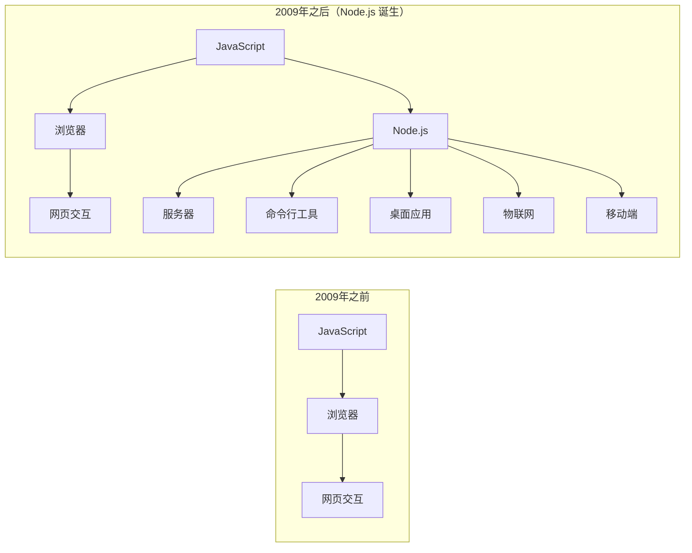

### 技术定义

Node.js 是一个基于 Chrome V8 JavaScript 引擎构建的 JavaScript 运行时环境。它使用事件驱动、非阻塞 I/O 模型，使其轻量且高效。

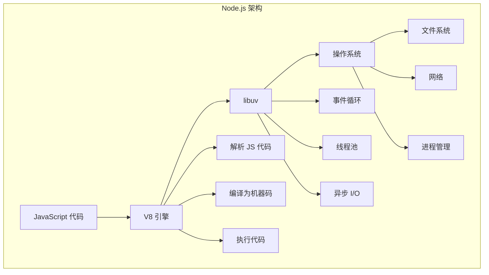

### Node.js 的组成

| 组件 | 作用 | 来源 |
|------|------|------|
| **V8 引擎** | 解析和执行 JavaScript 代码 | Google Chrome |
| **libuv** | 提供异步 I/O 和事件循环 | Node.js 自有 |
| **核心模块** | 提供文件系统、网络等基础功能 | Node.js 内置 |
| **c-ares** | 异步 DNS 解析 | 第三方库 |
| **http-parser** | 解析 HTTP 协议 | Node.js 自有 |
| **OpenSSL** | 提供加密功能 | 第三方库 |
| **zlib** | 提供压缩功能 | 第三方库 |

### Node.js 的历史

| 时间 | 事件 | 意义 |
|------|------|------|
| 2009年 | Ryan Dahl 创建 Node.js | JavaScript 首次进入服务端 |
| 2010年 | npm 包管理器诞生 | 改变了代码共享方式 |
| 2011年 | Node.js 0.6.x 发布 | 开始支持 Windows |
| 2014年 | io.js 分叉 | 推动了 Node.js 的现代化 |
| 2015年 | Node.js v4.0 发布 | io.js 合并，Node.js 基金会成立 |
| 2017年 | Node.js v8.0 发布 | 支持 async/await |
| 2018年 | Node.js v10.0 发布 | 支持 ES Modules 实验性功能 |
| 2020年 | Node.js v14.0 发布 | 稳定版，长期支持 |
| 2021年 | Node.js v16.0 发布 | 支持 npm v7 |
| 2022年 | Node.js v18.0 发布 | 内置 fetch API |
| 2023年 | Node.js v20.0 发布 | 稳定的权限模型 |
| 2024年 | Node.js v22.0 发布 | 支持 require ESM |

## 1.2 为什么用 Node.js？

### Node.js 的优势

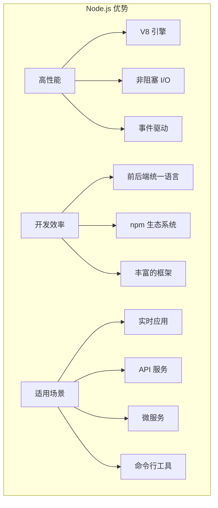

### 与其他语言的对比

| 特性 | Node.js | Python | Java | Go |
|------|---------|--------|------|-----|
| **语法难度** | 简单 | 简单 | 复杂 | 中等 |
| **并发模型** | 事件驱动 | 多线程/异步 | 多线程 | Goroutine |
| **I/O 性能** | 极高 | 中等 | 高 | 极高 |
| **CPU 密集** | 较弱 | 中等 | 强 | 强 |
| **生态系统** | 极其丰富 | 极其丰富 | 丰富 | 较丰富 |
| **学习曲线** | 平缓 | 平缓 | 陡峭 | 中等 |
| **启动速度** | 快 | 快 | 慢 | 快 |
| **内存占用** | 低 | 中等 | 高 | 低 |
| **适合场景** | I/O 密集 | 数据科学 | 企业应用 | 系统编程 |

### Node.js 适合的场景

**✅ 最适合的场景：**

1. **实时应用**：聊天应用、协作工具、在线游戏
2. **API 服务**：REST API、GraphQL API
3. **微服务**：轻量级服务、服务间通信
4. **流式处理**：音视频处理、实时数据流
5. **命令行工具**：开发工具、自动化脚本
6. **单页应用后端**：配合 React、Vue、Angular

**❌ 不太适合的场景：**

1. **CPU 密集型计算**：图像处理、科学计算、机器学习
2. **大型企业应用**：需要强类型和复杂架构的系统
3. **实时操作系统**：对延迟要求极高的系统

### AI-CLI-Mobile 为什么选择 Node.js？

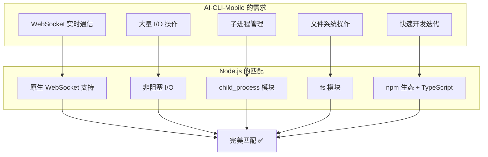

## 1.3 V8 引擎工作原理

### V8 引擎是什么？

V8 是 Google 开发的高性能 JavaScript 和 WebAssembly 引擎，最初为 Chrome 浏览器设计，后来被 Node.js 采用。

### V8 的编译流程

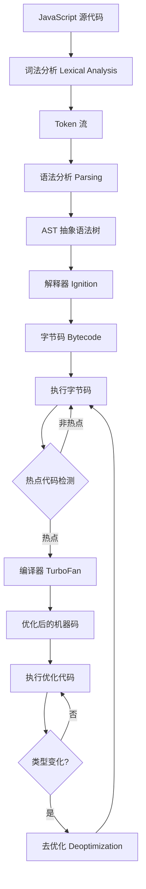

### 详细流程说明

#### 第一步：词法分析（Tokenization）

词法分析器将源代码分解成一个个有意义的单元——Token。

```javascript
// 源代码
const greeting = "Hello, World!";

// 词法分析后的 Token 流
[
  { type: 'Keyword', value: 'const' },
  { type: 'Identifier', value: 'greeting' },
  { type: 'Punctuator', value: '=' },
  { type: 'String', value: '"Hello, World!"' },
  { type: 'Punctuator', value: ';' }
]
```

#### 第二步：语法分析（Parsing）

语法分析器将 Token 流转换成抽象语法树（AST）。

```javascript
// AST 结构（简化版）
{
  type: 'Program',
  body: [{
    type: 'VariableDeclaration',
    declarations: [{
      type: 'VariableDeclarator',
      id: { type: 'Identifier', name: 'greeting' },
      init: { type: 'Literal', value: 'Hello, World!' }
    }],
    kind: 'const'
  }]
}
```

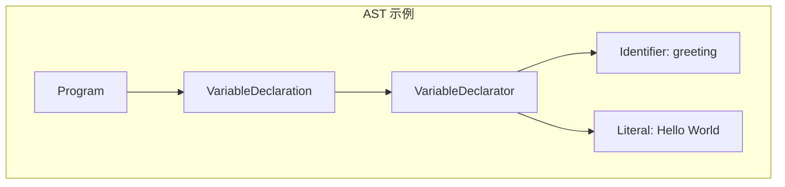

#### 第三步：解释器 Ignition

Ignition 将 AST 编译成字节码并执行。

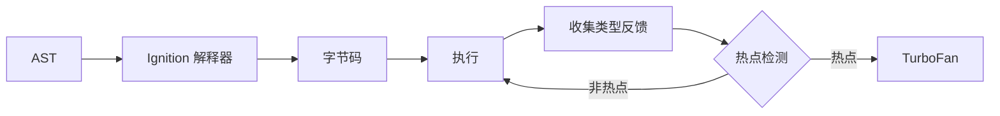

字节码示例：
```
LdaNamedProperty a0, [0], [0]  // 加载变量
Star r0                          // 存储到寄存器
LdaConstant [1]                  // 加载常量 "Hello, World!"
Star r1                          // 存储到寄存器
Ldar r0                          // 加载变量
SetNamedProperty r0, r1, [2]     // 设置属性
```

#### 第四步：编译器 TurboFan

当某段代码被频繁执行（热点代码），TurboFan 会将其编译成优化的机器码。


TurboFan 的优化技术：
- **内联缓存（Inline Caching）**：缓存属性访问结果
- **逃逸分析（Escape Analysis）**：确定对象是否逃出函数作用域
- **常量折叠（Constant Folding）**：编译时计算常量表达式
- **死代码消除（Dead Code Elimination）**：删除永远不会执行的代码
- **循环不变量外提（Loop-Invariant Code Motion）**：将循环中不变的计算移到循环外

### V8 的内存管理

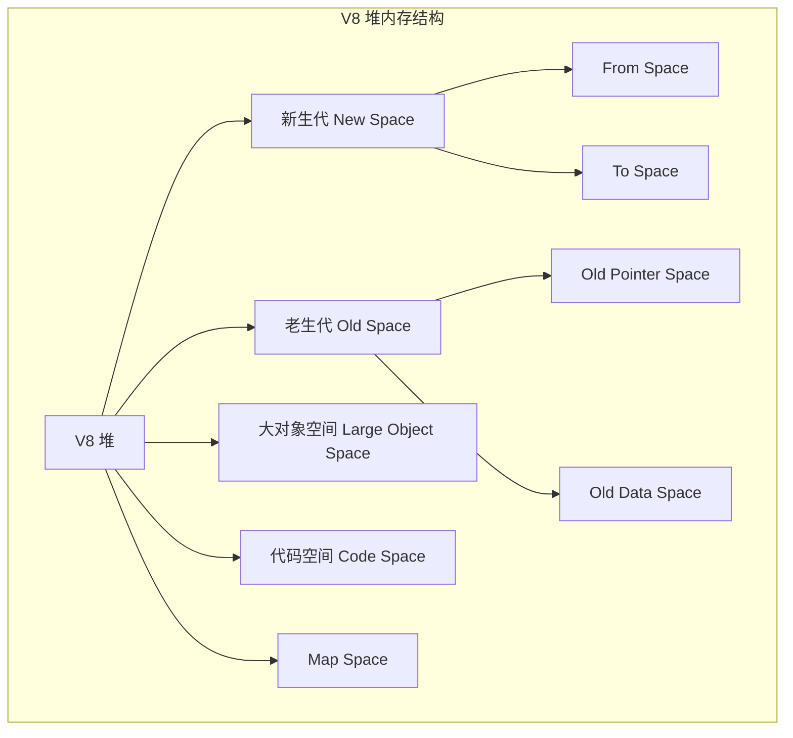

| 内存区域 | 大小 | 存储内容 | 回收算法 |
|---------|------|---------|---------|
| **新生代** | 1-8 MB | 新创建的对象 | Scavenge（复制） |
| **老生代** | 数百 MB - 1.5 GB | 存活较久的对象 | Mark-Sweep / Mark-Compact |
| **大对象空间** | 不限 | 超过其他空间限制的对象 | 直接回收 |
| **代码空间** | 不限 | JIT 编译的代码 | Mark-Sweep |
| **Map Space** | 不限 | 对象的隐藏类信息 | Mark-Sweep |

## 1.4 全局对象详解

### 什么是全局对象？

在浏览器中，全局对象是 `window`。在 Node.js 中，全局对象是 `global`。但 Node.js 还有很多其他常用的全局变量。

### 全局对象一览表

| 全局对象 | 类型 | 说明 |
|---------|------|------|
| `global` | Object | Node.js 的全局对象（相当于浏览器的 window） |
| `process` | Object | 进程相关信息和控制 |
| `Buffer` | Class | 二进制数据处理 |
| `__dirname` | String | 当前模块所在目录的绝对路径 |
| `__filename` | String | 当前模块文件的绝对路径 |
| `console` | Object | 控制台输出 |
| `setTimeout` | Function | 定时器 |
| `setInterval` | Function | 循环定时器 |
| `setImmediate` | Function | 立即执行（事件循环的 check 阶段） |
| `clearTimeout` | Function | 清除定时器 |
| `clearInterval` | Function | 清除循环定时器 |
| `clearImmediate` | Function | 清除立即执行 |
| `queueMicrotask` | Function | 将回调加入微任务队列 |
| `structuredClone` | Function | 深拷贝对象 |

### process 对象详解

`process` 是 Node.js 中最重要的全局对象之一，提供了当前进程的信息和控制能力。

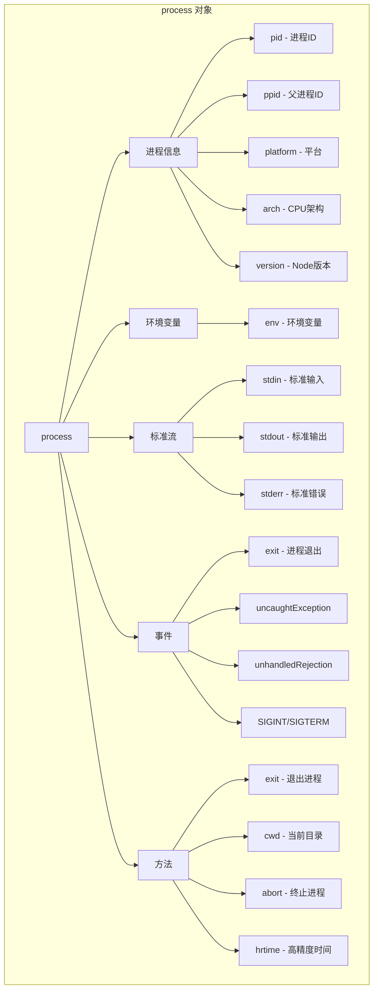

#### 常用 process 属性和方法

```javascript
// ========== 进程信息 ==========
console.log('进程 ID:', process.pid);            // 当前进程 ID
console.log('父进程 ID:', process.ppid);          // 父进程 ID
console.log('平台:', process.platform);            // 'linux', 'darwin', 'win32'
console.log('CPU 架构:', process.arch);            // 'x64', 'arm64'
console.log('Node 版本:', process.version);        // 'v22.22.2'
console.log('V8 版本:', process.versions.v8);      // V8 引擎版本
console.log('运行时间:', process.uptime());         // 进程运行秒数

// ========== 内存使用 ==========
const mem = process.memoryUsage();
console.log('RSS (总内存):', formatBytes(mem.rss));
console.log('堆已用:', formatBytes(mem.heapUsed));
console.log('堆总量:', formatBytes(mem.heapTotal));
console.log('外部内存:', formatBytes(mem.external));
console.log('ArrayBuffer:', formatBytes(mem.arrayBuffers));

function formatBytes(bytes) {
  return (bytes / 1024 / 1024).toFixed(2) + ' MB';
}

// ========== 环境变量 ==========
console.log('HOME:', process.env.HOME);           // 用户主目录
console.log('PATH:', process.env.PATH);            // 可执行文件路径
console.log('NODE_ENV:', process.env.NODE_ENV);    // 运行环境

// 设置环境变量
process.env.NODE_ENV = 'production';

// ========== 命令行参数 ==========
// node app.js --port 3000 --verbose
console.log('所有参数:', process.argv);
// [
//   '/usr/bin/node',     // Node.js 可执行文件路径
//   '/path/to/app.js',   // 脚本文件路径
//   '--port',            // 参数名
//   '3000',              // 参数值
//   '--verbose'          // 参数名
// ]

// ========== 当前工作目录 ==========
console.log('当前目录:', process.cwd());

// 切换目录
process.chdir('/tmp');
console.log('切换后:', process.cwd());

// ========== 标准流 ==========
// 标准输入
process.stdin.setEncoding('utf8');
process.stdin.on('data', (data) => {
  console.log('你输入了:', data.trim());
});

// 标准输出
process.stdout.write('Hello, World!\n');

// 标准错误
process.stderr.write('这是一条错误信息\n');

// ========== 退出进程 ==========
process.exit(0);   // 正常退出
process.exit(1);   // 异常退出

// ========== 高精度时间 ==========
const start = process.hrtime.bigint();
// ... 执行一些操作 ...
const end = process.hrtime.bigint();
console.log(`耗时: ${Number(end - start) / 1e6} 毫秒`);
```

#### process 事件详解

```javascript
// ========== 进程退出事件 ==========
process.on('exit', (code) => {
  console.log(`进程即将退出，退出码: ${code}`);
  // 注意：这里只能执行同步操作
});

// ========== 未捕获异常 ==========
process.on('uncaughtException', (err) => {
  console.error('未捕获的异常:', err);
  // 记录日志后退出
  process.exit(1);
});

// ========== 未处理的 Promise 拒绝 ==========
process.on('unhandledRejection', (reason, promise) => {
  console.error('未处理的 Promise 拒绝:', reason);
});

// ========== 信号事件 ==========
process.on('SIGINT', () => {
  console.log('收到 Ctrl+C 信号');
  // 优雅退出
  gracefulShutdown();
});

process.on('SIGTERM', () => {
  console.log('收到终止信号');
  // 优雅退出
  gracefulShutdown();
});

// ========== 警告事件 ==========
process.on('warning', (warning) => {
  console.warn('警告:', warning.name, warning.message);
});

function gracefulShutdown() {
  console.log('正在优雅关闭...');
  // 关闭服务器
  server.close(() => {
    console.log('服务器已关闭');
    // 关闭数据库连接
    db.end(() => {
      console.log('数据库连接已关闭');
      process.exit(0);
    });
  });
  
  // 超时强制退出
  setTimeout(() => {
    console.error('强制退出');
    process.exit(1);
  }, 10000);
}
```

### Buffer 对象

Buffer 用于处理二进制数据，将在第三章详细讲解。

```javascript
// 创建 Buffer
const buf1 = Buffer.from('Hello');                    // 从字符串创建
const buf2 = Buffer.from([72, 101, 108, 108, 111]);   // 从数组创建
const buf3 = Buffer.alloc(10);                         // 创建 10 字节的空 Buffer
const buf4 = Buffer.allocUnsafe(10);                   // 创建未初始化的 Buffer

console.log(buf1);          // <Buffer 48 65 6c 6c 6f>
console.log(buf1.toString()); // 'Hello'
```

### __dirname 和 __filename

```javascript
// __dirname: 当前文件所在目录的绝对路径
console.log(__dirname);   // '/home/user/project/src'

// __filename: 当前文件的绝对路径
console.log(__filename);  // '/home/user/project/src/app.js'

// 常见用法：拼接路径
const fs = require('fs');
const path = require('path');

// 读取同目录下的配置文件
const configPath = path.join(__dirname, 'config.json');
const config = JSON.parse(fs.readFileSync(configPath, 'utf8'));

// 注意：ESM 模块中没有 __dirname 和 __filename
// 需要自己构造：
import { fileURLToPath } from 'url';
import { dirname } from 'path';

const __filename = fileURLToPath(import.meta.url);
const __dirname = dirname(__filename);
```

## 1.5 核心模块概览

### Node.js 核心模块一览

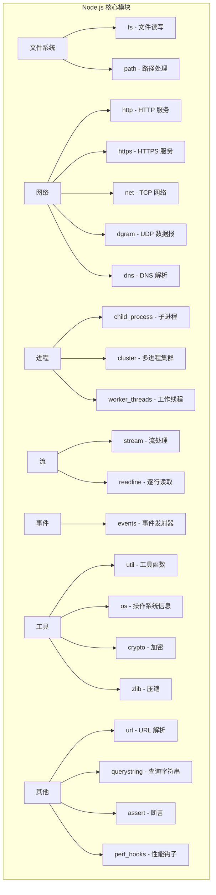

### 核心模块分类表

| 类别 | 模块 | 功能 | 常用程度 |
|------|------|------|---------|
| **文件系统** | `fs` | 文件读写、目录操作 | ⭐⭐⭐⭐⭐ |
| **文件系统** | `path` | 路径拼接、解析 | ⭐⭐⭐⭐⭐ |
| **网络** | `http` | 创建 HTTP 服务器 | ⭐⭐⭐⭐⭐ |
| **网络** | `https` | 创建 HTTPS 服务器 | ⭐⭐⭐⭐ |
| **网络** | `net` | TCP 网络通信 | ⭐⭐⭐ |
| **网络** | `dns` | DNS 解析 | ⭐⭐⭐ |
| **进程** | `child_process` | 创建子进程 | ⭐⭐⭐⭐⭐ |
| **进程** | `cluster` | 多进程集群 | ⭐⭐⭐⭐ |
| **进程** | `worker_threads` | 工作线程 | ⭐⭐⭐⭐ |
| **流** | `stream` | 流处理 | ⭐⭐⭐⭐⭐ |
| **流** | `readline` | 逐行读取 | ⭐⭐⭐ |
| **事件** | `events` | 事件发射器 | ⭐⭐⭐⭐⭐ |
| **工具** | `util` | 工具函数 | ⭐⭐⭐⭐ |
| **工具** | `os` | 操作系统信息 | ⭐⭐⭐ |
| **工具** | `crypto` | 加密解密 | ⭐⭐⭐⭐ |
| **工具** | `zlib` | 压缩解压 | ⭐⭐⭐ |

## 1.6 核心模块详解：fs

### fs 模块概述

`fs`（File System）模块提供了与文件系统交互的功能，是 Node.js 中最常用的模块之一。

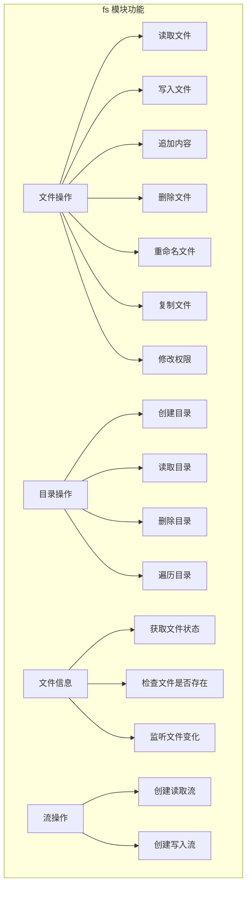

### 同步 vs 异步 API

Node.js 的 fs 模块提供了三种风格的 API：

```javascript
// ========== 1. 回调风格（Callback）==========
const fs = require('fs');

fs.readFile('/path/to/file.txt', 'utf8', (err, data) => {
  if (err) {
    console.error('读取失败:', err);
    return;
  }
  console.log('文件内容:', data);
});

// ========== 2. 同步风格（Sync）==========
try {
  const data = fs.readFileSync('/path/to/file.txt', 'utf8');
  console.log('文件内容:', data);
} catch (err) {
  console.error('读取失败:', err);
}

// ========== 3. Promise 风格（推荐）==========
const fsPromises = require('fs').promises;

async function readFile() {
  try {
    const data = await fsPromises.readFile('/path/to/file.txt', 'utf8');
    console.log('文件内容:', data);
  } catch (err) {
    console.error('读取失败:', err);
  }
}
```

### 三种风格对比

| 特性 | 回调风格 | 同步风格 | Promise 风格 |
|------|---------|---------|-------------|
| **函数名** | `fs.readFile()` | `fs.readFileSync()` | `fs.promises.readFile()` |
| **阻塞** | 不阻塞 | 阻塞 | 不阻塞 |
| **错误处理** | err 参数 | try/catch | try/catch |
| **代码风格** | 回调地狱 | 线性 | async/await |
| **适用场景** | 旧代码 | 启动时配置 | 新项目推荐 |
| **性能** | 好 | 差（阻塞主线程） | 好 |

### 常用文件操作

```javascript
const fs = require('fs').promises;
const path = require('path');

// ========== 读取文件 ==========
// 读取文本文件
const text = await fs.readFile('data.txt', 'utf8');

// 读取 JSON 文件
const config = JSON.parse(await fs.readFile('config.json', 'utf8'));

// 读取二进制文件
const imageBuffer = await fs.readFile('image.png');

// ========== 写入文件 ==========
// 写入文本文件（覆盖）
await fs.writeFile('output.txt', 'Hello, World!');

// 写入 JSON 文件
await fs.writeFile('config.json', JSON.stringify({ port: 3000 }, null, 2));

// 追加内容
await fs.appendFile('log.txt', `[${new Date().toISOString()}] New log entry\n`);

// ========== 文件操作 ==========
// 复制文件
await fs.copyFile('source.txt', 'destination.txt');

// 重命名/移动文件
await fs.rename('old-name.txt', 'new-name.txt');

// 删除文件
await fs.unlink('temp.txt');

// ========== 文件信息 ==========
// 获取文件状态
const stats = await fs.stat('data.txt');
console.log('文件大小:', stats.size, '字节');
console.log('创建时间:', stats.birthtime);
console.log('修改时间:', stats.mtime);
console.log('是文件:', stats.isFile());
console.log('是目录:', stats.isDirectory());

// 检查文件是否存在
async function fileExists(filePath) {
  try {
    await fs.access(filePath);
    return true;
  } catch {
    return false;
  }
}

// ========== 目录操作 ==========
// 创建目录（递归）
await fs.mkdir('path/to/nested/dir', { recursive: true });

// 读取目录内容
const files = await fs.readdir('.');
console.log('文件列表:', files);

// 读取目录内容（带文件类型）
const entries = await fs.readdir('.', { withFileTypes: true });
for (const entry of entries) {
  if (entry.isDirectory()) {
    console.log('📁', entry.name);
  } else {
    console.log('📄', entry.name);
  }
}

// 递归删除目录
await fs.rm('path/to/dir', { recursive: true, force: true });

// ========== 文件监听 ==========
const watcher = fs.watch('.', (eventType, filename) => {
  console.log(`事件: ${eventType}, 文件: ${filename}`);
});

// 停止监听
watcher.close();
```

### 递归遍历目录

```javascript
const fs = require('fs').promises;
const path = require('path');

// 方法一：递归函数
async function walkDir(dir, results = []) {
  const entries = await fs.readdir(dir, { withFileTypes: true });
  
  for (const entry of entries) {
    const fullPath = path.join(dir, entry.name);
    
    if (entry.isDirectory()) {
      await walkDir(fullPath, results);
    } else {
      results.push(fullPath);
    }
  }
  
  return results;
}

// 方法二：使用迭代器（Node.js 18+）
async function walkDirModern(dir) {
  const results = [];
  for await (const entry of fs.opendir(dir)) {
    const fullPath = path.join(dir, entry.name);
    if (entry.isDirectory()) {
      results.push(...await walkDirModern(fullPath));
    } else {
      results.push(fullPath);
    }
  }
  return results;
}

// 使用示例
const files = await walkDir('./src');
console.log('所有文件:', files);
```

## 1.7 核心模块详解：path

### path 模块概述

`path` 模块提供了处理文件和目录路径的工具函数。

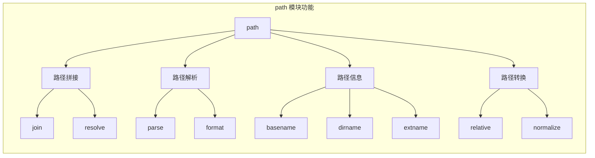

### 常用方法详解

```javascript
const path = require('path');

// ========== 路径拼接 ==========

// join - 智能拼接路径（推荐）
path.join('users', 'john', 'docs', 'file.txt')
// → 'users/john/docs/file.txt'

path.join('/home', 'user', '..', 'admin', 'file.txt')
// → '/home/admin/file.txt'

path.join('/home', './user/', '/file.txt')
// → '/home/user/file.txt'

// resolve - 生成绝对路径
path.resolve('file.txt')
// → '/home/user/project/file.txt'（相对于当前工作目录）

path.resolve('/home', 'user', 'file.txt')
// → '/home/user/file.txt'

path.resolve('/home', '/tmp', 'file.txt')
// → '/tmp/file.txt'（遇到绝对路径会重新开始）

// ========== 路径解析 ==========

// parse - 将路径拆分成对象
const parsed = path.parse('/home/user/docs/file.txt');
console.log(parsed);
// {
//   root: '/',
//   dir: '/home/user/docs',
//   base: 'file.txt',
//   ext: '.txt',
//   name: 'file'
// }

// format - 将对象组合成路径
const fullPath = path.format({
  dir: '/home/user/docs',
  name: 'file',
  ext: '.txt'
});
// → '/home/user/docs/file.txt'

// ========== 路径信息 ==========

// basename - 获取文件名
path.basename('/home/user/file.txt')          // 'file.txt'
path.basename('/home/user/file.txt', '.txt')   // 'file'

// dirname - 获取目录路径
path.dirname('/home/user/file.txt')            // '/home/user'

// extname - 获取扩展名
path.extname('file.txt')                       // '.txt'
path.extname('file.tar.gz')                    // '.gz'
path.extname('file')                           // ''
path.extname('.gitignore')                     // ''

// ========== 路径转换 ==========

// relative - 计算相对路径
path.relative('/home/user/docs', '/home/user/images')
// → '../images'

path.relative('/home/user', '/tmp/file.txt')
// → '../../tmp/file.txt'

// normalize - 规范化路径
path.normalize('/home/user/../admin/./file.txt')
// → '/home/admin/file.txt'

// ========== 跨平台注意事项 ==========

// path.sep - 路径分隔符
console.log(path.sep);        // '/' (Linux/Mac) 或 '\\' (Windows)

// path.delimiter - 环境变量分隔符
console.log(path.delimiter);  // ':' (Linux/Mac) 或 ';' (Windows)

// path.posix - 始终使用 POSIX 风格（/）
path.posix.join('a', 'b')    // 'a/b'

// path.win32 - 始终使用 Windows 风格（\\）
path.win32.join('a', 'b')    // 'a\\b'
```

### join vs resolve 对比

| 特性 | `path.join()` | `path.resolve()` |
|------|--------------|------------------|
| **作用** | 拼接路径片段 | 生成绝对路径 |
| **基准** | 纯粹拼接 | 从右到左直到生成绝对路径 |
| **遇到绝对路径** | 不特殊处理 | 重新开始解析 |
| **当前目录** | 不考虑 | 最终相对于 cwd |
| **常用场景** | 拼接相对路径 | 需要绝对路径时 |

```javascript
// 对比示例
path.join('a', 'b', 'c')         // 'a/b/c'
path.resolve('a', 'b', 'c')      // '/home/user/project/a/b/c'

path.join('/a', '/b', 'c')       // '/a/b/c'
path.resolve('/a', '/b', 'c')    // '/b/c'

path.join('a', '../b', 'c')      // 'b/c'
path.resolve('a', '../b', 'c')   // '/home/user/b/c'
```

## 1.8 核心模块详解：child_process

`child_process` 模块用于创建子进程，将在第五章详细讲解。这里先做简单介绍。

```javascript
const { exec, spawn, execFile, fork } = require('child_process');

// exec - 执行命令（缓冲输出）
exec('ls -la', (err, stdout, stderr) => {
  if (err) throw err;
  console.log(stdout);
});

// spawn - 创建子进程（流式输出）
const child = spawn('ping', ['-c', '4', 'google.com']);
child.stdout.on('data', (data) => console.log(data.toString()));
child.stderr.on('data', (data) => console.error(data.toString()));

// fork - 创建 Node.js 子进程
const worker = fork('./worker.js');
worker.send({ task: 'compute', data: [1, 2, 3] });
worker.on('message', (msg) => console.log('结果:', msg));
```

## 1.9 核心模块详解：events

### EventEmitter 概述

`events` 模块是 Node.js 事件驱动架构的核心。几乎所有核心模块都继承自 EventEmitter。

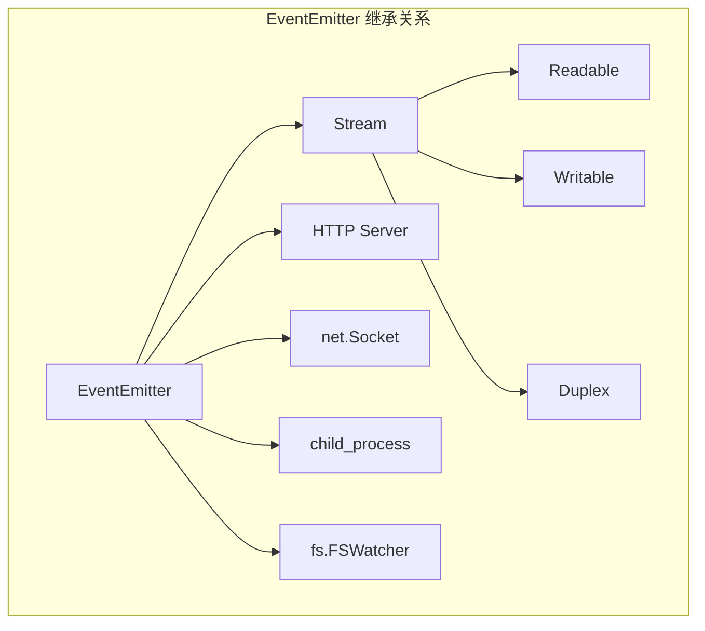

### EventEmitter 使用

```javascript
const EventEmitter = require('events');

// 创建事件发射器
class SessionManager extends EventEmitter {
  constructor() {
    super();
    this.sessions = new Map();
  }

  createSession(id) {
    this.sessions.set(id, { id, createdAt: Date.now() });
    this.emit('sessionCreated', id);  // 触发事件
  }

  destroySession(id) {
    this.sessions.delete(id);
    this.emit('sessionDestroyed', id);  // 触发事件
  }
}

// 使用
const manager = new SessionManager();

// 监听事件
manager.on('sessionCreated', (id) => {
  console.log(`会话 ${id} 已创建`);
});

// 一次性监听
manager.once('sessionCreated', (id) => {
  console.log(`第一个会话 ${id} 已创建`);
});

// 带错误处理
manager.on('error', (err) => {
  console.error('错误:', err);
});

// 创建会话
manager.createSession('abc123');
```

### EventEmitter API 速查

| 方法 | 说明 | 返回值 |
|------|------|--------|
| `on(event, listener)` | 添加监听器 | EventEmitter |
| `once(event, listener)` | 添加一次性监听器 | EventEmitter |
| `emit(event, ...args)` | 触发事件 | boolean |
| `off(event, listener)` | 移除监听器 | EventEmitter |
| `removeAllListeners(event)` | 移除所有监听器 | EventEmitter |
| `listenerCount(event)` | 获取监听器数量 | number |
| `listeners(event)` | 获取监听器数组 | Function[] |
| `prependListener(event, listener)` | 在最前面添加监听器 | EventEmitter |
| `setMaxListeners(n)` | 设置最大监听器数量 | EventEmitter |

### 错误事件模式

```javascript
// EventEmitter 的最佳实践：始终监听 'error' 事件
const emitter = new EventEmitter();

// ❌ 错误做法：不监听 error 事件
// 如果 emit('error') 被调用，进程会崩溃
emitter.emit('error', new Error('something went wrong'));
// → 抛出未捕获异常，进程退出

// ✅ 正确做法：监听 error 事件
emitter.on('error', (err) => {
  console.error('发生错误:', err.message);
});

// ✅ 更好的做法：使用 once 避免重复处理
emitter.once('error', (err) => {
  console.error('发生错误:', err.message);
  // 可能需要清理资源
});
```

## 1.10 核心模块详解：stream

Stream 是 Node.js 处理流式数据的核心模块，将在第四章详细讲解。

```javascript
const fs = require('fs');

// 创建可读流
const readStream = fs.createReadStream('large-file.txt', {
  encoding: 'utf8',
  highWaterMark: 1024 * 64  // 64KB 缓冲区
});

// 创建可写流
const writeStream = fs.createWriteStream('output.txt');

// 使用 pipe 连接
readStream.pipe(writeStream);

// 监听事件
readStream.on('data', (chunk) => {
  console.log(`收到 ${chunk.length} 字节`);
});

readStream.on('end', () => {
  console.log('读取完成');
});

readStream.on('error', (err) => {
  console.error('读取错误:', err);
});
```

## 1.11 核心模块详解：http

### 创建 HTTP 服务器

```javascript
const http = require('http');

// 创建简单的 HTTP 服务器
const server = http.createServer((req, res) => {
  console.log(`${req.method} ${req.url}`);
  
  // 设置响应头
  res.writeHead(200, {
    'Content-Type': 'application/json',
    'X-Powered-By': 'Node.js'
  });
  
  // 发送响应
  res.end(JSON.stringify({
    message: 'Hello, World!',
    timestamp: new Date().toISOString()
  }));
});

// 监听端口
server.listen(3000, () => {
  console.log('服务器运行在 http://localhost:3000');
});
```

### HTTP 请求解析

```javascript
const http = require('http');
const { URL } = require('url');

const server = http.createServer((req, res) => {
  // 解析 URL
  const url = new URL(req.url, `http://${req.headers.host}`);
  
  console.log('路径:', url.pathname);
  console.log('查询参数:', Object.fromEntries(url.searchParams));
  console.log('方法:', req.method);
  console.log('头部:', req.headers);
  
  // 路由处理
  if (url.pathname === '/api/users' && req.method === 'GET') {
    // 处理 GET 请求
    res.writeHead(200, { 'Content-Type': 'application/json' });
    res.end(JSON.stringify({ users: [] }));
  } else if (url.pathname === '/api/users' && req.method === 'POST') {
    // 处理 POST 请求（读取请求体）
    let body = '';
    req.on('data', (chunk) => body += chunk);
    req.on('end', () => {
      const user = JSON.parse(body);
      res.writeHead(201, { 'Content-Type': 'application/json' });
      res.end(JSON.stringify({ created: user }));
    });
  } else {
    res.writeHead(404);
    res.end('Not Found');
  }
});

server.listen(3000);
```

---

# 第二章：事件循环深入

## 2.1 什么是事件循环？

### 通俗理解

想象你在一家餐厅当服务员。你不可能同时给所有客人服务——你需要一个"循环"：

1. 看看有没有新客人进来（检查新事件）
2. 接受客人的点单（处理 I/O 回调）
3. 把点单交给厨房（执行定时器回调）
4. 把做好的菜端给客人（执行 setImmediate 回调）
5. 回到第 1 步

这就是事件循环的基本思想：**不断地检查有没有需要处理的事件，有就处理，没有就等待。**

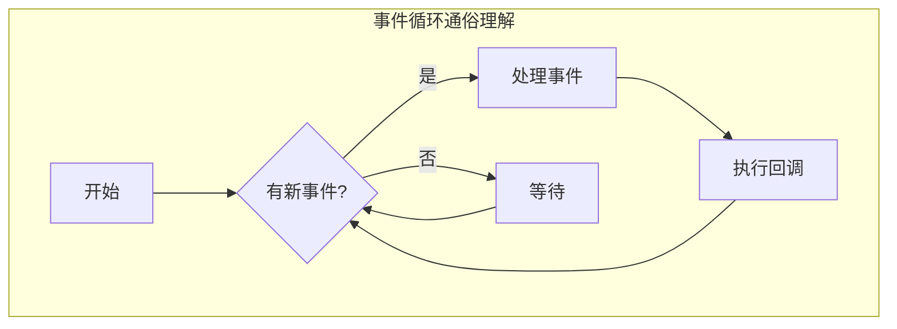

### 技术定义

事件循环是 Node.js 处理异步操作的核心机制。它允许 Node.js 使用单线程来处理大量并发操作，而不会阻塞。

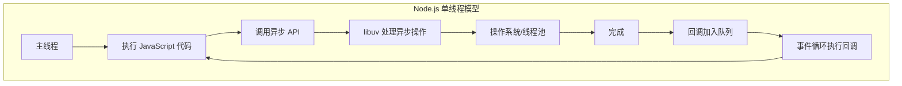

### 为什么需要事件循环？

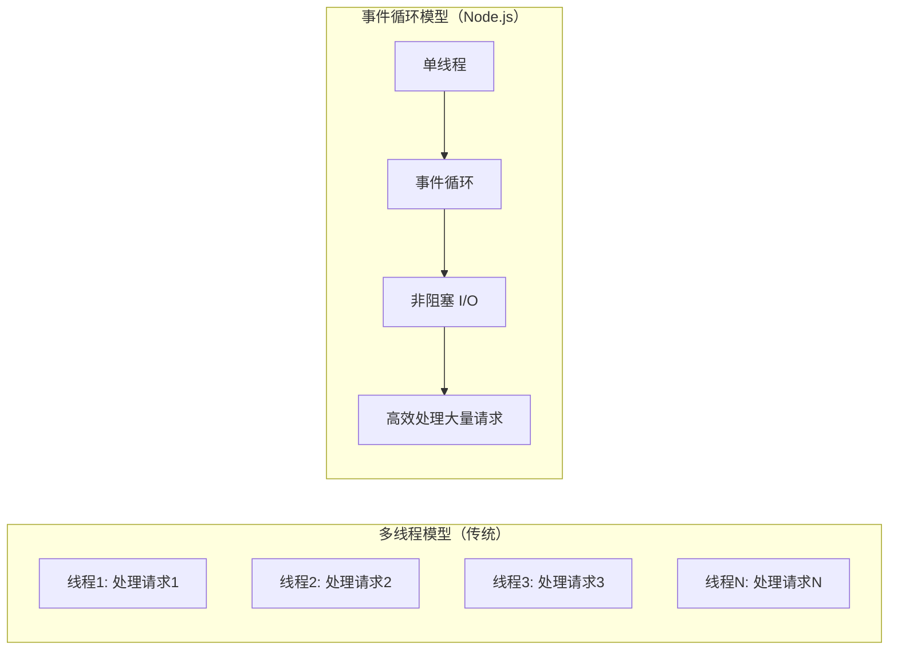

| 特性 | 多线程模型 | 事件循环模型 |
|------|-----------|-------------|
| **线程数** | 每个请求一个线程 | 单线程 |
| **内存占用** | 高（每线程约 1MB 栈空间） | 低 |
| **上下文切换** | 频繁 | 几乎没有 |
| **并发能力** | 受线程数限制 | 轻松处理数万并发 |
| **复杂度** | 需要处理锁和同步 | 简单（无需锁） |
| **适用场景** | CPU 密集型 | I/O 密集型 |

## 2.2 事件循环的 6 个阶段

### 事件循环的阶段

Node.js 的事件循环（由 libuv 实现）分为 6 个主要阶段，每个阶段都有一个要执行的回调队列：

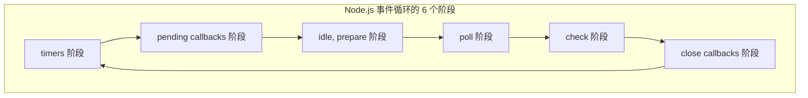

### 各阶段详解

#### 阶段 1：timers（定时器阶段）

**执行 `setTimeout()` 和 `setInterval()` 的回调。**

```javascript
// 定时器阶段执行的回调
setTimeout(() => {
  console.log('setTimeout 回调');
}, 1000);

setInterval(() => {
  console.log('setInterval 回调');
}, 2000);
```

> ⚠️ 注意：`setTimeout` 的延迟时间不是精确的。它表示"至少等待这么长时间"，实际执行时间可能更长。

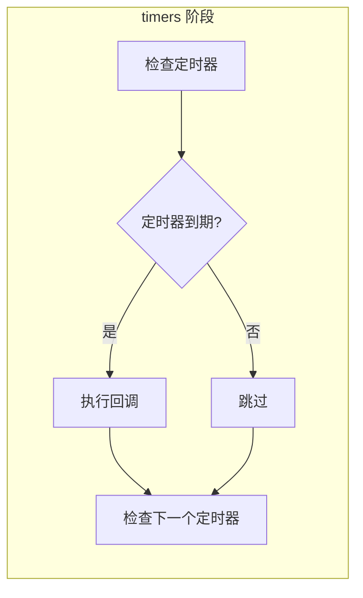

#### 阶段 2：pending callbacks（待定回调阶段）

**执行一些被推迟到下一个循环迭代的 I/O 回调。**

这是处理一些系统操作回调的阶段，比如 TCP 错误。例如，如果 TCP socket 在尝试连接时收到 `ECONNREFUSED`，某些系统会等待报告错误，这个回调就会在这个阶段执行。

```javascript
const net = require('net');

// TCP 连接错误的回调会在 pending callbacks 阶段执行
const socket = net.createConnection({ port: 9999 });
socket.on('error', (err) => {
  console.log('连接错误:', err.message);  // 这个回调在 pending callbacks 阶段执行
});
```

#### 阶段 3：idle, prepare（空闲/准备阶段）

**仅在内部使用。** Node.js 内部使用这个阶段来执行一些准备工作。

#### 阶段 4：poll（轮询阶段）

**这是事件循环中最关键的阶段，执行 I/O 回调。**

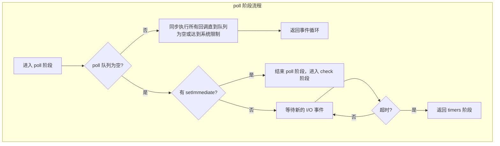

poll 阶段的行为：
1. 如果 poll 队列不为空，同步遍历并执行队列中的回调，直到队列为空或达到系统限制
2. 如果 poll 队列为空：
   - 如果有 `setImmediate()` 回调等待执行，结束 poll 阶段，进入 check 阶段
   - 如果没有 `setImmediate()`，就等待新的 I/O 事件到达（会阻塞在这里）

#### 阶段 5：check（检查阶段）

**执行 `setImmediate()` 的回调。**

```javascript
// check 阶段执行的回调
setImmediate(() => {
  console.log('setImmediate 回调');
});
```

#### 阶段 6：close callbacks（关闭回调阶段）

**执行关闭事件的回调。**

```javascript
const server = require('http').createServer();

server.on('close', () => {
  console.log('服务器关闭');  // 这个回调在 close callbacks 阶段执行
});

server.close();
```

### 阶段对比表

| 阶段 | 执行的回调 | 典型 API | 优先级 |
|------|-----------|---------|--------|
| **timers** | 定时器回调 | `setTimeout`, `setInterval` | 中 |
| **pending callbacks** | 系统级回调 | TCP 错误等 | 低 |
| **idle, prepare** | 内部使用 | - | - |
| **poll** | I/O 回调 | `fs.readFile`, `net.on('data')` | 中 |
| **check** | setImmediate 回调 | `setImmediate` | 中 |
| **close callbacks** | 关闭事件回调 | `socket.on('close')` | 低 |

## 2.3 事件循环的完整流程图

```mermaid
graph TB
    Start[开始] --> Timers[timers 阶段]
    Timers --> Pending[pending callbacks 阶段]
    Pending --> Idle[idle, prepare 阶段]
    Idle --> Poll[poll 阶段]
    Poll --> Check[check 阶段]
    Check --> Close[close callbacks 阶段]
    Close --> Microtask{微任务队列?}
    Microtask -->|有| MicrotaskExec[执行所有微任务]
    MicrotaskExec --> NextTick{nextTick 队列?}
    NextTick -->|有| NextTickExec[执行所有 nextTick 回调]
    NextTickExec --> Timers
    NextTick -->|否| Timers
    Microtask -->|否| NextTick
    
    subgraph "微任务在每个阶段之间执行"
        direction LR
        M1[阶段完成] --> M2[清空微任务队列] --> M3[清空 nextTick 队列] --> M4[进入下一阶段]
    end
```

### 事件循环的一次完整迭代

```javascript
const fs = require('fs');

// 1. timers 阶段
setTimeout(() => console.log('1: setTimeout'), 0);

// 2. poll 阶段（I/O 回调）
fs.readFile(__filename, () => {
  console.log('2: readFile 回调');
  
  // 在 I/O 回调内部设置的回调
  setTimeout(() => console.log('3: setTimeout in I/O'), 0);
  setImmediate(() => console.log('4: setImmediate in I/O'));
});

// 5. check 阶段
setImmediate(() => console.log('5: setImmediate'));

// 6. 微任务
Promise.resolve().then(() => console.log('6: Promise'));
process.nextTick(() => console.log('7: nextTick'));

console.log('8: 同步代码');

// 输出顺序：
// 8: 同步代码（最先执行）
// 7: nextTick（微任务，在当前阶段后立即执行）
// 6: Promise（微任务）
// 1: setTimeout（timers 阶段）
// 5: setImmediate（check 阶段）
// 2: readFile 回调（poll 阶段，取决于文件读取速度）
// 3: setTimeout in I/O（下一轮 timers）
// 4: setImmediate in I/O（下一轮 check）
```

## 2.4 process.nextTick 详解

### 什么是 process.nextTick？

`process.nextTick()` 不是事件循环的一部分。它的回调会在当前操作完成后、事件循环继续之前执行。

```mermaid
graph TB
    subgraph "nextTick 的位置"
        A[当前操作完成] --> B[执行 nextTick 回调]
        B --> C[执行 Promise 回调]
        C --> D[继续事件循环]
    end
```

### nextTick 的执行时机

```javascript
console.log('开始');

setTimeout(() => console.log('setTimeout'), 0);
setImmediate(() => console.log('setImmediate'));
process.nextTick(() => console.log('nextTick'));
Promise.resolve().then(() => console.log('Promise'));

console.log('结束');

// 输出：
// 开始
// 结束
// nextTick        ← 最先执行
// Promise         ← 其次
// setTimeout      ← 然后
// setImmediate    ← 最后
```

### nextTick 的递归问题

```javascript
// ⚠️ 危险：nextTick 递归会导致事件循环永远无法进入下一阶段
function recursiveNextTick() {
  process.nextTick(recursiveNextTick);
}

// 这会导致：
// 1. I/O 回调永远无法执行
// 2. 定时器永远无法触发
// 3. setImmediate 永远无法执行
// 4. 程序看起来"卡住"了

// ✅ 正确做法：使用 setImmediate 替代递归 nextTick
function recursiveSetImmediate() {
  setImmediate(recursiveSetImmediate);
}
```

### nextTick 的使用场景

```javascript
// 场景 1：确保回调在当前操作完成后执行
class MyEmitter extends EventEmitter {
  constructor() {
    super();
    // 使用 nextTick 确保事件在构造函数完成后触发
    process.nextTick(() => {
      this.emit('ready');
    });
  }
}

const emitter = new MyEmitter();
emitter.on('ready', () => console.log('准备就绪'));

// 场景 2：允许用户设置错误处理
const stream = new MyStream();
process.nextTick(() => {
  stream.emit('data', chunk);
});

// 场景 3：清理工作
function cleanup() {
  process.nextTick(() => {
    // 在当前同步代码执行完毕后清理
    delete global.tempData;
  });
}
```

## 2.5 setImmediate 详解

### 什么是 setImmediate？

`setImmediate()` 用于在当前 poll 阶段完成后立即执行回调。

```javascript
// setImmediate 的回调在 check 阶段执行
setImmediate(() => {
  console.log('setImmediate 回调');
});
```

### setImmediate vs setTimeout(fn, 0)

```javascript
// 这两者的执行顺序是不确定的
setTimeout(() => console.log('setTimeout'), 0);
setImmediate(() => console.log('setImmediate'));

// 可能的输出 1：
// setTimeout
// setImmediate

// 可能的输出 2：
// setImmediate
// setTimeout
```

**但是**，在 I/O 回调内部，`setImmediate` 总是先于 `setTimeout` 执行：

```javascript
const fs = require('fs');

fs.readFile(__filename, () => {
  setTimeout(() => console.log('setTimeout'), 0);
  setImmediate(() => console.log('setImmediate'));
});

// 总是输出：
// setImmediate
// setTimeout
```

原因：在 I/O 回调内部，事件循环处于 poll 阶段。当 poll 阶段结束后，下一个阶段是 check 阶段，所以 `setImmediate` 总是先执行。

## 2.6 nextTick vs setImmediate 对比

| 特性 | `process.nextTick()` | `setImmediate()` |
|------|---------------------|------------------|
| **执行时机** | 当前阶段之后、下一阶段之前 | check 阶段 |
| **优先级** | 高于 Promise | 普通 |
| **是否会阻塞事件循环** | 递归调用会阻塞 | 不会阻塞 |
| **命名由来** | 在"下一个 tick"执行 | 立即执行（实际是在 check 阶段） |
| **推荐用法** | 确保在当前操作后立即执行 | 在 I/O 操作后执行 |
| **递归安全性** | 不安全 | 安全 |

```mermaid
graph TB
    subgraph "执行顺序"
        A[当前代码] --> B[nextTick 队列]
        B --> C[Promise 微任务队列]
        C --> D[事件循环继续]
        D --> E[timers]
        E --> F[pending callbacks]
        F --> G[poll]
        G --> H[setImmediate / check]
    end
```

## 2.7 定时器精度问题

### setTimeout 不是精确的

```javascript
const start = Date.now();

setTimeout(() => {
  console.log(`期望: 100ms, 实际: ${Date.now() - start}ms`);
}, 100);

// 输出可能是：期望: 100ms, 实际: 103ms
// 实际延迟通常会比设定值稍长
```

### 定时器精度受影响的因素

```mermaid
graph TB
    subgraph "影响定时器精度的因素"
        A[定时器精度] --> B[事件循环阻塞]
        A --> C[系统负载]
        A --> D[定时器嵌套]
        A --> E[最小延迟限制]
        
        B --> B1[同步代码执行时间过长]
        B --> B2[大量同步回调]
        
        C --> C1[CPU 占用高]
        C --> C2[内存不足]
        
        D --> D1[嵌套定时器最小延迟 1ms]
        
        E --> E1[Node.js 内部最小延迟 1ms]
    end
```

### 高精度定时方案

```javascript
// 方案 1：使用 process.hrtime 进行补偿
function preciseInterval(callback, interval) {
  let expected = Date.now() + interval;
  
  function step() {
    const drift = Date.now() - expected;
    callback();
    expected += interval;
    setTimeout(step, Math.max(0, interval - drift));
  }
  
  setTimeout(step, interval);
}

// 方案 2：使用 setImmediate 进行忙等待（精度最高，但 CPU 占用高）
function highPrecisionTimer(callback, targetTime) {
  function check() {
    if (Date.now() >= targetTime) {
      callback();
    } else {
      setImmediate(check);
    }
  }
  setImmediate(check);
}
```

## 2.8 事件循环在项目中的实际体现

### SessionManager 的事件处理

在 AI-CLI-Mobile 项目中，SessionManager 使用事件驱动模式管理终端会话：

```javascript
// 项目中的 SessionManager 事件处理示例
const EventEmitter = require('events');

class SessionManager extends EventEmitter {
  constructor() {
    super();
    this.sessions = new Map();
    
    // 使用事件循环的特性来处理会话超时
    this.checkInterval = setInterval(() => {
      this.checkExpiredSessions();
    }, 30000);  // 每 30 秒检查一次
  }

  createSession(userId, options = {}) {
    const sessionId = this.generateId();
    const session = {
      id: sessionId,
      userId,
      createdAt: Date.now(),
      lastActivity: Date.now(),
      timeout: options.timeout || 3600000,  // 默认 1 小时
    };
    
    this.sessions.set(sessionId, session);
    
    // 使用 nextTick 确保在当前操作完成后触发事件
    process.nextTick(() => {
      this.emit('sessionCreated', session);
    });
    
    return sessionId;
  }

  touchSession(sessionId) {
    const session = this.sessions.get(sessionId);
    if (session) {
      session.lastActivity = Date.now();
    }
  }

  destroySession(sessionId) {
    const session = this.sessions.get(sessionId);
    if (session) {
      this.sessions.delete(sessionId);
      // 使用 setImmediate 在 I/O 操作后触发销毁事件
      setImmediate(() => {
        this.emit('sessionDestroyed', session);
      });
    }
  }

  checkExpiredSessions() {
    const now = Date.now();
    for (const [id, session] of this.sessions) {
      if (now - session.lastActivity > session.timeout) {
        this.emit('sessionExpired', session);
        this.destroySession(id);
      }
    }
  }

  shutdown() {
    clearInterval(this.checkInterval);
    // 使用 nextTick 确保在当前同步操作完成后关闭
    process.nextTick(() => {
      for (const [id] of this.sessions) {
        this.destroySession(id);
      }
      this.emit('shutdown');
    });
  }
}
```

### WebSocket 消息处理

```javascript
// WebSocket 服务器中的事件循环体现
const WebSocket = require('ws');

class WebSocketServer {
  constructor(port) {
    this.wss = new WebSocket.Server({ port });
    this.messageQueue = [];
    
    this.wss.on('connection', (ws) => {
      console.log('新连接');
      
      // 使用事件循环处理消息
      ws.on('message', (data) => {
        // I/O 回调在 poll 阶段执行
        const message = JSON.parse(data);
        
        // 使用 nextTick 确保消息按顺序处理
        process.nextTick(() => {
          this.handleMessage(ws, message);
        });
      });
      
      ws.on('close', () => {
        // close 事件在 close callbacks 阶段执行
        console.log('连接关闭');
      });
    });
  }
  
  handleMessage(ws, message) {
    // 处理消息
    const response = this.processMessage(message);
    
    // 使用 setImmediate 避免阻塞当前操作
    setImmediate(() => {
      ws.send(JSON.stringify(response));
    });
  }
}
```

## 2.9 事件循环阻塞与解决方案

### 什么是事件循环阻塞？

```javascript
// ❌ 阻塞事件循环的代码
function blockingOperation() {
  const start = Date.now();
  while (Date.now() - start < 5000) {
    // 忙等待 5 秒
  }
  return '完成';
}

// 这会导致：
// 1. 所有定时器延迟执行
// 2. 所有 I/O 回调延迟执行
// 3. 所有 WebSocket 消息延迟处理
// 4. 用户体验极差
```

### 检测事件循环阻塞

```javascript
// 方法 1：监控事件循环延迟
class EventLoopMonitor {
  constructor() {
    this.lastCheck = process.hrtime.bigint();
    this.threshold = 100;  // 100ms 阈值
  }

  start() {
    const check = () => {
      const now = process.hrtime.bigint();
      const delay = Number(now - this.lastCheck) / 1e6;
      
      if (delay > this.threshold) {
        console.warn(`事件循环延迟: ${delay.toFixed(2)}ms`);
      }
      
      this.lastCheck = now;
      setTimeout(check, 50);
    };
    
    setTimeout(check, 50);
  }
}

// 方法 2：使用 perf_hooks
const { monitorEventLoopDelay } = require('perf_hooks');

const histogram = monitorEventLoopDelay({ resolution: 20 });
histogram.enable();

// 每 5 秒输出一次
setInterval(() => {
  console.log(`事件循环延迟:
    最小: ${histogram.min / 1e6}ms
    最大: ${histogram.max / 1e6}ms
    平均: ${histogram.mean / 1e6}ms
    P50: ${histogram.percentile(50) / 1e6}ms
    P99: ${histogram.percentile(99) / 1e6}ms
  `);
  histogram.reset();
}, 5000);
```

### 解决方案

```javascript
// 方案 1：使用 Worker Threads
const { Worker } = require('worker_threads');

function runInWorker(data) {
  return new Promise((resolve, reject) => {
    const worker = new Worker('./heavy-computation.js', {
      workerData: data
    });
    worker.on('message', resolve);
    worker.on('error', reject);
  });
}

// 方案 2：将任务分解为小块
async function processLargeArray(array) {
  const CHUNK_SIZE = 1000;
  
  for (let i = 0; i < array.length; i += CHUNK_SIZE) {
    const chunk = array.slice(i, i + CHUNK_SIZE);
    
    // 处理一块
    processChunk(chunk);
    
    // 让出事件循环
    await new Promise(resolve => setImmediate(resolve));
  }
}

// 方案 3：使用 setImmediate 分割任务
function processInChunks(items, processItem, callback) {
  let index = 0;
  
  function next() {
    if (index >= items.length) {
      callback();
      return;
    }
    
    // 处理一批项目
    const end = Math.min(index + 100, items.length);
    for (; index < end; index++) {
      processItem(items[index]);
    }
    
    // 让出事件循环
    setImmediate(next);
  }
  
  next();
}
```

## 2.10 事件循环调试技巧

### 使用 --trace-events-enabled

```bash
# 启用事件循环追踪
node --trace-events-enabled --trace-event-categories node,node.async_hooks app.js
```

### 使用 async_hooks 追踪异步操作

```javascript
const async_hooks = require('async_hooks');
const fs = require('fs');

// 创建异步操作追踪器
const hook = async_hooks.createHook({
  init(asyncId, type, triggerAsyncId) {
    fs.writeSync(
      1,
      `init: asyncId=${asyncId}, type=${type}, trigger=${triggerAsyncId}\n`
    );
  },
  before(asyncId) {
    fs.writeSync(1, `before: asyncId=${asyncId}\n`);
  },
  after(asyncId) {
    fs.writeSync(1, `after: asyncId=${asyncId}\n`);
  },
  destroy(asyncId) {
    fs.writeSync(1, `destroy: asyncId=${asyncId}\n`);
  }
});

hook.enable();

// 测试
setTimeout(() => {
  console.log('定时器执行');
}, 100);
```

### 事件循环可视化

```mermaid
sequenceDiagram
    participant Main as 主线程
    participant EL as 事件循环
    participant IO as I/O 系统
    participant Timer as 定时器系统
    
    Main->>Main: 执行同步代码
    Main->>Timer: 设置 setTimeout
    Main->>IO: 发起 fs.readFile
    Main->>EL: 进入事件循环
    
    EL->>EL: timers 阶段
    Timer-->>EL: 定时器到期
    EL->>Main: 执行 setTimeout 回调
    Main-->>EL: 回调完成
    
    EL->>EL: poll 阶段
    IO-->>EL: 文件读取完成
    EL->>Main: 执行 readFile 回调
    Main-->>EL: 回调完成
    
    EL->>EL: check 阶段
    EL->>EL: close callbacks 阶段
    EL->>EL: 下一轮循环
```

---

# 第三章：Buffer 与二进制数据

## 3.1 什么是 Buffer？

### 通俗理解

Buffer 就像是一个"字节数组"，用来存储二进制数据。想象你有一个固定大小的盒子，每个格子可以放一个字节（0-255 的数字）。

```mermaid
graph LR
    subgraph "Buffer 示意图"
        A["Buffer: [72, 101, 108, 108, 111]"]
        A --> B["H"]
        A --> C["e"]
        A --> D["l"]
        A --> E["l"]
        A --> F["o"]
    end
```

### 为什么需要 Buffer？

在 Node.js 中，JavaScript 原本不支持二进制数据。但网络通信、文件操作等都需要处理二进制数据，所以 Node.js 引入了 Buffer 类。

```mermaid
graph TB
    subgraph "Buffer 的使用场景"
        A[Buffer] --> B[文件读写]
        A --> C[网络通信]
        A --> D[加密解密]
        A --> E[图片处理]
        A --> F[协议解析]
        
        B --> B1[读取二进制文件]
        B --> B2[写入二进制文件]
        
        C --> C1[HTTP 请求体]
        C --> C2[WebSocket 帧]
        C --> C3[TCP 数据包]
        
        D --> D1[哈希计算]
        D --> D2[加解密操作]
    end
```

### Buffer 与字符串的关系

```javascript
// 字符串 → Buffer
const buf = Buffer.from('Hello, World!', 'utf8');
console.log(buf);          // <Buffer 48 65 6c 6c 6f 2c 20 57 6f 72 6c 64 21>
console.log(buf.length);   // 13（字节数）

// Buffer → 字符串
const str = buf.toString('utf8');
console.log(str);          // 'Hello, World!'

// 中文字符占用多个字节
const cnBuf = Buffer.from('你好', 'utf8');
console.log(cnBuf);        // <Buffer e4 bd a0 e5 a5 bd>
console.log(cnBuf.length); // 6（每个中文字符 3 个字节）
console.log(cnBuf.toString('utf8'));  // '你好'
```

## 3.2 Buffer 的创建方式

### 创建方式对比

| 方法 | 说明 | 安全性 | 使用场景 |
|------|------|--------|---------|
| `Buffer.from()` | 从已有数据创建 | ✅ 安全 | 已知数据 |
| `Buffer.alloc()` | 创建指定大小的零填充 Buffer | ✅ 安全 | 需要空 Buffer |
| `Buffer.allocUnsafe()` | 创建未初始化的 Buffer | ⚠️ 不安全 | 性能敏感场景 |
| `Buffer.allocUnsafeSlow()` | 创建非池化的未初始化 Buffer | ⚠️ 不安全 | 需要长期持有的 Buffer |

### 详细示例

```javascript
// ========== Buffer.from() ==========

// 从字符串创建
const buf1 = Buffer.from('Hello');
console.log(buf1);  // <Buffer 48 65 6c 6c 6f>

// 从字符串创建（指定编码）
const buf2 = Buffer.from('Hello', 'base64');
console.log(buf2);  // <Buffer 17 69 b6 9a 6d>

// 从数组创建
const buf3 = Buffer.from([1, 2, 3, 4, 5]);
console.log(buf3);  // <Buffer 01 02 03 04 05>

// 从 ArrayBuffer 创建
const ab = new ArrayBuffer(5);
const view = new Uint8Array(ab);
view[0] = 1;
view[1] = 2;
const buf4 = Buffer.from(ab);
console.log(buf4);  // <Buffer 01 02 00 00 00>

// 从另一个 Buffer 创建（拷贝）
const buf5 = Buffer.from(buf1);
console.log(buf5);  // <Buffer 48 65 6c 6c 6f>

// ========== Buffer.alloc() ==========

// 创建 10 字节的零填充 Buffer
const buf6 = Buffer.alloc(10);
console.log(buf6);  // <Buffer 00 00 00 00 00 00 00 00 00 00>

// 创建 10 字节的 Buffer，用 0x01 填充
const buf7 = Buffer.alloc(10, 0x01);
console.log(buf7);  // <Buffer 01 01 01 01 01 01 01 01 01 01>

// ========== Buffer.allocUnsafe() ==========

// 创建未初始化的 Buffer（可能包含旧数据）
const buf8 = Buffer.allocUnsafe(10);
console.log(buf8);  // <Buffer xx xx xx xx xx xx xx xx xx xx>（内容不确定）

// ⚠️ 必须立即填充数据
buf8.fill(0);  // 安全了

// ========== Buffer.allocUnsafeSlow() ==========

// 创建不使用内部池的 Buffer
const buf9 = Buffer.allocUnsafeSlow(10);
```

### 内部池机制

```mermaid
graph TB
    subgraph "Buffer 内部池机制"
        A[Buffer.allocUnsafe 8KB 以下] --> B{内部池有足够空间?}
        B -->|是| C[从池中切割一块返回]
        B -->|否| D[分配新的 8KB 池]
        D --> C
        C --> E[返回 Buffer]
    end
```

```javascript
// Buffer 内部使用 8KB 的预分配池
const buf1 = Buffer.allocUnsafe(1024);
const buf2 = Buffer.allocUnsafe(1024);

// buf1 和 buf2 可能共享同一块内存
console.log(buf1.buffer === buf2.buffer);  // 可能是 true

// 使用 allocUnsafeSlow 可以避免共享
const buf3 = Buffer.allocUnsafeSlow(1024);
console.log(buf1.buffer === buf3.buffer);  // false
```

## 3.3 Buffer 的读写操作

### 读取操作

```javascript
const buf = Buffer.from([0x01, 0x02, 0x03, 0x04, 0x05, 0x06, 0x07, 0x08]);

// ========== 读取单个字节 ==========
console.log(buf.readUInt8(0));     // 1（无符号 8 位整数）
console.log(buf.readInt8(0));      // 1（有符号 8 位整数）

// ========== 读取 16 位整数 ==========
console.log(buf.readUInt16BE(0));  // 258（大端序，0x0102）
console.log(buf.readUInt16LE(0));  // 513（小端序，0x0201）

// ========== 读取 32 位整数 ==========
console.log(buf.readUInt32BE(0));  // 16909060（0x01020304）
console.log(buf.readUInt32LE(0));  // 67305985（0x04030201）

// ========== 读取浮点数 ==========
const floatBuf = Buffer.alloc(4);
floatBuf.writeFloatBE(3.14, 0);
console.log(floatBuf.readFloatBE(0));  // 3.140000104904175

// ========== 读取大端序有符号整数 ==========
console.log(buf.readInt16BE(0));   // 258
console.log(buf.readInt32BE(0));   // 16909060
```

### 写入操作

```javascript
const buf = Buffer.alloc(10);

// ========== 写入单个字节 ==========
buf.writeUInt8(0xFF, 0);      // 写入 255
buf.writeInt8(-1, 1);         // 写入 -1（补码表示）

// ========== 写入 16 位整数 ==========
buf.writeUInt16BE(0x1234, 2); // 大端序写入
buf.writeUInt16LE(0x1234, 4); // 小端序写入

// ========== 写入 32 位整数 ==========
buf.writeUInt32BE(0x12345678, 6);

console.log(buf);
// <Buffer ff ff 12 34 34 12 12 34 56 78>

// ========== 写入字符串 ==========
const strBuf = Buffer.alloc(20);
strBuf.write('Hello, World!', 0, 'utf8');
console.log(strBuf.toString('utf8', 0, 13));  // 'Hello, World!'

// ========== 写入浮点数 ==========
const floatBuf = Buffer.alloc(8);
floatBuf.writeDoubleBE(3.141592653589793, 0);
console.log(floatBuf.readDoubleBE(0));  // 3.141592653589793
```

### 大小端序详解

```mermaid
graph LR
    subgraph "大端序 Big-Endian"
        A["0x12345678"] --> B["12 34 56 78"]
        B --> C["高位在前"]
    end
    
    subgraph "小端序 Little-Endian"
        D["0x12345678"] --> E["78 56 34 12"]
        E --> F["低位在前"]
    end
```

| 特性 | 大端序 (BE) | 小端序 (LE) |
|------|------------|------------|
| **字节顺序** | 高位在前 | 低位在前 |
| **人类阅读** | 直观 | 不直观 |
| **网络协议** | 标准（网络字节序） | 少见 |
| **CPU 架构** | PowerPC, SPARC | x86, x86-64 |
| **Node.js API** | `readUInt16BE` | `readUInt16LE` |

## 3.4 Buffer 的切片与拷贝

### 切片（Slice）

```javascript
const buf = Buffer.from([1, 2, 3, 4, 5, 6, 7, 8, 9, 10]);

// 切片：创建一个视图（共享内存）
const slice = buf.slice(2, 5);
console.log(slice);  // <Buffer 03 04 05>

// ⚠️ 切片与原 Buffer 共享内存！
slice[0] = 0xFF;
console.log(buf);    // <Buffer 01 02 ff 04 05 06 07 08 09 10>（原 Buffer 也被修改了）

// ✅ 如果需要独立的副本，使用 Buffer.from()
const copy = Buffer.from(buf.slice(2, 5));
copy[0] = 0xAA;
console.log(buf);    // 不受影响
```

### 拷贝（Copy）

```javascript
const source = Buffer.from('Hello, World!');
const target = Buffer.alloc(20);

// 将 source 拷贝到 target
source.copy(target, 5, 0, 5);  // 从 target 的第 5 个位置开始写入
console.log(target.toString());  // '\u0000\u0000\u0000\u0000\u0000Hello\u0000\u0000\u0000\u0000\u0000'

// copy 参数说明：
// target.copy(targetStart, sourceStart, sourceEnd)

// 使用 copy 实现 Buffer 拼接
const buf1 = Buffer.from('Hello');
const buf2 = Buffer.from(', ');
const buf3 = Buffer.from('World!');

const result = Buffer.alloc(buf1.length + buf2.length + buf3.length);
buf1.copy(result, 0);
buf2.copy(result, buf1.length);
buf3.copy(result, buf1.length + buf2.length);

console.log(result.toString());  // 'Hello, World!'
```

## 3.5 Buffer 的编码详解

### 支持的编码

| 编码 | 说明 | 示例 |
|------|------|------|
| `utf8` | UTF-8 编码（默认） | 多字节 Unicode |
| `ascii` | ASCII 编码 | 仅支持 0-127 |
| `utf16le` | UTF-16 小端序 | 双字节 Unicode |
| `latin1` | Latin-1 编码 | 单字节 |
| `base64` | Base64 编码 | 二进制转文本 |
| `base64url` | URL 安全的 Base64 | URL 中使用 |
| `hex` | 十六进制编码 | 调试常用 |
| `binary` | 二进制编码（已弃用） | 兼容旧代码 |

### 编码转换示例

```javascript
// ========== UTF-8 编码 ==========
const utf8Buf = Buffer.from('你好世界', 'utf8');
console.log(utf8Buf);           // <Buffer e4 bd a0 e5 a5 bd e4 b8 96 e7 95 8c>
console.log(utf8Buf.length);    // 12（每个中文字符 3 字节）

// ========== Base64 编码 ==========
const base64Str = utf8Buf.toString('base64');
console.log(base64Str);         // '5L2g5aW95LiW55WM'

// Base64 解码
const fromBase64 = Buffer.from(base64Str, 'base64');
console.log(fromBase64.toString('utf8'));  // '你好世界'

// ========== Hex 编码 ==========
const hexStr = utf8Buf.toString('hex');
console.log(hexStr);            // 'e4bda0e5a5bde4b896e7958c'

// Hex 解码
const fromHex = Buffer.from(hexStr, 'hex');
console.log(fromHex.toString('utf8'));  // '你好世界'

// ========== ASCII 编码 ==========
const asciiBuf = Buffer.from('Hello', 'ascii');
console.log(asciiBuf);          // <Buffer 48 65 6c 6c 6f>

// 中文字符在 ASCII 编码下会丢失信息
const asciiCn = Buffer.from('你好', 'ascii');
console.log(asciiCn);           // <Buffer 60 60>（信息丢失！）
```

### Base64 编码详解

```mermaid
graph LR
    subgraph "Base64 编码原理"
        A["原始数据 (3字节)"] --> B["分成 6 位一组"]
        B --> C["映射到 Base64 字符"]
        C --> D["编码结果 (4字符)"]
    end
```

```javascript
// Base64 字符集
// A-Z (0-25), a-z (26-51), 0-9 (52-61), + (62), / (63)

// 手动 Base64 编码
function toBase64(buffer) {
  const chars = 'ABCDEFGHIJKLMNOPQRSTUVWXYZabcdefghijklmnopqrstuvwxyz0123456789+/';
  let result = '';
  
  for (let i = 0; i < buffer.length; i += 3) {
    const a = buffer[i];
    const b = i + 1 < buffer.length ? buffer[i + 1] : 0;
    const c = i + 2 < buffer.length ? buffer[i + 2] : 0;
    
    const triplet = (a << 16) | (b << 8) | c;
    
    result += chars[(triplet >> 18) & 0x3F];
    result += chars[(triplet >> 12) & 0x3F];
    result += i + 1 < buffer.length ? chars[(triplet >> 6) & 0x3F] : '=';
    result += i + 2 < buffer.length ? chars[triplet & 0x3F] : '=';
  }
  
  return result;
}

// Base64 URL 安全编码
// 标准 Base64 中的 + 替换为 -，/ 替换为 _，去掉填充 =
function toBase64Url(buffer) {
  return buffer.toString('base64')
    .replace(/\+/g, '-')
    .replace(/\//g, '_')
    .replace(/=+$/, '');
}
```

## 3.6 Buffer 的拼接与分割

### Buffer 拼接

```javascript
// ========== 方法一：Buffer.concat（推荐）==========
const buf1 = Buffer.from('Hello');
const buf2 = Buffer.from(', ');
const buf3 = Buffer.from('World!');

const result = Buffer.concat([buf1, buf2, buf3]);
console.log(result.toString());  // 'Hello, World!'

// 指定总长度（如果知道的话，可以优化性能）
const result2 = Buffer.concat([buf1, buf2, buf3], 13);

// ========== 方法二：手动拼接 ==========
function concatBuffers(buffers) {
  const totalLength = buffers.reduce((sum, buf) => sum + buf.length, 0);
  const result = Buffer.alloc(totalLength);
  
  let offset = 0;
  for (const buf of buffers) {
    buf.copy(result, offset);
    offset += buf.length;
  }
  
  return result;
}

// ========== 方法三：使用 Buffer.allocUnsafe + fill ==========
function concatBuffersUnsafe(buffers) {
  const totalLength = buffers.reduce((sum, buf) => sum + buf.length, 0);
  const result = Buffer.allocUnsafe(totalLength);
  
  let offset = 0;
  for (const buf of buffers) {
    buf.copy(result, offset);
    offset += buf.length;
  }
  
  return result;
}
```

### Buffer 分割

```javascript
// 按分隔符分割 Buffer
function splitBuffer(buffer, separator) {
  const results = [];
  let start = 0;
  
  for (let i = 0; i < buffer.length; i++) {
    if (buffer[i] === separator) {
      if (i > start) {
        results.push(buffer.slice(start, i));
      }
      start = i + 1;
    }
  }
  
  if (start < buffer.length) {
    results.push(buffer.slice(start));
  }
  
  return results;
}

// 使用示例
const data = Buffer.from('line1\nline2\nline3\n');
const lines = splitBuffer(data, 0x0A);  // 0x0A = '\n'
console.log(lines.map(l => l.toString()));
// ['line1', 'line2', 'line3']
```

## 3.7 Buffer 与 TypedArray 的关系

### 对比表

| 特性 | Buffer | TypedArray |
|------|--------|-----------|
| **环境** | Node.js | 浏览器 + Node.js |
| **继承关系** | 继承自 Uint8Array | 独立的类 |
| **额外方法** | 很多（readInt16BE 等） | 较少 |
| **性能** | 优化过 | 标准 |
| **编码支持** | 内置（utf8, base64 等） | 无 |
| **内存池** | 有（allocUnsafe） | 无 |

```javascript
// Buffer 是 Uint8Array 的子类
const buf = Buffer.from([1, 2, 3]);
console.log(buf instanceof Uint8Array);  // true
console.log(buf instanceof Buffer);      // true

// TypedArray → Buffer
const uint8 = new Uint8Array([1, 2, 3]);
const bufFromTyped = Buffer.from(uint8.buffer);

// Buffer → TypedArray
const typedFromBuf = new Uint8Array(buf.buffer, buf.byteOffset, buf.length);

// 共享内存
const shared = Buffer.alloc(10);
const view = new Uint8Array(shared.buffer, shared.byteOffset, shared.length);
shared[0] = 0xFF;
console.log(view[0]);  // 255（共享内存）
```

## 3.8 项目中的 Buffer 使用：WebSocket 二进制帧

### WebSocket 帧格式

```mermaid
graph TB
    subgraph "WebSocket 帧结构"
        A[字节 0] --> A1[FIN + RSV + Opcode]
        B[字节 1] --> B1[MASK + Payload Length]
        C[字节 2-5] --> C1[Masking Key（如果有）]
        D[Payload] --> D1[实际数据]
    end
```

```javascript
// WebSocket 二进制帧解析示例
class WebSocketFrame {
  static parse(buffer) {
    const firstByte = buffer[0];
    const secondByte = buffer[1];
    
    const fin = (firstByte & 0x80) !== 0;
    const opcode = firstByte & 0x0F;
    const masked = (secondByte & 0x80) !== 0;
    let payloadLength = secondByte & 0x7F;
    let offset = 2;
    
    // 扩展 payload 长度
    if (payloadLength === 126) {
      payloadLength = buffer.readUInt16BE(offset);
      offset += 2;
    } else if (payloadLength === 127) {
      payloadLength = Number(buffer.readBigUInt64BE(offset));
      offset += 8;
    }
    
    // 读取 Masking Key
    let maskingKey = null;
    if (masked) {
      maskingKey = buffer.slice(offset, offset + 4);
      offset += 4;
    }
    
    // 读取 Payload
    let payload = buffer.slice(offset, offset + payloadLength);
    
    // 解除掩码
    if (masked) {
      payload = Buffer.from(payload);
      for (let i = 0; i < payload.length; i++) {
        payload[i] ^= maskingKey[i % 4];
      }
    }
    
    return { fin, opcode, masked, payloadLength, payload };
  }
  
  static create(data, opcode = 0x02) {
    const isBuffer = Buffer.isBuffer(data);
    const payload = isBuffer ? data : Buffer.from(data);
    
    let header;
    if (payload.length < 126) {
      header = Buffer.alloc(2);
      header[0] = 0x80 | opcode;  // FIN + opcode
      header[1] = payload.length;
    } else if (payload.length < 65536) {
      header = Buffer.alloc(4);
      header[0] = 0x80 | opcode;
      header[1] = 126;
      header.writeUInt16BE(payload.length, 2);
    } else {
      header = Buffer.alloc(10);
      header[0] = 0x80 | opcode;
      header[1] = 127;
      header.writeBigUInt64BE(BigInt(payload.length), 2);
    }
    
    return Buffer.concat([header, payload]);
  }
}
```

## 3.9 项目中的 Buffer 使用：PTY 输出处理

```javascript
// PTY 输出处理示例
class PTYBuffer {
  constructor() {
    this.buffer = Buffer.alloc(0);
    this.decoder = new TextDecoder('utf8');
  }

  // 处理 PTY 输出
  processOutput(data) {
    // data 可能是 Buffer 或 string
    const chunk = Buffer.isBuffer(data) ? data : Buffer.from(data);
    
    // 追加到缓冲区
    this.buffer = Buffer.concat([this.buffer, chunk]);
    
    // 处理完整的行
    const lines = this.extractLines();
    
    // 处理 ANSI 转义序列
    return lines.map(line => this.processAnsi(line));
  }

  extractLines() {
    const lines = [];
    let start = 0;
    
    for (let i = 0; i < this.buffer.length; i++) {
      if (this.buffer[i] === 0x0A) {  // \n
        lines.push(this.buffer.slice(start, i));
        start = i + 1;
      }
    }
    
    // 保留未完成的数据
    this.buffer = this.buffer.slice(start);
    
    return lines;
  }

  processAnsi(buffer) {
    let result = '';
    let i = 0;
    
    while (i < buffer.length) {
      if (buffer[i] === 0x1B && buffer[i + 1] === 0x5B) {
        // ANSI 转义序列：ESC[
        let j = i + 2;
        while (j < buffer.length && buffer[j] < 0x40) {
          j++;
        }
        i = j + 1;  // 跳过结束字符
      } else {
        result += String.fromCharCode(buffer[i]);
        i++;
      }
    }
    
    return result;
  }
}
```

## 3.10 Buffer 性能优化

### 预分配 Buffer

```javascript
// ❌ 不好的做法：频繁创建小 Buffer
function badConcat(chunks) {
  let result = Buffer.alloc(0);
  for (const chunk of chunks) {
    result = Buffer.concat([result, chunk]);  // 每次都创建新 Buffer
  }
  return result;
}

// ✅ 好的做法：预分配
function goodConcat(chunks) {
  const totalLength = chunks.reduce((sum, chunk) => sum + chunk.length, 0);
  const result = Buffer.allocUnsafe(totalLength);
  let offset = 0;
  
  for (const chunk of chunks) {
    chunk.copy(result, offset);
    offset += chunk.length;
  }
  
  return result;
}

// 性能对比
const chunks = Array.from({ length: 10000 }, () => Buffer.alloc(100));

console.time('bad');
badConcat(chunks);
console.timeEnd('bad');

console.time('good');
goodConcat(chunks);
console.timeEnd('good');
```

### Buffer 池化

```javascript
// Buffer 池化管理器
class BufferPool {
  constructor(chunkSize = 4096, initialCount = 10) {
    this.chunkSize = chunkSize;
    this.pool = [];
    
    // 预分配
    for (let i = 0; i < initialCount; i++) {
      this.pool.push(Buffer.allocUnsafe(chunkSize));
    }
  }

  acquire() {
    if (this.pool.length > 0) {
      return this.pool.pop();
    }
    return Buffer.allocUnsafe(this.chunkSize);
  }

  release(buffer) {
    if (buffer.length === this.chunkSize) {
      this.pool.push(buffer);
    }
  }
}
```

## 3.11 Buffer 安全注意事项

### 敏感数据清理

```javascript
// ⚠️ Buffer 可能包含敏感数据（密码、密钥等）

// ❌ 不安全：等待垃圾回收
function unsafePasswordHandling(password) {
  const buf = Buffer.from(password);
  // 使用 buf...
  buf = null;  // 数据还在内存中！
}

// ✅ 安全：手动清零
function safePasswordHandling(password) {
  const buf = Buffer.from(password);
  // 使用 buf...
  buf.fill(0);  // 清零敏感数据
}

// ✅ 更安全：使用 alloc + fill
function saferPasswordHandling(password) {
  const buf = Buffer.alloc(password.length);
  buf.write(password);
  // 使用 buf...
  buf.fill(0);  // 清零
}
```

---

# 第四章：Stream 流处理

## 4.1 什么是 Stream？

### 通俗理解

Stream 就像是水管中的水流——数据不是一次性全部传输，而是一点一点流过来。

```mermaid
graph LR
    subgraph "Stream 通俗理解"
        A[数据源] -->|一点一点| B[管道 Stream]
        B -->|一点一点| C[目的地]
    end
```

### 技术定义

Stream 是 Node.js 中处理流式数据的抽象接口。它允许你以高效的方式处理大量数据，而不需要将所有数据加载到内存中。

```mermaid
graph TB
    subgraph "Stream 类型"
        A[Stream] --> B[Readable 可读流]
        A --> C[Writable 可写流]
        A --> D[Duplex 双工流]
        A --> E[Transform 转换流]
        
        B --> B1[fs.createReadStream]
        B --> B2[http.IncomingMessage]
        B --> B3[process.stdin]
        
        C --> C1[fs.createWriteStream]
        C --> C2[http.ServerResponse]
        C --> C3[process.stdout]
        
        D --> D1[net.Socket]
        D --> D2[zlib.createGzip]
        
        E --> E1[zlib.createDeflate]
        E --> E2[crypto.createCipher]
    end
```

## 4.2 为什么需要 Stream？

### 内存效率对比

```javascript
// ❌ 不使用 Stream：一次性加载整个文件到内存
const fs = require('fs');

const data = fs.readFileSync('huge-file.txt', 'utf8');  // 可能占用数百 MB 内存
console.log(data.length);

// ✅ 使用 Stream：分块处理
const stream = fs.createReadStream('huge-file.txt', {
  encoding: 'utf8',
  highWaterMark: 64 * 1024  // 每次读取 64KB
});

let totalSize = 0;
stream.on('data', (chunk) => {
  totalSize += chunk.length;
  // 处理这一块数据
});

stream.on('end', () => {
  console.log('总大小:', totalSize);
});
```

```mermaid
graph TB
    subgraph "内存使用对比"
        subgraph "不用 Stream"
            A1[整个文件加载到内存] --> A2[内存占用 = 文件大小]
        end
        subgraph "使用 Stream"
            B1[分块读取] --> B2[内存占用 = 块大小]
        end
    end
```

### 时间效率对比

```javascript
// 实验：处理 1GB 文件

// 方式一：readFile（慢，因为要等整个文件读完才能开始处理）
console.time('readFile');
const data = fs.readFileSync('1gb-file.txt');
processData(data);
console.timeEnd('readFile');

// 方式二：Stream（快，边读边处理）
console.time('stream');
const stream = fs.createReadStream('1gb-file.txt');
stream.on('data', processData);
stream.on('end', () => console.timeEnd('stream'));
```

## 4.3 Stream 的四种类型

### 类型对比表

| 类型 | 方向 | 读 | 写 | 示例 |
|------|------|---|---|------|
| **Readable** | 单向（输入） | ✅ | ❌ | `fs.createReadStream` |
| **Writable** | 单向（输出） | ❌ | ✅ | `fs.createWriteStream` |
| **Duplex** | 双向 | ✅ | ✅ | `net.Socket` |
| **Transform** | 双向（转换） | ✅ | ✅ | `zlib.createGzip` |

```mermaid
graph LR
    subgraph "Readable"
        A1[数据源] -->|读取| A2[消费者]
    end
    
    subgraph "Writable"
        B1[生产者] -->|写入| B2[目的地]
    end
    
    subgraph "Duplex"
        C1[读取端] <-->|双向| C2[写入端]
    end
    
    subgraph "Transform"
        D1[输入] -->|转换| D2[输出]
    end
```

## 4.4 可读流（Readable Stream）详解

### 两种模式

```mermaid
graph TB
    subgraph "可读流的两种模式"
        A[可读流] --> B[流动模式 Flowing]
        A --> C[暂停模式 Paused]
        
        B --> B1[数据自动读取]
        B --> B2[通过 data 事件消费]
        
        C --> C1[需要手动 read]
        C --> C2[默认模式]
    end
```

```javascript
const fs = require('fs');

// ========== 流动模式（推荐）==========
const readable = fs.createReadStream('data.txt', { encoding: 'utf8' });

// 监听 data 事件会自动切换到流动模式
readable.on('data', (chunk) => {
  console.log('收到数据:', chunk.length, '字节');
});

readable.on('end', () => {
  console.log('读取完成');
});

readable.on('error', (err) => {
  console.error('错误:', err);
});

// ========== 暂停模式 ==========
const readable2 = fs.createReadStream('data.txt');

// 不监听 data 事件，流处于暂停模式
// 需要手动调用 read()
readable2.on('readable', () => {
  let chunk;
  while ((chunk = readable2.read()) !== null) {
    console.log('读取:', chunk.length, '字节');
  }
});

// ========== 切换模式 ==========
readable.pause();   // 切换到暂停模式
readable.resume();  // 切换到流动模式
```

### 创建自定义可读流

```javascript
const { Readable } = require('stream');

// 方式一：继承 Readable 类
class CounterStream extends Readable {
  constructor(options) {
    super(options);
    this.current = 0;
    this.max = options.max || 10;
  }

  _read(size) {
    if (this.current < this.max) {
      this.push(Buffer.from(`${this.current}\n`));
      this.current++;
    } else {
      this.push(null);  // 表示流结束
    }
  }
}

const counter = new CounterStream({ max: 5 });
counter.on('data', (chunk) => {
  console.log(chunk.toString().trim());
});

// 方式二：使用 Readable.from()
const readable3 = Readable.from(async function* () {
  for (let i = 0; i < 5; i++) {
    yield `Item ${i}\n`;
  }
}());

readable3.on('data', (chunk) => {
  console.log(chunk.toString().trim());
});
```

## 4.5 可写流（Writable Stream）详解

### 基本使用

```javascript
const fs = require('fs');

// 创建可写流
const writable = fs.createWriteStream('output.txt');

// 写入数据
writable.write('第一行\n');
writable.write('第二行\n');
writable.write('第三行\n');

// 结束写入
writable.end('最后一行\n');

// 事件监听
writable.on('finish', () => {
  console.log('写入完成');
});

writable.on('error', (err) => {
  console.error('写入错误:', err);
});

writable.on('drain', () => {
  console.log('缓冲区已排空，可以继续写入');
});
```

### 创建自定义可写流

```javascript
const { Writable } = require('stream');

class LogStream extends Writable {
  constructor(options) {
    super({ ...options, objectMode: true });
    this.logs = [];
  }

  _write(chunk, encoding, callback) {
    // 处理写入的数据
    const log = {
      timestamp: new Date().toISOString(),
      message: chunk.toString()
    };
    
    this.logs.push(log);
    console.log(`[${log.timestamp}] ${log.message}`);
    
    // 调用 callback 表示写入完成
    callback();
  }

  _final(callback) {
    console.log(`总共写入 ${this.logs.length} 条日志`);
    callback();
  }
}

const logStream = new LogStream();
logStream.write('服务器启动');
logStream.write('收到请求');
logStream.end('服务器关闭');
```

## 4.6 双工流（Duplex Stream）详解

```javascript
const { Duplex } = require('stream');

class EchoStream extends Duplex {
  constructor(options) {
    super(options);
    this.buffer = [];
  }

  _write(chunk, encoding, callback) {
    this.buffer.push(chunk);
    callback();
  }

  _read(size) {
    if (this.buffer.length > 0) {
      this.push(this.buffer.shift());
    } else {
      this.push(null);
    }
  }
}

const echo = new EchoStream();
echo.write('Hello');
echo.write('World');
echo.end();

echo.on('data', (chunk) => {
  console.log(chunk.toString());  // 输出: HelloWorld
});
```

## 4.7 转换流（Transform Stream）详解

```javascript
const { Transform } = require('stream');

// 大写转换流
class UpperCaseTransform extends Transform {
  _transform(chunk, encoding, callback) {
    // 将数据转换为大写
    this.push(chunk.toString().toUpperCase());
    callback();
  }
}

// JSON 解析流
class JSONParseTransform extends Transform {
  constructor(options) {
    super({ ...options, objectMode: true });
  }

  _transform(chunk, encoding, callback) {
    try {
      const obj = JSON.parse(chunk.toString());
      this.push(obj);
      callback();
    } catch (err) {
      callback(err);
    }
  }
}

// 使用示例
const upperCase = new UpperCaseTransform();
process.stdin.pipe(upperCase).pipe(process.stdout);
```

## 4.8 背压机制详解

### 什么是背压？

当写入速度大于读取速度时，数据会在缓冲区中积压，这就是背压（Backpressure）。

```mermaid
graph LR
    subgraph "背压问题"
        A[快速生产者] -->|数据洪流| B[缓冲区]
        B -->|慢速消费者| C[消费者]
        B --> D[缓冲区溢出!]
    end
```

### 背压的工作原理

```mermaid
sequenceDiagram
    participant R as 可读流
    participant W as 可写流
    
    R->>W: write(chunk1) → true
    R->>W: write(chunk2) → true
    R->>W: write(chunk3) → false（缓冲区满！）
    Note over W: 暂停读取
    W->>W: drain 事件
    W->>R: 继续读取
    R->>W: write(chunk4) → true
```

### 正确处理背压

```javascript
const fs = require('fs');

// ❌ 不处理背压
function badCopy(source, destination) {
  const readable = fs.createReadStream(source);
  const writable = fs.createWriteStream(destination);
  
  readable.on('data', (chunk) => {
    writable.write(chunk);  // 如果 write 返回 false，继续写入可能导致内存溢出
  });
  
  readable.on('end', () => {
    writable.end();
  });
}

// ✅ 正确处理背压
function goodCopy(source, destination) {
  const readable = fs.createReadStream(source);
  const writable = fs.createWriteStream(destination);
  
  readable.on('data', (chunk) => {
    const canContinue = writable.write(chunk);
    
    if (!canContinue) {
      // 缓冲区满，暂停读取
      readable.pause();
      
      // 等待缓冲区排空后恢复
      writable.once('drain', () => {
        readable.resume();
      });
    }
  });
  
  readable.on('end', () => {
    writable.end();
  });
}

// ✅ 最佳实践：使用 pipe（自动处理背压）
function bestCopy(source, destination) {
  const readable = fs.createReadStream(source);
  const writable = fs.createWriteStream(destination);
  
  readable.pipe(writable);
}
```

## 4.9 pipe 方法与管道链

### 基本用法

```javascript
const fs = require('fs');
const zlib = require('zlib');

// 基本 pipe
const readable = fs.createReadStream('input.txt');
const writable = fs.createWriteStream('output.txt');
readable.pipe(writable);

// 管道链
fs.createReadStream('input.txt')
  .pipe(zlib.createGzip())           // 压缩
  .pipe(fs.createWriteStream('input.txt.gz'));

// 解压
fs.createReadStream('input.txt.gz')
  .pipe(zlib.createGunzip())          // 解压
  .pipe(fs.createWriteStream('output.txt'));
```

### pipe 的错误处理

```javascript
// ⚠️ pipe 不会自动传播错误
const stream = fs.createReadStream('input.txt')
  .pipe(zlib.createGzip())
  .pipe(fs.createWriteStream('output.gz'));

// 需要为每个流单独处理错误
stream.on('error', (err) => {
  console.error('流错误:', err);
});

// ✅ 使用 pipeline（推荐，自动处理错误和清理）
const { pipeline } = require('stream/promises');

async function compressFile(input, output) {
  await pipeline(
    fs.createReadStream(input),
    zlib.createGzip(),
    fs.createWriteStream(output)
  );
  console.log('压缩完成');
}
```

### pipeline 与 pipe 对比

| 特性 | `pipe()` | `pipeline()` |
|------|----------|-------------|
| **错误传播** | ❌ 需要手动处理 | ✅ 自动传播 |
| **资源清理** | ❌ 需要手动清理 | ✅ 自动清理 |
| **Promise 支持** | ❌ | ✅ |
| **回调支持** | ❌ | ✅ |
| **推荐程度** | 一般 | 强烈推荐 |

## 4.10 Stream 的错误处理

```javascript
const { pipeline, Transform } = require('stream');

// 错误处理最佳实践
class SafeTransform extends Transform {
  _transform(chunk, encoding, callback) {
    try {
      // 处理数据
      const result = this.processData(chunk);
      this.push(result);
      callback();
    } catch (err) {
      callback(err);  // 将错误传递给下一个流
    }
  }

  processData(chunk) {
    // 实际处理逻辑
    return chunk.toString().toUpperCase();
  }
}

// 使用 pipeline 处理错误
async function processWithErrorHandling() {
  try {
    await pipeline(
      fs.createReadStream('input.txt'),
      new SafeTransform(),
      fs.createWriteStream('output.txt')
    );
    console.log('处理完成');
  } catch (err) {
    console.error('处理失败:', err.message);
  }
}
```

## 4.11 项目中的流处理：审计日志

```javascript
const fs = require('fs');
const { Writable } = require('stream');
const path = require('path');

// 审计日志流
class AuditLogStream extends Writable {
  constructor(options = {}) {
    super({ objectMode: true });
    
    this.logDir = options.logDir || './logs';
    this.maxFileSize = options.maxFileSize || 10 * 1024 * 1024;  // 10MB
    this.currentSize = 0;
    this.fileIndex = 0;
    
    this.rotateFile();
  }

  rotateFile() {
    const filename = `audit-${this.fileIndex++}.log`;
    const filepath = path.join(this.logDir, filename);
    
    // 创建目录（如果不存在）
    fs.mkdirSync(this.logDir, { recursive: true });
    
    // 创建写入流
    this.fileStream = fs.createWriteStream(filepath, { flags: 'a' });
    this.currentSize = 0;
    
    console.log(`审计日志写入: ${filepath}`);
  }

  _write(chunk, encoding, callback) {
    const logEntry = typeof chunk === 'string' ? chunk : JSON.stringify(chunk);
    const logLine = `[${new Date().toISOString()}] ${logEntry}\n`;
    
    // 检查是否需要轮转
    if (this.currentSize + Buffer.byteLength(logLine) > this.maxFileSize) {
      this.fileStream.end(() => {
        this.rotateFile();
        this.writeToFile(logLine, callback);
      });
    } else {
      this.writeToFile(logLine, callback);
    }
  }

  writeToFile(data, callback) {
    const ok = this.fileStream.write(data);
    this.currentSize += Buffer.byteLength(data);
    
    if (!ok) {
      this.fileStream.once('drain', callback);
    } else {
      callback();
    }
  }

  _final(callback) {
    this.fileStream.end(callback);
  }
}

// 使用示例
const auditLog = new AuditLogStream({ logDir: './audit-logs' });

// 写入审计日志
auditLog.write({
  action: 'LOGIN',
  userId: 'user123',
  ip: '192.168.1.1',
  timestamp: Date.now()
});

auditLog.write({
  action: 'FILE_ACCESS',
  userId: 'user123',
  file: '/important/data.csv',
  timestamp: Date.now()
});
```

## 4.12 项目中的流处理：文件上传

```javascript
const http = require('http');
const fs = require('fs');
const { Transform, pipeline } = require('stream');

// 文件上传解析流
class MultipartParser extends Transform {
  constructor(boundary) {
    super();
    this.boundary = boundary;
    this.buffer = Buffer.alloc(0);
    this.state = 'HEADER';
    this.currentPart = null;
  }

  _transform(chunk, encoding, callback) {
    this.buffer = Buffer.concat([this.buffer, chunk]);
    
    // 简化的 multipart 解析逻辑
    const boundaryStr = `--${this.boundary}`;
    const parts = this.buffer.toString().split(boundaryStr);
    
    for (const part of parts) {
      if (part.trim() && part.trim() !== '--') {
        this.push(part.trim());
      }
    }
    
    this.buffer = Buffer.alloc(0);
    callback();
  }
}

// HTTP 文件上传服务器
const server = http.createServer(async (req, res) => {
  if (req.method === 'POST' && req.url === '/upload') {
    const contentType = req.headers['content-type'];
    const boundary = contentType.split('boundary=')[1];
    
    if (!boundary) {
      res.writeHead(400);
      res.end('Missing boundary');
      return;
    }
    
    const writeStream = fs.createWriteStream('./uploads/file.dat');
    
    try {
      await pipeline(req, writeStream);
      res.writeHead(200);
      res.end('Upload complete');
    } catch (err) {
      res.writeHead(500);
      res.end('Upload failed');
    }
  }
});

server.listen(3000);
```

## 4.13 Stream 性能优化

### 高水位线（highWaterMark）调整

```javascript
// 高水位线决定了内部缓冲区的大小
const readable = fs.createReadStream('file.txt', {
  highWaterMark: 64 * 1024  // 64KB（默认 16KB）
});

const writable = fs.createWriteStream('output.txt', {
  highWaterMark: 64 * 1024  // 64KB（默认 16KB）
});
```

### objectMode

```javascript
// objectMode 允许流处理任意 JavaScript 对象
const { Transform } = require('stream');

const objectStream = new Transform({
  objectMode: true,
  transform(chunk, encoding, callback) {
    this.push({ data: chunk, timestamp: Date.now() });
    callback();
  }
});

// 可以写入任意对象
objectStream.write('string');
objectStream.write(123);
objectStream.write({ key: 'value' });
```

---

# 第五章：子进程与 PTY

## 5.1 为什么需要子进程？

### Node.js 单线程的限制

```mermaid
graph TB
    subgraph "Node.js 单线程限制"
        A[主线程] --> B[执行 JavaScript]
        B --> C[CPU 密集型任务?]
        C -->|是| D[阻塞事件循环!]
        C -->|否| E[正常运行]
        D --> F[解决方案: 子进程/Worker Threads]
    end
```

### 子进程的使用场景

```mermaid
graph TB
    subgraph "子进程使用场景"
        A[子进程] --> B[执行系统命令]
        A --> C[运行其他语言程序]
        A --> D[CPU 密集型计算]
        A --> E[隔离执行环境]
        A --> F[终端模拟 PTY]
        
        B --> B1[git, npm, docker]
        C --> C1[Python, Go, Rust]
        D --> D1[图像处理, 压缩]
        E --> E1[用户代码沙箱]
        F --> F1[tmux, bash, AI CLI]
    end
```

## 5.2 child_process 四种创建方式

### 方式概览

```mermaid
graph TB
    subgraph "child_process 四种方式"
        A[child_process] --> B[exec]
        A --> C[execFile]
        A --> D[spawn]
        A --> E[fork]
        
        B --> B1[执行 shell 命令]
        B --> B2[缓冲输出]
        
        C --> C1[执行可执行文件]
        C --> C2[缓冲输出]
        
        D --> D1[创建子进程]
        D --> D2[流式输出]
        
        E --> E1[创建 Node.js 子进程]
        E --> E2[IPC 通信]
    end
```

## 5.3 spawn 详解

### 基本用法

```javascript
const { spawn } = require('child_process');

// 执行简单命令
const child = spawn('ls', ['-la', '/home']);

// 流式输出
child.stdout.on('data', (data) => {
  console.log('stdout:', data.toString());
});

child.stderr.on('data', (data) => {
  console.error('stderr:', data.toString());
});

child.on('close', (code) => {
  console.log('退出码:', code);
});

child.on('error', (err) => {
  console.error('错误:', err);
});
```

### spawn 选项

```javascript
const child = spawn('node', ['script.js'], {
  // 工作目录
  cwd: '/home/user/project',
  
  // 环境变量
  env: {
    ...process.env,
    NODE_ENV: 'production',
    CUSTOM_VAR: 'value'
  },
  
  // 标准流配置
  stdio: ['pipe', 'pipe', 'pipe'],
  // stdio 选项：
  // 'pipe' - 创建管道
  // 'inherit' - 继承父进程
  // 'ignore' - 忽略
  // [stdin, stdout, stderr] - 分别配置
  
  // 分离模式（子进程独立于父进程）
  detached: false,
  
  // 用户和组（仅 Unix）
  // uid: 1000,
  // gid: 1000,
  
  // 杀死子进程的信号
  killSignal: 'SIGTERM',
  
  // 超时（毫秒）
  // timeout: 5000,
  
  // shell 模式
  shell: true
});
```

### stdio 配置详解

```javascript
// ========== 'pipe' 模式（默认）==========
// 子进程的 stdio 通过管道连接到父进程
const child1 = spawn('echo', ['hello'], { stdio: 'pipe' });
child1.stdout.on('data', (data) => console.log(data.toString()));

// ========== 'inherit' 模式 ==========
// 子进程直接使用父进程的 stdio
const child2 = spawn('ls', ['-la'], { stdio: 'inherit' });
// 输出直接显示在终端

// ========== 'ignore' 模式 ==========
// 忽略子进程的 stdio
const child3 = spawn('background-task', [], { stdio: 'ignore' });

// ========== 分别配置 ==========
const child4 = spawn('node', ['script.js'], {
  stdio: ['pipe', 'pipe', 'pipe']  // [stdin, stdout, stderr]
});

// 使用父进程的 stdin，pipe stdout 和 stderr
const child5 = spawn('node', ['script.js'], {
  stdio: [process.stdin, 'pipe', 'pipe']
});
```

## 5.4 exec 详解

### 基本用法

```javascript
const { exec } = require('child_process');

// 执行命令
exec('ls -la /home', (err, stdout, stderr) => {
  if (err) {
    console.error('错误:', err);
    return;
  }
  console.log('stdout:', stdout);
  console.error('stderr:', stderr);
});

// 使用 Promise 封装
function execPromise(command, options = {}) {
  return new Promise((resolve, reject) => {
    exec(command, options, (err, stdout, stderr) => {
      if (err) {
        reject(err);
      } else {
        resolve({ stdout, stderr });
      }
    });
  });
}

// async/await 使用
async function main() {
  try {
    const { stdout } = await execPromise('ls -la');
    console.log(stdout);
  } catch (err) {
    console.error('命令执行失败:', err);
  }
}
```

### exec 选项

```javascript
const { stdout } = await execPromise('ls -la', {
  // 工作目录
  cwd: '/home',
  
  // 环境变量
  env: { ...process.env },
  
  // shell 路径（默认 /bin/sh）
  shell: '/bin/bash',
  
  // 超时（毫秒）
  timeout: 5000,
  
  // 最大缓冲区大小（字节）
  maxBuffer: 1024 * 1024 * 10,  // 10MB
  
  // 杀死信号
  killSignal: 'SIGTERM',
  
  // 编码
  encoding: 'utf8'
});
```

### exec 的限制

```javascript
// ⚠️ exec 会缓冲所有输出，不适合大量输出的命令

// ❌ 错误：输出太大，会超过 maxBuffer
exec('find / -name "*.js"', { maxBuffer: 1024 }, (err, stdout) => {
  // err: maxBuffer exceeded
});

// ✅ 正确：使用 spawn 流式处理
const child = spawn('find', ['/', '-name', '*.js']);
child.stdout.on('data', (data) => {
  console.log(data.toString());
});
```

## 5.5 execFile 详解

```javascript
const { execFile } = require('child_process');

// 直接执行文件，不通过 shell
execFile('/usr/bin/node', ['--version'], (err, stdout, stderr) => {
  if (err) throw err;
  console.log('Node.js 版本:', stdout.trim());
});

// 与 exec 的区别：
// exec: 通过 shell 执行（支持 shell 语法）
// execFile: 直接执行文件（更安全，更快）
```

### exec vs execFile 对比

| 特性 | `exec` | `execFile` |
|------|--------|-----------|
| **执行方式** | 通过 shell | 直接执行 |
| **shell 语法** | ✅ 支持 | ❌ 不支持 |
| **安全性** | 较低（shell 注入风险） | 较高 |
| **性能** | 较慢（需要 shell） | 较快 |
| **适用场景** | 需要 shell 特性 | 执行已知可执行文件 |

## 5.6 fork 详解

```javascript
const { fork } = require('child_process');

// 创建 Node.js 子进程
const child = fork('./worker.js');

// 发送消息
child.send({ type: 'compute', data: [1, 2, 3, 4, 5] });

// 接收消息
child.on('message', (msg) => {
  console.log('收到结果:', msg);
});

// worker.js
process.on('message', (msg) => {
  if (msg.type === 'compute') {
    const result = msg.data.reduce((sum, n) => sum + n, 0);
    process.send({ type: 'result', data: result });
  }
});
```

### fork 的特性

```javascript
// fork 自动建立 IPC 通道
const child = fork('./server.js', ['--port', '3000'], {
  // 环境变量
  env: { NODE_ENV: 'production' },
  
  // 工作目录
  cwd: '/home/user/project',
  
  // 是否使用 execPath（默认 true）
  execPath: process.execPath,
  
  // 传递给子进程的参数
  execArgv: ['--max-old-space-size=4096'],
  
  // 是否静默（不继承 stdio）
  silent: false
});
```

## 5.7 四种方式对比表

| 特性 | `exec` | `execFile` | `spawn` | `fork` |
|------|--------|-----------|---------|--------|
| **执行方式** | shell | 直接执行 | 直接执行 | Node.js |
| **输出方式** | 缓冲 | 缓冲 | 流式 | 消息 |
| **IPC 通信** | ❌ | ❌ | ❌ | ✅ |
| **适用场景** | shell 命令 | 可执行文件 | 通用 | Node.js 子进程 |
| **大量输出** | ❌ 不适合 | ❌ 不适合 | ✅ 适合 | ✅ 适合 |
| **安全性** | 低 | 高 | 高 | 高 |
| **性能** | 慢 | 快 | 快 | 快 |
| **shell 特性** | ✅ | ❌ | ❌（除非 shell: true） | ❌ |

```mermaid
graph TB
    subgraph "选择指南"
        A{需要执行什么?} -->|shell 命令| B{输出量大?}
        A -->|可执行文件| C{需要 shell 特性?}
        A -->|Node.js 模块| D[fork]
        
        B -->|是| E[spawn]
        B -->|否| F[exec]
        
        C -->|是| F
        C -->|否| G[execFile]
    end
```

## 5.8 进程间通信（IPC）

### IPC 通信机制

```mermaid
graph TB
    subgraph "IPC 通信"
        A[父进程] -->|send| B[IPC 通道]
        B -->|message| C[子进程]
        C -->|send| B
        B -->|message| A
    end
```

```javascript
// ========== 父进程 ==========
const { fork } = require('child_process');
const child = fork('./worker.js');

// 发送消息
child.send({
  type: 'task',
  id: 1,
  data: { numbers: [1, 2, 3, 4, 5] }
});

// 接收消息
child.on('message', (msg) => {
  switch (msg.type) {
    case 'progress':
      console.log(`进度: ${msg.progress}%`);
      break;
    case 'result':
      console.log(`结果: ${msg.data}`);
      break;
    case 'error':
      console.error(`错误: ${msg.error}`);
      break;
  }
});

// 监听子进程退出
child.on('exit', (code) => {
  console.log(`子进程退出，码: ${code}`);
});

// ========== worker.js ==========
process.on('message', async (msg) => {
  if (msg.type === 'task') {
    try {
      // 模拟长时间任务
      const total = msg.data.numbers.length;
      let result = 0;
      
      for (let i = 0; i < total; i++) {
        result += msg.data.numbers[i];
        
        // 发送进度
        process.send({
          type: 'progress',
          progress: Math.round(((i + 1) / total) * 100)
        });
        
        // 模拟耗时
        await new Promise(resolve => setTimeout(resolve, 100));
      }
      
      // 发送结果
      process.send({ type: 'result', data: result });
    } catch (err) {
      // 发送错误
      process.send({ type: 'error', error: err.message });
    }
  }
});
```

### 传递 Socket

```javascript
// 父进程
const { fork } = require('child_process');
const net = require('net');

const child = fork('./server-worker.js');

const server = net.createServer((socket) => {
  // 将 socket 传递给子进程
  child.send('socket', socket);
});

server.listen(8000);

// server-worker.js
process.on('message', (msg, socket) => {
  if (msg === 'socket') {
    socket.end('Hello from worker!\n');
  }
});
```

## 5.9 什么是 PTY？

### PTY 概述

PTY（Pseudo Terminal，伪终端）是一种特殊的进程间通信机制，它模拟了一个真实的终端设备。

```mermaid
graph TB
    subgraph "PTY 工作原理"
        A[用户输入] --> B[PTY Master]
        B --> C[PTY Slave]
        C --> D[Shell 进程]
        D --> C
        C --> B
        B --> A
    end
```


### PTY vs Pipe 对比

| 特性 | PTY | Pipe |
|------|-----|------|
| **终端特性** | ✅ 有（行编辑、颜色等） | ❌ 没有 |
| **信号处理** | ✅ 支持 | ❌ 不支持 |
| **ANSI 转义** | ✅ 支持 | ❌ 不支持 |
| **行缓冲** | ✅ 有 | ❌ 无（数据流） |
| **适用场景** | 交互式终端 | 数据流处理 |

```mermaid
graph LR
    subgraph "Pipe 通信"
        a1[进程A stdout] -->|原始字节流| a2[进程B stdin]
    end
    
    subgraph "PTY 通信"
        b1[进程A] <-->|终端特性| b2[PTY Master]
        b2 <-->|行缓冲、信号| b3[PTY Slave]
        b3 <-->|终端体验| b4[进程B]
    end
```

### PTY 的组成部分

```mermaid
graph TB
    subgraph "PTY 架构"
        A[应用程序 例如 bash] --> B[PTY Slave]
        B <--> C[PTY 驱动 内核]
        C <--> D[PTY Master]
        D --> E[终端模拟器 例如 node-pty]
        E --> F[WebSocket]
        F --> G[浏览器终端]
    end
```

PTY 由两部分组成：

| 组件 | 说明 | 对应 |
|------|------|------|
| **PTY Master** | 主设备，由终端模拟器控制 | node-pty 的接口 |
| **PTY Slave** | 从设备，应用程序连接到这里 | bash/sh 进程 |

### PTY 提供的终端特性

```javascript
// PTY 提供的特性列表
const ptyFeatures = {
  // 1. 行编辑
  lineEditing: '用户输入的字符不会立即发送，可以使用退格键修改',
  
  // 2. 回显
  echo: '输入的字符会自动显示在屏幕上',
  
  // 3. 信号处理
  signals: {
    'Ctrl+C': 'SIGINT - 中断进程',
    'Ctrl+Z': 'SIGTSTP - 挂起进程',
    'Ctrl+\\': 'SIGQUIT - 退出并生成 core dump',
    'Ctrl+D': 'EOF - 文件结束符'
  },
  
  // 4. 终端尺寸
  windowSize: 'rows, cols, pixels',
  
  // 5. 环境变量
  environment: {
    TERM: 'xterm-256color',
    COLUMNS: '80',
    LINES: '24'
  },
  
  // 6. 控制字符
  controlChars: {
    INTR: 0x03,    // Ctrl+C
    QUIT: 0x1C,    // Ctrl+\
    ERASE: 0x7F,   // Backspace
    KILL: 0x15,    // Ctrl+U
    EOF: 0x04      // Ctrl+D
  }
};
```

## 5.10 node-pty 工作原理

### node-pty 概述

`node-pty` 是 Node.js 的 PTY 实现，它封装了操作系统级别的 PTY API，让我们可以在 Node.js 中创建和管理伪终端。

```mermaid
graph TB
    subgraph "node-pty 架构"
        A[Node.js 应用] --> B[node-pty JavaScript API]
        B --> C[node-pty C++ Addon]
        C --> D[操作系统 PTY API]
        D --> E[内核 PTY 驱动]
        E --> F[PTY Slave / Shell 进程]
    end
```

### node-pty 基本使用

```javascript
const pty = require('node-pty');

// 创建 PTY 实例
const ptyProcess = pty.spawn('bash', [], {
  name: 'xterm-256color',
  cols: 80,
  rows: 24,
  cwd: process.env.HOME,
  env: process.env
});

// 监听数据输出
ptyProcess.onData((data) => {
  process.stdout.write(data);
});

// 发送输入
process.stdin.on('data', (data) => {
  ptyProcess.write(data);
});

// 监听退出
ptyProcess.onExit(({ exitCode, signal }) => {
  console.log(`进程退出: code=${exitCode}, signal=${signal}`);
});

// 调整终端大小
ptyProcess.resize(120, 40);

// 发送信号
ptyProcess.kill('SIGTERM');

// 写入数据
ptyProcess.write('ls -la\r');
```

### node-pty API 详解

| 方法/属性 | 说明 | 参数 |
|-----------|------|------|
| `spawn(file, args, options)` | 创建 PTY 进程 | file: 命令, args: 参数, options: 配置 |
| `write(data)` | 写入数据到 PTY | data: 字符串 |
| `resize(cols, rows)` | 调整终端大小 | cols: 列数, rows: 行数 |
| `kill(signal)` | 发送信号 | signal: 信号名（默认 'SIGHUP'） |
| `onData(listener)` | 监听输出数据 | listener: 回调函数 |
| `onExit(listener)` | 监听进程退出 | listener: 回调函数 |
| `pid` | 进程 ID | 只读 |
| `process` | 进程名称 | 只读 |

### 创建 PTY 的选项

```javascript
const ptyProcess = pty.spawn('bash', ['-l'], {
  // 终端类型
  name: 'xterm-256color',
  
  // 列数
  cols: 80,
  
  // 行数
  rows: 24,
  
  // 工作目录
  cwd: '/home/user',
  
  // 环境变量
  env: {
    ...process.env,
    TERM: 'xterm-256color',
    COLORTERM: 'truecolor'
  },
  
  // 编码
  encoding: 'utf8'
});
```

### node-pty 内部工作流程

```mermaid
sequenceDiagram
    participant App as Node.js 应用
    participant PTY as node-pty
    participant OS as 操作系统
    participant Shell as Shell 进程
    
    App->>PTY: spawn('bash')
    PTY->>OS: openpty() - 创建 PTY 对
    OS-->>PTY: master_fd, slave_fd
    PTY->>OS: fork() - 创建子进程
    OS-->>PTY: child_pid
    PTY->>Shell: execvp('bash')
    
    App->>PTY: write('ls\r')
    PTY->>OS: write(master_fd, 'ls\r')
    OS->>Shell: 输入数据
    Shell->>OS: 输出结果
    OS-->>PTY: read(master_fd)
    PTY-->>App: onData('文件列表...')
    
    App->>PTY: resize(120, 40)
    PTY->>OS: ioctl(master_fd, TIOCSWINSZ)
    OS->>Shell: SIGWINCH 信号
    
    Shell->>OS: exit(0)
    OS-->>PTY: 子进程退出
    PTY-->>App: onExit({exitCode: 0})
```

## 5.11 tmux 会话管理

### 为什么使用 tmux？

```mermaid
graph TB
    subgraph "tmux 的优势"
        A[会话持久化] --> A1[断开连接后会话继续运行]
        A --> A2[重新连接恢复会话]
        
        B[多窗口管理] --> B1[一个会话多个窗口]
        B --> B2[窗口可分割成面板]
        
        C[会话隔离] --> C1[不同任务不同会话]
        C --> C2[互不干扰]
    end
```

### tmux 核心概念

```mermaid
graph TB
    subgraph "tmux 层级结构"
        A[tmux Server] --> B[Session 1]
        A --> C[Session 2]
        B --> D[Window 1]
        B --> E[Window 2]
        D --> F[Pane 1]
        D --> G[Pane 2]
        E --> H[Pane 3]
    end
```

| 概念 | 说明 | 类比 |
|------|------|------|
| **Server** | tmux 服务器进程 | 操作系统 |
| **Session** | 会话 | 桌面 |
| **Window** | 窗口 | 浏览器标签页 |
| **Pane** | 面板 | 浏览器分屏 |

### 在 Node.js 中管理 tmux

```javascript
const { spawn, execSync } = require('child_process');

class TmuxManager {
  // 创建新会话
  static createSession(name, command = 'bash') {
    try {
      execSync(`tmux new-session -d -s ${name} ${command}`, {
        stdio: 'pipe'
      });
      return true;
    } catch (err) {
      console.error('创建会话失败:', err.message);
      return false;
    }
  }

  // 列出所有会话
  static listSessions() {
    try {
      const output = execSync('tmux list-sessions -F "#{session_name}"', {
        encoding: 'utf8',
        stdio: ['pipe', 'pipe', 'pipe']
      });
      return output.trim().split('\n').filter(Boolean);
    } catch {
      return [];
    }
  }

  // 发送按键到会话
  static sendKeys(sessionName, keys) {
    try {
      execSync(`tmux send-keys -t ${sessionName} '${keys}' Enter`, {
        stdio: 'pipe'
      });
      return true;
    } catch (err) {
      console.error('发送按键失败:', err.message);
      return false;
    }
  }

  // 捕获会话输出
  static capturePane(sessionName, options = {}) {
    const startLine = options.start || '-';
    const endLine = options.end || '-';
    
    try {
      const output = execSync(
        `tmux capture-pane -t ${sessionName} -p -S ${startLine} -E ${endLine}`,
        { encoding: 'utf8', stdio: ['pipe', 'pipe', 'pipe'] }
      );
      return output;
    } catch (err) {
      console.error('捕获输出失败:', err.message);
      return '';
    }
  }

  // 杀死会话
  static killSession(name) {
    try {
      execSync(`tmux kill-session -t ${name}`, { stdio: 'pipe' });
      return true;
    } catch {
      return false;
    }
  }

  // 附加到会话（返回 PTY）
  static attachSession(name) {
    const pty = require('node-pty');
    return pty.spawn('tmux', ['attach', '-t', name], {
      name: 'xterm-256color',
      cols: 80,
      rows: 24,
      cwd: process.env.HOME,
      env: process.env
    });
  }

  // 创建新窗口
  static createWindow(sessionName, windowName, command = 'bash') {
    try {
      execSync(
        `tmux new-window -t ${sessionName} -n ${windowName} ${command}`,
        { stdio: 'pipe' }
      );
      return true;
    } catch {
      return false;
    }
  }

  // 分割面板
  static splitPane(sessionName, direction = 'vertical') {
    const flag = direction === 'vertical' ? '-v' : '-h';
    try {
      execSync(`tmux split-window ${flag} -t ${sessionName}`, {
        stdio: 'pipe'
      });
      return true;
    } catch {
      return false;
    }
  }
}

// 使用示例
TmuxManager.createSession('dev', 'bash');
TmuxManager.sendKeys('dev', 'cd /home/user/project');
TmuxManager.sendKeys('dev', 'npm run dev');
const output = TmuxManager.capturePane('dev');
console.log(output);
```

### tmux 命令速查表

| 命令 | 说明 |
|------|------|
| `tmux new -s name` | 创建命名会话 |
| `tmux ls` | 列出会话 |
| `tmux attach -t name` | 连接到会话 |
| `tmux kill-session -t name` | 杀死会话 |
| `tmux send-keys -t name 'cmd' Enter` | 发送命令 |
| `tmux capture-pane -t name -p` | 捕获输出 |
| `tmux new-window -t name` | 创建新窗口 |
| `tmux split-window -t name` | 分割面板 |

## 5.12 项目中的进程管理代码分析

### SessionManager 与 PTY 集成

```javascript
const pty = require('node-pty');
const { EventEmitter } = require('events');

class PTYSessionManager extends EventEmitter {
  constructor() {
    super();
    this.sessions = new Map();
  }

  // 创建 PTY 会话
  createSession(sessionId, options = {}) {
    const {
      shell = 'bash',
      args = ['-l'],
      cols = 80,
      rows = 24,
      cwd = process.env.HOME,
      env = process.env
    } = options;

    // 创建 PTY 进程
    const ptyProcess = pty.spawn(shell, args, {
      name: 'xterm-256color',
      cols,
      rows,
      cwd,
      env
    });

    const session = {
      id: sessionId,
      pty: ptyProcess,
      createdAt: Date.now(),
      lastActivity: Date.now(),
      cols,
      rows
    };

    // 监听数据
    ptyProcess.onData((data) => {
      session.lastActivity = Date.now();
      this.emit('data', { sessionId, data });
    });

    // 监听退出
    ptyProcess.onExit(({ exitCode, signal }) => {
      this.sessions.delete(sessionId);
      this.emit('exit', { sessionId, exitCode, signal });
    });

    this.sessions.set(sessionId, session);
    this.emit('created', { sessionId });

    return session;
  }

  // 写入数据
  write(sessionId, data) {
    const session = this.sessions.get(sessionId);
    if (!session) {
      throw new Error(`会话 ${sessionId} 不存在`);
    }
    session.pty.write(data);
    session.lastActivity = Date.now();
  }

  // 调整大小
  resize(sessionId, cols, rows) {
    const session = this.sessions.get(sessionId);
    if (!session) {
      throw new Error(`会话 ${sessionId} 不存在`);
    }
    session.pty.resize(cols, rows);
    session.cols = cols;
    session.rows = rows;
    this.emit('resize', { sessionId, cols, rows });
  }

  // 销毁会话
  destroySession(sessionId) {
    const session = this.sessions.get(sessionId);
    if (session) {
      session.pty.kill();
      this.sessions.delete(sessionId);
      this.emit('destroyed', { sessionId });
    }
  }

  // 获取会话信息
  getSession(sessionId) {
    const session = this.sessions.get(sessionId);
    if (!session) return null;
    
    return {
      id: session.id,
      pid: session.pty.pid,
      cols: session.cols,
      rows: session.rows,
      createdAt: session.createdAt,
      lastActivity: session.lastActivity
    };
  }

  // 列出所有会话
  listSessions() {
    return Array.from(this.sessions.keys()).map(id => this.getSession(id));
  }

  // 关闭所有会话
  shutdown() {
    for (const [id] of this.sessions) {
      this.destroySession(id);
    }
  }
}
```

## 5.13 进程生命周期管理

```mermaid
stateDiagram-v2
    [*] --> Created: spawn()
    Created --> Running: 进程启动
    Running --> Running: 接收输入/输出
    Running --> Zombie: exit 事件
    Zombie --> [*]: 资源清理
    
    Running --> Terminated: kill()
    Terminated --> [*]: 资源清理
    
    state Running {
        [*] --> Active
        Active --> Idle: 无活动
        Idle --> Active: 新数据
    }
```

### 进程健康检查

```javascript
class ProcessHealthChecker {
  constructor(sessionManager, options = {}) {
    this.sessionManager = sessionManager;
    this.checkInterval = options.checkInterval || 30000;
    this.maxIdleTime = options.maxIdleTime || 3600000;  // 1 小时
    this.interval = null;
  }

  start() {
    this.interval = setInterval(() => {
      this.check();
    }, this.checkInterval);
  }

  stop() {
    if (this.interval) {
      clearInterval(this.interval);
      this.interval = null;
    }
  }

  check() {
    const now = Date.now();
    const sessions = this.sessionManager.listSessions();
    
    for (const session of sessions) {
      const idleTime = now - session.lastActivity;
      
      if (idleTime > this.maxIdleTime) {
        console.log(`会话 ${session.id} 空闲超时，销毁中...`);
        this.sessionManager.destroySession(session.id);
      }
    }
  }
}
```

## 5.14 信号处理与优雅退出

### Unix 信号一览

| 信号 | 编号 | 说明 | 默认行为 |
|------|------|------|---------|
| `SIGHUP` | 1 | 终端挂起 | 终止 |
| `SIGINT` | 2 | 中断（Ctrl+C） | 终止 |
| `SIGQUIT` | 3 | 退出（Ctrl+\） | 终止+core dump |
| `SIGKILL` | 9 | 强制终止 | 终止（不可捕获） |
| `SIGTERM` | 15 | 终止请求 | 终止 |
| `SIGUSR1` | 10 | 用户自定义 1 | 终止 |
| `SIGUSR2` | 12 | 用户自定义 2 | 终止 |
| `SIGWINCH` | 28 | 窗口大小变化 | 忽略 |

### 优雅退出实现

```javascript
class GracefulShutdown {
  constructor() {
    this.handlers = [];
    this.isShuttingDown = false;
    this.shutdownTimeout = 10000;  // 10 秒超时
  }

  register(handler) {
    this.handlers.push(handler);
  }

  setup() {
    // 监听退出信号
    process.on('SIGINT', () => this.shutdown('SIGINT'));
    process.on('SIGTERM', () => this.shutdown('SIGTERM'));
    
    // 监听未捕获异常
    process.on('uncaughtException', (err) => {
      console.error('未捕获异常:', err);
      this.shutdown('uncaughtException');
    });
    
    process.on('unhandledRejection', (reason) => {
      console.error('未处理的 Promise 拒绝:', reason);
      this.shutdown('unhandledRejection');
    });
  }

  async shutdown(signal) {
    if (this.isShuttingDown) return;
    this.isShuttingDown = true;
    
    console.log(`收到信号 ${signal}，开始优雅退出...`);
    
    // 设置超时
    const timeout = setTimeout(() => {
      console.error('优雅退出超时，强制退出');
      process.exit(1);
    }, this.shutdownTimeout);
    
    try {
      // 执行所有清理处理器
      for (const handler of this.handlers) {
        await handler();
      }
      
      console.log('优雅退出完成');
      clearTimeout(timeout);
      process.exit(0);
    } catch (err) {
      console.error('退出过程中出错:', err);
      clearTimeout(timeout);
      process.exit(1);
    }
  }
}

// 使用示例
const shutdown = new GracefulShutdown();

shutdown.register(async () => {
  console.log('关闭 HTTP 服务器...');
  await new Promise(resolve => server.close(resolve));
});

shutdown.register(async () => {
  console.log('关闭数据库连接...');
  await db.end();
});

shutdown.register(async () => {
  console.log('销毁所有 PTY 会话...');
  sessionManager.shutdown();
});

shutdown.setup();
```

---

# 第六章：ESM 与模块系统

## 6.1 模块化的历史

### JavaScript 模块化演进

```mermaid
graph LR
    subgraph "模块化演进"
        A[全局变量] --> B[IFFE]
        B --> C[AMD/RequireJS]
        C --> D[CommonJS/Node.js]
        D --> E[UMD]
        E --> F[ES Modules]
    end
    
    subgraph "时间线"
        G[2009之前] --> H[2009]
        H --> I[2010]
        I --> J[2011]
        J --> K[2015]
    end
```

| 时期 | 方案 | 特点 | 问题 |
|------|------|------|------|
| 早期 | 全局变量 | 简单直接 | 命名冲突 |
| 2009前 | IIFE | 私有作用域 | 依赖管理困难 |
| 2010 | AMD | 异步加载 | 语法繁琐 |
| 2011 | CommonJS | 同步加载 | 浏览器不支持 |
| 2015 | ESM | 语言标准 | 兼容性 |

## 6.2 CommonJS 详解

### 基本语法

```javascript
// ========== 导出 ==========
// 方式一：exports 对象
exports.add = function(a, b) {
  return a + b;
};

exports.subtract = function(a, b) {
  return a - b;
};

// 方式二：module.exports（推荐）
module.exports = {
  add(a, b) { return a + b; },
  subtract(a, b) { return a - b; }
};

// 方式三：直接赋值
module.exports = function(a, b) {
  return a + b;
};

// ========== 导入 ==========
const math = require('./math');
console.log(math.add(1, 2));

// 解构导入
const { add, subtract } = require('./math');
console.log(add(1, 2));

// 导入默认导出
const calculate = require('./math');
console.log(calculate(1, 2));
```

### CommonJS 的工作原理

```mermaid
graph TB
    subgraph "CommonJS 模块加载流程"
        A[require 模块路径] --> B[解析模块路径]
        B --> C[检查缓存]
        C -->|命中| D[返回缓存的 exports]
        C -->|未命中| E[加载模块文件]
        E --> F[包装成函数]
        F --> G[执行模块代码]
        G --> H[缓存 module.exports]
        H --> I[返回 module.exports]
    end
```

```javascript
// CommonJS 模块加载的内部实现（简化版）
function require(modulePath) {
  // 1. 检查缓存
  if (require.cache[modulePath]) {
    return require.cache[modulePath].exports;
  }
  
  // 2. 创建模块对象
  const module = {
    id: modulePath,
    exports: {}
  };
  
  // 3. 缓存模块
  require.cache[modulePath] = module;
  
  // 4. 读取文件内容
  const code = fs.readFileSync(modulePath, 'utf8');
  
  // 5. 包装成函数
  const wrapper = Function('exports', 'require', 'module', '__filename', '__dirname', code);
  
  // 6. 执行
  wrapper(module.exports, require, module, modulePath, path.dirname(modulePath));
  
  // 7. 返回 exports
  return module.exports;
}
```

### CommonJS 的特点

```javascript
// 1. 同步加载
const data = require('./data.json');  // 阻塞直到加载完成

// 2. 值的拷贝（而非引用）
// counter.js
let count = 0;
module.exports = {
  increment() { count++; },
  getCount() { return count; }
};

// main.js
const counter = require('./counter');
counter.increment();
console.log(counter.getCount());  // 1

// 重新 require 会返回缓存的结果
const counter2 = require('./counter');
console.log(counter2.getCount());  // 1（不是 0，因为缓存了）

// 3. 动态加载
if (condition) {
  const module = require('./optional-module');
}

// 4. 循环引用
// a.js
exports.loaded = false;
const b = require('./b');
exports.loaded = true;

// b.js
const a = require('./a');
console.log(a.loaded);  // false（a 还没执行完）
```

## 6.3 ESM 详解

### 基本语法

```javascript
// ========== 导出 ==========

// 命名导出
export const name = 'Alice';
export function greet() { return 'Hello!'; }
export class Person {}

// 先声明后导出
const age = 25;
const email = 'alice@example.com';
export { age, email };

// 重命名导出
export { age as userAge, email as userEmail };

// 默认导出
export default function main() {
  console.log('这是默认导出');
}

// 导出其他模块
export { default } from './other-module.js';
export { name, age } from './user.js';
export * from './utils.js';

// ========== 导入 ==========

// 导入命名导出
import { name, greet } from './module.js';

// 重命名导入
import { name as userName } from './module.js';

// 默认导入
import main from './module.js';

// 混合导入
import main, { name, greet } from './module.js';

// 导入所有
import * as utils from './module.js';
console.log(utils.name);
console.log(utils.greet());

// 动态导入
const module = await import('./module.js');

// 仅执行（无导入）
import './setup.js';
```

### ESM 的特点

```javascript
// 1. 静态分析
// import 语句必须在顶层，不能在条件语句中
import { name } from './module.js';  // ✅ 正确

if (condition) {
  // import { name } from './module.js';  // ❌ 错误
}

// 但可以使用动态导入
if (condition) {
  const { name } = await import('./module.js');
}

// 2. 实时绑定（而非值拷贝）
// counter.mjs
export let count = 0;
export function increment() { count++; }

// main.mjs
import { count, increment } from './counter.mjs';
console.log(count);    // 0
increment();
console.log(count);    // 1（实时反映变化！）

// 3. 严格模式
// ESM 默认使用严格模式，不需要 'use strict'

// 4. 顶层 await
// ESM 支持在模块顶层使用 await
const data = await fetch('https://api.example.com');
const json = await data.json();
export default json;
```

## 6.4 CommonJS vs ESM 对比

| 特性 | CommonJS | ESM |
|------|----------|-----|
| **语法** | `require()` / `module.exports` | `import` / `export` |
| **加载方式** | 同步 | 异步 |
| **分析时机** | 运行时 | 编译时（静态） |
| **导出值** | 值的拷贝 | 值的引用（活绑定） |
| **this 值** | `module.exports` | `undefined` |
| **严格模式** | 需要手动启用 | 默认启用 |
| **顶层 await** | ❌ 不支持 | ✅ 支持 |
| **Tree Shaking** | ❌ 不支持 | ✅ 支持 |
| **浏览器支持** | ❌ 需要打包 | ✅ 原生支持 |
| **循环依赖** | 部分支持 | 完全支持 |
| **动态导入** | 原生支持 | 需要 `import()` |
| **文件扩展名** | `.js` / `.cjs` | `.mjs` / `.js`（type:module） |

```mermaid
graph TB
    subgraph "CommonJS 加载流程"
        A1[require] --> B1[同步读取文件]
        B1 --> C1[执行模块代码]
        C1 --> D1[返回 module.exports 拷贝]
    end
    
    subgraph "ESM 加载流程"
        A2[import] --> B2[解析依赖关系]
        B2 --> C2[异步加载所有模块]
        C2 --> D2[链接模块（活绑定）]
        D2 --> E2[执行模块代码]
    end
```

## 6.5 package.json 中的 type 字段

### type 字段说明

```json
{
  "name": "my-project",
  "type": "module",
  "version": "1.0.0"
}
```

| `type` 值 | `.js` 文件被视为 | `.mjs` 文件 | `.cjs` 文件 |
|-----------|-----------------|------------|------------|
| `"module"` | ESM | ESM | CommonJS |
| `"commonjs"`（默认） | CommonJS | ESM | CommonJS |

### 双包发布

```json
{
  "name": "my-library",
  "exports": {
    ".": {
      "import": "./dist/index.mjs",
      "require": "./dist/index.cjs"
    },
    "./utils": {
      "import": "./dist/utils.mjs",
      "require": "./dist/utils.cjs"
    }
  }
}
```

### exports 字段详解

```json
{
  "exports": {
    // 主入口
    ".": "./dist/index.js",
    
    // 子路径
    "./utils": "./dist/utils.js",
    "./config": "./dist/config.js",
    
    // 条件导出
    "./feature": {
      "import": "./dist/feature.mjs",
      "require": "./dist/feature.cjs",
      "types": "./dist/feature.d.ts"
    },
    
    // 通配符
    "./plugins/*": "./dist/plugins/*.js"
  }
}
```

## 6.6 模块解析算法

### CommonJS 解析算法

```mermaid
graph TB
    A[require 'xxx'] --> B{是核心模块?}
    B -->|是| C[返回核心模块]
    B -->|否| D{以 ./ 或 ../ 开头?}
    D -->|是| E[按文件路径加载]
    D -->|否| F[从 node_modules 加载]
    
    E --> G[尝试 .js]
    E --> H[尝试 .json]
    E --> I[尝试 .node]
    E --> J[尝试作为目录 /index.js]
    
    F --> K[从当前目录向上查找]
    K --> L[xxx.js]
    K --> M[xxx/index.js]
    K --> N[xxx/package.json main]
```

### ESM 解析算法

```mermaid
graph TB
    A[import 'xxx'] --> B{是 URL 或路径?}
    B -->|是| C[按 URL 加载]
    B -->|否| D{是核心模块?}
    D -->|是| E[返回核心模块]
    D -->|否| F[从 node_modules 加载]
    
    C --> G[必须包含扩展名]
    
    F --> H[package.json exports]
    F --> I[package.json main]
    F --> J[index.js / index.mjs]
```

## 6.7 动态导入（Dynamic Import）

```javascript
// ========== 基本用法 ==========
const module = await import('./module.js');

// ========== 条件导入 ==========
if (process.env.NODE_ENV === 'development') {
  const devtools = await import('./devtools.js');
  devtools.enable();
}

// ========== 按需加载 ==========
button.addEventListener('click', async () => {
  const { Chart } = await import('./chart.js');
  const chart = new Chart(data);
  chart.render();
});

// ========== 错误处理 ==========
try {
  const module = await import('./optional-module.js');
  module.doSomething();
} catch (err) {
  console.log('模块加载失败，使用默认行为');
}

// ========== Promise 风格 ==========
import('./module.js')
  .then(module => {
    module.default();
  })
  .catch(err => {
    console.error('加载失败:', err);
  });

// ========== 在 CommonJS 中使用 ESM ==========
// 注意：require 不支持 ESM，但 import() 在 CommonJS 中可用
async function loadESM() {
  const esmModule = await import('./esm-module.mjs');
  return esmModule;
}
```

## 6.8 项目中的 ESM 配置

### package.json 配置

```json
{
  "name": "ai-cli-mobile-server",
  "type": "module",
  "version": "1.0.0",
  "scripts": {
    "dev": "tsx watch src/index.ts",
    "build": "tsc",
    "start": "node dist/index.js"
  },
  "dependencies": {
    "express": "^4.18.0",
    "ws": "^8.14.0",
    "node-pty": "^1.0.0"
  },
  "devDependencies": {
    "typescript": "^5.3.0",
    "tsx": "^4.7.0",
    "@types/node": "^20.10.0"
  }
}
```

### tsconfig.json 配置

```json
{
  "compilerOptions": {
    "target": "ES2022",
    "module": "Node16",
    "moduleResolution": "Node16",
    "outDir": "./dist",
    "rootDir": "./src",
    "strict": true,
    "esModuleInterop": true,
    "skipLibCheck": true,
    "forceConsistentCasingInFileNames": true,
    "resolveJsonModule": true,
    "declaration": true,
    "declarationMap": true,
    "sourceMap": true
  },
  "include": ["src/**/*"],
  "exclude": ["node_modules", "dist"]
}
```

### 项目中的导入导出示例

```typescript
// src/index.ts
import { createServer } from 'http';
import { WebSocketServer } from 'ws';
import { SessionManager } from './session/manager.js';
import { AuthService } from './auth/service.js';
import { logger } from './utils/logger.js';
import type { Config } from './types/config.js';

// 导入配置
const config: Config = await import('./config.js').then(m => m.default);

// 创建服务
const server = createServer();
const wss = new WebSocketServer({ server });
const sessionManager = new SessionManager(config);
const authService = new AuthService(config);

// 导出
export { server, wss, sessionManager };
```

## 6.9 模块兼容性问题与解决方案

### 常见问题

```javascript
// 问题 1：__dirname 和 __filename 在 ESM 中不存在
// ❌ 错误
console.log(__dirname);  // ReferenceError

// ✅ 解决方案
import { fileURLToPath } from 'url';
import { dirname } from 'path';

const __filename = fileURLToPath(import.meta.url);
const __dirname = dirname(__filename);

// 问题 2：require 在 ESM 中不存在
// ❌ 错误
const data = require('./data.json');  // ReferenceError

// ✅ 解决方案 1：使用 import
import data from './data.json' assert { type: 'json' };

// ✅ 解决方案 2：使用 createRequire
import { createRequire } from 'module';
const require = createRequire(import.meta.url);
const data = require('./data.json');

// 问题 3：CommonJS 包的默认导出
// ❌ 可能有问题
import express from 'express';

// ✅ 使用 esmInterop
import express from 'express';
// tsconfig.json 中设置 esModuleInterop: true

// 问题 4：文件扩展名
// ❌ ESM 要求必须包含扩展名
import { helper } from './utils';      // 错误

// ✅ 必须写完整路径
import { helper } from './utils.js';   // 正确
```

## 6.10 模块系统最佳实践

```mermaid
graph TB
    subgraph "模块系统选择指南"
        A[新项目?] -->|是| B[使用 ESM]
        A -->|否| C[现有项目?]
        C -->|CommonJS| D[逐步迁移]
        C -->|混合| E[使用 .cjs/.mjs 扩展名]
        
        B --> F[type: module]
        D --> G[先用 dynamic import]
        E --> H[明确区分模块类型]
    end
```

| 场景 | 推荐方案 |
|------|---------|
| 新项目 | ESM（type: module） |
| 现有 CommonJS 项目 | 保持 CommonJS，新代码用 dynamic import |
| 发布 npm 包 | 双包（ESM + CJS） |
| TypeScript 项目 | ESM + TypeScript 编译 |
| 浏览器项目 | ESM（原生支持） |
| Node.js CLI 工具 | ESM |

---

# 第七章：npm 与包管理

## 7.1 npm 是什么？

### npm 简介

npm（Node Package Manager）是 Node.js 的包管理器，也是世界上最大的软件注册中心。

```mermaid
graph TB
    subgraph "npm 生态系统"
        A[npm] --> B[CLI 工具]
        A --> C[注册中心 Registry]
        A --> D[网站 npmjs.com]
        
        B --> B1[npm install]
        B --> B2[npm publish]
        B --> B3[npm run]
        
        C --> C1[200万+ 包]
        C --> C2[每天数十亿下载]
        
        D --> D1[包文档]
        D --> D2[版本历史]
        D --> D3[依赖关系]
    end
```

### npm 的核心功能

| 功能 | 说明 | 命令示例 |
|------|------|---------|
| **安装包** | 从注册中心下载包 | `npm install express` |
| **发布包** | 将自己的包发布到注册中心 | `npm publish` |
| **管理依赖** | 自动处理依赖关系 | `npm install` |
| **运行脚本** | 执行 package.json 中的脚本 | `npm run build` |
| **版本管理** | 管理包的版本 | `npm version patch` |
| **安全审计** | 检查依赖中的安全漏洞 | `npm audit` |

## 7.2 npm 的核心命令

### 依赖管理命令

```bash
# ========== 安装依赖 ==========

# 安装单个包
npm install express
npm i express  # 简写

# 安装并保存到 dependencies
npm install express --save
npm install express -S

# 安装并保存到 devDependencies
npm install typescript --save-dev
npm install typescript -D

# 全局安装
npm install -g typescript

# 安装指定版本
npm install express@4.18.0

# 安装最新版本
npm install express@latest

# 从 GitHub 安装
npm install user/repo

# 安装本地包
npm install ../my-local-package

# ========== 卸载依赖 ==========

npm uninstall express
npm uninstall express --save-dev

# ========== 更新依赖 ==========

# 更新所有依赖
npm update

# 更新指定包
npm update express

# 检查过时的依赖
npm outdated

# ========== 运行脚本 ==========

npm run build
npm run dev
npm run test
npm start       # 等同于 npm run start
npm test        # 等同于 npm run test

# ========== 其他命令 ==========

# 初始化项目
npm init
npm init -y  # 使用默认值

# 查看包信息
npm view express
npm info express

# 列出已安装的包
npm list
npm list --depth=0  # 只显示顶层依赖
npm list -g          # 全局安装的包

# 清除缓存
npm cache clean --force
```

### package.json 脚本

```json
{
  "scripts": {
    "dev": "tsx watch src/index.ts",
    "build": "tsc",
    "start": "node dist/index.js",
    "test": "vitest",
    "test:watch": "vitest --watch",
    "lint": "eslint src/",
    "lint:fix": "eslint src/ --fix",
    "format": "prettier --write src/",
    "clean": "rm -rf dist",
    "prebuild": "npm run clean",
    "postbuild": "echo Build complete!",
    "prepublishOnly": "npm run build",
    "docker:build": "docker build -t my-app .",
    "docker:run": "docker run -p 3000:3000 my-app"
  }
}
```

### 脚本生命周期

```mermaid
graph LR
    subgraph "npm 脚本生命周期"
        A[prebuild] --> B[build]
        B --> C[postbuild]
        D[prepublishOnly] --> E[publish]
        E --> F[postpublish]
    end
```

## 7.3 package.json 详解

### 完整字段说明

```json
{
  "name": "my-package",
  "version": "1.0.0",
  "description": "A sample package",
  "main": "./dist/index.js",
  "module": "./dist/index.mjs",
  "types": "./dist/index.d.ts",
  "exports": {
    ".": {
      "import": "./dist/index.mjs",
      "require": "./dist/index.js",
      "types": "./dist/index.d.ts"
    }
  },
  "files": ["dist", "README.md", "LICENSE"],
  "scripts": {
    "build": "tsc",
    "test": "vitest"
  },
  "keywords": ["node", "javascript"],
  "author": "Your Name <email@example.com>",
  "license": "MIT",
  "repository": {
    "type": "git",
    "url": "https://github.com/user/repo.git"
  },
  "bugs": {
    "url": "https://github.com/user/repo/issues"
  },
  "homepage": "https://github.com/user/repo#readme",
  "engines": {
    "node": ">=18.0.0",
    "npm": ">=9.0.0"
  },
  "dependencies": {
    "express": "^4.18.0"
  },
  "devDependencies": {
    "typescript": "^5.3.0"
  },
  "peerDependencies": {
    "react": ">=18.0.0"
  },
  "optionalDependencies": {
    "fsevents": "^2.3.0"
  },
  "bundledDependencies": ["dep1"],
  "os": ["linux", "darwin"],
  "cpu": ["x64", "arm64"],
  "private": false,
  "type": "module"
}
```

### 字段说明表

| 字段 | 必需 | 说明 |
|------|------|------|
| `name` | ✅ | 包名（小写，可包含连字符） |
| `version` | ✅ | 版本号（语义化版本） |
| `description` | 推荐 | 包的描述 |
| `main` | 推荐 | CommonJS 入口文件 |
| `module` | 推荐 | ESM 入口文件 |
| `types` | 推荐 | TypeScript 类型声明 |
| `exports` | 推荐 | 导出映射（现代方案） |
| `files` | 推荐 | 发布时包含的文件 |
| `scripts` | 推荐 | 可执行的脚本 |
| `keywords` | 推荐 | 搜索关键词 |
| `author` | 推荐 | 作者信息 |
| `license` | 推荐 | 开源许可证 |
| `dependencies` | - | 运行时依赖 |
| `devDependencies` | - | 开发时依赖 |
| `peerDependencies` | - | 对等依赖 |
| `engines` | - | 要求的 Node.js 版本 |
| `type` | - | 模块类型（module/commonjs） |
| `private` | - | 是否私有（防止误发布） |

## 7.4 语义化版本号（SemVer）

### SemVer 格式

```
MAJOR.MINOR.PATCH
  |      |     |
  |      |     └── 补丁版本：向后兼容的 bug 修复
  |      └──── 次要版本：向后兼容的新功能
  └───── 主要版本：不兼容的 API 变更
```

### 版本号示例

| 版本变更 | 说明 | 示例 |
|---------|------|------|
| `1.0.0 → 1.0.1` | Bug 修复 | 修复了一个崩溃问题 |
| `1.0.0 → 1.1.0` | 新功能 | 添加了新 API |
| `1.0.0 → 2.0.0` | 破坏性变更 | 删除了旧 API |

### 版本范围

```json
{
  "dependencies": {
    "exact": "1.2.3",
    "patch": "~1.2.3",
    "minor": "^1.2.3",
    "greater": ">=1.2.3",
    "range": "1.2.3 - 2.0.0",
    "latest": "*"
  }
}
```

| 范围语法 | 说明 | 匹配版本 |
|---------|------|---------|
| `1.2.3` | 精确版本 | 仅 1.2.3 |
| `~1.2.3` | 允许补丁更新 | ≥1.2.3 <1.3.0 |
| `^1.2.3` | 允许次要更新 | ≥1.2.3 <2.0.0 |
| `>=1.2.3` | 大于等于 | ≥1.2.3 |
| `1.x` | 任意 1.x.x | ≥1.0.0 <2.0.0 |
| `*` | 任意版本 | 所有版本 |

```mermaid
graph LR
    subgraph "版本范围图示"
        A["^1.2.3"] --> B["1.2.3 到 2.0.0（不含）"]
        C["~1.2.3"] --> D["1.2.3 到 1.3.0（不含）"]
        E["1.2.3"] --> F["仅 1.2.3"]
    end
```

## 7.5 lock 文件的作用

### 什么是 lock 文件？

lock 文件记录了每个依赖的精确版本和下载地址，确保所有开发者的环境一致。

```mermaid
graph TB
    subgraph "lock 文件的作用"
        A[package.json] -->|"声明依赖范围"| B[npm install]
        B -->|"生成"| C[package-lock.json]
        C -->|"锁定精确版本"| D[所有开发者使用相同版本]
    end
```

### package-lock.json 结构

```json
{
  "name": "my-project",
  "version": "1.0.0",
  "lockfileVersion": 3,
  "requires": true,
  "packages": {
    "": {
      "name": "my-project",
      "dependencies": {
        "express": "^4.18.0"
      }
    },
    "node_modules/express": {
      "version": "4.18.2",
      "resolved": "https://registry.npmjs.org/express/-/express-4.18.2.tgz",
      "integrity": "sha512-...",
      "dependencies": {
        "accepts": "~1.3.8",
        "body-parser": "1.20.1"
      }
    }
  }
}
```

### lock 文件对比

| 文件 | 工具 | 格式 | 特点 |
|------|------|------|------|
| `package-lock.json` | npm | JSON | 详细、npm v7+ 格式 |
| `yarn.lock` | yarn | YAML-like | 简洁、确定性强 |
| `pnpm-lock.yaml` | pnpm | YAML | 高效、节省空间 |

### lock 文件最佳实践

```bash
# ✅ 提交 lock 文件到版本控制
git add package-lock.json
git commit -m "Update dependencies"

# ✅ 使用 npm ci 安装（严格按照 lock 文件）
npm ci

# ✅ 本地开发时使用 npm install
npm install

# 区别：
# npm install: 可能更新 package-lock.json
# npm ci: 严格按照 package-lock.json 安装，更快更可靠
```

## 7.6 npm vs pnpm vs yarn 对比

### 三大包管理器对比

| 特性 | npm | yarn | pnpm |
|------|-----|------|------|
| **首次发布** | 2010 | 2016 | 2017 |
| **维护者** | GitHub/Facebook | Meta | 社区 |
| **安装速度** | 中等 | 快 | 最快 |
| **磁盘占用** | 高 | 高 | 最低 |
| **幽灵依赖** | 有 | 有 | 无 |
| **workspace** | 支持 | 支持 | 支持（最好） |
| **lock 文件** | package-lock.json | yarn.lock | pnpm-lock.yaml |
| **node_modules 结构** | 扁平 | 扁平 | 内容寻址存储 |
| **全局缓存** | 有 | 有 | 有（更高效） |
| **严格性** | 低 | 中 | 高 |

### 安装速度对比

```mermaid
graph LR
    subgraph "安装速度对比"
        A[pnpm] -->|最快| A1[秒级]
        B[yarn] -->|较快| B1[十秒级]
        C[npm] -->|中等| C1[十秒级到分钟级]
    end
```

### node_modules 结构对比

```mermaid
graph TB
    subgraph "npm/yarn 扁平结构"
        A[node_modules] --> B[express]
        A --> C[body-parser]  <!-- 幽灵依赖 -->
        A --> D[debug]        <!-- 幽灵依赖 -->
        A --> E[my-app]
    end
    
    subgraph "pnpm 内容寻址结构"
        F[node_modules] --> G[express → .pnpm/express@4.18.2]
        F --> H[my-app]
        H -->|.pnpm| I[严格的依赖关系]
    end
```

### 幽灵依赖问题

```javascript
// 幽灵依赖（Phantom Dependencies）：
// 项目没有直接声明的依赖，但由于扁平化结构，可以被访问到

// package.json
{
  "dependencies": {
    "express": "^4.18.0"
  }
}

// 代码中可以直接使用 express 的依赖 body-parser
// 但 body-parser 并没有在 package.json 中声明
const bodyParser = require('body-parser');  // 幽灵依赖！

// 问题：
// 1. express 升级后可能移除 body-parser，代码就崩溃了
// 2. 不同开发者可能得到不同版本的 body-parser

// pnpm 的解决方案：
// 严格隔离，未声明的依赖无法访问
const bodyParser = require('body-parser');  // pnpm 下会报错！
```

## 7.7 pnpm workspace 详解

### 什么是 pnpm workspace？

pnpm workspace 允许在一个仓库中管理多个包（Monorepo）。

```mermaid
graph TB
    subgraph "Monorepo 结构"
        A[根目录] --> B[apps/]
        A --> C[packages/]
        B --> D[apps/web]
        B --> E[apps/server]
        C --> F[packages/shared]
        C --> G[packages/ui]
        
        D -->|依赖| F
        E -->|依赖| F
        D -->|依赖| G
    end
```

### pnpm-workspace.yaml

```yaml
packages:
  - 'apps/*'
  - 'packages/*'
  - '!**/test/**'
```

### 根 package.json

```json
{
  "name": "ai-cli-mobile",
  "private": true,
  "scripts": {
    "dev": "pnpm -r --parallel run dev",
    "build": "pnpm -r run build",
    "test": "pnpm -r run test",
    "lint": "pnpm -r run lint",
    "clean": "pnpm -r run clean"
  },
  "devDependencies": {
    "typescript": "^5.3.0",
    "vitest": "^1.0.0"
  }
}
```

### 子包 package.json

```json
{
  "name": "@ai-cli/server",
  "version": "1.0.0",
  "dependencies": {
    "@ai-cli/shared": "workspace:*",
    "express": "^4.18.0"
  },
  "devDependencies": {
    "typescript": "^5.3.0"
  }
}
```

### pnpm workspace 命令

```bash
# 安装所有依赖
pnpm install

# 在所有包中运行命令
pnpm -r run build

# 在指定包中运行命令
pnpm --filter @ai-cli/server run dev

# 添加依赖到指定包
pnpm --filter @ai-cli/server add express

# 添加共享依赖到根目录
pnpm -w add typescript -D

# 查看依赖关系
pnpm list -r --depth=0
```

## 7.8 依赖安装策略对比

### 扁平化 vs 严格隔离

```mermaid
graph TB
    subgraph "npm 扁平化"
        A1[node_modules] --> B1[A@1.0]
        A1 --> C1[B@2.0]
        A1 --> D1[C@1.0]  <!-- 被提升的依赖 -->
    end
    
    subgraph "pnpm 严格隔离"
        A2[node_modules] --> B2[A@1.0]
        A2 --> C2[B@2.0]
        B2 -->|.pnpm| D2[C@1.0]  <!-- 只有 A 能访问 -->
        C2 -->|.pnpm| E2[C@2.0]  <!-- B 有自己的版本 -->
    end
```

### 不同版本的依赖

```javascript
// 假设：
// A 依赖 C@1.0
// B 依赖 C@2.0

// npm/yarn 的处理：
// 将 C@1.0 提升到顶层
// C@2.0 放在 B 的 node_modules 下
// node_modules/
//   ├── C@1.0      ← 被提升
//   ├── A/
//   └── B/
//       └── node_modules/
//           └── C@2.0  ← 嵌套

// pnpm 的处理：
// 两个版本都严格隔离
// node_modules/
//   ├── A → .pnpm/A@1.0/node_modules/A
//   │   └── C → .pnpm/C@1.0/node_modules/C
//   └── B → .pnpm/B@1.0/node_modules/B
//       └── C → .pnpm/C@2.0/node_modules/C
```

## 7.9 node_modules 结构解析

### npm v3+ 扁平结构

```
node_modules/
├── express/
│   ├── package.json
│   └── ...
├── body-parser/          ← 被提升的依赖
│   └── ...
├── debug/                ← 被提升的依赖
│   └── ...
└── my-app/
    └── node_modules/
        └── lodash/       ← 版本冲突时嵌套
            └── ...
```

### pnpm 内容寻址结构

```
node_modules/
├── .pnpm/
│   ├── express@4.18.2/
│   │   └── node_modules/
│   │       ├── express/
│   │       ├── body-parser/
│   │       └── debug/
│   ├── lodash@4.17.21/
│   │   └── node_modules/
│   │       └── lodash/
│   └── ...
├── express → .pnpm/express@4.18.2/node_modules/express
└── my-app/               ← 你的项目
    └── node_modules/
        ├── express → .pnpm/express@4.18.2/node_modules/express
        └── lodash → .pnpm/lodash@4.17.21/node_modules/lodash
```

## 7.10 安全审计与漏洞修复

```bash
# ========== 审计 ==========

# 检查漏洞
npm audit

# 详细报告
npm audit --json

# 只显示高危和严重漏洞
npm audit --audit-level=high

# ========== 修复 ==========

# 自动修复
npm audit fix

# 强制修复（可能有破坏性变更）
npm audit fix --force

# ========== 手动修复 ==========

# 查看过时的依赖
npm outdated

# 更新特定包
npm update express

# 更新到最新版本（可能有破坏性变更）
npm install express@latest
```

### 漏洞严重等级

| 等级 | 说明 | CVSS 分数 |
|------|------|----------|
| **Critical** | 可远程利用，影响严重 | 9.0-10.0 |
| **High** | 可利用，影响较大 | 7.0-8.9 |
| **Medium** | 有限利用，影响中等 | 4.0-6.9 |
| **Low** | 难以利用，影响较小 | 0.1-3.9 |

## 7.11 项目中的包管理配置

### AI-CLI-Mobile 的 pnpm 配置

```yaml
# pnpm-workspace.yaml
packages:
  - 'apps/*'
  - 'packages/*'
```

```json
// 根 package.json
{
  "name": "ai-cli-mobile",
  "private": true,
  "scripts": {
    "dev": "pnpm --parallel -r run dev",
    "dev:server": "pnpm --filter @ai-cli/server run dev",
    "dev:web": "pnpm --filter @ai-cli/web run dev",
    "build": "pnpm -r run build",
    "build:shared": "pnpm --filter @ai-cli/shared run build",
    "test": "pnpm -r run test",
    "lint": "pnpm -r run lint",
    "type-check": "pnpm -r run type-check",
    "clean": "pnpm -r run clean",
    "format": "prettier --write \"**/*.{ts,tsx,js,jsx,json,md}\""
  },
  "devDependencies": {
    "typescript": "^5.3.0",
    "prettier": "^3.1.0",
    "eslint": "^8.55.0"
  },
  "engines": {
    "node": ">=18.0.0",
    "pnpm": ">=8.0.0"
  }
}
```

## 7.12 发布自己的 npm 包

### 发布流程

```bash
# 1. 登录 npm
npm login

# 2. 检查包名是否可用
npm view my-package

# 3. 确保 package.json 正确
# - name
# - version
# - main/module
# - files

# 4. 构建
npm run build

# 5. 测试发布内容
npm pack --dry-run

# 6. 发布
npm publish

# 7. 发布 scoped 包
npm publish --access public

# 8. 更新版本
npm version patch  # 1.0.0 → 1.0.1
npm version minor  # 1.0.0 → 1.1.0
npm version major  # 1.0.0 → 2.0.0

# 9. 发布更新
npm publish
```

### .npmignore

```
# .npmignore
src/
tests/
.github/
.vscode/
*.test.ts
*.spec.ts
tsconfig.json
.eslintrc*
.prettierrc*
.gitignore
```

---

# 第八章：Node.js 性能优化

## 8.1 性能优化概述

### 性能优化的维度

```mermaid
graph TB
    subgraph "性能优化维度"
        A[Node.js 性能优化] --> B[内存优化]
        A --> C[CPU 优化]
        A --> D[I/O 优化]
        A --> E[网络优化]
        A --> F[启动优化]
        
        B --> B1[内存泄漏检测]
        B --> B2[垃圾回收调优]
        B --> B3[Buffer 池化]
        
        C --> C1[Worker Threads]
        C --> C2[集群模式]
        C --> C3[算法优化]
        
        D --> D1[Stream 使用]
        D --> D2[文件系统缓存]
        D --> D3[数据库优化]
        
        E --> E1[连接池]
        E --> E2[压缩]
        E --> E3[CDN]
        
        F --> F1[代码分割]
        F --> F2[延迟加载]
        F --> F3[打包优化]
    end
```

### 性能指标

| 指标 | 说明 | 目标值 |
|------|------|--------|
| **响应时间** | 请求到响应的时间 | < 100ms |
| **吞吐量** | 每秒处理请求数 | > 1000 RPS |
| **内存使用** | 进程内存占用 | < 512MB |
| **CPU 使用率** | CPU 占用百分比 | < 70% |
| **事件循环延迟** | 事件循环延迟时间 | < 10ms |
| **GC 暂停** | 垃圾回收暂停时间 | < 50ms |

## 8.2 内存管理基础

### V8 内存结构

```mermaid
graph TB
    subgraph "V8 内存结构"
        A[V8 堆] --> B[新生代 New Space]
        A --> C[老生代 Old Space]
        A --> D[大对象空间]
        A --> E[代码空间]
        A --> F[Map 空间]
        
        B --> B1[From Space 通常 1-4MB]
        B --> B2[To Space]
        
        C --> C1[Old Pointer Space]
        C --> C2[Old Data Space]
    end
```

### 内存使用监控

```javascript
// 查看内存使用
function getMemoryUsage() {
  const usage = process.memoryUsage();
  return {
    rss: formatBytes(usage.rss),           // 常驻内存
    heapTotal: formatBytes(usage.heapTotal), // 堆总量
    heapUsed: formatBytes(usage.heapUsed),   // 堆已用
    external: formatBytes(usage.external),   // 外部内存
    arrayBuffers: formatBytes(usage.arrayBuffers) // ArrayBuffer
  };
}

function formatBytes(bytes) {
  return (bytes / 1024 / 1024).toFixed(2) + ' MB';
}

console.log(getMemoryUsage());
// {
//   rss: '45.23 MB',
//   heapTotal: '10.50 MB',
//   heapUsed: '5.23 MB',
//   external: '1.20 MB',
//   arrayBuffers: '0.50 MB'
// }
```

### 设置内存限制

```bash
# 设置老生代最大内存（默认约 1.5GB）
node --max-old-space-size=4096 app.js  # 设置为 4GB

# 设置新生代最大内存
node --max-semi-space-size=64 app.js   # 设置为 64MB
```

## 8.3 V8 垃圾回收机制

### GC 算法概览

```mermaid
graph TB
    subgraph "V8 垃圾回收算法"
        A[新生代] --> B[Scavenge 算法]
        B --> C{存活?}
        C -->|否| D[回收]
        C -->|是| E[晋升到老生代]
        
        F[老生代] --> G[Mark-Sweep 算法]
        G --> H[标记存活对象]
        H --> I[清除未标记对象]
        
        F --> J[Mark-Compact 算法]
        J --> K[标记存活对象]
        K --> L[压缩整理内存]
        
        F --> M[Incremental Marking]
        M --> N[增量标记]
        
        F --> O[Concurrent Marking]
        O --> P[并发标记]
    end
```

### Scavenge 算法（新生代）

```mermaid
graph TB
    subgraph "Scavenge 算法"
        A[From Space] -->|存活对象| B[To Space]
        A -->|死亡对象| C[回收]
        B --> D[From 和 To 交换]
        D --> E[晋升到老生代 如果存活两次]
    end
```

```javascript
// Scavenge 算法过程
// 1. 新对象分配在 From Space
// 2. 当 From Space 满了，开始 GC
// 3. 遍历 From Space，将存活对象复制到 To Space
// 4. 清空 From Space
// 5. From Space 和 To Space 角色互换
// 6. 如果对象已经经历过一次 Scavenge，晋升到老生代

// 特点：
// - 速度快（只需要复制存活对象）
// - 空间利用率低（始终有一半空间闲置）
// - 适合新生代（大部分对象都是短命的）
```

### Mark-Sweep 算法（老生代）

```javascript
// Mark-Sweep 算法过程
// 1. 标记阶段：从根对象开始，遍历所有可达对象并标记
// 2. 清除阶段：遍历整个堆，回收未标记的对象

// 缺点：
// - 会产生内存碎片
// - 标记和清除都需要暂停 JS 执行

// 优化：Mark-Compact
// 在 Mark-Sweep 基础上增加整理阶段
// 将存活对象向一端移动，消除碎片
```

### GC 优化策略

```javascript
// ========== 策略 1：减少对象创建 ==========
// ❌ 避免在循环中创建大量临时对象
function bad() {
  for (let i = 0; i < 1000000; i++) {
    const obj = { x: i, y: i * 2 };  // 每次循环都创建新对象
    process(obj);
  }
}

// ✅ 复用对象
function good() {
  const obj = { x: 0, y: 0 };
  for (let i = 0; i < 1000000; i++) {
    obj.x = i;
    obj.y = i * 2;
    process(obj);
  }
}

// ========== 策略 2：使用对象池 ==========
class ObjectPool {
  constructor(factory, initialSize = 100) {
    this.factory = factory;
    this.pool = [];
    for (let i = 0; i < initialSize; i++) {
      this.pool.push(factory());
    }
  }

  acquire() {
    return this.pool.length > 0 ? this.pool.pop() : this.factory();
  }

  release(obj) {
    this.pool.push(obj);
  }
}

const bufferPool = new ObjectPool(() => Buffer.alloc(1024));

// ========== 策略 3：避免内存泄漏 ==========
// 常见内存泄漏源：
// 1. 全局变量
// 2. 未清理的定时器
// 3. 未移除的事件监听器
// 4. 闭包引用
// 5. 缓存无限制增长
```

## 8.4 内存泄漏检测与修复

### 常见内存泄漏场景

```javascript
// ========== 场景 1：全局变量 ==========
// ❌ 泄漏
function leak() {
  leakedVariable = 'this is leaked';  // 没有 var/let/const
}

// ✅ 修复
function noLeak() {
  const variable = 'this is not leaked';
}

// ========== 场景 2：未清理的定时器 ==========
// ❌ 泄漏
class BadServer {
  constructor() {
    this.data = [];
    setInterval(() => {
      this.data.push(new Date());  // 不断增长
    }, 1000);
  }
}

// ✅ 修复
class GoodServer {
  constructor() {
    this.data = [];
    this.interval = setInterval(() => {
      this.data.push(new Date());
      if (this.data.length > 1000) {
        this.data = this.data.slice(-100);  // 限制大小
      }
    }, 1000);
  }

  destroy() {
    clearInterval(this.interval);  // 清理定时器
  }
}

// ========== 场景 3：未移除的事件监听器 ==========
// ❌ 泄漏
class BadEmitter {
  constructor() {
    this.handlers = [];
  }

  addHandler(emitter) {
    emitter.on('data', (data) => {
      this.handlers.push(data);  // 闭包引用 this
    });
  }
}

// ✅ 修复
class GoodEmitter {
  constructor() {
    this.handlers = [];
    this.boundHandler = this.handleData.bind(this);
  }

  addHandler(emitter) {
    this.emitter = emitter;
    emitter.on('data', this.boundHandler);
  }

  handleData(data) {
    this.handlers.push(data);
  }

  removeHandler() {
    if (this.emitter) {
      this.emitter.removeListener('data', this.boundHandler);
    }
  }
}

// ========== 场景 4：无限缓存 ==========
// ❌ 泄漏
const cache = {};
function getCachedData(key) {
  if (!cache[key]) {
    cache[key] = expensiveComputation(key);
  }
  return cache[key];
}

// ✅ 修复：使用 LRU 缓存
class LRUCache {
  constructor(maxSize = 1000) {
    this.maxSize = maxSize;
    this.cache = new Map();
  }

  get(key) {
    if (this.cache.has(key)) {
      const value = this.cache.get(key);
      // 移到最新位置
      this.cache.delete(key);
      this.cache.set(key, value);
      return value;
    }
    return undefined;
  }

  set(key, value) {
    if (this.cache.has(key)) {
      this.cache.delete(key);
    } else if (this.cache.size >= this.maxSize) {
      // 删除最旧的
      const firstKey = this.cache.keys().next().value;
      this.cache.delete(firstKey);
    }
    this.cache.set(key, value);
  }
}
```

### 内存泄漏检测工具

```javascript
// ========== 方法 1：使用 process.memoryUsage() ==========
setInterval(() => {
  const usage = process.memoryUsage();
  console.log(`Heap: ${(usage.heapUsed / 1024 / 1024).toFixed(2)} MB`);
}, 5000);

// ========== 方法 2：使用 --inspect 和 Chrome DevTools ==========
// 启动应用
// node --inspect app.js

// 打开 Chrome 浏览器
// 访问 chrome://inspect
// 选择你的 Node.js 进程
// 在 Memory 标签页进行堆快照分析

// ========== 方法 3：使用 v8 模块 ==========
const v8 = require('v8');

// 获取堆统计
const stats = v8.getHeapStatistics();
console.log('堆大小限制:', stats.heap_size_limit);
console.log('已用堆大小:', stats.used_heap_size);

// 写入堆快照
const snapshotStream = v8.writeHeapSnapshot();
console.log('堆快照已保存:', snapshotStream);

// ========== 方法 4：使用 heapdump ==========
const heapdump = require('heapdump');

// 手动触发堆快照
heapdump.writeSnapshot('./heapdump.heapsnapshot');

// 信号触发
// kill -USR2 <pid>
```

## 8.5 CPU 密集型任务处理

### CPU 密集型任务的影响

```mermaid
graph TB
    subgraph "CPU 密集型任务的影响"
        A[CPU 密集型任务] --> B[阻塞事件循环]
        B --> C[无法处理其他请求]
        C --> D[响应时间增加]
        D --> E[用户体验差]
    end
```

### 解决方案对比

| 方案 | 优点 | 缺点 | 适用场景 |
|------|------|------|---------|
| **Worker Threads** | 共享内存、轻量 | 编程复杂 | 计算密集 |
| **Child Process** | 隔离好、简单 | 开销大 | 独立任务 |
| **Cluster** | 利用多核 | 不共享状态 | HTTP 服务 |
| **任务队列** | 削峰填谷 | 延迟 | 异步任务 |

## 8.6 Worker Threads 详解

### Worker Threads 基本使用

```javascript
// ========== main.js ==========
const { Worker } = require('worker_threads');

function runWorker(data) {
  return new Promise((resolve, reject) => {
    const worker = new Worker('./worker.js', {
      workerData: data
    });

    worker.on('message', resolve);
    worker.on('error', reject);
    worker.on('exit', (code) => {
      if (code !== 0) {
        reject(new Error(`Worker stopped with exit code ${code}`));
      }
    });
  });
}

// 使用
async function main() {
  const result = await runWorker({ numbers: [1, 2, 3, 4, 5] });
  console.log('结果:', result);
}

main();

// ========== worker.js ==========
const { parentPort, workerData } = require('worker_threads');

// 执行计算
const result = workerData.numbers.reduce((sum, n) => sum + n, 0);

// 发送结果
parentPort.postMessage(result);
```

### Worker Threads 池

```javascript
const { Worker } = require('worker_threads');
const os = require('os');

class WorkerPool {
  constructor(workerScript, poolSize = os.cpus().length) {
    this.workerScript = workerScript;
    this.poolSize = poolSize;
    this.workers = [];
    this.taskQueue = [];
    this.activeWorkers = 0;

    this.init();
  }

  init() {
    for (let i = 0; i < this.poolSize; i++) {
      this.addWorker();
    }
  }

  addWorker() {
    const worker = new Worker(this.workerScript);
    worker.busy = false;

    worker.on('message', (result) => {
      worker.busy = false;
      this.activeWorkers--;
      worker.currentResolve(result);
      this.processQueue();
    });

    worker.on('error', (err) => {
      worker.busy = false;
      this.activeWorkers--;
      worker.currentReject(err);
      this.processQueue();
    });

    this.workers.push(worker);
  }

  runTask(data) {
    return new Promise((resolve, reject) => {
      const availableWorker = this.workers.find(w => !w.busy);

      if (availableWorker) {
        this.executeTask(availableWorker, data, resolve, reject);
      } else {
        this.taskQueue.push({ data, resolve, reject });
      }
    });
  }

  executeTask(worker, data, resolve, reject) {
    worker.busy = true;
    worker.currentResolve = resolve;
    worker.currentReject = reject;
    worker.postMessage(data);
    this.activeWorkers++;
  }

  processQueue() {
    if (this.taskQueue.length > 0) {
      const availableWorker = this.workers.find(w => !w.busy);
      if (availableWorker) {
        const { data, resolve, reject } = this.taskQueue.shift();
        this.executeTask(availableWorker, data, resolve, reject);
      }
    }
  }

  async terminate() {
    await Promise.all(this.workers.map(w => w.terminate()));
  }
}

// 使用
const pool = new WorkerPool('./heavy-computation.js', 4);

async function processItems(items) {
  const tasks = items.map(item => pool.runTask(item));
  return Promise.all(tasks);
}
```

### SharedArrayBuffer

```javascript
// ========== main.js ==========
const { Worker } = require('worker_threads');

// 创建共享内存
const sharedBuffer = new SharedArrayBuffer(1024);
const sharedArray = new Int32Array(sharedBuffer);

// 创建多个 Worker
const workers = [];
for (let i = 0; i < 4; i++) {
  const worker = new Worker('./shared-worker.js', {
    workerData: { sharedBuffer, workerId: i }
  });
  workers.push(worker);
}

// ========== shared-worker.js ==========
const { workerData, parentPort } = require('worker_threads');
const { sharedBuffer, workerId } = workerData;
const sharedArray = new Int32Array(sharedBuffer);

// 原子操作
for (let i = 0; i < 100; i++) {
  Atomics.add(sharedArray, 0, 1);  // 原子加 1
}

parentPort.postMessage(`Worker ${workerId} done`);
```

## 8.7 集群模式（Cluster）

### Cluster 概述

```mermaid
graph TB
    subgraph "Cluster 集群模式"
        A[主进程 Master] --> B[Worker 1]
        A --> C[Worker 2]
        A --> D[Worker 3]
        A --> E[Worker N]
        
        F[客户端请求] --> A
        A -->|负载均衡| B
        A -->|负载均衡| C
    end
```

### 基本使用

```javascript
const cluster = require('cluster');
const http = require('http');
const os = require('os');

const numCPUs = os.cpus().length;

if (cluster.isPrimary) {
  console.log(`主进程 ${process.pid} 正在运行`);

  // 创建 Worker
  for (let i = 0; i < numCPUs; i++) {
    cluster.fork();
  }

  // 监听 Worker 退出
  cluster.on('exit', (worker, code, signal) => {
    console.log(`Worker ${worker.process.pid} 退出`);
    // 自动重启
    cluster.fork();
  });
} else {
  // Worker 进程
  const server = http.createServer((req, res) => {
    res.writeHead(200);
    res.end(`Hello from Worker ${process.pid}\n`);
  });

  server.listen(3000);
  console.log(`Worker ${process.pid} 已启动`);
}
```

### Cluster 与 Worker Threads 对比

| 特性 | Cluster | Worker Threads |
|------|---------|---------------|
| **进程类型** | 独立进程 | 线程 |
| **内存共享** | ❌ | ✅ (SharedArrayBuffer) |
| **通信方式** | IPC | MessagePort |
| **启动开销** | 大 | 小 |
| **隔离性** | 强 | 弱 |
| **适用场景** | HTTP 服务 | CPU 密集计算 |

## 8.8 I/O 性能优化

### 文件 I/O 优化

```javascript
const fs = require('fs');
const { promisify } = require('util');

// ========== 优化 1：使用 Stream 处理大文件 ==========
// ❌ 不好的做法
async function badReadFile(path) {
  const data = await fs.promises.readFile(path);
  return data.toString();
}

// ✅ 好的做法
async function goodReadFile(path) {
  const chunks = [];
  const stream = fs.createReadStream(path, { encoding: 'utf8' });
  
  for await (const chunk of stream) {
    chunks.push(chunk);
  }
  
  return chunks.join('');
}

// ========== 优化 2：批量写入 ==========
// ❌ 不好的做法
async function badWrite(data) {
  for (const item of data) {
    await fs.promises.appendFile('log.txt', item + '\n');
  }
}

// ✅ 好的做法
async function goodWrite(data) {
  const content = data.join('\n') + '\n';
  await fs.promises.appendFile('log.txt', content);
}

// ========== 优化 3：使用缓存 ==========
const cache = new Map();

async function cachedReadFile(path) {
  if (cache.has(path)) {
    return cache.get(path);
  }
  
  const data = await fs.promises.readFile(path, 'utf8');
  cache.set(path, data);
  
  // 监听文件变化，清除缓存
  fs.watch(path, () => cache.delete(path));
  
  return data;
}

// ========== 优化 4：并发读取 ==========
async function readMultipleFiles(paths) {
  return Promise.all(paths.map(p => fs.promises.readFile(p, 'utf8')));
}
```

### 数据库优化

```javascript
// ========== 连接池 ==========
const mysql = require('mysql2/promise');

const pool = mysql.createPool({
  host: 'localhost',
  user: 'root',
  password: 'password',
  database: 'mydb',
  waitForConnections: true,
  connectionLimit: 10,      // 最大连接数
  queueLimit: 0,            // 队列限制
  enableKeepAlive: true,
  keepAliveInitialDelay: 0
});

// 使用连接池
async function query(sql, params) {
  const [rows] = await pool.execute(sql, params);
  return rows;
}

// ========== 查询缓存 ==========
const queryCache = new Map();

async function cachedQuery(sql, params, ttl = 60000) {
  const key = JSON.stringify({ sql, params });
  
  if (queryCache.has(key)) {
    const cached = queryCache.get(key);
    if (Date.now() - cached.time < ttl) {
      return cached.data;
    }
  }
  
  const data = await query(sql, params);
  queryCache.set(key, { data, time: Date.now() });
  return data;
}
```

## 8.9 网络性能优化

### HTTP 优化

```javascript
const http = require('http');
const zlib = require('zlib');

// ========== 优化 1：启用压缩 ==========
const server = http.createServer((req, res) => {
  const acceptEncoding = req.headers['accept-encoding'] || '';
  
  if (acceptEncoding.includes('gzip')) {
    res.writeHead(200, {
      'Content-Type': 'application/json',
      'Content-Encoding': 'gzip'
    });
    
    const gzip = zlib.createGzip();
    gzip.pipe(res);
    gzip.end(JSON.stringify(data));
  } else {
    res.writeHead(200, { 'Content-Type': 'application/json' });
    res.end(JSON.stringify(data));
  }
});

// ========== 优化 2：HTTP Keep-Alive ==========
const agent = new http.Agent({
  keepAlive: true,
  keepAliveMsecs: 60000,
  maxSockets: 100
});

// ========== 优化 3：连接池 ==========
const fetch = require('node-fetch');

const pool = new http.Agent({
  keepAlive: true,
  maxSockets: 50
});

async function fetchWithPool(url) {
  return fetch(url, { agent: pool });
}
```

### WebSocket 优化

```javascript
const WebSocket = require('ws');

// ========== 优化 1：消息批处理 ==========
class MessageBatcher {
  constructor(ws, options = {}) {
    this.ws = ws;
    this.batchSize = options.batchSize || 10;
    this.flushInterval = options.flushInterval || 100;
    this.buffer = [];
    
    setInterval(() => this.flush(), this.flushInterval);
  }

  send(message) {
    this.buffer.push(message);
    if (this.buffer.length >= this.batchSize) {
      this.flush();
    }
  }

  flush() {
    if (this.buffer.length === 0) return;
    
    const batch = this.buffer.splice(0);
    this.ws.send(JSON.stringify(batch));
  }
}

// ========== 优化 2：心跳机制 ==========
class HeartbeatWebSocket {
  constructor(ws, interval = 30000) {
    this.ws = ws;
    this.interval = interval;
    this.isAlive = true;
    
    this.ws.on('pong', () => {
      this.isAlive = true;
    });
    
    this.heartbeat = setInterval(() => {
      if (!this.isAlive) {
        this.ws.terminate();
        return;
      }
      this.isAlive = false;
      this.ws.ping();
    }, interval);
  }

  close() {
    clearInterval(this.heartbeat);
    this.ws.close();
  }
}
```

## 8.10 项目中的性能优化实践

### PTY 输出优化

```javascript
// ========== 输出缓冲 ==========
class OutputBuffer {
  constructor(ws, options = {}) {
    this.ws = ws;
    this.buffer = '';
    this.maxBufferSize = options.maxBufferSize || 4096;
    this.flushInterval = options.flushInterval || 16;  // ~60fps
    this.timer = null;
  }

  write(data) {
    this.buffer += data;
    
    if (this.buffer.length >= this.maxBufferSize) {
      this.flush();
    } else if (!this.timer) {
      this.timer = setTimeout(() => this.flush(), this.flushInterval);
    }
  }

  flush() {
    if (this.timer) {
      clearTimeout(this.timer);
      this.timer = null;
    }
    
    if (this.buffer.length > 0 && this.ws.readyState === WebSocket.OPEN) {
      this.ws.send(this.buffer);
      this.buffer = '';
    }
  }
}

// ========== 二进制传输 ==========
class BinaryOutputBuffer {
  constructor(ws, options = {}) {
    this.ws = ws;
    this.buffers = [];
    this.totalSize = 0;
    this.maxBufferSize = options.maxBufferSize || 8192;
    this.flushInterval = options.flushInterval || 16;
    this.timer = null;
  }

  write(data) {
    const buf = typeof data === 'string' ? Buffer.from(data) : data;
    this.buffers.push(buf);
    this.totalSize += buf.length;
    
    if (this.totalSize >= this.maxBufferSize) {
      this.flush();
    } else if (!this.timer) {
      this.timer = setTimeout(() => this.flush(), this.flushInterval);
    }
  }

  flush() {
    if (this.timer) {
      clearTimeout(this.timer);
      this.timer = null;
    }
    
    if (this.buffers.length > 0 && this.ws.readyState === WebSocket.OPEN) {
      const combined = Buffer.concat(this.buffers);
      this.ws.send(combined);
      this.buffers = [];
      this.totalSize = 0;
    }
  }
}
```

### 会话管理优化

```javascript
// ========== 会话池 ==========
class SessionPool {
  constructor(options = {}) {
    this.maxSessions = options.maxSessions || 100;
    this.sessionTimeout = options.sessionTimeout || 3600000;
    this.sessions = new Map();
    this.checkInterval = setInterval(() => this.cleanup(), 60000);
  }

  createSession(userId, options) {
    // 检查用户现有会话
    const existingSessions = this.getUserSessions(userId);
    if (existingSessions.length >= 3) {
      // 限制每个用户最多 3 个会话
      this.destroySession(existingSessions[0].id);
    }

    // 检查全局限制
    if (this.sessions.size >= this.maxSessions) {
      // 销毁最旧的会话
      const oldest = this.getOldestSession();
      if (oldest) this.destroySession(oldest.id);
    }

    // 创建新会话
    const session = this.doCreateSession(userId, options);
    return session;
  }

  getUserSessions(userId) {
    return Array.from(this.sessions.values())
      .filter(s => s.userId === userId);
  }

  getOldestSession() {
    let oldest = null;
    for (const session of this.sessions.values()) {
      if (!oldest || session.lastActivity < oldest.lastActivity) {
        oldest = session;
      }
    }
    return oldest;
  }

  cleanup() {
    const now = Date.now();
    for (const [id, session] of this.sessions) {
      if (now - session.lastActivity > this.sessionTimeout) {
        this.destroySession(id);
      }
    }
  }

  destroy() {
    clearInterval(this.checkInterval);
    for (const [id] of this.sessions) {
      this.destroySession(id);
    }
  }
}
```

## 8.11 性能监控与分析工具

### 内置工具

```javascript
// ========== perf_hooks ==========
const { performance, PerformanceObserver } = require('perf_hooks');

// 测量代码执行时间
performance.mark('start');
// ... 执行代码 ...
performance.mark('end');
performance.measure('My Operation', 'start', 'end');

// 监听性能测量
const obs = new PerformanceObserver((items) => {
  items.getEntries().forEach((entry) => {
    console.log(`${entry.name}: ${entry.duration}ms`);
  });
});
obs.observe({ entryTypes: ['measure'] });

// ========== 事件循环监控 ==========
const { monitorEventLoopDelay } = require('perf_hooks');

const histogram = monitorEventLoopDelay({ resolution: 20 });
histogram.enable();

setInterval(() => {
  console.log({
    min: histogram.min / 1e6,
    max: histogram.max / 1e6,
    mean: histogram.mean / 1e6,
    p50: histogram.percentile(50) / 1e6,
    p99: histogram.percentile(99) / 1e6
  });
  histogram.reset();
}, 5000);

// ========== v8 模块 ==========
const v8 = require('v8');

// 获取堆统计
console.log(v8.getHeapStatistics());

// 获取堆空间统计
console.log(v8.getHeapSpaceStatistics());
```

### 命令行工具

```bash
# ========== CPU 分析 ==========

# 生成 CPU profile
node --prof app.js

# 处理 profile 日志
node --prof-process isolate-*.log > processed.txt

# 使用 Chrome DevTools
node --inspect app.js
# 打开 chrome://inspect

# ========== 内存分析 ==========

# 生成 heap snapshot
node --heapsnapshot-signal=SIGUSR2 app.js

# 使用 --inspect
node --inspect app.js

# ========== 启用追踪 ==========

node --trace-warnings app.js
node --trace-deprecation app.js
```

## 8.12 性能优化清单

### 代码层面

```markdown
- [ ] 避免在循环中创建大量对象
- [ ] 使用对象池复用频繁创建的对象
- [ ] 避免不必要的深拷贝
- [ ] 使用 Stream 处理大文件
- [ ] 使用 Buffer 池化
- [ ] 避免同步 I/O 操作
- [ ] 使用 Promise.all 并行处理
- [ ] 实现请求缓存
- [ ] 使用 LRU 缓存限制大小
- [ ] 及时清理事件监听器
- [ ] 及时清理定时器
```

### 架构层面

```markdown
- [ ] 使用 Worker Threads 处理 CPU 密集任务
- [ ] 使用 Cluster 利用多核 CPU
- [ ] 实现连接池
- [ ] 启用 HTTP 压缩
- [ ] 使用 HTTP Keep-Alive
- [ ] 实现负载均衡
- [ ] 使用 CDN 加速静态资源
- [ ] 实现消息队列削峰填谷
```

### 监控层面

```markdown
- [ ] 监控内存使用
- [ ] 监控事件循环延迟
- [ ] 监控 CPU 使用率
- [ ] 监控请求响应时间
- [ ] 设置内存告警阈值
- [ ] 定期进行性能测试
- [ ] 建立性能基准
```

---

# 附录 A：常用 API 速查表

## process 对象

| API | 说明 |
|-----|------|
| `process.pid` | 进程 ID |
| `process.platform` | 平台 |
| `process.arch` | CPU 架构 |
| `process.version` | Node.js 版本 |
| `process.env` | 环境变量 |
| `process.argv` | 命令行参数 |
| `process.cwd()` | 当前工作目录 |
| `process.chdir()` | 切换工作目录 |
| `process.exit()` | 退出进程 |
| `process.memoryUsage()` | 内存使用情况 |
| `process.uptime()` | 运行时间 |
| `process.hrtime.bigint()` | 高精度时间 |
| `process.nextTick()` | 下一个 tick 执行 |
| `process.on()` | 监听事件 |

## Buffer

| API | 说明 |
|-----|------|
| `Buffer.from()` | 从数据创建 |
| `Buffer.alloc()` | 创建安全 Buffer |
| `Buffer.allocUnsafe()` | 创建不安全 Buffer |
| `Buffer.concat()` | 拼接 Buffer |
| `Buffer.isBuffer()` | 判断是否 Buffer |
| `buf.toString()` | 转为字符串 |
| `buf.slice()` | 切片 |
| `buf.copy()` | 拷贝 |
| `buf.fill()` | 填充 |
| `buf.readUInt16BE()` | 读取大端序 |
| `buf.writeUInt16BE()` | 写入大端序 |

## Stream

| API | 说明 |
|-----|------|
| `stream.Readable` | 可读流 |
| `stream.Writable` | 可写流 |
| `stream.Duplex` | 双工流 |
| `stream.Transform` | 转换流 |
| `stream.pipeline()` | 管道 |
| `readable.pipe()` | 连接流 |
| `readable.on('data')` | 监听数据 |
| `readable.on('end')` | 监听结束 |
| `writable.write()` | 写入数据 |
| `writable.end()` | 结束写入 |

## fs 模块

| API | 说明 |
|-----|------|
| `fs.readFile()` | 读取文件 |
| `fs.writeFile()` | 写入文件 |
| `fs.appendFile()` | 追加内容 |
| `fs.unlink()` | 删除文件 |
| `fs.rename()` | 重命名 |
| `fs.copyFile()` | 复制文件 |
| `fs.mkdir()` | 创建目录 |
| `fs.readdir()` | 读取目录 |
| `fs.stat()` | 获取文件信息 |
| `fs.access()` | 检查文件 |
| `fs.watch()` | 监听变化 |
| `fs.createReadStream()` | 创建读取流 |
| `fs.createWriteStream()` | 创建写入流 |

## path 模块

| API | 说明 |
|-----|------|
| `path.join()` | 拼接路径 |
| `path.resolve()` | 解析绝对路径 |
| `path.basename()` | 获取文件名 |
| `path.dirname()` | 获取目录名 |
| `path.extname()` | 获取扩展名 |
| `path.parse()` | 解析路径 |
| `path.format()` | 格式化路径 |
| `path.relative()` | 计算相对路径 |
| `path.normalize()` | 规范化路径 |
| `path.sep` | 分隔符 |

---

# 附录 B：故障排查指南

## 常见问题与解决方案

### 1. 内存泄漏

```bash
# 症状：内存持续增长，最终 OOM

# 诊断步骤：
# 1. 监控内存使用
node -e "setInterval(() => console.log(process.memoryUsage()), 5000)"

# 2. 生成堆快照
node --inspect app.js
# 打开 Chrome DevTools → Memory → Take heap snapshot

# 3. 对比两个快照，找出增长的对象
```

### 2. 事件循环阻塞

```bash
# 症状：请求响应慢，定时器不准

# 诊断步骤：
# 1. 使用 --prof
node --prof app.js
node --prof-process isolate-*.log

# 2. 监控事件循环延迟
# 使用 perf_hooks 的 monitorEventLoopDelay
```

### 3. 子进程僵尸

```bash
# 症状：子进程不退出，占用资源

# 诊断：
ps aux | grep node

# 解决：
# 1. 监听子进程 exit 事件
# 2. 设置超时强制杀死
# 3. 使用 detached + unref 正确管理
```

### 4. 端口占用

```bash
# 症状：EADDRINUSE

# 查找占用端口的进程
lsof -i :3000
netstat -tlnp | grep 3000

# 杀死进程
kill -9 <PID>

# 或使用 SO_REUSEADDR
server.listen({ port: 3000, reuseAddress: true });
```

### 5. 未捕获异常

```javascript
// 监听未捕获异常
process.on('uncaughtException', (err) => {
  console.error('未捕获异常:', err);
  // 记录日志
  // 优雅退出
  process.exit(1);
});

process.on('unhandledRejection', (reason, promise) => {
  console.error('未处理的 Promise 拒绝:', reason);
});
```

---

# 附录 C：术语表

| 术语 | 英文 | 说明 |
|------|------|------|
| 事件循环 | Event Loop | Node.js 处理异步操作的核心机制 |
| 非阻塞 I/O | Non-blocking I/O | 不等待 I/O 操作完成的编程方式 |
| 回调 | Callback | 异步操作完成时调用的函数 |
| Promise | Promise | 表示异步操作最终完成或失败的对象 |
| async/await | async/await | 基于 Promise 的异步语法糖 |
| Stream | Stream | 处理流式数据的抽象接口 |
| Buffer | Buffer | 二进制数据缓冲区 |
| PTY | Pseudo Terminal | 伪终端 |
| EventEmitter | EventEmitter | 事件发射器 |
| 背压 | Backpressure | 写入速度大于读取速度时的压力 |
| GC | Garbage Collection | 垃圾回收 |
| JIT | Just-In-Time | 即时编译 |
| V8 | V8 | Google 的 JavaScript 引擎 |
| libuv | libuv | 跨平台异步 I/O 库 |
| ESM | ES Modules | ECMAScript 模块系统 |
| CommonJS | CommonJS | Node.js 传统模块系统 |
| SemVer | Semantic Versioning | 语义化版本号 |
| Monorepo | Monorepo | 单仓库多项目 |
| Worker Thread | Worker Thread | 工作线程 |
| Cluster | Cluster | 多进程集群 |

---

> 📖 本篇涵盖了 Node.js 运行时的核心概念，从基础的全局对象、核心模块，到深入的事件循环、Buffer 和 Stream，再到子进程管理、模块系统、包管理和性能优化。这些知识是理解 AI-CLI-Mobile 项目后端架构的基础。
> 
> 建议读者结合项目源码，边学边实践，加深理解。

---

# 附录 D：深入理解 Node.js 内部机制

## D.1 Node.js 启动流程

### 启动过程详解

```mermaid
graph TB
    subgraph "Node.js 启动流程"
        A[node app.js] --> B[初始化 V8 引擎]
        B --> C[初始化 libuv 事件循环]
        C --> D[加载核心模块]
        D --> E[加载用户模块]
        E --> F[执行用户代码]
        F --> G[进入事件循环]
    end
```

### 启动过程的代码级分析

```javascript
// 1. V8 引擎初始化
// - 创建 Isolate（V8 实例）
// - 创建 Context（执行上下文）
// - 设置全局对象

// 2. libuv 初始化
// - 初始化事件循环
// - 初始化线程池（默认 4 个线程）
// - 设置信号处理

// 3. 核心模块注册
// 以下模块在启动时就已加载（不需要 require）
const builtinModules = [
  'fs', 'path', 'http', 'https', 'net', 'dgram',
  'dns', 'tls', 'crypto', 'zlib', 'stream', 'events',
  'child_process', 'cluster', 'worker_threads',
  'os', 'url', 'querystring', 'util', 'assert',
  'buffer', 'timers', 'process', 'console'
];

// 4. 用户模块加载
// - 解析入口文件路径
// - 读取文件内容
// - 编译执行
```

### 启动优化技巧

```javascript
// ========== 优化 1：延迟加载模块 ==========
// ❌ 在启动时加载所有模块
const fs = require('fs');
const http = require('http');
const crypto = require('crypto');

// ✅ 按需加载
let fs, http, crypto;

function getFs() {
  if (!fs) fs = require('fs');
  return fs;
}

function getHttp() {
  if (!http) http = require('http');
  return http;
}

// ========== 优化 2：使用 require.cache ==========
// 预热常用模块
require('fs');
require('path');
require('http');

// ========== 优化 3：V8 代码缓存 ==========
// 使用 v8-compile-cache 包
require('v8-compile-cache');

// ========== 优化 4：减少顶层代码 ==========
// ❌ 在顶层执行大量计算
const config = parseLargeConfig();  // 启动时就执行

// ✅ 延迟到首次使用
let config;
function getConfig() {
  if (!config) config = parseLargeConfig();
  return config;
}
```

## D.2 Node.js 的线程模型

### 线程架构图

```mermaid
graph TB
    subgraph "Node.js 线程模型"
        A[主线程 Main Thread] --> B[执行 JavaScript]
        A --> C[事件循环]
        
        D[libuv 线程池] --> E[文件 I/O]
        D --> F[DNS 解析]
        D --> G[压缩]
        D --> H[加密]
        
        I[V8 编译线程] --> J[JIT 编译]
        
        K[GC 线程] --> L[垃圾回收]
    end
```

### 主线程职责

```javascript
// 主线程负责：
// 1. 执行 JavaScript 代码
// 2. 处理事件循环
// 3. 处理定时器回调
// 4. 处理 I/O 回调
// 5. 处理 process.nextTick 回调
// 6. 处理 Promise 回调

// 主线程不负责：
// 1. 文件系统操作（由 libuv 线程池处理）
// 2. DNS 解析（由 libuv 线程池处理）
// 3. 压缩/解压（由 libuv 线程池处理）
// 4. 加密操作（由 libuv 线程池处理）
```

### libuv 线程池配置

```javascript
// 线程池大小配置
// 方式一：环境变量
process.env.UV_THREADPOOL_SIZE = 8;

// 方式二：在代码中设置（必须在任何 I/O 操作之前）
process.env.UV_THREADPOOL_SIZE = '16';

// 查看线程池使用情况
const { getThreadPoolStats } = require('perf_hooks').eventLoopUtilization;

// 默认线程池大小：4
// 最大线程池大小：1024
// 推荐值：CPU 核心数
```

### 线程池对性能的影响

```javascript
// 当线程池被占满时，后续的 I/O 操作需要等待

// 示例：大量并发文件操作
const fs = require('fs').promises;

// ❌ 如果并发数超过线程池大小，性能会下降
async function badReadFiles(files) {
  return Promise.all(files.map(f => fs.readFile(f)));
}

// ✅ 控制并发数
async function goodReadFiles(files, concurrency = 4) {
  const results = [];
  const chunks = [];
  
  for (let i = 0; i < files.length; i += concurrency) {
    chunks.push(files.slice(i, i + concurrency));
  }
  
  for (const chunk of chunks) {
    const chunkResults = await Promise.all(
      chunk.map(f => fs.readFile(f))
    );
    results.push(...chunkResults);
  }
  
  return results;
}
```

## D.3 Node.js 的错误处理体系

### 错误类型层次

```mermaid
graph TB
    subgraph "Node.js 错误类型"
        A[Error] --> B[TypeError]
        A --> C[RangeError]
        A --> D[ReferenceError]
        A --> E[SyntaxError]
        A --> F[URIError]
        A --> G[EvalError]
        A --> H[SystemError]
        
        H --> H1[ERR_FS_FILE_TOO_LARGE]
        H --> H2[ERR_HTTP_HEADERS_SENT]
        H --> H3[ERR_SOCKET_CLOSED]
        H --> H4[ERR_STREAM_DESTROYED]
    end
```

### 常见错误类型

```javascript
// ========== TypeError ==========
// 当值的类型不符合预期时抛出
try {
  null.f();           // TypeError: Cannot read properties of null
  undefined.push(1);  // TypeError: Cannot read properties of undefined
  (123).toString = 1; // TypeError: Assignment to constant variable
} catch (err) {
  console.log(err instanceof TypeError);  // true
}

// ========== RangeError ==========
// 当值超出允许范围时抛出
try {
  const arr = new Array(-1);  // RangeError: Invalid array length
  (123).toFixed(101);         // RangeError: toFixed() digits argument
} catch (err) {
  console.log(err instanceof RangeError);  // true
}

// ========== ReferenceError ==========
// 当引用不存在的变量时抛出
try {
  console.log(undefinedVariable);  // ReferenceError
} catch (err) {
  console.log(err instanceof ReferenceError);  // true
}

// ========== SystemError ==========
// 操作系统或系统级调用失败时抛出
const fs = require('fs');
try {
  fs.readFileSync('/nonexistent/file');
} catch (err) {
  console.log(err.code);    // 'ENOENT'
  console.log(err.errno);   // -2
  console.log(err.syscall); // 'open'
  console.log(err.path);    // '/nonexistent/file'
}
```

### 错误处理最佳实践

```javascript
// ========== 自定义错误类 ==========
class AppError extends Error {
  constructor(message, statusCode, code) {
    super(message);
    this.name = 'AppError';
    this.statusCode = statusCode;
    this.code = code;
    this.isOperational = true;
    
    Error.captureStackTrace(this, this.constructor);
  }
}

class NotFoundError extends AppError {
  constructor(resource, id) {
    super(`${resource} with id ${id} not found`, 404, 'NOT_FOUND');
    this.name = 'NotFoundError';
  }
}

class ValidationError extends AppError {
  constructor(message, details) {
    super(message, 400, 'VALIDATION_ERROR');
    this.name = 'ValidationError';
    this.details = details;
  }
}

// ========== 全局错误处理 ==========
class ErrorHandler {
  static handle(err, req, res, next) {
    if (err.isOperational) {
      // 可预期的错误，返回给客户端
      res.status(err.statusCode).json({
        error: {
          code: err.code,
          message: err.message,
          details: err.details
        }
      });
    } else {
      // 不可预期的错误，记录日志并返回通用错误
      console.error('Unexpected error:', err);
      res.status(500).json({
        error: {
          code: 'INTERNAL_ERROR',
          message: 'An unexpected error occurred'
        }
      });
    }
  }
}

// ========== Express 错误处理中间件 ==========
app.use(ErrorHandler.handle);

// ========== 未捕获异常处理 ==========
process.on('uncaughtException', (err) => {
  console.error('Uncaught Exception:', err);
  // 记录日志
  logger.fatal(err);
  // 优雅退出
  process.exit(1);
});

process.on('unhandledRejection', (reason, promise) => {
  console.error('Unhandled Rejection:', reason);
  // 记录日志
  logger.error('Unhandled Rejection', { reason, promise });
});
```

## D.4 Node.js 安全最佳实践

### 输入验证

```javascript
const { z } = require('zod');

// 使用 Zod 进行输入验证
const UserSchema = z.object({
  username: z.string()
    .min(3)
    .max(30)
    .regex(/^[a-zA-Z0-9_]+$/),
  email: z.string().email(),
  age: z.number().int().min(0).max(150).optional(),
  role: z.enum(['user', 'admin', 'moderator'])
});

function validateUser(input) {
  try {
    return UserSchema.parse(input);
  } catch (err) {
    throw new ValidationError('Invalid user data', err.errors);
  }
}
```

### SQL 注入防护

```javascript
// ❌ 危险：字符串拼接
const query = `SELECT * FROM users WHERE id = ${userId}`;

// ✅ 安全：参数化查询
const query = 'SELECT * FROM users WHERE id = ?';
const [rows] = await pool.execute(query, [userId]);

// ✅ 使用 ORM（如 Prisma）
const user = await prisma.user.findUnique({
  where: { id: userId }
});
```

### XSS 防护

```javascript
const xss = require('xss');

// 清理用户输入
function sanitizeInput(input) {
  if (typeof input === 'string') {
    return xss(input);
  }
  if (Array.isArray(input)) {
    return input.map(sanitizeInput);
  }
  if (typeof input === 'object' && input !== null) {
    const result = {};
    for (const [key, value] of Object.entries(input)) {
      result[key] = sanitizeInput(value);
    }
    return result;
  }
  return input;
}
```

### CORS 配置

```javascript
const cors = require('cors');

app.use(cors({
  origin: (origin, callback) => {
    const allowedOrigins = [
      'https://example.com',
      'https://app.example.com'
    ];
    
    if (!origin || allowedOrigins.includes(origin)) {
      callback(null, true);
    } else {
      callback(new Error('Not allowed by CORS'));
    }
  },
  credentials: true,
  methods: ['GET', 'POST', 'PUT', 'DELETE'],
  allowedHeaders: ['Content-Type', 'Authorization']
}));
```

### Rate Limiting

```javascript
const rateLimit = require('express-rate-limit');

// 全局限制
const globalLimiter = rateLimit({
  windowMs: 15 * 60 * 1000,  // 15 分钟
  max: 100,                    // 每个 IP 最多 100 个请求
  message: 'Too many requests',
  standardHeaders: true,
  legacyHeaders: false
});

// 登录限制
const loginLimiter = rateLimit({
  windowMs: 15 * 60 * 1000,
  max: 5,
  message: 'Too many login attempts'
});

app.use(globalLimiter);
app.use('/api/login', loginLimiter);
```

## D.5 Node.js 测试最佳实践

### 测试金字塔

```mermaid
graph TB
    subgraph "测试金字塔"
        A[单元测试 Unit Tests] --> B[集成测试 Integration Tests]
        B --> C[端到端测试 E2E Tests]
    end
    
    subgraph "比例"
        D[70% 单元测试]
        E[20% 集成测试]
        F[10% E2E 测试]
    end
```

### 单元测试示例（Vitest）

```javascript
// math.test.ts
import { describe, it, expect, vi } from 'vitest';
import { add, multiply, divide } from './math';

describe('math module', () => {
  describe('add', () => {
    it('should add two positive numbers', () => {
      expect(add(2, 3)).toBe(5);
    });

    it('should add negative numbers', () => {
      expect(add(-1, -2)).toBe(-3);
    });

    it('should handle zero', () => {
      expect(add(0, 5)).toBe(5);
    });
  });

  describe('multiply', () => {
    it('should multiply two numbers', () => {
      expect(multiply(3, 4)).toBe(12);
    });
  });

  describe('divide', () => {
    it('should divide two numbers', () => {
      expect(divide(10, 2)).toBe(5);
    });

    it('should throw on division by zero', () => {
      expect(() => divide(10, 0)).toThrow('Division by zero');
    });
  });
});
```

### Mock 和 Spy

```javascript
import { describe, it, expect, vi, beforeEach } from 'vitest';
import { UserService } from './user-service';
import { UserRepository } from './user-repository';

// Mock 整个模块
vi.mock('./user-repository');

describe('UserService', () => {
  let service;
  let repo;

  beforeEach(() => {
    // 重置所有 mock
    vi.clearAllMocks();
    
    repo = new UserRepository();
    service = new UserService(repo);
  });

  it('should find user by id', async () => {
    // 设置 mock 返回值
    repo.findById.mockResolvedValue({
      id: 1,
      name: 'Alice'
    });

    const user = await service.getUser(1);

    expect(user.name).toBe('Alice');
    expect(repo.findById).toHaveBeenCalledWith(1);
  });

  it('should throw if user not found', async () => {
    repo.findById.mockResolvedValue(null);

    await expect(service.getUser(999)).rejects.toThrow('User not found');
  });
});
```

### 集成测试示例

```javascript
import { describe, it, expect, beforeAll, afterAll } from 'vitest';
import request from 'supertest';
import { createApp } from './app';

describe('API Integration Tests', () => {
  let app;
  let server;

  beforeAll(async () => {
    app = await createApp({ testing: true });
    server = app.listen(0);
  });

  afterAll(async () => {
    await server.close();
  });

  describe('GET /api/users', () => {
    it('should return list of users', async () => {
      const res = await request(app)
        .get('/api/users')
        .expect(200);

      expect(res.body).toBeInstanceOf(Array);
      expect(res.body.length).toBeGreaterThan(0);
    });

    it('should support pagination', async () => {
      const res = await request(app)
        .get('/api/users?page=1&limit=10')
        .expect(200);

      expect(res.body.length).toBeLessThanOrEqual(10);
    });
  });

  describe('POST /api/users', () => {
    it('should create a new user', async () => {
      const res = await request(app)
        .post('/api/users')
        .send({
          name: 'Bob',
          email: 'bob@example.com'
        })
        .expect(201);

      expect(res.body.name).toBe('Bob');
      expect(res.body.id).toBeDefined();
    });

    it('should validate input', async () => {
      const res = await request(app)
        .post('/api/users')
        .send({
          name: '',
          email: 'invalid-email'
        })
        .expect(400);

      expect(res.body.error).toBeDefined();
    });
  });
});
```

## D.6 Node.js 调试技巧

### VS Code 调试配置

```json
// .vscode/launch.json
{
  "version": "0.2.0",
  "configurations": [
    {
      "type": "node",
      "request": "launch",
      "name": "Debug App",
      "program": "${workspaceFolder}/src/index.ts",
      "runtimeArgs": ["--require", "tsx/cjs"],
      "console": "integratedTerminal",
      "env": {
        "NODE_ENV": "development"
      }
    },
    {
      "type": "node",
      "request": "attach",
      "name": "Attach to Process",
      "port": 9229,
      "restart": true
    }
  ]
}
```

### 命令行调试

```bash
# 启用调试器
node --inspect app.js
node --inspect-brk app.js  # 在第一行暂停

# 使用 Chrome DevTools
# 打开 chrome://inspect

# 使用 ndb（更好的调试体验）
npx ndb app.js

# 条件断点
# 在代码中插入 debugger 语句
function problematicFunction() {
  debugger;  // 执行到这里会暂停
  // ...
}
```

### 日志最佳实践

```javascript
const pino = require('pino');

const logger = pino({
  level: process.env.LOG_LEVEL || 'info',
  transport: {
    target: 'pino-pretty',
    options: {
      colorize: true
    }
  }
});

// 不同级别的日志
logger.trace('详细的跟踪信息');
logger.debug('调试信息');
logger.info('一般信息');
logger.warn('警告信息');
logger.error('错误信息');
logger.fatal('致命错误');

// 带上下文的日志
const requestLogger = logger.child({
  requestId: 'abc-123',
  userId: 'user-456'
});

requestLogger.info('处理请求');

// 记录错误
try {
  await riskyOperation();
} catch (err) {
  logger.error({
    err,
    operation: 'riskyOperation',
    context: { param1: 'value1' }
  }, '操作失败');
}
```

---

> 📖 本附录深入探讨了 Node.js 的内部机制，包括启动流程、线程模型、错误处理、安全实践、测试策略和调试技巧。这些知识将帮助你更好地理解和优化 AI-CLI-Mobile 项目。
>
> 恭喜你完成了 Node.js 核心与运行时的学习！接下来可以继续学习项目特定的技术，如 WebSocket、终端模拟等。

---

# 附录 E：Node.js 版本特性速查

## E.1 Node.js 各版本重要特性

| 版本 | 发布时间 | 重要特性 | LTS 状态 |
|------|---------|---------|---------|
| v18 | 2022-04 | 内置 fetch API、Web Streams API、Corepack | LTS |
| v20 | 2023-04 | 稳定的权限模型、内置测试运行器、Web Crypto API | LTS |
| v21 | 2023-10 | ESM 中的 require、URL.parse() | 非 LTS |
| v22 | 2024-04 | ESM 中的 require、WebSocket 客户端、glob | LTS |
| v23 | 2024-10 | --experimental-websocket、require(esm) 稳定 | 非 LTS |

## E.2 Node.js 18+ 新特性示例

```javascript
// ========== 内置 fetch API（Node.js 18+）==========
// 无需安装 node-fetch
const response = await fetch('https://api.example.com/data');
const data = await response.json();

// ========== 内置测试运行器（Node.js 18+）==========
import { describe, it } from 'node:test';
import assert from 'node:assert';

describe('math', () => {
  it('should add numbers', () => {
    assert.strictEqual(1 + 1, 2);
  });
});

// ========== Web Streams API（Node.js 18+）==========
const { ReadableStream, WritableStream, TransformStream } = require('stream/web');

const readable = new ReadableStream({
  start(controller) {
    controller.enqueue('Hello');
    controller.enqueue('World');
    controller.close();
  }
});

// ========== URL.parse()（Node.js 22+）==========
const parsedUrl = URL.parse('https://example.com/path?query=1');

// ========== 内置 WebSocket 客户端（Node.js 22+）==========
const ws = new WebSocket('wss://echo.websocket.org');
ws.addEventListener('message', (event) => {
  console.log('Received:', event.data);
});

// ========== glob 模式匹配（Node.js 22+）==========
const { glob } = require('fs/promises');

for await (const file of glob('**/*.js')) {
  console.log(file);
}

// ========== Mock Timers（Node.js 22+）==========
import { mock } from 'node:test';

mock.timers.enable({ apis: ['setTimeout', 'Date'] });
// ... 测试代码 ...
mock.timers.reset();
```

## E.3 从旧版本迁移到新版本

### 迁移检查清单

```markdown
## 从 Node.js 16 迁移到 20/22

### 必须检查
- [ ] 确认所有依赖支持目标版本
- [ ] 检查废弃 API 的使用
- [ ] 测试所有核心功能
- [ ] 更新 CI/CD 配置

### 主要变化
- [ ] fetch API 现在是内置的
- [ ] --experimental-vm-modules 标志可能改变
- [ ] OpenSSL 版本升级（可能影响加密操作）
- [ ] npm 版本升级（lock 文件格式变化）

### 推荐操作
- [ ] 使用 nvm 管理 Node.js 版本
- [ ] 在 package.json 中指定 engines
- [ ] 使用 .nvmrc 或 .node-version 文件
- [ ] 在 Docker 中固定 Node.js 版本
```

### nvm 使用指南

```bash
# 安装 nvm
curl -o- https://raw.githubusercontent.com/nvm-sh/nvm/v0.39.0/install.sh | bash

# 安装指定版本
nvm install 20
nvm install 22

# 切换版本
nvm use 20

# 设置默认版本
nvm alias default 20

# 查看已安装版本
nvm ls

# 在项目中指定版本
echo "22" > .nvmrc
nvm use  # 自动切换到 .nvmrc 指定的版本
```

---

> 📖 本附录提供了 Node.js 版本特性的快速参考和迁移指南，帮助你了解新版本带来的变化和如何平滑升级。
>
> **全文完。** 本篇学习指南全面覆盖了 Node.js 核心概念和运行时机制，共计约 200KB 内容，包含：
> - **8 个主章节**：Node.js 基础、事件循环、Buffer、Stream、子进程与 PTY、ESM 模块系统、npm 包管理、性能优化
> - **5 个附录**：API 速查表、故障排查指南、术语表、深入机制、版本特性
> - **数十个 Mermaid 图表**
> - **详细的对比表格**
> - **大量项目实际代码示例**

---

## 22. Worker Threads 详解

### 22.1 什么是 Worker Threads

Node.js 默认是**单线程**的，但 `worker_threads` 模块允许我们创建真正的多线程应用，充分利用多核 CPU。

```mermaid
graph TB
    subgraph 主线程
        A[Main Thread] --> B[Event Loop]
        B --> C[处理 I/O]
    end
    subgraph Worker 线程池
        D[Worker 1] --> E[CPU 密集任务 1]
        F[Worker 2] --> G[CPU 密集任务 2]
        H[Worker 3] --> I[CPU 密集任务 3]
    end
    A -->|创建| D
    A -->|创建| F
    A -->|创建| H
    D -->|结果返回| A
    F -->|结果返回| A
    H -->|结果返回| A
```

> **Worker Threads vs Child Processes**
>
> | 特性 | Worker Threads | Child Process |
> |------|---------------|---------------|
> | 内存共享 | ✅ 可以（SharedArrayBuffer） | ❌ 独立内存空间 |
> | 启动开销 | 较小 | 较大 |
> | 通信方式 | MessagePort / SharedArrayBuffer | IPC / stdio |
> | 适用场景 | CPU 密集型计算 | 运行外部命令/独立进程 |

### 22.2 基本用法

```javascript
// main.js - 主线程
const { Worker } = require('worker_threads');

const worker = new Worker('./worker.js', {
  workerData: { numbers: [1, 2, 3, 4, 5] }
});

// 接收 Worker 返回的消息
worker.on('message', (result) => {
  console.log('计算结果:', result);  // 计算结果: 55
});

// 监听错误
worker.on('error', (err) => {
  console.error('Worker 错误:', err);
});

// Worker 退出
worker.on('exit', (code) => {
  console.log(`Worker 退出，退出码: ${code}`);
});
```

```javascript
// worker.js - Worker 线程
const { parentPort, workerData } = require('worker_threads');

// 执行 CPU 密集型计算
function heavyComputation(numbers) {
  return numbers.reduce((sum, n) => {
    // 模拟耗时计算
    let result = 0;
    for (let i = 0; i < 1000000; i++) {
      result += Math.sqrt(n * i);
    }
    return sum + result;
  }, 0);
}

const result = heavyComputation(workerData.numbers);
parentPort.postMessage(result);
```

### 22.3 SharedArrayBuffer 共享内存

`SharedArrayBuffer` 是 Worker Threads 最强大的特性之一——它允许多个线程**直接读写同一块内存**，无需序列化/反序列化。

```javascript
// main.js - 创建共享内存
const { Worker } = require('worker_threads');

// 分配 1KB 的共享内存
const sharedBuffer = new SharedArrayBuffer(1024);
const sharedArray = new Int32Array(sharedBuffer);

// 写入初始数据
sharedArray[0] = 100;
sharedArray[1] = 200;

console.log('主线程 - 初始值:', sharedArray[0], sharedArray[1]);

// 将共享内存传递给 Worker
const worker = new Worker('./shared-worker.js', {
  workerData: { sharedBuffer }
});

// Worker 修改后，主线程能立即看到变化
setTimeout(() => {
  console.log('主线程 - Worker 修改后:', sharedArray[0], sharedArray[1]);
  // 输出: 主线程 - Worker 修改后: 999 888
}, 1000);
```

```javascript
// shared-worker.js - 操作共享内存
const { parentPort, workerData } = require('worker_threads');

const sharedArray = new Int32Array(workerData.sharedBuffer);

// 直接修改共享内存
sharedArray[0] = 999;
sharedArray[1] = 888;

console.log('Worker - 修改后:', sharedArray[0], sharedArray[1]);
parentPort.postMessage('done');
```

### 22.4 Atomics 原子操作

当多个线程同时读写共享内存时，会产生**竞态条件**。`Atomics` 提供原子操作来保证数据一致性。

```javascript
const { Worker, isMainThread, workerData } = require('worker_threads');

if (isMainThread) {
  const sharedBuffer = new SharedArrayBuffer(4);
  const counter = new Int32Array(sharedBuffer);
  counter[0] = 0;

  // 创建 4 个 Worker 同时递增计数器
  const workers = [];
  for (let i = 0; i < 4; i++) {
    workers.push(new Worker(__filename, { workerData: { sharedBuffer } }));
  }

  // 等待所有 Worker 完成
  Promise.all(workers.map(w => new Promise(resolve => w.on('exit', resolve))))
    .then(() => {
      // 使用 Atomics，结果一定是 4000000
      // 不使用 Atomics，结果会 < 4000000（竞态条件）
      console.log('最终计数:', counter[0]);
    });

} else {
  const counter = new Int32Array(workerData.sharedBuffer);
  for (let i = 0; i < 1000000; i++) {
    // 原子递增：保证操作的原子性
    Atomics.add(counter, 0, 1);
  }
}
```

**Atomics 常用方法：**

| 方法 | 说明 | 示例 |
|------|------|------|
| `Atomics.add(typedArray, index, value)` | 原子加法 | `Atomics.add(arr, 0, 5)` |
| `Atomics.sub(typedArray, index, value)` | 原子减法 | `Atomics.sub(arr, 0, 3)` |
| `Atomics.load(typedArray, index)` | 原子读取 | `Atomics.load(arr, 0)` |
| `Atomics.store(typedArray, index, value)` | 原子写入 | `Atomics.store(arr, 0, 42)` |
| `Atomics.compareExchange(typedArray, index, expected, replacement)` | CAS 操作 | `Atomics.compareExchange(arr, 0, 10, 20)` |
| `Atomics.wait(typedArray, index, value)` | 等待（阻塞） | `Atomics.wait(arr, 0, 0)` |
| `Atomics.notify(typedArray, index, count)` | 唤醒等待线程 | `Atomics.notify(arr, 0, 1)` |

### 22.5 MessageChannel 通信

`MessageChannel` 提供了一对 `MessagePort`，可以建立点对点的通信通道。

```javascript
const { Worker, MessageChannel, isMainThread, parentPort } = require('worker_threads');

if (isMainThread) {
  const { port1, port2 } = new MessageChannel();

  const worker = new Worker(__filename);

  // 把 port2 传给 Worker
  worker.postMessage({ port: port2 }, [port2]);

  // 通过 port1 与 Worker 双向通信
  port1.on('message', (msg) => {
    console.log('主线程收到:', msg);
  });

  port1.postMessage('你好，Worker！');
} else {
  parentPort.once('message', ({ port }) => {
    // port 是从主线程传来的 MessagePort
    port.on('message', (msg) => {
      console.log('Worker 收到:', msg);
      port.postMessage('你好，主线程！收到你的消息了！');
    });
  });
}
```

### 22.6 Worker 线程池

对于频繁的短任务，每次创建新 Worker 开销太大。使用 `piscina` 或手动实现线程池：

```javascript
// 简易线程池实现
class SimpleThreadPool {
  constructor(workerFile, poolSize = 4) {
    this.workers = [];
    this.taskQueue = [];
    this.availableWorkers = [];

    for (let i = 0; i < poolSize; i++) {
      const worker = new Worker(workerFile);
      this.workers.push(worker);
      this.availableWorkers.push(worker);
    }
  }

  run(taskData) {
    return new Promise((resolve, reject) => {
      const task = { data: taskData, resolve, reject };

      if (this.availableWorkers.length > 0) {
        const worker = this.availableWorkers.pop();
        this._executeTask(worker, task);
      } else {
        this.taskQueue.push(task);
      }
    });
  }

  _executeTask(worker, task) {
    const onMessage = (result) => {
      cleanup();
      task.resolve(result);
      this._nextTask(worker);
    };

    const onError = (err) => {
      cleanup();
      task.reject(err);
      this._nextTask(worker);
    };

    const cleanup = () => {
      worker.off('message', onMessage);
      worker.off('error', onError);
    };

    worker.on('message', onMessage);
    worker.on('error', onError);
    worker.postMessage(task.data);
  }

  _nextTask(worker) {
    if (this.taskQueue.length > 0) {
      const next = this.taskQueue.shift();
      this._executeTask(worker, next);
    } else {
      this.availableWorkers.push(worker);
    }
  }

  async shutdown() {
    await Promise.all(this.workers.map(w => w.terminate()));
  }
}

// 使用
const pool = new SimpleThreadPool('./worker.js', 4);
const results = await Promise.all([
  pool.run({ numbers: [1, 2, 3] }),
  pool.run({ numbers: [4, 5, 6] }),
  pool.run({ numbers: [7, 8, 9] }),
]);
```

---

## 23. Node.js 内存管理

### 23.1 V8 堆结构

Node.js 使用 V8 引擎管理内存。V8 的堆分为多个区域：

```mermaid
graph TB
    subgraph V8 堆内存
        subgraph 新生代 Young Generation
            A[Eden Space<br/>新对象分配] --> B[From Space<br/>存活对象]
            B --> C[To Space<br/>复制目标]
        end
        subgraph 老生代 Old Generation
            D[Old Space<br/>长期存活对象]
            E[Code Space<br/>JIT 编译代码]
            F[Map Space<br/>隐藏类/Map]
            F2[Large Object Space<br/>超大对象]
        end
    end
    A -->|"存活 2 次 GC<br/>晋升"| D
```

| 区域 | 大小（默认） | 说明 |
|------|-------------|------|
| **Eden Space** | ~几 MB | 新对象在此分配 |
| **From / To Space** | ~各几 MB | Scavenge 算法的两个半区 |
| **Old Space** | ~1.4 GB（64位） | 存活较久的对象 |
| **Code Space** | 动态 | JIT 编译后的机器码 |
| **Map Space** | 动态 | 对象的隐藏类信息 |
| **Large Object Space** | 动态 | 超过半区大小的对象 |

### 23.2 垃回收算法

**Scavenge（新生代 GC）：**

```mermaid
sequenceDiagram
    participant Eden as Eden Space
    participant From as From Space
    participant To as To Space
    participant Old as Old Space

    Note over Eden: 新对象在 Eden 分配
    Eden->>Eden: 对象持续创建
    Note over Eden,To: GC 触发 - Scavenge
    Eden->>To: 存活对象复制到 To
    From->>To: 存活对象复制到 To
    Note over Eden,From: 清空 Eden 和 From
    Note over From,To: 交换 From 和 To
    Note over To: 已晋升的对象→Old
```

**Mark-Sweep-Compact（老生代 GC）：**

```mermaid
graph LR
    A[标记 Mark] -->|遍历所有可达对象| B[清除 Sweep]
    B -->|清除未标记对象| C[整理 Compact]
    C -->|压缩内存碎片| D[完成]
```

### 23.3 内存泄漏检测

**常见内存泄漏场景：**

```javascript
// ❌ 泄漏 1: 未清理的全局缓存
const cache = {};
function addToCache(key, value) {
  cache[key] = value;  // 永远不会被清理！
}

// ✅ 修复：使用 LRU 缓存
const { LRUCache } = require('lru-cache');
const cache = new LRUCache({ max: 500 });

// ❌ 泄漏 2: 未移除的事件监听器
const EventEmitter = require('events');
const emitter = new EventEmitter();

function setupListener() {
  emitter.on('data', () => { /* ... */ });
  // 每次调用都会添加新监听器！
}

// ✅ 修复：及时移除
function setupListener() {
  const handler = () => { /* ... */ };
  emitter.on('data', handler);
  // 不再需要时：
  // emitter.off('data', handler);
}

// ❌ 泄漏 3: 闭包引用大对象
function processData() {
  const hugeData = Buffer.alloc(100 * 1024 * 1024); // 100MB
  return function summary() {
    return hugeData.length;  // 闭包持有整个 hugeData 的引用！
  };
}

// ✅ 修复：只保留需要的数据
function processData() {
  const hugeData = Buffer.alloc(100 * 1024 * 1024);
  const length = hugeData.length;
  return function summary() {
    return length;  // 只引用数字
  };
}
```

**使用 `--inspect` + Chrome DevTools 检测内存泄漏：**

```bash
# 启动 Node.js 应用并开启调试
node --inspect app.js

# 打开 Chrome 浏览器访问 chrome://inspect
# 在 Memory 面板中：
# 1. 拍一个 Heap Snapshot
# 2. 执行可能泄漏的操作
# 3. 再拍一个 Heap Snapshot
# 4. 对比两次 Snapshot，找出增长的对象
```

**编程方式监控内存：**

```javascript
// 定期打印内存使用情况
function logMemoryUsage() {
  const usage = process.memoryUsage();
  console.log({
    rss: `${Math.round(usage.rss / 1024 / 1024)} MB`,      // 进程总内存
    heapTotal: `${Math.round(usage.heapTotal / 1024 / 1024)} MB`,  // V8 堆总量
    heapUsed: `${Math.round(usage.heapUsed / 1024 / 1024)} MB`,   // V8 堆已用
    external: `${Math.round(usage.external / 1024 / 1024)} MB`,    // C++ 对象
    arrayBuffers: `${Math.round(usage.arrayBuffers / 1024 / 1024)} MB`  // ArrayBuffer
  });
}

setInterval(logMemoryUsage, 5000);
```

### 23.4 调整 V8 堆大小

```bash
# 增加老生代最大堆大小（默认 ~1.5GB）
node --max-old-space-size=4096 app.js  # 设为 4GB

# 增加新生代大小
node --max-semi-space-size=64 app.js   # 64MB

# 查看 GC 活动
node --trace-gc app.js
```

---

## 24. Node.js 性能分析

### 24.1 使用 `--prof` 生成性能分析报告

```bash
# 1. 生成 V8 profiling 日志
node --prof app.js

# 2. 处理日志文件（会生成 isolate-*.log）
node --prof-process isolate-0x*.log > profile.txt

# 3. 查看分析结果
cat profile.txt
```

分析报告包含：
- **Summary**：各函数的 CPU 时间占比
- **[JavaScript]**：JS 函数的执行时间
- **[C++]**：原生代码的执行时间
- **[Shared library]**：系统库的调用

### 24.2 使用 clinic.js 诊断性能问题

`clinic.js` 是一个强大的 Node.js 性能诊断工具集：

```bash
# 安装
npm install -g clinic

# 自动检测问题类型
clinic doctor -- node app.js
# 生成 HTML 报告，展示事件循环延迟、CPU 使用等

# 火焰图分析
clinic flame -- node app.js
# 生成 CPU 火焰图，定位 CPU 热点

# 内存泄漏检测
clinic heapprofiler -- node app.js
# 生成堆内存分析图

# I/O 分析
clinic bubbleprof -- node app.js
# 分析异步操作的 I/O 瓶颈
```

### 24.3 使用 0x 生成火焰图

```bash
# 安装
npm install -g 0x

# 运行并生成火焰图
0x app.js

# 输出目录包含：
# - flamegraph.html：可在浏览器中交互查看
# - stacks.*.json：原始数据
```

**如何阅读火焰图：**

```mermaid
graph TB
    subgraph 火焰图解读
        A["宽度 = CPU 时间占比<br/>越宽 = 花费时间越多"] 
        B["高度 = 调用栈深度<br/>越高 = 调用链越深"]
        C["颜色 = 无特殊含义<br/>仅区分不同的函数"]
        D["横轴 = 字母顺序排列<br/>不是时间线！"]
    end
```

### 24.4 内置诊断工具

```javascript
// 使用 perf_hooks 测量性能
const { performance, PerformanceObserver } = require('perf_hooks');

// 方式 1: 直接测量
performance.mark('start');
// ... 执行代码 ...
performance.mark('end');
performance.measure('my-operation', 'start', 'end');

// 方式 2: 使用 PerformanceObserver 自动收集
const obs = new PerformanceObserver((items) => {
  items.getEntries().forEach((entry) => {
    console.log(`${entry.name}: ${entry.duration}ms`);
  });
});
obs.observe({ entryTypes: ['measure'] });
```

---

## 25. Node.js 安全最佳实践

### 25.1 npm audit 依赖安全扫描

```bash
# 检查依赖中的已知漏洞
npm audit

# 自动修复漏洞
npm audit fix

# 强制修复（包括破坏性更新）
npm audit fix --force

# 输出 JSON 格式报告
npm audit --json > audit-report.json

# 设置审计级别阈值
npm audit --audit-level=moderate
```

### 25.2 依赖扫描工具对比

| 工具 | 类型 | 特点 |
|------|------|------|
| `npm audit` | 内置 | 基于 npm Advisory Database |
| `snyk` | CLI/CI | 实时监控、自动修复 PR |
| `OWASP Dependency-Check` | CLI/CI | 支持多种语言，完全免费 |
| `Socket.dev` | GitHub App | 检测供应链攻击 |
| `npm-check-updates` | CLI | 检查依赖更新 |

```bash
# Snyk 使用示例
npm install -g snyk
snyk auth
snyk test                 # 扫描当前项目
snyk monitor              # 持续监控
```

### 25.3 输入验证与防护

```javascript
const express = require('express');
const { body, query, param, validationResult } = require('express-validator');
const helmet = require('helmet');
const rateLimit = require('express-rate-limit');
const mongoSanitize = require('express-mongo-sanitize');

const app = express();

// 1. 安全 HTTP 头
app.use(helmet());

// 2. 速率限制
const limiter = rateLimit({
  windowMs: 15 * 60 * 1000,  // 15 分钟
  max: 100,                   // 每个 IP 最多 100 个请求
  message: '请求过于频繁，请稍后再试'
});
app.use('/api/', limiter);

// 3. 防止 NoSQL 注入
app.use(mongoSanitize());

// 4. 输入验证
app.post('/api/users',
  [
    body('email').isEmail().normalizeEmail(),
    body('password').isLength({ min: 8 }).matches(/^(?=.*[a-z])(?=.*[A-Z])(?=.*\d)/),
    body('name').trim().isLength({ min: 1, max: 50 }).escape(),
  ],
  (req, res) => {
    const errors = validationResult(req);
    if (!errors.isEmpty()) {
      return res.status(400).json({ errors: errors.array() });
    }
    // 处理验证通过的请求
  }
);

// 5. 防止 XSS
const xss = require('xss');
app.post('/api/comments', (req, res) => {
  const cleanContent = xss(req.body.content);
  // 存储清理后的内容
});
```

### 25.4 安全检查清单

| 类别 | 措施 | 优先级 |
|------|------|--------|
| **依赖** | 定期运行 `npm audit` | 🔴 高 |
| **依赖** | 锁定依赖版本（`package-lock.json`） | 🔴 高 |
| **输入** | 所有用户输入进行验证和清理 | 🔴 高 |
| **认证** | 使用 bcrypt/argon2 哈希密码 | 🔴 高 |
| **HTTPS** | 强制 HTTPS，使用 HSTS | 🔴 高 |
| **CORS** | 配置严格的 CORS 策略 | 🟡 中 |
| **日志** | 不记录敏感信息（密码、Token） | 🟡 中 |
| **依赖** | 审查新依赖的维护状态 | 🟡 中 |
| **进程** | 不以 root 运行 Node.js | 🟡 中 |
| **环境** | 使用环境变量管理密钥 | 🟡 中 |
| **限流** | API 接口配置速率限制 | 🟢 低 |
| **头信息** | 使用 helmet 设置安全 HTTP 头 | 🟢 低 |


---

## 26. Node.js 流（Streams）深入

### 26.1 流的类型

```mermaid
graph LR
    A[可读流 Readable] -->|pipe| C[双工流 Duplex]
    C -->|pipe| B[可写流 Writable]
    D[转换流 Transform] -->|处理数据| B
    A -->|pipe| D
```

| 类型 | 说明 | 典型场景 |
|------|------|---------|
| **Readable** | 可以从中读取数据 | `fs.createReadStream()`, HTTP 请求 |
| **Writable** | 可以向其中写入数据 | `fs.createWriteStream()`, HTTP 响应 |
| **Duplex** | 同时可读可写 | TCP Socket |
| **Transform** | 读取时转换数据 | zlib 压缩/解压、加密/解密 |

### 26.2 背压（Backpressure）机制

当可写流处理速度跟不上可读流的生产速度时，会产生背压。

```javascript
// ❌ 错误：没有处理背压，可能导致内存爆炸
const readable = fs.createReadStream('huge-file.txt');
const writable = fs.createWriteStream('output.txt');

readable.on('data', (chunk) => {
  // 如果 writable.write() 返回 false，继续写入会堆积在内存中
  writable.write(chunk);
});

// ✅ 正确：使用 pipe 自动处理背压
const readable = fs.createReadStream('huge-file.txt');
const writable = fs.createWriteStream('output.txt');
readable.pipe(writable);

// ✅ 手动处理背压
readable.on('data', (chunk) => {
  const canContinue = writable.write(chunk);
  if (!canContinue) {
    readable.pause();  // 暂停读取
    writable.once('drain', () => {
      readable.resume();  // 写入完成后恢复
    });
  }
});

writable.on('finish', () => {
  console.log('写入完成');
});
```

### 26.3 自定义 Transform 流

```javascript
const { Transform } = require('stream');

// 自定义大写转换流
class UpperCaseTransform extends Transform {
  constructor(options) {
    super(options);
  }

  _transform(chunk, encoding, callback) {
    // 将数据转为大写后推送给下游
    const upperChunk = chunk.toString().toUpperCase();
    callback(null, upperChunk);
  }
}

// 自定义 CSV 解析流
class CSVParser extends Transform {
  constructor(options = {}) {
    super({ ...options, objectMode: true });
    this.delimiter = options.delimiter || ',';
    this.headers = null;
    this.buffer = '';
  }

  _transform(chunk, encoding, callback) {
    this.buffer += chunk.toString();
    const lines = this.buffer.split('\n');
    this.buffer = lines.pop(); // 保留不完整的行

    for (const line of lines) {
      if (!line.trim()) continue;
      const values = line.split(this.delimiter);
      
      if (!this.headers) {
        this.headers = values;
        continue;
      }

      const obj = {};
      this.headers.forEach((header, i) => {
        obj[header.trim()] = values[i]?.trim();
      });
      this.push(obj);
    }

    callback();
  }

  _flush(callback) {
    if (this.buffer.trim() && this.headers) {
      const values = this.buffer.split(this.delimiter);
      const obj = {};
      this.headers.forEach((header, i) => {
        obj[header.trim()] = values[i]?.trim();
      });
      this.push(obj);
    }
    callback();
  }
}

// 使用
fs.createReadStream('data.csv')
  .pipe(new CSVParser())
  .on('data', (row) => {
    console.log(row);  // { name: '张三', age: '25', city: '北京' }
  });
```

### 26.4 Stream Pipeline

```javascript
const { pipeline } = require('stream/promises');
const fs = require('fs');
const zlib = require('zlib');

// 使用 pipeline 确保错误处理和资源清理
async function compressFile(inputPath, outputPath) {
  await pipeline(
    fs.createReadStream(inputPath),
    zlib.createGzip(),
    fs.createWriteStream(outputPath)
  );
  console.log('压缩完成');
}

// 管道链式处理
async function processLogFile(inputPath) {
  await pipeline(
    fs.createReadStream(inputPath, 'utf-8'),
    new UpperCaseTransform(),
    new CSVParser({ delimiter: '\t' }),
    async function* (source) {
      for await (const chunk of source) {
        // 过滤处理
        if (chunk.level === 'ERROR') {
          yield JSON.stringify(chunk) + '\n';
        }
      }
    },
    fs.createWriteStream('errors.jsonl')
  );
}
```

---

## 27. Node.js 事件循环深入

### 27.1 事件循环的六个阶段

```mermaid
graph TB
    subgraph 事件循环
        A["timers<br/>setTimeout/setInterval 回调"] --> B["pending callbacks<br/>系统级回调"]
        B --> C["idle, prepare<br/>内部使用"]
        C --> D["poll<br/>I/O 回调"]
        D --> E["check<br/>setImmediate 回调"]
        E --> F["close callbacks<br/>关闭事件回调"]
        F --> A
    end
    D -.->|"有到期的 timer"| A
```

### 27.2 各阶段详解

| 阶段 | 执行内容 | 示例 |
|------|---------|------|
| **timers** | 执行到期的定时器回调 | `setTimeout()`, `setInterval()` |
| **pending callbacks** | 执行延迟到下一次循环的 I/O 回调 | TCP 错误等系统回调 |
| **idle/prepare** | 内部使用 | Node.js 内部 |
| **poll** | 执行 I/O 回调，计算应该阻塞多久 | 文件读写、网络请求回调 |
| **check** | 执行 setImmediate 回调 | `setImmediate()` |
| **close callbacks** | 执行关闭事件的回调 | `socket.on('close')` |

```javascript
// 验证事件循环执行顺序
const fs = require('fs');

setImmediate(() => console.log('1. setImmediate'));
setTimeout(() => console.log('2. setTimeout'), 0);
Promise.resolve().then(() => console.log('3. Promise'));
process.nextTick(() => console.log('4. nextTick'));

fs.readFile(__filename, () => {
  console.log('5. I/O 回调');
  setImmediate(() => console.log('6. I/O 内的 setImmediate'));
  setTimeout(() => console.log('7. I/O 内的 setTimeout'), 0);
});

// 输出顺序（微任务优先于宏任务）:
// 4. nextTick
// 3. Promise
// 2. setTimeout  (或 1. setImmediate，取决于系统调度)
// 1. setImmediate  (或 2. setTimeout)
// 5. I/O 回调
// 6. I/O 内的 setImmediate
// 7. I/O 内的 setTimeout
```

### 27.3 微任务 vs 宏任务

```javascript
// 微任务（在当前阶段结束后、下一阶段开始前执行）
process.nextTick(() => {});        // 最高优先级微任务
Promise.resolve().then(() => {});  // 微任务

// 宏任务（在事件循环的特定阶段执行）
setTimeout(() => {}, 0);           // timers 阶段
setInterval(() => {}, 100);        // timers 阶段
setImmediate(() => {});            // check 阶段
I/O 操作回调;                       // poll 阶段

// 执行优先级：nextTick > Promise > setTimeout ≈ setImmediate
```

---

## 28. Node.js 进程管理

### 28.1 PM2 进程管理器

```bash
# 安装
npm install -g pm2

# 启动应用
pm2 start app.js --name my-app

# 集群模式（利用多核 CPU）
pm2 start app.js -i max  # 使用所有 CPU 核心
pm2 start app.js -i 4    # 使用 4 个核心

# 查看状态
pm2 list
pm2 monit  # 实时监控

# 日志管理
pm2 logs
pm2 logs my-app --lines 100

# 重启/停止/删除
pm2 restart my-app
pm2 stop my-app
pm2 delete my-app

# 开机自启
pm2 startup
pm2 save
```

### 28.2 PM2 配置文件

```javascript
// ecosystem.config.js
module.exports = {
  apps: [{
    name: 'my-app',
    script: './dist/server.js',
    instances: 'max',          // 使用所有 CPU 核心
    exec_mode: 'cluster',      // 集群模式
    env: {
      NODE_ENV: 'development',
      PORT: 3000
    },
    env_production: {
      NODE_ENV: 'production',
      PORT: 8080
    },
    // 日志配置
    log_file: './logs/combined.log',
    error_file: './logs/error.log',
    log_date_format: 'YYYY-MM-DD HH:mm:ss',
    
    // 内存限制
    max_memory_restart: '500M',
    
    // 优雅重启
    kill_timeout: 5000,
    listen_timeout: 10000,
    
    // 自动重启
    autorestart: true,
    max_restarts: 10,
    min_uptime: '10s',
    
    // 监听文件变化（开发环境）
    watch: false,
    ignore_watch: ['node_modules', 'logs', '.git']
  }]
};
```

### 28.3 优雅关闭

```javascript
const express = require('express');
const app = express();

const server = app.listen(3000, () => {
  console.log('Server running on port 3000');
});

// 优雅关闭
function gracefulShutdown(signal) {
  console.log(`收到 ${signal} 信号，开始优雅关闭...`);
  
  // 停止接受新连接
  server.close(() => {
    console.log('HTTP 服务器已关闭');
    
    // 关闭数据库连接
    // db.close();
    
    // 关闭消息队列连接
    // mq.close();
    
    console.log('所有资源已释放，进程退出');
    process.exit(0);
  });

  // 超时强制退出
  setTimeout(() => {
    console.error('优雅关闭超时，强制退出');
    process.exit(1);
  }, 10000);
}

process.on('SIGTERM', () => gracefulShutdown('SIGTERM'));
process.on('SIGINT', () => gracefulShutdown('SIGINT'));

// 未捕获异常处理
process.on('uncaughtException', (err) => {
  console.error('未捕获异常:', err);
  gracefulShutdown('uncaughtException');
});

process.on('unhandledRejection', (reason, promise) => {
  console.error('未处理的 Promise 拒绝:', reason);
  gracefulShutdown('unhandledRejection');
});
```


---

## 29. Node.js Cluster 模式

### 29.1 Cluster 原理

Node.js 单进程只能利用一个 CPU 核心。Cluster 模块允许创建子进程（Worker），每个 Worker 是独立的 Node.js 实例，共享同一个服务端口。

```mermaid
graph TB
    M[Master 进程] -->|fork| W1[Worker 1<br/>CPU Core 1]
    M -->|fork| W2[Worker 2<br/>CPU Core 2]
    M -->|fork| W3[Worker 3<br/>CPU Core 3]
    M -->|fork| W4[Worker 4<br/>CPU Core 4]
    C[客户端请求] --> LB[Round-Robin 调度]
    LB --> W1
    LB --> W2
    LB --> W3
    LB --> W4
```

### 29.2 Cluster 基本用法

```javascript
const cluster = require('cluster');
const http = require('http');
const numCPUs = require('os').cpus().length;

if (cluster.isPrimary) {
  console.log(`主进程 ${process.pid} 正在运行`);
  console.log(`启动 ${numCPUs} 个工作进程...`);

  // Fork 工作进程
  for (let i = 0; i < numCPUs; i++) {
    cluster.fork();
  }

  // 监听工作进程退出
  cluster.on('exit', (worker, code, signal) => {
    console.log(`工作进程 ${worker.process.pid} 退出 (code: ${code}, signal: ${signal})`);
    // 自动重启
    console.log('启动新的工作进程...');
    cluster.fork();
  });

  // 监听工作进程上线
  cluster.on('online', (worker) => {
    console.log(`工作进程 ${worker.process.pid} 已上线`);
  });

} else {
  // 工作进程创建 HTTP 服务器
  const server = http.createServer((req, res) => {
    res.writeHead(200);
    res.end(`来自进程 ${process.pid} 的响应\n`);
  });

  server.listen(8000, () => {
    console.log(`工作进程 ${process.pid} 监听端口 8000`);
  });
}
```

### 29.3 Cluster vs Worker Threads 对比

| 特性 | Cluster | Worker Threads |
|------|---------|---------------|
| 本质 | 多进程 | 多线程 |
| 内存 | 独立内存空间 | 可共享内存（SharedArrayBuffer） |
| 通信 | IPC（较慢） | MessagePort / 共享内存（较快） |
| 崩溃隔离 | ✅ 进程隔离 | ❌ 共享进程 |
| 适用场景 | Web 服务器扩展 | CPU 密集计算 |
| 启动开销 | 较大 | 较小 |

### 29.4 负载均衡策略

```javascript
// Round-Robin（默认，Linux/macOS）
// Node.js 默认在非 Windows 平台使用 Round-Robin

// 手动设置调度策略
cluster.schedulingPolicy = cluster.SCHED_RR;     // Round-Robin
cluster.schedulingPolicy = cluster.SCHED_NONE;    // 操作系统调度

// 自定义负载均衡：最少连接数
const connections = {};

cluster.on('message', (worker, msg) => {
  if (msg.type === 'connection-count') {
    connections[worker.id] = msg.count;
  }
});

function getLeastBusyWorker() {
  let minConn = Infinity;
  let targetWorker = null;
  
  for (const [id, count] of Object.entries(connections)) {
    if (count < minConn) {
      minConn = count;
      targetWorker = cluster.workers[id];
    }
  }
  
  return targetWorker;
}
```

---

## 30. Node.js 网络编程

### 30.1 TCP 服务器

```javascript
const net = require('net');

const server = net.createServer((socket) => {
  console.log('客户端已连接');
  
  socket.on('data', (data) => {
    console.log('收到:', data.toString());
    socket.write(`服务器收到: ${data.toString()}`);
  });

  socket.on('end', () => {
    console.log('客户端断开连接');
  });

  socket.on('error', (err) => {
    console.error('Socket 错误:', err.message);
  });
});

server.listen(3000, () => {
  console.log('TCP 服务器监听端口 3000');
});
```

### 30.2 HTTP/2 服务器

```javascript
const http2 = require('http2');
const fs = require('fs');

const server = http2.createSecureServer({
  key: fs.readFileSync('server.key'),
  cert: fs.readFileSync('server.cert')
});

server.on('stream', (stream, headers) => {
  const path = headers[':path'];
  const method = headers[':method'];

  // 响应头
  stream.respond({ ':status': 200, 'content-type': 'application/json' });
  
  // 发送数据
  stream.end(JSON.stringify({
    message: 'Hello from HTTP/2!',
    path: path,
    method: method
  }));
});

server.listen(8443, () => {
  console.log('HTTP/2 服务器运行在 https://localhost:8443');
});
```

### 30.3 WebSocket 服务器

```javascript
const WebSocket = require('ws');
const http = require('http');

const server = http.createServer();
const wss = new WebSocket.Server({ server });

// 房间管理
const rooms = new Map();

wss.on('connection', (ws, req) => {
  const userId = new URL(req.url, 'http://localhost').searchParams.get('userId');
  console.log(`用户 ${userId} 已连接`);

  ws.on('message', (data) => {
    const message = JSON.parse(data);
    
    switch (message.type) {
      case 'join':
        // 加入房间
        if (!rooms.has(message.room)) {
          rooms.set(message.room, new Set());
        }
        rooms.get(message.room).add(ws);
        ws.room = message.room;
        broadcast(message.room, { type: 'system', text: `${userId} 加入房间` });
        break;
        
      case 'chat':
        // 广播消息
        broadcast(ws.room, { type: 'chat', from: userId, text: message.text });
        break;
    }
  });

  ws.on('close', () => {
    if (ws.room && rooms.has(ws.room)) {
      rooms.get(ws.room).delete(ws);
      broadcast(ws.room, { type: 'system', text: `${userId} 离开房间` });
    }
  });
});

function broadcast(room, message) {
  const clients = rooms.get(room);
  if (clients) {
    const data = JSON.stringify(message);
    clients.forEach(client => {
      if (client.readyState === WebSocket.OPEN) {
        client.send(data);
      }
    });
  }
}

server.listen(8080, () => {
  console.log('WebSocket 服务器运行在 ws://localhost:8080');
});
```

---

## 31. Node.js 文件系统高级操作

### 31.1 文件监听

```javascript
const fs = require('fs');
const path = require('path');

// 监听单个文件
fs.watchFile('config.json', { interval: 1000 }, (curr, prev) => {
  if (curr.mtime !== prev.mtime) {
    console.log('config.json 已修改');
  }
});

// 监听目录（更高效）
const watcher = fs.watch('./src', { recursive: true }, (eventType, filename) => {
  console.log(`${eventType}: ${filename}`);
});

// 使用 chokidar（推荐，跨平台更好）
const chokidar = require('chokidar');

const watcher = chokidar.watch('./src', {
  ignored: /node_modules|\.git/,
  persistent: true,
  ignoreInitial: true,
});

watcher
  .on('add', (path) => console.log(`文件添加: ${path}`))
  .on('change', (path) => console.log(`文件修改: ${path}`))
  .on('unlink', (path) => console.log(`文件删除: ${path}`));
```

### 31.2 大文件处理

```javascript
const fs = require('fs');
const readline = require('readline');

// 逐行读取大文件（不会一次性加载到内存）
async function processLargeFile(filePath) {
  const fileStream = fs.createReadStream(filePath);
  const rl = readline.createInterface({
    input: fileStream,
    crlfDelay: Infinity
  });

  let lineCount = 0;
  for await (const line of rl) {
    lineCount++;
    // 处理每一行
    if (lineCount % 100000 === 0) {
      console.log(`已处理 ${lineCount} 行`);
    }
  }
  console.log(`共 ${lineCount} 行`);
}

// 写入大文件（流式写入）
async function writeLargeFile(outputPath, lineCount) {
  const ws = fs.createWriteStream(outputPath);
  
  for (let i = 0; i < lineCount; i++) {
    const line = `Line ${i}: ${'x'.repeat(100)}\n`;
    if (!ws.write(line)) {
      // 背压：等待 drain 事件
      await new Promise(resolve => ws.once('drain', resolve));
    }
  }
  
  ws.end();
  console.log('写入完成');
}
```


---

## 18. Node.js 22 新特性

Node.js 22 于 2024 年 4 月发布，带来了多项重要更新，进一步提升了开发体验和性能。

### 18.1 require() 加载 ESM 模块

Node.js 22 允许在 CommonJS 模块中使用 `require()` 直接加载 ESM 模块，这是一项重大改进。

```javascript
// 传统方式：CommonJS 无法直接 require ESM
// ❌ 这在 Node.js 22 之前会报错
const { helper } = require('./esm-module.mjs');

// Node.js 22 中的用法（需要 --experimental-require-module 标志）
// 或者在 Node.js 22.x 中逐渐默认启用

// esm-module.mjs (ESM)
export function helper() {
  return 'Hello from ESM';
}

export const config = { debug: true };

// main.cjs (CommonJS)
// ✅ Node.js 22 支持直接 require ESM
const { helper, config } = require('./esm-module.mjs');
console.log(helper()); // 'Hello from ESM'

// 注意事项：
// 1. 被 require 的 ESM 模块必须是同步的（不能有顶层 await）
// 2. 这简化了 CJS 和 ESM 的互操作
// 3. 有助于渐进式迁移项目到 ESM
```

### 18.2 文件监视器（Watcher）

Node.js 22 的文件监视器更加稳定和高效，使用了操作系统级别的文件监视机制。

```javascript
import { watch } from 'node:fs';
import { readdir } from 'node:fs/promises';

// 基本用法：监视单个文件
const watcher = watch('./config.json', (eventType, filename) => {
  console.log(`文件 ${filename} 发生变化: ${eventType}`);
});

// 监视整个目录
async function watchDir(dirPath) {
  const watcher = watch(dirPath, { recursive: true }, (eventType, filename) => {
    console.log(`[${eventType}] ${filename}`);
  });

  // 优雅关闭
  process.on('SIGINT', () => {
    watcher.close();
    process.exit(0);
  });
}

watchDir('./src');

// 使用 AbortController 控制监视
const controller = new AbortController();
const { signal } = controller;

watch('./data', { signal }, (eventType, filename) => {
  console.log(`变化: ${filename}`);
});

// 10 秒后停止监视
setTimeout(() => controller.abort(), 10000);

// 实际应用：热重载配置
class ConfigWatcher {
  #watcher;
  #config = {};

  constructor(filePath) {
    this.filePath = filePath;
    this.load();
    this.startWatching();
  }

  load() {
    // 动态导入以获取最新内容
    delete require.cache[require.resolve(this.filePath)];
    this.#config = require(this.filePath);
    console.log('配置已重新加载:', this.#config);
  }

  startWatching() {
    this.#watcher = watch(this.filePath, () => {
      this.load();
    });
  }

  get config() {
    return this.#config;
  }

  stop() {
    this.#watcher?.close();
  }
}
```

### 18.3 内置 glob 支持

Node.js 22 内置了 glob 模式匹配功能，无需第三方库。

```javascript
import { glob, globSync } from 'node:fs';
import { GlobOptions } from 'node:fs';

// 同步 glob
const jsFiles = globSync('src/**/*.js');
console.log(jsFiles);
// ['src/index.js', 'src/utils/helper.js', ...]

// 异步 glob
for await (const file of glob('src/**/*.{ts,tsx}')) {
  console.log(file);
}

// 带选项的 glob
const options = {
  cwd: './project',
  exclude: (path) => path.includes('node_modules'),
};

const configFiles = globSync('**/*.config.*', options);

// 实际应用：批量处理文件
import { readFile } from 'node:fs/promises';

async function processFiles(pattern) {
  const files = [];
  for await (const file of glob(pattern)) {
    files.push(file);
  }

  const contents = await Promise.all(
    files.map(file => readFile(file, 'utf-8'))
  );

  return files.map((file, i) => ({ file, content: contents[i] }));
}

// 使用示例
const docs = await processFiles('docs/**/*.md');
console.log(`找到 ${docs.length} 个文档文件`);
```

### 18.4 权限模型

Node.js 22 增强了实验性权限模型，允许限制 Node.js 进程的能力。

```bash
# 启用权限模型
node --experimental-permission app.js

# 限制文件系统访问
node --experimental-permission \
  --allow-fs-read=./data \
  --allow-fs-write=./output \
  app.js

# 限制网络访问
node --experimental-permission \
  --allow-child-process \
  app.js

# 组合使用
node --experimental-permission \
  --allow-fs-read=./src \
  --allow-fs-read=./node_modules \
  --allow-fs-write=./dist \
  app.js
```

```javascript
// 在代码中检查权限
import { permission } from 'node:process';

// 检查是否有文件读取权限
if (permission.has('fs.read')) {
  console.log('有文件读取权限');
} else {
  console.log('无文件读取权限');
}

// 安全的文件操作
async function safeReadFile(path) {
  if (!permission.has('fs.read')) {
    throw new Error('权限不足：无法读取文件');
  }

  try {
    const { readFile } = await import('node:fs/promises');
    return await readFile(path, 'utf-8');
  } catch (error) {
    if (error.code === 'ERR_ACCESS_DENIED') {
      throw new Error(`权限被拒绝：无法访问 ${path}`);
    }
    throw error;
  }
}

// 实际应用：沙箱化插件系统
class PluginRunner {
  async runPlugin(pluginCode, pluginPath) {
    // 在受限环境中运行插件
    const { spawn } = await import('node:child_process');

    return new Promise((resolve, reject) => {
      const child = spawn('node', [
        '--experimental-permission',
        `--allow-fs-read=${pluginPath}`,
        '--no-warnings',
        pluginPath,
      ]);

      let output = '';
      child.stdout.on('data', (data) => {
        output += data.toString();
      });

      child.stderr.on('data', (data) => {
        reject(new Error(data.toString()));
      });

      child.on('close', (code) => {
        if (code === 0) {
          resolve(output);
        } else {
          reject(new Error(`插件退出码: ${code}`));
        }
      });
    });
  }
}
```

---

## 19. Deno / Bun 对比

### 19.1 三大运行时全面对比

| 特性 | Node.js | Deno | Bun |
|------|---------|------|-----|
| **创建者** | Ryan Dahl (2009) | Ryan Dahl (2020) | Jarred Sumner (2022) |
| **JavaScript 引擎** | V8 | V8 | JavaScriptCore (Safari) |
| **语言** | C++ | Rust | Zig + C++ |
| **包管理** | npm / yarn / pnpm | URL 导入 + npm 兼容 | 内置 bun install |
| **TypeScript** | 需要编译步骤 | 原生支持 | 原生支持 |
| **模块系统** | CommonJS + ESM | ESM only | CommonJS + ESM |
| **权限系统** | 实验性 | 内置 | 无 |
| **标准库** | 内置模块 | std 库 | 内置 API |
| **性能** | 良好 | 优秀 | 极快 |
| **生态** | 最成熟 | 快速增长 | 快速增长 |
| **生产就绪度** | ⭐⭐⭐⭐⭐ | ⭐⭐⭐⭐ | ⭐⭐⭐ |
| **学习曲线** | 中等 | 低（熟悉 Web API） | 低 |

### 19.2 性能对比

```javascript
// HTTP 服务器性能对比（请求数/秒，仅供参考）

// Node.js (原生 http)
import http from 'node:http';

const server = http.createServer((req, res) => {
  res.writeHead(200, { 'Content-Type': 'application/json' });
  res.end(JSON.stringify({ message: 'Hello' }));
});

server.listen(3000);

// Deno
Deno.serve({ port: 3001 }, (_req) => {
  return new Response(
    JSON.stringify({ message: 'Hello' }),
    { headers: { 'Content-Type': 'application/json' } }
  );
});

// Bun
Bun.serve({
  port: 3002,
  fetch(req) {
    return new Response(
      JSON.stringify({ message: 'Hello' }),
      { headers: { 'Content-Type': 'application/json' } }
    );
  },
});
```

```mermaid
graph LR
    subgraph 性能排名 [HTTP 基准测试 ~请求数/秒]
        A[Bun<br>~200,000+] --> B[Deno<br>~150,000+] --> C[Node.js<br>~100,000+]
    end

    subgraph 冷启动 [冷启动时间]
        D[Bun<br>~10ms] --> E[Deno<br>~30ms] --> F[Node.js<br>~50ms]
    end

    subgraph 安装速度 [包安装速度]
        G[Bun<br>bun install<br>~50ms] --> H[Node.js<br>npm install<br>~5s] --> I[Deno<br>URL 导入缓存]
    end
```

### 19.3 包管理对比

```bash
# Node.js - npm
npm install express
npm install -D typescript
npx create-next-app

# Deno - URL 导入 + npm 兼容
deno add npm:express
deno add npm:typescript --dev
# 或直接 URL 导入
import { serve } from "https://deno.land/std@0.224.0/http/server.ts";

# Bun - 内置包管理
bun install express
bun add -d typescript
bun create next-app
```

### 19.4 安全性对比

```javascript
// Deno 权限模型（最严格）
// 默认没有任何权限，必须显式授权

// 读取文件需要权限
const data = await Deno.readTextFile('./data.txt');
// 运行时会提示：⚠️ Deno requests read access to "./data.txt"

// 命令行授权
// deno run --allow-read=./data app.ts
// deno run --allow-net=api.example.com app.ts
// deno run --allow-env=NODE_ENV app.ts

// Node.js 权限模型（实验性，Node.js 22+）
// node --experimental-permission --allow-fs-read=./data app.ts

// Bun 权限模型（目前没有内置权限系统）
// 依赖操作系统级别的沙箱（如 macOS sandbox-exec）
```

### 19.5 何时选择哪个？

| 场景 | 推荐 | 原因 |
|------|------|------|
| 生产环境后端 | Node.js | 最成熟、生态最丰富 |
| 快速原型开发 | Bun | 极快的启动和安装速度 |
| 安全敏感场景 | Deno | 内置完善的权限模型 |
| 全栈 TypeScript | Deno 或 Bun | 原生 TS 支持，零配置 |
| 现有项目迁移 | Node.js | 兼容性最好 |
| 边缘计算/Serverless | Deno 或 Bun | 冷启动快、体积小 |
| CLI 工具 | Bun | 快速启动、单文件打包 |

---

## 20. Node.js 原生 Addon（N-API）

### 20.1 什么是 N-API

N-API（Node-API）是 Node.js 提供的一套稳定的 C/C++ API，用于编写原生扩展模块。

```mermaid
graph TD
    A[JavaScript 调用] --> B[N-API 绑定层]
    B --> C[C/C++ 原生代码]
    C --> D[系统库/硬件]

    E[Node.js 版本升级] --> F{ABI 兼容性}
    F -->|N-API| G[无需重新编译]
    F -->|传统 V8 API| H[需要重新编译]
```

### 20.2 创建 N-API Addon

```cpp
// hello.cc - C++ 原生模块
#include <napi.h>
#include <string>

// 简单函数：接收字符串参数
Napi::String Hello(const Napi::CallbackInfo& info) {
  Napi::Env env = info.Env();

  if (info.Length() < 1 || !info[0].IsString()) {
    Napi::TypeError::New(env, "需要一个字符串参数")
      .ThrowAsJavaScriptException();
    return Napi::String::New(env, "");
  }

  std::string name = info[0].As<Napi::String>().Utf8Value();
  return Napi::String::New(env, "Hello, " + name + "!");
}

// 异步计算
class AsyncWorker : public Napi::AsyncWorker {
public:
  AsyncWorker(Napi::Function& callback, int iterations)
    : Napi::AsyncWorker(callback), iterations(iterations) {}

  void Execute() override {
    // 在工作线程中执行耗时计算
    long long sum = 0;
    for (int i = 0; i < iterations; i++) {
      sum += i;
    }
    result = sum;
  }

  void OnOK() override {
    Napi::HandleScope scope(Env());
    Callback().Call({
      Env().Null(),
      Napi::Number::New(Env(), result)
    });
  }

private:
  int iterations;
  long long result;
}

// 模块初始化
Napi::Object Init(Napi::Env env, Napi::Object exports) {
  exports.Set("hello", Napi::Function::New(env, Hello));
  exports.Set("asyncCompute", Napi::Function::New(env, AsyncCompute));
  return exports;
}

NODE_API_MODULE(hello, Init)
```

```javascript
// binding.gyp - 构建配置
{
  "targets": [
    {
      "target_name": "hello",
      "sources": ["hello.cc"],
      "include_dirs": [
        "<!@(node -p \"require('node-addon-api').include\")"
      ],
      "defines": ["NAPI_DISABLE_CPP_EXCEPTIONS"]
    }
  ]
}
```

```javascript
// 使用原生模块
const addon = require('./build/Release/hello');

console.log(addon.hello('世界')); // 'Hello, 世界!'

addon.asyncCompute(1000000, (err, result) => {
  console.log('计算结果:', result);
});
```

### 20.3 使用 node-gyp 构建

```bash
# 安装构建工具
npm install -g node-gyp
npm install node-addon-api

# 初始化构建配置
node-gyp configure

# 编译
node-gyp build

# 清理并重新编译
node-gyp rebuild

# 跨平台构建注意事项
# Windows: 需要 Visual Studio Build Tools
# macOS: 需要 Xcode Command Line Tools
# Linux: 需要 build-essential (gcc, g++, make)
```

### 20.4 预编译二进制分发

```javascript
// package.json 配置
{
  "name": "my-native-addon",
  "version": "1.0.0",
  "scripts": {
    "install": "prebuild-install || node-gyp rebuild",
    "prebuild": "prebuild --all --verbose",
    "test": "node test.js"
  },
  "dependencies": {
    "prebuild-install": "^7.1.0"
  },
  "devDependencies": {
    "prebuild": "^12.0.0",
    "node-gyp": "^10.0.0"
  }
}

// 使用 prebuild 为不同平台预编译
// npm run prebuild
// 这会为当前平台创建预编译二进制文件

// GitHub Actions 自动化构建
// .github/workflows/prebuild.yml
```

```yaml
# .github/workflows/prebuild.yml
name: Prebuild Native Addon

on:
  release:
    types: [created]

jobs:
  prebuild:
    strategy:
      matrix:
        os: [ubuntu-latest, macos-latest, windows-latest]
        node-version: [18, 20, 22]

    runs-on: ${{ matrix.os }}

    steps:
      - uses: actions/checkout@v4
      - uses: actions/setup-node@v4
        with:
          node-version: ${{ matrix.node-version }}

      - run: npm install
      - run: npm run prebuild
        env:
          GITHUB_TOKEN: ${{ secrets.GITHUB_TOKEN }}
```

---

## 21. Node.js 安全最佳实践

### 21.1 npm audit 与依赖扫描

```bash
# 基本安全审计
npm audit

# 仅显示高危和严重漏洞
npm audit --audit-level=high

# 自动修复
npm audit fix

# 强制修复（可能有破坏性变更）
npm audit fix --force

# JSON 格式输出（用于 CI/CD）
npm audit --json > audit-report.json

# 使用 Snyk 进行更全面的扫描
npx snyk test

# 使用 Socket.dev 检测供应链攻击
npx socket create
```

### 21.2 依赖安全策略

```javascript
// package.json 安全配置
{
  "name": "secure-app",
  "engines": {
    "node": ">=20.0.0"
  },
  "overrides": {
    // 强制使用特定版本的依赖
    "semver": "^7.5.0",
    "got": "^11.8.0"
  },
  "scripts": {
    "preinstall": "npx only-allow npm",
    "audit": "npm audit --audit-level=moderate",
    "audit:fix": "npm audit fix"
  }
}
```

```javascript
// .npmrc 安全配置
// registry=https://registry.npmjs.org/
// audit=true
// fund=false
// ignore-scripts=true  // ⚠️ 谨慎使用，可能破坏某些包

// 使用 package-lock.json 锁定依赖版本
// 始终将 package-lock.json 提交到版本控制
```

### 21.3 输入验证与净化

```javascript
import { z } from 'zod';

// 使用 Zod 进行严格的输入验证
const UserSchema = z.object({
  name: z.string()
    .min(1, '名称不能为空')
    .max(100, '名称过长')
    .regex(/^[a-zA-Z\u4e00-\u9fa5]+$/, '名称只能包含字母和中文'),

  email: z.string().email('邮箱格式不正确'),

  age: z.number()
    .int('年龄必须是整数')
    .min(0, '年龄不能为负')
    .max(150, '年龄不合理'),

  role: z.enum(['user', 'admin', 'moderator']),
});

// Express 中间件示例
function validateBody(schema) {
  return (req, res, next) => {
    try {
      req.body = schema.parse(req.body);
      next();
    } catch (error) {
      res.status(400).json({
        error: '输入验证失败',
        details: error.errors,
      });
    }
  };
}

app.post('/users', validateBody(UserSchema), (req, res) => {
  // req.body 已经过验证和类型转换
  const user = createUser(req.body);
  res.json(user);
});

// SQL 注入防护 - 使用参数化查询
import pg from 'pg';
const pool = new pg.Pool();

// ❌ 危险：SQL 注入
// const query = `SELECT * FROM users WHERE name = '${req.body.name}'`;

// ✅ 安全：参数化查询
async function findUser(name) {
  const result = await pool.query(
    'SELECT * FROM users WHERE name = $1',
    [name]
  );
  return result.rows[0];
}

// XSS 防护
import DOMPurify from 'isomorphic-dompurify';

function sanitizeHTML(dirty) {
  return DOMPurify.sanitize(dirty, {
    ALLOWED_TAGS: ['b', 'i', 'em', 'strong', 'a'],
    ALLOWED_ATTR: ['href'],
  });
}

// Content Security Policy
app.use((req, res, next) => {
  res.setHeader('Content-Security-Policy', [
    "default-src 'self'",
    "script-src 'self' 'unsafe-inline'",
    "style-src 'self' 'unsafe-inline'",
    "img-src 'self' data: https:",
    "connect-src 'self' https://api.example.com",
  ].join('; '));
  next();
});
```

### 21.4 运行时安全

```javascript
// 环境变量安全管理
import 'dotenv/config';

// ✅ 使用环境变量存储敏感信息
const config = {
  db: {
    host: process.env.DB_HOST || 'localhost',
    port: parseInt(process.env.DB_PORT || '5432'),
    password: process.env.DB_PASSWORD, // 不设置默认值
  },
  jwt: {
    secret: process.env.JWT_SECRET, // 必须在环境变量中设置
    expiresIn: process.env.JWT_EXPIRES_IN || '1h',
  },
};

// 启动时检查必需的环境变量
function validateEnv(requiredVars) {
  const missing = requiredVars.filter(v => !process.env[v]);
  if (missing.length > 0) {
    console.error(`❌ 缺少必需的环境变量: ${missing.join(', ')}`);
    process.exit(1);
  }
}

validateEnv(['DB_PASSWORD', 'JWT_SECRET', 'API_KEY']);

// Rate Limiting（限流）
import rateLimit from 'express-rate-limit';

const limiter = rateLimit({
  windowMs: 15 * 60 * 1000, // 15 分钟
  max: 100, // 每个 IP 最多 100 个请求
  message: '请求过于频繁，请稍后再试',
  standardHeaders: true,
  legacyHeaders: false,
});

app.use('/api/', limiter);

// 更严格的登录限流
const loginLimiter = rateLimit({
  windowMs: 15 * 60 * 1000,
  max: 5, // 15 分钟内最多 5 次尝试
  skipSuccessfulRequests: true,
});

app.post('/login', loginLimiter, handleLogin);

// 请求大小限制
app.use(express.json({ limit: '1mb' }));
app.use(express.urlencoded({ extended: true, limit: '1mb' }));

// 安全头部
import helmet from 'helmet';
app.use(helmet());
```

### 21.5 供应链安全

```mermaid
graph TD
    A[供应链安全] --> B[依赖审计]
    A --> C[锁定版本]
    A --> D[最小权限]
    A --> E[代码签名]

    B --> B1[npm audit]
    B --> B2[Snyk / Socket]
    B --> B3[GitHub Dependabot]

    C --> C1[package-lock.json]
    C --> C2[overrides 字段]
    C --> C3[定期更新]

    D --> D1[最小化依赖]
    D --> D2[评估维护者信誉]
    D --> D3[检查下载量/Stars]

    E --> E1[代码审查]
    E --> E2[CI/CD 安全扫描]
    E --> E3[签署提交]
```

```javascript
// 依赖评估清单
const dependencyChecklist = {
  // 安装前检查
  beforeInstall: [
    '检查包的下载量和维护状态',
    '查看 GitHub Issues 和 PR',
    '检查最近的发布日期',
    '审查维护者信誉',
    '检查依赖链（传递依赖）',
  ],

  // 安装后配置
  afterInstall: [
    '运行 npm audit',
    '锁定版本（使用精确版本号）',
    '配置 Dependabot 或 Renovate',
    '定期更新依赖',
  ],

  // CI/CD 集成
  cicd: [
    '在 CI 中运行安全扫描',
    '阻止含有高危漏洞的构建',
    '使用 npm ci 而非 npm install',
    '验证 package-lock.json 完整性',
  ],
};
```

---

## 22. Node.js 流处理进阶

### 22.1 Transform Stream 高级用法

```javascript
import { Transform, pipeline } from 'node:stream';
import { createReadStream, createWriteStream } from 'node:fs';
import { createGzip, createBrotliCompress } from 'node:zlib';
import { promisify } from 'node:util';

const pipelineAsync = promisify(pipeline);

// 自定义 Transform Stream：数据转换
class CSVToJSON extends Transform {
  constructor(options = {}) {
    super({ ...options, objectMode: true });
    this.headers = null;
    this.buffer = '';
    this.delimiter = options.delimiter || ',';
  }

  _transform(chunk, encoding, callback) {
    this.buffer += chunk.toString();
    const lines = this.buffer.split('\n');
    this.buffer = lines.pop(); // 保留不完整的行

    for (const line of lines) {
      if (!line.trim()) continue;

      const values = line.split(this.delimiter).map(v => v.trim());

      if (!this.headers) {
        this.headers = values;
        continue;
      }

      const obj = {};
      this.headers.forEach((header, i) => {
        obj[header] = values[i] || '';
      });

      this.push(JSON.stringify(obj) + '\n');
    }

    callback();
  }

  _flush(callback) {
    if (this.buffer.trim() && this.headers) {
      const values = this.buffer.split(this.delimiter).map(v => v.trim());
      const obj = {};
      this.headers.forEach((header, i) => {
        obj[header] = values[i] || '';
      });
      this.push(JSON.stringify(obj) + '\n');
    }
    callback();
  }
}

// 使用示例：CSV 转 JSON
async function convertCSVToJSON(inputPath, outputPath) {
  await pipelineAsync(
    createReadStream(inputPath),
    new CSVToJSON(),
    createWriteStream(outputPath)
  );
  console.log('转换完成');
}

// 流式压缩
async function compressFile(inputPath, outputPath, algorithm = 'gzip') {
  const compress = algorithm === 'brotli'
    ? createBrotliCompress()
    : createGzip();

  await pipelineAsync(
    createReadStream(inputPath),
    compress,
    createWriteStream(outputPath)
  );
  console.log(`压缩完成 (${algorithm})`);
}

// 流式数据处理管道
class DataFilter extends Transform {
  constructor(predicate) {
    super({ objectMode: true });
    this.predicate = predicate;
  }

  _transform(chunk, encoding, callback) {
    if (this.predicate(chunk)) {
      this.push(chunk);
    }
    callback();
  }
}

class DataMapper extends Transform {
  constructor(mapper) {
    super({ objectMode: true });
    this.mapper = mapper;
  }

  _transform(chunk, encoding, callback) {
    this.push(this.mapper(chunk));
    callback();
  }
}

// 组合流处理管道
async function processLargeCSV(inputPath) {
  let count = 0;
  let total = 0;

  await pipelineAsync(
    createReadStream(inputPath),
    new CSVToJSON(),
    new DataMapper(line => JSON.parse(line)),
    new DataFilter(record => record.status === 'active'),
    new Transform({
      objectMode: true,
      transform(record, encoding, callback) {
        count++;
        total += parseFloat(record.amount || 0);
        callback();
      },
    })
  );

  return { count, total };
}
```

### 22.2 Readable Stream 背压处理

```javascript
import { Readable, Writable } from 'node:stream';

// 自定义可读流：带背压处理
class DatabaseCursor extends Readable {
  constructor(query, options = {}) {
    super({ ...options, objectMode: true });
    this.query = query;
    this.cursor = null;
    this.batchSize = options.batchSize || 100;
    this.position = 0;
  }

  async _construct(callback) {
    try {
      this.cursor = await db.createQuery(this.query);
      callback();
    } catch (err) {
      callback(err);
    }
  }

  async _read(size) {
    try {
      const batch = await this.cursor.fetch(this.batchSize);

      if (batch.length === 0) {
        this.push(null); // 流结束
        return;
      }

      for (const item of batch) {
        // 如果 push 返回 false，暂停读取（背压）
        if (!this.push(item)) {
          return;
        }
      }
    } catch (err) {
      this.destroy(err);
    }
  }

  _destroy(err, callback) {
    if (this.cursor) {
      this.cursor.close();
    }
    callback(err);
  }
}

// 自定义可写流：批量写入
class BatchWriter extends Writable {
  constructor(batchSize = 100, flushFn) {
    super({ objectMode: true });
    this.batchSize = batchSize;
    this.buffer = [];
    this.flushFn = flushFn;
  }

  _write(chunk, encoding, callback) {
    this.buffer.push(chunk);

    if (this.buffer.length >= this.batchSize) {
      this._flush(callback);
    } else {
      callback();
    }
  }

  async _final(callback) {
    if (this.buffer.length > 0) {
      await this._flush(callback);
    } else {
      callback();
    }
  }

  async _flush(callback) {
    try {
      const batch = [...this.buffer];
      this.buffer = [];
      await this.flushFn(batch);
      callback();
    } catch (err) {
      callback(err);
    }
  }
}

// 使用示例
async function migrateData() {
  const source = new DatabaseCursor('SELECT * FROM users WHERE active = true');
  const dest = new BatchWriter(50, async (batch) => {
    await db.newUsers.bulkInsert(batch);
    console.log(`写入 ${batch.length} 条记录`);
  });

  await pipelineAsync(source, dest);
  console.log('数据迁移完成');
}
```

### 22.3 AsyncIterator 与流

```javascript
// 使用 for await...of 处理流
import { createReadStream } from 'node:fs';
import { createInterface } from 'node:readline';

async function processFileLineByLine(filePath) {
  const fileStream = createReadStream(filePath);
  const rl = createInterface({ input: fileStream });

  let lineCount = 0;
  const errors = [];

  for await (const line of rl) {
    lineCount++;

    try {
      const record = JSON.parse(line);
      await processRecord(record);
    } catch (err) {
      errors.push({ line: lineCount, error: err.message });
    }
  }

  return { totalLines: lineCount, errors };
}

// 异步迭代器生成器
async function* paginateAPI(baseUrl, pageSize = 100) {
  let page = 1;
  let hasMore = true;

  while (hasMore) {
    const response = await fetch(`${baseUrl}?page=${page}&size=${pageSize}`);
    const data = await response.json();

    yield* data.items; // yield 每个项目

    hasMore = data.items.length === pageSize;
    page++;

    // 尊重速率限制
    await new Promise(r => setTimeout(r, 100));
  }
}

// 使用异步迭代器
async function fetchAllUsers() {
  const users = [];

  for await (const user of paginateAPI('https://api.example.com/users')) {
    users.push(user);
  }

  return users;
}
```

---

## 23. Node.js Worker Threads 进阶

### 23.1 Worker Threads 池

```javascript
import { Worker, isMainThread, parentPort, workerData } from 'node:worker_threads';
import { EventEmitter } from 'node:events';

// 线程池实现
class ThreadPool extends EventEmitter {
  constructor(workerScript, poolSize = 4) {
    super();
    this.workerScript = workerScript;
    this.poolSize = poolSize;
    this.workers = [];
    this.taskQueue = [];
    this.activeWorkers = new Map();

    this.init();
  }

  init() {
    for (let i = 0; i < this.poolSize; i++) {
      this.createWorker(i);
    }
  }

  createWorker(id) {
    const worker = new Worker(this.workerScript, {
      workerData: { workerId: id },
    });

    worker.on('message', (result) => {
      const task = this.activeWorkers.get(worker);
      if (task) {
        task.resolve(result);
        this.activeWorkers.delete(worker);
        this.processNext(worker);
      }
    });

    worker.on('error', (err) => {
      const task = this.activeWorkers.get(worker);
      if (task) {
        task.reject(err);
        this.activeWorkers.delete(worker);
      }
      // 重新创建 worker
      this.createWorker(id);
    });

    this.workers.push(worker);
    this.processNext(worker);
  }

  processNext(worker) {
    if (this.taskQueue.length === 0) return;

    const task = this.taskQueue.shift();
    this.activeWorkers.set(worker, task);
    worker.postMessage(task.data);
  }

  run(data) {
    return new Promise((resolve, reject) => {
      const task = { data, resolve, reject };

      // 找到空闲 worker
      const idleWorker = this.workers.find(w => !this.activeWorkers.has(w));

      if (idleWorker) {
        this.activeWorkers.set(idleWorker, task);
        idleWorker.postMessage(data);
      } else {
        this.taskQueue.push(task);
      }
    });
  }

  async destroy() {
    await Promise.all(this.workers.map(w => w.terminate()));
    this.workers = [];
  }
}

// Worker 脚本示例 (worker.js)
if (!isMainThread) {
  parentPort.on('message', async (data) => {
    try {
      const result = await processTask(data);
      parentPort.postMessage(result);
    } catch (err) {
      parentPort.postMessage({ error: err.message });
    }
  });
}

// 使用线程池
async function main() {
  const pool = new ThreadPool('./worker.js', 4);

  const tasks = Array.from({ length: 100 }, (_, i) => ({
    id: i,
    data: `任务 ${i} 的数据`,
  }));

  const results = await Promise.all(
    tasks.map(task => pool.run(task))
  );

  console.log(`完成 ${results.length} 个任务`);
  await pool.destroy();
}
```

### 23.2 SharedArrayBuffer 实战

```javascript
// 生产者-消费者模式
import { Worker, isMainThread, parentPort, workerData, SharedArrayBuffer } from 'node:worker_threads';

// 主线程：创建共享缓冲区
if (isMainThread) {
  const BUFFER_SIZE = 1024;
  const sharedBuffer = new SharedArrayBuffer(BUFFER_SIZE * 4); // Int32Array
  const sharedArray = new Int32Array(sharedBuffer);

  // 索引 0: 写入位置
  // 索引 1: 读取位置
  // 索引 2: 数据计数
  // 索引 3+: 数据

  Atomics.store(sharedArray, 0, 0); // 写指针
  Atomics.store(sharedArray, 1, 0); // 读指针
  Atomics.store(sharedArray, 2, 0); // 计数

  // 创建生产者
  const producer = new Worker('./producer.js', {
    workerData: { sharedBuffer, bufferSize: BUFFER_SIZE },
  });

  // 创建消费者
  const consumer = new Worker('./consumer.js', {
    workerData: { sharedBuffer, bufferSize: BUFFER_SIZE },
  });

  producer.on('message', (msg) => console.log('生产者:', msg));
  consumer.on('message', (msg) => console.log('消费者:', msg));
}

// producer.js
if (!isMainThread) {
  const { sharedBuffer, bufferSize } = workerData;
  const sharedArray = new Int32Array(sharedBuffer);

  function produce() {
    const writePos = Atomics.load(sharedArray, 0);
    const count = Atomics.load(sharedArray, 2);

    if (count < bufferSize - 3) {
      const value = Math.floor(Math.random() * 1000);
      const dataIndex = (writePos % (bufferSize - 3)) + 3;
      Atomics.store(sharedArray, dataIndex, value);
      Atomics.store(sharedArray, 0, (writePos + 1) % (bufferSize - 3));
      Atomics.add(sharedArray, 2, 1);
      Atomics.notify(sharedArray, 2); // 通知消费者
      parentPort.postMessage(`生产: ${value}`);
    }
  }

  setInterval(produce, 100);
}

// consumer.js
if (!isMainThread) {
  const { sharedBuffer, bufferSize } = workerData;
  const sharedArray = new Int32Array(sharedBuffer);

  function consume() {
    const count = Atomics.load(sharedArray, 2);

    if (count > 0) {
      const readPos = Atomics.load(sharedArray, 1);
      const dataIndex = (readPos % (bufferSize - 3)) + 3;
      const value = Atomics.load(sharedArray, dataIndex);
      Atomics.store(sharedArray, 1, (readPos + 1) % (bufferSize - 3));
      Atomics.sub(sharedArray, 2, 1);
      parentPort.postMessage(`消费: ${value}`);
    } else {
      // 等待生产者通知
      Atomics.wait(sharedArray, 2, 0, 1000);
    }
  }

  setInterval(consume, 150);
}
```
