# 第十五篇：Docker 与容器化

> 🐳 **"在我机器上能跑！"——Docker 终结了这句话。**

---

## 📖 本篇概览

本篇将从零开始，系统讲解 Docker 的核心概念、常用命令、实战配置和最佳实践。读完本篇，你将能够：

- 理解容器化技术的本质和价值
- 编写优化的 Dockerfile 和 docker-compose.yml
- 掌握容器网络、存储、安全等高级配置
- 具备生产级容器部署的基本能力

---

## 目录

1. [Docker 基础概念](#1-docker-基础概念)
2. [Docker 核心命令速查](#2-docker-核心命令速查)
3. [项目 Dockerfile 逐行讲解](#3-项目-dockerfile-逐行讲解)
4. [Docker Compose 配置详解](#4-docker-compose-配置详解)
5. [多阶段构建原理与优化](#5-多阶段构建原理与优化)
6. [容器网络模式](#6-容器网络模式)
7. [数据卷管理](#7-数据卷管理)
8. [安全配置详解](#8-安全配置详解)
9. [资源限制](#9-资源限制)
10. [健康检查配置](#10-健康检查配置)
11. [镜像优化策略](#11-镜像优化策略)
12. [Docker 最佳实践清单](#12-docker-最佳实践清单)

---

## 1. Docker 基础概念

### 1.1 什么是容器化？

想象你是一个厨师。传统部署就像在不同的厨房里做菜——每个厨房的灶台、锅具、调料都不一样，同一个菜谱可能在 A 厨房能做，在 B 厨房就翻车了。

**容器化**就是把你的菜谱、调料、特制锅具全部打包进一个「移动厨房」——不管搬到哪个餐厅，打开就能用，效果完全一致。

```mermaid
graph TB
    subgraph "传统部署：环境不一致"
        A[你的代码] --> B[开发者机器<br/>Node 18 + Ubuntu]
        A --> C[测试服务器<br/>Node 16 + CentOS]
        A --> D[生产服务器<br/>Node 20 + Alpine]
        B -->|能跑| ✅
        C -->|报错| ❌
        D -->|又报错| ❌
    end

    subgraph "容器化部署：环境一致"
        E[你的代码 + 环境] --> F[容器镜像]
        F --> G[开发者机器]
        F --> H[测试服务器]
        F --> I[生产服务器]
        G -->|能跑| ✅
        H -->|能跑| ✅
        I -->|能跑| ✅
    end
```

容器化技术的发展历程：

| 年份 | 事件 | 意义 |
|------|------|------|
| 1979 | Unix V7 引入 chroot | 进程隔离的雏形 |
| 2000 | FreeBSD Jail | 首个完整的 OS 级虚拟化 |
| 2006 | Google 开发 Cgroups | Linux 内核资源限制 |
| 2008 | LXC（Linux Containers） | 首个完整的 Linux 容器方案 |
| 2013 | Docker 发布 | 容器技术的爆发点 |
| 2014 | Kubernetes 开源 | 容器编排的标准 |
| 2015 | OCI 标准成立 | 容器运行时标准化 |
| 2020 | Docker Desktop 变更许可 | 商业化转型 |
| 2023 | Docker Scout 发布 | 安全扫描集成 |

### 1.2 Docker 的三大核心概念

Docker 的世界由三个核心对象构成：**镜像（Image）**、**容器（Container）**、**仓库（Registry）**。

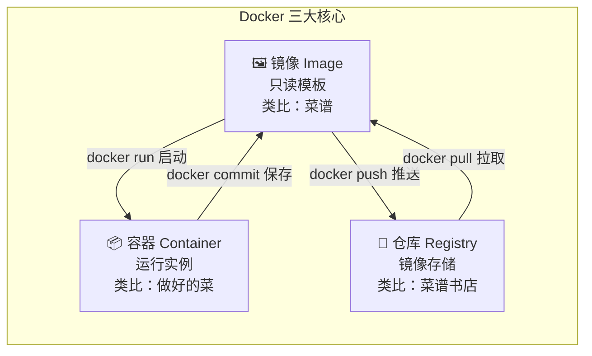

#### 1.2.1 镜像（Image）

镜像是一个**只读模板**，包含了运行应用所需的一切：代码、运行时、库、环境变量、配置文件。

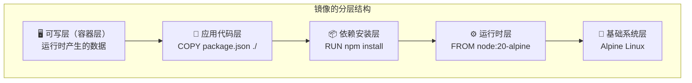

> **💡 关键理解：** 镜像的每一层都是只读的，多个容器可以共享同一镜像的层，极大节省磁盘空间。当你在容器中修改文件时，Docker 会用「写时复制（Copy-on-Write）」策略，在最上层创建一个可写层。

镜像的存储原理：

| 概念 | 说明 |
|------|------|
| 层（Layer） | 镜像的基本组成单位，每个 Dockerfile 指令创建一层 |
| 联合文件系统（UnionFS） | 将多个层叠加成一个统一的文件视图 |
| 写时复制（CoW） | 修改文件时才复制到可写层，节省空间 |
| 内容寻址（Content-addressable） | 每层通过 SHA256 哈希标识，保证完整性 |
| 层共享 | 不同镜像可以共享相同的层 |

| 概念 | 类比 | 特点 |
|------|------|------|
| 镜像（Image） | 菜谱 | 只读、可共享、分层存储 |
| 容器（Container） | 做好的菜 | 可写、隔离、生命周期短 |
| 仓库（Registry） | 菜谱书店 | 集中存储、版本管理 |

#### 1.2.2 容器（Container）

容器是镜像的**运行实例**。你可以从同一个镜像启动多个容器，它们彼此隔离，互不影响。

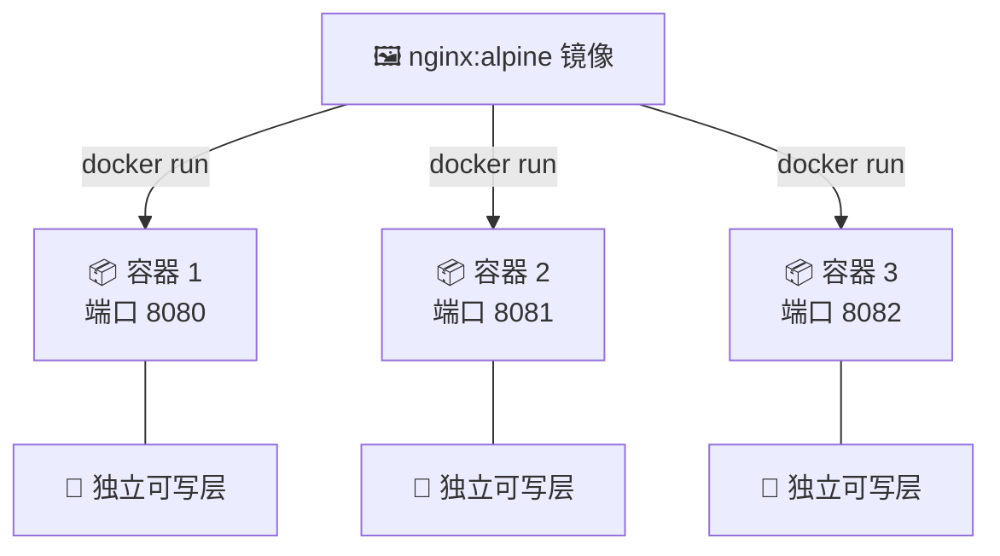

容器的生命周期：

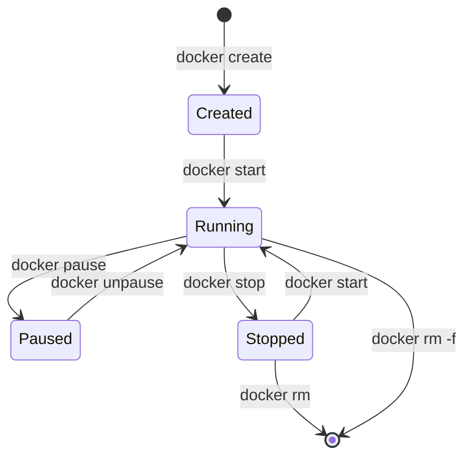

容器 vs 虚拟机：

| 特性 | 容器 | 虚拟机 |
|------|------|--------|
| 启动速度 | 毫秒级 | 分钟级 |
| 资源占用 | MB 级 | GB 级 |
| 隔离级别 | 进程级 | 硬件级 |
| 性能损耗 | 接近原生 | 5%-20% |
| 镜像大小 | 通常 10-500MB | 通常 1-10GB |
| 密度 | 单机可运行数百个 | 单机通常十几个 |
| 隔离机制 | Namespace + Cgroup | Hypervisor |
| 适用场景 | 微服务、CI/CD | 需要完整 OS 的场景 |
| 管理复杂度 | 较低 | 较高 |
| 跨平台 | 依赖内核 | 完全独立 |

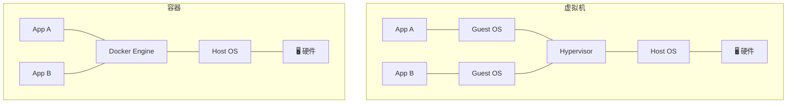

#### 1.2.3 仓库（Registry）

仓库是存储和分发镜像的服务。最常用的是 **Docker Hub**，你也可以搭建私有仓库。

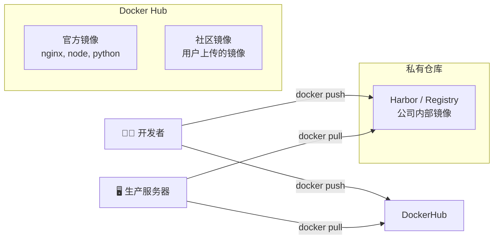

常用仓库地址：

| 仓库 | 地址 | 说明 | 适用场景 |
|------|------|------|----------|
| Docker Hub | hub.docker.com | 最大的公共镜像仓库 | 通用 |
| GitHub Container Registry | ghcr.io | GitHub 集成 | 开源项目 |
| 阿里云容器镜像服务 | cr.aliyun.com | 国内加速 | 国内用户 |
| 腾讯云容器镜像服务 | ccr.ccs.tencentyun.com | 国内加速 | 国内用户 |
| Google Container Registry | gcr.io | GCP 集成 | GCP 用户 |
| AWS ECR | aws.amazon.com/ecr | AWS 集成 | AWS 用户 |
| Azure Container Registry | azure.microsoft.com/acr | Azure 集成 | Azure 用户 |
| 私有 Harbor | 自建 | 企业级私有仓库 | 企业内部 |

### 1.3 Docker 的工作流程

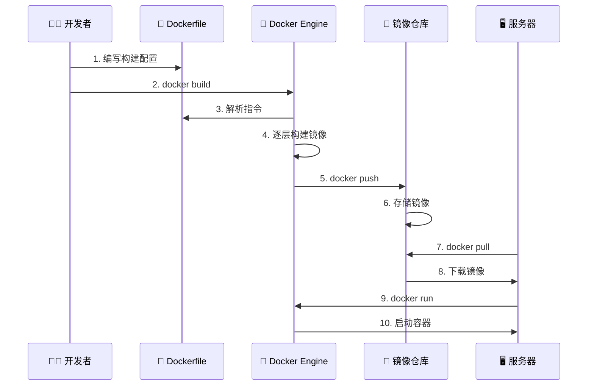

### 1.4 容器运行时架构

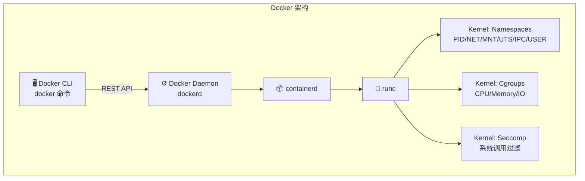

> **💡 知识扩展：** Docker 底层使用 Linux 内核的两大特性：
> - **Namespace（命名空间）**：隔离进程、网络、文件系统等
> - **Cgroup（控制组）**：限制 CPU、内存、IO 等资源

**Docker 各组件的职责：**

| 组件 | 职责 | 说明 |
|------|------|------|
| Docker CLI | 用户界面 | 接收用户命令，发送给 Daemon |
| Docker Daemon (dockerd) | 核心守护进程 | 管理镜像、容器、网络、卷 |
| containerd | 容器运行时管理 | 容器生命周期管理 |
| runc | 底层运行时 | 真正创建和运行容器 |
| Docker Registry | 镜像存储 | 存储和分发镜像 |

### 1.5 容器生态系统

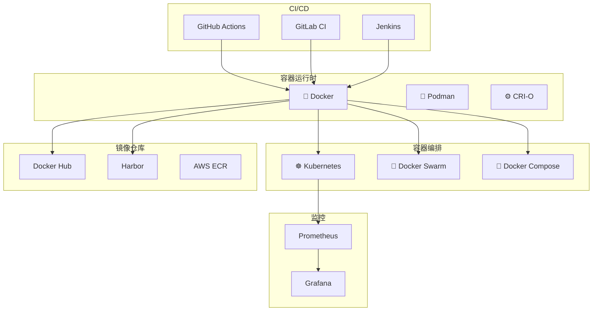

**Docker 替代方案对比：**

| 工具 | 与 Docker 的区别 | 优势 | 劣势 |
|------|-----------------|------|------|
| Podman | 无守护进程，兼容 Docker CLI | 更安全（rootless），无需 daemon | 生态略小 |
| Containerd | Docker 的底层运行时 | 轻量，K8s 原生支持 | CLI 不友好 |
| CRI-O | 专为 K8s 设计 | 极简，只做 K8s 需要的 | 只能配合 K8s |
| nerdctl | Containerd 的 CLI | 兼容 Docker CLI | 需要额外安装 |

### 1.6 Docker 的安装与配置

```bash
# 🔧 Docker 安装（Ubuntu/Debian）

# 方式一：官方安装脚本（推荐）
curl -fsSL https://get.docker.com | sh

# 将当前用户加入 docker 组（免 sudo）
sudo usermod -aG docker $USER
# 需要重新登录才能生效

# 方式二：使用 apt 仓库
sudo apt-get update
sudo apt-get install ca-certificates curl gnupg
sudo install -m 0755 -d /etc/apt/keyrings
curl -fsSL https://download.docker.com/linux/ubuntu/gpg | sudo gpg --dearmor -o /etc/apt/keyrings/docker.gpg
sudo chmod a+r /etc/apt/keyrings/docker.gpg
echo "deb [arch=$(dpkg --print-architecture) signed-by=/etc/apt/keyrings/docker.gpg] https://download.docker.com/linux/ubuntu $(. /etc/os-release && echo "$VERSION_CODENAME") stable" | sudo tee /etc/apt/sources.list.d/docker.list > /dev/null
sudo apt-get update
sudo apt-get install docker-ce docker-ce-cli containerd.io docker-buildx-plugin docker-compose-plugin

# 验证安装
docker --version
# Docker version 25.0.3, build 4debf41

docker compose version
# Docker Compose version v2.24.5

# 运行测试容器
docker run --rm hello-world
# Hello from Docker!
# This message shows that your installation appears to be working correctly.
```

```bash
# 🔧 Docker 配置优化

# 创建或编辑 Docker 配置文件
sudo tee /etc/docker/daemon.json << 'EOF'
{
  "log-driver": "json-file",
  "log-opts": {
    "max-size": "10m",
    "max-file": "3"
  },
  "storage-driver": "overlay2",
  "registry-mirrors": [
    "https://mirror.ccs.tencentyun.com",
    "https://registry.docker-cn.com"
  ],
  "default-address-pools": [
    {
      "base": "172.17.0.0/12",
      "size": 24
    }
  ],
  "live-restore": true,
  "max-concurrent-downloads": 10,
  "max-concurrent-uploads": 5
}
EOF

# 重启 Docker 使配置生效
sudo systemctl restart docker

# 配置说明：
# log-driver: 默认日志驱动
# log-opts: 日志轮转配置
# storage-driver: 存储驱动（overlay2 推荐）
# registry-mirrors: 镜像加速器
# live-restore: 守护进程重启时保持容器运行
# max-concurrent-downloads: 最大并发下载数
```

### 1.7 Docker Desktop 与命令行

| 环境 | Docker Desktop | Docker Engine (CLI) |
|------|---------------|---------------------|
| 适用系统 | macOS, Windows, Linux | Linux |
| 安装方式 | GUI 安装包 | 包管理器 |
| 资源占用 | 较高（运行虚拟机） | 较低 |
| GUI 管理 | ✅ | ❌ |
| Kubernetes 集成 | ✅ 内置 | 需手动安装 |
| 适用场景 | 开发环境 | 服务器/CI |

### 1.8 容器的 PID 1 与信号处理

在 Linux 系统中，PID 1（init 进程）有特殊的地位。容器中的主进程通常以 PID 1 运行，这意味着它需要正确处理系统信号。

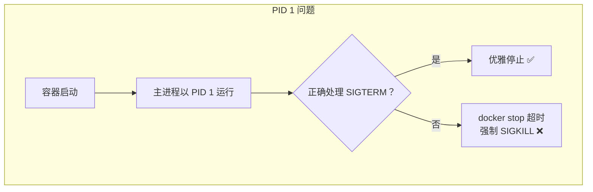

**为什么 Node.js 需要 tini？**

Node.js 应用默认不正确处理信号。当 `docker stop` 发送 SIGTERM 时，Node.js 进程可能不会优雅退出，导致：
- 请求被突然中断
- 数据库事务未完成
- 连接未正确关闭

```bash
# 解决方案一：使用 tini（推荐）
# 在 Dockerfile 中
RUN apk add --no-cache tini
ENTRYPOINT ["/sbin/tini", "--"]
CMD ["node", "index.js"]

# 解决方案二：在 Node.js 中处理信号
# process.on('SIGTERM', () => {
#   console.log('收到 SIGTERM，正在优雅关闭...');
#   server.close(() => {
#     db.end();
#     process.exit(0);
#   });
# });

# 解决方案三：使用 --init 参数
docker run --init myapp
```

| 方案 | 优点 | 缺点 |
|------|------|------|
| tini | 轻量、正确转发信号 | 需要安装 |
| --init | 最简单 | Docker 特有 |
| 应用内处理 | 最灵活 | 需要修改代码 |

### 1.9 容器日志驱动

Docker 支持多种日志驱动，决定容器日志的存储方式。

| 日志驱动 | 说明 | 适用场景 |
|---------|------|----------|
| `json-file` | 默认，写入 JSON 文件 | 开发/简单部署 |
| `syslog` | 发送到 syslog | 使用 syslog 的环境 |
| `journald` | 发送到 systemd journal | 使用 systemd 的系统 |
| `fluentd` | 发送到 Fluentd | 日志聚合 |
| `awslogs` | 发送到 AWS CloudWatch | AWS 环境 |
| `gcplogs` | 发送到 Google Cloud Logging | GCP 环境 |
| `none` | 不记录日志 | 不需要日志时 |

```bash
# 设置日志驱动
# 全局设置（/etc/docker/daemon.json）
# {
#   "log-driver": "json-file",
#   "log-opts": {
#     "max-size": "10m",
#     "max-file": "3"
#   }
# }

# 单个容器设置
docker run --log-driver json-file \
  --log-opt max-size=10m \
  --log-opt max-file=3 \
  myapp

# 查看容器日志位置
docker inspect myapp --format='{{.LogPath}}'
```

### 1.10 Docker 存储驱动

存储驱动决定了镜像层和容器可写层的实现方式。

| 存储驱动 | 说明 | 推荐度 |
|---------|------|--------|
| `overlay2` | 现代 Linux 推荐 | ⭐⭐⭐⭐⭐ |
| `fuse-overlayfs` | Rootless 模式推荐 | ⭐⭐⭐⭐ |
| `btrfs` | Btrfs 文件系统 | ⭐⭐⭐ |
| `zfs` | ZFS 文件系统 | ⭐⭐⭐ |
| `vfs` | 简单但慢 | ⭐ |

```bash
# 查看当前存储驱动
docker info --format '{{.Driver}}'
# overlay2

# 镜像层在磁盘上的位置
# /var/lib/docker/overlay2/
```

### 1.11 Docker 上下文（Context）

Docker Context 允许你管理多个 Docker 主机，轻松在本地和远程之间切换。

```bash
# 🔧 Docker Context 实战

# 查看当前上下文
docker context ls
# NAME        DESCRIPTION                               DOCKER ENDPOINT
# default     Current DOCKER_HOST based configuration   unix:///var/run/docker.sock

# 创建新的上下文（连接远程 Docker）
docker context create remote \
  --docker "host=ssh://user@remote-server"

# 切换上下文
docker context use remote

# 在指定上下文中执行命令
docker --context remote ps

# 切回默认上下文
docker context use default
```

---

## 2. Docker 核心命令速查

### 2.1 命令分类总览

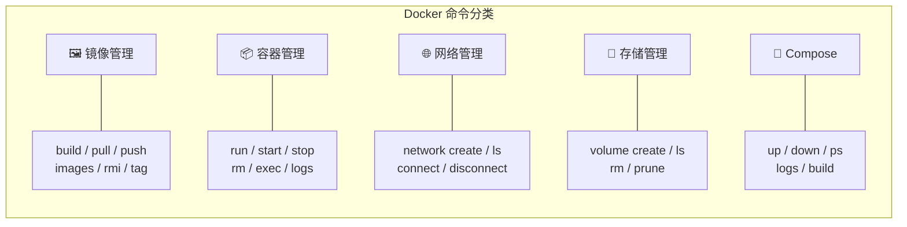

### 2.2 镜像管理命令

| 命令 | 说明 | 示例 |
|------|------|------|
| `docker build` | 从 Dockerfile 构建镜像 | `docker build -t myapp:v1 .` |
| `docker pull` | 从仓库拉取镜像 | `docker pull nginx:alpine` |
| `docker push` | 推送镜像到仓库 | `docker push myapp:v1` |
| `docker images` | 列出本地镜像 | `docker images --filter "dangling=true"` |
| `docker rmi` | 删除镜像 | `docker rmi myapp:v1` |
| `docker tag` | 给镜像打标签 | `docker tag myapp:v1 myapp:latest` |
| `docker save` | 导出镜像为 tar 文件 | `docker save -o myapp.tar myapp:v1` |
| `docker load` | 从 tar 文件导入镜像 | `docker load -i myapp.tar` |
| `docker history` | 查看镜像构建历史 | `docker history myapp:v1` |
| `docker inspect` | 查看镜像详细信息 | `docker inspect myapp:v1` |
| `docker image prune` | 清理悬空镜像 | `docker image prune` |
| `docker image prune -a` | 清理所有未使用镜像 | `docker image prune -a` |
| `docker manifest inspect` | 查看多架构镜像清单 | `docker manifest inspect node:20` |
| `docker buildx build` | 使用 BuildKit 构建 | `docker buildx build --platform linux/amd64,linux/arm64 .` |

```bash
# 🔍 镜像管理实战

# 拉取镜像
docker pull node:20-alpine

# 查看本地所有镜像
docker images
# REPOSITORY   TAG          IMAGE ID       CREATED        SIZE
# node         20-alpine    a1b2c3d4e5f6   2 weeks ago    130MB
# nginx        alpine       f6e7g8h9i0j1   3 weeks ago    27MB

# 查看镜像的层结构
docker history node:20-alpine
# IMAGE          CREATED        CREATED BY                                      SIZE
# a1b2c3d4e5f6   2 weeks ago    CMD ["node"]                                    0B
# <missing>      2 weeks ago    ENTRYPOINT ["docker-entrypoint.sh"]             0B
# <missing>      2 weeks ago    RUN /bin/sh -c apk add --no-cache ...          7.2MB
# ...

# 给镜像打多个标签
docker tag myapp:v1 myapp:latest
docker tag myapp:v1 registry.example.com/myapp:v1

# 推送到私有仓库
docker push registry.example.com/myapp:v1

# 清理悬空镜像（没有标签的镜像）
docker image prune

# 清理所有未使用的镜像
docker image prune -a

# 导出/导入镜像（离线环境常用）
docker save -o myapp-v1.tar myapp:v1
docker load -i myapp-v1.tar

# 查看镜像的详细 JSON 信息
docker inspect myapp:v1 | jq '.[0].Config'

# 搜索 Docker Hub 上的镜像
docker search nginx --limit 10

# 查看多架构镜像支持的平台
docker manifest inspect node:20 | jq '.manifests[].platform'
```

### 2.3 容器管理命令

| 命令 | 说明 | 常用参数 |
|------|------|----------|
| `docker run` | 创建并启动容器 | `-d`后台运行, `-p`端口映射, `-v`挂载卷, `-e`环境变量, `--name`命名 |
| `docker start` | 启动已停止的容器 | `-a`附加到终端 |
| `docker stop` | 优雅停止容器 | `-t 10`等待10秒后强制停止 |
| `docker restart` | 重启容器 | `-t 10` |
| `docker rm` | 删除容器 | `-f`强制删除, `-v`同时删除匿名卷 |
| `docker exec` | 在运行中的容器中执行命令 | `-it`交互式终端, `-u root`以root执行 |
| `docker logs` | 查看容器日志 | `-f`持续输出, `--tail 100`最后100行, `-t`显示时间戳 |
| `docker ps` | 列出容器 | `-a`所有容器, `-q`只显示ID |
| `docker cp` | 在容器和主机间复制文件 | `容器:路径 主机路径` |
| `docker stats` | 实时查看容器资源使用 | `--no-stream`只显示一次 |
| `docker top` | 查看容器中的进程 | |
| `docker inspect` | 查看容器详细信息 | |
| `docker wait` | 阻塞直到容器停止 | |
| `docker attach` | 连接到运行中的容器 | `--sig-proxy=false`不转发信号 |
| `docker commit` | 从容器创建镜像 | `-m "message"` |
| `docker rename` | 重命名容器 | `docker rename old_name new_name` |
| `docker update` | 更新容器配置 | `docker update --memory 512m mycontainer` |
| `docker port` | 查看端口映射 | `docker port mycontainer` |
| `docker diff` | 查看文件系统变化 | `docker diff mycontainer` |

```bash
# 🚀 容器管理实战

# 后台运行一个 Nginx 容器
docker run -d \
  --name my-nginx \
  -p 8080:80 \
  -v ./html:/usr/share/nginx/html \
  nginx:alpine

# 查看运行中的容器
docker ps
# CONTAINER ID   IMAGE          STATUS         PORTS                  NAMES
# e5f6a7b8c9d0   nginx:alpine   Up 5 minutes   0.0.0.0:8080->80/tcp   my-nginx

# 查看所有容器（包括已停止的）
docker ps -a

# 进入容器内部
docker exec -it my-nginx /bin/sh

# 以 root 用户进入容器
docker exec -u root -it my-nginx /bin/sh

# 在容器中执行单条命令
docker exec my-nginx cat /etc/nginx/nginx.conf

# 查看容器日志
docker logs -f --tail 100 my-nginx

# 带时间戳查看日志
docker logs -f -t my-nginx

# 查看容器资源使用情况
docker stats my-nginx
# CONTAINER ID   NAME       CPU %   MEM USAGE / LIMIT   MEM %   NET I/O       BLOCK I/O
# e5f6a7b8c9d0   my-nginx   0.00%   2.5MiB / 512MiB     0.49%   1.2kB / 0B    0B / 0B

# 从容器复制文件到主机
docker cp my-nginx:/etc/nginx/nginx.conf ./nginx.conf

# 从主机复制文件到容器
docker cp ./index.html my-nginx:/usr/share/nginx/html/

# 查看容器的端口映射
docker port my-nginx
# 80/tcp -> 0.0.0.0:8080

# 查看容器中的进程
docker top my-nginx

# 查看容器文件系统的变化
docker diff my-nginx
# C /var
# C /var/cache
# A /var/cache/nginx
# ...

# 优雅停止容器（默认等10秒）
docker stop my-nginx

# 强制停止容器（不推荐）
docker kill my-nginx

# 删除已停止的容器
docker rm my-nginx

# 强制删除运行中的容器
docker rm -f my-nginx

# 清理所有已停止的容器
docker container prune

# 从容器创建快照镜像
docker commit -m "added config" my-nginx my-nginx-snapshot:v1

# 重命名容器
docker rename my-nginx web-server

# 更新容器的资源限制
docker update --memory 1g --cpus 2 my-nginx

# 等待容器退出（脚本中常用）
docker wait my-nginx

# 查看容器退出码
docker inspect my-nginx --format '{{.State.ExitCode}}'
```

### 2.4 Docker run 常用参数详解

```bash
# 完整的 docker run 参数示例
docker run \
  --name my-app \                    # 容器名称
  -d \                               # 后台运行
  --restart unless-stopped \         # 重启策略
  -p 3000:3000 \                     # 端口映射（主机:容器）
  -v ./data:/app/data \              # 数据卷挂载
  -v app-logs:/app/logs \            # 命名卷挂载
  -e NODE_ENV=production \           # 环境变量
  --env-file .env \                  # 从文件加载环境变量
  --network my-network \             # 加入指定网络
  --memory 512m \                    # 内存限制
  --cpus 1.5 \                       # CPU 限制
  --pids-limit 100 \                 # 进程数限制
  --read-only \                      # 只读文件系统
  --tmpfs /tmp \                     # 临时文件系统
  --security-opt no-new-privileges \ # 禁止提权
  --cap-drop ALL \                   # 丢弃所有 Linux 能力
  --cap-add NET_BIND_SERVICE \       # 只添加需要的能力
  my-app:v1                          # 镜像名
```

**常用参数速查表：**

| 参数 | 说明 | 示例 |
|------|------|------|
| `-d` | 后台运行（detached） | `docker run -d nginx` |
| `-it` | 交互式终端 | `docker run -it ubuntu bash` |
| `-p` | 端口映射 | `-p 8080:80` |
| `-P` | 随机映射所有暴露端口 | `docker run -P nginx` |
| `-v` | 挂载卷 | `-v /host:/container` |
| `-e` | 设置环境变量 | `-e MY_VAR=value` |
| `--env-file` | 从文件加载环境变量 | `--env-file .env` |
| `--name` | 容器名称 | `--name web` |
| `--network` | 指定网络 | `--network my-net` |
| `--restart` | 重启策略 | `--restart always` |
| `--rm` | 容器停止后自动删除 | `docker run --rm alpine echo hello` |
| `--read-only` | 只读根文件系统 | 提高安全性 |
| `--memory` | 内存限制 | `--memory 512m` |
| `--cpus` | CPU 限制 | `--cpus 1.5` |
| `--user` | 指定运行用户 | `--user 1000:1000` |
| `--workdir` | 工作目录 | `--workdir /app` |
| `--entrypoint` | 覆盖入口点 | `--entrypoint /bin/sh` |
| `--hostname` | 容器主机名 | `--hostname my-host` |
| `--dns` | 自定义 DNS | `--dns 8.8.8.8` |
| `--add-host` | 添加 hosts 映射 | `--add-host myhost:192.168.1.100` |
| `--pid` | PID 命名空间 | `--pid host`（共享主机 PID） |
| `--ipc` | IPC 命名空间 | `--ipc host`（共享主机 IPC） |
| `--privileged` | 特权模式（⚠️ 危险） | 仅特殊场景使用 |

**重启策略对比：**

| 策略 | 说明 | 适用场景 |
|------|------|----------|
| `no` | 不自动重启（默认） | 一次性任务 |
| `on-failure:N` | 失败时重启，最多 N 次 | 任务型容器 |
| `always` | 总是重启 | 生产服务 |
| `unless-stopped` | 总是重启，除非手动停止 | 推荐用于生产 |

### 2.5 网络管理命令

```bash
# 🌐 网络管理实战

# 列出所有网络
docker network ls
# NETWORK ID     NAME      DRIVER    SCOPE
# a1b2c3d4e5f6   bridge    bridge    local
# f6e7g8h9i0j1   host      host      local
# k1l2m3n4o5p6   none      null      local

# 创建自定义网络
docker network create my-network

# 创建指定子网的网络
docker network create --subnet=172.20.0.0/16 my-network

# 创建带网关的网络
docker network create --subnet=172.20.0.0/16 --gateway=172.20.0.1 my-network

# 创建内部网络（不能访问外网）
docker network create --internal my-internal-net

# 将容器连接到网络
docker network connect my-network my-nginx

# 连接时指定 IP
docker network connect --ip 172.20.0.100 my-network my-nginx

# 将容器从网络断开
docker network disconnect my-network my-nginx

# 查看网络详细信息
docker network inspect my-network

# 删除网络
docker network rm my-network

# 清理未使用的网络
docker network prune
```

### 2.6 存储管理命令

```bash
# 💾 存储管理实战

# 创建命名卷
docker volume create my-data

# 创建带驱动选项的卷
docker volume create --driver local \
  --opt type=none \
  --opt device=/data/my-data \
  --opt o=bind \
  my-data

# 列出所有卷
docker volume ls
# DRIVER    VOLUME NAME
# local     my-data
# local     app-logs

# 查看卷详细信息
docker volume inspect my-data

# 删除指定卷
docker volume rm my-data

# 清理未使用的卷（⚠️ 会删除所有未使用的卷）
docker volume prune

# 使用卷运行容器
docker run -d \
  --name db \
  -v pgdata:/var/lib/postgresql/data \
  postgres:16-alpine

# 使用 bind mount（将主机目录挂载到容器）
docker run -d \
  --name web \
  -v $(pwd)/html:/usr/share/nginx/html:ro \
  nginx:alpine

# 只读挂载（容器不能修改主机文件）
docker run -d -v /host/path:/container/path:ro myapp

# 带选项的挂载
docker run -d \
  -v /host/path:/container/path:rw,noexec,nosuid \
  myapp
```

### 2.7 系统维护命令

```bash
# 🧹 系统维护实战

# 查看 Docker 系统信息
docker system info

# 查看磁盘使用情况
docker system df
# TYPE            TOTAL     ACTIVE    SIZE      RECLAIMABLE
# Images          15        5         2.5GB     1.2GB (48%)
# Containers      8         3         100MB     80MB (80%)
# Local Volumes   10        4         500MB     300MB (60%)
# Build Cache     25        0         800MB     800MB (100%)

# 详细磁盘使用情况
docker system df -v

# 一键清理所有未使用资源
docker system prune

# 包括未使用的卷
docker system prune --volumes

# 包括所有未使用的镜像（不仅是悬空的）
docker system prune -a

# 包括构建缓存
docker system prune --all --volumes --force

# 查看 Docker 版本
docker version

# 查看 Docker 信息（JSON 格式）
docker info --format '{{json .}}'
```

### 2.8 日常工作流命令组合

```bash
# 📋 开发日常：完整工作流

# 1. 构建镜像
docker build -t myapp:dev .

# 2. 运行容器
docker run -d --name myapp-dev -p 3000:3000 -v $(pwd):/app myapp:dev

# 3. 查看日志
docker logs -f myapp-dev

# 4. 进入容器调试
docker exec -it myapp-dev /bin/sh

# 5. 重新构建并重启
docker build -t myapp:dev .
docker rm -f myapp-dev
docker run -d --name myapp-dev -p 3000:3000 myapp:dev

# 📋 生产部署：完整工作流

# 1. 构建生产镜像
docker build -t myapp:v1.2.3 .
docker tag myapp:v1.2.3 registry.example.com/myapp:v1.2.3

# 2. 推送到仓库
docker push registry.example.com/myapp:v1.2.3

# 3. 在服务器上拉取并运行
docker pull registry.example.com/myapp:v1.2.3
docker stop myapp-prod || true
docker rm myapp-prod || true
docker run -d \
  --name myapp-prod \
  --restart unless-stopped \
  -p 3000:3000 \
  --memory 512m \
  --cpus 1 \
  registry.example.com/myapp:v1.2.3

# 📋 快速调试：一次性容器

# 运行一个临时的 Alpine 容器来测试网络
docker run --rm -it alpine sh
# 在容器内：
# apk add curl
# curl http://web:8080

# 运行一个临时的 Ubuntu 容器来测试工具
docker run --rm -it ubuntu:22.04 bash
```

---

## 3. 项目 Dockerfile 逐行讲解

### 3.1 什么是 Dockerfile？

Dockerfile 是一个文本文件，包含了一系列指令，告诉 Docker 如何构建镜像。你可以把它理解为「镜像的配方」。

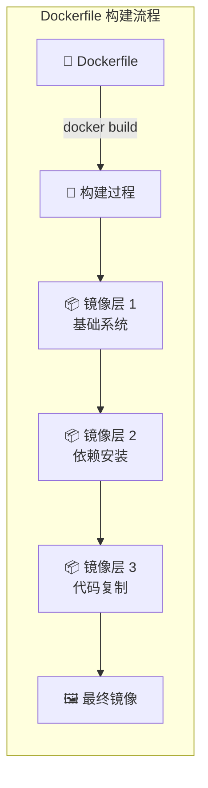

### 3.2 Dockerfile 指令速查

| 指令 | 说明 | 示例 |
|------|------|------|
| `FROM` | 指定基础镜像 | `FROM node:20-alpine` |
| `RUN` | 执行命令（构建时） | `RUN npm install` |
| `COPY` | 复制文件到镜像 | `COPY . .` |
| `ADD` | 复制文件（支持URL、自动解压） | `ADD archive.tar.gz /app/` |
| `CMD` | 容器启动时的默认命令 | `CMD ["node", "index.js"]` |
| `ENTRYPOINT` | 容器的入口点 | `ENTRYPOINT ["node"]` |
| `ENV` | 设置环境变量 | `ENV NODE_ENV=production` |
| `ARG` | 构建时的变量 | `ARG NODE_VERSION=20` |
| `EXPOSE` | 声明容器端口 | `EXPOSE 3000` |
| `WORKDIR` | 设置工作目录 | `WORKDIR /app` |
| `USER` | 指定运行用户 | `USER node` |
| `VOLUME` | 声明匿名卷 | `VOLUME /app/data` |
| `HEALTHCHECK` | 健康检查 | `HEALTHCHECK CMD curl -f http://localhost/` |
| `LABEL` | 添加元数据 | `LABEL maintainer="team@example.com"` |
| `SHELL` | 指定默认 Shell | `SHELL ["/bin/sh", "-c"]` |
| `STOPSIGNAL` | 停止信号 | `STOPSIGNAL SIGTERM` |
| `ONBUILD` | 子镜像构建时触发 | `ONBUILD COPY . .` |

**CMD vs ENTRYPOINT 的区别：**

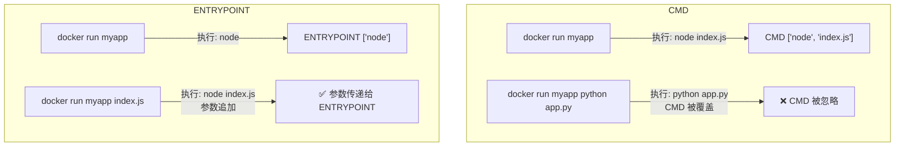

| 场景 | CMD | ENTRYPOINT | 组合使用 |
|------|-----|------------|----------|
| 容器默认命令 | ✅ | ✅ | ENTRYPOINT 定义主命令，CMD 定义默认参数 |
| 容易被覆盖 | ✅ | ❌ | |
| 类比 | 建议的默认值 | 固定的执行入口 | 最佳实践 |

**COPY vs ADD 的区别：**

| 特性 | COPY | ADD |
|------|------|-----|
| 复制本地文件 | ✅ | ✅ |
| 自动解压 tar | ❌ | ✅ |
| 支持 URL | ❌ | ✅ |
| 推荐使用 | ✅ 优先使用 | 仅在需要时使用 |

> **💡 最佳实践：** 优先使用 `COPY`，只有在需要自动解压 tar 文件时才使用 `ADD`。`ADD` 的自动行为可能导致意外结果。

### 3.3 三阶段构建：Next.js 项目完整 Dockerfile

下面是一个生产级 Next.js 项目的 Dockerfile，采用三阶段构建：

```dockerfile
# ============================================================
# 阶段一：依赖安装（deps）
# 目的：只安装依赖，利用缓存避免重复下载
# ============================================================

# 使用 Node.js 20 的 Alpine 版本作为基础镜像
# Alpine 版本只有 ~5MB，比 Debian 版本小很多
FROM node:20-alpine AS deps

# 安装 libc6-compat，某些 npm 包需要这个库
# 例如：sharp（图片处理库）在 Alpine 上需要兼容层
RUN apk add --no-cache libc6-compat

# 设置工作目录，后续所有命令都在这个目录下执行
WORKDIR /app

# 只复制 package.json 和 lock 文件
# 为什么不复制所有代码？因为依赖变化频率 < 代码变化频率
# 这样只要依赖没变，这一层就会被缓存
COPY package.json package-lock.json* ./

# 安装依赖
# --frozen-lockfile：确保 lock 文件不被修改（CI 环境推荐）
# --prefer-offline：优先使用本地缓存
RUN npm ci --prefer-offline


# ============================================================
# 阶段二：构建应用（builder）
# 目的：编译 TypeScript、打包静态资源
# ============================================================

FROM node:20-alpine AS builder

WORKDIR /app

# 从阶段一复制已安装的依赖
# 这样即使 Dockerfile 后面的指令变了，依赖层也不会重新构建
COPY --from=deps /app/node_modules ./node_modules

# 复制项目源代码
COPY . .

# 设置构建时的环境变量
# NEXT_TELEMETRY_DISABLED：禁用 Next.js 遥测
ENV NEXT_TELEMETRY_DISABLED=1

# 构建 Next.js 应用
# 这一步会：编译 TypeScript → 生成优化的 JS → 静态页面预渲染
RUN npm run build

# 可选：如果使用 standalone 模式，复制 standalone 输出
# Next.js standalone 模式会生成一个精简的服务器
# RUN cp -r .next/standalone . && cp -r .next/static .next/standalone/static


# ============================================================
# 阶段三：运行时（runner）
# 目的：只包含运行应用所需的最小文件
# ============================================================

FROM node:20-alpine AS runner

WORKDIR /app

# 设置生产环境变量
ENV NODE_ENV=production
ENV NEXT_TELEMETRY_DISABLED=1

# 🔒 安全：创建非 root 用户
# 在容器中以 root 运行是非常危险的——如果容器被攻破，攻击者获得 root 权限
RUN addgroup --system --gid 1001 nodejs && \
    adduser --system --uid 1001 nextjs

# 只复制构建产物，不复制源代码和 node_modules
# 这样最终镜像体积最小
COPY --from=builder /app/public ./public

# 设置 .next 目录的权限
# .next/cache 需要写权限
RUN mkdir .next && chown nextjs:nodejs .next

# 复制构建输出
COPY --from=builder --chown=nextjs:nodejs /app/.next/standalone ./
COPY --from=builder --chown=nextjs:nodejs /app/.next/static ./.next/static

# 声明容器监听的端口
# 这只是一个文档声明，不会实际限制端口
EXPOSE 3000

# 设置环境变量，让 Next.js 监听所有网络接口
ENV PORT=3000
ENV HOSTNAME="0.0.0.0"

# 切换到非 root 用户
USER nextjs

# 健康检查：每 30 秒检查一次应用是否正常
HEALTHCHECK --interval=30s --timeout=10s --start-period=5s --retries=3 \
  CMD wget --no-verbose --tries=1 --spider http://localhost:3000/api/health || exit 1

# 容器启动命令
# 使用 node 直接运行，不需要 npm（更少的进程，更少的开销）
CMD ["node", "server.js"]
```

### 3.4 构建流程图解

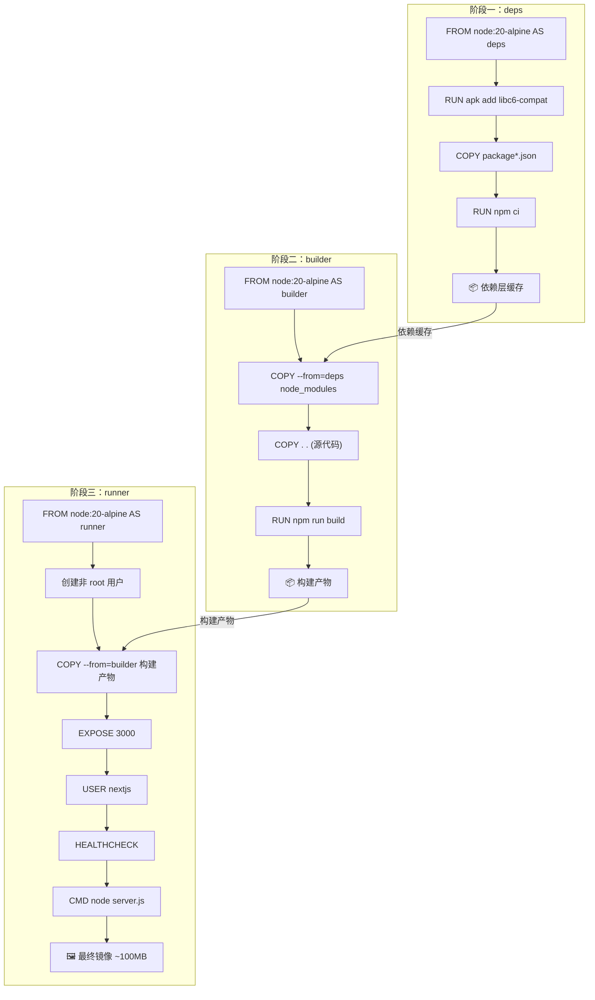

### 3.5 构建缓存优化原理

```mermaid
graph TB
    subgraph "第一次构建"
        B1S1["COPY package*.json"] -->|"下载所有依赖"| B1S2["RUN npm ci<br/>⏱️ 60秒"]
        B1S2 --> B1S3["COPY . ."] -->|"编译代码"| B1S4["RUN npm run build<br/>⏱️ 45秒"]
        B1S4 --> B1S5["总耗时: 105秒"]
    end

    subgraph "第二次构建（只改了代码）"
        B2S1["COPY package*.json"] -->|"✅ 缓存命中"| B2S2["RUN npm ci<br/>⏩ 0秒 (跳过)"]
        B2S2 --> B2S3["COPY . ."] -->|"代码变了"| B2S4["RUN npm run build<br/>⏱️ 45秒"]
        B2S4 --> B2S5["总耗时: 45秒"]
    end

    subgraph "第三次构建（改了依赖）"
        B3S1["COPY package*.json"] -->|"❌ 依赖变了"| B3S2["RUN npm ci<br/>⏱️ 60秒"]
        B3S2 --> B3S3["COPY . ."] -->|"代码也变了"| B3S4["RUN npm run build<br/>⏱️ 45秒"]
        B3S4 --> B3S5["总耗时: 105秒"]
    end
```

> **💡 核心原则：** 把变化频率低的指令放在前面，变化频率高的放在后面。依赖变化频率 < 代码变化频率，所以先复制 `package.json` 安装依赖，再复制源代码。

### 3.6 常见应用的 Dockerfile 示例

#### Python Flask 应用

```dockerfile
# ---- 阶段一：依赖安装 ----
FROM python:3.12-slim AS deps

WORKDIR /app

# 安装系统依赖（某些 Python 包需要编译）
RUN apt-get update && apt-get install -y --no-install-recommends \
    gcc \
    && rm -rf /var/lib/apt/lists/*

# 复制依赖文件
COPY requirements.txt .

# 安装 Python 依赖
# --no-cache-dir：不缓存下载的包，减小镜像体积
# --user：安装到用户目录（避免权限问题）
RUN pip install --no-cache-dir --user -r requirements.txt


# ---- 阶段二：运行时 ----
FROM python:3.12-slim AS runner

WORKDIR /app

# 创建非 root 用户
RUN useradd --create-home --shell /bin/bash appuser

# 从阶段一复制已安装的依赖
COPY --from=deps /root/.local /home/appuser/.local

# 复制应用代码
COPY --chown=appuser:appuser . .

# 切换到非 root 用户
USER appuser

# 更新 PATH，让 pip 安装的命令可用
ENV PATH=/home/appuser/.local/bin:$PATH

EXPOSE 5000

HEALTHCHECK --interval=30s --timeout=10s --retries=3 \
  CMD python -c "import urllib.request; urllib.request.urlopen('http://localhost:5000/health')" || exit 1

CMD ["gunicorn", "--bind", "0.0.0.0:5000", "--workers", "4", "app:app"]
```

#### Go 应用

```dockerfile
# ---- 阶段一：构建 ----
FROM golang:1.22-alpine AS builder

WORKDIR /app

# 安装 Git（go mod 需要）
RUN apk add --no-cache git

# 先复制 go.mod 和 go.sum（利用缓存）
COPY go.mod go.sum ./
RUN go mod download

# 复制源代码并构建
COPY . .
# CGO_ENABLED=0：禁用 CGO，生成纯静态二进制
# -ldflags="-s -w"：去除调试信息，减小二进制体积
RUN CGO_ENABLED=0 GOOS=linux go build -ldflags="-s -w" -o /app/server ./cmd/server


# ---- 阶段二：运行时（使用 scratch 空镜像）----
FROM scratch

# 复制 SSL 证书（HTTPS 请求需要）
COPY --from=builder /etc/ssl/certs/ca-certificates.crt /etc/ssl/certs/

# 复制编译好的二进制文件
COPY --from=builder /app/server /server

# 复制配置文件
COPY --from=builder /app/config /config

EXPOSE 8080

ENTRYPOINT ["/server"]
```

> **💡 Go 语言的优势：** Go 编译后是静态二进制文件，运行时甚至不需要操作系统——可以用 `scratch`（空镜像），最终镜像可能只有 10-20MB。

#### Java Spring Boot 应用

```dockerfile
# ---- 阶段一：构建 ----
FROM maven:3.9-eclipse-temurin-21-alpine AS builder

WORKDIR /app

# 先复制 pom.xml（利用缓存）
COPY pom.xml .
RUN mvn dependency:go-offline

# 复制源代码并构建
COPY src ./src
RUN mvn package -DskipTests

# ---- 阶段二：运行时 ----
FROM eclipse-temurin:21-jre-alpine

WORKDIR /app

# 创建非 root 用户
RUN addgroup --system --gid 1001 appgroup && \
    adduser --system --uid 1001 --ingroup appgroup appuser

# 从构建阶段复制 jar 文件
COPY --from=builder /app/target/*.jar app.jar

# 设置文件权限
RUN chown appuser:appgroup app.jar

USER appuser

EXPOSE 8080

HEALTHCHECK --interval=30s --timeout=10s --retries=3 \
  CMD wget --spider -q http://localhost:8080/actuator/health || exit 1

# JVM 优化参数
ENTRYPOINT ["java", \
  "-XX:+UseContainerSupport", \
  "-XX:MaxRAMPercentage=75.0", \
  "-Djava.security.egd=file:/dev/./urandom", \
  "-jar", "app.jar"]
```

#### Rust 应用

```dockerfile
# ---- 阶段一：构建 ----
FROM rust:1.76-alpine AS builder

# 安装构建依赖
RUN apk add --no-cache musl-dev

WORKDIR /app

# 先复制依赖文件（利用缓存）
COPY Cargo.toml Cargo.lock ./

# 创建 dummy src 来缓存依赖
RUN mkdir src && echo "fn main() {}" > src/main.rs && \
    cargo build --release && \
    rm -rf src

# 复制真正的源代码并构建
copy src ./src
# 触发重新编译（因为 src/main.rs 被修改了）
RUN touch src/main.rs && cargo build --release

# ---- 阶段二：运行时 ----
FROM alpine:3.19

# 安装运行时依赖
RUN apk add --no-cache ca-certificates

WORKDIR /app

# 从构建阶段复制编译好的二进制文件
COPY --from=builder /app/target/release/myapp ./myapp

# 创建非 root 用户
RUN addgroup -S appgroup && adduser -S appuser -G appgroup
USER appuser

EXPOSE 8080

HEALTHCHECK --interval=30s --timeout=10s --retries=3 \
  CMD wget --spider -q http://localhost:8080/health || exit 1

CMD ["./myapp"]
```

> **💡 Rust 的优势：** 和 Go 类似，Rust 编译后也是静态二进制文件，可以使用非常小的基础镜像。最终镜像通常只有 10-30MB。

#### PHP Laravel 应用

```dockerfile
# ---- 阶段一：PHP 扩展构建 ----
FROM php:8.3-fpm-alpine AS php-ext

# 安装系统依赖
RUN apk add --no-cache \
    libpng-dev \
    libjpeg-turbo-dev \
    freetype-dev \
    icu-dev \
    oniguruma-dev \
    zip-dev

# 安装 PHP 扩展
RUN docker-php-ext-configure gd --with-freetype --with-jpeg && \
    docker-php-ext-install -j$(nproc) \
    pdo_mysql \
    mbstring \
    exif \
    pcntl \
    bcmath \
    gd \
    zip \
    intl \
    opcache

# 安装 Composer
copy --from=composer:2 /usr/bin/composer /usr/bin/composer

# ---- 阶段二：依赖安装 ----
FROM php-ext AS deps

WORKDIR /app

# 先复制 composer 文件（利用缓存）
COPY composer.json composer.lock ./

# 安装依赖
RUN composer install --no-dev --no-scripts --no-autoloader --prefer-dist

# 复制项目文件
copy . .

# 生成优化的自动加载器
RUN composer dump-autoload --optimize

# ---- 阶段三：前端资源构建 ----
FROM node:20-alpine AS frontend

WORKDIR /app

# 复制前端依赖文件
copy package.json package-lock.json ./
RUN npm ci

# 复制前端源代码并构建
copy . .
npm run build

# ---- 阶段四：运行时 ----
FROM php:8.3-fpm-alpine AS runner

# 安装运行时依赖
RUN apk add --no-cache \
    libpng \
    libjpeg-turbo \
    freetype \
    icu-libs \
    oniguruma \
    zip \
    nginx \
    supervisor

# 安装 PHP 扩展（从阶段一复制）
copy --from=php-ext /usr/local/lib/php/extensions /usr/local/lib/php/extensions
copy --from=php-ext /usr/local/etc/php/conf.d /usr/local/etc/php/conf.d

WORKDIR /app

# 复制应用文件
copy --from=deps /app .

# 复制前端构建产物
copy --from=frontend /app/public/build ./public/build

# 创建非 root 用户
RUN addgroup -g 1000 -S www && \
    adduser -u 1000 -S www -G www && \
    chown -R www:www /app/storage /app/bootstrap/cache

# 复制配置文件
copy docker/nginx.conf /etc/nginx/nginx.conf
copy docker/supervisord.conf /etc/supervisor/conf.d/supervisord.conf
copy docker/php.ini /usr/local/etc/php/conf.d/app.ini

USER www

EXPOSE 8080

HEALTHCHECK --interval=30s --timeout=10s --retries=3 \
  CMD wget --spider -q http://localhost:8080/health || exit 1

CMD ["/usr/bin/supervisord", "-c", "/etc/supervisor/conf.d/supervisord.conf"]
```

#### Vue.js + Nginx 静态站点

```dockerfile
# ---- 阶段一：构建静态资源 ----
FROM node:20-alpine AS builder

WORKDIR /app

# 安装依赖
copy package.json package-lock.json ./
RUN npm ci

# 复制源代码并构建
copy . .
RUN npm run build

# ---- 阶段二：Nginx 服务 ----
FROM nginx:alpine

# 复制构建产物到 Nginx
copy --from=builder /app/dist /usr/share/nginx/html

# 复制 Nginx 配置（支持 SPA 路由）
copy nginx.conf /etc/nginx/conf.d/default.conf

EXPOSE 80

HEALTHCHECK --interval=30s --timeout=5s --retries=3 \
  CMD wget --spider -q http://localhost/ || exit 1

CMD ["nginx", "-g", "daemon off;"]
```

```nginx
# nginx.conf（Vue.js SPA 配置）
server {
    listen 80;
    server_name localhost;
    root /usr/share/nginx/html;
    index index.html;

    # 支持 Vue Router 的 history 模式
    location / {
        try_files $uri $uri/ /index.html;
    }

    # 静态资源缓存
    location ~* \.(js|css|png|jpg|jpeg|gif|ico|svg)$ {
        expires 1y;
        add_header Cache-Control "public, immutable";
    }

    # 健康检查端点
    location /health {
        access_log off;
        return 200 'ok';
        add_header Content-Type text/plain;
    }

    # Gzip 压缩
    gzip on;
    gzip_types text/plain text/css application/json application/javascript text/xml application/xml;
    gzip_min_length 1000;
}
```

#### Dockerfile 示例对比总结

| 语言/框架 | 基础镜像 | 最终镜像大小 | 关键优化点 |
|----------|---------|------------|----------|
| Node.js (Next.js) | node:20-alpine | ~100-150MB | standalone 模式、多阶段 |
| Python (Flask) | python:3.12-slim | ~80-120MB | --user 安装、slim 基础镜像 |
| Go | golang:1.22-alpine | ~10-20MB | scratch 空镜像、静态编译 |
| Java (Spring Boot) | eclipse-temurin:21-jre-alpine | ~200-300MB | JRE 代替 JDK、分层复制 |
| Rust | rust:1.76-alpine | ~10-30MB | 依赖缓存、Alpine 基础镜像 |
| PHP (Laravel) | php:8.3-fpm-alpine | ~150-250MB | 多阶段、Composer 缓存 |
| Vue.js (SPA) | nginx:alpine | ~25-50MB | 纯静态、Nginx 服务 |
| .NET | mcr.microsoft.com/dotnet/aspnet:8.0-alpine | ~100-150MB | AOT 编译、裁剪 |

---

## 4. Docker Compose 配置详解

### 4.1 为什么需要 Docker Compose？

现实中的应用通常由多个服务组成：前端、后端、数据库、缓存……手动管理每个容器太痛苦了。

```mermaid
graph TB
    subgraph "没有 Docker Compose"
        A["手动 docker run 前端"] 
        B["手动 docker run 后端"]
        C["手动 docker run 数据库"]
        D["手动 docker run Redis"]
        E["手动创建网络"]
        F["手动配置环境变量"]
        A --- B --- C --- D --- E --- F
        😫["太痛苦了！"]
    end

    subgraph "使用 Docker Compose"
        G["docker compose up -d"] --> H["✅ 前端启动"]
        G --> I["✅ 后端启动"]
        G --> J["✅ 数据库启动"]
        G --> K["✅ Redis 启动"]
        G --> L["✅ 网络自动创建"]
        G --> M["✅ 环境变量自动配置"]
        🎉["一条命令搞定！"]
    end
```

### 4.2 Docker Compose 基本结构

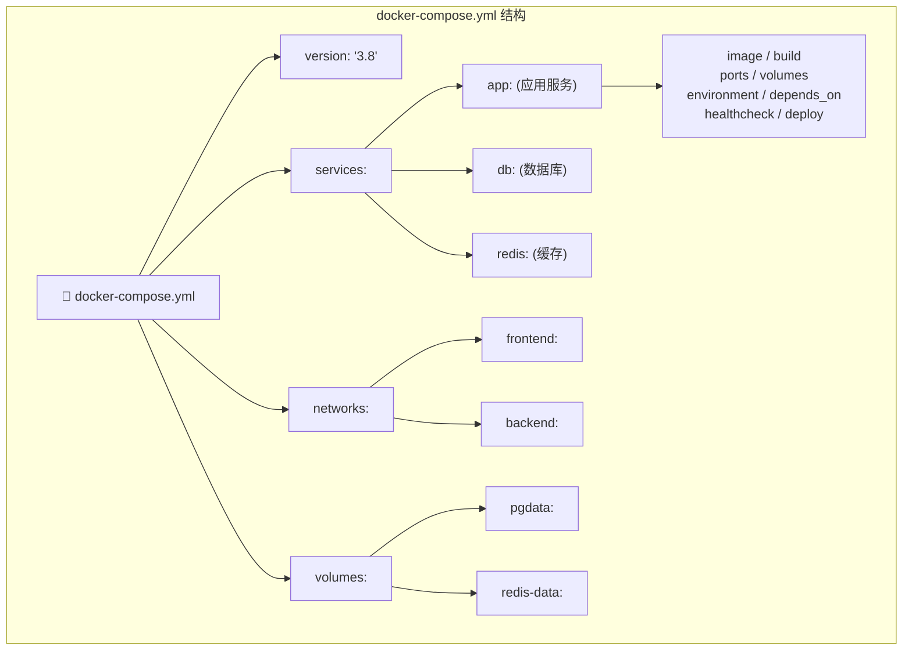

### 4.3 项目 docker-compose.yml 逐行分析

以下是一个完整的全栈应用 Docker Compose 配置：

```yaml
# ============================================================
# Docker Compose 配置文件
# 版本 3.8 支持大多数现代 Docker 特性
# 注意：Compose V2 不再强制要求 version 字段
# ============================================================

services:
  # ----------------------------------------------------------
  # Next.js 前端应用
  # ----------------------------------------------------------
  app:
    # 从当前目录的 Dockerfile 构建
    build:
      # 构建上下文（当前目录）
      context: .
      # 使用指定的 Dockerfile
      dockerfile: Dockerfile
      # 构建目标阶段（多阶段构建时指定）
      target: runner
      # 构建时的参数
      args:
        NODE_ENV: production
    # 容器名称（便于管理）
    container_name: nextjs-app
    # 重启策略：除非手动停止，否则总是重启
    restart: unless-stopped
    # 端口映射：主机 3000 → 容器 3000
    ports:
      - "3000:3000"
    # 环境变量
    environment:
      - NODE_ENV=production
      - DATABASE_URL=postgresql://postgres:secret@db:5432/mydb
      - REDIS_URL=redis://redis:6379
      - NEXTAUTH_SECRET=${NEXTAUTH_SECRET}
      - NEXTAUTH_URL=http://localhost:3000
    # 依赖的服务（会按顺序启动）
    depends_on:
      db:
        # 等数据库健康检查通过后才启动
        condition: service_healthy
      redis:
        condition: service_healthy
    # 加入的网络
    networks:
      - frontend
      - backend
    # 资源限制
    deploy:
      resources:
        limits:
          # 最多使用 512MB 内存
          memory: 512M
          # 最多使用 1 个 CPU
          cpus: "1.0"
        reservations:
          # 至少保留 256MB 内存
          memory: 256M
    # 健康检查
    healthcheck:
      # 检查命令
      test: ["CMD", "wget", "--spider", "-q", "http://localhost:3000/api/health"]
      # 检查间隔
      interval: 30s
      # 超时时间
      timeout: 10s
      # 启动等待时间（给应用足够的启动时间）
      start_period: 40s
      # 失败重试次数
      retries: 3
    # 安全配置
    security_opt:
      # 禁止容器内进程获取新权限
      - no-new-privileges:true
    # 只读根文件系统（提高安全性）
    read_only: true
    # 临时文件系统（需要写入的目录）
    tmpfs:
      - /tmp
      - /app/.next/cache
    # 日志配置
    logging:
      driver: "json-file"
      options:
        # 最大日志文件大小
        max-size: "10m"
        # 最多保留 3 个日志文件
        max-file: "3"

  # ----------------------------------------------------------
  # PostgreSQL 数据库
  # ----------------------------------------------------------
  db:
    # 使用官方 PostgreSQL 镜像
    image: postgres:16-alpine
    container_name: postgres-db
    restart: unless-stopped
    # 端口映射（只映射到 localhost，不暴露到外网）
    ports:
      - "127.0.0.1:5432:5432"
    # 环境变量
    environment:
      # 数据库超级用户密码
      POSTGRES_PASSWORD: ${DB_PASSWORD:-secret}
      # 创建的数据库名
      POSTGRES_DB: mydb
      # 创建的用户
      POSTGRES_USER: postgres
    # 数据卷（持久化数据库数据）
    volumes:
      # 命名卷：数据库数据
      - pgdata:/var/lib/postgresql/data
      # Bind mount：初始化脚本（只读）
      - ./init.sql:/docker-entrypoint-initdb.d/init.sql:ro
    # 加入的网络
    networks:
      - backend
    # 健康检查
    healthcheck:
      # 使用 pg_isready 检查数据库是否就绪
      test: ["CMD-SHELL", "pg_isready -U postgres"]
      interval: 10s
      timeout: 5s
      retries: 5
      start_period: 30s
    # 安全配置
    security_opt:
      - no-new-privileges:true
    # 资源限制
    deploy:
      resources:
        limits:
          memory: 1G
          cpus: "2.0"
    # 日志配置
    logging:
      driver: "json-file"
      options:
        max-size: "10m"
        max-file: "3"

  # ----------------------------------------------------------
  # Redis 缓存
  # ----------------------------------------------------------
  redis:
    image: redis:7-alpine
    container_name: redis-cache
    restart: unless-stopped
    ports:
      - "127.0.0.1:6379:6379"
    # Redis 启动命令（加上安全配置）
    command: >
      redis-server
      --requirepass ${REDIS_PASSWORD:-redis123}
      --maxmemory 256mb
      --maxmemory-policy allkeys-lru
      --appendonly yes
    volumes:
      - redis-data:/data
    networks:
      - backend
    healthcheck:
      test: ["CMD", "redis-cli", "-a", "${REDIS_PASSWORD:-redis123}", "ping"]
      interval: 10s
      timeout: 5s
      retries: 5
    deploy:
      resources:
        limits:
          memory: 512M
          cpus: "0.5"
    security_opt:
      - no-new-privileges:true
    read_only: true
    tmpfs:
      - /tmp

  # ----------------------------------------------------------
  # Nginx 反向代理
  # ----------------------------------------------------------
  nginx:
    image: nginx:alpine
    container_name: nginx-proxy
    restart: unless-stopped
    ports:
      - "80:80"
      - "443:443"
    volumes:
      # Nginx 配置文件
      - ./nginx/nginx.conf:/etc/nginx/nginx.conf:ro
      # SSL 证书
      - ./nginx/ssl:/etc/nginx/ssl:ro
      # 静态文件（如果有的话）
      - ./nginx/html:/usr/share/nginx/html:ro
    depends_on:
      - app
    networks:
      - frontend
    healthcheck:
      test: ["CMD", "nginx", "-t"]
      interval: 30s
      timeout: 5s
      retries: 3
    deploy:
      resources:
        limits:
          memory: 256M
          cpus: "0.5"

# ============================================================
# 网络定义
# ============================================================
networks:
  # 前端网络：Nginx 和应用之间
  frontend:
    driver: bridge
  # 后端网络：应用、数据库、Redis 之间
  backend:
    driver: bridge
    # 内部网络（不连接外网）
    internal: true

# ============================================================
# 数据卷定义
# ============================================================
volumes:
  # PostgreSQL 数据卷
  pgdata:
    driver: local
  # Redis 数据卷
  redis-data:
    driver: local
```

### 4.4 服务依赖关系

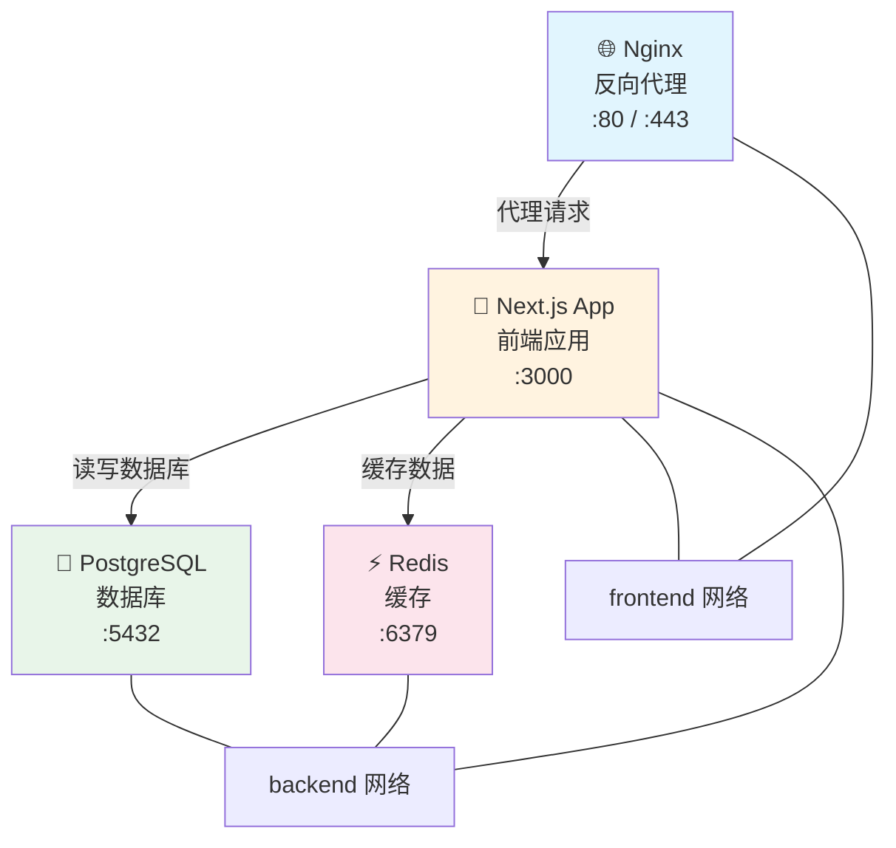

### 4.5 Docker Compose 常用命令

```bash
# 🐙 Docker Compose 命令速查

# 启动所有服务（后台运行）
docker compose up -d

# 启动并重新构建镜像
docker compose up -d --build

# 只启动指定服务
docker compose up -d app db

# 停止所有服务
docker compose down

# 停止并删除卷（⚠️ 数据会丢失）
docker compose down -v

# 停止并删除镜像
docker compose down --rmi all

# 查看服务状态
docker compose ps
# NAME            SERVICE   STATUS    PORTS
# nextjs-app      app       running   0.0.0.0:3000->3000/tcp
# postgres-db     db        running   127.0.0.1:5432->5432/tcp
# redis-cache     redis     running   127.0.0.1:6379->6379/tcp
# nginx-proxy     nginx     running   0.0.0.0:80->80/tcp

# 查看服务日志
docker compose logs -f app

# 查看所有服务日志
docker compose logs -f

# 在运行的服务中执行命令
docker compose exec app /bin/sh

# 执行一次性命令
docker compose run --rm app npm run test

# 重启某个服务
docker compose restart app

# 查看服务资源使用
docker compose top

# 拉取所有镜像
docker compose pull

# 推送所有镜像
docker compose push

# 验证配置文件语法
docker compose config

# 查看正在运行的进程
docker compose ps -a

# 暂停所有服务
docker compose pause

# 恢复暂停的服务
docker compose unpause

# 查看服务端口
docker compose port app 3000

# 列出正在运行的服务
docker compose ps --services
```

### 4.6 环境变量管理

```bash
# 📝 环境变量管理方式

# 方式一：使用 .env 文件（推荐）
# docker-compose.yml 中引用变量
# environment:
#   - DATABASE_URL=${DATABASE_URL}

# .env 文件
# DATABASE_URL=postgresql://user:pass@db:5432/mydb
# REDIS_URL=redis://redis:6379

# 方式二：使用 env_file
# 在 docker-compose.yml 中
# services:
#   app:
#     env_file:
#       - .env
#       - .env.local

# 方式三：使用 Docker Secrets（生产环境推荐）
# secrets:
#   db_password:
#     file: ./secrets/db_password.txt
# services:
#   db:
#     secrets:
#       - db_password

# 方式四：使用 shell 环境变量
# export DB_PASSWORD=secret
# docker compose up -d
```

### 4.7 多环境配置

```yaml
# docker-compose.override.yml（开发环境，自动加载）
services:
  app:
    build:
      target: development
    volumes:
      - .:/app
      - /app/node_modules
    environment:
      - NODE_ENV=development
    command: npx nodemon index.js

# docker-compose.prod.yml（生产环境，手动指定）
# docker compose -f docker-compose.yml -f docker-compose.prod.yml up -d
```

```yaml
# docker-compose.prod.yml
services:
  app:
    build:
      target: production
    environment:
      - NODE_ENV=production
    deploy:
      replicas: 3
      resources:
        limits:
          memory: 512M
          cpus: "1.0"
```

### 4.8 开发环境工作流

使用 Docker 进行开发时，最重要的需求是**热重载**——代码修改后容器自动更新，无需重新构建。

#### 4.8.1 Node.js 开发环境

```yaml
# docker-compose.dev.yml
services:
  app:
    build:
      context: .
      dockerfile: Dockerfile.dev
    volumes:
      # 挂载源代码（支持热重载）
      - .:/app
      # 匿名卷：保留容器内的 node_modules
      # 防止主机的 node_modules 覆盖容器的
      - /app/node_modules
    ports:
      - "3000:3000"
      # 调试端口
      - "9229:9229"
    environment:
      - NODE_ENV=development
    # 使用 nodemon 热重载
    command: npx nodemon --inspect=0.0.0.0:9229 index.js

  db:
    image: postgres:16-alpine
    ports:
      - "5432:5432"
    environment:
      POSTGRES_PASSWORD: devpass
      POSTGRES_DB: mydb_dev
    volumes:
      - pgdata-dev:/var/lib/postgresql/data

  redis:
    image: redis:7-alpine
    ports:
      - "6379:6379"

volumes:
  pgdata-dev:
```

```dockerfile
# Dockerfile.dev（开发专用）
FROM node:20-alpine

WORKDIR /app

# 安装开发工具
RUN apk add --no-cache git curl

# 安装依赖（包括 devDependencies）
COPY package*.json ./
RUN npm install

# 复制源代码（在 compose 中会被 volume 覆盖）
COPY . .

EXPOSE 3000 9229

# 开发模式启动
CMD ["npx", "nodemon", "--inspect=0.0.0.0:9229", "index.js"]
```

#### 4.8.2 Python 开发环境

```yaml
# docker-compose.dev.yml（Python Flask）
services:
  app:
    build:
      context: .
      dockerfile: Dockerfile.dev
    volumes:
      - .:/app
      - /app/.venv
    ports:
      - "5000:5000"
      - "5678:5678"  # debugpy 端口
    environment:
      - FLASK_ENV=development
      - FLASK_DEBUG=1
    command: python -m debugpy --listen 0.0.0.0:5678 --wait-for-client -m flask run --host=0.0.0.0 --reload
```

#### 4.8.3 开发 vs 生产 Compose 配置

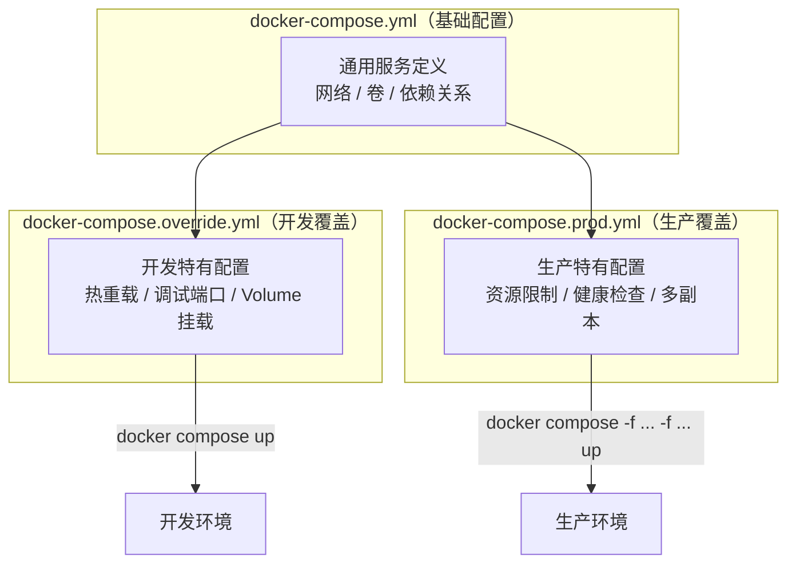

```bash
# 开发环境（自动加载 override）
docker compose up -d

# 生产环境（手动指定）
docker compose -f docker-compose.yml -f docker-compose.prod.yml up -d

# 测试环境
docker compose -f docker-compose.yml -f docker-compose.test.yml up -d
```

### 4.9 Docker Compose 网络配置详解

```yaml
services:
  # 前端服务：可以访问外网和后端服务
  frontend:
    networks:
      - public
      - internal
  
  # 后端服务：只能访问内部网络
  backend:
    networks:
      - internal
  
  # 数据库：只能访问内部网络
  db:
    networks:
      - internal
    # 只绑定到 localhost，不暴露到外网
    ports:
      - "127.0.0.1:5432:5432"

networks:
  # 公网网络
  public:
    driver: bridge
  # 内部网络（不连接外网）
  internal:
    driver: bridge
    internal: true
```

```mermaid
graph TB
    Internet["🌍 互联网"] --> Frontend
    subgraph "public 网络"
        Frontend["🖥️ Frontend"]
    end
    subgraph "internal 网络（隔离）"
        Backend["⚙️ Backend"]
        DB["🐘 Database"]
    end
    Frontend -->|"可以访问"| Backend
    Frontend -->|"可以访问"| DB
    Backend -->|"可以访问"| DB
    Internet -.->|"❌ 无法访问"| Backend
    Internet -.->|"❌ 无法访问"| DB
```

### 4.10 Docker Compose 扩展字段（x-）

使用 YAML 锚点和扩展字段减少重复配置：

```yaml
# 定义可复用的配置片段
x-common: &common-config
  restart: unless-stopped
  logging:
    driver: json-file
    options:
      max-size: "10m"
      max-file: "3"
  security_opt:
    - no-new-privileges:true

x-deploy-limits: &deploy-limits
  deploy:
    resources:
      limits:
        memory: 512M
        cpus: "1.0"

services:
  app:
    <<: *common-config
    <<: *deploy-limits
    build: .
    ports:
      - "3000:3000"

  api:
    <<: *common-config
    <<: *deploy-limits
    build: ./api
    ports:
      - "3001:3001"

  worker:
    <<: *common-config
    build: ./worker
    # worker 不需要端口映射
```

### 4.11 Docker Compose 配置验证与调试

```bash
# 🔧 Compose 配置调试

# 验证配置文件语法
docker compose config

# 查看解析后的完整配置（包含变量替换）
docker compose config --resolve-image-digests

# 查看服务依赖关系
docker compose config --services

# 模拟执行（不真正运行）
docker compose up -d --dry-run

# 查看将要执行的操作
docker compose up -d --remove-orphans

# 调试单个服务
docker compose run --rm app sh

# 查看服务的完整配置
docker compose config --format json | jq '.services.app'
```

---

## 5. 多阶段构建原理与优化

### 5.1 什么是多阶段构建？

多阶段构建允许你在一个 Dockerfile 中使用多个 `FROM` 指令，每个 `FROM` 开始一个新的构建阶段。最终镜像只包含最后一个阶段的内容。

```mermaid
graph LR
    subgraph "单阶段构建"
        A1["基础镜像"] --> A2["安装构建工具"]
        A2 --> A3["安装依赖"]
        A3 --> A4["编译代码"]
        A4 --> A5["最终镜像<br/>❌ 包含所有构建工具<br/>体积: 1.2GB"]
    end

    subgraph "多阶段构建"
        B1["阶段1: 构建环境"] --> B2["安装依赖"]
        B2 --> B3["编译代码"]
        B3 -->|"只复制产物"| B4["阶段2: 运行时<br/>✅ 只包含运行必需文件<br/>体积: 120MB"]
    end
```

### 5.2 多阶段构建示例

```mermaid
graph TB
    subgraph "阶段一：deps（依赖层）"
        D_FROM["FROM node:20-alpine AS deps"]
        D_PKG["COPY package*.json"]
        D_INSTALL["RUN npm ci"]
        D_FROM --> D_PKG --> D_INSTALL
    end

    subgraph "阶段二：builder（构建层）"
        B_FROM["FROM node:20-alpine AS builder"]
        B_DEPS["COPY --from=deps /app/node_modules"]
        B_SRC["COPY . ."]
        B_BUILD["RUN npm run build"]
        B_FROM --> B_DEPS --> B_SRC --> B_BUILD
    end

    subgraph "阶段三：runner（运行层）"
        R_FROM["FROM node:20-alpine AS runner"]
        R_USER["创建非 root 用户"]
        R_COPY["COPY --from=builder 构建产物"]
        R_CMD["CMD node server.js"]
        R_FROM --> R_USER --> R_COPY --> R_CMD
    end

    D_INSTALL -.->|"node_modules"| B_DEPS
    B_BUILD -.->|".next/standalone"| R_COPY
```

### 5.3 多阶段构建的变体

#### 开发环境和生产环境使用同一个 Dockerfile

```dockerfile
# 基础阶段（共享）
FROM node:20-alpine AS base
WORKDIR /app
COPY package*.json ./

# 依赖阶段
FROM base AS deps
RUN npm ci

# 开发阶段（包含 devDependencies）
FROM base AS development
COPY --from=deps /app/node_modules ./node_modules
COPY . .
# 开发时使用 nodemon 热重载
CMD ["npx", "nodemon", "index.js"]

# 构建阶段
FROM base AS builder
COPY --from=deps /app/node_modules ./node_modules
COPY . .
RUN npm run build

# 生产阶段（精简）
FROM node:20-alpine AS production
WORKDIR /app
# 只复制生产依赖
RUN npm ci --omit=dev
COPY --from=builder /app/dist ./dist
COPY --from=builder /app/package.json ./
USER node
CMD ["node", "dist/index.js"]
```

```bash
# 构建开发镜像
docker build --target development -t myapp:dev .

# 构建生产镜像
docker build --target production -t myapp:prod .
```

### 5.4 层缓存优化策略

```mermaid
graph TB
    subgraph "优化前（每次改代码都重新安装依赖）"
        B1["COPY . ."] -->|"所有文件都复制"| B2["RUN npm install"]
        B2 -->|"缓存失效！"| B3["重新下载所有依赖<br/>⏱️ 60秒"]
    end

    subgraph "优化后（先复制 package.json）"
        C1["COPY package*.json"] -->|"只复制依赖文件"| C2["RUN npm ci"]
        C2 -->|"依赖没变 = 缓存命中"| C3["⏩ 0秒跳过"]
        C3 --> C4["COPY . ."]
        C4 -->|"代码变了"| C5["RUN npm run build<br/>⏱️ 45秒"]
    end
```

**层缓存的黄金法则：**

| 顺序 | 指令 | 原因 |
|------|------|------|
| 1 | `FROM` | 基础镜像变化少 |
| 2 | `RUN apk add ...` | 系统依赖几乎不变 |
| 3 | `COPY package*.json` | 依赖文件变化少 |
| 4 | `RUN npm ci` | 依赖安装耗时长 |
| 5 | `COPY . .` | 代码变化最频繁 |
| 6 | `RUN npm run build` | 每次构建都可能不同 |

### 5.5 构建缓存进阶：BuildKit

```bash
# 启用 BuildKit（Docker 23.0+ 默认启用）
export DOCKER_BUILDKIT=1

# 使用外部缓存（CI/CD 场景）
docker build \
  --cache-from type=registry,ref=registry.example.com/myapp:cache \
  --cache-to type=registry,ref=registry.example.com/myapp:cache,mode=max \
  -t myapp:v1 .

# 使用挂载缓存（加速依赖安装）
# 在 Dockerfile 中：
# RUN --mount=type=cache,target=/root/.npm npm ci

# 并行构建（BuildKit 自动并行化无依赖的阶段）
docker build --progress=plain .

# 多平台构建
docker buildx build --platform linux/amd64,linux/arm64 -t myapp:v1 .

# 构建时使用 secrets（不泄露到镜像中）
docker buildx build --secret id=npmrc,src=.npmrc .
# 在 Dockerfile 中：
# RUN --mount=type=secret,id=npmrc,target=/app/.npmrc npm ci
```

### 5.6 多平台构建详解

多平台构建允许你用一条命令为多个 CPU 架构构建镜像，这对于支持 ARM 设备（如 Apple M1/M2、树莓派）非常重要。

```mermaid
graph LR
    subgraph "多平台构建"
        Source["源代码"] --> Buildx["Buildx 构建器"]
        Buildx --> AMD64["linux/amd64<br/>Intel/AMD"]
        Buildx --> ARM64["linux/arm64<br/>ARM/M1/M2"]
        Buildx --> ARMv7["linux/arm/v7<br/>树莓派"]
        AMD64 --> Registry["镜像仓库<br/>多架构清单"]
        ARM64 --> Registry
        ARMv7 --> Registry
    end
```

```bash
# 🔧 多平台构建实战

# 1. 创建 Buildx 构建器
docker buildx create --name mybuilder --use
docker buildx inspect --bootstrap

# 2. 查看支持的平台
docker buildx ls

# 3. 构建多平台镜像
docker buildx build \
  --platform linux/amd64,linux/arm64 \
  -t myapp:v1 \
  --push .

# 4. 构建并加载到本地（不支持多架构，只能指定一个平台）
docker buildx build \
  --platform linux/amd64 \
  -t myapp:v1 \
  --load .

# 5. 使用 QEMU 模拟其他架构（较慢，但不需要物理设备）
# QEMU 会自动安装

# 6. 查看镜像支持的平台
docker buildx imagetools inspect myapp:v1
# Manifests:
#   Name: myapp:v1@sha256:abc...
#   Platform: linux/amd64
#   Name: myapp:v1@sha256:def...
#   Platform: linux/arm64
```

**Dockerfile 多平台兼容写法：**

```dockerfile
# 支持多平台的 Dockerfile
FROM --platform=$BUILDPLATFORM node:20-alpine AS builder

# $BUILDPLATFORM 是构建机器的平台
# $TARGETPLATFORM 是目标平台

ARG TARGETPLATFORM
ARG BUILDPLATFORM

WORKDIR /app
copy package*.json ./
run npm ci
copy . .
run npm run build

FROM --platform=$TARGETPLATFORM node:20-alpine AS runner

# 在目标平台上运行
WORKDIR /app
copy --from=builder /app .
USER node
CMD ["node", "index.js"]
```

---

## 6. 容器网络模式

### 6.1 Docker 网络架构概览

```mermaid
graph TB
    subgraph "Docker 主机"
        subgraph "网络驱动"
            Bridge["🌉 Bridge<br/>默认网络模式"]
            Host["🖥️ Host<br/>共享主机网络"]
            None["🚫 None<br/>无网络"]
            Overlay["🌐 Overlay<br/>跨主机通信"]
            Macvlan["🔌 Macvlan<br/>独立 MAC 地址"]
        end

        subgraph "容器网络"
            C1["容器 A"] --- Bridge
            C2["容器 B"] --- Bridge
            C3["容器 C"] --- Host
            C4["容器 D"] --- None
            C5["容器 E"] --- Overlay
            C6["容器 F"] --- Overlay
        end
    end

    Internet["🌍 互联网"] --- Bridge
    Internet --- Host
    Overlay ---|"跨主机通信"| Docker2["另一台 Docker 主机"]
```

### 6.2 网络模式对比

| 特性 | Bridge（桥接） | Host（主机） | None（无网络） | Overlay（覆盖） |
|------|---------------|-------------|---------------|----------------|
| **隔离性** | 中等 | 无 | 完全隔离 | 中等 |
| **性能** | 好 | 最好 | 无网络 | 较好 |
| **端口映射** | 需要 `-p` | 不需要 | 无 | 需要 |
| **跨主机通信** | ❌ | ❌ | ❌ | ✅ |
| **适用场景** | 单机多容器 | 高性能网络 | 安全隔离 | 集群/编排 |
| **容器看到的 IP** | 容器自己的 IP | 主机 IP | 无 IP | 虚拟 IP |
| **DNS 解析** | ✅ 自动 | ❌ | ❌ | ✅ 自动 |
| **默认创建** | ✅（docker0） | ✅ | ✅ | ❌（需手动） |

### 6.3 Bridge 网络详解

```mermaid
graph TB
    subgraph "Bridge 网络（默认）"
        Internet["🌍 互联网"] --> Docker0["docker0 虚拟网桥<br/>172.17.0.1"]
        
        Docker0 -->|"veth pair"| C1["容器 A<br/>172.17.0.2<br/>端口映射: 8080→80"]
        Docker0 -->|"veth pair"| C2["容器 B<br/>172.17.0.3<br/>端口映射: 8081→3000"]
        Docker0 -->|"veth pair"| C3["容器 C<br/>172.17.0.4"]
        
        C1 -.->|"通过 bridge 通信"| C2
        C2 -.->|"通过 bridge 通信"| C3
    end
```

```bash
# 🌉 Bridge 网络实战

# 默认 bridge 网络（容器之间可以用 IP 通信，但不能用容器名）
docker run -d --name web nginx
docker run -d --name app myapp

# 自定义 bridge 网络（推荐！支持 DNS 解析）
docker network create my-bridge
docker run -d --name web --network my-bridge nginx
docker run -d --name app --network my-bridge myapp
# 现在 app 可以用 "web" 作为主机名访问 nginx

# 查看容器的网络信息
docker inspect web --format '{{json .NetworkSettings.Networks}}' | jq

# 测试容器间的 DNS 解析
docker exec app ping web
# PING web (172.18.0.2): 56 data bytes
# 64 bytes from 172.18.0.2: seq=0 ttl=64 time=0.098 ms

# 测试容器间的端口访问
docker exec app curl http://web:80
```

### 6.4 Host 网络详解

```mermaid
graph TB
    subgraph "Host 网络"
        Host["🖥️ 主机网络栈<br/>IP: 192.168.1.100"] --- C1["容器 A<br/>直接使用主机网络<br/>端口: 80"]
        Host --- C2["容器 B<br/>直接使用主机网络<br/>端口: 3000"]
    end
```

```bash
# 🖥️ Host 网络实战
docker run -d --network host nginx
# Nginx 直接监听主机的 80 端口，不需要 -p 参数
# 注意：如果主机 80 端口已被占用，容器会启动失败
```

**Host 网络的优缺点：**

| 优点 | 缺点 |
|------|------|
| 性能最好（无 NAT 开销） | 端口冲突风险 |
| 不需要端口映射 | 隔离性差 |
| 适合高性能网络应用 | 不能在 Docker Desktop (Mac/Windows) 使用 |

### 6.5 None 网络详解

```bash
# 🚫 None 网络（完全隔离）
docker run -d --network none alpine sleep 3600
docker exec <container_id> ip addr
# 只有 lo（回环）接口，没有外部网络
```

**适用场景：**
- 安全敏感的计算任务（如密码学运算）
- 不需要网络的批处理任务
- 作为安全基线

### 6.6 Overlay 网络详解

```mermaid
graph TB
    subgraph "主机 1"
        Docker1["Docker Engine 1"]
        C1["容器 A<br/>10.0.0.2"] --- Docker1
        C2["容器 B<br/>10.0.0.3"] --- Docker1
    end

    subgraph "主机 2"
        Docker2["Docker Engine 2"]
        C3["容器 C<br/>10.0.0.4"] --- Docker2
        C4["容器 D<br/>10.0.0.5"] --- Docker2
    end

    Docker1 ===|"Overlay 网络<br/>（VXLAN 隧道）"| Docker2

    C1 -.->|"跨主机通信"| C3
```

```bash
# 🌐 Overlay 网络实战（需要 Swarm 模式）

# 初始化 Swarm
docker swarm init

# 创建 Overlay 网络
docker network create --driver overlay my-overlay

# 在 Overlay 网络中部署服务
docker service create \
  --name web \
  --network my-overlay \
  --replicas 3 \
  nginx
```

### 6.7 Macvlan 网络

```bash
# 🔌 Macvlan 网络（容器获得独立的 MAC 和 IP 地址）

# 创建 Macvlan 网络
docker network create -d macvlan \
  --subnet=192.168.1.0/24 \
  --gateway=192.168.1.1 \
  -o parent=eth0 \
  my-macvlan

# 运行容器
docker run -d --network my-macvlan --ip 192.168.1.100 nginx

# 容器会获得 192.168.1.100 这个 IP，就像一台独立的机器
```

### 6.8 网络模式选择指南

```mermaid
flowchart TD
    Start["需要容器网络吗？"] -->|否| None["🚫 None<br/>完全隔离"]
    Start -->|是| Multi["需要跨主机通信？"]
    Multi -->|是| Overlay["🌐 Overlay<br/>集群通信"]
    Multi -->|否| Perf["需要最高网络性能？"]
    Perf -->|是| Host["🖥️ Host<br/>无 NAT 开销"]
    Perf -->|否| Macvlan["需要独立 IP？"]
    Macvlan -->|是| MV["🔌 Macvlan<br/>独立 MAC/IP"]
    Macvlan -->|否| Bridge["🌉 Bridge（推荐）<br/>安全且灵活"]
```

### 6.9 Docker 内置 DNS 服务

```bash
# 🔍 Docker 内置 DNS 详解

# 自定义网络中的容器可以通过服务名互相访问
docker network create my-net
docker run -d --name db --network my-net postgres:16-alpine
docker run -d --name app --network my-net myapp

# app 容器可以直接用 "db" 作为主机名
# 等价于连接到 db 容器的 IP 地址

# 查看 DNS 解析
docker exec app nslookup db
# Name:      db
# Address 1: 172.18.0.2

# 自定义 DNS 记录（使用 --add-host）
docker run -d --add-host myhost:192.168.1.100 myapp
```

### 6.10 端口映射详解

端口映射是容器与外部世界通信的桥梁。

```mermaid
graph LR
    subgraph "主机 192.168.1.100"
        Host80[":80"] -->|"映射"| C80["容器 :80"]
        Host3000[":3000"] -->|"映射"| C3000["容器 :3000"]
        Host5432["localhost:5432"] -->|"映射"| C5432["容器 :5432"]
    end
    
    Internet["🌍 外部访问"] --> Host80
    Internet --> Host3000
    Localhost["🖥️ 本机访问"] --> Host5432
```

```bash
# 🔌 端口映射各种形式

# 基本映射：主机端口 → 容器端口
docker run -p 8080:80 nginx

# 绑定到特定 IP（只允许本机访问）
docker run -p 127.0.0.1:8080:80 nginx

# 绑定到特定网卡
docker run -p 192.168.1.100:8080:80 nginx

# 随机端口映射
docker run -P nginx
# Docker 会随机分配主机端口

# 映射 UDP 端口
docker run -p 5353:53/udp dns-server

# 同时映射 TCP 和 UDP
docker run -p 5353:53/tcp -p 5353:53/udp dns-server

# 映射多个端口
docker run -p 80:80 -p 443:443 nginx

# 映射端口范围
docker run -p 8080-8090:8080-8090 myapp

# 查看端口映射
docker port my-container
# 80/tcp -> 0.0.0.0:8080

# 查看所有容器的端口映射
docker ps --format "{{.Names}}: {{.Ports}}"
```

**端口映射安全注意事项：**

| 配置 | 安全级别 | 说明 |
|------|---------|------|
| `-p 8080:80` | 🔴 低 | 所有网卡都可以访问 |
| `-p 127.0.0.1:8080:80` | 🟢 高 | 只有本机可以访问 |
| `-p 192.168.1.100:8080:80` | 🟡 中 | 只有指定网卡可以访问 |

### 6.11 容器间通信

```bash
# 🔗 容器间通信实战

# 方式一：使用自定义网络（推荐）
docker network create app-net
docker run -d --name web --network app-net nginx
docker run -d --name api --network app-net myapi
# api 容器可以直接用 "web" 作为主机名访问 nginx
docker exec api curl http://web:80

# 方式二：使用 links（已过时，不推荐）
docker run -d --name web nginx
docker run -d --name api --link web:web myapi
# 不推荐：links 是遗留功能，应该用自定义网络

# 方式三：共享网络命名空间
docker run -d --name web nginx
docker run -d --name api --network container:web myapi
# api 和 web 共享网络栈，api 可以用 localhost 访问 web
```

### 6.12 网络故障排查

```bash
# 🔧 网络故障排查

# 1. 检查容器网络配置
docker inspect my-container --format '{{json .NetworkSettings.Networks}}'

# 2. 检查容器 IP
docker inspect -f '{{range.NetworkSettings.Networks}}{{.IPAddress}}{{end}}' my-container

# 3. 测试容器间连通性
docker exec container-a ping container-b

# 4. 测试 DNS 解析
docker exec container-a nslookup container-b

# 5. 测试端口访问
docker exec container-a curl http://container-b:80

# 6. 查看网络列表
docker network ls

# 7. 查看网络详情
docker network inspect my-network

# 8. 查看哪些容器在网络中
docker network inspect my-network --format '{{range .Containers}}{{.Name}} {{end}}'

# 9. 在容器内查看网络配置
docker exec my-container ip addr
# 或
docker exec my-container ifconfig

# 10. 在容器内查看路由表
docker exec my-container ip route

# 11. 在容器内查看 DNS 配置
docker exec my-container cat /etc/resolv.conf

# 12. 查看 iptables 规则（需要 root）
sudo iptables -L -n -t nat

# 13. 查看 Docker 创建的网桥
brctl show
# 或
ip link show type bridge

# 14. 抓包分析（需要安装 tcpdump）
docker exec my-container tcpdump -i eth0 -nn
```

### 6.13 网络性能优化

| 优化项 | 方法 | 效果 |
|--------|------|------|
| 使用 host 网络 | `--network host` | 消除 NAT 开销 |
| 使用自定义网络 | `docker network create` | DNS 解析更快 |
| 减少网络跳数 | 同一网络通信 | 减少延迟 |
| 使用 macvlan | 直接桥接物理网络 | 最接近原生性能 |
| 调整 MTU | `--opt com.docker.network.driver.mtu=1500` | 优化大包传输 |

---

## 7. 数据卷管理

### 7.1 为什么需要数据卷？

容器是**临时的**——当容器被删除时，容器内的所有数据都会丢失。数据卷提供了**持久化存储**。

```mermaid
graph TB
    subgraph "没有数据卷"
        C1["容器运行中<br/>✅ 数据在"] -->|"容器删除"| C2["数据丢失！<br/>❌"]
    end

    subgraph "使用数据卷"
        C3["容器运行中"] -->|"读写"| V["💾 数据卷<br/>数据持久化"]
        C3 -->|"容器删除"| C4["容器没了"]
        C4 -->|"数据还在"| V
        V -->|"新容器启动"| C5["新容器<br/>✅ 继续使用数据"]
    end
```

### 7.2 Volumes vs Bind Mounts

Docker 提供两种主要的数据挂载方式：

```mermaid
graph TB
    subgraph "Volume（命名卷）"
        Docker["Docker 管理"] --> Vol["💾 pgdata<br/>/var/lib/docker/volumes/pgdata/_data"]
        Vol -->|"挂载"| CV["容器<br/>/var/lib/postgresql/data"]
    end

    subgraph "Bind Mount（绑定挂载）"
        Host["主机目录<br/>/home/user/app/html"] -->|"直接映射"| CB["容器<br/>/usr/share/nginx/html"]
    end
```

| 特性 | Volume（命名卷） | Bind Mount（绑定挂载） |
|------|-----------------|----------------------|
| **管理方** | Docker 管理 | 用户管理 |
| **位置** | `/var/lib/docker/volumes/` | 用户指定的任意路径 |
| **可移植性** | ✅ 高（不依赖主机路径） | ❌ 低（依赖主机路径） |
| **备份** | `docker volume` 命令 | 手动备份 |
| **性能** | Linux 上几乎相同 | Linux 上几乎相同 |
| **适合场景** | 数据库数据、应用数据 | 开发时挂载源码、配置文件 |
| **权限** | Docker 管理 | 需要手动处理 |
| **预填充** | 可以用 Dockerfile 预填充 | 直接使用主机文件 |
| **初始化** | 首次挂载时复制容器内容 | 覆盖容器内容 |

### 7.3 三种挂载类型对比

```mermaid
graph LR
    subgraph "Volume"
        V1["Docker 管理的存储"]
    end
    subgraph "Bind Mount"
        V2["主机文件系统路径"]
    end
    subgraph "tmpfs"
        V3["内存中的临时存储"]
    end
```

| 特性 | Volume | Bind Mount | tmpfs |
|------|--------|------------|-------|
| 存储位置 | Docker 管理 | 主机文件系统 | 内存 |
| 持久性 | ✅ 持久 | ✅ 持久 | ❌ 临时 |
| 容器删除后 | 数据保留 | 数据保留 | 数据丢失 |
| 性能 | 好 | 好 | 最快 |
| 适用场景 | 数据库数据 | 开发源码 | 敏感临时数据 |

### 7.4 数据卷实战

```bash
# 💾 Volume 实战

# 创建命名卷
docker volume create pgdata

# 使用命名卷运行 PostgreSQL
docker run -d \
  --name postgres \
  -v pgdata:/var/lib/postgresql/data \
  -e POSTGRES_PASSWORD=secret \
  postgres:16-alpine

# 查看卷信息
docker volume inspect pgdata
# [
#   {
#     "CreatedAt": "2024-01-15T10:30:00Z",
#     "Driver": "local",
#     "Mountpoint": "/var/lib/docker/volumes/pgdata/_data",
#     "Name": "pgdata",
#     "Options": {},
#     "Scope": "local"
#   }
# ]

# 列出所有卷
docker volume ls

# 删除未使用的卷
docker volume prune

# ⚠️ 危险：删除指定卷（数据会丢失）
docker volume rm pgdata


# 📂 Bind Mount 实战

# 挂载当前目录的 html 文件夹到 nginx
docker run -d \
  --name web \
  -v $(pwd)/html:/usr/share/nginx/html:ro \
  nginx:alpine
# :ro 表示只读（容器不能修改主机文件）

# 挂载单个文件（如配置文件）
docker run -d \
  --name nginx \
  -v $(pwd)/nginx.conf:/etc/nginx/nginx.conf:ro \
  nginx:alpine

# 开发环境：挂载源代码目录（支持热重载）
docker run -d \
  --name dev \
  -v $(pwd):/app \
  -v /app/node_modules \
  -p 3000:3000 \
  node:20 \
  npx nodemon index.js
# -v /app/node_modules 是匿名卷，防止主机的 node_modules 覆盖容器的
```

### 7.5 数据卷高级用法

```bash
# 🔧 高级用法

# 使用 tmpfs 挂载（内存中的临时文件系统，容器停止后数据消失）
docker run -d \
  --name cache \
  --tmpfs /tmp:rw,size=100m,mode=1777 \
  redis:alpine

# 只读容器 + tmpfs
docker run -d \
  --name secure-app \
  --read-only \
  --tmpfs /tmp \
  --tmpfs /app/cache \
  myapp:v1

# 使用 NFS 卷（网络存储）
docker volume create \
  --driver local \
  --opt type=nfs \
  --opt o=addr=192.168.1.100,rw \
  --opt device=:/path/to/dir \
  nfs-data

# 使用 Docker Compose 定义卷
# docker-compose.yml
# volumes:
#   pgdata:
#     driver: local
#   shared-files:
#     driver: local
#     driver_opts:
#       type: nfs
#       o: addr=192.168.1.100,rw
#       device: /path/to/dir
```

### 7.6 数据备份与恢复

```bash
# 📦 数据卷备份

# 方法一：通过临时容器备份
docker run --rm \
  -v pgdata:/source:ro \
  -v $(pwd):/backup \
  alpine \
  tar czf /backup/pgdata-backup-$(date +%Y%m%d).tar.gz -C /source .

# 方法二：通过运行中的容器备份（PostgreSQL）
docker exec postgres pg_dump -U postgres mydb > backup.sql

# 方法三：备份所有卷
for vol in $(docker volume ls -q); do
  docker run --rm \
    -v $vol:/source:ro \
    -v $(pwd):/backup \
    alpine \
    tar czf /backup/${vol}-$(date +%Y%m%d).tar.gz -C /source .
done

# 📥 数据卷恢复

# 方法一：恢复到新卷
docker volume create pgdata-restored
docker run --rm \
  -v pgdata-restored:/target \
  -v $(pwd):/backup \
  alpine \
  tar xzf /backup/pgdata-backup-20240115.tar.gz -C /target

# 方法二：恢复 PostgreSQL
docker exec -i postgres psql -U postgres mydb < backup.sql
```

### 7.7 数据卷生命周期管理

```mermaid
graph LR
    Create["docker volume create"] --> Use["docker run -v vol:/path"]
    Use --> Inspect["docker volume inspect"]
    Inspect --> Backup["备份数据"]
    Backup --> Prune["docker volume prune"]
    Prune --> Remove["docker volume rm"]
```

### 7.8 数据库数据卷最佳实践

不同数据库对数据卷有不同的要求：

```yaml
# 📋 各数据库的 Volume 配置

services:
  # PostgreSQL
  postgres:
    image: postgres:16-alpine
    volumes:
      # 数据目录（必须持久化）
      - pgdata:/var/lib/postgresql/data
      # 初始化脚本（只读）
      - ./init.sql:/docker-entrypoint-initdb.d/init.sql:ro
      # 自定义配置（只读）
      - ./postgresql.conf:/etc/postgresql/postgresql.conf:ro
    command: postgres -c config_file=/etc/postgresql/postgresql.conf

  # MySQL
  mysql:
    image: mysql:8.0
    volumes:
      # 数据目录
      - mysqldata:/var/lib/mysql
      # 自定义配置
      - ./my.cnf:/etc/mysql/conf.d/custom.cnf:ro
      # 初始化脚本
      - ./init.sql:/docker-entrypoint-initdb.d/init.sql:ro

  # MongoDB
  mongo:
    image: mongo:7
    volumes:
      - mongodata:/data/db
      # 自定义配置
      - ./mongod.conf:/etc/mongod.conf:ro
    command: mongod --config /etc/mongod.conf

  # Redis
  redis:
    image: redis:7-alpine
    volumes:
      - redisdata:/data
      # 自定义配置
      - ./redis.conf:/usr/local/etc/redis/redis.conf:ro
    command: redis-server /usr/local/etc/redis/redis.conf

  # Elasticsearch
  elasticsearch:
    image: elasticsearch:8.12.0
    volumes:
      - esdata:/usr/share/elasticsearch/data
    environment:
      - discovery.type=single-node
      - xpack.security.enabled=false

volumes:
  pgdata:
  mysqldata:
  mongodata:
  redisdata:
  esdata:
```

**各数据库数据目录：**

| 数据库 | 默认数据目录 | 备份命令 |
|--------|------------|----------|
| PostgreSQL | `/var/lib/postgresql/data` | `pg_dump` |
| MySQL | `/var/lib/mysql` | `mysqldump` |
| MongoDB | `/data/db` | `mongodump` |
| Redis | `/data` | `BGSAVE` |
| Elasticsearch | `/usr/share/elasticsearch/data` | Snapshot API |

### 7.9 自动化备份脚本

```bash
#!/bin/bash
# 📦 Docker 数据卷自动化备份脚本

# 配置
BACKUP_DIR="/backups/docker"
DATE=$(date +%Y%m%d_%H%M%S)
RETENTION_DAYS=7

# 创建备份目录
mkdir -p $BACKUP_DIR

# 备份 PostgreSQL
echo "[$DATE] 开始备份 PostgreSQL..."
docker exec postgres pg_dump -U postgres mydb | \
  gzip > $BACKUP_DIR/postgres_$DATE.sql.gz

# 备份 Redis
echo "[$DATE] 开始备份 Redis..."
docker exec redis redis-cli BGSAVE
docker cp redis:/data/dump.rdb $BACKUP_DIR/redis_$DATE.rdb

# 备份 MongoDB
echo "[$DATE] 开始备份 MongoDB..."
docker exec mongo mongodump --archive --gzip > \
  $BACKUP_DIR/mongo_$DATE.archive.gz

# 备份所有数据卷
echo "[$DATE] 开始备份数据卷..."
for vol in $(docker volume ls -q); do
  docker run --rm \
    -v $vol:/source:ro \
    -v $BACKUP_DIR:/backup \
    alpine \
    tar czf /backup/vol_${vol}_$DATE.tar.gz -C /source .
done

# 清理过期备份
echo "[$DATE] 清理 ${RETENTION_DAYS} 天前的备份..."
find $BACKUP_DIR -name "*.gz" -mtime +$RETENTION_DAYS -delete
find $BACKUP_DIR -name "*.rdb" -mtime +$RETENTION_DAYS -delete

echo "[$DATE] 备份完成！"

# 配置 crontab（每天凌晨 3 点执行）
# 0 3 * * * /path/to/backup.sh >> /var/log/docker-backup.log 2>&1
```

### 7.10 数据卷性能优化

| 优化项 | 方法 | 效果 |
|--------|------|------|
| 使用 tmpfs | 临时数据放内存 | 最快 IO |
| 绑定到 SSD | 挂载到 SSD 分区 | 更快的读写 |
| 使用本地 SSD 卷 | `--opt type=none --opt device=/ssd/path` | 高性能存储 |
| 避免小文件 | 批量写入 | 减少 IO 开销 |
| 使用 NFS | 网络存储 | 跨主机共享 |
| 监控 IO | `iostat` / `docker stats` | 发现瓶颈 |

```bash
# 🔍 数据卷性能测试

# 测试写入速度
docker run --rm -v test-vol:/data alpine \
  sh -c "dd if=/dev/zero of=/data/test bs=1M count=100"

# 测试读取速度
docker run --rm -v test-vol:/data:ro alpine \
  sh -c "dd if=/data/test of=/dev/null bs=1M"

# 清理测试数据
docker volume rm test-vol
```

---

## 8. 安全配置详解

### 8.1 容器安全全景

```mermaid
graph TB
    subgraph "容器安全层次"
        L1["🖼️ 镜像安全<br/>扫描漏洞、最小基础镜像"]
        L2["🔒 运行时安全<br/>Seccomp、Capabilities、Namespace"]
        L3["👤 用户安全<br/>non-root、UID 映射"]
        L4["🔐 权限安全<br/>no-new-privileges、read-only"]
        L5["🌐 网络安全<br/>内部网络、端口限制"]
        L6["💾 存储安全<br/>加密卷、只读挂载"]
    end

    L1 --> L2 --> L3 --> L4 --> L5 --> L6
```

### 8.2 Seccomp（安全计算模式）

Seccomp（Secure Computing Mode）可以限制容器内进程能调用的系统调用（syscall）。

**什么是系统调用？**

当你在程序中读取文件、创建进程、发送网络请求时，最终都会调用 Linux 内核的系统调用。Docker 默认的 Seccomp 配置禁止了约 44 个危险的系统调用。

```mermaid
graph LR
    App["应用程序"] -->|"调用"| Syscall["系统调用<br/>read/write/open/..."]
    Syscall -->|"过滤"| Seccomp["🔒 Seccomp 过滤器"]
    Seccomp -->|"允许"| Kernel["Linux 内核"]
    Seccomp -->|"拒绝"| Denied["❌ Operation not permitted"]
```

**攻击场景：**

> 假设攻击者通过应用漏洞获得了容器内的 shell。如果没有 Seccomp 限制，攻击者可以：
> - `mount`：挂载宿主机文件系统，读取敏感数据
> - `reboot`：重启宿主机
> - `kexec_load`：加载新的内核
> - `ptrace`：调试其他进程，窃取信息
>
> 有了 Seccomp，这些危险调用都会被拒绝。

**被 Docker 默认阻止的危险系统调用：**

| 系统调用 | 风险 | 说明 |
|---------|------|------|
| `mount` | 🔴 高 | 挂载文件系统 |
| `umount2` | 🔴 高 | 卸载文件系统 |
| `reboot` | 🔴 高 | 重启系统 |
| `kexec_load` | 🔴 高 | 加载新内核 |
| `ptrace` | 🔴 高 | 调试进程 |
| `bpf` | 🟡 中 | BPF 程序操作 |
| `userfaultfd` | 🟡 中 | 用户态页错误处理 |
| `keyctl` | 🟡 中 | 内核密钥管理 |
| `swapon/swapoff` | 🟡 中 | 交换空间管理 |

```bash
# 🔒 Seccomp 实战

# 使用自定义 Seccomp 配置文件
docker run --security-opt seccomp=custom-profile.json myapp

# 查看 Docker 默认的 Seccomp 配置
wget https://raw.githubusercontent.com/moby/moby/master/profiles/seccomp/default.json

# 禁用 Seccomp（⚠️ 非常危险，仅用于调试）
docker run --security-opt seccomp=unconfined myapp

# 自定义 Seccomp 配置示例
cat > custom-seccomp.json << 'EOF'
{
  "defaultAction": "SCMP_ACT_ERRNO",
  "architectures": ["SCMP_ARCH_X86_64"],
  "syscalls": [
    {
      "names": ["read", "write", "open", "close", "stat", "fstat",
                "mmap", "mprotect", "munmap", "brk", "ioctl",
                "access", "pipe", "select", "sched_yield",
                "dup", "dup2", "nanosleep", "getpid",
                "socket", "connect", "accept", "sendto",
                "recvfrom", "sendmsg", "recvmsg", "shutdown",
                "bind", "listen", "getsockname", "getpeername",
                "clone", "fork", "vfork", "execve",
                "exit", "wait4", "kill", "uname",
                "fcntl", "flock", "fsync", "fdatasync",
                "truncate", "ftruncate", "getdents",
                "getcwd", "chdir", "rename", "mkdir",
                "rmdir", "link", "unlink", "symlink",
                "readlink", "chmod", "chown", "lchown",
                "umask", "gettimeofday", "getuid", "getgid",
                "geteuid", "getegid", "getppid", "getpgrp",
                "setsid", "setuid", "setgid", "getgroups",
                "setgroups", "setreuid", "setregid",
                "sigaltstack", "rt_sigaction", "rt_sigprocmask",
                "pread64", "pwrite64", "readv", "writev",
                "setitimer", "getrusage", "getrlimit",
                "sysinfo", "times", "futex", "epoll_create",
                "epoll_wait", "epoll_ctl", "clock_gettime",
                "exit_group", "epoll_create1", "pipe2",
                "preadv", "pwritev", "epoll_pwait",
                "clock_getres", "clock_nanosleep",
                "mlock", "munlock", "mlockall", "munlockall",
                "newfstatat", "close_range", "epoll_ctl_old",
                "epoll_wait_old", "statx", "rseq"],
      "action": "SCMP_ACT_ALLOW"
    }
  ]
}
EOF
```

### 8.3 Linux Capabilities

Linux Capabilities 将 root 的超级权限拆分为细粒度的能力，让你可以只授予容器所需的最小权限。

**常见 Capabilities：**

| Capability | 说明 | 是否需要 |
|-----------|------|----------|
| `CHOWN` | 改变文件所有者 | 通常不需要 |
| `DAC_OVERRIDE` | 绕过文件访问检查 | 通常不需要 |
| `FSETID` | 设置 setuid/setgid 位 | 通常不需要 |
| `FOWNER` | 绕过文件所有者检查 | 通常不需要 |
| `MKNOD` | 创建设备文件 | 通常不需要 |
| `NET_RAW` | 使用原始套接字 | ping 需要，通常不需要 |
| `SETGID` | 改变 GID | 通常不需要 |
| `SETUID` | 改变 UID | 通常不需要 |
| `SETFCAP` | 设置文件 capabilities | 通常不需要 |
| `NET_BIND_SERVICE` | 绑定 1024 以下端口 | Web 服务需要 |
| `SYS_CHROOT` | 使用 chroot | 通常不需要 |
| `KILL` | 发送信号 | 通常不需要 |
| `AUDIT_WRITE` | 写审计日志 | 数据库可能需要 |
| `SYS_PTRACE` | 调试进程 | 调试时需要 |
| `SYS_ADMIN` | 系统管理操作 | 🔴 危险，几乎不需要 |

**攻击场景：**

> 假设容器以 root 运行且保留了所有 Capabilities：
> - `NET_RAW`：攻击者可以进行 ARP 欺骗，劫持同网络其他容器的流量
> - `SYS_ADMIN`：攻击者可以挂载文件系统、修改内核参数
> - `DAC_OVERRIDE`：攻击者可以读写任何文件，绕过权限检查
>
> 通过 `--cap-drop ALL` 丢弃所有能力，然后只添加必要的，可以大幅降低风险。

```bash
# 🔒 Capabilities 实战

# 查看容器的 capabilities
docker run --rm alpine cat /proc/1/status | grep Cap

# 丢弃所有 capabilities，只添加需要的
docker run --cap-drop ALL --cap-add NET_BIND_SERVICE nginx

# Docker 默认保留的 capabilities（14个）
# CHOWN, DAC_OVERRIDE, FSETID, FOWNER, MKNOD, NET_RAW,
# SETGID, SETUID, SETFCAP, SETPCAP, NET_BIND_SERVICE,
# SYS_CHROOT, KILL, AUDIT_WRITE

# 推荐：丢弃所有，按需添加
docker run -d \
  --cap-drop ALL \
  --cap-add NET_BIND_SERVICE \
  -p 80:80 \
  nginx
```

### 8.4 Non-Root 用户

**攻击场景：**

> 容器默认以 root 运行（UID 0）。如果攻击者突破应用层，获得容器内的 shell：
> - 以 root 身份可以安装恶意软件
> - 可以修改容器内的文件
> - 如果容器有挂载卷，可以篡改主机文件
> - 在某些配置下甚至可以逃逸到宿主机
>
> 使用非 root 用户运行，即使被攻破，攻击者的权限也非常有限。

```dockerfile
# 🔒 Non-root 用户配置

# 方式一：在 Dockerfile 中创建用户
FROM node:20-alpine
# 创建系统组和用户
RUN addgroup --system --gid 1001 appgroup && \
    adduser --system --uid 1001 --ingroup appgroup appuser

WORKDIR /app
COPY --chown=appuser:appgroup . .
USER appuser
CMD ["node", "index.js"]

# 方式二：使用现有的 node 用户（node 镜像自带）
FROM node:20-alpine
WORKDIR /app
COPY --chown=node:node . .
USER node
CMD ["node", "index.js"]
```

```bash
# 运行时指定用户（覆盖 Dockerfile 中的 USER）
docker run --user 1000:1000 myapp

# 查看容器以哪个用户运行
docker exec myapp whoami
docker exec myapp id
# uid=1000(appuser) gid=1000(appgroup)
```

### 8.5 no-new-privileges 标志

**攻击场景：**

> 假设容器内有一个设置了 `setuid` 位的程序（如 `su`、`passwd`）。攻击者可以利用这些程序提权：
> - `su root`：切换到 root 用户
> - 利用 setuid 程序的漏洞获得更高权限
>
> `no-new-privileges` 标志确保容器内的进程无法通过 setuid/setgid 位获得额外权限。

```bash
# 🔒 no-new-privileges 实战

docker run --security-opt no-new-privileges:true myapp

# 验证：在容器内尝试提权
docker run --rm --security-opt no-new-privileges:true alpine \
  sh -c "apk add su-exec && su-exec root id"
# 会失败：Operation not permitted
```

### 8.6 只读文件系统

```bash
# 🔒 只读文件系统

# 容器的根文件系统设为只读
docker run --read-only --tmpfs /tmp myapp

# 需要写入的目录用 tmpfs 或 volume
docker run \
  --read-only \
  --tmpfs /tmp \
  --tmpfs /app/cache \
  -v app-data:/app/data \
  myapp
```

### 8.7 安全配置清单

```mermaid
graph TB
    subgraph "容器安全检查清单"
        A["✅ 使用最小基础镜像<br/>alpine / distroless / scratch"]
        B["✅ 以非 root 用户运行<br/>USER 1000:1000"]
        C["✅ 丢弃所有 Capabilities<br/>--cap-drop ALL"]
        D["✅ 启用 no-new-privileges<br/>--security-opt no-new-privileges:true"]
        E["✅ 只读文件系统<br/>--read-only"]
        F["✅ 使用 Seccomp 配置<br/>限制系统调用"]
        G["✅ 扫描镜像漏洞<br/>docker scout / trivy"]
        H["✅ 不存储敏感信息<br/>使用 secrets / env"]
        I["✅ 限制资源<br/>memory / cpus / pids"]
        J["✅ 使用内部网络<br/>internal: true"]
    end
```

### 8.8 综合安全示例

```bash
# 🛡️ 生产级安全容器运行示例

docker run -d \
  --name secure-app \
  --restart unless-stopped \
  \
  # 用户安全
  --user 1000:1000 \
  \
  # 权限安全
  --cap-drop ALL \
  --cap-add NET_BIND_SERVICE \
  --security-opt no-new-privileges:true \
  --security-opt seccomp=default.json \
  \
  # 文件系统安全
  --read-only \
  --tmpfs /tmp:rw,noexec,nosuid,size=100m \
  \
  # 资源限制
  --memory 512m \
  --cpus 1.0 \
  --pids-limit 100 \
  \
  # 网络
  --network my-internal-network \
  -p 127.0.0.1:3000:3000 \
  \
  # 日志
  --log-driver json-file \
  --log-opt max-size=10m \
  --log-opt max-file=3 \
  \
  myapp:v1
```

### 8.9 Docker 内容信任（DCT）

```bash
# 🔏 Docker Content Trust

# 启用内容信任（只拉取签名的镜像）
export DOCKER_CONTENT_TRUST=1

# 现在 docker pull 只会拉取签名的镜像
docker pull myapp:v1
# 如果镜像没有签名，会报错

# 推送时自动签名
docker push myapp:v1
# 会提示你创建签名密钥

# 禁用内容信任
export DOCKER_CONTENT_TRUST=0
```

### 8.10 镜像扫描实践

```bash
# 🔍 镜像安全扫描

# 使用 Docker Scout（Docker 官方）
docker scout cves myapp:v1

# 使用 Trivy（开源，推荐）
trivy image myapp:v1

# 扫描结果示例
# myapp:v1 (alpine 3.19)
# Total: 5 (UNKNOWN: 0, LOW: 2, MEDIUM: 2, HIGH: 1, CRITICAL: 0)
#
# ┌──────────────┬───────────────┬──────────┬─────────────────┬────────────────┐
# │   Library    │ Vulnerability │ Severity │  Fixed Version  │   Title        │
# ├──────────────┼───────────────┼──────────┼─────────────────┼────────────────┤
# │ libcrypto3   │ CVE-2024-xxx  │ HIGH     │ 3.1.4-r0        │ Buffer overflow│
# └──────────────┴───────────────┴──────────┴─────────────────┴────────────────┘

# 在 CI/CD 中集成扫描
# GitHub Actions 示例
# - name: Run Trivy vulnerability scanner
#   uses: aquasecurity/trivy-action@master
#   with:
#     image-ref: myapp:${{ github.sha }}
#     severity: 'CRITICAL,HIGH'
#     exit-code: '1'
```

### 8.11 Docker 安全基准测试

使用 Docker Bench for Security 进行安全审计：

```bash
# 🔍 Docker 安全基准测试

# 运行 Docker Bench for Security
docker run --rm --net host --pid host --userns host --cap-add audit_control \
  -e DOCKER_CONTENT_TRUST=$DOCKER_CONTENT_TRUST \
  -v /etc:/etc:ro \
  -v /var/run:/var/run:ro \
  -v /usr/lib/systemd:/usr/lib/systemd:ro \
  -v /var/lib/docker:/var/lib/docker:ro \
  docker/docker-bench-security

# 输出示例：
# [INFO] 1 - Host Configuration
# [WARN] 1.1.1 - Ensure a separate partition for containers has been created
# [PASS] 1.1.2 - Ensure only trusted users are allowed to control Docker daemon
# [WARN] 1.2.1 - Ensure the container host has been hardened
# ...
# [INFO] 4 - Container Images and Build File
# [WARN] 4.1 - Ensure that a user for the container has been created
# [PASS] 4.2 - Ensure that containers use only trusted base images
# ...
```

**安全审计检查项：**

| 检查类别 | 检查项数 | 关键检查 |
|---------|---------|----------|
| 主机配置 | 16 | 单独分区、审计、内核加固 |
| Docker 守护进程 | 19 | TLS、日志、icc、rootless |
| Docker 守护进程配置文件 | 16 | 文件权限、所有权 |
| 容器镜像和 Dockerfile | 8 | 非 root 用户、HEALTHCHECK |
| 容器运行时 | 9 | 权限、网络、资源限制 |
| Docker 安全操作 | 6 | 镜像扫描、密钥管理 |
| Docker Swarm 配置 | 7 | 加密、证书轮换 |

### 8.12 容器逃逸防护

容器逃逸是最严重的安全威胁之一。以下是常见攻击向量和防护措施：

```mermaid
graph TB
    subgraph "容器逃逸攻击向量"
        A["内核漏洞"] --> Escape["容器逃逸"]
        B["特权容器"] --> Escape
        C["挂载宿主机目录"] --> Escape
        D["不安全的 Capabilities"] --> Escape
        E["容器运行时漏洞"] --> Escape
    end
    
    subgraph "防护措施"
        F["及时更新内核"] --> Protect["防止逃逸"]
        G["不使用特权模式"] --> Protect
        H["最小化挂载"] --> Protect
        I["cap-drop ALL"] --> Protect
        J["使用 gVisor/Kata"] --> Protect
    end
```

| 攻击向量 | 防护措施 | 说明 |
|---------|---------|------|
| 内核漏洞 | 及时更新内核 | 容器共享主机内核 |
| 特权容器 | 禁止 `--privileged` | 特权容器拥有所有权限 |
| 挂载宿主机目录 | 最小化挂载 | 不挂载 `/`、`/proc`、`/sys` |
| 不安全的 Capabilities | `--cap-drop ALL` | 只添加必要能力 |
| 容器运行时漏洞 | 使用 gVisor/Kata | 额外的内核隔离层 |
| Docker Socket 挂载 | 不挂载 `/var/run/docker.sock` | 等于给容器宿主机控制权 |

```bash
# ⚠️ 危险操作示例（永远不要在生产环境这样做）

# 1. 特权容器（拥有所有权限）
docker run --privileged myapp  # ❌ 危险！

# 2. 挂载 Docker Socket（容器可以控制 Docker）
docker run -v /var/run/docker.sock:/var/run/docker.sock myapp  # ❌ 危险！

# 3. 挂载宿主机根目录
docker run -v /:/host myapp  # ❌ 极度危险！

# 4. 共享宿主机 PID 命名空间
docker run --pid host myapp  # ❌ 可以看到宿主机所有进程

# 5. 共享宿主机网络命名空间
docker run --network host myapp  # ⚠️ 仅在必要时使用
```

### 8.13 Docker Secrets 管理

在 Swarm 模式下，Docker Secrets 提供安全的密钥管理：

```bash
# 🔐 Docker Secrets 实战

# 初始化 Swarm
docker swarm init

# 创建 Secret
echo "my-super-secret-password" | docker secret create db_password -

# 从文件创建
docker secret create ssl_cert ./cert.pem

# 查看 Secret 列表
docker secret ls

# 在服务中使用 Secret
docker service create \
  --name db \
  --secret db_password \
  -e POSTGRES_PASSWORD_FILE=/run/secrets/db_password \
  postgres:16-alpine

# Secret 在容器内挂载为文件：/run/secrets/db_password
# 以 tmpfs 形式挂载，不写入磁盘
```

```yaml
# Docker Compose 中使用 Secrets（Swarm 模式）
services:
  db:
    image: postgres:16-alpine
    secrets:
      - db_password
      - db_user
    environment:
      POSTGRES_PASSWORD_FILE: /run/secrets/db_password
      POSTGRES_USER_FILE: /run/secrets/db_user

secrets:
  db_password:
    external: true
  db_user:
    external: true
```

### 8.14 Docker 镜像签名验证

```bash
# 🔏 镜像签名验证

# 启用 Docker Content Trust
export DOCKER_CONTENT_TRUST=1

# 拉取签名的镜像
docker pull docker.io/library/alpine:3.19
# 只会拉取经过签名验证的镜像

# 推送时签名
docker push myuser/myapp:v1
# 会提示创建签名密钥

# 查看签名信息
docker trust inspect --pretty myuser/myapp

# 查看签名者
docker trust inspect --pretty myuser/myapp | grep -A 5 "Signers"

# 撤销签名
docker trust revoke myuser/myapp:v1

# 禁用 Content Trust
export DOCKER_CONTENT_TRUST=0
```

---

## 9. 资源限制

### 9.1 为什么需要资源限制？

没有资源限制的容器就像没有限速的高速公路——一辆车就能堵死整条路。

```mermaid
graph TB
    subgraph "没有资源限制"
        A["容器 A：内存泄漏<br/>吃了 8GB 内存"] --> Host1["🖥️ 宿主机<br/>内存耗尽！"]
        B["容器 B"] --> Host1
        C["容器 C"] --> Host1
        Host1 --> Crash["💀 所有容器都挂了"]
    end

    subgraph "有资源限制"
        D["容器 A：内存泄漏"] -->|"但最多 512MB"| Host2["🖥️ 宿主机<br/>内存充足"]
        E["容器 B：限制 256MB"] --> Host2
        F["容器 C：限制 256MB"] --> Host2
        Host2 --> Safe["✅ 其他容器正常运行"]
    end
```

### 9.2 内存限制

| 参数 | 说明 | 示例 |
|------|------|------|
| `--memory` / `-m` | 最大内存 | `--memory 512m` |
| `--memory-swap` | 内存 + swap 总量 | `--memory-swap 1g` |
| `--memory-reservation` | 软限制（尽力保证） | `--memory-reservation 256m` |
| `--oom-kill-disable` | 禁用 OOM Killer | 不推荐 |

```bash
# 💾 内存限制实战

# 限制容器最多使用 512MB 内存
docker run -d --memory 512m --name app myapp

# 限制内存 512MB，swap 总共 1GB
docker run -d --memory 512m --memory-swap 1g --name app myapp

# 设置软限制（系统尽量保证 256MB，但允许临时突破到 512MB）
docker run -d \
  --memory 512m \
  --memory-reservation 256m \
  --name app myapp

# 查看容器的内存使用
docker stats app --no-stream
# CONTAINER ID   NAME   CPU %   MEM USAGE / LIMIT   MEM %   NET I/O   BLOCK I/O
# a1b2c3d4e5f6   app    0.50%   128MiB / 512MiB     25%     1kB / 0B  0B / 0B

# 内存超限时会发生什么？
# 1. 容器内进程尝试分配超过限制的内存
# 2. Linux OOM Killer 选择并杀死容器内的某个进程
# 3. 如果主进程被杀，容器退出（退出码 137）
docker inspect app --format '{{.State.OOMKilled}}'
```

**内存超限退出码：**

| 退出码 | 含义 | 原因 |
|--------|------|------|
| 137 | OOM Killed | 内存超限被内核杀死 |
| 143 | SIGTERM | 优雅停止 |
| 139 | SIGSEGV | 段错误 |
| 1 | 应用错误 | 应用自身崩溃 |

### 9.3 CPU 限制

| 参数 | 说明 | 示例 |
|------|------|------|
| `--cpus` | 可使用的 CPU 核心数 | `--cpus 1.5` |
| `--cpu-shares` | CPU 份额（相对权重） | `--cpu-shares 512` |
| `--cpu-period` | CPU CFS 调度周期 | `--cpu-period 100000` |
| `--cpu-quota` | 每个周期内可用的 CPU 时间 | `--cpu-quota 150000` |
| `--cpuset-cpus` | 绑定到指定 CPU 核心 | `--cpuset-cpus 0,2` |

```bash
# ⚡ CPU 限制实战

# 限制容器最多使用 1.5 个 CPU 核心
docker run -d --cpus 1.5 --name app myapp

# 设置 CPU 份额（相对权重，默认 1024）
# 容器 A 获得 2/3 的 CPU，容器 B 获得 1/3
docker run -d --cpu-shares 2048 --name app-a myapp
docker run -d --cpu-shares 1024 --name app-b myapp

# 绑定到特定 CPU 核心
docker run -d --cpuset-cpus 0,2 --name app myapp

# 查看容器的 CPU 使用
docker stats app --no-stream
```

### 9.4 进程数限制

```bash
# 📊 进程数限制

# 限制容器最多创建 100 个进程
docker run -d --pids-limit 100 --name app myapp

# 为什么需要限制进程数？
# 防止 Fork Bomb 攻击：
# while true; do fork; done
# 这会无限创建进程，耗尽系统资源
# 有了 pids-limit，容器最多只能创建 100 个进程

# 查看容器的进程数
docker exec app ps aux | wc -l
```

### 9.5 IO 限制

```bash
# 💿 IO 限制

# 限制磁盘读写速度
docker run -d \
  --device-read-bps /dev/sda:10mb \
  --device-write-bps /dev/sda:10mb \
  --name app myapp

# 限制 IOPS（每秒 IO 操作数）
docker run -d \
  --device-read-iops /dev/sda:1000 \
  --device-write-iops /dev/sda:1000 \
  --name app myapp
```

### 9.6 Docker Compose 中的资源限制

```yaml
services:
  app:
    image: myapp:v1
    deploy:
      resources:
        limits:
          # 硬限制：超过会被 OOM Kill
          memory: 512M
          cpus: "1.0"
        reservations:
          # 软限制：系统尽量保证
          memory: 256M
          cpus: "0.5"
    # 进程数限制（Compose V2 不支持在 deploy 中）
    pids_limit: 100
```

### 9.7 资源限制最佳实践

```mermaid
flowchart TD
    Start["设置资源限制"] --> Monitor["先监控正常负载下的资源使用"]
    Monitor --> Set["根据监控数据设置限制"]
    Set --> Buffer["加上 20%-50% 的缓冲"]
    Buffer --> Test["压力测试验证"]
    Test --> Adjust["根据结果调整"]
```

| 服务类型 | 建议内存 | 建议 CPU | 建议进程数 |
|---------|---------|---------|-----------|
| Node.js API | 256M-512M | 0.5-1.0 | 50-100 |
| Python Flask | 256M-512M | 0.5-1.0 | 50-100 |
| Go 服务 | 128M-256M | 0.5-1.0 | 100-200 |
| PostgreSQL | 512M-2G | 1.0-2.0 | 100-200 |
| Redis | 256M-1G | 0.5-1.0 | 50-100 |
| Nginx | 128M-256M | 0.25-0.5 | 100-500 |
| Java Spring Boot | 512M-2G | 1.0-2.0 | 50-100 |
| MongoDB | 512M-2G | 1.0-2.0 | 100-200 |
| Elasticsearch | 1G-4G | 1.0-4.0 | 200-500 |
| MySQL | 512M-2G | 1.0-2.0 | 100-200 |

### 9.8 资源监控与调试

```bash
# 🔍 资源监控实战

# 实时查看所有容器资源使用
docker stats
# CONTAINER ID   NAME      CPU %   MEM USAGE / LIMIT   MEM %   NET I/O         BLOCK I/O       PIDS
# a1b2c3d4e5f6   web       0.50%   128MiB / 512MiB     25%     1.2kB / 0B      0B / 0B         15
# f6e7g8h9i0j1   db        2.30%   256MiB / 1GiB       25%     5.6kB / 0B      0B / 0B         42

# 格式化输出
docker stats --format "table {{.Name}}\t{{.CPUPerc}}\t{{.MemUsage}}\t{{.MemPerc}}\t{{.PIDs}}"

# 只输出一次（不持续更新）
docker stats --no-stream

# JSON 格式输出（便于脚本处理）
docker stats --no-stream --format "{{json .}}"

# 查看容器的 cgroup 信息
docker exec my-container cat /sys/fs/cgroup/memory.max
docker exec my-container cat /sys/fs/cgroup/cpu.max

# 查看容器的 OOM 状态
docker inspect my-container --format '{{.State.OOMKilled}}'

# 查看容器的退出码
docker inspect my-container --format '{{.State.ExitCode}}'

# 常见退出码含义：
# 0   - 正常退出
# 1   - 应用错误
# 137 - OOM Killed (128 + 9)
# 139 - 段错误 (128 + 11)
# 143 - SIGTERM (128 + 15)
```

**资源超限处理流程：**

```mermaid
flowchart TD
    OOM["容器 OOM Killed"] --> Check["检查退出码"]
    Check -->|"137"| Memory["内存不足"]
    Check -->|"139"| Segfault["段错误"]
    Check -->|"1"| AppError["应用错误"]
    
    Memory --> Solution1["增加 --memory 限制"]
    Memory --> Solution2["检查内存泄漏"]
    Memory --> Solution3["优化应用内存使用"]
    
    Segfault --> Solution4["检查代码 bug"]
    Segfault --> Solution5["检查依赖版本"]
    
    AppError --> Solution6["查看应用日志"]
    AppError --> Solution7["检查配置"]
```

---

## 10. 健康检查配置

### 10.1 什么是健康检查？

健康检查让 Docker 知道容器中的应用是否真的在正常工作，而不仅仅是「进程在运行」。

```mermaid
graph LR
    subgraph "没有健康检查"
        P1["进程存在 ✅"] -->|"Docker 认为正常"| OK1["但实际上应用<br/>可能已经卡死 💀"]
    end

    subgraph "有健康检查"
        P2["进程存在 ✅"] --> HC["健康检查<br/>curl /health"]
        HC -->|"200 OK"| Healthy["✅ 真的健康"]
        HC -->|"超时/失败"| Unhealthy["❌ 不健康<br/>Docker 会重启容器"]
    end
```

### 10.2 HEALTHCHECK 指令详解

```dockerfile
# 健康检查语法
HEALTHCHECK [OPTIONS] CMD <command>

# 可用选项
# --interval=N      检查间隔（默认 30s）
# --timeout=N       超时时间（默认 30s）
# --start-period=N  启动等待时间（默认 0s）
# --start-interval=N 启动阶段的检查间隔（默认 5s）
# --retries=N       失败重试次数（默认 3）
```

```mermaid
graph LR
    subgraph "健康检查时间线"
        Start["容器启动"] --> SP["启动等待期<br/>start-period"]
        SP --> Check1["检查 1"] -->|失败| Wait["等待 interval"]
        Wait --> Check2["检查 2"] -->|失败| Wait2["等待 interval"]
        Wait2 --> Check3["检查 3"] -->|失败| Unhealthy["标记为 unhealthy ❌"]
        Check1 -->|成功| Healthy["标记为 healthy ✅"]
    end
```

**健康检查状态说明：**

| 状态 | 说明 |
|------|------|
| `starting` | 启动期内，尚未开始检查 |
| `healthy` | 检查通过 |
| `unhealthy` | 连续 retries 次检查失败 |

### 10.3 健康检查示例

```dockerfile
# 🩺 各种应用的健康检查

# ---- Web 应用（使用 curl）----
HEALTHCHECK --interval=30s --timeout=10s --start-period=10s --retries=3 \
  CMD curl -f http://localhost:3000/health || exit 1

# ---- Web 应用（使用 wget，镜像中没有 curl 时）----
HEALTHCHECK --interval=30s --timeout=10s --start-period=10s --retries=3 \
  CMD wget --no-verbose --tries=1 --spider http://localhost:3000/health || exit 1

# ---- Node.js 应用（使用 node）----
HEALTHCHECK --interval=30s --timeout=10s --start-period=10s --retries=3 \
  CMD node -e "require('http').get('http://localhost:3000/health', (r) => { process.exit(r.statusCode === 200 ? 0 : 1) })"

# ---- PostgreSQL ----
HEALTHCHECK --interval=10s --timeout=5s --start-period=30s --retries=5 \
  CMD pg_isready -U postgres || exit 1

# ---- Redis ----
HEALTHCHECK --interval=10s --timeout=5s --start-period=5s --retries=5 \
  CMD redis-cli ping || exit 1

# ---- MongoDB ----
HEALTHCHECK --interval=30s --timeout=10s --start-period=30s --retries=3 \
  CMD mongosh --eval "db.adminCommand('ping')" || exit 1

# ---- MySQL ----
HEALTHCHECK --interval=10s --timeout=5s --start-period=30s --retries=5 \
  CMD mysqladmin ping -h localhost || exit 1

# ---- 通用 TCP 检查（不需要 HTTP）----
HEALTHCHECK --interval=30s --timeout=5s --retries=3 \
  CMD nc -z localhost 3000 || exit 1

# ---- 禁用健康检查 ----
HEALTHCHECK NONE
```

### 10.4 Docker Compose 中的健康检查

```yaml
services:
  app:
    image: myapp:v1
    healthcheck:
      test: ["CMD", "wget", "--spider", "-q", "http://localhost:3000/health"]
      interval: 30s
      timeout: 10s
      start_period: 40s
      retries: 3

  db:
    image: postgres:16-alpine
    healthcheck:
      test: ["CMD-SHELL", "pg_isready -U postgres"]
      interval: 10s
      timeout: 5s
      start_period: 30s
      retries: 5

  redis:
    image: redis:7-alpine
    healthcheck:
      test: ["CMD", "redis-cli", "ping"]
      interval: 10s
      timeout: 5s
      retries: 5
```

### 10.5 健康检查与依赖管理

```mermaid
graph TB
    subgraph "健康检查驱动的服务启动"
        DB["🐘 PostgreSQL<br/>启动中..."] -->|"健康检查通过 ✅"| DBReady["PostgreSQL 就绪"]
        Redis["⚡ Redis<br/>启动中..."] -->|"健康检查通过 ✅"| RedisReady["Redis 就绪"]
        DBReady --> App["📱 应用启动"]
        RedisReady --> App
        App -->|"健康检查通过 ✅"| Nginx["🌐 Nginx 启动"]
    end
```

```yaml
# 使用 condition 确保依赖服务就绪后再启动
services:
  app:
    depends_on:
      db:
        condition: service_healthy
      redis:
        condition: service_healthy

  nginx:
    depends_on:
      app:
        condition: service_healthy
```

### 10.6 自定义健康检查端点

```javascript
// Node.js Express 健康检查端点
const express = require('express');
const app = express();

// 简单的健康检查
app.get('/health', (req, res) => {
  res.status(200).json({ status: 'ok' });
});

// 详细的健康检查（检查依赖）
app.get('/health/detailed', async (req, res) => {
  const checks = {
    status: 'ok',
    timestamp: new Date().toISOString(),
    uptime: process.uptime(),
    checks: {}
  };

  // 检查数据库连接
  try {
    await db.query('SELECT 1');
    checks.checks.database = { status: 'ok' };
  } catch (error) {
    checks.checks.database = { status: 'error', message: error.message };
    checks.status = 'error';
  }

  // 检查 Redis 连接
  try {
    await redis.ping();
    checks.checks.redis = { status: 'ok' };
  } catch (error) {
    checks.checks.redis = { status: 'error', message: error.message };
    checks.status = 'error';
  }

  const statusCode = checks.status === 'ok' ? 200 : 503;
  res.status(statusCode).json(checks);
});

// 就绪检查（Kubernetes 风格）
app.get('/ready', async (req, res) => {
  try {
    await db.query('SELECT 1');
    await redis.ping();
    res.status(200).json({ status: 'ready' });
  } catch (error) {
    res.status(503).json({ status: 'not ready', error: error.message });
  }
});

// 存活检查（Kubernetes 风格）
app.get('/alive', (req, res) => {
  res.status(200).json({ status: 'alive' });
});
```

### 10.7 健康检查最佳实践

| 实践 | 说明 |
|------|------|
| 检查关键依赖 | 不仅检查进程，还要检查数据库、缓存等 |
| 设置合理的 start_period | 给应用足够的启动时间 |
| 不要太频繁 | 30 秒间隔通常足够 |
| 不要太慢 | timeout 设为 5-10 秒 |
| 使用专门的健康检查端点 | 不要检查业务接口 |
| 退出码要正确 | 健康返回 0，不健康返回 1 |
| 轻量级检查 | 不要执行复杂查询 |

### 10.8 健康检查模式

```mermaid
graph TB
    subgraph "健康检查模式"
        Simple["简单模式<br/>GET /health → 200"]
        Detailed["详细模式<br/>检查各依赖状态"]
        Deep["深度模式<br/>执行实际查询"]
    end
    
    Simple -->|"适用"| Dev["开发环境"]
    Detailed -->|"适用"| Staging["测试环境"]
    Deep -->|"适用"| Prod["生产环境"]
```

**各模式对比：**

| 模式 | 检查内容 | 响应时间 | 适用场景 |
|------|---------|---------|----------|
| 简单 | 进程是否在运行 | < 10ms | 开发/测试 |
| 详细 | 进程 + 依赖连接 | < 100ms | 测试/预发布 |
| 深度 | 进程 + 依赖 + 数据完整性 | < 1s | 生产环境 |

```bash
# 🔍 健康检查调试

# 查看容器健康状态
docker inspect --format='{{.State.Health.Status}}' my-container
# healthy / unhealthy / starting

# 查看健康检查日志
docker inspect --format='{{json .State.Health}}' my-container | jq

# 查看健康检查历史
docker inspect --format='{{range .State.Health.Log}}{{.Output}}{{end}}' my-container

# 手动执行健康检查命令
docker exec my-container curl -f http://localhost:3000/health

# 查看健康检查配置
docker inspect --format='{{json .Config.Healthcheck}}' my-container | jq
```

---

## 11. 镜像优化策略

### 11.1 镜像大小的重要性

```mermaid
graph LR
    subgraph "镜像大小的影响"
        Big["🐘 大镜像 (1.2GB)"] -->|"拉取慢"| Deploy1["部署: 5分钟"]
        Big -->|"存储贵"| Cost1["存储: $50/月"]
        Big -->|"攻击面大"| Security1["安全: 高风险"]
        
        Small["🐁 小镜像 (120MB)"] -->|"拉取快"| Deploy2["部署: 30秒"]
        Small -->|"存储省"| Cost2["存储: $5/月"]
        Small -->|"攻击面小"| Security2["安全: 低风险"]
    end
```

### 11.2 基础镜像选择

| 基础镜像 | 大小 | 包管理器 | Shell | 适用场景 |
|---------|------|---------|-------|---------|
| `ubuntu:22.04` | ~77MB | apt | bash | 需要完整的 Linux 工具 |
| `debian:bookworm-slim` | ~75MB | apt | bash | 生产环境推荐 |
| `alpine:3.19` | ~7MB | apk | sh | 最小镜像，推荐 |
| `node:20` | ~1GB | apt | bash | ❌ 太大，不推荐 |
| `node:20-slim` | ~200MB | apt | bash | 需要 Debian 兼容时 |
| `node:20-alpine` | ~130MB | apk | sh | ✅ Node.js 推荐 |
| `python:3.12` | ~1GB | apt | bash | ❌ 太大 |
| `python:3.12-slim` | ~130MB | apt | bash | Python 推荐 |
| `python:3.12-alpine` | ~50MB | apk | sh | 最小 Python |
| `golang:1.22` | ~800MB | apt | bash | 构建阶段 |
| `scratch` | 0MB | 无 | 无 | Go 静态二进制 |
| `gcr.io/distroless/static` | ~2MB | 无 | 无 | 最小运行时 |

```mermaid
graph TB
    subgraph "基础镜像选择指南"
        Need["需要什么？"] -->|"完整 Linux 工具"| Slim["slim 变体<br/>~75-200MB"]
        Need -->|"最小体积"| Alpine["alpine<br/>~7-50MB"]
        Need -->|"Go 静态二进制"| Scratch["scratch<br/>~0MB"]
        Need -->|"Java/Python 运行时"| Distroless["distroless<br/>~2-20MB"]
        Need -->|"开发/调试"| Full["完整镜像<br/>~200MB-1GB"]
    end
```

### 11.3 .dockerignore 文件

`.dockerignore` 告诉 Docker 在构建时忽略哪些文件，避免不必要的文件进入镜像。

```bash
# 📄 .dockerignore 示例

# 依赖目录（在容器内重新安装）
node_modules
bower_components
vendor

# 构建产物（在容器内重新构建）
dist
build
.next
out

# 版本控制
.git
.gitignore

# IDE 配置
.vscode
.idea
*.swp
*.swo

# 环境变量文件（敏感信息）
.env
.env.*
!.env.example

# Docker 相关
Dockerfile*
docker-compose*.yml
.dockerignore

# 测试和文档
tests
test
*.test.js
*.spec.js
__tests__
coverage
docs
README.md
CHANGELOG.md
LICENSE

# 操作系统文件
.DS_Store
Thumbs.db

# 日志
*.log
npm-debug.log*
yarn-debug.log*
yarn-error.log*

# 其他
*.md
*.txt
*.pdf
*.zip
*.tar.gz
```

### 11.4 层缓存优化

```mermaid
graph TB
    subgraph "层缓存优化策略"
        A["1. 变化少的指令在前"] --> B["2. 合并 RUN 指令"]
        B --> C["3. 清理临时文件"]
        C --> D["4. 使用多阶段构建"]
        D --> E["5. 使用 BuildKit 挂载缓存"]
    end
```

```dockerfile
# ❌ 不好的写法（每个 RUN 创建一层，缓存效率低）
FROM node:20-alpine
RUN apk add --no-cache git
RUN apk add --no-cache python3
RUN apk add --no-cache make
RUN npm install
COPY . .
RUN npm run build

# ✅ 好的写法（合并指令，清理缓存）
FROM node:20-alpine
RUN apk add --no-cache git python3 make && \
    rm -rf /var/cache/apk/*
COPY package*.json ./
RUN npm ci --prefer-offline && \
    npm cache clean --force
COPY . .
RUN npm run build && \
    rm -rf node_modules/.cache
```

### 11.5 镜像大小优化技巧

| 技巧 | 效果 | 示例 |
|------|------|------|
| 使用 Alpine 基础镜像 | 减少 90%+ | `FROM node:20-alpine` |
| 多阶段构建 | 减少 70%+ | 分离构建和运行阶段 |
| 合并 RUN 指令 | 减少层数 | `RUN cmd1 && cmd2` |
| 清理包管理器缓存 | 减少 10-50MB | `rm -rf /var/cache/apk/*` |
| 删除不必要的文件 | 减少 10-100MB | `rm -rf docs tests .git` |
| 使用 `--no-cache` | 减少包缓存 | `apk add --no-cache` |
| 使用 `.dockerignore` | 减少构建上下文 | 排除 node_modules |
| 使用 `COPY --from` | 只复制需要的 | 从其他阶段复制 |
| 压缩二进制文件 | Go 减少 50%+ | `-ldflags="-s -w"` |
| 使用 distroless | 最小运行时 | `gcr.io/distroless/nodejs20` |

### 11.6 优化实战：从 1.2GB 到 120MB

```mermaid
graph LR
    subgraph "优化前"
        A["FROM node:20<br/>1.0GB"] --> B["+ 系统包<br/>50MB"]
        B --> C["+ node_modules<br/>150MB"]
        C --> D["+ 源代码<br/>10MB"]
        D --> E["= 1.2GB ❌"]
    end

    subgraph "优化后"
        F["FROM node:20-alpine<br/>130MB"] --> G["多阶段构建<br/>- 构建工具"]
        G --> H["清理缓存<br/>- 30MB"]
        H --> I["只复制产物<br/>- 源代码"]
        I --> J["= 120MB ✅"]
    end
```

```dockerfile
# ❌ 优化前：1.2GB
FROM node:20
WORKDIR /app
COPY . .
RUN npm install
RUN npm run build
EXPOSE 3000
CMD ["npm", "start"]

# ✅ 优化后：120MB
FROM node:20-alpine AS deps
RUN apk add --no-cache libc6-compat
WORKDIR /app
COPY package*.json ./
RUN npm ci --prefer-offline

FROM node:20-alpine AS builder
WORKDIR /app
COPY --from=deps /app/node_modules ./node_modules
COPY . .
RUN npm run build && npm prune --production

FROM node:20-alpine AS runner
RUN addgroup --system --gid 1001 nodejs && \
    adduser --system --uid 1001 nextjs
WORKDIR /app
COPY --from=builder --chown=nextjs:nodejs /app/.next/standalone ./
COPY --from=builder --chown=nextjs:nodejs /app/.next/static ./.next/static
COPY --from=builder --chown=nextjs:nodejs /app/public ./public
USER nextjs
EXPOSE 3000
CMD ["node", "server.js"]
```

### 11.7 Docker 日志管理最佳实践

容器日志如果不加管理，会迅速撑满磁盘。

```mermaid
graph LR
    subgraph "日志生命周期"
        App["应用输出"] --> Stdout["stdout/stderr"]
        Stdout --> Driver["日志驱动"]
        Driver --> File["日志文件"]
        File --> Rotate["日志轮转"]
        Rotate --> Archive["归档/清理"]
    end
```

```yaml
# 📋 日志管理配置

# docker-compose.yml
services:
  app:
    image: myapp:v1
    logging:
      driver: json-file
      options:
        # 单个日志文件最大 10MB
        max-size: "10m"
        # 最多保留 3 个日志文件
        max-file: "3"
        # 添加标签（便于过滤）
        tag: "{{.Name}}/{{.ID}}"
```

```bash
# 🔧 日志管理实战

# 查看容器日志
docker logs my-container

# 实时跟踪日志
docker logs -f my-container

# 查看最后 100 行
docker logs --tail 100 my-container

# 带时间戳查看
docker logs -t my-container

# 查看指定时间之后的日志
docker logs --since 2024-01-15T10:00:00 my-container

# 查看最近 5 分钟的日志
docker logs --since 5m my-container

# 查看指定时间之前的日志
docker logs --until 2024-01-15T12:00:00 my-container

# 查看日志文件位置
docker inspect my-container --format='{{.LogPath}}'
# /var/lib/docker/containers/a1b2c3.../a1b2c3...-json.log

# 手动清理日志（不推荐，应该配置轮转）
sudo truncate -s 0 $(docker inspect my-container --format='{{.LogPath}}')

# 使用 logrotate 管理 Docker 日志
sudo tee /etc/logrotate.d/docker-containers << 'EOF'
/var/lib/docker/containers/*/*.log {
    rotate 7
    daily
    compress
    delaycompress
    missingok
    notifempty
    copytruncate
    size 10M
}
EOF
```

**日志驱动选择指南：**

| 日志驱动 | 优点 | 缺点 | 适用场景 |
|---------|------|------|----------|
| json-file | 简单、docker logs 可用 | 本地存储 | 开发/小规模 |
| syslog | 集中管理 | 需要 syslog 服务器 | 传统运维 |
| journald | systemd 集成 | 仅限 systemd | systemd 环境 |
| fluentd | 强大的日志处理 | 需要 Fluentd | 日志聚合 |
| awslogs | AWS 原生 | AWS 专用 | AWS 环境 |
| gcplogs | GCP 原生 | GCP 专用 | GCP 环境 |
| splunk | 企业级日志 | 商业产品 | 企业环境 |

### 11.8 Docker 监控方案

```mermaid
graph TB
    subgraph "Docker 监控架构"
        Containers["🐳 容器"] --> cAdvisor["📊 cAdvisor<br/>容器指标收集"]
        cAdvisor --> Prometheus["📈 Prometheus<br/>指标存储"]
        Prometheus --> Grafana["📉 Grafana<br/>可视化"]
        Containers --> LogAgent["📝 日志代理"]
        LogAgent --> ELK["🔍 ELK Stack<br/>日志分析"]
    end
```

```yaml
# docker-compose.monitoring.yml
services:
  # cAdvisor：容器指标收集
  cadvisor:
    image: gcr.io/cadvisor/cadvisor:v0.47.0
    container_name: cadvisor
    ports:
      - "8080:8080"
    volumes:
      - /:/rootfs:ro
      - /var/run:/var/run:ro
      - /sys:/sys:ro
      - /var/lib/docker/:/var/lib/docker:ro
      - /dev/disk/:/dev/disk:ro
    privileged: true
    devices:
      - /dev/kmsg
    restart: unless-stopped

  # Prometheus：指标存储
  prometheus:
    image: prom/prometheus:v2.49.0
    container_name: prometheus
    ports:
      - "9090:9090"
    volumes:
      - ./prometheus.yml:/etc/prometheus/prometheus.yml:ro
      - prometheus-data:/prometheus
    restart: unless-stopped

  # Grafana：可视化
  grafana:
    image: grafana/grafana:10.3.1
    container_name: grafana
    ports:
      - "3001:3000"
    environment:
      - GF_SECURITY_ADMIN_PASSWORD=admin
    volumes:
      - grafana-data:/var/lib/grafana
    restart: unless-stopped

volumes:
  prometheus-data:
  grafana-data:
```

```yaml
# prometheus.yml 配置
scrape_configs:
  - job_name: 'cadvisor'
    static_configs:
      - targets: ['cadvisor:8080']
  
  - job_name: 'docker'
    static_configs:
      - targets: ['host.docker.internal:9323']
```

```bash
# 🔍 Docker 原生监控

# 实时查看所有容器资源使用
docker stats
# CONTAINER ID   NAME      CPU %   MEM USAGE / LIMIT   MEM %   NET I/O       BLOCK I/O
# a1b2c3d4e5f6   web       0.50%   128MiB / 512MiB     25%     1.2kB / 0B    0B / 0B
# f6e7g8h9i0j1   db        2.30%   256MiB / 1GiB       25%     5.6kB / 0B    0B / 0B

# 格式化输出
docker stats --format "table {{.Name}}\t{{.CPUPerc}}\t{{.MemUsage}}\t{{.NetIO}}"

# 只输出一次
docker stats --no-stream

# JSON 格式输出（便于脚本处理）
docker stats --no-stream --format "{{json .}}"

# 查看 Docker 事件（实时）
docker events

# 过滤特定事件
docker events --filter type=container --filter event=start

# 查看指定时间范围的事件
docker events --since 2024-01-15 --until 2024-01-16

# 启用 Docker 指标端点（Prometheus 格式）
# 在 /etc/docker/daemon.json 中添加：
# {
#   "metrics-addr": "0.0.0.0:9323",
#   "experimental": true
# }
```

### 11.9 镜像仓库操作进阶

```bash
# 🏪 镜像仓库操作进阶

# 登录私有仓库
docker login registry.example.com

# 登录 AWS ECR
aws ecr get-login-password --region us-east-1 | \
  docker login --username AWS --password-stdin \
  123456789012.dkr.ecr.us-east-1.amazonaws.com

# 登录阿里云 ACR
docker login --username=user@example.com registry.cn-hangzhou.aliyuncs.com

# 推送多架构镜像
docker buildx build \
  --platform linux/amd64,linux/arm64 \
  -t registry.example.com/myapp:v1 \
  --push .

# 镜像重命名（用于推送到不同仓库）
docker tag myapp:v1 registry.example.com/myapp:v1
docker tag myapp:v1 ghcr.io/myuser/myapp:v1

# 批量推送镜像
docker images --format "{{.Repository}}:{{.Tag}}" | \
  grep registry.example.com | \
  xargs -I {} docker push {}

# 清理远程仓库中的旧镜像（需要仓库 API）
# 以 Harbor 为例
# curl -X DELETE "https://harbor.example.com/api/v2.0/projects/myproject/repositories/myapp/artifacts/v1"

# 镜像导入导出（离线传输）
# 导出多个镜像到一个文件
docker save -o images.tar myapp:v1 myapp:v2 nginx:alpine

# 从文件导入多个镜像
docker load -i images.tar

# 导出容器的文件系统
docker export my-container > container.tar

# 从文件系统导入为镜像
docker import container.tar my-image:v1
```

---

## 12. Docker 最佳实践清单

### 12.1 镜像最佳实践

```mermaid
graph TB
    subgraph "镜像最佳实践"
        A["✅ 使用特定版本标签<br/>不用 latest"]
        B["✅ 使用最小基础镜像<br/>alpine / distroless"]
        C["✅ 使用多阶段构建<br/>分离构建和运行"]
        D["✅ 合理利用层缓存<br/>变化少的在前"]
        E["✅ 使用 .dockerignore<br/>排除不需要的文件"]
        F["✅ 合并 RUN 指令<br/>减少层数"]
        G["✅ 清理临时文件<br/>减小镜像体积"]
        H["✅ 定期扫描漏洞<br/>docker scout / trivy"]
    end
```

| # | 实践 | 说明 |
|---|------|------|
| 1 | 使用特定版本标签 | `node:20.11-alpine` 而不是 `node:latest` |
| 2 | 使用最小基础镜像 | 优先选择 Alpine 或 distroless |
| 3 | 使用多阶段构建 | 分离构建环境和运行环境 |
| 4 | 合理利用层缓存 | 把变化少的指令放在前面 |
| 5 | 使用 `.dockerignore` | 排除 node_modules、.git 等 |
| 6 | 合并 RUN 指令 | `RUN cmd1 && cmd2` 减少层数 |
| 7 | 清理包管理器缓存 | `apk add --no-cache` |
| 8 | 不存储敏感信息 | 使用 `ARG`、`ENV`、secrets |
| 9 | 定期扫描漏洞 | 集成到 CI/CD 流程 |
| 10 | 使用官方镜像 | 比第三方更可信、更维护 |

### 12.2 Dockerfile 最佳实践

```dockerfile
# 📋 Dockerfile 最佳实践模板

# 1. 使用特定版本的基础镜像
FROM node:20.11-alpine AS base

# 2. 设置元数据
LABEL maintainer="team@example.com"
LABEL version="1.0"
LABEL description="My awesome app"

# 3. 安装系统依赖（合并指令 + 清理缓存）
RUN apk add --no-cache \
    libc6-compat \
    tini \
    && rm -rf /var/cache/apk/*

# 4. 使用 tini 作为 PID 1（正确处理信号）
ENTRYPOINT ["/sbin/tini", "--"]

# 5. 设置工作目录
WORKDIR /app

# 6. 先复制依赖文件（利用缓存）
COPY package*.json ./

# 7. 安装依赖
RUN npm ci --omit=dev && npm cache clean --force

# 8. 复制应用代码
COPY . .

# 9. 设置环境变量
ENV NODE_ENV=production

# 10. 声明端口
EXPOSE 3000

# 11. 创建非 root 用户
RUN addgroup --system --gid 1001 nodejs && \
    adduser --system --uid 1001 nextjs

# 12. 设置文件权限
RUN chown -R nextjs:nodejs /app

# 13. 切换到非 root 用户
USER nextjs

# 14. 健康检查
HEALTHCHECK --interval=30s --timeout=10s --start-period=10s --retries=3 \
  CMD wget --spider -q http://localhost:3000/health || exit 1

# 15. 启动命令
CMD ["node", "index.js"]
```

### 12.3 容器运行最佳实践

| # | 实践 | 命令/配置 |
|---|------|----------|
| 1 | 使用非 root 用户 | `--user 1000:1000` |
| 2 | 限制内存 | `--memory 512m` |
| 3 | 限制 CPU | `--cpus 1.0` |
| 4 | 限制进程数 | `--pids-limit 100` |
| 5 | 只读文件系统 | `--read-only` |
| 6 | 丢弃 Capabilities | `--cap-drop ALL` |
| 7 | 禁止提权 | `--security-opt no-new-privileges:true` |
| 8 | 设置重启策略 | `--restart unless-stopped` |
| 9 | 配置健康检查 | `HEALTHCHECK` 指令 |
| 10 | 限制日志大小 | `--log-opt max-size=10m` |
| 11 | 使用自定义网络 | `--network my-network` |
| 12 | 不映射不必要的端口 | 只映射需要的端口 |

### 12.4 Docker Compose 最佳实践

```yaml
# 📋 Docker Compose 最佳实践模板

services:
  app:
    image: myapp:${APP_VERSION:-latest}
    restart: unless-stopped
    
    # 安全配置
    security_opt:
      - no-new-privileges:true
    read_only: true
    tmpfs:
      - /tmp
    
    # 资源限制
    deploy:
      resources:
        limits:
          memory: 512M
          cpus: "1.0"
        reservations:
          memory: 256M
    
    # 健康检查
    healthcheck:
      test: ["CMD", "wget", "--spider", "-q", "http://localhost:3000/health"]
      interval: 30s
      timeout: 10s
      start_period: 40s
      retries: 3
    
    # 日志配置
    logging:
      driver: json-file
      options:
        max-size: "10m"
        max-file: "3"
    
    # 网络
    networks:
      - backend
    
    # 依赖
    depends_on:
      db:
        condition: service_healthy
```

### 12.5 CI/CD 集成最佳实践

```yaml
# 📋 GitHub Actions Docker CI/CD 示例

name: Docker Build and Push

on:
  push:
    branches: [main]
    tags: ['v*']

jobs:
  build:
    runs-on: ubuntu-latest
    steps:
      - uses: actions/checkout@v4

      - name: Set up Docker Buildx
        uses: docker/setup-buildx-action@v3

      - name: Login to Docker Hub
        uses: docker/login-action@v3
        with:
          username: ${{ secrets.DOCKER_USERNAME }}
          password: ${{ secrets.DOCKER_PASSWORD }}

      - name: Build and push
        uses: docker/build-push-action@v5
        with:
          context: .
          push: true
          tags: |
            myapp:${{ github.sha }}
            myapp:latest
          cache-from: type=gha
          cache-to: type=gha,mode=max

      - name: Scan image
        uses: aquasecurity/trivy-action@master
        with:
          image-ref: myapp:${{ github.sha }}
          severity: 'CRITICAL,HIGH'
          exit-code: '1'
```

### 12.6 生产部署检查清单

```mermaid
graph TB
    subgraph "部署前检查"
        C1["✅ 镜像扫描无高危漏洞"]
        C2["✅ 使用特定版本标签"]
        C3["✅ 非 root 用户运行"]
        C4["✅ 资源限制已配置"]
        C5["✅ 健康检查已配置"]
        C6["✅ 数据卷已配置"]
        C7["✅ 日志已配置"]
        C8["✅ 网络已隔离"]
        C9["✅ 重启策略已设置"]
        C10["✅ 环境变量正确"]
        C11["✅ 安全选项已配置"]
        C12["✅ .dockerignore 已创建"]
    end
```

### 12.7 常见反模式与解决方案

| 反模式 | 问题 | 解决方案 |
|--------|------|----------|
| 使用 `latest` 标签 | 构建不可复现 | 使用具体版本如 `node:20.11-alpine` |
| 以 root 运行 | 安全风险高 | `USER 1000:1000` |
| 在镜像中存储密码 | 密钥泄露 | 使用 Docker secrets 或环境变量 |
| 不使用 `.dockerignore` | 构建慢、镜像大 | 创建 `.dockerignore` |
| 单层 Dockerfile | 无法利用缓存 | 合理分层 |
| 每个命令一个 RUN | 层数过多 | 合并相关命令 |
| 不清理临时文件 | 镜像臃肿 | `rm -rf /var/cache/apk/*` |
| 不使用健康检查 | 无法自动恢复 | 添加 `HEALTHCHECK` |
| 日志不限制 | 磁盘被撑满 | `--log-opt max-size=10m` |
| 使用 `apt-get upgrade` | 构建不可复现 | 在基础镜像中解决 |
| 过多 EXPOSE | 误导性文档 | 只声明真正使用的端口 |
| 使用 ADD 而非 COPY | 意外行为 | 优先使用 COPY |
| 忽略信号处理 | 容器无法优雅停止 | 使用 tini 或正确处理 SIGTERM |
| 不使用 .env.example | 团队协作困难 | 提供 .env.example 模板 |

### 12.8 调试技巧

```bash
# 🔧 Docker 调试技巧

# 1. 查看容器日志
docker logs --tail 100 -f my-container

# 2. 进入正在运行的容器
docker exec -it my-container /bin/sh

# 3. 查看容器的进程
docker top my-container

# 4. 查看容器的资源使用
docker stats my-container

# 5. 查看容器的详细信息
docker inspect my-container

# 6. 查看容器的网络
docker inspect my-container --format '{{json .NetworkSettings.Networks}}'

# 7. 查看容器的环境变量
docker exec my-container env

# 8. 查看容器的文件系统变化
docker diff my-container

# 9. 从容器复制文件
docker cp my-container:/app/logs ./logs

# 10. 查看容器的端口映射
docker port my-container

# 11. 查看镜像的构建历史
docker history myapp:v1

# 12. 调试构建过程（使用中间镜像）
docker build --target builder -t myapp:debug .
docker run -it myapp:debug /bin/sh

# 13. 查看 Docker 系统日志
journalctl -u docker.service --since "1 hour ago"

# 14. 查看 Docker 磁盘使用
docker system df -v

# 15. 查看容器的 cgroup 信息
docker exec my-container cat /sys/fs/cgroup/memory/memory.limit_in_bytes

# 16. 检查容器是否健康
docker inspect --format='{{.State.Health.Status}}' my-container

# 17. 查看容器的启动命令
docker inspect --format='{{.Config.Cmd}}' my-container

# 18. 查看容器的重启次数
docker inspect --format='{{.RestartCount}}' my-container

# 19. 查看容器的退出码
docker inspect --format='{{.State.ExitCode}}' my-container

# 20. 实时查看容器的资源使用（带刷新）
docker stats --format "table {{.Name}}\t{{.CPUPerc}}\t{{.MemUsage}}"
```

### 12.9 常见问题排查

| 问题 | 可能原因 | 解决方案 |
|------|---------|----------|
| 容器启动后立即退出 | CMD 执行完毕 | 使用 `docker logs` 查看输出 |
| 端口无法访问 | 端口映射错误 | 检查 `-p` 参数和应用绑定地址 |
| 容器内无法解析域名 | DNS 配置问题 | 使用自定义网络或 `--dns` |
| 磁盘空间不足 | 未清理的镜像/卷 | `docker system prune` |
| 构建缓存不生效 | Dockerfile 顺序错误 | 变化少的指令放前面 |
| 权限被拒绝 | 用户权限不足 | 检查 `USER` 指令和文件权限 |
| OOM Killed | 内存超限 | 增加 `--memory` 限制 |
| 健康检查失败 | 应用未就绪 | 增加 `start_period` |
| 网络不通 | 网络配置错误 | 检查 `--network` 和端口 |
| 镜像拉取慢 | 网络问题 | 配置镜像加速器 |

### 12.10 Docker 命令别名

```bash
# 📝 推荐的 Docker 别名（添加到 ~/.bashrc 或 ~/.zshrc）

# 基本别名
dalias d='docker'
dalias dc='docker compose'
dalias dps='docker ps'
dalias dpsa='docker ps -a'
dalias di='docker images'

# 容器操作
dalias dex='docker exec -it'
dalias dlog='docker logs -f'
dalias dst='docker stats'
dalias drm='docker rm -f'
dalias dstp='docker stop'

# 清理
dalias dprune='docker system prune -af --volumes'
dalias dpruneimg='docker image prune -af'
dalias dprunevol='docker volume prune -f'

# Compose 操作
dalias dcup='docker compose up -d'
dalias dcdown='docker compose down'
dalias dclog='docker compose logs -f'
dalias dcps='docker compose ps'
dalias dcrestart='docker compose restart'
dalias dcbuild='docker compose up -d --build'

# 快捷函数
# 进入容器的 sh 或 bash
dsh() { docker exec -it "$1" /bin/sh }
dbash() { docker exec -it "$1" /bin/bash }

# 查看容器 IP
dip() { docker inspect -f '{{range.NetworkSettings.Networks}}{{.IPAddress}}{{end}}' "$1" }

# 查看容器端口映射
dport() { docker port "$1" }

# 清理所有停止的容器
dclean() { docker container prune -f }

# 快速查看容器日志
dl() { docker logs --tail 50 -f "$1" }
```

### 12.11 Docker 快速参考卡

```bash
# 📋 Docker 日常操作快速参考

# ===== 镜像操作 =====
docker build -t name:tag .          # 构建镜像
docker pull image:tag               # 拉取镜像
docker push image:tag               # 推送镜像
docker images                       # 列出镜像
docker rmi image:tag                # 删除镜像
docker image prune -a               # 清理所有未使用镜像

# ===== 容器操作 =====
docker run -d --name app image      # 后台运行
docker run -it image sh             # 交互式运行
docker ps                           # 列出运行中容器
docker ps -a                        # 列出所有容器
docker stop app                     # 停止容器
docker start app                    # 启动容器
docker restart app                  # 重启容器
docker rm -f app                    # 强制删除
docker exec -it app sh              # 进入容器
docker logs -f app                  # 查看日志
docker stats                        # 资源监控

# ===== 网络操作 =====
docker network ls                   # 列出网络
docker network create my-net        # 创建网络
docker network inspect my-net       # 网络详情
docker network rm my-net            # 删除网络

# ===== 卷操作 =====
docker volume ls                    # 列出卷
docker volume create my-vol         # 创建卷
docker volume inspect my-vol        # 卷详情
docker volume rm my-vol             # 删除卷

# ===== Compose 操作 =====
docker compose up -d                # 启动服务
docker compose down                 # 停止服务
docker compose ps                   # 服务状态
docker compose logs -f              # 查看日志
docker compose build                # 构建镜像
docker compose pull                 # 拉取镜像
docker compose restart app          # 重启服务

# ===== 系统操作 =====
docker system df                    # 磁盘使用
docker system prune -af             # 清理所有
docker version                      # 版本信息
docker info                         # 系统信息
```

---

## 📝 本篇小结

```mermaid
graph TB
    subgraph "Docker 知识体系"
        A["🐳 Docker 基础"] --> A1["镜像 / 容器 / 仓库"]
        A --> A2["核心命令"]
        
        B["📄 Dockerfile"] --> B1["指令详解"]
        B --> B2["三阶段构建"]
        B --> B3["层缓存优化"]
        
        C["🐙 Compose"] --> C1["多服务编排"]
        C --> C2["依赖管理"]
        C --> C3["环境变量"]
        
        D["🌐 网络"] --> D1["Bridge / Host / None / Overlay"]
        
        E["💾 存储"] --> E1["Volume / Bind Mount"]
        
        F["🔒 安全"] --> F1["Seccomp / Capabilities"]
        F --> F2["Non-root / no-new-privileges"]
        
        G["⚡ 优化"] --> G1["镜像瘦身"]
        G --> G2["构建加速"]
        G --> G3["资源限制"]
    end
```

**关键要点回顾：**

| 主题 | 核心要点 |
|------|--------|
| 基础概念 | 镜像是只读模板，容器是运行实例，仓库是存储中心 |
| Dockerfile | 多阶段构建分离构建和运行环境 |
| Compose | 一条命令管理多个服务 |
| 网络 | 自定义 Bridge 网络支持 DNS 解析 |
| 存储 | Volume 用于持久化数据，Bind Mount 用于开发 |
| 安全 | 最小权限原则：non-root + cap-drop ALL + read-only |
| 资源 | 必须设置内存和 CPU 限制 |
| 健康检查 | 让 Docker 真正知道应用是否正常 |
| 优化 | Alpine + 多阶段 + 缓存优化 = 小而快 |

**Docker 学习路径：**

```mermaid
graph LR
    L1["初级<br/>安装/基本命令<br/>运行容器"] --> L2["中级<br/>Dockerfile<br/>Compose"] --> L3["高级<br/>网络/安全/优化"] --> L4["专家<br/>CI/CD 集成<br/>生产部署"]
```

**常用资源对照表：**

| 需求 | 推荐方案 |
|------|----------|
| 快速原型 | `docker run -it ubuntu bash` |
| Web 应用 | 多阶段 Dockerfile + Compose |
| 数据库 | 官方镜像 + Volume 持久化 |
| 微服务 | Compose 编排 + 自定义网络 |
| CI/CD | 多阶段构建 + 镜像扫描 |
| 生产部署 | 安全加固 + 资源限制 + 健康检查 |

---

## 🔗 延伸阅读

- [Docker 官方文档](https://docs.docker.com/)
- [Dockerfile 最佳实践](https://docs.docker.com/develop/develop-images/dockerfile_best-practices/)
- [Docker Compose 文档](https://docs.docker.com/compose/)
- [Docker Security](https://docs.docker.com/engine/security/)
- [Hadolint - Dockerfile Linter](https://github.com/hadolint/hadolint)
- [Trivy - 镜像扫描](https://github.com/aquasecurity/trivy)
- [Docker Scout](https://docs.docker.com/scout/)
- [Docker Cheat Sheet](https://docs.docker.com/get-started/docker_cheatsheet.pdf)
- [Play with Docker](https://labs.play-with-docker.com/)
- [Awesome Docker](https://github.com/veggiemonk/awesome-docker)

---

> 📚 **下一篇预告：** 第十六篇将讲解 CI/CD 与自动化部署，包括 GitHub Actions、自动化测试、蓝绿部署等实战内容。

---

*本篇完成于 2026 年 5 月 | AI-CLI-Mobile 学习指南系列*
---

## 13. Docker BuildKit 高级特性

BuildKit 是 Docker 的下一代构建引擎，提供更快的构建速度、更好的缓存管理和高级功能。

### 13.1 启用 BuildKit

```bash
# 方式一：环境变量
export DOCKER_BUILDKIT=1

# 方式二：Docker 配置文件
# ~/.docker/daemon.json
{
  "features": {
    "buildkit": true
  }
}

# 方式三：docker buildx（默认使用 BuildKit）
docker buildx build -t myapp .
```

### 13.2 缓存挂载（Cache Mounts）

缓存挂载允许在构建过程中持久化缓存目录，避免每次重新下载依赖。

```dockerfile
# ❌ 传统方式：每次构建都重新安装依赖
FROM node:18-alpine
WORKDIR /app
COPY package*.json ./
RUN npm install
COPY . .

# ✅ 使用缓存挂载：利用缓存加速
FROM node:18-alpine
WORKDIR /app
COPY package*.json ./
RUN --mount=type=cache,target=/root/.npm \
    npm install
COPY . .
```

```dockerfile
# Python pip 缓存
FROM python:3.11-slim
WORKDIR /app
COPY requirements.txt .
RUN --mount=type=cache,target=/root/.cache/pip \
    pip install -r requirements.txt
COPY . .
```

```dockerfile
# Go 模块缓存
FROM golang:1.21-alpine
WORKDIR /app
COPY go.mod go.sum ./
RUN --mount=type=cache,target=/go/pkg/mod \
    go mod download
COPY . .
RUN --mount=type=cache,target=/go/pkg/mod \
    --mount=type=cache,target=/root/.cache/go-build \
    go build -o /app/server .
```

### 13.3 秘密挂载（Secret Mounts）

秘密挂载允许在构建过程中安全地使用敏感信息，这些信息不会被写入镜像层。

```dockerfile
# 使用秘密挂载访问私有仓库
FROM node:18-alpine
WORKDIR /app

# 挂载 npmrc 文件用于访问私有包
RUN --mount=type=secret,id=npmrc,target=/root/.npmrc \
    npm install

COPY . .
```

```bash
# 构建时传递秘密
docker build --secret id=npmrc,src=$HOME/.npmrc -t myapp .

# 使用环境变量作为秘密
echo "NPM_TOKEN=xxxxx" | docker build --secret id=npmrc -t myapp .
```

```dockerfile
# 使用 Git 秘密克隆私有仓库
FROM alpine
RUN --mount=type=secret,id=git_token \
    TOKEN=$(cat /run/secrets/git_token) && \
    apk add git && \
    git clone https://${TOKEN}@github.com/private/repo.git /app
```

**秘密挂载 vs COPY 的安全性对比：**

| 方式 | 安全性 | 说明 |
|------|--------|------|
| `COPY .npmrc /root/` | ❌ 危险 | 文件留在镜像层中，即使后续删除也能恢复 |
| `RUN echo $TOKEN` | ❌ 危险 | 环境变量保存在镜像层历史中 |
| `--mount=type=secret` | ✅ 安全 | 仅在 RUN 执行时临时挂载，不写入任何层 |
| `--squash` | ⚠️ 一般 | 压缩层但仍可能泄露 |

### 13.4 多平台构建

```bash
# 创建多平台构建器
docker buildx create --name mybuilder --driver docker-container --use
docker buildx inspect --bootstrap

# 构建多平台镜像
docker buildx build \
  --platform linux/amd64,linux/arm64,linux/arm/v7 \
  -t myapp:latest \
  --push .

# 仅构建特定平台（本地测试）
docker buildx build --platform linux/arm64 -t myapp:arm64 --load .
```

```dockerfile
# 多平台 Dockerfile
FROM --platform=$BUILDPLATFORM node:18-alpine AS builder
WORKDIR /app
COPY package*.json ./
RUN npm ci --only=production

# 最终镜像使用目标平台
FROM node:18-alpine
WORKDIR /app
COPY --from=builder /app/node_modules ./node_modules
COPY . .
CMD ["node", "server.js"]
```

| 参数 | 说明 |
|------|------|
| `linux/amd64` | Intel/AMD 64位（最常见） |
| `linux/arm64` | ARM 64位（M1/M2 Mac、树莓派4） |
| `linux/arm/v7` | ARM 32位（旧款树莓派） |

---

## 14. Docker 网络故障排查

### 14.1 常用排查命令

```bash
# 查看所有网络
docker network ls

# 查看网络详细信息
docker network inspect bridge

# 查看容器的网络配置
docker inspect --format='{{json .NetworkSettings.Networks}}' container_name

# 进入容器测试网络连通性
docker exec -it container_name sh

# 容器内测试 DNS 解析
docker exec -it container_name nslookup google.com
docker exec -it container_name ping -c 3 google.com

# 容器内测试端口连通性
docker exec -it container_name nc -zv host 3306

# 查看容器端口映射
docker port container_name

# 查看 iptables 规则（需要 root）
sudo iptables -L -n -t nat
```

### 14.2 常见网络问题与解决方案

| 问题 | 可能原因 | 解决方案 |
|------|---------|---------|
| 容器间无法通信 | 不在同一网络 | `docker network connect <network> <container>` |
| 无法访问外部网络 | DNS 配置问题 | 检查 `/etc/docker/daemon.json` 的 dns 配置 |
| 端口映射不生效 | 端口冲突或未映射 | `docker port <container>` 检查映射 |
| 容器无法解析其他容器名 | 未使用自定义网络 | 使用自定义 bridge 网络而非默认 bridge |
| 网络延迟高 | 跨网络通信 | 将相关容器放入同一网络 |

### 14.3 容器间通信示例

```yaml
# docker-compose.yml
version: '3.8'

services:
  web:
    image: nginx
    networks:
      - frontend
      - backend

  api:
    image: node:18
    networks:
      - backend
    # web 可以通过 "api" 主机名访问此服务

  db:
    image: mysql:8
    networks:
      - backend
    # api 可以通过 "db" 主机名访问数据库

  redis:
    image: redis:7
    networks:
      - backend

networks:
  frontend:
    driver: bridge
  backend:
    driver: bridge
    internal: true  # 不允许外部访问
```

**网络拓扑：**

```mermaid
graph TB
    subgraph frontend 网络
    Web[Nginx Web]
    end

    subgraph backend 网络
    API[Node.js API]
    DB[(MySQL)]
    Redis[(Redis)]
    end

    Web -->|HTTP| API
    API -->|3306| DB
    API -->|6379| Redis

    Internet[互联网] -->|80/443| Web

    style frontend fill:#E3F2FD
    style backend fill:#FFF3E0
```

### 14.4 网络诊断脚本

```bash
#!/bin/bash
# network-diagnose.sh - Docker 网络诊断脚本

echo "=== Docker 网络诊断 ==="

echo -e "\n📋 所有网络:"
docker network ls --format "table {{.Name}}\t{{.Driver}}\t{{.Scope}}"

echo -e "\n📋 运行中容器的网络:"
for container in $(docker ps --format '{{.Names}}'); do
  networks=$(docker inspect --format='{{range $k,$v := .NetworkSettings.Networks}}{{$k}} {{end}}' "$container")
  echo "  $container → $networks"
done

echo -e "\n📋 端口映射:"
docker ps --format "table {{.Names}}\t{{.Ports}}"

echo -e "\n📋 自定义网络中的容器解析:"
for network in $(docker network ls --filter driver=bridge --format '{{.Name}}'); do
  if [ "$network" != "bridge" ] && [ "$network" != "host" ] && [ "$network" != "none" ]; then
    echo "  网络: $network"
    docker network inspect "$network" --format='{{range .Containers}}    {{.Name}} → {{.IPv4Address}}{{"\n"}}{{end}}'
  fi
done
```

---

## 15. Docker 日志管理

### 15.1 日志驱动对比

Docker 支持多种日志驱动，将容器日志发送到不同的目的地。

| 日志驱动 | 说明 | 适用场景 |
|---------|------|---------|
| `json-file` | 默认驱动，写入 JSON 文件 | 开发环境，简单场景 |
| `syslog` | 发送到 syslog | 已有 syslog 基础设施 |
| `journald` | 发送到 systemd journal | systemd 环境 |
| `fluentd` | 发送到 Fluentd | ELK/EFK 日志栈 |
| `awslogs` | 发送到 AWS CloudWatch | AWS 环境 |
| `gelf` | 发送到 Graylog | Graylog 日志系统 |
| `none` | 禁用日志 | 不需要容器日志 |

### 15.2 配置日志驱动

```json
// /etc/docker/daemon.json - 全局配置
{
  "log-driver": "json-file",
  "log-opts": {
    "max-size": "10m",
    "max-file": "3",
    "compress": "true"
  }
}
```

```bash
# 单个容器配置
docker run -d \
  --log-driver=json-file \
  --log-opt max-size=10m \
  --log-opt max-file=3 \
  --name myapp \
  nginx

# 查看容器当前日志驱动
docker inspect --format='{{.HostConfig.LogConfig.Type}}' myapp

# 查看日志文件位置
docker inspect --format='{{.LogPath}}' myapp
```

### 15.3 json-file 日志管理

```bash
# 查看日志
docker logs myapp
docker logs --tail 100 myapp        # 最近 100 行
docker logs --since 1h myapp        # 最近 1 小时
docker logs --since 2024-01-01T00:00:00 myapp
docker logs -f myapp                 # 实时跟踪

# 找到日志文件位置
LOG_PATH=$(docker inspect --format='{{.LogPath}}' myapp)
echo "日志文件: $LOG_PATH"

# 查看日志文件大小
ls -lh $LOG_PATH

# 手动清理日志（不停止容器）
truncate -s 0 $LOG_PATH
```

### 15.4 Fluentd 日志驱动配置

```xml
# /etc/fluent/fluent.conf
<source>
  @type forward
  port 24224
  bind 0.0.0.0
</source>

<match docker.**>
  @type elasticsearch
  host elasticsearch
  port 9200
  logstash_format true
  logstash_prefix docker
  <buffer>
    flush_interval 5s
  </buffer>
</match>
```

```yaml
# docker-compose.yml - 使用 Fluentd 收集日志
version: '3.8'

services:
  fluentd:
    build: ./fluentd
    ports:
      - "24224:24224"
      - "24224:24224/udp"
    volumes:
      - ./fluentd/conf:/fluentd/etc

  elasticsearch:
    image: elasticsearch:8.11.0
    environment:
      - discovery.type=single-node
      - xpack.security.enabled=false

  kibana:
    image: kibana:8.11.0
    ports:
      - "5601:5601"
    depends_on:
      - elasticsearch

  app:
    image: myapp
    logging:
      driver: fluentd
      options:
        fluentd-address: localhost:24224
        tag: "docker.{{.Name}}"
    depends_on:
      - fluentd
```

### 15.5 日志轮转最佳实践

```yaml
# docker-compose.yml - 所有服务统一日志配置
version: '3.8'

x-logging: &default-logging
  driver: json-file
  options:
    max-size: "10m"
    max-file: "5"
    compress: "true"

services:
  web:
    image: nginx
    logging: *default-logging

  api:
    image: node:18
    logging: *default-logging

  db:
    image: mysql:8
    logging: *default-logging
```

| 配置 | 推荐值 | 说明 |
|------|--------|------|
| `max-size` | 10-50m | 单个日志文件最大大小 |
| `max-file` | 3-5 | 保留的日志文件数量 |
| `compress` | true | 压缩轮转后的旧日志 |

> ⚠️ **警告：** 不设置 `max-size` 和 `max-file` 会导致日志文件无限增长，最终磁盘占满！

---

## 16. Docker Compose 扩展字段

### 16.1 YAML 锚点与扩展（`x-` 前缀）

Docker Compose 支持 YAML 锚点（`&`/`*`）和 `x-` 前缀自定义字段来减少重复配置。

```yaml
# docker-compose.yml
version: '3.8'

# x- 前缀的字段会被 Compose 忽略，但可用于 YAML 锚点
x-common-env: &common-env
  NODE_ENV: production
  LOG_LEVEL: info
  TZ: Asia/Shanghai

x-healthcheck: &healthcheck
  healthcheck:
    test: ["CMD", "curl", "-f", "http://localhost:3000/health"]
    interval: 30s
    timeout: 10s
    retries: 3
    start_period: 40s

x-deploy: &deploy
  deploy:
    resources:
      limits:
        cpus: '1.0'
        memory: 512M
      reservations:
        cpus: '0.25'
        memory: 128M
    restart_policy:
      condition: on-failure
      max_attempts: 3

services:
  api:
    build: ./api
    environment:
      <<: *common-env
      DB_HOST: postgres
      REDIS_HOST: redis
    <<: *healthcheck
    <<: *deploy
    depends_on:
      postgres:
        condition: service_healthy
      redis:
        condition: service_healthy

  worker:
    build: ./worker
    environment:
      <<: *common-env
      QUEUE_URL: amqp://rabbitmq:5672
    <<: *deploy

  scheduler:
    build: ./scheduler
    environment:
      <<: *common-env
    <<: *deploy

  postgres:
    image: postgres:15
    environment:
      POSTGRES_DB: myapp
      POSTGRES_USER: admin
      POSTGRES_PASSWORD_FILE: /run/secrets/db_password
    volumes:
      - postgres_data:/var/lib/postgresql/data
    healthcheck:
      test: ["CMD-SHELL", "pg_isready -U admin"]
      interval: 10s
      timeout: 5s
      retries: 5

  redis:
    image: redis:7-alpine
    healthcheck:
      test: ["CMD", "redis-cli", "ping"]
      interval: 10s
      timeout: 5s
      retries: 5

volumes:
  postgres_data:

secrets:
  db_password:
    file: ./secrets/db_password.txt
```

### 16.2 extends 字段

`extends` 允许一个服务继承另一个服务的配置，适合在同一文件或跨文件中复用配置。

```yaml
# docker-compose.yml
version: '3.8'

services:
  # 基础服务定义
  base-service:
    image: node:18-alpine
    env_file: .env
    networks:
      - app-network

  # 继承基础服务
  api:
    extends:
      service: base-service
    build: ./api
    ports:
      - "3000:3000"
    environment:
      SERVICE_NAME: api

  # 继承基础服务并覆盖部分配置
  worker:
    extends:
      service: base-service
    build: ./worker
    environment:
      SERVICE_NAME: worker
    # 覆盖基础服务的网络
    networks:
      - app-network
      - queue-network

  # 跨文件继承
  web:
    extends:
      file: ./common/docker-compose.yml
      service: base-app
    ports:
      - "80:80"

networks:
  app-network:
  queue-network:
```

### 16.3 自定义 `x-` 字段的实用模式

```yaml
version: '3.8'

# 定义全局标签
x-labels: &labels
  labels:
    com.example.project: "ai-cli-mobile"
    com.example.environment: "production"
    com.example.team: "backend"

# 定义通用日志配置
x-logging: &logging
  logging:
    driver: json-file
    options:
      max-size: "10m"
      max-file: "3"

# 定义通用卷挂载
x-volumes: &volumes
  volumes:
    - ./config:/app/config:ro
    - /etc/localtime:/etc/localtime:ro

services:
  api:
    build: ./api
    <<: *labels
    <<: *logging
    <<: *volumes
    environment:
      <<: *common-env
      SERVICE: api

  worker:
    build: ./worker
    <<: *labels
    <<: *logging
    <<: *volumes
    environment:
      <<: *common-env
      SERVICE: worker
```

---

## 17. 容器编排入门

### 17.1 Docker Swarm vs Kubernetes

当你的应用需要运行在多台服务器上时，就需要容器编排工具。

```mermaid
graph TB
    subgraph Docker Swarm
    SM[Manager Node] --> SW1[Worker Node 1]
    SM --> SW2[Worker Node 2]
    SM --> SW3[Worker Node 3]
    SW1 --> SC1[容器]
    SW1 --> SC2[容器]
    SW2 --> SC3[容器]
    SW3 --> SC4[容器]
    end

    subgraph Kubernetes
    KM[Master: API Server] --> KA[etcd]
    KM --> KB[Scheduler]
    KM --> KC[Controller Manager]
    KM --> KW1[Worker Node 1]
    KM --> KW2[Worker Node 2]
    KW1 --> KP1[Pod A]
    KW1 --> KP2[Pod B]
    KW2 --> KP3[Pod C]
    end
```

| 特性 | Docker Swarm | Kubernetes |
|------|-------------|-----------|
| 学习曲线 | 低 | 高（概念多） |
| 安装难度 | 简单（`docker swarm init`） | 复杂（多种安装方式） |
| 自动扩缩容 | 不支持（需脚本） | 内置 HPA |
| 滚动更新 | 支持 | 支持（更精细控制） |
| 服务发现 | 内置 DNS | 内置 DNS + Service |
| 存储管理 | 基本 Volume | PV/PVC/StorageClass |
| 网络模型 | Overlay 网络 | CNI 插件（多种选择） |
| 社区生态 | 较小 | 最大（CNCF 标准） |
| 适用规模 | 中小规模 | 任意规模 |

### 17.2 Docker Swarm 快速入门

```bash
# 初始化 Swarm（在 Manager 节点执行）
docker swarm init --advertise-addr 192.168.1.100

# 获取 Worker 加入令牌
docker swarm join-token worker

# 在 Worker 节点加入集群
docker swarm join --token SWMTKN-xxx 192.168.1.100:2377

# 部署服务
docker service create --name web --replicas 3 -p 80:80 nginx

# 查看服务状态
docker service ls
docker service ps web

# 扩缩容
docker service scale web=5

# 滚动更新
docker service update --image nginx:1.25 web

# 查看节点
docker node ls

# 部署 Stack（类似 docker-compose）
docker stack deploy -c docker-compose.yml myapp
```

```yaml
# docker-compose.yml（Swarm 模式）
version: '3.8'

services:
  web:
    image: nginx
    ports:
      - "80:80"
    deploy:
      replicas: 3
      update_config:
        parallelism: 1      # 每次更新 1 个
        delay: 30s           # 更新间隔
        failure_action: rollback
      rollback_config:
        parallelism: 1
      restart_policy:
        condition: on-failure
        max_attempts: 3
      resources:
        limits:
          cpus: '0.5'
          memory: 256M

  api:
    image: myapp:latest
    deploy:
      replicas: 5
      update_config:
        parallelism: 2
        delay: 10s
```

### 17.3 Kubernetes 核心概念

| 概念 | 说明 | 类比 |
|------|------|------|
| Pod | 最小部署单元，包含一个或多个容器 | 一个"房间" |
| Deployment | 管理 Pod 的副本数和更新策略 | "管家" |
| Service | 提供稳定的网络访问入口 | "门牌号" |
| Ingress | HTTP/HTTPS 路由规则 | "前台接待" |
| ConfigMap | 存储配置数据 | "配置文件柜" |
| Secret | 存储敏感信息 | "保险箱" |
| Namespace | 资源隔离 | "楼层" |

```yaml
# deployment.yaml - Kubernetes 部署示例
apiVersion: apps/v1
kind: Deployment
metadata:
  name: myapp
  labels:
    app: myapp
spec:
  replicas: 3
  selector:
    matchLabels:
      app: myapp
  template:
    metadata:
      labels:
        app: myapp
    spec:
      containers:
        - name: myapp
          image: myapp:latest
          ports:
            - containerPort: 3000
          resources:
            requests:
              cpu: "100m"
              memory: "128Mi"
            limits:
              cpu: "500m"
              memory: "256Mi"
          env:
            - name: NODE_ENV
              value: "production"
          livenessProbe:
            httpGet:
              path: /health
              port: 3000
            initialDelaySeconds: 15
            periodSeconds: 10
          readinessProbe:
            httpGet:
              path: /ready
              port: 3000
            initialDelaySeconds: 5
            periodSeconds: 5
---
apiVersion: v1
kind: Service
metadata:
  name: myapp-service
spec:
  selector:
    app: myapp
  ports:
    - port: 80
      targetPort: 3000
  type: ClusterIP
```

---

## 18. 镜像安全扫描

### 18.1 为什么需要镜像扫描？

Docker 镜像中可能包含已知漏洞（CVE）的软件包。安全扫描可以在部署前发现这些风险。

| 风险类型 | 示例 | 危害 |
|---------|------|------|
| 系统库漏洞 | glibc 远程代码执行 | 服务器被入侵 |
| 应用依赖漏洞 | Log4Shell (CVE-2021-44228) | 远程代码执行 |
| 恶意软件包 | 供应链攻击 | 数据泄露 |
| 敏感信息泄露 | 镜像中包含密钥/密码 | 账户被盗 |
| 过时基础镜像 | 使用已停止维护的系统 | 无安全补丁 |

### 18.2 Trivy（推荐）

Trivy 是 Aqua Security 开源的全能安全扫描器，支持镜像、文件系统、Git 仓库扫描。

```bash
# 安装 Trivy
# macOS
brew install trivy

# Linux
curl -sfL https://raw.githubusercontent.com/aquasecurity/trivy/main/contrib/install.sh | sh -s -- -b /usr/local/bin

# 扫描镜像
trivy image myapp:latest

# 只显示高危和严重漏洞
trivy image --severity HIGH,CRITICAL myapp:latest

# 输出 JSON 格式
trivy image --format json --output result.json myapp:latest

# 扫描 Dockerfile（配置问题）
trivy config Dockerfile

# 扫描正在运行的容器
trivy image --scanners vuln,secret,config myapp:latest
```

**Trivy 扫描输出示例：**

```
myapp:latest (debian 12.5)
==========================
Total: 15 (UNKNOWN: 0, LOW: 5, MEDIUM: 6, HIGH: 3, CRITICAL: 1)

┌──────────────┬────────────────┬──────────┬─────────────────────┐
│   Library    │ Vulnerability  │ Severity │    Fixed Version    │
├──────────────┼────────────────┼──────────┼─────────────────────┤
│ libssl3      │ CVE-2024-XXXX  │ CRITICAL │ 3.0.13-1~deb12u1    │
│ curl         │ CVE-2024-YYYY  │ HIGH     │ 7.88.1-10+deb12u5   │
│ zlib         │ CVE-2023-ZZZZ  │ HIGH     │ 1:1.2.13.dfsg-1     │
└──────────────┴────────────────┴──────────┴─────────────────────┘
```

### 18.3 Snyk Container

```bash
# 安装 Snyk CLI
npm install -g snyk

# 认证
snyk auth

# 扫描镜像
snyk container test myapp:latest

# 持续监控（定期扫描并报告）
snyk container monitor myapp:latest

# 只显示可修复的漏洞
snyk container test myapp:latest --file=Dockerfile
```

### 18.4 Docker Scout（Docker 官方）

```bash
# Docker Desktop 已内置 Docker Scout

# 扫描镜像
docker scout cves myapp:latest

# 快速概览
docker scout quickview myapp:latest

# 比较两个镜像版本的漏洞差异
docker scout compare myapp:v1 myapp:v2

# 推荐基础镜像
docker scout recommendations myapp:latest
```

### 18.5 CI/CD 集成安全扫描

```yaml
# GitHub Actions 示例
name: Docker Security Scan

on:
  push:
    branches: [main]

jobs:
  build-and-scan:
    runs-on: ubuntu-latest
    steps:
      - uses: actions/checkout@v4

      - name: Build image
        run: docker build -t myapp:${{ github.sha }} .

      - name: Run Trivy vulnerability scanner
        uses: aquasecurity/trivy-action@master
        with:
          image-ref: 'myapp:${{ github.sha }}'
          format: 'sarif'
          output: 'trivy-results.sarif'
          severity: 'CRITICAL,HIGH'
          exit-code: '1'  # 有高危漏洞则构建失败

      - name: Upload Trivy scan results
        uses: github/codeql-action/upload-sarif@v3
        if: always()
        with:
          sarif_file: 'trivy-results.sarif'
```

### 18.6 安全扫描最佳实践

| 实践 | 说明 |
|------|------|
| 构建时扫描 | 在 CI/CD 中自动扫描，有高危漏洞则阻止部署 |
| 定期扫描 | 对已部署的镜像定期重新扫描（新漏洞不断发现） |
| 使用最小基础镜像 | `alpine`/`distroless`/`scratch` 减少攻击面 |
| 固定版本标签 | 使用 `node:18.19.0-alpine` 而非 `node:latest` |
| 多阶段构建 | 最终镜像不包含编译工具和源码 |
| 非 root 用户运行 | `USER node` 减少容器逃逸风险 |
| 只读文件系统 | `--read-only` 防止写入恶意文件 |

```dockerfile
# 安全加固的 Dockerfile 示例
FROM node:18.19.0-alpine AS builder
WORKDIR /app
COPY package*.json ./
RUN --mount=type=cache,target=/root/.npm npm ci --only=production
COPY . .

FROM node:18.19.0-alpine
# 安装最小依赖
RUN apk --no-cache add dumb-init
# 创建非 root 用户
RUN addgroup -g 1001 -S appgroup && \
    adduser -u 1001 -S appuser -G appgroup
WORKDIR /app
# 复制生产依赖
COPY --from=builder --chown=appuser:appgroup /app/node_modules ./node_modules
COPY --chown=appuser:appgroup . .
# 切换到非 root 用户
USER appuser
# 只暴露必要端口
EXPOSE 3000
# 使用 dumb-init 作为 PID 1
ENTRYPOINT ["dumb-init", "--"]
CMD ["node", "server.js"]
```

---

## 19. 总结与最佳实践

### 19.1 Docker 生产环境检查清单

| 类别 | 检查项 | 状态 |
|------|--------|------|
| 镜像 | 使用最小基础镜像 | ☐ |
| 镜像 | 固定版本标签（不用 latest） | ☐ |
| 镜像 | 多阶段构建 | ☐ |
| 镜像 | 安全扫描通过 | ☐ |
| 镜像 | 非 root 用户运行 | ☐ |
| 构建 | 使用 BuildKit 缓存 | ☐ |
| 构建 | 秘密信息用 secret mount | ☐ |
| 日志 | 配置日志轮转 | ☐ |
| 日志 | 结构化日志格式 | ☐ |
| 网络 | 使用自定义网络 | ☐ |
| 网络 | 内部服务使用 internal 网络 | ☐ |
| 资源 | 设置 CPU/内存限制 | ☐ |
| 资源 | 配置健康检查 | ☐ |
| 存储 | 持久化数据使用 Volume | ☐ |
| 编排 | 配置重启策略 | ☐ |
| 编排 | 配置滚动更新 | ☐ |

### 19.2 Docker 性能优化路线图

```mermaid
graph TD
    A[分析当前镜像] --> B{镜像过大?}
    B -->|是| C[多阶段构建 + 最小基础镜像]
    B -->|否| D{构建太慢?}
    D -->|是| E[BuildKit 缓存挂载]
    D -->|否| F{日志占用磁盘?}
    F -->|是| G[配置日志轮转]
    F -->|否| H{需要多平台?}
    H -->|是| I[buildx 多平台构建]
    H -->|否| J[安全扫描加固]
    C --> K[验证优化效果]
    E --> K
    G --> K
    I --> K
    J --> K
```

> 💡 **核心原则：** 最小镜像、最少权限、最多缓存、最严扫描。生产环境的 Docker 容器应该像一个精心打包的"黑盒子"——只包含运行必需的东西，安全且高效。

### 19.3 Docker 常见错误与排查

| 错误 | 原因 | 解决方案 |
|------|------|---------|
| `port is already allocated` | 端口被占用 | `lsof -i :端口号` 找到占用进程 |
| `no space left on device` | 磁盘空间不足 | `docker system prune` 清理 |
| `image not found` | 镜像名/标签错误 | 检查镜像名和 registry 地址 |
| `permission denied` | 权限不足 | 使用 sudo 或加入 docker 用户组 |
| `OOMKilled` | 内存不足 | 增加内存限制或优化应用 |
| `exec format error` | 架构不匹配 | 使用正确的平台镜像或 buildx |
| `manifest unknown` | 镜像不存在 | 检查标签是否正确 |

```bash
# 常用排查命令速查

# 查看容器日志（最近 100 行）
docker logs --tail 100 container_name

# 进入正在运行的容器
docker exec -it container_name sh

# 查看容器资源使用
docker stats container_name

# 查看容器详细信息
docker inspect container_name

# 查看容器内进程
docker top container_name

# 查看容器文件系统变更
docker diff container_name

# 查看镜像构建历史
docker history image_name

# 清理所有未使用资源
docker system prune -a --volumes

# 查看 Docker 磁盘使用
docker system df
```

### 19.4 Docker 安全加固清单

| 措施 | 命令/配置 | 说明 |
|------|---------|------|
| 非 root 用户 | `USER node` | 降低容器逃逸风险 |
| 只读文件系统 | `--read-only` | 防止写入恶意文件 |
| 禁用特权模式 | 不使用 `--privileged` | 限制内核能力 |
| 限制系统调用 | `--cap-drop ALL --cap-add` | 最小权限原则 |
| 资源限制 | `--memory --cpus` | 防止资源耗尽 |
| 安全扫描 | `trivy image` | 部署前发现漏洞 |
| 固定版本 | `node:18.19.0-alpine` | 避免意外变更 |
| 网络隔离 | 自定义网络 + internal | 限制容器间通信 |
| 无新权限 | `--security-opt=no-new-privileges` | 防止权限提升 |

```bash
# 安全容器运行示例
docker run -d \
  --name secure-app \
  --read-only \
  --tmpfs /tmp:rw,noexec,nosuid,size=100m \
  --cap-drop ALL \
  --security-opt no-new-privileges:true \
  --memory 512m \
  --cpus 1.0 \
  --pids-limit 100 \
  --network app-network \
  myapp:1.0.0
```

### 19.5 Docker 环境变量管理

```bash
# 方式一：直接传递
docker run -e NODE_ENV=production -e PORT=3000 myapp

# 方式二：环境变量文件
docker run --env-file .env myapp

# 方式三：Docker Compose
# .env 文件
NODE_ENV=production
DB_HOST=localhost
DB_PORT=5432
DB_PASSWORD=secret123

# docker-compose.yml 引用
services:
  app:
    image: myapp
    env_file:
      - .env
    environment:
      - DB_HOST=db  # 覆盖 .env 中的值
```

```bash
# .env 文件模板（.env.example）
NODE_ENV=development
PORT=3000
DB_HOST=localhost
DB_PORT=5432
DB_NAME=myapp
DB_USER=admin
DB_PASSWORD=change_me_in_production
REDIS_URL=redis://localhost:6379
JWT_SECRET=change_me_in_production
```

> ⚠️ **安全提醒：** `.env` 文件不要提交到 Git！在 `.gitignore` 中添加 `.env`，只提交 `.env.example`。

### 19.6 Docker Volume 管理最佳实践

```bash
# 创建命名卷
docker volume create app_data

# 查看卷列表
docker volume ls

# 查看卷详情
docker volume inspect app_data

# 使用卷运行容器
docker run -v app_data:/app/data myapp

# 备份卷数据
docker run --rm \
  -v app_data:/source:ro \
  -v $(pwd):/backup \
  alpine tar czf /backup/app_data_backup.tar.gz -C /source .

# 恢复卷数据
docker run --rm \
  -v app_data:/target \
  -v $(pwd):/backup \
  alpine tar xzf /backup/app_data_backup.tar.gz -C /target

# 清理未使用的卷
docker volume prune

# 删除指定卷
docker volume rm app_data
```

| Volume 类型 | 持久化 | 性能 | 适用场景 |
|------------|--------|------|---------|
| Named Volume | ✅ | 好 | 数据库数据、上传文件 |
| Bind Mount | ✅ | 好 | 开发环境代码挂载 |
| tmpfs | ❌ | 最快 | 临时数据、敏感信息 |
| Anonymous Volume | ✅ | 好 | 不需要命名的临时持久化 |

### 19.7 Docker 开发工作流

```yaml
# docker-compose.dev.yml - 开发环境
version: '3.8'

services:
  app:
    build:
      context: .
      dockerfile: Dockerfile.dev
    volumes:
      - .:/app                  # 代码挂载（热重载）
      - /app/node_modules       # 排除 node_modules
    ports:
      - "3000:3000"
      - "9229:9229"             # Node.js 调试端口
    environment:
      - NODE_ENV=development
    command: npm run dev         # 使用 nodemon 热重载

  db:
    image: postgres:15
    ports:
      - "5432:5432"
    environment:
      POSTGRES_DB: myapp_dev
      POSTGRES_USER: dev
      POSTGRES_PASSWORD: dev123
    volumes:
      - pgdata:/var/lib/postgresql/data

  redis:
    image: redis:7-alpine
    ports:
      - "6379:6379"

  mailhog:
    image: mailhog/mailhog
    ports:
      - "1025:1025"             # SMTP
      - "8025:8025"             # Web UI

volumes:
  pgdata:
```

```dockerfile
# Dockerfile.dev - 开发环境专用
FROM node:18-alpine

WORKDIR /app

# 安装开发工具
RUN apk add --no-cache git python3 make g++

COPY package*.json ./
RUN npm install

COPY . .

# 暴露调试端口
EXPOSE 3000 9229

# 使用 nodemon 启动（支持热重载和调试）
CMD ["npx", "nodemon", "--inspect=0.0.0.0:9229", "server.js"]
```

```bash
# 开发工作流命令
# 启动开发环境
docker compose -f docker-compose.dev.yml up -d

# 查看日志
docker compose -f docker-compose.dev.yml logs -f app

# 进入容器调试
docker compose -f docker-compose.dev.yml exec app sh

# 运行测试
docker compose -f docker-compose.dev.yml exec app npm test

# 停止并清理
docker compose -f docker-compose.dev.yml down

# 停止并删除数据卷（重置数据库）
docker compose -f docker-compose.dev.yml down -v
```

### 19.8 Docker Compose 多环境管理

```bash
# 项目结构
project/
├── docker-compose.yml          # 基础配置
├── docker-compose.dev.yml      # 开发环境覆盖
├── docker-compose.prod.yml     # 生产环境覆盖
├── docker-compose.test.yml     # 测试环境覆盖
├── .env                        # 默认环境变量
├── .env.dev                    # 开发环境变量
└── .env.prod                   # 生产环境变量
```

```bash
# 开发环境
docker compose -f docker-compose.yml -f docker-compose.dev.yml --env-file .env.dev up -d

# 测试环境
docker compose -f docker-compose.yml -f docker-compose.test.yml up -d

# 生产环境
docker compose -f docker-compose.yml -f docker-compose.prod.yml --env-file .env.prod up -d
```

```yaml
# docker-compose.prod.yml - 生产环境覆盖
version: '3.8'

services:
  app:
    image: myregistry.com/myapp:${VERSION:-latest}
    deploy:
      replicas: 3
      resources:
        limits:
          cpus: '2.0'
          memory: 1G
    logging:
      driver: fluentd
      options:
        fluentd-address: fluentd:24224
    healthcheck:
      test: ["CMD", "curl", "-f", "http://localhost:3000/health"]
      interval: 30s
      timeout: 10s
      retries: 3

  nginx:
    image: nginx:1.25-alpine
    ports:
      - "80:80"
      - "443:443"
    volumes:
      - ./nginx/nginx.conf:/etc/nginx/nginx.conf:ro
      - ./certs:/etc/nginx/certs:ro
    depends_on:
      - app
```

> 💡 **核心原则：** 一份代码，多份配置。使用 Compose 文件覆盖机制实现开发/测试/生产环境的差异化部署，同时保持基础配置的一致性。

---

## 16. Kubernetes 核心概念

Kubernetes（K8s）是容器编排的事实标准，用于自动化容器化应用的部署、扩展和管理。

### 16.1 架构总览

```mermaid
flowchart TD
    subgraph ControlPlane["控制平面 (Master)"]
        API[API Server]
        ETCD[etcd]
        SCHED[Scheduler]
        CM[Controller Manager]
    end

    subgraph WorkerNode1["工作节点 1"]
        KUBELET1[kubelet]
        PROXY1[kube-proxy]
        subgraph Pods1["Pod"]
            P1[Pod A]
            P2[Pod B]
        end
    end

    subgraph WorkerNode2["工作节点 2"]
        KUBELET2[kubelet]
        PROXY2[kube-proxy]
        subgraph Pods2["Pod"]
            P3[Pod C]
            P4[Pod D]
        end
    end

    API --> ETCD
    API --> SCHED
    API --> CM
    KUBELET1 --> API
    KUBELET2 --> API
```

| 组件 | 作用 | 说明 |
|------|------|------|
| API Server | 集群入口 | 所有操作都通过 API Server |
| etcd | 分布式键值存储 | 保存集群所有状态数据 |
| Scheduler | 调度器 | 决定 Pod 运行在哪个节点 |
| Controller Manager | 控制器管理 | 维护集群期望状态 |
| kubelet | 节点代理 | 管理节点上的 Pod |
| kube-proxy | 网络代理 | 实现 Service 网络转发 |

### 16.2 Pod

Pod 是 K8s 最小的部署单元，包含一个或多个容器。

```yaml
# pod.yaml - 基础 Pod 定义
apiVersion: v1
kind: Pod
metadata:
  name: api-server
  labels:
    app: api
    version: v1
spec:
  containers:
    - name: api
      image: myapp/api:1.0.0
      ports:
        - containerPort: 8000
      resources:
        requests:
          cpu: "250m"      # 0.25 个 CPU 核心
          memory: "256Mi"  # 256 MB 内存
        limits:
          cpu: "500m"      # 最多 0.5 个 CPU 核心
          memory: "512Mi"  # 最多 512 MB 内存
      env:
        - name: DATABASE_URL
          valueFrom:
            secretKeyRef:
              name: db-secret
              key: url
        - name: LOG_LEVEL
          valueFrom:
            configMapKeyRef:
              name: app-config
              key: log_level
      volumeMounts:
        - name: config
          mountPath: /app/config
        - name: data
          mountPath: /app/data

  # 初始化容器（在主容器之前运行）
  initContainers:
    - name: wait-for-db
      image: busybox:1.36
      command: ["sh", "-c", "until nc -z db-service 5432; do echo waiting for db; sleep 2; done"]

  volumes:
    - name: config
      configMap:
        name: app-config
    - name: data
      persistentVolumeClaim:
        claimName: app-data-pvc

  restartPolicy: Always
```

### 16.3 Deployment

Deployment 管理 Pod 的副本集，支持滚动更新和回滚。

```yaml
# deployment.yaml
apiVersion: apps/v1
kind: Deployment
metadata:
  name: api-server
  labels:
    app: api
spec:
  replicas: 3                    # 3 个副本
  selector:
    matchLabels:
      app: api
  strategy:
    type: RollingUpdate
    rollingUpdate:
      maxUnavailable: 1          # 最多 1 个不可用
      maxSurge: 1                # 最多多创建 1 个
  template:
    metadata:
      labels:
        app: api
        version: v1
    spec:
      containers:
        - name: api
          image: myapp/api:1.0.0
          ports:
            - containerPort: 8000
          resources:
            requests:
              cpu: "250m"
              memory: "256Mi"
            limits:
              cpu: "500m"
              memory: "512Mi"
          readinessProbe:
            httpGet:
              path: /health/ready
              port: 8000
            initialDelaySeconds: 10
            periodSeconds: 5
            failureThreshold: 3
          livenessProbe:
            httpGet:
              path: /health/live
              port: 8000
            initialDelaySeconds: 30
            periodSeconds: 10
            failureThreshold: 3
          lifecycle:
            preStop:
              exec:
                command: ["/bin/sh", "-c", "sleep 15"]  # 优雅关闭

      # 亲和性规则
      affinity:
        podAntiAffinity:
          preferredDuringSchedulingIgnoredDuringExecution:
            - weight: 100
              podAffinityTerm:
                labelSelector:
                  matchExpressions:
                    - key: app
                      operator: In
                      values: ["api"]
                topologyKey: kubernetes.io/hostname
```

```bash
# Deployment 常用操作
kubectl apply -f deployment.yaml           # 创建/更新
kubectl get deployments                     # 查看部署
kubectl describe deployment api-server      # 详细信息
kubectl rollout status deployment api-server # 滚动更新状态
kubectl rollout history deployment api-server # 更新历史
kubectl rollout undo deployment api-server   # 回滚到上一版本
kubectl rollout undo deployment api-server --to-revision=2  # 回滚到指定版本
kubectl scale deployment api-server --replicas=5  # 扩缩容
```

### 16.4 Service

Service 为 Pod 提供稳定的网络访问入口。

```yaml
# service.yaml
---
# ClusterIP Service（集群内部访问）
apiVersion: v1
kind: Service
metadata:
  name: api-service
spec:
  type: ClusterIP
  selector:
    app: api
  ports:
    - port: 80          # Service 端口
      targetPort: 8000  # Pod 端口
      protocol: TCP

---
# NodePort Service（通过节点端口访问）
apiVersion: v1
kind: Service
metadata:
  name: api-nodeport
spec:
  type: NodePort
  selector:
    app: api
  ports:
    - port: 80
      targetPort: 8000
      nodePort: 30080   # 节点端口（30000-32767）

---
# LoadBalancer Service（云厂商负载均衡）

---
# LoadBalancer Service（云厂商负载均衡）
apiVersion: v1
kind: Service
metadata:
  name: api-lb
spec:
  type: LoadBalancer
  selector:
    app: api
  ports:
    - port: 443
      targetPort: 8000
```

| Service 类型 | 访问范围 | 使用场景 |
|-------------|---------|---------|
| ClusterIP | 集群内部 | 内部服务间通信（默认） |
| NodePort | 节点 IP + 端口 | 开发测试、简单暴露 |
| LoadBalancer | 云负载均衡 | 生产环境对外服务 |
| ExternalName | DNS CNAME | 访问外部服务 |

### 16.5 ConfigMap 和 Secret

```yaml
# configmap.yaml - 存储非敏感配置
apiVersion: v1
kind: ConfigMap
metadata:
  name: app-config
data:
  log_level: "INFO"
  db_host: "postgres-service"
  db_port: "5432"
  app.properties: |
    server.port=8000
    cache.ttl=300
    max.connections=100

---
# secret.yaml - 存储敏感信息
apiVersion: v1
kind: Secret
metadata:
  name: db-secret
type: Opaque
data:
  username: YWRtaW4=        # base64 编码的 "admin"
  password: cEBzc3cwcmQxMjM= # base64 编码的 "p@ssw0rd123"
  url: cG9zdGdyZXNxbDovL2FkbWluOnBAc3N3MHJkMTIzQGRiOjU0MzIvYXBw
```

```bash
# 创建 ConfigMap
kubectl create configmap app-config --from-literal=log_level=INFO --from-literal=db_host=postgres

# 创建 Secret
kubectl create secret generic db-secret \
  --from-literal=username=admin \
  --from-literal=password='p@ssw0rd123'

# 使用环境变量注入
# 在 Pod 的 spec.containers.env 中引用（见上面 Pod 示例）
```

### 16.6 Ingress

```yaml
# ingress.yaml
apiVersion: networking.k8s.io/v1
kind: Ingress
metadata:
  name: api-ingress
  annotations:
    nginx.ingress.kubernetes.io/rewrite-target: /
    nginx.ingress.kubernetes.io/ssl-redirect: "true"
    nginx.ingress.kubernetes.io/rate-limit: "100"
    cert-manager.io/cluster-issuer: "letsencrypt-prod"
spec:
  ingressClassName: nginx
  tls:
    - hosts:
        - api.example.com
      secretName: api-tls
  rules:
    - host: api.example.com
      http:
        paths:
          - path: /api/v1
            pathType: Prefix
            backend:
              service:
                name: api-v1-service
                port:
                  number: 80
          - path: /api/v2
            pathType: Prefix
            backend:
              service:
                name: api-v2-service
                port:
                  number: 80
          - path: /
            pathType: Prefix
            backend:
              service:
                name: web-service
                port:
                  number: 80
```

```mermaid
flowchart LR
    Client -->|HTTPS| Ingress
    Ingress -->|/api/v1| SvcV1[Service v1]
    Ingress -->|/api/v2| SvcV2[Service v2]
    Ingress -->|/| Web[Web Service]
    SvcV1 --> PodV1[Pod v1]
    SvcV2 --> PodV2[Pod v2]
    Web --> WebPod[Web Pod]
```

---

## 17. Helm 包管理

Helm 是 Kubernetes 的包管理器，用于定义、安装和升级复杂的 K8s 应用。

### 17.1 Chart 结构

```
mychart/
├── Chart.yaml          # Chart 元数据
├── values.yaml         # 默认配置值
├── templates/          # 模板文件
│   ├── deployment.yaml
│   ├── service.yaml
│   ├── ingress.yaml
│   ├── configmap.yaml
│   ├── secret.yaml
│   ├── hpa.yaml
│   ├── _helpers.tpl    # 模板辅助函数
│   └── NOTES.txt       # 安装后提示
├── charts/             # 依赖的子 Chart
├── .helmignore         # 忽略文件
└── README.md
```

### 17.2 Chart.yaml

```yaml
# Chart.yaml
apiVersion: v2
name: api-server
description: AI-CLI-Mobile API 服务 Helm Chart
type: application
version: 1.0.0        # Chart 版本
appVersion: "2.0.0"   # 应用版本
maintainers:
  - name: DevOps Team
    email: devops@example.com
dependencies:
  - name: postgresql
    version: "12.x.x"
    repository: "https://charts.bitnami.com/bitnami"
    condition: postgresql.enabled
  - name: redis
    version: "17.x.x"
    repository: "https://charts.bitnami.com/bitnami"
    condition: redis.enabled
```

### 17.3 values.yaml

```yaml
# values.yaml
replicaCount: 3

image:
  repository: myapp/api
  tag: "2.0.0"
  pullPolicy: IfNotPresent

nameOverride: ""
fullnameOverride: ""

service:
  type: ClusterIP
  port: 80
  targetPort: 8000

ingress:
  enabled: true
  className: nginx
  annotations:
    cert-manager.io/cluster-issuer: letsencrypt-prod
  hosts:
    - host: api.example.com
      paths:
        - path: /
          pathType: Prefix
  tls:
    - secretName: api-tls
      hosts:
        - api.example.com

resources:
  requests:
    cpu: 250m
    memory: 256Mi
  limits:
    cpu: 500m
    memory: 512Mi

autoscaling:
  enabled: true
  minReplicas: 3
  maxReplicas: 10
  targetCPUUtilizationPercentage: 70
  targetMemoryUtilizationPercentage: 80

env:
  LOG_LEVEL: "INFO"
  DB_HOST: "postgres-service"
  DB_PORT: "5432"

secrets:
  DB_PASSWORD: ""
  JWT_SECRET: ""

postgresql:
  enabled: true
  auth:
    postgresPassword: "changeme"
  primary:
    persistence:
      size: 10Gi

redis:
  enabled: true
  auth:
    enabled: true
    password: "changeme"
  master:
    persistence:
      size: 2Gi
```

### 17.4 模板语法

```yaml
# templates/deployment.yaml
apiVersion: apps/v1
kind: Deployment
metadata:
  name: {{ include "mychart.fullname" . }}
  labels:
    {{- include "mychart.labels" . | nindent 4 }}
spec:
  {{- if not .Values.autoscaling.enabled }}
  replicas: {{ .Values.replicaCount }}
  {{- end }}
  selector:
    matchLabels:
      {{- include "mychart.selectorLabels" . | nindent 6 }}
  template:
    metadata:
      labels:
        {{- include "mychart.selectorLabels" . | nindent 8 }}
    spec:
      containers:
        - name: {{ .Chart.Name }}
          image: "{{ .Values.image.repository }}:{{ .Values.image.tag }}"
          imagePullPolicy: {{ .Values.image.pullPolicy }}
          ports:
            - name: http
              containerPort: {{ .Values.service.targetPort }}
              protocol: TCP
          env:
            {{- range $key, $value := .Values.env }}
            - name: {{ $key }}
              value: {{ $value | quote }}
            {{- end }}
            {{- range $key, $value := .Values.secrets }}
            - name: {{ $key }}
              valueFrom:
                secretKeyRef:
                  name: {{ include "mychart.fullname" $ }}-secret
                  key: {{ $key }}
            {{- end }}
          resources:
            {{- toYaml .Values.resources | nindent 12 }}
          readinessProbe:
            httpGet:
              path: /health/ready
              port: http
            initialDelaySeconds: 10
            periodSeconds: 5
          livenessProbe:
            httpGet:
              path: /health/live
              port: http
            initialDelaySeconds: 30
            periodSeconds: 10
```

```yaml
# templates/_helpers.tpl
{{/*
生成完整应用名
*/}}
{{- define "mychart.fullname" -}}
{{- if .Values.fullnameOverride }}
{{- .Values.fullnameOverride | trunc 63 | trimSuffix "-" }}
{{- else }}
{{- $name := default .Chart.Name .Values.nameOverride }}
{{- if contains $name .Release.Name }}
{{- .Release.Name | trunc 63 | trimSuffix "-" }}
{{- else }}
{{- printf "%s-%s" .Release.Name $name | trunc 63 | trimSuffix "-" }}
{{- end }}
{{- end }}
{{- end }}

{{/*
通用标签
*/}}
{{- define "mychart.labels" -}}
helm.sh/chart: {{ include "mychart.chart" . }}
app.kubernetes.io/name: {{ include "mychart.name" . }}
app.kubernetes.io/instance: {{ .Release.Name }}
app.kubernetes.io/version: {{ .Chart.AppVersion | quote }}
app.kubernetes.io/managed-by: {{ .Release.Service }}
{{- end }}

{{/*
选择器标签
*/}}
{{- define "mychart.selectorLabels" -}}
app.kubernetes.io/name: {{ include "mychart.name" . }}
app.kubernetes.io/instance: {{ .Release.Name }}
{{- end }}
```

### 17.5 Helm 操作命令

```bash
# 创建新 Chart
helm create mychart

# 检查模板渲染
helm template myrelease ./mychart -f values.yaml
helm template myrelease ./mychart -f values-prod.yaml

# 安装
helm install myrelease ./mychart -n production --create-namespace

# 更新
helm upgrade myrelease ./mychart -f values-prod.yaml -n production

# 回滚
helm rollback myrelease 1 -n production

# 查看历史
helm history myrelease -n production

# 卸载
helm uninstall myrelease -n production

# 添加仓库
helm repo add bitnami https://charts.bitnami.com/bitnami
helm repo update

# 搜索 Chart
helm search repo nginx
```

---

## 18. 容器网络深度

### 18.1 CNI（容器网络接口）

```mermaid
flowchart TD
    A[CNI 插件] --> B[Calico]
    A --> C[Flannel]
    A --> D[Cilium]
    A --> E[Weave]

    B --> B1[网络策略支持]
    B --> B2[BGP 路由]
    B --> B3[高性能]

    C --> C1[简单易用]
    C --> C2[VXLAN overlay]
    C --> C3[适合小规模]

    D --> D1[eBPF 加速]
    D --> D2[高级网络策略]
    D --> D3[可观测性]
```

| CNI 插件 | 网络模型 | 网络策略 | 性能 | 适用场景 |
|----------|---------|---------|------|---------|
| Calico | BGP/VXLAN | ✅ 完整支持 | 高 | 生产环境、大规模集群 |
| Flannel | VXLAN/host-gw | ❌ 不支持 | 中 | 开发测试、小规模 |
| Cilium | eBPF | ✅ 增强支持 | 最高 | 高性能、微服务可观测 |
| Weave | VXLAN | ✅ 支持 | 中 | 简单部署、小规模 |

### 18.2 Calico 配置

```yaml
# calico-installation.yaml
apiVersion: operator.tigera.io/v1
kind: Installation
metadata:
  name: default
spec:
  calicoNetwork:
    ipPools:
      - blockSize: 26
        cidr: 10.244.0.0/16
        encapsulation: VXLAN
        natOutgoing: Enabled
        nodeSelector: all()
    nodeAddressAutodetectionV4:
      interface: eth0

---
# calico-network-policy.yaml
apiVersion: projectcalico.org/v3
kind: NetworkPolicy
metadata:
  name: api-network-policy
  namespace: production
spec:
  selector: app == 'api'
  types:
    - Ingress
    - Egress
  ingress:
    - action: Allow
      protocol: TCP
      source:
        selector: app == 'nginx-ingress'
      destination:
        ports:
          - 8000
  egress:
    - action: Allow
      protocol: TCP
      destination:
        selector: app == 'database'
        ports:
          - 5432
    - action: Allow
      protocol: TCP
      destination:
        selector: app == 'redis'
        ports:
          - 6379
    - action: Allow
      protocol: UDP
      destination:
        ports:
          - 53  # DNS
```

### 18.3 Service Mesh（Istio）

```mermaid
flowchart TD
    subgraph ServiceMesh["Service Mesh (Istio)"]
        subgraph PodA["Pod A"]
            AppA[应用 A]
            SidecarA[Envoy Sidecar]
        end
        subgraph PodB["Pod B"]
            AppB[应用 B]
            SidecarB[Envoy Sidecar]
        end
        subgraph PodC["Pod C"]
            AppC[应用 C]
            SidecarC[Envoy Sidecar]
        end
    end

    AppA --> SidecarA
    SidecarA --> SidecarB
    SidecarB --> AppB
    SidecarA --> SidecarC
    SidecarC --> AppC
```

```yaml
# istio-virtual-service.yaml
apiVersion: networking.istio.io/v1beta1
kind: VirtualService
metadata:
  name: api-vs
spec:
  hosts:
    - api-service
  http:
    - match:
        - headers:
            x-canary:
              exact: "true"
      route:
        - destination:
            host: api-service
            subset: canary
          weight: 100
    - route:
        - destination:
            host: api-service
            subset: stable
          weight: 90
        - destination:
            host: api-service
            subset: canary
          weight: 10
      retries:
        attempts: 3
        perTryTimeout: 2s

---
apiVersion: networking.istio.io/v1beta1
kind: DestinationRule
metadata:
  name: api-dr
spec:
  host: api-service
  trafficPolicy:
    connectionPool:
      tcp:
        maxConnections: 100
      http:
        h2UpgradePolicy: DEFAULT
        http1MaxPendingRequests: 100
        http2MaxRequests: 1000
    outlierDetection:
      consecutive5xxErrors: 5
      interval: 30s
      baseEjectionTime: 30s
      maxEjectionPercent: 50
  subsets:
    - name: stable
      labels:
        version: stable
    - name: canary
      labels:
        version: canary
```

---

## 19. 容器存储

### 19.1 存储架构

```mermaid
flowchart TD
    Pod --> PVC[PersistentVolumeClaim]
    PVC --> PV[PersistentVolume]
    PV --> SC[StorageClass]
    SC --> CSI[CSI 驱动]
    CSI --> Storage[实际存储]

    subgraph StorageOptions["存储后端"]
        Local[本地存储]
        NFS[NFS]
        Cloud[云存储]
        Ceph[Ceph/Rook]
    end

    Storage --> Local
    Storage --> NFS
    Storage --> Cloud
    Storage --> Ceph
```

### 19.2 PV 和 PVC

```yaml
# persistent-volume.yaml
apiVersion: v1
kind: PersistentVolume
metadata:
  name: local-pv
spec:
  capacity:
    storage: 50Gi
  accessModes:
    - ReadWriteOnce
  persistentVolumeReclaimPolicy: Retain
  storageClassName: local-storage
  hostPath:
    path: /data/pv
    type: DirectoryOrCreate

---
# persistent-volume-claim.yaml
apiVersion: v1
kind: PersistentVolumeClaim
metadata:
  name: app-data-pvc
  namespace: production
spec:
  accessModes:
    - ReadWriteOnce
  storageClassName: local-storage
  resources:
    requests:
      storage: 20Gi
```

### 19.3 StorageClass

```yaml
# storage-class.yaml
---
# 云存储（AWS EBS）
apiVersion: storage.k8s.io/v1
kind: StorageClass
metadata:
  name: fast-ssd
provisioner: ebs.csi.aws.com
parameters:
  type: gp3
  iops: "3000"
  throughput: "125"
  encrypted: "true"
reclaimPolicy: Delete
allowVolumeExpansion: true
volumeBindingMode: WaitForFirstConsumer

---
# Ceph RBD
apiVersion: storage.k8s.io/v1
kind: StorageClass
metadata:
  name: ceph-rbd
provisioner: rbd.csi.ceph.com
parameters:
  clusterID: ceph-cluster
  pool: kubernetes
  imageFormat: "2"
  imageFeatures: layering
reclaimPolicy: Retain
allowVolumeExpansion: true

---
# NFS
apiVersion: storage.k8s.io/v1
kind: StorageClass
metadata:
  name: nfs-storage
provisioner: nfs-subdir-external-provisioner
parameters:
  server: nfs-server.example.com
  path: /exports/k8s
reclaimPolicy: Delete
```

### 19.4 CSI 驱动

| CSI 驱动 | 存储后端 | 访问模式 | 特性 |
|----------|---------|---------|------|
| AWS EBS CSI | EBS 卷 | RWO | 快照、加密、扩容 |
| GCE PD CSI | 持久磁盘 | RWO/ROX | 多区域、快照 |
| Azure Disk CSI | 托管磁盘 | RWO | 高性能 SSD |
| Ceph CSI | Ceph RBD/CephFS | RWO/RWX | 分布式、高可用 |
| NFS CSI | NFS | RWX | 多节点读写 |
| Longhorn CSI | 本地磁盘 | RWO/RWX | 轻量级分布式 |

---

## 20. 容器安全进阶

### 20.1 OPA/Gatekeeper 策略执行

```yaml
# constraint-template.yaml - 禁止特权容器
apiVersion: templates.gatekeeper.sh/v1
kind: ConstraintTemplate
metadata:
  name: k8spspprivilegedcontainer
spec:
  crd:
    spec:
      names:
        kind: K8sPSPPrivilegedContainer
  targets:
    - target: admission.k8s.gatekeeper.sh
      rego: |
        package k8spspprivileged

        violation[{"msg": msg, "details": {}}] {
            c := input_containers[_]
            c.securityContext.privileged
            msg := sprintf("容器 %v 不允许使用特权模式", [c.name])
        }

        input_containers[c] {
            c := input.review.object.spec.containers[_]
        }
        input_containers[c] {
            c := input.review.object.spec.initContainers[_]
        }

---
# constraint.yaml - 应用策略
apiVersion: constraints.gatekeeper.sh/v1beta1
kind: K8sPSPPrivilegedContainer
metadata:
  name: psp-privileged-container
spec:
  match:
    kinds:
      - apiGroups: [""]
        kinds: ["Pod"]
    namespaces:
      - production
      - staging
```

### 20.2 Network Policy

```yaml
# network-policy.yaml - 默认拒绝所有入站流量
apiVersion: networking.k8s.io/v1
kind: NetworkPolicy
metadata:
  name: default-deny-ingress
  namespace: production
spec:
  podSelector: {}
  policyTypes:
    - Ingress

---
# 只允许特定流量
apiVersion: networking.k8s.io/v1
kind: NetworkPolicy
metadata:
  name: allow-api-ingress
  namespace: production
spec:
  podSelector:
    matchLabels:
      app: api
  policyTypes:
    - Ingress
  ingress:
    # 允许 Ingress Controller
    - from:
        - namespaceSelector:
            matchLabels:
              name: ingress-nginx
      ports:
        - protocol: TCP
          port: 8000
    # 允许同命名空间的服务调用
    - from:
        - podSelector: {}
      ports:
        - protocol: TCP
          port: 8000

---
# 限制出站流量
apiVersion: networking.k8s.io/v1
kind: NetworkPolicy
metadata:
  name: api-egress-policy
  namespace: production
spec:
  podSelector:
    matchLabels:
      app: api
  policyTypes:
    - Egress
  egress:
    # 允许 DNS
    - to: []
      ports:
        - protocol: UDP
          port: 53
        - protocol: TCP
          port: 53
    # 允许数据库
    - to:
        - podSelector:
            matchLabels:
              app: database
      ports:
        - protocol: TCP
          port: 5432
    # 允许 Redis
    - to:
        - podSelector:
            matchLabels:
              app: redis
      ports:
        - protocol: TCP
          port: 6379
```

### 20.3 Pod 安全标准（PSS）

```yaml
# Pod 安全准入控制器配置
apiVersion: v1
kind: Namespace
metadata:
  name: production
  labels:
    pod-security.kubernetes.io/enforce: restricted
    pod-security.kubernetes.io/audit: restricted
    pod-security.kubernetes.io/warn: restricted
```

| 安全级别 | 说明 | 限制 |
|---------|------|------|
| `privileged` | 不受限制 | 无限制 |
| `baseline` | 基线保护 | 禁止特权容器、hostNetwork、hostPID |
| `restricted` | 严格限制 | 必须以非 root 运行、只读根文件系统、drop ALL capabilities |

```yaml
# 符合 restricted 标准的 Pod
apiVersion: v1
kind: Pod
metadata:
  name: secure-pod
spec:
  securityContext:
    runAsNonRoot: true
    runAsUser: 1000
    runAsGroup: 1000
    fsGroup: 1000
    seccompProfile:
      type: RuntimeDefault
  containers:
    - name: app
      image: myapp:1.0.0
      securityContext:
        allowPrivilegeEscalation: false
        readOnlyRootFilesystem: true
        capabilities:
          drop:
            - ALL
      volumeMounts:
        - name: tmp
          mountPath: /tmp
        - name: cache
          mountPath: /app/cache
  volumes:
    - name: tmp
      emptyDir: {}
    - name: cache
      emptyDir: {}
```

---

## 21. 容器监控

### 21.1 Prometheus Operator

```yaml
# prometheus-servicemonitor.yaml
apiVersion: monitoring.coreos.com/v1
kind: ServiceMonitor
metadata:
  name: api-monitor
  labels:
    release: prometheus
spec:
  selector:
    matchLabels:
      app: api
  endpoints:
    - port: http
      path: /metrics
      interval: 15s
      scrapeTimeout: 10s

---
# prometheus-rule.yaml
apiVersion: monitoring.coreos.com/v1
kind: PrometheusRule
metadata:
  name: api-alerts
  labels:
    release: prometheus
spec:
  groups:
    - name: api.rules
      rules:
        - alert: HighErrorRate
          expr: |
            sum(rate(http_requests_total{status_code=~"5.."}[5m]))
            / sum(rate(http_requests_total[5m])) > 0.05
          for: 5m
          labels:
            severity: critical
          annotations:
            summary: "API 错误率超过 5%"
            description: "当前错误率: {{ $value | humanizePercentage }}"

        - alert: PodCrashLooping
          expr: rate(kube_pod_container_status_restarts_total[15m]) > 0
          for: 5m
          labels:
            severity: warning
          annotations:
            summary: "Pod 频繁重启"
            description: "Pod {{ $labels.pod }} 正在循环重启"

        - alert: HighMemoryUsage
          expr: |
            container_memory_working_set_bytes{container="api"}
            / container_spec_memory_limit_bytes{container="api"} > 0.85
          for: 5m
          labels:
            severity: warning
          annotations:
            summary: "容器内存使用率超过 85%"

        - alert: HPAAtMaxCapacity
          expr: kube_horizontalpodautoscaler_status_current_replicas == kube_horizontalpodautoscaler_spec_max_replicas
          for: 15m
          labels:
            severity: warning
          annotations:
            summary: "HPA 已达到最大副本数"
```

### 21.2 Grafana 仪表盘

```json
{
  "dashboard": {
    "title": "Kubernetes 集群监控",
    "panels": [
      {
        "title": "节点 CPU 使用率",
        "expr": "100 - (avg by(instance) (rate(node_cpu_seconds_total{mode=\"idle\"}[5m])) * 100)"
      },
      {
        "title": "节点内存使用率",
        "expr": "(1 - node_memory_MemAvailable_bytes / node_memory_MemTotal_bytes) * 100"
      },
      {
        "title": "Pod CPU 使用",
        "expr": "sum(rate(container_cpu_usage_seconds_total{container!=\"\"}[5m])) by (pod)"
      },
      {
        "title": "Pod 内存使用",
        "expr": "sum(container_memory_working_set_bytes{container!=\"\"}) by (pod)"
      },
      {
        "title": "网络流量",
        "expr": "sum(rate(container_network_transmit_bytes_total[5m])) by (pod)"
      },
      {
        "title": "磁盘 I/O",
        "expr": "sum(rate(container_fs_reads_bytes_total[5m])) by (pod)"
      }
    ]
  }
}
```

### 21.3 日志收集（Fluentd）

```yaml
# fluentd-daemonset.yaml
apiVersion: apps/v1
kind: DaemonSet
metadata:
  name: fluentd
  namespace: logging
spec:
  selector:
    matchLabels:
      app: fluentd
  template:
    metadata:
      labels:
        app: fluentd
    spec:
      tolerations:
        - key: node-role.kubernetes.io/control-plane
          effect: NoSchedule
      containers:
        - name: fluentd
          image: fluent/fluentd-kubernetes-daemonset:v1.16-debian-elasticsearch8-1
          env:
            - name: FLUENT_ELASTICSEARCH_HOST
              value: "elasticsearch.logging.svc.cluster.local"
            - name: FLUENT_ELASTICSEARCH_PORT
              value: "9200"
            - name: FLUENT_ELASTICSEARCH_SCHEME
              value: "http"
          resources:
            requests:
              cpu: 100m
              memory: 200Mi
            limits:
              cpu: 500m
              memory: 500Mi
          volumeMounts:
            - name: varlog
              mountPath: /var/log
            - name: containers
              mountPath: /var/lib/docker/containers
              readOnly: true
      volumes:
        - name: varlog
          hostPath:
            path: /var/log
        - name: containers
          hostPath:
            path: /var/lib/docker/containers
```

```yaml
# fluentd-configmap.yaml
apiVersion: v1
kind: ConfigMap
metadata:
  name: fluentd-config
  namespace: logging
data:
  fluent.conf: |
    <source>
      @type tail
      path /var/log/containers/*.log
      pos_file /var/log/fluentd-containers.log.pos
      tag kubernetes.*
      read_from_head true
      <parse>
        @type json
        time_key time
        time_format %Y-%m-%dT%H:%M:%S.%NZ
      </parse>
    </source>

    <filter kubernetes.**>
      @type kubernetes_metadata
      @id filter_kube_metadata
    </filter>

    # 添加自定义字段
    <filter kubernetes.**>
      @type record_transformer
      <record>
        cluster_name production
        hostname ${hostname}
      </record>
    </filter>

    # 只发送 INFO 及以上级别的日志
    <filter kubernetes.**>
      @type grep
      <exclude>
        key $.level
        pattern /^DEBUG$/
      </exclude>
    </filter>

    <match **>
      @type elasticsearch
      host elasticsearch.logging.svc.cluster.local
      port 9200
      logstash_format true
      logstash_prefix k8s-logs
      <buffer>
        @type file
        path /var/log/fluentd-buffers/kubernetes.system.buffer
        flush_mode interval
        flush_interval 5s
        retry_type exponential_backoff
        retry_forever true
        chunk_limit_size 8M
        queue_limit_length 32
      </buffer>
    </match>
```

```mermaid
flowchart LR
    subgraph K8s["Kubernetes 集群"]
        Pod1[Pod 1] -->|stdout/stderr| FL[Fluentd DaemonSet]
        Pod2[Pod 2] -->|stdout/stderr| FL
        Pod3[Pod 3] -->|stdout/stderr| FL
    end

    FL -->|过滤+转发| ES[Elasticsearch]
    ES --> KB[Kibana]

    FL -->|过滤+转发| LOKI[Loki]
    LOKI --> GF[Grafana]
```

---

## 22. Kubernetes 实战：完整部署示例

将前面学到的所有概念串联起来，完成一个完整的应用部署。

```yaml
# 完整部署文件：api-deployment.yaml
---
# 1. 命名空间
apiVersion: v1
kind: Namespace
metadata:
  name: production
  labels:
    pod-security.kubernetes.io/enforce: restricted

---
# 2. ConfigMap
apiVersion: v1
kind: ConfigMap
metadata:
  name: api-config
  namespace: production
data:
  LOG_LEVEL: "INFO"
  DB_HOST: "postgres.production.svc.cluster.local"
  DB_PORT: "5432"
  REDIS_URL: "redis://redis.production.svc.cluster.local:6379/0"

---
# 3. Secret
apiVersion: v1
kind: Secret
metadata:
  name: api-secret
  namespace: production
type: Opaque
stringData:
  DB_PASSWORD: "strong-password-here"
  JWT_SECRET: "jwt-secret-key-here"

---
# 4. Deployment
apiVersion: apps/v1
kind: Deployment
metadata:
  name: api-server
  namespace: production
spec:
  replicas: 3
  selector:
    matchLabels:
      app: api
  strategy:
    type: RollingUpdate
    rollingUpdate:
      maxUnavailable: 1
      maxSurge: 1
  template:
    metadata:
      labels:
        app: api
        version: v2
    spec:
      securityContext:
        runAsNonRoot: true
        runAsUser: 1000
        seccompProfile:
          type: RuntimeDefault
      initContainers:
        - name: wait-for-db
          image: busybox:1.36
          command: ["sh", "-c", "until nc -z postgres.production.svc.cluster.local 5432; do sleep 2; done"]
      containers:
        - name: api
          image: myapp/api:2.0.0
          ports:
            - containerPort: 8000
          envFrom:
            - configMapRef:
                name: api-config
            - secretRef:
                name: api-secret
          resources:
            requests:
              cpu: 250m
              memory: 256Mi
            limits:
              cpu: 500m
              memory: 512Mi
          securityContext:
            allowPrivilegeEscalation: false
            readOnlyRootFilesystem: true
            capabilities:
              drop: ["ALL"]
          readinessProbe:
            httpGet:
              path: /health/ready
              port: 8000
            initialDelaySeconds: 10
            periodSeconds: 5
          livenessProbe:
            httpGet:
              path: /health/live
              port: 8000
            initialDelaySeconds: 30
            periodSeconds: 10
          volumeMounts:
            - name: tmp
              mountPath: /tmp
      volumes:
        - name: tmp
          emptyDir: {}

---
# 5. Service
apiVersion: v1
kind: Service
metadata:
  name: api-service
  namespace: production
spec:
  selector:
    app: api
  ports:
    - port: 80
      targetPort: 8000

---
# 6. Ingress
apiVersion: networking.k8s.io/v1
kind: Ingress
metadata:
  name: api-ingress
  namespace: production
  annotations:
    nginx.ingress.kubernetes.io/ssl-redirect: "true"
    cert-manager.io/cluster-issuer: "letsencrypt-prod"
    nginx.ingress.kubernetes.io/rate-limit: "100"
spec:
  ingressClassName: nginx
  tls:
    - hosts:
        - api.example.com
      secretName: api-tls
  rules:
    - host: api.example.com
      http:
        paths:
          - path: /
            pathType: Prefix
            backend:
              service:
                name: api-service
                port:
                  number: 80

---
# 7. HPA（自动扩缩容）
apiVersion: autoscaling/v2
kind: HorizontalPodAutoscaler
metadata:
  name: api-hpa
  namespace: production
spec:
  scaleTargetRef:
    apiVersion: apps/v1
    kind: Deployment
    name: api-server
  minReplicas: 3
  maxReplicas: 10
  metrics:
    - type: Resource
      resource:
        name: cpu
        target:
          type: Utilization
          averageUtilization: 70
    - type: Resource
      resource:
        name: memory
        target:
          type: Utilization
          averageUtilization: 80

---
# 8. PDB（Pod 中断预算）
apiVersion: policy/v1
kind: PodDisruptionBudget
metadata:
  name: api-pdb
  namespace: production
spec:
  minAvailable: 2
  selector:
    matchLabels:
      app: api

---
# 9. NetworkPolicy
apiVersion: networking.k8s.io/v1
kind: NetworkPolicy
metadata:
  name: api-network-policy
  namespace: production
spec:
  podSelector:
    matchLabels:
      app: api
  policyTypes:
    - Ingress
    - Egress
  ingress:
    - from:
        - namespaceSelector:
            matchLabels:
              name: ingress-nginx
      ports:
        - protocol: TCP
          port: 8000
  egress:
    - to: []
      ports:
        - protocol: UDP
          port: 53
    - to:
        - podSelector:
            matchLabels:
              app: database
      ports:
        - protocol: TCP
          port: 5432
    - to:
        - podSelector:
            matchLabels:
              app: redis
      ports:
        - protocol: TCP
          port: 6379
```

| K8s 资源 | 作用 | 数量 |
|----------|------|------|
| Namespace | 环境隔离 | 1 |
| ConfigMap | 非敏感配置 | 1 |
| Secret | 敏感信息 | 1 |
| Deployment | 应用部署 | 1 |
| Service | 网络访问 | 1 |
| Ingress | 外部路由 | 1 |
| HPA | 自动扩缩容 | 1 |
| PDB | 中断预算 | 1 |
| NetworkPolicy | 网络策略 | 1 |

---

> **本章小结**：Kubernetes 提供了完整的容器编排能力——Pod 是最小部署单元，Deployment 管理副本和更新，Service 提供稳定网络入口，ConfigMap/Secret 管理配置，Ingress 处理外部路由。Helm 通过模板化简化了复杂应用的部署。容器网络通过 CNI 插件（Calico/Cilium）实现，配合 Network Policy 实现网络隔离。存储通过 PV/PVC/StorageClass 抽象，CSI 驱动对接各种存储后端。安全方面，OPA/Gatekeeper 实施策略，Pod 安全标准强制安全基线。监控方面，Prometheus Operator + Grafana + Fluentd 构成完整的可观测性栈。

---

## 23. Kubernetes 故障排查

### 23.1 常见问题排查流程

```mermaid
flowchart TD
    A[应用异常] --> B{Pod 状态?}
    B -->|Pending| C{原因}
    C --> C1[资源不足: 扩容节点或调整 requests]
    C --> C2[PVC 未绑定: 检查 StorageClass]
    C --> C3[节点亲和性: 检查 nodeSelector/affinity]
    B -->|CrashLoopBackOff| D{查看日志}
    D --> D1[kubectl logs pod --previous]
    D --> D2[检查环境变量/ConfigMap/Secret]
    D --> D3[检查 readiness/liveness probe]
    B -->|ImagePullBackOff| E{镜像问题}
    E --> E1[检查镜像名和标签]
    E --> E2[检查镜像仓库认证]
    E --> E3[检查网络连通性]
    B -->|Running 但不健康| F{探针问题}
    F --> F1[调整 initialDelaySeconds]
    F --> F2[检查端口配置]
    F --> F3[检查路径和响应码]
```

### 23.2 常用排查命令

```bash
# Pod 状态查看
kubectl get pods -n production -o wide
kubectl describe pod <pod-name> -n production

# 查看日志
kubectl logs <pod-name> -n production --tail=100
kubectl logs <pod-name> -n production --previous  # 上一个容器的日志
kubectl logs -f <pod-name> -n production           # 实时日志

# 进入容器调试
kubectl exec -it <pod-name> -n production -- /bin/sh
kubectl exec -it <pod-name> -n production -- cat /app/config/app.conf

# 查看资源使用
kubectl top pods -n production
kubectl top nodes

# 事件查看（排查调度问题）
kubectl get events -n production --sort-by='.lastTimestamp'
kubectl get events -n production --field-selector reason=FailedScheduling

# 查看 Service Endpoints
kubectl get endpoints api-service -n production

# 网络测试
kubectl run debug --image=busybox --rm -it -- wget -qO- http://api-service:80/health

# 查看 HPA 状态
kubectl get hpa -n production
kubectl describe hpa api-hpa -n production
```

### 23.3 调试 Pod 网络问题

```bash
# DNS 解析测试
kubectl run dns-test --image=busybox --rm -it -- nslookup api-service.production.svc.cluster.local

# 端口连通性测试
kubectl run port-test --image=busybox --rm -it -- nc -zv api-service 80

# 查看 Service 详情
kubectl get svc api-service -n production -o yaml
kubectl describe svc api-service -n production

# 检查 NetworkPolicy 是否阻止流量
kubectl get networkpolicy -n production
kubectl describe networkpolicy api-network-policy -n production
```

| 问题现象 | 可能原因 | 排查命令 |
|---------|---------|---------|
| Pod Pending | 资源不足 | `kubectl describe pod` 查看 Events |
| CrashLoopBackOff | 应用启动失败 | `kubectl logs --previous` |
| ImagePullBackOff | 镜像拉取失败 | 检查镜像名、认证、网络 |
| 502 Bad Gateway | Service 无可用后端 | `kubectl get endpoints` |
| 连接超时 | NetworkPolicy 阻止 | `kubectl describe networkpolicy` |
| DNS 解析失败 | CoreDNS 异常 | `kubectl logs -n kube-system -l k8s-app=kube-dns` |

---

## 24. Kustomize 配置管理

Kustomize 是 Kubernetes 原生的配置管理工具，无需模板语法，通过 overlay 实现多环境配置。

```
project/
├── base/
│   ├── kustomization.yaml
│   ├── deployment.yaml
│   ├── service.yaml
│   └── configmap.yaml
└── overlays/
    ├── dev/
    │   ├── kustomization.yaml
    │   └── replica-count.yaml
    ├── staging/
    │   ├── kustomization.yaml
    │   └── resource-limits.yaml
    └── prod/
        ├── kustomization.yaml
        ├── resource-limits.yaml
        └── hpa.yaml
```

```yaml
# base/kustomization.yaml
apiVersion: kustomize.config.k8s.io/v1beta1
kind: Kustomization
resources:
  - deployment.yaml
  - service.yaml
  - configmap.yaml
commonLabels:
  app: api
  team: backend

---
# overlays/prod/kustomization.yaml
apiVersion: kustomize.config.k8s.io/v1beta1
kind: Kustomization
resources:
  - ../../base
  - hpa.yaml
patchesStrategicMerge:
  - resource-limits.yaml
  - replica-count.yaml
namePrefix: prod-
namespace: production
images:
  - name: myapp/api
    newTag: "2.0.0"
```

```bash
# Kustomize 操作
kubectl apply -k overlays/prod/       # 使用 Kustomize 部署
kubectl diff -k overlays/prod/        # 预览变更
kustomize build overlays/prod/ | kubectl apply -f -  # 等价方式
```

| 工具 | 配置方式 | 多环境支持 | 适用场景 |
|------|---------|-----------|---------|
| Helm | 模板 + values | values 覆盖 | 复杂应用、需发布管理 |
| Kustomize | base + overlay | overlay 叠加 | 简单应用、原生集成 |
| 手动 YAML | 直接编写 | 复制修改 | 一次性部署、学习用途 |

---

> **补充小结**：故障排查是 K8s 运维的核心技能——掌握 `describe`、`logs`、`events` 三板斧，结合网络调试工具，能解决 90% 的问题。Kustomize 提供了一种比 Helm 更轻量的配置管理方式，适合不需模板语法的简单场景。
