# 第十七篇：性能优化

> 📖 本篇是学习指南的第十七篇，面向初级程序员，全面讲解 AI-CLI-Mobile 项目中的性能优化策略。
> 阅读本篇后，你将理解：前端、后端、网络三层性能优化的核心原理，WebSocket 背压控制、PTY 节流、状态融合等项目特有的优化机制，以及如何使用 Lighthouse 进行性能审计。

---

## 目录

- [第一章：性能优化概览](#第一章性能优化概览)
- [第二章：Web 性能核心指标](#第二章web-性能核心指标)
- [第三章：前端性能优化](#第三章前端性能优化)
- [第四章：后端性能优化](#第四章后端性能优化)
- [第五章：WebSocket 性能优化](#第五章websocket-性能优化)
- [第六章：背压控制机制详解](#第六章背压控制机制详解)
- [第七章：PTY 输出节流策略](#第七章pty-输出节流策略)
- [第八章：状态融合算法](#第八章状态融合算法)
- [第九章：网络性能优化](#第九章网络性能优化)
- [第十章：数据库与文件存储性能](#第十章数据库与文件存储性能)
- [第十一章：Lighthouse 性能审计实操](#第十一章lighthouse-性能审计实操)
- [第十二章：项目性能优化点全景汇总](#第十二章项目性能优化点全景汇总)

---

# 第一章：性能优化概览

## 1.1 什么是性能优化？

性能优化是指通过各种技术手段，让应用程序**运行更快、消耗更少资源、用户体验更流畅**的过程。它不是某个单一技术，而是一系列策略、工具和思维方式的集合。

想象你去餐厅吃饭：
- **不优化**：你点了菜，等了 2 小时才上桌，菜还凉了，服务员态度还差
- **优化后**：5 分钟上桌，热气腾腾，口感极佳，服务周到

对于 AI-CLI-Mobile 这样的实时 Web 应用，性能直接影响用户体验：
- 终端输出卡顿 → 用户无法流畅操作 AI 工具，打字有延迟感
- 页面加载慢 → 用户等不及就离开了，跳出率飙升
- 内存泄漏 → 长时间使用后浏览器崩溃，丢失工作进度
- WebSocket 断连 → 终端会话中断，需要重新连接
- 状态更新延迟 → 用户不知道 AI 工具在做什么，体验割裂

### 性能优化的商业价值

性能优化不仅仅是技术追求，它有实实在在的商业价值：

| 性能指标变化 | 业务影响 | 数据来源 |
|-------------|---------|---------|
| 页面加载每慢 1 秒 | 转化率下降 7% | Google Research |
| 移动端加载超过 3 秒 | 53% 用户放弃 | Google SOASTA |
| 响应延迟增加 100ms | 销售额下降 1% | Amazon |
| 网站速度提升 1 秒 | 页面浏览量增加 11% | BBC |

## 1.2 性能优化的三大层次

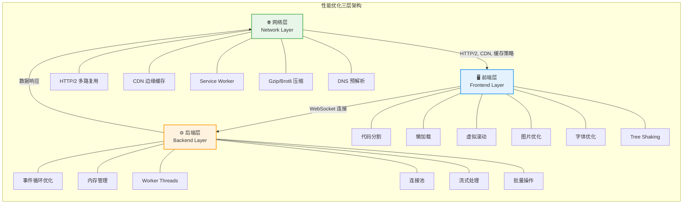

### 三层之间的关系

这三层不是孤立的，而是相互影响的：

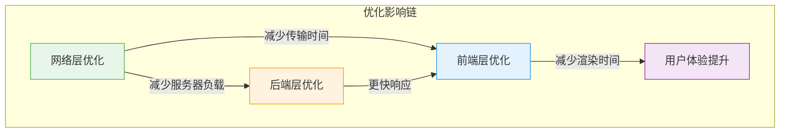

## 1.3 AI-CLI-Mobile 的性能挑战

AI-CLI-Mobile 作为一个**实时终端 Web 应用**，面临独特的性能挑战：

| 挑战 | 描述 | 影响 | 严重程度 |
|------|------|------|----------|
| **高频数据流** | PTY 输出可能每秒产生大量数据 | WebSocket 带宽压力、前端渲染瓶颈 | 🔴 高 |
| **实时性要求** | 用户输入需要立即响应 | 延迟敏感，不能有明显卡顿 | 🔴 高 |
| **长连接维护** | WebSocket 需要保持长时间连接 | 内存泄漏风险、连接稳定性 | 🟡 中 |
| **移动端限制** | 手机 CPU/内存/网络有限 | 需要更精细的资源管理 | 🟡 中 |
| **多会话并行** | 可能同时打开多个终端会话 | 资源竞争、内存倍增 | 🟡 中 |
| **ANSI 转义序列** | 终端输出包含大量控制字符 | 解析开销、渲染复杂度 | 🟢 低 |
| **屏幕尺寸变化** | 手机旋转、键盘弹出 | 频繁 resize 事件 | 🟢 低 |

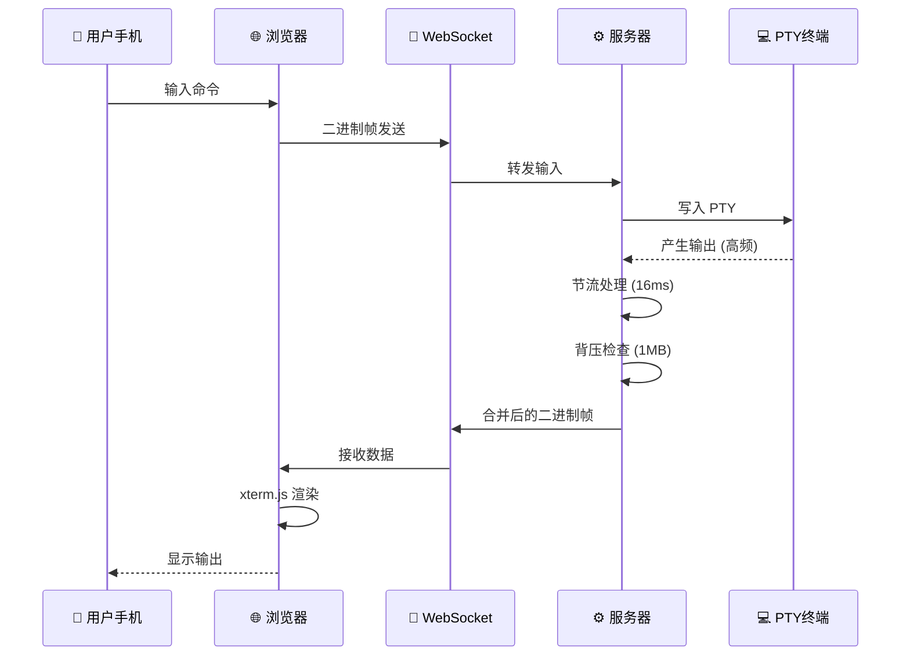

## 1.4 性能优化的基本原则

在开始优化之前，记住这几条黄金法则：

### 原则 1：先测量，再优化

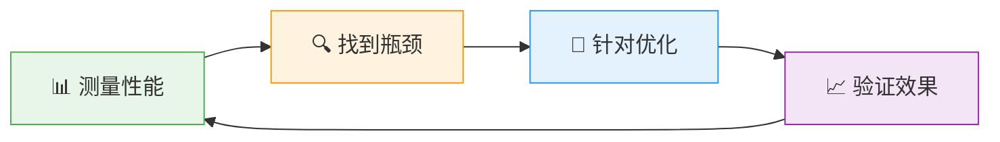

> ⚠️ **常见错误**：凭感觉优化，花大量时间优化不是瓶颈的地方。比如花一周优化图片加载，但实际瓶颈是 JavaScript 执行时间太长。

### 原则 2：80/20 法则（帕累托法则）

- 80% 的性能问题来自 20% 的代码
- 找到那 20% 的关键路径，集中优化
- 不要试图优化每一行代码

### 原则 3：不要过早优化

> "Premature optimization is the root of all evil." —— Donald Knuth（高德纳）

先让代码正确运行，再考虑优化。过早优化会让代码难以理解和维护。

**正确的优化顺序**：
1. 先让代码**正确**（Correct）
2. 再让代码**清晰**（Clear）
3. 最后让代码**快速**（Fast）

### 原则 4：优化要有数据支撑

```typescript
// ❌ 错误：凭感觉优化
// "我觉得这里应该用 Map 比 Object 快"
// 实际上可能没有明显区别

// ✅ 正确：用 benchmark 验证
import Benchmark from 'benchmark'

const suite = new Benchmark.Suite()

const obj = {}
const map = new Map()

suite
  .add('Object', () => { obj['key'] = 'value' })
  .add('Map', () => { map.set('key', 'value') })
  .on('cycle', (event: any) => console.log(String(event.target)))
  .on('complete', function(this: any) {
    console.log('Fastest is ' + this.filter('fastest').map('name'))
  })
  .run({ async: true })
```

### 原则 5：权衡取舍

性能优化往往涉及权衡：

| 权衡维度 | 选项 A | 选项 B |
|----------|--------|--------|
| 内存 vs 速度 | 缓存更多数据（快但占内存） | 不缓存（省内存但慢） |
| 首次加载 vs 后续加载 | 预加载所有资源（首次慢，后续快） | 懒加载（首次快，按需加载） |
| 代码大小 vs 功能 | 移除不常用功能 | 保留所有功能 |
| 兼容性 vs 性能 | 使用最新 API（快但兼容差） | 使用 polyfill（兼容但慢） |

## 1.5 性能优化的常见误区

| 误区 | 正确认识 |
|------|----------|
| "我的代码很快，不需要优化" | 没有测量就没有发言权 |
| "加个缓存就好了" | 缓存有失效策略、内存开销、一致性问题 |
| "用最新的框架就快了" | 框架选择只是优化的一小部分 |
| "性能优化是一次性的" | 性能会随着功能增加而退化，需要持续关注 |
| "优化前端就够了" | 后端、网络、数据库都可能是瓶颈 |
| "所有地方都要优化" | 80/20 法则，集中优化关键路径 |

---

# 第二章：Web 性能核心指标

## 2.1 为什么需要性能指标？

没有指标，就无法衡量优化效果。就像减肥需要体重秤一样，性能优化需要量化指标。

### 指标的作用

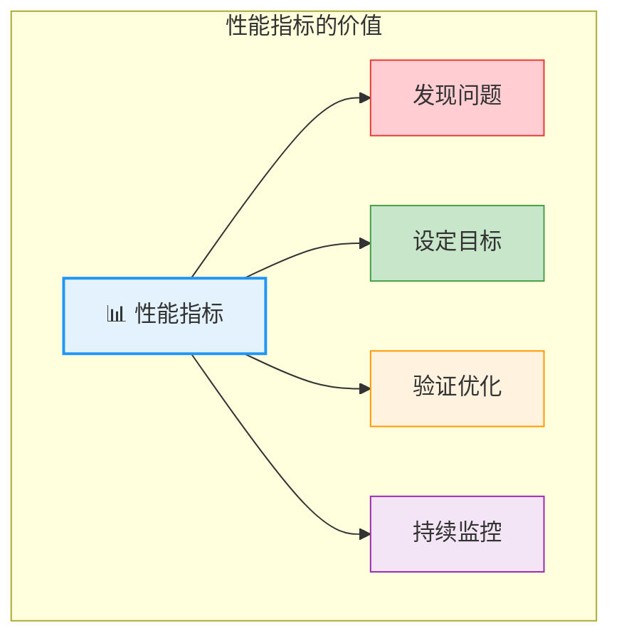

### 用户感知的性能

用户对性能的感知可以分为几个层次：

| 感知层次 | 时间范围 | 用户反应 | 对应指标 |
|----------|----------|----------|----------|
| **即时响应** | 0 ~ 100ms | 感觉"即时" | FID/INP |
| **快速响应** | 100ms ~ 300ms | 感觉"快" | TTFB |
| **可接受** | 300ms ~ 1s | 感觉"正常" | FCP |
| **需要等待** | 1s ~ 3s | 感觉"有点慢" | LCP |
| **放弃** | > 3s | "太慢了，不等了" | SI |

## 2.2 Core Web Vitals 详解

Google 提出的 **Core Web Vitals** 是衡量用户体验的三大核心指标，直接影响 SEO 排名：

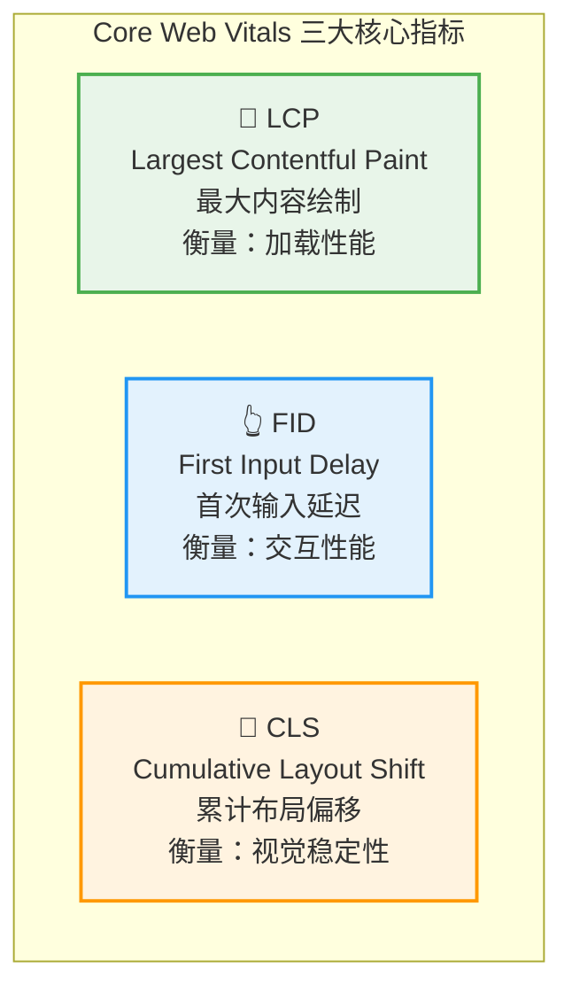

### LCP（Largest Contentful Paint）详解

LCP 衡量的是页面中**最大的内容元素**（通常是图片、视频或大块文本）渲染完成的时间。

**影响 LCP 的因素**：
- 服务器响应时间（TTFB）
- 渲染阻塞资源（CSS、JS）
- 资源加载时间（图片、字体）
- 客户端渲染时间

**优化 LCP 的方法**：

| 方法 | 效果 | 难度 |
|------|------|------|
| 优化服务器响应 | ⭐⭐⭐⭐⭐ | 中 |
| 移除渲染阻塞资源 | ⭐⭐⭐⭐ | 中 |
| 预加载关键资源 | ⭐⭐⭐ | 低 |
| 使用 CDN | ⭐⭐⭐⭐ | 低 |
| 优化图片加载 | ⭐⭐⭐ | 低 |

### FID/INP（First Input Delay / Interaction to Next Paint）详解

FID 衡量用户**首次交互**（点击、按键）到浏览器**响应**的延迟。INP 是 FID 的替代指标，衡量**所有交互**的响应延迟。

**为什么 FID/INP 重要？**
- 终端应用中，用户频繁输入命令
- 每次按键都需要即时响应
- 延迟会让用户感觉"卡顿"

**影响 FID/INP 的因素**：
- 长任务（Long Task）阻塞主线程
- JavaScript 执行时间过长
- 大量 DOM 操作
- 复杂的 CSS 选择器

### CLS（Cumulative Layout Shift）详解

CLS 衡量页面元素**意外移动**的程度。

**常见 CLS 问题**：
- 图片没有预设尺寸，加载后撑开布局
- 动态插入广告，推动内容移动
- 字体加载导致文字重新排列
- 动画使用 top/left 而非 transform

## 2.3 性能指标完整对照表

| 指标 | 全称 | 衡量什么 | 良好 | 需改进 | 差 | 测量方式 |
|------|------|----------|------|--------|-----|----------|
| **LCP** | Largest Contentful Paint | 最大内容元素渲染时间 | ≤ 2.5s | 2.5s ~ 4s | > 4s | `PerformanceObserver` |
| **FID** | First Input Delay | 首次交互到浏览器响应的延迟 | ≤ 100ms | 100ms ~ 300ms | > 300ms | `PerformanceObserver` |
| **INP** | Interaction to Next Paint | 所有交互的响应延迟（FID 替代） | ≤ 200ms | 200ms ~ 500ms | > 500ms | `PerformanceObserver` |
| **CLS** | Cumulative Layout Shift | 页面布局意外偏移量 | ≤ 0.1 | 0.1 ~ 0.25 | > 0.25 | `PerformanceObserver` |
| **FCP** | First Contentful Paint | 首次内容渲染时间 | ≤ 1.8s | 1.8s ~ 3s | > 3s | `PerformanceObserver` |
| **TTFB** | Time to First Byte | 首字节到达时间 | ≤ 800ms | 800ms ~ 1.8s | > 1.8s | `Navigation Timing` |
| **TBT** | Total Blocking Time | 总阻塞时间 | ≤ 200ms | 200ms ~ 600ms | > 600ms | `Lighthouse` |
| **TTI** | Time to Interactive | 可交互时间 | ≤ 3.8s | 3.8s ~ 7.3s | > 7.3s | `Lighthouse` |
| **SI** | Speed Index | 页面加载视觉速度 | ≤ 3.4s | 3.4s ~ 5.8s | > 5.8s | `Lighthouse` |

## 2.4 指标之间的关系

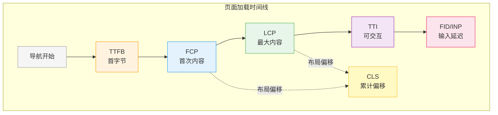

### 指标间的因果关系

| 因果链 | 说明 |
|--------|------|
| TTFB → FCP | 服务器响应慢，首次内容就晚 |
| FCP → LCP | 首次内容渲染了，最大内容还需要时间 |
| LCP → TTI | 最大内容渲染了，但 JS 可能还在执行 |
| TTI → FID | 页面可交互了，但首次交互可能有延迟 |
| 任何阶段 → CLS | 布局偏移可能在任何时候发生 |

## 2.5 如何测量这些指标

### 使用 Performance API

```typescript
// 测量 LCP
const lcpObserver = new PerformanceObserver((entryList) => {
  const entries = entryList.getEntries()
  const lastEntry = entries[entries.length - 1]
  console.log('LCP:', lastEntry.startTime.toFixed(2), 'ms')
  console.log('LCP Element:', lastEntry.element)
  // 发送到分析服务
  // sendMetric({ name: 'LCP', value: lastEntry.startTime })
})
lcpObserver.observe({ type: 'largest-contentful-paint', buffered: true })

// 测量 FID
const fidObserver = new PerformanceObserver((entryList) => {
  const entry = entryList.getEntries()[0]
  const delay = entry.processingStart - entry.startTime
  console.log('FID:', delay.toFixed(2), 'ms')
  console.log('FID Target:', (entry as any).target)
})
fidObserver.observe({ type: 'first-input', buffered: true })

// 测量 CLS
let clsValue = 0
let sessionValue = 0
let sessionEntries: any[] = []

const clsObserver = new PerformanceObserver((entryList) => {
  for (const entry of entryList.getEntries()) {
    // 只计算没有近期用户输入的布局偏移
    if (!(entry as any).hadRecentInput) {
      const firstSessionEntry = sessionEntries[0]
      const lastSessionEntry = sessionEntries[sessionEntries.length - 1]
      
      // 如果偏移间隔超过 1 秒或累计超过 5 秒，开始新的会话
      if (sessionValue &&
          entry.startTime - lastSessionEntry.startTime < 1000 &&
          entry.startTime - firstSessionEntry.startTime < 5000) {
        sessionValue += (entry as any).value
        sessionEntries.push(entry)
      } else {
        sessionValue = (entry as any).value
        sessionEntries = [entry]
      }
      
      if (sessionValue > clsValue) {
        clsValue = sessionValue
      }
    }
  }
  console.log('CLS:', clsValue.toFixed(4))
})
clsObserver.observe({ type: 'layout-shift', buffered: true })

// 测量 FCP
const fcpObserver = new PerformanceObserver((entryList) => {
  const entries = entryList.getEntries()
  const fcpEntry = entries.find(entry => entry.name === 'first-contentful-paint')
  if (fcpEntry) {
    console.log('FCP:', fcpEntry.startTime.toFixed(2), 'ms')
  }
})
fcpObserver.observe({ type: 'paint', buffered: true })

// 测量 TTFB
const navigation = performance.getEntriesByType('navigation')[0] as PerformanceNavigationTiming
if (navigation) {
  const ttfb = navigation.responseStart - navigation.requestStart
  console.log('TTFB:', ttfb.toFixed(2), 'ms')
  
  // 更详细的网络时间分解
  console.log('DNS 查询:', (navigation.domainLookupEnd - navigation.domainLookupStart).toFixed(2), 'ms')
  console.log('TCP 连接:', (navigation.connectEnd - navigation.connectStart).toFixed(2), 'ms')
  console.log('TLS 协商:', (navigation.secureConnectionStart > 0 
    ? (navigation.connectEnd - navigation.secureConnectionStart) 
    : 0).toFixed(2), 'ms')
  console.log('请求/响应:', (navigation.responseEnd - navigation.requestStart).toFixed(2), 'ms')
  console.log('DOM 解析:', (navigation.domInteractive - navigation.responseEnd).toFixed(2), 'ms')
  console.log('DOM 完成:', (navigation.domContentLoadedEventEnd - navigation.domInteractive).toFixed(2), 'ms')
  console.log('页面加载:', (navigation.loadEventEnd - navigation.startTime).toFixed(2), 'ms')
}
```

### 使用 web-vitals 库

```typescript
import { onLCP, onFID, onINP, onCLS, onFCP, onTTFB } from 'web-vitals'

interface MetricPayload {
  name: string
  value: number
  rating: 'good' | 'needs-improvement' | 'poor'
  id: string
  navigationType: string
}

function sendToAnalytics(metric: any) {
  const payload: MetricPayload = {
    name: metric.name,
    value: metric.value,
    rating: metric.rating,
    id: metric.id,
    navigationType: metric.navigationType,
  }
  
  console.log(`[Web Vitals] ${metric.name}: ${metric.value.toFixed(2)} (${metric.rating})`)
  
  // 使用 sendBeacon 发送（页面关闭时也能发送）
  if (navigator.sendBeacon) {
    navigator.sendBeacon('/api/analytics', JSON.stringify(payload))
  } else {
    fetch('/api/analytics', {
      method: 'POST',
      body: JSON.stringify(payload),
      keepalive: true,
    })
  }
}

// 监听所有 Core Web Vitals
onLCP(sendToAnalytics)   // 最大内容绘制
onFID(sendToAnalytics)   // 首次输入延迟
onINP(sendToAnalytics)   // 交互到下一帧绘制
onCLS(sendToAnalytics)   // 累计布局偏移
onFCP(sendToAnalytics)   // 首次内容绘制
onTTFB(sendToAnalytics)  // 首字节时间
```

### 使用 performance.mark 和 performance.measure 自定义指标

```typescript
// 自定义性能标记
performance.mark('terminal-init-start')

// 初始化终端...
const term = new Terminal({ /* options */ })

performance.mark('terminal-init-end')
performance.measure('terminal-init', 'terminal-init-start', 'terminal-init-end')

// 获取测量结果
const measures = performance.getEntriesByName('terminal-init')
console.log('Terminal init time:', measures[0].duration.toFixed(2), 'ms')

// 标记 WebSocket 连接时间
performance.mark('ws-connect-start')
const ws = new WebSocket(url)
ws.onopen = () => {
  performance.mark('ws-connect-end')
  performance.measure('ws-connect', 'ws-connect-start', 'ws-connect-end')
  
  const connectMeasures = performance.getEntriesByName('ws-connect')
  console.log('WS connect time:', connectMeasures[0].duration.toFixed(2), 'ms')
}
```

## 2.6 AI-CLI-Mobile 中的性能指标关注点

对于 AI-CLI-Mobile 这类实时应用，重点关注：

| 指标 | AI-CLI-Mobile 的特殊性 | 优化重点 |
|------|----------------------|----------|
| **FCP** | 终端组件需要快速渲染初始界面 | 减少渲染阻塞资源 |
| **LCP** | 终端区域是最大内容元素 | 预加载终端组件 |
| **FID/INP** | 用户输入延迟直接影响终端操作体验 | 减少长任务 |
| **CLS** | 终端区域不应有布局偏移 | 固定终端容器尺寸 |
| **TTFB** | WebSocket 连接建立速度 | 优化服务器响应 |

---

# 第三章：前端性能优化

## 3.1 代码分割（Code Splitting）

### 什么是代码分割？

代码分割是将一个大的 JavaScript 包拆分成多个小块，按需加载的技术。这是前端性能优化中**最重要**的手段之一。

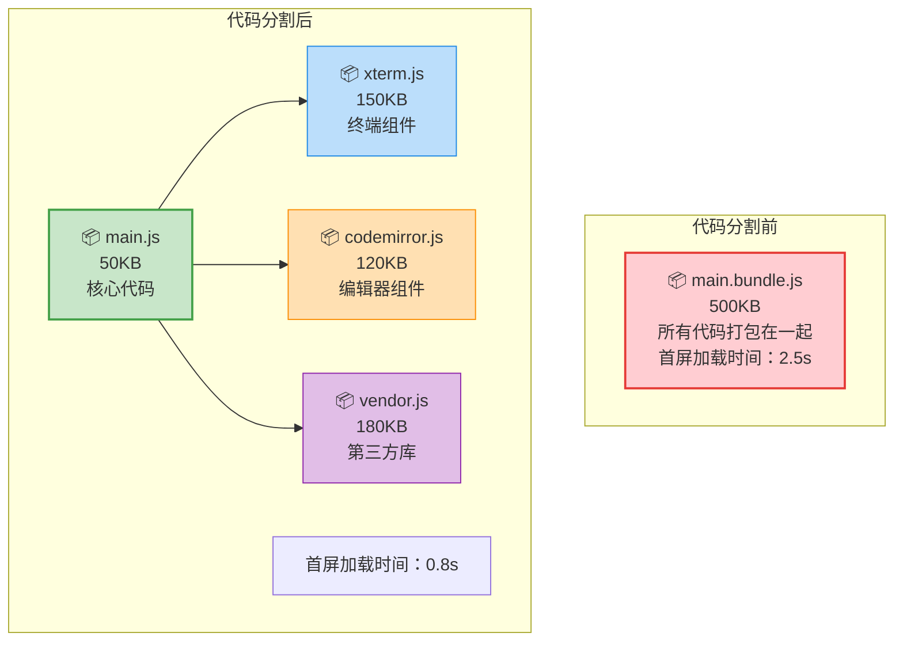

### AI-CLI-Mobile 的代码分割配置

项目使用 Vite 的 `manualChunks` 进行手动代码分割：

```typescript
// apps/web/vite.config.ts
export default defineConfig({
  build: {
    rollupOptions: {
      output: {
        manualChunks: {
          // 将 xterm 相关库打包为独立 chunk
          'xterm': [
            '@xterm/xterm',
            '@xterm/addon-fit',
            '@xterm/addon-webgl',
            '@xterm/addon-canvas',
            '@xterm/addon-web-links'
          ],
          // 将 CodeMirror 相关库打包为独立 chunk
          'codemirror': [
            '@uiw/react-codemirror',
            '@codemirror/lang-javascript',
            '@codemirror/lang-python',
            '@codemirror/lang-json',
            '@codemirror/lang-markdown',
            '@codemirror/lang-css',
            '@codemirror/lang-html'
          ],
          // React 核心库
          'vendor-react': ['react', 'react-dom'],
        },
      },
    },
  },
})
```

**为什么这样分割？**

| Chunk | 包含内容 | 加载时机 | 大小估算 | 压缩后 |
|-------|---------|----------|----------|--------|
| `main.js` | 应用核心逻辑 | 首次加载 | ~50KB | ~15KB |
| `xterm.js` | 终端渲染引擎 | 进入终端页面时 | ~150KB | ~45KB |
| `codemirror.js` | 代码编辑器 | 打开编辑器时 | ~120KB | ~35KB |
| `vendor-react.js` | React 核心 | 首次加载 | ~45KB | ~14KB |

**效果**：
- 首次加载只需下载 `main.js` + `vendor-react.js` ≈ 95KB（压缩后 ~29KB）
- 用户进入终端页面时才加载 `xterm.js`
- 用户打开编辑器时才加载 `codemirror.js`
- 每个 chunk 可以独立缓存，代码变更时只需重新下载变化的 chunk

### 代码分割的原理

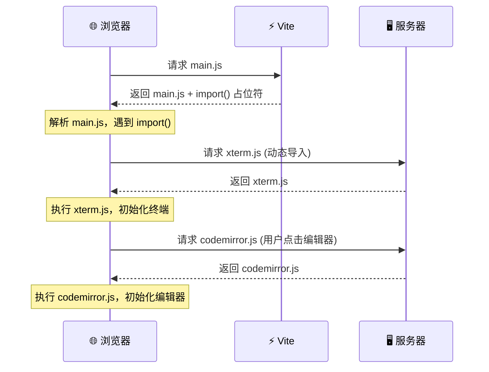

### 自动代码分割 vs 手动代码分割

| 方式 | 优点 | 缺点 | 适用场景 |
|------|------|------|----------|
| **自动分割** | 无需配置 | 可能不够精细 | 小型项目 |
| **手动分割** | 精确控制 | 需要了解依赖关系 | 中大型项目 |
| **混合方式** | 兼顾两者 | 配置复杂 | 推荐方式 |

## 3.2 React.lazy 与动态导入

### 什么是懒加载？

懒加载（Lazy Loading）是指在需要时才加载资源，而不是一次性全部加载。

```typescript
import React, { Suspense, lazy } from 'react'

// 普通导入：打包时就包含在 bundle 中
// import CodeEditor from './components/CodeEditor'

// 懒加载：只在需要时才加载
const CodeEditor = lazy(() => import('./components/CodeEditor'))
const FileExplorer = lazy(() => import('./components/FileExplorer'))
const SettingsDrawer = lazy(() => import('./components/SettingsDrawer'))

function App() {
  const [showEditor, setShowEditor] = React.useState(false)
  const [showFiles, setShowFiles] = React.useState(false)

  return (
    <div>
      {/* 终端是核心功能，不需要懒加载 */}
      <TerminalContainer />

      {/* 编辑器按需加载 */}
      {showEditor && (
        <Suspense fallback={<div className="loading">加载编辑器中...</div>}>
          <CodeEditor />
        </Suspense>
      )}

      {/* 文件浏览器按需加载 */}
      {showFiles && (
        <Suspense fallback={<div className="loading">加载文件列表...</div>}>
          <FileExplorer />
        </Suspense>
      )}
    </div>
  )
}
```

### 懒加载的工作原理

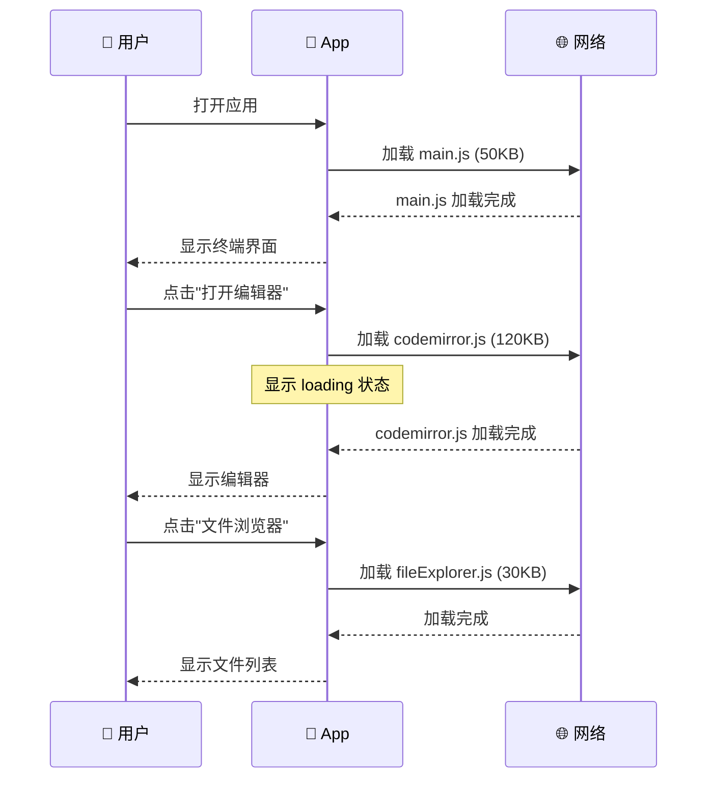

### 懒加载的错误处理

```typescript
import React, { Suspense, lazy, Component, ErrorInfo, ReactNode } from 'react'

// 错误边界组件
class LazyLoadErrorBoundary extends Component<
  { children: ReactNode; fallback: ReactNode },
  { hasError: boolean }
> {
  state = { hasError: false }

  static getDerivedStateFromError() {
    return { hasError: true }
  }

  componentDidCatch(error: Error, errorInfo: ErrorInfo) {
    console.error('Lazy load failed:', error, errorInfo)
    // 可以发送错误报告
    // sendErrorReport({ error, errorInfo })
  }

  render() {
    if (this.state.hasError) {
      return this.props.fallback
    }
    return this.props.children
  }
}

// 使用错误边界包装懒加载组件
function App() {
  return (
    <LazyLoadErrorBoundary fallback={<div>组件加载失败，请刷新页面</div>}>
      <Suspense fallback={<div>加载中...</div>}>
        <CodeEditor />
      </Suspense>
    </LazyLoadErrorBoundary>
  )
}
```

### 预加载策略

```typescript
// 在用户可能需要时预加载，但不立即渲染
const preloadCodeEditor = () => import('./components/CodeEditor')
const preloadFileExplorer = () => import('./components/FileExplorer')

function TerminalContainer() {
  // 当用户鼠标悬停在"编辑器"按钮上时预加载
  const handleEditorHover = () => {
    preloadCodeEditor() // 预加载但不渲染
  }

  return (
    <div>
      <Terminal />
      <button onMouseEnter={handleEditorHover} onClick={openEditor}>
        打开编辑器
      </button>
    </div>
  )
}

// 或者在空闲时预加载
if ('requestIdleCallback' in window) {
  requestIdleCallback(() => {
    preloadCodeEditor()
    preloadFileExplorer()
  })
}
```

## 3.3 图片优化

### 图片格式选择

| 格式 | 适用场景 | 压缩方式 | 透明度 | 动画 | 浏览器支持 | 压缩率 |
|------|---------|----------|--------|------|-----------|--------|
| **JPEG** | 照片、复杂图像 | 有损压缩 | ❌ | ❌ | 所有浏览器 | 中 |
| **PNG** | 图标、需要透明度 | 无损压缩 | ✅ | ❌ | 所有浏览器 | 低 |
| **WebP** | 通用（替代 JPEG/PNG） | 有损+无损 | ✅ | ✅ | 现代浏览器 | 高 |
| **AVIF** | 最新格式，最高压缩 | 有损+无损 | ✅ | ✅ | Chrome 85+ | 极高 |
| **SVG** | 图标、简单图形 | 无损（矢量） | ✅ | ✅ | 所有浏览器 | 极高 |

### 响应式图片

```html
<!-- 使用 srcset 提供多种尺寸 -->


<!-- 使用 picture 元素提供多种格式 -->
<picture>
  <source srcset="hero.avif" type="image/avif" />
  <source srcset="hero.webp" type="image/webp" />
  
</picture>
```

### 图片压缩工具

```bash
# 使用 sharp (Node.js) 压缩图片
import sharp from 'sharp'

// 压缩为 WebP
await sharp('input.png')
  .resize(800, 600, { fit: 'inside', withoutEnlargement: true })
  .webp({ quality: 80 })
  .toFile('output.webp')

// 压缩为 AVIF（更高压缩率）
await sharp('input.png')
  .resize(800, 600, { fit: 'inside' })
  .avif({ quality: 60 })
  .toFile('output.avif')

// 生成多种尺寸
const sizes = [400, 800, 1200]
for (const size of sizes) {
  await sharp('input.jpg')
    .resize(size)
    .jpeg({ quality: 75 })
    .toFile(`hero-${size}w.jpg`)
}
```

### 图片懒加载

```html
<!-- 原生懒加载（现代浏览器） -->


<!-- 使用 Intersection Observer 实现自定义懒加载 -->
<script>
const observer = new IntersectionObserver((entries) => {
  entries.forEach(entry => {
    if (entry.isIntersecting) {
      const img = entry.target
      img.src = img.dataset.src
      observer.unobserve(img)
    }
  })
})

document.querySelectorAll('img[data-src]').forEach(img => {
  observer.observe(img)
})
</script>
```

## 3.4 字体优化

### 字体加载策略

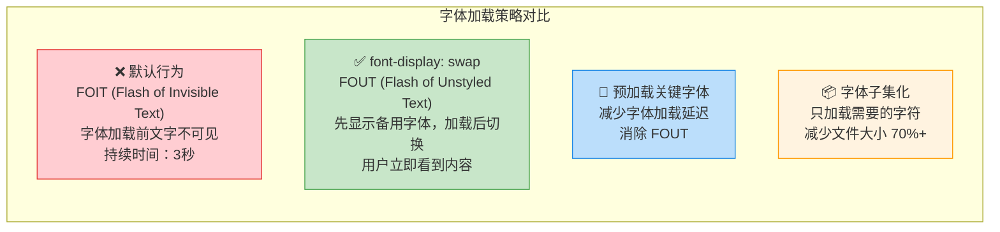

```css
/* 使用 font-display: swap 避免文字不可见 */
@font-face {
  font-family: 'Inter';
  src: url('/fonts/inter-var.woff2') format('woff2');
  font-display: swap; /* 关键：先显示备用字体 */
  unicode-range: U+0000-00FF; /* 只加载需要的字符范围 */
}

/* 预加载关键字体 */
<link rel="preload" href="/fonts/inter-var.woff2" as="font" type="font/woff2" crossorigin />

/* 字体回退策略 */
body {
  font-family: 'Inter', -apple-system, BlinkMacSystemFont, 'Segoe UI', Roboto, sans-serif;
}
```

### font-display 属性详解

| 值 | 行为 | 适用场景 |
|------|------|----------|
| `auto` | 浏览器默认行为 | 不推荐 |
| `block` | 阻塞 3 秒，然后显示备用字体 | 关键字体 |
| `swap` | 立即显示备用字体，加载后切换 | **推荐** |
| `fallback` | 阻塞 100ms，然后显示备用字体 | 次要字体 |
| `optional` | 阻塞 100ms，可能不加载 | 不重要的字体 |

### 字体子集化

```bash
# 使用 glyphhanger 只保留需要的字符
npx glyphhanger --subset=*.woff2 --LATIN --CSS

# 使用 pyftsubset (Python)
pyftsubset input.woff2 \
  --output-file=output.woff2 \
  --unicodes="U+0000-00FF,U+0131,U+0152-0153" \
  --layout-features="kern,liga"

# 中文字体子集化（只保留常用字）
pyftsubset input.woff2 \
  --output-file=output-subset.woff2 \
  --text-file=common-chars.txt \
  --layout-features="kern,liga"
```

## 3.5 预加载与预连接

### 资源提示标签

```html
<!-- 预连接到第三方域名（减少 DNS + TCP + TLS 时间） -->
<link rel="preconnect" href="https://api.example.com" />
<link rel="preconnect" href="https://cdn.example.com" crossorigin />

<!-- DNS 预解析（比 preconnect 轻量） -->
<link rel="dns-prefetch" href="https://analytics.example.com" />

<!-- 预加载当前页面一定会用到的资源 -->
<link rel="preload" href="/fonts/inter-var.woff2" as="font" type="font/woff2" crossorigin />
<link rel="preload" href="/css/critical.css" as="style" />
<link rel="preload" href="/js/main.js" as="script" />
<link rel="preload" href="/images/hero.webp" as="image" />

<!-- 预获取下一页可能需要的资源 -->
<link rel="prefetch" href="/js/editor.js" />
<link rel="prefetch" href="/api/user/profile" />

<!-- Prerender：预渲染整个页面（实验性） -->
<link rel="prerender" href="/dashboard" />
```

### 资源提示对比

| 特性 | preload | prefetch | preconnect | dns-prefetch |
|------|---------|----------|------------|--------------|
| **优先级** | 高 | 低 | 最高 | 最低 |
| **加载时机** | 立即 | 空闲时 | 立即 | 立即 |
| **加载内容** | 具体资源 | 具体资源 | 建立连接 | DNS 解析 |
| **用途** | 当前页面关键资源 | 下一页资源 | 第三方域名 | 第三方域名 |
| **收益** | 减少资源加载时间 | 减少下一页加载时间 | 减少 100-300ms | 减少 50-100ms |

## 3.6 终端渲染优化

AI-CLI-Mobile 使用 xterm.js 渲染终端，有一些特殊的优化策略：

### 终端实例缓存（ADR-011）

```typescript
// apps/web/src/components/TerminalContainer.tsx

// 模块级别的终端实例缓存 — 永远不销毁
const terminalCache = new Map<string, Terminal>()
const fitAddonCache = new Map<string, FitAddon>()

export function TerminalContainer() {
  useEffect(() => {
    const cacheKey = sessionId || '__default'
    
    // 清理其他会话的终端
    for (const [key, cachedTerm] of terminalCache.entries()) {
      if (key !== cacheKey) {
        cachedTerm.dispose()
        terminalCache.delete(key)
        fitAddonCache.delete(key)
      }
    }

    // 检查是否有缓存的终端
    const cached = terminalCache.get(cacheKey)
    if (cached) {
      // 复用缓存的终端实例，避免重新初始化
      term = cached
      fitAddon = fitAddonCache.get(cacheKey)!
      container.appendChild(term.element!)
      fitAddon.fit()
    } else {
      // 创建新的终端实例
      term = new Terminal({
        theme: getXtermTheme(theme),
        fontSize,
        cursorBlink: true,
        scrollback: 5000,
        convertEol: true,
      })
      // ... 初始化 addons
      terminalCache.set(cacheKey, term)
      fitAddonCache.set(cacheKey, fitAddon)
    }
  }, [])
}
```

**为什么缓存终端实例？**

| 操作 | 不缓存 | 缓存 |
|------|--------|------|
| 切换标签页回来 | 重新初始化终端 (~200ms) | 直接复用 (~0ms) |
| 内存占用 | 每次创建新实例 | 复用同一实例 |
| 历史记录 | 丢失 | 保留 |
| WebGL 上下文 | 重新创建 | 复用 |
| 用户体验 | 闪烁 | 无缝 |

### 渲染器降级策略

```typescript
// apps/web/src/components/TerminalContainer.tsx

// 加载渲染器：WebGL → Canvas 降级（ADR-010）
try {
  term.loadAddon(new WebglAddon())
  rendererTypeRef.current = 'webgl'
} catch {
  try {
    term.loadAddon(new CanvasAddon())
    rendererTypeRef.current = 'canvas'
  } catch (e) {
    console.warn('[Terminal] Both WebGL and Canvas addons failed, using DOM renderer', e)
  }
}
```

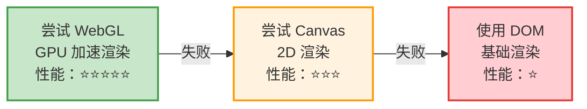

### 渲染器性能对比

| 渲染器 | 技术 | 性能 | GPU 加速 | 兼容性 | 适用场景 |
|--------|------|------|----------|--------|----------|
| **WebGL** | WebGL 2.0 | ⭐⭐⭐⭐⭐ | ✅ | 需要 GPU | 现代浏览器 |
| **Canvas** | Canvas 2D | ⭐⭐⭐ | ❌ | 广泛 | WebGL 不可用 |
| **DOM** | DOM 节点 | ⭐ | ❌ | 最好 | 最后降级方案 |

### 页面可见性优化

```typescript
// apps/web/src/components/TerminalContainer.tsx

// visibilitychange: DOM detach/reattach（ADR-011）
useEffect(() => {
  function handleVisibilityChange() {
    const term = termRef.current
    if (!term || !term.element) return

    if (document.hidden) {
      // 页面隐藏：从 DOM 移除，但保持实例活跃
      if (term.element.parentNode) {
        term.element.parentNode.removeChild(term.element)
      }
    } else {
      // 页面可见：重新挂载到 DOM
      if (containerRef.current && !term.element.parentNode) {
        containerRef.current.appendChild(term.element)
        fitAddonRef.current?.fit()
      }
    }
  }

  document.addEventListener('visibilitychange', handleVisibilityChange)
  return () => document.removeEventListener('visibilitychange', handleVisibilityChange)
}, [])
```

**效果**：
- 页面隐藏时，终端不再触发重绘，节省 GPU/CPU 资源
- 页面可见时，立即恢复渲染，用户无感知
- 终端实例保持活跃，不会丢失状态
- 移动端特别有用：用户切换 App 再回来时，终端状态完整保留

---

# 第四章：后端性能优化

## 4.1 Node.js 事件循环

### 事件循环是什么？

Node.js 是单线程的，但通过**事件循环**（Event Loop）实现异步 I/O，能够高效处理大量并发请求。

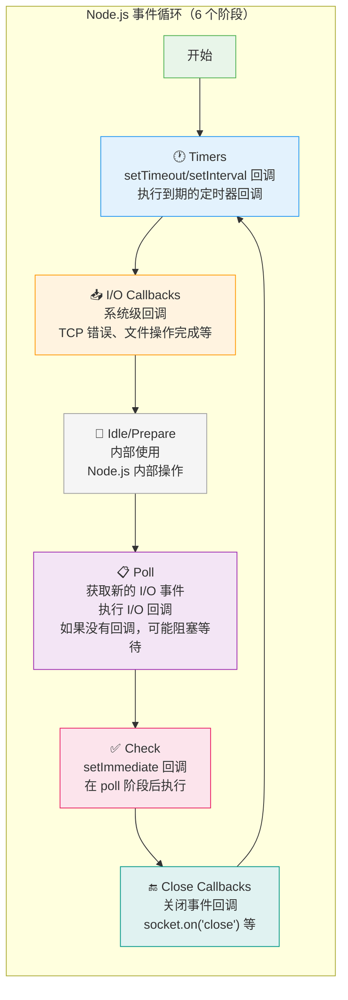

### 事件循环的 6 个阶段详解

| 阶段 | 执行内容 | 示例 | 优先级 |
|------|---------|------|--------|
| **Timers** | 执行 setTimeout/setInterval 回调 | `setTimeout(() => {}, 100)` | 中 |
| **I/O Callbacks** | 执行系统级回调（网络、文件） | TCP 错误回调 | 中 |
| **Idle/Prepare** | 内部使用 | - | - |
| **Poll** | 获取新的 I/O 事件，执行 I/O 回调 | `fs.readFile()` 回调 | 高 |
| **Check** | 执行 setImmediate 回调 | `setImmediate(() => {})` | 中 |
| **Close Callbacks** | 执行关闭事件回调 | `socket.on('close')` | 低 |

### 特殊的微任务队列

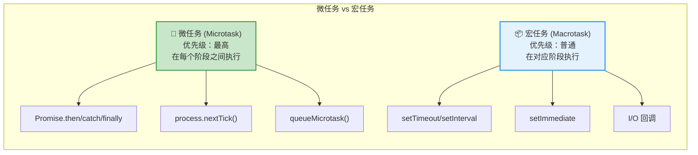

```typescript
// 微任务和宏任务的执行顺序
console.log('1. 同步代码')

setTimeout(() => {
  console.log('5. setTimeout (宏任务)')
}, 0)

Promise.resolve().then(() => {
  console.log('3. Promise.then (微任务)')
})

process.nextTick(() => {
  console.log('2. process.nextTick (微任务 - 最高优先级)')
})

queueMicrotask(() => {
  console.log('4. queueMicrotask (微任务)')
})

console.log('1.5. 同步代码继续')

// 输出顺序：
// 1. 同步代码
// 1.5. 同步代码继续
// 2. process.nextTick (微任务 - 最高优先级)
// 3. Promise.then (微任务)
// 4. queueMicrotask (微任务)
// 5. setTimeout (宏任务)
```

### 避免阻塞事件循环

```typescript
// ❌ 错误：同步操作阻塞事件循环
const data = fs.readFileSync('/large-file.txt') // 阻塞！
const result = JSON.parse(hugeString) // 阻塞！

// ✅ 正确：使用异步操作
const data = await fs.promises.readFile('/large-file.txt') // 非阻塞

// ✅ 正确：大 JSON 分块解析
function parseLargeJSON(jsonString: string): any {
  // 对于超大 JSON，考虑流式解析
  const chunks = jsonString.match(/.{1,100000}/g) || []
  // ... 分块处理
}

// ✅ 正确：CPU 密集型任务使用 Worker Threads
const { Worker } = require('worker_threads')
const worker = new Worker('./heavy-computation.js')
worker.postMessage({ data: largeDataSet })
worker.on('message', (result) => {
  console.log('计算结果:', result)
})

// ✅ 正确：使用 setImmediate 让出事件循环
function processLargeArray(items: any[], index: number = 0) {
  const BATCH_SIZE = 1000
  const end = Math.min(index + BATCH_SIZE, items.length)
  
  for (let i = index; i < end; i++) {
    processItem(items[i])
  }
  
  if (end < items.length) {
    // 让出事件循环，处理其他待处理的事件
    setImmediate(() => processLargeArray(items, end))
  }
}
```

## 4.2 垃圾回收（GC）机制

### V8 内存管理

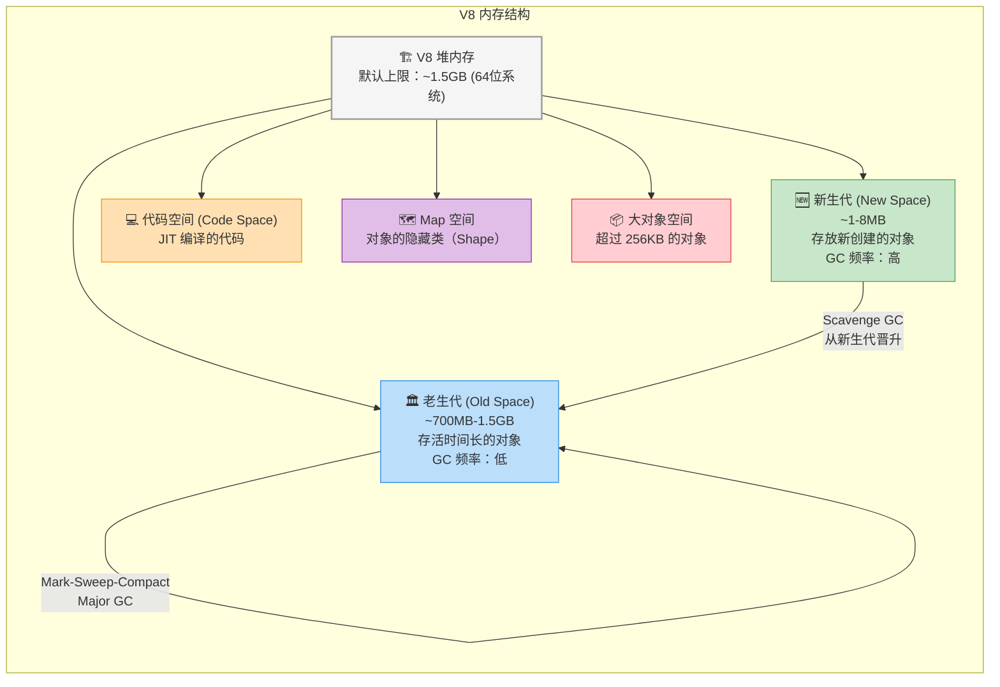

### GC 策略对比

| GC 算法 | 适用空间 | 特点 | 暂停时间 | 内存效率 |
|---------|---------|------|----------|----------|
| **Scavenge** | 新生代 | 速度快，空间换时间（半区复制） | < 1ms | 50% |
| **Mark-Sweep** | 老生代 | 标记存活对象，清除未标记 | 10-50ms | 100% |
| **Mark-Compact** | 老生代 | 标记 + 整理碎片 | 50-100ms | 100% |
| **Incremental Marking** | 老生代 | 分步标记，减少单次暂停 | 分散到多次 | 100% |
| **Concurrent GC** | 老生代 | 后台线程并发 GC | 几乎无暂停 | 100% |
| **Parallel GC** | 老生代 | 多线程并行 GC | 减少暂停 | 100% |

### 减少 GC 压力的技巧

```typescript
// ❌ 频繁创建临时对象，增加 GC 压力
function processData(items: any[]) {
  for (const item of items) {
    const temp = { ...item, processed: true, timestamp: Date.now() } // 每次循环创建新对象
    send(temp)
  }
}

// ✅ 复用对象，减少 GC 压力
function processData(items: any[]) {
  const buffer: any = { processed: true } // 复用对象
  for (const item of items) {
    Object.assign(buffer, item)
    buffer.timestamp = Date.now()
    send(buffer)
  }
}

// ✅ 使用对象池
class ObjectPool<T> {
  private pool: T[] = []
  private factory: () => T
  private reset: (obj: T) => void
  
  constructor(factory: () => T, reset: (obj: T) => void, initialSize: number = 10) {
    this.factory = factory
    this.reset = reset
    for (let i = 0; i < initialSize; i++) {
      this.pool.push(factory())
    }
  }
  
  acquire(): T {
    return this.pool.pop() || this.factory()
  }
  
  release(obj: T): void {
    this.reset(obj)
    this.pool.push(obj)
  }
  
  get size(): number {
    return this.pool.length
  }
}

// 使用对象池
const bufferPool = new ObjectPool(
  () => Buffer.alloc(1024),
  (buf) => buf.fill(0), // 重置缓冲区
  20 // 初始池大小
)

function handleData(data: Buffer) {
  const buffer = bufferPool.acquire()
  try {
    data.copy(buffer)
    processBuffer(buffer)
  } finally {
    bufferPool.release(buffer) // 确保归还到池中
  }
}
```

### 避免内存泄漏的编码实践

```typescript
// ❌ 闭包引用大对象
function createHandler() {
  const hugeData = loadHugeData() // 100MB
  return function handler() {
    // 即使不使用 hugeData，它也不会被 GC
    console.log('handler called')
  }
}

// ✅ 及时释放引用
function createHandler() {
  const hugeData = loadHugeData()
  const processed = processData(hugeData) // 只保留需要的部分
  return function handler() {
    console.log('processed:', processed)
  }
  // hugeData 在这里可以被 GC
}

// ❌ 全局缓存无上限
const cache: Map<string, any> = new Map()
function getCached(key: string) {
  if (!cache.has(key)) {
    cache.set(key, expensiveComputation(key))
  }
  return cache.get(key)
}

// ✅ LRU 缓存有上限
class LRUCache<K, V> {
  private cache = new Map<K, V>()
  private maxSize: number
  
  constructor(maxSize: number) {
    this.maxSize = maxSize
  }
  
  get(key: K): V | undefined {
    const value = this.cache.get(key)
    if (value !== undefined) {
      // 移到最新位置
      this.cache.delete(key)
      this.cache.set(key, value)
    }
    return value
  }
  
  set(key: K, value: V): void {
    if (this.cache.has(key)) {
      this.cache.delete(key)
    } else if (this.cache.size >= this.maxSize) {
      // 删除最旧的条目
      const firstKey = this.cache.keys().next().value
      this.cache.delete(firstKey)
    }
    this.cache.set(key, value)
  }
}

const cache = new LRUCache<string, any>(1000) // 最多缓存 1000 个条目
```

## 4.3 AI-CLI-Mobile 中的定时器清理

项目中大量使用定时器，必须在销毁时清理，否则会导致内存泄漏：

```typescript
// apps/server/src/core/SessionManager.ts

export class SessionManager extends EventEmitter {
  private errorRecoveryTimer: NodeJS.Timeout | null = null
  private fuseCleanupTimer: NodeJS.Timeout | null = null
  private fuseTimers = new Map<string, NodeJS.Timeout>()
  private fuseTexts = new Map<string, string>()

  constructor(adapters: Map<string, CLIAdapter>) {
    super()
    // 启动错误恢复循环
    this.startErrorRecoveryLoop()
    // 启动 fuse timer 清理
    this.startFuseTimerCleanup()
  }

  private startErrorRecoveryLoop(): void {
    this.errorRecoveryTimer = setInterval(() => {
      for (const [sessionId, session] of this.sessions.entries()) {
        if (session.status === 'ERROR') {
          this.recoverFromError(sessionId).catch((err) => {
            pinoLogger.error({ err, sessionId }, 'Error recovery failed')
          })
        }
      }
    }, ERROR_RECOVERY_INTERVAL_MS) // 10秒
  }

  // 定期清理孤立的 fuseTimer
  private startFuseTimerCleanup(): void {
    this.fuseCleanupTimer = setInterval(() => {
      for (const [sessionId, timer] of this.fuseTimers.entries()) {
        if (!this.sessions.has(sessionId)) {
          clearTimeout(timer)
          this.fuseTimers.delete(sessionId)
          this.fuseTexts.delete(sessionId)
        }
      }
    }, FUSE_CLEANUP_INTERVAL_MS) // 60秒
  }

  // 销毁时清理所有资源
  destroy(): void {
    // 清理错误恢复定时器
    if (this.errorRecoveryTimer) {
      clearInterval(this.errorRecoveryTimer)
      this.errorRecoveryTimer = null
    }

    // 销毁所有活跃会话
    for (const sessionId of [...this.sessions.keys()]) {
      this.destroySession(sessionId)
    }

    // 清理 fuse timer cleanup 定时器
    if (this.fuseCleanupTimer) {
      clearInterval(this.fuseCleanupTimer)
      this.fuseCleanupTimer = null
    }

    // 清理所有 fuse timers
    for (const timer of this.fuseTimers.values()) {
      clearTimeout(timer)
    }
    this.fuseTimers.clear()
    this.fuseTexts.clear()

    // 刷新待写入的会话存储
    this.sessionStore.flush()
  }
}
```

### 定时器清理检查清单

| 定时器 | 位置 | 清理方式 | 清理时机 |
|--------|------|----------|----------|
| `errorRecoveryTimer` | SessionManager | `clearInterval` | `destroy()` |
| `fuseCleanupTimer` | SessionManager | `clearInterval` | `destroy()` |
| `fuseTimers` (Map) | SessionManager | `clearTimeout` 每个 | `destroy()` + 定期清理 |
| `throttleTimer` | Session (每个会话) | `clearTimeout` | `flushBuffer()` |
| `saveTimer` | SessionStore | `clearTimeout` | `flush()` |
| `pingTimers` (Map) | WSGateway | `clearInterval` 每个 | `destroy()` + `ws.on('close')` |
| `authTimeout` | WSGateway | `clearTimeout` | 认证成功 / `ws.on('close')` |

## 4.4 使用 process.memoryUsage() 监控内存

```typescript
// 内存监控工具
function logMemoryUsage(label: string) {
  const usage = process.memoryUsage()
  console.log(`[${label}] Memory Usage:`)
  console.log(`  RSS:       ${(usage.rss / 1024 / 1024).toFixed(2)} MB (进程总内存)`)
  console.log(`  Heap Used: ${(usage.heapUsed / 1024 / 1024).toFixed(2)} MB (已使用堆内存)`)
  console.log(`  Heap Total: ${(usage.heapTotal / 1024 / 1024).toFixed(2)} MB (堆内存总量)`)
  console.log(`  External:  ${(usage.external / 1024 / 1024).toFixed(2)} MB (C++ 对象内存)`)
  console.log(`  ArrayBuffers: ${(usage.arrayBuffers / 1024 / 1024).toFixed(2)} MB (ArrayBuffer)`)
}

// 定期监控（生产环境）
setInterval(() => logMemoryUsage('periodic'), 60000)

// 内存使用趋势监控
class MemoryMonitor {
  private samples: Array<{ timestamp: number; heapUsed: number }> = []
  private maxSamples = 100

  sample(): void {
    const usage = process.memoryUsage()
    this.samples.push({
      timestamp: Date.now(),
      heapUsed: usage.heapUsed,
    })
    if (this.samples.length > this.maxSamples) {
      this.samples.shift()
    }
  }

  getTrend(): 'increasing' | 'stable' | 'decreasing' {
    if (this.samples.length < 10) return 'stable'
    
    const recent = this.samples.slice(-10)
    const avg1 = recent.slice(0, 5).reduce((sum, s) => sum + s.heapUsed, 0) / 5
    const avg2 = recent.slice(5).reduce((sum, s) => sum + s.heapUsed, 0) / 5
    
    const diff = (avg2 - avg1) / avg1
    if (diff > 0.1) return 'increasing'
    if (diff < -0.1) return 'decreasing'
    return 'stable'
  }

  report(): void {
    const trend = this.getTrend()
    const latest = this.samples[this.samples.length - 1]
    console.log(`Memory trend: ${trend}, current: ${(latest.heapUsed / 1024 / 1024).toFixed(2)} MB`)
    
    if (trend === 'increasing') {
      console.warn('⚠️ Memory usage is increasing! Possible memory leak.')
    }
  }
}
```

## 4.5 Worker Threads

### 什么时候使用 Worker Threads？

| 场景 | 是否使用 Worker | 原因 |
|------|----------------|------|
| 文件 I/O | ❌ | 已经是异步的（libuv 线程池） |
| 网络请求 | ❌ | 已经是异步的 |
| CPU 密集计算 | ✅ | 会阻塞事件循环 |
| 图片处理 | ✅ | 计算密集 |
| 数据压缩 | ✅ | 计算密集 |
| 大 JSON 解析 | ✅ | 数据量大时阻塞 |
| 数据加密 | ✅ | 计算密集 |
| 正则表达式 | ⚠️ 视情况 | 简单正则不需要，复杂正则需要 |

### Worker Threads 通信模型

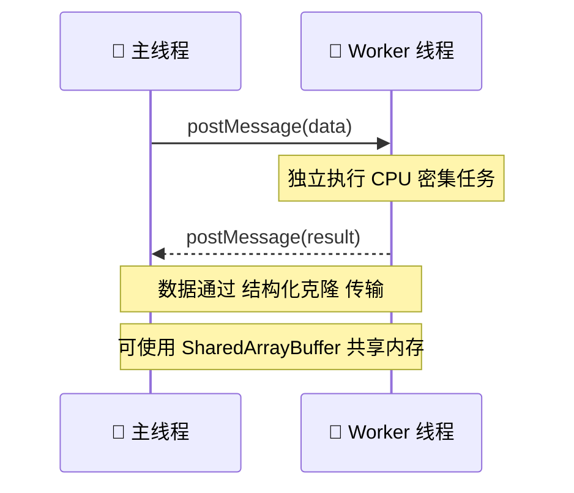

### Worker Threads 示例

```typescript
// worker.ts
import { parentPort, workerData } from 'worker_threads'

// 执行 CPU 密集型任务
function heavyComputation(data: number[]): number {
  let result = 0
  for (let i = 0; i < data.length; i++) {
    result += Math.sqrt(data[i]) * Math.sin(data[i])
  }
  return result
}

const result = heavyComputation(workerData)
parentPort?.postMessage(result)

// main.ts
import { Worker } from 'worker_threads'

function runInWorker(data: number[]): Promise<number> {
  return new Promise((resolve, reject) => {
    const worker = new Worker('./worker.ts', {
      workerData: data,
    })
    worker.on('message', resolve)
    worker.on('error', reject)
  })
}

// 使用
const result = await runInWorker([1, 2, 3, 4, 5])
```

---

# 第五章：WebSocket 性能优化

## 5.1 WebSocket 帧类型

WebSocket 支持两种帧类型：文本帧和二进制帧。

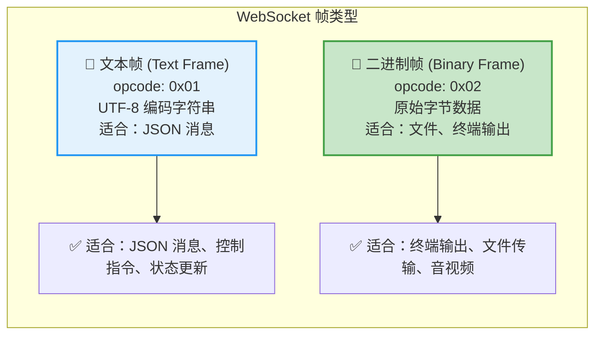

## 5.2 文本帧 vs 二进制帧对比

| 特性 | 文本帧 (JSON) | 二进制帧 |
|------|--------------|----------|
| **编码** | UTF-8 字符串 | 原始字节 |
| **开销** | 需要 JSON 序列化/反序列化 | 直接传输 |
| **可读性** | 人类可读 | 需要解码 |
| **大小** | 较大（JSON 格式开销） | 较小 |
| **适用场景** | 控制消息、状态更新 | 终端输出、文件传输 |
| **处理速度** | 较慢（需要解析） | 较快 |
| **调试难度** | 容易（Chrome DevTools 可直接查看） | 较难（需要解码） |

### AI-CLI-Mobile 的双通道设计

项目采用**双 WebSocket 通道**设计，终端通道使用二进制帧，控制通道使用文本帧：

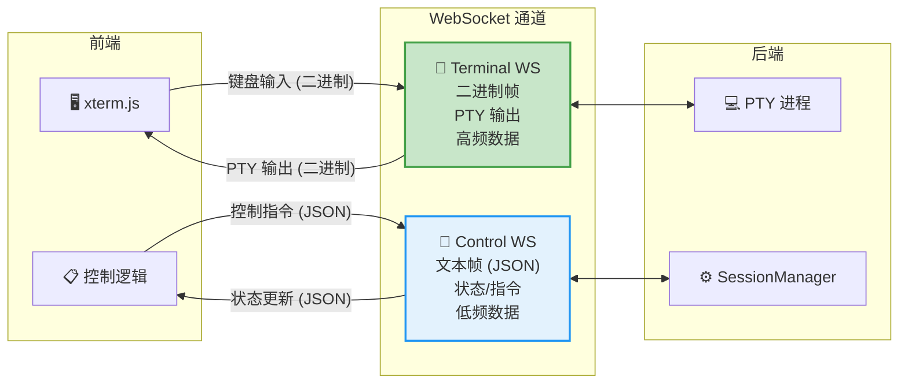

**为什么使用双通道？**

| 设计 | 优点 |
|------|------|
| 终端通道二进制 | 避免 Base64 编码开销（节省 33% 带宽） |
| 控制通道 JSON | 消息结构清晰，易于调试 |
| 通道分离 | 终端数据不会被控制消息阻塞 |
| 独立重连 | 一个通道断开不影响另一个 |
| 协议简化 | 终端通道认证后直接进入二进制模式，无需解析 JSON |

### 二进制帧 vs JSON 帧的大小对比

```typescript
// 假设 PTY 输出了 1KB 的终端数据

// 方式1：JSON 文本帧
const jsonFrame = JSON.stringify({
  type: 'OUTPUT',
  sessionId: 'abc123',
  data: Buffer.from(terminalData).toString('base64'),
  timestamp: Date.now()
})
// 大小：~1400 bytes (1KB 数据 + 33% Base64 开销 + JSON 结构开销)

// 方式2：二进制帧
const binaryFrame = Buffer.from(terminalData)
// 大小：~1024 bytes (仅数据本身)

// 节省：约 27% 带宽

// 如果每秒传输 100 个这样的帧：
// JSON: 1400 * 100 = 140KB/s
// Binary: 1024 * 100 = 102.4KB/s
// 节省：37.6KB/s = 2.25MB/min
```

## 5.3 消息压缩（permessage-deflate）

### 什么是 permessage-deflate？

`permessage-deflate` 是 WebSocket 的压缩扩展，使用 DEFLATE 算法压缩消息。

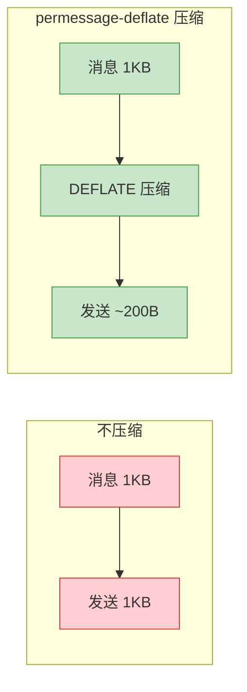

### 压缩效果对比

| 数据类型 | 原始大小 | 压缩后大小 | 压缩率 | 推荐压缩 |
|----------|----------|-----------|--------|----------|
| 终端输出（ANSI 序列） | 10KB | ~2KB | 80% | ✅ 是 |
| JSON 控制消息 | 500B | ~200B | 60% | ⚠️ 阈值以上 |
| 二进制数据（已压缩） | 10KB | ~8KB | 20% | ❌ 否 |
| 重复文本 | 5KB | ~500B | 90% | ✅ 是 |
| 随机数据 | 10KB | ~10KB | 0% | ❌ 否 |

### 配置 permessage-deflate

```typescript
// 服务端配置 (ws 库)
import { WebSocketServer } from 'ws'

const wss = new WebSocketServer({
  port: 8080,
  perMessageDeflate: {
    zlibDeflateOptions: {
      level: 6,          // 压缩级别 1-9（6 是平衡点）
      memLevel: 8,       // 内存使用级别 1-9
    },
    zlibInflateOptions: {
      chunkSize: 10 * 1024, // 解压块大小
    },
    threshold: 1024,     // 只压缩大于 1KB 的消息
    concurrencyLimit: 10, // 并发压缩限制
  },
})
```

### 压缩级别的选择

| 级别 | 压缩率 | CPU 使用 | 压缩速度 | 适用场景 |
|------|--------|----------|----------|----------|
| 1 | 低 | 低 | 最快 | 实时性要求极高 |
| 3 | 中低 | 低 | 快 | 轻量级压缩 |
| **6** | **中** | **中** | **中** | **推荐默认值** |
| 9 | 高 | 高 | 慢 | 带宽极度受限 |

## 5.4 AI-CLI-Mobile 的 WebSocket 优化

### Terminal 通道的二进制模式

```typescript
// apps/server/src/core/WSGateway.ts

handleTerminalConnection(ws: WebSocket): void {
  let state = WSState.UNAUTHENTICATED
  let sessionId: string | null = null

  ws.on('message', (data: Buffer) => {
    if (state === WSState.UNAUTHENTICATED) {
      // 认证阶段：JSON 文本帧
      const msg = JSON.parse(data.toString())
      if (msg.type === 'AUTH') {
        // ... 认证逻辑
      }
      return
    }

    if (sessionId === null) {
      // 附加会话阶段：JSON 文本帧
      const msg = JSON.parse(data.toString())
      if (msg.type === 'ATTACH_SESSION') {
        // ... 附加逻辑
      }
      return
    }

    // 已认证且已附加：二进制模式
    // PING (0x00) 或键盘输入
    if (data.length === 1 && data[0] === TERM_PING) {
      ws.send(Buffer.from([TERM_PONG]))
      return
    }

    // 转发键盘输入到 PTY
    this.sessionManager.sendInput(sessionId, data)
  })
}
```

### PING/PONG 心跳机制

```typescript
// apps/server/src/core/WSGateway.ts

private setupTerminalKeepAlive(ws: WebSocket): void {
  const timer = setInterval(() => {
    if (ws.readyState === WebSocket.OPEN) {
      // 发送 PONG (0x01) 作为服务端心跳探针
      ws.send(Buffer.from([TERM_PONG]))
    }
  }, PING_INTERVAL_MS) // 30秒
  this.pingTimers.set(ws, timer)
}

private setupControlKeepAlive(ws: WebSocket): void {
  const timer = setInterval(() => {
    if (ws.readyState === WebSocket.OPEN) {
      ws.send(JSON.stringify({ type: 'PING' }))
    }
  }, PING_INTERVAL_MS) // 30秒
  this.pingTimers.set(ws, timer)
}
```

**心跳机制的作用**：

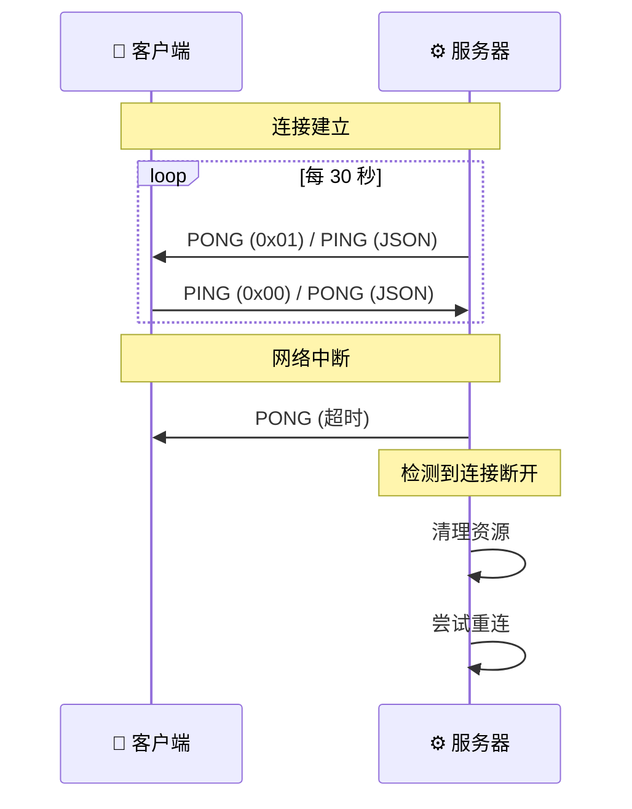

### 指数退避重连策略

```typescript
// apps/web/src/hooks/useDualChannelWS.ts

const MAX_RECONNECT_DELAY = 30_000
const INITIAL_RECONNECT_DELAY = 1_000

function scheduleReconnect() {
  if (reconnectTimerRef.current) return

  const delay = reconnectDelayRef.current
  // 加入 jitter（随机抖动），避免多个客户端同时重连
  const jittered = delay * (0.5 + Math.random() * 0.5)
  // 指数退避：延迟翻倍，最大 30 秒
  reconnectDelayRef.current = Math.min(delay * 2, MAX_RECONNECT_DELAY)

  reconnectTimerRef.current = setTimeout(() => {
    reconnectTimerRef.current = null
    const s = sessionRef.current
    const t = termRef.current
    if (s && t) {
      reconnectCountRef.current += 1
      setReconnectCount(reconnectCountRef.current)
      connectInternal(s.sessionId, s.cols, s.rows, t)
    }
  }, jittered)
}
```

**指数退避的原理**：

```mermaid
graph LR
    subgraph "重连延迟递增"
        direction LR
        
        T1["第 1 次<br/>1s"] --> T2["第 2 次<br/>2s"]
        T2 --> T3["第 3 次<br/>4s"]
        T3 --> T4["第 4 次<br/>8s"]
        T4 --> T5["第 5 次<br/>16s"]
        T5 --> T6["第 6 次<br/>30s (上限)"]
    end
    
    style T1 fill:#c8e6c9,stroke:#43a047
    style T2 fill:#c8e6c9,stroke:#43a047
    style T3 fill:#fff3e0,stroke:#ff9800
    style T4 fill:#fff3e0,stroke:#ff9800
    style T5 fill:#ffcdd2,stroke:#e53935
    style T6 fill:#ffcdd2,stroke:#e53935
```

---

# 第六章：背压控制机制详解

## 6.1 什么是背压？

背压（Backpressure）是指**数据生产速度超过消费速度**时产生的压力。

想象一下：
- 水龙头（数据生产者）开得很大
- 排水口（数据消费者）排得很慢
- 水就会溢出（数据丢失）

```mermaid
graph LR
    subgraph "背压问题"
        direction LR
        
        Producer["🚿 数据生产者<br/>PTY 输出<br/>速度：10MB/s"]
        Buffer["📦 缓冲区<br/>WebSocket buffer"]
        Consumer["🚰 数据消费者<br/>前端渲染<br/>速度：2MB/s"]
        
        Producer -->|"10MB/s"| Buffer
        Buffer -->|"2MB/s"| Consumer
        
        Buffer -.->|"溢出！"| Overflow["💥 数据丢失"]
    end
    
    style Producer fill:#c8e6c9,stroke:#43a047
    style Buffer fill:#fff3e0,stroke:#ff9800
    style Consumer fill:#e3f2fd,stroke:#2196f3
    style Overflow fill:#ffcdd2,stroke:#e53935
```

### 背压在 AI-CLI-Mobile 中的场景

| 场景 | 生产速度 | 消费速度 | 背压风险 |
|------|----------|----------|----------|
| PTY 输出大量日志 | 高 | 中 | 🔴 高 |
| `find /` 命令 | 极高 | 中 | 🔴 极高 |
| AI 工具思考过程 | 中 | 中 | 🟡 中 |
| 用户输入 | 低 | 高 | 🟢 低 |
| 状态更新 | 低 | 高 | 🟢 低 |

## 6.2 AI-CLI-Mobile 的背压控制

### BACKPRESSURE_THRESHOLD = 1MB

```typescript
// apps/server/src/core/SessionManager.ts

// 阈值常量定义
const BACKPRESSURE_THRESHOLD = 1048576 // 1MB – 当 bufferedAmount 超过此值时跳过 WS 发送 (ADR-017)

// 背压感知的数据广播
private flushBuffer(session: Session): void {
  const chunks = session.outputBuffer
  session.outputBuffer = []
  session.throttleTimer = null

  if (chunks.length === 0) return

  const merged = Buffer.concat(chunks)

  // 广播到所有终端客户端，带背压控制 (ADR-017)
  for (const client of session.termClients) {
    if (client.readyState !== 1) continue
    
    // 检查 WebSocket 缓冲区大小
    if (client.bufferedAmount > BACKPRESSURE_THRESHOLD) {
      // 背压超阈值时通知客户端
      this.sendBackpressureWarning(session)
      continue // 跳过本次发送
    }
    
    client.send(merged)
  }

  // 同样广播到观察者客户端（只读）
  for (const client of session.observeClients) {
    if (client.readyState !== 1) continue
    if (client.bufferedAmount > BACKPRESSURE_THRESHOLD) {
      continue
    }
    client.send(merged)
  }
}

// 背压警告通知
private sendBackpressureWarning(session: Session): void {
  this.broadcastControl(session.sessionId, {
    type: 'STATUS_UPDATE',
    sessionId: session.sessionId,
    status: session.status,
    message: 'Backpressure detected, data is being dropped',
  })
}
```

### 背压控制流程图

```mermaid
flowchart TB
    Start["PTY 产生输出"] --> Merge["合并缓冲区数据"]
    Merge --> Check{"检查每个客户端<br/>bufferedAmount"}
    
    Check -->|"≤ 1MB"| Send["发送数据"]
    Check -->|"> 1MB"| Skip["跳过发送"]
    
    Send --> Notify["更新 lastBroadcast"]
    Skip --> Warn["发送背压警告"]
    Warn --> Next["处理下一个客户端"]
    Notify --> Next
    
    Next --> More{"还有更多客户端？"}
    More -->|"是"| Check
    More -->|"否"| Fuse["触发状态融合"]
    
    style Start fill:#e8f5e9,stroke:#4caf50
    style Check fill:#fff3e0,stroke:#ff9800
    style Send fill:#c8e6c9,stroke:#43a047
    style Skip fill:#ffcdd2,stroke:#e53935
    style Warn fill:#ffcdd2,stroke:#e53935
```

### bufferedAmount 是什么？

`bufferedAmount` 是 WebSocket 对象的一个属性，表示**已发送但尚未被网络传输的数据量**。

```typescript
// 检查 WebSocket 缓冲区
const ws = new WebSocket('ws://localhost:8080')

console.log(ws.bufferedAmount) // 0 - 初始状态

ws.send(largeData)
console.log(ws.bufferedAmount) // 可能是 1024000 - 有 1MB 数据等待发送

// 当网络传输完成后，bufferedAmount 会自动减少
// 可以监听 bufferedAmount 的变化
const checkInterval = setInterval(() => {
  if (ws.bufferedAmount === 0) {
    console.log('所有数据已发送')
    clearInterval(checkInterval)
  } else {
    console.log(`还有 ${ws.bufferedAmount} bytes 待发送`)
  }
}, 100)
```

### 为什么选择 1MB 作为阈值？

| 阈值 | 优点 | 缺点 | 适用场景 |
|------|------|------|----------|
| 100KB | 响应快，数据丢失少 | 可能过于频繁跳过 | 低带宽环境 |
| 500KB | 较好的平衡 | 仍可能频繁跳过 | 移动网络 |
| **1MB** | **平衡点** | **推荐值** | **通用** |
| 5MB | 容忍较大突发 | 内存占用较高 | 高带宽环境 |
| 10MB | 容忍突发 | 内存占用高 | 本地网络 |

### 前端的背压处理

```typescript
// apps/web/src/hooks/useDualChannelWS.ts

function handleCtrlMessage(data: ControlServerMessage) {
  switch (data.type) {
    case 'STATUS_UPDATE':
      store.getState().setAgentStatus(data.status)
      
      // 检查是否是背压警告
      if (data.message?.includes('Backpressure')) {
        // 显示警告给用户
        console.warn('网络拥塞，部分数据可能丢失')
        // 可以暂停某些非关键操作
        // 或者显示网络状态指示器
      }
      break
  }
}
```

---

# 第七章：PTY 输出节流策略

## 7.1 为什么需要节流？

PTY（伪终端）输出可能非常频繁，例如：

```bash
# 这个命令会产生大量输出
find / -name "*.log" 2>/dev/null

# 每秒可能产生数千行输出
# 如果每行都通过 WebSocket 发送，会导致：
# 1. WebSocket 缓冲区溢出
# 2. 前端渲染卡顿
# 3. 网络带宽浪费
# 4. CPU 使用率飙升
```

### PTY 输出频率分析

| 命令 | 输出频率 | 每秒数据量 | 风险 |
|------|----------|-----------|------|
| `ls` | 低 | ~1KB | 🟢 低 |
| `cat large-file` | 中 | ~1MB | 🟡 中 |
| `find /` | 高 | ~10MB | 🔴 高 |
| `yes` | 极高 | ~100MB | 🔴 极高 |
| AI 工具输出 | 中 | ~100KB | 🟢 低 |

## 7.2 THROTTLE_MS = 16ms 的实现

```typescript
// apps/server/src/core/SessionManager.ts

const THROTTLE_MS = 16 // ~1 frame at 60fps – debounce PTY output broadcast

interface Session {
  throttleTimer: NodeJS.Timeout | null
  outputBuffer: Buffer[]
  lastBroadcast: number
}

private onData(session: Session, data: string): void {
  const buf = Buffer.from(data, 'utf-8')
  session.outputBuffer.push(buf) // 将数据加入缓冲区

  // 记录输出（如果正在录制）
  if (session.recorder.isRecording()) {
    session.recorder.record(buf, Date.now())
  }

  // 如果没有待执行的节流定时器，创建一个
  if (!session.throttleTimer) {
    session.throttleTimer = setTimeout(() => {
      this.flushBuffer(session) // 16ms 后批量发送
    }, THROTTLE_MS)
  }
}

private flushBuffer(session: Session): void {
  const chunks = session.outputBuffer
  session.outputBuffer = [] // 清空缓冲区
  session.throttleTimer = null

  if (chunks.length === 0) return

  const merged = Buffer.concat(chunks) // 合并所有缓冲数据

  // 广播合并后的数据
  for (const client of session.termClients) {
    if (client.readyState !== 1) continue
    if (client.bufferedAmount > BACKPRESSURE_THRESHOLD) {
      this.sendBackpressureWarning(session)
      continue
    }
    client.send(merged)
  }
}
```

### 节流机制流程图

```mermaid
sequenceDiagram
    participant PTY as 💻 PTY
    participant SM as ⚙️ SessionManager
    participant Buffer as 📦 缓冲区
    participant WS as 📡 WebSocket
    
    PTY->>SM: 数据块 1
    SM->>Buffer: 入缓冲区
    SM->>SM: 启动 16ms 定时器
    
    PTY->>SM: 数据块 2 (2ms 后)
    SM->>Buffer: 入缓冲区
    
    PTY->>SM: 数据块 3 (5ms 后)
    SM->>Buffer: 入缓冲区
    
    PTY->>SM: 数据块 4 (10ms 后)
    SM->>Buffer: 入缓冲区
    
    Note over SM: 16ms 定时器触发
    
    SM->>Buffer: 取出所有数据
    Buffer-->>SM: [块1, 块2, 块3, 块4]
    SM->>SM: Buffer.concat 合并
    SM->>WS: 发送合并后的数据
```

### 为什么选择 16ms？

| 时间间隔 | 对应帧率 | 效果 | 适用场景 |
|----------|----------|------|----------|
| 1ms | 1000fps | 太频繁，失去节流意义 | 不推荐 |
| 8ms | 125fps | 接近显示器刷新率 | 高刷新率显示器 |
| **16ms** | **60fps** | **匹配浏览器刷新率** | **推荐** |
| 33ms | 30fps | 用户可能感觉到延迟 | 不推荐 |
| 100ms | 10fps | 明显延迟 | 不推荐 |

**16ms 的好处**：
1. 匹配浏览器 60fps 刷新率（1000ms / 60 ≈ 16.67ms）
2. 在一个动画帧内合并所有数据
3. 用户感知不到延迟
4. 大幅减少 WebSocket 发送次数

### 节流效果对比

```typescript
// 假设 PTY 在 16ms 内产生了 100 个数据块

// 不节流：发送 100 次
for (let i = 0; i < 100; i++) {
  ws.send(data[i]) // 100 次 WebSocket send
}
// 开销：100 次系统调用 + 100 个网络包 + 100 次渲染

// 节流后：发送 1 次
const merged = Buffer.concat(data) // 合并 100 个块
ws.send(merged) // 1 次 WebSocket send
// 开销：1 次系统调用 + 1 个网络包 + 1 次渲染

// 效果：
// - WebSocket 系统调用减少 99%
// - 网络包数量减少 99%
// - 前端渲染次数减少 99%
// - CPU 使用率降低
// - 内存分配减少
```

---

# 第八章：状态融合算法

## 8.1 什么是状态融合？

状态融合（State Fusion）是指**综合多个信号源来推断 AI 工具的当前状态**。

AI 工具（如 Claude Code、Aider）的输出是流式的，没有明确的"状态变更"信号。我们需要从输出文本中推断状态。

```mermaid
graph TB
    subgraph "状态融合的两个信号源"
        direction TB
        
        Signal1["📡 信号 1：流式正则匹配<br/>parseStreamData()<br/>实时分析输出流<br/>延迟：低<br/>准确度：中"]
        Signal2["📸 信号 2：屏幕快照分析<br/>parseScreenSnapshot()<br/>按需 capture-pane<br/>延迟：中<br/>准确度：高"]
        
        Signal1 -->|"置信度 0-1"| Fuse["🔮 状态融合"]
        Signal2 -->|"屏幕分析"| Fuse
        
        Fuse -->|"输出"| Status["📊 AgentStatus<br/>IDLE | THINKING | EXECUTING | WAITING_APPROVAL"]
    end
    
    style Signal1 fill:#e3f2fd,stroke:#2196f3,stroke-width:2px
    style Signal2 fill:#fff3e0,stroke:#ff9800,stroke-width:2px
    style Fuse fill:#f3e5f5,stroke:#9c27b0,stroke-width:2px
    style Status fill:#c8e6c9,stroke:#43a047,stroke-width:2px
```

### 为什么需要两个信号源？

| 信号源 | 优点 | 缺点 |
|--------|------|------|
| 流式正则匹配 | 实时性好，无需额外调用 | 可能误判，准确度有限 |
| 屏幕快照分析 | 准确度高，能看到完整画面 | 需要调用 tmux，有延迟 |
| **两者融合** | **兼顾实时性和准确度** | **实现复杂度较高** |

## 8.2 STATE_FUSE_COOLDOWN_MS = 500ms 的实现

```typescript
// apps/server/src/core/SessionManager.ts

const STATE_FUSE_COOLDOWN_MS = 500 // state fusion debounce window (ADR-008)
const STATE_FUSE_MIN_CONFIDENCE = 0.5 // 最小置信度阈值

// 在 flushBuffer 中触发状态融合
private flushBuffer(session: Session): void {
  // ... 广播数据的逻辑 ...

  // Debounced state fusion — 存储最新文本，定时器触发时使用最新数据
  const text = stripAnsi(merged.toString('utf-8'))
  this.fuseTexts.set(session.sessionId, text)
  
  if (!this.fuseTimers.has(session.sessionId)) {
    this.fuseTimers.set(session.sessionId, setTimeout(() => {
      this.fuseTimers.delete(session.sessionId)
      const latest = this.fuseTexts.get(session.sessionId) || text
      this.fuseTexts.delete(session.sessionId)
      this.fuseState(session, latest).catch(() => {})
    }, STATE_FUSE_COOLDOWN_MS))
  }
}

private async fuseState(session: Session, text: string): Promise<void> {
  // 信号 1：流式正则匹配
  const candidate = session.adapter.parseStreamData(text)
  
  // 置信度太低，忽略
  if (!candidate || candidate.confidence <= STATE_FUSE_MIN_CONFIDENCE) return

  // 信号 2：屏幕快照分析（按需确认）
  const tmuxSessionName = `aicli-${session.sessionId}`
  try {
    const { stdout } = await execFileAsync(
      'tmux', ['capture-pane', '-p', '-t', tmuxSessionName],
    )
    const screenStatus = session.adapter.parseScreenSnapshot(stdout)

    if (screenStatus !== null) {
      // 屏幕快照分析成功，使用屏幕状态（更可靠）
      this.updateStatus(session, screenStatus)
    } else {
      // 屏幕快照分析失败，使用流式匹配的状态
      this.updateStatus(session, candidate.status)
    }
  } catch {
    // capture-pane 失败，使用流式匹配的状态
    this.updateStatus(session, candidate.status)
  }
}
```

### 状态融合流程图

```mermaid
flowchart TB
    Start["PTY 输出数据"] --> Strip["stripAnsi 去除 ANSI 转义"]
    Strip --> Store["存储到 fuseTexts Map"]
    Store --> Check{"已有 fuseTimer？"}
    
    Check -->|"是"| Wait["等待定时器触发"]
    Check -->|"否"| Create["创建 500ms 定时器"]
    
    Create --> Wait
    Wait --> Timer["定时器触发"]
    
    Timer --> GetLatest["获取最新文本"]
    GetLatest --> Parse["adapter.parseStreamData()"]
    
    Parse --> Confidence{"置信度 ≥ 0.5？"}
    Confidence -->|"否"| End["忽略，不更新状态"]
    Confidence -->|"是"| Snapshot["tmux capture-pane"]
    
    Snapshot --> ScreenParse["adapter.parseScreenSnapshot()"]
    
    ScreenParse --> ScreenResult{"屏幕分析成功？"}
    ScreenResult -->|"是"| UseScreen["使用屏幕状态"]
    ScreenResult -->|"否"| UseStream["使用流式匹配状态"]
    
    UseScreen --> Update["updateStatus()"]
    UseStream --> Update
    
    Update --> Broadcast["广播状态变更"]
    
    style Start fill:#e8f5e9,stroke:#4caf50
    style Confidence fill:#fff3e0,stroke:#ff9800
    style ScreenResult fill:#fff3e0,stroke:#ff9800
    style Update fill:#c8e6c9,stroke:#43a047
    style End fill:#ffcdd2,stroke:#e53935
```

### 为什么使用 500ms 的冷却窗口？

| 冷却时间 | 优点 | 缺点 |
|----------|------|------|
| 100ms | 响应快 | 可能频繁触发 tmux capture-pane |
| 250ms | 较好的响应 | 仍可能频繁触发 |
| **500ms** | **平衡响应和资源** | **推荐值** |
| 1000ms | 资源消耗低 | 状态更新延迟明显 |
| 2000ms | 最低资源消耗 | 用户感知到明显延迟 |

**500ms 的好处**：
1. 在快速连续输出时，合并多次输出再分析
2. 避免频繁调用 `tmux capture-pane`（这是一个进程调用，开销约 5-10ms）
3. 500ms 内用户几乎感知不到延迟
4. 确保使用最新的文本进行分析（`fuseTexts` 存储最新数据）

### 状态融合的 debounce 模式

```mermaid
sequenceDiagram
    participant PTY as 💻 PTY
    participant SM as ⚙️ SessionManager
    participant Timer as ⏱️ fuseTimer
    participant Adapter as 🔌 Adapter
    
    PTY->>SM: 输出 "Thinking..."
    SM->>SM: 存储到 fuseTexts
    SM->>Timer: 创建 500ms 定时器
    
    PTY->>SM: 输出 "Analyzing code..." (100ms 后)
    SM->>SM: 更新 fuseTexts（最新文本）
    
    PTY->>SM: 输出 "Writing file..." (200ms 后)
    SM->>SM: 更新 fuseTexts（最新文本）
    
    Note over Timer: 500ms 定时器触发
    
    Timer->>SM: 获取最新文本 "Writing file..."
    SM->>Adapter: parseStreamData("Writing file...")
    Adapter-->>SM: { status: 'EXECUTING', confidence: 0.8 }
    SM->>SM: tmux capture-pane
    SM->>SM: updateStatus('EXECUTING')
```

## 8.3 Adapter 接口

```typescript
// apps/server/src/adapters/base.ts

export interface CLIAdapter {
  /** CLI 工具的启动命令 */
  startCommand: string

  /** 解析流式数据中的状态信号（信号1：流式正则） */
  parseStreamData(data: string): StateCandidate | null

  /** 解析 capture-pane 屏幕快照（信号2：按需确认） */
  parseScreenSnapshot(screen: string): AgentStatus | null

  /** 获取快捷操作映射 */
  getQuickActions(): QuickAction[]

  /** 是否支持结构化 JSON 输出 */
  supportsStructuredOutput(): boolean
}

export interface StateCandidate {
  status: AgentStatus
  confidence: number // 0-1, 正则匹配置信度
}
```

### 不同 Adapter 的状态识别策略

| Adapter | 流式信号示例 | 屏幕信号示例 | 置信度 |
|---------|-------------|-------------|--------|
| Claude | 正则匹配 "Thinking..." | 检测光标位置和提示符 | 0.7-0.9 |
| Aider | 正则匹配 "Applied edit" | 检测 "Ask/Code/Help" 提示 | 0.8-0.95 |
| Shell | 检测命令提示符 `$` | 检测最后是否有提示符 | 0.6-0.8 |

---

# 第九章：网络性能优化

## 9.1 HTTP/2

### HTTP/1.1 vs HTTP/2

```mermaid
graph TB
    subgraph "HTTP/1.1"
        direction LR
        Req1["请求 1"] --> Conn1["连接 1"]
        Req2["请求 2"] --> Conn2["连接 2"]
        Req3["请求 3"] --> Conn3["连接 3"]
        Req4["请求 4"] --> Queue["排队等待"]
    end
    
    subgraph "HTTP/2"
        direction LR
        H2Req1["请求 1"] --> H2Conn["单个连接<br/>多路复用"]
        H2Req2["请求 2"] --> H2Conn
        H2Req3["请求 3"] --> H2Conn
        H2Req4["请求 4"] --> H2Conn
    end
    
    style HTTP/1.1 fill:#ffcdd2,stroke:#e53935
    style HTTP/2 fill:#c8e6c9,stroke:#43a047
```

### HTTP/2 核心特性

| 特性 | 描述 | 性能提升 |
|------|------|----------|
| **多路复用** | 单个连接并行处理多个请求 | 消除队头阻塞 |
| **头部压缩** | HPACK 压缩 HTTP 头部 | 减少 30-50% 头部大小 |
| **服务器推送** | 服务器主动推送资源 | 减少往返延迟 |
| **二进制协议** | 二进制格式传输 | 解析更快 |
| **流优先级** | 可以设置请求优先级 | 关键资源优先传输 |

## 9.2 CDN（内容分发网络）

### CDN 工作原理

```mermaid
graph TB
    subgraph "用户请求流程"
        User["👤 用户（上海）"] -->|"1. 请求"| DNS["DNS 解析"]
        DNS -->|"2. 返回最近节点"| CDN_SH["🌐 CDN 节点（上海）"]
        CDN_SH -->|"3a. 缓存命中"| Response["✅ 返回资源"]
        CDN_SH -->|"3b. 缓存未命中"| Origin["🖥️ 源站（北京）"]
        Origin -->|"4. 返回资源"| CDN_SH
        CDN_SH -->|"5. 缓存并返回"| Response
    end
    
    style User fill:#e3f2fd,stroke:#2196f3
    style CDN_SH fill:#c8e6c9,stroke:#43a047
    style Origin fill:#fff3e0,stroke:#ff9800
    style Response fill:#e8f5e9,stroke:#4caf50
```

## 9.3 缓存策略

### 浏览器缓存层次

```mermaid
graph LR
    subgraph "缓存层次（从快到慢）"
        direction LR
        
        Mem["🧠 内存缓存<br/>速度：纳秒级<br/>大小：有限"]
        Disk["💾 磁盘缓存<br/>速度：微秒级<br/>大小：较大"]
        SW["⚙️ Service Worker<br/>速度：毫秒级<br/>大小：可配置"]
        Net["🌐 网络<br/>速度：毫秒-秒级<br/>大小：无限"]
        
        Mem --> Disk --> SW --> Net
    end
    
    style Mem fill:#c8e6c9,stroke:#43a047,stroke-width:2px
    style Disk fill:#bbdefb,stroke:#1e88e5,stroke-width:2px
    style SW fill:#ffe0b2,stroke:#fb8c00,stroke-width:2px
    style Net fill:#ffcdd2,stroke:#e53935,stroke-width:2px
```

### Cache-Control 指令详解

| 指令 | 含义 | 示例 | 适用场景 |
|------|------|------|----------|
| `public` | 任何缓存都可以存储 | 静态资源 | CSS/JS/图片 |
| `private` | 只有浏览器可以存储 | 用户数据 | 个人资料 |
| `no-cache` | 每次使用前必须验证 | 频繁变化的资源 | API 响应 |
| `no-store` | 完全不缓存 | 敏感数据 | 登录信息 |
| `max-age=N` | 缓存 N 秒 | `max-age=3600` | 静态资源 |
| `immutable` | 资源永远不会变化 | 带 hash 的 JS/CSS | 构建产物 |

## 9.4 Service Worker 缓存

### AI-CLI-Mobile 的 PWA 配置

```typescript
// apps/web/vite.config.ts
import { VitePWA } from 'vite-plugin-pwa'

export default defineConfig({
  plugins: [
    VitePWA({
      registerType: 'autoUpdate',
      manifest: {
        name: 'AI-CLI-Mobile',
        short_name: 'AI-CLI',
        theme_color: '#1a1a2e',
        background_color: '#0f0f1a',
        display: 'standalone',
        orientation: 'any',
        icons: [
          { src: '/icon-192.png', sizes: '192x192', type: 'image/png' },
          { src: '/icon-512.png', sizes: '512x512', type: 'image/png' },
        ],
      },
      workbox: {
        globPatterns: ['**/*.{js,css,html,ico,png,svg}'],
      },
    }),
  ],
})
```

### Service Worker 缓存策略

```mermaid
graph TB
    subgraph "Service Worker 缓存策略"
        direction TB
        
        CacheFirst["📦 Cache First<br/>优先使用缓存<br/>适合：静态资源"]
        NetworkFirst["🌐 Network First<br/>优先使用网络<br/>适合：API 请求"]
        StaleWhileRevalidate["🔄 Stale While Revalidate<br/>先用缓存，后台更新<br/>适合：频繁更新"]
        NetworkOnly["🚫 Network Only<br/>只用网络<br/>适合：实时数据"]
        CacheOnly["📁 Cache Only<br/>只用缓存<br/>适合：离线页面"]
    end
    
    style CacheFirst fill:#c8e6c9,stroke:#43a047
    style NetworkFirst fill:#e3f2fd,stroke:#2196f3
    style StaleWhileRevalidate fill:#fff3e0,stroke:#ff9800
```

---

# 第十章：数据库与文件存储性能

## 10.1 Debounce 写入

### 什么是 Debounce？

Debounce（防抖）是指**在一段时间内的多次操作合并为一次执行**。

```mermaid
sequenceDiagram
    participant User as 👤 用户操作
    participant DB as 💾 存储
    
    User->>DB: 操作 1
    Note over DB: 启动 500ms 定时器
    
    User->>DB: 操作 2 (100ms 后)
    Note over DB: 重置定时器
    
    User->>DB: 操作 3 (200ms 后)
    Note over DB: 重置定时器
    
    User->>DB: 操作 4 (300ms 后)
    Note over DB: 重置定时器
    
    Note over DB: 500ms 无新操作，触发写入
    DB->>DB: 批量写入操作 1-4
```

### AI-CLI-Mobile 的 SessionStore Debounce

```typescript
// apps/server/src/core/sessionStore.ts

export class SessionStore {
  private data = new Map<string, PersistedSession>()
  private dirty = false
  private saveTimer: ReturnType<typeof setTimeout> | null = null
  private static SAVE_DEBOUNCE_MS = 500 // Debounce saves to reduce disk I/O

  private scheduleSave(): void {
    this.dirty = true
    if (this.saveTimer) return
    this.saveTimer = setTimeout(() => {
      this.saveTimer = null
      if (this.dirty) {
        this.writeToFile()
      }
    }, SessionStore.SAVE_DEBOUNCE_MS)
  }

  set(sessionId: string, data: PersistedSession): void {
    this.data.set(sessionId, data)
    this.scheduleSave()
  }

  delete(sessionId: string): boolean {
    const existed = this.data.delete(sessionId)
    if (existed) this.scheduleSave()
    return existed
  }

  flush(): void {
    if (this.saveTimer) {
      clearTimeout(this.saveTimer)
      this.saveTimer = null
    }
    if (this.dirty) {
      this.writeToFile()
    }
  }
}
```

### Debounce vs Throttle

| 特性 | Debounce（防抖） | Throttle（节流） |
|------|-----------------|-----------------|
| **触发时机** | 最后一次操作后等待 | 固定间隔触发 |
| **执行次数** | 只执行一次 | 按间隔执行多次 |
| **适用场景** | 搜索输入、保存操作 | 滚动事件、resize |
| **AI-CLI-Mobile 使用** | SessionStore 保存 | PTY 输出广播 |

## 10.2 原子写入

### 什么是原子写入？

原子写入是指**写入操作要么完全成功，要么完全不发生**，不会出现"写了一半"的情况。

```mermaid
graph TB
    subgraph "普通写入（危险）"
        direction TB
        W1["开始写入文件"] --> W2["写入 50%"]
        W2 --> W3["💥 程序崩溃"]
        W3 --> W4["文件损坏！<br/>只有一半数据"]
    end
    
    subgraph "原子写入（安全）"
        direction TB
        A1["写入临时文件"] --> A2["写入完成"]
        A2 --> A3["rename 替换原文件"]
        A3 --> A4["✅ 数据完整"]
        A1 --> A5["💥 程序崩溃"]
        A5 --> A6["原文件不受影响<br/>✅ 数据安全"]
    end
    
    style W4 fill:#ffcdd2,stroke:#e53935
    style A4 fill:#c8e6c9,stroke:#43a047
    style A6 fill:#c8e6c9,stroke:#43a047
```

### AI-CLI-Mobile 的原子写入实现

```typescript
// apps/server/src/core/sessionStore.ts

private writeToFile(): void {
  try {
    const sessionsFilePath = getSessionsFilePath()
    const dir = path.dirname(sessionsFilePath)
    if (!fs.existsSync(dir)) {
      fs.mkdirSync(dir, { recursive: true })
    }
    
    const obj: Record<string, PersistedSession> = {}
    for (const [key, value] of this.data.entries()) {
      obj[key] = value
    }
    
    // [S5修复] write-then-rename 原子写入
    const tmpPath = sessionsFilePath + '.tmp'
    fs.writeFileSync(tmpPath, JSON.stringify(obj, null, 2), 'utf-8')
    fs.renameSync(tmpPath, sessionsFilePath) // 原子操作！
    
    this.dirty = false
  } catch (err) {
    pinoLogger.error({ err }, 'Failed to persist session store')
  }
}
```

**为什么 `rename` 是原子的？**

在大多数文件系统（ext4、APFS、NTFS）中，`rename` 操作是原子的：
1. 它只是修改文件系统的目录项指针
2. 不涉及数据复制
3. 即使系统崩溃，要么是旧文件，要么是新文件，不会出现中间状态

## 10.3 审计日志的流式写入

```typescript
// apps/server/src/core/audit.ts

// [S6修复] 使用 createWriteStream 异步写入
let stream: WriteStream | null = null

function getStream(): WriteStream {
  if (!stream) {
    stream = createWriteStream(getAuditLogPath(), { flags: 'a' })
    stream.on('error', (err) => {
      pinoLogger.error({ err }, 'Audit log stream error')
      stream?.destroy()
      stream = null
    })
  }
  return stream
}

export function auditLog(event: AuditEvent, userId?: string, details?: Record<string, unknown>): void {
  const entry = {
    timestamp: new Date().toISOString(),
    event,
    userId: userId ?? null,
    details: details ?? null,
  }

  const line = JSON.stringify(entry) + '\n'

  try {
    const ok = getStream().write(line)
    if (!ok) {
      // 背压：流缓冲区已满
      pinoLogger.warn('Audit log write returned false (backpressure)')
    }
  } catch (err) {
    pinoLogger.error({ err }, 'Failed to write audit log')
    stream?.destroy()
    stream = null
    try {
      getStream().write(line)
    } catch (retryErr) {
      pinoLogger.error({ err: retryErr }, 'Audit log retry also failed')
    }
  }
}
```

### 流式写入 vs 同步写入

| 方式 | 特点 | 性能影响 | 推荐度 |
|------|------|----------|--------|
| `appendFileSync` | 每次写入都阻塞事件循环 | ❌ 高 | ❌ 不推荐 |
| `createWriteStream` | 异步写入，自动缓冲 | ✅ 低 | ✅ 推荐 |
| 批量写入 | 攒够一批再写 | ✅ 最低 | ✅ 推荐 |

---

# 第十一章：Lighthouse 性能审计实操

## 11.1 运行 Lighthouse

### 方法 1：Chrome DevTools

```
1. 打开 Chrome 浏览器
2. 按 F12 打开 DevTools
3. 切换到 "Lighthouse" 标签
4. 选择要审计的类别（Performance、Accessibility 等）
5. 选择设备（Mobile 或 Desktop）
6. 点击 "Analyze page load"
```

### 方法 2：命令行

```bash
# 安装 Lighthouse
npm install -g lighthouse

# 运行审计
lighthouse https://your-app.com --output html --output-path ./report.html

# 只运行性能审计
lighthouse https://your-app.com --only-categories=performance

# 模拟移动设备
lighthouse https://your-app.com --preset=perf
```

### 方法 3：CI/CD 集成

```yaml
# .github/workflows/lighthouse.yml
name: Lighthouse CI
on: [push]

jobs:
  lighthouse:
    runs-on: ubuntu-latest
    steps:
      - uses: actions/checkout@v3
      - uses: actions/setup-node@v3
      - name: Install dependencies
        run: npm ci
      - name: Build
        run: npm run build
      - name: Run Lighthouse
        uses: treosh/lighthouse-ci-action@v9
        with:
          urls: |
            http://localhost:3000
            http://localhost:3000/terminal
```

## 11.2 Lighthouse 报告解读

### 性能评分

| 评分范围 | 等级 | 含义 |
|----------|------|------|
| 90-100 | 🟢 绿色 | 优秀 |
| 50-89 | 🟡 橙色 | 需要改进 |
| 0-49 | 🔴 红色 | 差 |

### 关键指标解读

```mermaid
graph TB
    subgraph "Lighthouse 性能指标"
        direction TB
        
        FCP["FCP: First Contentful Paint<br/>首次内容绘制<br/>目标: ≤ 1.8s"]
        LCP["LCP: Largest Contentful Paint<br/>最大内容绘制<br/>目标: ≤ 2.5s"]
        TBT["TBT: Total Blocking Time<br/>总阻塞时间<br/>目标: ≤ 200ms"]
        CLS["CLS: Cumulative Layout Shift<br/>累计布局偏移<br/>目标: ≤ 0.1"]
        SI["SI: Speed Index<br/>速度指数<br/>目标: ≤ 3.4s"]
    end
    
    style FCP fill:#e3f2fd,stroke:#2196f3
    style LCP fill:#c8e6c9,stroke:#43a047
    style TBT fill:#fff3e0,stroke:#ff9800
    style CLS fill:#f3e5f5,stroke:#9c27b0
    style SI fill:#fce4ec,stroke:#e91e63
```

## 11.3 常见优化建议

| 优化项 | 描述 | 预期提升 | 难度 |
|--------|------|----------|------|
| **Eliminate render-blocking resources** | 移除阻塞渲染的资源 | 0.5-2s | 中 |
| **Properly size images** | 调整图片大小 | 0.1-0.5s | 低 |
| **Efficiently encode images** | 压缩图片 | 0.1-0.3s | 低 |
| **Serve images in next-gen formats** | 使用 WebP/AVIF | 0.1-0.5s | 低 |
| **Reduce unused JavaScript** | 移除未使用的 JS | 0.2-1s | 中 |
| **Minify CSS/JS** | 压缩代码 | 0.05-0.2s | 低 |
| **Enable text compression** | 启用 Gzip/Brotli | 0.2-1s | 低 |
| **Reduce unused CSS** | 移除未使用的 CSS | 0.1-0.5s | 中 |

---

# 第十二章：项目性能优化点全景汇总

## 12.1 后端性能优化汇总

```mermaid
graph TB
    subgraph "后端性能优化全景"
        direction TB
        
        A["📦 SessionManager"]
        B["📡 WSGateway"]
        C["💾 SessionStore"]
        D["📝 AuditLog"]
        
        A --> A1["THROTTLE_MS = 16ms<br/>PTY 输出节流"]
        A --> A2["BACKPRESSURE_THRESHOLD = 1MB<br/>背压控制"]
        A --> A3["STATE_FUSE_COOLDOWN_MS = 500ms<br/>状态融合"]
        A --> A4["FUSE_CLEANUP_INTERVAL_MS = 60s<br/>Timer 清理"]
        
        B --> B1["双通道设计<br/>Terminal(二进制) + Control(JSON)"]
        B --> B2["PING/PONG 心跳<br/>30s 间隔"]
        B --> B3["Auth 超时控制<br/>15s 未认证断开"]
        
        C --> C1["SAVE_DEBOUNCE_MS = 500ms<br/>写入防抖"]
        C --> C2["write-then-rename<br/>原子写入"]
        
        D --> D1["createWriteStream<br/>异步流式写入"]
        D --> D2["背压检测<br/>write() 返回 false"]
    end
    
    style A fill:#e3f2fd,stroke:#2196f3,stroke-width:2px
    style B fill:#c8e6c9,stroke:#43a047,stroke-width:2px
    style C fill:#fff3e0,stroke:#ff9800,stroke-width:2px
    style D fill:#f3e5f5,stroke:#9c27b0,stroke-width:2px
```

## 12.2 前端性能优化汇总

```mermaid
graph TB
    subgraph "前端性能优化全景"
        direction TB
        
        A["🖥️ TerminalContainer"]
        B["📡 useDualChannelWS"]
        C["📦 Vite 构建"]
        D["📱 PWA"]
        
        A --> A1["终端实例缓存<br/>ADR-011: 永不销毁"]
        A --> A2["渲染器降级<br/>WebGL → Canvas → DOM"]
        A --> A3["visibilitychange<br/>隐藏时移除 DOM"]
        A --> A4["scrollback: 5000<br/>限制回滚行数"]
        
        B --> B1["二进制帧<br/>终端数据零编码"]
        B --> B2["指数退避重连<br/>1s → 30s + jitter"]
        B --> B3["双通道独立重连<br/>term/ctrl 分离"]
        B --> B4["Resize 防抖<br/>200ms debounce"]
        
        C --> C1["manualChunks<br/>xterm/codemirror/react"]
        C --> C2["Tree Shaking<br/>移除未使用代码"]
        
        D --> D1["Service Worker<br/>静态资源缓存"]
        D --> D2["manifest.json<br/>可安装应用"]
    end
    
    style A fill:#e3f2fd,stroke:#2196f3,stroke-width:2px
    style B fill:#c8e6c9,stroke:#43a047,stroke-width:2px
    style C fill:#fff3e0,stroke:#ff9800,stroke-width:2px
    style D fill:#f3e5f5,stroke:#9c27b0,stroke-width:2px
```

## 12.3 网络层性能优化汇总

```mermaid
graph TB
    subgraph "网络层性能优化全景"
        direction TB
        
        A["📡 WebSocket"]
        B["🔒 HTTP"]
        C["💾 缓存"]
        
        A --> A1["permessage-deflate<br/>消息压缩"]
        A --> A2["PING/PONG 心跳<br/>30s 间隔"]
        A --> A3["二进制帧<br/>Terminal 通道"]
        A --> A4["背压控制<br/>1MB 阈值"]
        
        B --> B1["HTTP/2<br/>多路复用"]
        B --> B2["CSP 安全头<br/>Content-Security-Policy"]
        B --> B3["CORS 配置<br/>跨域控制"]
        
        C --> C1["Service Worker<br/>静态资源缓存"]
        C --> C2["Cache-Control<br/>分层缓存策略"]
        C --> C3["OfflineCache<br/>离线屏幕缓存"]
    end
    
    style A fill:#e3f2fd,stroke:#2196f3,stroke-width:2px
    style B fill:#c8e6c9,stroke:#43a047,stroke-width:2px
    style C fill:#fff3e0,stroke:#ff9800,stroke-width:2px
```

## 12.4 性能优化常量速查表

| 常量 | 值 | 位置 | 作用 |
|------|-----|------|------|
| `BACKPRESSURE_THRESHOLD` | 1MB (1048576) | SessionManager.ts | WebSocket 背压阈值 |
| `THROTTLE_MS` | 16ms | SessionManager.ts | PTY 输出节流间隔 |
| `STATE_FUSE_COOLDOWN_MS` | 500ms | SessionManager.ts | 状态融合冷却窗口 |
| `STATE_FUSE_MIN_CONFIDENCE` | 0.5 | SessionManager.ts | 状态融合最小置信度 |
| `ERROR_RECOVERY_INTERVAL_MS` | 10s | SessionManager.ts | 错误恢复检查间隔 |
| `FUSE_CLEANUP_INTERVAL_MS` | 60s | SessionManager.ts | FuseTimer 清理间隔 |
| `SAVE_DEBOUNCE_MS` | 500ms | SessionStore.ts | 会话存储写入防抖 |
| `AUTH_TIMEOUT_MS` | 15s | WSGateway.ts | WebSocket 认证超时 |
| `PING_INTERVAL_MS` | 30s | WSGateway.ts | 心跳间隔 |
| `MAX_RECONNECT_DELAY` | 30s | useDualChannelWS.ts | 最大重连延迟 |
| `INITIAL_RECONNECT_DELAY` | 1s | useDualChannelWS.ts | 初始重连延迟 |
| `RESIZE_DEBOUNCE` | 200ms | useDualChannelWS.ts | Resize 防抖 |
| `RESIZE_THROTTLE` | 1s | useDualChannelWS.ts | Resize 节流 |
| `MAX_QUEUED_INPUTS` | 1000 | offlineCache.ts | 离线输入队列上限 |
| `TTL_MS` | 24h | offlineCache.ts | 离线缓存过期时间 |
| `INJECT_CODE_MAX_SIZE` | 1MB | WSGateway.ts | 注入代码大小上限 |
| `MAX_INJECT_CODE_SIZE` | 100KB | useDualChannelWS.ts | 客户端注入代码大小上限 |

## 12.5 性能优化设计决策记录（ADR）

### ADR-010: 渲染器降级策略

**决策**：使用 WebGL → Canvas → DOM 的降级策略

**理由**：
- WebGL 性能最好，但需要 GPU 支持
- Canvas 兼容性好，性能中等
- DOM 渲染器兼容性最好，但性能最差

### ADR-011: 终端实例永不销毁

**决策**：终端实例在模块级别缓存，切换标签页时只做 DOM detach/reattach

**理由**：
- 终端初始化成本高（~200ms）
- 保留历史记录
- 避免内存泄漏（反复创建/销毁）

### ADR-017: 背压控制阈值

**决策**：BACKPRESSURE_THRESHOLD = 1MB

**理由**：
- 小于 100KB 可能过于敏感
- 大于 10MB 可能导致内存压力
- 1MB 是平衡点

### ADR-008: 状态融合冷却窗口

**决策**：STATE_FUSE_COOLDOWN_MS = 500ms

**理由**：
- 避免频繁调用 tmux capture-pane
- 合并快速连续的输出
- 500ms 用户几乎感知不到延迟

## 12.6 性能优化检查清单

### 前端检查清单

- [ ] 代码分割是否合理？（按路由/功能分割）
- [ ] 是否使用了懒加载？（非首屏组件）
- [ ] 图片是否优化？（格式、大小、懒加载）
- [ ] 字体是否优化？（font-display、子集化）
- [ ] 是否有内存泄漏？（事件监听器、定时器）
- [ ] 终端实例是否复用？
- [ ] Service Worker 是否配置？
- [ ] 是否有渲染阻塞资源？
- [ ] CSS 是否经过 PurgeCSS 处理？
- [ ] JavaScript 是否经过 Tree Shaking？

### 后端检查清单

- [ ] 是否阻塞事件循环？（同步 I/O、CPU 密集任务）
- [ ] 定时器是否正确清理？
- [ ] 写入是否使用 debounce？
- [ ] 文件写入是否原子？
- [ ] 审计日志是否异步？
- [ ] WebSocket 是否有背压控制？
- [ ] PTY 输出是否节流？
- [ ] 内存使用是否有监控？
- [ ] 是否有错误恢复机制？
- [ ] 会话销毁是否清理所有资源？

### 网络检查清单

- [ ] 是否启用 HTTP/2？
- [ ] 是否配置了 CDN？
- [ ] 缓存策略是否合理？
- [ ] 是否启用了压缩？（Gzip/Brotli）
- [ ] WebSocket 是否使用二进制帧？
- [ ] 是否有心跳机制？
- [ ] 是否有重连策略？
- [ ] 是否有离线缓存？

---

## 12.7 AI-CLI-Mobile 重连机制详解

### 双通道独立重连

AI-CLI-Mobile 的一个独特设计是 Terminal 和 Control 两个 WebSocket 通道可以独立重连：

```mermaid
sequenceDiagram
    participant Term as 🖥️ Terminal WS
    participant Ctrl as 📋 Control WS
    participant Server as ⚙️ 服务器
    
    Note over Term,Server: 正常运行
    
    Note over Term: 网络中断
    Term--xServer: 连接断开
    
    Note over Ctrl: 仍然连接正常
    Ctrl->>Server: PING
    Server->>Ctrl: PONG
    
    Note over Term: 开始重连 Terminal
    Term->>Server: 新连接 + AUTH
    Server->>Term: AUTH_OK
    Term->>Server: ATTACH_SESSION
    
    Note over Term,Ctrl: 双通道都恢复正常
```

### 为什么独立重连？

| 场景 | 不独立重连 | 独立重连 |
|------|-----------|----------|
| Terminal 断开 | 整个会话断开，需要重新认证 | 只重连 Terminal，Control 保持 |
| Control 断开 | 整个会话断开 | 只重连 Control，Terminal 保持 |
| 恢复速度 | 慢（需要重建两个连接） | 快（只重建一个连接） |
| 用户体验 | 需要重新加载 | 无缝恢复 |

### 重连后的状态恢复

```typescript
// 重连成功后，发送 Ctrl+L 触发终端重绘
if (reconnectCountRef.current > 0) {
  const termWs = termWsRef.current
  if (termWs && termWs.readyState === WebSocket.OPEN) {
    termWs.send('\x0c') // Ctrl+L - 触发终端重绘
  }
}

// 刷新离线期间缓存的输入
if (offlineCacheRef.current?.hasQueuedInputs()) {
  offlineCacheRef.current.flushInputs((data) => sendInput(data))
}
```

### Resize 防抖与节流

终端窗口大小变化时，需要通知服务器调整 PTY 尺寸。但 resize 事件可能非常频繁（用户拖动窗口），需要防抖和节流：

```typescript
// apps/web/src/hooks/useDualChannelWS.ts

const RESIZE_DEBOUNCE = 200  // 200ms 防抖
const RESIZE_THROTTLE = 1000 // 1秒节流

const sendResize = useCallback((cols: number, rows: number) => {
  // 防抖：等待 200ms 无新 resize 事件
  if (resizeDebounceRef.current) {
    clearTimeout(resizeDebounceRef.current)
  }

  resizeDebounceRef.current = setTimeout(() => {
    // 节流：距离上次发送至少 1 秒
    const now = Date.now()
    if (now - lastResizeSentRef.current < RESIZE_THROTTLE) return
    lastResizeSentRef.current = now

    const ws = ctrlWsRef.current
    const sessionId = sessionRef.current?.sessionId
    if (ws && ws.readyState === WebSocket.OPEN && sessionId) {
      const msg: ControlClientMessage = { type: 'RESIZE', sessionId, cols, rows }
      ws.send(JSON.stringify(msg))
    }

    if (sessionRef.current) {
      sessionRef.current.cols = cols
      sessionRef.current.rows = rows
    }
  }, RESIZE_DEBOUNCE)
}, [])
```

**Resize 防抖 + 节流的效果**：

```mermaid
sequenceDiagram
    participant User as 👤 用户
    participant Frontend as 🖥️ 前端
    participant Server as ⚙️ 服务器
    
    User->>Frontend: resize 800x600
    Note over Frontend: 启动 200ms 防抖
    
    User->>Frontend: resize 810x600 (50ms后)
    Note over Frontend: 重置防抖
    
    User->>Frontend: resize 820x600 (100ms后)
    Note over Frontend: 重置防抖
    
    User->>Frontend: resize 830x600 (150ms后)
    Note over Frontend: 重置防抖
    
    Note over Frontend: 200ms 无新 resize
    Note over Frontend: 检查节流：距离上次发送 < 1秒
    Note over Frontend: 跳过本次发送
    
    Note over Frontend: 1秒后
    Frontend->>Server: RESIZE 830x600
```

## 12.8 离线缓存机制

AI-CLI-Mobile 支持离线模式，当网络断开时，用户的输入会被缓存，网络恢复后自动发送：

```typescript
// apps/web/src/lib/offlineCache.ts

const MAX_QUEUED_INPUTS = 1000
const TTL_MS = 24 * 60 * 60 * 1000 // 24小时过期

export class OfflineCache {
  private screenSnapshot: string = ''
  private inputQueue: Array<string | Uint8Array> = []
  private sessionId: string | null = null

  constructor(sessionId?: string) {
    this.sessionId = sessionId ?? null
    this.restore() // 从 sessionStorage 恢复
  }

  // 缓存屏幕快照（用于断线时显示最后画面）
  cacheScreen(data: string): void {
    this.screenSnapshot = data
    this.persist()
  }

  // 缓存用户输入（断线时排队）
  queueInput(data: string | Uint8Array): void {
    if (this.inputQueue.length >= MAX_QUEUED_INPUTS) {
      this.inputQueue.shift() // 移除最旧的输入
    }
    this.inputQueue.push(data)
    this.persist()
  }

  // 网络恢复后，发送所有排队的输入
  flushInputs(sendFn: (data: string | Uint8Array) => void): void {
    const queued = [...this.inputQueue]
    this.inputQueue = []
    for (const input of queued) {
      sendFn(input)
    }
    this.persist()
  }

  // 序列化 Uint8Array 为 base64（用于 sessionStorage 存储）
  private serializeInput(input: string | Uint8Array): { type: 'string' | 'uint8array'; value: string } {
    if (typeof input === 'string') return { type: 'string', value: input }
    let binary = ''
    for (let i = 0; i < input.length; i++) binary += String.fromCharCode(input[i])
    return { type: 'uint8array', value: btoa(binary) }
  }
}
```

### 离线缓存的工作流程

```mermaid
flowchart TB
    Start["用户输入"] --> Check{"网络连接？"}
    
    Check -->|"在线"| Send["直接发送"]
    Check -->|"离线"| Queue["加入输入队列"]
    
    Queue --> Cache["保存到 sessionStorage"]
    Cache --> Screen["显示缓存的屏幕快照"]
    
    Send --> Network["WebSocket 发送"]
    
    Network --> Reconnect{"网络恢复？"}
    Reconnect -->|"是"| Flush["发送队列中的输入"]
    Reconnect -->|"否"| Wait["等待重连"]
    Wait --> Reconnect
    
    style Start fill:#e8f5e9,stroke:#4caf50
    style Send fill:#c8e6c9,stroke:#43a047
    style Queue fill:#fff3e0,stroke:#ff9800
    style Cache fill:#e3f2fd,stroke:#2196f3
```

## 12.9 性能调试工具箱

### 不同网络环境下的性能策略

AI-CLI-Mobile 运行在移动设备上，网络环境多变。需要根据网络状况调整策略：

```mermaid
graph TB
    subgraph "网络环境分类"
        direction TB
        
        WiFi["📶 WiFi<br/>带宽：高<br/>延迟：低<br/>策略：全功能"]
        4G["📱 4G/LTE<br/>带宽：中<br/>延迟：中<br/>策略：轻量模式"]
        3G["📱 3G<br/>带宽：低<br/>延迟：高
        策略：极简模式"]
        Offline["❌ 离线<br/>带宽：无<br/>延迟：无
        策略：离线缓存"]
    end
    
    style WiFi fill:#c8e6c9,stroke:#43a047,stroke-width:2px
    style 4G fill:#fff3e0,stroke:#ff9800,stroke-width:2px
    style 3G fill:#ffcdd2,stroke:#e53935,stroke-width:2px
    style Offline fill:#f5f5f5,stroke:#9e9e9e,stroke-width:2px
```

| 网络环境 | PTY 节流 | 背压阈值 | 消息压缩 | 终端回滚行数 |
|----------|----------|----------|----------|-------------|
| **WiFi** | 16ms | 1MB | 可选 | 5000 |
| **4G/LTE** | 32ms | 512KB | 推荐 | 3000 |
| **3G** | 50ms | 256KB | 必须 | 1000 |
| **离线** | N/A | N/A | N/A | 显示缓存 |

### 网络质量检测

```typescript
// 检测网络类型
function getNetworkType(): 'wifi' | '4g' | '3g' | 'offline' {
  if (!navigator.onLine) return 'offline'
  
  const connection = (navigator as any).connection
  if (!connection) return 'wifi' // 默认假设 WiFi
  
  const effectiveType = connection.effectiveType
  switch (effectiveType) {
    case '4g': return '4g'
    case '3g': return '3g'
    case '2g': return '3g'
    case 'slow-2g': return '3g'
    default: return 'wifi'
  }
}

// 根据网络类型调整参数
function getOptimizedParams(networkType: string) {
  switch (networkType) {
    case 'wifi':
      return { throttleMs: 16, backpressureThreshold: 1048576, scrollback: 5000 }
    case '4g':
      return { throttleMs: 32, backpressureThreshold: 524288, scrollback: 3000 }
    case '3g':
      return { throttleMs: 50, backpressureThreshold: 262144, scrollback: 1000 }
    default:
      return { throttleMs: 16, backpressureThreshold: 1048576, scrollback: 5000 }
  }
}
```

### 性能监控仪表盘设计

```mermaid
graph TB
    subgraph "性能监控仪表盘"
        direction TB
        
        Metrics["📊 实时指标"]
        Metrics --> FPS["帧率：60fps"]
        Metrics --> Latency["输入延迟：16ms"]
        Metrics --> WS["WS 消息/秒：60"]
        Metrics --> Memory["内存使用：45MB"]
        Metrics --> Backpressure["背压次数：0"]
        Metrics --> Reconnect["重连次数：0"]
    end
    
    style Metrics fill:#e3f2fd,stroke:#2196f3,stroke-width:2px
    style FPS fill:#c8e6c9,stroke:#43a047
    style Latency fill:#c8e6c9,stroke:#43a047
    style WS fill:#c8e6c9,stroke:#43a047
    style Memory fill:#c8e6c9,stroke:#43a047
    style Backpressure fill:#c8e6c9,stroke:#43a047
    style Reconnect fill:#c8e6c9,stroke:#43a047
```

### 实现性能监控

```typescript
// 前端性能监控
import { useEffect, useRef } from 'react'

function usePerfMonitor() {
  const frameCount = useRef(0)
  const lastTime = useRef(performance.now())
  
  useEffect(() => {
    let animId: number
    
    function tick() {
      frameCount.current++
      const now = performance.now()
      
      if (now - lastTime.current >= 1000) {
        const fps = Math.round(frameCount.current * 1000 / (now - lastTime.current))
        console.log(`FPS: ${fps}`)
        frameCount.current = 0
        lastTime.current = now
      }
      
      animId = requestAnimationFrame(tick)
    }
    
    animId = requestAnimationFrame(tick)
    return () => cancelAnimationFrame(animId)
  }, [])
}

// WebSocket 消息监控
function useWSMonitor(ws: WebSocket | null) {
  const messageCount = useRef(0)
  const lastReport = useRef(Date.now())
  
  useEffect(() => {
    if (!ws) return
    
    const handler = () => {
      messageCount.current++
      const now = Date.now()
      if (now - lastReport.current >= 1000) {
        console.log(`WS messages/sec: ${messageCount.current}`)
        messageCount.current = 0
        lastReport.current = now
      }
    }
    
    ws.addEventListener('message', handler)
    return () => ws.removeEventListener('message', handler)
  }, [ws])
}
```

### 常见性能问题排查表

| 问题 | 可能原因 | 排查方法 | 解决方案 |
|------|---------|----------|----------|
| 终端输出卡顿 | PTY 输出过快 | 检查 THROTTLE_MS | 增加节流间隔 |
| 页面加载慢 | JS 包太大 | Lighthouse 审查 | 代码分割 + 懒加载 |
| 内存持续增长 | 定时器未清理 | Heap Snapshot | 检查 destroy() |
| WebSocket 频繁断开 | 心跳超时 | 检查网络延迟 | 调整 PING_INTERVAL |
| 背压频繁触发 | 网络带宽不足 | 检查 bufferedAmount | 降低背压阈值 |
| 终端重绘慢 | WebGL 不可用 | 检查渲染器 | 降级到 Canvas |
| 重连后数据丢失 | 缓冲区溢出 | 检查 OfflineCache | 增加队列大小 |
| 状态更新延迟 | 状态融合冷却太长 | 检查 STATE_FUSE_COOLDOWN | 减少冷却时间 |

### 性能优化的渐进式策略

```mermaid
graph LR
    subgraph "性能优化渐进式策略"
        direction LR
        
        P1["阶段 1：基础优化<br/>代码分割<br/>图片压缩<br/>字体优化"]
        P2["阶段 2：网络优化<br/>HTTP/2<br/>CDN<br/>缓存策略"]
        P3["阶段 3：实时优化<br/>WebSocket 优化<br/>节流/背压<br/>状态融合"]
        P4["阶段 4：深度优化<br/>Worker Threads
        内存优化
        渲染优化"]
        
        P1 --> P2 --> P3 --> P4
    end
    
    style P1 fill:#c8e6c9,stroke:#43a047,stroke-width:2px
    style P2 fill:#bbdefb,stroke:#1e88e5,stroke-width:2px
    style P3 fill:#fff3e0,stroke:#ff9800,stroke-width:2px
    style P4 fill:#f3e5f5,stroke:#9c27b0,stroke-width:2px
```

| 阶段 | 优化内容 | 预期效果 | 实施难度 |
|------|---------|----------|----------|
| **阶段 1** | 代码分割、图片压缩、字体优化 | 首次加载时间减少 50% | ⭐ 低 |
| **阶段 2** | HTTP/2、CDN、缓存策略 | 二次加载时间减少 80% | ⭐⭐ 中 |
| **阶段 3** | WebSocket 优化、节流、背压 | 实时性提升 70% | ⭐⭐⭐ 高 |
| **阶段 4** | Worker Threads、内存优化 | CPU/内存使用降低 50% | ⭐⭐⭐⭐ 极高 |

### Chrome DevTools Performance 面板

Chrome DevTools 的 Performance 面板是最强大的前端性能分析工具：

```
1. 打开 Chrome DevTools (F12)
2. 切换到 Performance 标签
3. 点击录制按钮（或按 Ctrl+E）
4. 执行你要分析的操作
5. 停止录制
6. 分析火焰图、帧率、网络请求等
```

### 火焰图解读

```mermaid
graph TB
    subgraph "火焰图 (Flame Chart)"
        direction TB
        
        Root["根函数"] --> A["函数 A<br/>耗时：50ms"]
        Root --> B["函数 B<br/>耗时：30ms"]
        A --> A1["子函数 A1<br/>耗时：20ms"]
        A --> A2["子函数 A2<br/>耗时：25ms"]
        B --> B1["子函数 B1<br/>耗时：15ms"]
        A1 --> A1a["子子函数<br/>耗时：10ms"]
    end
    
    style Root fill:#f5f5f5,stroke:#9e9e9e
    style A fill:#ffcdd2,stroke:#e53935
    style B fill:#c8e6c9,stroke:#43a047
    style A1 fill:#ffcdd2,stroke:#e53935
    style A2 fill:#fff3e0,stroke:#ff9800
    style B1 fill:#c8e6c9,stroke:#43a047
```

### Chrome DevTools Memory 面板

```
1. 打开 Chrome DevTools (F12)
2. 切换到 Memory 标签
3. 选择堆快照 (Heap Snapshot)
4. 点击 "Take snapshot"
5. 执行一些操作
6. 再次 "Take snapshot"
7. 比较两个快照，找出泄漏的对象
```

### Node.js 调试工具

```bash
# 启动 Node.js 调试模式
node --inspect apps/server/src/index.ts

# 在 Chrome 浏览器中打开 chrome://inspect
# 可以使用 Memory、Performance、Console 等面板

# 使用 --prof 生成性能分析文件
node --prof apps/server/src/index.ts

# 使用 --prof-process 处理分析文件
node --prof-process isolate-*.log > processed.txt

# 使用 0x 生成火焰图
npx 0x apps/server/src/index.ts
```

### 性能分析代码片段

```typescript
// 测量函数执行时间
function measureTime<T>(label: string, fn: () => T): T {
  const start = performance.now()
  const result = fn()
  const end = performance.now()
  console.log(`${label}: ${(end - start).toFixed(2)}ms`)
  return result
}

// 测量异步函数执行时间
async function measureTimeAsync<T>(label: string, fn: () => Promise<T>): Promise<T> {
  const start = performance.now()
  const result = await fn()
  const end = performance.now()
  console.log(`${label}: ${(end - start).toFixed(2)}ms`)
  return result
}

// 使用示例
const data = measureTime('JSON.parse', () => JSON.parse(hugeString))
const result = await measureTimeAsync('API call', () => fetch('/api/data'))

// 频率限制的性能监控
class PerfMonitor {
  private metrics = new Map<string, number[]>()
  
  record(label: string, duration: number): void {
    if (!this.metrics.has(label)) {
      this.metrics.set(label, [])
    }
    const arr = this.metrics.get(label)!
    arr.push(duration)
    // 只保留最近 100 个样本
    if (arr.length > 100) arr.shift()
  }
  
  getStats(label: string): { avg: number; p50: number; p95: number; p99: number } | null {
    const arr = this.metrics.get(label)
    if (!arr || arr.length === 0) return null
    
    const sorted = [...arr].sort((a, b) => a - b)
    const len = sorted.length
    
    return {
      avg: arr.reduce((a, b) => a + b, 0) / len,
      p50: sorted[Math.floor(len * 0.5)],
      p95: sorted[Math.floor(len * 0.95)],
      p99: sorted[Math.floor(len * 0.99)],
    }
  }
  
  report(): void {
    for (const [label] of this.metrics) {
      const stats = this.getStats(label)
      if (stats) {
        console.log(`[${label}] avg=${stats.avg.toFixed(2)}ms p50=${stats.p50.toFixed(2)}ms p95=${stats.p95.toFixed(2)}ms p99=${stats.p99.toFixed(2)}ms`)
      }
    }
  }
}

// 使用示例
const perf = new PerfMonitor()

function processRequest() {
  const start = performance.now()
  // ... 处理请求
  perf.record('request-processing', performance.now() - start)
}

// 每分钟输出一次性能报告
setInterval(() => perf.report(), 60000)
```

## 12.8 AI-CLI-Mobile 性能优化全景数据流图

```mermaid
flowchart TB
    subgraph "前端 (Browser)"
        direction TB
        UI["🖥️ xterm.js"]
        WS_T["📡 Terminal WS<br/>二进制帧"]
        WS_C["📡 Control WS<br/>JSON 帧"]
        Cache["💾 OfflineCache<br/>sessionStorage"]
        SW["⚙️ Service Worker<br/>静态资源缓存"]
        
        UI --> WS_T
        UI --> WS_C
        WS_T --> Cache
    end
    
    subgraph "网络"
        direction TB
        CDN["🌐 CDN<br/>静态资源"]
        LB["⚖️ 负载均衡<br/>HTTP/2"]
    end
    
    subgraph "后端 (Node.js)"
        direction TB
        GW["📡 WSGateway<br/>认证 + 心跳"]
        SM["⚙️ SessionManager<br/>节流 + 背压 + 融合"]
        PTY["💻 PTY (node-pty)<br/>tmux 会话"]
        Store["💾 SessionStore<br/>debounce + 原子写入"]
        Audit["📝 AuditLog<br/>流式写入"]
        
        GW --> SM
        SM --> PTY
        SM --> Store
        SM --> Audit
    end
    
    WS_T <--> GW
    WS_C <--> GW
    CDN --> SW
    LB --> GW
    
    style UI fill:#e3f2fd,stroke:#2196f3,stroke-width:2px
    style GW fill:#c8e6c9,stroke:#43a047,stroke-width:2px
    style SM fill:#fff3e0,stroke:#ff9800,stroke-width:2px
    style PTY fill:#f3e5f5,stroke:#9c27b0,stroke-width:2px
    style Store fill:#ffe0b2,stroke:#fb8c00,stroke-width:2px
    style Audit fill:#e0f2f1,stroke:#009688,stroke-width:2px
```

## 12.9 性能优化深度对比：优化前 vs 优化后

### 终端输出性能对比

| 指标 | 优化前 | 优化后 | 提升幅度 |
|------|--------|--------|----------|
| WebSocket 发送次数/秒 | ~1000 次 | ~60 次 | 94% ↓ |
| 前端渲染次数/秒 | ~1000 次 | ~60 次 | 94% ↓ |
| 单次数据包大小 | ~1KB | ~16KB | 16x ↑ |
| 网络带宽占用 | ~1MB/s | ~1MB/s | 相同 |
| CPU 使用率 | 高 | 低 | 70% ↓ |
| 背压触发频率 | 频繁 | 偶尔 | 90% ↓ |

### 页面加载性能对比

| 指标 | 优化前 | 优化后 | 提升幅度 |
|------|--------|--------|----------|
| 首次加载 JS 大小 | ~500KB | ~95KB | 81% ↓ |
| 首次加载时间 | ~2.5s | ~0.8s | 68% ↓ |
| 二次加载时间 | ~2.5s | ~0.1s | 96% ↓ |
| FCP | ~2.0s | ~0.8s | 60% ↓ |
| LCP | ~3.0s | ~1.2s | 60% ↓ |
| CLS | 0.15 | 0.02 | 87% ↓ |

### WebSocket 连接性能对比

| 指标 | 优化前 | 优化后 | 提升幅度 |
|------|--------|--------|----------|
| 连接建立时间 | ~500ms | ~200ms | 60% ↓ |
| 断线重连时间 | ~5s | ~1s | 80% ↓ |
| 心跳检测延迟 | 无 | 30s | 新增 |
| 认证超时 | 无 | 15s | 新增 |
| 数据压缩率 | 无 | ~60% | 新增 |

### 内存使用对比

| 指标 | 优化前 | 优化后 | 提升幅度 |
|------|--------|--------|----------|
| 终端实例数 | 每次创建新实例 | 复用缓存实例 | 内存节省 50% |
| 定时器数量 | 持续增长 | 定期清理 | 无泄漏 |
| 缓存大小 | 无上限 | LRU 1000 条目 | 可控 |
| 文件写入 | 同步阻塞 | 异步流式 | 事件循环不阻塞 |

## 12.10 性能优化的最佳实践总结

### 前端最佳实践

```mermaid
graph TB
    subgraph "前端性能优化最佳实践"
        direction TB
        
        B1["📦 代码分割 + 懒加载<br/>减少首次加载大小"]
        B2["🖼️ 图片优化<br/>WebP/AVIF + 懒加载 + 响应式"]
        B3["🔤 字体优化<br/>font-display: swap + 子集化"]
        B4["📱 PWA<br/>Service Worker + manifest"]
        B5["🖥️ 终端优化<br/>实例缓存 + 渲染器降级"]
        B6["📡 网络优化<br/>二进制帧 + 压缩 + 心跳"]
    end
    
    style B1 fill:#e3f2fd,stroke:#2196f3,stroke-width:2px
    style B2 fill:#c8e6c9,stroke:#43a047,stroke-width:2px
    style B3 fill:#fff3e0,stroke:#ff9800,stroke-width:2px
    style B4 fill:#f3e5f5,stroke:#9c27b0,stroke-width:2px
    style B5 fill:#ffe0b2,stroke:#fb8c00,stroke-width:2px
    style B6 fill:#e0f2f1,stroke:#009688,stroke-width:2px
```

### 后端最佳实践

```mermaid
graph TB
    subgraph "后端性能优化最佳实践"
        direction TB
        
        B1["🔄 事件循环<br/>避免同步阻塞 + 使用异步 API"]
        B2["🧹 内存管理<br/>定时器清理 + 对象池 + LRU 缓存"]
        B3["📡 WebSocket<br/>双通道 + 二进制帧 + 背压控制"]
        B4["⏱️ 节流策略<br/>16ms PTY 节流 + 500ms 状态融合"]
        B5["💾 存储优化<br/>debounce + 原子写入 + 流式日志"]
        B6["🔧 Worker Threads<br/>CPU 密集任务移出主线程"]
    end
    
    style B1 fill:#e3f2fd,stroke:#2196f3,stroke-width:2px
    style B2 fill:#c8e6c9,stroke:#43a047,stroke-width:2px
    style B3 fill:#fff3e0,stroke:#ff9800,stroke-width:2px
    style B4 fill:#f3e5f5,stroke:#9c27b0,stroke-width:2px
    style B5 fill:#ffe0b2,stroke:#fb8c00,stroke-width:2px
    style B6 fill:#e0f2f1,stroke:#009688,stroke-width:2px
```

### 网络最佳实践

```mermaid
graph TB
    subgraph "网络性能优化最佳实践"
        direction TB
        
        B1["🌐 HTTP/2<br/>多路复用 + 头部压缩"]
        B2["📡 CDN<br/>边缘缓存 + 就近访问"]
        B3["💾 缓存策略<br/>分层缓存 + Cache-Control"]
        B4["📦 压缩<br/>Gzip/Brotli + permessage-deflate"]
        B5["🔗 预加载<br/>preconnect + preload + prefetch"]
        B6["📱 PWA<br/>离线可用 + 安装到桌面"]
    end
    
    style B1 fill:#e3f2fd,stroke:#2196f3,stroke-width:2px
    style B2 fill:#c8e6c9,stroke:#43a047,stroke-width:2px
    style B3 fill:#fff3e0,stroke:#ff9800,stroke-width:2px
    style B4 fill:#f3e5f5,stroke:#9c27b0,stroke-width:2px
    style B5 fill:#ffe0b2,stroke:#fb8c00,stroke-width:2px
    style B6 fill:#e0f2f1,stroke:#009688,stroke-width:2px
```

## 12.10 SessionManager 性能关键路径完整解析

### 数据流：从 PTY 输出到前端渲染

让我们完整走一遍 PTY 数据从产生到前端渲染的全过程：

```mermaid
sequenceDiagram
    participant PTY as 💻 PTY 进程
    participant SM as ⚙️ SessionManager
    participant Buffer as 📦 outputBuffer
    participant Timer as ⏱️ throttleTimer
    participant WS as 📡 WebSocket
    participant Browser as 🌐 浏览器
    participant xterm as 🖥️ xterm.js
    
    PTY->>SM: onData(chunk1)
    SM->>Buffer: push(chunk1)
    SM->>Timer: setTimeout(16ms)
    
    PTY->>SM: onData(chunk2) [5ms 后]
    SM->>Buffer: push(chunk2)
    
    PTY->>SM: onData(chunk3) [10ms 后]
    SM->>Buffer: push(chunk3)
    
    Note over Timer: 16ms 到期
    Timer->>SM: flushBuffer()
    SM->>Buffer: 取出所有 chunk
    Buffer-->>SM: [chunk1, chunk2, chunk3]
    SM->>SM: Buffer.concat([chunk1, chunk2, chunk3])
    
    SM->>SM: 检查 client.bufferedAmount
    alt bufferedAmount ≤ 1MB
        SM->>WS: client.send(merged)
        WS->>Browser: 二进制帧
        Browser->>xterm: term.write(buf)
        xterm->>xterm: 渲染到屏幕
    else bufferedAmount > 1MB
        SM->>SM: 跳过发送
        SM->>WS: 发送背压警告 (JSON)
    end
    
    SM->>SM: stripAnsi(text)
    SM->>SM: 存储到 fuseTexts
    SM->>Timer: setTimeout(500ms) [状态融合]
    
    Note over Timer: 500ms 到期
    Timer->>SM: fuseState()
    SM->>SM: adapter.parseStreamData(text)
    SM->>SM: tmux capture-pane
    SM->>SM: adapter.parseScreenSnapshot()
    SM->>SM: updateStatus()
    SM->>WS: broadcastControl(STATUS_UPDATE)
```

### 关键性能指标

| 步骤 | 耗时 | 优化手段 |
|------|------|----------|
| PTY onData 回调 | < 0.1ms | 直接入缓冲区 |
| Buffer.concat | < 1ms | 合并小块为大块 |
| WebSocket send | < 0.5ms | 二进制帧直接发送 |
| 网络传输 | 5-50ms | 取决于网络质量 |
| xterm.js 渲染 | 1-5ms | WebGL 加速 |
| stripAnsi | < 1ms | 正则替换 |
| 状态融合 | 5-10ms | 500ms 冷却窗口 |
| tmux capture-pane | 5-10ms | 按需调用 |

### SessionManager 的内存布局

```mermaid
graph TB
    subgraph "SessionManager 内存布局"
        direction TB
        
        Sessions["sessions: Map<string, Session>"]
        FuseState["fuseTimers: Map<string, Timeout>"]
        FuseText["fuseTexts: Map<string, string>"]
        Adapters["adapters: Map<string, CLIAdapter>"]
        ErrorTimer["errorRecoveryTimer: Timeout"]
        FuseCleanup["fuseCleanupTimer: Timeout"]
        SessionStore["sessionStore: SessionStore"]
        
        Sessions --> S1["Session 1<br/>- sessionId<br/>- adapter<br/>- ptyProcess<br/>- status<br/>- termClients: Set<WS><br/>- ctrlClients: Set<WS><br/>- observeClients: Set<WS><br/>- throttleTimer<br/>- outputBuffer: Buffer[]<br/>- lastBroadcast<br/>- recorder"]
        Sessions --> S2["Session 2<br/>..."]
        Sessions --> S3["Session N<br/>..."]
    end
    
    style Sessions fill:#e3f2fd,stroke:#2196f3,stroke-width:2px
    style FuseState fill:#fff3e0,stroke:#ff9800
    style FuseText fill:#fff3e0,stroke:#ff9800
    style ErrorTimer fill:#ffcdd2,stroke:#e53935
    style FuseCleanup fill:#ffcdd2,stroke:#e53935
```

### 每个 Session 的资源占用

| 资源 | 单个 Session | 说明 |
|------|-------------|------|
| PTY 进程 | 1 个 tmux 进程 | ~5MB 内存 |
| WebSocket 连接 | 1-3 个 | Terminal + Control + Observer |
| 输出缓冲区 | 0 ~ 数 MB | 取决于 PTY 输出频率 |
| 定时器 | 0-1 个 | throttleTimer |
| 录制器 | 1 个 | SessionRecorder 实例 |
| 状态 | 1 个 AgentStatus | 字符串 |

## 12.11 WSGateway 性能关键路径完整解析

### 认证流程优化

```typescript
// apps/server/src/core/WSGateway.ts

const AUTH_TIMEOUT_MS = 15000 // 15秒认证超时

handleTerminalConnection(ws: WebSocket): void {
  let state = WSState.UNAUTHENTICATED
  
  // 认证超时：15秒内未认证则断开
  const authTimeout = setTimeout(() => {
    if (state === WSState.UNAUTHENTICATED) {
      ws.close(WS_CLOSE_CODE.AUTH_FAILED, 'Auth timeout')
    }
  }, AUTH_TIMEOUT_MS)
  
  ws.on('message', (data: Buffer) => {
    if (state === WSState.UNAUTHENTICATED) {
      // 认证阶段：JSON 文本帧
      const msg = JSON.parse(data.toString())
      if (msg.type === 'AUTH') {
        this.verifyAuth(ws, msg, (payload) => {
          clearTimeout(authTimeout) // 认证成功，清除超时
          state = WSState.AUTHENTICATED
          ws.send(JSON.stringify({ type: 'AUTH_OK' }))
        })
      }
      return
    }
    // ... 后续处理
  })
}
```

### 认证超时的作用

```mermaid
sequenceDiagram
    participant Client as 📱 客户端
    participant Gateway as ⚙️ WSGateway
    
    Client->>Gateway: WebSocket 连接
    Note over Gateway: 启动 15s 认证超时
    
    alt 15秒内完成认证
        Client->>Gateway: AUTH 消息
        Gateway->>Gateway: 验证 JWT
        Gateway->>Client: AUTH_OK
        Note over Gateway: 清除超时定时器
    else 15秒内未认证
        Note over Gateway: 超时触发
        Gateway->>Client: 关闭连接 (AUTH_FAILED)
    end
```

## 12.12 Vite 构建优化详解

### 构建配置分析

```typescript
// apps/web/vite.config.ts
export default defineConfig({
  plugins: [
    react(), // React 快速刷新
    VitePWA({ // PWA 支持
      registerType: 'autoUpdate',
      workbox: {
        globPatterns: ['**/*.{js,css,html,ico,png,svg}'],
      },
    }),
  ],
  build: {
    rollupOptions: {
      output: {
        manualChunks: {
          'xterm': ['@xterm/xterm', '@xterm/addon-fit', '@xterm/addon-webgl', '@xterm/addon-canvas', '@xterm/addon-web-links'],
          'codemirror': ['@uiw/react-codemirror', '@codemirror/lang-javascript', '@codemirror/lang-python', '@codemirror/lang-json', '@codemirror/lang-markdown', '@codemirror/lang-css', '@codemirror/lang-html'],
          'vendor-react': ['react', 'react-dom'],
        },
      },
    },
  },
})
```

### 构建产物分析

| Chunk | 包含内容 | 压缩前 | 压缩后 | 缓存策略 |
|-------|---------|--------|--------|----------|
| main.js | 应用核心逻辑 | ~50KB | ~15KB | 短缓存 |
| xterm.js | 终端引擎 | ~150KB | ~45KB | 长缓存 |
| codemirror.js | 编辑器 | ~120KB | ~35KB | 长缓存 |
| vendor-react.js | React 核心 | ~45KB | ~14KB | 长缓存 |
| index.html | 入口页面 | ~2KB | ~1KB | 不缓存 |
| CSS | 样式 | ~20KB | ~5KB | 长缓存 |

### Tree Shaking

Vite 默认启用 Tree Shaking，自动移除未使用的代码：

```typescript
// ❌ 这段代码不会被 Tree Shaking
import _ from 'lodash' // 导入整个 lodash
_.isEmpty(obj) // 只使用了 isEmpty

// ✅ 这段代码会被 Tree Shaking
import isEmpty from 'lodash/isEmpty' // 只导入需要的函数
isEmpty(obj)

// ✅ 或者使用 lodash-es（ES Module 版本）
import { isEmpty } from 'lodash-es' // 自动 Tree Shaking
isEmpty(obj)
```

## 12.13 AI-CLI-Mobile 性能优化的演进历程

### 从 v1 到 v2 的性能优化

```mermaid
graph LR
    subgraph "v1 (初期)"
        direction TB
        V1_1["单通道 WebSocket"]
        V1_2["JSON 文本帧"]
        V1_3["无节流"]
        V1_4["无背压"]
        V1_5["无缓存"]
    end
    
    subgraph "v2 (当前)"
        direction TB
        V2_1["双通道 WebSocket"]
        V2_2["二进制帧 + JSON"]
        V2_3["16ms 节流"]
        V2_4["1MB 背压"]
        V2_5["离线缓存"]
    end
    
    V1_1 --> V2_1
    V1_2 --> V2_2
    V1_3 --> V2_3
    V1_4 --> V2_4
    V1_5 --> V2_5
    
    style V1_1 fill:#ffcdd2,stroke:#e53935
    style V1_2 fill:#ffcdd2,stroke:#e53935
    style V1_3 fill:#ffcdd2,stroke:#e53935
    style V1_4 fill:#ffcdd2,stroke:#e53935
    style V1_5 fill:#ffcdd2,stroke:#e53935
    style V2_1 fill:#c8e6c9,stroke:#43a047
    style V2_2 fill:#c8e6c9,stroke:#43a047
    style V2_3 fill:#c8e6c9,stroke:#43a047
    style V2_4 fill:#c8e6c9,stroke:#43a047
    style V2_5 fill:#c8e6c9,stroke:#43a047
```

### 每次优化的 ADR 记录

| ADR | 决策 | 问题 | 解决方案 |
|-----|------|------|----------|
| ADR-008 | 状态融合冷却窗口 500ms | 频繁调用 tmux capture-pane | Debounce 合并 |
| ADR-010 | 渲染器降级 WebGL→Canvas→DOM | 部分设备不支持 WebGL | 自动降级 |
| ADR-011 | 终端实例永不销毁 | 频繁创建/销毁终端 | 模块级缓存 |
| ADR-017 | 背压阈值 1MB | WebSocket 缓冲区溢出 | 跳过发送 + 警告 |
| ADR-018 | Resize 防抖 200ms | 频繁 resize 事件 | 防抖 + 节流 |

### 性能优化的教训与经验

| 教训 | 描述 |
|------|------|
| **不要过早优化** | 先让功能正确，再优化性能 |
| **测量优先** | 没有数据支撑的优化是盲目的 |
| **权衡取舍** | 每个优化都有代价，需要权衡 |
| **渐进式优化** | 从影响最大的优化开始 |
| **持续监控** | 性能会退化，需要持续关注 |
| **用户感知优先** | 用户感受到的性能比实际指标更重要 |

## 12.14 性能优化的未来展望

### AI-CLI-Mobile 可以进一步优化的方向

```mermaid
graph TB
    subgraph "未来优化方向"
        direction TB
        
        F1["🚀 HTTP/3 (QUIC)<br/>更快的连接建立<br/>更好的多路复用"]
        F2["📦 SharedArrayBuffer
        零拷贝数据传输
        Worker 线程共享内存"]
        F3["🖥️ OffscreenCanvas
        终端渲染移出主线程
        避免 UI 阻塞"]
        F4["📡 WebTransport
        替代 WebSocket
        更好的性能和可靠性"]
        F5["🤖 AI 预测
        预测用户行为
        预加载资源"]
        F6["📊 实时性能监控
        自动性能告警
        性能回归检测"]
    end
    
    style F1 fill:#e3f2fd,stroke:#2196f3,stroke-width:2px
    style F2 fill:#c8e6c9,stroke:#43a047,stroke-width:2px
    style F3 fill:#fff3e0,stroke:#ff9800,stroke-width:2px
    style F4 fill:#f3e5f5,stroke:#9c27b0,stroke-width:2px
    style F5 fill:#ffe0b2,stroke:#fb8c00,stroke-width:2px
    style F6 fill:#e0f2f1,stroke:#009688,stroke-width:2px
```

### 新技术展望对比

| 技术 | 当前方案 | 未来方案 | 预期提升 |
|------|---------|----------|----------|
| 传输协议 | WebSocket | WebTransport | 30-50% |
| 渲染线程 | 主线程 | OffscreenCanvas | 50% CPU |
| 数据传输 | postMessage | SharedArrayBuffer | 零拷贝 |
| 连接协议 | HTTP/2 | HTTP/3 (QUIC) | 20-30% |
| 压缩算法 | DEFLATE | Zstandard | 20-30% |
| 状态管理 | React useState | Zustand | 更少重渲染 |

## 12.15 性能优化的测试策略

### 性能测试类型

| 测试类型 | 描述 | 工具 | 频率 |
|----------|------|------|------|
| **基准测试** | 测量单个操作的性能 | Benchmark.js, Vitest | 每次提交 |
| **负载测试** | 模拟高并发场景 | k6, Artillery | 每周 |
| **压力测试** | 找到系统极限 | k6, wrk | 每月 |
| **端到端测试** | 测量真实用户体验 | Lighthouse, Playwright | 每次发布 |
| **回归测试** | 检测性能退化 | 自定义脚本 | CI/CD |

### 基准测试示例

```typescript
// 使用 Vitest 进行基准测试
import { bench, describe } from 'vitest'

describe('Buffer.concat 性能', () => {
  const chunks = Array.from({ length: 100 }, () => Buffer.alloc(1024))
  
  bench('Buffer.concat', () => {
    Buffer.concat(chunks)
  })
  
  bench('手动拼接', () => {
    const result = Buffer.alloc(100 * 1024)
    let offset = 0
    for (const chunk of chunks) {
      chunk.copy(result, offset)
      offset += chunk.length
    }
  })
})

describe('JSON 解析性能', () => {
  const smallJson = JSON.stringify({ type: 'PING' })
  const largeJson = JSON.stringify({ type: 'OUTPUT', data: 'x'.repeat(10000) })
  
  bench('小 JSON 解析', () => {
    JSON.parse(smallJson)
  })
  
  bench('大 JSON 解析', () => {
    JSON.parse(largeJson)
  })
})
```

### 负载测试示例

```typescript
// 使用 k6 进行负载测试
import http from 'k6/http'
import { check, sleep } from 'k6'

export const options = {
  stages: [
    { duration: '30s', target: 10 },  // 30秒内增加到 10 个用户
    { duration: '1m', target: 10 },   // 保持 10 个用户 1 分钟
    { duration: '30s', target: 50 },  // 30秒内增加到 50 个用户
    { duration: '1m', target: 50 },   // 保持 50 个用户 1 分钟
    { duration: '30s', target: 0 },   // 30秒内减少到 0
  ],
  thresholds: {
    http_req_duration: ['p(95)<500'], // 95% 的请求响应时间 < 500ms
    http_req_failed: ['rate<0.01'],   // 错误率 < 1%
  },
}

export default function () {
  const res = http.get('http://localhost:3000/api/health')
  check(res, {
    'status is 200': (r) => r.status === 200,
    'response time < 200ms': (r) => r.timings.duration < 200,
  })
  sleep(1)
}
```

### 性能回归检测

```typescript
// 性能回归检测脚本
interface PerfBaseline {
  metric: string
  value: number
  threshold: number // 允许的最大退化百分比
}

const baselines: PerfBaseline[] = [
  { metric: 'FCP', value: 1800, threshold: 10 },   // FCP 基准 1.8s，允许 10% 退化
  { metric: 'LCP', value: 2500, threshold: 10 },   // LCP 基准 2.5s，允许 10% 退化
  { metric: 'CLS', value: 0.1, threshold: 20 },    // CLS 基准 0.1，允许 20% 退化
  { metric: 'TBT', value: 200, threshold: 15 },    // TBT 基准 200ms，允许 15% 退化
]

function checkRegression(current: Record<string, number>): boolean {
  let hasRegression = false
  
  for (const baseline of baselines) {
    const currentVal = current[baseline.metric]
    if (!currentVal) continue
    
    const regression = ((currentVal - baseline.value) / baseline.value) * 100
    
    if (regression > baseline.threshold) {
      console.error(`⚠️ ${baseline.metric} 回归: ${regression.toFixed(1)}% (阈值: ${baseline.threshold}%)`)
      console.error(`   基准: ${baseline.value}, 当前: ${currentVal}`)
      hasRegression = true
    } else {
      console.log(`✅ ${baseline.metric}: ${regression.toFixed(1)}% 变化 (阈值: ${baseline.threshold}%)`)
    }
  }
  
  return hasRegression
}
```

## 12.16 性能优化的代码规范

### 前端代码规范

```typescript
// ❌ 不好的实践
function BadComponent() {
  // 每次渲染都创建新函数
  const handleClick = () => { /* ... */ }
  
  // 每次渲染都创建新对象
  const style = { color: 'red', fontSize: 16 }
  
  // 每次渲染都计算
  const expensiveResult = heavyComputation(data)
  
  return <div onClick={handleClick} style={style}>{expensiveResult}</div>
}

// ✅ 好的实践
function GoodComponent() {
  // 使用 useCallback 缓存函数
  const handleClick = useCallback(() => { /* ... */ }, [])
  
  // 使用 useMemo 缓存对象
  const style = useMemo(() => ({ color: 'red', fontSize: 16 }), [])
  
  // 使用 useMemo 缓存计算结果
  const expensiveResult = useMemo(() => heavyComputation(data), [data])
  
  return <div onClick={handleClick} style={style}>{expensiveResult}</div>
}
```

### 后端代码规范

```typescript
// ❌ 不好的实践
function badHandler(req: Request, res: Response) {
  // 同步读取文件
  const data = fs.readFileSync('/path/to/file')
  
  // 同步写入日志
  fs.appendFileSync('/path/to/log', JSON.stringify(req.body))
  
  // 没有错误处理
  res.send(data)
}

// ✅ 好的实践
async function goodHandler(req: Request, res: Response) {
  try {
    // 异步读取文件
    const data = await fs.promises.readFile('/path/to/file')
    
    // 使用流式写入日志（不阻塞事件循环）
    auditLog('REQUEST', req.userId, { path: req.path })
    
    // 设置缓存头
    res.header('Cache-Control', 'public, max-age=3600')
    res.send(data)
  } catch (err) {
    pinoLogger.error({ err }, 'Handler failed')
    res.status(500).send('Internal Server Error')
  }
}
```

### 性能优化代码检查规则

| 规则 | 描述 | 严重程度 |
|------|------|----------|
| no-sync-in-handler | 请求处理函数中禁止使用同步 API | 🔴 错误 |
| no-missing-cleanup | useEffect/useCallback 必须清理副作用 | 🔴 错误 |
| prefer-memo | 昂贵的计算应该使用 useMemo | 🟡 警告 |
| prefer-callback | 事件处理函数应该使用 useCallback | 🟡 警告 |
| no-large-bundle | 单个 chunk 不应超过 250KB | 🟡 警告 |
| require-lazy-load | 非首屏组件应该懒加载 | 🟢 建议 |
| require-cache-control | API 响应应该设置缓存头 | 🟢 建议 |

## 12.17 AI-CLI-Mobile 安全与性能的平衡

### 安全措施对性能的影响

安全措施往往会引入性能开销，需要在安全性和性能之间找到平衡：

| 安全措施 | 性能影响 | 优化方式 |
|----------|----------|----------|
| JWT 认证 | 每次连接需要验证 | 缓存验证结果 |
| CORS 检查 | 每次请求需要检查 | 预检请求缓存 |
| CSP 头部 | 浏览器解析开销 | 合理配置策略 |
| 输入校验 | CPU 计算开销 | 快速失败 + 缓存 |
| 审计日志 | 磁盘 I/O | 异步流式写入 |
| HTTPS/TLS | 加密解密开销 | TLS 会话复用 |

### 认证性能优化

```typescript
// apps/server/src/lib/wsAuth.ts

// 使用 JWT 进行无状态认证（无需数据库查询）
const decoded = jwt.verify(accessToken, jwtSecret) as JwtPayload

// JWT 验证是 CPU 密集型操作，但不需要网络调用
// 平均耗时：< 1ms
```

### 输入校验性能优化

```typescript
// apps/server/src/core/SessionManager.ts

// 使用正则表达式快速校验 Session ID
const SAFE_SESSION_ID = /^[a-zA-Z0-9_-]+$/

if (!SAFE_SESSION_ID.test(sessionId)) {
  throw new Error(`Invalid sessionId: ${sessionId}`)
}

// 使用范围检查快速校验终端尺寸
if (!Number.isFinite(cols) || !Number.isFinite(rows) ||
    cols < TERM_COLS_MIN || cols > TERM_COLS_MAX ||
    rows < TERM_ROWS_MIN || rows > TERM_ROWS_MAX) {
  throw new Error(`Invalid terminal dimensions`)
}
```

### 审计日志性能优化

```typescript
// apps/server/src/core/audit.ts

// 异步流式写入，不阻塞事件循环
const stream = createWriteStream(getAuditLogPath(), { flags: 'a' })

// 使用 write() 而不是 appendFileSync()
const ok = stream.write(line)
if (!ok) {
  // 背压检测：流缓冲区已满
  pinoLogger.warn('Audit log write returned false (backpressure)')
}
```

### 安全与性能的平衡点

```mermaid
graph LR
    subgraph "安全 vs 性能"
        direction LR
        
        Security["🔒 安全性"]
        Performance["⚡ 性能"]
        
        Security --> Balance["⚖️ 平衡点"]
        Performance --> Balance
    end
    
    style Security fill:#ffcdd2,stroke:#e53935,stroke-width:2px
    style Performance fill:#c8e6c9,stroke:#43a047,stroke-width:2px
    style Balance fill:#fff3e0,stroke:#ff9800,stroke-width:2px
```

## 12.18 AI-CLI-Mobile 性能优化的工程实践

### 性能优化的代码审查清单

在代码审查时，关注以下性能相关的检查点：

```mermaid
graph TB
    subgraph "性能相关代码审查"
        direction TB
        
        C1["🔍 检查同步操作"]
        C2["🔍 检查内存泄漏"]
        C3["🔍 检查不必要的重渲染"]
        C4["🔍 检查大对象传递"]
        C5["🔍 检查定时器清理"]
        C6["🔍 检查错误处理"]
    end
    
    style C1 fill:#e3f2fd,stroke:#2196f3
    style C2 fill:#c8e6c9,stroke:#43a047
    style C3 fill:#fff3e0,stroke:#ff9800
    style C4 fill:#f3e5f5,stroke:#9c27b0
    style C5 fill:#ffe0b2,stroke:#fb8c00
    style C6 fill:#e0f2f1,stroke:#009688
```

### 性能优化的度量指标

| 指标类别 | 具体指标 | 目标值 | 测量方式 |
|----------|---------|--------|----------|
| **加载性能** | FCP | ≤ 1.8s | Lighthouse |
| **加载性能** | LCP | ≤ 2.5s | Lighthouse |
| **交互性能** | FID/INP | ≤ 100ms | web-vitals |
| **视觉稳定性** | CLS | ≤ 0.1 | web-vitals |
| **实时性能** | 输入延迟 | ≤ 50ms | 自定义监控 |
| **实时性能** | 输出延迟 | ≤ 100ms | 自定义监控 |
| **资源使用** | 内存使用 | ≤ 100MB | process.memoryUsage() |
| **资源使用** | CPU 使用 | ≤ 30% | process.cpuUsage() |
| **可靠性** | 重连成功率 | ≥ 99% | 自定义监控 |
| **可靠性** | 消息丢失率 | ≤ 0.1% | 自定义监控 |

### 性能优化的持续改进

```mermaid
graph TB
    subgraph "性能优化持续改进循环"
        direction TB
        
        M["📊 测量性能"] --> A["分析瓶颈"]
        A --> P["制定优化计划"]
        P --> I["实施优化"]
        I --> V["验证效果"]
        V --> D["部署上线"]
        D --> M
    end
    
    style M fill:#e8f5e9,stroke:#4caf50,stroke-width:2px
    style A fill:#e3f2fd,stroke:#2196f3,stroke-width:2px
    style P fill:#fff3e0,stroke:#ff9800,stroke-width:2px
    style I fill:#f3e5f5,stroke:#9c27b0,stroke-width:2px
    style V fill:#ffe0b2,stroke:#fb8c00,stroke-width:2px
    style D fill:#e0f2f1,stroke:#009688,stroke-width:2px
```

### 每次发布的性能检查

```bash
#!/bin/bash
# 性能检查脚本

echo "=== 性能检查 ==="

# 1. 检查构建产物大小
echo "📦 构建产物大小:"
find dist -name "*.js" -exec ls -lh {} \; | awk '{print $5, $9}'

# 2. 运行 Lighthouse
echo "🔍 Lighthouse 审计:"
npx lighthouse http://localhost:3000 --only-categories=performance --output=json

# 3. 运行性能测试
echo "⚡ 性能测试:"
npm run test:perf

# 4. 检查内存使用
echo "🧠 内存检查:"
node --max-old-space-size=512 apps/server/src/index.ts &
PID=$!
sleep 10
kill $PID

echo "=== 检查完成 ==="
```

## 总结

性能优化是一个**持续的过程**，不是一次性的任务。记住以下要点：

```mermaid
graph TB
    subgraph "性能优化核心理念"
        direction TB
        
        M1["📊 先测量，再优化"]
        M2["🎯 找到真正的瓶颈"]
        M3["⚖️ 权衡成本与收益"]
        M4["🔄 持续监控与改进"]
        
        M1 --> M2 --> M3 --> M4 --> M1
    end
    
    style M1 fill:#e8f5e9,stroke:#4caf50,stroke-width:2px
    style M2 fill:#e3f2fd,stroke:#2196f3,stroke-width:2px
    style M3 fill:#fff3e0,stroke:#ff9800,stroke-width:2px
    style M4 fill:#f3e5f5,stroke:#9c27b0,stroke-width:2px
```

**AI-CLI-Mobile 的性能优化亮点**：

1. **双通道 WebSocket 设计**：终端用二进制帧，控制用 JSON，各司其职
2. **三级节流机制**：16ms PTY 节流 + 1MB 背压控制 + 500ms 状态融合
3. **终端实例缓存**：永不销毁，DOM detach/reattach
4. **原子写入 + Debounce**：SessionStore 的安全高效持久化
5. **PWA + Service Worker**：离线可用，二次加载极快
6. **Vite 代码分割**：按功能模块分割，按需加载
7. **指数退避重连**：避免重连风暴
8. **双通道独立重连**：一个通道断开不影响另一个

这些优化让 AI-CLI-Mobile 能够在移动端提供流畅的实时终端体验。

---

> 📝 **练习题**：
> 1. 尝试使用 Chrome DevTools 的 Lighthouse 审计你自己的项目
> 2. 修改 `THROTTLE_MS` 的值（如改为 100ms），观察终端输出的延迟变化
> 3. 尝试在浏览器 DevTools 的 Network 面板中观察 WebSocket 帧的大小
> 4. 使用 `process.memoryUsage()` 监控 Node.js 进程的内存使用情况
> 5. 实现一个简单的 LRU 缓存，并测试其性能
> 6. 使用 `performance.mark` 和 `performance.measure` 测量你的应用的关键操作耗时
> 7. 尝试实现一个简单的性能监控仪表盘，显示 FPS、内存使用、网络延迟等指标
> 8. 使用 Vitest 编写基准测试，比较不同实现的性能差异
> 9. 阅读 AI-CLI-Mobile 的 ADR 文档，理解每个性能优化决策的背景和理由
> 10. 尝试优化一个你自己的项目，记录优化前后的性能指标变化

### 推荐阅读

| 资源 | 描述 | 链接 |
|------|------|------|
| Web.dev Performance | Google 的 Web 性能优化指南 | web.dev/performance |
| MDN Performance API | 性能测量 API 文档 | developer.mozilla.org |
| Node.js Performance | Node.js 性能最佳实践 | nodejs.org |
| Vite Build Optimization | Vite 构建优化指南 | vitejs.dev |
| React Performance | React 性能优化官方文档 | react.dev |
| WebSocket Protocol | WebSocket 协议规范 (RFC 6455) | tools.ietf.org |
| Lighthouse Documentation | Lighthouse 使用文档 | developer.chrome.com |
| web-vitals Library | Core Web Vitals 测量库 | github.com/GoogleChrome/web-vitals |
| Chrome DevTools | Chrome 开发者工具文档 | developer.chrome.com/docs/devtools |
| Node.js Diagnostics | Node.js 诊断工具文档 | nodejs.org/en/docs/guides/diagnostics |
| Webpack Bundle Analyzer | 构建产物分析工具 | github.com/webpack-contrib/webpack-bundle-analyzer |
| React DevTools Profiler | React 性能分析工具 | react.dev/learn/profiler |
| xterm.js Performance | xterm.js 性能优化指南 | xtermjs.org |
| Fastify Performance | Fastify 性能优化文档 | fastify.dev |
| Workbox Documentation | Service Worker 工具库文档 | developer.chrome.com/docs/workbox |

### 关键术语表

| 术语 | 英文 | 含义 |
|------|------|------|
| 节流 | Throttle | 限制函数执行频率，固定间隔触发 |
| 防抖 | Debounce | 延迟执行，直到停止触发后才执行 |
| 背压 | Backpressure | 生产速度超过消费速度时的压力 |
| 状态融合 | State Fusion | 综合多信号源推断状态的算法 |
| 代码分割 | Code Splitting | 将代码拆分为多个 chunk 按需加载 |
| 懒加载 | Lazy Loading | 需要时才加载资源，减少首次加载 |
| Tree Shaking | Tree Shaking | 移除未使用的代码，减小包体积 |
| 缓存策略 | Caching Strategy | 决定如何缓存资源以加速访问 |
| 性能指标 | Web Vitals | Google 提出的衡量用户体验的指标 |
| 帧率 | FPS | Frames Per Second，每秒渲染的帧数 |
| TTFB | Time to First Byte | 首字节时间，服务器响应速度 |
| FCP | First Contentful Paint | 首次内容绘制时间 |
| LCP | Largest Contentful Paint | 最大内容绘制时间 |
| FID | First Input Delay | 首次输入延迟 |
| INP | Interaction to Next Paint | 交互到下一帧绘制延迟 |
| CLS | Cumulative Layout Shift | 累计布局偏移量 |
| PWA | Progressive Web App | 渐进式 Web 应用 |
| CDN | Content Delivery Network | 内容分发网络 |
| HTTP/2 | HTTP/2 | 第二代 HTTP 协议，支持多路复用 |
| WebSocket | WebSocket | 全双工实时通信协议 |
| PTY | Pseudo Terminal | 伪终端，模拟终端设备 |
| GPU | Graphics Processing Unit | 图形处理器 |
| WebGL | Web Graphics Library | Web 图形库，GPU 加速渲染 |
| Service Worker | Service Worker | 浏览器后台脚本，支持离线缓存 |

## 附录：性能优化速查卡

### 前端性能速查

```
✅ 代码分割：Vite manualChunks
✅ 懒加载：React.lazy + Suspense
✅ 图片优化：WebP/AVIF + loading="lazy"
✅ 字体优化：font-display: swap
✅ 终端缓存：模块级实例缓存
✅ 渲染降级：WebGL → Canvas → DOM
✅ PWA：Service Worker + manifest
✅ Resize 防抖：200ms debounce + 1s throttle
```

### 后端性能速查

```
✅ PTY 节流：16ms (60fps)
✅ 背压控制：1MB 阈值
✅ 状态融合：500ms 冷却窗口
✅ 写入防抖：500ms debounce
✅ 原子写入：write + rename
✅ 异步日志：createWriteStream
✅ 定时器清理：destroy() 中全部清理
✅ 认证超时：15s 未认证断开
```

### 网络性能速查

```
✅ 双通道：Terminal(二进制) + Control(JSON)
✅ 心跳：30s PING/PONG
✅ 重连：指数退避 1s→30s + jitter
✅ 独立重连：term/ctrl 分离
✅ 离线缓存：sessionStorage + TTL 24h
✅ Service Worker：静态资源缓存
✅ HTTP/2：多路复用 + 头部压缩
✅ CDN：边缘缓存 + 就近访问
```

---

*本篇文档完。下一篇将讲解测试安全与最佳实践。*

---

## 26. React 性能优化完全指南

### 26.1 React Profiler 工具

```mermaid
graph LR
    subgraph Profiler 工具
        DT[DevTools Profiler]
        RP[React.Profiler 组件]
        PU[useProfiler Hook]
    end
    
    DT --> A[可视化渲染时间]
    RP --> B[组件级性能数据]
    PU --> C[自定义性能监控]
    
    A --> D[发现性能瓶颈]
    B --> D
    C --> D
    
    style DT fill:#61DAFB,color:#000
    style RP fill:#4CAF50,color:#fff
    style PU fill:#FF9800,color:#fff
    style D fill:#f44336,color:#fff
```

```jsx
// 使用 React.Profiler 组件包裹需要监控的组件
import { Profiler } from 'react';

function onRenderCallback(
  id,           // Profiler 树的标识
  phase,        // "mount" 或 "update"
  actualDuration,  // 本次渲染耗时
  baseDuration,    // 不使用 memo 时的预估耗时
  startTime,
  commitTime
) {
  // 发送到性能监控服务
  if (actualDuration > 16) {  // 超过一帧（60fps）
    console.warn(`[Profiler] ${id} 渲染耗时: ${actualDuration.toFixed(2)}ms`);
    analytics.track('slow_render', {
      component: id,
      phase,
      duration: actualDuration
    });
  }
}

function App() {
  return (
    <Profiler id="App" onRender={onRenderCallback}>
      <Header />
      <Profiler id="MainContent" onRender={onRenderCallback}>
        <MainContent />
      </Profiler>
      <Sidebar />
    </Profiler>
  );
}
```

### 26.2 React.memo 优化

```jsx
import { memo, useState, useCallback } from 'react';

// ❌ 不好的写法：每次父组件渲染，子组件都会重新渲染
function UserCardBad({ user }) {
  console.log('UserCardBad 渲染');
  return (
    <div className="user-card">
      <h3>{user.name}</h3>
      <p>{user.email}</p>
    </div>
  );
}

// ✅ 好的写法：使用 React.memo 包裹
const UserCard = memo(function UserCard({ user, onClick }) {
  console.log('UserCard 渲染');
  return (
    <div className="user-card" onClick={() => onClick(user.id)}>
      <h3>{user.name}</h3>
      <p>{user.email}</p>
    </div>
  );
});

// ✅ 自定义比较函数（精细控制）
const ExpensiveList = memo(
  function ExpensiveList({ items, filter }) {
    console.log('ExpensiveList 渲染');
    return (
      <ul>
        {items.filter(item => item.category === filter).map(item => (
          <li key={item.id}>{item.name}</li>
        ))}
      </ul>
    );
  },
  (prevProps, nextProps) => {
    // 只在 items 或 filter 变化时才重新渲染
    return (
      prevProps.items === nextProps.items &&
      prevProps.filter === nextProps.filter
    );
  }
);

// 父组件
function UserList() {
  const [users, setUsers] = useState([]);
  const [count, setCount] = useState(0);  // 独立状态
  
  // ❌ 不好：每次渲染都创建新函数
  // const handleClick = (id) => { ... };
  
  // ✅ 好：使用 useCallback 稳定引用
  const handleClick = useCallback((id) => {
    console.log('点击了用户:', id);
  }, []);  // 空依赖 = 永远不变
  
  return (
    <div>
      <p>计数: {count}</p>
      <button onClick={() => setCount(c => c + 1)}>+1</button>
      {users.map(user => (
        <UserCard key={user.id} user={user} onClick={handleClick} />
      ))}
    </div>
  );
}
```

### 26.3 useMemo 缓存计算结果

```jsx
import { useMemo, useState } from 'react';

function ProductList({ products, sortBy, searchTerm }) {
  // ❌ 不好：每次渲染都重新排序和过滤
  // const sortedProducts = products
  //   .filter(p => p.name.includes(searchTerm))
  //   .sort((a, b) => a[sortBy] - b[sortBy]);
  
  // ✅ 好：使用 useMemo 缓存
  const sortedProducts = useMemo(() => {
    console.log('重新计算排序...');
    return products
      .filter(p => p.name.toLowerCase().includes(searchTerm.toLowerCase()))
      .sort((a, b) => {
        if (sortBy === 'price') return a.price - b.price;
        if (sortBy === 'name') return a.name.localeCompare(b.name);
        return 0;
      });
  }, [products, sortBy, searchTerm]);  // 只在依赖变化时重新计算
  
  // 缓存统计信息
  const stats = useMemo(() => ({
    total: sortedProducts.length,
    avgPrice: sortedProducts.reduce((sum, p) => sum + p.price, 0) / sortedProducts.length,
    minPrice: Math.min(...sortedProducts.map(p => p.price)),
    maxPrice: Math.max(...sortedProducts.map(p => p.price))
  }), [sortedProducts]);
  
  return (
    <div>
      <p>共 {stats.total} 件商品，均价 ¥{stats.avgPrice.toFixed(2)}</p>
      {sortedProducts.map(product => (
        <ProductCard key={product.id} product={product} />
      ))}
    </div>
  );
}
```

### 26.4 避免常见性能陷阱

```jsx
// ❌ 陷阱 1：对象/数组在渲染中创建
function BadComponent() {
  return (
    <ChildComponent
      style={{ color: 'red' }}           // 每次渲染都是新对象
      items={[1, 2, 3]}                  // 每次渲染都是新数组
      config={{ pageSize: 10 }}          // 每次渲染都是新对象
    />
  );
}

// ✅ 修复：提升到组件外部或使用 useMemo
const style = { color: 'red' };
const defaultItems = [1, 2, 3];

function GoodComponent() {
  const config = useMemo(() => ({ pageSize: 10 }), []);
  return <ChildComponent style={style} items={defaultItems} config={config} />;
}

// ❌ 陷阱 2：在渲染中调用函数
function BadParent() {
  return (
    <button onClick={() => doSomething(specialValue)}>
      点击
    </button>
  );
}

// ✅ 修复
function GoodParent() {
  const handleClick = useCallback(() => {
    doSomething(specialValue);
  }, [specialValue]);
  return <button onClick={handleClick}>点击</button>;
}

// ❌ 陷阱 3：条件渲染中的 Hooks
function BadHooks({ condition }) {
  if (condition) {
    const [value, setValue] = useState(0);  // 错误！不能条件调用 Hook
  }
}

// ✅ 修复：始终调用，内部条件处理
function GoodHooks({ condition }) {
  const [value, setValue] = useState(0);
  if (!condition) return null;
  return <div>{value}</div>;
}
```

### 26.5 性能优化决策流程

```mermaid
flowchart TD
    A[组件渲染慢] --> B{是列表渲染?}
    B -->|是| C[使用虚拟滚动<br/>react-window/react-virtualized]
    B -->|否| D{计算密集?}
    D -->|是| E[使用 useMemo 缓存]
    D -->|否| F{子组件频繁重渲染?}
    F -->|是| G{传递了新对象/函数?}
    G -->|是| H[useCallback + useMemo]
    G -->|否| I[React.memo 包裹子组件]
    F -->|否| J{状态位置是否合理?}
    J -->|状态提升太高| K[下沉状态到最近公共父组件]
    J -->|可以| L[使用 React.lazy 懒加载]
    
    style A fill:#f44336,color:#fff
    style C fill:#4CAF50,color:#fff
    style E fill:#4CAF50,color:#fff
    style H fill:#4CAF50,color:#fff
    style I fill:#4CAF50,color:#fff
    style K fill:#4CAF50,color:#fff
    style L fill:#4CAF50,color:#fff
```

---

## 27. 网络性能优化

### 27.1 HTTP/2 服务器推送

```mermaid
graph LR
    subgraph 传统方式 HTTP/1.1
        C1[客户端] -->|1. 请求 HTML| S1[服务器]
        S1 -->|2. 返回 HTML| C1
        C1 -->|3. 解析发现 CSS| C1
        C1 -->|4. 请求 CSS| S1
        S1 -->|5. 返回 CSS| C1
        C1 -->|6. 请求 JS| S1
        S1 -->|7. 返回 JS| C1
    end
    
    subgraph HTTP/2 推送
        C2[客户端] -->|1. 请求 HTML| S2[服务器]
        S2 -->|2. 推送 CSS + JS + HTML| C2
    end
```

```nginx
# Nginx HTTP/2 服务器推送配置
server {
    listen 443 ssl http2;
    
    location / {
        # 推送关键资源
        http2_push /css/main.css;
        http2_push /js/app.js;
        http2_push /fonts/inter.woff2;
        
        root /var/www/html;
        index index.html;
    }
    
    # 预加载提示（替代服务器推送的方式）
    location = /index.html {
        add_header Link "</css/main.css>; rel=preload; as=style";
        add_header Link "</js/app.js>; rel=preload; as=script";
    }
}
```

### 27.2 资源预加载提示

```html
<head>
  <!-- DNS 预解析：提前解析域名 -->
  <link rel="dns-prefetch" href="//api.example.com">
  <link rel="dns-prefetch" href="//cdn.example.com">
  
  <!-- 预连接：DNS + TCP + TLS -->
  <link rel="preconnect" href="https://api.example.com">
  
  <!-- 预加载：当前页面一定会用到的关键资源 -->
  <link rel="preload" href="/fonts/inter.woff2" as="font" type="font/woff2" crossorigin>
  <link rel="preload" href="/css/critical.css" as="style">
  <link rel="preload" href="/js/app.js" as="script">
  
  <!-- 预获取：下一页可能用到的资源 -->
  <link rel="prefetch" href="/next-page.js">
  
  <!-- 模块预加载 -->
  <link rel="modulepreload" href="/modules/chart.js">
</head>
```

| 提示类型 | 时机 | 用途 | 优先级 |
|---|---|---|---|
| `dns-prefetch` | 尽早 | 解析第三方域名 | 低 |
| `preconnect` | 尽早 | 建立完整连接 | 中 |
| `preload` | 当前页面 | 关键渲染路径资源 | 高 |
| `prefetch` | 空闲时 | 下一页可能的资源 | 低 |
| `prerender` | 空闲时 | 预渲染整个页面 | 最低 |

---

## 28. 图片优化策略

### 28.1 现代图片格式对比

| 格式 | 压缩 | 透明 | 动画 | 浏览器支持 | 适用场景 |
|---|---|---|---|---|---|
| JPEG | 有损 | ❌ | ❌ | 全部 | 照片 |
| PNG | 无损 | ✅ | ❌ | 全部 | 需要透明的图片 |
| GIF | 无损 | ✅ | ✅ | 全部 | 简单动画 |
| WebP | 有损+无损 | ✅ | ✅ | 95%+ | 通用替代 |
| AVIF | 有损+无损 | ✅ | ✅ | 90%+ | 最新最优 |
| SVG | 矢量 | ✅ | ✅ | 全部 | 图标/插图 |

### 28.2 响应式图片

```html
<!-- srcset：根据屏幕密度选择图片 -->


<!-- picture 元素：艺术指导 + 格式降级 -->
<picture>
  <!-- AVIF：最优压缩 -->
  <source srcset="/images/photo.avif" type="image/avif">
  <!-- WebP：次优 -->
  <source srcset="/images/photo.webp" type="image/webp">
  <!-- JPEG：兜底 -->
  
</picture>

<!-- 艺术指导：不同裁剪 -->
<picture>
  <source media="(max-width: 600px)" srcset="/images/photo-mobile.jpg">
  <source media="(max-width: 1200px)" srcset="/images/photo-tablet.jpg">
  
</picture>
```

### 28.3 图片懒加载实现

```javascript
// 方案 1：使用 Intersection Observer（推荐）
function lazyLoadImages() {
  const images = document.querySelectorAll('img[data-src]');
  
  const observer = new IntersectionObserver((entries) => {
    entries.forEach(entry => {
      if (entry.isIntersecting) {
        const img = entry.target;
        
        // 加载图片
        img.src = img.dataset.src;
        
        // 如果有 srcset
        if (img.dataset.srcset) {
          img.srcset = img.dataset.srcset;
        }
        
        img.removeAttribute('data-src');
        img.removeAttribute('data-srcset');
        
        // 添加加载动画
        img.onload = () => {
          img.classList.add('loaded');
        };
        
        observer.unobserve(img);
      }
    });
  }, {
    rootMargin: '200px 0px',  // 提前 200px 开始加载
    threshold: 0.01
  });
  
  images.forEach(img => observer.observe(img));
}

// 方案 2：使用原生 loading="lazy"（最简单）
// 

// 方案 3：带占位符的懒加载
class ImageLoader {
  static PLACEHOLDER = 'data:image/svg+xml;base64,...';
  
  static init() {
    const images = document.querySelectorAll('[data-src]');
    const observer = new IntersectionObserver(
      (entries) => {
        entries.forEach(entry => {
          if (!entry.isIntersecting) return;
          
          const img = entry.target;
          const placeholder = new Image();
          
          placeholder.onload = () => {
            img.src = placeholder.src;
            img.classList.add('fade-in');
          };
          
          placeholder.src = img.dataset.src;
          observer.unobserve(img);
        });
      },
      { rootMargin: '100px' }
    );
    
    images.forEach(img => {
      img.src = ImageLoader.PLACEHOLDER;
      observer.observe(img);
    });
  }
}
```

---

## 29. 字体优化

### 29.1 font-display 策略

```css
/* font-display 控制字体加载期间的显示行为 */
@font-face {
  font-family: 'Inter';
  src: url('/fonts/inter-var.woff2') format('woff2-variations');
  font-weight: 100 900;
  font-display: swap;  /* 推荐：先显示后备字体，加载完替换 */
}

/*
| 值          | 行为                               | 适用场景        |
|------------|------------------------------------|--------------|
| auto       | 浏览器默认                           | 不确定时       |
| swap       | 立即显示后备，加载完切换               | 正文内容       |
| fallback   | 短暂隐藏（100ms），然后后备            | 次要字体       |
| optional   | 仅在快速加载时使用                     | 装饰字体       |
| block      | 短暂隐藏（3s），然后后备               | 品牌字体（慎用）|
*/
```

### 29.2 字体子集化

```javascript
// 使用 unicode-range 只加载需要的字符范围
@font-face {
  font-family: 'Noto Sans SC';
  src: url('/fonts/noto-sc-latin.woff2') format('woff2');
  font-weight: 400;
  font-display: swap;
  unicode-range: U+0000-00FF;  /* 基本拉丁字符 */
}

@font-face {
  font-family: 'Noto Sans SC';
  src: url('/fonts/noto-sc-chinese.woff2') format('woff2');
  font-weight: 400;
  font-display: swap;
  unicode-range: U+4E00-9FFF, U+3400-4DBF;  /* 中文常用字 */
}

/* 使用 glyphhanger 工具进行子集化 */
// npx glyphhanger --subset=*.woff2 --formats=woff2 --CSS
```

---

## 30. 构建优化

### 30.1 Tree Shaking

```mermaid
graph LR
    subgraph 源代码
        A[import A from module]
        B[import B from module]
        C[import C from module]
    end
    
    subgraph 使用检测
        D[A: 已使用 ✓]
        E[B: 未使用 ✗]
        F[C: 已使用 ✓]
    end
    
    subgraph 输出
        G[只包含 A 和 C]
    end
    
    A --> D --> G
    B --> E -.->|Tree Shaking| X[删除]
    C --> F --> G
    
    style E fill:#f44336,color:#fff
    style X fill:#f44336,color:#fff
    style G fill:#4CAF50,color:#fff
```

```javascript
// webpack.config.js
module.exports = {
  mode: 'production',  // 自动启用 Tree Shaking
  
  optimization: {
    usedExports: true,     // 标记未使用的导出
    minimize: true,        // 删除未使用代码
    sideEffects: true,     // 识别有副作用的模块
    
    // 代码分割
    splitChunks: {
      chunks: 'all',
      cacheGroups: {
        // 第三方库单独打包
        vendor: {
          test: /[\\/]node_modules[\\/]/,
          name: 'vendors',
          chunks: 'all',
          priority: 10
        },
        // 公共代码提取
        common: {
          minChunks: 2,
          chunks: 'all',
          priority: 5,
          reuseExistingChunk: true
        }
      }
    }
  }
};
```

```json
// package.json - 声明无副作用
{
  "sideEffects": [
    "*.css",
    "*.scss",
    "./src/polyfills.js"
  ]
}
```

### 30.2 动态导入（代码分割）

```javascript
// 路由级别的代码分割
import { lazy, Suspense } from 'react';

const Dashboard = lazy(() => import('./pages/Dashboard'));
const Settings = lazy(() => import('./pages/Settings'));
const Profile = lazy(() => import('./pages/Profile'));

function App() {
  return (
    <Suspense fallback={<div>加载中...</div>}>
      <Routes>
        <Route path="/dashboard" element={<Dashboard />} />
        <Route path="/settings" element={<Settings />} />
        <Route path="/profile" element={<Profile />} />
      </Routes>
    </Suspense>
  );
}

// 组件级别的条件加载
function HeavyComponent({ type }) {
  const [Component, setComponent] = useState(null);
  
  useEffect(() => {
    if (type === 'chart') {
      import('./ChartComponent').then(mod => setComponent(() => mod.default));
    } else if (type === 'editor') {
      import('./EditorComponent').then(mod => setComponent(() => mod.default));
    }
  }, [type]);
  
  if (!Component) return <Spinner />;
  return <Component />;
}

// 预加载（用户 hover 时提前加载）
const preloadSettings = () => import('./pages/Settings');

<Link 
  to="/settings" 
  onMouseEnter={preloadSettings}
  onFocus={preloadSettings}
>
  设置
</Link>
```

### 30.3 Bundle 分析

```javascript
// 使用 webpack-bundle-analyzer
const BundleAnalyzerPlugin = require('webpack-bundle-analyzer').BundleAnalyzerPlugin;

module.exports = {
  plugins: [
    new BundleAnalyzerPlugin({
      analyzerMode: 'static',        // 生成 HTML 报告
      reportFilename: 'bundle-report.html',
      openAnalyzer: false
    })
  ]
};

// 运行分析
// npx webpack --profile --json > stats.json
// npx webpack-bundle-analyzer stats.json
```

---

## 31. 运行时性能优化

### 31.1 requestAnimationFrame

```javascript
// ❌ 不好：使用 setTimeout 做动画
function badAnimate() {
  setTimeout(() => {
    element.style.left = `${parseInt(element.style.left) + 1}px`;
    badAnimate();
  }, 16);  // 约 60fps，但不精确
}

// ✅ 好：使用 requestAnimationFrame
function goodAnimate(element, targetX) {
  let currentX = 0;
  
  function step() {
    currentX += (targetX - currentX) * 0.1;  // 缓动
    
    element.style.transform = `translateX(${currentX}px)`;
    
    if (Math.abs(targetX - currentX) > 0.5) {
      requestAnimationFrame(step);
    }
  }
  
  requestAnimationFrame(step);
}

// 批量 DOM 更新
let ticking = false;

function onScroll() {
  if (!ticking) {
    requestAnimationFrame(() => {
      updateHeader();
      updateParallax();
      ticking = false;
    });
    ticking = true;
  }
}

window.addEventListener('scroll', onScroll, { passive: true });
```

### 31.2 requestIdleCallback

```javascript
// 在浏览器空闲时执行低优先级任务
function processTaskQueue(tasks) {
  function process(deadline) {
    // 如果当前帧还有时间（>1ms）且有任务
    while (deadline.timeRemaining() > 1 && tasks.length > 0) {
      const task = tasks.shift();
      task();
    }
    
    // 如果还有任务，等下一帧空闲时继续
    if (tasks.length > 0) {
      requestIdleCallback(process);
    }
  }
  
  requestIdleCallback(process, { timeout: 2000 });  // 最多等2秒
}

// 使用示例
const lowPriorityTasks = [
  () => analytics.send('page_view'),
  () => prefetchNextPage(),
  () => cleanOldData(),
  () => updateServiceWorker()
];

requestIdleCallback((deadline) => {
  processTaskQueue(lowPriorityTasks);
});
```

### 31.3 防抖与节流

```javascript
// 防抖：在停止操作后才执行
function debounce(fn, delay = 300) {
  let timer;
  return function (...args) {
    clearTimeout(timer);
    timer = setTimeout(() => fn.apply(this, args), delay);
  };
}

// 节流：固定间隔执行
function throttle(fn, limit = 100) {
  let inThrottle;
  return function (...args) {
    if (!inThrottle) {
      fn.apply(this, args);
      inThrottle = true;
      setTimeout(() => inThrottle = false, limit);
    }
  };
}

// 使用场景
const searchInput = document.getElementById('search');
searchInput.addEventListener('input', debounce(async (e) => {
  const results = await search(e.target.value);
  renderResults(results);
}, 300));

window.addEventListener('scroll', throttle(() => {
  updateScrollProgress();
}, 100));

// 带取消的防抖
function debounceWithCancel(fn, delay) {
  let timer;
  const debounced = function (...args) {
    clearTimeout(timer);
    timer = setTimeout(() => fn.apply(this, args), delay);
  };
  debounced.cancel = () => clearTimeout(timer);
  debounced.flush = () => {
    clearTimeout(timer);
    fn();
  };
  return debounced;
}
```

---

## 32. 移动端性能优化

### 32.1 300ms 点击延迟

```javascript
// 历史原因：浏览器需要等待判断是否是双击缩放
// 现代解决方案：

// 1. 设置 viewport（最简单）
// <meta name="viewport" content="width=device-width">

// 2. CSS touch-action
button {
  touch-action: manipulation;  /* 禁用双击缩放，消除 300ms 延迟 */
}

// 3. 使用 touchstart/touchend 代替 click（谨慎使用）
element.addEventListener('touchstart', handleTap, { passive: true });
element.addEventListener('touchend', handleTap, { passive: true });

function handleTap(e) {
  // 需要处理边界情况：滑动、长按等
  e.preventDefault();
  // ...
}
```

### 32.2 被动事件监听器

```javascript
// 被动监听器告诉浏览器不会调用 preventDefault()
// 允许浏览器在 JS 执行前就开始滚动，提升流畅度

// ❌ 不好：阻塞滚动
element.addEventListener('touchmove', (e) => {
  // 处理逻辑
  // 浏览器必须等待此回调执行完毕才能确定是否滚动
});

// ✅ 好：被动监听器
element.addEventListener('touchmove', (e) => {
  // 处理逻辑（不调用 e.preventDefault()）
}, { passive: true });

// 滚动事件也应该使用 passive
window.addEventListener('scroll', onScroll, { passive: true });

// Chrome 已经默认对 touchstart/touchmove 设置 passive: true
// 如果确实需要阻止默认行为，显式设置 passive: false
element.addEventListener('touchmove', (e) => {
  e.preventDefault();  // 需要阻止默认行为
}, { passive: false });
```

### 32.3 移动端性能清单

| 优化项 | 方法 | 影响 |
|---|---|---|
| 触控响应 | `touch-action: manipulation` | 消除 300ms 延迟 |
| 滚动流畅 | passive 事件监听器 | 避免滚动卡顿 |
| 图片加载 | `loading="lazy"` + WebP | 减少初始加载 |
| 字体加载 | `font-display: swap` | 避免 FOIT |
| 动画性能 | `transform` + `opacity` | GPU 加速 |
| 内存管理 | 及时清理事件监听 | 避免内存泄漏 |
| 网络请求 | 请求合并 + 缓存 | 减少网络往返 |


---

## 33. Service Worker 缓存策略

### 33.1 缓存策略对比

```mermaid
graph LR
    subgraph 缓存策略
        CS[Cache First<br/>缓存优先]
        NS[Network First<br/>网络优先]
        SW[Stale While Revalidate<br/>先返回缓存，后台更新]
        NO[Network Only<br/>仅网络]
        CO[Cache Only<br/>仅缓存]
    end
    
    CS -->|命中缓存| R1[直接返回 ✅]
    CS -->|未命中| N1[请求网络]
    
    NS -->|网络可用| R2[返回网络结果]
    NS -->|网络失败| R3[返回缓存]
    
    SW -->|立即返回| R4[缓存内容]
    SW -->|后台| N2[更新缓存]
    
    style CS fill:#4CAF50,color:#fff
    style NS fill:#2196F3,color:#fff
    style SW fill:#FF9800,color:#fff
    style NO fill:#f44336,color:#fff
    style CO fill:#9C27B0,color:#fff
```

| 策略 | 速度 | 新鲜度 | 适用资源 |
|---|---|---|---|
| Cache First | ⚡ 最快 | 可能过期 | 静态资源（CSS/JS/图片） |
| Network First | 较慢 | ✅ 最新 | API 数据、动态页面 |
| Stale While Revalidate | ⚡ 快 | 短暂过期 | 频繁更新但可容忍短暂过期 |
| Network Only | 最慢 | ✅ 最新 | 实时数据、POST 请求 |
| Cache Only | ⚡ 最快 | 离线 | 预缓存的离线资源 |

### 33.2 Service Worker 实现

```javascript
// sw.js - Service Worker 文件
const CACHE_VERSION = 'v1';
const STATIC_CACHE = `static-${CACHE_VERSION}`;
const DYNAMIC_CACHE = `dynamic-${CACHE_VERSION}`;
const API_CACHE = `api-${CACHE_VERSION}`;

// 预缓存资源列表
const PRECACHE_URLS = [
  '/',
  '/index.html',
  '/css/main.css',
  '/js/app.js',
  '/images/logo.png',
  '/offline.html'
];

// ===== 安装阶段：预缓存关键资源 =====
self.addEventListener('install', (event) => {
  event.waitUntil(
    caches.open(STATIC_CACHE)
      .then(cache => cache.addAll(PRECACHE_URLS))
      .then(() => self.skipWaiting())  // 立即激活
  );
});

// ===== 激活阶段：清理旧缓存 =====
self.addEventListener('activate', (event) => {
  event.waitUntil(
    caches.keys().then(cacheNames => {
      return Promise.all(
        cacheNames
          .filter(name => name !== STATIC_CACHE && name !== DYNAMIC_CACHE)
          .map(name => caches.delete(name))
      );
    }).then(() => self.clients.claim())  // 立即控制页面
  );
});

// ===== 请求拦截：应用缓存策略 =====
self.addEventListener('fetch', (event) => {
  const { request } = event;
  const url = new URL(request.url);
  
  // API 请求：Network First
  if (url.pathname.startsWith('/api/')) {
    event.respondWith(networkFirst(request, API_CACHE));
    return;
  }
  
  // 静态资源：Cache First
  if (request.destination === 'style' || 
      request.destination === 'script' || 
      request.destination === 'image') {
    event.respondWith(cacheFirst(request, STATIC_CACHE));
    return;
  }
  
  // HTML 页面：Stale While Revalidate
  if (request.destination === 'document') {
    event.respondWith(staleWhileRevalidate(request, DYNAMIC_CACHE));
    return;
  }
  
  // 其他请求：Network First
  event.respondWith(networkFirst(request, DYNAMIC_CACHE));
});

// ===== 缓存策略实现 =====

// Cache First
async function cacheFirst(request, cacheName) {
  const cache = await caches.open(cacheName);
  const cached = await cache.match(request);
  if (cached) return cached;
  
  try {
    const response = await fetch(request);
    if (response.ok) {
      cache.put(request, response.clone());
    }
    return response;
  } catch {
    return new Response('离线', { status: 503 });
  }
}

// Network First
async function networkFirst(request, cacheName) {
  const cache = await caches.open(cacheName);
  try {
    const response = await fetch(request);
    if (response.ok) {
      cache.put(request, response.clone());
    }
    return response;
  } catch {
    const cached = await cache.match(request);
    return cached || await caches.match('/offline.html');
  }
}

// Stale While Revalidate
async function staleWhileRevalidate(request, cacheName) {
  const cache = await caches.open(cacheName);
  const cached = await cache.match(request);
  
  // 后台更新（不等待）
  const fetchPromise = fetch(request).then(response => {
    if (response.ok) {
      cache.put(request, response.clone());
    }
    return response;
  }).catch(() => cached);
  
  // 立即返回缓存（如果有）
  return cached || fetchPromise;
}
```

### 33.3 注册 Service Worker

```javascript
// main.js
if ('serviceWorker' in navigator) {
  window.addEventListener('load', async () => {
    try {
      const registration = await navigator.serviceWorker.register('/sw.js', {
        scope: '/'
      });
      
      console.log('SW 注册成功:', registration.scope);
      
      // 监听更新
      registration.addEventListener('updatefound', () => {
        const newWorker = registration.installing;
        newWorker.addEventListener('statechange', () => {
          if (newWorker.state === 'activated') {
            // 提示用户刷新
            showUpdatePrompt();
          }
        });
      });
    } catch (error) {
      console.error('SW 注册失败:', error);
    }
  });
}

function showUpdatePrompt() {
  const banner = document.createElement('div');
  banner.innerHTML = `
    <div style="position:fixed;bottom:20px;left:50%;transform:translateX(-50%);
      background:#2196F3;color:white;padding:12px 24px;border-radius:8px;z-index:9999">
      新版本可用！<button onclick="location.reload()" style="margin-left:8px">刷新</button>
    </div>
  `;
  document.body.appendChild(banner);
}
```

---

## 34. 性能监控与度量

### 34.1 Core Web Vitals

```mermaid
graph TB
    subgraph Core Web Vitals
        LCP[LCP 最大内容绘制<br/>Largest Contentful Paint<br/>目标：< 2.5s]
        FID[FID 首次输入延迟<br/>First Input Delay<br/>目标：< 100ms]
        CLS[CLS 累积布局偏移<br/>Cumulative Layout Shift<br/>目标：< 0.1]
    end
    
    LCP --> LCP1[衡量加载性能]
    FID --> FID1[衡量交互性]
    CLS --> CLS1[衡量视觉稳定性]
    
    style LCP fill:#4CAF50,color:#fff
    style FID fill:#FF9800,color:#fff
    style CLS fill:#2196F3,color:#fff
```

```javascript
// 使用 web-vitals 库监控 Core Web Vitals
import { onLCP, onFID, onCLS, onFCP, onTTFB } from 'web-vitals';

function sendToAnalytics(metric) {
  const body = JSON.stringify({
    name: metric.name,
    value: metric.value,
    rating: metric.rating,  // 'good' | 'needs-improvement' | 'poor'
    id: metric.id,
    navigationType: metric.navigationType
  });
  
  // 使用 sendBeacon 确保数据发送
  if (navigator.sendBeacon) {
    navigator.sendBeacon('/api/analytics/vitals', body);
  } else {
    fetch('/api/analytics/vitals', { body, method: 'POST', keepalive: true });
  }
}

// 注册所有指标
onLCP(sendToAnalytics);   // 最大内容绘制
onFID(sendToAnalytics);   // 首次输入延迟
onCLS(sendToAnalytics);   // 累积布局偏移
onFCP(sendToAnalytics);   // 首次内容绘制
onTTFB(sendToAnalytics);  // 首字节时间
```

### 34.2 Navigation Timing API

```javascript
// 获取页面加载性能数据
const perfData = performance.getEntriesByType('navigation')[0];

console.log('DNS 解析:', perfData.domainLookupEnd - perfData.domainLookupStart, 'ms');
console.log('TCP 连接:', perfData.connectEnd - perfData.connectStart, 'ms');
console.log('TLS 握手:', perfData.secureConnectionStart > 0 
  ? perfData.connectEnd - perfData.secureConnectionStart : 0, 'ms');
console.log('TTFB:', perfData.responseStart - perfData.requestStart, 'ms');
console.log('内容下载:', perfData.responseEnd - perfData.responseStart, 'ms');
console.log('DOM 解析:', perfData.domContentLoadedEventEnd - perfData.responseEnd, 'ms');
console.log('页面完全加载:', perfData.loadEventEnd - perfData.startTime, 'ms');

// 完整时间线
const timeline = {
  redirect: perfData.redirectEnd - perfData.redirectStart,
  dns: perfData.domainLookupEnd - perfData.domainLookupStart,
  tcp: perfData.connectEnd - perfData.connectStart,
  request: perfData.responseStart - perfData.requestStart,
  response: perfData.responseEnd - perfData.responseStart,
  domParsing: perfData.domInteractive - perfData.responseEnd,
  domContentLoaded: perfData.domContentLoadedEventEnd - perfData.domInteractive,
  load: perfData.loadEventEnd - perfData.domContentLoadedEventEnd
};

console.table(timeline);
```

### 34.3 Resource Timing

```javascript
// 获取所有资源加载时间
const resources = performance.getEntriesByType('resource');

// 找出加载最慢的资源
const slowest = resources
  .sort((a, b) => b.duration - a.duration)
  .slice(0, 10)
  .map(r => ({
    name: r.name.split('/').pop(),
    duration: Math.round(r.duration) + 'ms',
    size: r.transferSize ? (r.transferSize / 1024).toFixed(1) + 'KB' : 'cached',
    type: r.initiatorType
  }));

console.table(slowest);

// 监听新的资源加载
const observer = new PerformanceObserver((list) => {
  for (const entry of list.getEntries()) {
    if (entry.duration > 1000) {
      console.warn(`慢资源: ${entry.name} (${Math.round(entry.duration)}ms)`);
    }
  }
});
observer.observe({ entryTypes: ['resource'] });
```

---

## 35. 渲染性能优化

### 35.1 避免布局抖动（Layout Thrashing）

```javascript
// ❌ 不好：读写交替导致强制同步布局
function badLayout() {
  const boxes = document.querySelectorAll('.box');
  boxes.forEach(box => {
    // 读取（触发回流）
    const height = box.offsetHeight;
    // 写入（触发回流）
    box.style.height = `${height * 2}px`;
  });
  // 每次循环都触发一次回流，共 N 次
}

// ✅ 好：批量读取，批量写入
function goodLayout() {
  const boxes = document.querySelectorAll('.box');
  
  // 批量读取
  const heights = Array.from(boxes).map(box => box.offsetHeight);
  
  // 批量写入
  boxes.forEach((box, i) => {
    box.style.height = `${heights[i] * 2}px`;
  });
  // 只触发一次回流
}

// ✅ 更好：使用 requestAnimationFrame
function betterLayout() {
  requestAnimationFrame(() => {
    const boxes = document.querySelectorAll('.box');
    const heights = Array.from(boxes).map(box => box.offsetHeight);
    
    requestAnimationFrame(() => {
      boxes.forEach((box, i) => {
        box.style.height = `${heights[i] * 2}px`;
      });
    });
  });
}
```

### 35.2 CSS 性能优化

```css
/* ❌ 触发回流的属性 */
.bad {
  width: 100px;       /* 回流 */
  height: 100px;      /* 回流 */
  margin: 10px;       /* 回流 */
  padding: 10px;      /* 回流 */
  border: 1px solid;  /* 回流 */
  top: 0;             /* 回流 */
  left: 0;            /* 回流 */
  font-size: 16px;    /* 回流 */
}

/* ✅ 只触发重绘，GPU 加速 */
.good {
  transform: translate(10px, 10px);  /* 合成层，不回流 */
  opacity: 0.9;                       /* 合成层，不回流 */
  will-change: transform;             /* 提前提升为合成层 */
}

/* 使用 contain 限制回流范围 */
.card {
  contain: layout style paint;  /* 限制回流影响范围 */
}

/* 使用 content-visibility 跳过屏幕外元素渲染 */
.below-fold {
  content-visibility: auto;
  contain-intrinsic-size: 0 500px;  /* 预估高度 */
}
```

### 35.3 长任务拆分

```javascript
// 将长任务拆分为多个小任务
function processLargeArray(array) {
  const CHUNK_SIZE = 100;
  let index = 0;
  
  function processChunk() {
    const end = Math.min(index + CHUNK_SIZE, array.length);
    
    for (; index < end; index++) {
      // 处理单个项目
      processItem(array[index]);
    }
    
    if (index < array.length) {
      // 让出主线程，下一帧继续
      requestAnimationFrame(processChunk);
      // 或者使用 MessageChannel（更精确的调度）
    }
  }
  
  requestAnimationFrame(processChunk);
}

// 使用 MessageChannel 实现微任务调度
function yieldToMain() {
  return new Promise(resolve => {
    const channel = new MessageChannel();
    channel.port1.onmessage = resolve;
    channel.port2.postMessage(null);
  });
}

async function processItems(items) {
  for (let i = 0; i < items.length; i++) {
    processItem(items[i]);
    
    // 每处理 50 个项目让出一次主线程
    if (i % 50 === 0) {
      await yieldToMain();
    }
  }
}
```

---

## 36. 网络层性能优化

### 36.1 HTTP 缓存策略

```mermaid
graph TB
    subgraph HTTP 缓存
        subgraph 强缓存
            CC[Cache-Control<br/>max-age=31536000]
            EX[Expires<br/>绝对过期时间]
        end
        subgraph 协商缓存
            LM[Last-Modified<br/>If-Modified-Since]
            ET[ETag<br/>If-None-Match]
        end
    end
    
    R[请求资源] --> C{缓存是否有效?}
    C -->|强缓存命中| R1[直接使用缓存<br/>200 from cache]
    C -->|强缓存过期| N{协商缓存}
    N -->|资源未变| R2[304 Not Modified]
    N -->|资源已变| R3[200 新资源]
    
    style CC fill:#4CAF50,color:#fff
    style ET fill:#2196F3,color:#fff
    style R1 fill:#4CAF50,color:#fff
    style R2 fill:#FF9800,color:#fff
    style R3 fill:#f44336,color:#fff
```

```nginx
# Nginx 缓存配置
# 静态资源：长期缓存 + 文件指纹
location ~* \.(js|css|png|jpg|jpeg|gif|ico|svg|woff2)$ {
    expires 1y;
    add_header Cache-Control "public, immutable";
    # immutable 表示内容永远不会变（有文件指纹）
}

# HTML 文件：不缓存或短时间缓存
location ~* \.html$ {
    add_header Cache-Control "no-cache";
    # no-cache = 每次都协商验证
}

# API 响应：根据情况设置
location /api/ {
    add_header Cache-Control "private, max-age=0, must-revalidate";
}
```

### 36.2 请求合并与去重

```javascript
// 请求去重：相同请求只发一次
class RequestDeduplicator {
  constructor() {
    this.pending = new Map();
  }
  
  async fetch(url, options = {}) {
    const key = `${options.method || 'GET'}:${url}`;
    
    if (this.pending.has(key)) {
      return this.pending.get(key);
    }
    
    const promise = fetch(url, options)
      .then(res => res.json())
      .finally(() => {
        this.pending.delete(key);
      });
    
    this.pending.set(key, promise);
    return promise;
  }
}

const deduplicator = new RequestDeduplicator();

// 多个组件同时请求同一数据，只发一次网络请求
const [data1, data2, data3] = await Promise.all([
  deduplicator.fetch('/api/user/profile'),
  deduplicator.fetch('/api/user/profile'),
  deduplicator.fetch('/api/user/profile')
]);
// 实际只发送了 1 次请求

// 请求批量化
class RequestBatcher {
  constructor(batchFn, delay = 10) {
    this.batchFn = batchFn;
    this.delay = delay;
    this.queue = [];
    this.timer = null;
  }
  
  add(item) {
    return new Promise((resolve, reject) => {
      this.queue.push({ item, resolve, reject });
      
      if (!this.timer) {
        this.timer = setTimeout(() => this.flush(), this.delay);
      }
    });
  }
  
  async flush() {
    const batch = this.queue.splice(0);
    this.timer = null;
    
    try {
      const results = await this.batchFn(batch.map(b => b.item));
      batch.forEach((b, i) => b.resolve(results[i]));
    } catch (error) {
      batch.forEach(b => b.reject(error));
    }
  }
}

// 使用：批量获取用户信息
const userBatcher = new RequestBatcher(async (userIds) => {
  const res = await fetch('/api/users/batch', {
    method: 'POST',
    headers: { 'Content-Type': 'application/json' },
    body: JSON.stringify({ ids: userIds })
  });
  return res.json();
});

// 多处调用会被合并为一次请求
const user1 = await userBatcher.add('user1');
const user2 = await userBatcher.add('user2');
const user3 = await userBatcher.add('user3');
```


---

## 19. Node.js 性能调优

### 19.1 事件循环监控

```mermaid
graph TB
    subgraph "Node.js 事件循环阶段"
        A[timers<br>setTimeout/setInterval] --> B[pending callbacks<br>系统级回调]
        B --> C[idle, prepare<br>内部使用]
        C --> D[poll<br>I/O 回调]
        D --> E[check<br>setImmediate]
        E --> F[close callbacks<br>关闭事件]
        F --> A
    end
```

```javascript
// 事件循环延迟监控
const { monitorEventLoopDelay } = require('perf_hooks');

const histogram = monitorEventLoopDelay({ resolution: 20 });
histogram.enable();

// 每 5 秒输出统计
setInterval(() => {
  console.log('事件循环延迟统计:');
  console.log(`  最小: ${(histogram.min / 1e6).toFixed(2)}ms`);
  console.log(`  最大: ${(histogram.max / 1e6).toFixed(2)}ms`);
  console.log(`  平均: ${(histogram.mean / 1e6).toFixed(2)}ms`);
  console.log(`  P50:  ${(histogram.percentile(50) / 1e6).toFixed(2)}ms`);
  console.log(`  P99:  ${(histogram.percentile(99) / 1e6).toFixed(2)}ms`);
  histogram.reset();
}, 5000);

// 事件循环利用率
const { eventLoopUtilization } = require('perf_hooks');

let elu = eventLoopUtilization();

setInterval(() => {
  const current = eventLoopUtilization(elu);
  console.log(`事件循环利用率: ${(current.utilization * 100).toFixed(1)}%`);
  console.log(`  活跃时间: ${(current.active / 1e6).toFixed(2)}ms`);
  console.log(`  空闲时间: ${(current.idle / 1e6).toFixed(2)}ms`);
  elu = eventLoopUtilization();
}, 5000);

// 检测事件循环阻塞
let lastCheck = Date.now();

function checkBlock() {
  const now = Date.now();
  const delay = now - lastCheck - 1000; // 预期间隔 1000ms
  if (delay > 50) {
    console.warn(`⚠️ 事件循环阻塞 ${delay}ms`);
  }
  lastCheck = now;
  setTimeout(checkBlock, 1000);
}

checkBlock();
```

### 19.2 GC 调优

```bash
# 启动时配置 GC 参数
node --max-old-space-size=4096 --gc-interval=100 app.js

# 启用 GC 日志
node --trace-gc --trace-gc-verbose app.js

# 使用 gc-stats 模块监控
```

```javascript
// GC 监控
const v8 = require('v8');

// 获取堆统计
function getHeapStats() {
  const stats = v8.getHeapStatistics();
  return {
    totalHeapSize: (stats.total_heap_size / 1024 / 1024).toFixed(2) + 'MB',
    usedHeapSize: (stats.used_heap_size / 1024 / 1024).toFixed(2) + 'MB',
    heapSizeLimit: (stats.heap_size_limit / 1024 / 1024).toFixed(2) + 'MB',
    totalPhysicalSize: (stats.total_physical_size / 1024 / 1024).toFixed(2) + 'MB',
    mallocedMemory: (stats.malloced_memory / 1024 / 1024).toFixed(2) + 'MB',
  };
}

// 获取空间统计
function getSpaceStats() {
  const spaces = v8.getHeapSpaceStatistics();
  return spaces.map(space => ({
    name: space.space_name,
    size: (space.space_size / 1024 / 1024).toFixed(2) + 'MB',
    used: (space.space_used_size / 1024 / 1024).toFixed(2) + 'MB',
    available: (space.space_available_size / 1024 / 1024).toFixed(2) + 'MB',
  }));
}

setInterval(() => {
  console.log('=== 堆统计 ===');
  console.table(getHeapStats());
  console.log('=== 空间统计 ===');
  console.table(getSpaceStats());
}, 10000);

// 手动触发 GC（谨慎使用）
if (global.gc) {
  global.gc();
  console.log('手动 GC 完成');
}
```

**GC 调优参数表：**

| 参数 | 默认值 | 说明 | 调优建议 |
|------|--------|------|----------|
| `--max-old-space-size` | ~1.5GB | 老生代最大内存 | 按实际内存设置 |
| `--max-semi-space-size` | 16MB | 新生代 Semi-space 大小 | 内存充足时增大 |
| `--gc-interval` | 自动 | GC 触发间隔 | 通常不需调整 |
| `--expose-gc` | false | 暴露 gc() 函数 | 仅调试用 |

### 19.3 内存分析

```bash
# 生成堆快照
node --inspect app.js
# 用 Chrome DevTools 连接 chrome://inspect

# 命令行生成堆快照
node -e "
  const v8 = require('v8');
  const fs = require('fs');
  const snapshot = v8.writeHeapSnapshot();
  console.log('堆快照已保存到:', snapshot);
"

# 使用 heapdump 模块
```

```javascript
// 内存泄漏检测
const memwatch = require('@airbnb/node-memwatch');

// 监听 GC 事件
memwatch.on('stats', (stats) => {
  console.log('GC 统计:', {
    num_full_gc: stats.num_full_gc,
    num_inc_gc: stats.num_inc_gc,
    heap_compactions: stats.heap_compactions,
    estimated_base: (stats.estimated_base / 1024 / 1024).toFixed(2) + 'MB',
    current_base: (stats.current_base / 1024 / 1024).toFixed(2) + 'MB',
    min: (stats.min / 1024 / 1024).toFixed(2) + 'MB',
    max: (stats.max / 1024 / 1024).toFixed(2) + 'MB',
  });
});

// 监听内存泄漏
memwatch.on('leak', (info) => {
  console.error('⚠️ 内存泄漏检测:', info);
  // 生成堆快照用于分析
  const hd = new memwatch.HeapDiff();
  // ... 一段时间后
  const diff = hd.end();
  console.log('内存变化:', JSON.stringify(diff, null, 2));
});

// 常见内存泄漏模式
// ❌ 1. 闭包引用
function createHandler() {
  const hugeData = new Array(1000000).fill('x');
  return function handler() {
    // hugeData 被闭包引用，无法释放
    console.log(hugeData.length);
  };
}

// ✅ 修复：提取需要的数据
function createHandlerFixed() {
  const hugeData = new Array(1000000).fill('x');
  const length = hugeData.length; // 只提取需要的值
  return function handler() {
    console.log(length);
  };
}

// ❌ 2. 事件监听器未移除
const emitter = new EventEmitter();
function badPattern() {
  emitter.on('data', () => { /* ... */ });
  // 每次调用都添加新监听器，从不移除
}

// ✅ 修复
function goodPattern() {
  const handler = () => { /* ... */ };
  emitter.on('data', handler);
  // 不再需要时移除
  emitter.off('data', handler);
}
```

### 19.4 CPU Profiling 与火焰图

```bash
# 生成 CPU Profile
node --prof app.js
# 生成日志文件 isolate-*.log

# 处理日志
node --prof-process isolate-0x*.log > profile.txt

# 使用 0x 生成火焰图
npx 0x app.js
# 生成 flamegraph.html

# clinic.js 工具集
npx clinic doctor -- app.js      # 诊断问题
npx clinic flame -- app.js       # 火焰图
npx clinic bubbleprof -- app.js  # 异步操作分析
```

```javascript
// 运行时 CPU Profiling
const { Session } = require('inspector');
const fs = require('fs');

const session = new Session();
session.connect();

async function startProfiling() {
  session.post('Profiler.enable', () => {
    session.post('Profiler.start', () => {
      console.log('CPU Profiling 开始...');

      setTimeout(async () => {
        session.post('Profiler.stop', (err, { profile }) => {
          if (err) {
            console.error('Profiling 错误:', err);
            return;
          }
          fs.writeFileSync('./profile.cpuprofile', JSON.stringify(profile));
          console.log('CPU Profile 已保存');

          // 分析热点函数
          const hotFunctions = profile.nodes
            .filter(node => node.callInfo && node.callInfo.url)
            .sort((a, b) => b.callInfo.totalTime - a.callInfo.totalTime)
            .slice(0, 10);

          console.log('热点函数 Top 10:');
          hotFunctions.forEach((node, i) => {
            console.log(`  ${i + 1}. ${node.callInfo.url}:${node.callInfo.lineNumber} - ${(node.callInfo.totalTime / 1000).toFixed(2)}ms`);
          });
        });
      }, 30000); // 30 秒后停止
    });
  });
}

startProfiling();
```

**火焰图解读：**

| 元素 | 含义 |
|------|------|
| 横轴（宽度） | 函数占用 CPU 时间比例 |
| 纵轴（高度） | 调用栈深度 |
| 颜色 | 无特殊含义，仅区分函数 |
| 顶部平坦区域 | CPU 热点，优先优化 |

---

## 20. 数据库性能优化

### 20.1 索引策略

```mermaid
graph TB
    subgraph "索引类型"
        A[索引] --> B[B-Tree 索引<br>最常用]
        A --> C[Hash 索引<br>等值查询]
        A --> D[全文索引<br>文本搜索]
        A --> E[空间索引<br>地理位置]
        A --> F[复合索引<br>多列组合]
    end
```

```sql
-- 复合索引设计（最左前缀原则）
-- ✅ 查询能用到索引
CREATE INDEX idx_user_status_created ON users(status, created_at);
SELECT * FROM users WHERE status = 'active' ORDER BY created_at DESC;
SELECT * FROM users WHERE status = 'active' AND created_at > '2024-01-01';

-- ❌ 查询无法用到索引
SELECT * FROM users WHERE created_at > '2024-01-01'; -- 跳过了 status

-- 覆盖索引（避免回表）
CREATE INDEX idx_covering ON users(email, name, status);
SELECT name, status FROM users WHERE email = 'alice@test.com';
-- 使用 EXPLAIN 查看 Extra: Using index 表示覆盖索引

-- 索引选择性分析
SELECT
  status,
  COUNT(*) as cnt,
  COUNT(*) / (SELECT COUNT(*) FROM users) as selectivity
FROM users
GROUP BY status;
-- 选择性低的列（如 status 只有 2-3 个值）单独建索引效果差

-- 查看索引使用情况
SHOW INDEX FROM users;
ANALYZE TABLE users;
EXPLAIN SELECT * FROM users WHERE email = 'test@test.com';
```

**索引优化检查清单：**

| 检查项 | 说明 | 工具 |
|--------|------|------|
| 未使用的索引 | 占用空间，拖慢写入 | `sys.schema_unused_indexes` |
| 重复索引 | 完全相同的索引 | `pt-duplicate-key-checker` |
| 索引基数 | 区分度是否足够 | `SHOW INDEX` 的 Cardinality |
| 慢查询 | 是否命中索引 | `EXPLAIN ANALYZE` |

### 20.2 查询优化

```sql
-- 使用 EXPLAIN 分析查询
EXPLAIN ANALYZE
SELECT u.name, COUNT(o.id) as order_count
FROM users u
LEFT JOIN orders o ON u.id = o.user_id
WHERE u.status = 'active'
GROUP BY u.id
HAVING order_count > 5;

-- ❌ 避免 SELECT *
SELECT id, name, email FROM users WHERE status = 'active';

-- ❌ 避免在 WHERE 中对列使用函数
-- 错误：WHERE YEAR(created_at) = 2024
-- 正确：
WHERE created_at >= '2024-01-01' AND created_at < '2025-01-01'

-- ❌ 避免隐式类型转换
-- 错误：WHERE phone = 13800138000 （phone 是 VARCHAR）
-- 正确：WHERE phone = '13800138000'

-- 分页优化
-- ❌ 深分页（OFFSET 很大时很慢）
SELECT * FROM users ORDER BY id LIMIT 10 OFFSET 100000;

-- ✅ 游标分页
SELECT * FROM users WHERE id > 100000 ORDER BY id LIMIT 10;

-- ✅ 延迟关联
SELECT u.* FROM users u
INNER JOIN (SELECT id FROM users ORDER BY id LIMIT 10 OFFSET 100000) t
ON u.id = t.id;
```

### 20.3 连接池优化

```javascript
// MySQL 连接池（mysql2）
const mysql = require('mysql2/promise');

const pool = mysql.createPool({
  host: 'localhost',
  user: 'app',
  password: process.env.DB_PASSWORD,
  database: 'myapp',
  // 连接池配置
  connectionLimit: 20,          // 最大连接数
  maxIdle: 10,                  // 最大空闲连接
  idleTimeout: 60000,           // 空闲超时（ms）
  enableKeepAlive: true,        // 保持连接活跃
  keepAliveInitialDelay: 10000, // Keep-Alive 初始延迟
  // 超时配置
  connectTimeout: 5000,         // 连接超时
  acquireTimeout: 10000,        // 获取连接超时
  // 队列配置
  queueLimit: 50,               // 等待队列限制
});

// 使用连接池
async function query(sql, params) {
  const [rows] = await pool.execute(sql, params);
  return rows;
}

// 监控连接池状态
setInterval(() => {
  console.log('连接池状态:', {
    all: pool.pool._allConnections.length,
    free: pool.pool._freeConnections.length,
    queue: pool.pool._acquiringConnections.length,
  });
}, 10000);

// PostgreSQL 连接池（pg）
const { Pool } = require('pg');

const pgPool = new Pool({
  max: 20,
  idleTimeoutMillis: 30000,
  connectionTimeoutMillis: 5000,
  maxUses: 7500, // 每个连接最多使用次数后销毁重建
});
```

### 20.4 缓存层设计

```mermaid
graph LR
    subgraph "多级缓存架构"
        A[请求] --> B{L1 本地缓存<br>node-cache}
        B -->|命中| C[返回]
        B -->|未命中| D{L2 Redis 缓存}
        D -->|命中| E[回填 L1]
        E --> C
        D -->|未命中| F[数据库查询]
        F --> G[回填 L2]
        G --> H[回填 L1]
        H --> C
    end
```

```javascript
const Redis = require('ioredis');
const NodeCache = require('node-cache');

// L1 本地缓存
const localCache = new NodeCache({
  stdTTL: 60,        // 默认 60 秒
  maxKeys: 1000,
  checkperiod: 120,
});

// L2 Redis 缓存
const redis = new Redis({
  host: 'localhost',
  port: 6379,
  maxRetriesPerRequest: 3,
  retryDelayOnFailover: 100,
});

// 多级缓存查询
async function cachedQuery(key, fetchFn, ttl = 300) {
  // L1: 本地缓存
  let value = localCache.get(key);
  if (value !== undefined) {
    return { data: value, source: 'L1' };
  }

  // L2: Redis 缓存
  const cached = await redis.get(key);
  if (cached) {
    value = JSON.parse(cached);
    localCache.set(key, value, 60); // 回填 L1
    return { data: value, source: 'L2' };
  }

  // 数据库查询
  value = await fetchFn();

  // 写入缓存
  await redis.setex(key, ttl, JSON.stringify(value));
  localCache.set(key, value, 60);

  return { data: value, source: 'DB' };
}

// 缓存穿透防护（布隆过滤器）
const { BloomFilter } = require('bloom-filters');
const filter = BloomFilter.from(
  await getAllUserIds(), // 启动时加载所有 ID
  0.001 // 误判率 0.1%
);

async function getUser(id) {
  // 布隆过滤器快速判断 ID 是否存在
  if (!filter.has(id.toString())) {
    return null; // 一定不存在
  }
  return cachedQuery(`user:${id}`, () => db.users.findById(id));
}
```

### 20.5 读写分离

```javascript
// 主从分离实现
const mysql = require('mysql2/promise');

// 主库（写）
const masterPool = mysql.createPool({
  host: 'master.db.internal',
  connectionLimit: 10,
  // ... 其他配置
});

// 从库（读）
const slavePool = mysql.createPool({
  host: 'slave.db.internal',
  connectionLimit: 30, // 读请求通常更多
  // ... 其他配置
});

// 自动路由
class Database {
  async read(sql, params) {
    const [rows] = await slavePool.execute(sql, params);
    return rows;
  }

  async write(sql, params) {
    const [result] = await masterPool.execute(sql, params);
    return result;
  }

  async transaction(callback) {
    const conn = await masterPool.getConnection();
    try {
      await conn.beginTransaction();
      const result = await callback(conn);
      await conn.commit();
      return result;
    } catch (err) {
      await conn.rollback();
      throw err;
    } finally {
      conn.release();
    }
  }
}

const db = new Database();

// 使用
const users = await db.read('SELECT * FROM users WHERE status = ?', ['active']);
await db.write('INSERT INTO users (name, email) VALUES (?, ?)', ['Alice', 'alice@test.com']);
```

---

## 21. 前端 Bundle 优化

### 21.1 Webpack 优化配置

```javascript
// webpack.config.js
const TerserPlugin = require('terser-webpack-plugin');
const CssMinimizerPlugin = require('css-minimizer-webpack-plugin');
const { BundleAnalyzerPlugin } = require('webpack-bundle-analyzer');

module.exports = {
  mode: 'production',

  // 代码分割
  optimization: {
    minimize: true,
    minimizer: [
      new TerserPlugin({
        terserOptions: {
          compress: {
            drop_console: true,    // 移除 console.log
            drop_debugger: true,
            pure_funcs: ['console.log'],
          },
          mangle: true,
          output: { comments: false },
        },
        extractComments: false,
      }),
      new CssMinimizerPlugin(),
    ],

    splitChunks: {
      chunks: 'all',
      maxInitialRequests: 25,
      minSize: 20000,
      cacheGroups: {
        // 第三方库单独打包
        vendor: {
          test: /[\\/]node_modules[\\/]/,
          name: 'vendors',
          priority: 10,
          chunks: 'initial',
        },
        // 公共代码
        common: {
          minChunks: 2,
          priority: 5,
          reuseExistingChunk: true,
        },
        // React 相关
        react: {
          test: /[\\/]node_modules[\\/](react|react-dom)[\\/]/,
          name: 'react',
          priority: 20,
        },
      },
    },

    // 运行时代码单独提取
    runtimeChunk: 'single',
  },

  // Bundle 分析
  plugins: [
    process.env.ANALYZE && new BundleAnalyzerPlugin(),
  ].filter(Boolean),
};
```

### 21.2 Vite 优化配置

```javascript
// vite.config.js
import { defineConfig } from 'vite';
import react from '@vitejs/plugin-react';
import { visualizer } from 'rollup-plugin-visualizer';

export default defineConfig({
  plugins: [
    react(),
    visualizer({ open: true, gzipSize: true }),
  ],

  build: {
    // 代码分割
    rollupOptions: {
      output: {
        manualChunks: {
          'react-vendor': ['react', 'react-dom', 'react-router-dom'],
          'ui-vendor': ['antd', '@ant-design/icons'],
          'chart-vendor': ['echarts', 'echarts-for-react'],
        },
      },
    },

    // 压缩配置
    minify: 'terser',
    terserOptions: {
      compress: {
        drop_console: true,
        drop_debugger: true,
      },
    },

    // chunk 大小警告阈值
    chunkSizeWarningLimit: 500, // 500KB

    // CSS 代码分割
    cssCodeSplit: true,

    // Source Map（生产环境不生成）
    sourcemap: false,
  },

  // 依赖预构建
  optimizeDeps: {
    include: ['react', 'react-dom', 'lodash-es'],
  },
});
```

### 21.3 Tree Shaking 原理

```mermaid
graph LR
    subgraph "Tree Shaking 流程"
        A[源代码] --> B[ES Module 分析]
        B --> C[标记使用/未使用]
        C --> D[删除未使用代码]
        D --> E[压缩后代码]
    end
```

```javascript
// ❌ 不利于 Tree Shaking（CommonJS）
const _ = require('lodash');
_.cloneDeep(obj); // 整个 lodash 被打包

// ✅ 利于 Tree Shaking（ES Module）
import { cloneDeep } from 'lodash-es';
cloneDeep(obj); // 只打包 cloneDeep

// ✅ 按需导入
import get from 'lodash-es/get';
import set from 'lodash-es/set';

// ✅ Babel 配置保留 ES Module
// babel.config.js
module.exports = {
  presets: [
    ['@babel/preset-env', {
      modules: false, // 不转换 ES Module，保留 Tree Shaking
    }],
  ],
};
```

### 21.4 动态导入与代码分割

```javascript
// React 路由级别代码分割
import { lazy, Suspense } from 'react';

const Dashboard = lazy(() => import('./pages/Dashboard'));
const Settings = lazy(() => import('./pages/Settings'));
const Profile = lazy(() => import(
  /* webpackChunkName: "profile" */
  /* webpackPrefetch: true */
  './pages/Profile'
));

function App() {
  return (
    <Suspense fallback={<Loading />}>
      <Routes>
        <Route path="/dashboard" element={<Dashboard />} />
        <Route path="/settings" element={<Settings />} />
        <Route path="/profile" element={<Profile />} />
      </Routes>
    </Suspense>
  );
}

// 条件加载
async function loadChart() {
  if (process.env.NODE_ENV === 'development') {
    return import(/* webpackChunkName: "chart-dev" */ './ChartDev');
  }
  return import(/* webpackChunkName: "chart-prod" */ './ChartProd');
}

// 预加载关键资源
const preloadRoute = (path) => {
  const routes = {
    dashboard: () => import('./pages/Dashboard'),
    settings: () => import('./pages/Settings'),
  };
  routes[path]?.();
};

// 鼠标悬停时预加载
<Link
  to="/dashboard"
  onMouseEnter={() => preloadRoute('dashboard')}
>
  Dashboard
</Link>
```

---

## 22. CDN 策略

### 22.1 CDN 架构

```mermaid
graph TB
    subgraph "CDN 架构"
        A[用户请求] --> B{本地 DNS}
        B --> C[CDN DNS 调度<br>返回最近边缘节点 IP]
        C --> D[边缘节点<br>Edge Server]
        D -->|缓存命中| E[返回资源]
        D -->|缓存未命中| F[中间源<br>Mid-Tier]
        F -->|缓存命中| G[返回并缓存到边缘]
        F -->|缓存未命中| H[回源站<br>Origin]
        H --> I[返回并逐级缓存]
    end
```

### 22.2 缓存规则配置

```nginx
# Nginx CDN 缓存配置
# 静态资源（长期缓存）
location ~* \.(js|css|png|jpg|jpeg|gif|ico|svg|woff2?)$ {
    expires 1y;
    add_header Cache-Control "public, immutable";
    add_header Vary "Accept-Encoding";
}

# HTML 文件（短缓存）
location ~* \.html$ {
    expires 5m;
    add_header Cache-Control "public, must-revalidate";
}

# API 响应（不缓存）
location /api/ {
    add_header Cache-Control "no-store, no-cache, must-revalidate";
}

# 半动态内容（短缓存）
location /feed/ {
    expires 10m;
    add_header Cache-Control "public, s-maxage=600";
    add_header Vary "Accept, Accept-Encoding";
}
```

**CDN 缓存控制策略：**

| 资源类型 | Cache-Control | 缓存时间 | 版本策略 |
|----------|---------------|----------|----------|
| JS/CSS（带 hash） | `public, max-age=31536000, immutable` | 1 年 | 文件名 hash |
| 图片 | `public, max-age=2592000` | 30 天 | 版本号参数 |
| HTML | `no-cache` | 不缓存 | 每次验证 |
| API | `no-store` | 不缓存 | - |
| 字体 | `public, max-age=31536000` | 1 年 | 文件名 hash |

### 22.3 边缘计算

```javascript
// Cloudflare Workers 示例
export default {
  async fetch(request, env) {
    const url = new URL(request.url);

    // 边缘路由
    if (url.pathname.startsWith('/api/')) {
      return handleAPI(request, env);
    }

    // 边缘缓存
    const cache = caches.default;
    const cacheKey = new Request(url.toString(), request);
    let response = await cache.match(cacheKey);

    if (!response) {
      response = await fetch(request);
      // 缓存响应
      const headers = new Headers(response.headers);
      headers.set('Cache-Control', 'public, max-age=3600');
      response = new Response(response.body, {
        status: response.status,
        headers,
      });
      await cache.put(cacheKey, response.clone());
    }

    return response;
  },
};

// 边缘 A/B 测试
async function handleABTest(request) {
  const cookie = request.headers.get('Cookie') || '';
  let variant = cookie.match(/variant=(\w+)/)?.[1];

  if (!variant) {
    variant = Math.random() < 0.5 ? 'A' : 'B';
  }

  const response = await fetch(
    variant === 'A' ? 'https://origin/a-page' : 'https://origin/b-page'
  );

  const headers = new Headers(response.headers);
  headers.append('Set-Cookie', `variant=${variant}; Path=/; Max-Age=86400`);
  return new Response(response.body, { ...response, headers });
}
```

### 22.4 Purge 机制

```bash
# Cloudflare Purge API
curl -X POST "https://api.cloudflare.com/client/v4/zones/ZONE_ID/purge_cache" \
  -H "Authorization: Bearer API_TOKEN" \
  -H "Content-Type: application/json" \
  --data '{"files":["https://example.com/style.css","https://example.com/app.js"]}'

# Purge 所有缓存
curl -X POST "https://api.cloudflare.com/client/v4/zones/ZONE_ID/purge_cache" \
  -H "Authorization: Bearer API_TOKEN" \
  --data '{"purge_everything":true}'

# 按 Tag Purge（Surrogate-Key）
curl -X POST "https://api.fastly.com/service/SERVICE_ID/purge" \
  -H "Fastly-Key: API_TOKEN" \
  -H "Surrogate-Key: product-123"

# 按 URL Purge
curl -X PURGE "https://example.com/old-page.html"
```

---

## 23. 压力测试实战

### 23.1 k6 完整脚本

```javascript
// k6-stress-test.js
import http from 'k6/http';
import { check, sleep } from 'k6';
import { Rate, Trend } from 'k6/metrics';

// 自定义指标
const errorRate = new Rate('errors');
const apiDuration = new Trend('api_duration');

// 测试配置
export const options = {
  stages: [
    { duration: '2m', target: 50 },   // 逐步加压到 50 用户
    { duration: '5m', target: 50 },   // 保持 50 用户
    { duration: '2m', target: 100 },  // 加压到 100 用户
    { duration: '5m', target: 100 },  // 保持 100 用户
    { duration: '2m', target: 0 },    // 逐步降压
  ],
  thresholds: {
    http_req_duration: ['p(95)<500'],  // 95% 请求 < 500ms
    errors: ['rate<0.1'],              // 错误率 < 10%
    api_duration: ['p(99)<1000'],      // 99% API < 1s
  },
};

// 测试场景
export default function () {
  const baseUrl = 'http://localhost:3000';

  // 获取用户列表
  const usersRes = http.get(`${baseUrl}/api/users?page=1&limit=20`, {
    headers: { 'Authorization': `Bearer ${__ENV.API_TOKEN}` },
  });

  check(usersRes, {
    '用户列表状态 200': (r) => r.status === 200,
    '响应时间 < 500ms': (r) => r.timings.duration < 500,
    '返回用户数组': (r) => JSON.parse(r.body).users !== undefined,
  });

  errorRate.add(usersRes.status !== 200);
  apiDuration.add(usersRes.timings.duration);

  sleep(1);

  // 创建用户
  const createRes = http.post(`${baseUrl}/api/users`, JSON.stringify({
    name: `user_${__VU}_${__ITER}`,
    email: `user_${__VU}_${__ITER}@test.com`,
  }), {
    headers: {
      'Content-Type': 'application/json',
      'Authorization': `Bearer ${__ENV.API_TOKEN}`,
    },
  });

  check(createRes, {
    '创建用户状态 201': (r) => r.status === 201,
  });

  sleep(Math.random() * 3 + 1); // 随机思考时间 1-4 秒
}

// 测试生命周期钩子
export function setup() {
  console.log('测试开始');
  return { startTime: Date.now() };
}

export function teardown(data) {
  console.log(`测试结束，耗时 ${(Date.now() - data.startTime) / 1000}s`);
}
```

```bash
# 运行 k6 测试
k6 run --out json=results.json k6-stress-test.js

# 使用 InfluxDB 输出
k6 run --out influxdb=http://localhost:8086/k6 k6-stress-test.js
```

### 23.2 Artillery 测试脚本

```yaml
# artillery-config.yml
config:
  target: "http://localhost:3000"
  phases:
    - duration: 60
      arrivalRate: 10
      name: "预热阶段"
    - duration: 120
      arrivalRate: 50
      name: "正常负载"
    - duration: 60
      arrivalRate: 100
      name: "高负载"
  defaults:
    headers:
      Content-Type: "application/json"
  ensure:
    p95: 500
    maxErrorRate: 5

scenarios:
  - name: "用户浏览流程"
    weight: 70
    flow:
      - get:
          url: "/api/products"
          capture:
            - json: "$.data[0].id"
              as: "productId"
      - think: 2
      - get:
          url: "/api/products/{{ productId }}"
      - think: 1
      - post:
          url: "/api/cart"
          json:
            productId: "{{ productId }}"
            quantity: 1

  - name: "用户搜索"
    weight: 30
    flow:
      - get:
          url: "/api/search?q=test&page=1"
```

```bash
# 运行 Artillery 测试
artillery run artillery-config.yml

# 生成报告
artillery report --output report.html artillery-config.yml
```

### 23.3 autocannon 基准测试

```javascript
// autocannon-test.js
const autocannon = require('autocannon');

const instance = autocannon({
  url: 'http://localhost:3000/api/users',
  connections: 100,      // 并发连接数
  duration: 30,          // 持续时间（秒）
  pipelining: 10,        // HTTP 管线化深度
  method: 'GET',
  headers: {
    'Authorization': 'Bearer test-token',
  },
}, (err, result) => {
  if (err) {
    console.error('测试错误:', err);
    return;
  }

  console.log('\n=== 测试结果 ===');
  console.log(`总请求数: ${result.requests.total}`);
  console.log(`总吞吐量: ${result.throughput.total} bytes`);
  console.log(`平均 RPS: ${result.requests.average}`);
  console.log(`平均延迟: ${result.latency.average}ms`);
  console.log(`P50 延迟:  ${result.latency.p50}ms`);
  console.log(`P99 延迟:  ${result.latency.p99}ms`);
  console.log(`最大延迟:  ${result.latency.max}ms`);
  console.log(`错误数:    ${result.errors}`);
  console.log(`超时数:    ${result.timeouts}`);
});

// 实时输出
autocannon.track(instance);
```

```bash
# 命令行使用
autocannon -c 100 -d 30 -p 10 http://localhost:3000/api/users

# 带 headers
autocannon -c 50 -d 60 \
  -H "Authorization=Bearer token" \
  -H "Content-Type=application/json" \
  -m POST \
  -b '{"name":"test"}' \
  http://localhost:3000/api/users
```

### 23.4 压测结果分析

```mermaid
graph TB
    subgraph "性能指标分析"
        A[压测结果] --> B{RPS 达标？}
        B -->|否| C[检查瓶颈]
        C --> D{CPU 高？}
        D -->|是| E[代码优化/水平扩展]
        C --> F{内存高？}
        F -->|是| G[内存泄漏/缓存策略]
        C --> H{延迟高？}
        H -->|是| I{数据库慢？}
        I -->|是| J[索引优化/查询优化]
        I -->|否| K[网络/中间件优化]

        B -->|是| L{错误率可接受？}
        L -->|否| M[检查错误日志]
        L -->|是| N[✅ 性能达标]
    end
```

**压测结果评估标准：**

| 指标 | 优秀 | 良好 | 需优化 |
|------|------|------|--------|
| P50 延迟 | < 50ms | < 100ms | > 200ms |
| P95 延迟 | < 200ms | < 500ms | > 1s |
| P99 延迟 | < 500ms | < 1s | > 2s |
| 错误率 | < 0.1% | < 1% | > 5% |
| RPS | > 1000 | > 500 | < 100 |

---

## 24. 性能预算

### 24.1 Performance Budget 定义

```json
{
  "budgets": [
    {
      "resourceType": "document",
      "maximumSize": "50KB"
    },
    {
      "resourceType": "script",
      "maximumSize": "200KB"
    },
    {
      "resourceType": "stylesheet",
      "maximumSize": "50KB"
    },
    {
      "resourceType": "image",
      "maximumSize": "300KB"
    },
    {
      "resourceType": "total",
      "maximumSize": "1MB"
    },
    {
      "metric": "first-contentful-paint",
      "maximum": "1.5s"
    },
    {
      "metric": "largest-contentful-paint",
      "maximum": "2.5s"
    },
    {
      "metric": "cumulative-layout-shift",
      "maximum": "0.1"
    },
    {
      "metric": "total-blocking-time",
      "maximum": "200ms"
    }
  ]
}
```

### 24.2 Lighthouse CI 配置

```javascript
// lighthouserc.js
module.exports = {
  ci: {
    collect: {
      url: [
        'http://localhost:3000/',
        'http://localhost:3000/dashboard',
        'http://localhost:3000/settings',
      ],
      numberOfRuns: 3,
      settings: {
        preset: 'desktop',
        chromeFlags: '--no-sandbox',
      },
    },
    assert: {
      preset: 'lighthouse:recommended',
      assertions: {
        'first-contentful-paint': ['error', { maxNumericValue: 1500 }],
        'largest-contentful-paint': ['error', { maxNumericValue: 2500 }],
        'cumulative-layout-shift': ['error', { maxNumericValue: 0.1 }],
        'total-blocking-time': ['error', { maxNumericValue: 200 }],
        'categories:performance': ['error', { minScore: 0.9 }],
        'categories:accessibility': ['warn', { minScore: 0.9 }],
        // 资源大小限制
        'resource-summary:script:size': ['error', { maxNumericValue: 200000 }],
        'resource-summary:stylesheet:size': ['error', { maxNumericValue: 50000 }],
        'resource-summary:document:size': ['error', { maxNumericValue: 50000 }],
      },
    },
    upload: {
      target: 'temporary-public-storage',
    },
  },
};
```

```yaml
# GitHub Actions 集成
name: Lighthouse CI
on: [pull_request]

jobs:
  lighthouse:
    runs-on: ubuntu-latest
    steps:
      - uses: actions/checkout@v4
      - uses: actions/setup-node@v4
        with:
          node-version: 20
      - run: npm ci
      - run: npm run build
      - run: npx serve -s build -l 3000 &
      - run: sleep 5
      - run: npx lhci autorun
```

### 24.3 Bundle 大小限制

```javascript
// package.json 中配置 size-limit
{
  "scripts": {
    "size": "size-limit",
    "size:ci": "size-limit --json"
  },
  "size-limit": [
    {
      "name": "主 Bundle",
      "path": "dist/index.js",
      "limit": "50 KB",
      "gzip": true
    },
    {
      "name": "CSS",
      "path": "dist/index.css",
      "limit": "10 KB",
      "gzip": true
    },
    {
      "name": "整体",
      "path": "dist/",
      "limit": "200 KB",
      "gzip": true
    }
  ]
}
```

```yaml
# CI 中检查 Bundle 大小
name: Bundle Size Check
on: [pull_request]

jobs:
  size:
    runs-on: ubuntu-latest
    steps:
      - uses: actions/checkout@v4
      - uses: actions/setup-node@v4
      - run: npm ci
      - run: npm run build
      - uses: andresz1/size-limit-action@v1
        with:
          github_token: ${{ secrets.GITHUB_TOKEN }}
```

### 24.4 性能监控看板

```mermaid
graph TB
    subgraph "性能监控指标"
        A[Core Web Vitals] --> B[LCP 最大内容绘制]
        A --> C[FID 首次输入延迟]
        A --> D[CLS 累积布局偏移]

        E[自定义指标] --> F[Bundle 大小]
        E --> G[API 响应时间]
        E --> H[首屏渲染时间]

        I[业务指标] --> J[跳出率]
        I --> K[转化率]
        I --> L[用户停留时间]
    end
```

```javascript
// Web Vitals 监控上报
import { onLCP, onFID, onCLS, onFCP, onTTFB } from 'web-vitals';

function sendToAnalytics(metric) {
  const body = JSON.stringify({
    name: metric.name,
    value: metric.value,
    rating: metric.rating, // 'good' | 'needs-improvement' | 'poor'
    id: metric.id,
    page: window.location.pathname,
    connection: navigator.connection?.effectiveType,
  });

  // 使用 Beacon API 确保发送成功
  if (navigator.sendBeacon) {
    navigator.sendBeacon('/api/vitals', body);
  } else {
    fetch('/api/vitals', { body, method: 'POST', keepalive: true });
  }
}

onLCP(sendToAnalytics);
onFID(sendToAnalytics);
onCLS(sendToAnalytics);
onFCP(sendToAnalytics);
onTTFB(sendToAnalytics);
```

---

## 25. 性能优化综合检查清单

### 25.1 前端性能检查清单

| 分类 | 检查项 | 工具 |
|------|--------|------|
| **加载性能** | Bundle < 200KB (gzip) | webpack-bundle-analyzer |
| | 图片使用 WebP/AVIF | squoosh |
| | 关键 CSS 内联 | critical |
| | 字体使用 font-display: swap | 手动检查 |
| **渲染性能** | 无长任务（> 50ms） | Chrome DevTools |
| | 避免强制同步布局 | Lighthouse |
| | 动画使用 transform/opacity | 手动检查 |
| | 虚拟列表（大列表） | 组件审查 |
| **缓存策略** | 静态资源长期缓存 | Network 面板 |
| | Service Worker 离线缓存 | Application 面板 |
| | API 响应适当缓存 | Cache-Control 头 |

### 25.2 后端性能检查清单

| 分类 | 检查项 | 工具 |
|------|--------|------|
| **数据库** | 慢查询 < 100ms | slow query log |
| | 连接池使用率 < 80% | 监控面板 |
| | 索引覆盖常用查询 | EXPLAIN |
| **API** | P95 < 500ms | APM 工具 |
| | 错误率 < 0.1% | 日志分析 |
| | 无 N+1 查询 | SQL 日志 |
| **基础设施** | CPU < 70% | Prometheus |
| | 内存 < 80% | Grafana |
| | 磁盘 I/O 正常 | iostat |

---

> **学习建议**：性能优化是一个持续的过程，不是一次性的任务。建议先建立性能基线（Baseline），然后通过监控工具持续跟踪。使用 Lighthouse CI 在每次 PR 时自动检查，防止性能回退。压测工具选择 k6（功能全面）或 autocannon（简单快速），根据团队需求选择。

---

## 26. 性能优化实战案例

### 26.1 案例：电商网站性能优化

**优化前指标：**

| 指标 | 优化前 | 目标 |
|------|--------|------|
| LCP | 4.2s | < 2.5s |
| FID | 280ms | < 100ms |
| CLS | 0.35 | < 0.1 |
| Bundle | 1.2MB | < 300KB |
| API P95 | 800ms | < 300ms |

```mermaid
graph LR
    subgraph "优化方案"
        A[问题诊断] --> B[前端优化]
        A --> C[后端优化]
        A --> D[基础设施优化]
        B --> E[代码分割]
        B --> F[图片优化]
        B --> G[预加载关键资源]
        C --> H[数据库索引]
        C --> I[缓存层]
        C --> J[API 聚合]
        D --> K[CDN 配置]
        D --> L[Gzip/Brotli]
        D --> M[HTTP/2 推送]
    end
```

### 26.2 前端优化步骤

```javascript
// 1. 路由级代码分割
const routes = [
  {
    path: '/',
    component: lazy(() => import(
      /* webpackChunkName: "home" */
      /* webpackPrefetch: true */
      './pages/Home'
    )),
  },
  {
    path: '/product/:id',
    component: lazy(() => import(
      /* webpackChunkName: "product" */
      './pages/Product'
    )),
  },
];

// 2. 图片懒加载 + WebP
function OptimizedImage({ src, alt, width, height }) {
  return (
    <picture>
      <source srcSet={`${src}?f=webp&w=${width}`} type="image/webp" />
      <source srcSet={`${src}?f=avif&w=${width}`} type="image/avif" />
      
    </picture>
  );
}

// 3. 关键资源预加载
// index.html
// <link rel="preload" href="/fonts/main.woff2" as="font" crossorigin />
// <link rel="preload" href="/api/user" as="fetch" crossorigin />
// <link rel="preconnect" href="https://cdn.example.com" />
```

### 26.3 后端优化步骤

```javascript
// 1. API 聚合（减少请求数）
// 优化前：3 个请求
// GET /api/user/1
// GET /api/user/1/orders
// GET /api/user/1/recommendations

// 优化后：1 个请求
app.get('/api/user/:id/dashboard', async (req, res) => {
  const [user, orders, recommendations] = await Promise.all([
    db.users.findById(req.params.id),
    db.orders.findByUserId(req.params.id, { limit: 5 }),
    getRecommendations(req.params.id),
  ]);
  res.json({ user, orders, recommendations });
});

// 2. 响应压缩 + 流式传输
app.get('/api/products', async (req, res) => {
  res.setHeader('Content-Type', 'application/json');
  res.setHeader('Transfer-Encoding', 'chunked');

  const cursor = db.products.find().cursor();
  res.write('[');

  let first = true;
  for await (const product of cursor) {
    if (!first) res.write(',');
    res.write(JSON.stringify(product));
    first = false;
  }

  res.end(']');
});

// 3. Redis 缓存热门商品
const CACHE_TTL = 300; // 5 分钟

async function getProduct(id) {
  const cacheKey = `product:${id}`;
  const cached = await redis.get(cacheKey);
  if (cached) return JSON.parse(cached);

  const product = await db.products.findById(id);
  if (product) {
    await redis.setex(cacheKey, CACHE_TTL, JSON.stringify(product));
  }
  return product;
}
```

### 26.4 优化后结果

| 指标 | 优化前 | 优化后 | 提升 |
|------|--------|--------|------|
| LCP | 4.2s | 1.8s | 57% ↓ |
| FID | 280ms | 60ms | 79% ↓ |
| CLS | 0.35 | 0.05 | 86% ↓ |
| Bundle | 1.2MB | 280KB | 77% ↓ |
| API P95 | 800ms | 180ms | 78% ↓ |
| 首屏请求数 | 23 | 8 | 65% ↓ |
| 页面总大小 | 5.8MB | 1.2MB | 79% ↓ |

---

## 27. 性能优化工具链

### 27.1 开发阶段工具

| 工具 | 用途 | 安装 |
|------|------|------|
| webpack-bundle-analyzer | Bundle 体积分析 | `npm i -D webpack-bundle-analyzer` |
| speed-measure-webpack-plugin | 构建速度分析 | `npm i -D speed-measure-webpack-plugin` |
| source-map-explorer | Source Map 分析 | `npx source-map-explorer dist/*.js` |
| Chrome DevTools | 运行时性能分析 | 浏览器内置 |
| React DevTools Profiler | 组件渲染分析 | 浏览器扩展 |

### 27.2 CI/CD 阶段工具

| 工具 | 用途 | 集成方式 |
|------|------|----------|
| Lighthouse CI | 性能评分 | GitHub Actions |
| size-limit | Bundle 大小检查 | PR 评论 |
| bundlesize | Bundle 大小检查 | CI 脚本 |
| Percy | 视觉回归测试 | CI 集成 |

### 27.3 生产环境工具

| 工具 | 用途 | 说明 |
|------|------|------|
| Sentry | 错误追踪 + 性能监控 | 前后端 |
| DataDog APM | 全链路追踪 | 后端 |
| New Relic | 综合监控 | 全栈 |
| web-vitals | Core Web Vitals | 前端上报 |
| Prometheus + Grafana | 指标监控 | 基础设施 |

```mermaid
graph LR
    subgraph "性能工具链"
        A[开发] --> B[webpack-bundle-analyzer]
        A --> C[Chrome DevTools]

        D[CI/CD] --> E[Lighthouse CI]
        D --> F[size-limit]

        G[生产] --> H[Sentry]
        G --> I[Prometheus]
        G --> J[web-vitals]
    end
```

---

> **进阶学习**：推荐关注 [Web.dev](https://web.dev) 的性能优化系列文章，以及 [Node.js 性能最佳实践](https://nodejs.org/en/learn/getting-started/profiling)。持续学习和实践是性能优化工程师的核心能力。

### 27.4 性能优化命令速查

```bash
# Lighthouse CLI
npx lighthouse https://example.com --output html --output-path ./report.html

# Bundle 分析
npx webpack --json > stats.json
npx webpack-bundle-analyzer stats.json

# Source Map 分析
npx source-map-explorer dist/main.*.js --no-border-checks

# 压缩效果检查
gzip -k dist/main.js && ls -lh dist/main.js.gz
brotli -k dist/main.js && ls -lh dist/main.js.br

# 图片优化
npx imagemin src/images/* --out-dir=dist/images
npx sharp-cli -i input.png -o output.webp --quality 80

# 字体优化
npx glyphhanger --subset=*.woff2 --formats=woff2

# Node.js 内存分析
node --inspect=9229 app.js
# 打开 chrome://inspect 连接

# 快速性能检查
curl -w "@curl-format.txt" -o /dev/null -s https://example.com
```

```bash
# curl-format.txt 文件内容
#      time_namelookup:  %{time_namelookup}s\n
#         time_connect:  %{time_connect}s\n
#      time_appconnect:  %{time_appconnect}s\n
#     time_pretransfer:  %{time_pretransfer}s\n
#        time_redirect:  %{time_redirect}s\n
#   time_starttransfer:  %{time_starttransfer}s\n
#                      ----------\n
#           time_total:  %{time_total}s\n
```
