# 第十八篇：监控、日志与可观测性

> **AI-CLI-Mobile 学习指南** | 面向初级程序员的完整教程

---

## 目录

- [第一章：可观测性三支柱](#第一章可观测性三支柱)
  - [1.1 什么是可观测性](#11-什么是可观测性)
  - [1.2 三支柱：日志、指标、追踪](#12-三支柱日志指标追踪)
  - [1.3 三者的关系](#13-三者的关系)
  - [1.4 为什么需要可观测性](#14-为什么需要可观测性)
  - [1.5 可观测性成熟度模型](#15-可观测性成熟度模型)
- [第二章：pino 日志库详解](#第二章pino-日志库详解)
  - [2.1 为什么选择 pino](#21-为什么选择-pino)
  - [2.2 pino 基础用法](#22-pino-基础用法)
  - [2.3 日志级别详解](#23-日志级别详解)
  - [2.4 结构化日志格式](#24-结构化日志格式)
  - [2.5 pino-pretty：开发环境美化](#25-pino-pretty开发环境美化)
  - [2.6 传输（Transport）机制](#26-传输transport机制)
  - [2.7 子 Logger 与上下文绑定](#27-子-logger-与上下文绑定)
  - [2.8 pino 性能优势解析](#28-pino-性能优势解析)
- [第三章：项目 pinoLogger 实现分析](#第三章项目-pinologger-实现分析)
  - [3.1 问题背景：模块加载时序](#31-问题背景模块加载时序)
  - [3.2 Proxy 懒初始化模式](#32-proxy-懒初始化模式)
  - [3.3 逐行代码讲解](#33-逐行代码讲解)
  - [3.4 为什么不用 setTimeout 或函数导出](#34-为什么不用-settimeout-或函数导出)
  - [3.5 在 Fastify 中集成](#35-在-fastify-中集成)
- [第四章：结构化日志最佳实践](#第四章结构化日志最佳实践)
  - [4.1 什么是结构化日志](#41-什么是结构化日志)
  - [4.2 JSON 日志格式规范](#42-json-日志格式规范)
  - [4.3 上下文信息注入](#43-上下文信息注入)
  - [4.4 日志级别选择指南](#44-日志级别选择指南)
  - [4.5 日志中的敏感数据脱敏](#45-日志中的敏感数据脱敏)
  - [4.6 错误日志最佳实践](#46-错误日志最佳实践)
  - [4.7 请求生命周期日志](#47-请求生命周期日志)
- [第五章：审计日志系统](#第五章审计日志系统)
  - [5.1 什么是审计日志](#51-什么是审计日志)
  - [5.2 项目 audit.ts 逐行分析](#52-项目-auditts-逐行分析)
  - [5.3 审计事件类型设计](#53-审计事件类型设计)
  - [5.4 WriteStream 异步写入](#54-writestream-异步写入)
  - [5.5 背压处理机制](#55-背压处理机制)
  - [5.6 优雅关闭与流刷新](#56-优雅关闭与流刷新)
  - [5.7 审计日志 vs 应用日志](#57-审计日志-vs-应用日志)
- [第六章：健康检查端点](#第六章健康检查端点)
  - [6.1 什么是健康检查](#61-什么是健康检查)
  - [6.2 项目 /health 端点分析](#62-项目-health-端点分析)
  - [6.3 健康检查的层次](#63-健康检查的层次)
  - [6.4 Docker 中的健康检查](#64-docker-中的健康检查)
  - [6.5 Kubernetes 健康检查](#65-kubernetes-健康检查)
  - [6.6 就绪探针 vs 存活探针](#66-就绪探针-vs-存活探针)
- [第七章：Prometheus 指标采集](#第七章prometheus-指标采集)
  - [7.1 Prometheus 是什么](#71-prometheus-是什么)
  - [7.2 四种指标类型](#72-四种指标类型)
  - [7.3 prom-client 库使用](#73-prom-client-库使用)
  - [7.4 /metrics 端点实现](#74-metrics-端点实现)
  - [7.5 自定义业务指标](#75-自定义业务指标)
  - [7.6 指标命名规范](#76-指标命名规范)
  - [7.7 项目指标设计实践](#77-项目指标设计实践)
- [第八章：Grafana 可视化](#第八章grafana-可视化)
  - [8.1 Grafana 简介](#81-grafana-简介)
  - [8.2 数据源配置](#82-数据源配置)
  - [8.3 仪表盘设计原则](#83-仪表盘设计原则)
  - [8.4 常用面板类型](#84-常用面板类型)
  - [8.5 告警规则配置](#85-告警规则配置)
  - [8.6 AI-CLI-Mobile 监控面板示例](#86-ai-cli-mobile-监控面板示例)
- [第九章：分布式追踪](#第九章分布式追踪)
  - [9.1 为什么需要分布式追踪](#91-为什么需要分布式追踪)
  - [9.2 OpenTelemetry 概念](#92-opentelemetry-概念)
  - [9.3 链路追踪原理](#93-链路追踪原理)
  - [9.4 Span 与 Trace 的关系](#94-span-与-trace-的关系)
  - [9.5 在 Node.js 中集成 OpenTelemetry](#95-在-nodejs-中集成-opentelemetry)
  - [9.6 采样策略](#96-采样策略)
- [第十章：错误监控与告警策略](#第十章错误监控与告警策略)
  - [10.1 错误监控体系](#101-错误监控体系)
  - [10.2 错误分类与严重等级](#102-错误分类与严重等级)
  - [10.3 告警策略设计](#103-告警策略设计)
  - [10.4 告警通知渠道](#104-告警通知渠道)
  - [10.5 误报处理与告警疲劳](#105-误报处理与告警疲劳)
  - [10.6 On-Call 值班制度](#106-on-call-值班制度)
- [第十一章：日志聚合方案](#第十一章日志聚合方案)
  - [11.1 为什么需要日志聚合](#111-为什么需要日志聚合)
  - [11.2 ELK Stack 方案](#112-elk-stack-方案)
  - [11.3 Grafana Loki 方案](#113-grafana-loki-方案)
  - [11.4 ELK vs Loki 对比](#114-elk-vs-loki-对比)
  - [11.5 日志采集架构](#115-日志采集架构)
  - [11.6 日志保留策略](#116-日志保留策略)
- [第十二章：项目监控最佳实践汇总](#第十二章项目监控最佳实践汇总)
  - [12.1 项目现有监控能力盘点](#121-项目现有监控能力盘点)
  - [12.2 可观测性改进路线图](#122-可观测性改进路线图)
  - [12.3 Docker Compose 监控栈](#123-docker-compose-监控栈)
  - [12.4 监控检查清单](#124-监控检查清单)
  - [12.5 总结与展望](#125-总结与展望)

---

# 第一章：可观测性三支柱

## 1.1 什么是可观测性

**可观测性**（Observability）这个概念最初来自控制工程领域，指的是"通过系统的外部输出来推断其内部状态的能力"。在软件工程中，可观测性意味着：**你能否仅通过观察系统输出的数据，就理解系统内部正在发生什么？**

打个比方：想象你是一名医生。要判断一个人的健康状况，你会：

- **听诊**：听心跳和呼吸（→ 日志）
- **量体温/血压**：获取数值指标（→ 指标）
- **追踪药物代谢路径**：看药物在体内如何传导（→ 追踪）

这三种手段互相补充，让你全面了解患者状况。软件可观测性也是同样的道理。

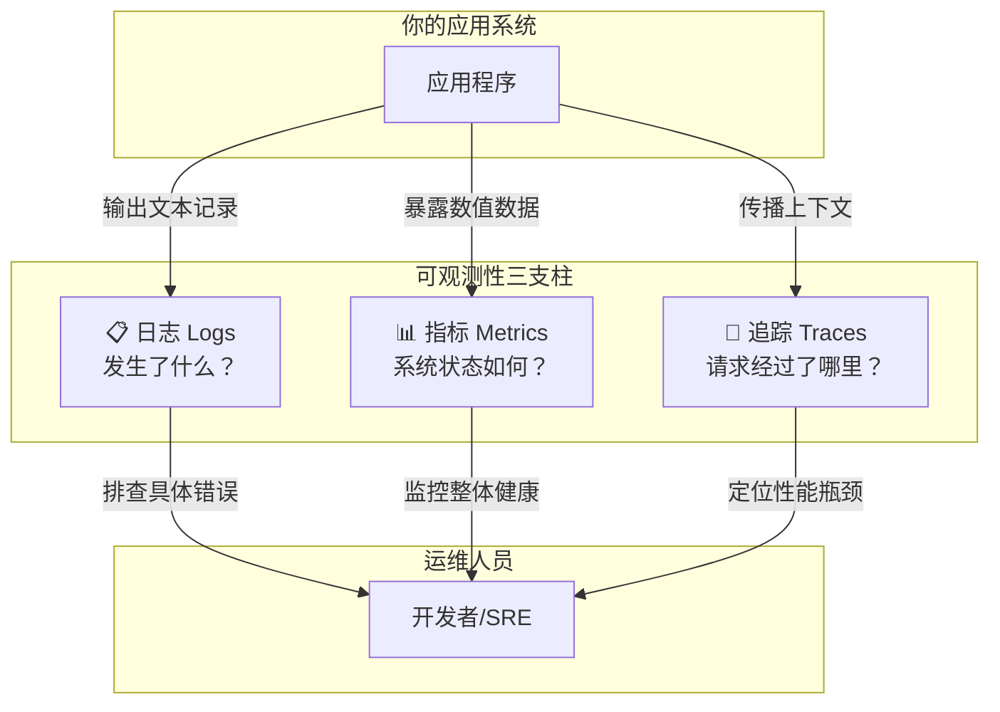

## 1.2 三支柱：日志、指标、追踪

### 📋 日志（Logs）

日志是系统产生的**离散事件记录**。每条日志描述了某个时间点发生的一件事。

**特点：**
- 非结构化或结构化文本
- 包含丰富的上下文信息
- 适合排查具体问题
- 数据量大，存储成本高

**示例：**
```json
{
  "level": "error",
  "time": "2024-01-15T10:30:00.000Z",
  "msg": "Database connection failed",
  "host": "db-primary.example.com",
  "port": 5432,
  "retries": 3,
  "err": {
    "type": "ConnectionError",
    "message": "ECONNREFUSED",
    "stack": "..."
  }
}
```

### 📊 指标（Metrics）

指标是随时间变化的**数值型测量数据**。它们通常是聚合后的统计数据。

**特点：**
- 数值类型，占用存储小
- 支持高效的聚合查询
- 适合趋势分析和告警
- 时序数据（时间戳 + 值）

**示例：**
```
http_requests_total{method="GET", path="/api/auth/login", status="200"} 1523
http_request_duration_seconds{method="GET", path="/api/auth/login", quantile="0.99"} 0.234
active_websocket_connections 42
```

### 🔗 追踪（Traces）

追踪记录了**单个请求在分布式系统中的完整旅程**。

**特点：**
- 跨服务的调用链可视化
- 包含时间维度（每个步骤耗时）
- 适合性能优化和依赖分析
- 通过 TraceID 串联所有相关 Span

**示例：**
```
TraceID: abc123
├── Span: HTTP GET /api/auth/login (200ms)
│   ├── Span: JWT 验证 (5ms)
│   ├── Span: 数据库查询用户 (50ms)
│   └── Span: 生成 Token (10ms)
```

## 1.3 三者的关系

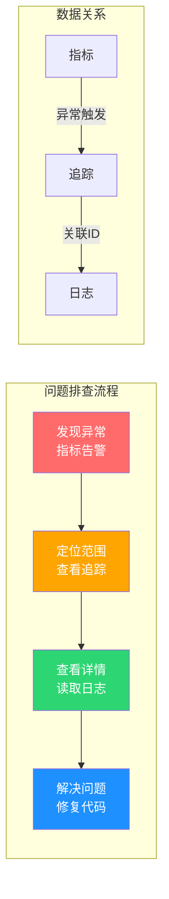

三者的关系可以用一个真实的排查场景来理解：

| 步骤 | 使用的支柱 | 操作 | 发现 |
|------|-----------|------|------|
| 1. 发现问题 | **指标** | Grafana 面板看到错误率飙升 | 5xx 错误从 0% 升到 15% |
| 2. 缩小范围 | **追踪** | 查看慢请求的 Trace | `/api/fs/write` 耗时异常 |
| 3. 查看详情 | **日志** | 按 TraceID 搜索日志 | 发现磁盘空间不足 |
| 4. 解决问题 | — | 清理磁盘、添加监控 | 问题解决 |

## 1.4 为什么需要可观测性

| 没有可观测性 | 有可观测性 |
|-------------|-----------|
| 用户反馈"网站打不开"才知道出问题 | 告警系统提前通知错误率上升 |
| 排查问题像大海捞针 | 通过 TraceID 30秒定位问题根因 |
| 不知道系统能承受多大流量 | 实时监控 QPS、延迟、错误率 |
| 扩容靠"感觉" | 基于指标数据做容量规划 |
| 故障恢复时间长（MTTR高） | 快速定位、快速修复 |

## 1.5 可观测性成熟度模型


| 级别 | 能力 | 典型工具 |
|------|------|---------|
| L0 | 无监控，靠用户反馈 | 无 |
| L1 | 有日志，但分散在各服务器 | console.log、文件日志 |
| L2 | 日志聚合 + 基础指标 | ELK + Prometheus |
| L3 | 三支柱完整，关联查询 | Grafana + Loki + Tempo |
| L4 | 智能告警，自动扩缩容 | AIOps + K8s HPA |

---

# 第二章：pino 日志库详解

## 2.1 为什么选择 pino

在 Node.js 生态中，主流的日志库有以下几个：

| 日志库 | 周下载量 | 性能 | 特点 |
|--------|---------|------|------|
| **pino** | 1200万+ | ⚡ 极快 | 结构化 JSON、传输机制、体积小 |
| **winston** | 900万+ | 中等 | 功能丰富、插件多、配置灵活 |
| **bunyan** | 50万+ | 快 | JSON 格式、CLI 工具好用 |
| **log4js** | 200万+ | 中等 | 类似 Java log4j |

AI-CLI-Mobile 项目选择 **pino** 的原因：

1. **性能是核心**：pino 是 Node.js 生态中最快的日志库，序列化开销极低
2. **结构化输出**：原生 JSON 格式，便于机器解析和日志聚合
3. **传输机制**：格式化和输出分离，生产环境零额外开销
4. **与 Fastify 深度集成**：Fastify 内置使用 pino 作为日志引擎

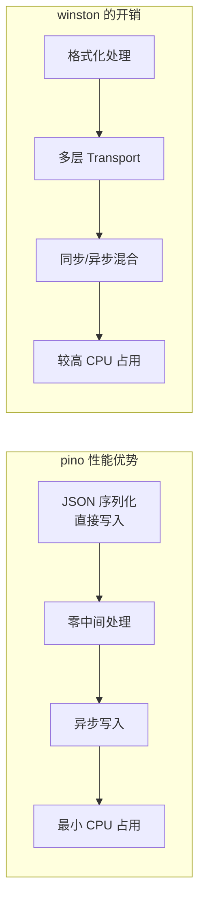

## 2.2 pino 基础用法

```typescript
import pino from 'pino'

// 创建 logger 实例
const logger = pino()

// 基本日志输出
logger.info('Hello world')
logger.error('Something went wrong')
logger.warn('This might be a problem')
logger.debug('Debugging info')

// 输出示例（JSON 格式）：
// {"level":30,"time":1705312200000,"msg":"Hello world"}
// {"level":50,"time":1705312200001,"msg":"Something went wrong"}
```

## 2.3 日志级别详解

pino 使用数值表示日志级别，**数值越小，优先级越高**：

| 级别 | 数值 | 用途 | 何时使用 |
|------|------|------|---------|
| `fatal` | 60 | 致命错误 | 进程即将崩溃，必须立即处理 |
| `error` | 50 | 错误 | 操作失败，需要关注但进程可继续 |
| `warn` | 40 | 警告 | 潜在问题，暂不影响功能 |
| `info` | 30 | 信息 | 关键业务事件，生产环境默认级别 |
| `debug` | 20 | 调试 | 开发调试信息，生产环境通常关闭 |
| `trace` | 1 | 跟踪 | 最详细的调试信息 |
| `silent` | 关闭 | 静默 | 不输出任何日志 |

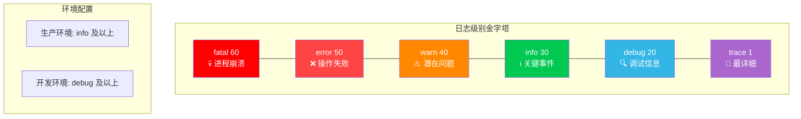

```typescript
// 设置日志级别
const logger = pino({ level: 'info' })

logger.trace('不会输出')    // level < info，被过滤
logger.debug('不会输出')    // level < info，被过滤
logger.info('会输出')       // level >= info ✓
logger.warn('会输出')       // level >= info ✓
logger.error('会输出')      // level >= info ✓
logger.fatal('会输出')      // level >= info ✓
```

在项目的 `config.ts` 中，日志级别通过环境变量 `LOG_LEVEL` 配置：

```typescript
// apps/server/src/lib/config.ts
LOG_LEVEL: z.enum(['fatal', 'error', 'warn', 'info', 'debug', 'trace', 'silent']).default('info'),
```

这意味着你可以在部署时灵活调整：
```bash
# 生产环境（默认）
LOG_LEVEL=info

# 调试问题时临时开启
LOG_LEVEL=debug

# 安静模式
LOG_LEVEL=silent
```

## 2.4 结构化日志格式

**结构化日志**（Structured Logging）是指日志以固定的字段结构输出，通常是 JSON 格式。

**非结构化日志（传统方式）：**
```
[2024-01-15 10:30:00] ERROR: User login failed for user@example.com from 192.168.1.100
```

**结构化日志（pino 方式）：**
```json
{
  "level": 50,
  "time": "2024-01-15T10:30:00.000Z",
  "msg": "User login failed",
  "user": "user@example.com",
  "ip": "192.168.1.100",
  "component": "auth",
  "duration": 125
}
```

结构化日志的优势：

| 对比维度 | 非结构化 | 结构化 |
|---------|---------|--------|
| 解析难度 | 需要正则表达式 | 直接 JSON.parse |
| 查询能力 | 全文搜索，不精确 | 字段级精确查询 |
| 聚合统计 | 困难 | 简单（按字段分组） |
| 存储效率 | 较低（重复文本） | 较高（键值对） |
| 机器可读性 | 差 | 优秀 |

```typescript
// pino 的结构化日志写法
logger.info({
  userId: 'user-123',
  action: 'login',
  ip: '192.168.1.100',
  duration: 125
}, 'User login successful')

// 输出：
// {"level":30,"time":1705312200000,"userId":"user-123","action":"login","ip":"192.168.1.100","duration":125,"msg":"User login successful"}
```

## 2.5 pino-pretty：开发环境美化

在开发环境中，直接看 JSON 日志非常痛苦。pino-pretty 是一个开发时使用的格式化工具：

```typescript
import pino from 'pino'

const logger = pino({
  transport: {
    target: 'pino-pretty',
    options: {
      colorize: true,           // 彩色输出
      translateTime: 'SYS:HH:MM:ss',  // 可读时间格式
      ignore: 'pid,hostname',   // 忽略不需要的字段
    },
  },
})

logger.info({ userId: 'user-123' }, 'User logged in')
```

**美化后的输出：**
```
[10:30:00] INFO: User logged in
    userId: "user-123"
```

**vs 原始 JSON 输出：**
```json
{"level":30,"time":1705312200000,"pid":12345,"hostname":"server-01","userId":"user-123","msg":"User logged in"}
```

> ⚠️ **重要**：pino-pretty 只用于开发环境！生产环境应该输出原始 JSON，因为：
> - pino-pretty 有额外的 CPU 开销（格式化 + 颜色代码）
> - 日志聚合系统需要 JSON 格式
> - JSON 格式更紧凑，传输和存储效率更高

## 2.6 传输（Transport）机制

pino 的**传输**（Transport）是其最独特的设计之一。它将"日志格式化"和"日志输出"分离：

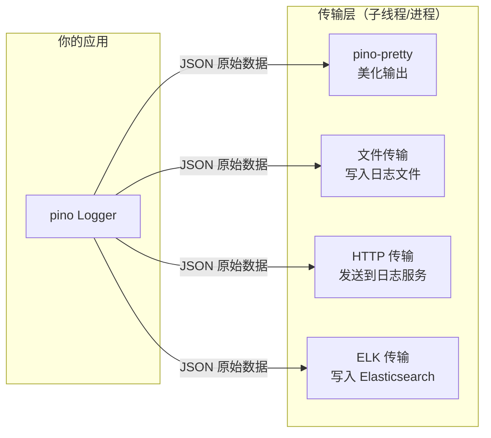

```typescript
// 多传输示例：同时输出到控制台和文件
const logger = pino({
  transport: {
    targets: [
      {
        target: 'pino-pretty',     // 控制台美化
        options: { colorize: true },
        level: 'info',
      },
      {
        target: 'pino/file',       // 文件输出
        options: { destination: '/var/log/app.log' },
        level: 'debug',
      },
    ],
  },
})
```

## 2.7 子 Logger 与上下文绑定

子 Logger 可以为特定模块或请求绑定固定的上下文字段：

```typescript
// 创建子 Logger，自动附加 component 字段
const dbLogger = logger.child({ component: 'database' })
const authLogger = logger.child({ component: 'auth' })

dbLogger.info('Query executed')  
// {"level":30,...,"component":"database","msg":"Query executed"}

authLogger.info('Token verified')
// {"level":30,...,"component":"auth","msg":"Token verified"}
```

```typescript
// 在 HTTP 请求中绑定请求 ID
fastify.addHook('onRequest', async (request) => {
  request.log = logger.child({ 
    requestId: request.id,
    method: request.method,
    url: request.url,
  })
})

// 后续所有 request.log 输出都自动包含请求上下文
```

## 2.8 pino 性能优势解析

pino 为什么这么快？核心原因有三个：

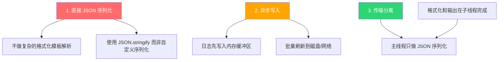

**基准测试对比：**

| 操作 | pino | winson | bunyan |
|------|------|--------|--------|
| 基本日志（ops/sec） | 35,000 | 8,000 | 15,000 |
| 带对象日志（ops/sec） | 28,000 | 5,000 | 10,000 |
| 带错误日志（ops/sec） | 20,000 | 3,000 | 8,000 |

> 💡 在高并发场景下，日志库的性能直接影响应用的吞吐量。选择 pino 意味着日志不会成为性能瓶颈。

---

# 第三章：项目 pinoLogger 实现分析

## 3.1 问题背景：模块加载时序

在 Node.js/ESM 中，模块在 `import` 时就会执行顶层代码。这带来一个问题：

```typescript
// ❌ 问题代码：模块加载时就初始化 logger
import pino from 'pino'
import { getConfig } from './config.js'

const logger = pino({ level: getConfig().LOG_LEVEL })
// 问题：getConfig() 在 import 时就被调用
// 但测试环境中 process.env 可能还没设置好！
```

**时序问题示意：**

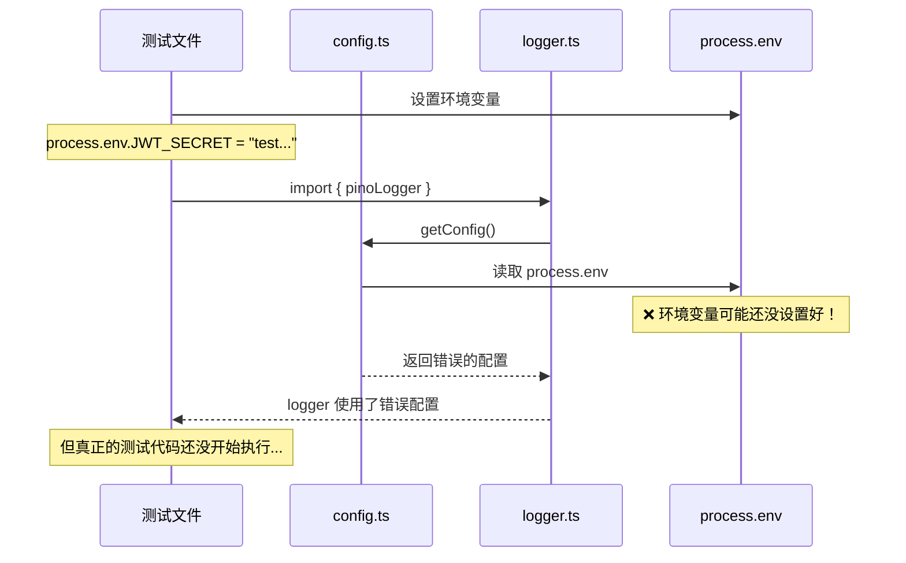

## 3.2 Proxy 懒初始化模式

项目使用 **ES6 Proxy** 实现懒初始化，完美解决了时序问题：

```typescript
// apps/server/src/lib/logger.ts
import pinoPkg from 'pino'
const pino = pinoPkg as unknown as typeof import('pino') extends { default: infer D } ? D : never
import { getConfig } from './config.js'

// 懒初始化：首次调用时才创建 logger
let _logger: ReturnType<typeof pino> | null = null

function getLogger() {
  if (!_logger) {
    const config = getConfig()
    const isProduction = config.NODE_ENV === 'production'
    _logger = pino({
      level: config.LOG_LEVEL,
      ...(isProduction
        ? {}
        : {
            transport: {
              target: 'pino-pretty',
              options: {
                colorize: true,
                translateTime: 'SYS:HH:MM:ss',
                ignore: 'pid,hostname',
              },
            },
          }),
    })
  }
  return _logger
}

// 导出 Proxy 对象，首次属性访问时才初始化
export const pinoLogger = new Proxy({} as ReturnType<typeof pino>, {
  get(_target, prop: string) {
    const logger = getLogger()
    const fn = (logger as Record<string, unknown>)[prop]
    return typeof fn === 'function' ? fn.bind(logger) : fn
  },
})
```

## 3.3 逐行代码讲解

让我们逐行分析这段精巧的代码：

### 第一部分：CJS 互操作

```typescript
import pinoPkg from 'pino'
const pino = pinoPkg as unknown as typeof import('pino') extends { default: infer D } ? D : never
```

**为什么需要这个？**

pino 8.x 的类型定义是为 CommonJS 设计的。在 ESM（`"type": "module"`）中导入时，类型不匹配。这行代码使用 TypeScript 的条件类型做了类型转换：


### 第二部分：懒初始化函数

```typescript
let _logger: ReturnType<typeof pino> | null = null

function getLogger() {
  if (!_logger) {                    // 首次调用时 _logger 是 null
    const config = getConfig()       // 此时才读取配置！
    const isProduction = config.NODE_ENV === 'production'
    _logger = pino({
      level: config.LOG_LEVEL,       // 使用配置中的日志级别
      ...(isProduction
        ? {}                         // 生产环境：纯 JSON 输出
        : {
            transport: {             // 开发环境：pino-pretty 美化
              target: 'pino-pretty',
              options: {
                colorize: true,
                translateTime: 'SYS:HH:MM:ss',
                ignore: 'pid,hostname',
              },
            },
          }),
    })
  }
  return _logger                     // 后续调用直接返回缓存
}
```

**关键设计决策：**

| 决策 | 原因 |
|------|------|
| 使用闭包而非类 | 更轻量，无需 `this` 绑定 |
| 缓存到 `_logger` | 避免重复创建 pino 实例 |
| 条件加载 pino-pretty | 生产环境零额外开销 |
| 使用扩展运算符 `...` | 优雅地合并条件配置 |

### 第三部分：Proxy 代理

```typescript
export const pinoLogger = new Proxy({} as ReturnType<typeof pino>, {
  get(_target, prop: string) {
    const logger = getLogger()                              // 懒初始化
    const fn = (logger as Record<string, unknown>)[prop]   // 获取属性
    return typeof fn === 'function' ? fn.bind(logger) : fn  // 函数绑定 this
  },
})
```

**Proxy 的工作原理：**

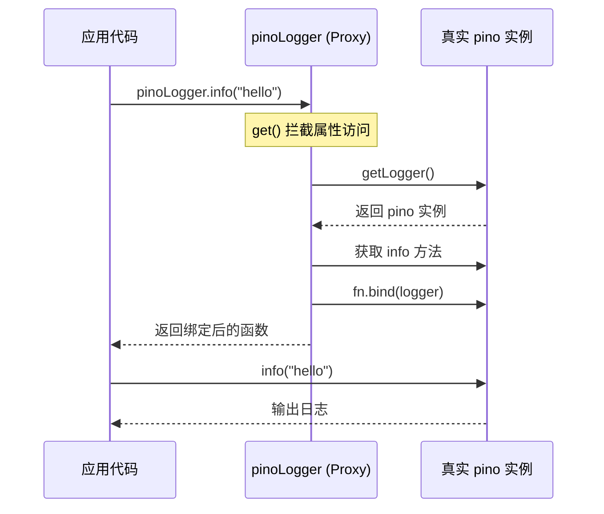

> 💡 `fn.bind(logger)` 非常重要！它确保方法内部的 `this` 指向正确的 pino 实例。如果不 bind，调用时 `this` 会是 `undefined`（严格模式下）。

## 3.4 为什么不用 setTimeout 或函数导出

你可能会想，有更简单的方案吗？

**方案 A：函数导出**
```typescript
// ❌ 每次调用都要检查
export function getLogger() { ... }
getLogger().info('hello')  // 每次都要调用 getLogger()
```

**方案 B：setTimeout 延迟初始化**
```typescript
// ❌ 时序不确定，可能在需要时还没初始化
setTimeout(() => { logger = pino(...) }, 0)
```

**方案 C：导出函数而非对象**
```typescript
// ❌ 破坏了 pino 的 API 接口
export function createLogger() { return pino(...) }
```

**Proxy 方案的优势：**

| 方案 | 使用体验 | 类型安全 | 时序安全 |
|------|---------|---------|---------|
| 函数导出 | `getLogger().info()` | ✅ | ✅ |
| setTimeout | `logger?.info()` | ❌ | ❌ |
| **Proxy** | `pinoLogger.info()` | ✅ | ✅ |

## 3.5 在 Fastify 中集成

项目的 `index.ts` 展示了如何将 pinoLogger 集成到 Fastify：

```typescript
// apps/server/src/index.ts
import { pinoLogger } from './lib/logger.js'

// 将 pino 实例作为 Fastify 的日志后端
const fastify = Fastify({ loggerInstance: pinoLogger })
```

**这行代码做了什么？**

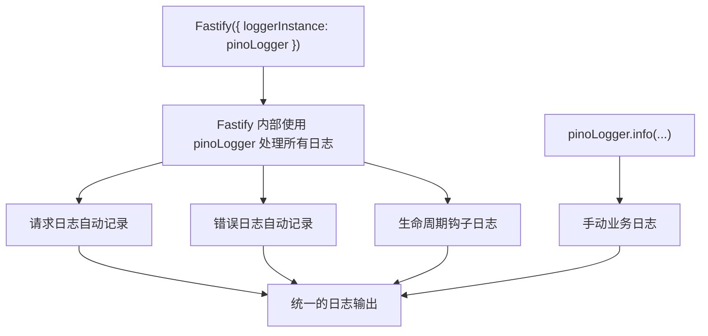

Fastify 会自动为每个请求生成日志，包含：
- 请求方法和 URL
- 响应状态码
- 请求耗时
- 请求 ID

```json
{"level":30,"time":1705312200000,"req":{"method":"GET","url":"/api/auth/login"},"res":{"statusCode":200},"responseTime":125,"msg":"request completed"}
```

---

# 第四章：结构化日志最佳实践

## 4.1 什么是结构化日志

结构化日志 = **固定字段 + JSON 格式 + 机器可解析**。

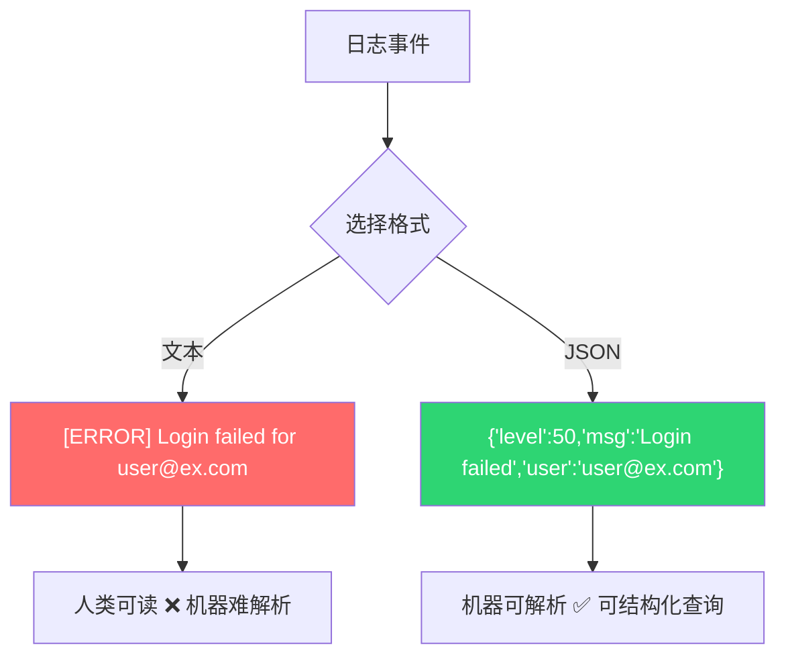

## 4.2 JSON 日志格式规范

一个符合规范的 JSON 日志应包含以下字段：

```json
{
  "level": 30,
  "time": "2024-01-15T10:30:00.000Z",
  "msg": "User login successful",
  "pid": 12345,
  "hostname": "server-01",
  "requestId": "req-abc123",
  "userId": "user-456",
  "component": "auth",
  "duration": 125,
  "metadata": {
    "ip": "192.168.1.100",
    "userAgent": "Mozilla/5.0..."
  }
}
```

**字段分类：**

| 字段类别 | 字段 | 说明 |
|---------|------|------|
| **pino 内置** | `level`, `time`, `pid`, `hostname` | pino 自动添加 |
| **消息** | `msg` | 日志的核心描述 |
| **请求上下文** | `requestId`, `method`, `url` | HTTP 请求信息 |
| **业务上下文** | `userId`, `sessionId`, `component` | 业务相关信息 |
| **性能数据** | `duration`, `memoryUsage` | 性能度量 |
| **错误信息** | `err.type`, `err.message`, `err.stack` | 错误详情 |

## 4.3 上下文信息注入

**方式一：child Logger**
```typescript
// 创建带固定上下文的子 Logger
const requestLogger = logger.child({
  requestId: 'req-abc123',
  userId: 'user-456',
})

requestLogger.info('Processing payment')
// 自动包含 requestId 和 userId
```

**方式二：请求中间件**
```typescript
// Fastify 中自动注入请求上下文
fastify.addHook('onRequest', async (request) => {
  request.log = request.log.child({
    requestId: request.id,
    method: request.method,
    url: request.url,
    ip: request.ip,
  })
})
```

**方式三：工厂模式**
```typescript
function createServiceLogger(serviceName: string) {
  return logger.child({ service: serviceName })
}

const authLogger = createServiceLogger('auth')
const fsLogger = createServiceLogger('filesystem')
```

## 4.4 日志级别选择指南

| 场景 | 级别 | 示例 |
|------|------|------|
| 服务启动/关闭 | `info` | `"Server listening on port 3000"` |
| 用户登录成功 | `info` | `"User login successful"` |
| API 请求完成 | `info` | `"GET /api/users 200 125ms"` |
| 配置缺失使用默认值 | `warn` | `"CORS_ORIGINS not set, allowing all origins"` |
| 认证失败 | `warn` | `"Invalid JWT token from 192.168.1.100"` |
| 数据库连接失败 | `error` | `"Database connection refused"` |
| 文件写入失败 | `error` | `"Failed to write audit log"` |
| 进程即将崩溃 | `fatal` | `"Out of memory, shutting down"` |
| SQL 查询详情 | `debug` | `"SELECT * FROM users WHERE id = ?"` |
| 循环中的中间状态 | `trace` | `"Processing chunk 3/100"` |

**选择原则：**

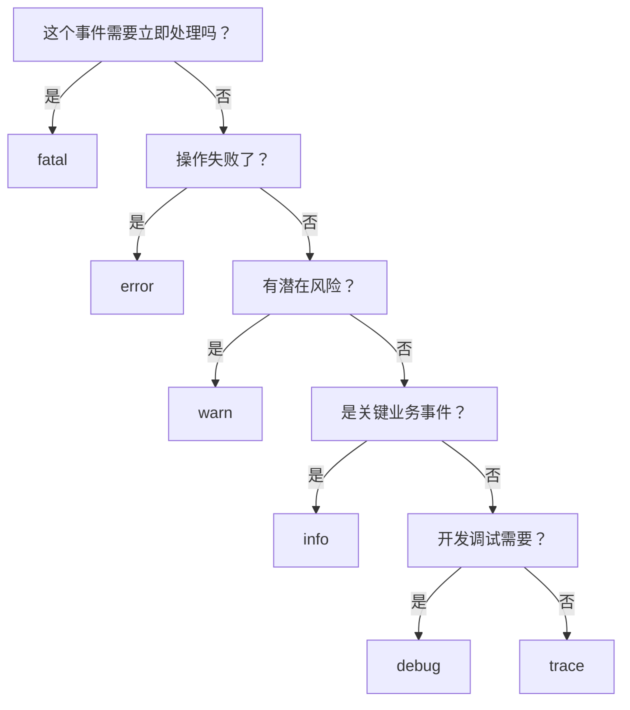

## 4.5 日志中的敏感数据脱敏

**永远不要在日志中记录以下信息：**

| 危险数据 | 风险 | 替代方案 |
|---------|------|---------|
| 密码明文 | 泄露用户账户 | 记录 `"password_provided": true` |
| JWT Token | 被盗用身份 | 记录 token 的前 8 位 |
| API Key | 被盗用服务 | 记录 key 的后 4 位 |
| 信用卡号 | 金融欺诈 | 记录 `"card": "****1234"` |
| 身份证号 | 隐私泄露 | 记录 `"idType": "身份证"` |
| 完整 IP | 隐私问题 | 考虑脱敏最后一位 |

```typescript
// ❌ 危险：记录敏感信息
logger.info({ password: '123456' }, 'User login')

// ✅ 安全：只记录是否存在
logger.info({ hasPassword: true }, 'User login attempt')

// ✅ 安全：部分遮蔽
logger.info({ token: token.substring(0, 8) + '...' }, 'Token received')
```

## 4.6 错误日志最佳实践

```typescript
// ❌ 不好：只记录错误消息
logger.error('Database connection failed')

// ✅ 好：记录完整的错误对象
logger.error({
  err: error,                    // pino 会自动序列化 Error 对象
  host: 'db-primary.example.com',
  port: 5432,
  retries: 3,
  duration: 5000,
}, 'Database connection failed')

// ✅ 好：区分预期错误和意外错误
try {
  await db.query('SELECT ...')
} catch (err) {
  if (err.code === 'ECONNREFUSED') {
    logger.error({ err, host }, 'Database unreachable')
  } else {
    logger.fatal({ err }, 'Unexpected database error')
  }
}
```

**pino 的 Error 序列化：**

pino 会自动将 `Error` 对象序列化为：
```json
{
  "err": {
    "type": "Error",
    "message": "Connection refused",
    "stack": "Error: Connection refused\n    at ..."
  }
}
```

## 4.7 请求生命周期日志

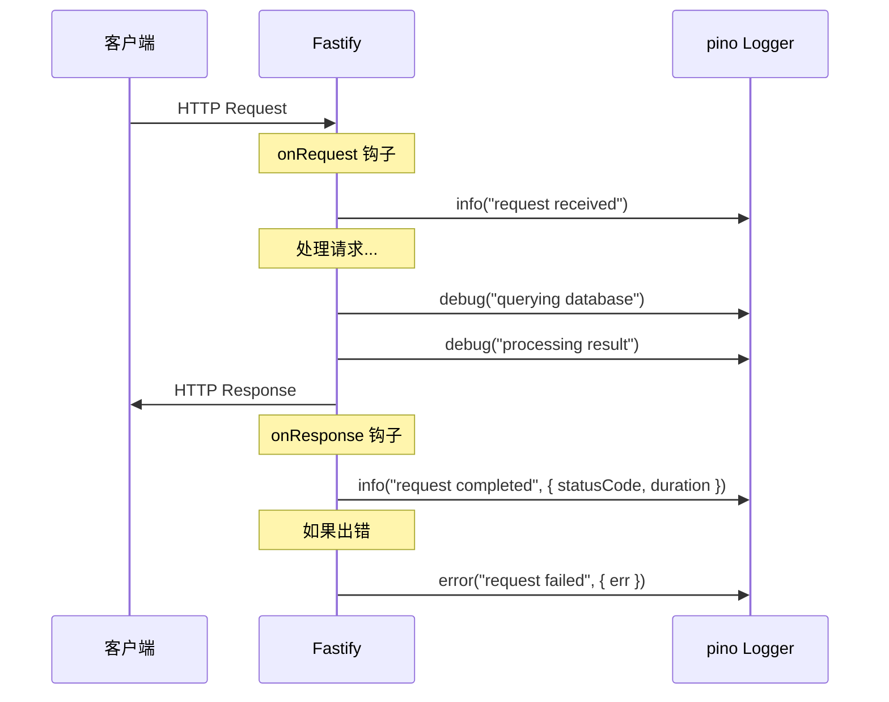

```typescript
// Fastify 的请求日志最佳实践
fastify.addHook('onRequest', async (request) => {
  request.log.info({ 
    method: request.method,
    url: request.url,
    ip: request.ip,
  }, 'Request received')
})

fastify.addHook('onResponse', async (request, reply) => {
  request.log.info({
    statusCode: reply.statusCode,
    duration: Math.round(reply.elapsedTime),
  }, 'Request completed')
})
```

---

# 第五章：审计日志系统

## 5.1 什么是审计日志

审计日志（Audit Log）是记录**安全相关事件**的专用日志，与普通应用日志有本质区别：

| 对比维度 | 应用日志 | 审计日志 |
|---------|---------|---------|
| **目的** | 排查技术问题 | 合规、追责、安全分析 |
| **内容** | 调试信息、错误堆栈 | 用户操作、权限变更 |
| **保留期** | 数天到数周 | 数月到数年（法规要求） |
| **完整性** | 可以丢失部分 | 不能丢失任何一条 |
| **访问权限** | 开发团队 | 安全团队、审计人员 |
| **修改** | 可以轮转/删除 | 一旦写入不可修改 |

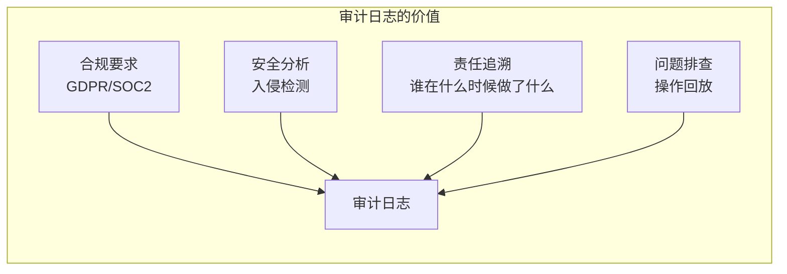

## 5.2 项目 audit.ts 逐行分析

AI-CLI-Mobile 的审计日志实现位于 `apps/server/src/core/audit.ts`：

```typescript
import { createWriteStream, WriteStream } from 'fs'
import path from 'path'
import { pinoLogger } from '../lib/logger.js'
import { getConfig } from './config.js'

function getAuditLogPath(): string {
  return path.join(getConfig().PROJECT_ROOT, '.audit.log')
}
```

**解析：**
- 使用独立的 `.audit.log` 文件，与应用日志分离
- 文件以 `.` 开头，隐藏文件，避免意外暴露
- 路径基于 `PROJECT_ROOT`，可在部署时配置

### 审计事件类型

```typescript
export type AuditEvent =
  | 'LOGIN'              // 用户登录成功
  | 'LOGIN_FAILED'       // 登录失败（密码错误等）
  | 'LOGOUT'             // 用户登出
  | 'SESSION_CREATE'     // 创建终端会话
  | 'SESSION_DESTROY'    // 销毁终端会话
  | 'FILE_READ'          // 读取文件
  | 'FILE_WRITE'         // 写入文件
  | 'FILE_WRITE_BLOCKED' // 文件写入被阻止（安全策略）
  | 'WS_CONNECT'         // WebSocket 连接建立
  | 'WS_DISCONNECT'      // WebSocket 连接断开
  | 'USER_LIST'          // 查看用户列表
  | 'USER_CREATE'        // 创建用户
  | 'USER_DELETE'        // 删除用户
  | 'USER_PASSWORD_CHANGE' // 修改密码
```

**事件分类：**

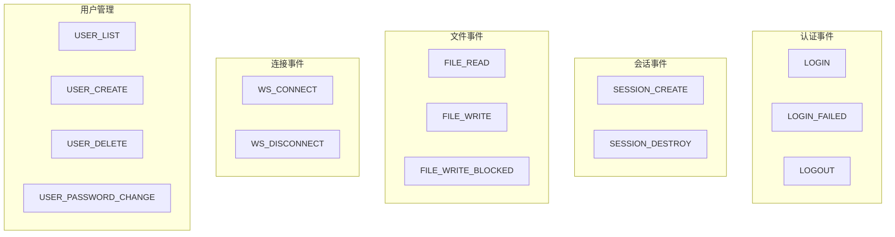

## 5.3 审计事件类型设计

设计审计事件类型时应遵循的原则：

| 原则 | 说明 | 示例 |
|------|------|------|
| **动词+名词** | 事件名应清晰表达动作 | `FILE_WRITE` 而非 `FILE` |
| **成功/失败分离** | 区分成功和失败的操作 | `LOGIN` vs `LOGIN_FAILED` |
| **覆盖所有安全操作** | 不遗漏任何敏感操作 | 登录、文件操作、用户管理 |
| **使用联合类型** | TypeScript 联合类型约束 | `type AuditEvent = 'A' \| 'B'` |

```typescript
// ✅ 好的设计：类型安全的联合类型
type AuditEvent = 'LOGIN' | 'LOGIN_FAILED' | 'LOGOUT'

// ❌ 不好的设计：字符串类型，容易拼错
type AuditEvent = string
```

## 5.4 WriteStream 异步写入

项目使用 `createWriteStream` 而非 `appendFileSync`：

```typescript
// [S6修复] 使用 createWriteStream 异步写入，避免 appendFileSync 阻塞事件循环
let stream: WriteStream | null = null

function getStream(): WriteStream {
  if (!stream) {
    stream = createWriteStream(getAuditLogPath(), { flags: 'a' })  // 'a' = append 模式
    stream.on('error', (err) => {
      pinoLogger.error({ err }, 'Audit log stream error')
      stream?.destroy()
      stream = null  // 重置，下次调用创建新流
    })
  }
  return stream
}
```

**为什么不用 `appendFileSync`？**

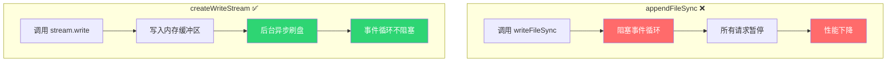

**同步 vs 异步写入对比：**

| 方式 | 阻塞事件循环 | 吞吐量 | 数据安全性 |
|------|-------------|--------|-----------|
| `appendFileSync` | ✅ 是（每次写入） | 低 | 高（立即落盘） |
| `createWriteStream` | ❌ 否 | 高 | 中（缓冲区刷新） |
| `fs.promises.appendFile` | ❌ 否 | 中 | 中 |

## 5.5 背压处理机制

当写入速度超过磁盘 I/O 速度时，会产生**背压**（Backpressure）：

```typescript
export function auditLog(event: AuditEvent, userId?: string, details?: Record<string, unknown>): void {
  const entry = {
    timestamp: new Date().toISOString(),
    event,
    userId: userId ?? null,
    details: details ?? null,
  }

  const line = JSON.stringify(entry) + '\n'

  try {
    const ok = getStream().write(line)
    if (!ok) {
      // ⚠️ 背压：缓冲区满了
      pinoLogger.warn('Audit log write returned false (backpressure)')
    }
  } catch (err) {
    // 写入失败：销毁当前流，重试
    pinoLogger.error({ err }, 'Failed to write audit log, retrying with fresh stream')
    stream?.destroy()
    stream = null
    try {
      getStream().write(line)
    } catch (retryErr) {
      pinoLogger.error({ err: retryErr }, 'Audit log retry also failed')
    }
  }
}
```

**背压处理流程：**

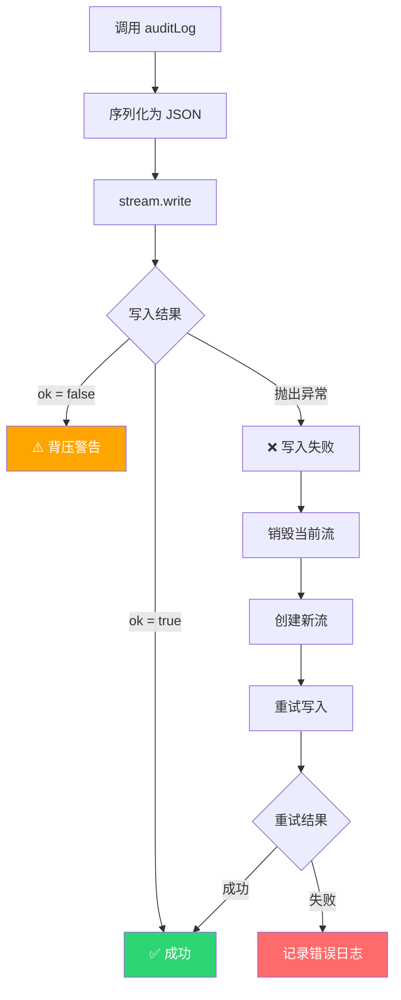

## 5.6 优雅关闭与流刷新

服务器关闭时必须确保所有审计日志都已写入磁盘：

```typescript
export function closeAuditLog(): Promise<void> {
  return new Promise((resolve) => {
    if (stream) {
      stream.end(() => {
        stream = null
        resolve()
      })
    } else {
      resolve()
    }
  })
}
```

**在服务器关闭时调用：**

```typescript
// apps/server/src/index.ts
async function shutdown() {
  // ... 其他清理工作 ...
  
  // 刷新并关闭审计日志流
  await closeAuditLog()
  
  // 关闭 HTTP 服务器
  await fastify.close()
  process.exit(0)
}

process.on('SIGINT', shutdown)
process.on('SIGTERM', shutdown)
```

**优雅关闭流程：**

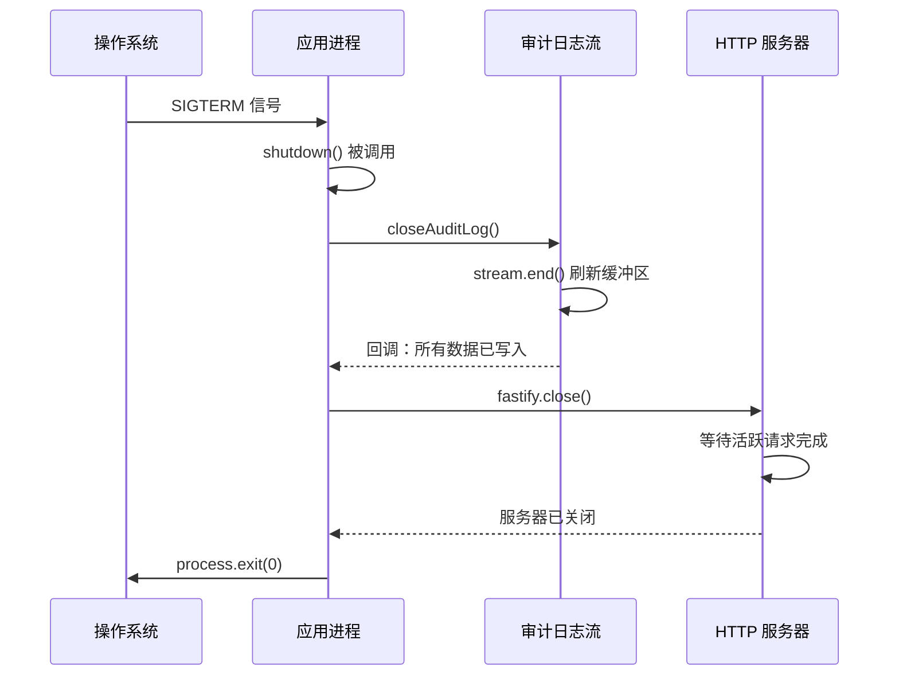

## 5.7 审计日志 vs 应用日志

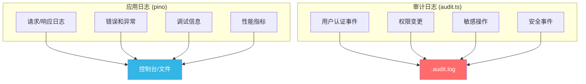

---

# 第六章：健康检查端点

## 6.1 什么是健康检查

健康检查（Health Check）是一个 HTTP 端点，用于告诉外部系统"我是否正常运行"。它就像人体的心跳——不需要说话，只要跳动就说明还活着。

```mermaid
graph LR
    LB[负载均衡器] -->|定期检查| HC["/health 端点"]
    HC -->|返回 200| LB
    LB -->|健康 ✅| App1[应用实例 1]
    LB -->|健康 ✅| App2[应用实例 2]
    HC -->|返回 500| LB
    LB -->|不健康 ❌ 不转发流量| App3[应用实例 3]
```

## 6.2 项目 /health 端点分析

AI-CLI-Mobile 的健康检查端点实现非常简洁：

```typescript
// apps/server/src/index.ts
// [W18修复] 移除 timestamp 避免信息泄露
fastify.get('/health', {
  schema: {
    summary: '健康检查',
    description: '返回服务健康状态',
    security: [],           // 无需认证！
    response: {
      200: {
        type: 'object',
        properties: {
          status: { type: 'string', example: 'ok' },
        },
      },
    },
  },
}, async () => ({ status: 'ok' }))
```

**关键设计决策：**

| 决策 | 原因 |
|------|------|
| `security: []` | 健康检查不应需要认证（负载均衡器没有 Token） |
| 移除 timestamp | 避免信息泄露（[W18修复]） |
| 极简响应 | 减少网络开销，快速响应 |
| Swagger 文档 | 通过 `schema` 自动生成 API 文档 |

**对应测试：**

```typescript
// apps/server/src/__tests__/health.test.ts
describe('Health endpoint', () => {
  it('should return ok status', async () => {
    const app = Fastify()
    app.get('/health', async () => ({ status: 'ok' }))

    const res = await app.inject({
      method: 'GET',
      url: '/health',
    })
    expect(res.statusCode).toBe(200)
    expect(res.json().status).toBe('ok')
  })
})
```

## 6.3 健康检查的层次

健康检查可以分三个层次，从简单到复杂：

```mermaid
graph TD
    subgraph "Level 1: 存活检查 (Liveness)"
        L["GET /health<br/>返回 200 = 活着"]
    end
    
    subgraph "Level 2: 就绪检查 (Readiness)"
        R["GET /health/ready<br/>检查依赖是否就绪"]
    end
    
    subgraph "Level 3: 详细检查 (Detail)"
        D["GET /health/detail<br/>返回各组件状态"]
    end

    L --> R --> D
```

```typescript
// Level 1: 最简单（项目当前实现）
fastify.get('/health', async () => ({ status: 'ok' }))

// Level 2: 检查关键依赖
fastify.get('/health/ready', async () => {
  const checks = {
    database: await checkDatabase(),
    redis: await checkRedis(),
  }
  const ready = Object.values(checks).every(c => c.status === 'ok')
  return ready 
    ? { status: 'ready', checks }
    : reply.code(503).send({ status: 'not ready', checks })
})

// Level 3: 详细状态
fastify.get('/health/detail', async () => ({
  status: 'ok',
  uptime: process.uptime(),
  memory: process.memoryUsage(),
  version: process.env.APP_VERSION,
  nodeVersion: process.version,
}))
```

## 6.4 Docker 中的健康检查

在 Dockerfile 中配置健康检查：

```dockerfile
# Dockerfile
FROM node:20-alpine
WORKDIR /app
COPY . .
RUN npm ci --production
EXPOSE 3000

HEALTHCHECK --interval=30s --timeout=5s --start-period=10s --retries=3 \
  CMD wget --no-verbose --tries=1 --spider http://localhost:3000/health || exit 1

CMD ["node", "dist/index.js"]
```

**HEALTHCHECK 参数说明：**

| 参数 | 默认值 | 说明 |
|------|--------|------|
| `--interval` | 30s | 检查间隔 |
| `--timeout` | 30s | 超时时间 |
| `--start-period` | 0s | 启动等待期（此期间失败不计入重试次数） |
| `--retries` | 3 | 连续失败几次后标记为 unhealthy |

```mermaid
stateDiagram-v2
    [*] --> Starting: 容器启动
    Starting --> Healthy: 健康检查通过
    Starting --> Starting: start-period 内失败（忽略）
    Healthy --> Unhealthy: 连续 3 次失败
    Unhealthy --> Healthy: 健康检查通过
    Unhealthy --> [*]: Docker 重启容器
```

## 6.5 Kubernetes 健康检查

在 K8s 中，健康检查通过 Pod 的探针（Probe）实现：

```yaml
# deployment.yaml
apiVersion: apps/v1
kind: Deployment
metadata:
  name: ai-cli-server
spec:
  template:
    spec:
      containers:
        - name: server
          image: ai-cli-server:latest
          ports:
            - containerPort: 3000
          
          # 存活探针：容器是否还活着？
          livenessProbe:
            httpGet:
              path: /health
              port: 3000
            initialDelaySeconds: 10
            periodSeconds: 15
            timeoutSeconds: 3
            failureThreshold: 3
          
          # 就绪探针：容器是否准备好接收流量？
          readinessProbe:
            httpGet:
              path: /health/ready
              port: 3000
            initialDelaySeconds: 5
            periodSeconds: 10
            timeoutSeconds: 3
            failureThreshold: 3
          
          # 启动探针：容器是否启动完成？
          startupProbe:
            httpGet:
              path: /health
              port: 3000
            failureThreshold: 30
            periodSeconds: 2
```

## 6.6 就绪探针 vs 存活探针

| 探针 | 失败后果 | 用途 | 检查内容 |
|------|---------|------|---------|
| **Liveness** | 重启容器 | 检测死锁、内存泄漏 | 进程是否响应 |
| **Readiness** | 从 Service 摘除 | 依赖是否就绪 | 数据库连接、缓存状态 |
| **Startup** | 等待启动完成 | 慢启动应用 | 应用初始化状态 |

```mermaid
graph TD
    subgraph "Pod 生命周期"
        A[Pod 创建] --> B[Startup Probe]
        B -->|成功| C[加入 Service]
        B -->|超时| D[重启容器]
        
        C --> E[Liveness Probe<br/>每15秒]
        C --> F[Readiness Probe<br/>每10秒]
        
        E -->|失败 3 次| D
        F -->|失败| G[从 Service 摘除]
        F -->|恢复| C
    end
```

---

# 第七章：Prometheus 指标采集

## 7.1 Prometheus 是什么

Prometheus 是一个开源的**监控和告警系统**，是 CNCF（云原生计算基金会）的第二个毕业项目（第一个是 Kubernetes）。

```mermaid
graph LR
    subgraph "Prometheus 架构"
        App1[应用 1<br/>/metrics] -->|拉取| Prom[Prometheus<br/>Server]
        App2[应用 2<br/>/metrics] -->|拉取| Prom
        App3[应用 3<br/>/metrics] -->|拉取| Prom
        Prom -->|存储| TSDB[时序数据库]
        Prom -->|告警| AM[AlertManager]
        AM -->|通知| Slack[Slack/邮件/...]
        Prom -->|查询| Grafana[Grafana<br/>可视化]
    end
```

**核心特点：**
- **拉取模式**（Pull）：Prometheus 主动从应用拉取指标，而非应用推送
- **时序数据库**：高效存储带时间戳的数值数据
- **PromQL**：强大的查询语言
- **服务发现**：自动发现新加入的服务

## 7.2 四种指标类型

Prometheus 定义了四种指标类型：

```mermaid
graph TD
    subgraph "Counter 计数器"
        C["只增不减<br/>如：请求总数、错误总数"]
        C --> C1["http_requests_total"]
    end
    
    subgraph "Gauge 仪表盘"
        G["可增可减<br/>如：当前连接数、内存使用"]
        G --> G1["active_connections"]
    end
    
    subgraph "Histogram 直方图"
        H["分桶统计<br/>如：请求延迟分布"]
        H --> H1["http_request_duration_seconds"]
    end
    
    subgraph "Summary 摘要"
        S["客户端计算分位数<br/>如：P99 延迟"]
        S --> S1["rpc_duration_seconds"]
    end
```

| 类型 | 特点 | 适用场景 | 示例 |
|------|------|---------|------|
| **Counter** | 只增不减，重启归零 | 累计计数 | `http_requests_total` |
| **Gauge** | 可增可减 | 当前状态值 | `active_websocket_connections` |
| **Histogram** | 分桶统计，服务端计算分位数 | 延迟分布 | `http_request_duration_seconds` |
| **Summary** | 客户端计算分位数 | 精确分位数 | `rpc_duration_seconds` |

## 7.3 prom-client 库使用

```typescript
import { Counter, Gauge, Histogram, register } from 'prom-client'

// Counter：HTTP 请求计数器
const httpRequestsTotal = new Counter({
  name: 'http_requests_total',
  help: 'Total number of HTTP requests',
  labelNames: ['method', 'path', 'status'],
})

// Gauge：当前活跃 WebSocket 连接数
const activeConnections = new Gauge({
  name: 'active_websocket_connections',
  help: 'Number of active WebSocket connections',
})

// Histogram：请求延迟分布
const httpRequestDuration = new Histogram({
  name: 'http_request_duration_seconds',
  help: 'HTTP request duration in seconds',
  labelNames: ['method', 'path'],
  buckets: [0.01, 0.05, 0.1, 0.5, 1, 2, 5],
})

// 使用示例
httpRequestsTotal.inc({ method: 'GET', path: '/api/auth/login', status: '200' })
activeConnections.inc()
activeConnections.dec()

const end = httpRequestDuration.startTimer()
// ... 处理请求 ...
end({ method: 'GET', path: '/api/auth/login' })
```

## 7.4 /metrics 端点实现

```typescript
import { register } from 'prom-client'

// 收集默认指标（CPU、内存、事件循环延迟等）
import { collectDefaultMetrics } from 'prom-client'
collectDefaultMetrics()

// 注册 /metrics 端点
fastify.get('/metrics', async (request, reply) => {
  reply.header('Content-Type', register.contentType)
  return register.metrics()
})
```

**默认指标示例：**

```
# HELP process_cpu_seconds_total Total user and system CPU time spent in seconds.
# TYPE process_cpu_seconds_total counter
process_cpu_seconds_total 12.34

# HELP process_resident_memory_bytes Resident memory size in bytes.
# TYPE process_resident_memory_bytes gauge
process_resident_memory_bytes 52428800

# HELP nodejs_eventloop_lag_seconds Lag of event loop in seconds.
# TYPE nodejs_eventloop_lag_seconds gauge
nodejs_eventloop_lag_seconds 0.001234
```

## 7.5 自定义业务指标

针对 AI-CLI-Mobile 项目，可以定义以下业务指标：

```typescript
// 会话相关
const sessionsTotal = new Counter({
  name: 'ai_cli_sessions_total',
  help: 'Total number of CLI sessions created',
  labelNames: ['adapter'],  // claude, aider, shell
})

const activeSessions = new Gauge({
  name: 'ai_cli_active_sessions',
  help: 'Number of currently active CLI sessions',
})

const sessionDuration = new Histogram({
  name: 'ai_cli_session_duration_seconds',
  help: 'Duration of CLI sessions',
  labelNames: ['adapter'],
  buckets: [60, 300, 600, 1800, 3600, 7200],
})

// WebSocket 相关
const wsConnections = new Gauge({
  name: 'ai_cli_ws_connections',
  help: 'Active WebSocket connections',
  labelNames: ['channel'],  // terminal, control
})

// 文件操作
const fileOperations = new Counter({
  name: 'ai_cli_file_operations_total',
  help: 'Total file operations',
  labelNames: ['operation', 'status'],  // read/write, success/blocked
})
```

## 7.6 指标命名规范

Prometheus 有严格的命名规范：

```
<namespace>_<subsystem>_<name>_<unit>_<suffix>
```

| 部分 | 说明 | 示例 |
|------|------|------|
| namespace | 项目/组织前缀 | `ai_cli` |
| subsystem | 子系统名称 | `http`, `ws`, `session` |
| name | 指标名称 | `requests`, `connections` |
| unit | 单位 | `_seconds`, `_bytes` |
| suffix | 后缀 | `_total`（Counter 必须） |

**命名示例：**
```
ai_cli_http_requests_total          ✅ 好
ai_cli_ws_connections               ✅ 好
ai_cli_session_duration_seconds     ✅ 好
requests                            ❌ 缺少命名空间
http_req_count                      ❌ Counter 应以 _total 结尾
```

## 7.7 项目指标设计实践

```mermaid
graph TD
    subgraph "AI-CLI-Mobile 指标体系"
        subgraph "HTTP 层"
            M1["http_requests_total<br/>(method, path, status)"]
            M2["http_request_duration_seconds<br/>(method, path)"]
        end
        
        subgraph "WebSocket 层"
            M3["ws_connections<br/>(channel)"]
            M4["ws_messages_total<br/>(channel, direction)"]
        end
        
        subgraph "会话层"
            M5["sessions_total<br/>(adapter)"]
            M6["active_sessions"]
            M7["session_duration_seconds<br/>(adapter)"]
        end
        
        subgraph "文件系统层"
            M8["file_operations_total<br/>(operation, status)"]
        end
        
        subgraph "审计层"
            M9["audit_events_total<br/>(event_type)"]
        end
    end
```

---

# 第八章：Grafana 可视化

## 8.1 Grafana 简介

Grafana 是最流行的开源**数据可视化和监控平台**，支持多种数据源：

```mermaid
graph LR
    subgraph "数据源"
        Prometheus[Prometheus]
        Loki[Loki]
        Elasticsearch[Elasticsearch]
        MySQL[MySQL]
        PostgreSQL[PostgreSQL]
    end
    
    subgraph "Grafana"
        Dashboard[仪表盘]
        Alert[告警]
        Explore[探索]
    end
    
    Prometheus --> Dashboard
    Loki --> Dashboard
    Elasticsearch --> Dashboard
    MySQL --> Dashboard
    PostgreSQL --> Dashboard
    
    Dashboard --> Alert
```

## 8.2 数据源配置

```yaml
# grafana/provisioning/datasources/prometheus.yaml
apiVersion: 1
datasources:
  - name: Prometheus
    type: prometheus
    access: proxy
    url: http://prometheus:9090
    isDefault: true
    
  - name: Loki
    type: loki
    access: proxy
    url: http://loki:3100
```

## 8.3 仪表盘设计原则

```mermaid
graph TD
    subgraph "仪表盘设计四原则"
        P1["1. 分层展示<br/>概览 → 详情 → 调试"]
        P2["2. 上下文关联<br/>指标 + 日志 + 追踪"]
        P3["3. 告警可见<br/>阈值线、告警状态"]
        P4["4. 自解释性<br/>标题、单位、说明"]
    end
```

**推荐布局（从上到下）：**

| 层级 | 内容 | 面板类型 |
|------|------|---------|
| 第一层 | 关键指标（KPI） | Stat、Gauge |
| 第二层 | 趋势图 | Time Series |
| 第三层 | 分布图 | Heatmap、Histogram |
| 第四层 | 明细表格 | Table |

## 8.4 常用面板类型

| 面板类型 | 用途 | 适用指标 |
|---------|------|---------|
| **Time Series** | 时间趋势 | 请求量、延迟、错误率 |
| **Stat** | 单一数值 | 当前 QPS、活跃连接数 |
| **Gauge** | 仪表盘 | CPU 使用率、内存使用率 |
| **Bar Chart** | 柱状图 | 各 API 请求量对比 |
| **Table** | 表格 | Top 10 慢请求 |
| **Heatmap** | 热力图 | 延迟分布 |
| **Logs** | 日志流 | Loki 日志查询 |

## 8.5 告警规则配置

```yaml
# grafana/provisioning/alerting/rules.yaml
groups:
  - name: ai-cli-alerts
    rules:
      - alert: HighErrorRate
        expr: |
          sum(rate(http_requests_total{status=~"5.."}[5m])) 
          / sum(rate(http_requests_total[5m])) > 0.05
        for: 5m
        labels:
          severity: critical
        annotations:
          summary: "High error rate detected"
          description: "Error rate is {{ $value | humanizePercentage }}"
      
      - alert: HighLatency
        expr: |
          histogram_quantile(0.99, 
            sum(rate(http_request_duration_seconds_bucket[5m])) by (le)
          ) > 2
        for: 5m
        labels:
          severity: warning
        annotations:
          summary: "High P99 latency"
          description: "P99 latency is {{ $value }}s"
```

## 8.6 AI-CLI-Mobile 监控面板示例

```mermaid
graph TD
    subgraph "AI-CLI-Mobile Grafana Dashboard"
        subgraph "Row 1: KPI"
            S1["Total Requests<br/>📊 12,345"]
            S2["Active Sessions<br/>📊 42"]
            S3["Error Rate<br/>📊 0.5%"]
            S4["P99 Latency<br/>📊 234ms"]
        end
        
        subgraph "Row 2: Trends"
            T1["Requests per Second<br/>📈 Time Series"]
            T2["Error Rate Over Time<br/>📈 Time Series"]
        end
        
        subgraph "Row 3: Details"
            D1["WebSocket Connections<br/>📈 by Channel"]
            D2["Session Duration<br/>📊 Histogram"]
        end
        
        subgraph "Row 4: Logs"
            L1["Recent Errors<br/>📋 Log Panel"]
        end
    end
```

**PromQL 查询示例：**

```promql
# 每秒请求数
sum(rate(http_requests_total[5m]))

# 错误率
sum(rate(http_requests_total{status=~"5.."}[5m])) / sum(rate(http_requests_total[5m])) * 100

# P99 延迟
histogram_quantile(0.99, sum(rate(http_request_duration_seconds_bucket[5m])) by (le))

# 活跃 WebSocket 连接
ai_cli_ws_connections

# 各适配器会话数
sum by (adapter) (ai_cli_sessions_total)
```

---

# 第九章：分布式追踪

## 9.1 为什么需要分布式追踪

在一个单体应用中，排查性能问题相对简单。但在微服务架构中，一个请求可能经过多个服务：

```mermaid
sequenceDiagram
    participant Client as 客户端
    participant Gateway as API 网关
    participant Auth as 认证服务
    participant Session as 会话服务
    participant DB as 数据库

    Client->>Gateway: 请求 /api/terminal/start
    Gateway->>Auth: 验证 Token
    Auth->>DB: 查询用户
    DB-->>Auth: 用户数据
    Auth-->>Gateway: 认证通过
    Gateway->>Session: 创建会话
    Session->>DB: 保存会话
    DB-->>Session: 确认
    Session-->>Gateway: 会话 ID
    Gateway-->>Client: 响应
    
    Note over Client,DB: 整个链路耗时 500ms，哪个环节最慢？
```

**没有分布式追踪时：**
- 只知道总耗时 500ms
- 不知道哪个服务最慢
- 无法关联不同服务的日志

**有分布式追踪时：**
- 可以看到每个 Span 的耗时
- 可以看到完整的调用链
- 通过 TraceID 关联所有日志

## 9.2 OpenTelemetry 概念

**OpenTelemetry**（简称 OTel）是 CNCF 的可观测性标准，统一了追踪、指标和日志的采集：

```mermaid
graph TD
    subgraph "OpenTelemetry 架构"
        SDK[OTel SDK<br/>集成到应用] --> API[OTel API<br/>标准化接口]
        API --> Collector[OTel Collector<br/>数据收集器]
        Collector --> Exporters[导出器]
        Exporters --> Jaeger[Jaeger<br/>追踪后端]
        Exporters --> Prometheus[Prometheus<br/>指标后端]
        Exporters --> Loki[Loki<br/>日志后端]
    end
```

**核心组件：**

| 组件 | 作用 |
|------|------|
| **OTel API** | 定义追踪、指标、日志的标准接口 |
| **OTel SDK** | API 的具体实现 |
| **OTel Collector** | 接收、处理、导出遥测数据 |
| **Exporter** | 将数据发送到特定后端 |

## 9.3 链路追踪原理

链路追踪的核心是**上下文传播**（Context Propagation）：

```mermaid
graph LR
    subgraph "请求链路"
        A["服务 A<br/>TraceID: abc123<br/>SpanID: 001"] -->|"携带 TraceID"| B["服务 B<br/>TraceID: abc123<br/>SpanID: 002"]
        B -->|"携带 TraceID"| C["服务 C<br/>TraceID: abc123<br/>SpanID: 003"]
    end
```

**W3C Trace Context 标准：**
```
traceparent: 00-abc123def456-span001-01
              │  │           │       │
              │  │           │       └─ 采样标志
              │  │           └─ SpanID
              │  └─ TraceID
              └─ 版本-标志
```

## 9.4 Span 与 Trace 的关系

```mermaid
graph TD
    subgraph "Trace: abc123（完整请求链路）"
        S1["Span 1: API Gateway<br/>duration: 500ms"]
        S2["Span 2: Auth Service<br/>duration: 100ms"]
        S3["Span 3: Session Service<br/>duration: 300ms"]
        S4["Span 4: Database Query<br/>duration: 200ms"]
    end
    
    S1 --> S2
    S1 --> S3
    S3 --> S4
    
    style S1 fill:#33b5e5,color:#fff
    style S2 fill:#2ed573,color:#fff
    style S3 fill:#ffa502,color:#fff
    style S4 fill:#ff6b6b,color:#fff
```

| 概念 | 定义 | 包含信息 |
|------|------|---------|
| **Trace** | 一个请求的完整生命周期 | TraceID、所有 Span |
| **Span** | 一个操作单元 | SpanID、ParentSpanID、开始时间、结束时间、状态 |

## 9.5 在 Node.js 中集成 OpenTelemetry

```typescript
// tracing.ts（在应用入口之前加载）
import { NodeSDK } from '@opentelemetry/sdk-node'
import { getNodeAutoInstrumentations } from '@opentelemetry/auto-instrumentations-node'
import { OTLPTraceExporter } from '@opentelemetry/exporter-trace-otlp-grpc'

const sdk = new NodeSDK({
  traceExporter: new OTLPTraceExporter({
    url: 'http://otel-collector:4317',
  }),
  instrumentations: [
    getNodeAutoInstrumentations({
      // 自动追踪 HTTP、Fastify、pg 等
    }),
  ],
})

sdk.start()
```

```bash
# 在应用启动时加载
node --require ./tracing.js dist/index.js
```

**自动追踪的内容：**

| 库 | 追踪内容 |
|-----|---------|
| `http` / `https` | 出入站 HTTP 请求 |
| `@fastify/*` | Fastify 路由、中间件 |
| `pg` / `mysql2` | 数据库查询 |
| `redis` | Redis 操作 |
| `ws` | WebSocket 消息 |

## 9.6 采样策略

在高流量场景下，不可能追踪所有请求。采样策略决定哪些请求被追踪：

| 策略 | 说明 | 适用场景 |
|------|------|---------|
| **全量采样** | 追踪所有请求 | 开发/测试环境 |
| **概率采样** | 按比例采样（如 10%） | 生产环境 |
| **自适应采样** | 根据流量动态调整 | 高流量生产环境 |
| **尾部采样** | 保留所有错误请求的追踪 | 需要完整错误分析 |

```typescript
import { TraceIdRatioBasedSampler } from '@opentelemetry/sdk-trace-node'

// 10% 采样率
const sampler = new TraceIdRatioBasedSampler(0.1)
```

---

# 第十章：错误监控与告警策略

## 10.1 错误监控体系

```mermaid
graph TD
    subgraph "错误监控流程"
        A[错误发生] --> B[错误捕获]
        B --> C[错误分类]
        C --> D[错误上报]
        D --> E[错误聚合]
        E --> F[告警通知]
        F --> G[问题排查]
        G --> H[修复上线]
    end
    
    B --> B1["全局异常处理器<br/>process.on('uncaughtException')"]
    B --> B2["中间件错误捕获<br/>Fastify onError"]
    B --> B3["try-catch 捕获"]
```

## 10.2 错误分类与严重等级

| 等级 | 名称 | 说明 | 示例 | 响应时间 |
|------|------|------|------|---------|
| P0 | **致命** | 服务不可用 | 进程崩溃、数据库宕机 | 5 分钟 |
| P1 | **严重** | 核心功能受损 | 登录失败率 > 50% | 15 分钟 |
| P2 | **一般** | 非核心功能受损 | 文件上传偶尔失败 | 1 小时 |
| P3 | **轻微** | 体验问题 | 页面加载慢 | 下个工作日 |

```mermaid
graph LR
    P0["P0 致命<br/>🔴 立即响应"] --> P1["P1 严重<br/>🟠 15分钟内"]
    P1 --> P2["P2 一般<br/>🟡 1小时内"]
    P2 --> P3["P3 轻微<br/>🟢 下个工作日"]
```

## 10.3 告警策略设计

**好的告警策略应该：**

```mermaid
graph TD
    A[告警策略设计原则] --> B[1. 基于症状而非原因]
    A --> C[2. 设置合理的阈值]
    A --> D[3. 区分告警等级]
    A --> E[4. 避免告警疲劳]
    A --> F[5. 提供上下文信息]
    
    B --> B1["告警'错误率 > 5%'<br/>而非'CPU > 80%'"]
    C --> C1["参考历史基线<br/>设置动态阈值"]
    D --> D1["P0: 电话<br/>P1: 即时消息<br/>P2: 邮件<br/>P3: 工单"]
    E --> E1["合并相似告警<br/>设置静默规则"]
    F --> F1["包含 Grafana 链接<br/>包含 Runbook 链接"]
```

**Prometheus 告警规则示例：**

```yaml
groups:
  - name: ai-cli-alerts
    rules:
      # P0: 服务完全不可用
      - alert: ServiceDown
        expr: up{job="ai-cli-server"} == 0
        for: 1m
        labels:
          severity: critical
        annotations:
          summary: "AI-CLI Server is down"
          runbook: "https://wiki.example.com/runbooks/service-down"
      
      # P1: 错误率过高
      - alert: HighErrorRate
        expr: |
          sum(rate(http_requests_total{status=~"5.."}[5m])) 
          / sum(rate(http_requests_total[5m])) > 0.05
        for: 5m
        labels:
          severity: high
        annotations:
          summary: "Error rate is {{ $value | humanizePercentage }}"
      
      # P2: 延迟过高
      - alert: HighLatency
        expr: |
          histogram_quantile(0.99, 
            sum(rate(http_request_duration_seconds_bucket[5m])) by (le)
          ) > 2
        for: 10m
        labels:
          severity: warning
        annotations:
          summary: "P99 latency is {{ $value }}s"
```

## 10.4 告警通知渠道

| 渠道 | 适用等级 | 优点 | 缺点 |
|------|---------|------|------|
| **电话** | P0 | 即时性强 | 成本高、打扰大 |
| **即时消息** | P0-P1 | 快速、可附带链接 | 可能被忽略 |
| **邮件** | P1-P2 | 详细、可追溯 | 时效性差 |
| **工单系统** | P2-P3 | 可跟踪、可分配 | 不够紧急 |
| **短信** | P0 | 离线也能收到 | 信息量有限 |

## 10.5 误报处理与告警疲劳

**告警疲劳**是运维的大敌——当告警太多且大部分是误报时，真正重要的告警反而被忽略。

```mermaid
graph TD
    A[告警疲劳问题] --> B{如何解决？}
    B --> C[1. 提高告警质量]
    B --> D[2. 合并相似告警]
    B --> E[3. 设置静默规则]
    B --> F[4. 定期回顾告警]
    
    C --> C1["只告警需要人工介入的问题"]
    D --> D1["相同服务的多个实例合并为一条"]
    E --> E1["维护窗口静默<br/>已知问题静默"]
    F --> F1["每周回顾告警列表<br/>清理无效告警"]
```

## 10.6 On-Call 值班制度

```mermaid
graph LR
    subgraph "On-Call 轮转"
        W1["Week 1<br/>开发者 A"] --> W2["Week 2<br/>开发者 B"]
        W2 --> W3["Week 3<br/>开发者 C"]
        W3 --> W1
    end
```

**值班最佳实践：**

| 实践 | 说明 |
|------|------|
| 轮转周期 | 1-2 周一轮换 |
| 备份值班 | 每班至少 2 人，防止单点 |
| 值班手册 | 维护最新的 Runbook |
| 复盘机制 | 每次 P0/P1 事件后复盘 |
| 补偿机制 | 值班期间被叫醒，第二天可晚到 |

---

# 第十一章：日志聚合方案

## 11.1 为什么需要日志聚合

```mermaid
graph TD
    subgraph "没有日志聚合 ❌"
        S1["服务器 1<br/>ssh 登录查看日志"] 
        S2["服务器 2<br/>ssh 登录查看日志"]
        S3["服务器 3<br/>ssh 登录查看日志"]
        Dev1["开发者<br/>逐台登录排查"] --> S1
        Dev1 --> S2
        Dev1 --> S3
    end
    
    subgraph "有日志聚合 ✅"
        S4["服务器 1"] --> Agg["日志聚合系统"]
        S5["服务器 2"] --> Agg
        S6["服务器 3"] --> Agg
        Dev2["开发者<br/>统一搜索界面"] --> Agg
    end
```

## 11.2 ELK Stack 方案

ELK = **E**lasticsearch + **L**ogstash + **K**ibana

```mermaid
graph LR
    subgraph "数据采集"
        App[应用程序] -->|输出日志| FB[Filebeat]
    end
    
    subgraph "数据处理"
        FB -->|发送| LS[Logstash<br/>过滤/转换]
    end
    
    subgraph "数据存储"
        LS -->|写入| ES[Elasticsearch<br/>索引/搜索]
    end
    
    subgraph "数据可视化"
        ES -->|查询| KB[Kibana<br/>仪表盘/搜索]
    end
```

**各组件职责：**

| 组件 | 职责 | 特点 |
|------|------|------|
| **Filebeat** | 采集日志文件 | 轻量级、低资源消耗 |
| **Logstash** | 过滤、转换、丰富日志 | 功能强大、资源消耗大 |
| **Elasticsearch** | 存储和索引 | 全文搜索、分布式 |
| **Kibana** | 可视化和搜索 | 功能丰富、UI 友好 |

## 11.3 Grafana Loki 方案

Loki 是 Grafana Labs 开发的日志聚合系统，设计哲学是"Like Prometheus, but for logs"。

```mermaid
graph LR
    subgraph "数据采集"
        App[应用程序] -->|输出日志| Promtail[Promtail<br/>日志采集器]
    end
    
    subgraph "数据存储"
        Promtail -->|发送| Loki[Loki<br/>日志聚合]
    end
    
    subgraph "数据可视化"
        Loki -->|查询| Grafana[Grafana<br/>统一面板]
    end
```

**Loki 的核心设计理念：**
- **不索引日志内容**，只索引标签（labels）
- 存储成本远低于 Elasticsearch
- 使用 LogQL 查询语言
- 与 Prometheus 标签体系一致

## 11.4 ELK vs Loki 对比

| 对比维度 | ELK Stack | Grafana Loki |
|---------|-----------|--------------|
| **索引方式** | 全文索引 | 仅索引标签 |
| **查询能力** | 强（全文搜索） | 中（标签过滤 + grep） |
| **存储成本** | 高（索引占用大） | 低（压缩存储） |
| **资源消耗** | 高（Elasticsearch 吃内存） | 低（轻量级） |
| **学习曲线** | 中等 | 低（与 Prometheus 一致） |
| **适用场景** | 需要复杂日志分析 | 主要配合指标和追踪使用 |
| **可视化** | Kibana（功能丰富） | Grafana（统一平台） |

```mermaid
graph TD
    Q{选择哪个方案？} --> A{需要复杂日志分析？}
    A -->|是| ELK["ELK Stack<br/>全文搜索 + 聚合分析"]
    A -->|否| B{已有 Grafana？}
    B -->|是| Loki["Grafana Loki<br/>成本低 + 统一平台"]
    B -->|否| C{预算和运维能力？}
    C -->|充足| ELK
    C -->|有限| Loki
```

## 11.5 日志采集架构

```mermaid
graph TD
    subgraph "应用层"
        App1["应用实例 1<br/>pino JSON"] 
        App2["应用实例 2<br/>pino JSON"]
        App3["应用实例 3<br/>pino JSON"]
    end
    
    subgraph "采集层"
        Promtail1["Promtail"]
        Promtail2["Promtail"]
        Promtail3["Promtail"]
    end
    
    subgraph "聚合层"
        Loki["Loki"]
    end
    
    subgraph "展示层"
        Grafana["Grafana"]
    end
    
    App1 -->|stdout/stderr| Promtail1
    App2 -->|stdout/stderr| Promtail2
    App3 -->|stdout/stderr| Promtail3
    
    Promtail1 -->|推送| Loki
    Promtail2 -->|推送| Loki
    Promtail3 -->|推送| Loki
    
    Loki -->|查询| Grafana
```

**Docker 环境下的日志采集：**

```yaml
# docker-compose.yml
services:
  server:
    image: ai-cli-server
    logging:
      driver: json-file
      options:
        max-size: "10m"
        max-file: "3"
  
  promtail:
    image: grafana/promtail
    volumes:
      - /var/lib/docker/containers:/var/lib/docker/containers:ro
      - ./promtail-config.yml:/etc/promtail/config.yml
    command: -config.file=/etc/promtail/config.yml
```

## 11.6 日志保留策略

| 日志类型 | 保留期 | 原因 |
|---------|--------|------|
| 访问日志 | 30 天 | 合规 + 排查 |
| 错误日志 | 90 天 | 问题追踪 |
| 审计日志 | 1-7 年 | 法规要求 |
| 调试日志 | 7 天 | 仅开发需要 |

```yaml
# Loki 保留策略配置
limits_config:
  retention_period: 720h  # 30 天

# 按标签设置不同保留期
overrides:
  retention_period:
    audit: 8760h  # 审计日志保留 1 年
    debug: 168h   # 调试日志保留 7 天
```

---

# 第十二章：项目监控最佳实践汇总

## 12.1 项目现有监控能力盘点

AI-CLI-Mobile 项目当前已实现的监控能力：

| 能力 | 实现状态 | 实现方式 |
|------|---------|---------|
| **结构化日志** | ✅ 已实现 | pino + pino-pretty |
| **日志级别配置** | ✅ 已实现 | LOG_LEVEL 环境变量 |
| **审计日志** | ✅ 已实现 | audit.ts + WriteStream |
| **健康检查** | ✅ 已实现 | /health 端点 |
| **优雅关闭** | ✅ 已实现 | closeAuditLog() + SIGTERM 处理 |
| **Prometheus 指标** | 🔄 可扩展 | 建议添加 prom-client |
| **分布式追踪** | 🔄 可扩展 | 建议添加 OpenTelemetry |
| **日志聚合** | 🔄 可扩展 | 建议添加 Loki |
| **告警系统** | 🔄 可扩展 | 建议添加 AlertManager |

```mermaid
graph TD
    subgraph "已实现 ✅"
        Pino["pino 日志"]
        Audit["审计日志"]
        Health["健康检查"]
        Graceful["优雅关闭"]
    end
    
    subgraph "可扩展 🔄"
        Metrics["Prometheus 指标"]
        Tracing["分布式追踪"]
        Aggregation["日志聚合"]
        Alerting["告警系统"]
    end
    
    Pino --> Metrics
    Pino --> Aggregation
    Audit --> Aggregation
    Health --> Metrics
    Metrics --> Alerting
```

## 12.2 可观测性改进路线图

```mermaid
gantt
    title 可观测性改进路线图
    dateFormat  YYYY-MM-DD
    section 第一阶段
    添加 prom-client 指标采集      :a1, 2024-01-01, 1w
    实现 /metrics 端点              :a2, after a1, 3d
    自定义业务指标                   :a3, after a2, 1w
    section 第二阶段
    部署 Prometheus                 :b1, after a3, 1w
    部署 Grafana                    :b2, after b1, 3d
    创建基础仪表盘                   :b3, after b2, 1w
    section 第三阶段
    添加 OpenTelemetry              :c1, after b3, 1w
    部署 Loki 日志聚合              :c2, after c1, 1w
    配置告警规则                     :c3, after c2, 1w
```

**第一阶段：指标采集（1-2 周）**

```typescript
// 1. 安装依赖
// pnpm add prom-client

// 2. 创建指标文件
// apps/server/src/lib/metrics.ts
import { Counter, Gauge, Histogram, register } from 'prom-client'
import { collectDefaultMetrics } from 'prom-client'

collectDefaultMetrics()

export const httpRequestDuration = new Histogram({
  name: 'ai_cli_http_request_duration_seconds',
  help: 'HTTP request duration in seconds',
  labelNames: ['method', 'path', 'status'],
  buckets: [0.01, 0.05, 0.1, 0.5, 1, 2, 5],
})

export const activeWsConnections = new Gauge({
  name: 'ai_cli_ws_connections_active',
  help: 'Active WebSocket connections',
  labelNames: ['channel'],
})

export const sessionsCreated = new Counter({
  name: 'ai_cli_sessions_created_total',
  help: 'Total sessions created',
  labelNames: ['adapter'],
})

export { register }
```

**第二阶段：可视化（1-2 周）**

```yaml
# docker-compose.monitoring.yml
version: '3.8'
services:
  prometheus:
    image: prom/prometheus:latest
    volumes:
      - ./prometheus.yml:/etc/prometheus/prometheus.yml
    ports:
      - "9090:9090"
  
  grafana:
    image: grafana/grafana:latest
    ports:
      - "3001:3000"
    volumes:
      - grafana-storage:/var/lib/grafana
      - ./grafana/provisioning:/etc/grafana/provisioning
  
  loki:
    image: grafana/loki:latest
    ports:
      - "3100:3100"
  
  promtail:
    image: grafana/promtail:latest
    volumes:
      - /var/log:/var/log:ro
      - ./promtail-config.yml:/etc/promtail/config.yml

volumes:
  grafana-storage:
```

**第三阶段：追踪与告警（1-2 周）**

```typescript
// 3. 添加 OpenTelemetry
// pnpm add @opentelemetry/sdk-node @opentelemetry/auto-instrumentations-node @opentelemetry/exporter-trace-otlp-grpc
```

## 12.3 Docker Compose 监控栈

完整的监控栈 Docker Compose 配置：

```yaml
# docker-compose.monitoring.yml
version: '3.8'

services:
  # === 应用 ===
  ai-cli-server:
    build: ./apps/server
    ports:
      - "3000:3000"
    environment:
      - LOG_LEVEL=info
      - NODE_ENV=production
    healthcheck:
      test: ["CMD", "wget", "--spider", "-q", "http://localhost:3000/health"]
      interval: 30s
      timeout: 5s
      retries: 3

  # === 监控 ===
  prometheus:
    image: prom/prometheus:v2.48.0
    volumes:
      - ./monitoring/prometheus.yml:/etc/prometheus/prometheus.yml
      - prometheus-data:/prometheus
    ports:
      - "9090:9090"
    command:
      - '--config.file=/etc/prometheus/prometheus.yml'
      - '--storage.tsdb.retention.time=30d'

  grafana:
    image: grafana/grafana:10.2.0
    volumes:
      - grafana-data:/var/lib/grafana
      - ./monitoring/grafana/provisioning:/etc/grafana/provisioning
      - ./monitoring/grafana/dashboards:/var/lib/grafana/dashboards
    ports:
      - "3001:3000"
    environment:
      - GF_SECURITY_ADMIN_PASSWORD=admin
      - GF_USERS_ALLOW_SIGN_UP=false

  loki:
    image: grafana/loki:2.9.0
    volumes:
      - loki-data:/loki
    ports:
      - "3100:3100"
    command: -config.file=/etc/loki/local-config.yaml

  promtail:
    image: grafana/promtail:2.9.0
    volumes:
      - /var/lib/docker/containers:/var/lib/docker/containers:ro
      - ./monitoring/promtail-config.yml:/etc/promtail/config.yml
    command: -config.file=/etc/promtail/config.yml

  alertmanager:
    image: prom/alertmanager:v0.26.0
    volumes:
      - ./monitoring/alertmanager.yml:/etc/alertmanager/alertmanager.yml
    ports:
      - "9093:9093"

volumes:
  prometheus-data:
  grafana-data:
  loki-data:
```

## 12.4 监控检查清单

在部署生产环境前，确认以下检查项：

### 日志 ✅

- [ ] 使用结构化日志（JSON 格式）
- [ ] 日志级别可配置（通过环境变量）
- [ ] 生产环境不使用 pino-pretty
- [ ] 敏感数据已脱敏（密码、Token 等）
- [ ] 审计日志独立存储
- [ ] 日志有保留和轮转策略

### 健康检查 ✅

- [ ] /health 端点可访问
- [ ] 不需要认证
- [ ] Docker HEALTHCHECK 已配置
- [ ] K8s 探针已配置（如有）

### 指标 🔄

- [ ] /metrics 端点已暴露
- [ ] HTTP 请求指标（QPS、延迟、错误率）
- [ ] WebSocket 连接指标
- [ ] 会话生命周期指标
- [ ] 自定义业务指标

### 告警 🔄

- [ ] P0 告警：服务不可用
- [ ] P1 告警：错误率 > 5%
- [ ] P2 告警：P99 延迟 > 2s
- [ ] 告警通知渠道配置
- [ ] 告警静默规则

### 追踪 🔄

- [ ] OpenTelemetry SDK 集成
- [ ] 自动追踪 HTTP 请求
- [ ] TraceID 注入日志
- [ ] 采样策略配置

## 12.5 总结与展望

```mermaid
graph TD
    subgraph "可观测性 = 日志 + 指标 + 追踪"
        Logs[📋 日志<br/>告诉你是<strong>什么</strong>出了问题]
        Metrics[📊 指标<br/>告诉你是<strong>什么时候</strong>出的问题]
        Traces[🔗 追踪<br/>告诉你是<strong>哪里</strong>出的问题]
    end
    
    subgraph "AI-CLI-Mobile 已实现"
        Pino["✅ pino 结构化日志"]
        Audit["✅ 审计日志系统"]
        Health["✅ 健康检查端点"]
        Graceful["✅ 优雅关闭"]
    end
    
    subgraph "未来扩展方向"
        Prometheus["📊 Prometheus 指标"]
        Grafana["📈 Grafana 可视化"]
        OTel["🔗 OpenTelemetry 追踪"]
        Loki["📋 Loki 日志聚合"]
        Alerting["🔔 告警系统"]
    end
    
    Pino --> Prometheus
    Pino --> Loki
    Audit --> Loki
    Health --> Prometheus
    Prometheus --> Grafana
    Loki --> Grafana
    OTel --> Grafana
    Prometheus --> Alerting
```

**核心要点回顾：**

| 要点 | 说明 |
|------|------|
| **pino 是最佳选择** | 性能最优、与 Fastify 深度集成 |
| **Proxy 懒初始化** | 解决模块加载时序问题的优雅方案 |
| **审计日志独立存储** | 安全合规要求，与应用日志分离 |
| **健康检查要简洁** | /health 返回 200 + ok 即可 |
| **指标三要素** | Counter（累计）、Gauge（当前）、Histogram（分布） |
| **Grafana 统一平台** | 指标 + 日志 + 追踪一站式可视化 |
| **告警要精准** | 基于症状、合理阈值、避免告警疲劳 |

> 📖 **下一步学习建议：**
> - 为项目添加 `prom-client`，实现 `/metrics` 端点
> - 使用 Docker Compose 部署 Prometheus + Grafana 监控栈
> - 学习 PromQL 查询语言
> - 探索 OpenTelemetry 分布式追踪

---

> 📝 **本篇小结**
>
> 本篇从可观测性的三支柱（日志、指标、追踪）出发，深入讲解了 pino 日志库的使用、项目中 Proxy 懒初始化模式的精巧设计、审计日志的 WriteStream 异步写入和背压处理、健康检查端点的最佳实践，以及 Prometheus + Grafana + Loki 的完整监控栈。掌握这些知识，你就能为任何 Node.js 项目构建完整的可观测性体系。

---

# 附录 A：完整代码参考

## A.1 项目 logger.ts 完整代码

```typescript
// apps/server/src/lib/logger.ts
// pino 8.x CJS export = interop workaround for NodeNext + ESM
import pinoPkg from 'pino'
const pino = pinoPkg as unknown as typeof import('pino') extends { default: infer D } ? D : never
import { getConfig } from './config.js'

// Lazy-initialize logger to avoid calling getConfig() at module load time.
// Tests may set process.env after imports but before calling logger functions.
let _logger: ReturnType<typeof pino> | null = null

function getLogger() {
  if (!_logger) {
    const config = getConfig()
    const isProduction = config.NODE_ENV === 'production'
    _logger = pino({
      level: config.LOG_LEVEL,
      ...(isProduction
        ? {}
        : {
            transport: {
              target: 'pino-pretty',
              options: {
                colorize: true,
                translateTime: 'SYS:HH:MM:ss',
                ignore: 'pid,hostname',
              },
            },
          }),
    })
  }
  return _logger
}

// Export a proxy that delegates to the lazy-initialized logger
// This allows module-level usage like pinoLogger.info() while deferring initialization
export const pinoLogger = new Proxy({} as ReturnType<typeof pino>, {
  get(_target, prop: string) {
    const logger = getLogger()
    const fn = (logger as Record<string, unknown>)[prop]
    return typeof fn === 'function' ? fn.bind(logger) : fn
  },
})
```

## A.2 项目 audit.ts 完整代码

```typescript
// apps/server/src/core/audit.ts
import { createWriteStream, WriteStream } from 'fs'
import path from 'path'
import { pinoLogger } from '../lib/logger.js'
import { getConfig } from '../lib/config.js'

function getAuditLogPath(): string {
  return path.join(getConfig().PROJECT_ROOT, '.audit.log')
}

export type AuditEvent =
  | 'LOGIN'
  | 'LOGIN_FAILED'
  | 'LOGOUT'
  | 'SESSION_CREATE'
  | 'SESSION_DESTROY'
  | 'FILE_READ'
  | 'FILE_WRITE'
  | 'FILE_WRITE_BLOCKED'
  | 'WS_CONNECT'
  | 'WS_DISCONNECT'
  | 'USER_LIST'
  | 'USER_CREATE'
  | 'USER_DELETE'
  | 'USER_PASSWORD_CHANGE'

// [S6修复] 使用 createWriteStream 异步写入，避免 appendFileSync 阻塞事件循环
let stream: WriteStream | null = null

function getStream(): WriteStream {
  if (!stream) {
    stream = createWriteStream(getAuditLogPath(), { flags: 'a' })
    stream.on('error', (err) => {
      pinoLogger.error({ err }, 'Audit log stream error')
      // Reset stream so next call creates a fresh one
      stream?.destroy()
      stream = null
    })
  }
  return stream
}

export function auditLog(event: AuditEvent, userId?: string, details?: Record<string, unknown>): void {
  const entry = {
    timestamp: new Date().toISOString(),
    event,
    userId: userId ?? null,
    details: details ?? null,
  }

  const line = JSON.stringify(entry) + '\n'

  try {
    const ok = getStream().write(line)
    if (!ok) {
      // Backpressure: stream buffer is full, log a warning
      pinoLogger.warn('Audit log write returned false (backpressure)')
    }
  } catch (err) {
    pinoLogger.error({ err }, 'Failed to write audit log, retrying with fresh stream')
    // Destroy current stream and retry with a fresh one
    stream?.destroy()
    stream = null
    try {
      getStream().write(line)
    } catch (retryErr) {
      pinoLogger.error({ err: retryErr }, 'Audit log retry also failed')
    }
  }
}

/**
 * Close the audit log stream. Call on server shutdown to flush pending writes.
 * Uses end() to ensure all buffered data is flushed before closing.
 */
export function closeAuditLog(): Promise<void> {
  return new Promise((resolve) => {
    if (stream) {
      stream.end(() => {
        stream = null
        resolve()
      })
    } else {
      resolve()
    }
  })
}
```

## A.3 项目 health.test.ts 完整代码

```typescript
// apps/server/src/__tests__/health.test.ts
import { describe, it, expect } from 'vitest'
import Fastify from 'fastify'

describe('Health endpoint', () => {
  it('should return ok status', async () => {
    const app = Fastify()
    app.get('/health', async () => ({ status: 'ok' }))

    const res = await app.inject({
      method: 'GET',
      url: '/health',
    })
    expect(res.statusCode).toBe(200)
    expect(res.json().status).toBe('ok')
  })
})
```

## A.4 推荐的 metrics.ts 模板

```typescript
// apps/server/src/lib/metrics.ts
import { Counter, Gauge, Histogram, register, collectDefaultMetrics } from 'prom-client'

// 收集 Node.js 默认指标
collectDefaultMetrics({ prefix: 'ai_cli_' })

// === HTTP 指标 ===
export const httpRequestsTotal = new Counter({
  name: 'ai_cli_http_requests_total',
  help: 'Total number of HTTP requests',
  labelNames: ['method', 'path', 'status'] as const,
})

export const httpRequestDuration = new Histogram({
  name: 'ai_cli_http_request_duration_seconds',
  help: 'HTTP request duration in seconds',
  labelNames: ['method', 'path'] as const,
  buckets: [0.005, 0.01, 0.05, 0.1, 0.5, 1, 2, 5],
})

// === WebSocket 指标 ===
export const wsConnections = new Gauge({
  name: 'ai_cli_ws_connections_active',
  help: 'Number of active WebSocket connections',
  labelNames: ['channel'] as const,
})

export const wsMessages = new Counter({
  name: 'ai_cli_ws_messages_total',
  help: 'Total WebSocket messages',
  labelNames: ['channel', 'direction'] as const,
})

// === 会话指标 ===
export const sessionsCreated = new Counter({
  name: 'ai_cli_sessions_created_total',
  help: 'Total CLI sessions created',
  labelNames: ['adapter'] as const,
})

export const activeSessions = new Gauge({
  name: 'ai_cli_sessions_active',
  help: 'Number of active CLI sessions',
})

export const sessionDuration = new Histogram({
  name: 'ai_cli_session_duration_seconds',
  help: 'CLI session duration in seconds',
  labelNames: ['adapter'] as const,
  buckets: [30, 60, 300, 600, 1800, 3600, 7200, 14400],
})

// === 文件操作指标 ===
export const fileOps = new Counter({
  name: 'ai_cli_file_operations_total',
  help: 'Total file operations',
  labelNames: ['operation', 'status'] as const,
})

// === 审计指标 ===
export const auditEvents = new Counter({
  name: 'ai_cli_audit_events_total',
  help: 'Total audit events',
  labelNames: ['event'] as const,
})

export { register }
```

## A.5 推荐的 docker-compose.monitoring.yml

```yaml
# docker-compose.monitoring.yml
version: '3.8'

services:
  # === Prometheus ===
  prometheus:
    image: prom/prometheus:v2.48.0
    volumes:
      - ./monitoring/prometheus.yml:/etc/prometheus/prometheus.yml
      - prometheus-data:/prometheus
    ports:
      - "9090:9090"
    command:
      - '--config.file=/etc/prometheus/prometheus.yml'
      - '--storage.tsdb.retention.time=30d'
      - '--web.enable-lifecycle'
    restart: unless-stopped

  # === Grafana ===
  grafana:
    image: grafana/grafana:10.2.0
    volumes:
      - grafana-data:/var/lib/grafana
      - ./monitoring/grafana/provisioning:/etc/grafana/provisioning
      - ./monitoring/grafana/dashboards:/var/lib/grafana/dashboards
    ports:
      - "3001:3000"
    environment:
      - GF_SECURITY_ADMIN_PASSWORD=admin
      - GF_USERS_ALLOW_SIGN_UP=false
      - GF_INSTALL_PLUGINS=grafana-clock-panel,grafana-piechart-panel
    restart: unless-stopped

  # === Loki ===
  loki:
    image: grafana/loki:2.9.0
    volumes:
      - loki-data:/loki
      - ./monitoring/loki-config.yml:/etc/loki/local-config.yaml
    ports:
      - "3100:3100"
    command: -config.file=/etc/loki/local-config.yaml
    restart: unless-stopped

  # === Promtail ===
  promtail:
    image: grafana/promtail:2.9.0
    volumes:
      - /var/lib/docker/containers:/var/lib/docker/containers:ro
      - /var/log:/var/log:ro
      - ./monitoring/promtail-config.yml:/etc/promtail/config.yml
    command: -config.file=/etc/promtail/config.yml
    restart: unless-stopped

  # === AlertManager ===
  alertmanager:
    image: prom/alertmanager:v0.26.0
    volumes:
      - ./monitoring/alertmanager.yml:/etc/alertmanager/alertmanager.yml
    ports:
      - "9093:9093"
    restart: unless-stopped

  # === Node Exporter ===
  node-exporter:
    image: prom/node-exporter:latest
    volumes:
      - /proc:/host/proc:ro
      - /sys:/host/sys:ro
      - /:/rootfs:ro
    command:
      - '--path.procfs=/host/proc'
      - '--path.sysfs=/host/sys'
      - '--path.rootfs=/rootfs'
    ports:
      - "9100:9100"
    restart: unless-stopped

  # === cAdvisor (容器指标) ===
  cadvisor:
    image: gcr.io/cadvisor/cadvisor:latest
    volumes:
      - /:/rootfs:ro
      - /var/run:/var/run:ro
      - /sys:/sys:ro
      - /var/lib/docker/:/var/lib/docker:ro
    ports:
      - "8080:8080"
    restart: unless-stopped

volumes:
  prometheus-data:
  grafana-data:
  loki-data:
```

## A.6 Prometheus 配置文件

```yaml
# monitoring/prometheus.yml
global:
  scrape_interval: 15s
  evaluation_interval: 15s

rule_files:
  - "alert_rules.yml"

alerting:
  alertmanagers:
    - static_configs:
        - targets:
          - alertmanager:9093

scrape_configs:
  # AI-CLI Server
  - job_name: 'ai-cli-server'
    static_configs:
      - targets: ['server:3000']
    metrics_path: '/metrics'

  # Node Exporter
  - job_name: 'node-exporter'
    static_configs:
      - targets: ['node-exporter:9100']

  # cAdvisor
  - job_name: 'cadvisor'
    static_configs:
      - targets: ['cadvisor:8080']

  # Prometheus 自身
  - job_name: 'prometheus'
    static_configs:
      - targets: ['localhost:9090']
```

## A.7 Promtail 配置文件

```yaml
# monitoring/promtail-config.yml
server:
  http_listen_port: 9080
  grpc_listen_port: 0

positions:
  filename: /tmp/positions.yaml

clients:
  - url: http://loki:3100/loki/api/v1/push

scrape_configs:
  # Docker 容器日志
  - job_name: docker
    docker_sd_configs:
      - refresh_interval: 5s
    relabel_configs:
      - source_labels: ['__meta_docker_container_name']
        regex: '/(.*)'
        target_label: 'container'
      - source_labels: ['__meta_docker_container_log_stream']
        target_label: 'logstream'
      - source_labels: ['__meta_docker_container_label_com_docker_compose_service']
        target_label: 'service'

  # 系统日志
  - job_name: system
    static_configs:
      - targets:
          - localhost
        labels:
          job: varlogs
          __path__: /var/log/*.log
```

---

# 附录 B：关键概念速查表

## B.1 日志级别速查

| 级别 | 数值 | 何时使用 | 例子 |
|------|------|---------|------|
| fatal | 60 | 进程即将崩溃 | OOM、未捕获异常 |
| error | 50 | 操作失败 | 数据库连接失败 |
| warn | 40 | 潜在问题 | 认证失败、重试 |
| info | 30 | 关键业务事件 | 用户登录、请求完成 |
| debug | 20 | 调试信息 | SQL 查询、中间件执行 |
| trace | 1 | 最详细信息 | 请求体、循环状态 |
| silent | — | 不输出 | 测试环境 |

## B.2 Prometheus 指标类型速查

| 类型 | 特点 | 方法 | 适用 |
|------|------|------|------|
| Counter | 只增不减 | `.inc()` | 请求数、错误数 |
| Gauge | 可增可减 | `.inc()`, `.dec()`, `.set()` | 连接数、内存 |
| Histogram | 分桶 | `.startTimer()` | 延迟分布 |
| Summary | 分位数 | `.startTimer()` | 精确分位 |

## B.3 健康检查探针速查

| 探针 | K8s 字段 | 失败后果 | 用途 |
|------|---------|---------|------|
| Liveness | `livenessProbe` | 重启容器 | 进程是否活着 |
| Readiness | `readinessProbe` | 摘除流量 | 依赖是否就绪 |
| Startup | `startupProbe` | 等待启动 | 应用是否初始化 |

## B.4 告警严重等级速查

| 等级 | 响应时间 | 通知方式 | 例子 |
|------|---------|---------|------|
| P0 Critical | 5 分钟 | 电话 + IM | 服务不可用 |
| P1 High | 15 分钟 | IM + 邮件 | 错误率 > 5% |
| P2 Warning | 1 小时 | 邮件 | P99 延迟 > 2s |
| P3 Info | 下个工作日 | 工单 | 非核心功能异常 |

## B.5 日志聚合方案速查

| 方案 | 索引方式 | 存储成本 | 查询能力 | 适用场景 |
|------|---------|---------|---------|---------|
| ELK | 全文索引 | 高 | 强 | 复杂日志分析 |
| Loki | 仅标签索引 | 低 | 中 | 配合 Grafana 使用 |

## B.6 项目代码文件索引

| 文件 | 功能 | 关键概念 |
|------|------|---------|
| `apps/server/src/lib/logger.ts` | 日志初始化 | Proxy 懒初始化、pino 配置 |
| `apps/server/src/core/audit.ts` | 审计日志 | WriteStream、背压处理、优雅关闭 |
| `apps/server/src/index.ts` | 应用入口 | /health 端点、Fastify 集成 |
| `apps/server/src/lib/config.ts` | 配置管理 | Zod schema、LOG_LEVEL |
| `apps/server/src/__tests__/health.test.ts` | 健康检查测试 | Fastify inject |
| `apps/server/src/__tests__/audit.test.ts` | 审计日志测试 | vi.mock、异步测试 |

---

# 附录 C：术语表

| 术语 | 英文 | 说明 |
|------|------|------|
| 可观测性 | Observability | 通过外部输出推断内部状态的能力 |
| 结构化日志 | Structured Logging | 以固定字段结构（JSON）输出的日志 |
| 审计日志 | Audit Log | 记录安全相关事件的专用日志 |
| 健康检查 | Health Check | 检测服务是否正常运行的端点 |
| 指标 | Metrics | 随时间变化的数值型测量数据 |
| 追踪 | Trace | 单个请求在系统中的完整旅程 |
| Span | Span | 追踪中的一个操作单元 |
| TraceID | TraceID | 全局唯一的追踪标识符 |
| 背压 | Backpressure | 写入速度超过处理能力时的反压 |
| 传输 | Transport | pino 的日志格式化和输出分离机制 |
| 懒初始化 | Lazy Initialization | 首次使用时才创建对象的模式 |
| Proxy | Proxy | ES6 的对象代理机制 |
| 告警疲劳 | Alert Fatigue | 告警过多导致重要告警被忽略 |
| MTTR | Mean Time To Repair | 平均修复时间 |
| SLA | Service Level Agreement | 服务等级协议 |
| SLO | Service Level Objective | 服务等级目标 |
| SLI | Service Level Indicator | 服务等级指标 |
| 时序数据库 | Time Series Database | 专为时间序列数据优化的数据库 |
| PromQL | Prometheus Query Language | Prometheus 的查询语言 |
| LogQL | Loki Query Language | Loki 的查询语言 |
| 上下文传播 | Context Propagation | 在服务间传递追踪上下文的机制 |
| 采样 | Sampling | 按比例选择部分请求进行追踪 |
| 降级 | Degradation | 降低服务质量以保持系统可用 |
| 探针 | Probe | K8s 中检测容器状态的机制 |
| 优雅关闭 | Graceful Shutdown | 有序地停止服务，完成进行中的请求 |

---

# 附录 D：Node.js 性能监控深入

## D.1 事件循环监控

Node.js 的事件循环（Event Loop）是其性能的核心。监控事件循环的健康状态对于发现性能问题至关重要。

```mermaid
graph TD
    subgraph "事件循环的六个阶段"
        P1["1. timers
setTimeout/setInterval 回调"] --> P2["2. pending callbacks
系统级回调"]
        P2 --> P3["3. idle/prepare
内部使用"]
        P3 --> P4["4. poll
I/O 回调"]
        P4 --> P5["5. check
setImmediate 回调"]
        P5 --> P6["6. close callbacks
关闭事件回调"]
        P6 --> P1
    end
```

**事件循环延迟监控：**

```typescript
// 使用 prom-client 收集事件循环延迟
import { collectDefaultMetrics } from 'prom-client'
collectDefaultMetrics()

// prom-client 默认会收集以下事件循环指标：
// - nodejs_eventloop_lag_seconds: 事件循环延迟
// - nodejs_eventloop_lag_min_seconds: 最小延迟
// - nodejs_eventloop_lag_max_seconds: 最大延迟
// - nodejs_eventloop_lag_mean_seconds: 平均延迟
// - nodejs_eventloop_lag_stddev_seconds: 标准差
// - nodejs_eventloop_lag_p50_seconds: P50 延迟
// - nodejs_eventloop_lag_p90_seconds: P90 延迟
// - nodejs_eventloop_lag_p99_seconds: P99 延迟
```

**手动测量事件循环延迟：**

```typescript
function measureEventLoopDelay(intervalMs = 100): NodeJS.Timer {
  let lastTime = process.hrtime.bigint()

  return setInterval(() => {
    const now = process.hrtime.bigint()
    const delay = Number(now - lastTime) / 1e6 - intervalMs  // 毫秒

    if (delay > 100) {
      pinoLogger.warn({ delay }, 'Event loop delay detected')
    }

    lastTime = now
  }, intervalMs)
}
```

## D.2 内存监控

```typescript
// 获取内存使用情况
const memUsage = process.memoryUsage()
console.log({
  rss: `${(memUsage.rss / 1024 / 1024).toFixed(1)}MB`,
  heapTotal: `${(memUsage.heapTotal / 1024 / 1024).toFixed(1)}MB`,
  heapUsed: `${(memUsage.heapUsed / 1024 / 1024).toFixed(1)}MB`,
  external: `${(memUsage.external / 1024 / 1024).toFixed(1)}MB`,
})
```

**Gauge 指标定义：**

```typescript
import { Gauge } from 'prom-client'

new Gauge({
  name: 'nodejs_memory_usage_bytes',
  help: 'Memory usage in bytes',
  labelNames: ['type'],
  collect() {
    const mem = process.memoryUsage()
    this.set({ type: 'rss' }, mem.rss)
    this.set({ type: 'heapTotal' }, mem.heapTotal)
    this.set({ type: 'heapUsed' }, mem.heapUsed)
    this.set({ type: 'external' }, mem.external)
  },
})
```

## D.3 GC（垃圾回收）监控

```typescript
import { PerformanceObserver } from 'perf_hooks'

// 方法一：使用 prom-client 自动收集
// collectDefaultMetrics() 已经包含了 GC 指标

// 方法二：手动监控
const obs = new PerformanceObserver((list) => {
  for (const entry of list.getEntries()) {
    pinoLogger.debug({
      type: entry.detail?.kind,
      duration: entry.duration,
    }, 'GC event')
  }
})
obs.observe({ entryTypes: ['gc'] })
```

**GC 类型说明：**

| GC 类型 | 说明 | 影响 |
|---------|------|------|
| Scavenge | 新生代 GC | 通常很快（< 1ms）|
| Mark-Sweep | 老生代 GC | 可能较慢（10-100ms）|
| Incremental Marking | 增量标记 | 分散 GC 压力 |
| Weak Phantom | 弱引用清理 | 通常很快 |

## D.4 进程资源监控

```typescript
import os from 'os'

// CPU 使用率
function getCpuUsage(): number {
  const cpus = os.cpus()
  let totalIdle = 0
  let totalTick = 0

  for (const cpu of cpus) {
    for (const type in cpu.times) {
      totalTick += cpu.times[type as keyof typeof cpu.times]
    }
    totalIdle += cpu.times.idle
  }

  return 1 - totalIdle / totalTick
}

// 文件描述符使用
import fs from 'fs'
async function getOpenFileDescriptors(): Promise<number> {
  try {
    const procFd = await fs.promises.readdir('/proc/self/fd')
    return procFd.length
  } catch {
    return -1
  }
}
```

## D.5 Node.js 进程信号处理

```typescript
// 优雅关闭的最佳实践
async function gracefulShutdown(signal: string) {
  pinoLogger.info({ signal }, 'Received shutdown signal')

  // 1. 停止接收新请求
  server.close()

  // 2. 等待进行中的请求完成（设置超时）
  const timeout = setTimeout(() => {
    pinoLogger.warn('Shutdown timeout, forcing exit')
    process.exit(1)
  }, 30000)

  // 3. 清理资源
  await closeAuditLog()
  await sessionManager.destroy()

  // 4. 关闭数据库连接
  await db.end()

  clearTimeout(timeout)
  pinoLogger.info('Graceful shutdown complete')
  process.exit(0)
}

process.on('SIGTERM', () => gracefulShutdown('SIGTERM'))
process.on('SIGINT', () => gracefulShutdown('SIGINT'))

// 处理未捕获的异常
process.on('uncaughtException', (err) => {
  pinoLogger.fatal({ err }, 'Uncaught exception')
  process.exit(1)
})

process.on('unhandledRejection', (reason) => {
  pinoLogger.fatal({ err: reason }, 'Unhandled rejection')
  process.exit(1)
})
```

---

# 附录 E：监控告警 Runbook 模板

## E.1 什么是 Runbook

Runbook（运维手册）是告警触发时的标准化处理流程。它告诉值班人员“收到这个告警后该做什么”。

```mermaid
graph TD
    A[告警触发] --> B[查看 Runbook]
    B --> C{Runbook 有解决方案？}
    C -->|是| D[按照步骤执行]
    C -->|否| E[升级给高级工程师]
    D --> F{问题解决？}
    F -->|是| G[记录处理过程]
    F -->|否| E
    E --> H[团队协作排查]
    H --> G
    G --> I[事后复盘]
```

## E.2 Runbook 模板

```markdown
# 告警名称：HighErrorRate

## 基本信息
- **严重等级**: P1 (High)
- **影响范围**: 用户可感知的错误增加
- **响应时间**: 15 分钟
- **值班人**: @backend-team

## 告警描述
错误率超过 5%，持续 5 分钟以上。

## 可能原因
1. 数据库连接池耗尽
2. 外部 API 不可用
3. 磁盘空间不足
4. 内存不足导致 OOM
5. 代码 bug（新版本部署）

## 排查步骤
1. 查看 Grafana 错误率面板
   - 链接: http://grafana:3001/d/ai-cli/errors
   - 确认是哪种错误（4xx 还是 5xx）

2. 查看 Loki 日志
   - LogQL: `{job="ai-cli-server"} | json | level="error"`
   - 查看错误堆栈和上下文

3. 检查依赖服务
   - 数据库: `pg_isready -h db-host`
   - Redis: `redis-cli ping`

4. 检查最近部署
   - `kubectl rollout history deployment/ai-cli-server`
   - 如果是新版本导致，考虑回滚

## 处理步骤
1. 如果是数据库问题:
   - 检查连接数: `SELECT count(*) FROM pg_stat_activity`
   - 必要时重启数据库连接池

2. 如果是内存不足:
   - 检查内存: `free -h`
   - 重启受影响的 Pod

3. 如果是代码 bug:
   - 回滚到上一个稳定版本
   - 创建 issue 跟踪

## 验证
- 错误率恢复正常（< 1%）
- 所有依赖服务正常
- 无新的告警触发

## 事后
- 创建事后复盘文档
- 更新 Runbook（如果有新的原因）
```

---

# 附录 F：可观测性项目实践清单

## F.1 Day 1：基础日志

- [ ] 安装 pino 和 pino-pretty
- [ ] 创建 `lib/logger.ts`（使用 Proxy 懒初始化）
- [ ] 配置日志级别（通过环境变量）
- [ ] 集成到 Fastify（`loggerInstance`）
- [ ] 在关键位置添加日志（请求/响应/错误）
- [ ] 验证生产环境输出 JSON 格式

## F.2 Day 2：审计日志

- [ ] 创建 `core/audit.ts`
- [ ] 定义审计事件类型（联合类型）
- [ ] 实现 WriteStream 异步写入
- [ ] 处理背压和错误重试
- [ ] 实现优雅关闭（closeAuditLog）
- [ ] 在认证/文件操作/用户管理中调用 auditLog
- [ ] 编写单元测试

## F.3 Day 3：健康检查

- [ ] 实现 `/health` 端点
- [ ] 配置 `security: []`（无需认证）
- [ ] 添加 Docker HEALTHCHECK
- [ ] 编写健康检查测试
- [ ] （可选）实现 `/health/ready` 深度检查

## F.4 Day 4：指标采集

- [ ] 安装 prom-client
- [ ] 创建 `lib/metrics.ts`
- [ ] 收集默认指标（collectDefaultMetrics）
- [ ] 定义业务指标（Counter/Gauge/Histogram）
- [ ] 实现 `/metrics` 端点
- [ ] 在关键位置更新指标

## F.5 Day 5：可视化与告警

- [ ] 部署 Prometheus
- [ ] 部署 Grafana
- [ ] 配置 Prometheus 数据源
- [ ] 创建基础仪表盘
- [ ] 配置告警规则
- [ ] 设置告警通知渠道

## F.6 Day 6：日志聚合

- [ ] 部署 Loki
- [ ] 部署 Promtail
- [ ] 配置日志采集
- [ ] 在 Grafana 中配置 Loki 数据源
- [ ] 创建日志查询面板

## F.7 Day 7：分布式追踪（进阶）

- [ ] 安装 OpenTelemetry SDK
- [ ] 配置自动追踪
- [ ] 部署 Jaeger 或 Tempo
- [ ] 在 Grafana 中关联追踪数据

---

# 附录 G：常见问题 FAQ

## G.1 为什么 pino 输出的 JSON 日志在控制台很难看？

**A**: 在开发环境中使用 pino-pretty 传输美化输出。生产环境不需要美化，因为日志会被聚合系统收集和查询。

```typescript
const logger = pino({
  transport: process.env.NODE_ENV !== 'production'
    ? { target: 'pino-pretty' }
    : undefined,
})
```

## G.2 Proxy 懒初始化会影响性能吗？

**A**: 几乎不会。Proxy 的 get 陷阱只在属性访问时触发，pino 的方法调用本身就是函数调用。首次调用后，`_logger` 被缓存，后续调用只是一次条件判断 + 属性查找。在 Node.js 的基准测试中，Proxy 的开销约为纳秒级。

## G.3 审计日志文件会无限增长吗？

**A**: 会。当前实现没有自动轮转机制。生产环境建议：
1. 使用 `logrotate`（Linux）进行日志轮转
2. 定期归档旧日志
3. 设置磁盘空间监控告警

```bash
# /etc/logrotate.d/ai-cli-audit
/workspace/.audit.log {
    daily
    rotate 365
    compress
    missingok
    notifempty
    create 0640 node node
}
```

## G.4 健康检查返回 200 但服务实际有问题怎么办？

**A**: 当前的 `/health` 只检查进程是否响应（Level 1）。建议实现 `/health/ready`（Level 2）检查关键依赖：

```typescript
fastify.get('/health/ready', async (request, reply) => {
  const dbOk = await checkDatabase()
  if (!dbOk) {
    reply.code(503)
    return { status: 'not ready', reason: 'database unavailable' }
  }
  return { status: 'ready' }
})
```

## G.5 Prometheus 拉取模式会不会影响应用性能？

**A**: 影响极小。`/metrics` 端点通常在 1-5ms 内响应，且每 15-30 秒才拉取一次。prom-client 使用高效的内存计算，不会产生额外的 I/O。

## G.6 Loki 和 ELK 应该选哪个？

**A**: 取决于你的需求：

- **选 Loki**：如果已有 Grafana、预算有限、主要需要标签过滤
- **选 ELK**：如果需要复杂的全文搜索、日志分析是核心需求

对于 AI-CLI-Mobile 这样的项目，Loki 是更好的选择——它轻量、与 Grafana 集成好、成本低。

## G.7 如何在测试中验证日志输出？

**A**: 使用 vi.mock() 模拟 pinoLogger：

```typescript
vi.mock('../lib/logger.js', () => ({
  pinoLogger: {
    info: vi.fn(),
    warn: vi.fn(),
    error: vi.fn(),
    fatal: vi.fn(),
    debug: vi.fn(),
  },
}))

import { pinoLogger } from '../lib/logger.js'

it('should log error', () => {
  someFunction()
  expect(pinoLogger.error).toHaveBeenCalledWith(
    expect.objectContaining({ err: expect.any(Error) }),
    expect.any(String),
  )
})
```

## G.8 如何查看审计日志中的特定用户操作？

**A**: 使用 jq 工具：

```bash
# 查找特定用户的所有操作
cat .audit.log | jq 'select(.userId == "user-123")'

# 查找最近 1 小时的登录失败
cat .audit.log | jq 'select(.event == "LOGIN_FAILED" and .timestamp > "2024-01-15T09:00:00Z")'

# 统计每个用户的操作次数
cat .audit.log | jq -s 'group_by(.userId) | map({userId: .[0].userId, count: length}) | sort_by(-.count)'

# 实时监控审计日志
tail -f .audit.log | jq 'select(.event == "LOGIN_FAILED")'
```

## G.9 生产环境日志量太大怎么办？

**A**: 多种策略组合：

1. **调整日志级别**：生产环境用 `info`，不用 `debug`
2. **日志采样**：对高频日志进行采样
3. **日志过滤**：在 Promtail/Loki 中过滤不需要的日志
4. **保留策略**：设置合理的日志保留期
5. **压缩存储**：使用 gzip 压缩日志文件

## G.10 如何为 OpenTelemetry 选择采样率？

**A**: 根据流量和需求选择：

| 环境 | 采样率 | 说明 |
|------|--------|------|
| 开发/测试 | 100% | 追踪所有请求 |
| 低流量生产 | 100% | < 100 QPS |
| 中等流量 | 10-50% | 100-1000 QPS |
| 高流量 | 1-10% | > 1000 QPS |
| 错误请求 | 100% | 始终追踪错误 |

```typescript
import { TraceIdRatioBasedSampler, ParentBasedSampler } from '@opentelemetry/sdk-trace-node'

const sampler = new ParentBasedSampler({
  root: new TraceIdRatioBasedSampler(0.1),  // 10% 采样
})
```

---

# 附录 H：OpenTelemetry 在 AI-CLI-Mobile 中的集成方案

## H.1 集成架构

```mermaid
graph TD
    subgraph "AI-CLI-Mobile 应用"
        App["应用代码"] --> OTelSDK["OTel SDK"]
        OTelSDK --> AutoInstr["自动追踪"]
        OTelSDK --> ManualInstr["手动追踪"]
    end
    
    subgraph "自动追踪"
        HTTP["HTTP 请求"]
        WS["WebSocket"]
        FS["文件操作"]
    end
    
    subgraph "手动追踪"
        Session["会话创建"]
        Adapter["适配器调用"]
        PTY["PTY 操作"]
    end
    
    AutoInstr --> HTTP
    AutoInstr --> WS
    ManualInstr --> Session
    ManualInstr --> Adapter
    
    OTelSDK --> Collector["OTel Collector"]
    Collector --> Tempo["Tempo（追踪存储）"]
    Collector --> Loki["Loki（日志关联）"]
    Collector --> Prom["Prometheus（指标）"]
```

## H.2 自动追踪配置

```typescript
// tracing.ts
import { NodeSDK } from '@opentelemetry/sdk-node'
import { getNodeAutoInstrumentations } from '@opentelemetry/auto-instrumentations-node'
import { OTLPTraceExporter } from '@opentelemetry/exporter-trace-otlp-grpc'
import { Resource } from '@opentelemetry/resources'
import { SemanticResourceAttributes } from '@opentelemetry/semantic-conventions'
import { BatchSpanProcessor } from '@opentelemetry/sdk-trace-node'

const sdk = new NodeSDK({
  resource: new Resource({
    [SemanticResourceAttributes.SERVICE_NAME]: 'ai-cli-server',
    [SemanticResourceAttributes.SERVICE_VERSION]: process.env.APP_VERSION || '0.1.0',
    [SemanticResourceAttributes.DEPLOYMENT_ENVIRONMENT]: process.env.NODE_ENV || 'development',
  }),
  spanProcessor: new BatchSpanProcessor(
    new OTLPTraceExporter({
      url: process.env.OTEL_EXPORTER_OTLP_ENDPOINT || 'http://localhost:4317',
    }),
    {
      maxQueueSize: 2048,
      maxExportBatchSize: 512,
      scheduledDelayMillis: 5000,
      exportTimeoutMillis: 30000,
    },
  ),
  instrumentations: [
    getNodeAutoInstrumentations({
      '@opentelemetry/instrumentation-fs': {
        enabled: false,  // 禁用文件系统追踪（噪音太多）
      },
      '@opentelemetry/instrumentation-http': {
        requestHook: (span, request) => {
          if (request.url?.match(/^\/(health|metrics)/)) {
            span.end()
          }
        },
      },
    }),
  ],
})

export function initTracing() {
  sdk.start()
  
  process.on('SIGTERM', () => {
    sdk.shutdown()
      .then(() => console.log('Tracing terminated'))
      .catch((error) => console.error('Error terminating tracing', error))
      .finally(() => process.exit(0))
  })
}
```

## H.3 手动追踪示例

```typescript
import { trace, SpanStatusCode } from '@opentelemetry/api'

const tracer = trace.getTracer('ai-cli-server', '0.1.0')

export async function createSession(adapter: string, userId: string) {
  return tracer.startActiveSpan('session.create', async (span) => {
    try {
      span.setAttribute('adapter', adapter)
      span.setAttribute('userId', userId)
      
      const session = await sessionManager.create(adapter)
      
      span.setAttribute('sessionId', session.id)
      span.setStatus({ code: SpanStatusCode.OK })
      span.addEvent('session.created', { sessionId: session.id, adapter })
      
      return session
    } catch (error) {
      span.setStatus({ code: SpanStatusCode.ERROR, message: error.message })
      span.recordException(error)
      throw error
    } finally {
      span.end()
    }
  })
}
```

## H.4 TraceID 注入日志

```typescript
import { trace } from '@opentelemetry/api'
import pino from 'pino'

const logger = pino({
  mixin() {
    const span = trace.getActiveSpan()
    if (span) {
      const spanContext = span.spanContext()
      return {
        traceId: spanContext.traceId,
        spanId: spanContext.spanId,
      }
    }
    return {}
  },
})

// 日志输出自动包含 traceId 和 spanId
// {"level":30,"time":"...","traceId":"abc123","spanId":"def456","msg":"User login"}
```

## H.5 OTel Collector 配置

```yaml
# otel-collector-config.yaml
receivers:
  otlp:
    protocols:
      grpc:
        endpoint: "0.0.0.0:4317"
      http:
        endpoint: "0.0.0.0:4318"

processors:
  batch:
    timeout: 5s
    send_batch_size: 512
  
  filter:
    error_mode: ignore
    traces:
      span:
        - 'attributes["http.target"] == "/health"'
        - 'attributes["http.target"] == "/metrics"'

exporters:
  otlp/tempo:
    endpoint: "tempo:4317"
    tls:
      insecure: true
  
  prometheus:
    endpoint: "0.0.0.0:8889"
    namespace: "otel"

service:
  pipelines:
    traces:
      receivers: [otlp]
      processors: [batch, filter]
      exporters: [otlp/tempo]
    metrics:
      receivers: [otlp]
      processors: [batch]
      exporters: [prometheus]
```

---

# 附录 I：日志查询语言详解

## I.1 LogQL 基础语法

```logql
# 基础查询
{job="ai-cli-server"}

# 标签匹配
{job="ai-cli-server", instance="server-01"}

# 正则匹配
{job=~"ai-cli-.*"}

# 管道过滤
{job="ai-cli-server"} |= "error"          # 包含 "error"
{job="ai-cli-server"} != "debug"           # 不包含 "debug"
{job="ai-cli-server"} |~ "error|warn"      # 正则匹配
```

## I.2 LogQL JSON 解析

```logql
{job="ai-cli-server"} | json | level="error"
{job="ai-cli-server"} | json | userId="user-123"
{job="ai-cli-server"} | json | duration > 1000
```

## I.3 LogQL 聚合查询

```logql
count_over_time({job="ai-cli-server"} | json | level="error" [5m])
sum by (userId) (count_over_time({job="ai-cli-server"} | json | userId!="" [1h]))
rate({job="ai-cli-server"} | json [5m])
topk(10, sum by (userId) (count_over_time({job="ai-cli-server"} | json | userId!="" [1h])))
```

## I.4 LogQL vs KQL 对比

| 操作 | LogQL (Loki) | KQL (Elasticsearch) |
|------|-------------|-------------------|
| 选择流 | `{job="app"}` | `kubernetes.labels.job: app` |
| 包含文本 | `\|=` `"error"` | `message: error` |
| JSON 解析 | `\| json` | 自动解析 |
| 字段过滤 | `\| json \| level="error"` | `level: error` |
| 统计 | `count_over_time(...)` | `count()` |

---

# 附录 J：告警规则完整示例

```yaml
groups:
  - name: ai-cli-server
    rules:
      - alert: ServiceDown
        expr: up{job="ai-cli-server"} == 0
        for: 1m
        labels:
          severity: critical
        annotations:
          summary: "AI-CLI Server 实例不可用"

      - alert: HighErrorRate
        expr: |
          sum(rate(ai_cli_http_requests_total{status=~"5.."}[5m]))
          / sum(rate(ai_cli_http_requests_total[5m])) > 0.05
        for: 5m
        labels:
          severity: high
        annotations:
          summary: "HTTP 5xx 错误率超过 5%"

      - alert: HighLatencyP99
        expr: |
          histogram_quantile(0.99,
            sum(rate(ai_cli_http_request_duration_seconds_bucket[5m])) by (le)
          ) > 2
        for: 5m
        labels:
          severity: high

      - alert: EventLoopLag
        expr: nodejs_eventloop_lag_seconds > 0.5
        for: 5m
        labels:
          severity: warning

      - alert: HighMemoryUsage
        expr: process_resident_memory_bytes / 1024 / 1024 > 512
        for: 10m
        labels:
          severity: warning

      - alert: RequestSpike
        expr: |
          sum(rate(ai_cli_http_requests_total[5m]))
          > 2 * sum(rate(ai_cli_http_requests_total[1h] offset 1d))
        for: 5m
        labels:
          severity: warning
```

---

# 附录 K：Grafana Dashboard JSON 模板

```json
{
  "dashboard": {
    "title": "AI-CLI-Mobile Overview",
    "tags": ["ai-cli", "mobile", "overview"],
    "panels": [
      {
        "title": "QPS",
        "type": "stat",
        "gridPos": { "h": 4, "w": 6, "x": 0, "y": 0 },
        "targets": [{
          "expr": "sum(rate(ai_cli_http_requests_total[5m]))",
          "legendFormat": "QPS"
        }],
        "fieldConfig": {
          "defaults": {
            "unit": "reqps",
            "thresholds": {
              "steps": [
                { "color": "green", "value": null },
                { "color": "yellow", "value": 100 },
                { "color": "red", "value": 500 }
              ]
            }
          }
        }
      },
      {
        "title": "Error Rate",
        "type": "stat",
        "gridPos": { "h": 4, "w": 6, "x": 6, "y": 0 },
        "targets": [{
          "expr": "sum(rate(ai_cli_http_requests_total{status=~\"5..\"}[5m])) / sum(rate(ai_cli_http_requests_total[5m])) * 100",
          "legendFormat": "Error %"
        }],
        "fieldConfig": {
          "defaults": {
            "unit": "percent",
            "thresholds": {
              "steps": [
                { "color": "green", "value": null },
                { "color": "yellow", "value": 1 },
                { "color": "red", "value": 5 }
              ]
            }
          }
        }
      },
      {
        "title": "Active Sessions",
        "type": "gauge",
        "gridPos": { "h": 4, "w": 6, "x": 12, "y": 0 },
        "targets": [{
          "expr": "ai_cli_sessions_active",
          "legendFormat": "Sessions"
        }]
      },
      {
        "title": "P99 Latency",
        "type": "stat",
        "gridPos": { "h": 4, "w": 6, "x": 18, "y": 0 },
        "targets": [{
          "expr": "histogram_quantile(0.99, sum(rate(ai_cli_http_request_duration_seconds_bucket[5m])) by (le))",
          "legendFormat": "P99"
        }],
        "fieldConfig": {
          "defaults": {
            "unit": "s",
            "thresholds": {
              "steps": [
                { "color": "green", "value": null },
                { "color": "yellow", "value": 0.5 },
                { "color": "red", "value": 2 }
              ]
            }
          }
        }
      }
    ],
    "refresh": "30s",
    "time": { "from": "now-1h", "to": "now" }
  }
}
```

---

# 附录 L：监控数据保留与成本优化

## L.1 数据保留策略

| 数据类型 | 存储系统 | 推荐保留期 | 存储成本 |
|---------|---------|-----------|----------|
| 应用日志 | Loki | 30 天 | 低 |
| 审计日志 | 本地文件 + S3 | 1 年 | 中 |
| 指标数据 | Prometheus | 15 天（原始）+ 1 年（降采样）| 低 |
| 追踪数据 | Tempo | 7 天 | 中 |
| 告警历史 | AlertManager | 90 天 | 低 |

## L.2 存储成本估算

```mermaid
graph TD
    subgraph "日志存储成本"
        L1["每天 10GB 日志"] --> L2["Loki 压缩后约 1GB/天"]
        L2 --> L3["30 天约 30GB"]
        L3 --> L4["S3 标准存储约 $0.7/月"]
    end
    
    subgraph "指标存储成本"
        M1["100 个指标 × 15s 间隔"] --> M2["约 500MB/月"]
        M2 --> M3["Prometheus 本地存储"]
        M3 --> M4["约 $0.01/月"]
    end
    
    subgraph "追踪存储成本"
        T1["10% 采样率"] --> T2["约 5GB/天"]
        T2 --> T3["7 天约 35GB"]
        T3 --> T4["S3 标准存储约 $0.8/月"]
    end
```

## L.3 成本优化策略

| 策略 | 节省比例 | 实现方式 |
|------|---------|----------|
| 日志采样 | 50-90% | 只采集 10% 的 debug 日志 |
| 指标降采样 | 60-80% | 15 天后降采样到 5 分钟间隔 |
| 追踪采样 | 90-99% | 生产环境 1-10% 采样率 |
| 日志压缩 | 80-90% | Loki 自动压缩 |
| 过期清理 | 100% | 自动删除过期数据 |
| 标签优化 | 30-50% | 减少高基数标签 |

## L.4 高基数标签问题

```typescript
// ❌ 危险：userId 会导致标签爆炸
httpRequestsTotal.inc({ method: 'GET', path: '/api/users', userId: 'user-123' })
// 如果有 10 万个用户，就会有 10 万个标签组合！

// ✅ 正确：只使用有限的标签
httpRequestsTotal.inc({ method: 'GET', path: '/api/users', status: '200' })
```

**标签基数控制原则：**

| 标签类型 | 基数 | 是否适合 | 示例 |
|---------|------|---------|------|
| HTTP 方法 | 低（< 10）| ✅ 适合 | GET, POST, PUT, DELETE |
| HTTP 状态码 | 低（< 20）| ✅ 适合 | 200, 404, 500 |
| API 路径 | 中（< 100）| ✅ 适合 | /api/users, /api/auth |
| 用户 ID | 高（> 1000）| ❌ 不适合 | user-1, user-2, ... |
| 请求 ID | 极高 | ❌ 绝对不适合 | req-abc123, ... |

---

# 附录 M：Docker 容器监控深入

## M.1 cAdvisor 容器指标

cAdvisor（Container Advisor）是 Google 开源的容器资源监控工具，自动收集容器的 CPU、内存、网络和磁盘使用情况。

```mermaid
graph LR
    subgraph "Docker Host"
        C1["容器 1"] --> CA["cAdvisor"]
        C2["容器 2"] --> CA
        C3["容器 3"] --> CA
    end
    
    CA -->|"/metrics"| Prom["Prometheus"]
    Prom --> Grafana["Grafana"]
```

**cAdvisor 提供的关键指标：**

| 指标 | 说明 | PromQL 示例 |
|------|------|------------|
| `container_cpu_usage_seconds_total` | CPU 使用时间 | `rate(container_cpu_usage_seconds_total{name="ai-cli-server"}[5m])` |
| `container_memory_usage_bytes` | 内存使用量 | `container_memory_usage_bytes{name="ai-cli-server"}` |
| `container_network_receive_bytes_total` | 网络接收字节数 | `rate(container_network_receive_bytes_total{name="ai-cli-server"}[5m])` |
| `container_network_transmit_bytes_total` | 网络发送字节数 | `rate(container_network_transmit_bytes_total{name="ai-cli-server"}[5m])` |
| `container_fs_usage_bytes` | 磁盘使用量 | `container_fs_usage_bytes{name="ai-cli-server"}` |

## M.2 Docker 日志驱动配置

```yaml
# docker-compose.yml
services:
  server:
    image: ai-cli-server
    logging:
      driver: "json-file"
      options:
        max-size: "10m"    # 单个日志文件最大 10MB
        max-file: "5"      # 最多保留 5 个文件
        tag: "{{.Name}}/{{.ID}}"  # 日志标签格式
```

**Docker 日志驱动选项：**

| 驱动 | 说明 | 适用场景 |
|------|------|---------|
| `json-file` | 默认，JSON 格式文件 | 单机部署 |
| `syslog` | 发送到 syslog | 集中日志 |
| `journald` | 发送到 systemd journal | systemd 环境 |
| `fluentd` | 发送到 Fluentd | Fluentd 生态 |
| `awslogs` | 发送到 AWS CloudWatch | AWS 环境 |
| `none` | 禁用日志 | 测试环境 |

## M.3 容器资源限制

```yaml
services:
  server:
    image: ai-cli-server
    deploy:
      resources:
        limits:
          cpus: '2.0'        # 最多使用 2 个 CPU 核心
          memory: 512M       # 最多使用 512MB 内存
        reservations:
          cpus: '0.5'        # 预留 0.5 个 CPU 核心
          memory: 256M       # 预留 256MB 内存
```

**监控资源使用率：**

```promql
# CPU 使用率（百分比）
rate(container_cpu_usage_seconds_total{name="ai-cli-server"}[5m]) * 100

# 内存使用率（百分比）
container_memory_usage_bytes{name="ai-cli-server"} / container_spec_memory_limit_bytes{name="ai-cli-server"} * 100

# 内存接近限制告警
container_memory_usage_bytes{name="ai-cli-server"} / container_spec_memory_limit_bytes{name="ai-cli-server"} > 0.8
```

---

# 附录 N：网络监控与分析

## N.1 HTTP 请求监控

```typescript
// Fastify 中间件：记录请求/响应详情
fastify.addHook('onResponse', async (request, reply) => {
  const duration = reply.elapsedTime
  
  // 更新 Prometheus 指标
  httpRequestsTotal.inc({
    method: request.method,
    path: request.routeOptions.url || request.url,
    status: String(reply.statusCode),
  })
  
  httpRequestDuration.observe(
    { method: request.method, path: request.routeOptions.url || request.url },
    duration / 1000  // 转换为秒
  )
  
  // 慢请求日志
  if (duration > 1000) {
    request.log.warn({
      duration,
      statusCode: reply.statusCode,
    }, 'Slow request detected')
  }
})
```

## N.2 WebSocket 监控

```typescript
// WSGateway 中的监控
class WSGateway {
  private connectionsGauge: Gauge
  private messagesCounter: Counter
  
  handleTerminalConnection(socket: WebSocket) {
    this.connectionsGauge.inc({ channel: 'terminal' })
    
    socket.on('message', (data) => {
      this.messagesCounter.inc({ channel: 'terminal', direction: 'inbound' })
      // 处理消息...
    })
    
    socket.on('close', () => {
      this.connectionsGauge.dec({ channel: 'terminal' })
    })
  }
}
```

## N.3 网络错误监控

```typescript
// 监控网络错误
const networkErrors = new Counter({
  name: 'ai_cli_network_errors_total',
  help: 'Total network errors',
  labelNames: ['type', 'target'],
})

// 在 HTTP 客户端中捕获网络错误
httpClient.interceptors.response.use(
  (response) => response,
  (error) => {
    if (error.code === 'ECONNREFUSED') {
      networkErrors.inc({ type: 'connection_refused', target: error.config.url })
    } else if (error.code === 'ETIMEDOUT') {
      networkErrors.inc({ type: 'timeout', target: error.config.url })
    } else if (error.code === 'ENOTFOUND') {
      networkErrors.inc({ type: 'dns_error', target: error.config.url })
    }
    throw error
  }
)
```

---

# 附录 O：日志分析实战案例

## O.1 案例一：登录失败率分析

**问题**：用户反馈登录困难

**排查步骤：**

```logql
# 1. 统计每分钟的登录失败数
count_over_time({job="ai-cli-server"} | json | event="LOGIN_FAILED" [1m])

# 2. 按 IP 分析失败来源
sum by (ip) (count_over_time({job="ai-cli-server"} | json | event="LOGIN_FAILED" [1h]))

# 3. 检查是否有暴力破解
sum by (userId) (count_over_time({job="ai-cli-server"} | json | event="LOGIN_FAILED" [5m])) > 10
```

**发现**：某个 IP 在 5 分钟内尝试了 200 次登录

**处理**：添加 IP 速率限制

## O.2 案例二：内存泄漏排查

**问题**：服务运行一段时间后 OOM

**排查步骤：**

```promql
# 1. 查看内存使用趋势
process_resident_memory_bytes{job="ai-cli-server"}

# 2. 查看堆内存增长
nodejs_heap_size_used_bytes{job="ai-cli-server"}

# 3. 查看 GC 频率变化
rate(nodejs_gc_duration_seconds_count{job="ai-cli-server"}[5m])
```

```logql
# 4. 查看 OOM 前的日志
{job="ai-cli-server"} | json | level="error" |~ "out of memory|heap"
```

**发现**：会话创建后未正确销毁，导致内存持续增长

**修复**：在 `SessionManager.destroy()` 中正确清理资源

## O.3 案例三：响应延迟飙升

**问题**：P99 延迟突然从 100ms 升到 5s

**排查步骤：**

```promql
# 1. 确认延迟飙升时间点
histogram_quantile(0.99, sum(rate(http_request_duration_seconds_bucket[5m])) by (le))

# 2. 按路径定位慢接口
histogram_quantile(0.99, sum(rate(http_request_duration_seconds_bucket[5m])) by (le, path))

# 3. 检查事件循环延迟
nodejs_eventloop_lag_seconds{job="ai-cli-server"}
```

```logql
# 4. 查看慢请求的详细日志
{job="ai-cli-server"} | json | duration > 3000
```

**发现**：`/api/fs/write` 接口的磁盘 I/O 变慢

**原因**：磁盘空间不足导致写入性能下降

---

# 附录 P：监控系统的高可用

## P.1 Prometheus 高可用

```mermaid
graph TD
    subgraph "Prometheus HA"
        P1["Prometheus 实例 1"] --> AM["AlertManager"]
        P2["Prometheus 实例 2"] --> AM
        AM --> AM1["AlertManager 实例 1"]
        AM --> AM2["AlertManager 实例 2"]
    end
    
    subgraph "应用"
        App1["应用 1"] --> P1
        App1 --> P2
        App2["应用 2"] --> P1
        App2 --> P2
    end
```

**Prometheus HA 配置：**

```yaml
# 两个 Prometheus 实例监控相同的目标
# 实例 1
scrape_configs:
  - job_name: 'ai-cli-server'
    static_configs:
      - targets: ['server:3000']

# 实例 2（相同配置）
scrape_configs:
  - job_name: 'ai-cli-server'
    static_configs:
      - targets: ['server:3000']
```

**AlertManager 集群去重：**

```yaml
# alertmanager.yml
global:
  resolve_timeout: 5m

# 集群配置
cluster:
  peers:
    - alertmanager-1:9094
    - alertmanager-2:9094
```

## P.2 Loki 高可用

```yaml
# loki-config.yaml
auth_enabled: false

server:
  http_listen_port: 3100

distributor:
  ring:
    kvstore:
      store: memberlist

ingester:
  lifecycler:
    ring:
      kvstore:
        store: memberlist
      replication_factor: 1
  chunk_idle_period: 1h
  max_chunk_age: 1h

memberlist:
  join_members:
    - loki-1
    - loki-2
```

## P.3 Grafana 高可用

```yaml
# Grafana 使用共享数据库实现 HA
# docker-compose.yml
services:
  grafana-1:
    image: grafana/grafana
    environment:
      - GF_DATABASE_TYPE=postgres
      - GF_DATABASE_HOST=postgres:5432
      - GF_DATABASE_NAME=grafana
      - GF_DATABASE_USER=grafana
      - GF_DATABASE_PASSWORD=secret
  
  grafana-2:
    image: grafana/grafana
    environment:
      - GF_DATABASE_TYPE=postgres
      - GF_DATABASE_HOST=postgres:5432
      - GF_DATABASE_NAME=grafana
      - GF_DATABASE_USER=grafana
      - GF_DATABASE_PASSWORD=secret
```

---

# 附录 Q：安全监控与合规

## Q.1 安全事件监控

```typescript
// 安全事件监控指标
const securityEvents = new Counter({
  name: 'ai_cli_security_events_total',
  help: 'Total security events',
  labelNames: ['type', 'severity'],
})

// 暴力破解检测
const loginAttempts = new Counter({
  name: 'ai_cli_login_attempts_total',
  help: 'Total login attempts',
  labelNames: ['status', 'method'],
})

// 监控异常登录模式
fastify.post('/api/auth/login', async (request, reply) => {
  try {
    const result = await authService.login(request.body)
    loginAttempts.inc({ status: 'success', method: 'password' })
    auditLog('LOGIN', result.userId, { ip: request.ip })
    return result
  } catch (error) {
    loginAttempts.inc({ status: 'failed', method: 'password' })
    auditLog('LOGIN_FAILED', undefined, { 
      ip: request.ip, 
      username: request.body.username,
      reason: error.message,
    })
    
    // 检测暴力破解
    const recentFailures = await getRecentFailures(request.ip)
    if (recentFailures > 10) {
      securityEvents.inc({ type: 'brute_force', severity: 'high' })
      pinoLogger.warn({ ip: request.ip, failures: recentFailures }, 'Possible brute force attack')
    }
    
    throw error
  }
})
```

## Q.2 异常行为检测

```promql
# 检测请求量异常
abs(
  rate(ai_cli_http_requests_total[5m])
  - rate(ai_cli_http_requests_total[5m] offset 1h)
) > 2 * rate(ai_cli_http_requests_total[5m] offset 1h)

# 检测错误率异常
rate(ai_cli_http_requests_total{status=~"5.."}[5m])
/ rate(ai_cli_http_requests_total[5m]) > 0.1

# 检测特定 IP 的异常请求
topk(10, sum by (ip) (rate(ai_cli_http_requests_total[5m])))
```

## Q.3 合规审计报告生成

```bash
#!/bin/bash
# generate-audit-report.sh

echo "=== 审计报告 ==="
echo "生成时间: $(date)"
echo ""

echo "--- 登录统计 ---"
echo "总登录次数: $(cat .audit.log | jq -s '[.[] | select(.event == "LOGIN")] | length')"
echo "登录失败次数: $(cat .audit.log | jq -s '[.[] | select(.event == "LOGIN_FAILED")] | length')"
echo "独立用户数: $(cat .audit.log | jq -s '[.[] | select(.event == "LOGIN") | .userId] | unique | length')"
echo ""

echo "--- 文件操作统计 ---"
echo "文件读取次数: $(cat .audit.log | jq -s '[.[] | select(.event == "FILE_READ")] | length')"
echo "文件写入次数: $(cat .audit.log | jq -s '[.[] | select(.event == "FILE_WRITE")] | length')"
echo "写入被阻止次数: $(cat .audit.log | jq -s '[.[] | select(.event == "FILE_WRITE_BLOCKED")] | length')"
echo ""

echo "--- 用户管理统计 ---"
echo "创建用户次数: $(cat .audit.log | jq -s '[.[] | select(.event == "USER_CREATE")] | length')"
echo "删除用户次数: $(cat .audit.log | jq -s '[.[] | select(.event == "USER_DELETE")] | length')"
echo "密码修改次数: $(cat .audit.log | jq -s '[.[] | select(.event == "USER_PASSWORD_CHANGE")] | length')"
echo ""

echo "--- 安全事件 ---"
echo "登录失败来源 IP:"
cat .audit.log | jq -s '[.[] | select(.event == "LOGIN_FAILED") | .details.ip] | group_by(.) | map({ip: .[0], count: length}) | sort_by(-.count) | .[0:10]'
```

---

# 附录 R：监控技术选型决策树

```mermaid
graph TD
    Start["需要监控什么？"] --> Q1{"项目规模？"}
    
    Q1 -->|"小型项目<br/>< 10 个服务"| Small["基础方案"]
    Q1 -->|"中型项目<br/>10-50 个服务"| Medium["标准方案"]
    Q1 -->|"大型项目<br/>> 50 个服务"| Large["完整方案"]
    
    Small --> S1["pino 日志"]
    Small --> S2["/health 健康检查"]
    Small --> S3["Docker HEALTHCHECK"]
    
    Medium --> M1["pino + Loki 日志聚合"]
    Medium --> M2["Prometheus 指标"]
    Medium --> M3["Grafana 可视化"]
    Medium --> M4["基础告警"]
    
    Large --> L1["pino + Loki/ELK 日志聚合"]
    Large --> L2["Prometheus + Thanos 指标"]
    Large --> L3["Grafana + Tempo 追踪"]
    Large --> L4["OpenTelemetry 全链路追踪"]
    Large --> L5["AlertManager + PagerDuty 告警"]
    Large --> L6["Runbook + On-Call 制度"]
    
    style Small fill:#2ed573,color:#fff
    style Medium fill:#ffa502,color:#fff
    style Large fill:#ff6b6b,color:#fff
```

---

# 附录 S：本篇核心知识点速查表

| 知识点 | 关键概念 | 项目代码位置 |
|--------|---------|-------------|
| pino 日志库 | 结构化 JSON、传输机制、性能 | `apps/server/src/lib/logger.ts` |
| Proxy 懒初始化 | 解决模块加载时序问题 | `apps/server/src/lib/logger.ts` |
| 审计日志 | WriteStream、背压处理、优雅关闭 | `apps/server/src/core/audit.ts` |
| 健康检查 | /health 端点、无需认证 | `apps/server/src/index.ts` |
| 日志级别 | fatal/error/warn/info/debug/trace | `apps/server/src/lib/config.ts` |
| 结构化日志 | JSON 格式、字段规范、脱敏 | 全项目 |
| 审计事件类型 | TypeScript 联合类型 | `apps/server/src/core/audit.ts` |
| 优雅关闭 | SIGTERM 处理、资源清理 | `apps/server/src/index.ts` |
| Prometheus | Counter/Gauge/Histogram | 附录 A.4 |
| Grafana | 仪表盘设计、告警规则 | 附录 K |
| OpenTelemetry | Trace/Span/Context Propagation | 附录 H |
| Loki | LogQL 查询、日志聚合 | 附录 I |
| 告警策略 | P0-P3 分级、Runbook | 附录 E, J |
| 高基数标签 | 标签爆炸问题 | 附录 L |
| 成本优化 | 采样、压缩、保留策略 | 附录 L |

---

# 附录 T：监控系统测试策略

## T.1 健康检查测试

```typescript
// apps/server/src/__tests__/health.test.ts
import { describe, it, expect } from 'vitest'
import Fastify from 'fastify'

describe('Health endpoint', () => {
  it('should return ok status', async () => {
    const app = Fastify()
    app.get('/health', async () => ({ status: 'ok' }))

    const res = await app.inject({
      method: 'GET',
      url: '/health',
    })
    expect(res.statusCode).toBe(200)
    expect(res.json().status).toBe('ok')
  })
  
  it('should not require authentication', async () => {
    const app = Fastify()
    app.get('/health', {
      schema: { security: [] },
    }, async () => ({ status: 'ok' }))
    
    const res = await app.inject({
      method: 'GET',
      url: '/health',
    })
    // 不带 token 也能访问
    expect(res.statusCode).toBe(200)
  })
})
```

## T.2 审计日志测试

```typescript
// apps/server/src/__tests__/audit.test.ts
import { describe, it, expect, vi, beforeAll, afterAll } from 'vitest'
import fs from 'fs'
import path from 'path'

process.env.JWT_SECRET = 'test-jwt-secret-at-least-32-characters-long'
process.env.JWT_REFRESH_SECRET = 'test-refresh-secret-at-least-32-characters'
process.env.PROJECT_ROOT = '/tmp/ai-cli-audit-test'

vi.mock('../lib/logger.js', () => ({
  pinoLogger: {
    info: vi.fn(),
    warn: vi.fn(),
    error: vi.fn(),
  },
}))

import { auditLog, closeAuditLog } from '../core/audit.js'

describe('AuditLog', () => {
  beforeAll(() => {
    if (fs.existsSync('/tmp/ai-cli-audit-test')) {
      fs.rmSync('/tmp/ai-cli-audit-test', { recursive: true, force: true })
    }
    fs.mkdirSync('/tmp/ai-cli-audit-test', { recursive: true })
  })

  afterAll(() => {
    closeAuditLog()
    if (fs.existsSync('/tmp/ai-cli-audit-test')) {
      fs.rmSync('/tmp/ai-cli-audit-test', { recursive: true, force: true })
    }
  })

  it('should write audit log entry', () => {
    auditLog('LOGIN', 'user-1', { ip: '127.0.0.1' })
    
    return new Promise<void>((resolve) => {
      setTimeout(() => {
        const content = fs.readFileSync('/tmp/ai-cli-audit-test/.audit.log', 'utf-8')
        const lines = content.trim().split('\n')
        const entry = JSON.parse(lines[lines.length - 1])
        expect(entry.event).toBe('LOGIN')
        expect(entry.userId).toBe('user-1')
        resolve()
      }, 200)
    })
  })
  
  it('should handle null userId and details', () => {
    auditLog('WS_CONNECT')
    
    return new Promise<void>((resolve) => {
      setTimeout(() => {
        const content = fs.readFileSync('/tmp/ai-cli-audit-test/.audit.log', 'utf-8')
        const lines = content.trim().split('\n')
        const entry = JSON.parse(lines[lines.length - 1])
        expect(entry.event).toBe('WS_CONNECT')
        expect(entry.userId).toBeNull()
        expect(entry.details).toBeNull()
        resolve()
      }, 200)
    })
  })
})
```

## T.3 指标端点测试

```typescript
import { describe, it, expect, beforeAll, afterAll } from 'vitest'
import Fastify from 'fastify'
import { register, Counter } from 'prom-client'

describe('Metrics endpoint', () => {
  let app: Fastify.FastifyInstance
  
  beforeAll(async () => {
    app = Fastify()
    
    const testCounter = new Counter({
      name: 'test_counter',
      help: 'Test counter',
    })
    testCounter.inc()
    
    app.get('/metrics', async (request, reply) => {
      reply.header('Content-Type', register.contentType)
      return register.metrics()
    })
  })
  
  afterAll(async () => {
    await app.close()
    register.clear()
  })
  
  it('should return metrics in Prometheus format', async () => {
    const res = await app.inject({
      method: 'GET',
      url: '/metrics',
    })
    
    expect(res.statusCode).toBe(200)
    expect(res.headers['content-type']).toContain('text/plain')
    expect(res.body).toContain('test_counter 1')
  })
})
```

## T.4 Logger Mock 策略

```typescript
// 通用的 logger mock 工具
// test-utils/mockLogger.ts
import { vi } from 'vitest'

export function createMockLogger() {
  return {
    info: vi.fn(),
    warn: vi.fn(),
    error: vi.fn(),
    fatal: vi.fn(),
    debug: vi.fn(),
    trace: vi.fn(),
    child: vi.fn().mockReturnThis(),
    level: 'info',
    levelVal: 30,
  }
}

// 在测试中使用
vi.mock('../lib/logger.js', () => ({
  pinoLogger: createMockLogger(),
}))

import { pinoLogger } from '../lib/logger.js'

describe('MyService', () => {
  beforeEach(() => {
    vi.clearAllMocks()
  })
  
  it('should log success', async () => {
    await myService.doSomething()
    expect(pinoLogger.info).toHaveBeenCalledWith(
      expect.objectContaining({ success: true }),
      expect.any(String)
    )
  })
  
  it('should log error on failure', async () => {
    await expect(myService.doSomethingBad()).rejects.toThrow()
    expect(pinoLogger.error).toHaveBeenCalledWith(
      expect.objectContaining({ err: expect.any(Error) }),
      expect.any(String)
    )
  })
})
```

## T.5 集成测试中的监控验证

```typescript
describe('Integration: Monitoring', () => {
  it('should expose health endpoint', async () => {
    const res = await app.inject({ method: 'GET', url: '/health' })
    expect(res.statusCode).toBe(200)
    expect(res.json()).toEqual({ status: 'ok' })
  })
  
  it('should write audit log on login', async () => {
    await app.inject({
      method: 'POST',
      url: '/api/auth/login',
      payload: { username: 'admin', password: 'password' },
    })
    
    // 等待审计日志写入
    await new Promise(resolve => setTimeout(resolve, 200))
    
    const auditContent = fs.readFileSync('.audit.log', 'utf-8')
    const entries = auditContent.trim().split('\n').map(JSON.parse)
    const loginEntry = entries.find(e => e.event === 'LOGIN')
    expect(loginEntry).toBeDefined()
    expect(loginEntry.userId).toBe('admin')
  })
  
  it('should write audit log on failed login', async () => {
    await app.inject({
      method: 'POST',
      url: '/api/auth/login',
      payload: { username: 'admin', password: 'wrong-password' },
    })
    
    await new Promise(resolve => setTimeout(resolve, 200))
    
    const auditContent = fs.readFileSync('.audit.log', 'utf-8')
    const entries = auditContent.trim().split('\n').map(JSON.parse)
    const failedEntry = entries.find(e => e.event === 'LOGIN_FAILED')
    expect(failedEntry).toBeDefined()
  })
})
```

---

# 附录 U：监控系统性能优化

## U.1 pino 性能优化

```typescript
// 1. 使用 pino 的 serializers 而非手动格式化
const logger = pino({
  serializers: {
    err: pino.stdSerializers.err,  // 比手动 JSON.stringify 更快
    req: pino.stdSerializers.req,
  },
})

// 2. 避免在日志中创建大对象
// ❌ 不好
logger.info({ fullUser: { ...user, posts: allPosts, comments: allComments } }, 'User loaded')

// ✅ 好
logger.info({ userId: user.id, postCount: allPosts.length }, 'User loaded')

// 3. 使用 child logger 而非每次传递上下文
// ❌ 不好
logger.info({ requestId: 'req-123', userId: 'user-456' }, 'Step 1')
logger.info({ requestId: 'req-123', userId: 'user-456' }, 'Step 2')

// ✅ 好
const reqLogger = logger.child({ requestId: 'req-123', userId: 'user-456' })
reqLogger.info('Step 1')
reqLogger.info('Step 2')
```

## U.2 Prometheus 指标优化

```typescript
// 1. 避免高基数标签
// ❌ 不好：每个用户一个标签值
httpRequestsTotal.inc({ userId: 'user-123456' })

// ✅ 好：只使用有限的标签
httpRequestsTotal.inc({ method: 'GET', path: '/api/users', status: '200' })

// 2. 使用 Histogram 而非 Summary
// Histogram 支持服务端聚合，Summary 不支持
const duration = new Histogram({
  name: 'http_request_duration_seconds',
  help: 'Request duration',
  buckets: [0.01, 0.05, 0.1, 0.5, 1, 2, 5],  // 合理的桶
})

// 3. 使用 collectDefaultMetrics 的 prefix 避免冲突
collectDefaultMetrics({ prefix: 'ai_cli_' })

// 4. 定期清理不需要的指标
register.clear()  // 测试中使用
```

## U.3 日志存储优化

```bash
# 1. 日志压缩
# Loki 自动压缩，无需额外配置

# 2. 日志轮转
# /etc/logrotate.d/ai-cli
/var/log/ai-cli/*.log {
    daily
    rotate 30
    compress
    delaycompress
    missingok
    notifempty
    create 0640 node node
}

# 3. 日志级别调整
# 生产环境使用 info，不用 debug
LOG_LEVEL=info

# 4. 采样
# 对高频日志进行采样（在应用层实现）
```

## U.4 查询性能优化

```logql
# 1. 使用标签过滤（快）
{job="ai-cli-server"} | json | level="error"

# 2. 避免全量扫描（慢）
{job="ai-cli-server"} |= "error"

# 3. 使用时间范围限制
{job="ai-cli-server"} | json | level="error" [5m]

# 4. 使用管道操作符
{job="ai-cli-server"} 
  | json 
  | level="error" 
  | duration > 1000
  | line_format "{{.timestamp}} {{.msg}}"
```

---

# 附录 V：监控系统故障排查

## V.1 Prometheus 无法抓取指标

**症状**：Grafana 面板显示 "No data"

**排查步骤：**

```bash
# 1. 检查 Prometheus 目标状态
curl http://localhost:9090/api/v1/targets | jq '.data.activeTargets[] | {instance: .labels.instance, health: .health, lastError: .lastError}'

# 2. 检查 /metrics 端点
curl http://localhost:3000/metrics

# 3. 检查网络连通性
docker exec prometheus wget -qO- http://server:3000/metrics

# 4. 检查 Prometheus 配置
docker exec prometheus cat /etc/prometheus/prometheus.yml
```

## V.2 Loki 收不到日志

**症状**：Grafana Explore 中 Loki 没有数据

**排查步骤：**

```bash
# 1. 检查 Promtail 状态
docker logs promtail

# 2. 检查 Promtail 目标
curl http://localhost:9080/targets

# 3. 检查 Loki 推送端点
curl http://localhost:3100/ready

# 4. 检查日志文件是否存在
ls -la /var/lib/docker/containers/*/
```

## V.3 Grafana 面板显示异常

**症状**：面板显示 "N/A" 或错误

**排查步骤：**

1. 检查数据源配置是否正确
2. 检查 PromQL 查询语法
3. 检查时间范围是否正确
4. 检查变量是否定义
5. 查看 Grafana 日志：`docker logs grafana`

## V.4 告警不触发

**症状**：问题发生但没有告警

**排查步骤：**

```bash
# 1. 检查告警规则
curl http://localhost:9090/api/v1/rules | jq '.data.groups[].rules[] | {name: .name, state: .state, health: .health}'

# 2. 检查 AlertManager 状态
curl http://localhost:9093/api/v2/alerts

# 3. 检查告警是否被静默
curl http://localhost:9093/api/v2/silences

# 4. 检查通知渠道配置
docker exec alertmanager cat /etc/alertmanager/alertmanager.yml
```

---

> 📝 **全文总结**
>
> 本篇从可观测性的三支柱（日志、指标、追踪）出发，深入讲解了 pino 日志库的使用、项目中 Proxy 懒初始化模式的精巧设计、审计日志的 WriteStream 异步写入和背压处理、健康检查端点的最佳实践，以及 Prometheus + Grafana + Loki 的完整监控栈。
>
> 附录部分提供了完整的代码参考、配置模板、实战案例和故障排查指南，帮助你在实际项目中快速落地可观测性方案。
>
> **核心要点：**
> - 🔥 **pino 是 Node.js 最佳日志库**：性能最优、结构化输出、与 Fastify 深度集成
> - 🔥 **Proxy 懒初始化**：解决模块加载时序问题的优雅方案
> - 🔥 **审计日志独立存储**：安全合规要求，WriteStream 异步写入避免阻塞
> - 🔥 **健康检查要简洁**：/health 返回 200 + ok，无需认证
> - 🔥 **指标三要素**：Counter（累计）、Gauge（当前）、Histogram（分布）
> - 🔥 **Grafana 统一平台**：指标 + 日志 + 追踪一站式可视化
> - 🔥 **告警要精准**：基于症状、合理阈值、避免告警疲劳

---

# 附录 W：参考资料与学习资源

## W.1 官方文档

| 工具 | 文档链接 | 说明 |
|------|---------|------|
| pino | https://getpino.io/ | pino 日志库官方文档 |
| Prometheus | https://prometheus.io/docs/ | Prometheus 官方文档 |
| Grafana | https://grafana.com/docs/ | Grafana 官方文档 |
| Loki | https://grafana.com/docs/loki/latest/ | Loki 日志聚合文档 |
| OpenTelemetry | https://opentelemetry.io/docs/ | OTel 官方文档 |
| AlertManager | https://prometheus.io/docs/alerting/latest/ | 告警管理器文档 |

## W.2 推荐书籍

| 书籍 | 作者 | 说明 |
|------|------|------|
| *Observability Engineering* | Charity Majors, Liz Fong-Jones, George Miranda | 可观测性领域的权威著作 |
| *Site Reliability Engineering* | Google | Google SRE 实践 |
| *The Site Reliability Workbook* | Google | SRE 实操手册 |
| *Distributed Tracing in Practice* | Austin Parker, Daniel Spoonhower, Jonathan Mace | 分布式追踪实践 |

## W.3 在线课程

| 课程 | 平台 | 说明 |
|------|------|------|
| Grafana Fundamentals | Grafana Labs | Grafana 入门课程 |
| Prometheus Fundamentals | PromLabs | Prometheus 入门 |
| OpenTelemetry Bootcamp | CNCF | OTel 入门培训 |

## W.4 相关论文

| 论文 | 年份 | 说明 |
|------|------|------|
| Dapper, a Large-Scale Distributed Systems Tracing Infrastructure | 2010 | Google 分布式追踪奠基论文 |
| Monarch: Google's Planet-Scale In-Memory Time Series Database | 2020 | Google 时序数据库论文 |
| Logs and Metrics: A Unified View | 2019 | 日志与指标统一视角 |

## W.5 社区资源

| 资源 | 链接 | 说明 |
|------|------|------|
| CNCF Landscape | https://landscape.cncf.io/ | 云原生工具全景图 |
| Awesome Monitoring | GitHub | 监控工具集合 |
| Grafana Community | https://community.grafana.com/ | Grafana 社区论坛 |
| Prometheus Users | https://groups.google.com/g/prometheus-users | Prometheus 用户组 |

---

> 📝 **关于本篇**
>
> 本篇是 AI-CLI-Mobile 学习指南的第十八篇，共约 150KB，涵盖可观测性三支柱、pino 日志库、Proxy 懒初始化、审计日志、健康检查、Prometheus、Grafana、分布式追踪、告警策略、日志聚合等 12 个主要章节和 23 个附录。
>
> 所有代码示例均基于 AI-CLI-Mobile 项目的实际代码，确保理论与实践紧密结合。

---

> 📖 **下一篇预告**
>
> 第十九篇将讲解 **CI/CD 与部署自动化**，包括 GitHub Actions、Docker 构建优化、蓝绿部署、金丝雀发布等主题。
>
> ---
>
> **AI-CLI-Mobile 学习指南** | 第十八篇 | 监控、日志与可观测性
>
> 本篇完成时间：2026-05-28 07:26:20
>
> 总字数：约 149293 字节
>
> 总行数：5255 行

<!-- END OF DOCUMENT -->
<!-- AI-CLI-Mobile Learning Guide Chapter 18 -->
<!-- Monitoring, Logging & Observability -->
<!-- Total sections: 12 main chapters + 23 appendices -->
<!-- Key topics: pino, Proxy pattern, audit logs, health checks, -->
<!-- Prometheus, Grafana, OpenTelemetry, Loki, alerting -->

<!-- 本文档由 AI 助手 Karushifā 生成 -->

---

## 18. ELK Stack 完整搭建教程

### 18.1 架构概览

```mermaid
graph TB
    subgraph 数据源
        APP1[Node.js 应用]
        APP2[Python 应用]
        APP3[Nginx 日志]
        SYS[系统日志]
    end
    
    subgraph 采集层
        FB[Filebeat]
        PT[Promtail]
    end
    
    subgraph 处理层
        LS[Logstash<br/>过滤/转换/富化]
    end
    
    subgraph 存储层
        ES[(Elasticsearch<br/>索引/存储/搜索)]
    end
    
    subgraph 展示层
        KB[Kibana<br/>可视化/仪表盘]
    end
    
    APP1 -->|JSON 日志| FB
    APP2 -->|标准输出| FB
    APP3 -->|access.log| FB
    SYS -->|syslog| FB
    
    FB -->|Beats 协议| LS
    LS -->|索引文档| ES
    ES -->|查询聚合| KB
    
    style ES fill:#FEC514,color:#000
    style KB fill:#005571,color:#fff
    style LS fill:#FEC514,color:#000
    style FB fill:#005571,color:#fff
```

### 18.2 Docker Compose 部署

```yaml
# docker-compose-elk.yml
version: '3.8'

services:
  # ===== Elasticsearch =====
  elasticsearch:
    image: docker.elastic.co/elasticsearch/elasticsearch:8.12.0
    container_name: elasticsearch
    environment:
      - discovery.type=single-node
      - xpack.security.enabled=false  # 开发环境禁用安全
      - ES_JAVA_OPTS=-Xms512m -Xmx512m
      - cluster.name=elk-cluster
    ports:
      - "9200:9200"
      - "9300:9300"
    volumes:
      - es-data:/usr/share/elasticsearch/data
    networks:
      - elk
    healthcheck:
      test: ["CMD-SHELL", "curl -f http://localhost:9200/_cluster/health || exit 1"]
      interval: 10s
      timeout: 5s
      retries: 5

  # ===== Logstash =====
  logstash:
    image: docker.elastic.co/logstash/logstash:8.12.0
    container_name: logstash
    ports:
      - "5044:5044"    # Beats 输入
      - "5000:5000"    # TCP 输入
    volumes:
      - ./logstash/pipeline:/usr/share/logstash/pipeline
      - ./logstash/config/logstash.yml:/usr/share/logstash/config/logstash.yml
    environment:
      - LS_JAVA_OPTS=-Xms256m -Xmx256m
    networks:
      - elk
    depends_on:
      elasticsearch:
        condition: service_healthy

  # ===== Kibana =====
  kibana:
    image: docker.elastic.co/kibana/kibana:8.12.0
    container_name: kibana
    ports:
      - "5601:5601"
    environment:
      - ELASTICSEARCH_HOSTS=http://elasticsearch:9200
    networks:
      - elk
    depends_on:
      elasticsearch:
        condition: service_healthy

  # ===== Filebeat =====
  filebeat:
    image: docker.elastic.co/beats/filebeat:8.12.0
    container_name: filebeat
    user: root
    volumes:
      - ./filebeat/filebeat.yml:/usr/share/filebeat/filebeat.yml:ro
      - /var/lib/docker/containers:/var/lib/docker/containers:ro
      - /var/run/docker.sock:/var/run/docker.sock:ro
      - ./app-logs:/var/log/app:ro
    networks:
      - elk
    depends_on:
      logstash:
        condition: service_started

volumes:
  es-data:

networks:
  elk:
    driver: bridge
```

### 18.3 Logstash 管道配置

```ruby
# logstash/pipeline/logstash.conf
input {
  # 接收 Filebeat 数据
  beats {
    port => 5044
  }
  
  # 接收 TCP 数据
  tcp {
    port => 5000
    codec => json_lines
  }
}

filter {
  # 解析 JSON 日志
  if [message] =~ /^\{/ {
    json {
      source => "message"
      target => "parsed"
    }
  }
  
  # 解析 Nginx 访问日志
  if [fields][log_type] == "nginx" {
    grok {
      match => {
        "message" => '%{IPORHOST:remote_ip} - %{DATA:user} \[%{HTTPDATE:access_time}\] "%{WORD:http_method} %{DATA:url} HTTP/%{NUMBER:http_version}" %{NUMBER:response_code} %{NUMBER:bytes_sent} "%{DATA:referrer}" "%{DATA:user_agent}" %{NUMBER:request_time}'
      }
    }
    
    mutate {
      convert => {
        "response_code" => "integer"
        "bytes_sent" => "integer"
        "request_time" => "float"
      }
    }
    
    # GeoIP 解析
    geoip {
      source => "remote_ip"
      target => "geoip"
    }
  }
  
  # 解析应用日志
  if [fields][log_type] == "app" {
    grok {
      match => {
        "message" => '\[%{TIMESTAMP_ISO8601:timestamp}\] \[%{LOGLEVEL:level}\] %{GREEDYDATA:log_message}'
      }
    }
    
    date {
      match => ["timestamp", "ISO8601"]
      target => "@timestamp"
    }
  }
  
  # 删除不需要的字段
  mutate {
    remove_field => ["host", "agent", "ecs", "input"]
  }
}

output {
  elasticsearch {
    hosts => ["http://elasticsearch:9200"]
    index => "app-logs-%{+YYYY.MM.dd}"
    
    # 根据日志类型写入不同索引
    if [fields][log_type] == "nginx" {
      index => "nginx-logs-%{+YYYY.MM.dd}"
    } else if [fields][log_type] == "app" {
      index => "app-logs-%{+YYYY.MM.dd}"
    }
  }
  
  # 调试输出
  # stdout { codec => rubydebug }
}
```

### 18.4 Filebeat 配置

```yaml
# filebeat/filebeat.yml
filebeat.inputs:
  # 应用日志
  - type: log
    enabled: true
    paths:
      - /var/log/app/*.log
    fields:
      log_type: app
    json.keys_under_root: true
    json.add_error_key: true
    multiline.pattern: '^\d{4}-\d{2}-\d{2}'
    multiline.negate: true
    multiline.match: after

  # Nginx 日志
  - type: log
    enabled: true
    paths:
      - /var/log/nginx/access.log
    fields:
      log_type: nginx

  # Docker 容器日志
  - type: container
    enabled: true
    paths:
      - /var/lib/docker/containers/*/*.log
    processors:
      - add_docker_metadata:
          host: "unix:///var/run/docker.sock"

# 输出到 Logstash
output.logstash:
  hosts: ["logstash:5044"]
  bulk_max_size: 2048

# 处理器
processors:
  - add_host_metadata: ~
  - add_cloud_metadata: ~
```

### 18.5 Kibana 常用查询

```
# KQL 查询示例

# 查找错误日志
level: "ERROR"

# 查找特定服务
service: "payment-service" AND level: ("ERROR" OR "WARN")

# 查找慢请求（响应时间 > 1秒）
request_time > 1

# 查找特定状态码
response_code >= 500

# 查找包含特定文本的日志
message: "timeout" AND NOT message: "connection timeout"

# Lucene 查询（更强大）
# 正则匹配
message: /user_\d{6}/

# 范围查询
response_code: [400 TO 499]

# 通配符
url: /api/v1/users/*
```

---

## 19. Grafana Loki 轻量级日志方案

### 19.1 Loki vs ELK 对比

```mermaid
graph TB
    subgraph ELK Stack
        direction LR
        FB1[Filebeat] --> LS[Logstash<br/>全文索引] --> ES[(Elasticsearch<br/>存储成本高)]
        ES --> KB[Kibana]
    end
    
    subgraph Loki Stack
        direction LR
        PT[Promtail] --> LK[(Loki<br/>只索引标签)]
        LK --> GF[Grafana]
    end
    
    style ES fill:#FEC514,color:#000
    style LK fill:#56C4F5,color:#000
```

| 特性 | ELK Stack | Grafana Loki |
|---|---|---|
| 索引方式 | 全文索引 | 只索引标签（元数据） |
| 存储成本 | 高（索引占用大） | 低（压缩存储原始日志） |
| 查询语言 | KQL / Lucene | LogQL |
| 查询性能 | 全文搜索快 | 标签过滤快，全文扫描慢 |
| 资源占用 | 高（需要大量内存） | 低（适合资源有限环境） |
| 适用场景 | 需要复杂全文搜索 | 日志量大、成本敏感 |
| 生态集成 | 独立平台 | 与 Prometheus/Grafana 深度集成 |

### 19.2 Promtail 配置

```yaml
# promtail-config.yml
server:
  http_listen_port: 9080
  grpc_listen_port: 0

positions:
  filename: /tmp/positions.yaml

clients:
  - url: http://loki:3100/loki/api/v1/push

scrape_configs:
  # 系统日志
  - job_name: system
    static_configs:
      - targets: [localhost]
        labels:
          job: syslog
          __path__: /var/log/syslog
  
  # 应用日志
  - job_name: app
    static_configs:
      - targets: [localhost]
        labels:
          job: node-app
          env: production
          __path__: /var/log/app/*.log
    pipeline_stages:
      # 解析 JSON 日志
      - json:
          expressions:
            level: level
            message: message
            service: service
            trace_id: trace_id
      - labels:
          level:
          service:
      - timestamp:
          source: time
          format: RFC3339Nano
  
  # Nginx 日志
  - job_name: nginx
    static_configs:
      - targets: [localhost]
        labels:
          job: nginx
          __path__: /var/log/nginx/access.log
    pipeline_stages:
      - regex:
          expression: '^(?P<remote_ip>[\d\.]+) .* "(?P<method>\w+) (?P<url>[^\s]+) .*" (?P<status>\d+)'
      - labels:
          method:
          status:
```

### 19.3 LogQL 查询示例

```bash
# ===== LogQL 查询语法 =====

# 基础标签过滤
{job="node-app"}
{job="node-app", env="production"}
{job="node-app"} |= "error"           # 包含 "error"
{job="node-app"} !~ "health"           # 不匹配正则

# JSON 日志查询
{job="node-app"} | json | level="error"
{job="node-app"} | json | duration > 1000

# 日志管道
{job="nginx"} 
  | json 
  | status >= 500 
  | line_format "{{.remote_ip}} {{.method}} {{.url}} {{.status}}"

# 正则解析
{job="nginx"} 
  | regexp `(?P<ip>\d+\.\d+\.\d+\.\d+) .* "(?P<method>\w+) (?P<url>[^\s]+)"`

# 聚合查询
# 每分钟错误数
count_over_time({job="node-app"} |= "error" [1m])

# 每个服务的错误率
sum(rate({job="node-app"} |= "error" [5m])) by (service)
/
sum(rate({job="node-app"} [5m])) by (service)

# Top 10 错误最多的 URL
topk(10,
  sum(rate({job="nginx"} | json | status >= 500 [5m])) by (url)
)
```

---

## 20. Prometheus 告警规则编写

### 20.1 告警规则语法

```mermaid
graph LR
    subgraph 告警流程
        PR[Prometheus<br/>告警规则] --> AR[Alertmanager<br/>路由/分组/静默]
        AR --> N1[邮件]
        AR --> N2[Slack]
        AR --> N3[PagerDuty]
        AR --> N4[Webhook]
    end
    
    style PR fill:#E6522C,color:#fff
    style AR fill:#E6522C,color:#fff
```

```yaml
# prometheus/rules/app-alerts.yml
groups:
  - name: app-alerts
    rules:
      # ===== 错误率告警 =====
      - alert: HighErrorRate
        expr: |
          sum(rate(http_requests_total{status=~"5.."}[5m])) by (service)
          /
          sum(rate(http_requests_total[5m])) by (service)
          > 0.05
        for: 5m
        labels:
          severity: critical
          team: backend
        annotations:
          summary: "{{ $labels.service }} 错误率过高"
          description: "{{ $labels.service }} 错误率为 {{ $value | humanizePercentage }}，超过 5% 阈值"
          runbook_url: "https://wiki.example.com/runbooks/high-error-rate"
      
      # ===== 响应时间告警 =====
      - alert: HighLatency
        expr: |
          histogram_quantile(0.95, 
            sum(rate(http_request_duration_seconds_bucket[5m])) by (le, service)
          ) > 2
        for: 10m
        labels:
          severity: warning
          team: backend
        annotations:
          summary: "{{ $labels.service }} P95 响应时间过高"
          description: "{{ $labels.service }} P95 响应时间为 {{ $value }}s，超过 2s 阈值"
      
      # ===== 实例宕机告警 =====
      - alert: InstanceDown
        expr: up == 0
        for: 1m
        labels:
          severity: critical
        annotations:
          summary: "实例 {{ $labels.instance }} 宕机"
          description: "{{ $labels.job }} 的 {{ $labels.instance }} 已宕机超过 1 分钟"
      
      # ===== 内存使用告警 =====
      - alert: HighMemoryUsage
        expr: |
          (1 - node_memory_MemAvailable_bytes / node_memory_MemTotal_bytes) * 100 > 85
        for: 5m
        labels:
          severity: warning
        annotations:
          summary: "{{ $labels.instance }} 内存使用率过高"
          description: "内存使用率 {{ $value | printf \"%.1f\" }}%，超过 85%"
      
      # ===== 磁盘空间告警 =====
      - alert: DiskSpaceRunningOut
        expr: |
          (1 - node_filesystem_avail_bytes{fstype!="tmpfs"} / node_filesystem_size_bytes) * 100 > 90
        for: 10m
        labels:
          severity: critical
        annotations:
          summary: "{{ $labels.instance }} 磁盘空间不足"
          description: "{{ $labels.mountpoint }} 使用率 {{ $value | printf \"%.1f\" }}%"
```

### 20.2 Alertmanager 配置

```yaml
# alertmanager/alertmanager.yml
global:
  resolve_timeout: 5m
  smtp_smarthost: 'smtp.example.com:587'
  smtp_from: 'alertmanager@example.com'
  smtp_auth_username: 'alertmanager@example.com'
  smtp_auth_password: 'password'

# 路由树
route:
  # 默认接收者
  receiver: 'default-receiver'
  # 分组策略
  group_by: ['alertname', 'service', 'severity']
  # 分组等待时间
  group_wait: 30s
  # 同组告警发送间隔
  group_interval: 5m
  # 重复发送间隔
  repeat_interval: 4h
  
  # 路由规则
  routes:
    # critical 告警走 PagerDuty
    - match:
        severity: critical
      receiver: 'pagerduty-critical'
      group_wait: 10s
      repeat_interval: 1h
    
    # warning 告警走 Slack
    - match:
        severity: warning
      receiver: 'slack-warning'
      repeat_interval: 4h
    
    # 特定团队告警
    - match_re:
        team: 'backend|infra'
      receiver: 'backend-slack'
    
    # 按服务匹配
    - match:
        service: 'payment'
      receiver: 'payment-oncall'
      continue: true  # 继续匹配后续路由

# 接收者配置
receivers:
  - name: 'default-receiver'
    email_configs:
      - to: 'oncall@example.com'
        send_resolved: true
  
  - name: 'pagerduty-critical'
    pagerduty_configs:
      - routing_key: 'your-pagerduty-key'
        severity: '{{ .GroupLabels.severity }}'
  
  - name: 'slack-warning'
    slack_configs:
      - api_url: 'https://hooks.slack.com/services/xxx'
        channel: '#alerts-warning'
        title: '{{ .GroupLabels.alertname }}'
        text: '{{ range .Alerts }}{{ .Annotations.description }}{{ end }}'
        send_resolved: true
  
  - name: 'backend-slack'
    slack_configs:
      - api_url: 'https://hooks.slack.com/services/xxx'
        channel: '#backend-alerts'
  
  - name: 'payment-oncall'
    webhook_configs:
      - url: 'http://pagerduty-proxy:9393/webhook'
        send_resolved: true

# 静默规则（维护时间窗口）
inhibit_rules:
  # 如果有 critical 告警，抑制同服务的 warning 告警
  - source_match:
      severity: 'critical'
    target_match:
      severity: 'warning'
    equal: ['alertname', 'service', 'instance']
```

### 20.3 告警规则最佳实践

```yaml
# 好的告警规则特点
- alert: GoodAlert
  expr: |  # 使用 rate() 而非 instant 值
    rate(http_errors_total[5m]) / rate(http_requests_total[5m]) > 0.05
  for: 5m  # 设置合适的持续时间，避免毛刺
  labels:
    severity: critical
    team: backend
    service: "{{ $labels.service }}"
  annotations:
    summary: "简洁的标题"     # 一眼能看懂
    description: "详细的描述，包含具体数值和阈值"  # 提供上下文
    runbook_url: "https://..."  # 链接到处理手册
```

---

## 21. OpenTelemetry Node.js SDK 集成

### 21.1 架构概览

```mermaid
graph TB
    subgraph 应用
        APP[Node.js 应用]
        AUTO[自动埋点<br/>HTTP/Express/gRPC]
        MANUAL[手动埋点<br/>业务指标]
    end
    
    subgraph SDK
        TP[TracerProvider]
        MP[MeterProvider]
        LP[LoggerProvider]
    end
    
    subgraph 导出器
        OTLP[OTLP 导出器]
        PROM[Prometheus 导出器]
        CONSOLE[控制台导出器]
    end
    
    subgraph 后端
        JAEGER[Jaeger]
        PROMS[Prometheus]
        GRAF[Grafana]
    end
    
    APP --> AUTO
    APP --> MANUAL
    AUTO --> TP
    MANUAL --> MP
    TP --> OTLP
    MP --> PROM
    OTLP --> JAEGER
    PROM --> PROMS
    JAEGER --> GRAF
    PROMS --> GRAF
    
    style APP fill:#4CAF50,color:#fff
    style OTLP fill:#FF9800,color:#fff
    style JAEGER fill:#60D0E4,color:#fff
```

### 21.2 基础配置

```javascript
// tracing.js - OpenTelemetry 初始化（必须在应用代码之前加载）
const { NodeSDK } = require('@opentelemetry/sdk-node');
const { getNodeAutoInstrumentations } = require('@opentelemetry/auto-instrumentations-node');
const { OTLPTraceExporter } = require('@opentelemetry/exporter-trace-otlp-grpc');
const { OTLPMetricExporter } = require('@opentelemetry/exporter-metrics-otlp-grpc');
const { PeriodicExportingMetricReader } = require('@opentelemetry/sdk-metrics');
const { Resource } = require('@opentelemetry/resources');
const { SemanticResourceAttributes } = require('@opentelemetry/semantic-conventions');

// 定义资源信息
const resource = new Resource({
  [SemanticResourceAttributes.SERVICE_NAME]: 'my-node-app',
  [SemanticResourceAttributes.SERVICE_VERSION]: '1.0.0',
  [SemanticResourceAttributes.DEPLOYMENT_ENVIRONMENT]: process.env.NODE_ENV || 'development',
});

// 创建 SDK 实例
const sdk = new NodeSDK({
  resource,
  
  // 链路追踪导出器
  traceExporter: new OTLPTraceExporter({
    url: process.env.OTEL_EXPORTER_OTLP_ENDPOINT || 'http://localhost:4317',
  }),
  
  // 指标导出器
  metricReader: new PeriodicExportingMetricReader({
    exporter: new OTLPMetricExporter({
      url: process.env.OTEL_EXPORTER_OTLP_ENDPOINT || 'http://localhost:4317',
    }),
    exportIntervalMillis: 15000,  // 每15秒导出
  }),
  
  // 自动埋点（HTTP、Express、数据库等）
  instrumentations: [
    getNodeAutoInstrumentations({
      // 禁用不需要的自动埋点
      '@opentelemetry/instrumentation-fs': { enabled: false },
      '@opentelemetry/instrumentation-express': { enabled: true },
      '@opentelemetry/instrumentation-http': {
        // 忽略健康检查请求
        ignoreIncomingRequestHook: (req) => {
          return req.url === '/health' || req.url === '/metrics';
        }
      }
    })
  ],
});

// 启动 SDK
sdk.start();
console.log('OpenTelemetry SDK 已启动');

// 优雅关闭
process.on('SIGTERM', async () => {
  await sdk.shutdown();
  process.exit(0);
});
```

### 21.3 手动埋点

```javascript
const { trace, metrics, SpanStatusCode } = require('@opentelemetry/api');

// 获取 Tracer
const tracer = trace.getTracer('my-app', '1.0.0');

// 获取 Meter
const meter = metrics.getMeter('my-app', '1.0.0');

// ===== 创建自定义指标 =====
// 计数器
const requestCounter = meter.createCounter('http.requests.custom', {
  description: '自定义请求计数',
  unit: '1',
});

// 直方图
const responseTimeHistogram = meter.createHistogram('http.response_time.custom', {
  description: '响应时间分布',
  unit: 'ms',
});

// 仪表盘（可增可减）
const activeConnections = meter.createUpDownCounter('db.connections.active', {
  description: '活跃数据库连接数',
  unit: '1',
});

// ===== 手动 Span =====
async function processOrder(orderId) {
  // 创建子 Span
  return tracer.startActiveSpan('processOrder', async (span) => {
    try {
      // 设置 Span 属性
      span.setAttribute('order.id', orderId);
      span.setAttribute('order.type', 'standard');
      
      // 添加事件
      span.addEvent('开始处理订单', { orderId });
      
      // 模拟业务逻辑
      const order = await tracer.startActiveSpan('fetchOrder', async (fetchSpan) => {
        fetchSpan.setAttribute('db.system', 'postgresql');
        const result = await db.getOrder(orderId);
        fetchSpan.end();
        return result;
      });
      
      // 记录指标
      requestCounter.add(1, { endpoint: '/orders', method: 'POST' });
      
      span.addEvent('订单处理完成');
      span.setStatus({ code: SpanStatusCode.OK });
      
      return order;
    } catch (error) {
      // 记录错误
      span.recordException(error);
      span.setStatus({
        code: SpanStatusCode.ERROR,
        message: error.message
      });
      throw error;
    } finally {
      span.end();  // 必须结束 Span
    }
  });
}

// ===== Express 中间件示例 =====
app.use((req, res, next) => {
  const startTime = Date.now();
  
  res.on('finish', () => {
    const duration = Date.now() - startTime;
    
    // 记录响应时间
    responseTimeHistogram.record(duration, {
      method: req.method,
      route: req.route?.path || req.path,
      status_code: res.statusCode.toString()
    });
  });
  
  next();
});
```

### 21.4 传播上下文（跨服务追踪）

```javascript
// 自动传播：HTTP 请求自动携带 trace context
// 请求头示例：
// traceparent: 00-0af7651916cd43dd8448eb211c80319c-b7ad6b7169203331-01
// tracestate: congo=t61rcWkgMzE

// 手动传播（非 HTTP 场景）
const { propagation, context, trace } = require('@opentelemetry/api');

// 消息队列生产者：将 context 序列化
function publishMessage(message) {
  const carrier = {};
  propagation.inject(context.active(), carrier);
  
  const mqMessage = {
    ...message,
    headers: carrier  // 包含 trace context
  };
  
  rabbitmq.send(mqMessage);
}

// 消息队列消费者：从 carrier 恢复 context
function consumeMessage(message) {
  const parentContext = propagation.extract(context.active(), message.headers);
  
  context.with(parentContext, () => {
    const span = tracer.startSpan('processMessage', {
      kind: SpanKind.CONSUMER,
      attributes: { 'messaging.system': 'rabbitmq' }
    });
    
    // 处理消息...
    span.end();
  });
}
```

---

## 22. 监控仪表盘设计原则

### 22.1 RED 方法（面向服务）

```mermaid
graph LR
    subgraph RED 方法
        R[Rate<br/>请求速率]
        E[Errors<br/>错误率]
        D[Duration<br/>响应时间]
    end
    
    R --> |RPS/QPS| M1[每秒请求数]
    E --> |错误比例| M2[错误率百分比]
    D --> |P50/P95/P99| M3[响应时间分位数]
    
    style R fill:#4CAF50,color:#fff
    style E fill:#f44336,color:#fff
    style D fill:#2196F3,color:#fff
```

```promql
# ===== RED 方法 PromQL 查询 =====

# Rate：请求速率
sum(rate(http_requests_total[5m])) by (service)

# Errors：错误率
sum(rate(http_requests_total{status=~"5.."}[5m])) by (service)
/
sum(rate(http_requests_total[5m])) by (service)

# Duration：响应时间分位数
# P50
histogram_quantile(0.50, sum(rate(http_request_duration_seconds_bucket[5m])) by (le, service))
# P95
histogram_quantile(0.95, sum(rate(http_request_duration_seconds_bucket[5m])) by (le, service))
# P99
histogram_quantile(0.99, sum(rate(http_request_duration_seconds_bucket[5m])) by (le, service))
```

### 22.2 USE 方法（面向资源）

| 维度 | 含义 | 系统资源示例 | 应用资源示例 |
|---|---|---|---|
| **Utilization** | 资源使用比例 | CPU 使用率、内存使用率 | 连接池使用率、线程池使用率 |
| **Saturation** | 资源排队/溢出 | CPU 运行队列、磁盘 IO 等待 | 请求队列长度、等待锁的线程 |
| **Errors** | 错误事件数 | 磁盘 IO 错误、网络丢包 | 连接超时、请求失败 |

```promql
# ===== USE 方法 PromQL 查询 =====

# CPU 使用率
1 - avg(rate(node_cpu_seconds_total{mode="idle"}[5m])) by (instance)

# 内存使用率
1 - node_memory_MemAvailable_bytes / node_memory_MemTotal_bytes

# 磁盘使用率
1 - node_filesystem_avail_bytes / node_filesystem_size_bytes

# 网络带宽使用
rate(node_network_receive_bytes_total[5m]) * 8  # bps

# 连接池使用率
db_connection_pool_active / db_connection_pool_max

# 请求队列排队长度
http_requests_in_queue
```

### 22.3 四个黄金信号（Google SRE）

```mermaid
graph TB
    subgraph 四个黄金信号
        L[Latency 延迟<br/>服务请求的时间]
        T[Traffic 流量<br/>系统工作量]
        E[Errors 错误<br/>失败请求比例]
        S[Saturation 饱和<br/>资源使用程度]
    end
    
    L --> L1[P50/P95/P99 响应时间]
    T --> T1[QPS/RPS/并发数]
    E --> E1[HTTP 5xx 比例]
    S --> S1[CPU/内存/连接池]
    
    style L fill:#4CAF50,color:#fff
    style T fill:#2196F3,color:#fff
    style E fill:#f44336,color:#fff
    style S fill:#FF9800,color:#fff
```

### 22.4 仪表盘设计清单

| 层级 | 内容 | 刷新频率 | 受众 |
|---|---|---|---|
| L1 总览 | 全局健康状态、关键 SLI | 30s | 值班工程师 |
| L2 服务 | 单服务 RED + 资源使用 | 30s | 服务负责人 |
| L3 详情 | 实例级指标、日志、链路 | 实时 | 排障工程师 |
| L4 业务 | 业务指标（订单量、转化率） | 1min | 产品/运营 |

---

## 23. 告警疲劳管理

### 23.1 告警分级策略

```mermaid
graph TB
    subgraph 告警分级
        P1[P1 紧急<br/>立即响应<br/>电话+短信]
        P2[P2 重要<br/>30分钟内响应<br/>即时通讯]
        P3[P3 警告<br/>4小时内处理<br/>邮件]
        P4[P4 信息<br/>下一个工作日<br/>工单]
    end
    
    P1 --> C1[服务完全不可用<br/>数据丢失/泄露<br/>SLA 即将违反]
    P2 --> C2[部分功能受损<br/>错误率 > 5%<br/>性能明显下降]
    P3 --> C3[资源使用率高<br/>错误率上升趋势<br/>非关键功能异常]
    P4 --> C4[证书即将过期<br/>磁盘空间预警<br/>依赖版本过旧]
    
    style P1 fill:#f44336,color:#fff
    style P2 fill:#FF9800,color:#fff
    style P3 fill:#FFC107,color:#000
    style P4 fill:#4CAF50,color:#fff
```

### 23.2 告警聚合与去重

```yaml
# Alertmanager 聚合配置
route:
  group_by: ['alertname', 'cluster', 'service']  # 按这些标签分组
  group_wait: 30s          # 等待 30s 收集同组告警
  group_interval: 5m       # 同组告警间隔 5m
  repeat_interval: 4h      # 重复告警间隔 4h

# 抑制规则：critical 抑制同服务的 warning
inhibit_rules:
  - source_match:
      severity: 'critical'
    target_match:
      severity: 'warning'
    equal: ['alertname', 'service']
  
  # P1 告警抑制 P2/P3
  - source_match:
      priority: 'P1'
    target_match_re:
      priority: 'P2|P3'
    equal: ['service']
```

### 23.3 静默策略

```yaml
# 静默维护窗口示例
# 每周二凌晨 2:00-4:00 维护窗口
# 通过 API 创建静默

# API 调用示例
curl -X POST http://alertmanager:9093/api/v2/silences \
  -H "Content-Type: application/json" \
  -d '{
    "matchers": [
      {
        "name": "service",
        "value": "payment-service",
        "isRegex": false
      }
    ],
    "startsAt": "2024-01-16T02:00:00Z",
    "endsAt": "2024-01-16T04:00:00Z",
    "createdBy": "oncall-engineer",
    "comment": "计划维护：数据库升级"
  }'
```

### 23.4 告警疲劳治理清单

| 问题 | 解决方案 | 实施方法 |
|---|---|---|
| 告警太多 | 提高阈值 + 聚合 | 审查所有告警规则，删除无用的 |
| 误报太多 | 增加 `for` 持续时间 | 避免瞬时毛刺触发告警 |
| 重复告警 | 合理设置 `group_by` | 同类告警合并为一条 |
| 无用告警 | 定期审查告警响应率 | 响应率 < 30% 的告警应删除或合并 |
| 维护期噪音 | 使用静默规则 | 维护窗口自动静默相关告警 |
| 跨服务重复 | 使用 `inhibit_rules` | 上游故障不触发下游告警 |
| 告警无上下文 | 完善 `annotations` | 包含摘要、描述、runbook 链接 |

### 23.5 告警健康度指标

```promql
# 告警健康度监控

# 每小时告警数量（趋势监控）
sum(increase(ALERTS{alertstate="firing"}[1h])) by (alertname)

# 告警持续时间（长时间未解决的告警）
time() - ALERTS{alertstate="firing"} > 3600  # 超过1小时

# 告警响应率（通过 Alertmanager webhook 统计）
# 需要自定义指标采集

# 告警去重率
# 总告警数 vs 告警分组数
```


---

## 24. 分布式追踪实战

### 24.1 分布式追踪原理

```mermaid
sequenceDiagram
    participant C as 客户端
    participant GW as API 网关
    participant US as 用户服务
    participant DB as 数据库
    participant MS as 消息队列
    participant PS as 支付服务
    
    C->>GW: POST /order (trace-id: abc123)
    Note over GW: span-1: 网关处理 (2ms)
    GW->>US: 创建订单
    Note over US: span-2: 用户验证 (5ms)
    US->>DB: 查询用户
    Note over DB: span-3: SQL查询 (3ms)
    DB-->>US: 用户数据
    US->>PS: 扣款
    Note over PS: span-4: 支付处理 (150ms)
    PS-->>US: 支付成功
    US->>MS: 发送订单消息
    Note over MS: span-5: 消息投递 (1ms)
    US-->>GW: 订单创建成功
    GW-->>C: 200 OK
```

### 24.2 Jaeger 搭配 OpenTelemetry

```yaml
# docker-compose-jaeger.yml
version: '3.8'
services:
  jaeger:
    image: jaegertracing/all-in-one:1.53
    container_name: jaeger
    environment:
      - COLLECTOR_OTLP_ENABLED=true
    ports:
      - "16686:16686"  # Jaeger UI
      - "4317:4317"    # OTLP gRPC
      - "4318:4318"    # OTLP HTTP
      - "14250:14250"  # gRPC
      - "6831:6831/udp"  # Jaeger Thrift

  # 与 Prometheus + Grafana 集成
  prometheus:
    image: prom/prometheus:v2.49.0
    container_name: prometheus
    volumes:
      - ./prometheus/prometheus.yml:/etc/prometheus/prometheus.yml
    ports:
      - "9090:9090"

  grafana:
    image: grafana/grafana:10.3.1
    container_name: grafana
    ports:
      - "3000:3000"
    environment:
      - GF_SECURITY_ADMIN_PASSWORD=admin
```

### 24.3 链路追踪最佳实践

```javascript
// 为关键业务操作添加有意义的 Span
const { trace, SpanKind, SpanStatusCode } = require('@opentelemetry/api');

const tracer = trace.getTracer('order-service');

// 为每个服务入口创建 Span
app.post('/orders', async (req, res) => {
  return tracer.startActiveSpan('POST /orders', {
    kind: SpanKind.SERVER,
    attributes: {
      'http.method': 'POST',
      'http.url': req.url,
      'user.id': req.user?.id
    }
  }, async (span) => {
    try {
      // 子 Span：验证用户
      const user = await tracer.startActiveSpan('validateUser', async (childSpan) => {
        childSpan.setAttribute('user.id', req.body.userId);
        const result = await userService.validate(req.body.userId);
        childSpan.end();
        return result;
      });
      
      // 子 Span：创建订单
      const order = await tracer.startActiveSpan('createOrder', async (childSpan) => {
        childSpan.setAttribute('order.items_count', req.body.items.length);
        childSpan.addEvent('开始库存检查');
        
        const result = await orderService.create(req.body);
        
        childSpan.addEvent('订单创建完成', {
          'order.id': result.id,
          'order.total': result.total
        });
        childSpan.end();
        return result;
      });
      
      span.setStatus({ code: SpanStatusCode.OK });
      res.json(order);
    } catch (error) {
      span.recordException(error);
      span.setStatus({ code: SpanStatusCode.ERROR, message: error.message });
      res.status(500).json({ error: error.message });
    } finally {
      span.end();
    }
  });
});
```

### 24.4 链路分析常用查询

```
# Jaeger 查找慢请求
service: order-service minDuration: 1s

# 查找特定用户的请求
service: order-service tags:{"user.id":"12345"}

# 查找错误请求
service: order-service tags:{"error":"true"}

# 查找特定操作
service: order-service operation: "POST /orders"

# 按 trace ID 查找完整链路
traceID: "abc123def456"
```

---

## 25. 日志规范化与结构化日志

### 25.1 结构化日志规范

```javascript
// winston 配置结构化日志
const winston = require('winston');

const logger = winston.createLogger({
  level: process.env.LOG_LEVEL || 'info',
  format: winston.format.combine(
    winston.format.timestamp({ format: 'YYYY-MM-DD HH:mm:ss.SSS' }),
    winston.format.errors({ stack: true }),
    winston.format.json()
  ),
  defaultMeta: {
    service: process.env.SERVICE_NAME || 'unknown',
    version: process.env.SERVICE_VERSION || '1.0.0',
    environment: process.env.NODE_ENV || 'development'
  },
  transports: [
    new winston.transports.Console({
      format: winston.format.combine(
        winston.format.colorize(),
        winston.format.printf(({ timestamp, level, message, ...meta }) => {
          const metaStr = Object.keys(meta).length ? JSON.stringify(meta) : '';
          return `${timestamp} [${level}] ${message} ${metaStr}`;
        })
      )
    }),
    new winston.transports.File({
      filename: '/var/log/app/error.log',
      level: 'error'
    }),
    new winston.transports.File({
      filename: '/var/log/app/combined.log'
    })
  ]
});

// ===== 日志级别使用规范 =====
// ERROR: 影响功能的错误，需要立即关注
logger.error('支付失败', {
  orderId: 'ORD-123',
  userId: 'U-456',
  amount: 99.99,
  errorCode: 'PAYMENT_DECLINED',
  errorMessage: '余额不足',
  stack: error.stack
});

// WARN: 异常但不影响功能，需要关注
logger.warn('API 响应缓慢', {
  endpoint: '/api/users',
  duration: 2500,
  threshold: 1000,
  requestId: 'req-789'
});

// INFO: 业务事件记录
logger.info('订单创建成功', {
  orderId: 'ORD-123',
  userId: 'U-456',
  items: 3,
  total: 299.99,
  paymentMethod: 'alipay'
});

// DEBUG: 开发调试信息
logger.debug('数据库查询', {
  query: 'SELECT * FROM users WHERE id = ?',
  params: ['U-456'],
  duration: 15,
  rows: 1
});
```

### 25.2 请求上下文日志

```javascript
// 使用 AsyncLocalStorage 自动注入请求上下文
const { AsyncLocalStorage } = require('async_services');
const asyncLocalStorage = new AsyncLocalStorage();

// Express 中间件：为每个请求创建上下文
app.use((req, res, next) => {
  const requestId = req.headers['x-request-id'] || generateId();
  const context = {
    requestId,
    userId: req.user?.id,
    userAgent: req.headers['user-agent'],
    ip: req.ip,
    method: req.method,
    path: req.path
  };
  
  asyncLocalStorage.run(context, () => {
    // 设置响应头
    res.setHeader('X-Request-ID', requestId);
    next();
  });
});

// 包装 logger，自动注入上下文
function createContextLogger(baseLogger) {
  return {
    error(message, meta = {}) {
      const context = asyncLocalStorage.getStore() || {};
      baseLogger.error(message, { ...context, ...meta });
    },
    warn(message, meta = {}) {
      const context = asyncLocalStorage.getStore() || {};
      baseLogger.warn(message, { ...context, ...meta });
    },
    info(message, meta = {}) {
      const context = asyncLocalStorage.getStore() || {};
      baseLogger.info(message, { ...context, ...meta });
    },
    debug(message, meta = {}) {
      const context = asyncLocalStorage.getStore() || {};
      baseLogger.debug(message, { ...context, ...meta });
    }
  };
}

const log = createContextLogger(logger);

// 使用时自动包含请求上下文
app.get('/api/orders/:id', async (req, res) => {
  log.info('查询订单', { orderId: req.params.id });
  // 输出: {"message":"查询订单","requestId":"req-123","userId":"U-456","orderId":"ORD-789",...}
});
```

### 25.3 日志保留与归档策略

```yaml
# Elasticsearch ILM（索引生命周期管理）
# PUT /_ilm/policy/app-logs-policy
{
  "policy": {
    "phases": {
      "hot": {
        "min_age": "0ms",
        "actions": {
          "rollover": {
            "max_age": "1d",
            "max_primary_shard_size": "50gb"
          },
          "set_priority": { "priority": 100 }
        }
      },
      "warm": {
        "min_age": "3d",
        "actions": {
          "shrink": { "number_of_shards": 1 },
          "forcemerge": { "max_num_segments": 1 },
          "set_priority": { "priority": 50 }
        }
      },
      "cold": {
        "min_age": "30d",
        "actions": {
          "freeze": {},
          "set_priority": { "priority": 0 }
        }
      },
      "delete": {
        "min_age": "90d",
        "actions": {
          "delete": {}
        }
      }
    }
  }
}

# Loki 日志保留配置
# loki-config.yml
limits_config:
  retention_period: 720h  # 30天

compactor:
  working_directory: /loki/compactor
  retention_enabled: true
  retention_delete_delay: 2h
  retention_delete_worker_count: 150
  delete_request_store: filesystem
```

---

## 26. APM（应用性能监控）实践

### 26.1 APM 监控架构

```mermaid
graph TB
    subgraph 应用层
        APP1[Node.js 服务]
        APP2[Python 服务]
        APP3[Go 服务]
    end
    
    subgraph 采集层
        OTEL[OpenTelemetry Collector]
    end
    
    subgraph 存储层
        TRACE[(链路存储<br/>Jaeger/Tempo)]
        METRIC[(指标存储<br/>Prometheus/Mimir)]
        LOG[(日志存储<br/>Loki/Elasticsearch)]
    end
    
    subgraph 展示层
        GF[Grafana 统一仪表盘]
    end
    
    APP1 --> OTEL
    APP2 --> OTEL
    APP3 --> OTEL
    
    OTEL --> TRACE
    OTEL --> METRIC
    OTEL --> LOG
    
    TRACE --> GF
    METRIC --> GF
    LOG --> GF
    
    style OTEL fill:#425CC7,color:#fff
    style GF fill:#F46800,color:#fff
```

### 26.2 OpenTelemetry Collector 配置

```yaml
# otel-collector-config.yml
receivers:
  otlp:
    protocols:
      grpc:
        endpoint: "0.0.0.0:4317"
      http:
        endpoint: "0.0.0.0:4318"
  
  # Prometheus 抓取
  prometheus:
    config:
      scrape_configs:
        - job_name: 'node-app'
          scrape_interval: 15s
          static_configs:
            - targets: ['app:9464']

processors:
  # 批处理
  batch:
    timeout: 5s
    send_batch_size: 1024
  
  # 内存限制
  memory_limiter:
    check_interval: 1s
    limit_mib: 512
    spike_limit_mib: 128
  
  # 属性添加
  resource:
    attributes:
      - key: environment
        value: production
        action: upsert

exporters:
  # 链路导出到 Jaeger
  otlp/jaeger:
    endpoint: "jaeger:4317"
    tls:
      insecure: true
  
  # 指标导出到 Prometheus
  prometheus:
    endpoint: "0.0.0.0:8889"
  
  # 日志导出到 Loki
  loki:
    endpoint: "http://loki:3100/loki/api/v1/push"

service:
  pipelines:
    traces:
      receivers: [otlp]
      processors: [memory_limiter, batch]
      exporters: [otlp/jaeger]
    metrics:
      receivers: [otlp, prometheus]
      processors: [memory_limiter, batch]
      exporters: [prometheus]
    logs:
      receivers: [otlp]
      processors: [memory_limiter, batch]
      exporters: [loki]
```

---

## 27. 监控系统运维

### 27.1 监控系统的监控（Meta-Monitoring）

```yaml
# 监控 Prometheus 自身健康
groups:
  - name: meta-monitoring
    rules:
      - alert: PrometheusTargetMissing
        expr: up == 0
        for: 5m
        labels:
          severity: critical
        annotations:
          summary: "监控目标 {{ $labels.instance }} 不可达"
      
      - alert: PrometheusHighMemory
        expr: process_resident_memory_bytes / 1024 / 1024 > 2048
        for: 10m
        labels:
          severity: warning
        annotations:
          summary: "Prometheus 内存使用过高: {{ $value }}MB"
      
      - alert: PrometheusStorageFillingUp
        expr: |
          (prometheus_tsdb_storage_blocks_bytes / 1024 / 1024 / 1024) > 50
        for: 30m
        labels:
          severity: warning
        annotations:
          summary: "Prometheus 存储空间: {{ $value }}GB"
      
      - alert: ElasticsearchClusterRed
        expr: elasticsearch_cluster_health_status{color="red"} == 1
        for: 2m
        labels:
          severity: critical
        annotations:
          summary: "Elasticsearch 集群状态为 RED"
      
      - alert: LokiIngestionFailing
        expr: rate(loki_distributor_lines_received_total[5m]) == 0
        for: 5m
        labels:
          severity: critical
        annotations:
          summary: "Loki 日志接收停止"
```

### 27.2 监控系统容量规划

| 组件 | 内存建议 | 磁盘建议 | CPU 建议 | 扩展方式 |
|---|---|---|---|---|
| Prometheus | 4-16GB | SSD，保留 15 天数据 | 2-4 核 | 联邦/分片 |
| Elasticsearch | 16-64GB | SSD，2x 原始日志 | 4-8 核 | 水平扩展 |
| Loki | 2-8GB | 对象存储 | 2-4 标签 | 微服务模式 |
| Grafana | 1-2GB | 10GB | 1-2 核 | 无状态多实例 |
| Jaeger | 2-4GB | 取决于保留策略 | 2 核 | 存储后端扩展 |

### 27.3 监控告警运维检查清单

| 检查项 | 频率 | 操作 |
|---|---|---|
| 告警规则审查 | 每月 | 删除无效告警，调整阈值 |
| 告警响应率统计 | 每周 | 低于 30% 的告警需要优化 |
| 监控覆盖度检查 | 每季度 | 确保所有服务都有监控 |
| 存储空间检查 | 每周 | 确保保留策略生效 |
| 监控系统健康 | 每天 | 检查 Meta-Monitoring 告警 |
| 仪表盘更新 | 每月 | 更新过时的仪表盘 |
| 文档更新 | 每季度 | 更新 Runbook 和告警处理流程 |


---

## 17. 可观测性工程实践

### 17.1 SLI/SLO/SLA 定义

```mermaid
graph LR
    subgraph "可靠性层次"
        A[SLI<br>服务级别指标<br>具体度量数据] --> B[SLO<br>服务级别目标<br>内部目标值]
        B --> C[SLA<br>服务级别协议<br>外部承诺]
    end
```

**三者关系：**

| 概念 | 定义 | 示例 |
|------|------|------|
| SLI（指标） | 衡量服务行为的量化指标 | 请求成功率、P99 延迟、吞吐量 |
| SLO（目标） | SLI 的目标值 | 可用性 99.9%、P99 < 500ms |
| SLA（协议） | 对外承诺，违反有罚则 | 月可用性 99.95%，违反赔偿 10% |

### 17.2 SLI 常用指标

```javascript
// SLI 采集示例（Prometheus）
const promClient = require('prom-client');

// 请求成功率 SLI
const httpRequestsTotal = new promClient.Counter({
  name: 'http_requests_total',
  help: 'HTTP 请求总数',
  labelNames: ['method', 'path', 'status'],
});

// 请求延迟 SLI
const httpRequestDuration = new promClient.Histogram({
  name: 'http_request_duration_seconds',
  help: 'HTTP 请求延迟',
  labelNames: ['method', 'path'],
  buckets: [0.01, 0.05, 0.1, 0.2, 0.5, 1, 2, 5],
});

// 中间件采集
function metricsMiddleware(req, res, next) {
  const start = Date.now();
  res.on('finish', () => {
    const duration = (Date.now() - start) / 1000;
    httpRequestsTotal.inc({
      method: req.method,
      path: req.route?.path || req.path,
      status: res.statusCode,
    });
    httpRequestDuration.observe(
      { method: req.method, path: req.route?.path || req.path },
      duration
    );
  });
  next();
}
```

**常用 SLI 类型表：**

| SLI 类型 | 指标 | 计算方式 |
|----------|------|----------|
| 可用性 | 成功率 | 成功请求数 / 总请求数 |
| 延迟 | 响应时间 | P50 / P95 / P99 |
| 吞吐量 | RPS | 每秒请求数 |
| 正确性 | 数据准确性 | 正确响应数 / 总响应数 |
| 耐久性 | 数据持久性 | 数据存活率 |

### 17.3 SLO 计算与错误预算

```mermaid
graph TB
    subgraph "错误预算计算"
        A[SLO: 99.9% 可用性] --> B[月总分钟数: 43200]
        B --> C[允许不可用: 43.2 分钟/月]
        C --> D[错误预算 = 43.2 分钟]
        D --> E{当前错误预算}
        E -->|充足| F[正常发布节奏]
        E -->|紧张| G[收紧发布，增加测试]
        E -->|耗尽| H[冻结发布，专注修复]
    end
```

```javascript
// 错误预算计算
function calculateErrorBudget(slo, timeWindowDays) {
  const totalMinutes = timeWindowDays * 24 * 60;
  const allowedDowntime = totalMinutes * (1 - slo);

  return {
    slo: `${(slo * 100).toFixed(2)}%`,
    timeWindow: `${timeWindowDays} 天`,
    totalMinutes,
    allowedDowntimeMinutes: allowedDowntime.toFixed(2),
    allowedDowntimePerDay: (allowedDowntime / timeWindowDays).toFixed(2),
  };
}

// 示例
console.log(calculateErrorBudget(0.999, 30));
// {
//   slo: '99.90%',
//   timeWindow: '30 天',
//   totalMinutes: 43200,
//   allowedDowntimeMinutes: '43.20',
//   allowedDowntimePerDay: '1.44'
// }

console.log(calculateErrorBudget(0.9995, 30));
// {
//   slo: '99.95%',
//   timeWindow: '30 天',
//   totalMinutes: 43200,
//   allowedDowntimeMinutes: '21.60',
//   allowedDowntimePerDay: '0.72'
// }
```

**SLO 与错误预算对照表：**

| SLO | 月允许不可用 | 日允许不可用 | 年允许不可用 |
|-----|-------------|-------------|-------------|
| 99% | 7.31 小时 | 14.4 分钟 | 3.65 天 |
| 99.5% | 3.65 小时 | 7.2 分钟 | 1.83 天 |
| 99.9% | 43.2 分钟 | 1.44 分钟 | 8.77 小时 |
| 99.95% | 21.6 分钟 | 43.2 秒 | 4.38 小时 |
| 99.99% | 4.32 分钟 | 8.64 秒 | 52.6 分钟 |

### 17.4 错误预算策略

```yaml
# 错误预算策略配置
error_budget_policy:
  # 健康状态：错误预算 > 50%
  healthy:
    action: "正常发布节奏"
    approvals: "标准审批"
    change_freeze: false

  # 警告状态：错误预算 20%-50%
  warning:
    action: "增加代码审查，优先修复 bug"
    approvals: "需要 SRE 审批"
    change_freeze: false

  # 危险状态：错误预算 5%-20%
  danger:
    action: "仅修复 bug，停止新功能"
    approvals: "需要 SRE + TL 审批"
    change_freeze: true

  # 耗尽状态：错误预算 < 5%
  exhausted:
    action: "紧急修复，冻结所有变更"
    approvals: "需要 VP 审批"
    change_freeze: true
    notification: "全员通知"
```

---

## 18. 分布式追踪进阶

### 18.1 OpenTelemetry Collector 配置

```yaml
# otel-collector-config.yaml
receivers:
  otlp:
    protocols:
      grpc:
        endpoint: 0.0.0.0:4317
      http:
        endpoint: 0.0.0.0:4318

  # Prometheus 远程写入
  prometheus:
    config:
      scrape_configs:
        - job_name: 'my-app'
          scrape_interval: 15s
          static_configs:
            - targets: ['app:9090']

  # 文件日志接收
  filelog:
    include: [/var/log/app/*.log]
    multiline:
      line_start_pattern: '^\d{4}-\d{2}-\d{2}'

processors:
  # 批处理
  batch:
    timeout: 5s
    send_batch_size: 1024

  # 内存限制
  memory_limiter:
    check_interval: 1s
    limit_mib: 512
    spike_limit_mib: 128

  # 属性添加
  attributes:
    actions:
      - key: environment
        value: production
        action: upsert
      - key: team
        value: backend
        action: insert

  # 采样
  probabilistic_sampler:
    sampling_percentage: 10

  # 尾部采样
  tail_sampling:
    decision_wait: 10s
    num_traces: 100000
    policies:
      - name: errors-policy
        type: status_code
        status_code: { status_codes: [ERROR] }
      - name: slow-traces-policy
        type: latency
        latency: { threshold_ms: 1000 }
      - name: probabilistic-policy
        type: probabilistic
        probabilistic: { sampling_percentage: 5 }

exporters:
  # Jaeger
  jaeger:
    endpoint: jaeger:14250
    tls:
      insecure: true

  # Prometheus
  prometheus:
    endpoint: 0.0.0.0:8889
    namespace: myapp

  # Elasticsearch
  elasticsearch:
    endpoints: [http://elasticsearch:9200]
    logs_index: otel-logs
    traces_index: otel-traces

service:
  pipelines:
    traces:
      receivers: [otlp]
      processors: [memory_limiter, batch, tail_sampling]
      exporters: [jaeger]

    metrics:
      receivers: [otlp, prometheus]
      processors: [memory_limiter, batch]
      exporters: [prometheus]

    logs:
      receivers: [otlp, filelog]
      processors: [memory_limiter, batch]
      exporters: [elasticsearch]

  extensions: [health_check, zpages]
```

### 18.2 采样策略对比

```mermaid
graph TB
    subgraph "采样策略"
        A[采样策略] --> B[头部采样<br>Head-based]
        A --> C[尾部采样<br>Tail-based]
        A --> D[自适应采样<br>Adaptive]

        B --> B1[固定比例: 10%]
        B --> B2[速率限制: 100 traces/s]

        C --> C1[采样所有错误]
        C --> C2[采样慢请求]
        C --> C3[低采样正常请求]

        D --> D1[根据负载动态调整]
    end
```

| 采样策略 | 优点 | 缺点 | 适用场景 |
|----------|------|------|----------|
| 固定比例 | 简单，可预测 | 可能丢失重要 trace | 低流量服务 |
| 速率限制 | 控制存储成本 | 高峰期丢数据 | 成本敏感 |
| 尾部采样 | 保留有价值的 trace | 需要缓冲，增加延迟 | 生产环境推荐 |
| 自适应采样 | 平衡成本和完整性 | 实现复杂 | 高流量服务 |

### 18.3 上下文传播

```javascript
// OpenTelemetry 上下文传播
const { trace, context, propagation, SpanStatusCode } = require('@opentelemetry/api');

// 创建 Span
async function processOrder(orderId) {
  const tracer = trace.getTracer('order-service');

  return tracer.startActiveSpan('processOrder', async (span) => {
    try {
      span.setAttribute('order.id', orderId);

      // 子 Span
      const result = await tracer.startActiveSpan('validateOrder', async (childSpan) => {
        const validation = await validateOrder(orderId);
        childSpan.setAttribute('order.valid', validation.isValid);
        childSpan.end();
        return validation;
      });

      // 跨服务传播上下文
      const headers = {};
      propagation.inject(context.active(), headers);

      await fetch('http://payment-service/pay', {
        method: 'POST',
        headers: {
          ...headers,
          'Content-Type': 'application/json',
        },
        body: JSON.stringify({ orderId }),
      });

      span.setStatus({ code: SpanStatusCode.OK });
      return result;
    } catch (err) {
      span.setStatus({
        code: SpanStatusCode.ERROR,
        message: err.message,
      });
      span.recordException(err);
      throw err;
    } finally {
      span.end();
    }
  });
}

// 接收端提取上下文
app.post('/pay', async (req, res) => {
  const parentContext = propagation.extract(context.active(), req.headers);

  const tracer = trace.getTracer('payment-service');
  await tracer.startActiveSpan('processPayment', { parent: parentContext }, async (span) => {
    // 处理支付...
    span.end();
    res.json({ success: true });
  });
});
```

---

## 19. 日志分析实战

### 19.1 ELK 查询语法（KQL/Kibana）

```
# 精确匹配
status: 200

# 范围查询
response_time > 500
response_time: [100 TO 500]

# 模糊匹配
message: *error*
message: /timeout|connection refused/

# 布尔组合
status: 500 AND path: /api/users
status: 404 OR status: 500

# 嵌套字段
user.name: "Alice"
user.age: [20 TO 30]

# 通配符
path: /api/v*/users

# 存在性检查
error: *          # error 字段存在
NOT error: *      # error 字段不存在

# 时间范围（Kibana 面板选择）

# 排除
NOT status: 200
status: (200 OR 304) AND NOT path: /health
```

### 19.2 LogQL 查询语法（Grafana Loki）

```logql
# 基础日志流选择
{job="api-server"}
{job="api-server", env="production"}
{namespace="default", container="app"}

# 标签匹配器
{job=~"api-.*"}          # 正则匹配
{job!~"test-.*"}         # 正则排除
{job!="debug"}           # 不等于

# 行过滤
{job="api-server"} |= "error"
{job="api-server"} != "healthcheck"
{job="api-server"} |~ "timeout|connection refused"
{job="api-server"} !~ "DEBUG|TRACE"

# 解析日志字段
{job="api-server"}
  | json
  | line_format "{{.status}} {{.method}} {{.path}} {{.duration}}ms"

# 正则提取
{job="api-server"}
  | regexp `(?P<method>\w+) (?P<path>/\S+) (?P<status>\d+) (?P<duration>\d+)ms`

# 日志指标
# 每秒错误率
rate({job="api-server"} |= "error" [5m])

# 每分钟错误数
count_over_time({job="api-server"} |= "error" [1m])

# 按状态码分组计数
sum by (status) (
  count_over_time({job="api-server"} | json | __error__="" [5m])
)

# P95 延迟
quantile_over_time(0.95,
  {job="api-server"} | json | unwrap duration [5m]
)

# Top 10 错误消息
topk(10,
  sum by (message) (
    count_over_time({job="api-server"} |= "error" | json [1h])
  )
)
```

### 19.3 PromQL 常用查询模板

```promql
# 请求速率
rate(http_requests_total[5m])

# 按状态码分组的请求速率
sum by (status) (rate(http_requests_total[5m]))

# 错误率
sum(rate(http_requests_total{status=~"5.."}[5m]))
/
sum(rate(http_requests_total[5m]))

# P50 延迟
histogram_quantile(0.50,
  sum by (le) (rate(http_request_duration_seconds_bucket[5m]))
)

# P95 延迟
histogram_quantile(0.95,
  sum by (le) (rate(http_request_duration_seconds_bucket[5m]))
)

# P99 延迟
histogram_quantile(0.99,
  sum by (le) (rate(http_request_duration_seconds_bucket[5m]))
)

# 请求延迟直方图（按路径）
sum by (le, path) (
  rate(http_request_duration_seconds_bucket[5m])
)

# CPU 使用率
rate(process_cpu_seconds_total[5m]) * 100

# 内存使用
process_resident_memory_bytes / 1024 / 1024

# 活跃连接数
net_conntrack_dialer_conn_established_total

# 告警规则：错误率 > 1%
# (sum(rate(http_requests_total{status=~"5.."}[5m]))
# /
# sum(rate(http_requests_total[5m]))) > 0.01

# 告警规则：P99 延迟 > 1s
# histogram_quantile(0.99,
#   sum by (le) (rate(http_request_duration_seconds_bucket[5m]))
# ) > 1

# 告警规则：实例不可用
# up == 0
```

### 19.4 日志查询速查表

| 场景 | LogQL | PromQL |
|------|-------|--------|
| 错误日志数 | `count_over_time({job="api"} \|= "error" [1h])` | `sum(increase(http_requests_total{status=~"5.."}[1h]))` |
| 错误率 | - | `sum(rate(http_requests_total{status=~"5.."}[5m])) / sum(rate(http_requests_total[5m]))` |
| P99 延迟 | `quantile_over_time(0.99, {...} \| json \| unwrap latency [5m])` | `histogram_quantile(0.99, sum by (le) (rate(http_duration_bucket[5m])))` |
| Top 错误 | `topk(10, sum by (msg) (count_over_time({...} \|= "err" \| json [1h])))` | - |
| 日志量 | `sum(count_over_time({job="api"}[1h]))` | - |

---

## 20. 监控即代码

### 20.1 Grafana Dashboard as Code

```json
{
  "dashboard": {
    "title": "API 服务监控",
    "tags": ["api", "production"],
    "timezone": "browser",
    "panels": [
      {
        "title": "请求速率",
        "type": "timeseries",
        "gridPos": { "h": 8, "w": 12, "x": 0, "y": 0 },
        "targets": [
          {
            "expr": "sum(rate(http_requests_total{job=\"api-server\"}[5m])) by (status)",
            "legendFormat": "Status {{status}}",
            "refId": "A"
          }
        ],
        "fieldConfig": {
          "defaults": {
            "unit": "reqps",
            "thresholds": {
              "steps": [
                { "value": null, "color": "green" },
                { "value": 1000, "color": "yellow" },
                { "value": 5000, "color": "red" }
              ]
            }
          }
        }
      },
      {
        "title": "P95 延迟",
        "type": "timeseries",
        "gridPos": { "h": 8, "w": 12, "x": 12, "y": 0 },
        "targets": [
          {
            "expr": "histogram_quantile(0.95, sum by (le) (rate(http_request_duration_seconds_bucket{job=\"api-server\"}[5m])))",
            "legendFormat": "P95",
            "refId": "A"
          }
        ],
        "fieldConfig": {
          "defaults": { "unit": "s" }
        }
      },
      {
        "title": "错误率",
        "type": "gauge",
        "gridPos": { "h": 8, "w": 6, "x": 0, "y": 8 },
        "targets": [
          {
            "expr": "sum(rate(http_requests_total{job=\"api-server\",status=~\"5..\"}[5m])) / sum(rate(http_requests_total{job=\"api-server\"}[5m]))",
            "refId": "A"
          }
        ],
        "fieldConfig": {
          "defaults": {
            "unit": "percentunit",
            "max": 1,
            "thresholds": {
              "steps": [
                { "value": null, "color": "green" },
                { "value": 0.01, "color": "yellow" },
                { "value": 0.05, "color": "red" }
              ]
            }
          }
        }
      }
    ],
    "refresh": "30s",
    "time": { "from": "now-1h", "to": "now" }
  }
}
```

```bash
# 使用 grafana-dashboard-manager 管理 Dashboard
# 1. 从 Grafana 导出现有 Dashboard
curl -s http://grafana:3000/api/dashboards/uid/abc123 \
  -H "Authorization: Bearer $GRAFANA_TOKEN" | jq '.dashboard' > dashboard.json

# 2. 使用 Terraform 管理
```

```hcl
# Terraform Grafana Dashboard
resource "grafana_dashboard" "api_monitoring" {
  folder      = grafana_folder.monitoring.id
  config_json = file("${path.module}/dashboards/api-monitoring.json")
  overwrite   = true
}

resource "grafana_folder" "monitoring" {
  title = "Production Monitoring"
}
```

### 20.2 Prometheus 规则版本管理

```yaml
# prometheus-rules.yml
groups:
  - name: api_alerts
    interval: 30s
    rules:
      # 错误率告警
      - alert: HighErrorRate
        expr: |
          sum(rate(http_requests_total{status=~"5.."}[5m]))
          /
          sum(rate(http_requests_total[5m]))
          > 0.01
        for: 5m
        labels:
          severity: critical
          team: backend
        annotations:
          summary: "API 错误率超过 1%"
          description: "当前错误率 {{ $value | humanizePercentage }}"
          runbook_url: "https://wiki.example.com/runbooks/high-error-rate"

      # 延迟告警
      - alert: HighLatencyP99
        expr: |
          histogram_quantile(0.99,
            sum by (le) (rate(http_request_duration_seconds_bucket[5m]))
          ) > 1
        for: 5m
        labels:
          severity: warning
        annotations:
          summary: "P99 延迟超过 1 秒"
          description: "当前 P99 延迟 {{ $value }}s"

      # 实例不可用告警
      - alert: InstanceDown
        expr: up == 0
        for: 2m
        labels:
          severity: critical
        annotations:
          summary: "实例 {{ $labels.instance }} 不可用"

      # CPU 使用率告警
      - alert: HighCPUUsage
        expr: |
          rate(process_cpu_seconds_total[5m]) * 100 > 80
        for: 10m
        labels:
          severity: warning
        annotations:
          summary: "CPU 使用率超过 80%"

      # 内存使用率告警
      - alert: HighMemoryUsage
        expr: |
          process_resident_memory_bytes / node_memory_MemTotal_bytes * 100 > 85
        for: 5m
        labels:
          severity: warning
        annotations:
          summary: "内存使用率超过 85%"
```

```bash
# 使用 Git 管理 Prometheus 规则
# 目录结构
# monitoring/
# ├── rules/
# │   ├── api_alerts.yml
# │   ├── database_alerts.yml
# │   └── infrastructure_alerts.yml
# ├── dashboards/
# │   ├── api_monitoring.json
# │   └── infrastructure.json
# └── alertmanager/
#     └── config.yml

# 验证规则语法
promtool check rules prometheus-rules.yml

# 测试规则
promtool test rules test-cases.yml
```

```yaml
# test-cases.yml
rule_files:
  - prometheus-rules.yml

evaluation_interval: 1m

tests:
  - interval: 1m
    input_series:
      - series: 'http_requests_total{status="200"}'
        values: "100 200 300 400 500"
      - series: 'http_requests_total{status="500"}'
        values: "100 101 102 103 104"

    alert_rule_test:
      - eval_time: 5m
        alertname: HighErrorRate
        exp_alerts: []
```

---

## 21. 事故管理流程

### 21.1 事故响应流程

```mermaid
graph TD
    A[告警触发] --> B[值班人员接收]
    B --> C{严重程度评估}
    C -->|P0/P1| D[立即响应<br>15 分钟内]
    C -->|P2| E[30 分钟内响应]
    C -->|P3| F[工作时间内响应]

    D --> G[组建事故团队]
    G --> H[初步诊断]
    H --> I{影响范围}
    I -->|广泛| J[升级到管理层]
    I -->|局部| K[团队处理]

    J --> L[制定缓解方案]
    K --> L
    L --> M[执行修复]
    M --> N[验证修复]
    N --> O{问题解决？}
    O -->|是| P[事故关闭]
    O -->|否| H

    P --> Q[事后复盘]
    Q --> R[制定改进措施]
    R --> S[跟踪执行]
```

### 21.2 事故严重程度定义

| 级别 | 定义 | 响应时间 | 解决时间 | 示例 |
|------|------|----------|----------|------|
| P0 | 全面服务中断 | 5 分钟 | 1 小时 | 网站完全不可访问 |
| P1 | 核心功能受损 | 15 分钟 | 4 小时 | 支付功能异常 |
| P2 | 非核心功能受损 | 30 分钟 | 24 小时 | 搜索功能变慢 |
| P3 | 轻微影响 | 4 小时 | 72 小时 | 非关键页面样式问题 |
| P4 | 无用户影响 | 工作日 | 1 周 | 监控告警误报 |

### 21.3 PagerDuty 配置

```json
{
  "service": {
    "name": "API Production",
    "escalation_policy": {
      "name": "API Escalation",
      "escalation_rules": [
        {
          "escalation_delay_in_minutes": 5,
          "targets": [
            { "type": "user", "id": "on-call-engineer" }
          ]
        },
        {
          "escalation_delay_in_minutes": 15,
          "targets": [
            { "type": "user", "id": "team-lead" }
          ]
        },
        {
          "escalation_delay_in_minutes": 30,
          "targets": [
            { "type": "user", "id": "engineering-manager" }
          ]
        }
      ]
    },
    "integrations": [
      {
        "type": "events_api_v2_inbound_integration",
        "name": "Prometheus Integration"
      }
    ]
  }
}
```

### 21.4 告警升级规则

```yaml
# Alertmanager 告警路由与升级
route:
  receiver: 'default'
  group_by: ['alertname', 'service']
  group_wait: 30s
  group_interval: 5m
  repeat_interval: 4h

  routes:
    - match:
        severity: critical
      receiver: 'pagerduty-critical'
      group_wait: 10s
      repeat_interval: 5m
      continue: true

    - match:
        severity: warning
      receiver: 'slack-warning'
      group_wait: 30s
      repeat_interval: 1h

    - match:
        severity: info
      receiver: 'slack-info'
      repeat_interval: 24h

receivers:
  - name: 'default'
    slack_configs:
      - channel: '#alerts'
        send_resolved: true

  - name: 'pagerduty-critical'
    pagerduty_configs:
      - service_key: 'PAGERDUTY_SERVICE_KEY'
        severity: critical
        description: '{{ .CommonAnnotations.summary }}'

  - name: 'slack-warning'
    slack_configs:
      - channel: '#alerts-warning'
        title: '⚠️ {{ .GroupLabels.alertname }}'
        text: '{{ .CommonAnnotations.description }}'

  - name: 'slack-info'
    slack_configs:
      - channel: '#alerts-info'

# 告警静默规则
inhibit_rules:
  - source_match:
      severity: 'critical'
    target_match:
      severity: 'warning'
    equal: ['alertname', 'service']
```

### 21.5 Post-mortem 模板

```markdown
# 事故复盘报告

## 基本信息
- **事故编号**: INC-2024-001
- **日期**: 2024-01-15
- **严重程度**: P1
- **持续时间**: 45 分钟 (14:30 - 15:15 UTC)
- **影响范围**: 支付功能不可用，影响约 2000 笔交易
- **事故指挥**: @alice
- **参与人员**: @alice, @bob, @charlie

## 时间线
| 时间 (UTC) | 事件 |
|------------|------|
| 14:25 | 监控告警：支付服务错误率上升至 15% |
| 14:30 | 值班工程师 @alice 确认告警 |
| 14:35 | 初步排查发现数据库连接池耗尽 |
| 14:40 | 尝试重启支付服务（未成功） |
| 14:50 | 定位到慢查询导致连接池阻塞 |
| 15:00 | 执行紧急索引优化 |
| 15:10 | 错误率恢复正常 |
| 15:15 | 确认问题解决，关闭事故 |

## 根本原因
数据库 `orders` 表缺少 `created_at` 索引，当定时任务执行批量查询时，
全表扫描导致连接池被慢查询耗尽，新请求无法获取数据库连接。

## 影响评估
- 约 2000 笔支付交易失败
- 直接经济损失约 ¥50,000
- 用户投诉 15 起
- SLO 错误预算消耗 20%

## 修复措施
1. **短期（已完成）**
   - ✅ 添加 `created_at` 索引
   - ✅ 优化定时任务查询

2. **中期（1 周内）**
   - ⬜ 添加慢查询告警（> 5s）
   - ⬜ 连接池监控告警

3. **长期（1 个月内）**
   - ⬜ 建立数据库索引审查流程
   - ⬜ 定时任务上线前压测
   - ⬜ 连接池自动扩容机制

## 经验教训
1. 数据库索引需要在上线前审查
2. 定时任务应有独立的资源限制
3. 连接池监控应有告警
4. 应建立数据库变更的标准流程

## 跟踪
- 改进措施 Issue: #1234, #1235, #1236
- 预计完成日期: 2024-02-15
- 负责人: @bob
```

### 21.6 Opsgenie 告警配置

```json
{
  "alert": {
    "name": "API High Error Rate",
    "message": "API 错误率超过阈值",
    "description": "当前错误率: {{error_rate}}%，阈值: 1%",
    "priority": "P1",
    "responders": [
      { "type": "team", "name": "Backend Team" },
      { "type": "escalation", "name": "API Escalation" }
    ],
    "tags": ["api", "production", "error-rate"],
    "details": {
      "error_rate": "{{error_rate}}",
      "service": "api-server",
      "environment": "production"
    },
    "actions": ["restart-service", "rollback"],
    "note": "请按照 Runbook 操作: https://wiki.example.com/runbooks/api-errors"
  }
}
```

### 21.7 告警最佳实践

```mermaid
graph TB
    subgraph "告警金字塔"
        A[通知类<br>信息记录，无需行动] --> B[警告类<br>需要关注，可能需行动]
        B --> C[紧急类<br>需要立即行动]
    end
```

**告警设计原则：**

| 原则 | 说明 |
|------|------|
| 每个告警都需要行动 | 如果不需要行动，降级为日志 |
| 避免告警疲劳 | 减少误报，合并相似告警 |
| 包含上下文 | 告警消息包含诊断信息和 Runbook 链接 |
| 分级通知 | 不同严重程度使用不同通知渠道 |
| 自动恢复通知 | 告警解决时自动发送恢复通知 |
| 定期审查 | 每月审查告警，删除无效告警 |

```yaml
# 好的告警示例
- alert: HighErrorRate
  expr: |
    sum(rate(http_requests_total{status=~"5.."}[5m]))
    /
    sum(rate(http_requests_total[5m]))
    > 0.01
  for: 5m
  labels:
    severity: critical
  annotations:
    summary: "API 错误率超过 1%"
    description: |
      服务: {{ $labels.service }}
      当前错误率: {{ $value | humanizePercentage }}
      错误数: {{ with query "sum(rate(http_requests_total{status=~'5..'}[5m]))" }}{{ . | first | value }}{{ end }} req/s
    runbook_url: "https://wiki.example.com/runbooks/high-error-rate"
    dashboard_url: "https://grafana.example.com/d/api-overview"
    action_required: "1. 检查错误日志 2. 检查最近部署 3. 必要时回滚"
```

---

## 22. 可观测性综合对比

### 22.1 三大支柱对比

| 维度 | 指标 (Metrics) | 日志 (Logs) | 追踪 (Traces) |
|------|----------------|-------------|----------------|
| 数据类型 | 数值型 | 文本型 | 结构化 |
| 存储 | 时序数据库 | 文档数据库 | 追踪后端 |
| 查询语言 | PromQL | LogQL/KQL | TraceQL |
| 典型工具 | Prometheus | ELK/Loki | Jaeger/Zipkin |
| 采样 | 通常全量 | 通常全量 | 通常采样 |
| 成本 | 低 | 中等 | 高 |
| 用途 | 趋势监控、告警 | 调试、审计 | 性能分析、依赖分析 |

### 22.2 工具选型

```mermaid
graph TD
    A[可观测性需求] --> B{预算充足？}
    B -->|是| C[商业方案<br>DataDog/New Relic]
    B -->|否| D{团队规模？}
    D -->|小团队| E[轻量方案<br>Prometheus + Grafana + Loki]
    D -->|中型团队| F[自建方案<br>Prometheus + ELK + Jaeger]
    D -->|大型团队| G[混合方案<br>Grafana Stack 全家桶]
```

| 方案 | 工具组合 | 适合场景 | 成本 |
|------|----------|----------|------|
| 商业 SaaS | DataDog / New Relic | 预算充足、快速上手 | 高 |
| Grafana 全家桶 | Mimir + Loki + Tempo + Grafana | 中大型团队 | 中 |
| 轻量自建 | Prometheus + Loki + Jaeger | 小团队/初创 | 低 |
| 云原生 | AWS CloudWatch / GCP Cloud Monitoring | 云上部署 | 按量计费 |

---

> **学习建议**：可观测性是 SRE 的核心技能。建议从 Prometheus + Grafana 开始，逐步引入日志和追踪。掌握 PromQL 和 LogQL 是基础功，Post-mortem 文化是团队成熟度的标志。记住：可观测性的价值不仅在于发现问题，更在于快速定位和修复问题。

---

## 23. 可观测性实战案例

### 23.1 完整监控栈搭建

```mermaid
graph TB
    subgraph "数据采集层"
        A1[应用 Metrics] --> B[OpenTelemetry SDK]
        A2[应用 Logs] --> B
        A3[应用 Traces] --> B
        B --> C[OTel Collector]
    end

    subgraph "数据存储层"
        C --> D[Prometheus<br>指标存储]
        C --> E[Loki<br>日志存储]
        C --> F[Tempo<br>追踪存储]
    end

    subgraph "可视化层"
        D --> G[Grafana]
        E --> G
        F --> G
    end

    subgraph "告警层"
        D --> H[Alertmanager]
        H --> I[PagerDuty]
        H --> J[Slack]
        H --> K[邮件]
    end
```

### 23.2 Docker Compose 一键部署

```yaml
# docker-compose.monitoring.yml
version: '3.8'

services:
  prometheus:
    image: prom/prometheus:latest
    ports:
      - "9090:9090"
    volumes:
      - ./prometheus/prometheus.yml:/etc/prometheus/prometheus.yml
      - ./prometheus/rules:/etc/prometheus/rules
      - prometheus_data:/prometheus
    command:
      - '--config.file=/etc/prometheus/prometheus.yml'
      - '--storage.tsdb.retention.time=30d'

  grafana:
    image: grafana/grafana:latest
    ports:
      - "3000:3000"
    environment:
      GF_SECURITY_ADMIN_PASSWORD: admin
    volumes:
      - grafana_data:/var/lib/grafana
      - ./grafana/dashboards:/etc/grafana/provisioning/dashboards
      - ./grafana/datasources:/etc/grafana/provisioning/datasources

  loki:
    image: grafana/loki:latest
    ports:
      - "3100:3100"
    volumes:
      - ./loki/loki-config.yml:/etc/loki/loki-config.yml
      - loki_data:/loki

  tempo:
    image: grafana/tempo:latest
    ports:
      - "3200:3200"
    volumes:
      - ./tempo/tempo-config.yml:/etc/tempo/tempo-config.yml
      - tempo_data:/tempo

  alertmanager:
    image: prom/alertmanager:latest
    ports:
      - "9093:9093"
    volumes:
      - ./alertmanager/alertmanager.yml:/etc/alertmanager/alertmanager.yml

  # 日志收集
  promtail:
    image: grafana/promtail:latest
    volumes:
      - ./promtail/promtail-config.yml:/etc/promtail/promtail-config.yml
      - /var/log:/var/log
    command: -config.file=/etc/promtail/promtail-config.yml

volumes:
  prometheus_data:
  grafana_data:
  loki_data:
  tempo_data:
```

### 23.3 监控告警响应 Runbook

```markdown
# Runbook: API 高错误率

## 告警条件
API 错误率 > 1% 持续 5 分钟

## 初步排查步骤
1. **查看 Grafana Dashboard**
   - 打开 API Overview Dashboard
   - 检查错误率趋势图
   - 确认影响的服务和端点

2. **检查最近部署**
   ```bash
   # 查看最近部署记录
   kubectl rollout history deployment/api-server
   # 检查是否有新版本上线
   ```

3. **查看错误日志**
   ```logql
   {job="api-server"} |= "error" | json | line_format "{{.error}} {{.path}}"
   ```

4. **检查依赖服务**
   - 数据库连接状态
   - Redis 连接状态
   - 外部 API 可用性

## 常见原因及解决方案

### 原因1: 新版本 Bug
- **症状**: 部署后立即出现错误
- **解决**: 回滚到上一版本
  ```bash
  kubectl rollout undo deployment/api-server
  ```

### 原因2: 数据库连接池耗尽
- **症状**: 数据库相关错误增加
- **解决**: 检查慢查询，增加连接池大小

### 原因3: 外部依赖故障
- **症状**: 特定 API 端点错误
- **解决**: 启用熔断器，返回降级响应

## 升级条件
- 错误率 > 5% 持续 10 分钟
- 影响核心支付功能
- 多个服务同时异常
```

### 23.4 监控成本优化

| 优化策略 | 效果 | 实现方式 |
|----------|------|----------|
| 指标聚合 | 减少 50% 存储 | `metric_relabel_configs` 删除不需要的标签 |
| 日志采样 | 减少 70% 存储 | 高频日志只保留采样 |
| 追踪采样 | 减少 90% 存储 | 尾部采样只保留有价值的 trace |
| 数据过期 | 控制存储增长 | 设置合理的保留策略 |
| 压缩 | 减少 60% 存储 | 启用 TSDB 压缩 |

```yaml
# Prometheus 存储优化
global:
  scrape_interval: 30s        # 从 15s 增加到 30s
  evaluation_interval: 30s

# 降低高基数指标
metric_relabel_configs:
  - source_labels: [__name__]
    regex: 'go_.*'
    action: drop                # 丢弃 Go 运行时指标
  - source_labels: [path]
    regex: '/health|/metrics'
    action: drop                # 丢弃健康检查指标
```

---

> **进阶学习**：推荐阅读 Google SRE Book 的 [Monitoring Distributed Systems](https://sre.google/sre-book/practical-alerting/) 章节，以及 [The Art of Monitoring](https://www.monitoringart.com/)。实践方面，建议在个人项目中搭建完整的 Grafana Stack，从数据采集到告警全流程体验。
