# 第二十一篇：开发工具与工作流

> 🛠️ 磨刀不误砍柴工——掌握高效的开发工具和工作流

## 目录

1. [Git 工作流对比](#1-git-工作流对比)
2. [Git 高级操作](#2-git-高级操作)
3. [VS Code 配置推荐](#3-vs-code-配置推荐)
4. [调试技巧](#4-调试技巧)
5. [ESLint 配置详解](#5-eslint-配置详解)
6. [Prettier 配置详解](#6-prettier-配置详解)
7. [Husky + lint-staged 工作流](#7-husky--lint-staged-工作流)
8. [Conventional Commits 规范](#8-conventional-commits-规范)
9. [代码审查最佳实践](#9-代码审查最佳实践)
10. [文档编写](#10-文档编写)
11. [turbo.json 构建编排分析](#11-turbojson-构建编排分析)
12. [pnpm-workspace.yaml 配置分析](#12-pnpm-workspaceyaml-配置分析)
13. [开发效率工具推荐](#13-开发效率工具推荐)

---

## 1. Git 工作流对比

### 1.1 常见 Git 工作流

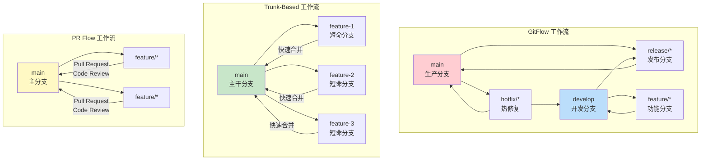

### 1.2 工作流详细对比

| 特性 | GitFlow | Trunk-Based | PR Flow |
|------|---------|-------------|---------|
| 分支数量 | 多（main/develop/feature/release/hotfix） | 少（main + 短命分支） | 中（main + feature） |
| 发布节奏 | 固定版本发布 | 持续部署 | 灵活发布 |
| 代码审查 | 可选 | 必须（快速） | 必须（严格） |
| 合并频率 | 低 | 高（每天） | 中 |
| CI/CD 集成 | 复杂 | 简单 | 中等 |
| 回滚难度 | 中 | 低 | 中 |
| 适合团队 | 大团队，多版本并行 | 小团队，快速迭代 | 中小团队，开源项目 |
| 学习曲线 | 高 | 低 | 低 |

### 1.3 GitFlow 工作流详解

```bash
# ===========================================
# GitFlow 完整示例
# ===========================================

# 1. 初始化 GitFlow
git flow init
# 会提示设置分支名称：
# Production branch: main
# Development branch: develop
# Feature branches: feature/
# Release branches: release/
# Hotfix branches: hotfix/

# 2. 开发新功能
git flow feature start user-authentication
# 等同于：git checkout -b feature/user-authentication develop

# 编写代码...
git add .
git commit -m "feat(auth): add login functionality"

# 完成功能
git flow feature finish user-authentication
# 等同于：
# git checkout develop
# git merge --no-ff feature/user-authentication
# git branch -d feature/user-authentication

# 3. 准备发布
git flow release start v1.2.0
# 等同于：git checkout -b release/v1.2.0 develop

# 修复发布中的小问题...
git commit -am "fix: resolve minor UI issues"

# 完成发布
git flow release finish v1.2.0
# 等同于：
# git checkout main
# git merge --no-ff release/v1.2.0
# git tag -a v1.2.0
# git checkout develop
# git merge --no-ff release/v1.2.0
# git branch -d release/v1.2.0

# 4. 紧急修复
git flow hotfix start critical-bug
# 等同于：git checkout -b hotfix/critical-bug main

# 修复问题...
git commit -am "fix: resolve critical security issue"

# 完成修复
git flow hotfix finish critical-bug
# 等同于：
# git checkout main
# git merge --no-ff hotfix/critical-bug
# git tag -a v1.2.1
# git checkout develop
# git merge --no-ff hotfix/critical-bug
# git branch -d hotfix/critical-bug
```

### 1.4 Trunk-Based 工作流详解

```bash
# ===========================================
# Trunk-Based 工作流示例
# ===========================================

# 核心原则：
# 1. main 分支始终可部署
# 2. 功能分支存活时间 < 2 天
# 3. 使用 Feature Flag 控制未完成功能
# 4. 频繁集成，小批量提交

# 1. 创建短命功能分支
git checkout -b feat/add-search main

# 2. 小步提交
git add src/components/Search.tsx
git commit -m "feat(search): add search component skeleton"

git add src/hooks/useSearch.ts
git commit -m "feat(search): implement search hook"

# 3. 频繁 rebase（保持与 main 同步）
git fetch origin
git rebase origin/main

# 4. 推送并创建 PR
git push origin feat/add-search
gh pr create --title "feat: add search functionality"

# 5. CI 通过后立即合并
gh pr merge --squash

# 6. 删除分支
git checkout main
git pull
git branch -d feat/add-search
```

#### Feature Flag 实现

```typescript
// src/config/feature-flags.ts
interface FeatureFlags {
  enableSearch: boolean;
  enableNewDashboard: boolean;
  enableBetaFeatures: boolean;
}

const flags: FeatureFlags = {
  enableSearch: process.env.FEATURE_SEARCH === 'true',
  enableNewDashboard: process.env.FEATURE_NEW_DASHBOARD === 'true',
  enableBetaFeatures: process.env.FEATURE_BETA === 'true',
};

export function isEnabled(flag: keyof FeatureFlags): boolean {
  return flags[flag] ?? false;
}

// 使用示例
import { isEnabled } from './config/feature-flags';

function App() {
  return (
    <div>
      <Header />
      {isEnabled('enableSearch') && <SearchBar />}
      {isEnabled('enableNewDashboard') ? <NewDashboard /> : <OldDashboard />}
    </div>
  );
}
```

### 1.5 PR Flow 工作流详解

```bash
# ===========================================
# PR Flow 工作流示例（GitHub Flow）
# ===========================================

# 1. 从 main 创建功能分支
git checkout main
git pull origin main
git checkout -b feature/add-notifications

# 2. 开发功能
# 编写代码...
git add .
git commit -m "feat(notifications): add push notification support"

# 3. 推送分支
git push origin feature/add-notifications

# 4. 创建 Pull Request
gh pr create \
  --title "feat: Add Push Notification Support" \
  --body "## 变更说明
- 添加推送通知功能
- 集成 Firebase Cloud Messaging
- 添加通知偏好设置

## 测试
- [x] 单元测试通过
- [x] E2E 测试通过
- [x] 手动测试通过

## 截图
" \
  --reviewer teammate1,teammate2 \
  --label "feature,needs-review"

# 5. Code Review（由其他开发者完成）
# 审查者会：
# - 查看代码变更
# - 提出修改建议
# - 批准或请求修改

# 6. 根据反馈修改
git add .
git commit -m "fix: address review comments"
git push

# 7. 合并 PR（CI 通过 + 审批后）
gh pr merge --squash --delete-branch

# 8. 部署到生产环境
git checkout main
git pull
# CI/CD 自动部署
```

---

## 2. Git 高级操作

### 2.0 Git 内部原理

理解 Git 的内部原理有助于更好地使用它：

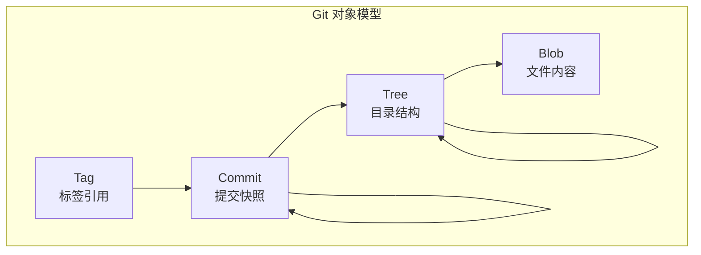

| 对象类型 | 说明 | 存储内容 |
|---------|------|----------|
| Blob | 二进制大对象 | 文件内容（不含文件名） |
| Tree | 树对象 | 目录结构，指向 Blob 和其他 Tree |
| Commit | 提交对象 | 指向 Tree，包含作者、时间、提交信息 |
| Tag | 标签对象 | 指向 Commit，包含标签信息 |

```bash
# 查看 Git 对象
# 每个对象都有唯一的 SHA-1 哈希值

# 查看提交对象内容
git cat-file -p HEAD
tree 4b825dc642cb6eb9a060e54bf8d69288fbee4904
parent abc1234...
author Alice <alice@example.com> 1703275200 +0800
committer Alice <alice@example.com> 1703275200 +0800

feat: add new feature

# 查看 tree 对象
git cat-file -p HEAD^{tree}
100644 blob a1b2c3d4...    .gitignore
100644 blob e5f6a7b8...    package.json
040000 tree i9j0k1l2...    src

# 查看 blob 对象
git cat-file -p a1b2c3d4
# 显示文件内容

# 查看对象类型
git cat-file -t HEAD         # commit
git cat-file -t HEAD^{tree}  # tree

# 计算对象的 SHA-1
echo "test" | git hash-object --stdin

# 手动创建对象
echo "hello world" | git hash-object -w --stdin
# 将内容写入 .git/objects/

# Git 引用系统
cat .git/HEAD               # ref: refs/heads/main
cat .git/refs/heads/main    # abc1234... (最新提交的 SHA)

# 引用类型
# 分支：refs/heads/branch-name
# 远程分支：refs/remotes/origin/branch-name
# 标签：refs/tags/v1.0.0
# HEAD：当前检出的提交
```

#### Git 文件状态生命周期

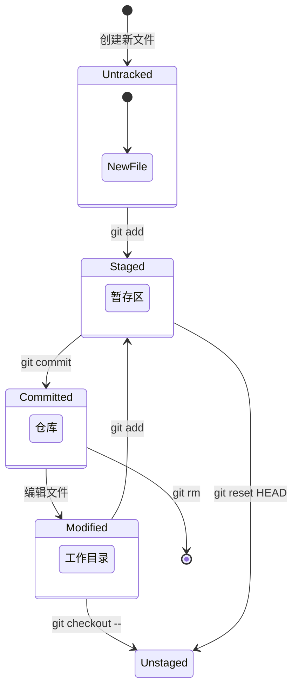

```bash
# 查看文件状态
git status

# 状态简写
git status -s
# M  src/app.ts      # 已修改（已暂存）
#  M src/utils.ts     # 已修改（未暂存）
# ?? new-file.ts      # 未跟踪
# A  added-file.ts    # 新添加
# D  deleted-file.ts  # 已删除
# R  old.ts -> new.ts # 已重命名
# AM file.ts          # 添加后又修改

# 查看暂存区和工作区的差异
git diff              # 工作区 vs 暂存区
git diff --staged     # 暂存区 vs 上次提交
git diff HEAD         # 工作区 vs 上次提交
git diff abc1 def2    # 两个提交之间

# 查看文件的每一行是谁修改的
git blame src/app.ts
git blame -L 10,20 src/app.ts  # 指定行范围
git blame -w src/app.ts         # 忽略空白字符

# 查看文件的历史版本
git show HEAD:src/app.ts           # 最新版本
git show abc1234:src/app.ts        # 指定提交的版本
git show HEAD~1:src/app.ts         # 上一个版本

# 恢复文件到某个版本
git checkout abc1234 -- src/app.ts  # 恢复到指定提交
git checkout HEAD -- src/app.ts    # 恢复到最新提交
```

### 2.1 Git Rebase（变基）

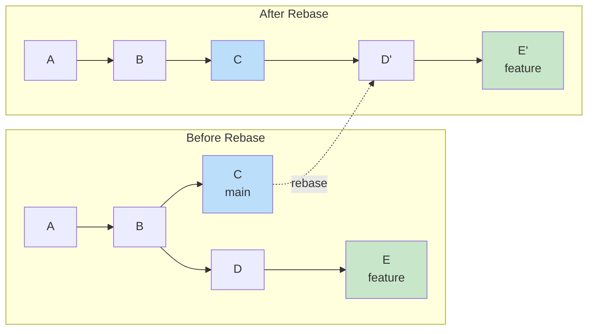

```bash
# ===========================================
# Rebase 基础用法
# ===========================================

# 将 feature 分支变基到 main 的最新提交
git checkout feature
git rebase main

# 等同于：
# 1. 找到 feature 和 main 的共同祖先
# 2. 将 feature 的提交暂存
# 3. 将 feature 指向 main 的最新提交
# 4. 依次应用暂存的提交

# ===========================================
# 交互式 Rebase（修改提交历史）
# ===========================================

# 修改最近 3 个提交
git rebase -i HEAD~3

# 会打开编辑器：
# pick abc1234 feat: add user login
# pick def5678 fix: typo in login form
# pick ghi9012 feat: add logout

# 可用操作：
# pick   = 保留提交
# reword = 修改提交信息
# edit   = 修改提交内容
# squash = 合并到上一个提交
# fixup  = 合并到上一个提交（丢弃信息）
# drop   = 删除提交

# 示例：合并两个提交
# 改为：
# pick abc1234 feat: add user login
# squash def5678 fix: typo in login form  # 合并到上一个
# pick ghi9012 feat: add logout

# ===========================================
# Rebase 冲突处理
# ===========================================

# 开始 rebase
git rebase main

# 如果出现冲突
# CONFLICT (content): Merge conflict in src/app.ts

# 1. 查看冲突文件
git status

# 2. 编辑冲突文件，解决冲突
# 冲突标记：
# <<<<<<< HEAD
# 当前分支的内容
# =======
# 要合并的内容
# >>>>>>> feature

# 3. 标记冲突已解决
git add src/app.ts

# 4. 继续 rebase
git rebase --continue

# 如果想放弃 rebase
git rebase --abort

# ===========================================
# Rebase vs Merge 对比
# ===========================================

# Merge：保留完整的分支历史
git checkout main
git merge feature
# 创建一个合并提交，保留分支结构

# Rebase：创建线性历史
git checkout feature
git rebase main
git checkout main
git merge feature  # 快进合并
# 提交历史更干净，像是一直在 main 上开发

# ⚠️ 黄金规则：不要 rebase 已经推送到远程的公共分支！
```

### 2.2 Git Cherry-pick（拣选提交）

```bash
# ===========================================
# Cherry-pick 基础用法
# ===========================================

# 将某个提交应用到当前分支
git cherry-pick abc1234

# 应用多个提交
git cherry-pick abc1234 def5678 ghi9012

# 应用一个范围的提交
git cherry-pick abc1234..ghi9012
# 注意：不包含 abc1234，包含 ghi9012

# 包含起始提交
git cherry-pick abc1234^..ghi9012

# ===========================================
# Cherry-pick 选项
# ===========================================

# -n, --no-commit：只应用变更，不自动提交
git cherry-pick -n abc1234
# 可以手动修改后再提交

# -x：在提交信息中添加来源信息
git cherry-pick -x abc1234
# 提交信息会添加 "(cherry picked from commit abc1234)"

# --edit：编辑提交信息
git cherry-pick --edit abc1234

# ===========================================
# Cherry-pick 冲突处理
# ===========================================

# 如果出现冲突
git cherry-pick abc1234
# CONFLICT (content): Merge conflict in src/app.ts

# 1. 解决冲突
vim src/app.ts

# 2. 标记解决
git add src/app.ts

# 3. 继续
git cherry-pick --continue

# 放弃 cherry-pick
git cherry-pick --abort

# ===========================================
# 实际应用场景
# ===========================================

# 场景 1：将修复从 develop 拣选到 release
git checkout release/v1.2.0
git cherry-pick abc1234  # develop 上的 bug 修复

# 场景 2：将功能从 feature 拣选到另一个分支
git checkout feature/new-ui
git cherry-pick def5678  # 从另一个 feature 分支拣选

# 场景 3：恢复误删的提交
git log --oneline --all  # 找到被删除的提交
git cherry-pick abc1234  # 重新应用
```

### 2.3 Git Bisect（二分查找）

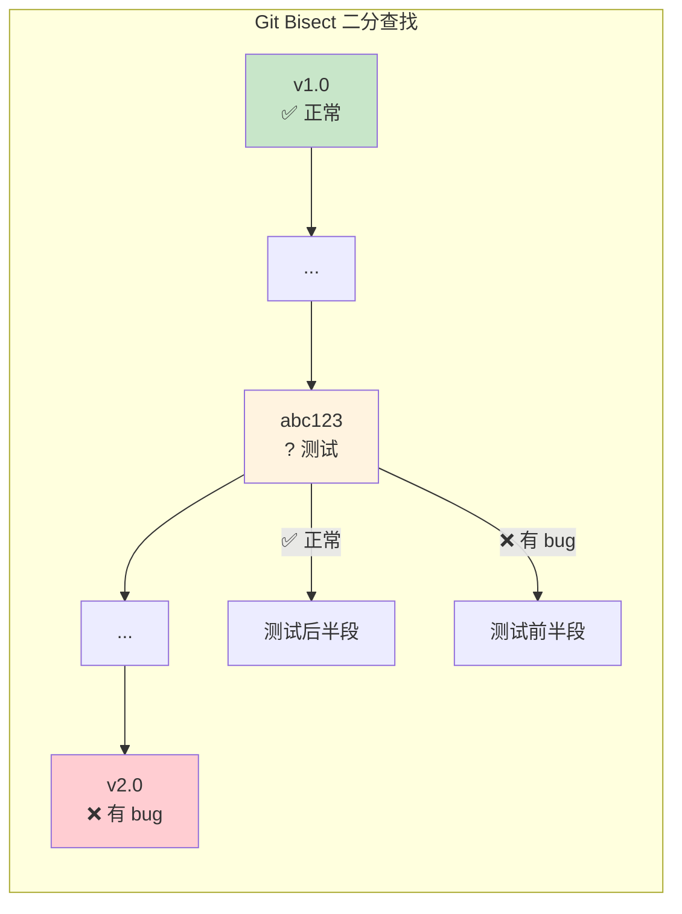

```bash
# ===========================================
# Git Bisect 使用流程
# ===========================================

# 场景：你知道 v1.0 是好的，v2.0 有 bug

# 1. 开始 bisect
git bisect start

# 2. 标记当前版本（有 bug）
git bisect bad

# 3. 标记已知的好版本
git bisect good v1.0

# 4. Git 会自动 checkout 到中间的提交
# 测试这个版本，然后标记：
git bisect good  # 这个版本没问题
# 或
git bisect bad   # 这个版本有 bug

# 5. 重复步骤 4，直到找到第一个引入 bug 的提交
# Git 会输出：
# abc1234 is the first bad commit

# 6. 结束 bisect
git bisect reset

# ===========================================
# 自动化 Bisect
# ===========================================

# 使用脚本自动测试
git bisect start v2.0 v1.0
git bisect run npm test

# 或使用自定义测试脚本
git bisect run ./test-script.sh

# 测试脚本示例：
#!/bin/bash
# test-script.sh
npm run build 2>/dev/null
if [ $? -ne 0 ]; then
    exit 1  # 构建失败 = bad
fi
npm test
# 返回 0 = good, 非 0 = bad

# ===========================================
# Bisect 高级选项
# ===========================================

# 跳过某个提交（无法测试）
git bisect skip

# 查看当前 bisect 状态
git bisect log

# 重放 bisect 日志
git bisect replay bisect.log

# 可视化 bisect 过程
git bisect visualize --oneline
```

### 2.4 Git Stash（暂存）

```bash
# ===========================================
# Stash 基础用法
# ===========================================

# 暂存当前工作区的修改
git stash
# 等同于 git stash push

# 暂存并添加描述
git stash push -m "正在开发用户登录功能"

# 暂存特定文件
git stash push -m "暂存登录组件" -- src/components/Login.tsx

# 暂存包含未跟踪的文件
git stash push -u -m "包含新文件"
# -u, --include-untracked

# 暂存所有文件（包括 .gitignore 中的）
git stash push -a -m "暂存所有"
# -a, --all

# ===========================================
# 查看 Stash 列表
# ===========================================

# 查看 stash 列表
git stash list
# stash@{0}: WIP on feature: abc1234 feat: add login
# stash@{1}: On main: def5678 fix: typo

# 查看 stash 内容
git stash show stash@{0}          # 简略信息
git stash show -p stash@{0}       # 详细 diff
git stash show --stat stash@{0}   # 文件统计

# ===========================================
# 恢复 Stash
# ===========================================

# 恢复最近的 stash（不删除）
git stash apply

# 恢复指定的 stash
git stash apply stash@{1}

# 恢复最近的 stash（并删除）
git stash pop

# 恢复指定的 stash（并删除）
git stash pop stash@{1}

# ===========================================
# 删除 Stash
# ===========================================

# 删除最近的 stash
git stash drop

# 删除指定的 stash
git stash drop stash@{1}

# 删除所有 stash
git stash clear

# ===========================================
# 从 Stash 创建分支
# ===========================================

# 如果 pop/apply 有冲突，可以创建分支
git stash branch new-feature stash@{0}
# 从创建 stash 时的提交开始，创建新分支并应用 stash

# ===========================================
# 实际应用场景
# ===========================================

# 场景 1：临时切换分支
git stash push -m "feature 开发中"
git checkout main
# 处理紧急问题...
git checkout feature
git stash pop

# 场景 2：拉取远程更新
git stash push -m "本地修改"
git pull origin main
git stash pop

# 场景 3：尝试不同的实现方案
# 方案 A
git stash push -m "方案 A"
# 编写方案 B...
# 比较两种方案
git stash show -p stash@{0}  # 查看方案 A
# 如果方案 B 不好，恢复方案 A
git stash pop
```

### 2.5 Git 其他实用命令

```bash
# ===========================================
# 查看历史
# ===========================================

# 图形化查看分支历史
git log --oneline --graph --all

# 查看某个文件的历史
git log --follow -p -- src/app.ts

# 查看谁修改了某一行（blame）
git blame src/app.ts
git blame -L 10,20 src/app.ts  # 指定行范围

# 搜索提交信息
git log --grep="fix" --oneline

# 搜索代码变更
git log -S "function login" --oneline

# 查看某个提交的详细信息
git show abc1234

# ===========================================
# 撤销操作
# ===========================================

# 撤销工作区的修改（未暂存）
git checkout -- src/app.ts
# 或使用新语法
git restore src/app.ts

# 撤销暂存（从 staging area 移除）
git reset HEAD src/app.ts
# 或使用新语法
git restore --staged src/app.ts

# 修改最后一次提交
git commit --amend
# 修改提交信息
git commit --amend -m "新的提交信息"
# 添加遗漏的文件
git add forgotten-file.ts
git commit --amend --no-edit

# 回退到某个提交（保留修改在工作区）
git reset --soft abc1234

# 回退到某个提交（保留修改在暂存区）
git reset --mixed abc1234

# 回退到某个提交（丢弃所有修改）
git reset --hard abc1234
# ⚠️ 危险操作！会丢失修改

# 安全地撤销某个提交（创建新提交来撤销）
git revert abc1234
# 不会修改历史，适合已推送的提交

# ===========================================
# 标签管理
# ===========================================

# 创建轻量标签
git tag v1.0.0

# 创建附注标签（推荐）
git tag -a v1.0.0 -m "Release version 1.0.0"

# 给历史提交打标签
git tag -a v0.9.0 abc1234

# 推送标签到远程
git push origin v1.0.0
git push origin --tags  # 推送所有标签

# 删除标签
git tag -d v1.0.0
git push origin --delete v1.0.0

# 查看标签
git tag
git tag -l "v1.*"  # 按模式筛选

# ===========================================
# 远程仓库管理
# ===========================================

# 查看远程仓库
git remote -v

# 添加远程仓库
git remote add upstream git@github.com:original/repo.git

# 从上游同步
git fetch upstream
git merge upstream/main

# 推送到远程
git push origin main
git push -u origin feature  # -u 设置上游分支

# 强制推送（危险！）
git push --force-with-lease  # 比 --force 安全
```

---

## 3. VS Code 配置推荐

### 3.1 必装插件清单

| 插件名称 | 功能 | 必装程度 |
|---------|------|---------|
| ESLint | JavaScript/TypeScript 代码检查 | ⭐⭐⭐⭐⭐ |
| Prettier | 代码格式化 | ⭐⭐⭐⭐⭐ |
| TypeScript Nightly | TypeScript 最新特性 | ⭐⭐⭐⭐⭐ |
| GitLens | Git 增强（blame, history） | ⭐⭐⭐⭐⭐ |
| Error Lens | 行内显示错误 | ⭐⭐⭐⭐ |
| TODO Highlight | 高亮 TODO/FIXME | ⭐⭐⭐⭐ |
| Auto Rename Tag | 自动重命名配对标签 | ⭐⭐⭐⭐ |
| Path Intellisense | 路径自动补全 | ⭐⭐⭐⭐ |
| Import Cost | 显示导入包大小 | ⭐⭐⭐ |
| DotENV | .env 文件语法高亮 | ⭐⭐⭐ |
| Docker | Docker 支持 | ⭐⭐⭐ |
| Thunder Client | API 测试（类似 Postman） | ⭐⭐⭐ |
| CSS Peek | CSS 类名跳转 | ⭐⭐⭐ |
| Tailwind CSS IntelliSense | Tailwind 智能提示 | ⭐⭐⭐ |
| Markdown All in One | Markdown 增强 | ⭐⭐⭐ |
| Color Highlight | 颜色代码高亮 | ⭐⭐ |
| indent-rainbow | 缩进彩虹色 | ⭐⭐ |
| Error Lens | 行内错误提示 | ⭐⭐⭐⭐ |

### 3.2 settings.json 完整配置

```json
{
  // ===========================================
  // 编辑器基础配置
  // ===========================================
  "editor.fontSize": 14,
  "editor.fontFamily": "'JetBrains Mono', 'Fira Code', Consolas, monospace",
  "editor.fontLigatures": true,
  "editor.tabSize": 2,
  "editor.insertSpaces": true,
  "editor.detectIndentation": true,
  "editor.renderWhitespace": "boundary",
  "editor.rulers": [80, 120],
  "editor.wordWrap": "on",
  "editor.lineNumbers": "on",
  "editor.minimap.enabled": false,
  "editor.bracketPairColorization.enabled": true,
  "editor.guides.bracketPairs": true,
  "editor.linkedEditing": true,
  "editor.suggestSelection": "first",
  "editor.acceptSuggestionOnCommitCharacter": false,
  "editor.formatOnSave": true,
  "editor.formatOnPaste": false,
  "editor.codeActionsOnSave": {
    "source.fixAll.eslint": "explicit",
    "source.organizeImports": "explicit"
  },
  "editor.defaultFormatter": "esbenp.prettier-vscode",
  "editor.cursorBlinking": "smooth",
  "editor.cursorSmoothCaretAnimation": "on",
  "editor.smoothScrolling": true,

  // ===========================================
  // 文件配置
  // ===========================================
  "files.autoSave": "afterDelay",
  "files.autoSaveDelay": 1000,
  "files.trimTrailingWhitespace": true,
  "files.insertFinalNewline": true,
  "files.trimFinalNewlines": true,
  "files.exclude": {
    "**/.git": true,
    "**/.DS_Store": true,
    "**/node_modules": true,
    "**/.turbo": true,
    "**/dist": true,
    "**/build": true,
    "**/.next": true,
    "**/coverage": true
  },

  // ===========================================
  // TypeScript 配置
  // ===========================================
  "typescript.tsdk": "node_modules/typescript/lib",
  "typescript.enablePromptUseWorkspaceTsdk": true,
  "typescript.preferences.importModuleSpecifier": "relative",
  "typescript.preferences.preferTypeOnlyAutoImports": true,
  "typescript.suggest.autoImports": true,
  "typescript.suggest.completeFunctionCalls": true,
  "typescript.updateImportsOnFileMove.enabled": "always",
  "typescript.inlayHints.parameterNames.enabled": "all",
  "typescript.inlayHints.variableTypes.enabled": true,
  "typescript.inlayHints.functionLikeReturnTypes.enabled": true,
  "typescript.inlayHints.propertyDeclarationTypes.enabled": true,

  // ===========================================
  // ESLint 配置
  // ===========================================
  "eslint.validate": [
    "javascript",
    "javascriptreact",
    "typescript",
    "typescriptreact"
  ],
  "eslint.rules.customizations": [
    { "rule": "*", "severity": "warn" }
  ],

  // ===========================================
  // Prettier 配置
  // ===========================================
  "prettier.requireConfig": true,
  "prettier.useEditorConfig": true,

  // ===========================================
  // 终端配置
  // ===========================================
  "terminal.integrated.fontSize": 13,
  "terminal.integrated.defaultProfile.linux": "zsh",
  "terminal.integrated.defaultProfile.windows": "PowerShell",
  "terminal.integrated.scrollback": 10000,

  // ===========================================
  // 搜索配置
  // ===========================================
  "search.exclude": {
    "**/node_modules": true,
    "**/dist": true,
    "**/build": true,
    "**/.turbo": true,
    "**/pnpm-lock.yaml": true,
    "**/package-lock.json": true
  },

  // ===========================================
  // Git 配置
  // ===========================================
  "git.autofetch": true,
  "git.confirmSync": false,
  "git.enableSmartCommit": true,
  "gitlens.hovers.currentLine.over": "line",

  // ===========================================
  // 工作区配置
  // ===========================================
  "workbench.editor.enablePreview": true,
  "workbench.startupEditor": "none",
  "workbench.colorTheme": "One Dark Pro",
  "workbench.iconTheme": "material-icon-theme"
}
```

### 3.3 推荐快捷键

| 快捷键 | 功能 | 说明 |
|--------|------|------|
| `Ctrl+P` | 快速打开文件 | 输入文件名模糊搜索 |
| `Ctrl+Shift+P` | 命令面板 | 所有命令的入口 |
| `Ctrl+Shift+F` | 全局搜索 | 跨文件搜索 |
| `Ctrl+Shift+H` | 全局替换 | 跨文件替换 |
| `Ctrl+G` | 跳转到行 | 输入行号 |
| `Ctrl+Shift+O` | 跳转到符号 | 函数/类/变量 |
| `F12` | 跳转到定义 | 查看函数实现 |
| `Shift+F12` | 查看引用 | 谁在使用这个函数 |
| `Ctrl+Shift+L` | 选择所有匹配 | 多光标编辑 |
| `Alt+Up/Down` | 移动行 | 上下移动代码行 |
| `Shift+Alt+Up/Down` | 复制行 | 上下复制代码行 |
| `Ctrl+Shift+K` | 删除行 | 删除整行 |
| `Ctrl+/` | 切换注释 | 单行注释 |
| `Shift+Alt+A` | 切换块注释 | 多行注释 |
| `Ctrl+D` | 选择下一个匹配 | 逐个选择相同单词 |
| `Ctrl+Shift+[` | 折叠代码块 | 收起函数/对象 |
| `Ctrl+Shift+]` | 展开代码块 | 展开函数/对象 |
| `Ctrl+B` | 切换侧边栏 | 显示/隐藏文件树 |
| `` Ctrl+` `` | 切换终端 | 显示/隐藏终端 |
| `Ctrl+\\` | 分屏 | 拆分编辑器 |

### 3.4 推荐主题和图标

```json
{
  // 主题推荐
  "workbench.colorTheme": "One Dark Pro",
  // 其他优秀主题：
  // - GitHub Dark Theme
  // - Dracula Theme
  // - Night Owl
  // - Ayu Dark
  // - Monokai Pro

  // 图标推荐
  "workbench.iconTheme": "material-icon-theme",
  // 其他图标主题：
  // - Catppuccin Icons
  // - VSCode Icons
  // - Ayu Icons

  // 字体推荐
  "editor.fontFamily": "'JetBrains Mono', 'Fira Code', Consolas, monospace"
  // 优秀的编程字体：
  // - JetBrains Mono（免费，推荐）
  // - Fira Code（免费）
  // - Cascadia Code（免费，微软出品）
  // - Source Code Pro（免费，Adobe 出品）
  // - Menlo（macOS 内置）
}
```

---

## 4. 调试技巧

### 4.1 Node.js 调试

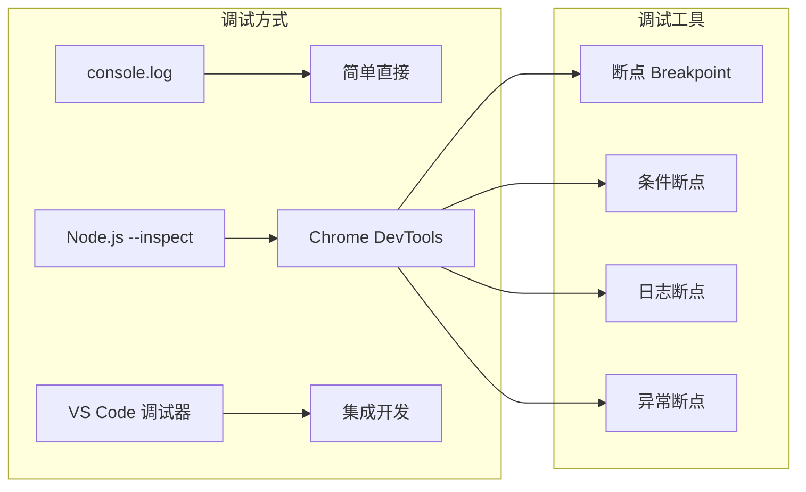

#### 方式 1：使用 --inspect 参数

```bash
# 启动 Node.js 调试模式
node --inspect dist/server.js

# 指定端口
node --inspect=9229 dist/server.js

# 等待调试器连接（不会立即执行）
node --inspect-brk dist/server.js

# 使用 nodemon 调试（自动重启）
nodemon --inspect dist/server.js

# 使用 ts-node 调试 TypeScript
node --inspect -r ts-node/register src/server.ts

# 使用 pnpm/npm 调试
pnpm dev -- --inspect
# 或
NODE_OPTIONS='--inspect' pnpm dev
```

#### 方式 2：Chrome DevTools 调试

```bash
# 1. 启动应用
node --inspect dist/server.js
# 输出：Debugger listening on ws://127.0.0.1:9229/...

# 2. 打开 Chrome 浏览器
# 访问：chrome://inspect

# 3. 点击 "Configure" 添加调试端口
# Host: localhost, Port: 9229

# 4. 在 "Remote Target" 中点击 "inspect"

# 5. 在 Sources 面板中设置断点
# - 点击行号设置断点
# - 右键断点可以设置条件
# - 使用 Call Stack 查看调用链
# - 使用 Scope 查看变量值
```

#### 方式 3：VS Code 调试配置

```json
// .vscode/launch.json
{
  "version": "0.2.0",
  "configurations": [
    {
      "name": "Launch Program",
      "type": "node",
      "request": "launch",
      "runtimeExecutable": "${workspaceFolder}/node_modules/.bin/tsx",
      "program": "${workspaceFolder}/src/server.ts",
      "outFiles": ["${workspaceFolder}/dist/**/*.js"],
      "env": {
        "NODE_ENV": "development"
      },
      "console": "integratedTerminal",
      "skipFiles": ["<node_internals>/**", "node_modules/**"]
    },
    {
      "name": "Attach to Process",
      "type": "node",
      "request": "attach",
      "port": 9229,
      "restart": true,
      "skipFiles": ["<node_internals>/**"]
    },
    {
      "name": "Jest Tests",
      "type": "node",
      "request": "launch",
      "runtimeExecutable": "${workspaceFolder}/node_modules/.bin/jest",
      "args": ["--runInBand", "--testPathPattern", "${file}"],
      "console": "integratedTerminal",
      "skipFiles": ["<node_internals>/**", "node_modules/**"]
    },
    {
      "name": "Docker: Attach to Node",
      "type": "node",
      "request": "attach",
      "port": 9229,
      "remoteRoot": "/app",
      "localRoot": "${workspaceFolder}",
      "skipFiles": ["<node_internals>/**"]
    }
  ]
}
```

### 4.2 Chrome DevTools 详细指南

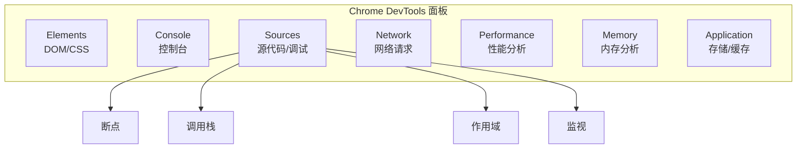

#### Network 面板使用

```bash
# Network 面板是调试 API 请求的利器

# 1. 过滤请求
# - XHR：只显示 AJAX 请求
# - JS：只显示 JavaScript 文件
# - CSS：只显示样式文件
# - Doc：只显示文档请求
# - WS：只显示 WebSocket 连接

# 2. 查看请求详情
# - Headers：请求头、响应头
# - Preview：响应预览
# - Response：原始响应
# - Cookies：Cookie 信息
# - Timing：时间线

# 3. 常用操作
# - 右键 → Copy → Copy as cURL：复制为 cURL 命令
# - 右键 → Block request URL：屏蔽请求
# - 右键 → Replay XHR：重放请求
# - Preserve log：保留历史请求
# - Disable cache：禁用缓存
```

#### Performance 面板使用

```bash
# 性能分析流程

# 1. 打开 Performance 面板
# 2. 点击录制按钮（或按 Ctrl+E）
# 3. 执行要分析的操作
# 4. 停止录制

# 分析内容：
# - FPS：帧率（60fps 为目标）
# - CPU：CPU 使用情况
# - NET：网络请求时间线
# - Main：主线程活动

# 火焰图（Flame Chart）解读：
# - 横轴：时间
# - 纵轴：调用栈深度
# - 宽度：函数执行时间
# - 颜色：蓝色=脚本，绿色=渲染，紫色=布局

# 常见性能问题：
# - 长任务（Long Task）：超过 50ms 的任务
# - 强制同步布局（Forced Reflow）
# - 过多的 DOM 操作
# - 未优化的图片
# - 阻塞渲染的资源
```

#### Memory 面板使用

```bash
# 内存分析

# 1. Heap Snapshot（堆快照）
# - 拍摄当前内存快照
# - 查看对象的内存占用
# - 对比两个快照，找出内存泄漏

# 2. Allocation Instrumentation on Timeline
# - 实时显示内存分配
# - 查看哪些代码在分配内存

# 3. Allocation Sampling
# - 低开销的内存分析
# - 适合生产环境

# 内存泄漏检测步骤：
# 1. 打开页面，拍摄快照 A
# 2. 执行操作（如打开/关闭弹窗）
# 3. 点击垃圾回收按钮
# 4. 拍摄快照 B
# 5. 选择 "Comparison" 视图
# 6. 对比 A 和 B，查找增长的对象
```

#### Application 面板使用

```bash
# 存储管理

# 1. Local Storage
# - 查看/编辑 localStorage 数据
# - 清除特定域名的 localStorage

# 2. Session Storage
# - 查看当前会话的存储数据

# 3. Cookies
# - 查看 Cookie 的名称、值、过期时间、域
# - 编辑或删除 Cookie

# 4. IndexedDB
# - 查看数据库结构和数据
# - 适合调试离线应用

# 5. Cache Storage
# - 查看 Service Worker 缓存
# - 调试 PWA 应用

# 6. Service Workers
# - 查看 Service Worker 状态
# - 模拟离线状态
# - 强制更新 Service Worker
```

### 4.3 断点类型详解

```typescript
// src/debug-example.ts

// 1. 普通断点
// 在 VS Code 中点击行号左侧，或按 F9
function calculateTotal(items: CartItem[]): number {
  let total = 0;           // ← 在这里设置断点
  for (const item of items) {
    total += item.price * item.quantity;
  }
  return total;
}

// 2. 条件断点
// 右键断点 → "Edit Breakpoint" → 输入条件
function processOrder(order: Order) {
  for (const item of order.items) {
    // 条件断点：item.price > 100
    // 只有当条件为 true 时才会暂停
    applyDiscount(item);
  }
}

// 3. 日志断点
// 右键断点 → "Edit Breakpoint" → 选择 "Log Message"
// 不会暂停执行，只输出日志
function fetchUsers() {
  // 日志断点：User fetched: {user.name}
  const user = database.find(id);
  return user;
}

// 4. 命中次数断点
// 右键断点 → "Edit Breakpoint" → 输入命中次数
function loopThroughItems(items: Item[]) {
  for (let i = 0; i < items.length; i++) {
    // 命中次数断点：10
    // 只在第 10 次命中时暂停
    processItem(items[i]);
  }
}

// 5. 异常断点
// 在调试面板的 "Breakpoints" 区域
// ☑ Caught Exceptions    - 捕获的异常
// ☑ Uncaught Exceptions  - 未捕获的异常
function riskyOperation() {
  try {
    // 可能抛出异常的代码
    JSON.parse(invalidJson);
  } catch (error) {
    // 如果勾选 "Caught Exceptions"，这里会暂停
    handleError(error);
  }
}

// 6. 函数断点
// 在调试面板的 "Breakpoints" 区域
// 点击 "+" → "Function Breakpoint"
// 输入函数名：processPayment
// 每次调用该函数时都会暂停
```

### 4.3 调试技巧

```typescript
// ===========================================
// console 调试技巧
// ===========================================

// 1. 基础输出
console.log('简单消息');
console.log('变量值:', someVariable);
console.log('多个值:', a, b, c);

// 2. 格式化输出
console.log('用户: %s, 年龄: %d', 'Alice', 25);
console.log('对象: %o', { name: 'Alice', age: 25 });
console.log('JSON: %j', { name: 'Alice' });

// 3. 样式化输出
console.log('%c重要消息', 'color: red; font-size: 20px; font-weight: bold;');
console.log('%c成功!', 'color: green; background: #dff0d8; padding: 5px;');

// 4. 不同级别
console.log('普通日志');
console.info('信息日志');
console.warn('警告日志');
console.error('错误日志');

// 5. 分组输出
console.group('用户处理');
console.log('获取用户...');
console.log('验证用户...');
console.log('保存用户...');
console.groupEnd();

// 6. 计时
console.time('数据处理');
// ... 处理数据
console.timeEnd('数据处理'); // 数据处理: 123.456ms

// 7. 计数
console.log('按钮点击');
console.count('按钮点击'); // 按钮点击: 1
console.count('按钮点击'); // 按钮点击: 2
console.countReset('按钮点击');

// 8. 表格输出
console.table([
  { name: 'Alice', age: 25, role: 'Developer' },
  { name: 'Bob', age: 30, role: 'Designer' },
]);

// 9. 堆栈追踪
console.trace('调用栈');
function a() { b(); }
function b() { c(); }
function c() { console.trace('Here'); }
a();

// 10. 断言
console.assert(age >= 18, '年龄必须大于 18 岁');
// 只有当条件为 false 时才输出

// 11. 调试对象
const user = { name: 'Alice', address: { city: 'Shanghai' } };
console.dir(user, { depth: null, colors: true });

// 12. 性能标记
console.markStart('render');
// ... 渲染操作
console.markEnd('render');
```

```typescript
// ===========================================
// Node.js 调试器 API
// ===========================================

import inspector from 'inspector';

// 动态启用调试器
function enableDebugging(port: number = 9229) {
  const session = new inspector.Session();
  session.connect();
  session.post('Profiler.enable');
  session.post('Profiler.start');

  // 收集 CPU profile
  setTimeout(() => {
    session.post('Profiler.stop', (err, { profile }) => {
      // 保存 profile 文件
      const fs = require('fs');
      fs.writeFileSync('cpu-profile.cpuprofile', JSON.stringify(profile));
      console.log('CPU profile saved');
    });
  }, 10000); // 10 秒后停止
}

// 使用 debugger 语句
function problematicFunction() {
  debugger; // 代码执行到这里会暂停（如果调试器已连接）
  // ... 需要调试的代码
}

// 条件 debugger
function processItem(item: any) {
  if (item.id === 'target-id') {
    debugger; // 只在特定条件下暂停
  }
  // ... 处理逻辑
}
```

---

## 5. ESLint 配置详解

### 5.1 ESLint 基础概念

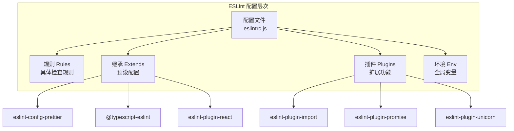

### 5.2 完整配置示例

```javascript
// .eslintrc.js
module.exports = {
  // 根配置（不再向上查找）
  root: true,

  // 解析器
  parser: '@typescript-eslint/parser',
  parserOptions: {
    ecmaVersion: 'latest',
    sourceType: 'module',
    ecmaFeatures: {
      jsx: true,
    },
    // TypeScript 项目配置
    project: './tsconfig.json',
  },

  // 运行环境
  env: {
    browser: true,
    node: true,
    es2022: true,
    jest: true,
  },

  // 继承配置（优先级从低到高）
  extends: [
    'eslint:recommended',
    'plugin:@typescript-eslint/recommended',
    'plugin:@typescript-eslint/recommended-requiring-type-checking',
    'plugin:react/recommended',
    'plugin:react/jsx-runtime',
    'plugin:react-hooks/recommended',
    'plugin:import/recommended',
    'plugin:import/typescript',
    'plugin:promise/recommended',
    'plugin:unicorn/recommended',
    'prettier', // 必须放在最后，关闭与 Prettier 冲突的规则
  ],

  // 插件
  plugins: [
    '@typescript-eslint',
    'react',
    'react-hooks',
    'import',
    'promise',
    'unicorn',
  ],

  // 全局变量
  globals: {
    React: 'readonly',
    JSX: 'readonly',
  },

  // 规则配置
  rules: {
    // ===========================================
    // ESLint 核心规则
    // ===========================================

    // 最佳实践
    'no-console': ['warn', { allow: ['warn', 'error'] }],
    'no-debugger': 'warn',
    'no-alert': 'error',
    'no-eval': 'error',
    'no-implied-eval': 'error',
    'no-new-func': 'error',
    'no-return-await': 'error',
    'no-throw-literal': 'error',
    'no-unmodified-loop-condition': 'error',
    'no-unused-expressions': 'error',
    'no-useless-call': 'error',
    'no-useless-concat': 'error',
    'no-useless-return': 'error',
    'prefer-promise-reject-errors': 'error',
    'require-await': 'error',

    // 变量
    'no-unused-vars': 'off', // 使用 TypeScript 版本
    'no-shadow': 'off', // 使用 TypeScript 版本
    'no-use-before-define': 'off', // 使用 TypeScript 版本

    // ES6+
    'arrow-body-style': ['error', 'as-needed'],
    'no-var': 'error',
    'prefer-const': 'error',
    'prefer-destructuring': ['error', { object: true, array: false }],
    'prefer-template': 'error',
    'rest-spread-spacing': ['error', 'never'],
    'template-curly-spacing': ['error', 'never'],

    // ===========================================
    // TypeScript 规则
    // ===========================================

    '@typescript-eslint/no-unused-vars': [
      'error',
      { argsIgnorePattern: '^_', varsIgnorePattern: '^_' },
    ],
    '@typescript-eslint/no-explicit-any': 'warn',
    '@typescript-eslint/no-non-null-assertion': 'warn',
    '@typescript-eslint/consistent-type-imports': [
      'error',
      { prefer: 'type-imports' },
    ],
    '@typescript-eslint/no-import-type-side-effects': 'error',
    '@typescript-eslint/consistent-type-definitions': ['error', 'interface'],
    '@typescript-eslint/no-floating-promises': 'error',
    '@typescript-eslint/no-misused-promises': 'error',
    '@typescript-eslint/await-thenable': 'error',
    '@typescript-eslint/no-unnecessary-type-assertion': 'error',
    '@typescript-eslint/prefer-nullish-coalescing': 'error',
    '@typescript-eslint/prefer-optional-chain': 'error',
    '@typescript-eslint/no-unnecessary-condition': 'error',
    '@typescript-eslint/restrict-template-expressions': 'warn',
    '@typescript-eslint/no-shadow': 'error',
    '@typescript-eslint/no-use-before-define': [
      'error',
      { functions: false },
    ],

    // ===========================================
    // React 规则
    // ===========================================

    'react/prop-types': 'off', // 使用 TypeScript
    'react/display-name': 'off',
    'react/no-unknown-property': 'error',
    'react/jsx-boolean-value': ['error', 'never'],
    'react/jsx-curly-brace-presence': ['error', 'never'],
    'react/jsx-fragments': ['error', 'syntax'],
    'react/jsx-no-useless-fragment': 'error',
    'react/jsx-pascal-case': 'error',
    'react/self-closing-comp': 'error',
    'react-hooks/rules-of-hooks': 'error',
    'react-hooks/exhaustive-deps': 'warn',

    // ===========================================
    // Import 规则
    // ===========================================

    'import/order': [
      'error',
      {
        groups: [
          'builtin',
          'external',
          'internal',
          'parent',
          'sibling',
          'index',
          'type',
        ],
        'newlines-between': 'always',
        alphabetize: { order: 'asc' },
      },
    ],
    'import/no-duplicates': 'error',
    'import/no-useless-path-segments': 'error',
    'import/extensions': [
      'error',
      'ignorePackages',
      { ts: 'never', tsx: 'never', js: 'never', jsx: 'never' },
    ],

    // ===========================================
    // Promise 规则
    // ===========================================

    'promise/always-return': 'error',
    'promise/no-return-wrap': 'error',
    'promise/param-names': 'error',
    'promise/no-nesting': 'warn',
    'promise/no-promise-in-callback': 'warn',
    'promise/no-callback-in-promise': 'warn',

    // ===========================================
    // Unicorn 规则（选择性开启）
    // ===========================================

    'unicorn/prevent-abbreviations': 'off',
    'unicorn/no-null': 'off',
    'unicorn/filename-case': [
      'error',
      { cases: { camelCase: true, pascalCase: true } },
    ],
  },

  // 覆盖配置
  overrides: [
    // 测试文件特殊规则
    {
      files: ['**/*.test.ts', '**/*.spec.ts', '**/__tests__/**'],
      rules: {
        '@typescript-eslint/no-explicit-any': 'off',
        'unicorn/consistent-function-scoping': 'off',
      },
    },
    // 配置文件特殊规则
    {
      files: ['*.config.js', '*.config.ts', '.eslintrc.js'],
      rules: {
        '@typescript-eslint/no-var-requires': 'off',
        'unicorn/prefer-module': 'off',
      },
    },
  ],

  // 设置
  settings: {
    react: {
      version: 'detect',
    },
    'import/resolver': {
      typescript: {
        alwaysTryTypes: true,
      },
    },
  },
};
```

### 5.3 ESLint Flat Config（新格式）

```javascript
// eslint.config.js（ESLint 9+ 推荐格式）
import js from '@eslint/js';
import tsPlugin from '@typescript-eslint/eslint-plugin';
import tsParser from '@typescript-eslint/parser';
import reactPlugin from 'eslint-plugin-react';
import reactHooksPlugin from 'eslint-plugin-react-hooks';
import importPlugin from 'eslint-plugin-import';
import prettierConfig from 'eslint-config-prettier';

export default [
  // 基础配置
  js.configs.recommended,

  // TypeScript 配置
  {
    files: ['**/*.ts', '**/*.tsx'],
    languageOptions: {
      parser: tsParser,
      parserOptions: {
        project: './tsconfig.json',
      },
    },
    plugins: {
      '@typescript-eslint': tsPlugin,
    },
    rules: {
      ...tsPlugin.configs.recommended.rules,
      '@typescript-eslint/no-explicit-any': 'warn',
      '@typescript-eslint/no-unused-vars': [
        'error',
        { argsIgnorePattern: '^_' },
      ],
    },
  },

  // React 配置
  {
    files: ['**/*.tsx', '**/*.jsx'],
    plugins: {
      react: reactPlugin,
      'react-hooks': reactHooksPlugin,
    },
    rules: {
      ...reactPlugin.configs.recommended.rules,
      ...reactHooksPlugin.configs.recommended.rules,
      'react/prop-types': 'off',
    },
    settings: {
      react: { version: 'detect' },
    },
  },

  // Prettier 配置（必须放在最后）
  prettierConfig,

  // 忽略配置
  {
    ignores: ['dist/**', 'node_modules/**', 'coverage/**'],
  },
];
```

### 5.4 ESLint 常用命令

```bash
# 检查代码
pnpm lint

# 自动修复
pnpm lint:fix

# 检查特定文件
npx eslint src/app.ts

# 检查并自动修复
npx eslint --fix src/app.ts

# 输出为 JSON 格式
npx eslint -f json src/

# 忽略规则
// eslint-disable-next-line no-console
console.log('debug');

# 忽略整个文件
/* eslint-disable */
// 文件内容...

# 忽略特定规则
/* eslint-disable @typescript-eslint/no-explicit-any */
const data: any = {};
/* eslint-enable @typescript-eslint/no-explicit-any */
```

### 5.5 ESLint 规则详解

#### 常用规则分类

```javascript
// ===========================================
// 1. 变量相关规则
// ===========================================

// no-unused-vars：禁止未使用的变量
// ❌ 错误
const unusedVar = 'hello';
function unusedFunc() {}

// ✅ 正确
const usedVar = 'hello';
console.log(usedVar);

// no-shadow：禁止变量遮蔽
// ❌ 错误
const x = 1;
function foo() {
  const x = 2; // 遮蔽了外层的 x
}

// ✅ 正确
const x = 1;
function foo() {
  const y = 2;
}

// prefer-const：优先使用 const
// ❌ 错误
let name = 'Alice';
name = 'Bob';

// ✅ 正确（如果不会重新赋值）
const name = 'Alice';

// ===========================================
// 2. 函数相关规则
// ===========================================

// no-loop-func：禁止在循环中创建函数
// ❌ 错误
for (let i = 0; i < 5; i++) {
  arr.push(function() { return i; });
}

// ✅ 正确
for (let i = 0; i < 5; i++) {
  const index = i;
  arr.push(function() { return index; });
}

// no-nested-ternary：禁止嵌套三元表达式
// ❌ 错误
const result = a ? b ? c : d : e;

// ✅ 正确
let result;
if (a) {
  result = b ? c : d;
} else {
  result = e;
}

// prefer-arrow-callback：优先使用箭头函数
// ❌ 错误
[1, 2, 3].map(function(x) { return x * 2; });

// ✅ 正确
[1, 2, 3].map(x => x * 2);

// ===========================================
// 3. 对象和数组相关规则
// ===========================================

// no-useless-computed-key：禁止无用的计算属性名
// ❌ 错误
const obj = { ['key']: 'value' };

// ✅ 正确
const obj = { key: 'value' };

// object-shorthand：对象方法使用简写
// ❌ 错误
const obj = {
  name: name,
  greet: function() { return 'hi'; }
};

// ✅ 正确
const obj = {
  name,
  greet() { return 'hi'; }
};

// prefer-destructuring：优先使用解构
// ❌ 错误
const name = obj.name;
const first = arr[0];

// ✅ 正确
const { name } = obj;
const [first] = arr;

// ===========================================
// 4. ES6+ 相关规则
// ===========================================

// no-var：禁止使用 var
// ❌ 错误
var name = 'Alice';

// ✅ 正确
const name = 'Alice';

// prefer-template：优先使用模板字符串
// ❌ 错误
const msg = 'Hello, ' + name + '!';

// ✅ 正确
const msg = `Hello, ${name}!`;

// prefer-spread：优先使用展开运算符
// ❌ 错误
const args = Array.prototype.slice.call(arguments);

// ✅ 正确
const args = [...arguments];

// no-duplicate-imports：禁止重复导入
// ❌ 错误
import { a } from 'module';
import { b } from 'module';

// ✅ 正确
import { a, b } from 'module';

// ===========================================
// 5. 错误处理相关规则
// ===========================================

// no-throw-literal：禁止抛出字面量
// ❌ 错误
throw 'error';
throw 0;
throw false;

// ✅ 正确
throw new Error('Something went wrong');

// no-return-await：禁止不必要的 return await
// ❌ 错误
async function foo() {
  return await bar();
}

// ✅ 正确
async function foo() {
  return bar();
}

// require-await：async 函数必须包含 await
// ❌ 错误
async function foo() {
  return 1;
}

// ✅ 正确
async function foo() {
  return await bar();
}
// 或者
function foo() {
  return 1;
}
```

#### TypeScript 特有规则

```typescript
// ===========================================
// 1. 类型安全规则
// ===========================================

// @typescript-eslint/no-explicit-any：禁止使用 any
// ❌ 错误
const data: any = getValue();

// ✅ 正确
const data: unknown = getValue();
// 或者使用具体类型
const data: string = getValue();

// @typescript-eslint/no-non-null-assertion：禁止非空断言
// ❌ 错误
const element = document.getElementById('app')!;

// ✅ 正确
const element = document.getElementById('app');
if (!element) throw new Error('Element not found');

// @typescript-eslint/consistent-type-imports：类型导入使用 import type
// ❌ 错误
import { User, UserRole } from './types';

// ✅ 正确
import type { User, UserRole } from './types';

// @typescript-eslint/no-floating-promises：Promise 必须处理
// ❌ 错误
async function foo() {
  bar(); // bar 返回 Promise，但没有 await
}

// ✅ 正确
async function foo() {
  await bar();
}
// 或者
async function foo() {
  bar().catch(console.error);
}

// ===========================================
// 2. 代码风格规则
// ===========================================

// @typescript-eslint/consistent-type-definitions：统一类型定义方式
// ❌ 错误（混用 interface 和 type）
interface User {
  name: string;
}
type Role = 'admin' | 'user';

// ✅ 正确（根据规则配置统一使用）
interface User {
  name: string;
}
interface Role {
  type: 'admin' | 'user';
}

// @typescript-eslint/no-unnecessary-type-assertion：不必要的类型断言
// ❌ 错误
const name = (user as User).name; // user 已经是 User 类型

// ✅ 正确
const name = user.name;

// @typescript-eslint/prefer-nullish-coalescing：优先使用 ??
// ❌ 错误
const value = input || 'default';

// ✅ 正确
const value = input ?? 'default';

// @typescript-eslint/prefer-optional-chain：优先使用 ?.（可选链）
// ❌ 错误
const city = user && user.address && user.address.city;

// ✅ 正确
const city = user?.address?.city;
```

#### React 相关规则

```tsx
// ===========================================
// React 规则示例
// ===========================================

// react/jsx-boolean-value：布尔属性简写
// ❌ 错误
<Modal isOpen={true} />

// ✅ 正确
<Modal isOpen />

// react/jsx-curly-brace-presence：不必要的花括号
// ❌ 错误
<Label text={'Hello'} />

// ✅ 正确
<Label text="Hello" />

// react/jsx-no-useless-fragment：无用的 Fragment
// ❌ 错误
<>{'Hello'}</>

// ✅ 正确
Hello

// react/self-closing-comp：自闭合标签
// ❌ 错误
<Modal></Modal>

// ✅ 正确
<Modal />

// react-hooks/rules-of-hooks：Hook 调用规则
// ❌ 错误
function MyComponent({ condition }) {
  if (condition) {
    const [state, setState] = useState(0); // 条件调用！
  }
}

// ✅ 正确
function MyComponent({ condition }) {
  const [state, setState] = useState(0);
  if (condition) {
    // 使用 state
  }
}

// react-hooks/exhaustive-deps：Hook 依赖完整
// ❌ 错误
useEffect(() => {
  fetchUser(userId);
}, []); // 缺少 userId 依赖

// ✅ 正确
useEffect(() => {
  fetchUser(userId);
}, [userId]);
```

### 5.6 自定义 ESLint 插件

```javascript
// eslint-plugin-custom/index.js
module.exports = {
  rules: {
    'no-hardcoded-strings': {
      meta: {
        type: 'suggestion',
        docs: {
          description: '禁止硬编码字符串',
          category: 'Best Practices',
        },
        fixable: 'code',
        schema: [],
      },
      create(context) {
        return {
          JSXText(node) {
            const text = node.value.trim();
            if (text.length > 0 && !text.startsWith('{')) {
              context.report({
                node,
                message: '避免硬编码字符串，请使用 i18n',
              });
            }
          },
        };
      },
    },
  },
};
```

---

## 6. Prettier 配置详解

### 6.1 Prettier 配置文件

```javascript
// .prettierrc.js
module.exports = {
  // 基础格式化
  printWidth: 80,           // 每行最大字符数
  tabWidth: 2,              // 缩进空格数
  useTabs: false,           // 使用空格而非 Tab
  semi: true,               // 使用分号
  singleQuote: true,        // 使用单引号
  quoteProps: 'as-needed',  // 对象属性引号

  // 代码换行
  trailingComma: 'all',     // 尾逗号（all/es5/none）
  bracketSpacing: true,     // 对象括号空格 { a: 1 }
  bracketSameLine: false,   // JSX 括号位置
  arrowParens: 'always',    // 箭头函数参数括号

  // 特殊语言
  jsxSingleQuote: false,    // JSX 使用双引号
  htmlWhitespaceSensitivity: 'css',  // HTML 空格敏感度
  proseWrap: 'preserve',    // Markdown 换行

  // 范围格式化
  rangeStart: 0,
  rangeEnd: Infinity,

  // 嵌入语言格式化
  embeddedLanguageFormatting: 'auto',

  // 换行符
  endOfLine: 'lf',          // Unix 风格换行
};
```

```json
// .prettierrc.json（JSON 格式）
{
  "printWidth": 80,
  "tabWidth": 2,
  "semi": true,
  "singleQuote": true,
  "trailingComma": "all",
  "bracketSpacing": true,
  "arrowParens": "always",
  "endOfLine": "lf"
}
```

### 6.2 .prettierignore 文件

```
# .prettierignore
# 构建产物
dist
build
.next
.turbo

# 依赖
node_modules

# 版本控制
.git

# 文档
*.md

# 配置文件
package-lock.json
pnpm-lock.yaml
yarn.lock

# 测试覆盖率
coverage

# 自动生成的文件
*.min.js
*.min.css
```

### 6.3 Prettier 与 ESLint 集成

```bash
# 安装依赖
pnpm add -D prettier eslint-config-prettier

# eslint-config-prettier 会关闭 ESLint 中与 Prettier 冲突的规则
```

```javascript
// .eslintrc.js
module.exports = {
  extends: [
    // ... 其他配置
    'prettier', // 必须放在最后！
  ],
};
```

### 6.4 编辑器集成

```json
// VS Code settings.json
{
  "editor.defaultFormatter": "esbenp.prettier-vscode",
  "editor.formatOnSave": true,
  "editor.formatOnPaste": false,
  "prettier.requireConfig": true,
  "[javascript]": {
    "editor.defaultFormatter": "esbenp.prettier-vscode"
  },
  "[typescript]": {
    "editor.defaultFormatter": "esbenp.prettier-vscode"
  },
  "[typescriptreact]": {
    "editor.defaultFormatter": "esbenp.prettier-vscode"
  },
  "[json]": {
    "editor.defaultFormatter": "esbenp.prettier-vscode"
  },
  "[css]": {
    "editor.defaultFormatter": "esbenp.prettier-vscode"
  },
  "[markdown]": {
    "editor.defaultFormatter": "esbenp.prettier-vscode",
    "editor.wordWrap": "on",
    "editor.formatOnSave": false
  }
}
```

### 6.5 Prettier 命令行

```bash
# 格式化所有文件
pnpm prettier --write .

# 检查格式（不修改文件）
pnpm prettier --check .

# 格式化特定文件
pnpm prettier --write src/app.ts

# 格式化并显示差异
pnpm prettier --write --log-level debug src/app.ts

# 列出将被格式化的文件
pnpm prettier --list-different .
```

---

## 7. Husky + lint-staged 工作流

### 7.1 工作流程图

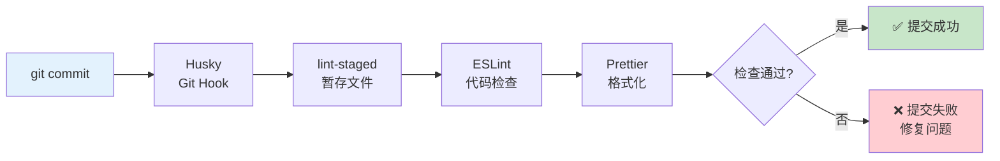

### 7.2 Husky 配置

```bash
# 安装 Husky
pnpm add -D husky

# 初始化 Husky
npx husky init

# 这会创建 .husky/ 目录
```

```bash
# .husky/pre-commit
#!/usr/bin/env sh
. "$(dirname -- "$0")/_/husky.sh"

npx lint-staged
```

```bash
# .husky/commit-msg
#!/usr/bin/env sh
. "$(dirname -- "$0")/_/husky.sh"

npx --no -- commitlint --edit "$1"
```

```bash
# .husky/pre-push
#!/usr/bin/env sh
. "$(dirname -- "$0")/_/husky.sh"

pnpm type-check
pnpm test
```

### 7.3 lint-staged 配置

```json
// package.json
{
  "lint-staged": {
    "*.{ts,tsx}": [
      "eslint --fix",
      "prettier --write"
    ],
    "*.{js,jsx}": [
      "eslint --fix",
      "prettier --write"
    ],
    "*.{json,md,yml,yaml}": [
      "prettier --write"
    ],
    "*.{css,scss}": [
      "prettier --write"
    ]
  }
}
```

```javascript
// lint-staged.config.js（独立配置文件）
module.exports = {
  '*.{ts,tsx}': [
    'eslint --fix --no-error-on-unmatched-pattern',
    'prettier --write',
  ],
  '*.{js,jsx}': [
    'eslint --fix --no-error-on-unmatched-pattern',
    'prettier --write',
  ],
  '*.{json,md,yml,yaml,css,scss}': [
    'prettier --write',
  ],
};
```

### 7.4 Commitlint 配置

```bash
# 安装
pnpm add -D @commitlint/cli @commitlint/config-conventional
```

```javascript
// commitlint.config.js
module.exports = {
  extends: ['@commitlint/config-conventional'],
  rules: {
    'type-enum': [
      2,
      'always',
      [
        'feat',     // 新功能
        'fix',      // Bug 修复
        'docs',     // 文档
        'style',    // 格式（不影响代码运行）
        'refactor', // 重构
        'perf',     // 性能优化
        'test',     // 测试
        'build',    // 构建工具
        'ci',       // CI/CD
        'chore',    // 杂项
        'revert',   // 回滚
      ],
    ],
    'type-case': [2, 'always', 'lower-case'],
    'type-empty': [2, 'never'],
    'subject-empty': [2, 'never'],
    'subject-full-stop': [2, 'never', '.'],
    'header-max-length': [2, 'always', 100],
    'body-max-line-length': [2, 'always', 200],
  },
};
```

---

## 8. Conventional Commits 规范

### 8.1 提交格式

```
<type>(<scope>): <subject>

[body]

[footer]
```

### 8.2 类型说明

| 类型 | 说明 | 示例 |
|------|------|------|
| `feat` | 新功能 | `feat(auth): add Google OAuth login` |
| `fix` | Bug 修复 | `fix(api): resolve null pointer in user endpoint` |
| `docs` | 文档更新 | `docs(readme): update installation guide` |
| `style` | 代码格式（不影响功能） | `style: fix indentation in app.ts` |
| `refactor` | 重构（不是新功能也不是修复） | `refactor(utils): extract validation logic` |
| `perf` | 性能优化 | `perf(query): add database index for user lookup` |
| `test` | 测试相关 | `test(auth): add unit tests for login flow` |
| `build` | 构建系统或外部依赖 | `build: update webpack to v5` |
| `ci` | CI/CD 配置 | `ci: add GitHub Actions workflow` |
| `chore` | 杂项（不修改 src 或 test） | `chore: update dependencies` |
| `revert` | 回滚 | `revert: revert commit abc1234` |

### 8.3 作用域（Scope）

```bash
# 作用域是可选的，用于说明影响范围

# 按模块
feat(auth): ...       # 认证模块
fix(api): ...         # API 层
refactor(db): ...     # 数据库层

# 按功能
feat(search): ...     # 搜索功能
fix(upload): ...      # 上传功能

# 按文件/组件
feat(UserProfile): ...    # React 组件
fix(config): ...          # 配置文件
```

### 8.4 提交示例

```bash
# 简单提交
git commit -m "feat: add user authentication"

# 带作用域
git commit -m "feat(auth): implement JWT token refresh"

# 带详细说明
git commit -m "fix(api): handle null response from external service

The external API sometimes returns null instead of an empty object.
This caused a TypeError in the response handler.

Fixes #123"

# Breaking Change
git commit -m "feat!: change API response format

BREAKING CHANGE: API responses now use camelCase instead of snake_case"

# 或者
git commit -m "feat(api)!: change response format"

# 多行提交
git commit -m "refactor(auth): restructure authentication flow

- Extract token validation into separate middleware
- Add refresh token rotation
- Implement rate limiting for login attempts

Closes #456, Closes #789"
```

### 8.5 版本号管理

```bash
# Semantic Versioning (语义化版本)
# MAJOR.MINOR.PATCH

# MAJOR：不兼容的 API 变更
# MINOR：向后兼容的功能新增
# PATCH：向后兼容的问题修复

# 使用 commit 触发版本更新：
feat → MINOR bump (1.0.0 → 1.1.0)
fix → PATCH bump (1.0.0 → 1.0.1)
feat! / BREAKING CHANGE → MAJOR bump (1.0.0 → 2.0.0)

# 使用 standard-version 自动生成版本
pnpm add -D standard-version

# 在 package.json 中添加脚本
{
  "scripts": {
    "release": "standard-version",
    "release:minor": "standard-version --release-as minor",
    "release:major": "standard-version --release-as major",
    "release:patch": "standard-version --release-as patch"
  }
}

# standard-version 会：
# 1. 分析 commit 历史
# 2. 自动确定版本号
# 3. 更新 CHANGELOG.md
# 4. 创建 git tag
# 5. 创建 git commit
```

### 8.6 Commit 规范自动化

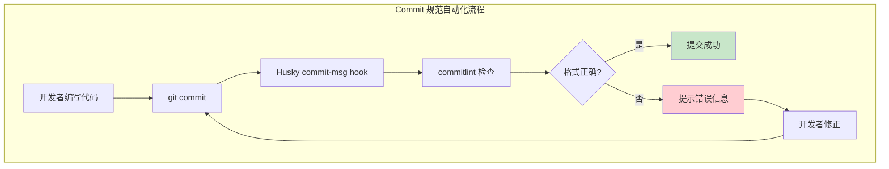

```bash
# 安装 commitlint
pnpm add -D @commitlint/cli @commitlint/config-conventional

# 配置 commitlint.config.js
# module.exports = {
#   extends: ['@commitlint/config-conventional'],
#   rules: {
#     'type-enum': [2, 'always', [
#       'feat', 'fix', 'docs', 'style', 'refactor',
#       'perf', 'test', 'build', 'ci', 'chore', 'revert'
#     ]],
#     'header-max-length': [2, 'always', 100],
#   }
# };

# 配置 Husky hook
# .husky/commit-msg
# npx --no -- commitlint --edit "$1"

# 使用 commitizen（交互式提交）
pnpm add -D commitizen cz-conventional-changelog

# package.json 中添加：
# "config": {
#   "commitizen": {
#     "path": "cz-conventional-changelog"
#   }
# }

# 使用
git cz  # 或 npx cz
# 交互式选择 type、scope、description
```

### 8.7 提交信息模板

```bash
# Git 提交模板
git config --global commit.template ~/.gitmessage

# ~/.gitmessage
# <type>(<scope>): <subject>
#
# <body>
#
# <footer>
#
# ---
# 类型：feat/fix/docs/style/refactor/perf/test/build/ci/chore/revert
# 作用域：可选，说明影响范围
# 主题：简短描述，不超过 50 个字符
# 正文：详细说明（可选）
# 脚注：关联 Issue、Breaking Change（可选）

# 使用模板提交
git commit  # 会打开编辑器，显示模板

# 多行提交示例
git commit -m "feat(auth): implement OAuth2 authentication

- Add Google OAuth2 provider
- Add GitHub OAuth2 provider
- Implement token refresh mechanism
- Add unit tests for OAuth flow

Closes #123
Closes #456"

# Breaking Change 示例
git commit -m "feat(api)!: change response format

BREAKING CHANGE: API responses now use camelCase instead of snake_case

Migration guide:
- Update all client code to use camelCase
- See MIGRATION.md for details"

# 带关联的提交
git commit -m "fix(auth): handle expired tokens gracefully

When a token expires, the app now redirects to login
instead of showing an error page.

Fixes #789
Related to #100"
```

### 8.8 Commit 规范的好处

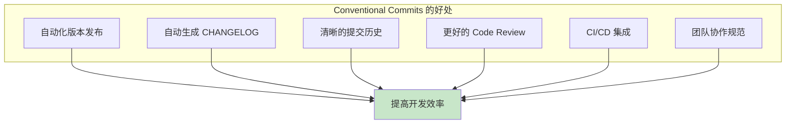

| 好处 | 说明 |
|------|------|
| 自动化版本 | 根据 commit type 自动确定版本号 |
| 自动生成 CHANGELOG | 从 commit 历史生成变更日志 |
| 清晰的历史 | 一目了然每次提交的目的 |
| 更好的审查 | 审查者快速理解变更意图 |
| CI/CD 集成 | 触发不同的构建流程 |
| 团队规范 | 统一的提交格式 |

---

## 9. 代码审查最佳实践

### 9.1 Code Review 流程

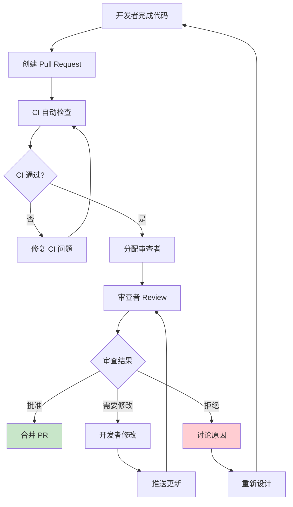

### 9.2 审查 Checklist

```markdown
## Code Review Checklist

### 功能正确性
- [ ] 代码实现了需求描述的功能
- [ ] 边界情况已处理
- [ ] 错误处理完善
- [ ] 无明显的逻辑错误

### 代码质量
- [ ] 代码简洁，无冗余
- [ ] 命名清晰有意义
- [ ] 函数/方法职责单一
- [ ] 无重复代码（DRY）
- [ ] 适当的注释（不过多也不过少）

### 类型安全
- [ ] TypeScript 类型定义准确
- [ ] 避免使用 `any`
- [ ] 泛型使用恰当
- [ ] null/undefined 处理完善

### 测试
- [ ] 有对应的单元测试
- [ ] 测试覆盖关键路径
- [ ] 测试用例清晰可理解
- [ ] 边界条件有测试

### 安全性
- [ ] 输入已验证
- [ ] SQL 注入防护
- [ ] XSS 防护
- [ ] 敏感信息未暴露
- [ ] 权限检查正确

### 性能
- [ ] 无不必要的渲染
- [ ] 数据库查询已优化
- [ ] 避免 N+1 查询
- [ ] 适当的缓存策略

### 可维护性
- [ ] 代码易于理解
- [ ] 适当的抽象层次
- [ ] 遵循项目架构规范
- [ ] 依赖关系清晰

### 文档
- [ ] 复杂逻辑有注释
- [ ] README 已更新
- [ ] API 文档已更新
- [ ] CHANGELOG 已记录
```

### 9.3 审查评论规范

```markdown
## 评论类型

### 建议（Suggestion）
> 💡 **建议**：这里可以使用 `Array.includes()` 替代多重 `if` 判断，更简洁：
> ```typescript
> if (['admin', 'moderator'].includes(user.role)) { ... }
> ```

### 问题（Question）
> ❓ **问题**：这个 `setTimeout` 的 3000ms 是怎么确定的？有没有考虑网络延迟情况？

### 必须修改（Blocking）
> 🚫 **必须修改**：这里存在 SQL 注入风险，必须使用参数化查询：
> ```typescript
> // ❌ 危险
> `SELECT * FROM users WHERE id = ${userId}`
> 
> // ✅ 安全
> 'SELECT * FROM users WHERE id = $1', [userId]
> ```

### 赞扬（Praise）
> 👍 **赞扬**：这个抽象做得很好，把通用的验证逻辑提取出来了！

### 注意（Nit）
> ⚠️ **Nit**：这里有个小的命名问题，`data` 太通用了，建议改为 `userData`。
```

### 9.4 Code Review 常见问题和解决方案

```typescript
// ===========================================
// 常见问题 1：函数过长
// ===========================================

// ❌ 问题代码
function processOrder(order: Order) {
  // 验证订单
  if (!order.items || order.items.length === 0) {
    throw new Error('订单不能为空');
  }
  if (!order.userId) {
    throw new Error('用户 ID 不能为空');
  }
  for (const item of order.items) {
    if (item.quantity <= 0) {
      throw new Error('数量必须大于 0');
    }
    if (item.price < 0) {
      throw new Error('价格不能为负数');
    }
  }
  
  // 计算总价
  let totalPrice = 0;
  for (const item of order.items) {
    totalPrice += item.price * item.quantity;
  }
  const discount = totalPrice > 100 ? 0.1 : 0;
  const finalPrice = totalPrice * (1 - discount);
  
  // 保存订单
  const dbOrder = {
    userId: order.userId,
    items: order.items,
    totalPrice: finalPrice,
    status: 'pending',
    createdAt: new Date(),
  };
  database.orders.insert(dbOrder);
  
  // 发送通知
  const user = database.users.findById(order.userId);
  emailService.send(user.email, '订单确认', `您的订单已创建，总价: ${finalPrice}`);
  
  // 记录日志
  logger.info('订单创建成功', { orderId: dbOrder.id, userId: order.userId, totalPrice: finalPrice });
  
  return dbOrder;
}

// ✅ 重构后
function validateOrder(order: Order): void {
  if (!order.items?.length) throw new Error('订单不能为空');
  if (!order.userId) throw new Error('用户 ID 不能为空');
  
  for (const item of order.items) {
    if (item.quantity <= 0) throw new Error('数量必须大于 0');
    if (item.price < 0) throw new Error('价格不能为负数');
  }
}

function calculateTotalPrice(items: OrderItem[]): number {
  const subtotal = items.reduce((sum, item) => sum + item.price * item.quantity, 0);
  const discount = subtotal > 100 ? 0.1 : 0;
  return subtotal * (1 - discount);
}

async function saveOrder(order: Order, totalPrice: number): Promise<SavedOrder> {
  const dbOrder = {
    userId: order.userId,
    items: order.items,
    totalPrice,
    status: 'pending' as const,
    createdAt: new Date(),
  };
  return database.orders.insert(dbOrder);
}

async function sendOrderConfirmation(userId: string, totalPrice: number): Promise<void> {
  const user = database.users.findById(userId);
  await emailService.send(user.email, '订单确认', `您的订单已创建，总价: ${totalPrice}`);
}

async function processOrder(order: Order): Promise<SavedOrder> {
  validateOrder(order);
  
  const totalPrice = calculateTotalPrice(order.items);
  const savedOrder = await saveOrder(order, totalPrice);
  
  await sendOrderConfirmation(order.userId, totalPrice);
  logger.info('订单创建成功', { orderId: savedOrder.id, userId: order.userId, totalPrice });
  
  return savedOrder;
}

// ===========================================
// 常见问题 2：魔法数字
// ===========================================

// ❌ 问题代码
function isEligible(user: User): boolean {
  return user.age >= 18 && user.score > 85;
}

// ✅ 重构后
const MIN_AGE_REQUIREMENT = 18;
const MIN_SCORE_THRESHOLD = 85;

function isEligible(user: User): boolean {
  return user.age >= MIN_AGE_REQUIREMENT && user.score > MIN_SCORE_THRESHOLD;
}

// ===========================================
// 常见问题 3：重复代码
// ===========================================

// ❌ 问题代码
function formatUser(user: User): string {
  return `${user.firstName} ${user.lastName} (${user.email})`;
}

function formatAdmin(admin: Admin): string {
  return `${admin.firstName} ${admin.lastName} (${admin.email})`;
}

function formatGuest(guest: Guest): string {
  return `${guest.firstName} ${guest.lastName} (${guest.email})`;
}

// ✅ 重构后
interface Person {
  firstName: string;
  lastName: string;
  email: string;
}

function formatPerson(person: Person): string {
  return `${person.firstName} ${person.lastName} (${person.email})`;
}

const formatUser = formatPerson;
const formatAdmin = formatPerson;
const formatGuest = formatPerson;

// ===========================================
// 常见问题 4：错误处理不当
// ===========================================

// ❌ 问题代码
async function fetchUser(id: string) {
  const response = await fetch(`/api/users/${id}`);
  const data = await response.json();
  return data;
}

// ✅ 重构后
async function fetchUser(id: string): Promise<User> {
  try {
    const response = await fetch(`/api/users/${id}`);
    
    if (!response.ok) {
      if (response.status === 404) {
        throw new NotFoundError(`User ${id} not found`);
      }
      throw new ApiError(`Failed to fetch user: ${response.statusText}`);
    }
    
    const data: User = await response.json();
    return data;
  } catch (error) {
    if (error instanceof ApiError) {
      throw error;
    }
    throw new NetworkError('Network request failed', { cause: error });
  }
}
```

### 9.5 Code Review 工具推荐

| 工具 | 功能 | 平台 |
|------|------|------|
| GitHub Pull Requests | 代码审查、评论、批准 | GitHub |
| GitLab Merge Requests | 代码审查、讨论 | GitLab |
| Gerrit | 企业级代码审查 | 自托管 |
| Reviewable | 高级代码审查 | GitHub 集成 |
| CodeRabbit | AI 代码审查 | GitHub/GitLab |
| SonarQube | 代码质量检查 | 自托管 |
| Codacy | 自动代码审查 | 云服务 |
| DeepSource | AI 代码分析 | 云服务 |

---

## 10. 文档编写

### 10.1 JSDoc 注释

```typescript
/**
 * 用户认证服务
 * @module AuthService
 * @description 处理用户登录、注册、token 管理等认证相关功能
 */

/**
 * 用户登录
 *
 * @param credentials - 登录凭据
 * @param credentials.email - 用户邮箱
 * @param credentials.password - 用户密码
 * @param options - 登录选项
 * @param options.rememberMe - 是否记住登录状态
 * @param options.twoFactorCode - 两步验证码（可选）
 *
 * @returns 登录结果，包含用户信息和 token
 *
 * @throws {AuthenticationError} 邮箱或密码错误
 * @throws {RateLimitError} 登录尝试过于频繁
 * @throws {ValidationError} 输入参数验证失败
 *
 * @example
 * ```typescript
 * const result = await authService.login(
 *   { email: 'user@example.com', password: 'password123' },
 *   { rememberMe: true }
 * );
 * console.log(result.user.name); // 'Alice'
 * console.log(result.token);     // 'eyJhbGci...'
 * ```
 *
 * @since 1.0.0
 * @see {@link AuthService.register} 注册功能
 * @see {@link AuthService.refreshToken} Token 刷新
 */
async function login(
  credentials: { email: string; password: string },
  options: { rememberMe?: boolean; twoFactorCode?: string } = {}
): Promise<LoginResult> {
  // 实现...
}

/**
 * 用户信息接口
 *
 * @interface User
 * @property {string} id - 用户唯一标识
 * @property {string} name - 用户名称
 * @property {string} email - 用户邮箱
 * @property {UserRole} role - 用户角色
 * @property {Date} createdAt - 创建时间
 * @property {Date} [updatedAt] - 更新时间（可选）
 */
interface User {
  id: string;
  name: string;
  email: string;
  role: UserRole;
  createdAt: Date;
  updatedAt?: Date;
}

/**
 * 用户角色枚举
 *
 * @enum {string}
 */
enum UserRole {
  /** 管理员 - 拥有所有权限 */
  ADMIN = 'admin',
  /** 普通用户 - 基础权限 */
  USER = 'user',
  /** 访客 - 只读权限 */
  GUEST = 'guest',
}
```

### 10.2 README.md 模板

```markdown
# 项目名称

[](https://github.com/user/repo/actions/workflows/ci.yml)
[](https://codecov.io/gh/user/repo)
[](https://opensource.org/licenses/MIT)

简短的项目描述，一两句话说明项目是什么、解决什么问题。

## ✨ 特性

- 🚀 特性 1：描述
- 📦 特性 2：描述
- 🔒 特性 3：描述
- 🎨 特性 4：描述

## 📸 截图


## 🚀 快速开始

### 前置要求

- Node.js >= 18
- pnpm >= 8
- PostgreSQL >= 14

### 安装

```bash
# 克隆项目
git clone https://github.com/user/repo.git
cd repo

# 安装依赖
pnpm install

# 配置环境变量
cp .env.example .env
# 编辑 .env 文件

# 初始化数据库
pnpm db:migrate

# 启动开发服务器
pnpm dev
```

### 构建

```bash
# 构建生产版本
pnpm build

# 预览构建结果
pnpm preview
```

## 📖 使用说明

### 基础用法

```typescript
import { createApp } from 'my-lib';

const app = createApp({
  apiKey: 'your-api-key',
});

await app.start();
```

### 高级配置

```typescript
const app = createApp({
  apiKey: 'your-api-key',
  debug: true,
  plugins: [plugin1(), plugin2()],
  hooks: {
    beforeRequest: (req) => { /* ... */ },
    afterResponse: (res) => { /* ... */ },
  },
});
```

## 📚 API 文档

详细 API 文档请查看 [API Documentation](./docs/api.md)。

## 🧪 测试

```bash
# 运行所有测试
pnpm test

# 运行测试并生成覆盖率报告
pnpm test:coverage

# 运行特定测试
pnpm test -- --testPathPattern=auth
```

## 🤝 贡献指南

欢迎贡献！请查看 [CONTRIBUTING.md](./CONTRIBUTING.md) 了解详情。

1. Fork 项目
2. 创建功能分支 (`git checkout -b feature/amazing-feature`)
3. 提交更改 (`git commit -m 'feat: add amazing feature'`)
4. 推送到分支 (`git push origin feature/amazing-feature`)
5. 创建 Pull Request

## 📝 更新日志

查看 [CHANGELOG.md](./CHANGELOG.md) 了解版本更新历史。

## 📄 许可证

本项目基于 MIT 许可证开源 - 查看 [LICENSE](./LICENSE) 文件了解详情。

## 🙏 致谢

- [依赖项目 1](https://github.com/xxx) - 功能描述
- [依赖项目 2](https://github.com/xxx) - 功能描述
```

### 10.3 CHANGELOG.md

```markdown
# Changelog

All notable changes to this project will be documented in this file.

The format is based on [Keep a Changelog](https://keepachangelog.com/en/1.0.0/),
and this project adheres to [Semantic Versioning](https://semver.org/spec/v2.0.0.html).

## [1.2.0] - 2024-01-15

### Added
- 新增用户通知功能 (#123)
- 新增数据导出为 CSV 格式 (#124)
- 新增暗色主题支持 (#125)

### Changed
- 优化首页加载速度，减少 50% (#126)
- 更新依赖包版本 (#127)

### Fixed
- 修复登录页面偶尔白屏的问题 (#128)
- 修复移动端布局错位 (#129)

### Security
- 升级 jwt 库修复安全漏洞 (#130)

## [1.1.0] - 2024-01-01

### Added
- 新增搜索功能
- 新增用户头像上传

### Changed
- 重构认证模块

### Fixed
- 修复时间显示不正确的问题

## [1.0.0] - 2023-12-01

### Added
- 初始版本发布
- 用户注册和登录功能
- 基础 CRUD 操作
- API 文档
```

### 10.4 CONTRIBUTING.md 贡献指南

```markdown
# 贡献指南

感谢你对本项目的关注！我们欢迎各种形式的贡献。

## 如何贡献

### 报告 Bug

1. 在 [Issues](https://github.com/user/repo/issues) 中搜索是否已有相同问题
2. 如果没有，创建新的 Issue
3. 使用 Bug Report 模板，包含：
   - 问题描述
   - 复现步骤
   - 期望行为
   - 实际行为
   - 环境信息（OS、Node 版本、浏览器等）
   - 截图或错误日志

### 提交功能建议

1. 在 Discussions 中创建新的讨论
2. 描述你想要的功能
3. 说明使用场景
4. 等待社区反馈

### 提交代码

#### 1. Fork 项目

```bash
# Fork 项目到你的 GitHub
# 然后克隆
git clone https://github.com/your-username/repo.git
cd repo
```

#### 2. 创建分支

```bash
# 从 main 创建功能分支
git checkout -b feature/your-feature-name
# 或修复分支
git checkout -b fix/your-bug-fix
```

#### 3. 开发

```bash
# 安装依赖
pnpm install

# 启动开发服务器
pnpm dev

# 运行测试
pnpm test
```

#### 4. 提交代码

```bash
# 使用 Conventional Commits 规范
git commit -m "feat(scope): add new feature"

# 提交前确保：
# - 代码通过 lint 检查
# - 所有测试通过
# - 类型检查通过
pnpm lint
pnpm test
pnpm type-check
```

#### 5. 创建 Pull Request

```bash
# 推送分支
git push origin feature/your-feature-name

# 在 GitHub 创建 PR
# 填写 PR 模板
# 等待 Code Review
```

## 开发规范

### 代码风格

- 使用 ESLint + Prettier 统一代码风格
- 提交前自动运行 lint-staged
- 遵循 TypeScript 严格模式

### 提交规范

- 使用 Conventional Commits 规范
- 每次提交只做一件事
- 提交信息清晰描述变更

### 测试规范

- 新功能必须有对应测试
- Bug 修复必须有回归测试
- 测试覆盖率不低于 80%

### 文档规范

- 新增 API 必须有文档
- 复杂逻辑必须有注释
- README 及时更新

## 行为准则

- 尊重每一位贡献者
- 建设性的讨论
- 接受批评和建议
- 关注项目目标

## 联系方式

- Issues: GitHub Issues
- Discussions: GitHub Discussions
- Email: your@email.com
```

### 10.5 API 文档编写

```typescript
// ===========================================
// 使用 TypeDoc 生成 API 文档
// ===========================================

// 安装 TypeDoc
// pnpm add -D typedoc

// 配置 typedoc.json
// {
//   "entryPoints": ["src/index.ts"],
//   "out": "docs/api",
//   "theme": "default",
//   "excludePrivate": true,
//   "excludeInternal": true
// }

// package.json 脚本
// "scripts": {
//   "docs:api": "typedoc"
// }

/**
 * 用户服务模块
 * @module UserService
 * @description 提供用户的 CRUD 操作
 *
 * @example
 * ```typescript
 * import { UserService } from '@my-app/services';
 *
 * const userService = new UserService();
 * const user = await userService.create({
 *   name: 'Alice',
 *   email: 'alice@example.com'
 * });
 * ```
 */

/**
 * 创建新用户
 *
 * @param data - 用户数据
 * @param data.name - 用户名称（2-50 个字符）
 * @param data.email - 用户邮箱（必须唯一）
 * @param data.password - 用户密码（至少 8 个字符）
 * @param data.role - 用户角色（可选，默认 'user'）
 *
 * @returns 创建的用户对象（不包含密码）
 *
 * @throws {ValidationError} 输入数据验证失败
 * @throws {ConflictError} 邮箱已被注册
 *
 * @example
 * ```typescript
 * const user = await userService.create({
 *   name: 'Alice',
 *   email: 'alice@example.com',
 *   password: 'securePassword123'
 * });
 * console.log(user.id); // 'uuid-xxx'
 * ```
 *
 * @since 1.0.0
 */
async function create(data: CreateUserDTO): Promise<User> {
  // 实现...
}
```

---

## 11. turbo.json 构建编排分析

### 11.1 Turborepo 简介

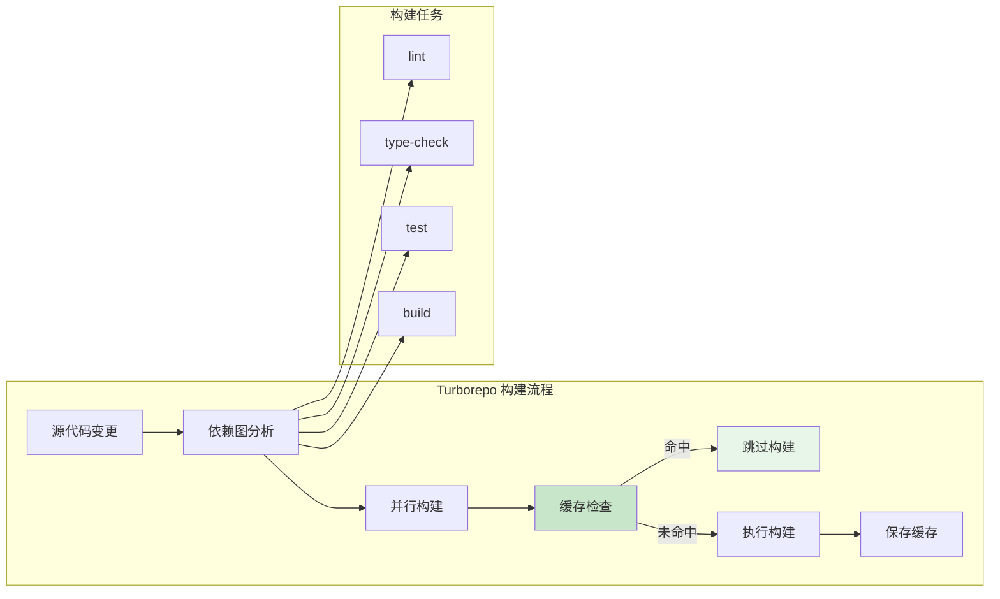

### 11.2 turbo.json 完整配置

```json
{
  "$schema": "https://turbo.build/schema.json",
  "globalDependencies": [
    "**/.env.*local"
  ],
  "globalEnv": [
    "NODE_ENV",
    "CI"
  ],
  "tasks": {
    "build": {
      "dependsOn": [
        "^build"
      ],
      "inputs": [
        "src/**",
        "tsconfig.json",
        "package.json"
      ],
      "outputs": [
        "dist/**",
        ".next/**",
        "!.next/cache/**"
      ],
      "env": [
        "API_URL",
        "DATABASE_URL"
      ],
      "cache": true
    },
    "lint": {
      "dependsOn": [
        "^build"
      ],
      "inputs": [
        "src/**",
        ".eslintrc.js",
        "tsconfig.json"
      ],
      "outputs": [],
      "cache": true
    },
    "type-check": {
      "dependsOn": [
        "^build"
      ],
      "inputs": [
        "src/**",
        "tsconfig.json"
      ],
      "outputs": [],
      "cache": true
    },
    "test": {
      "dependsOn": [
        "build"
      ],
      "inputs": [
        "src/**",
        "tests/**",
        "jest.config.js"
      ],
      "outputs": [
        "coverage/**"
      ],
      "env": [
        "TEST_DATABASE_URL"
      ],
      "cache": true
    },
    "dev": {
      "cache": false,
      "persistent": true
    },
    "clean": {
      "cache": false
    },
    "db:migrate": {
      "cache": false,
      "env": [
        "DATABASE_URL"
      ]
    },
    "db:seed": {
      "dependsOn": [
        "db:migrate"
      ],
      "cache": false
    }
  }
}
```

### 11.3 配置详解

| 配置项 | 说明 | 示例 |
|--------|------|------|
| `dependsOn` | 任务依赖关系 | `["^build"]` 表示依赖包的 build |
| `inputs` | 输入文件（用于缓存判断） | `["src/**"]` |
| `outputs` | 输出文件（用于缓存保存） | `["dist/**"]` |
| `env` | 环境变量（影响缓存） | `["API_URL"]` |
| `cache` | 是否启用缓存 | `true/false` |
| `persistent` | 是否持久运行 | `true`（dev server） |

```bash
# Turborepo 常用命令

# 运行所有包的 build 任务
turbo run build

# 运行特定包的 build
turbo run build --filter=@my-app/web

# 并行运行多个任务
turbo run lint type-check test

# 只运行变更的包
turbo run build --filter=...[HEAD^1]

# 强制重新构建（忽略缓存）
turbo run build --force

# 查看构建任务图
turbo run build --graph

# 清除缓存
turbo clean

# 远程缓存（团队共享）
turbo login
turbo link
```

### 11.4 缓存策略

```bash
# 本地缓存位置
# .turbo/cache/

# 缓存命中条件：
# 1. inputs 文件未变更
# 2. 环境变量未变更
# 3. 任务配置未变更
# 4. 依赖包未变更

# 查看缓存状态
turbo run build --summarize

# 远程缓存配置（Vercel）
# 在 turbo.json 中添加：
# {
#   "remoteCache": {
#     "team": "my-team",
#     "signature": true
#   }
# }
```

### 11.5 Turborepo 高级用法

```bash
# ===========================================
# 任务依赖关系详解
# ===========================================

# turbo.json 中的 dependsOn 有两种模式：

# 1. ^build - 依赖包的 build
# 表示：先构建依赖的包，再构建当前包
# 例如：packages/ui 先 build，然后 apps/web 再 build

# 2. build - 当前包的 build
# 表示：等待当前包的其他任务完成
# 例如：先 lint，再 build

# 示例：复杂任务依赖
{
  "tasks": {
    "build": {
      "dependsOn": ["^build"],  // 先构建依赖
      "outputs": ["dist/**"]
    },
    "test": {
      "dependsOn": ["build"],   // 先构建当前包
      "outputs": ["coverage/**"]
    },
    "deploy": {
      "dependsOn": ["build", "test"],  // 构建和测试都完成
      "cache": false                    // 部署不缓存
    }
  }
}

# ===========================================
# 过滤器用法
# ===========================================

# 运行特定包
# --filter=<包名>
turbo run build --filter=@my-app/web

# 运行多个包
turbo run build --filter=@my-app/web --filter=@my-app/api

# 使用通配符
turbo run build --filter=@my-app/*

# 运行变更的包
# --filter=...[HEAD^1] 表示相对于上次提交有变更的包
turbo run build --filter=...[HEAD^1]

# 运行变更的包及其依赖
turbo run build --filter=...[origin/main]

# 排除特定包
turbo run build --filter=!@my-app/docs

# 包依赖关系过滤
# 包含 @my-app/web 及其所有依赖
turbo run build --filter=@my-app/web...

# 包含 @my-app/web 及其依赖和被依赖的包
turbo run build --filter=@my-app/web...

# 只包含依赖（不包含自身）
turbo run build --filter=...@my-app/utils

# ===========================================
# 性能优化技巧
# ===========================================

# 1. 并行执行
turbo run build --concurrency=10  # 最多 10 个并行任务

# 2. 强制重新构建（忽略缓存）
turbo run build --force

# 3. 只运行受影响的任务
turbo run build --affected

# 4. 生成任务图（可视化）
turbo run build --graph > graph.dot
# 使用 Graphviz 渲染：dot -Tpng graph.dot -o graph.png

# 5. 分析构建时间
turbo run build --summarize
turbo run build --profile=build-profile.json
# 在 https://turbo.build/trace 查看分析

# 6. 清除特定任务的缓存
turbo run build --cache-dir=.turbo --dry-run

# ===========================================
# 远程缓存配置
# ===========================================

# Vercel 远程缓存（免费）
turbo login
turbo link

# 自建远程缓存
# 使用 turbo-server 或 AWS S3 + CloudFront

# 环境变量配置
export TURBO_TOKEN=your-token
turbo run build
```

### 11.6 Turborepo 最佳实践

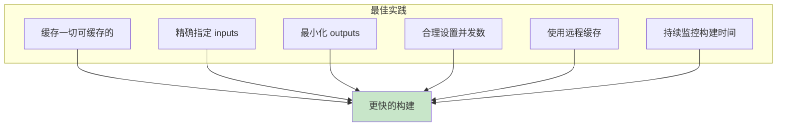

| 实践 | 说明 | 影响 |
|------|------|------|
| 缓存一切 | lint、test、build 都启用缓存 | 大幅减少重复构建 |
| 精确 inputs | 只包含影响任务的文件 | 提高缓存命中率 |
| 最小 outputs | 只包含必要的输出文件 | 减少缓存存储 |
| 合理并发 | 根据 CPU 核心数设置 | 充分利用资源 |
| 远程缓存 | 团队共享构建缓存 | CI/CD 加速 |
| 监控构建 | 定期检查构建时间 | 及时发现问题 |

```json
// turbo.json 性能优化配置
{
  "$schema": "https://turbo.build/schema.json",
  "tasks": {
    "build": {
      "dependsOn": ["^build"],
      "inputs": [
        "src/**",
        "tsconfig.json",
        "package.json",
        "!**/__tests__/**",
        "!**/*.test.ts",
        "!**/*.spec.ts"
      ],
      "outputs": [
        "dist/**",
        "!.next/cache/**"
      ],
      "cache": true
    },
    "lint": {
      "inputs": [
        "src/**",
        ".eslintrc.js",
        "tsconfig.json"
      ],
      "outputs": [],
      "cache": true
    },
    "test": {
      "dependsOn": ["build"],
      "inputs": [
        "src/**",
        "tests/**",
        "jest.config.js",
        "!**/__snapshots__/**"
      ],
      "outputs": [
        "coverage/**"
      ],
      "cache": true
    },
    "type-check": {
      "dependsOn": ["^build"],
      "inputs": [
        "src/**",
        "tsconfig.json"
      ],
      "outputs": [],
      "cache": true
    },
    "dev": {
      "cache": false,
      "persistent": true
    },
    "clean": {
      "cache": false
    }
  }
}
```

---

## 12. pnpm-workspace.yaml 配置分析

### 12.1 Monorepo 结构

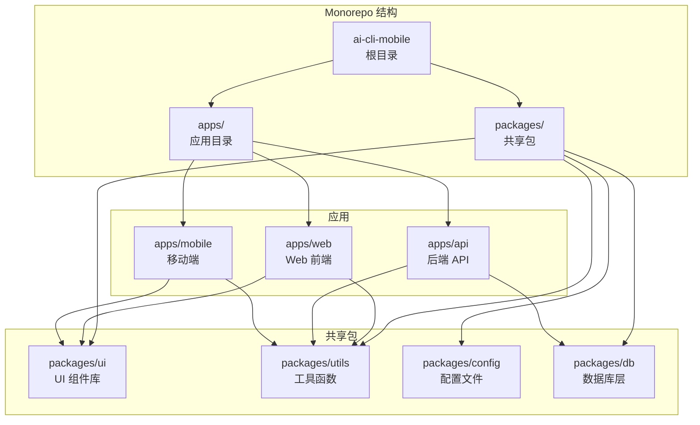

### 12.2 pnpm-workspace.yaml 配置

```yaml
# pnpm-workspace.yaml
packages:
  # 应用目录
  - 'apps/*'

  # 共享包目录
  - 'packages/*'

  # 排除某些目录
  - '!**/test/**'
  - '!**/__tests__/**'
```

### 12.3 根目录 package.json

```json
{
  "name": "ai-cli-mobile",
  "private": true,
  "scripts": {
    "dev": "turbo run dev",
    "build": "turbo run build",
    "lint": "turbo run lint",
    "test": "turbo run test",
    "type-check": "turbo run type-check",
    "format": "prettier --write .",
    "format:check": "prettier --check .",
    "clean": "turbo run clean && rm -rf node_modules",
    "changeset": "changeset",
    "version-packages": "changeset version",
    "release": "turbo run build --filter=packages/* && changeset publish"
  },
  "devDependencies": {
    "@changesets/cli": "^2.27.0",
    "prettier": "^3.2.0",
    "turbo": "^1.12.0"
  },
  "engines": {
    "node": ">=18",
    "pnpm": ">=8"
  },
  "packageManager": "pnpm@8.15.0"
}
```

### 12.4 包之间的依赖

```json
// apps/web/package.json
{
  "name": "@my-app/web",
  "dependencies": {
    "@my-app/ui": "workspace:*",
    "@my-app/utils": "workspace:*",
    "@my-app/config": "workspace:*"
  }
}

// packages/ui/package.json
{
  "name": "@my-app/ui",
  "dependencies": {
    "@my-app/utils": "workspace:*"
  }
}
```

```bash
# workspace:* 表示使用本地包，始终链接到最新版本

# pnpm workspace 常用命令

# 安装所有依赖
pnpm install

# 在特定包中添加依赖
pnpm add lodash --filter @my-app/web

# 在特定包中添加开发依赖
pnpm add -D jest --filter @my-app/api

# 运行特定包的脚本
pnpm --filter @my-app/web dev

# 运行所有包的 build
pnpm -r run build

# 运行所有包的 lint（并行）
pnpm -r --parallel run lint

# 查看依赖关系
pnpm why @my-app/utils --filter @my-app/web

# 添加包之间的依赖
pnpm add @my-app/utils --filter @my-app/web --workspace
```

### 12.5 Changesets 版本管理

```bash
# 安装 changesets
pnpm add -D @changesets/cli

# 初始化
pnpm changeset init

# 创建变更集
pnpm changeset
# 交互式选择：
# 1. 哪些包有变更
# 2. 变更类型（major/minor/patch）
# 3. 变更描述

# 更新版本号
pnpm changeset version
# 自动更新 package.json 版本号
# 自动更新 CHANGELOG.md

# 发布
pnpm changeset publish
```

```markdown
# .changeset/README.md
# Changesets

本项目使用 Changesets 管理版本和发布。

## 使用流程

1. 开发功能，提交代码
2. 运行 `pnpm changeset` 创建变更集
3. 提交变更集文件
4. CI 会自动创建 "Version Packages" PR
5. 合并 PR 后自动发布
```

### 12.6 Monorepo 开发工作流

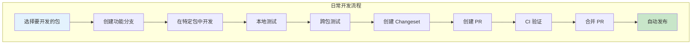

```bash
# ===========================================
# 常用 pnpm workspace 命令
# ===========================================

# 在所有包中运行命令
pnpm -r run build          # 递归运行 build
pnpm -r --parallel run dev  # 并行运行 dev

# 在特定包中运行
pnpm --filter @my-app/web dev
pnpm --filter @my-app/web run test

# 在匹配模式的包中运行
pnpm --filter "@my-app/*" run lint

# 在特定包及其依赖中运行
pnpm --filter @my-app/web... run build

# 添加依赖到特定包
pnpm add lodash --filter @my-app/web
pnpm add -D jest --filter @my-app/api

# 添加包之间的依赖
pnpm add @my-app/utils --filter @my-app/web --workspace

# 移除依赖
pnpm remove lodash --filter @my-app/web

# 查看依赖关系图
pnpm list --recursive --depth=2
pnpm why @my-app/utils --filter @my-app/web

# 检查过期依赖
pnpm outdated --recursive

# 更新依赖
pnpm update --recursive
pnpm update lodash --recursive
```

### 12.7 Monorepo 最佳实践

```bash
# 1. 保持包的独立性
# 每个包应该有自己的 package.json、tsconfig.json
packages/
  ui/
    package.json
    tsconfig.json
    src/
    tests/
  utils/
    package.json
    tsconfig.json
    src/
    tests/

# 2. 使用 workspace 协议
# package.json 中使用 workspace:* 引用本地包
"dependencies": {
  "@my-app/utils": "workspace:*"
}

# 3. 共享配置
# 将通用配置提取到共享包
packages/
  config/
    eslint/        # 共享 ESLint 配置
    typescript/    # 共享 TS 配置
    jest/          # 共享 Jest 配置

# 4. 统一脚本命名
# 每个包使用相同的脚本名称
"scripts": {
  "build": "...",
  "dev": "...",
  "lint": "...",
  "test": "...",
  "type-check": "..."
}

# 5. 合理划分包
# - apps/*：可独立运行的应用
# - packages/*：共享的库和配置
# - packages/ui：UI 组件库
# - packages/utils：工具函数
# - packages/config：共享配置
# - packages/db：数据库层

# 6. 避免循环依赖
# A -> B -> C 是可以的
# A -> B -> A 是循环依赖，应该避免

# 7. 使用 Changesets 管理版本
# 每次变更都创建 changeset
# CI 自动创建版本 PR
# 合并后自动发布

# 8. CI/CD 配置
# 使用 Turborepo 的远程缓存
# 只构建变更的包
# 并行运行测试
```

### 12.8 常见问题解决

```bash
# 问题 1：包之间依赖找不到
# 解决方案：确保使用 workspace: 协议
"dependencies": {
  "@my-app/utils": "workspace:*"  // ✅ 正确
  // "@my-app/utils": "*"         // ❌ 错误
}

# 问题 2：TypeScript 找不到其他包的类型
# 解决方案：配置 tsconfig.json 的 references
// apps/web/tsconfig.json
{
  "compilerOptions": {
    "paths": {
      "@my-app/ui": ["../../packages/ui/src"],
      "@my-app/utils": ["../../packages/utils/src"]
    }
  },
  "references": [
    { "path": "../../packages/ui" },
    { "path": "../../packages/utils" }
  ]
}

# 问题 3：pnpm install 很慢
# 解决方案：
# 1. 使用 --frozen-lockfile（CI 环境）
pnpm install --frozen-lockfile
# 2. 使用硬链接
echo "auto-install-peers=true" > .npmrc
# 3. 清除缓存
cpnpm store prune

# 问题 4：包发布失败
# 解决方案：
# 1. 检查 npm registry 配置
npm config get registry
# 2. 确保登录
npm login
# 3. 检查包名是否冲突
npm view @my-app/ui
# 4. 使用 --access public（scoped 包）
pnpm publish --access public

# 问题 5：Turborepo 缓存不生效
# 解决方案：
# 1. 检查 inputs 配置是否正确
# 2. 确保 outputs 路径正确
# 3. 检查环境变量是否影响缓存
turbo run build --dry-run  # 查看缓存状态
# 4. 清除缓存重新构建
turbo run build --force
```

---

## 13. 开发效率工具推荐

### 13.1 命令行工具

| 工具 | 功能 | 安装命令 |
|------|------|---------|
| `fzf` | 模糊搜索 | `apt install fzf` |
| `ripgrep (rg)` | 快速搜索 | `apt install ripgrep` |
| `fd` | 快速查找文件 | `apt install fd-find` |
| `bat` | 增强版 cat | `apt install bat` |
| `exa/eza` | 增强版 ls | `apt install exa` |
| `zoxide` | 智能 cd | `curl -sSfL https://raw.githubusercontent.com/ajeetdsouza/zoxide/main/install.sh \| sh` |
| `starship` | 终端提示符 | `curl -sS https://starship.rs/install.sh \| sh` |
| `tmux` | 终端复用 | `apt install tmux` |
| `tldr` | 简化版 man | `npm install -g tldr` |
| `httpie` | HTTP 客户端 | `apt install httpie` |
| `jq` | JSON 处理 | `apt install jq` |
| `yq` | YAML 处理 | `snap install yq` |
| `lazygit` | Git TUI | `go install github.com/jesseduffield/lazygit@latest` |
| `delta` | Git diff 美化 | `cargo install git-delta` |
| `tokei` | 代码统计 | `cargo install tokei` |

### 13.2 实用脚本

```bash
#!/bin/bash
# scripts/dev-tools.sh - 开发效率脚本集合

# 快速创建项目
create-project() {
  local name=$1
  local template=${2:-"default"}

  case $template in
    "react")
      pnpm create vite@latest $name --template react-ts
      ;;
    "next")
      pnpm create next-app@latest $name --typescript --tailwind --eslint
      ;;
    "express")
      mkdir $name && cd $name
      pnpm init
      pnpm add express cors helmet
      pnpm add -D typescript @types/node @types/express tsx nodemon
      ;;
    *)
      mkdir $name && cd $name
      pnpm init
      ;;
  esac

  git init
  echo "node_modules\ndist\n.env" > .gitignore
  echo "Created project: $name"
}

# 快速查找并杀掉进程
kill-port() {
  local port=$1
  local pid=$(lsof -ti:$port)
  if [ -n "$pid" ]; then
    kill -9 $pid
    echo "Killed process on port $port (PID: $pid)"
  else
    echo "No process on port $port"
  fi
}

# Git 快捷操作
glog() {
  git log --oneline --graph --all -n ${1:-20}
}

gdiff() {
  git diff --stat ${1:-HEAD~1}
}

gclean() {
  git fetch --prune
  git branch -vv | grep ': gone]' | awk '{print $1}' | xargs git branch -d
}

# 代码统计
code-stats() {
  echo "=== 代码统计 ==="
  echo ""
  echo "文件数量:"
  find . -name "*.ts" -o -name "*.tsx" | wc -l
  echo ""
  echo "代码行数:"
  find . -name "*.ts" -o -name "*.tsx" | xargs wc -l | tail -1
  echo ""
  echo "按类型统计:"
  find . -type f | sed 's/.*\.//' | sort | uniq -c | sort -rn | head -20
}
```

### 13.3 开发工作流最佳实践

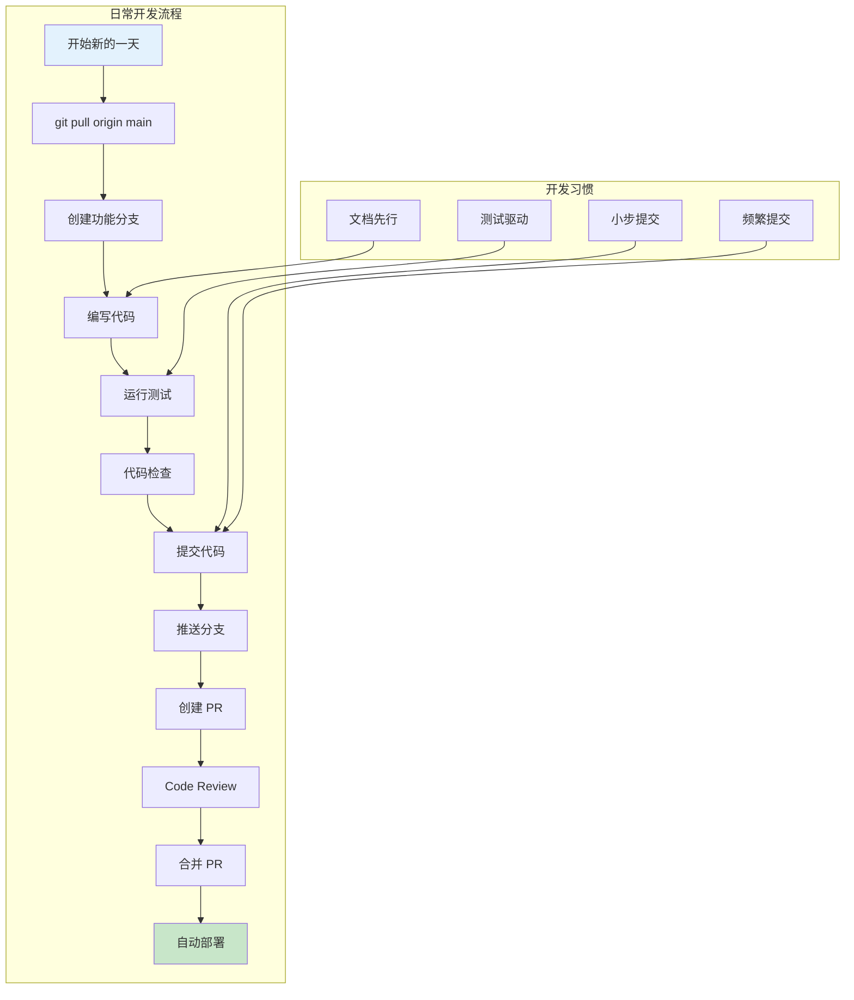

### 13.4 项目脚本配置示例

```json
{
  "scripts": {
    "dev": "next dev",
    "dev:api": "tsx watch src/api/server.ts",
    "dev:all": "concurrently \"pnpm dev\" \"pnpm dev:api\"",

    "build": "next build",
    "build:analyze": "ANALYZE=true next build",
    "start": "next start",

    "lint": "eslint . --ext .ts,.tsx",
    "lint:fix": "eslint . --ext .ts,.tsx --fix",
    "format": "prettier --write .",
    "format:check": "prettier --check .",
    "type-check": "tsc --noEmit",

    "test": "jest",
    "test:watch": "jest --watch",
    "test:coverage": "jest --coverage",
    "test:e2e": "playwright test",

    "db:migrate": "prisma migrate dev",
    "db:push": "prisma db push",
    "db:studio": "prisma studio",
    "db:seed": "tsx prisma/seed.ts",
    "db:reset": "prisma migrate reset",

    "prepare": "husky install",
    "clean": "rm -rf dist .next node_modules .turbo",
    "release": "standard-version",
    "release:minor": "standard-version --release-as minor",
    "release:major": "standard-version --release-as major"
  }
}
```

### 13.5 开发环境自动化脚本

```bash
#!/bin/bash
# scripts/setup-dev.sh - 一键配置开发环境

set -e

echo "🚀 开始配置开发环境..."

# 1. 检查必要工具
echo "检查必要工具..."
command -v node >/dev/null 2>&1 || { echo "需要安装 Node.js >= 18"; exit 1; }
command -v pnpm >/dev/null 2>&1 || { echo "需要安装 pnpm >= 8"; exit 1; }
command -v docker >/dev/null 2>&1 || { echo "需要安装 Docker"; exit 1; }

# 2. 安装依赖
echo "安装依赖..."
pnpm install

# 3. 配置环境变量
if [ ! -f .env.local ]; then
  echo "创建 .env.local..."
  cp .env.example .env.local
  echo "请编辑 .env.local 配置环境变量"
fi

# 4. 启动数据库
echo "启动数据库..."
docker compose up -d postgres redis

# 5. 等待数据库就绪
echo "等待数据库就绪..."
sleep 5

# 6. 运行数据库迁移
echo "运行数据库迁移..."
pnpm db:migrate

# 7. 种子数据
echo "导入种子数据..."
pnpm db:seed

# 8. 安装 Git hooks
echo "安装 Git hooks..."
pnpm prepare

echo ""
echo "✅ 开发环境配置完成！"
echo ""
echo "启动开发服务器：pnpm dev"
echo "运行测试：pnpm test"
echo "查看数据库：pnpm db:studio"
```

### 13.6 Docker 开发环境配置

```yaml
# docker-compose.dev.yml
# 开发环境专用 Docker Compose

version: '3.8'

services:
  # PostgreSQL 数据库
  postgres:
    image: postgres:16-alpine
    container_name: dev-postgres
    ports:
      - "5432:5432"
    environment:
      POSTGRES_DB: ai_cli_dev
      POSTGRES_USER: dev
      POSTGRES_PASSWORD: dev123
    volumes:
      - postgres-dev-data:/var/lib/postgresql/data
      - ./init-scripts:/docker-entrypoint-initdb.d
    healthcheck:
      test: ["CMD-SHELL", "pg_isready -U dev"]
      interval: 5s
      timeout: 3s
      retries: 5

  # Redis 缓存
  redis:
    image: redis:7-alpine
    container_name: dev-redis
    ports:
      - "6379:6379"
    command: redis-server --maxmemory 128mb --maxmemory-policy allkeys-lru

  # MinIO 对象存储（S3 兼容）
  minio:
    image: minio/minio
    container_name: dev-minio
    ports:
      - "9000:9000"
      - "9001:9001"
    environment:
      MINIO_ROOT_USER: minioadmin
      MINIO_ROOT_PASSWORD: minioadmin
    command: server /data --console-address ":9001"
    volumes:
      - minio-dev-data:/data

  # MailHog（邮件测试）
  mailhog:
    image: mailhog/mailhog
    container_name: dev-mailhog
    ports:
      - "1025:1025"   # SMTP
      - "8025:8025"   # Web UI

  # Adminer（数据库管理）
  adminer:
    image: adminer
    container_name: dev-adminer
    ports:
      - "8080:8080"

volumes:
  postgres-dev-data:
  minio-dev-data:
```

### 13.7 VS Code 调试配置模板

```json
// .vscode/launch.json - 完整调试配置
{
  "version": "0.2.0",
  "configurations": [
    {
      "name": "Debug API Server",
      "type": "node",
      "request": "launch",
      "runtimeExecutable": "${workspaceFolder}/node_modules/.bin/tsx",
      "args": ["src/server.ts"],
      "env": {
        "NODE_ENV": "development",
        "DEBUG": "app:*"
      },
      "console": "integratedTerminal",
      "skipFiles": ["<node_internals>/**", "node_modules/**"],
      "restart": true,
      "runtimeArgs": ["--inspect"]
    },
    {
      "name": "Debug Jest Tests",
      "type": "node",
      "request": "launch",
      "runtimeExecutable": "${workspaceFolder}/node_modules/.bin/jest",
      "args": [
        "--runInBand",
        "--testPathPattern",
        "${fileBasename}"
      ],
      "console": "integratedTerminal",
      "skipFiles": ["<node_internals>/**", "node_modules/**"]
    },
    {
      "name": "Debug Current File",
      "type": "node",
      "request": "launch",
      "program": "${file}
      "runtimeArgs": ["--loader", "tsx"],
      "console": "integratedTerminal",
      "skipFiles": ["<node_internals>/**"]
    },
    {
      "name": "Debug Prisma Studio",
      "type": "node",
      "request": "launch",
      "runtimeExecutable": "${workspaceFolder}/node_modules/.bin/prisma",
      "args": ["studio"],
      "console": "integratedTerminal"
    },
    {
      "name": "Attach to Docker",
      "type": "node",
      "request": "attach",
      "port": 9229,
      "remoteRoot": "/app",
      "localRoot": "${workspaceFolder}",
      "skipFiles": ["<node_internals>/**"]
    }
  ],
  "compounds": [
    {
      "name": "Debug Full Stack",
      "configurations": ["Debug API Server"],
      "stopAll": true
    }
  ]
}
```

```json
// .vscode/tasks.json - 自动化任务
{
  "version": "2.0.0",
  "tasks": [
    {
      "label": "Start Dev Server",
      "type": "npm",
      "script": "dev",
      "problemMatcher": [],
      "isBackground": true,
      "presentation": {
        "reveal": "always",
        "panel": "new"
      }
    },
    {
      "label": "Run Tests",
      "type": "npm",
      "script": "test",
      "problemMatcher": ["$jest"],
      "presentation": {
        "reveal": "always",
        "panel": "dedicated"
      }
    },
    {
      "label": "Lint Fix",
      "type": "npm",
      "script": "lint:fix",
      "problemMatcher": ["$eslint-stylish"]
    },
    {
      "label": "Database Migrate",
      "type": "npm",
      "script": "db:migrate",
      "problemMatcher": []
    },
    {
      "label": "Build Project",
      "type": "npm",
      "script": "build",
      "problemMatcher": ["$tsc"]
    }
  ]
}
```

### 13.8 Git Hooks 高级配置

```bash
# .husky/commit-msg - 完整的 commit 规范检查
#!/usr/bin/env sh
. "$(dirname -- "$0")/_/husky.sh"

# Commitlint 检查
npx --no -- commitlint --edit "$1"

# 自动关联 Issue
COMMIT_MSG=$(cat "$1")
BRANCH_NAME=$(git branch --show-current)

# 如果分支名包含 issue 编号，自动添加到 commit message
if echo "$BRANCH_NAME" | grep -qE '^[a-z]+/[0-9]+'; then
  ISSUE_NUM=$(echo "$BRANCH_NAME" | grep -oE '[0-9]+' | head -1)
  if ! grep -q "Closes #$ISSUE_NUM" "$1"; then
    echo "" >> "$1"
    echo "Closes #$ISSUE_NUM" >> "$1"
  echo "自动关联 Issue #$ISSUE_NUM"
fi
```

```bash
# .husky/pre-push - 推送前检查
#!/usr/bin/env sh
. "$(dirname -- "$0")/_/husky.sh"

# 运行类型检查
echo "🔍 运行类型检查..."
pnpm type-check || exit 1

# 运行测试
echo "🧪 运行测试..."
pnpm test -- --passWithNoTests || exit 1

# 检查是否有未提交的更改
if [ -n "$(git status --porcelain)" ]; then
  echo "⚠️  有未提交的更改:"
  git status --short
  echo ""
  read -p "是否继续推送? (y/N) " -n 1 -r
  echo
  if [[ ! $REPLY =~ ^[Yy]$ ]]; then
    exit 1
  fi
fi

echo "✅ 推送前检查通过"
```

```bash
# .husky/post-checkout - 切换分支后操作
#!/usr/bin/env sh
. "$(dirname -- "$0")/_/husky.sh"

# $1 = 旧分支, $2 = 新分支, $3 = 1 (分支切换) 或 0 (文件检出)
if [ "$3" = "1" ]; then
  # 检查 package.json 是否变更
  CHANGED=$(git diff --name-only "$1" "$2" | grep -E "package\.json|pnpm-lock\.yaml")
  if [ -n "$CHANGED" ]; then
    echo "📦 依赖文件有变更，建议运行 pnpm install"
    read -p "是否自动安装? (y/N) " -n 1 -r
    echo
    if [[ $REPLY =~ ^[Yy]$ ]]; then
      pnpm install
    fi
  fi
fi
```

### 13.9 开发环境快速诊断

```bash
#!/bin/bash
# scripts/diagnose-dev.sh - 开发环境诊断脚本

echo "========================================="
echo "  开发环境诊断"
echo "========================================="
echo ""

# 检查 Node.js 版本
echo "📦 Node.js:"
node --version
if [ $(node -v | cut -d. -f1 | tr -d 'v') -lt 18 ]; then
  echo "  ⚠️  建议升级到 Node.js >= 18"
else
  echo "  ✅ 版本正常"
fi
echo ""

# 检查 pnpm
echo "📦 pnpm:"
if command -v pnpm &> /dev/null; then
  pnpm --version
  echo "  ✅ 已安装"
else
  echo "  ❌ 未安装，运行: npm install -g pnpm"
fi
echo ""

# 检查 Docker
echo "🐳 Docker:"
if command -v docker &> /dev/null; then
  docker --version
  if docker info &> /dev/null; then
    echo "  ✅ Docker 运行中"
  else
    echo "  ⚠️  Docker 已安装但未运行"
  fi
else
  echo "  ❌ 未安装 Docker"
fi
echo ""

# 检查 Git
echo "📂 Git:"
git --version
echo "  用户: $(git config user.name) <$(git config user.email)>"
echo ""

# 检查端口占用
echo "🔌 端口检查:"
for port in 3000 5432 6379; do
  if lsof -i:$port &> /dev/null; then
    echo "  端口 $port: 被占用"
    lsof -i:$port | head -2
  else
    echo "  端口 $port: 空闲"
  fi
done
echo ""

# 检查磁盘空间
echo "💾 磁盘空间:"
df -h / | tail -1 | awk '{print "  使用: " $3 " / " $2 " (" $5 ")"}'
echo ""

# 检查 node_modules
echo "📁 项目状态:"
if [ -d "node_modules" ]; then
  echo "  ✅ node_modules 已安装"
else
  echo "  ⚠️  node_modules 未安装，运行: pnpm install"
fi

if [ -f ".env.local" ]; then
  echo "  ✅ .env.local 已配置"
else
  echo "  ⚠️  .env.local 未创建"
fi
echo ""

echo "========================================="
echo "  诊断完成"
echo "========================================="
```

### 13.10 常见问题解决

#### 问题 1：node_modules 安装失败

```bash
# 清除缓存
pnpm store prune
rm -rf node_modules pnpm-lock.yaml
pnpm install

# 如果是网络问题，使用镜像
pnpm config set registry https://registry.npmmirror.com

# 如果是权限问题
sudo chown -R $(whoami) ~/.pnpm-store
```

#### 问题 2：TypeScript 类型错误

```bash
# 重新生成类型
tsc --noEmit

# 如果是第三方库类型问题
# 安装缺失的类型包
pnpm add -D @types/xxx

# 如果是缓存问题
rm -rf node_modules/.cache
tsc --build --clean
tsc --noEmit
```

#### 问题 3：Docker 容器启动失败

```bash
# 查看容器日志
docker compose logs <service>

# 检查端口占用
lsof -i:<port>

# 重建容器
docker compose down -v  # -v 删除数据卷
docker compose up -d --build

# 检查 Docker 磁盘使用
docker system df
docker system prune -a
```

#### 问题 4：Git 状态异常

```bash
# 文件权限变更
git config core.filemode false

# 换行符问题
git config core.autocrlf input  # macOS/Linux
git config core.autocrlf true   # Windows

# 清理 git 状态
git rm --cached -r .
git reset HEAD .

# 如果 git index 损坏
git rm -r --cached .
git reset HEAD .
git checkout -- .
```

#### 问题 5：VS Code 扩展不工作

```bash
# 1. 重启 VS Code 扩展宿主
# Ctrl+Shift+P → "Developer: Reload Window"

# 2. 清除扩展缓存
rm -rf ~/.vscode/extensions/

# 3. 检查工作区设置
# .vscode/settings.json 中的配置是否正确

# 4. 检查 TypeScript 版本
# Ctrl+Shift+P → "TypeScript: Select TypeScript Version"
# 选择工作区版本
```

---

## 总结

本篇介绍了开发工具和工作流的核心内容：

| 章节 | 核心内容 |
|------|---------|
| Git 工作流 | GitFlow、Trunk-Based、PR Flow 对比 |
| Git 高级操作 | rebase、cherry-pick、bisect、stash |
| VS Code 配置 | 插件清单、settings.json、快捷键 |
| 调试技巧 | Node.js 调试、Chrome DevTools、断点策略 |
| ESLint 配置 | 完整规则配置、Flat Config |
| Prettier 配置 | 格式化选项、编辑器集成 |
| Husky + lint-staged | Git hooks 自动化 |
| Conventional Commits | 提交规范、版本管理 |
| 代码审查 | 审查流程、Checklist、评论规范 |
| 文档编写 | JSDoc、README、CHANGELOG |
| turbo.json | 构建编排、缓存策略 |
| pnpm-workspace | Monorepo 配置、包管理 |
| 效率工具 | CLI 工具、自动化脚本 |

### 关键要点

1. **选择合适的工作流**：根据团队规模和发布节奏选择 Git 工作流
2. **自动化一切**：lint、format、test、commit 都应该自动化
3. **配置好编辑器**：VS Code + 插件 = 生产力翻倍
4. **写好文档**：README、JSDoc、CHANGELOG 是项目的门面
5. **善用 Monorepo**：Turborepo + pnpm workspace 让多包管理变简单

> 💡 **工具是为人服务的**：不要为了使用工具而使用工具，选择适合自己团队的工具和流程最重要。

## 附录：开发工具速查表

### 常用命令速查

| 场景 | 命令 | 说明 |
|------|------|------|
| 安装依赖 | `pnpm install` | 安装所有依赖 |
| 启动开发 | `pnpm dev` | 启动开发服务器 |
| 构建项目 | `pnpm build` | 构建生产版本 |
| 运行测试 | `pnpm test` | 运行测试 |
| 代码检查 | `pnpm lint` | ESLint 检查 |
| 格式化 | `pnpm format` | Prettier 格式化 |
| 类型检查 | `pnpm type-check` | TypeScript 类型检查 |
| 数据库迁移 | `pnpm db:migrate` | 执行数据库迁移 |
| 数据库管理 | `pnpm db:studio` | 打开数据库管理 UI |
| 清理缓存 | `pnpm clean` | 清理构建缓存 |
| 创建变更集 | `pnpm changeset` | 创建 Changeset |
| 发布版本 | `pnpm release` | 发布新版本 |

### Git 命令速查

| 场景 | 命令 | 说明 |
|------|------|------|
| 查看状态 | `git status` | 查看工作区状态 |
| 查看历史 | `git log --oneline --graph` | 图形化查看历史 |
| 创建分支 | `git checkout -b feature/xxx` | 创建并切换分支 |
| 合并分支 | `git merge feature/xxx` | 合并分支 |
| 变基 | `git rebase main` | 变基到 main |
| 暂存修改 | `git stash push -m "描述"` | 暂存当前修改 |
| 恢复修改 | `git stash pop` | 恢复暂存的修改 |
| 拣选提交 | `git cherry-pick abc123` | 拣选特定提交 |
| 回滚提交 | `git revert abc123` | 回滚特定提交 |
| 查看差异 | `git diff --stat` | 查看变更统计 |
| 标记版本 | `git tag -a v1.0.0 -m "描述"` | 创建版本标签 |

### VS Code 快捷键速查

| 场景 | 快捷键 | 说明 |
|------|--------|------|
| 快速打开 | `Ctrl+P` | 快速打开文件 |
| 命令面板 | `Ctrl+Shift+P` | 所有命令入口 |
| 全局搜索 | `Ctrl+Shift+F` | 跨文件搜索 |
| 跳转定义 | `F12` | 跳转到函数定义 |
| 查看引用 | `Shift+F12` | 查看谁在使用 |
| 格式化 | `Shift+Alt+F` | 格式化代码 |
| 切换终端 | `` Ctrl+` `` | 显示/隐藏终端 |
| 多光标 | `Ctrl+D` | 选择下一个匹配 |
| 删除行 | `Ctrl+Shift+K` | 删除整行 |
| 移动行 | `Alt+Up/Down` | 上下移动代码行 |

### 常见错误代码速查

| HTTP 状态码 | 含义 | 常见原因 |
|------------|------|----------|
| 200 | OK | 请求成功 |
| 201 | Created | 资源创建成功 |
| 301 | Moved Permanently | 永久重定向 |
| 304 | Not Modified | 资源未修改（缓存） |
| 400 | Bad Request | 请求参数错误 |
| 401 | Unauthorized | 未认证（需要登录） |
| 403 | Forbidden | 无权限访问 |
| 404 | Not Found | 资源不存在 |
| 409 | Conflict | 资源冲突（如重复创建） |
| 422 | Unprocessable Entity | 数据验证失败 |
| 429 | Too Many Requests | 请求过于频繁（限流） |
| 500 | Internal Server Error | 服务器内部错误 |
| 502 | Bad Gateway | 网关错误 |
| 503 | Service Unavailable | 服务不可用 |
| 504 | Gateway Timeout | 网关超时 |

---

# 补充章节：Git 工作流详解

> 📖 本节对比主流的 Git 分支策略，帮你理解团队协作中的代码管理方式。

## GitFlow vs Trunk-Based

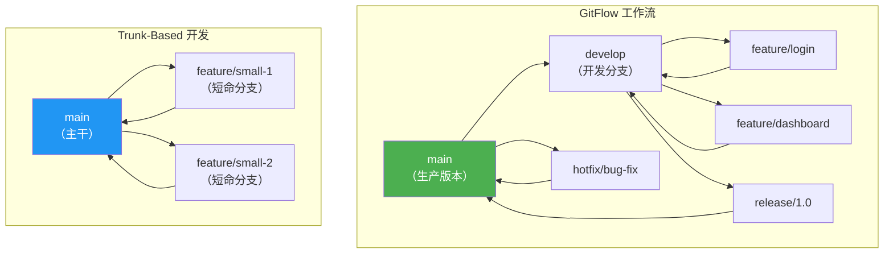

| 策略 | 分支数量 | 发布频率 | 适用团队 | CI/CD 要求 |
|------|---------|---------|---------|-----------|
| **GitFlow** | 多（main/develop/feature/release/hotfix） | 低（按版本发布） | 大团队 | 中 |
| **Trunk-Based** | 少（main + 短命 feature） | 高（持续部署） | 小团队 | 高 |
| **GitHub Flow** | 中（main + feature + PR） | 中 | 中等团队 | 中 |

## Git 高级操作

### rebase vs merge

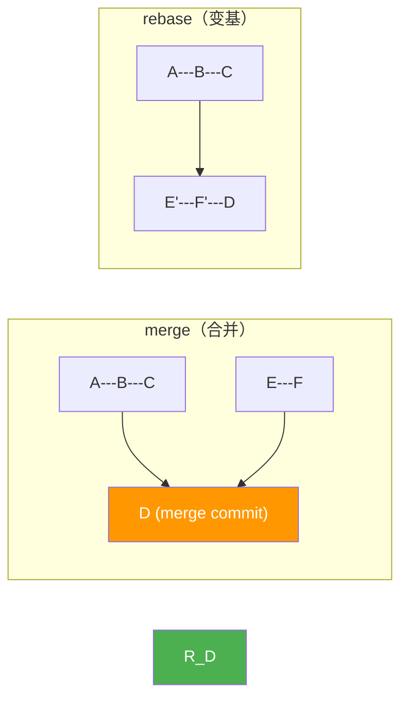

| 操作 | 历史记录 | 冲突处理 | 使用场景 |
|------|---------|---------|---------|
| merge | 保留分支历史，有 merge commit | 一次解决所有冲突 | 公共分支 |
| rebase | 线性历史，更清晰 | 逐个 commit 解决 | 本地分支 |

### cherry-pick

```bash
# 将某个 commit 应用到当前分支
git cherry-pick abc123

# 应用多个 commit
git cherry-pick abc123 def456

# 应用一个范围的 commit
git cherry-pick abc123..def456
```

### bisect（二分查找 bug）

```bash
# 开始二分查找
git bisect start
git bisect bad          # 当前版本有 bug
git bisect good v1.0.0  # v1.0.0 没有 bug

# Git 会自动 checkout 中间的 commit
# 测试后标记
git bisect good  # 这个 commit 没有 bug
git bisect bad   # 这个 commit 有 bug

# 重复直到找到引入 bug 的 commit
# 结束
git bisect reset
```

---

# 补充章节：ESLint 配置详解

> 📖 本节详解 ESLint 的配置方式和常用规则。

## Flat Config（ESLint 9+）

```javascript
// eslint.config.js（项目中的配置方式）
import js from '@eslint/js'
import ts from '@typescript-eslint/eslint-plugin'
import react from 'eslint-plugin-react'

export default [
  js.configs.recommended,
  {
    files: ['**/*.ts', '**/*.tsx'],
    plugins: {
      '@typescript-eslint': ts,
      'react': react,
    },
    rules: {
      // 常用规则
      'no-unused-vars': 'off',                    // 交给 TypeScript 处理
      '@typescript-eslint/no-unused-vars': 'warn',
      'react/react-in-jsx-scope': 'off',          // React 17+ 不需要 import React
      '@typescript-eslint/no-explicit-any': 'warn',
      'prefer-const': 'error',
      'no-var': 'error',
    },
  },
]
```

## 常用规则分类

| 类别 | 规则 | 说明 |
|------|------|------|
| **可能的错误** | `no-undef` | 禁止未声明的变量 |
| **可能的错误** | `no-unreachable` | 禁止不可达代码 |
| **最佳实践** | `eqeqeq` | 要求使用 === |
| **最佳实践** | `no-eval` | 禁止 eval |
| **风格** | `prefer-const` | 优先使用 const |
| **风格** | `no-var` | 禁止 var |
| **TypeScript** | `@typescript-eslint/no-explicit-any` | 警告 any 类型 |
| **React** | `react-hooks/rules-of-hooks` | Hooks 规则检查 |

---

# 补充章节：Conventional Commits 规范

> 📖 本节详解提交信息的规范写法，帮你养成好的 Git 习惯。

## 提交信息格式

```
<type>(<scope>): <description>

[optional body]

[optional footer]
```

## 类型（type）

| 类型 | 说明 | 示例 |
|------|------|------|
| `feat` | 新功能 | `feat(auth): add JWT refresh token` |
| `fix` | 修复 bug | `fix(ws): handle connection timeout` |
| `docs` | 文档 | `docs: update README setup guide` |
| `style` | 格式（不影响代码运行） | `style: fix indentation` |
| `refactor` | 重构 | `refactor(session): extract adapter pattern` |
| `perf` | 性能优化 | `perf(pty): add output throttling` |
| `test` | 测试 | `test(auth): add rate limit tests` |
| `chore` | 构建/工具 | `chore: update dependencies` |
| `ci` | CI/CD | `ci: add GitHub Actions workflow` |

## 项目中的 commitlint 配置

```json
// commitlint.config.js
module.exports = {
  extends: ['@commitlint/config-conventional'],
  rules: {
    'type-enum': [2, 'always', [
      'feat', 'fix', 'docs', 'style', 'refactor',
      'perf', 'test', 'chore', 'ci', 'revert'
    ]],
    'subject-max-length': [2, 'always', 72],
    'body-max-line-length': [1, 'always', 100],
  },
}
```

---

# 补充章节：代码审查最佳实践

> 📖 本节总结代码审查的注意事项，帮你成为更好的代码审查者。

## 审查 Checklist

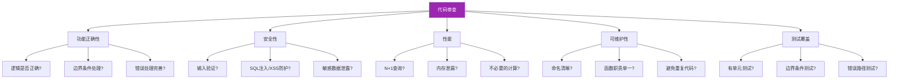

## 常见问题与重构建议

| 问题 | 重构方案 |
|------|---------|
| 函数过长（>50行） | 提取子函数 |
| 参数过多（>4个） | 引入参数对象 |
| 深层嵌套（>3层） | 卫语句（early return） |
| 魔法数字 | 提取为命名常量 |
| 重复代码 | 提取公共函数 |
| 过度注释 | 代码自解释，删除多余注释 |

---

> 📝 补充章节完成。本篇现在涵盖 Git 工作流、高级操作、VS Code 配置、ESLint、Prettier、Husky、Conventional Commits、代码审查等完整的开发工具与工作流知识体系。

---

## 21.23 VS Code 深度配置

### 21.23.1 settings.json 完整示例

```jsonc
// .vscode/settings.json - 项目级配置
{
  // === 编辑器基本设置 ===
  "editor.fontSize": 14,                    // 字体大小
  "editor.fontFamily": "'JetBrains Mono', 'Fira Code', monospace",  // 字体
  "editor.fontLigatures": true,             // 启用连字（如 => 、 !==）
  "editor.tabSize": 2,                      // Tab 宽度
  "editor.insertSpaces": true,              // 使用空格代替 Tab
  "editor.wordWrap": "on",                  // 自动换行
  "editor.lineNumbers": "on",               // 显示行号
  "editor.minimap.enabled": false,          // 关闭缩略图（节省空间）
  "editor.bracketPairColorization.enabled": true,  // 括号颜色配对
  "editor.guides.bracketPairs": true,       // 括号对引导线
  "editor.cursorBlinking": "smooth",        // 光标动画
  "editor.cursorSmoothCaretAnimation": "on", // 光标平滑移动
  "editor.smoothScrolling": true,           // 平滑滚动
  "editor.stickyScroll.enabled": true,      // 顶部固定显示当前作用域

  // === 代码格式化 ===
  "editor.formatOnSave": true,              // 保存时自动格式化
  "editor.formatOnPaste": true,             // 粘贴时自动格式化
  "editor.defaultFormatter": "esbenp.prettier-vscode",  // 默认格式化器
  "editor.codeActionsOnSave": {
    "source.fixAll.eslint": "explicit",     // 保存时自动修复 ESLint 错误
    "source.organizeImports": "explicit"    // 保存时自动整理导入
  },

  // === TypeScript/JavaScript ===
  "typescript.tsdk": "node_modules/typescript/lib",  // 使用项目本地的 TS
  "typescript.preferences.importModuleSpecifier": "relative",
  "typescript.updateImportsOnFileMove.enabled": "always",
  "javascript.suggest.autoImports": true,
  "javascript.suggest.completeFunctionCalls": true,

  // === 终端设置 ===
  "terminal.integrated.fontSize": 13,
  "terminal.integrated.defaultProfile.linux": "zsh",
  "terminal.integrated.scrollback": 10000,   // 终端历史行数
  "terminal.integrated.cursorBlinking": true,

  // === 文件设置 ===
  "files.autoSave": "afterDelay",           // 延迟后自动保存
  "files.autoSaveDelay": 1000,              // 延迟1秒
  "files.encoding": "utf8",                 // 默认编码
  "files.trimTrailingWhitespace": true,     // 删除行尾空格
  "files.insertFinalNewline": true,         // 文件末尾添加换行
  "files.trimFinalNewlines": true,          // 删除文件末尾多余换行
  "files.exclude": {                        // 隐藏不需要的文件
    "**/node_modules": true,
    "**/.git": true,
    "**/dist": true,
    "**/.next": true
  },

  // === 搜索设置 ===
  "search.exclude": {
    "**/node_modules": true,
    "**/dist": true,
    "**/package-lock.json": true,
    "**/yarn.lock": true
  },

  // === Git 设置 ===
  "git.autofetch": true,                    // 自动拉取远程更新
  "git.confirmSync": false,                 // 同步时不再确认
  "git.enableSmartCommit": true,            // 智能提交（自动暂存）
  "gitlens.hovers.currentLine.over": "line", // GitLens 当前行信息

  // === 工作区推荐扩展 ===
  "extensions.recommendations": [
    "esbenp.prettier-vscode",
    "dbaeumer.vscode-eslint",
    "bradlc.vscode-tailwindcss",
    "prisma.prisma",
    "ms-vscode.vscode-typescript-next"
  ]
}
```

### 21.23.2 键盘快捷键

```jsonc
// keybindings.json
[
  // === 通用操作 ===
  { "key": "ctrl+shift+p",    "command": "workbench.action.showCommands" },   // 命令面板
  { "key": "ctrl+p",          "command": "workbench.action.quickOpen" },       // 快速打开文件
  { "key": "ctrl+shift+f",    "command": "workbench.action.findInFiles" },     // 全局搜索
  { "key": "ctrl+shift+e",    "command": "workbench.view.explorer" },          // 切换到资源管理器
  { "key": "ctrl+shift+g",    "command": "workbench.view.scm" },              // 切换到 Git
  { "key": "ctrl+shift+x",    "command": "workbench.view.extensions" },        // 切换到扩展

  // === 编辑操作 ===
  { "key": "alt+up",          "command": "editor.action.moveLinesUpAction" },   // 上移行
  { "key": "alt+down",        "command": "editor.action.moveLinesDownAction" }, // 下移行
  { "key": "shift+alt+up",    "command": "editor.action.copyLinesUpAction" },   // 向上复制行
  { "key": "shift+alt+down",  "command": "editor.action.copyLinesDownAction" }, // 向下复制行
  { "key": "ctrl+shift+k",    "command": "editor.action.deleteLine" },          // 删除整行
  { "key": "ctrl+d",          "command": "editor.action.addSelectionToNextFindMatch" }, // 选择下一个相同词
  { "key": "alt+shift+f",     "command": "editor.action.formatDocument" },      // 格式化文档

  // === 多光标 ===
  { "key": "alt+click",                "command": "editor.action.insertCursor" },      // 点击添加光标
  { "key": "ctrl+alt+up",             "command": "editor.action.insertCursorAbove" },  // 上方添加光标
  { "key": "ctrl+alt+down",           "command": "editor.action.insertCursorBelow" },  // 下方添加光标

  // === 代码导航 ===
  { "key": "f12",             "command": "editor.action.revealDefinition" },    // 跳转到定义
  { "key": "alt+f12",         "command": "editor.action.peekDefinition" },      // 预览定义
  { "key": "shift+f12",       "command": "editor.action.goToReferences" },      // 查找引用
  { "key": "ctrl+shift+o",    "command": "editor.action.quickOutline" },        // 快速跳转到符号
  { "key": "ctrl+t",          "command": "workbench.action.showAllSymbols" },   // 全局符号搜索

  // === 终端 ===
  { "key": "ctrl+`",          "command": "workbench.action.terminal.toggleTerminal" },  // 切换终端
  { "key": "ctrl+shift+`",    "command": "workbench.action.terminal.new" },              // 新建终端

  // === 自定义操作 ===
  { "key": "ctrl+shift+r",    "command": "editor.action.rename" },              // 重命名符号
  { "key": "ctrl+shift+.",    "command": "editor.action.triggerSuggest" },      // 触发代码建议
  { "key": "f2",              "command": "editor.action.rename" },              // 重命名
  { "key": "ctrl+.",          "command": "editor.action.quickFix" }             // 快速修复
]
```

### 21.23.3 代码片段

```jsonc
// .vscode/javascript.json - 自定义代码片段
{
  // 箭头函数组件
  "Arrow Function Component": {
    "prefix": "afc",
    "body": [
      "interface ${1:ComponentName}Props {",
      "  $2",
      "}",
      "",
      "const ${1:ComponentName} = ({ $3 }: ${1:ComponentName}Props) => {",
      "  return (",
      "    <div>",
      "      $0",
      "    </div>",
      "  );",
      "};",
      "",
      "export default ${1:ComponentName};"
    ],
    "description": "React Arrow Function Component with TypeScript"
  },

  // React Hook
  "Custom Hook": {
    "prefix": "uhook",
    "body": [
      "import { useState, useEffect } from 'react';",
      "",
      "export function use${1:HookName}($2) {",
      "  const [${3:state}, set${3/(.*)/${1:/capitalize}/}] = useState($4);",
      "",
      "  useEffect(() => {",
      "    $5",
      "    return () => {",
      "      $6",
      "    };",
      "  }, [$7]);",
      "",
      "  return { $3 };",
      "}"
    ],
    "description": "Custom React Hook"
  },

  // Try-Catch 异步
  "Async Try-Catch": {
    "prefix": "atc",
    "body": [
      "try {",
      "  const ${1:result} = await $2;",
      "  $3",
      "} catch (${4:error}) {",
      "  console.error('$5:', ${4:error});",
      "  $0",
      "}"
    ],
    "description": "Async function with try-catch"
  },

  // Console Log
  "Console Log": {
    "prefix": "cl",
    "body": ["console.log('$1:', $1);"],
    "description": "Console log with label"
  },

  // 测试用例
  "Test Case": {
    "prefix": "test",
    "body": [
      "test('${1:测试描述}', async () => {",
      "  // Arrange",
      "  $2",
      "",
      "  // Act",
      "  $3",
      "",
      "  // Assert",
      "  $0",
      "});"
    ],
    "description": "Jest test case with AAA pattern"
  },

  // Express 路由
  "Express Route": {
    "prefix": "eroute",
    "body": [
      "/**",
      " * @${1:get} ${2:/api/path}",
      " * @description $3",
      " */",
      "router.${1:get}('${2:/api/path}', async (req: Request, res: Response) => {",
      "  try {",
      "    $4",
      "    res.json({ success: true, data: $5 });",
      "  } catch (error) {",
      "    res.status(500).json({ success: false, error: (error as Error).message });",
      "  }",
      "});"
    ],
    "description": "Express route handler"
  }
}
```

### 21.23.4 调试配置

```jsonc
// .vscode/launch.json
{
  "version": "0.2.0",
  "configurations": [
    {
      // Node.js 调试
      "name": "Debug Node.js",
      "type": "node",
      "request": "launch",
      "program": "${workspaceFolder}/dist/server.js",
      "preLaunchTask": "tsc: build",        // 启动前先编译
      "outFiles": ["${workspaceFolder}/dist/**/*.js"],
      "console": "integratedTerminal",
      "skipFiles": ["<node_internals>/**", "node_modules/**"],
      "env": {
        "NODE_ENV": "development",
        "PORT": "3000"
      }
    },
    {
      // TypeScript 直接调试（使用 ts-node）
      "name": "Debug TypeScript (ts-node)",
      "type": "node",
      "request": "launch",
      "runtimeArgs": ["-r", "ts-node/register"],
      "program": "${workspaceFolder}/src/server.ts",
      "console": "integratedTerminal",
      "skipFiles": ["<node_internals>/**"],
      "env": { "TS_NODE_PROJECT": "${workspaceFolder}/tsconfig.json" }
    },
    {
      // 调试当前打开的文件
      "name": "Debug Current File",
      "type": "node",
      "request": "launch",
      "program": "${file}",
      "console": "integratedTerminal",
      "skipFiles": ["<node_internals>/**"]
    },
    {
      // 调试 Jest 测试
      "name": "Debug Jest Tests",
      "type": "node",
      "request": "launch",
      "program": "${workspaceFolder}/node_modules/.bin/jest",
      "args": [
        "--runInBand",
        "--testPathPattern",
        "${fileBasename}"
      ],
      "console": "integratedTerminal",
      "skipFiles": ["<node_internals>/**"],
      "windows": { "program": "${workspaceFolder}/node_modules/jest/bin/jest" }
    },
    {
      // 调试 Chrome（前端）
      "name": "Debug Chrome",
      "type": "chrome",
      "request": "launch",
      "url": "http://localhost:3000",
      "webRoot": "${workspaceFolder}/src",
      "sourceMaps": true,
      "sourceMapPathOverrides": {
        "webpack:///src/*": "${webRoot}/*"
      }
    },
    {
      // 附加到已运行的进程
      "name": "Attach to Process",
      "type": "node",
      "request": "attach",
      "port": 9229,
      "skipFiles": ["<node_internals>/**"]
    },
    {
      // Docker 容器调试
      "name": "Debug Docker Container",
      "type": "node",
      "request": "attach",
      "port": 9229,
      "remoteRoot": "/app",
      "localRoot": "${workspaceFolder}",
      "skipFiles": ["<node_internals>/**"]
    }
  ],
  // 复合启动配置（同时调试前后端）
  "compounds": [
    {
      "name": "Debug Full Stack",
      "configurations": [
        "Debug Node.js",
        "Debug Chrome"
      ]
    }
  ]
}
```

---

## 21.24 调试技巧进阶

### 21.24.1 条件断点

```typescript
// 场景：在循环中只关注特定条件的断点

async function processOrders(orders: Order[]) {
  for (const order of orders) {
    // 普通断点：每次循环都暂停
    // 条件断点：只在 order.amount > 1000 时暂停
    // 在 VS Code 中右键点击行号左侧 → "Conditional Breakpoint"
    // 输入条件：order.amount > 1000
    
    await processOrder(order);
    
    // 命中计数断点：第100次循环时暂停
    // 条件设置为：第100次迭代
  }
}

// 条件表达式示例：
// order.status === 'failed'          // 状态为失败时
// user.role === 'admin' && user.age > 30  // 组合条件
// error.message.includes('timeout')  // 包含特定错误信息
// i === 99                           // 第100次循环
// obj?.nested?.value !== undefined    // 可选链检查
```

### 21.24.2 日志断点（Logpoints）

```typescript
// 日志断点：不暂停执行，只输出日志
// 在 VS Code 中右键点击行号左侧 → "Logpoint"
// 输入表达式，例如：User ${user.name} logged in, role: ${user.role}

function authenticate(user: User) {
  // 日志断点：不会暂停，只在调试控制台输出
  // 表达式：`Auth attempt: ${user.email}, IP: ${request.ip}`
  
  const isValid = validateCredentials(user);
  
  if (!isValid) {
    // 日志断点：`Auth failed for ${user.email}, attempts: ${user.loginAttempts}`
    throw new AuthenticationError('Invalid credentials');
  }
  
  return generateToken(user);
}

// 日志断点 vs console.log 的优势：
// 1. 不需要修改源代码
// 2. 不需要重新编译/重启
// 3. 可以随时启用/禁用
// 4. 支持表达式求值
```

### 21.24.3 表达式求值

```typescript
// 调试时可以求值任意表达式
// 在调试控制台（Debug Console）中输入表达式

class UserService {
  async findUser(id: string) {
    const user = await this.userRepository.findOne({ where: { id } });
    
    // 在断点暂停时，可以在控制台执行：
    // > user                    // 查看用户对象
    // > user.orders.length      // 查看订单数量
    // > JSON.stringify(user, null, 2)  // 格式化输出
    // > await this.getOrders(user.id)  // 执行异步方法
    // > this.userRepository.metadata  // 访问内部状态
    
    // Watch 表达式（持续监视）
    // 在 "Watch" 面板添加：
    // - user.email
    // - user.orders?.length ?? 0
    // - this.cache.has(id)
    
    return user;
  }
}
```

### 21.24.4 多进程调试

```jsonc
// 调试 Node.js 集群模式或多进程应用
// .vscode/launch.json
{
  "configurations": [
    {
      "name": "Debug Main Process",
      "type": "node",
      "request": "launch",
      "program": "${workspaceFolder}/src/cluster.ts",
      "autoAttachChildProcesses": true,    // 自动附加到子进程
      "console": "integratedTerminal"
    },
    {
      // Worker 线程调试
      "name": "Debug Worker Thread",
      "type": "node",
      "request": "attach",
      "port": 9230,                        // 子进程使用不同的调试端口
      "skipFiles": ["<node_internals>/**"]
    }
  ]
}
```

```typescript
// cluster.ts - 集群模式调试
import cluster from 'cluster';
import os from 'os';

if (cluster.isPrimary) {
  console.log(`主进程 ${process.pid} 启动`);
  
  // 创建工作进程
  const numCPUs = os.cpus().length;
  for (let i = 0; i < numCPUs; i++) {
    // 每个子进程使用不同的调试端口
    const debugPort = 9230 + i;
    const worker = cluster.fork({ NODE_OPTIONS: `--inspect=${debugPort}` });
    
    worker.on('message', (msg) => {
      console.log(`主进程收到来自 Worker ${worker.id} 的消息:`, msg);
    });
  }
  
  cluster.on('exit', (worker, code, signal) => {
    console.log(`Worker ${worker.process.pid} 退出，重启中...`);
    cluster.fork();
  });
} else {
  console.log(`工作进程 ${process.pid} 启动`);
  // 启动应用...
}
```

### 21.24.5 远程调试

```jsonc
// 远程调试 Node.js 应用
// .vscode/launch.json
{
  "configurations": [
    {
      "name": "Remote Debug (SSH Tunnel)",
      "type": "node",
      "request": "attach",
      "port": 9229,
      "localRoot": "${workspaceFolder}",
      "remoteRoot": "/var/www/app",         // 远程服务器上的路径
      "skipFiles": ["<node_internals>/**"]
    }
  ]
}
```

```bash
# 步骤 1：在远程服务器上启动应用（开启调试端口）
node --inspect=0.0.0.0:9229 dist/server.js

# 步骤 2：建立 SSH 隧道
ssh -L 9229:localhost:9229 user@remote-server

# 步骤 3：在 VS Code 中点击 "Remote Debug" 配置，按 F5 开始调试
```

```bash
# Docker 容器远程调试
# docker-compose.yml
services:
  app:
    image: my-app:latest
    ports:
      - "3000:3000"
      - "9229:9229"    # 暴露调试端口
    command: ["node", "--inspect=0.0.0.0:9229", "dist/server.js"]
```

---

## 21.25 代码复杂度分析

### 21.25.1 圈复杂度（Cyclomatic Complexity）

圈复杂度衡量代码中独立路径的数量。值越高，代码越难测试和维护。

```typescript
// ❌ 圈复杂度 = 8（过高，难以测试）
function calculateDiscount(user: User, order: Order): number {
  if (user.isVIP) {                    // +1
    if (order.amount > 1000) {         // +1
      if (order.items.length > 10) {   // +1
        return 0.3;
      } else {
        return 0.2;
      }
    } else {
      if (user.yearsActive > 2) {      // +1
        return 0.15;
      } else {
        return 0.1;
      }
    }
  } else {
    if (order.amount > 500) {          // +1
      if (user.hasCoupon) {            // +1
        if (order.isFirstOrder) {      // +1
          return 0.15;
        } else {
          return 0.1;
        }
      } else {
        return 0.05;
      }
    } else {
      return 0;
    }
  }
}

// ✅ 圈复杂度 = 3（重构后）
function calculateDiscount(user: User, order: Order): number {
  const rules = [
    { condition: () => user.isVIP && order.amount > 1000 && order.items.length > 10, discount: 0.3 },
    { condition: () => user.isVIP && order.amount > 1000, discount: 0.2 },
    { condition: () => user.isVIP && user.yearsActive > 2, discount: 0.15 },
    { condition: () => user.isVIP, discount: 0.1 },
    { condition: () => order.amount > 500 && user.hasCoupon && order.isFirstOrder, discount: 0.15 },
    { condition: () => order.amount > 500 && user.hasCoupon, discount: 0.1 },
    { condition: () => order.amount > 500, discount: 0.05 },
  ];
  
  return rules.find(r => r.condition())?.discount ?? 0;
}
```

**圈复杂度标准：**

| 复杂度 | 评级 | 说明 |
|--------|------|------|
| 1-10 | ✅ 低 | 简单，易于测试和维护 |
| 11-20 | ⚠️ 中等 | 需要考虑重构 |
| 21-50 | 🔴 高 | 难以测试，应该重构 |
| > 50 | ❌ 极高 | 不可维护，必须重构 |

### 21.25.2 认知复杂度（Cognitive Complexity）

认知复杂度比圈复杂度更贴近人类的思维模式，考虑了嵌套深度和结构。

```typescript
// ❌ 认知复杂度 = 12（嵌套增加复杂度）
function processUser(user: User): Result {
  if (user.isActive) {                     // +1（if）
    if (user.hasPermission('edit')) {       // +2（if + 嵌套1层）
      if (user.role === 'admin') {          // +3（if + 嵌套2层）
        for (const item of user.items) {    // +4（循环 + 嵌套3层）
          if (item.needsUpdate) {           // +5（if + 嵌套4层）
            updateItem(item);
          }
        }
        return { success: true };
      }
    }
  }
  return { success: false };
}

// ✅ 认知复杂度 = 2（卫语句消除嵌套）
function processUser(user: User): Result {
  if (!user.isActive) return { success: false };           // 卫语句
  if (!user.hasPermission('edit')) return { success: false };  // 卫语句
  if (user.role !== 'admin') return { success: false };    // 卫语句
  
  for (const item of user.items) {                         // +1
    if (item.needsUpdate) updateItem(item);                // +1
  }
  
  return { success: true };
}
```

### 21.25.3 可维护性指数（Maintainability Index）

可维护性指数综合考虑代码行数、复杂度和代码量。

```
可维护性指数 = 171 - 5.2 × ln(平均复杂度) - 0.23 × 圈复杂度 - 16.2 × ln(代码行数)
```

| 指数范围 | 评级 | 说明 |
|---------|------|------|
| 20-100 | ✅ 良好 | 易于维护 |
| 10-19 | ⚠️ 一般 | 需要关注 |
| 0-9 | 🔴 差 | 需要重构 |

### 21.25.4 工具推荐

```bash
# ESLint 复杂度规则
# .eslintrc.js
module.exports = {
  rules: {
    'complexity': ['warn', 10],                    // 圈复杂度上限
    'max-depth': ['warn', 4],                      // 最大嵌套深度
    'max-lines-per-function': ['warn', 50],         // 函数最大行数
    'max-params': ['warn', 4],                      // 函数最大参数数
    'max-nested-callbacks': ['warn', 3],            // 最大回调嵌套
    'no-else-return': 'warn',                       // 禁止 else return
    'sonarjs/cognitive-complexity': ['warn', 15],   // 认知复杂度（需安装插件）
  },
};

# 使用 complexity-report 生成报告
npm install -g complexity-report
cr --format html --output report.html src/

# 使用 plato 可视化复杂度
npm install -g plato
plato -r -d report src/

# 使用 VS Code 插件
# - "Code Metrics" - 显示每个函数的复杂度
# - "SonarLint" - 实时检测复杂度问题
```

---

## 21.26 重构实战

### 21.26.1 提取方法（Extract Method）

```typescript
// ❌ 重构前：一个函数做了太多事情
function processOrder(order: Order): Receipt {
  // 验证订单
  if (!order.items || order.items.length === 0) {
    throw new Error('订单不能为空');
  }
  if (order.items.some(item => item.quantity <= 0)) {
    throw new Error('商品数量必须大于0');
  }
  
  // 计算总价
  let subtotal = 0;
  for (const item of order.items) {
    subtotal += item.price * item.quantity;
  }
  
  // 计算折扣
  let discount = 0;
  if (order.couponCode) {
    if (order.couponCode === 'VIP10') {
      discount = subtotal * 0.1;
    } else if (order.couponCode === 'SAVE20') {
      discount = subtotal * 0.2;
    }
  }
  
  // 计算税费
  const taxRate = order.shippingAddress.country === 'CN' ? 0.13 : 0;
  const tax = (subtotal - discount) * taxRate;
  
  const total = subtotal - discount + tax;
  
  return {
    orderId: order.id,
    subtotal,
    discount,
    tax,
    total,
    createdAt: new Date(),
  };
}

// ✅ 重构后：每个方法职责单一
function validateOrder(order: Order): void {
  if (!order.items || order.items.length === 0) {
    throw new Error('订单不能为空');
  }
  if (order.items.some(item => item.quantity <= 0)) {
    throw new Error('商品数量必须大于0');
  }
}

function calculateSubtotal(items: OrderItem[]): number {
  return items.reduce((sum, item) => sum + item.price * item.quantity, 0);
}

function calculateDiscount(subtotal: number, couponCode?: string): number {
  const discounts: Record<string, number> = {
    'VIP10': 0.1,
    'SAVE20': 0.2,
  };
  const rate = couponCode ? (discounts[couponCode] ?? 0) : 0;
  return subtotal * rate;
}

function calculateTax(amount: number, country: string): number {
  const taxRates: Record<string, number> = { 'CN': 0.13 };
  return amount * (taxRates[country] ?? 0);
}

function processOrder(order: Order): Receipt {
  validateOrder(order);
  
  const subtotal = calculateSubtotal(order.items);
  const discount = calculateDiscount(subtotal, order.couponCode);
  const tax = calculateTax(subtotal - discount, order.shippingAddress.country);
  const total = subtotal - discount + tax;
  
  return { orderId: order.id, subtotal, discount, tax, total, createdAt: new Date() };
}
```

### 21.26.2 内联变量（Inline Variable）

```typescript
// ❌ 重构前：不必要的临时变量
function getFullName(user: User): string {
  const firstName = user.firstName;
  const lastName = user.lastName;
  const middleName = user.middleName;
  
  if (middleName) {
    return `${firstName} ${middleName} ${lastName}`;
  }
  return `${firstName} ${lastName}`;
}

// ✅ 重构后：直接使用对象属性
function getFullName(user: User): string {
  if (user.middleName) {
    return `${user.firstName} ${user.middleName} ${user.lastName}`;
  }
  return `${user.firstName} ${user.lastName}`;
}
```

### 21.26.3 引入参数对象（Introduce Parameter Object）

```typescript
// ❌ 重构前：参数过多
function createUser(
  name: string,
  email: string,
  age: number,
  phone: string,
  address: string,
  city: string,
  country: string,
  zipCode: string,
): User {
  // ...
}

// 调用时容易搞混参数顺序
createUser('John', 'john@example.com', 25, '123456', '123 Main St', 'Shanghai', 'CN', '200000');

// ✅ 重构后：使用参数对象
interface CreateUserParams {
  name: string;
  email: string;
  age: number;
  phone: string;
  address: {
    street: string;
    city: string;
    country: string;
    zipCode: string;
  };
}

function createUser(params: CreateUserParams): User {
  // ...
}

// 调用时清晰明了
createUser({
  name: 'John',
  email: 'john@example.com',
  age: 25,
  phone: '123456',
  address: { street: '123 Main St', city: 'Shanghai', country: 'CN', zipCode: '200000' },
});
```

### 21.26.4 用多态替换条件（Replace Conditional with Polymorphism）

```typescript
// ❌ 重构前：大量 if-else 判断类型
function calculateShipping(order: Order): number {
  if (order.shippingMethod === 'standard') {
    const base = 10;
    const weight = order.items.reduce((sum, item) => sum + item.weight * item.quantity, 0);
    return base + weight * 0.5;
  } else if (order.shippingMethod === 'express') {
    const base = 25;
    const weight = order.items.reduce((sum, item) => sum + item.weight * item.quantity, 0);
    return base + weight * 1.0;
  } else if (order.shippingMethod === 'overnight') {
    const base = 50;
    const weight = order.items.reduce((sum, item) => sum + item.weight * item.quantity, 0);
    return base + weight * 2.0;
  } else {
    throw new Error(`未知的配送方式: ${order.shippingMethod}`);
  }
}

// ✅ 重构后：使用策略模式
interface ShippingStrategy {
  calculate(order: Order): number;
}

class StandardShipping implements ShippingStrategy {
  calculate(order: Order): number {
    const weight = order.items.reduce((sum, item) => sum + item.weight * item.quantity, 0);
    return 10 + weight * 0.5;
  }
}

class ExpressShipping implements ShippingStrategy {
  calculate(order: Order): number {
    const weight = order.items.reduce((sum, item) => sum + item.weight * item.quantity, 0);
    return 25 + weight * 1.0;
  }
}

class OvernightShipping implements ShippingStrategy {
  calculate(order: Order): number {
    const weight = order.items.reduce((sum, item) => sum + item.weight * item.quantity, 0);
    return 50 + weight * 2.0;
  }
}

const shippingStrategies: Record<string, ShippingStrategy> = {
  standard: new StandardShipping(),
  express: new ExpressShipping(),
  overnight: new OvernightShipping(),
};

function calculateShipping(order: Order): number {
  const strategy = shippingStrategies[order.shippingMethod];
  if (!strategy) throw new Error(`未知的配送方式: ${order.shippingMethod}`);
  return strategy.calculate(order);
}
```

### 21.26.5 卫语句（Guard Clause）

```typescript
// ❌ 重构前：深度嵌套
function getDiscount(user: User, order: Order): number {
  if (user.isActive) {
    if (user.isVIP) {
      if (order.amount > 1000) {
        return 0.2;
      } else {
        return 0.1;
      }
    } else {
      if (order.amount > 500) {
        return 0.05;
      } else {
        return 0;
      }
    }
  } else {
    return 0;
  }
}

// ✅ 重构后：卫语句提前返回
function getDiscount(user: User, order: Order): number {
  if (!user.isActive) return 0;
  
  if (user.isVIP) {
    return order.amount > 1000 ? 0.2 : 0.1;
  }
  
  return order.amount > 500 ? 0.05 : 0;
}
```

**卫语句使用原则：**

| 场景 | 示例 |
|------|------|
| 参数验证 | `if (!param) throw new Error(...)` |
| 前置条件 | `if (!user.isActive) return null` |
| 空值检查 | `if (!data) return defaultValue` |
| 权限检查 | `if (!hasPermission) return forbidden()` |
| 状态检查 | `if (isProcessing) return` |

---

## 21.27 文档编写最佳实践

### 21.27.1 README 模板

```markdown
# 项目名称

[](https://github.com/user/repo/actions)
[](https://codecov.io/gh/user/repo)
[](LICENSE)

> 一句话描述项目是做什么的

## ✨ 特性

- 特性 1：简要描述
- 特性 2：简要描述
- 特性 3：简要描述

## 📦 安装

\`\`\`bash
# 使用 npm
npm install my-package

# 使用 yarn
yarn add my-package

# 使用 pnpm
pnpm add my-package
\`\`\`

## 🚀 快速开始

\`\`\`typescript
import { createApp } from 'my-package';

const app = createApp({
  port: 3000,
  database: 'mongodb://localhost/mydb',
});

app.start();
\`\`\`

## 📖 使用说明

### 基础用法

\`\`\`typescript
// 示例代码
\`\`\`

### 高级配置

\`\`\`typescript
// 高级配置示例
\`\`\`

## 🔧 API 参考

| 方法 | 参数 | 返回值 | 说明 |
|------|------|--------|------|
| `create()` | `options: Options` | `App` | 创建应用实例 |
| `start()` | `port?: number` | `void` | 启动服务 |
| `stop()` | - | `Promise<void>` | 停止服务 |

## 🤝 贡献

欢迎贡献！请阅读 [CONTRIBUTING.md](CONTRIBUTING.md) 了解详情。

1. Fork 本仓库
2. 创建特性分支 (`git checkout -b feature/amazing-feature`)
3. 提交更改 (`git commit -m 'Add amazing feature'`)
4. 推送到分支 (`git push origin feature/amazing-feature`)
5. 创建 Pull Request

## 📄 许可证

本项目基于 [MIT License](LICENSE) 开源。

## 🙏 致谢

- [依赖库A](https://github.com/xxx) - 功能描述
- [依赖库B](https://github.com/xxx) - 功能描述
```

### 21.27.2 CHANGELOG 生成

```bash
# 使用 conventional-changelog 自动生成
npm install -g conventional-changelog-cli

# 生成 CHANGELOG
conventional-changelog -p angular -i CHANGELOG.md -s

# 配合 commit 规范（Conventional Commits）
# feat: 新功能
# fix: 修复
# docs: 文档
# style: 格式
# refactor: 重构
# perf: 性能
# test: 测试
# chore: 构建/工具
```

```markdown
# CHANGELOG

## [1.2.0](https://github.com/user/repo/compare/v1.1.0...v1.2.0) (2024-01-15)

### ✨ Features

* **api:** 添加用户搜索接口 ([#123](https://github.com/user/repo/issues/123)) ([abc1234](https://github.com/user/repo/commit/abc1234))
* **auth:** 支持 OAuth2.0 登录 ([#124](https://github.com/user/repo/issues/124)) ([def5678](https://github.com/user/repo/commit/def5678))

### 🐛 Bug Fixes

* **order:** 修复订单金额计算错误 ([#125](https://github.com/user/repo/issues/125)) ([ghi9012](https://github.com/user/repo/commit/ghi9012))
* **auth:** 修复 token 过期后无法刷新 ([#126](https://github.com/user/repo/issues/126)) ([jkl3456](https://github.com/user/repo/commit/jkl3456))

### ♻️ Code Refactoring

* **database:** 优化查询性能 ([mno7890](https://github.com/user/repo/commit/mno7890))
```

### 21.27.3 API 文档

```typescript
// 使用 TypeDoc 注释生成 API 文档
/**
 * 用户服务模块
 * @module UserService
 */

/**
 * 用户数据接口
 * @interface User
 */
interface User {
  /** 用户唯一标识 */
  id: string;
  /** 用户名 */
  name: string;
  /** 邮箱地址 */
  email: string;
  /** 用户角色 */
  role: 'admin' | 'user' | 'guest';
}

/**
 * 创建新用户
 * 
 * @param params - 用户创建参数
 * @param params.name - 用户名（必填，2-50字符）
 * @param params.email - 邮箱地址（必填，需唯一）
 * @param params.password - 密码（必填，至少8位，包含大小写字母和数字）
 * @returns 创建成功的用户对象
 * @throws {ValidationError} 参数验证失败
 * @throws {DuplicateError} 邮箱已存在
 * 
 * @example
 * ```typescript
 * const user = await createUser({
 *   name: '张三',
 *   email: 'zhangsan@example.com',
 *   password: 'SecurePass123',
 * });
 * console.log(user.id); // "usr_abc123"
 * ```
 * 
 * @since v1.0.0
 */
async function createUser(params: CreateUserParams): Promise<User> {
  // ...
}
```

```bash
# 生成 TypeDoc 文档
npm install --save-dev typedoc
npx typedoc --out docs src/index.ts

# 使用 Swagger/OpenAPI（Express 示例）
npm install swagger-jsdoc swagger-ui-express

// swagger 配置
const swaggerOptions = {
  definition: {
    openapi: '3.0.0',
    info: {
      title: 'My API',
      version: '1.0.0',
      description: 'API 文档',
    },
    servers: [{ url: 'http://localhost:3000' }],
  },
  apis: ['./src/routes/*.ts'],
};
```

---

## 21.28 Monorepo 高级技巧

### 21.28.1 Turborepo 缓存

```jsonc
// turbo.json - Turborepo 配置
{
  "$schema": "https://turbo.build/schema.json",
  "tasks": {
    "build": {
      "dependsOn": ["^build"],         // 依赖包先构建
      "outputs": ["dist/**", ".next/**"],  // 缓存这些输出
      "cache": true                     // 启用缓存
    },
    "test": {
      "dependsOn": ["build"],          // 先构建再测试
      "outputs": [],                    // 测试无输出文件
      "cache": true
    },
    "lint": {
      "outputs": [],                    // lint 无输出
      "cache": true
    },
    "dev": {
      "cache": false,                   // 开发模式不缓存
      "persistent": true                // 持续运行
    },
    "clean": {
      "cache": false                    // 清理不缓存
    }
  }
}
```

```bash
# 基本使用
turbo run build                # 构建所有包
turbo run build --filter=@my-app/web  # 只构建指定包
turbo run build --filter=...@my-app/web  # 构建 web 包及其所有依赖

# 缓存管理
turbo run build --force        # 强制重新构建（忽略缓存）
turbo run build --dry-run      # 预览要执行的任务
turbo prune --scope=@my-app/web  # 剪枝，只保留 web 的依赖

# 查看缓存状态
turbo run build --summarize    # 生成构建摘要
```

### 21.28.2 远程缓存

```bash
# 使用 Vercel 远程缓存（团队共享）
npx turbo login
npx turbo link

# 配置远程缓存后，团队成员可以共享构建缓存
# 例：成员 A 构建了 @my-app/utils，成员 B 不需要重新构建

# 使用自建远程缓存（turbo-http）
# 或使用 GitHub Actions 缓存
```

```yaml
# .github/workflows/ci.yml - 使用 GitHub Actions 缓存
name: CI
on: [push, pull_request]

jobs:
  build:
    runs-on: ubuntu-latest
    steps:
      - uses: actions/checkout@v4
      - uses: actions/setup-node@v4
        with:
          node-version: 20
          cache: 'pnpm'
      
      - run: pnpm install --frozen-lockfile
      
      # 使用 Turborepo GitHub Action（自动缓存）
      - run: pnpm turbo run build test lint
        env:
          TURBO_TOKEN: ${{ secrets.TURBO_TOKEN }}
          TURBO_TEAM: ${{ secrets.TURBO_TEAM }}
```

### 21.28.3 受影响包检测

```bash
# 检测哪些包受代码变更影响
turbo run build --filter=...[HEAD^1]  # 只构建上次提交变更的包及其依赖

# 在 CI 中使用
turbo run test --filter=...[origin/main]  # 只测试相对于 main 分支变更的包

# 使用 turbo-ignore（Vercel 部署时自动跳过未变更的包）
npx turbo-ignore  # 如果当前包未变更，退出码为 1
```

### 21.28.4 任务编排

```mermaid
graph TD
    A["@my-app/utils<br/>build"] --> B["@my-app/ui<br/>build"]
    A --> C["@my-app/api<br/>build"]
    B --> D["@my-app/web<br/>build"]
    C --> D
    B --> E["@my-app/mobile<br/>build"]
    
    D --> F["@my-app/web<br/>test"]
    E --> G["@my-app/mobile<br/>test"]
    C --> H["@my-app/api<br/>test"]
    
    style A fill:#e1f5fe
    style D fill:#c8e6c9
    style E fill:#c8e6c9
```

```jsonc
// turbo.json - 复杂任务编排
{
  "tasks": {
    "build": {
      "dependsOn": ["^build"],           // 依赖包先构建
      "outputs": ["dist/**"]
    },
    "test": {
      "dependsOn": ["build"],            // 当前包先构建
      "outputs": []
    },
    "deploy": {
      "dependsOn": ["test", "build"],    // 测试和构建完成后才能部署
      "outputs": [],
      "cache": false                     // 部署不缓存
    },
    "type-check": {
      "dependsOn": ["^build"],           // 依赖包先构建（获取类型）
      "outputs": []
    }
  }
}
```

```bash
# 只构建依赖关系中的叶子包
turbo run build --filter=@my-app/web...

# 并行执行不相关的任务
turbo run build --concurrency=50%      # 最多同时执行 50% 的 CPU 核心数

# 按拓扑顺序执行
turbo run build --parallel=false        # 严格按依赖顺序执行

# 组合使用
turbo run build test lint --filter=@my-app/web... --concurrency=4
```

### 21.28.5 Monorepo 最佳实践

```bash
# 推荐的 Monorepo 目录结构
my-monorepo/
├── apps/                    # 应用（可部署的产物）
│   ├── web/                 # 前端应用
│   ├── api/                 # 后端 API
│   └── mobile/              # 移动端应用
├── packages/                # 共享包（库）
│   ├── ui/                  # UI 组件库
│   ├── utils/               # 工具函数
│   ├── config/              # 共享配置（ESLint, TS, etc.）
│   └── types/               # 共享类型定义
├── turbo.json               # Turborepo 配置
├── package.json             # 根 package.json
├── pnpm-workspace.yaml      # pnpm 工作区配置
└── tsconfig.base.json       # 基础 TS 配置
```

```yaml
# pnpm-workspace.yaml
packages:
  - 'apps/*'
  - 'packages/*'
```

```jsonc
// 根 package.json
{
  "name": "my-monorepo",
  "private": true,
  "scripts": {
    "build": "turbo run build",
    "test": "turbo run test",
    "lint": "turbo run lint",
    "dev": "turbo run dev",
    "clean": "turbo run clean",
    "format": "prettier --write \"**/*.{ts,tsx,md}\""
  },
  "devDependencies": {
    "turbo": "^2.0.0",
    "prettier": "^3.0.0"
  },
  "packageManager": "pnpm@9.0.0",
  "engines": {
    "node": ">=20"
  }
}
```

```jsonc
// packages/config/eslint-config/package.json
{
  "name": "@my-monorepo/eslint-config",
  "version": "1.0.0",
  "main": "index.js",
  "dependencies": {
    "eslint": "^8.0.0",
    "@typescript-eslint/eslint-plugin": "^7.0.0",
    "@typescript-eslint/parser": "^7.0.0"
  }
}

// apps/web/package.json
{
  "name": "@my-monorepo/web",
  "private": true,
  "scripts": {
    "dev": "next dev",
    "build": "next build",
    "lint": "eslint .",
    "test": "jest"
  },
  "dependencies": {
    "@my-monorepo/ui": "workspace:*",      // 引用工作区内的包
    "@my-monorepo/utils": "workspace:*",
    "@my-monorepo/types": "workspace:*"
  },
  "devDependencies": {
    "@my-monorepo/eslint-config": "workspace:*",
    "@my-monorepo/tsconfig": "workspace:*"
  }
}
```

### 21.28.6 Monorepo 工具对比

| 工具 | 缓存 | 并行执行 | 远程缓存 | 语言支持 | 学习曲线 |
|------|------|---------|---------|---------|---------|
| Turborepo | ✅ | ✅ | ✅ (Vercel) | 通用 | 低 |
| Nx | ✅ | ✅ | ✅ (Nx Cloud) | 通用 | 中 |
| Lerna | ❌ | ✅ | ❌ | JS/TS | 低 |
| Rush | ✅ | ✅ | ✅ | JS/TS | 高 |
| Bazel | ✅ | ✅ | ✅ | 多语言 | 高 |

**选择建议：**

| 场景 | 推荐工具 |
|------|---------|
| 中小型 JS/TS 项目 | Turborepo（简单易用） |
| 大型团队、需要依赖图分析 | Nx（功能全面） |
| 已有 Lerna 项目 | Lerna + Turborepo |
| 多语言项目 | Bazel |
| 微软技术栈 | Rush |

---

> 📝 补充章节完成。本节新增 VS Code 深度配置、调试技巧进阶、代码复杂度分析、重构实战、文档编写最佳实践和 Monorepo 高级技巧等内容。

---

## 21.29 代码审查 Checklist

### 21.29.1 审查要点

```markdown
## 代码审查 Checklist

### 正确性
- [ ] 代码逻辑是否正确？
- [ ] 边界条件是否处理？
- [ ] 空值/异常是否处理？
- [ ] 并发安全性是否考虑？

### 可读性
- [ ] 命名是否清晰有意义？
- [ ] 函数是否职责单一？
- [ ] 是否有不必要的复杂逻辑？
- [ ] 注释是否必要且准确？

### 可维护性
- [ ] 是否遵循 DRY 原则？
- [ ] 是否遵循 SOLID 原则？
- [ ] 圈复杂度是否在合理范围？
- [ ] 是否有适当的测试覆盖？

### 安全性
- [ ] 输入是否经过验证？
- [ ] 是否存在注入风险？
- [ ] 敏感数据是否妥善处理？
- [ ] 依赖是否有已知漏洞？

### 性能
- [ ] 是否有 N+1 查询问题？
- [ ] 是否有不必要的循环或计算？
- [ ] 大数据量场景是否考虑？
- [ ] 是否合理使用缓存？
```

### 21.29.2 评论模板

```markdown
# 代码审查评论最佳实践

## 好的评论示例
- "这里用 `Map` 代替 `Object` 可以获得更好的查找性能，特别是当 key 是动态的时候。"
- "建议把这段逻辑提取成 `validateUserRole` 函数，因为其他地方也需要用到。"
- "这个正则表达式不太直观，可以加一行注释说明它匹配的模式？"

## 避免的评论方式
- ❌ "这段代码很烂" → ✅ "这里可以简化为..."
- ❌ "为什么不这样做？" → ✅ "建议考虑使用 xxx，因为..."
- ❌ "LGTM"（不看代码就批准）→ ✅ 指出具体看过的部分
```

---

## 21.30 测试策略

### 21.30.1 测试金字塔

```mermaid
graph TD
    A[测试金字塔] --> B[E2E 测试]
    A --> C[集成测试]
    A --> D[单元测试]
    
    B --> B1[少量 · 慢 · 贵]
    C --> C1[适量 · 中等速度]
    D --> D1[大量 · 快 · 便宜]
    
    style B fill:#ffcdd2
    style C fill:#fff9c4
    style D fill:#c8e6c9
```

| 测试类型 | 占比 | 速度 | 成本 | 工具 |
|---------|------|------|------|------|
| 单元测试 | 70% | 毫秒级 | 低 | Jest, Vitest |
| 集成测试 | 20% | 秒级 | 中 | Supertest, Testing Library |
| E2E 测试 | 10% | 分钟级 | 高 | Playwright, Cypress |

### 21.30.2 测试命名规范

```typescript
// 推荐的测试命名模式：should [预期行为] when [条件]

describe('OrderService', () => {
  describe('calculateTotal', () => {
    it('should return 0 when order has no items', () => {
      expect(calculateTotal({ items: [] })).toBe(0);
    });

    it('should apply 10% discount when user is VIP', () => {
      const order = { items: [{ price: 100, quantity: 1 }], user: { isVIP: true } };
      expect(calculateTotal(order)).toBe(90);
    });

    it('should throw error when item quantity is negative', () => {
      expect(() => calculateTotal({ items: [{ price: 100, quantity: -1 }] }))
        .toThrow('商品数量必须大于0');
    });
  });
});
```

---

> 📝 补充章节追加完成。新增代码审查 Checklist 和测试策略等内容。


---

# 开发工具与工作流（续）

## Git 内部原理

### Git 对象模型

Git 的核心是一个内容寻址的文件系统，所有数据都以对象的形式存储。Git 有四种基本对象类型：

| 对象类型 | 说明 | 存储内容 |
|---|---|---|
| blob | 二进制大对象 | 文件内容（不含文件名） |
| tree | 目录树 | 文件名、权限、指向 blob/tree 的引用 |
| commit | 提交 | 指向 tree 的指针、作者、提交信息、父提交 |
| tag | 标签 | 指向 commit 的指针、标签名、标签信息 |

**Git 对象关系图：**

```mermaid
graph TB
    subgraph "Git 仓库"
        subgraph "commit 对象"
            C1[commit a1b2c3<br/>作者: dev<br/>时间: 2024-01-15<br/>信息: feat: 添加登录功能]
            C2[commit d4e5f6<br/>作者: dev<br/>时间: 2024-01-14<br/>信息: init: 初始化项目]
        end

        subgraph "tree 对象"
            T1[tree 789abc<br/>根目录]
            T2[tree 012def<br/>src/ 目录]
            T3[tree 345ghi<br/>根目录 - 初始]
        end

        subgraph "blob 对象"
            B1[blob aaa111<br/>index.js 内容]
            B2[blob bbb222<br/>utils.js 内容]
            B3[blob ccc333<br/>package.json 内容]
            B4[blob ddd444<br/>README.md 内容]
        end
    end

    C1 --> |tree| T1
    C1 --> |parent| C2
    C2 --> |tree| T3

    T1 --> |blob| B1
    T1 --> |blob| B3
    T1 --> |tree| T2
    T2 --> |blob| B2
    T3 --> |blob| B3
    T3 --> |blob| B4
```

### Git 对象存储机制

```bash
# 查看 Git 对象内容
# 语法: git cat-file -t <hash>  (查看类型)
#       git cat-file -p <hash>  (查看内容)

# 查看 blob 对象
git cat-file -t aaa111
# 输出: blob

git cat-file -p aaa111
# 输出: (文件的实际内容)

# 查看 tree 对象
git cat-file -p 789abc
# 输出:
# 100644 blob aaa111    index.js
# 100644 blob ccc333    package.json
# 040000 tree 012def    src

# 查看 commit 对象
git cat-file -p a1b2c3
# 输出:
# tree 789abc
# parent d4e5f6
# author dev <dev@example.com> 1705305600 +0800
# committer dev <dev@example.com> 1705305600 +0800
#
# feat: 添加登录功能
```

### Git 对象的哈希计算

Git 使用 SHA-1 哈希算法（正在迁移到 SHA-256）来标识每个对象：

```python
import hashlib

def git_hash(content: bytes, obj_type: str) -> str:
    """计算 Git 对象的 SHA-1 哈希"""
    # Git 对象格式: "<type> <size>\0<content>"
    header = f"{obj_type} {len(content)}\0".encode()
    store = header + content
    return hashlib.sha1(store).hexdigest()

# 示例
content = b"Hello, Git!\n"
blob_hash = git_hash(content, "blob")
print(f"blob 哈希: {blob_hash}")
# 输出: 例如 af5626b4a114abcb82d63db7c8082c3c4756e51b
```

### Pack 文件

当 Git 对象数量增多时，Git 使用 pack 文件来压缩存储：

```mermaid
graph LR
    subgraph "松散对象"
        B1[blob 1<br/>10KB]
        B2[blob 2<br/>9.8KB]
        B3[blob 3<br/>10KB]
        C1[commit 1]
    end

    subgraph "Pack 文件"
        Pack[.pack 文件]
        IDX[.idx 索引文件]
    end

    B1 --> Pack
    B2 --> Pack
    B3 --> Pack
    C1 --> Pack
    Pack --> IDX

    Pack --> |压缩算法| Delta[增量压缩<br/>只存储差异]
```

**Pack 文件的压缩原理：**

| 阶段 | 操作 | 说明 |
|---|---|---|
| 松散对象 | 单独存储 | 每个对象一个文件 |
| 打包 | 增量压缩 | 相似对象只存储差异部分 |
| 索引 | 建立索引 | 快速定位对象在 pack 中的位置 |
| 重新打包 | gc 优化 | 合并多个 pack 文件 |

```bash
# 手动触发 pack
git gc                    # 垃圾回收 + 打包
git repack -a -d          # 重新打包所有对象
git count-objects -vH     # 查看对象统计

# 输出示例:
# count: 1503
# size: 2.34 MiB
# in-pack: 1498
# packs: 1
# size-pack: 1.12 MiB
# garbage: 0
```

### Reflog（引用日志）

Reflog 记录了 HEAD 和分支引用的每次变更，是 Git 的"安全网"：

```bash
# 查看 HEAD 的 reflog
git reflog
# 输出:
# a1b2c3 HEAD@{0}: commit: feat: 添加登录功能
# d4e5f6 HEAD@{1}: commit: init: 初始化项目
# 0000000 HEAD@{2}: clone: from github.com/example/repo.git

# 查看特定分支的 reflog
git reflog show main

# 使用 reflog 恢复误删的提交
git reset --hard HEAD@{2}    # 恢复到 reflog 中的某个状态

# 使用 reflog 找回误删的分支
git branch recovered-branch a1b2c3

# reflog 过期时间配置
git config gc.reflogExpire "90 days"
git config gc.reflogExpireUnreachable "30 days"
```

**Reflog 工作流程：**

```mermaid
graph LR
    A[HEAD@{2}<br/>初始提交] --> B[HEAD@{1}<br/>添加功能]
    B --> C[HEAD@{0}<br/>当前状态]
    B --> |误操作 reset| D[丢失的提交]
    D --> |git reflog| B
    B --> |git reset HEAD@{1}| D
```

### Git 内部原理总结

| 概念 | 说明 | 常用命令 |
|---|---|---|
| 对象模型 | blob/tree/commit/tag 四种对象 | `git cat-file` |
| 哈希寻址 | SHA-1/SHA-256 唯一标识 | `git hash-object` |
| Pack 文件 | 增量压缩存储 | `git gc`, `git repack` |
| Reflog | 引用变更日志 | `git reflog` |
| 引用 | 分支和标签是指针 | `git update-ref` |

---

## Git 工作流进阶

### Git Submodules

Submodules 允许在一个 Git 仓库中嵌入另一个 Git 仓库，适合管理项目依赖或共享组件。

```bash
# 添加子模块
git submodule add https://github.com/example/shared-lib.git libs/shared-lib

# 克隆包含子模块的仓库
git clone --recurse-submodules https://github.com/example/main-project.git

# 或者分步操作
git clone https://github.com/example/main-project.git
cd main-project
git submodule init
git submodule update

# 更新子模块到最新版本
git submodule update --remote

# 更新所有子模块
git submodule foreach git pull origin main

# 删除子模块
git submodule deinit libs/shared-lib
git rm libs/shared-lib
rm -rf .git/modules/libs/shared-lib
```

**.gitmodules 文件示例：**

```ini
[submodule "libs/shared-lib"]
    path = libs/shared-lib
    url = https://github.com/example/shared-lib.git
    branch = main
[submodule "libs/ui-components"]
    path = libs/ui-components
    url = https://github.com/example/ui-components.git
    branch = v2
```

### Git Subtrees

Subtree 是 Submodules 的替代方案，将子项目代码直接合并到主仓库中：

```bash
# 添加子树
git subtree add --prefix=libs/shared-lib https://github.com/example/shared-lib.git main --squash

# 从子树拉取更新
git subtree pull --prefix=libs/shared-lib https://github.com/example/shared-lib.git main --squash

# 推送更改到子树仓库
git subtree push --prefix=libs/shared-lib https://github.com/example/shared-lib.git feature-branch
```

**Submodules vs Subtrees 对比：**

| 特性 | Submodules | Subtrees |
|---|---|---|
| 代码位置 | 指针引用，代码独立存储 | 代码直接嵌入主仓库 |
| 克隆复杂度 | 需要 `--recurse-submodules` | 正常克隆即可 |
| 提交历史 | 子模块有独立历史 | 合并到主仓库历史 |
| 更新方式 | 手动更新引用 | 标准 merge 操作 |
| 推送操作 | 在子模块目录内推送 | `git subtree push` |
| 学习曲线 | 中等 | 较高 |
| 适用场景 | 独立维护的库/组件 | 需要修改的共享代码 |

### Git Worktrees

Worktree 允许同时在多个分支上工作，每个分支有独立的工作目录：

```bash
# 创建新的 worktree
git worktree add ../project-hotfix hotfix/urgent-fix

# 创建新分支的 worktree
git worktree add -b feature/new-feature ../project-feature main

# 列出所有 worktree
git worktree list
# 输出:
# /home/user/project              abc1234 [main]
# /home/user/project-hotfix       def5678 [hotfix/urgent-fix]
# /home/user/project-feature      ghi9012 [feature/new-feature]

# 删除 worktree
git worktree remove ../project-hotfix

# 清理无效的 worktree 引用
git worktree prune
```

**Worktree 使用场景：**

| 场景 | 说明 |
|---|---|
| 紧急修复 | 在不切换分支的情况下修复 bug |
| 代码对比 | 并排查看两个分支的代码 |
| 并行开发 | 同时在多个功能分支上工作 |
| 长时间构建 | 一个目录构建，另一个目录继续开发 |

```mermaid
graph TB
    subgraph "主仓库"
        Main[主工作目录<br/>main 分支]
    end

    subgraph "Worktrees"
        WT1[worktree-1<br/>feature/login]
        WT2[worktree-2<br/>hotfix/urgent]
        WT3[worktree-3<br/>release/v2.0]
    end

    Main --> |git worktree add| WT1
    Main --> |git worktree add| WT2
    Main --> |git worktree add| WT3

    WT1 --> |共享| GitDir[.git 目录]
    WT2 --> |共享| GitDir
    WT3 --> |共享| GitDir
```

---

## 代码质量度量

### 代码质量维度

```mermaid
graph TB
    subgraph "代码质量维度"
        Reliability[可靠性<br/>Bug 数量/严重程度]
        Security[安全性<br/>漏洞数量/风险等级]
        Maintainability[可维护性<br/>代码复杂度/重复率]
        Coverage[测试覆盖<br/>行覆盖/分支覆盖]
        Duplication[代码重复<br/>重复行数/比例]
    end

    Reliability --> Grade[质量评分]
    Security --> Grade
    Maintainability --> Grade
    Coverage --> Grade
    Duplication --> Grade

    Grade --> Gate{质量门禁}
    Gate --> |通过| Deploy[允许部署]
    Gate --> |失败| Block[阻止部署]
```

### SonarQube 配置

```yaml
# sonar-project.properties
sonar.projectKey=my-web-app
sonar.projectName=My Web App
sonar.projectVersion=1.0

sonar.sources=src
sonar.tests=tests
sonar.exclusions=**/node_modules/**,**/dist/**

# 测试覆盖率报告
sonar.javascript.lcov.reportPaths=coverage/lcov.info

# 质量门禁
sonar.qualitygate.wait=true

# 编码规则
sonar.issue.ignore.multicriteria=e1,e2
sonar.issue.ignore.multicriteria.e1.ruleKey=javascript:S1192
sonar.issue.ignore.multicriteria.e1.resourceKey=**/*.test.js
```

**SonarQube 质量门禁配置：**

```yaml
# 质量门禁条件
quality_gate:
  name: "Web App Quality Gate"
  conditions:
    - metric: new_coverage
      operator: LESS_THAN
      threshold: "80"           # 新代码覆盖率 < 80% 则失败
    - metric: new_duplicated_lines_density
      operator: GREATER_THAN
      threshold: "3"            # 新代码重复率 > 3% 则失败
    - metric: new_maintainability_rating
      operator: GREATER_THAN
      threshold: "1"            # 可维护性评级 > A 则失败
    - metric: new_reliability_rating
      operator: GREATER_THAN
      threshold: "1"            # 可靠性评级 > A 则失败
    - metric: new_security_rating
      operator: GREATER_THAN
      threshold: "1"            # 安全性评级 > A 则失败
    - metric: new_security_hotspots_reviewed
      operator: LESS_THAN
      threshold: "100"          # 安全热点审查率 < 100% 则失败
```

### CodeClimate 配置

```yaml
# .codeclimate.yml
version: "2"
checks:
  argument-count:
    config:
      threshold: 4
  complex-logic:
    config:
      threshold: 4
  file-lines:
    config:
      threshold: 250
  method-complexity:
    config:
      threshold: 5
  method-count:
    config:
      threshold: 20
  method-lines:
    config:
      threshold: 25
  nested-control-flow:
    config:
      threshold: 4
  return-statements:
    config:
      threshold: 4
  similar-code:
    config:
      threshold:
  identical-code:
    config:
      threshold:

plugins:
  eslint:
    enabled: true
    channel: "eslint-8"
  duplication:
    enabled: true
    config:
      languages:
        javascript:
          mass_threshold: 40
  fixme:
    enabled: true

exclude_patterns:
  - "node_modules/"
  - "dist/"
  - "**/*.test.js"
  - "**/*.spec.js"
  - "coverage/"
```

### 代码质量指标

| 指标 | 说明 | 目标值 | 工具 |
|---|---|---|---|
| 圈复杂度 | 代码路径复杂程度 | < 10 | ESLint, SonarQube |
| 代码重复率 | 重复代码行数占比 | < 3% | SonarQube, jscpd |
| 测试覆盖率 | 测试覆盖的代码比例 | > 80% | Jest, Istanbul |
| 技术债务比 | 修复问题所需时间占比 | < 5% | SonarQube |
| 代码行数 | 单个文件/函数的行数 | 文件 < 300, 函数 < 50 | ESLint |
| 注释比例 | 注释行数占总行数比例 | 10-30% | SonarQube |
| 依赖漏洞 | 已知漏洞的依赖数量 | 0 个高危 | Snyk, npm audit |

---

## 开发环境容器化

### Dev Containers（开发容器）

Dev Containers 是一种使用 Docker 容器作为开发环境的标准，由 VS Code 和 GitHub Codespaces 推动。

```json
// .devcontainer/devcontainer.json
{
  "name": "Web App Dev Environment",
  "build": {
    "dockerfile": "Dockerfile",
    "context": "..",
    "args": {
      "NODE_VERSION": "20"
    }
  },
  "features": {
    "ghcr.io/devcontainers/features/docker-in-docker:2": {},
    "ghcr.io/devcontainers/features/github-cli:1": {},
    "ghcr.io/devcontainers/features/node:1": {
      "version": "20"
    }
  },
  "customizations": {
    "vscode": {
      "extensions": [
        "dbaeumer.vscode-eslint",
        "esbenp.prettier-vscode",
        "ms-vscode.vscode-typescript-next",
        "bradlc.vscode-tailwindcss",
        "ms-vscode.test-adapter-converter"
      ],
      "settings": {
        "editor.formatOnSave": true,
        "editor.defaultFormatter": "esbenp.prettier-vscode",
        "editor.codeActionsOnSave": {
          "source.fixAll.eslint": "explicit"
        }
      }
    }
  },
  "forwardPorts": [3000, 5432, 6379],
  "postCreateCommand": "npm install",
  "postStartCommand": "npm run db:migrate",
  "remoteUser": "node"
}
```

**开发容器 Dockerfile：**

```dockerfile
FROM mcr.microsoft.com/devcontainers/javascript-node:20

# 安装额外工具
RUN apt-get update && apt-get install -y \
    postgresql-client \
    redis-tools \
    && rm -rf /var/lib/apt/lists/*

# 安装全局 npm 包
RUN npm install -g \
    typescript \
    ts-node \
    nodemon \
    prisma

# 设置工作目录
WORKDIR /workspace

# 复制依赖文件
COPY package*.json ./

# 安装依赖
RUN npm install
```

### 开发环境方案对比

| 特性 | Dev Containers | Gitpod | GitHub Codespaces |
|---|---|---|---|
| 运行位置 | 本地 Docker | 云端 | 云端 |
| 配置文件 | devcontainer.json | .gitpod.yml | devcontainer.json |
| IDE 支持 | VS Code, JetBrains | VS Code (Web), JetBrains | VS Code (Web, Desktop) |
| 免费额度 | 无限（本地） | 50h/月 | 60h/月（2核） |
| 启动速度 | 快（本地） | 中等 | 中等 |
| 离线使用 | ✅ | ❌ | ❌ |
| 自定义镜像 | ✅ | ✅ | ✅ |
| 预构建 | ❌ | ✅ | ✅ |
| 适用场景 | 本地开发 | 云端开发 | GitHub 集成开发 |

### Gitpod 配置

```yaml
# .gitpod.yml
image:
  file: .gitpod.Dockerfile

tasks:
  - name: 安装依赖
    init: |
      npm install
      npm run db:setup
    command: npm run dev

  - name: 数据库
    command: docker-compose up -d postgres redis

ports:
  - port: 3000
    onOpen: open-preview
  - port: 5432
    onOpen: ignore
  - port: 6379
    onOpen: ignore

vscode:
  extensions:
    - dbaeumer.vscode-eslint
    - esbenp.prettier-vscode
    - ms-vscode.vscode-typescript-next
```

---

## 自动化脚本编写

### 构建工具对比

| 特性 | Makefile | Justfile | package.json scripts |
|---|---|---|---|
| 语言 | Make 语法 | Just 语法 | Shell/Node |
| 依赖关系 | ✅ | ✅ | ❌（需要额外工具） |
| 跨平台 | 差（依赖 make） | 好（Rust 编写） | 好（Node.js） |
| 参数化 | 有限 | ✅ | 有限 |
| 并行执行 | ✅ | ✅ | ❌ |
| 自动补全 | ❌ | ✅ | ❌ |
| 学习曲线 | 中等 | 低 | 低 |
| 适用场景 | C/C++ 项目 | 通用项目 | Node.js 项目 |

### Makefile 示例

```makefile
# Makefile - 项目自动化脚本
.PHONY: help dev build test lint clean deploy

# 默认目标
help: ## 显示帮助信息
	@grep -E '^[a-zA-Z_-]+:.*?## .*$$' $(MAKEFILE_LIST) | \
		awk 'BEGIN {FS = ":.*?## "}; {printf "\033[36m%-20s\033[0m %s\n", $$1, $$2}'

# 开发环境
dev: ## 启动开发服务器
	npm run dev

build: ## 构建项目
	npm run build

test: ## 运行测试
	npm test

test-watch: ## 监视模式运行测试
	npm test -- --watch

test-coverage: ## 运行测试并生成覆盖率报告
	npm test -- --coverage

lint: ## 代码检查
	npm run lint

lint-fix: ## 自动修复代码问题
	npm run lint -- --fix

format: ## 代码格式化
	npm run format

type-check: ## TypeScript 类型检查
	npx tsc --noEmit

# 数据库
db-migrate: ## 运行数据库迁移
	npx prisma migrate deploy

db-seed: ## 填充测试数据
	npx prisma db seed

db-reset: ## 重置数据库
	npx prisma migrate reset --force

# Docker
docker-build: ## 构建 Docker 镜像
	docker build -t $(APP_NAME):$(VERSION) .

docker-up: ## 启动 Docker 服务
	docker-compose up -d

docker-down: ## 停止 Docker 服务
	docker-compose down

# 部署
deploy-staging: ## 部署到预发布环境
	./scripts/deploy.sh staging $(VERSION)

deploy-prod: ## 部署到生产环境
	./scripts/deploy.sh production $(VERSION)

# 清理
clean: ## 清理构建产物
	rm -rf dist/ coverage/ node_modules/.cache/
```

### Justfile 示例

```just
# Justfile - 现代化任务运行器

# 默认显示帮助
default:
    @just --list

# 变量定义
app_name := "web-app"
version := `git describe --tags --always`

# 开发
dev:
    npm run dev

build:
    npm run build

test *args:
    npm test {{args}}

test-watch:
    npm test -- --watch

# 数据库操作
[group('database')]
db-migrate *args:
    npx prisma migrate deploy {{args}}

[group('database')]
db-seed:
    npx prisma db seed

[group('database')]
db-reset:
    npx prisma migrate reset --force

# Docker 操作
[group('docker')]
docker-build tag=version:
    docker build -t {{app_name}}:{{tag}} .

[group('docker')]
docker-up:
    docker-compose up -d

[group('docker')]
docker-down:
    docker-compose down

# 部署
[group('deploy')]
deploy env version:
    ./scripts/deploy.sh {{env}} {{version}}

# 代码质量
[group('quality')]
lint:
    npm run lint

[group('quality')]
format:
    npm run format

[group('quality')]
type-check:
    npx tsc --noEmit

# 带参数的任务
greet name:
    @echo "Hello, {{name}}!"

# 条件执行
check-deps:
    #!/usr/bin/env bash
    if ! command -v node &> /dev/null; then
        echo "Node.js 未安装"
        exit 1
    fi
    echo "依赖检查通过"

# 并行执行
all: (build) (test) (lint)
```

### package.json scripts

```json
{
  "scripts": {
    "dev": "next dev",
    "build": "next build",
    "start": "next start",
    "test": "jest",
    "test:watch": "jest --watch",
    "test:coverage": "jest --coverage",
    "test:e2e": "playwright test",
    "lint": "eslint src/ --ext .ts,.tsx",
    "lint:fix": "eslint src/ --ext .ts,.tsx --fix",
    "format": "prettier --write \"src/**/*.{ts,tsx,css}\"",
    "type-check": "tsc --noEmit",
    "db:migrate": "prisma migrate deploy",
    "db:seed": "prisma db seed",
    "db:reset": "prisma migrate reset --force",
    "db:studio": "prisma studio",
    "docker:build": "docker build -t web-app .",
    "docker:up": "docker-compose up -d",
    "docker:down": "docker-compose down",
    "prepare": "husky",
    "pre-commit": "lint-staged",
    "release": "standard-version",
    "analyze": "ANALYZE=true next build"
  },
  "lint-staged": {
    "*.{ts,tsx}": [
      "eslint --fix",
      "prettier --write"
    ],
    "*.{css,md,json}": [
      "prettier --write"
    ]
  }
}
```

---

## 技术文档写作

### 文档即代码（Docs as Code）

将技术文档视为代码，使用版本控制、自动化构建和持续集成来管理文档。

**核心原则：**

| 原则 | 说明 |
|---|---|
| 版本控制 | 文档与代码同仓库，享受版本管理 |
| 纯文本 | 使用 Markdown/reStructuredText 等标记语言 |
| 自动化 | 文档构建、部署自动化 |
| 同步更新 | 代码变更时同步更新文档 |
| 代码审查 | 文档变更也需要 PR 审查 |

### Markdown 最佳实践

```markdown
# 一级标题（文档标题）

## 二级标题（主要章节）

### 三级标题（子章节）

#### 四级标题（尽量不超过四级）

## 文档结构

### 段落与换行

段落之间使用空行分隔。
同一段落内的换行在渲染时会被忽略。

要强制换行，可以在行尾添加两个空格，
或者使用 `<br>` 标签。

### 列表

无序列表：
- 第一项
- 第二项
  - 嵌套项
  - 嵌套项

有序列表：
1. 第一步
2. 第二步
3. 第三步

任务列表：
- [x] 已完成任务
- [ ] 待办任务

### 代码

行内代码：使用 `backtick` 包裹。

代码块：
​```javascript
function greet(name) {
    return `Hello, ${name}!`;
}
​```

### 表格

| 列1 | 列2 | 列3 |
|---|---|---|
| 数据1 | 数据2 | 数据3 |

### 链接与图片

[链接文本](https://example.com)


### 引用

> 这是引用文本。
> 可以多行。

### 注意事项

:::warning
这是一个警告提示。
:::

:::tip
这是一个提示。
:::
```

### API 文档自动生成

```typescript
/**
 * 用户服务 API
 * @module UserService
 */

/**
 * 用户接口定义
 * @interface User
 */
interface User {
  /** 用户唯一标识 */
  id: string;
  /** 用户名 */
  username: string;
  /** 邮箱地址 */
  email: string;
  /** 创建时间 */
  createdAt: Date;
}

/**
 * 创建新用户
 *
 * @param data - 用户创建数据
 * @param data.username - 用户名，3-20个字符
 * @param data.email - 邮箱地址，必须有效
 * @param data.password - 密码，至少8个字符
 * @returns 创建的用户对象
 * @throws {ValidationError} 参数验证失败
 * @throws {ConflictError} 用户名或邮箱已存在
 *
 * @example
 * ```typescript
 * const user = await createUser({
 *   username: 'john',
 *   email: 'john@example.com',
 *   password: 'secure123'
 * });
 * console.log(user.id); // 'abc123'
 * ```
 */
async function createUser(data: CreateUserDto): Promise<User> {
  // 实现...
}

/**
 * 查询用户列表
 *
 * @param options - 查询选项
 * @param options.page - 页码，从1开始
 * @param options.limit - 每页数量，默认20
 * @param options.sort - 排序字段
 * @param options.order - 排序方向
 * @returns 分页用户列表
 *
 * @example
 * ```typescript
 * const result = await listUsers({ page: 1, limit: 10 });
 * console.log(result.total); // 100
 * console.log(result.items); // User[]
 * ```
 */
async function listUsers(options: ListUsersOptions): Promise<PaginatedResult<User>> {
  // 实现...
}
```

**文档生成工具对比：**

| 工具 | 输入格式 | 输出格式 | 适用语言 |
|---|---|---|---|
| TypeDoc | TypeScript JSDoc | HTML/JSON | TypeScript |
| JSDoc | JavaScript JSDoc | HTML | JavaScript |
| Swagger/OpenAPI | YAML/JSON | HTML/交互式UI | REST API |
| GraphQL Playground | GraphQL Schema | 交互式UI | GraphQL |
| Docusaurus | Markdown/MDX | 静态网站 | 通用 |
| VitePress | Markdown/Vue | 静态网站 | 通用 |

---

## 依赖管理策略

### 语义化版本（SemVer）

语义化版本格式：`MAJOR.MINOR.PATCH`

```
  1. 2. 3
  |  |  |
  |  |  └── PATCH: 向后兼容的 Bug 修复
  |  └───── MINOR: 向后兼容的新功能
  └──────── MAJOR: 不兼容的 API 变更
```

**版本范围说明：**

| 范围 | 含义 | 示例匹配 |
|---|---|---|
| `1.2.3` | 精确版本 | 只匹配 1.2.3 |
| `^1.2.3` | 兼容补丁更新 | 1.2.3, 1.2.4, 1.3.0, 1.9.9 |
| `~1.2.3` | 兼容次版本更新 | 1.2.3, 1.2.4, 1.2.9 |
| `>=1.2.3` | 大于等于 | 1.2.3 及以上 |
| `1.2.x` | 通配符 | 1.2.0, 1.2.1, ..., 1.2.9 |
| `*` | 任意版本 | 最新版本 |

### Lock 文件的重要性

```mermaid
graph TB
    Dev[开发者 A] --> |npm install| LockA[package-lock.json]
    Dev2[开发者 B] --> |npm install| LockB[package-lock.json]
    LockA --> |相同版本| CI[CI/CD]
    LockB --> |相同版本| CI
    CI --> |确定性构建| Prod[生产环境]

    NoLock[无 lock 文件] --> |不同版本| Dev3[开发者 C]
    Dev3 --> |可能不同| CI2[CI/CD]
    CI2 --> |不确定| Prod2[生产环境]
```

**Lock 文件最佳实践：**

| 实践 | 说明 |
|---|---|
| 提交 Lock 文件 | `package-lock.json`、`yarn.lock`、`pnpm-lock.yaml` 必须提交到 Git |
| 定期更新 | 使用 `npm update` 或 Dependabot 定期更新 |
| CI 验证 | CI 中使用 `npm ci` 而非 `npm install` |
| 审查变更 | Lock 文件变更需要代码审查 |

### 依赖安全审计

```bash
# npm 安全审计
npm audit                    # 查看漏洞报告
npm audit fix                # 自动修复
npm audit fix --force        # 强制修复（可能破坏兼容性）

# 查看过时的依赖
npm outdated

# 查看依赖树
npm ls                       # 查看直接依赖
npm ls --all                 # 查看完整依赖树
npm ls --depth=0             # 只看顶层依赖

# 检查特定包的漏洞
npm audit --json | jq '.vulnerabilities'
```

### Dependabot 配置

```yaml
# .github/dependabot.yml
version: 2
updates:
  # npm 依赖更新
  - package-ecosystem: "npm"
    directory: "/"
    schedule:
      interval: "weekly"
      day: "monday"
      time: "09:00"
      timezone: "Asia/Shanghai"
    open-pull-requests-limit: 10
    reviewers:
      - "team-leads"
    assignees:
      - "devops-team"
    labels:
      - "dependencies"
      - "automated"
    # 分组更新
    groups:
      development-dependencies:
        dependency-type: "development"
        update-types:
          - "minor"
          - "patch"
      production-dependencies:
        dependency-type: "production"
        update-types:
          - "patch"
    # 忽略特定依赖
    ignore:
      - dependency-name: "typescript"
        update-types: ["version-update:semver-major"]
    # 安全更新优先
    security-updates-only: false

  # Docker 镜像更新
  - package-ecosystem: "docker"
    directory: "/"
    schedule:
      interval: "weekly"
    labels:
      - "docker"
      - "dependencies"

  # GitHub Actions 更新
  - package-ecosystem: "github-actions"
    directory: "/"
    schedule:
      interval: "weekly"
    labels:
      - "github-actions"
      - "dependencies"
```

### Renovate 配置（Dependabot 替代方案）

```json
{
  "$schema": "https://docs.renovatebot.com/renovate-schema.json",
  "extends": [
    "config:base",
    ":semanticCommits"
  ],
  "schedule": ["before 6am on monday"],
  "timezone": "Asia/Shanghai",
  "labels": ["dependencies"],
  "reviewers": ["team:platform"],
  "packageRules": [
    {
      "matchUpdateTypes": ["patch"],
      "automerge": true,
      "automergeType": "pr"
    },
    {
      "matchDepTypes": ["devDependencies"],
      "automerge": true,
      "matchUpdateTypes": ["minor", "patch"]
    },
    {
      "matchPackagePatterns": ["^@types/"],
      "automerge": true,
      "groupName": "TypeScript types"
    },
    {
      "matchPackagePatterns": ["eslint", "prettier"],
      "groupName": "Linting tools"
    }
  ],
  "vulnerabilityAlerts": {
    "enabled": true,
    "labels": ["security"]
  }
}
```

### 依赖管理最佳实践

| 实践 | 说明 |
|---|---|
| 最小化依赖 | 只安装真正需要的依赖 |
| 定期更新 | 每周检查并更新依赖 |
| 安全审计 | 每次 CI 运行安全扫描 |
| Lock 文件 | 始终提交并使用 Lock 文件 |
| 版本锁定 | 生产依赖使用精确版本或宽松范围 |
| 依赖审查 | PR 中审查新增依赖 |
| 许可证检查 | 确保依赖许可证兼容 |
| 依赖替换 | 评估是否可以用更轻量的替代方案 |

---

## 代码审查最佳实践

### 代码审查清单

**功能性：**
- [ ] 代码是否正确实现了需求？
- [ ] 边界情况是否处理？
- [ ] 错误处理是否完善？
- [ ] 是否有潜在的性能问题？

**代码质量：**
- [ ] 代码是否易于理解？
- [ ] 命名是否清晰？
- [ ] 是否遵循项目编码规范？
- [ ] 是否有重复代码？
- [ ] 函数/方法是否职责单一？

**安全性：**
- [ ] 是否有安全漏洞（SQL注入、XSS等）？
- [ ] 敏感数据是否正确处理？
- [ ] 输入验证是否充分？

**测试：**
- [ ] 是否有足够的测试覆盖？
- [ ] 测试是否覆盖了边界情况？
- [ ] 测试是否易于理解？

**文档：**
- [ ] 复杂逻辑是否有注释？
- [ ] API 是否有文档？
- [ ] README 是否需要更新？

### 代码审查工具

| 工具 | 平台 | 特点 |
|---|---|---|
| GitHub PR | GitHub | 内置代码审查功能 |
| GitLab MR | GitLab | 内置代码审查功能 |
| Gerrit | 自托管 | 细粒度权限控制 |
| ReviewBoard | 自托管 | 支持多种 SCM |
| CodeRabbit | GitHub/GitLab | AI 辅助代码审查 |
| Sourcery | GitHub | AI 代码改进建议 |

---

## 开发工作流最佳实践

### 分支策略

```mermaid
gitGraph
    commit id: "init"
    branch develop
    checkout develop
    commit id: "setup"
    branch feature/login
    checkout feature/login
    commit id: "feat: login page"
    commit id: "feat: auth logic"
    checkout develop
    merge feature/login id: "merge login"
    branch feature/dashboard
    checkout feature/dashboard
    commit id: "feat: dashboard"
    checkout develop
    merge feature/dashboard id: "merge dashboard"
    branch release/v1.0
    checkout release/v1.0
    commit id: "fix: typo"
    checkout main
    merge release/v1.0 id: "release v1.0" tag: "v1.0.0"
    checkout develop
    merge release/v1.0 id: "sync release"
```

### 提交信息规范

```
<type>(<scope>): <subject>

<body>

<footer>
```

| Type | 说明 | 示例 |
|---|---|---|
| feat | 新功能 | feat(auth): 添加 OAuth 登录 |
| fix | Bug 修复 | fix(api): 修复用户列表分页错误 |
| docs | 文档 | docs: 更新 README 安装说明 |
| style | 代码格式 | style: 格式化 CSS 文件 |
| refactor | 重构 | refactor(utils): 提取公共函数 |
| test | 测试 | test(auth): 添加登录测试用例 |
| chore | 构建/工具 | chore: 更新依赖版本 |
| perf | 性能优化 | perf(query): 优化数据库查询 |

### Pre-commit Hooks

```yaml
# .pre-commit-config.yaml
repos:
  - repo: https://github.com/pre-commit/pre-commit-hooks
    rev: v4.5.0
    hooks:
      - id: trailing-whitespace
      - id: end-of-file-fixer
      - id: check-yaml
      - id: check-json
      - id: check-merge-conflict
      - id: check-added-large-files
        args: ['--maxkb=1000']

  - repo: https://github.com/commitizen-tools/commitizen
    rev: v3.13.0
    hooks:
      - id: commitizen
        stages: [commit-msg]

  - repo: https://github.com/pre-commit/mirrors-eslint
    rev: v8.56.0
    hooks:
      - id: eslint
        files: \.(js|ts|jsx|tsx)$
        types: [file]
        additional_dependencies:
          - eslint@8.56.0
          - '@typescript-eslint/eslint-plugin@6.0.0'
          - '@typescript-eslint/parser@6.0.0'

  - repo: https://github.com/pre-commit/mirrors-prettier
    rev: v3.2.4
    hooks:
      - id: prettier
        types_or: [javascript, typescript, css, json]
```

---

## 总结

本章节涵盖了开发工具与工作流的核心知识：

| 主题 | 核心要点 |
|---|---|
| Git 内部原理 | 对象模型、Pack 文件、Reflog 的工作原理 |
| Git 工作流进阶 | Submodules、Subtrees、Worktrees 的使用场景 |
| 代码质量度量 | SonarQube/CodeClimate 配置，质量门禁 |
| 开发环境容器化 | Dev Containers/Gitpod/Codespaces 对比 |
| 自动化脚本 | Makefile/Justfile/package.json scripts |
| 技术文档写作 | Docs as Code、Markdown 最佳实践、API 文档生成 |
| 依赖管理 | 语义化版本、Lock 文件、安全审计、自动更新 |
| 代码审查 | 审查清单、工具选择、最佳实践 |

> 💡 **关键建议**：好的工具和工作流能让开发效率倍减。从基础开始，逐步引入自动化，让工具为你工作，而不是你为工具工作。


---

## 开发效率工具链

### 代码片段管理

代码片段（Snippets）是提高编码效率的重要工具，可以将常用的代码模板快速插入。

**VS Code 自定义代码片段：**

```json
// .vscode/typescript.json
{
  "React Functional Component": {
    "prefix": "rfc",
    "body": [
      "import React from 'react';",
      "",
      "interface ${1:ComponentName}Props {",
      "  $2",
      "}",
      "",
      "export const ${1:ComponentName}: React.FC<${1:ComponentName}Props> = ({ $3 }) => {",
      "  return (",
      "    <div>",
      "      $0",
      "    </div>",
      "  );",
      "};",
      ""
    ],
    "description": "创建 React 函数组件"
  },
  "TypeScript Interface": {
    "prefix": "tsi",
    "body": [
      "export interface ${1:InterfaceName} {",
      "  $0",
      "}"
    ],
    "description": "创建 TypeScript 接口"
  },
  "Async Function": {
    "prefix": "afn",
    "body": [
      "async function ${1:functionName}(${2:params}): Promise<${3:void}> {",
      "  $0",
      "}"
    ],
    "description": "创建异步函数"
  },
  "Try-Catch Block": {
    "prefix": "tryc",
    "body": [
      "try {",
      "  $1",
      "} catch (error) {",
      "  if (error instanceof Error) {",
      "    console.error(error.message);",
      "  }",
      "  throw error;",
      "}"
    ],
    "description": "Try-catch 错误处理"
  },
  "Test Describe Block": {
    "prefix": "describe",
    "body": [
      "describe('${1:describe block}', () => {",
      "  it('${2:should do something}', () => {",
      "    $0",
      "  });",
      "});"
    ],
    "description": "测试描述块"
  },
  "API Route Handler": {
    "prefix": "apihandler",
    "body": [
      "import { NextApiRequest, NextApiResponse } from 'next';",
      "",
      "export default async function handler(",
      "  req: NextApiRequest,",
      "  res: NextApiResponse",
      ") {",
      "  if (req.method !== '${1:GET}') {",
      "    return res.status(405).json({ error: 'Method not allowed' });",
      "  }",
      "",
      "  try {",
      "    $0",
      "    return res.status(200).json({ success: true });",
      "  } catch (error) {",
      "    console.error(error);",
      "    return res.status(500).json({ error: 'Internal server error' });",
      "  }",
      "}"
    ],
    "description": "Next.js API 路由处理器"
  }
}
```

### 代码模板引擎

```typescript
// 代码生成器示例
interface TemplateConfig {
  name: string;
  type: 'component' | 'service' | 'hook' | 'util';
  language: 'typescript' | 'javascript';
  framework: 'react' | 'vue' | 'angular';
}

class CodeGenerator {
  private templates: Map<string, string> = new Map();

  registerTemplate(name: string, template: string): void {
    this.templates.set(name, template);
  }

  generate(config: TemplateConfig): string {
    const template = this.templates.get(`${config.framework}-${config.type}`);
    if (!template) {
      throw new Error(`Template not found: ${config.framework}-${config.type}`);
    }

    return template
      .replace(/\{\{name\}\}/g, config.name)
      .replace(/\{\{Name\}\}/g, this.toPascalCase(config.name))
      .replace(/\{\{type\}\}/g, config.type);
  }

  private toPascalCase(str: string): string {
    return str
      .split(/[-_\s]+/)
      .map(word => word.charAt(0).toUpperCase() + word.slice(1).toLowerCase())
      .join('');
  }
}

// 使用示例
const generator = new CodeGenerator();

generator.registerTemplate('react-component', `
import React from 'react';

interface {{Name}}Props {
  // 定义属性
}

export const {{Name}}: React.FC<{{Name}}Props> = (props) => {
  return (
    <div className="{{name}}">
      {/* 组件内容 */}
    </div>
  );
};
`);

const code = generator.generate({
  name: 'user-profile',
  type: 'component',
  language: 'typescript',
  framework: 'react'
});

console.log(code);
```

### 常用 CLI 工具推荐

| 工具 | 用途 | 安装 |
|---|---|---|
| `ripgrep (rg)` | 快速文本搜索 | `brew install ripgrep` |
| `fd` | 快速文件查找 | `brew install fd` |
| `fzf` | 模糊搜索 | `brew install fzf` |
| `bat` | 带语法高亮的 cat | `brew install bat` |
| `exa` | 现代化的 ls | `brew install exa` |
| `delta` | 更好的 git diff | `brew install git-delta` |
| `tldr` | 简化的 man pages | `brew install tldr` |
| `jq` | JSON 处理 | `brew install jq` |
| `yq` | YAML 处理 | `brew install yq` |
| `httpie` | 用户友好的 HTTP 客户端 | `brew install httpie` |
| `tmux` | 终端复用器 | `brew install tmux` |
| `direnv` | 目录级环境变量 | `brew install direnv` |

### Shell 配置优化

```bash
# ~/.zshrc - Zsh 配置优化

# 自动补全
autoload -Uz compinit && compinit
zstyle ':completion:*' menu select
zstyle ':completion:*' matcher-list 'm:{a-z}={A-Z}'

# 历史记录
HISTSIZE=10000
SAVEHIST=10000
HISTFILE=~/.zsh_history
setopt HIST_IGNORE_ALL_DUPS
setopt HIST_FIND_NO_DUPS
setopt HIST_SAVE_NO_DUPS

# 别名
alias ll='exa -la --icons --git'
alias cat='bat'
alias find='fd'
alias grep='rg'
alias gs='git status'
alias ga='git add'
alias gc='git commit'
alias gp='git push'
alias gl='git log --oneline --graph --decorate'
alias gd='git diff'
alias gco='git checkout'
alias gb='git branch'

# Git 快速操作
gcp() { git commit -m "$1" && git push; }
gfp() { git fetch && git pull; }
gsw() { git switch "$1"; }
gswc() { git switch -c "$1"; }

# 目录导航
alias ..='cd ..'
alias ...='cd ../..'
alias ....='cd ../../..'

# 项目快速导航
proj() { cd ~/Code/$1; }
compdef '_files -W ~/Code -/' proj

# 环境变量
export EDITOR='code'
export NODE_ENV='development'
export PATH="$HOME/.local/bin:$PATH"

# direnv
eval "$(direnv hook zsh)"

# fzf 配置
export FZF_DEFAULT_COMMAND='fd --type f --hidden --follow --exclude node_modules'
export FZF_CTRL_T_COMMAND="$FZF_DEFAULT_COMMAND"
[ -f ~/.fzf.zsh ] && source ~/.fzf.zsh
```

---

## 项目脚手架

### 项目模板系统

```bash
#!/bin/bash
# project-scaffold.sh - 项目脚手架生成器

set -euo pipefail

# 颜色定义
GREEN='\033[0;32m'
BLUE='\033[0;34m'
YELLOW='\033[1;33m'
NC='\033[0m'

log() { echo -e "${GREEN}[INFO]${NC} $1"; }
info() { echo -e "${BLUE}[INFO]${NC} $1"; }
warn() { echo -e "${YELLOW}[WARN]${NC} $1"; }

# 项目模板目录
TEMPLATES_DIR="$HOME/.project-templates"

# 创建 React TypeScript 项目
create_react_project() {
    local project_name=$1
    local template=$2

    log "创建 React TypeScript 项目: $project_name"

    # 使用 Vite 创建项目
    npm create vite@latest "$project_name" -- --template react-ts

    cd "$project_name"

    # 安装常用依赖
    npm install

    # 安装开发工具
    npm install -D \
        @typescript-eslint/eslint-plugin \
        @typescript-eslint/parser \
        eslint \
        prettier \
        husky \
        lint-staged \
        @commitlint/cli \
        @commitlint/config-conventional \
        vitest \
        @testing-library/react \
        @testing-library/jest-dom \
        jsdom

    # 创建配置文件
    create_eslint_config
    create_prettier_config
    create_commitlint_config
    setup_husky
    create_project_structure

    log "项目创建完成！"
    echo ""
    echo "  cd $project_name"
    echo "  npm run dev"
    echo ""
}

# 创建 Node.js API 项目
create_node_api_project() {
    local project_name=$1

    log "创建 Node.js API 项目: $project_name"

    mkdir -p "$project_name"
    cd "$project_name"

    # 初始化 package.json
    npm init -y

    # 安装依赖
    npm install express cors helmet morgan dotenv
    npm install -D \
        typescript \
        @types/node \
        @types/express \
        @types/cors \
        ts-node \
        nodemon \
        eslint \
        prettier \
        jest \
        @types/jest \
        ts-jest \
        supertest \
        @types/supertest

    # 创建 TypeScript 配置
    create_tsconfig

    # 创建项目结构
    mkdir -p src/{routes,controllers,services,models,middleware,utils}
    mkdir -p tests

    # 创建基础文件
    create_node_api_files

    log "项目创建完成！"
}

# 创建 ESLint 配置
create_eslint_config() {
    cat > .eslintrc.js << 'EOF'
module.exports = {
  root: true,
  env: {
    browser: true,
    es2021: true,
    node: true,
  },
  extends: [
    'eslint:recommended',
    'plugin:@typescript-eslint/recommended',
    'plugin:react/recommended',
    'plugin:react-hooks/recommended',
    'prettier',
  ],
  parser: '@typescript-eslint/parser',
  parserOptions: {
    ecmaVersion: 'latest',
    sourceType: 'module',
    ecmaFeatures: {
      jsx: true,
    },
  },
  plugins: ['@typescript-eslint', 'react', 'react-hooks'],
  rules: {
    'react/react-in-jsx-scope': 'off',
    '@typescript-eslint/no-unused-vars': ['error', { argsIgnorePattern: '^_' }],
    '@typescript-eslint/explicit-function-return-type': 'off',
    '@typescript-eslint/no-explicit-any': 'warn',
  },
  settings: {
    react: {
      version: 'detect',
    },
  },
};
EOF
}

# 创建 Prettier 配置
create_prettier_config() {
    cat > .prettierrc << 'EOF'
{
  "semi": true,
  "trailingComma": "all",
  "singleQuote": true,
  "printWidth": 100,
  "tabWidth": 2,
  "useTabs": false,
  "bracketSpacing": true,
  "arrowParens": "avoid",
  "endOfLine": "lf"
}
EOF
}

# 创建 Commitlint 配置
create_commitlint_config() {
    cat > commitlint.config.js << 'EOF'
module.exports = {
  extends: ['@commitlint/config-conventional'],
  rules: {
    'type-enum': [
      2,
      'always',
      [
        'feat',
        'fix',
        'docs',
        'style',
        'refactor',
        'perf',
        'test',
        'build',
        'ci',
        'chore',
        'revert',
      ],
    ],
    'subject-case': [2, 'never', ['start-case', 'pascal-case', 'upper-case']],
    'subject-max-length': [2, 'always', 100],
  },
};
EOF
}

# 设置 Husky
setup_husky() {
    npx husky install

    # pre-commit hook
    npx husky add .husky/pre-commit "npx lint-staged"

    # commit-msg hook
    npx husky add .husky/commit-msg 'npx --no -- commitlint --edit "$1"'

    # 添加 lint-staged 配置到 package.json
    npm pkg set lint-staged='{"*.{ts,tsx}": ["eslint --fix", "prettier --write"], "*.{css,md,json}": ["prettier --write"]}'
}

# 创建项目结构
create_project_structure() {
    mkdir -p src/{components,hooks,services,utils,types,assets,styles}
    mkdir -p public
    mkdir -p tests/{unit,integration,e2e}

    # 创建基础文件
    cat > src/types/index.ts << 'EOF'
// 全局类型定义
export interface ApiResponse<T> {
  data: T;
  message: string;
  success: boolean;
}

export interface PaginatedResponse<T> extends ApiResponse<T[]> {
  total: number;
  page: number;
  limit: number;
}
EOF

    cat > src/utils/index.ts << 'EOF'
// 通用工具函数
export const sleep = (ms: number): Promise<void> =>
  new Promise(resolve => setTimeout(resolve, ms));

export const debounce = <T extends (...args: any[]) => any>(
  func: T,
  wait: number
): ((...args: Parameters<T>) => void) => {
  let timeout: NodeJS.Timeout;
  return (...args: Parameters<T>) => {
    clearTimeout(timeout);
    timeout = setTimeout(() => func(...args), wait);
  };
};

export const formatError = (error: unknown): string => {
  if (error instanceof Error) return error.message;
  return String(error);
};
EOF
}

# 主函数
main() {
    local project_name=${1:-""}
    local project_type=${2:-"react"}

    if [ -z "$project_name" ]; then
        echo "用法: $0 <项目名称> [react|node-api|vue]"
        exit 1
    fi

    case $project_type in
        react)
            create_react_project "$project_name" "react-ts"
            ;;
        node-api)
            create_node_api_project "$project_name"
            ;;
        *)
            warn "不支持的项目类型: $project_type"
            exit 1
            ;;
    esac
}

main "$@"
```

---

## 调试技巧

### Node.js 调试配置

```json
// .vscode/launch.json
{
  "version": "0.2.0",
  "configurations": [
    {
      "name": "Debug TypeScript",
      "type": "node",
      "request": "launch",
      "runtimeArgs": ["-r", "ts-node/register"],
      "args": ["${workspaceFolder}/src/index.ts"],
      "cwd": "${workspaceFolder}",
      "console": "integratedTerminal",
      "internalConsoleOptions": "neverOpen",
      "skipFiles": ["<node_internals>/**", "node_modules/**"]
    },
    {
      "name": "Debug Jest Tests",
      "type": "node",
      "request": "launch",
      "runtimeExecutable": "${workspaceFolder}/node_modules/.bin/jest",
      "args": ["--runInBand", "--testPathPattern=${file}"],
      "console": "integratedTerminal",
      "internalConsoleOptions": "neverOpen",
      "skipFiles": ["<node_internals>/**", "node_modules/**"]
    },
    {
      "name": "Debug Current File",
      "type": "node",
      "request": "launch",
      "program": "${file}",
      "cwd": "${fileDirname}",
      "console": "integratedTerminal",
      "skipFiles": ["<node_internals>/**"]
    },
    {
      "name": "Debug Chrome",
      "type": "chrome",
      "request": "launch",
      "url": "http://localhost:3000",
      "webRoot": "${workspaceFolder}/src"
    }
  ]
}
```

### 调试工具对比

| 工具 | 用途 | 适用场景 |
|---|---|---|
| `console.log` | 基础调试 | 快速验证 |
| `debugger` 语句 | 断点调试 | 浏览器/Node.js |
| Node Inspector | Node.js 调试 | 服务端调试 |
| Chrome DevTools | 前端调试 | 浏览器调试 |
| VS Code Debugger | IDE 集成调试 | 日常开发 |
| `ndb` | Node.js 调试器 | 服务端调试 |
| `why-is-node-running` | 检测进程不退出 | Node.js 问题排查 |

### 常见调试场景

```typescript
// 1. 条件断点
// 在 VS Code 中右键行号 -> 条件断点
// 条件: user.id === '123'

// 2. 日志断点
// 在 VS Code 中右键行号 -> 日志点
// 消息: "User {user.name} accessed {path}"

// 3. 内存泄漏检测
const used = process.memoryUsage();
console.log(`
  内存使用:
  - RSS: ${Math.round(used.rss / 1024 / 1024)} MB
  - Heap Total: ${Math.round(used.heapTotal / 1024 / 1024)} MB
  - Heap Used: ${Math.round(used.heapUsed / 1024 / 1024)} MB
  - External: ${Math.round(used.external / 1024 / 1024)} MB
`);

// 4. 性能分析
console.time('操作耗时');
// 执行操作
await someOperation();
console.timeEnd('操作耗时');

// 5. 错误堆栈追踪
const originalPrepareStackTrace = Error.prepareStackTrace;
Error.prepareStackTrace = (err, stack) => {
  return `${err.message}\n${stack.map(frame => `  at ${frame}`).join('\n')}`;
};

try {
  // 可能出错的代码
} catch (error) {
  console.error(error);
}

// 6. 异步调试
async function debugAsync() {
  console.log('开始');
  await new Promise(resolve => setTimeout(resolve, 1000));
  console.log('1秒后');
  await new Promise(resolve => setTimeout(resolve, 1000));
  console.log('2秒后');
}

// 7. Promise 调试
process.on('unhandledRejection', (reason, promise) => {
  console.error('未处理的 Promise 拒绝:', reason);
  // 输出详细信息
  if (reason instanceof Error) {
    console.error('堆栈:', reason.stack);
  }
});
```

---

## 测试策略

### 测试金字塔

```mermaid
graph TB
    subgraph "测试金字塔"
        E2E[E2E 测试<br/>少量, 慢, 贵]
        Integration[集成测试<br/>适量, 中等速度]
        Unit[单元测试<br/>大量, 快, 便宜]
    end

    E2E --> |10%| Ratio[测试比例]
    Integration --> |20%| Ratio
    Unit --> |70%| Ratio
```

### 测试工具对比

| 工具 | 用途 | 特点 |
|---|---|---|
| Jest | 单元/集成测试 | 零配置, 快照测试, 内置覆盖率 |
| Vitest | 单元/集成测试 | Vite 生态, 兼容 Jest API, 极快 |
| Mocha | 单元/集成测试 | 灵活, 需要搭配断言库 |
| Testing Library | UI 组件测试 | 用户行为驱动, 无障碍 |
| Cypress | E2E 测试 | 浏览器内调试, 实时预览 |
| Playwright | E2E 测试 | 多浏览器, 并行, API 强大 |
| Supertest | API 测试 | HTTP 断言, Express 集成 |

### 测试最佳实践

```typescript
// 测试文件结构
// src/
//   components/
//     Button.tsx
//     Button.test.tsx        ← 同目录
//   services/
//     api.ts
//     api.test.ts
// hooks/
//   useAuth.ts
//   useAuth.test.ts

// 1. 单元测试示例
import { describe, it, expect, vi } from 'vitest';
import { calculateTotal, formatPrice } from './utils';

describe('calculateTotal', () => {
  it('应该正确计算总价', () => {
    const items = [
      { price: 10, quantity: 2 },
      { price: 20, quantity: 1 },
    ];
    expect(calculateTotal(items)).toBe(40);
  });

  it('空数组应该返回 0', () => {
    expect(calculateTotal([])).toBe(0);
  });

  it('应该处理小数精度', () => {
    const items = [{ price: 0.1, quantity: 3 }];
    expect(calculateTotal(items)).toBeCloseTo(0.3);
  });
});

// 2. 模拟外部依赖
import { fetchUser } from './api';

vi.mock('./api', () => ({
  fetchUser: vi.fn(),
}));

describe('UserComponent', () => {
  beforeEach(() => {
    vi.mocked(fetchUser).mockClear();
  });

  it('应该显示用户信息', async () => {
    vi.mocked(fetchUser).mockResolvedValue({
      id: '1',
      name: 'Test User',
      email: 'test@example.com',
    });

    render(<UserComponent userId="1" />);

    expect(await screen.findByText('Test User')).toBeInTheDocument();
  });

  it('应该处理加载错误', async () => {
    vi.mocked(fetchUser).mockRejectedValue(new Error('Network error'));

    render(<UserComponent userId="1" />);

    expect(await screen.findByText(/error/i)).toBeInTheDocument();
  });
});

// 3. 集成测试示例
import request from 'supertest';
import { app } from '../src/app';

describe('API 集成测试', () => {
  it('POST /api/users 应该创建用户', async () => {
    const response = await request(app)
      .post('/api/users')
      .send({
        username: 'testuser',
        email: 'test@example.com',
        password: 'password123',
      })
      .expect(201);

    expect(response.body).toHaveProperty('id');
    expect(response.body.username).toBe('testuser');
  });

  it('GET /api/users/:id 应该返回用户', async () => {
    const response = await request(app)
      .get('/api/users/1')
      .expect(200);

    expect(response.body).toHaveProperty('id', '1');
  });
});

// 4. E2E 测试示例 (Playwright)
import { test, expect } from '@playwright/test';

test.describe('用户登录流程', () => {
  test('应该成功登录', async ({ page }) => {
    await page.goto('/login');

    await page.fill('[data-testid="username"]', 'testuser');
    await page.fill('[data-testid="password"]', 'password123');
    await page.click('[data-testid="login-button"]');

    await expect(page).toHaveURL('/dashboard');
    await expect(page.locator('[data-testid="welcome"]')).toContainText('欢迎');
  });

  test('应该显示错误消息', async ({ page }) => {
    await page.goto('/login');

    await page.fill('[data-testid="username"]', 'wronguser');
    await page.fill('[data-testid="password"]', 'wrongpassword');
    await page.click('[data-testid="login-button"]');

    await expect(page.locator('[data-testid="error"]')).toContainText('用户名或密码错误');
  });
});
```

### 测试覆盖率配置

```json
// jest.config.js
module.exports = {
  collectCoverageFrom: [
    'src/**/*.{ts,tsx}',
    '!src/**/*.d.ts',
    '!src/types/**',
    '!src/**/*.stories.{ts,tsx}',
    '!src/**/*.test.{ts,tsx}',
  ],
  coverageThreshold: {
    global: {
      branches: 80,
      functions: 80,
      lines: 80,
      statements: 80,
    },
  },
  coverageReporters: ['text', 'lcov', 'html'],
};
```

---

## 性能监控与优化

### 前端性能指标

| 指标 | 说明 | 目标值 |
|---|---|---|
| FCP | First Contentful Paint | < 1.8s |
| LCP | Largest Contentful Paint | < 2.5s |
| FID | First Input Delay | < 100ms |
| CLS | Cumulative Layout Shift | < 0.1 |
| TTI | Time to Interactive | < 3.8s |
| TTFB | Time to First Byte | < 800ms |

### 性能监控配置

```typescript
// Web Vitals 监控
import { onCLS, onFID, onLCP, onFCP, onTTFB } from 'web-vitals';

function sendToAnalytics(metric: any) {
  const body = JSON.stringify({
    name: metric.name,
    value: metric.value,
    id: metric.id,
    delta: metric.delta,
    url: window.location.href,
    timestamp: Date.now(),
  });

  // 使用 sendBeacon 确保数据发送
  if (navigator.sendBeacon) {
    navigator.sendBeacon('/api/analytics/vitals', body);
  } else {
    fetch('/api/analytics/vitals', {
      body,
      method: 'POST',
      keepalive: true,
    });
  }
}

// 监控所有核心指标
onCLS(sendToAnalytics);
onFID(sendToAnalytics);
onLCP(sendToAnalytics);
onFCP(sendToAnalytics);
onTTFB(sendToAnalytics);
```

### 后端性能监控

```typescript
// Express 中间件 - 请求性能监控
import { Request, Response, NextFunction } from 'express';

interface PerformanceMetric {
  method: string;
  path: string;
  statusCode: number;
  duration: number;
  timestamp: Date;
}

const metrics: PerformanceMetric[] = [];

export function performanceMiddleware(req: Request, res: Response, next: NextFunction) {
  const start = process.hrtime.bigint();

  res.on('finish', () => {
    const end = process.hrtime.bigint();
    const duration = Number(end - start) / 1_000_000; // 转换为毫秒

    const metric: PerformanceMetric = {
      method: req.method,
      path: req.path,
      statusCode: res.statusCode,
      duration,
      timestamp: new Date(),
    };

    metrics.push(metric);

    // 慢请求告警
    if (duration > 1000) {
      console.warn(`⚠️ 慢请求: ${req.method} ${req.path} - ${duration.toFixed(2)}ms`);
    }

    // 记录到监控系统
    httpRequestDurationHistogram.observe(
      { method: req.method, path: req.path, status: res.statusCode },
      duration / 1000
    );
  });

  next();
}

// Prometheus 指标
import { register, Histogram, Counter, Gauge } from 'prom-client';

const httpRequestDurationHistogram = new Histogram({
  name: 'http_request_duration_seconds',
  help: 'HTTP 请求持续时间',
  labelNames: ['method', 'path', 'status'],
  buckets: [0.01, 0.05, 0.1, 0.5, 1, 2, 5],
});

const httpRequestTotal = new Counter({
  name: 'http_requests_total',
  help: 'HTTP 请求总数',
  labelNames: ['method', 'path', 'status'],
});

const activeConnections = new Gauge({
  name: 'active_connections',
  help: '当前活跃连接数',
});
```

---

## 安全编码实践

### 常见安全漏洞防护

```typescript
// 1. SQL 注入防护 - 使用参数化查询
// ❌ 错误示例
const query = `SELECT * FROM users WHERE id = ${userId}`;

// ✅ 正确示例
const query = 'SELECT * FROM users WHERE id = $1';
const result = await pool.query(query, [userId]);

// 2. XSS 防护 - 输出编码
import DOMPurify from 'isomorphic-dompurify';

// ❌ 错误示例
element.innerHTML = userInput;

// ✅ 正确示例
element.textContent = userInput;
// 或者使用 DOMPurify
element.innerHTML = DOMPurify.sanitize(userInput);

// 3. CSRF 防护
import csrf from 'csurf';
const csrfProtection = csrf({ cookie: true });
app.use(csrfProtection);

// 4. 密码哈希
import bcrypt from 'bcrypt';
const SALT_ROUNDS = 12;

async function hashPassword(password: string): Promise<string> {
  return bcrypt.hash(password, SALT_ROUNDS);
}

async function verifyPassword(password: string, hash: string): Promise<boolean> {
  return bcrypt.compare(password, hash);
}

// 5. JWT 安全
import jwt from 'jsonwebtoken';

const SECRET = process.env.JWT_SECRET!;

function generateToken(user: User): string {
  return jwt.sign(
    { userId: user.id, role: user.role },
    SECRET,
    { expiresIn: '1h', algorithm: 'HS256' }
  );
}

function verifyToken(token: string): any {
  try {
    return jwt.verify(token, SECRET, { algorithms: ['HS256'] });
  } catch (error) {
    throw new Error('Invalid token');
  }
}

// 6. 输入验证
import { z } from 'zod';

const UserSchema = z.object({
  username: z.string()
    .min(3, '用户名至少3个字符')
    .max(20, '用户名最多20个字符')
    .regex(/^[a-zA-Z0-9_]+$/, '用户名只能包含字母、数字和下划线'),
  email: z.string().email('邮箱格式无效'),
  password: z.string()
    .min(8, '密码至少8个字符')
    .regex(/[A-Z]/, '密码必须包含大写字母')
    .regex(/[a-z]/, '密码必须包含小写字母')
    .regex(/[0-9]/, '密码必须包含数字'),
});

// 7. 速率限制
import rateLimit from 'express-rate-limit';

const apiLimiter = rateLimit({
  windowMs: 15 * 60 * 1000, // 15分钟
  max: 100, // 每个IP最多100个请求
  message: '请求过于频繁，请稍后再试',
  standardHeaders: true,
  legacyHeaders: false,
});

app.use('/api/', apiLimiter);

// 8. 安全头设置
import helmet from 'helmet';
app.use(helmet());
```

### 安全编码检查清单

| 类别 | 检查项 | 说明 |
|---|---|---|
| 输入验证 | 所有用户输入都验证 | 使用 zod/joi/yup |
| 输出编码 | HTML/JS/URL 输出编码 | 防止 XSS |
| SQL 注入 | 使用参数化查询 | 禁止字符串拼接 |
| 认证 | 密码哈希存储 | bcrypt/argon2 |
| 授权 | 检查用户权限 | RBAC/ABAC |
| 会话 | 安全的会话管理 | HttpOnly, Secure, SameSite |
| HTTPS | 强制 HTTPS | 重定向 HTTP |
| 依赖 | 定期安全审计 | npm audit, Snyk |
| 日志 | 不记录敏感信息 | 密码、token、PII |
| 错误 | 不暴露内部细节 | 统一错误格式 |

---

## 开发流程自动化总结

### 自动化工具链

```mermaid
graph LR
    subgraph "开发阶段"
        Editor[编辑器] --> |代码编写| Lint[代码检查]
        Lint --> |自动修复| Format[代码格式化]
        Format --> |类型检查| TypeCheck[TypeScript]
    end

    subgraph "提交阶段"
        TypeCheck --> |Pre-commit| Hook[Git Hooks]
        Hook --> |检查| CommitLint[提交规范]
        CommitLint --> |推送| Push[Git Push]
    end

    subgraph "CI/CD 阶段"
        Push --> |触发| CI[CI 流水线]
        CI --> |构建| Build[构建]
        Build --> |测试| Test[测试]
        Test --> |扫描| Scan[安全扫描]
        Scan --> |部署| Deploy[部署]
    end

    subgraph "运行阶段"
        Deploy --> |监控| Monitor[性能监控]
        Monitor --> |告警| Alert[告警通知]
        Alert --> |反馈| Editor
    end
```

### 工具选择指南

| 需求 | 推荐工具 | 备选方案 |
|---|---|---|
| 代码检查 | ESLint | Biome |
| 代码格式化 | Prettier | Biome |
| 类型检查 | TypeScript | - |
| 测试框架 | Vitest | Jest |
| E2E 测试 | Playwright | Cypress |
| 包管理 | pnpm | npm, yarn |
| 构建工具 | Vite | esbuild, Turbopack |
| 任务运行 | Just | Make, npm scripts |
| 版本管理 | Changesets | semantic-release |
| 文档生成 | VitePress | Docusaurus |

> 💡 **最后的建议**：工具是为人服务的，不是相反。选择适合团队的工具，逐步引入自动化，让开发流程更顺畅。最好的工具链是团队真正会用的工具链。
